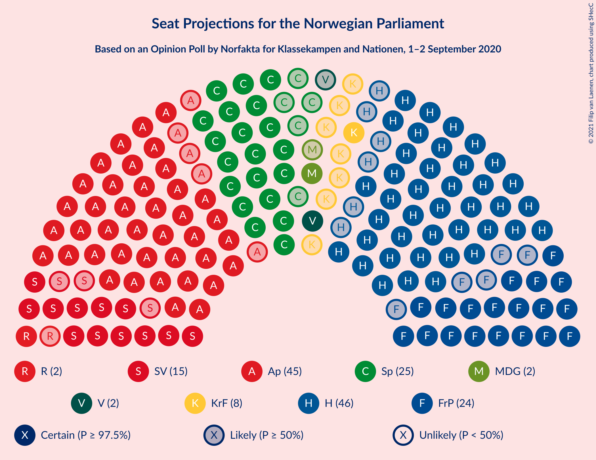
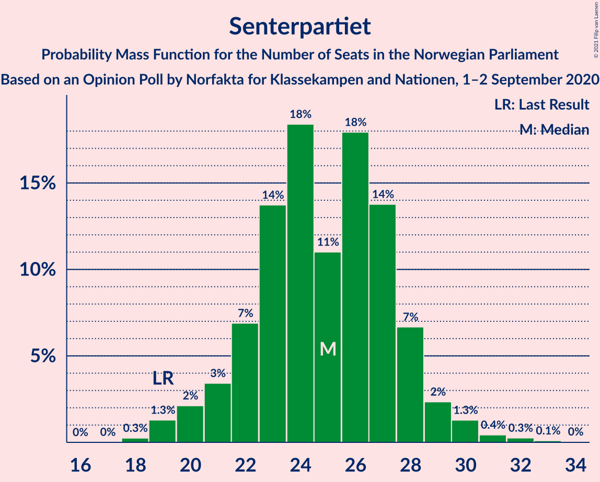
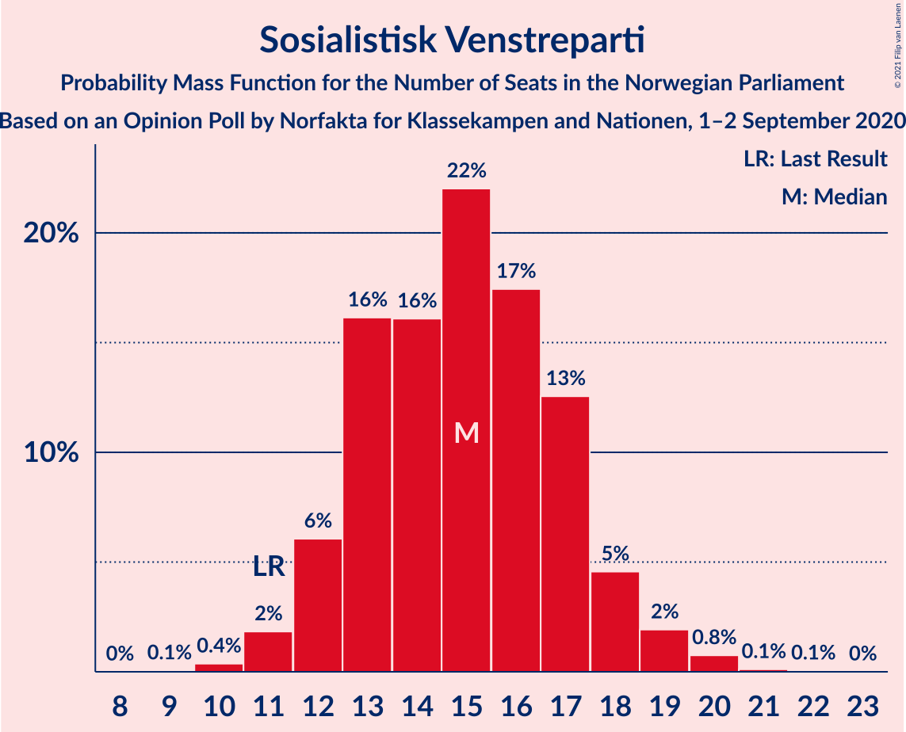
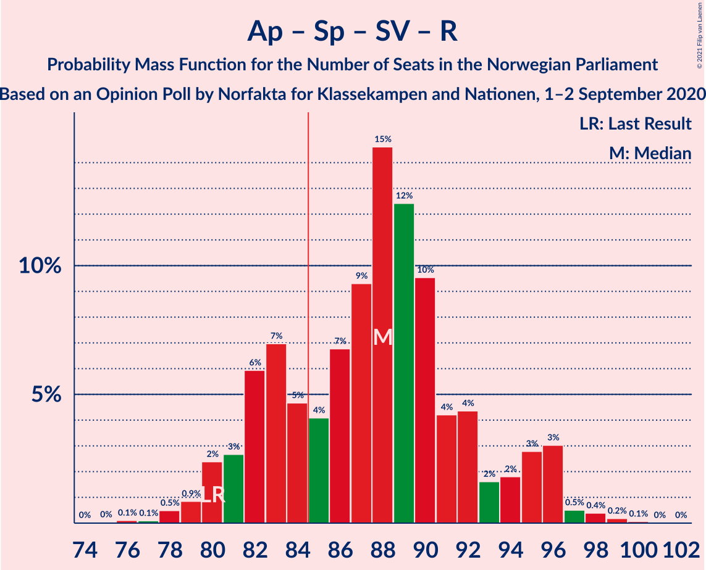
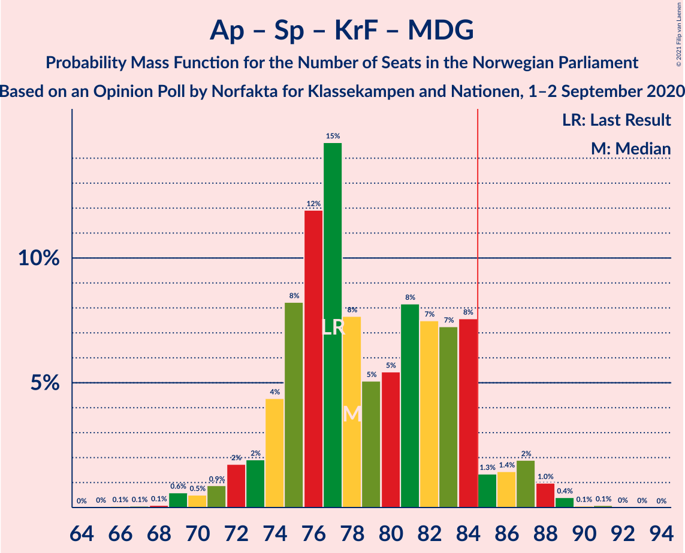
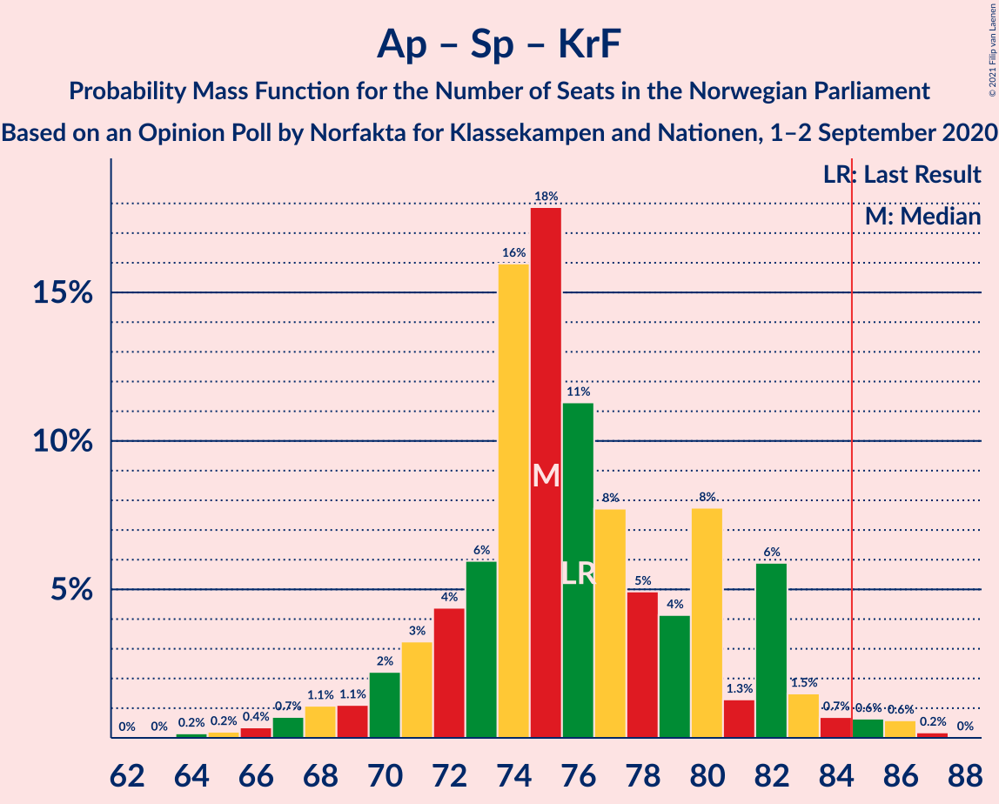
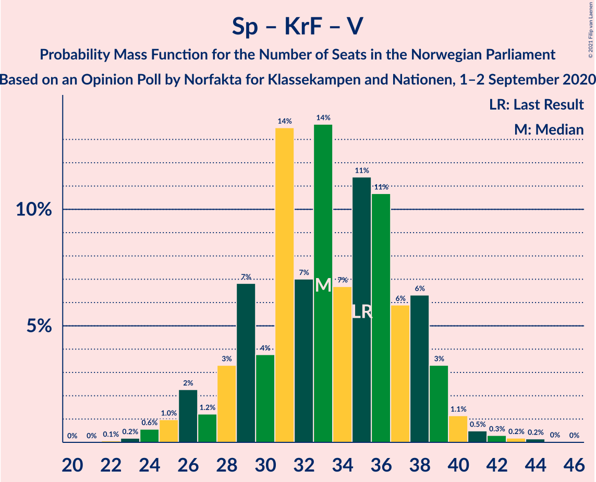

# Opinion Poll by Norfakta for Klassekampen and Nationen, 1–2 September 2020

<a href="#voting-intentions">Voting Intentions</a> | <a href="#seats">Seats</a> | <a href="#coalitions">Coalitions</a> | <a href="#technical-information">Technical Information</a>

## Voting Intentions

### Confidence Intervals

| Party | Last Result | Poll Result | 80% Confidence Interval | 90% Confidence Interval | 95% Confidence Interval | 99% Confidence Interval |
|:-----:|:-----------:|:-----------:|:-----------------------:|:-----------------------:|:-----------------------:|:-----------------------:|
| Høyre | 25.0% | 25.6% | 23.7–27.7% |23.2–28.3% |22.7–28.8% |21.8–29.8% |
| Arbeiderpartiet | 27.4% | 24.7% | 22.8–26.8% |22.3–27.4% |21.8–27.9% |21.0–28.9% |
| Senterpartiet | 10.3% | 13.5% | 12.0–15.2% |11.6–15.6% |11.2–16.0% |10.6–16.9% |
| Fremskrittspartiet | 15.2% | 12.8% | 11.4–14.5% |11.0–15.0% |10.7–15.4% |10.0–16.2% |
| Sosialistisk Venstreparti | 6.0% | 8.1% | 7.0–9.5% |6.6–9.9% |6.4–10.2% |5.9–10.9% |
| Kristelig Folkeparti | 4.2% | 4.1% | 3.3–5.2% |3.1–5.5% |2.9–5.7% |2.6–6.3% |
| Miljøpartiet De Grønne | 3.2% | 3.5% | 2.8–4.5% |2.5–4.7% |2.4–5.0% |2.1–5.5% |
| Rødt | 2.4% | 3.3% | 2.6–4.3% |2.4–4.6% |2.3–4.8% |2.0–5.4% |
| Venstre | 4.4% | 2.9% | 2.3–3.9% |2.1–4.2% |2.0–4.4% |1.7–4.9% |

*Note:* The poll result column reflects the actual value used in the calculations. Published results may vary slightly, and in addition be rounded to fewer digits.

## Seats

### Confidence Intervals

| Party | Last Result | Median | 80% Confidence Interval | 90% Confidence Interval | 95% Confidence Interval | 99% Confidence Interval |
|:-----:|:-----------:|:------:|:-----------------------:|:-----------------------:|:-----------------------:|:-----------------------:|
| <a href="#høyre">Høyre</a> | 45 | 46 | 44–49 |42–51 |41–52 |39–54 |
| <a href="#arbeiderpartiet">Arbeiderpartiet</a> | 49 | 46 | 42–47 |41–51 |40–51 |39–53 |
| <a href="#senterpartiet">Senterpartiet</a> | 19 | 23 | 23–28 |21–29 |20–29 |19–32 |
| <a href="#fremskrittspartiet">Fremskrittspartiet</a> | 27 | 24 | 21–25 |21–26 |20–27 |18–29 |
| <a href="#sosialistisk-venstreparti">Sosialistisk Venstreparti</a> | 11 | 14 | 13–17 |12–18 |12–18 |11–20 |
| <a href="#kristelig-folkeparti">Kristelig Folkeparti</a> | 8 | 8 | 3–9 |2–11 |2–11 |1–11 |
| <a href="#miljøpartiet-de-grønne">Miljøpartiet De Grønne</a> | 1 | 2 | 1–8 |1–8 |1–9 |1–10 |
| <a href="#rødt">Rødt</a> | 1 | 2 | 1–8 |1–8 |1–9 |1–9 |
| <a href="#venstre">Venstre</a> | 8 | 2 | 1–2 |1–2 |1–7 |0–8 |

### Høyre

*For a full overview of the results for this party, see the [Høyre](party-høyre.html) page.*

| Number of Seats | Probability | Accumulated | Special Marks |
|:---------------:|:-----------:|:-----------:|:-------------:|
| 37 | 0.1% | 100% |  |
| 38 | 0.3% | 99.9% |  |
| 39 | 0.6% | 99.6% |  |
| 40 | 1.2% | 99.0% |  |
| 41 | 0.6% | 98% |  |
| 42 | 5% | 97% |  |
| 43 | 0.5% | 92% |  |
| 44 | 4% | 92% |  |
| 45 | 18% | 88% | Last Result |
| 46 | 45% | 70% | Median |
| 47 | 8% | 25% |  |
| 48 | 2% | 17% |  |
| 49 | 8% | 15% |  |
| 50 | 2% | 7% |  |
| 51 | 2% | 5% |  |
| 52 | 2% | 4% |  |
| 53 | 0.4% | 2% |  |
| 54 | 0.8% | 1.3% |  |
| 55 | 0.1% | 0.5% |  |
| 56 | 0.3% | 0.4% |  |
| 57 | 0% | 0% |  |

### Arbeiderpartiet

*For a full overview of the results for this party, see the [Arbeiderpartiet](party-arbeiderpartiet.html) page.*

| Number of Seats | Probability | Accumulated | Special Marks |
|:---------------:|:-----------:|:-----------:|:-------------:|
| 36 | 0.1% | 100% |  |
| 37 | 0.1% | 99.9% |  |
| 38 | 0.3% | 99.9% |  |
| 39 | 0.8% | 99.6% |  |
| 40 | 3% | 98.8% |  |
| 41 | 6% | 96% |  |
| 42 | 3% | 90% |  |
| 43 | 22% | 87% |  |
| 44 | 4% | 65% |  |
| 45 | 3% | 61% |  |
| 46 | 33% | 58% | Median |
| 47 | 16% | 25% |  |
| 48 | 1.5% | 9% |  |
| 49 | 2% | 7% | Last Result |
| 50 | 0.7% | 6% |  |
| 51 | 4% | 5% |  |
| 52 | 0.9% | 1.4% |  |
| 53 | 0.4% | 0.6% |  |
| 54 | 0.1% | 0.2% |  |
| 55 | 0% | 0.1% |  |
| 56 | 0.1% | 0.1% |  |
| 57 | 0% | 0% |  |

### Senterpartiet

*For a full overview of the results for this party, see the [Senterpartiet](party-senterpartiet.html) page.*

| Number of Seats | Probability | Accumulated | Special Marks |
|:---------------:|:-----------:|:-----------:|:-------------:|
| 18 | 0.2% | 100% |  |
| 19 | 1.3% | 99.8% | Last Result |
| 20 | 1.4% | 98% |  |
| 21 | 2% | 97% |  |
| 22 | 5% | 95% |  |
| 23 | 44% | 90% | Median |
| 24 | 6% | 46% |  |
| 25 | 8% | 40% |  |
| 26 | 15% | 32% |  |
| 27 | 4% | 17% |  |
| 28 | 6% | 12% |  |
| 29 | 5% | 6% |  |
| 30 | 0.5% | 1.2% |  |
| 31 | 0.1% | 0.7% |  |
| 32 | 0.5% | 0.6% |  |
| 33 | 0.1% | 0.1% |  |
| 34 | 0% | 0% |  |

### Fremskrittspartiet

*For a full overview of the results for this party, see the [Fremskrittspartiet](party-fremskrittspartiet.html) page.*

| Number of Seats | Probability | Accumulated | Special Marks |
|:---------------:|:-----------:|:-----------:|:-------------:|
| 17 | 0.1% | 100% |  |
| 18 | 0.9% | 99.8% |  |
| 19 | 0.9% | 99.0% |  |
| 20 | 2% | 98% |  |
| 21 | 13% | 96% |  |
| 22 | 18% | 83% |  |
| 23 | 8% | 65% |  |
| 24 | 31% | 57% | Median |
| 25 | 20% | 26% |  |
| 26 | 3% | 6% |  |
| 27 | 2% | 4% | Last Result |
| 28 | 1.0% | 2% |  |
| 29 | 0.5% | 0.9% |  |
| 30 | 0.2% | 0.4% |  |
| 31 | 0.2% | 0.3% |  |
| 32 | 0% | 0% |  |

### Sosialistisk Venstreparti

*For a full overview of the results for this party, see the [Sosialistisk Venstreparti](party-sosialistiskvenstreparti.html) page.*

| Number of Seats | Probability | Accumulated | Special Marks |
|:---------------:|:-----------:|:-----------:|:-------------:|
| 9 | 0.1% | 100% |  |
| 10 | 0.2% | 99.9% |  |
| 11 | 0.8% | 99.7% | Last Result |
| 12 | 5% | 98.9% |  |
| 13 | 37% | 94% |  |
| 14 | 9% | 57% | Median |
| 15 | 10% | 47% |  |
| 16 | 8% | 37% |  |
| 17 | 24% | 29% |  |
| 18 | 5% | 5% |  |
| 19 | 0.4% | 1.0% |  |
| 20 | 0.3% | 0.5% |  |
| 21 | 0.2% | 0.3% |  |
| 22 | 0.1% | 0.1% |  |
| 23 | 0% | 0% |  |

### Kristelig Folkeparti

*For a full overview of the results for this party, see the [Kristelig Folkeparti](party-kristeligfolkeparti.html) page.*

| Number of Seats | Probability | Accumulated | Special Marks |
|:---------------:|:-----------:|:-----------:|:-------------:|
| 0 | 0.1% | 100% |  |
| 1 | 1.2% | 99.9% |  |
| 2 | 4% | 98.7% |  |
| 3 | 29% | 95% |  |
| 4 | 0% | 66% |  |
| 5 | 0% | 66% |  |
| 6 | 0% | 66% |  |
| 7 | 7% | 66% |  |
| 8 | 43% | 59% | Last Result, Median |
| 9 | 7% | 16% |  |
| 10 | 2% | 9% |  |
| 11 | 7% | 7% |  |
| 12 | 0.1% | 0.1% |  |
| 13 | 0.1% | 0.1% |  |
| 14 | 0% | 0% |  |

### Miljøpartiet De Grønne

*For a full overview of the results for this party, see the [Miljøpartiet De Grønne](party-miljøpartietdegrønne.html) page.*

| Number of Seats | Probability | Accumulated | Special Marks |
|:---------------:|:-----------:|:-----------:|:-------------:|
| 0 | 0.1% | 100% |  |
| 1 | 43% | 99.9% | Last Result |
| 2 | 33% | 57% | Median |
| 3 | 0.9% | 24% |  |
| 4 | 0% | 23% |  |
| 5 | 0% | 23% |  |
| 6 | 0% | 23% |  |
| 7 | 3% | 23% |  |
| 8 | 16% | 20% |  |
| 9 | 3% | 4% |  |
| 10 | 0.4% | 0.6% |  |
| 11 | 0.2% | 0.2% |  |
| 12 | 0% | 0% |  |

### Rødt

*For a full overview of the results for this party, see the [Rødt](party-rødt.html) page.*

| Number of Seats | Probability | Accumulated | Special Marks |
|:---------------:|:-----------:|:-----------:|:-------------:|
| 1 | 12% | 100% | Last Result |
| 2 | 56% | 88% | Median |
| 3 | 0% | 32% |  |
| 4 | 0% | 32% |  |
| 5 | 0% | 32% |  |
| 6 | 0% | 32% |  |
| 7 | 5% | 32% |  |
| 8 | 24% | 27% |  |
| 9 | 3% | 3% |  |
| 10 | 0.1% | 0.2% |  |
| 11 | 0% | 0% |  |

### Venstre

*For a full overview of the results for this party, see the [Venstre](party-venstre.html) page.*

| Number of Seats | Probability | Accumulated | Special Marks |
|:---------------:|:-----------:|:-----------:|:-------------:|
| 0 | 0.9% | 100% |  |
| 1 | 12% | 99.1% |  |
| 2 | 83% | 87% | Median |
| 3 | 0% | 4% |  |
| 4 | 0% | 4% |  |
| 5 | 0% | 4% |  |
| 6 | 0.1% | 4% |  |
| 7 | 2% | 4% |  |
| 8 | 2% | 2% | Last Result |
| 9 | 0.3% | 0.4% |  |
| 10 | 0% | 0% |  |

## Coalitions

### Confidence Intervals

| Coalition | Last Result | Median | Majority? | 80% Confidence Interval | 90% Confidence Interval | 95% Confidence Interval | 99% Confidence Interval |
|:---------:|:-----------:|:------:|:---------:|:-----------------------:|:-----------------------:|:-----------------------:|:-----------------------:|
| Høyre – Senterpartiet – Fremskrittspartiet – Kristelig Folkeparti – Venstre | 107 | 103 | 100% | 99–106 | 97–108 | 95–110 | 93–112 |
| Arbeiderpartiet – Senterpartiet – Sosialistisk Venstreparti – Kristelig Folkeparti – Miljøpartiet De Grønne | 88 | 95 | 98.8% | 89–97 | 88–98 | 87–100 | 83–102 |
| Arbeiderpartiet – Senterpartiet – Sosialistisk Venstreparti – Miljøpartiet De Grønne – Rødt | 81 | 89 | 98% | 87–96 | 86–97 | 85–99 | 81–99 |
| Arbeiderpartiet – Senterpartiet – Sosialistisk Venstreparti – Miljøpartiet De Grønne | 80 | 87 | 68% | 81–94 | 81–95 | 80–96 | 78–97 |
| Arbeiderpartiet – Senterpartiet – Sosialistisk Venstreparti – Rødt | 80 | 88 | 88% | 84–92 | 84–95 | 82–95 | 78–96 |
| Arbeiderpartiet – Senterpartiet – Sosialistisk Venstreparti | 79 | 86 | 57% | 79–89 | 79–93 | 78–94 | 75–94 |
| Høyre – Fremskrittspartiet – Kristelig Folkeparti – Miljøpartiet De Grønne – Venstre | 89 | 81 | 12% | 77–85 | 74–85 | 74–87 | 73–91 |
| Arbeiderpartiet – Senterpartiet – Kristelig Folkeparti – Miljøpartiet De Grønne | 77 | 78 | 3% | 74–84 | 74–84 | 73–85 | 70–88 |
| Høyre – Fremskrittspartiet – Kristelig Folkeparti – Venstre | 88 | 80 | 2% | 73–82 | 72–83 | 70–84 | 70–88 |
| Arbeiderpartiet – Senterpartiet – Kristelig Folkeparti | 76 | 76 | 0.8% | 72–80 | 70–82 | 70–83 | 67–85 |
| Høyre – Fremskrittspartiet – Venstre | 80 | 72 | 0% | 69–75 | 67–77 | 65–79 | 64–81 |
| Arbeiderpartiet – Senterpartiet | 68 | 69 | 0% | 65–74 | 65–76 | 64–78 | 61–78 |
| Høyre – Fremskrittspartiet | 72 | 70 | 0% | 67–72 | 65–74 | 64–76 | 61–79 |
| Arbeiderpartiet – Sosialistisk Venstreparti | 60 | 60 | 0% | 56–63 | 56–65 | 55–67 | 51–69 |
| Høyre – Kristelig Folkeparti – Venstre | 61 | 55 | 0% | 51–59 | 50–59 | 48–61 | 46–64 |
| Senterpartiet – Kristelig Folkeparti – Venstre | 35 | 33 | 0% | 30–36 | 28–38 | 27–39 | 24–42 |

### Høyre – Senterpartiet – Fremskrittspartiet – Kristelig Folkeparti – Venstre

| Number of Seats | Probability | Accumulated | Special Marks |
|:---------------:|:-----------:|:-----------:|:-------------:|
| 88 | 0% | 100% |  |
| 89 | 0% | 99.9% |  |
| 90 | 0.1% | 99.9% |  |
| 91 | 0% | 99.9% |  |
| 92 | 0.2% | 99.9% |  |
| 93 | 0.6% | 99.6% |  |
| 94 | 0.6% | 99.1% |  |
| 95 | 2% | 98% |  |
| 96 | 0.5% | 97% |  |
| 97 | 2% | 96% |  |
| 98 | 1.3% | 95% |  |
| 99 | 17% | 93% |  |
| 100 | 0.5% | 76% |  |
| 101 | 6% | 75% |  |
| 102 | 3% | 69% |  |
| 103 | 45% | 66% | Median |
| 104 | 2% | 21% |  |
| 105 | 4% | 19% |  |
| 106 | 5% | 15% |  |
| 107 | 4% | 9% | Last Result |
| 108 | 2% | 6% |  |
| 109 | 0.8% | 4% |  |
| 110 | 1.0% | 3% |  |
| 111 | 1.3% | 2% |  |
| 112 | 0.4% | 0.6% |  |
| 113 | 0.1% | 0.2% |  |
| 114 | 0.1% | 0.1% |  |
| 115 | 0% | 0% |  |

### Arbeiderpartiet – Senterpartiet – Sosialistisk Venstreparti – Kristelig Folkeparti – Miljøpartiet De Grønne

| Number of Seats | Probability | Accumulated | Special Marks |
|:---------------:|:-----------:|:-----------:|:-------------:|
| 82 | 0% | 100% |  |
| 83 | 0.9% | 99.9% |  |
| 84 | 0.2% | 99.0% |  |
| 85 | 0.1% | 98.8% | Majority |
| 86 | 0.6% | 98.7% |  |
| 87 | 1.4% | 98% |  |
| 88 | 2% | 97% | Last Result |
| 89 | 21% | 95% |  |
| 90 | 3% | 74% |  |
| 91 | 1.2% | 71% |  |
| 92 | 3% | 70% |  |
| 93 | 4% | 67% | Median |
| 94 | 6% | 63% |  |
| 95 | 29% | 57% |  |
| 96 | 2% | 28% |  |
| 97 | 17% | 26% |  |
| 98 | 6% | 9% |  |
| 99 | 0.3% | 3% |  |
| 100 | 0.7% | 3% |  |
| 101 | 0.7% | 2% |  |
| 102 | 0.7% | 1.2% |  |
| 103 | 0.1% | 0.4% |  |
| 104 | 0.1% | 0.3% |  |
| 105 | 0.2% | 0.2% |  |
| 106 | 0% | 0% |  |

### Arbeiderpartiet – Senterpartiet – Sosialistisk Venstreparti – Miljøpartiet De Grønne – Rødt

| Number of Seats | Probability | Accumulated | Special Marks |
|:---------------:|:-----------:|:-----------:|:-------------:|
| 79 | 0.4% | 100% |  |
| 80 | 0% | 99.6% |  |
| 81 | 0.4% | 99.5% | Last Result |
| 82 | 0.3% | 99.2% |  |
| 83 | 0.2% | 98.8% |  |
| 84 | 0.7% | 98.6% |  |
| 85 | 0.5% | 98% | Majority |
| 86 | 6% | 97% |  |
| 87 | 3% | 91% | Median |
| 88 | 3% | 89% |  |
| 89 | 40% | 85% |  |
| 90 | 8% | 45% |  |
| 91 | 3% | 37% |  |
| 92 | 0.8% | 34% |  |
| 93 | 7% | 33% |  |
| 94 | 2% | 26% |  |
| 95 | 3% | 25% |  |
| 96 | 12% | 21% |  |
| 97 | 6% | 9% |  |
| 98 | 0.3% | 3% |  |
| 99 | 2% | 3% |  |
| 100 | 0.2% | 0.4% |  |
| 101 | 0.1% | 0.3% |  |
| 102 | 0.1% | 0.2% |  |
| 103 | 0% | 0.1% |  |
| 104 | 0.1% | 0.1% |  |
| 105 | 0% | 0% |  |

### Arbeiderpartiet – Senterpartiet – Sosialistisk Venstreparti – Miljøpartiet De Grønne

| Number of Seats | Probability | Accumulated | Special Marks |
|:---------------:|:-----------:|:-----------:|:-------------:|
| 74 | 0.1% | 100% |  |
| 75 | 0% | 99.9% |  |
| 76 | 0% | 99.9% |  |
| 77 | 0.3% | 99.9% |  |
| 78 | 0.3% | 99.5% |  |
| 79 | 1.3% | 99.3% |  |
| 80 | 1.1% | 98% | Last Result |
| 81 | 17% | 97% |  |
| 82 | 5% | 79% |  |
| 83 | 0.6% | 75% |  |
| 84 | 6% | 74% |  |
| 85 | 3% | 68% | Median, Majority |
| 86 | 4% | 66% |  |
| 87 | 26% | 62% |  |
| 88 | 6% | 37% |  |
| 89 | 2% | 31% |  |
| 90 | 3% | 29% |  |
| 91 | 3% | 26% |  |
| 92 | 3% | 23% |  |
| 93 | 1.2% | 20% |  |
| 94 | 12% | 18% |  |
| 95 | 2% | 6% |  |
| 96 | 3% | 4% |  |
| 97 | 0.4% | 0.8% |  |
| 98 | 0.2% | 0.4% |  |
| 99 | 0.1% | 0.2% |  |
| 100 | 0% | 0.1% |  |
| 101 | 0% | 0.1% |  |
| 102 | 0.1% | 0.1% |  |
| 103 | 0% | 0% |  |

### Arbeiderpartiet – Senterpartiet – Sosialistisk Venstreparti – Rødt

| Number of Seats | Probability | Accumulated | Special Marks |
|:---------------:|:-----------:|:-----------:|:-------------:|
| 76 | 0.1% | 100% |  |
| 77 | 0.1% | 99.9% |  |
| 78 | 1.0% | 99.8% |  |
| 79 | 0.3% | 98.8% |  |
| 80 | 0.4% | 98.6% | Last Result |
| 81 | 0.6% | 98% |  |
| 82 | 1.2% | 98% |  |
| 83 | 1.3% | 96% |  |
| 84 | 7% | 95% |  |
| 85 | 2% | 88% | Median, Majority |
| 86 | 3% | 86% |  |
| 87 | 20% | 83% |  |
| 88 | 41% | 63% |  |
| 89 | 5% | 22% |  |
| 90 | 1.5% | 17% |  |
| 91 | 3% | 16% |  |
| 92 | 4% | 13% |  |
| 93 | 0.7% | 9% |  |
| 94 | 2% | 8% |  |
| 95 | 6% | 6% |  |
| 96 | 0.3% | 0.7% |  |
| 97 | 0.1% | 0.4% |  |
| 98 | 0.2% | 0.3% |  |
| 99 | 0.1% | 0.1% |  |
| 100 | 0% | 0% |  |

### Arbeiderpartiet – Senterpartiet – Sosialistisk Venstreparti

| Number of Seats | Probability | Accumulated | Special Marks |
|:---------------:|:-----------:|:-----------:|:-------------:|
| 73 | 0.3% | 100% |  |
| 74 | 0% | 99.6% |  |
| 75 | 0.2% | 99.6% |  |
| 76 | 0.7% | 99.4% |  |
| 77 | 0.8% | 98.7% |  |
| 78 | 2% | 98% |  |
| 79 | 17% | 96% | Last Result |
| 80 | 7% | 79% |  |
| 81 | 2% | 72% |  |
| 82 | 7% | 71% |  |
| 83 | 4% | 64% | Median |
| 84 | 2% | 60% |  |
| 85 | 4% | 57% | Majority |
| 86 | 38% | 53% |  |
| 87 | 4% | 16% |  |
| 88 | 1.5% | 12% |  |
| 89 | 0.9% | 10% |  |
| 90 | 3% | 9% |  |
| 91 | 0.2% | 6% |  |
| 92 | 0.3% | 6% |  |
| 93 | 3% | 6% |  |
| 94 | 3% | 3% |  |
| 95 | 0.1% | 0.4% |  |
| 96 | 0.2% | 0.3% |  |
| 97 | 0% | 0.1% |  |
| 98 | 0.1% | 0.1% |  |
| 99 | 0% | 0% |  |

### Høyre – Fremskrittspartiet – Kristelig Folkeparti – Miljøpartiet De Grønne – Venstre

| Number of Seats | Probability | Accumulated | Special Marks |
|:---------------:|:-----------:|:-----------:|:-------------:|
| 70 | 0.1% | 100% |  |
| 71 | 0.2% | 99.9% |  |
| 72 | 0.1% | 99.7% |  |
| 73 | 0.3% | 99.6% |  |
| 74 | 6% | 99.3% |  |
| 75 | 2% | 94% |  |
| 76 | 0.7% | 92% |  |
| 77 | 4% | 91% |  |
| 78 | 3% | 87% |  |
| 79 | 1.5% | 84% |  |
| 80 | 5% | 83% |  |
| 81 | 41% | 78% |  |
| 82 | 20% | 37% | Median |
| 83 | 3% | 17% |  |
| 84 | 2% | 14% |  |
| 85 | 7% | 12% | Majority |
| 86 | 1.3% | 5% |  |
| 87 | 1.2% | 4% |  |
| 88 | 0.6% | 2% |  |
| 89 | 0.4% | 2% | Last Result |
| 90 | 0.3% | 1.4% |  |
| 91 | 1.0% | 1.2% |  |
| 92 | 0.1% | 0.2% |  |
| 93 | 0.1% | 0.1% |  |
| 94 | 0% | 0% |  |

### Arbeiderpartiet – Senterpartiet – Kristelig Folkeparti – Miljøpartiet De Grønne

| Number of Seats | Probability | Accumulated | Special Marks |
|:---------------:|:-----------:|:-----------:|:-------------:|
| 67 | 0% | 100% |  |
| 68 | 0.1% | 99.9% |  |
| 69 | 0.3% | 99.9% |  |
| 70 | 0.2% | 99.6% |  |
| 71 | 1.5% | 99.4% |  |
| 72 | 0.4% | 98% |  |
| 73 | 0.8% | 98% |  |
| 74 | 7% | 97% |  |
| 75 | 1.2% | 90% |  |
| 76 | 19% | 88% |  |
| 77 | 4% | 69% | Last Result |
| 78 | 25% | 65% |  |
| 79 | 0.7% | 41% | Median |
| 80 | 9% | 40% |  |
| 81 | 2% | 30% |  |
| 82 | 9% | 28% |  |
| 83 | 0.8% | 19% |  |
| 84 | 15% | 18% |  |
| 85 | 2% | 3% | Majority |
| 86 | 0.3% | 2% |  |
| 87 | 0.2% | 1.3% |  |
| 88 | 0.7% | 1.1% |  |
| 89 | 0.1% | 0.4% |  |
| 90 | 0.1% | 0.3% |  |
| 91 | 0.2% | 0.2% |  |
| 92 | 0% | 0% |  |

### Høyre – Fremskrittspartiet – Kristelig Folkeparti – Venstre

| Number of Seats | Probability | Accumulated | Special Marks |
|:---------------:|:-----------:|:-----------:|:-------------:|
| 65 | 0.1% | 100% |  |
| 66 | 0% | 99.9% |  |
| 67 | 0.1% | 99.9% |  |
| 68 | 0.1% | 99.8% |  |
| 69 | 0.2% | 99.7% |  |
| 70 | 2% | 99.6% |  |
| 71 | 0.3% | 97% |  |
| 72 | 6% | 97% |  |
| 73 | 12% | 91% |  |
| 74 | 3% | 79% |  |
| 75 | 2% | 75% |  |
| 76 | 7% | 74% |  |
| 77 | 0.8% | 67% |  |
| 78 | 3% | 66% |  |
| 79 | 8% | 63% |  |
| 80 | 40% | 55% | Median |
| 81 | 3% | 15% |  |
| 82 | 3% | 11% |  |
| 83 | 6% | 9% |  |
| 84 | 0.5% | 3% |  |
| 85 | 0.7% | 2% | Majority |
| 86 | 0.2% | 1.4% |  |
| 87 | 0.3% | 1.2% |  |
| 88 | 0.4% | 0.8% | Last Result |
| 89 | 0% | 0.5% |  |
| 90 | 0.4% | 0.4% |  |
| 91 | 0% | 0% |  |

### Arbeiderpartiet – Senterpartiet – Kristelig Folkeparti

| Number of Seats | Probability | Accumulated | Special Marks |
|:---------------:|:-----------:|:-----------:|:-------------:|
| 64 | 0% | 100% |  |
| 65 | 0.3% | 99.9% |  |
| 66 | 0.1% | 99.7% |  |
| 67 | 0.1% | 99.6% |  |
| 68 | 0.5% | 99.4% |  |
| 69 | 1.3% | 98.9% |  |
| 70 | 3% | 98% |  |
| 71 | 3% | 95% |  |
| 72 | 6% | 92% |  |
| 73 | 4% | 86% |  |
| 74 | 17% | 82% |  |
| 75 | 5% | 64% |  |
| 76 | 13% | 60% | Last Result |
| 77 | 24% | 46% | Median |
| 78 | 4% | 22% |  |
| 79 | 3% | 18% |  |
| 80 | 10% | 15% |  |
| 81 | 0.4% | 5% |  |
| 82 | 1.0% | 5% |  |
| 83 | 3% | 4% |  |
| 84 | 0.2% | 1.0% |  |
| 85 | 0.5% | 0.8% | Majority |
| 86 | 0.2% | 0.2% |  |
| 87 | 0% | 0.1% |  |
| 88 | 0% | 0% |  |

### Høyre – Fremskrittspartiet – Venstre

| Number of Seats | Probability | Accumulated | Special Marks |
|:---------------:|:-----------:|:-----------:|:-------------:|
| 59 | 0% | 100% |  |
| 60 | 0% | 99.9% |  |
| 61 | 0% | 99.9% |  |
| 62 | 0.2% | 99.9% |  |
| 63 | 0.1% | 99.7% |  |
| 64 | 0.1% | 99.6% |  |
| 65 | 3% | 99.5% |  |
| 66 | 0.7% | 97% |  |
| 67 | 4% | 96% |  |
| 68 | 2% | 93% |  |
| 69 | 3% | 91% |  |
| 70 | 20% | 87% |  |
| 71 | 3% | 67% |  |
| 72 | 46% | 65% | Median |
| 73 | 7% | 18% |  |
| 74 | 1.0% | 11% |  |
| 75 | 3% | 10% |  |
| 76 | 0.5% | 7% |  |
| 77 | 2% | 7% |  |
| 78 | 2% | 5% |  |
| 79 | 0.5% | 3% |  |
| 80 | 1.4% | 2% | Last Result |
| 81 | 0.6% | 0.9% |  |
| 82 | 0.2% | 0.4% |  |
| 83 | 0.1% | 0.2% |  |
| 84 | 0.1% | 0.2% |  |
| 85 | 0% | 0% | Majority |

### Arbeiderpartiet – Senterpartiet

| Number of Seats | Probability | Accumulated | Special Marks |
|:---------------:|:-----------:|:-----------:|:-------------:|
| 60 | 0.1% | 100% |  |
| 61 | 0.6% | 99.9% |  |
| 62 | 1.1% | 99.2% |  |
| 63 | 0.3% | 98% |  |
| 64 | 2% | 98% |  |
| 65 | 6% | 95% |  |
| 66 | 18% | 90% |  |
| 67 | 3% | 72% |  |
| 68 | 4% | 69% | Last Result |
| 69 | 31% | 65% | Median |
| 70 | 3% | 34% |  |
| 71 | 0.8% | 31% |  |
| 72 | 3% | 30% |  |
| 73 | 12% | 26% |  |
| 74 | 4% | 14% |  |
| 75 | 3% | 10% |  |
| 76 | 3% | 7% |  |
| 77 | 0.4% | 4% |  |
| 78 | 3% | 3% |  |
| 79 | 0.1% | 0.3% |  |
| 80 | 0% | 0.2% |  |
| 81 | 0% | 0.1% |  |
| 82 | 0% | 0.1% |  |
| 83 | 0.1% | 0.1% |  |
| 84 | 0% | 0% |  |

### Høyre – Fremskrittspartiet

| Number of Seats | Probability | Accumulated | Special Marks |
|:---------------:|:-----------:|:-----------:|:-------------:|
| 57 | 0.1% | 100% |  |
| 58 | 0% | 99.9% |  |
| 59 | 0.1% | 99.9% |  |
| 60 | 0.2% | 99.8% |  |
| 61 | 0.1% | 99.6% |  |
| 62 | 0.2% | 99.5% |  |
| 63 | 1.4% | 99.3% |  |
| 64 | 2% | 98% |  |
| 65 | 3% | 96% |  |
| 66 | 2% | 93% |  |
| 67 | 2% | 91% |  |
| 68 | 19% | 89% |  |
| 69 | 6% | 70% |  |
| 70 | 47% | 64% | Median |
| 71 | 6% | 17% |  |
| 72 | 2% | 10% | Last Result |
| 73 | 3% | 8% |  |
| 74 | 0.9% | 5% |  |
| 75 | 1.2% | 4% |  |
| 76 | 2% | 3% |  |
| 77 | 0.1% | 1.1% |  |
| 78 | 0.4% | 1.0% |  |
| 79 | 0.3% | 0.6% |  |
| 80 | 0.1% | 0.3% |  |
| 81 | 0.1% | 0.2% |  |
| 82 | 0.1% | 0.2% |  |
| 83 | 0% | 0% |  |

### Arbeiderpartiet – Sosialistisk Venstreparti

| Number of Seats | Probability | Accumulated | Special Marks |
|:---------------:|:-----------:|:-----------:|:-------------:|
| 50 | 0.2% | 100% |  |
| 51 | 0.4% | 99.8% |  |
| 52 | 0.2% | 99.4% |  |
| 53 | 0.3% | 99.1% |  |
| 54 | 0.7% | 98.8% |  |
| 55 | 2% | 98% |  |
| 56 | 23% | 96% |  |
| 57 | 3% | 73% |  |
| 58 | 7% | 70% |  |
| 59 | 11% | 63% |  |
| 60 | 13% | 52% | Last Result, Median |
| 61 | 5% | 39% |  |
| 62 | 1.2% | 34% |  |
| 63 | 24% | 33% |  |
| 64 | 3% | 9% |  |
| 65 | 0.8% | 6% |  |
| 66 | 0.9% | 5% |  |
| 67 | 3% | 4% |  |
| 68 | 0.2% | 0.7% |  |
| 69 | 0.2% | 0.5% |  |
| 70 | 0.1% | 0.4% |  |
| 71 | 0.3% | 0.3% |  |
| 72 | 0% | 0% |  |

### Høyre – Kristelig Folkeparti – Venstre

| Number of Seats | Probability | Accumulated | Special Marks |
|:---------------:|:-----------:|:-----------:|:-------------:|
| 43 | 0.1% | 100% |  |
| 44 | 0.1% | 99.9% |  |
| 45 | 0.3% | 99.8% |  |
| 46 | 0.3% | 99.5% |  |
| 47 | 2% | 99.3% |  |
| 48 | 0.1% | 98% |  |
| 49 | 1.1% | 97% |  |
| 50 | 2% | 96% |  |
| 51 | 20% | 95% |  |
| 52 | 3% | 75% |  |
| 53 | 4% | 72% |  |
| 54 | 5% | 68% |  |
| 55 | 17% | 63% |  |
| 56 | 27% | 46% | Median |
| 57 | 4% | 19% |  |
| 58 | 4% | 16% |  |
| 59 | 6% | 11% |  |
| 60 | 1.3% | 5% |  |
| 61 | 1.5% | 4% | Last Result |
| 62 | 0.8% | 2% |  |
| 63 | 0.9% | 1.4% |  |
| 64 | 0.1% | 0.5% |  |
| 65 | 0% | 0.4% |  |
| 66 | 0% | 0.3% |  |
| 67 | 0.3% | 0.3% |  |
| 68 | 0% | 0% |  |

### Senterpartiet – Kristelig Folkeparti – Venstre

| Number of Seats | Probability | Accumulated | Special Marks |
|:---------------:|:-----------:|:-----------:|:-------------:|
| 22 | 0.1% | 100% |  |
| 23 | 0.2% | 99.9% |  |
| 24 | 0.2% | 99.7% |  |
| 25 | 0.1% | 99.5% |  |
| 26 | 2% | 99.4% |  |
| 27 | 2% | 98% |  |
| 28 | 1.3% | 96% |  |
| 29 | 1.0% | 95% |  |
| 30 | 6% | 94% |  |
| 31 | 15% | 87% |  |
| 32 | 2% | 72% |  |
| 33 | 46% | 70% | Median |
| 34 | 4% | 24% |  |
| 35 | 6% | 20% | Last Result |
| 36 | 6% | 14% |  |
| 37 | 2% | 8% |  |
| 38 | 4% | 6% |  |
| 39 | 0.9% | 3% |  |
| 40 | 0.7% | 2% |  |
| 41 | 0.2% | 1.0% |  |
| 42 | 0.6% | 0.8% |  |
| 43 | 0.1% | 0.2% |  |
| 44 | 0% | 0.1% |  |
| 45 | 0% | 0.1% |  |
| 46 | 0.1% | 0.1% |  |
| 47 | 0% | 0% |  |

## Technical Information

### Opinion Poll

+ **Polling firm:** Norfakta
+ **Commissioner(s):** Klassekampen and Nationen
+ **Fieldwork period:** 1–2 September 2020

### Calculations

+ **Sample size:** 780
+ **Simulations done:** 131,072
+ **Error estimate:** 1.60%

