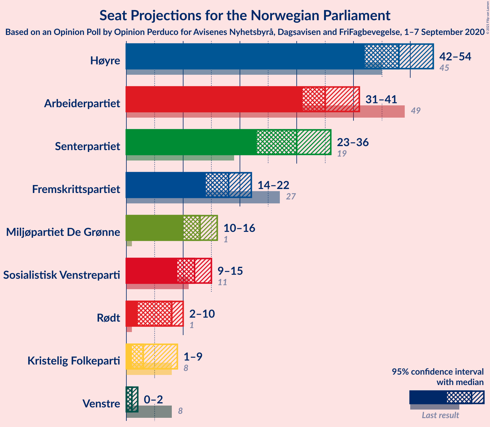
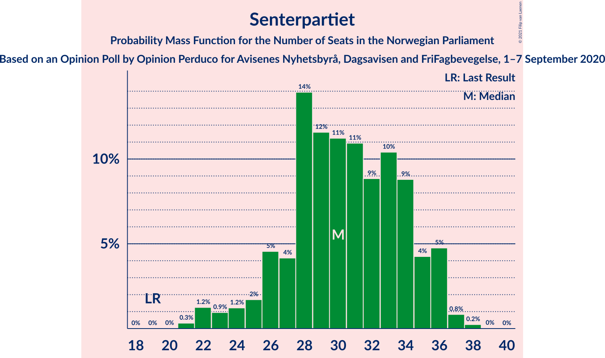
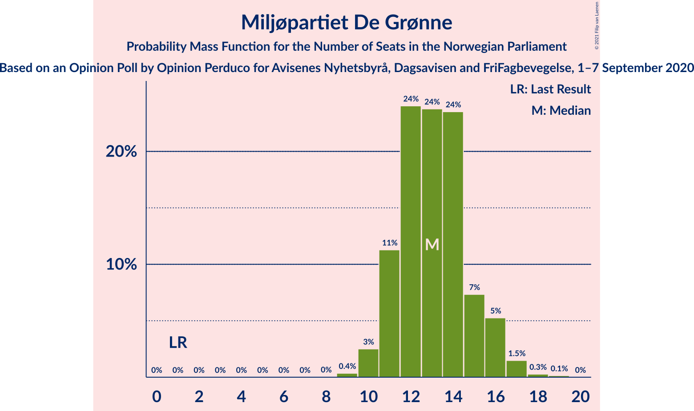
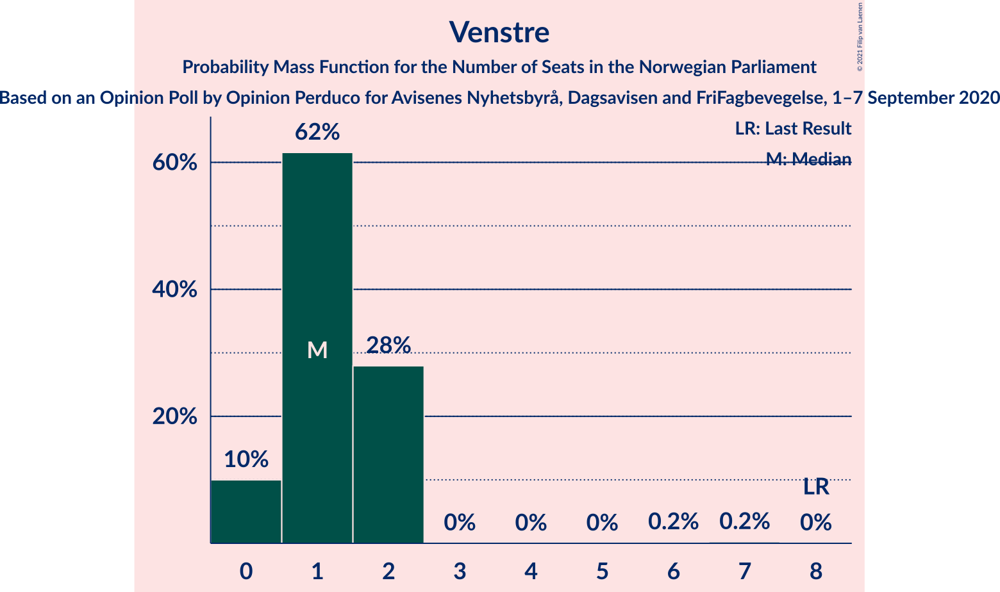
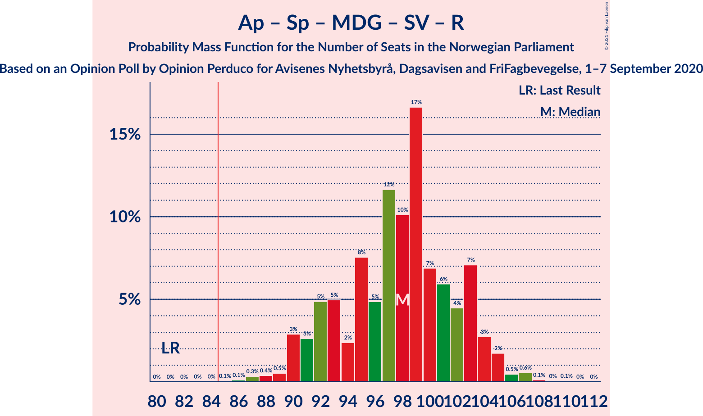
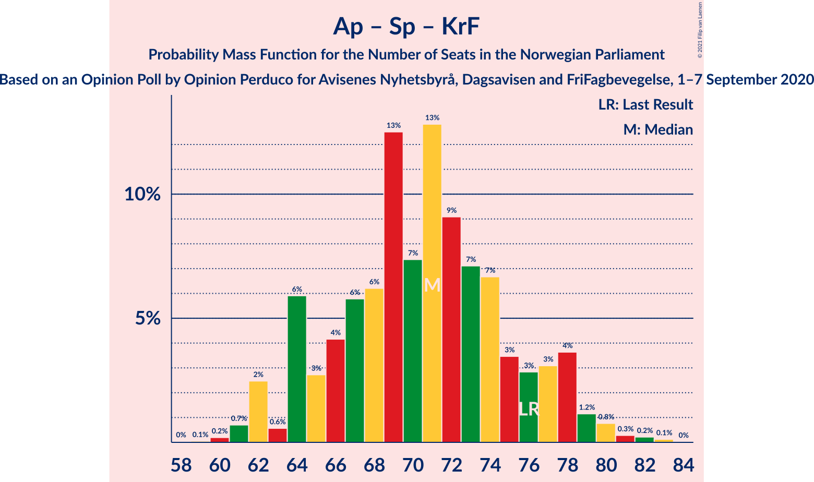

# Opinion Poll by Opinion Perduco for Avisenes Nyhetsbyrå, Dagsavisen and FriFagbevegelse, 1–7 September 2020

<a href="#voting-intentions">Voting Intentions</a> | <a href="#seats">Seats</a> | <a href="#coalitions">Coalitions</a> | <a href="#technical-information">Technical Information</a>

## Voting Intentions

### Confidence Intervals

| Party | Last Result | Poll Result | 80% Confidence Interval | 90% Confidence Interval | 95% Confidence Interval | 99% Confidence Interval |
|:-----:|:-----------:|:-----------:|:-----------------------:|:-----------------------:|:-----------------------:|:-----------------------:|
| Høyre | 25.0% | 27.0% | 25.2–28.9% |24.7–29.4% |24.3–29.9% |23.4–30.8% |
| Arbeiderpartiet | 27.4% | 19.9% | 18.3–21.6% |17.9–22.1% |17.5–22.5% |16.8–23.4% |
| Senterpartiet | 10.3% | 16.0% | 14.6–17.6% |14.2–18.0% |13.8–18.4% |13.2–19.2% |
| Fremskrittspartiet | 15.2% | 10.3% | 9.1–11.6% |8.8–12.0% |8.5–12.3% |8.0–13.0% |
| Miljøpartiet De Grønne | 3.2% | 7.5% | 6.5–8.7% |6.2–9.0% |6.0–9.3% |5.5–9.9% |
| Sosialistisk Venstreparti | 6.0% | 6.9% | 5.9–8.0% |5.7–8.4% |5.4–8.6% |5.0–9.2% |
| Rødt | 2.4% | 4.4% | 3.7–5.4% |3.5–5.7% |3.3–5.9% |3.0–6.4% |
| Kristelig Folkeparti | 4.2% | 3.9% | 3.2–4.8% |3.0–5.1% |2.9–5.3% |2.5–5.8% |
| Venstre | 4.4% | 2.5% | 1.9–3.2% |1.8–3.4% |1.7–3.6% |1.4–4.1% |

*Note:* The poll result column reflects the actual value used in the calculations. Published results may vary slightly, and in addition be rounded to fewer digits.

## Seats

### Confidence Intervals

| Party | Last Result | Median | 80% Confidence Interval | 90% Confidence Interval | 95% Confidence Interval | 99% Confidence Interval |
|:-----:|:-----------:|:------:|:-----------------------:|:-----------------------:|:-----------------------:|:-----------------------:|
| <a href="#høyre">Høyre</a> | 45 | 45 | 45–51 |45–52 |44–52 |41–54 |
| <a href="#arbeiderpartiet">Arbeiderpartiet</a> | 49 | 35 | 33–35 |32–37 |31–40 |31–41 |
| <a href="#senterpartiet">Senterpartiet</a> | 19 | 34 | 28–34 |27–34 |26–34 |26–34 |
| <a href="#fremskrittspartiet">Fremskrittspartiet</a> | 27 | 20 | 17–21 |17–23 |15–23 |14–23 |
| <a href="#miljøpartiet-de-grønne">Miljøpartiet De Grønne</a> | 1 | 13 | 13–16 |12–16 |12–17 |10–17 |
| <a href="#sosialistisk-venstreparti">Sosialistisk Venstreparti</a> | 11 | 12 | 11–12 |10–13 |10–14 |9–17 |
| <a href="#rødt">Rødt</a> | 1 | 7 | 2–7 |2–9 |2–10 |2–12 |
| <a href="#kristelig-folkeparti">Kristelig Folkeparti</a> | 8 | 3 | 2–7 |1–8 |1–9 |1–10 |
| <a href="#venstre">Venstre</a> | 8 | 0 | 0–1 |0–2 |0–2 |0–2 |

### Høyre

*For a full overview of the results for this party, see the [Høyre](party-høyre.html) page.*

| Number of Seats | Probability | Accumulated | Special Marks |
|:---------------:|:-----------:|:-----------:|:-------------:|
| 37 | 0.1% | 100% |  |
| 38 | 0% | 99.9% |  |
| 39 | 0% | 99.8% |  |
| 40 | 0.1% | 99.8% |  |
| 41 | 2% | 99.7% |  |
| 42 | 0.3% | 98% |  |
| 43 | 0.1% | 98% |  |
| 44 | 2% | 98% |  |
| 45 | 73% | 96% | Last Result, Median |
| 46 | 0.4% | 23% |  |
| 47 | 1.2% | 22% |  |
| 48 | 0.4% | 21% |  |
| 49 | 8% | 21% |  |
| 50 | 2% | 13% |  |
| 51 | 4% | 11% |  |
| 52 | 5% | 7% |  |
| 53 | 0.2% | 2% |  |
| 54 | 1.3% | 2% |  |
| 55 | 0.1% | 0.3% |  |
| 56 | 0.2% | 0.2% |  |
| 57 | 0% | 0% |  |

### Arbeiderpartiet

*For a full overview of the results for this party, see the [Arbeiderpartiet](party-arbeiderpartiet.html) page.*

| Number of Seats | Probability | Accumulated | Special Marks |
|:---------------:|:-----------:|:-----------:|:-------------:|
| 29 | 0.1% | 100% |  |
| 30 | 0.1% | 99.9% |  |
| 31 | 3% | 99.8% |  |
| 32 | 2% | 96% |  |
| 33 | 7% | 95% |  |
| 34 | 1.2% | 88% |  |
| 35 | 77% | 87% | Median |
| 36 | 4% | 9% |  |
| 37 | 1.1% | 5% |  |
| 38 | 0.6% | 4% |  |
| 39 | 0.2% | 4% |  |
| 40 | 2% | 4% |  |
| 41 | 1.1% | 1.5% |  |
| 42 | 0.3% | 0.4% |  |
| 43 | 0% | 0.1% |  |
| 44 | 0% | 0% |  |
| 45 | 0% | 0% |  |
| 46 | 0% | 0% |  |
| 47 | 0% | 0% |  |
| 48 | 0% | 0% |  |
| 49 | 0% | 0% | Last Result |

### Senterpartiet

*For a full overview of the results for this party, see the [Senterpartiet](party-senterpartiet.html) page.*

| Number of Seats | Probability | Accumulated | Special Marks |
|:---------------:|:-----------:|:-----------:|:-------------:|
| 19 | 0% | 100% | Last Result |
| 20 | 0% | 100% |  |
| 21 | 0.1% | 100% |  |
| 22 | 0.1% | 99.9% |  |
| 23 | 0.1% | 99.8% |  |
| 24 | 0.1% | 99.7% |  |
| 25 | 0.1% | 99.7% |  |
| 26 | 4% | 99.6% |  |
| 27 | 5% | 95% |  |
| 28 | 2% | 90% |  |
| 29 | 3% | 88% |  |
| 30 | 0.1% | 85% |  |
| 31 | 0.8% | 85% |  |
| 32 | 1.1% | 84% |  |
| 33 | 1.2% | 83% |  |
| 34 | 81% | 82% | Median |
| 35 | 0.3% | 0.5% |  |
| 36 | 0% | 0.2% |  |
| 37 | 0% | 0.1% |  |
| 38 | 0.1% | 0.1% |  |
| 39 | 0% | 0% |  |

### Fremskrittspartiet

*For a full overview of the results for this party, see the [Fremskrittspartiet](party-fremskrittspartiet.html) page.*

| Number of Seats | Probability | Accumulated | Special Marks |
|:---------------:|:-----------:|:-----------:|:-------------:|
| 12 | 0.1% | 100% |  |
| 13 | 0.2% | 99.9% |  |
| 14 | 1.0% | 99.6% |  |
| 15 | 2% | 98.7% |  |
| 16 | 1.4% | 97% |  |
| 17 | 5% | 95% |  |
| 18 | 10% | 90% |  |
| 19 | 0.9% | 80% |  |
| 20 | 67% | 79% | Median |
| 21 | 3% | 12% |  |
| 22 | 0.3% | 9% |  |
| 23 | 8% | 9% |  |
| 24 | 0% | 0.4% |  |
| 25 | 0.4% | 0.4% |  |
| 26 | 0% | 0% |  |
| 27 | 0% | 0% | Last Result |

### Miljøpartiet De Grønne

*For a full overview of the results for this party, see the [Miljøpartiet De Grønne](party-miljøpartietdegrønne.html) page.*

| Number of Seats | Probability | Accumulated | Special Marks |
|:---------------:|:-----------:|:-----------:|:-------------:|
| 1 | 0% | 100% | Last Result |
| 2 | 0% | 100% |  |
| 3 | 0% | 100% |  |
| 4 | 0% | 100% |  |
| 5 | 0% | 100% |  |
| 6 | 0% | 100% |  |
| 7 | 0% | 100% |  |
| 8 | 0.1% | 100% |  |
| 9 | 0.2% | 99.9% |  |
| 10 | 0.2% | 99.7% |  |
| 11 | 0.6% | 99.5% |  |
| 12 | 8% | 98.9% |  |
| 13 | 70% | 91% | Median |
| 14 | 10% | 22% |  |
| 15 | 2% | 12% |  |
| 16 | 8% | 10% |  |
| 17 | 3% | 3% |  |
| 18 | 0.1% | 0.2% |  |
| 19 | 0% | 0% |  |

### Sosialistisk Venstreparti

*For a full overview of the results for this party, see the [Sosialistisk Venstreparti](party-sosialistiskvenstreparti.html) page.*

| Number of Seats | Probability | Accumulated | Special Marks |
|:---------------:|:-----------:|:-----------:|:-------------:|
| 8 | 0.3% | 100% |  |
| 9 | 1.2% | 99.7% |  |
| 10 | 7% | 98% |  |
| 11 | 7% | 91% | Last Result |
| 12 | 78% | 85% | Median |
| 13 | 3% | 6% |  |
| 14 | 3% | 4% |  |
| 15 | 0% | 0.7% |  |
| 16 | 0.1% | 0.7% |  |
| 17 | 0.6% | 0.6% |  |
| 18 | 0% | 0% |  |

### Rødt

*For a full overview of the results for this party, see the [Rødt](party-rødt.html) page.*

| Number of Seats | Probability | Accumulated | Special Marks |
|:---------------:|:-----------:|:-----------:|:-------------:|
| 1 | 0% | 100% | Last Result |
| 2 | 19% | 100% |  |
| 3 | 0% | 81% |  |
| 4 | 0% | 81% |  |
| 5 | 0% | 81% |  |
| 6 | 0% | 81% |  |
| 7 | 74% | 81% | Median |
| 8 | 0.7% | 7% |  |
| 9 | 2% | 6% |  |
| 10 | 1.4% | 4% |  |
| 11 | 2% | 2% |  |
| 12 | 0.6% | 0.6% |  |
| 13 | 0% | 0% |  |

### Kristelig Folkeparti

*For a full overview of the results for this party, see the [Kristelig Folkeparti](party-kristeligfolkeparti.html) page.*

| Number of Seats | Probability | Accumulated | Special Marks |
|:---------------:|:-----------:|:-----------:|:-------------:|
| 0 | 0.5% | 100% |  |
| 1 | 9% | 99.5% |  |
| 2 | 3% | 90% |  |
| 3 | 71% | 87% | Median |
| 4 | 0% | 16% |  |
| 5 | 0% | 16% |  |
| 6 | 0.1% | 16% |  |
| 7 | 7% | 16% |  |
| 8 | 4% | 8% | Last Result |
| 9 | 4% | 4% |  |
| 10 | 0.5% | 0.6% |  |
| 11 | 0.1% | 0.1% |  |
| 12 | 0% | 0% |  |

### Venstre

*For a full overview of the results for this party, see the [Venstre](party-venstre.html) page.*

| Number of Seats | Probability | Accumulated | Special Marks |
|:---------------:|:-----------:|:-----------:|:-------------:|
| 0 | 77% | 100% | Median |
| 1 | 15% | 23% |  |
| 2 | 9% | 9% |  |
| 3 | 0% | 0.2% |  |
| 4 | 0% | 0.2% |  |
| 5 | 0% | 0.2% |  |
| 6 | 0% | 0.2% |  |
| 7 | 0.1% | 0.2% |  |
| 8 | 0.1% | 0.1% | Last Result |
| 9 | 0% | 0% |  |

## Coalitions

### Confidence Intervals

| Coalition | Last Result | Median | Majority? | 80% Confidence Interval | 90% Confidence Interval | 95% Confidence Interval | 99% Confidence Interval |
|:---------:|:-----------:|:------:|:---------:|:-----------------------:|:-----------------------:|:-----------------------:|:-----------------------:|
| Høyre – Senterpartiet – Fremskrittspartiet – Kristelig Folkeparti – Venstre | 107 | 102 | 100% | 102–106 | 99–108 | 96–108 | 94–110 |
| Arbeiderpartiet – Senterpartiet – Miljøpartiet De Grønne – Sosialistisk Venstreparti – Rødt | 81 | 101 | 100% | 95–101 | 89–101 | 89–104 | 86–105 |
| Arbeiderpartiet – Senterpartiet – Miljøpartiet De Grønne – Sosialistisk Venstreparti – Kristelig Folkeparti | 88 | 97 | 100% | 94–99 | 92–99 | 91–99 | 89–104 |
| Arbeiderpartiet – Senterpartiet – Miljøpartiet De Grønne – Sosialistisk Venstreparti | 80 | 94 | 98.6% | 89–94 | 87–95 | 87–97 | 84–99 |
| Høyre – Fremskrittspartiet – Miljøpartiet De Grønne – Kristelig Folkeparti – Venstre | 89 | 81 | 21% | 81–89 | 81–95 | 79–96 | 76–96 |
| Arbeiderpartiet – Senterpartiet – Sosialistisk Venstreparti – Rødt | 80 | 88 | 79% | 80–88 | 74–88 | 73–90 | 73–93 |
| Arbeiderpartiet – Senterpartiet – Miljøpartiet De Grønne – Kristelig Folkeparti | 77 | 85 | 85% | 82–88 | 80–88 | 79–88 | 76–92 |
| Arbeiderpartiet – Senterpartiet – Sosialistisk Venstreparti | 79 | 81 | 0.5% | 73–81 | 71–81 | 71–83 | 70–84 |
| Høyre – Fremskrittspartiet – Kristelig Folkeparti – Venstre | 88 | 68 | 0% | 68–74 | 68–80 | 65–80 | 64–83 |
| Arbeiderpartiet – Senterpartiet – Kristelig Folkeparti | 76 | 72 | 0% | 68–72 | 67–76 | 63–76 | 62–80 |
| Høyre – Fremskrittspartiet – Venstre | 80 | 65 | 0% | 64–72 | 63–73 | 63–73 | 61–75 |
| Høyre – Fremskrittspartiet | 72 | 65 | 0% | 63–70 | 63–72 | 62–72 | 60–74 |
| Arbeiderpartiet – Senterpartiet | 68 | 69 | 0% | 63–69 | 61–69 | 59–69 | 58–74 |
| Høyre – Kristelig Folkeparti – Venstre | 61 | 48 | 0% | 48–57 | 48–61 | 47–62 | 44–62 |
| Arbeiderpartiet – Sosialistisk Venstreparti | 60 | 47 | 0% | 45–47 | 44–49 | 43–54 | 43–55 |
| Senterpartiet – Kristelig Folkeparti – Venstre | 35 | 37 | 0% | 36–37 | 32–41 | 32–41 | 29–43 |

### Høyre – Senterpartiet – Fremskrittspartiet – Kristelig Folkeparti – Venstre

| Number of Seats | Probability | Accumulated | Special Marks |
|:---------------:|:-----------:|:-----------:|:-------------:|
| 89 | 0.1% | 100% |  |
| 90 | 0% | 99.9% |  |
| 91 | 0% | 99.9% |  |
| 92 | 0% | 99.9% |  |
| 93 | 0% | 99.9% |  |
| 94 | 2% | 99.9% |  |
| 95 | 0.4% | 98% |  |
| 96 | 0.6% | 98% |  |
| 97 | 0.4% | 97% |  |
| 98 | 0.8% | 97% |  |
| 99 | 2% | 96% |  |
| 100 | 2% | 94% |  |
| 101 | 0.5% | 92% |  |
| 102 | 67% | 92% | Median |
| 103 | 3% | 24% |  |
| 104 | 6% | 22% |  |
| 105 | 3% | 16% |  |
| 106 | 4% | 13% |  |
| 107 | 0.1% | 9% | Last Result |
| 108 | 7% | 8% |  |
| 109 | 0% | 2% |  |
| 110 | 2% | 2% |  |
| 111 | 0.1% | 0.1% |  |
| 112 | 0% | 0% |  |

### Arbeiderpartiet – Senterpartiet – Miljøpartiet De Grønne – Sosialistisk Venstreparti – Rødt

| Number of Seats | Probability | Accumulated | Special Marks |
|:---------------:|:-----------:|:-----------:|:-------------:|
| 81 | 0% | 100% | Last Result |
| 82 | 0% | 100% |  |
| 83 | 0% | 100% |  |
| 84 | 0% | 100% |  |
| 85 | 0% | 100% | Majority |
| 86 | 1.0% | 100% |  |
| 87 | 0.3% | 99.0% |  |
| 88 | 0.4% | 98.7% |  |
| 89 | 4% | 98% |  |
| 90 | 0.2% | 94% |  |
| 91 | 3% | 94% |  |
| 92 | 0.2% | 92% |  |
| 93 | 0.1% | 91% |  |
| 94 | 0.1% | 91% |  |
| 95 | 7% | 91% |  |
| 96 | 0.3% | 84% |  |
| 97 | 3% | 84% |  |
| 98 | 2% | 81% |  |
| 99 | 7% | 79% |  |
| 100 | 0.7% | 72% |  |
| 101 | 68% | 72% | Median |
| 102 | 0.9% | 4% |  |
| 103 | 0% | 3% |  |
| 104 | 2% | 3% |  |
| 105 | 0.3% | 0.7% |  |
| 106 | 0.2% | 0.4% |  |
| 107 | 0.1% | 0.1% |  |
| 108 | 0.1% | 0.1% |  |
| 109 | 0% | 0% |  |

### Arbeiderpartiet – Senterpartiet – Miljøpartiet De Grønne – Sosialistisk Venstreparti – Kristelig Folkeparti

| Number of Seats | Probability | Accumulated | Special Marks |
|:---------------:|:-----------:|:-----------:|:-------------:|
| 88 | 0.4% | 100% | Last Result |
| 89 | 0.3% | 99.6% |  |
| 90 | 0.3% | 99.3% |  |
| 91 | 2% | 98.9% |  |
| 92 | 2% | 97% |  |
| 93 | 2% | 95% |  |
| 94 | 7% | 93% |  |
| 95 | 4% | 86% |  |
| 96 | 1.2% | 82% |  |
| 97 | 68% | 81% | Median |
| 98 | 4% | 14% |  |
| 99 | 8% | 10% |  |
| 100 | 0.6% | 2% |  |
| 101 | 0.3% | 1.2% |  |
| 102 | 0.1% | 0.9% |  |
| 103 | 0% | 0.8% |  |
| 104 | 0.2% | 0.7% |  |
| 105 | 0.2% | 0.5% |  |
| 106 | 0.3% | 0.3% |  |
| 107 | 0% | 0% |  |

### Arbeiderpartiet – Senterpartiet – Miljøpartiet De Grønne – Sosialistisk Venstreparti

| Number of Seats | Probability | Accumulated | Special Marks |
|:---------------:|:-----------:|:-----------:|:-------------:|
| 80 | 0% | 100% | Last Result |
| 81 | 0.1% | 100% |  |
| 82 | 0.1% | 99.9% |  |
| 83 | 0.1% | 99.7% |  |
| 84 | 1.0% | 99.7% |  |
| 85 | 0.5% | 98.6% | Majority |
| 86 | 0.4% | 98% |  |
| 87 | 4% | 98% |  |
| 88 | 2% | 94% |  |
| 89 | 3% | 92% |  |
| 90 | 2% | 89% |  |
| 91 | 0.2% | 86% |  |
| 92 | 6% | 86% |  |
| 93 | 7% | 80% |  |
| 94 | 67% | 73% | Median |
| 95 | 1.2% | 6% |  |
| 96 | 2% | 5% |  |
| 97 | 2% | 3% |  |
| 98 | 0.7% | 1.2% |  |
| 99 | 0.3% | 0.5% |  |
| 100 | 0% | 0.2% |  |
| 101 | 0.1% | 0.2% |  |
| 102 | 0.1% | 0.1% |  |
| 103 | 0% | 0% |  |

### Høyre – Fremskrittspartiet – Miljøpartiet De Grønne – Kristelig Folkeparti – Venstre

| Number of Seats | Probability | Accumulated | Special Marks |
|:---------------:|:-----------:|:-----------:|:-------------:|
| 75 | 0.1% | 100% |  |
| 76 | 0.4% | 99.9% |  |
| 77 | 0% | 99.5% |  |
| 78 | 0.6% | 99.5% |  |
| 79 | 1.5% | 98.9% |  |
| 80 | 2% | 97% |  |
| 81 | 67% | 95% | Median |
| 82 | 6% | 29% |  |
| 83 | 0.2% | 22% |  |
| 84 | 0.4% | 22% |  |
| 85 | 2% | 21% | Majority |
| 86 | 1.0% | 20% |  |
| 87 | 1.5% | 19% |  |
| 88 | 7% | 17% |  |
| 89 | 2% | 11% | Last Result |
| 90 | 0.2% | 9% |  |
| 91 | 0.1% | 8% |  |
| 92 | 0.1% | 8% |  |
| 93 | 0.2% | 8% |  |
| 94 | 2% | 8% |  |
| 95 | 0.6% | 6% |  |
| 96 | 5% | 5% |  |
| 97 | 0.2% | 0.3% |  |
| 98 | 0.1% | 0.1% |  |
| 99 | 0% | 0% |  |

### Arbeiderpartiet – Senterpartiet – Sosialistisk Venstreparti – Rødt

| Number of Seats | Probability | Accumulated | Special Marks |
|:---------------:|:-----------:|:-----------:|:-------------:|
| 71 | 0.1% | 100% |  |
| 72 | 0.2% | 99.9% |  |
| 73 | 5% | 99.7% |  |
| 74 | 0.6% | 95% |  |
| 75 | 2% | 94% |  |
| 76 | 0.2% | 92% |  |
| 77 | 0.1% | 92% |  |
| 78 | 0.1% | 92% |  |
| 79 | 0.2% | 92% |  |
| 80 | 2% | 91% | Last Result |
| 81 | 7% | 89% |  |
| 82 | 1.5% | 83% |  |
| 83 | 1.0% | 81% |  |
| 84 | 2% | 80% |  |
| 85 | 0.4% | 79% | Majority |
| 86 | 0.2% | 78% |  |
| 87 | 6% | 78% |  |
| 88 | 67% | 71% | Median |
| 89 | 2% | 5% |  |
| 90 | 1.5% | 3% |  |
| 91 | 0.6% | 1.1% |  |
| 92 | 0% | 0.5% |  |
| 93 | 0.4% | 0.5% |  |
| 94 | 0.1% | 0.1% |  |
| 95 | 0% | 0% |  |

### Arbeiderpartiet – Senterpartiet – Miljøpartiet De Grønne – Kristelig Folkeparti

| Number of Seats | Probability | Accumulated | Special Marks |
|:---------------:|:-----------:|:-----------:|:-------------:|
| 75 | 0.3% | 100% |  |
| 76 | 0.2% | 99.7% |  |
| 77 | 0.3% | 99.5% | Last Result |
| 78 | 0.1% | 99.2% |  |
| 79 | 3% | 99.1% |  |
| 80 | 3% | 96% |  |
| 81 | 0.4% | 93% |  |
| 82 | 7% | 93% |  |
| 83 | 0.2% | 86% |  |
| 84 | 1.1% | 86% |  |
| 85 | 73% | 85% | Median, Majority |
| 86 | 0.3% | 12% |  |
| 87 | 0.5% | 11% |  |
| 88 | 9% | 11% |  |
| 89 | 0.1% | 1.5% |  |
| 90 | 0.5% | 1.4% |  |
| 91 | 0.3% | 0.9% |  |
| 92 | 0.2% | 0.6% |  |
| 93 | 0.1% | 0.4% |  |
| 94 | 0% | 0.3% |  |
| 95 | 0% | 0.2% |  |
| 96 | 0% | 0.2% |  |
| 97 | 0% | 0.2% |  |
| 98 | 0.2% | 0.2% |  |
| 99 | 0% | 0% |  |

### Arbeiderpartiet – Senterpartiet – Sosialistisk Venstreparti

| Number of Seats | Probability | Accumulated | Special Marks |
|:---------------:|:-----------:|:-----------:|:-------------:|
| 67 | 0.1% | 100% |  |
| 68 | 0.1% | 99.9% |  |
| 69 | 0.1% | 99.8% |  |
| 70 | 0.3% | 99.6% |  |
| 71 | 7% | 99.3% |  |
| 72 | 0.7% | 93% |  |
| 73 | 3% | 92% |  |
| 74 | 0.2% | 90% |  |
| 75 | 0.3% | 89% |  |
| 76 | 0.4% | 89% |  |
| 77 | 0.7% | 89% |  |
| 78 | 2% | 88% |  |
| 79 | 7% | 86% | Last Result |
| 80 | 8% | 79% |  |
| 81 | 67% | 71% | Median |
| 82 | 2% | 4% |  |
| 83 | 2% | 3% |  |
| 84 | 0.3% | 0.8% |  |
| 85 | 0.2% | 0.5% | Majority |
| 86 | 0.2% | 0.3% |  |
| 87 | 0.1% | 0.2% |  |
| 88 | 0% | 0.1% |  |
| 89 | 0% | 0% |  |

### Høyre – Fremskrittspartiet – Kristelig Folkeparti – Venstre

| Number of Seats | Probability | Accumulated | Special Marks |
|:---------------:|:-----------:|:-----------:|:-------------:|
| 61 | 0.1% | 100% |  |
| 62 | 0.1% | 99.9% |  |
| 63 | 0.2% | 99.9% |  |
| 64 | 0.3% | 99.6% |  |
| 65 | 2% | 99.3% |  |
| 66 | 0% | 97% |  |
| 67 | 0.9% | 97% |  |
| 68 | 68% | 96% | Median |
| 69 | 0.7% | 28% |  |
| 70 | 7% | 28% |  |
| 71 | 2% | 21% |  |
| 72 | 3% | 19% |  |
| 73 | 0.3% | 16% |  |
| 74 | 7% | 16% |  |
| 75 | 0.1% | 9% |  |
| 76 | 0.1% | 9% |  |
| 77 | 0.2% | 9% |  |
| 78 | 3% | 8% |  |
| 79 | 0.2% | 6% |  |
| 80 | 4% | 6% |  |
| 81 | 0.4% | 2% |  |
| 82 | 0.3% | 1.3% |  |
| 83 | 1.0% | 1.0% |  |
| 84 | 0% | 0% |  |
| 85 | 0% | 0% | Majority |
| 86 | 0% | 0% |  |
| 87 | 0% | 0% |  |
| 88 | 0% | 0% | Last Result |

### Arbeiderpartiet – Senterpartiet – Kristelig Folkeparti

| Number of Seats | Probability | Accumulated | Special Marks |
|:---------------:|:-----------:|:-----------:|:-------------:|
| 59 | 0.1% | 100% |  |
| 60 | 0% | 99.9% |  |
| 61 | 0% | 99.9% |  |
| 62 | 2% | 99.8% |  |
| 63 | 0.2% | 98% |  |
| 64 | 0.4% | 97% |  |
| 65 | 0.4% | 97% |  |
| 66 | 0.1% | 97% |  |
| 67 | 2% | 96% |  |
| 68 | 8% | 94% |  |
| 69 | 5% | 86% |  |
| 70 | 0.4% | 81% |  |
| 71 | 3% | 81% |  |
| 72 | 69% | 78% | Median |
| 73 | 1.4% | 9% |  |
| 74 | 0.3% | 8% |  |
| 75 | 0.4% | 7% |  |
| 76 | 6% | 7% | Last Result |
| 77 | 0.2% | 1.0% |  |
| 78 | 0.1% | 0.8% |  |
| 79 | 0.1% | 0.7% |  |
| 80 | 0.3% | 0.6% |  |
| 81 | 0.1% | 0.3% |  |
| 82 | 0.3% | 0.3% |  |
| 83 | 0% | 0% |  |

### Høyre – Fremskrittspartiet – Venstre

| Number of Seats | Probability | Accumulated | Special Marks |
|:---------------:|:-----------:|:-----------:|:-------------:|
| 57 | 0.2% | 100% |  |
| 58 | 0.1% | 99.8% |  |
| 59 | 0.1% | 99.8% |  |
| 60 | 0.1% | 99.7% |  |
| 61 | 0.4% | 99.6% |  |
| 62 | 0.9% | 99.2% |  |
| 63 | 8% | 98% |  |
| 64 | 0.9% | 90% |  |
| 65 | 66% | 90% | Median |
| 66 | 2% | 23% |  |
| 67 | 1.0% | 22% |  |
| 68 | 1.1% | 21% |  |
| 69 | 5% | 20% |  |
| 70 | 1.0% | 14% |  |
| 71 | 1.1% | 13% |  |
| 72 | 4% | 12% |  |
| 73 | 7% | 8% |  |
| 74 | 0.9% | 1.5% |  |
| 75 | 0.1% | 0.5% |  |
| 76 | 0% | 0.4% |  |
| 77 | 0% | 0.4% |  |
| 78 | 0.2% | 0.4% |  |
| 79 | 0.3% | 0.3% |  |
| 80 | 0% | 0% | Last Result |

### Høyre – Fremskrittspartiet

| Number of Seats | Probability | Accumulated | Special Marks |
|:---------------:|:-----------:|:-----------:|:-------------:|
| 56 | 0.2% | 100% |  |
| 57 | 0.1% | 99.8% |  |
| 58 | 0.1% | 99.7% |  |
| 59 | 0.1% | 99.7% |  |
| 60 | 0.5% | 99.6% |  |
| 61 | 0.8% | 99.1% |  |
| 62 | 2% | 98% |  |
| 63 | 6% | 96% |  |
| 64 | 0.7% | 90% |  |
| 65 | 68% | 89% | Median |
| 66 | 0.9% | 22% |  |
| 67 | 3% | 21% |  |
| 68 | 3% | 17% |  |
| 69 | 0.5% | 14% |  |
| 70 | 5% | 14% |  |
| 71 | 0.4% | 9% |  |
| 72 | 7% | 8% | Last Result |
| 73 | 0.1% | 1.4% |  |
| 74 | 0.9% | 1.3% |  |
| 75 | 0% | 0.4% |  |
| 76 | 0.2% | 0.4% |  |
| 77 | 0% | 0.3% |  |
| 78 | 0% | 0.3% |  |
| 79 | 0.3% | 0.3% |  |
| 80 | 0% | 0% |  |

### Arbeiderpartiet – Senterpartiet

| Number of Seats | Probability | Accumulated | Special Marks |
|:---------------:|:-----------:|:-----------:|:-------------:|
| 57 | 0.1% | 100% |  |
| 58 | 1.2% | 99.9% |  |
| 59 | 2% | 98.7% |  |
| 60 | 0.3% | 96% |  |
| 61 | 4% | 96% |  |
| 62 | 0.2% | 92% |  |
| 63 | 3% | 92% |  |
| 64 | 1.2% | 89% |  |
| 65 | 0.7% | 88% |  |
| 66 | 2% | 87% |  |
| 67 | 7% | 85% |  |
| 68 | 2% | 78% | Last Result |
| 69 | 74% | 76% | Median |
| 70 | 0.7% | 2% |  |
| 71 | 0% | 2% |  |
| 72 | 0.7% | 2% |  |
| 73 | 0.2% | 0.8% |  |
| 74 | 0.3% | 0.7% |  |
| 75 | 0.3% | 0.4% |  |
| 76 | 0.1% | 0.1% |  |
| 77 | 0% | 0% |  |

### Høyre – Kristelig Folkeparti – Venstre

| Number of Seats | Probability | Accumulated | Special Marks |
|:---------------:|:-----------:|:-----------:|:-------------:|
| 42 | 0.1% | 100% |  |
| 43 | 0.2% | 99.9% |  |
| 44 | 1.5% | 99.7% |  |
| 45 | 0.2% | 98% |  |
| 46 | 0% | 98% |  |
| 47 | 1.5% | 98% |  |
| 48 | 67% | 97% | Median |
| 49 | 0.1% | 30% |  |
| 50 | 1.0% | 30% |  |
| 51 | 7% | 29% |  |
| 52 | 7% | 21% |  |
| 53 | 0.4% | 15% |  |
| 54 | 0% | 14% |  |
| 55 | 4% | 14% |  |
| 56 | 0.3% | 10% |  |
| 57 | 1.2% | 10% |  |
| 58 | 1.0% | 9% |  |
| 59 | 0.2% | 8% |  |
| 60 | 1.2% | 8% |  |
| 61 | 3% | 6% | Last Result |
| 62 | 4% | 4% |  |
| 63 | 0% | 0.1% |  |
| 64 | 0% | 0.1% |  |
| 65 | 0% | 0% |  |

### Arbeiderpartiet – Sosialistisk Venstreparti

| Number of Seats | Probability | Accumulated | Special Marks |
|:---------------:|:-----------:|:-----------:|:-------------:|
| 41 | 0.1% | 100% |  |
| 42 | 0.3% | 99.9% |  |
| 43 | 3% | 99.6% |  |
| 44 | 3% | 97% |  |
| 45 | 11% | 94% |  |
| 46 | 9% | 83% |  |
| 47 | 68% | 74% | Median |
| 48 | 2% | 7% |  |
| 49 | 0.8% | 5% |  |
| 50 | 0.3% | 4% |  |
| 51 | 0.2% | 4% |  |
| 52 | 0.2% | 4% |  |
| 53 | 0.2% | 4% |  |
| 54 | 2% | 3% |  |
| 55 | 1.1% | 1.2% |  |
| 56 | 0% | 0.1% |  |
| 57 | 0.1% | 0.1% |  |
| 58 | 0% | 0% |  |
| 59 | 0% | 0% |  |
| 60 | 0% | 0% | Last Result |

### Senterpartiet – Kristelig Folkeparti – Venstre

| Number of Seats | Probability | Accumulated | Special Marks |
|:---------------:|:-----------:|:-----------:|:-------------:|
| 28 | 0.3% | 100% |  |
| 29 | 0.2% | 99.7% |  |
| 30 | 1.0% | 99.5% |  |
| 31 | 0.4% | 98% |  |
| 32 | 3% | 98% |  |
| 33 | 3% | 95% |  |
| 34 | 0.1% | 92% |  |
| 35 | 0.4% | 92% | Last Result |
| 36 | 12% | 91% |  |
| 37 | 70% | 79% | Median |
| 38 | 0.7% | 9% |  |
| 39 | 0.3% | 8% |  |
| 40 | 0.2% | 8% |  |
| 41 | 7% | 8% |  |
| 42 | 0.3% | 0.8% |  |
| 43 | 0.3% | 0.5% |  |
| 44 | 0.1% | 0.2% |  |
| 45 | 0.1% | 0.1% |  |
| 46 | 0% | 0.1% |  |
| 47 | 0% | 0% |  |

## Technical Information

### Opinion Poll

+ **Polling firm:** Opinion Perduco
+ **Commissioner(s):** Avisenes Nyhetsbyrå, Dagsavisen and FriFagbevegelse
+ **Fieldwork period:** 1–7 September 2020

### Calculations

+ **Sample size:** 975
+ **Simulations done:** 16,384
+ **Error estimate:** 3.17%

