# Opinion Poll by Opinion Perduco for Avisenes Nyhetsbyrå, Dagsavisen and FriFagbevegelse, 1–7 September 2020

<a href="#voting-intentions">Voting Intentions</a> | <a href="#seats">Seats</a> | <a href="#coalitions">Coalitions</a> | <a href="#technical-information">Technical Information</a>

## Voting Intentions

### Confidence Intervals

| Party | Last Result | Poll Result | 80% Confidence Interval | 90% Confidence Interval | 95% Confidence Interval | 99% Confidence Interval |
|:-----:|:-----------:|:-----------:|:-----------------------:|:-----------------------:|:-----------------------:|:-----------------------:|
| Høyre | 25.0% | 27.0% | 25.2–28.9% |24.7–29.4% |24.3–29.9% |23.4–30.8% |
| Arbeiderpartiet | 27.4% | 19.9% | 18.3–21.6% |17.9–22.1% |17.5–22.5% |16.8–23.4% |
| Senterpartiet | 10.3% | 16.0% | 14.6–17.6% |14.2–18.0% |13.8–18.4% |13.2–19.2% |
| Fremskrittspartiet | 15.2% | 10.3% | 9.1–11.6% |8.8–12.0% |8.5–12.3% |8.0–13.0% |
| Miljøpartiet De Grønne | 3.2% | 7.5% | 6.5–8.7% |6.2–9.0% |6.0–9.3% |5.5–9.9% |
| Sosialistisk Venstreparti | 6.0% | 6.9% | 5.9–8.0% |5.7–8.4% |5.4–8.6% |5.0–9.2% |
| Rødt | 2.4% | 4.4% | 3.7–5.4% |3.5–5.7% |3.3–5.9% |3.0–6.4% |
| Kristelig Folkeparti | 4.2% | 3.9% | 3.2–4.8% |3.0–5.1% |2.9–5.3% |2.5–5.8% |
| Venstre | 4.4% | 2.5% | 1.9–3.2% |1.8–3.4% |1.7–3.6% |1.4–4.1% |

*Note:* The poll result column reflects the actual value used in the calculations. Published results may vary slightly, and in addition be rounded to fewer digits.

## Seats

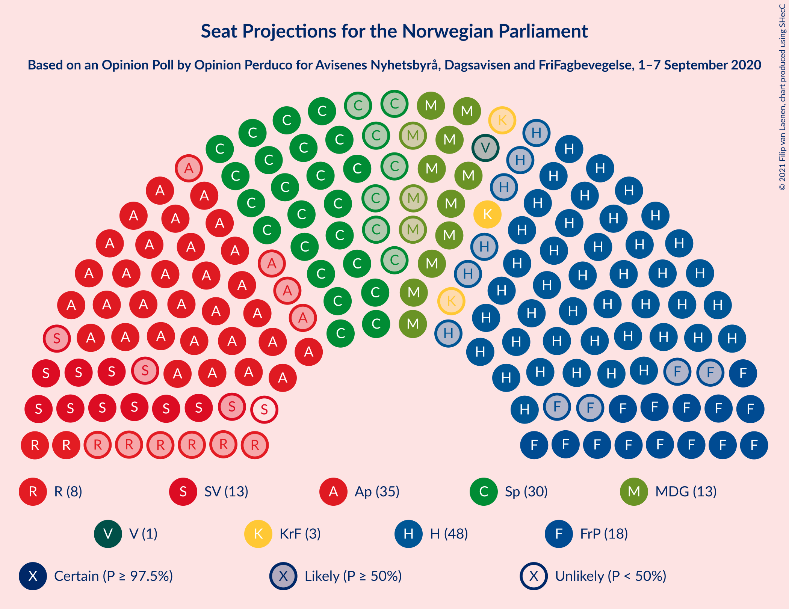

### Confidence Intervals

| Party | Last Result | Median | 80% Confidence Interval | 90% Confidence Interval | 95% Confidence Interval | 99% Confidence Interval |
|:-----:|:-----------:|:------:|:-----------------------:|:-----------------------:|:-----------------------:|:-----------------------:|
| <a href="#høyre">Høyre</a> | 45 | 48 | 44–52 |42–52 |41–54 |40–57 |
| <a href="#arbeiderpartiet">Arbeiderpartiet</a> | 49 | 35 | 33–39 |32–40 |31–40 |30–41 |
| <a href="#senterpartiet">Senterpartiet</a> | 19 | 30 | 28–34 |24–34 |22–34 |21–35 |
| <a href="#fremskrittspartiet">Fremskrittspartiet</a> | 27 | 18 | 16–21 |14–21 |14–22 |13–24 |
| <a href="#miljøpartiet-de-grønne">Miljøpartiet De Grønne</a> | 1 | 14 | 12–14 |11–15 |11–16 |11–17 |
| <a href="#sosialistisk-venstreparti">Sosialistisk Venstreparti</a> | 11 | 12 | 10–14 |9–14 |9–14 |9–15 |
| <a href="#rødt">Rødt</a> | 1 | 8 | 7–8 |7–9 |2–9 |2–11 |
| <a href="#kristelig-folkeparti">Kristelig Folkeparti</a> | 8 | 3 | 1–8 |1–8 |1–8 |1–10 |
| <a href="#venstre">Venstre</a> | 8 | 1 | 1–2 |0–2 |0–2 |0–2 |

### Høyre

*For a full overview of the results for this party, see the [Høyre](party-høyre.html) page.*

| Number of Seats | Probability | Accumulated | Special Marks |
|:---------------:|:-----------:|:-----------:|:-------------:|
| 39 | 0% | 100% |  |
| 40 | 0.5% | 99.9% |  |
| 41 | 3% | 99.5% |  |
| 42 | 1.1% | 96% |  |
| 43 | 2% | 95% |  |
| 44 | 21% | 93% |  |
| 45 | 7% | 71% | Last Result |
| 46 | 3% | 64% |  |
| 47 | 2% | 61% |  |
| 48 | 25% | 58% | Median |
| 49 | 2% | 34% |  |
| 50 | 20% | 32% |  |
| 51 | 1.2% | 12% |  |
| 52 | 7% | 10% |  |
| 53 | 0.5% | 3% |  |
| 54 | 0.7% | 3% |  |
| 55 | 0.6% | 2% |  |
| 56 | 0.1% | 1.4% |  |
| 57 | 1.2% | 1.3% |  |
| 58 | 0.1% | 0.1% |  |
| 59 | 0% | 0% |  |

### Arbeiderpartiet

*For a full overview of the results for this party, see the [Arbeiderpartiet](party-arbeiderpartiet.html) page.*

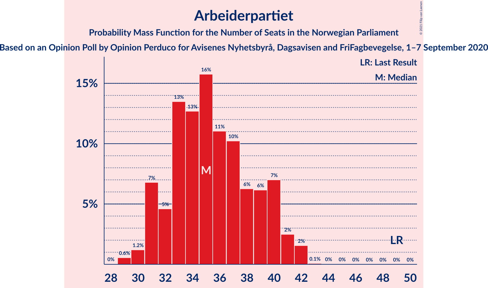

| Number of Seats | Probability | Accumulated | Special Marks |
|:---------------:|:-----------:|:-----------:|:-------------:|
| 29 | 0.2% | 100% |  |
| 30 | 0.4% | 99.8% |  |
| 31 | 4% | 99.4% |  |
| 32 | 4% | 96% |  |
| 33 | 17% | 92% |  |
| 34 | 12% | 74% |  |
| 35 | 18% | 62% | Median |
| 36 | 5% | 44% |  |
| 37 | 15% | 40% |  |
| 38 | 11% | 24% |  |
| 39 | 3% | 13% |  |
| 40 | 8% | 10% |  |
| 41 | 1.1% | 1.5% |  |
| 42 | 0.2% | 0.3% |  |
| 43 | 0% | 0.1% |  |
| 44 | 0% | 0% |  |
| 45 | 0% | 0% |  |
| 46 | 0% | 0% |  |
| 47 | 0% | 0% |  |
| 48 | 0% | 0% |  |
| 49 | 0% | 0% | Last Result |

### Senterpartiet

*For a full overview of the results for this party, see the [Senterpartiet](party-senterpartiet.html) page.*

| Number of Seats | Probability | Accumulated | Special Marks |
|:---------------:|:-----------:|:-----------:|:-------------:|
| 19 | 0% | 100% | Last Result |
| 20 | 0% | 100% |  |
| 21 | 1.1% | 100% |  |
| 22 | 3% | 98.9% |  |
| 23 | 0.5% | 96% |  |
| 24 | 1.4% | 96% |  |
| 25 | 0.8% | 94% |  |
| 26 | 1.5% | 94% |  |
| 27 | 0.9% | 92% |  |
| 28 | 23% | 91% |  |
| 29 | 18% | 69% |  |
| 30 | 4% | 51% | Median |
| 31 | 19% | 47% |  |
| 32 | 5% | 28% |  |
| 33 | 11% | 22% |  |
| 34 | 9% | 11% |  |
| 35 | 2% | 2% |  |
| 36 | 0.1% | 0.3% |  |
| 37 | 0.1% | 0.2% |  |
| 38 | 0.1% | 0.1% |  |
| 39 | 0% | 0% |  |

### Fremskrittspartiet

*For a full overview of the results for this party, see the [Fremskrittspartiet](party-fremskrittspartiet.html) page.*

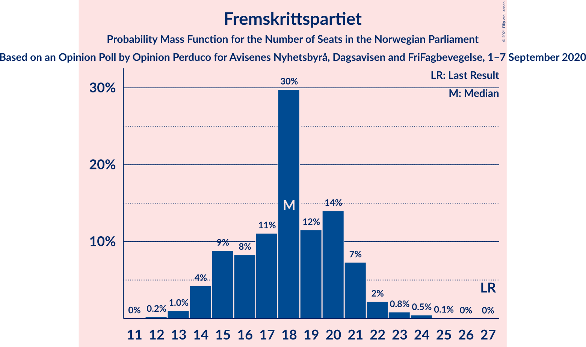

| Number of Seats | Probability | Accumulated | Special Marks |
|:---------------:|:-----------:|:-----------:|:-------------:|
| 12 | 0.2% | 100% |  |
| 13 | 0.4% | 99.8% |  |
| 14 | 6% | 99.4% |  |
| 15 | 3% | 93% |  |
| 16 | 8% | 91% |  |
| 17 | 15% | 82% |  |
| 18 | 21% | 67% | Median |
| 19 | 12% | 46% |  |
| 20 | 24% | 35% |  |
| 21 | 6% | 10% |  |
| 22 | 2% | 4% |  |
| 23 | 1.2% | 2% |  |
| 24 | 0.8% | 0.8% |  |
| 25 | 0.1% | 0.1% |  |
| 26 | 0% | 0% |  |
| 27 | 0% | 0% | Last Result |

### Miljøpartiet De Grønne

*For a full overview of the results for this party, see the [Miljøpartiet De Grønne](party-miljøpartietdegrønne.html) page.*

| Number of Seats | Probability | Accumulated | Special Marks |
|:---------------:|:-----------:|:-----------:|:-------------:|
| 1 | 0% | 100% | Last Result |
| 2 | 0% | 100% |  |
| 3 | 0% | 100% |  |
| 4 | 0% | 100% |  |
| 5 | 0% | 100% |  |
| 6 | 0% | 100% |  |
| 7 | 0% | 100% |  |
| 8 | 0% | 100% |  |
| 9 | 0.1% | 100% |  |
| 10 | 0.4% | 99.9% |  |
| 11 | 6% | 99.5% |  |
| 12 | 25% | 93% |  |
| 13 | 16% | 68% |  |
| 14 | 45% | 52% | Median |
| 15 | 4% | 7% |  |
| 16 | 1.4% | 3% |  |
| 17 | 1.5% | 2% |  |
| 18 | 0.2% | 0.2% |  |
| 19 | 0% | 0% |  |

### Sosialistisk Venstreparti

*For a full overview of the results for this party, see the [Sosialistisk Venstreparti](party-sosialistiskvenstreparti.html) page.*

| Number of Seats | Probability | Accumulated | Special Marks |
|:---------------:|:-----------:|:-----------:|:-------------:|
| 8 | 0.3% | 100% |  |
| 9 | 6% | 99.7% |  |
| 10 | 22% | 94% |  |
| 11 | 15% | 72% | Last Result |
| 12 | 21% | 57% | Median |
| 13 | 15% | 36% |  |
| 14 | 21% | 22% |  |
| 15 | 0.6% | 0.9% |  |
| 16 | 0.1% | 0.3% |  |
| 17 | 0.2% | 0.2% |  |
| 18 | 0% | 0% |  |

### Rødt

*For a full overview of the results for this party, see the [Rødt](party-rødt.html) page.*

| Number of Seats | Probability | Accumulated | Special Marks |
|:---------------:|:-----------:|:-----------:|:-------------:|
| 1 | 0.2% | 100% | Last Result |
| 2 | 3% | 99.8% |  |
| 3 | 0% | 96% |  |
| 4 | 0% | 96% |  |
| 5 | 0% | 96% |  |
| 6 | 0% | 96% |  |
| 7 | 25% | 96% |  |
| 8 | 63% | 71% | Median |
| 9 | 6% | 8% |  |
| 10 | 0.8% | 2% |  |
| 11 | 1.1% | 1.3% |  |
| 12 | 0.1% | 0.1% |  |
| 13 | 0% | 0% |  |

### Kristelig Folkeparti

*For a full overview of the results for this party, see the [Kristelig Folkeparti](party-kristeligfolkeparti.html) page.*

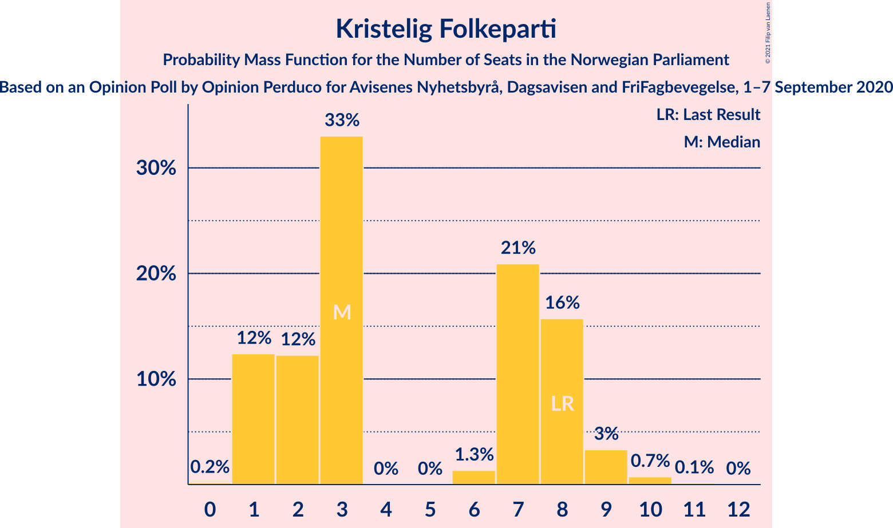

| Number of Seats | Probability | Accumulated | Special Marks |
|:---------------:|:-----------:|:-----------:|:-------------:|
| 0 | 0.1% | 100% |  |
| 1 | 18% | 99.9% |  |
| 2 | 2% | 81% |  |
| 3 | 47% | 79% | Median |
| 4 | 0% | 32% |  |
| 5 | 0% | 32% |  |
| 6 | 5% | 32% |  |
| 7 | 8% | 28% |  |
| 8 | 18% | 20% | Last Result |
| 9 | 1.0% | 2% |  |
| 10 | 0.6% | 0.7% |  |
| 11 | 0.1% | 0.1% |  |
| 12 | 0% | 0% |  |

### Venstre

*For a full overview of the results for this party, see the [Venstre](party-venstre.html) page.*

| Number of Seats | Probability | Accumulated | Special Marks |
|:---------------:|:-----------:|:-----------:|:-------------:|
| 0 | 7% | 100% |  |
| 1 | 82% | 93% | Median |
| 2 | 11% | 11% |  |
| 3 | 0% | 0% |  |
| 4 | 0% | 0% |  |
| 5 | 0% | 0% |  |
| 6 | 0% | 0% |  |
| 7 | 0% | 0% |  |
| 8 | 0% | 0% | Last Result |

## Coalitions

### Confidence Intervals

| Coalition | Last Result | Median | Majority? | 80% Confidence Interval | 90% Confidence Interval | 95% Confidence Interval | 99% Confidence Interval |
|:---------:|:-----------:|:------:|:---------:|:-----------------------:|:-----------------------:|:-----------------------:|:-----------------------:|
| Høyre – Senterpartiet – Fremskrittspartiet – Kristelig Folkeparti – Venstre | 107 | 100 | 100% | 99–103 | 98–106 | 97–106 | 94–108 |
| Arbeiderpartiet – Senterpartiet – Miljøpartiet De Grønne – Sosialistisk Venstreparti – Rødt | 81 | 98 | 100% | 93–102 | 91–103 | 91–105 | 87–107 |
| Arbeiderpartiet – Senterpartiet – Miljøpartiet De Grønne – Sosialistisk Venstreparti – Kristelig Folkeparti | 88 | 94 | 99.9% | 91–99 | 90–100 | 89–101 | 87–104 |
| Arbeiderpartiet – Senterpartiet – Miljøpartiet De Grønne – Sosialistisk Venstreparti | 80 | 90 | 94% | 86–94 | 84–96 | 84–97 | 80–98 |
| Arbeiderpartiet – Senterpartiet – Sosialistisk Venstreparti – Rødt | 80 | 85 | 60% | 80–88 | 79–90 | 77–92 | 74–93 |
| Høyre – Fremskrittspartiet – Miljøpartiet De Grønne – Kristelig Folkeparti – Venstre | 89 | 84 | 40% | 81–89 | 79–90 | 77–92 | 76–95 |
| Arbeiderpartiet – Senterpartiet – Miljøpartiet De Grønne – Kristelig Folkeparti | 77 | 83 | 39% | 78–88 | 78–90 | 76–90 | 76–94 |
| Arbeiderpartiet – Senterpartiet – Sosialistisk Venstreparti | 79 | 77 | 0.8% | 73–81 | 72–82 | 71–84 | 68–85 |
| Høyre – Fremskrittspartiet – Kristelig Folkeparti – Venstre | 88 | 71 | 0% | 67–76 | 66–78 | 64–78 | 62–82 |
| Arbeiderpartiet – Senterpartiet – Kristelig Folkeparti | 76 | 70 | 0% | 64–75 | 64–78 | 62–78 | 62–81 |
| Høyre – Fremskrittspartiet – Venstre | 80 | 67 | 0% | 63–71 | 62–71 | 60–73 | 58–75 |
| Arbeiderpartiet – Senterpartiet | 68 | 66 | 0% | 61–69 | 60–72 | 59–72 | 57–74 |
| Høyre – Fremskrittspartiet | 72 | 66 | 0% | 62–70 | 61–70 | 59–72 | 57–74 |
| Høyre – Kristelig Folkeparti – Venstre | 61 | 52 | 0% | 48–57 | 47–59 | 46–61 | 45–65 |
| Arbeiderpartiet – Sosialistisk Venstreparti | 60 | 47 | 0% | 46–49 | 44–51 | 43–51 | 42–54 |
| Senterpartiet – Kristelig Folkeparti – Venstre | 35 | 33 | 0% | 31–40 | 31–40 | 29–42 | 28–43 |

### Høyre – Senterpartiet – Fremskrittspartiet – Kristelig Folkeparti – Venstre

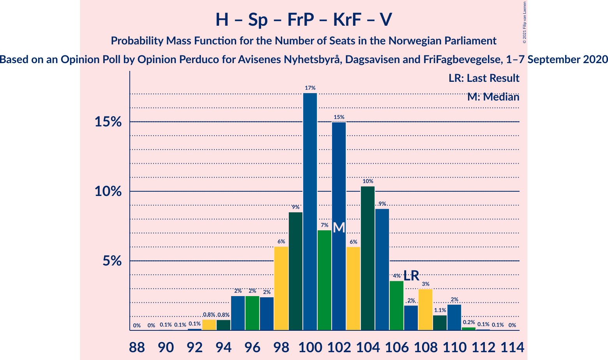

| Number of Seats | Probability | Accumulated | Special Marks |
|:---------------:|:-----------:|:-----------:|:-------------:|
| 91 | 0% | 100% |  |
| 92 | 0.1% | 99.9% |  |
| 93 | 0.1% | 99.9% |  |
| 94 | 0.4% | 99.8% |  |
| 95 | 0.3% | 99.4% |  |
| 96 | 1.5% | 99.1% |  |
| 97 | 2% | 98% |  |
| 98 | 5% | 96% |  |
| 99 | 10% | 91% |  |
| 100 | 38% | 81% | Median |
| 101 | 14% | 43% |  |
| 102 | 16% | 29% |  |
| 103 | 3% | 13% |  |
| 104 | 4% | 10% |  |
| 105 | 0.9% | 6% |  |
| 106 | 3% | 5% |  |
| 107 | 0.2% | 2% | Last Result |
| 108 | 1.3% | 2% |  |
| 109 | 0.1% | 0.3% |  |
| 110 | 0.2% | 0.2% |  |
| 111 | 0% | 0.1% |  |
| 112 | 0% | 0% |  |

### Arbeiderpartiet – Senterpartiet – Miljøpartiet De Grønne – Sosialistisk Venstreparti – Rødt

| Number of Seats | Probability | Accumulated | Special Marks |
|:---------------:|:-----------:|:-----------:|:-------------:|
| 81 | 0% | 100% | Last Result |
| 82 | 0% | 100% |  |
| 83 | 0% | 100% |  |
| 84 | 0% | 100% |  |
| 85 | 0% | 100% | Majority |
| 86 | 0.1% | 100% |  |
| 87 | 1.0% | 99.8% |  |
| 88 | 0.1% | 98.8% |  |
| 89 | 0.4% | 98.7% |  |
| 90 | 0.6% | 98% |  |
| 91 | 4% | 98% |  |
| 92 | 0.2% | 94% |  |
| 93 | 5% | 94% |  |
| 94 | 2% | 89% |  |
| 95 | 1.1% | 87% |  |
| 96 | 1.0% | 86% |  |
| 97 | 23% | 85% |  |
| 98 | 25% | 62% |  |
| 99 | 2% | 37% | Median |
| 100 | 7% | 34% |  |
| 101 | 11% | 27% |  |
| 102 | 11% | 16% |  |
| 103 | 0.6% | 5% |  |
| 104 | 0.7% | 4% |  |
| 105 | 2% | 4% |  |
| 106 | 0.9% | 2% |  |
| 107 | 1.3% | 1.4% |  |
| 108 | 0% | 0% |  |

### Arbeiderpartiet – Senterpartiet – Miljøpartiet De Grønne – Sosialistisk Venstreparti – Kristelig Folkeparti

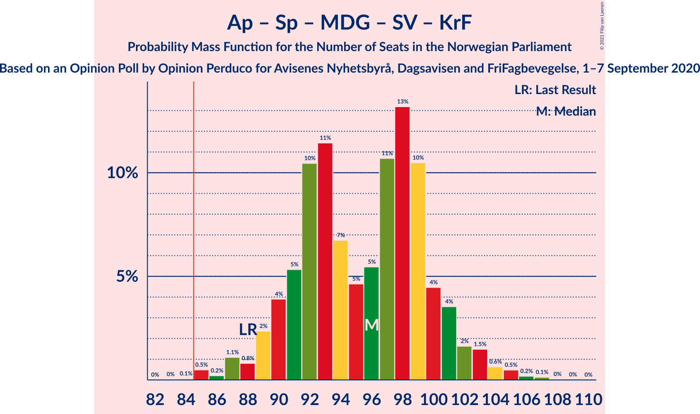

| Number of Seats | Probability | Accumulated | Special Marks |
|:---------------:|:-----------:|:-----------:|:-------------:|
| 83 | 0.1% | 100% |  |
| 84 | 0% | 99.9% |  |
| 85 | 0.1% | 99.9% | Majority |
| 86 | 0.1% | 99.9% |  |
| 87 | 1.1% | 99.8% |  |
| 88 | 0.9% | 98.7% | Last Result |
| 89 | 2% | 98% |  |
| 90 | 1.2% | 96% |  |
| 91 | 7% | 95% |  |
| 92 | 22% | 88% |  |
| 93 | 13% | 65% |  |
| 94 | 10% | 53% | Median |
| 95 | 0.7% | 43% |  |
| 96 | 3% | 42% |  |
| 97 | 14% | 39% |  |
| 98 | 13% | 25% |  |
| 99 | 7% | 12% |  |
| 100 | 2% | 5% |  |
| 101 | 2% | 3% |  |
| 102 | 0.2% | 1.3% |  |
| 103 | 0.2% | 1.1% |  |
| 104 | 0.4% | 0.9% |  |
| 105 | 0.4% | 0.5% |  |
| 106 | 0.1% | 0.1% |  |
| 107 | 0% | 0% |  |

### Arbeiderpartiet – Senterpartiet – Miljøpartiet De Grønne – Sosialistisk Venstreparti

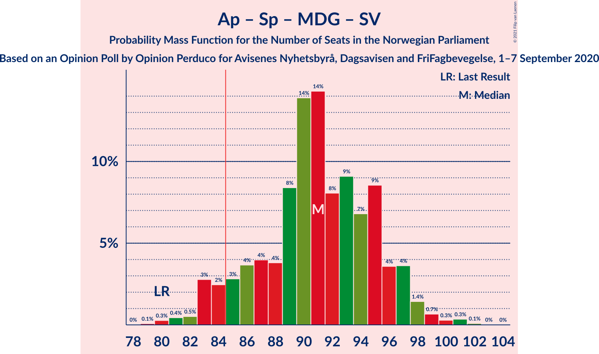

| Number of Seats | Probability | Accumulated | Special Marks |
|:---------------:|:-----------:|:-----------:|:-------------:|
| 79 | 0.1% | 100% |  |
| 80 | 1.0% | 99.9% | Last Result |
| 81 | 0.2% | 98.9% |  |
| 82 | 0.1% | 98.7% |  |
| 83 | 1.0% | 98.6% |  |
| 84 | 3% | 98% |  |
| 85 | 2% | 94% | Majority |
| 86 | 3% | 92% |  |
| 87 | 1.1% | 89% |  |
| 88 | 2% | 88% |  |
| 89 | 19% | 86% |  |
| 90 | 28% | 67% |  |
| 91 | 3% | 39% | Median |
| 92 | 3% | 35% |  |
| 93 | 13% | 33% |  |
| 94 | 12% | 20% |  |
| 95 | 3% | 8% |  |
| 96 | 1.0% | 5% |  |
| 97 | 2% | 4% |  |
| 98 | 2% | 2% |  |
| 99 | 0.1% | 0.3% |  |
| 100 | 0.1% | 0.1% |  |
| 101 | 0.1% | 0.1% |  |
| 102 | 0% | 0% |  |

### Arbeiderpartiet – Senterpartiet – Sosialistisk Venstreparti – Rødt

| Number of Seats | Probability | Accumulated | Special Marks |
|:---------------:|:-----------:|:-----------:|:-------------:|
| 70 | 0% | 100% |  |
| 71 | 0% | 99.9% |  |
| 72 | 0% | 99.9% |  |
| 73 | 0.2% | 99.9% |  |
| 74 | 0.5% | 99.7% |  |
| 75 | 1.4% | 99.2% |  |
| 76 | 0.1% | 98% |  |
| 77 | 0.7% | 98% |  |
| 78 | 1.0% | 97% |  |
| 79 | 5% | 96% |  |
| 80 | 1.0% | 91% | Last Result |
| 81 | 3% | 90% |  |
| 82 | 1.2% | 87% |  |
| 83 | 23% | 86% |  |
| 84 | 2% | 62% |  |
| 85 | 12% | 60% | Median, Majority |
| 86 | 12% | 48% |  |
| 87 | 10% | 37% |  |
| 88 | 19% | 27% |  |
| 89 | 2% | 8% |  |
| 90 | 2% | 6% |  |
| 91 | 0.3% | 3% |  |
| 92 | 1.5% | 3% |  |
| 93 | 1.4% | 2% |  |
| 94 | 0.1% | 0.2% |  |
| 95 | 0.1% | 0.1% |  |
| 96 | 0% | 0% |  |

### Høyre – Fremskrittspartiet – Miljøpartiet De Grønne – Kristelig Folkeparti – Venstre

| Number of Seats | Probability | Accumulated | Special Marks |
|:---------------:|:-----------:|:-----------:|:-------------:|
| 74 | 0.1% | 100% |  |
| 75 | 0.1% | 99.9% |  |
| 76 | 1.4% | 99.8% |  |
| 77 | 1.5% | 98% |  |
| 78 | 0.3% | 97% |  |
| 79 | 2% | 97% |  |
| 80 | 2% | 94% |  |
| 81 | 19% | 92% |  |
| 82 | 10% | 73% |  |
| 83 | 12% | 63% |  |
| 84 | 12% | 52% | Median |
| 85 | 2% | 40% | Majority |
| 86 | 23% | 38% |  |
| 87 | 1.2% | 14% |  |
| 88 | 3% | 13% |  |
| 89 | 1.0% | 10% | Last Result |
| 90 | 5% | 9% |  |
| 91 | 1.0% | 4% |  |
| 92 | 0.7% | 3% |  |
| 93 | 0.1% | 2% |  |
| 94 | 1.4% | 2% |  |
| 95 | 0.5% | 0.8% |  |
| 96 | 0.2% | 0.3% |  |
| 97 | 0% | 0.1% |  |
| 98 | 0% | 0.1% |  |
| 99 | 0% | 0.1% |  |
| 100 | 0% | 0% |  |

### Arbeiderpartiet – Senterpartiet – Miljøpartiet De Grønne – Kristelig Folkeparti

| Number of Seats | Probability | Accumulated | Special Marks |
|:---------------:|:-----------:|:-----------:|:-------------:|
| 71 | 0.1% | 100% |  |
| 72 | 0.1% | 99.9% |  |
| 73 | 0% | 99.9% |  |
| 74 | 0.1% | 99.9% |  |
| 75 | 0.2% | 99.8% |  |
| 76 | 3% | 99.6% |  |
| 77 | 1.1% | 97% | Last Result |
| 78 | 17% | 96% |  |
| 79 | 2% | 78% |  |
| 80 | 6% | 76% |  |
| 81 | 8% | 71% |  |
| 82 | 2% | 63% | Median |
| 83 | 19% | 61% |  |
| 84 | 3% | 42% |  |
| 85 | 25% | 39% | Majority |
| 86 | 0.6% | 14% |  |
| 87 | 3% | 14% |  |
| 88 | 1.3% | 11% |  |
| 89 | 3% | 10% |  |
| 90 | 5% | 7% |  |
| 91 | 0.2% | 1.4% |  |
| 92 | 0.3% | 1.1% |  |
| 93 | 0% | 0.8% |  |
| 94 | 0.7% | 0.8% |  |
| 95 | 0% | 0.1% |  |
| 96 | 0% | 0.1% |  |
| 97 | 0% | 0% |  |

### Arbeiderpartiet – Senterpartiet – Sosialistisk Venstreparti

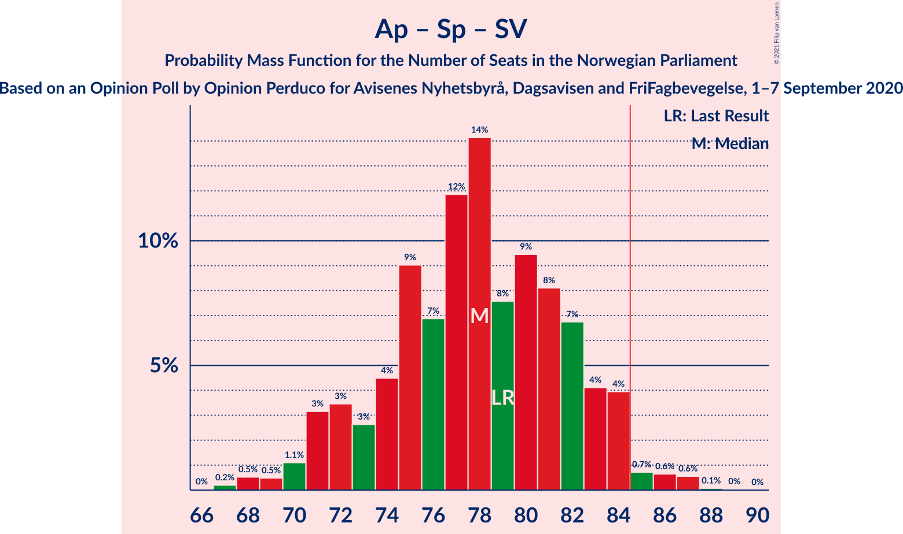

| Number of Seats | Probability | Accumulated | Special Marks |
|:---------------:|:-----------:|:-----------:|:-------------:|
| 67 | 0.1% | 100% |  |
| 68 | 1.2% | 99.9% |  |
| 69 | 0.1% | 98.7% |  |
| 70 | 0.6% | 98.6% |  |
| 71 | 1.3% | 98% |  |
| 72 | 6% | 97% |  |
| 73 | 3% | 91% |  |
| 74 | 0.6% | 88% |  |
| 75 | 19% | 88% |  |
| 76 | 7% | 68% |  |
| 77 | 13% | 62% | Median |
| 78 | 12% | 49% |  |
| 79 | 9% | 37% | Last Result |
| 80 | 11% | 28% |  |
| 81 | 11% | 17% |  |
| 82 | 2% | 5% |  |
| 83 | 0.5% | 3% |  |
| 84 | 2% | 3% |  |
| 85 | 0.5% | 0.8% | Majority |
| 86 | 0.3% | 0.3% |  |
| 87 | 0.1% | 0.1% |  |
| 88 | 0% | 0% |  |

### Høyre – Fremskrittspartiet – Kristelig Folkeparti – Venstre

| Number of Seats | Probability | Accumulated | Special Marks |
|:---------------:|:-----------:|:-----------:|:-------------:|
| 62 | 1.3% | 100% |  |
| 63 | 0.9% | 98.6% |  |
| 64 | 2% | 98% |  |
| 65 | 0.7% | 96% |  |
| 66 | 0.6% | 96% |  |
| 67 | 11% | 95% |  |
| 68 | 11% | 84% |  |
| 69 | 7% | 73% |  |
| 70 | 2% | 66% | Median |
| 71 | 25% | 63% |  |
| 72 | 23% | 38% |  |
| 73 | 1.0% | 15% |  |
| 74 | 1.1% | 14% |  |
| 75 | 2% | 13% |  |
| 76 | 5% | 11% |  |
| 77 | 0.2% | 6% |  |
| 78 | 4% | 6% |  |
| 79 | 0.6% | 2% |  |
| 80 | 0.4% | 2% |  |
| 81 | 0.1% | 1.3% |  |
| 82 | 1.0% | 1.2% |  |
| 83 | 0.1% | 0.2% |  |
| 84 | 0% | 0% |  |
| 85 | 0% | 0% | Majority |
| 86 | 0% | 0% |  |
| 87 | 0% | 0% |  |
| 88 | 0% | 0% | Last Result |

### Arbeiderpartiet – Senterpartiet – Kristelig Folkeparti

| Number of Seats | Probability | Accumulated | Special Marks |
|:---------------:|:-----------:|:-----------:|:-------------:|
| 58 | 0.1% | 100% |  |
| 59 | 0% | 99.9% |  |
| 60 | 0.2% | 99.9% |  |
| 61 | 0.1% | 99.7% |  |
| 62 | 3% | 99.7% |  |
| 63 | 0.3% | 97% |  |
| 64 | 17% | 97% |  |
| 65 | 2% | 80% |  |
| 66 | 0.7% | 78% |  |
| 67 | 6% | 77% |  |
| 68 | 5% | 71% | Median |
| 69 | 12% | 66% |  |
| 70 | 15% | 54% |  |
| 71 | 10% | 39% |  |
| 72 | 5% | 29% |  |
| 73 | 12% | 24% |  |
| 74 | 1.2% | 12% |  |
| 75 | 2% | 11% |  |
| 76 | 2% | 8% | Last Result |
| 77 | 0.4% | 7% |  |
| 78 | 5% | 6% |  |
| 79 | 0.4% | 1.4% |  |
| 80 | 0.5% | 1.0% |  |
| 81 | 0% | 0.5% |  |
| 82 | 0.4% | 0.5% |  |
| 83 | 0% | 0% |  |

### Høyre – Fremskrittspartiet – Venstre

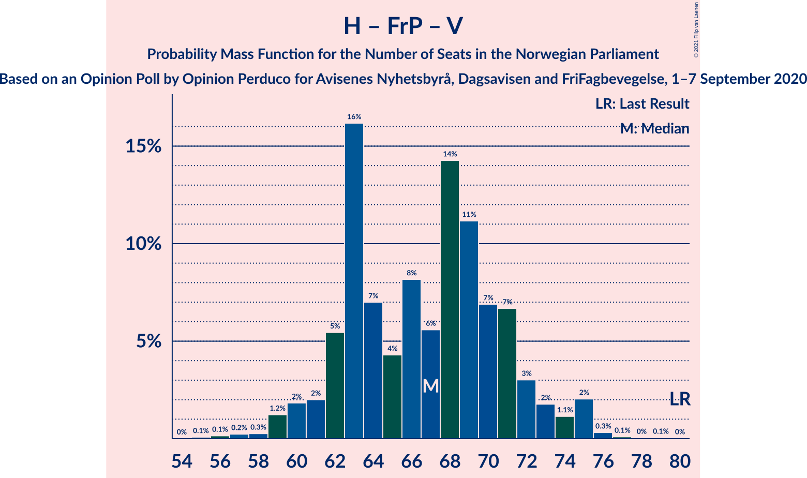

| Number of Seats | Probability | Accumulated | Special Marks |
|:---------------:|:-----------:|:-----------:|:-------------:|
| 56 | 0% | 100% |  |
| 57 | 0.4% | 99.9% |  |
| 58 | 0.1% | 99.5% |  |
| 59 | 2% | 99.4% |  |
| 60 | 0.5% | 98% |  |
| 61 | 0.9% | 97% |  |
| 62 | 2% | 96% |  |
| 63 | 18% | 95% |  |
| 64 | 10% | 77% |  |
| 65 | 4% | 66% |  |
| 66 | 5% | 62% |  |
| 67 | 9% | 58% | Median |
| 68 | 13% | 49% |  |
| 69 | 21% | 36% |  |
| 70 | 4% | 15% |  |
| 71 | 7% | 12% |  |
| 72 | 0.4% | 5% |  |
| 73 | 3% | 4% |  |
| 74 | 0.2% | 1.5% |  |
| 75 | 1.0% | 1.3% |  |
| 76 | 0% | 0.2% |  |
| 77 | 0% | 0.2% |  |
| 78 | 0% | 0.1% |  |
| 79 | 0.1% | 0.1% |  |
| 80 | 0% | 0% | Last Result |

### Arbeiderpartiet – Senterpartiet

| Number of Seats | Probability | Accumulated | Special Marks |
|:---------------:|:-----------:|:-----------:|:-------------:|
| 56 | 0.2% | 100% |  |
| 57 | 0.3% | 99.8% |  |
| 58 | 1.1% | 99.5% |  |
| 59 | 2% | 98% |  |
| 60 | 4% | 96% |  |
| 61 | 18% | 92% |  |
| 62 | 3% | 74% |  |
| 63 | 1.0% | 71% |  |
| 64 | 2% | 70% |  |
| 65 | 13% | 68% | Median |
| 66 | 8% | 54% |  |
| 67 | 12% | 46% |  |
| 68 | 16% | 34% | Last Result |
| 69 | 9% | 18% |  |
| 70 | 0.1% | 9% |  |
| 71 | 1.0% | 9% |  |
| 72 | 6% | 8% |  |
| 73 | 0.8% | 2% |  |
| 74 | 0.5% | 0.8% |  |
| 75 | 0.2% | 0.3% |  |
| 76 | 0.1% | 0.1% |  |
| 77 | 0% | 0% |  |

### Høyre – Fremskrittspartiet

| Number of Seats | Probability | Accumulated | Special Marks |
|:---------------:|:-----------:|:-----------:|:-------------:|
| 55 | 0% | 100% |  |
| 56 | 0.1% | 99.9% |  |
| 57 | 0.6% | 99.9% |  |
| 58 | 2% | 99.2% |  |
| 59 | 0.9% | 98% |  |
| 60 | 0.8% | 97% |  |
| 61 | 3% | 96% |  |
| 62 | 18% | 93% |  |
| 63 | 9% | 76% |  |
| 64 | 0.9% | 66% |  |
| 65 | 9% | 66% |  |
| 66 | 8% | 57% | Median |
| 67 | 15% | 49% |  |
| 68 | 19% | 34% |  |
| 69 | 4% | 15% |  |
| 70 | 6% | 11% |  |
| 71 | 0.6% | 5% |  |
| 72 | 2% | 4% | Last Result |
| 73 | 0.3% | 2% |  |
| 74 | 1.1% | 1.3% |  |
| 75 | 0% | 0.2% |  |
| 76 | 0% | 0.2% |  |
| 77 | 0.1% | 0.1% |  |
| 78 | 0% | 0.1% |  |
| 79 | 0% | 0% |  |

### Høyre – Kristelig Folkeparti – Venstre

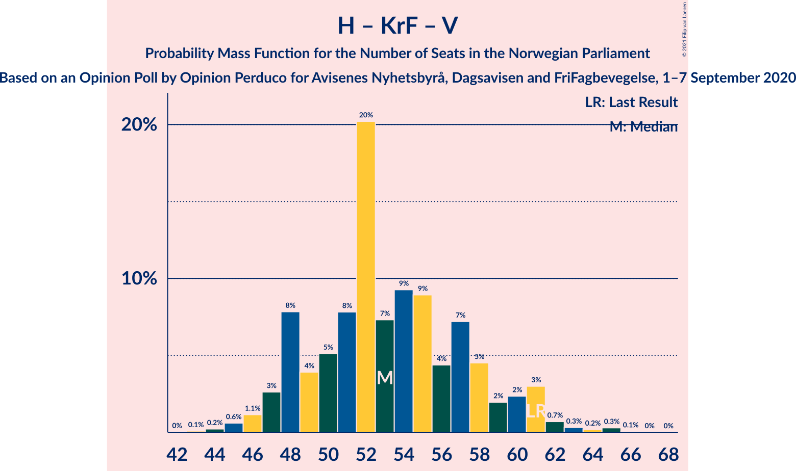

| Number of Seats | Probability | Accumulated | Special Marks |
|:---------------:|:-----------:|:-----------:|:-------------:|
| 44 | 0.3% | 100% |  |
| 45 | 1.3% | 99.7% |  |
| 46 | 1.3% | 98% |  |
| 47 | 3% | 97% |  |
| 48 | 13% | 95% |  |
| 49 | 2% | 81% |  |
| 50 | 4% | 80% |  |
| 51 | 2% | 76% |  |
| 52 | 26% | 73% | Median |
| 53 | 11% | 47% |  |
| 54 | 18% | 36% |  |
| 55 | 7% | 18% |  |
| 56 | 0.7% | 11% |  |
| 57 | 4% | 10% |  |
| 58 | 0.7% | 6% |  |
| 59 | 0.7% | 6% |  |
| 60 | 0.4% | 5% |  |
| 61 | 3% | 4% | Last Result |
| 62 | 0.2% | 2% |  |
| 63 | 0% | 2% |  |
| 64 | 0.5% | 2% |  |
| 65 | 1.0% | 1.1% |  |
| 66 | 0.1% | 0.1% |  |
| 67 | 0% | 0% |  |

### Arbeiderpartiet – Sosialistisk Venstreparti

| Number of Seats | Probability | Accumulated | Special Marks |
|:---------------:|:-----------:|:-----------:|:-------------:|
| 38 | 0.1% | 100% |  |
| 39 | 0% | 99.9% |  |
| 40 | 0.1% | 99.9% |  |
| 41 | 0.2% | 99.8% |  |
| 42 | 1.0% | 99.6% |  |
| 43 | 2% | 98.6% |  |
| 44 | 5% | 97% |  |
| 45 | 2% | 92% |  |
| 46 | 3% | 90% |  |
| 47 | 48% | 87% | Median |
| 48 | 21% | 39% |  |
| 49 | 10% | 18% |  |
| 50 | 3% | 8% |  |
| 51 | 3% | 5% |  |
| 52 | 0.8% | 2% |  |
| 53 | 0.8% | 2% |  |
| 54 | 0.4% | 0.7% |  |
| 55 | 0.3% | 0.3% |  |
| 56 | 0% | 0.1% |  |
| 57 | 0% | 0% |  |
| 58 | 0% | 0% |  |
| 59 | 0% | 0% |  |
| 60 | 0% | 0% | Last Result |

### Senterpartiet – Kristelig Folkeparti – Venstre

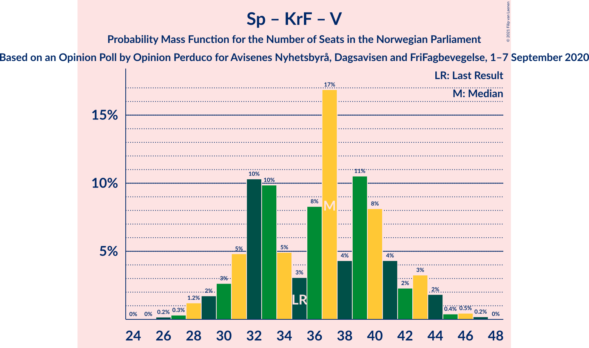

| Number of Seats | Probability | Accumulated | Special Marks |
|:---------------:|:-----------:|:-----------:|:-------------:|
| 26 | 0.3% | 100% |  |
| 27 | 0.1% | 99.7% |  |
| 28 | 0.9% | 99.6% |  |
| 29 | 1.2% | 98.6% |  |
| 30 | 0.7% | 97% |  |
| 31 | 8% | 97% |  |
| 32 | 20% | 89% |  |
| 33 | 19% | 68% |  |
| 34 | 3% | 50% | Median |
| 35 | 0.8% | 47% | Last Result |
| 36 | 4% | 46% |  |
| 37 | 18% | 42% |  |
| 38 | 0.7% | 24% |  |
| 39 | 8% | 23% |  |
| 40 | 11% | 15% |  |
| 41 | 1.3% | 4% |  |
| 42 | 0.8% | 3% |  |
| 43 | 2% | 2% |  |
| 44 | 0.1% | 0.4% |  |
| 45 | 0.1% | 0.3% |  |
| 46 | 0.1% | 0.1% |  |
| 47 | 0.1% | 0.1% |  |
| 48 | 0% | 0% |  |

## Technical Information

### Opinion Poll

+ **Polling firm:** Opinion Perduco
+ **Commissioner(s):** Avisenes Nyhetsbyrå, Dagsavisen and FriFagbevegelse
+ **Fieldwork period:** 1–7 September 2020

### Calculations

+ **Sample size:** 975
+ **Simulations done:** 131,072
+ **Error estimate:** 3.28%

