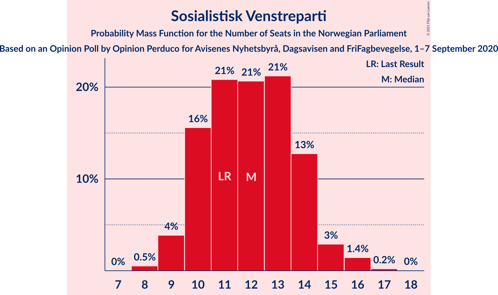
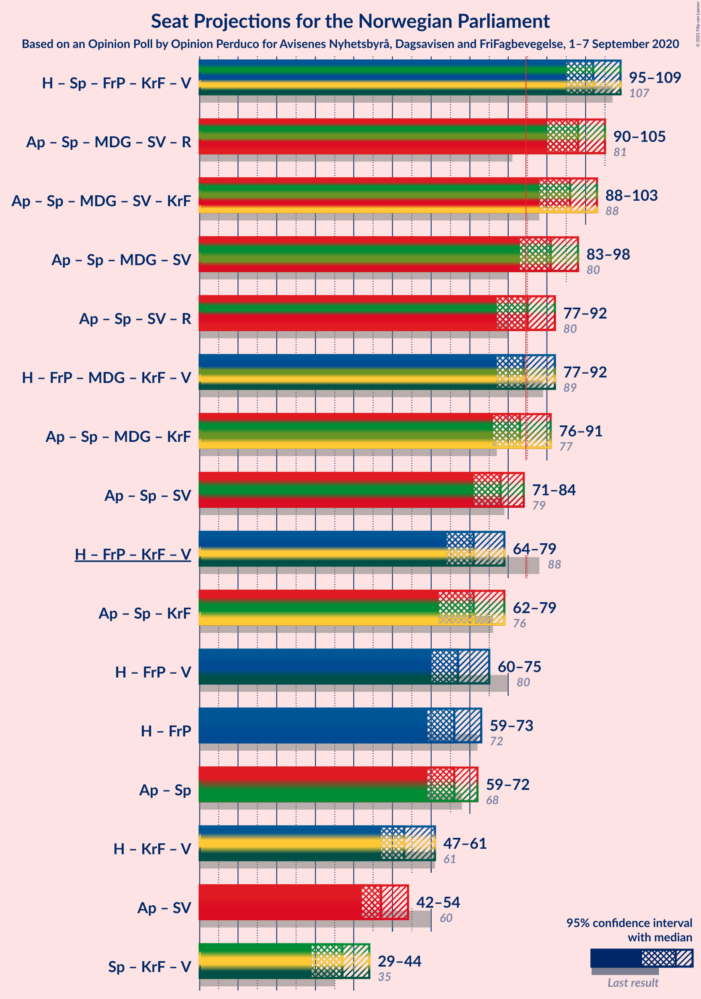
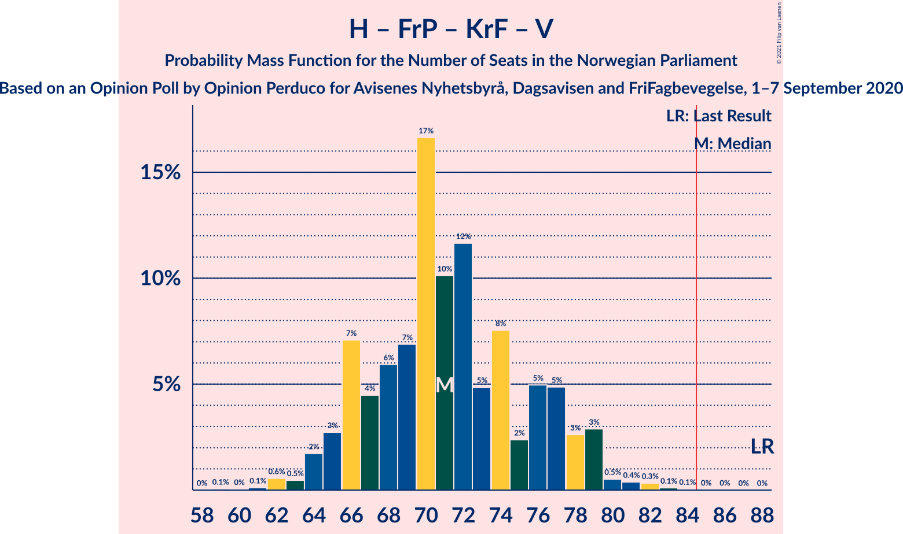

# Opinion Poll by Opinion Perduco for Avisenes Nyhetsbyrå, Dagsavisen and FriFagbevegelse, 1–7 September 2020

<a href="#voting-intentions">Voting Intentions</a> | <a href="#seats">Seats</a> | <a href="#coalitions">Coalitions</a> | <a href="#technical-information">Technical Information</a>

## Voting Intentions

### Confidence Intervals

| Party | Last Result | Poll Result | 80% Confidence Interval | 90% Confidence Interval | 95% Confidence Interval | 99% Confidence Interval |
|:-----:|:-----------:|:-----------:|:-----------------------:|:-----------------------:|:-----------------------:|:-----------------------:|
| Høyre | 25.0% | 27.0% | 25.2–28.9% |24.7–29.4% |24.3–29.9% |23.4–30.8% |
| Arbeiderpartiet | 27.4% | 19.9% | 18.3–21.6% |17.9–22.1% |17.5–22.5% |16.8–23.4% |
| Senterpartiet | 10.3% | 16.0% | 14.6–17.6% |14.2–18.0% |13.8–18.4% |13.2–19.2% |
| Fremskrittspartiet | 15.2% | 10.3% | 9.1–11.6% |8.8–12.0% |8.5–12.3% |8.0–13.0% |
| Miljøpartiet De Grønne | 3.2% | 7.5% | 6.5–8.7% |6.2–9.0% |6.0–9.3% |5.5–9.9% |
| Sosialistisk Venstreparti | 6.0% | 6.9% | 5.9–8.0% |5.7–8.4% |5.4–8.6% |5.0–9.2% |
| Rødt | 2.4% | 4.4% | 3.7–5.4% |3.5–5.7% |3.3–5.9% |3.0–6.4% |
| Kristelig Folkeparti | 4.2% | 3.9% | 3.2–4.8% |3.0–5.1% |2.9–5.3% |2.5–5.8% |
| Venstre | 4.4% | 2.5% | 1.9–3.2% |1.8–3.4% |1.7–3.6% |1.4–4.1% |

*Note:* The poll result column reflects the actual value used in the calculations. Published results may vary slightly, and in addition be rounded to fewer digits.

## Seats

### Confidence Intervals

| Party | Last Result | Median | 80% Confidence Interval | 90% Confidence Interval | 95% Confidence Interval | 99% Confidence Interval |
|:-----:|:-----------:|:------:|:-----------------------:|:-----------------------:|:-----------------------:|:-----------------------:|
| <a href="#høyre">Høyre</a> | 45 | 48 | 43–52 |43–53 |42–54 |40–56 |
| <a href="#arbeiderpartiet">Arbeiderpartiet</a> | 49 | 35 | 32–40 |31–40 |31–41 |29–42 |
| <a href="#senterpartiet">Senterpartiet</a> | 19 | 30 | 26–35 |25–36 |23–36 |22–37 |
| <a href="#fremskrittspartiet">Fremskrittspartiet</a> | 27 | 18 | 15–21 |14–21 |14–22 |13–24 |
| <a href="#miljøpartiet-de-grønne">Miljøpartiet De Grønne</a> | 1 | 13 | 11–15 |11–16 |10–16 |10–17 |
| <a href="#sosialistisk-venstreparti">Sosialistisk Venstreparti</a> | 11 | 12 | 10–14 |10–14 |9–15 |8–16 |
| <a href="#rødt">Rødt</a> | 1 | 8 | 2–9 |2–10 |2–10 |1–11 |
| <a href="#kristelig-folkeparti">Kristelig Folkeparti</a> | 8 | 3 | 1–8 |1–8 |1–9 |1–10 |
| <a href="#venstre">Venstre</a> | 8 | 1 | 1–2 |0–2 |0–2 |0–3 |

### Høyre

*For a full overview of the results for this party, see the [Høyre](party-høyre.html) page.*

| Number of Seats | Probability | Accumulated | Special Marks |
|:---------------:|:-----------:|:-----------:|:-------------:|
| 39 | 0.1% | 100% |  |
| 40 | 0.6% | 99.8% |  |
| 41 | 1.4% | 99.2% |  |
| 42 | 2% | 98% |  |
| 43 | 7% | 96% |  |
| 44 | 13% | 89% |  |
| 45 | 6% | 75% | Last Result |
| 46 | 7% | 69% |  |
| 47 | 10% | 62% |  |
| 48 | 14% | 52% | Median |
| 49 | 11% | 38% |  |
| 50 | 9% | 27% |  |
| 51 | 6% | 17% |  |
| 52 | 5% | 12% |  |
| 53 | 3% | 7% |  |
| 54 | 2% | 3% |  |
| 55 | 1.1% | 2% |  |
| 56 | 0.2% | 0.6% |  |
| 57 | 0.3% | 0.4% |  |
| 58 | 0.1% | 0.1% |  |
| 59 | 0% | 0% |  |

### Arbeiderpartiet

*For a full overview of the results for this party, see the [Arbeiderpartiet](party-arbeiderpartiet.html) page.*

| Number of Seats | Probability | Accumulated | Special Marks |
|:---------------:|:-----------:|:-----------:|:-------------:|
| 29 | 0.6% | 100% |  |
| 30 | 1.2% | 99.4% |  |
| 31 | 7% | 98% |  |
| 32 | 5% | 91% |  |
| 33 | 13% | 87% |  |
| 34 | 13% | 73% |  |
| 35 | 16% | 61% | Median |
| 36 | 11% | 45% |  |
| 37 | 10% | 34% |  |
| 38 | 6% | 24% |  |
| 39 | 6% | 17% |  |
| 40 | 7% | 11% |  |
| 41 | 2% | 4% |  |
| 42 | 2% | 2% |  |
| 43 | 0.1% | 0.1% |  |
| 44 | 0% | 0.1% |  |
| 45 | 0% | 0% |  |
| 46 | 0% | 0% |  |
| 47 | 0% | 0% |  |
| 48 | 0% | 0% |  |
| 49 | 0% | 0% | Last Result |

### Senterpartiet

*For a full overview of the results for this party, see the [Senterpartiet](party-senterpartiet.html) page.*

| Number of Seats | Probability | Accumulated | Special Marks |
|:---------------:|:-----------:|:-----------:|:-------------:|
| 19 | 0% | 100% | Last Result |
| 20 | 0% | 100% |  |
| 21 | 0.3% | 100% |  |
| 22 | 1.2% | 99.7% |  |
| 23 | 0.9% | 98% |  |
| 24 | 1.2% | 97% |  |
| 25 | 2% | 96% |  |
| 26 | 5% | 95% |  |
| 27 | 4% | 90% |  |
| 28 | 14% | 86% |  |
| 29 | 12% | 72% |  |
| 30 | 11% | 60% | Median |
| 31 | 11% | 49% |  |
| 32 | 9% | 38% |  |
| 33 | 10% | 29% |  |
| 34 | 9% | 19% |  |
| 35 | 4% | 10% |  |
| 36 | 5% | 6% |  |
| 37 | 0.8% | 1.1% |  |
| 38 | 0.2% | 0.3% |  |
| 39 | 0% | 0% |  |

### Fremskrittspartiet

*For a full overview of the results for this party, see the [Fremskrittspartiet](party-fremskrittspartiet.html) page.*

| Number of Seats | Probability | Accumulated | Special Marks |
|:---------------:|:-----------:|:-----------:|:-------------:|
| 12 | 0.2% | 100% |  |
| 13 | 1.0% | 99.7% |  |
| 14 | 4% | 98.7% |  |
| 15 | 9% | 94% |  |
| 16 | 8% | 86% |  |
| 17 | 11% | 77% |  |
| 18 | 30% | 66% | Median |
| 19 | 12% | 36% |  |
| 20 | 14% | 25% |  |
| 21 | 7% | 11% |  |
| 22 | 2% | 4% |  |
| 23 | 0.8% | 1.4% |  |
| 24 | 0.5% | 0.6% |  |
| 25 | 0.1% | 0.1% |  |
| 26 | 0% | 0% |  |
| 27 | 0% | 0% | Last Result |

### Miljøpartiet De Grønne

*For a full overview of the results for this party, see the [Miljøpartiet De Grønne](party-miljøpartietdegrønne.html) page.*

| Number of Seats | Probability | Accumulated | Special Marks |
|:---------------:|:-----------:|:-----------:|:-------------:|
| 1 | 0% | 100% | Last Result |
| 2 | 0% | 100% |  |
| 3 | 0% | 100% |  |
| 4 | 0% | 100% |  |
| 5 | 0% | 100% |  |
| 6 | 0% | 100% |  |
| 7 | 0% | 100% |  |
| 8 | 0% | 100% |  |
| 9 | 0.4% | 100% |  |
| 10 | 3% | 99.6% |  |
| 11 | 11% | 97% |  |
| 12 | 24% | 86% |  |
| 13 | 24% | 62% | Median |
| 14 | 24% | 38% |  |
| 15 | 7% | 15% |  |
| 16 | 5% | 7% |  |
| 17 | 1.5% | 2% |  |
| 18 | 0.3% | 0.4% |  |
| 19 | 0.1% | 0.1% |  |
| 20 | 0% | 0% |  |

### Sosialistisk Venstreparti

*For a full overview of the results for this party, see the [Sosialistisk Venstreparti](party-sosialistiskvenstreparti.html) page.*

| Number of Seats | Probability | Accumulated | Special Marks |
|:---------------:|:-----------:|:-----------:|:-------------:|
| 8 | 0.5% | 100% |  |
| 9 | 4% | 99.5% |  |
| 10 | 16% | 96% |  |
| 11 | 21% | 80% | Last Result |
| 12 | 21% | 59% | Median |
| 13 | 21% | 39% |  |
| 14 | 13% | 17% |  |
| 15 | 3% | 5% |  |
| 16 | 1.4% | 2% |  |
| 17 | 0.2% | 0.3% |  |
| 18 | 0% | 0% |  |

### Rødt

*For a full overview of the results for this party, see the [Rødt](party-rødt.html) page.*

| Number of Seats | Probability | Accumulated | Special Marks |
|:---------------:|:-----------:|:-----------:|:-------------:|
| 1 | 0.7% | 100% | Last Result |
| 2 | 20% | 99.3% |  |
| 3 | 0% | 80% |  |
| 4 | 0% | 80% |  |
| 5 | 0% | 80% |  |
| 6 | 0.3% | 80% |  |
| 7 | 22% | 79% |  |
| 8 | 39% | 57% | Median |
| 9 | 13% | 19% |  |
| 10 | 5% | 6% |  |
| 11 | 0.8% | 0.9% |  |
| 12 | 0.1% | 0.1% |  |
| 13 | 0% | 0% |  |

### Kristelig Folkeparti

*For a full overview of the results for this party, see the [Kristelig Folkeparti](party-kristeligfolkeparti.html) page.*

| Number of Seats | Probability | Accumulated | Special Marks |
|:---------------:|:-----------:|:-----------:|:-------------:|
| 0 | 0.2% | 100% |  |
| 1 | 12% | 99.8% |  |
| 2 | 12% | 87% |  |
| 3 | 33% | 75% | Median |
| 4 | 0% | 42% |  |
| 5 | 0% | 42% |  |
| 6 | 1.3% | 42% |  |
| 7 | 21% | 41% |  |
| 8 | 16% | 20% | Last Result |
| 9 | 3% | 4% |  |
| 10 | 0.7% | 0.9% |  |
| 11 | 0.1% | 0.1% |  |
| 12 | 0% | 0% |  |

### Venstre

*For a full overview of the results for this party, see the [Venstre](party-venstre.html) page.*

| Number of Seats | Probability | Accumulated | Special Marks |
|:---------------:|:-----------:|:-----------:|:-------------:|
| 0 | 10% | 100% |  |
| 1 | 62% | 90% | Median |
| 2 | 28% | 28% |  |
| 3 | 0% | 0.5% |  |
| 4 | 0% | 0.5% |  |
| 5 | 0% | 0.5% |  |
| 6 | 0.2% | 0.5% |  |
| 7 | 0.2% | 0.3% |  |
| 8 | 0% | 0% | Last Result |

## Coalitions

### Confidence Intervals

| Coalition | Last Result | Median | Majority? | 80% Confidence Interval | 90% Confidence Interval | 95% Confidence Interval | 99% Confidence Interval |
|:---------:|:-----------:|:------:|:---------:|:-----------------------:|:-----------------------:|:-----------------------:|:-----------------------:|
| Høyre – Senterpartiet – Fremskrittspartiet – Kristelig Folkeparti – Venstre | 107 | 102 | 100% | 98–106 | 96–108 | 95–109 | 93–110 |
| Arbeiderpartiet – Senterpartiet – Miljøpartiet De Grønne – Sosialistisk Venstreparti – Rødt | 81 | 98 | 100% | 92–103 | 91–104 | 90–105 | 87–107 |
| Arbeiderpartiet – Senterpartiet – Miljøpartiet De Grønne – Sosialistisk Venstreparti – Kristelig Folkeparti | 88 | 96 | 99.9% | 91–100 | 89–101 | 88–103 | 85–105 |
| Arbeiderpartiet – Senterpartiet – Miljøpartiet De Grønne – Sosialistisk Venstreparti | 80 | 91 | 93% | 86–96 | 84–97 | 83–98 | 81–100 |
| Arbeiderpartiet – Senterpartiet – Sosialistisk Venstreparti – Rødt | 80 | 85 | 56% | 79–90 | 78–91 | 77–92 | 75–94 |
| Høyre – Fremskrittspartiet – Miljøpartiet De Grønne – Kristelig Folkeparti – Venstre | 89 | 84 | 44% | 79–90 | 78–91 | 77–92 | 75–94 |
| Arbeiderpartiet – Senterpartiet – Miljøpartiet De Grønne – Kristelig Folkeparti | 77 | 83 | 44% | 78–89 | 77–90 | 76–91 | 74–94 |
| Arbeiderpartiet – Senterpartiet – Sosialistisk Venstreparti | 79 | 78 | 2% | 73–83 | 71–84 | 71–84 | 68–87 |
| Høyre – Fremskrittspartiet – Kristelig Folkeparti – Venstre | 88 | 71 | 0% | 66–77 | 65–78 | 64–79 | 62–82 |
| Arbeiderpartiet – Senterpartiet – Kristelig Folkeparti | 76 | 71 | 0% | 65–76 | 64–78 | 62–79 | 61–81 |
| Høyre – Fremskrittspartiet – Venstre | 80 | 67 | 0% | 62–71 | 61–73 | 60–75 | 58–76 |
| Høyre – Fremskrittspartiet | 72 | 66 | 0% | 61–70 | 60–72 | 59–73 | 57–74 |
| Arbeiderpartiet – Senterpartiet | 68 | 66 | 0% | 61–71 | 60–72 | 59–72 | 57–74 |
| Høyre – Kristelig Folkeparti – Venstre | 61 | 53 | 0% | 48–58 | 48–60 | 47–61 | 45–64 |
| Arbeiderpartiet – Sosialistisk Venstreparti | 60 | 47 | 0% | 44–52 | 42–53 | 42–54 | 40–55 |
| Senterpartiet – Kristelig Folkeparti – Venstre | 35 | 37 | 0% | 31–41 | 30–43 | 29–44 | 27–46 |

### Høyre – Senterpartiet – Fremskrittspartiet – Kristelig Folkeparti – Venstre

| Number of Seats | Probability | Accumulated | Special Marks |
|:---------------:|:-----------:|:-----------:|:-------------:|
| 90 | 0.1% | 100% |  |
| 91 | 0.1% | 99.9% |  |
| 92 | 0.1% | 99.9% |  |
| 93 | 0.8% | 99.7% |  |
| 94 | 0.8% | 98.9% |  |
| 95 | 2% | 98% |  |
| 96 | 2% | 96% |  |
| 97 | 2% | 93% |  |
| 98 | 6% | 91% |  |
| 99 | 9% | 85% |  |
| 100 | 17% | 76% | Median |
| 101 | 7% | 59% |  |
| 102 | 15% | 52% |  |
| 103 | 6% | 37% |  |
| 104 | 10% | 31% |  |
| 105 | 9% | 21% |  |
| 106 | 4% | 12% |  |
| 107 | 2% | 8% | Last Result |
| 108 | 3% | 6% |  |
| 109 | 1.1% | 3% |  |
| 110 | 2% | 2% |  |
| 111 | 0.2% | 0.4% |  |
| 112 | 0.1% | 0.2% |  |
| 113 | 0.1% | 0.1% |  |
| 114 | 0% | 0% |  |

### Arbeiderpartiet – Senterpartiet – Miljøpartiet De Grønne – Sosialistisk Venstreparti – Rødt

| Number of Seats | Probability | Accumulated | Special Marks |
|:---------------:|:-----------:|:-----------:|:-------------:|
| 81 | 0% | 100% | Last Result |
| 82 | 0% | 100% |  |
| 83 | 0% | 100% |  |
| 84 | 0% | 100% |  |
| 85 | 0.1% | 100% | Majority |
| 86 | 0.1% | 99.9% |  |
| 87 | 0.3% | 99.8% |  |
| 88 | 0.4% | 99.5% |  |
| 89 | 0.5% | 99.1% |  |
| 90 | 3% | 98.6% |  |
| 91 | 3% | 96% |  |
| 92 | 5% | 93% |  |
| 93 | 5% | 88% |  |
| 94 | 2% | 83% |  |
| 95 | 8% | 81% |  |
| 96 | 5% | 73% |  |
| 97 | 12% | 68% |  |
| 98 | 10% | 57% | Median |
| 99 | 17% | 47% |  |
| 100 | 7% | 30% |  |
| 101 | 6% | 23% |  |
| 102 | 4% | 17% |  |
| 103 | 7% | 13% |  |
| 104 | 3% | 6% |  |
| 105 | 2% | 3% |  |
| 106 | 0.5% | 1.2% |  |
| 107 | 0.6% | 0.8% |  |
| 108 | 0.1% | 0.2% |  |
| 109 | 0% | 0.1% |  |
| 110 | 0.1% | 0.1% |  |
| 111 | 0% | 0% |  |

### Arbeiderpartiet – Senterpartiet – Miljøpartiet De Grønne – Sosialistisk Venstreparti – Kristelig Folkeparti

| Number of Seats | Probability | Accumulated | Special Marks |
|:---------------:|:-----------:|:-----------:|:-------------:|
| 84 | 0.1% | 100% |  |
| 85 | 0.5% | 99.9% | Majority |
| 86 | 0.2% | 99.4% |  |
| 87 | 1.1% | 99.2% |  |
| 88 | 0.8% | 98% | Last Result |
| 89 | 2% | 97% |  |
| 90 | 4% | 95% |  |
| 91 | 5% | 91% |  |
| 92 | 10% | 86% |  |
| 93 | 11% | 75% | Median |
| 94 | 7% | 64% |  |
| 95 | 5% | 57% |  |
| 96 | 5% | 52% |  |
| 97 | 11% | 47% |  |
| 98 | 13% | 36% |  |
| 99 | 10% | 23% |  |
| 100 | 4% | 13% |  |
| 101 | 4% | 8% |  |
| 102 | 2% | 5% |  |
| 103 | 1.5% | 3% |  |
| 104 | 0.6% | 1.5% |  |
| 105 | 0.5% | 0.9% |  |
| 106 | 0.2% | 0.4% |  |
| 107 | 0.1% | 0.2% |  |
| 108 | 0% | 0.1% |  |
| 109 | 0% | 0% |  |

### Arbeiderpartiet – Senterpartiet – Miljøpartiet De Grønne – Sosialistisk Venstreparti

| Number of Seats | Probability | Accumulated | Special Marks |
|:---------------:|:-----------:|:-----------:|:-------------:|
| 79 | 0.1% | 100% |  |
| 80 | 0.3% | 99.9% | Last Result |
| 81 | 0.4% | 99.6% |  |
| 82 | 0.5% | 99.2% |  |
| 83 | 3% | 98.6% |  |
| 84 | 2% | 96% |  |
| 85 | 3% | 93% | Majority |
| 86 | 4% | 91% |  |
| 87 | 4% | 87% |  |
| 88 | 4% | 83% |  |
| 89 | 8% | 79% |  |
| 90 | 14% | 71% | Median |
| 91 | 14% | 57% |  |
| 92 | 8% | 43% |  |
| 93 | 9% | 34% |  |
| 94 | 7% | 25% |  |
| 95 | 9% | 19% |  |
| 96 | 4% | 10% |  |
| 97 | 4% | 6% |  |
| 98 | 1.4% | 3% |  |
| 99 | 0.7% | 1.4% |  |
| 100 | 0.3% | 0.8% |  |
| 101 | 0.3% | 0.5% |  |
| 102 | 0.1% | 0.1% |  |
| 103 | 0% | 0% |  |

### Arbeiderpartiet – Senterpartiet – Sosialistisk Venstreparti – Rødt

| Number of Seats | Probability | Accumulated | Special Marks |
|:---------------:|:-----------:|:-----------:|:-------------:|
| 72 | 0.1% | 100% |  |
| 73 | 0.1% | 99.9% |  |
| 74 | 0.2% | 99.8% |  |
| 75 | 0.9% | 99.5% |  |
| 76 | 0.7% | 98.6% |  |
| 77 | 1.4% | 98% |  |
| 78 | 5% | 97% |  |
| 79 | 4% | 92% |  |
| 80 | 4% | 88% | Last Result |
| 81 | 6% | 84% |  |
| 82 | 4% | 78% |  |
| 83 | 11% | 73% |  |
| 84 | 7% | 63% |  |
| 85 | 11% | 56% | Median, Majority |
| 86 | 12% | 45% |  |
| 87 | 8% | 33% |  |
| 88 | 8% | 25% |  |
| 89 | 5% | 18% |  |
| 90 | 6% | 13% |  |
| 91 | 4% | 7% |  |
| 92 | 1.5% | 3% |  |
| 93 | 0.7% | 1.4% |  |
| 94 | 0.4% | 0.7% |  |
| 95 | 0.2% | 0.3% |  |
| 96 | 0% | 0.1% |  |
| 97 | 0% | 0% |  |

### Høyre – Fremskrittspartiet – Miljøpartiet De Grønne – Kristelig Folkeparti – Venstre

| Number of Seats | Probability | Accumulated | Special Marks |
|:---------------:|:-----------:|:-----------:|:-------------:|
| 73 | 0% | 100% |  |
| 74 | 0.2% | 99.9% |  |
| 75 | 0.4% | 99.7% |  |
| 76 | 0.7% | 99.3% |  |
| 77 | 1.5% | 98.6% |  |
| 78 | 4% | 97% |  |
| 79 | 6% | 93% |  |
| 80 | 5% | 87% |  |
| 81 | 8% | 82% |  |
| 82 | 8% | 75% |  |
| 83 | 12% | 67% | Median |
| 84 | 11% | 55% |  |
| 85 | 7% | 44% | Majority |
| 86 | 11% | 37% |  |
| 87 | 4% | 27% |  |
| 88 | 6% | 22% |  |
| 89 | 4% | 16% | Last Result |
| 90 | 4% | 12% |  |
| 91 | 5% | 8% |  |
| 92 | 1.4% | 3% |  |
| 93 | 0.7% | 2% |  |
| 94 | 0.9% | 1.4% |  |
| 95 | 0.2% | 0.5% |  |
| 96 | 0.1% | 0.2% |  |
| 97 | 0.1% | 0.1% |  |
| 98 | 0% | 0% |  |

### Arbeiderpartiet – Senterpartiet – Miljøpartiet De Grønne – Kristelig Folkeparti

| Number of Seats | Probability | Accumulated | Special Marks |
|:---------------:|:-----------:|:-----------:|:-------------:|
| 72 | 0.1% | 100% |  |
| 73 | 0.1% | 99.9% |  |
| 74 | 0.7% | 99.8% |  |
| 75 | 0.7% | 99.1% |  |
| 76 | 3% | 98% |  |
| 77 | 2% | 96% | Last Result |
| 78 | 5% | 94% |  |
| 79 | 6% | 89% |  |
| 80 | 5% | 83% |  |
| 81 | 8% | 78% | Median |
| 82 | 10% | 70% |  |
| 83 | 12% | 60% |  |
| 84 | 5% | 48% |  |
| 85 | 14% | 44% | Majority |
| 86 | 5% | 29% |  |
| 87 | 8% | 24% |  |
| 88 | 5% | 16% |  |
| 89 | 5% | 12% |  |
| 90 | 3% | 7% |  |
| 91 | 2% | 4% |  |
| 92 | 0.4% | 2% |  |
| 93 | 0.4% | 1.2% |  |
| 94 | 0.5% | 0.8% |  |
| 95 | 0.1% | 0.3% |  |
| 96 | 0.1% | 0.2% |  |
| 97 | 0% | 0% |  |

### Arbeiderpartiet – Senterpartiet – Sosialistisk Venstreparti

| Number of Seats | Probability | Accumulated | Special Marks |
|:---------------:|:-----------:|:-----------:|:-------------:|
| 66 | 0% | 100% |  |
| 67 | 0.2% | 99.9% |  |
| 68 | 0.5% | 99.7% |  |
| 69 | 0.5% | 99.2% |  |
| 70 | 1.1% | 98.7% |  |
| 71 | 3% | 98% |  |
| 72 | 3% | 94% |  |
| 73 | 3% | 91% |  |
| 74 | 4% | 88% |  |
| 75 | 9% | 84% |  |
| 76 | 7% | 75% |  |
| 77 | 12% | 68% | Median |
| 78 | 14% | 56% |  |
| 79 | 8% | 42% | Last Result |
| 80 | 9% | 34% |  |
| 81 | 8% | 25% |  |
| 82 | 7% | 17% |  |
| 83 | 4% | 10% |  |
| 84 | 4% | 6% |  |
| 85 | 0.7% | 2% | Majority |
| 86 | 0.6% | 1.3% |  |
| 87 | 0.6% | 0.7% |  |
| 88 | 0.1% | 0.1% |  |
| 89 | 0% | 0.1% |  |
| 90 | 0% | 0% |  |

### Høyre – Fremskrittspartiet – Kristelig Folkeparti – Venstre

| Number of Seats | Probability | Accumulated | Special Marks |
|:---------------:|:-----------:|:-----------:|:-------------:|
| 59 | 0.1% | 100% |  |
| 60 | 0% | 99.9% |  |
| 61 | 0.1% | 99.9% |  |
| 62 | 0.6% | 99.8% |  |
| 63 | 0.5% | 99.2% |  |
| 64 | 2% | 98.8% |  |
| 65 | 3% | 97% |  |
| 66 | 7% | 94% |  |
| 67 | 4% | 87% |  |
| 68 | 6% | 83% |  |
| 69 | 7% | 77% |  |
| 70 | 17% | 70% | Median |
| 71 | 10% | 53% |  |
| 72 | 12% | 43% |  |
| 73 | 5% | 32% |  |
| 74 | 8% | 27% |  |
| 75 | 2% | 19% |  |
| 76 | 5% | 17% |  |
| 77 | 5% | 12% |  |
| 78 | 3% | 7% |  |
| 79 | 3% | 4% |  |
| 80 | 0.5% | 1.4% |  |
| 81 | 0.4% | 0.9% |  |
| 82 | 0.3% | 0.5% |  |
| 83 | 0.1% | 0.2% |  |
| 84 | 0.1% | 0.1% |  |
| 85 | 0% | 0% | Majority |
| 86 | 0% | 0% |  |
| 87 | 0% | 0% |  |
| 88 | 0% | 0% | Last Result |

### Arbeiderpartiet – Senterpartiet – Kristelig Folkeparti

| Number of Seats | Probability | Accumulated | Special Marks |
|:---------------:|:-----------:|:-----------:|:-------------:|
| 58 | 0% | 100% |  |
| 59 | 0.1% | 99.9% |  |
| 60 | 0.2% | 99.9% |  |
| 61 | 0.7% | 99.7% |  |
| 62 | 2% | 99.0% |  |
| 63 | 0.6% | 97% |  |
| 64 | 6% | 96% |  |
| 65 | 3% | 90% |  |
| 66 | 4% | 87% |  |
| 67 | 6% | 83% |  |
| 68 | 6% | 77% | Median |
| 69 | 13% | 71% |  |
| 70 | 7% | 59% |  |
| 71 | 13% | 51% |  |
| 72 | 9% | 38% |  |
| 73 | 7% | 29% |  |
| 74 | 7% | 22% |  |
| 75 | 3% | 16% |  |
| 76 | 3% | 12% | Last Result |
| 77 | 3% | 9% |  |
| 78 | 4% | 6% |  |
| 79 | 1.2% | 3% |  |
| 80 | 0.8% | 1.4% |  |
| 81 | 0.3% | 0.7% |  |
| 82 | 0.2% | 0.4% |  |
| 83 | 0.1% | 0.2% |  |
| 84 | 0% | 0% |  |

### Høyre – Fremskrittspartiet – Venstre

| Number of Seats | Probability | Accumulated | Special Marks |
|:---------------:|:-----------:|:-----------:|:-------------:|
| 55 | 0.1% | 100% |  |
| 56 | 0.1% | 99.9% |  |
| 57 | 0.2% | 99.8% |  |
| 58 | 0.3% | 99.5% |  |
| 59 | 1.2% | 99.3% |  |
| 60 | 2% | 98% |  |
| 61 | 2% | 96% |  |
| 62 | 5% | 94% |  |
| 63 | 16% | 89% |  |
| 64 | 7% | 73% |  |
| 65 | 4% | 66% |  |
| 66 | 8% | 61% |  |
| 67 | 6% | 53% | Median |
| 68 | 14% | 48% |  |
| 69 | 11% | 33% |  |
| 70 | 7% | 22% |  |
| 71 | 7% | 15% |  |
| 72 | 3% | 9% |  |
| 73 | 2% | 5% |  |
| 74 | 1.1% | 4% |  |
| 75 | 2% | 3% |  |
| 76 | 0.3% | 0.5% |  |
| 77 | 0.1% | 0.2% |  |
| 78 | 0% | 0.1% |  |
| 79 | 0.1% | 0.1% |  |
| 80 | 0% | 0% | Last Result |

### Høyre – Fremskrittspartiet

| Number of Seats | Probability | Accumulated | Special Marks |
|:---------------:|:-----------:|:-----------:|:-------------:|
| 54 | 0% | 100% |  |
| 55 | 0.2% | 99.9% |  |
| 56 | 0.2% | 99.8% |  |
| 57 | 0.5% | 99.6% |  |
| 58 | 1.2% | 99.1% |  |
| 59 | 3% | 98% |  |
| 60 | 2% | 95% |  |
| 61 | 8% | 94% |  |
| 62 | 14% | 85% |  |
| 63 | 7% | 71% |  |
| 64 | 7% | 64% |  |
| 65 | 5% | 58% |  |
| 66 | 6% | 52% | Median |
| 67 | 12% | 46% |  |
| 68 | 14% | 34% |  |
| 69 | 8% | 20% |  |
| 70 | 4% | 12% |  |
| 71 | 3% | 8% |  |
| 72 | 2% | 5% | Last Result |
| 73 | 0.8% | 3% |  |
| 74 | 2% | 2% |  |
| 75 | 0.2% | 0.3% |  |
| 76 | 0% | 0.1% |  |
| 77 | 0.1% | 0.1% |  |
| 78 | 0% | 0% |  |

### Arbeiderpartiet – Senterpartiet

| Number of Seats | Probability | Accumulated | Special Marks |
|:---------------:|:-----------:|:-----------:|:-------------:|
| 54 | 0% | 100% |  |
| 55 | 0.2% | 99.9% |  |
| 56 | 0.2% | 99.8% |  |
| 57 | 0.5% | 99.6% |  |
| 58 | 1.2% | 99.2% |  |
| 59 | 3% | 98% |  |
| 60 | 4% | 95% |  |
| 61 | 7% | 91% |  |
| 62 | 3% | 84% |  |
| 63 | 6% | 81% |  |
| 64 | 11% | 76% |  |
| 65 | 7% | 65% | Median |
| 66 | 11% | 58% |  |
| 67 | 13% | 47% |  |
| 68 | 7% | 34% | Last Result |
| 69 | 8% | 26% |  |
| 70 | 4% | 18% |  |
| 71 | 8% | 14% |  |
| 72 | 3% | 5% |  |
| 73 | 1.1% | 2% |  |
| 74 | 0.6% | 1.1% |  |
| 75 | 0.2% | 0.5% |  |
| 76 | 0.2% | 0.2% |  |
| 77 | 0% | 0.1% |  |
| 78 | 0% | 0% |  |

### Høyre – Kristelig Folkeparti – Venstre

| Number of Seats | Probability | Accumulated | Special Marks |
|:---------------:|:-----------:|:-----------:|:-------------:|
| 43 | 0.1% | 100% |  |
| 44 | 0.2% | 99.9% |  |
| 45 | 0.6% | 99.7% |  |
| 46 | 1.1% | 99.1% |  |
| 47 | 3% | 98% |  |
| 48 | 8% | 95% |  |
| 49 | 4% | 87% |  |
| 50 | 5% | 84% |  |
| 51 | 8% | 78% |  |
| 52 | 20% | 71% | Median |
| 53 | 7% | 50% |  |
| 54 | 9% | 43% |  |
| 55 | 9% | 34% |  |
| 56 | 4% | 25% |  |
| 57 | 7% | 21% |  |
| 58 | 5% | 13% |  |
| 59 | 2% | 9% |  |
| 60 | 2% | 7% |  |
| 61 | 3% | 5% | Last Result |
| 62 | 0.7% | 2% |  |
| 63 | 0.3% | 0.8% |  |
| 64 | 0.2% | 0.5% |  |
| 65 | 0.3% | 0.4% |  |
| 66 | 0.1% | 0.1% |  |
| 67 | 0% | 0% |  |

### Arbeiderpartiet – Sosialistisk Venstreparti

| Number of Seats | Probability | Accumulated | Special Marks |
|:---------------:|:-----------:|:-----------:|:-------------:|
| 39 | 0.1% | 100% |  |
| 40 | 0.5% | 99.9% |  |
| 41 | 1.2% | 99.4% |  |
| 42 | 4% | 98% |  |
| 43 | 2% | 95% |  |
| 44 | 12% | 92% |  |
| 45 | 7% | 80% |  |
| 46 | 9% | 73% |  |
| 47 | 20% | 64% | Median |
| 48 | 11% | 45% |  |
| 49 | 10% | 33% |  |
| 50 | 7% | 23% |  |
| 51 | 5% | 16% |  |
| 52 | 3% | 11% |  |
| 53 | 4% | 8% |  |
| 54 | 2% | 4% |  |
| 55 | 1.3% | 1.4% |  |
| 56 | 0.1% | 0.2% |  |
| 57 | 0% | 0.1% |  |
| 58 | 0% | 0% |  |
| 59 | 0% | 0% |  |
| 60 | 0% | 0% | Last Result |

### Senterpartiet – Kristelig Folkeparti – Venstre

| Number of Seats | Probability | Accumulated | Special Marks |
|:---------------:|:-----------:|:-----------:|:-------------:|
| 26 | 0.2% | 100% |  |
| 27 | 0.3% | 99.8% |  |
| 28 | 1.2% | 99.5% |  |
| 29 | 2% | 98% |  |
| 30 | 3% | 97% |  |
| 31 | 5% | 94% |  |
| 32 | 10% | 89% |  |
| 33 | 10% | 79% |  |
| 34 | 5% | 69% | Median |
| 35 | 3% | 64% | Last Result |
| 36 | 8% | 61% |  |
| 37 | 17% | 53% |  |
| 38 | 4% | 36% |  |
| 39 | 11% | 31% |  |
| 40 | 8% | 21% |  |
| 41 | 4% | 13% |  |
| 42 | 2% | 8% |  |
| 43 | 3% | 6% |  |
| 44 | 2% | 3% |  |
| 45 | 0.4% | 1.1% |  |
| 46 | 0.5% | 0.7% |  |
| 47 | 0.2% | 0.2% |  |
| 48 | 0% | 0% |  |

## Technical Information

### Opinion Poll

+ **Polling firm:** Opinion Perduco
+ **Commissioner(s):** Avisenes Nyhetsbyrå, Dagsavisen and FriFagbevegelse
+ **Fieldwork period:** 1–7 September 2020

### Calculations

+ **Sample size:** 975
+ **Simulations done:** 1,048,576
+ **Error estimate:** 1.80%

