# Opinion Poll by Sentio for Amedia and Nettavisen, 8–14 September 2020

<a href="#voting-intentions">Voting Intentions</a> | <a href="#seats">Seats</a> | <a href="#coalitions">Coalitions</a> | <a href="#technical-information">Technical Information</a>

## Voting Intentions

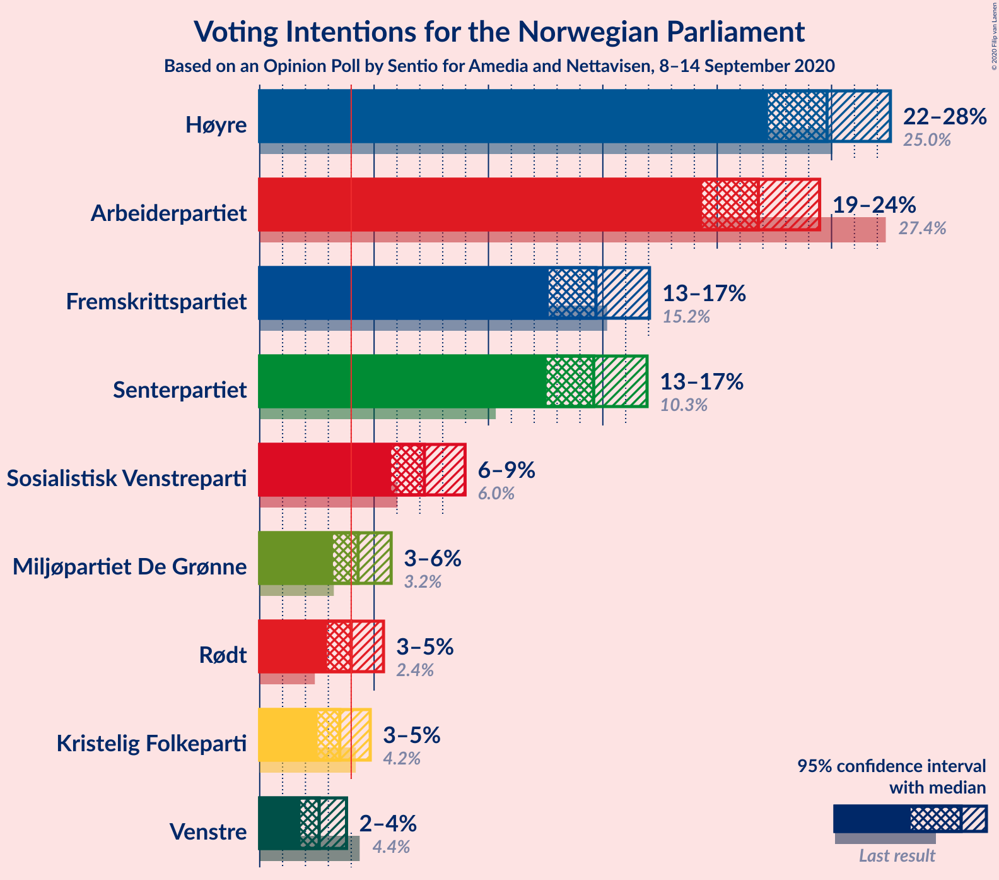

### Confidence Intervals

| Party | Last Result | Poll Result | 80% Confidence Interval | 90% Confidence Interval | 95% Confidence Interval | 99% Confidence Interval |
|:-----:|:-----------:|:-----------:|:-----------------------:|:-----------------------:|:-----------------------:|:-----------------------:|
| Høyre | 25.0% | 24.8% | 23.1–26.6% |22.6–27.1% |22.2–27.6% |21.4–28.5% |
| Arbeiderpartiet | 27.4% | 21.8% | 20.2–23.5% |19.7–24.0% |19.3–24.5% |18.6–25.3% |
| Fremskrittspartiet | 15.2% | 14.7% | 13.3–16.2% |13.0–16.7% |12.6–17.0% |12.0–17.8% |
| Senterpartiet | 10.3% | 14.6% | 13.2–16.1% |12.9–16.6% |12.5–16.9% |11.9–17.7% |
| Sosialistisk Venstreparti | 6.0% | 7.2% | 6.2–8.4% |6.0–8.7% |5.7–9.0% |5.3–9.6% |
| Miljøpartiet De Grønne | 3.2% | 4.3% | 3.6–5.2% |3.4–5.5% |3.2–5.7% |2.9–6.2% |
| Rødt | 2.4% | 4.0% | 3.3–4.9% |3.1–5.2% |2.9–5.4% |2.7–5.9% |
| Kristelig Folkeparti | 4.2% | 3.5% | 2.9–4.4% |2.7–4.6% |2.5–4.8% |2.2–5.3% |
| Venstre | 4.4% | 2.6% | 2.1–3.4% |1.9–3.6% |1.8–3.8% |1.6–4.2% |

*Note:* The poll result column reflects the actual value used in the calculations. Published results may vary slightly, and in addition be rounded to fewer digits.

## Seats

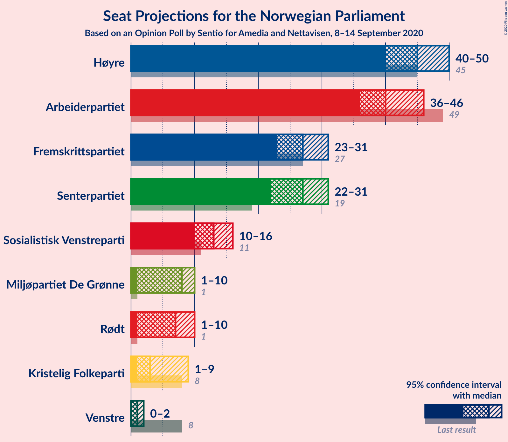

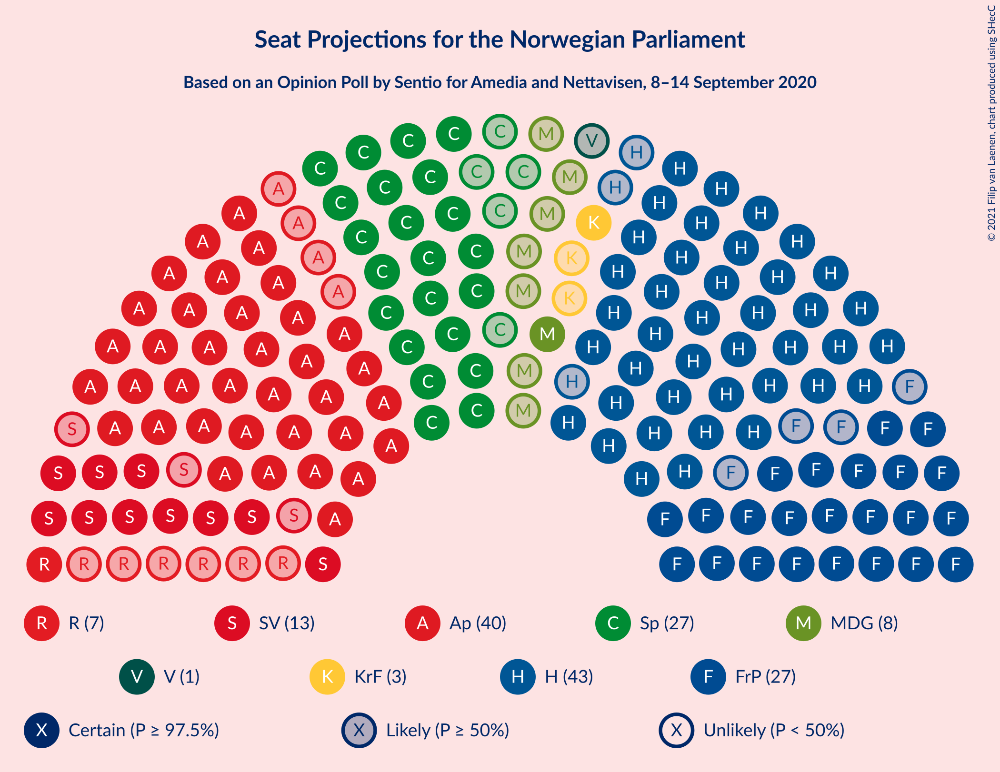

### Confidence Intervals

| Party | Last Result | Median | 80% Confidence Interval | 90% Confidence Interval | 95% Confidence Interval | 99% Confidence Interval |
|:-----:|:-----------:|:------:|:-----------------------:|:-----------------------:|:-----------------------:|:-----------------------:|
| <a href="#høyre">Høyre</a> | 45 | 45 | 42–49 |40–50 |40–50 |38–53 |
| <a href="#arbeiderpartiet">Arbeiderpartiet</a> | 49 | 40 | 37–43 |36–45 |36–46 |34–47 |
| <a href="#fremskrittspartiet">Fremskrittspartiet</a> | 27 | 27 | 24–29 |23–30 |23–31 |21–33 |
| <a href="#senterpartiet">Senterpartiet</a> | 19 | 27 | 24–30 |23–30 |22–31 |21–33 |
| <a href="#sosialistisk-venstreparti">Sosialistisk Venstreparti</a> | 11 | 13 | 11–15 |11–16 |10–16 |9–18 |
| <a href="#miljøpartiet-de-grønne">Miljøpartiet De Grønne</a> | 1 | 8 | 2–9 |1–10 |1–10 |1–11 |
| <a href="#rødt">Rødt</a> | 1 | 7 | 2–9 |2–9 |1–10 |1–10 |
| <a href="#kristelig-folkeparti">Kristelig Folkeparti</a> | 8 | 3 | 1–8 |1–8 |1–9 |0–9 |
| <a href="#venstre">Venstre</a> | 8 | 1 | 1–2 |1–2 |0–2 |0–7 |

### Høyre

*For a full overview of the results for this party, see the [Høyre](party-høyre.html) page.*

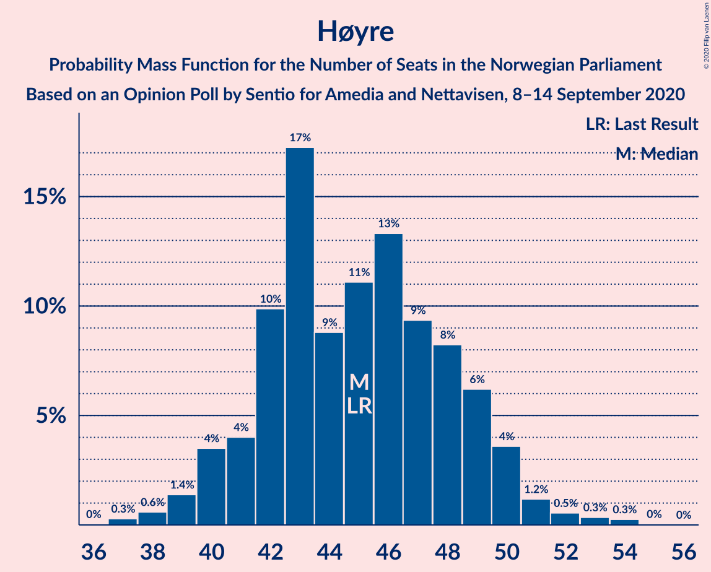

| Number of Seats | Probability | Accumulated | Special Marks |
|:---------------:|:-----------:|:-----------:|:-------------:|
| 36 | 0% | 100% |  |
| 37 | 0.3% | 99.9% |  |
| 38 | 0.6% | 99.6% |  |
| 39 | 1.4% | 99.0% |  |
| 40 | 4% | 98% |  |
| 41 | 4% | 94% |  |
| 42 | 10% | 90% |  |
| 43 | 17% | 80% |  |
| 44 | 9% | 63% |  |
| 45 | 11% | 54% | Last Result, Median |
| 46 | 13% | 43% |  |
| 47 | 9% | 30% |  |
| 48 | 8% | 20% |  |
| 49 | 6% | 12% |  |
| 50 | 4% | 6% |  |
| 51 | 1.2% | 2% |  |
| 52 | 0.5% | 1.2% |  |
| 53 | 0.3% | 0.7% |  |
| 54 | 0.3% | 0.3% |  |
| 55 | 0% | 0.1% |  |
| 56 | 0% | 0% |  |

### Arbeiderpartiet

*For a full overview of the results for this party, see the [Arbeiderpartiet](party-arbeiderpartiet.html) page.*

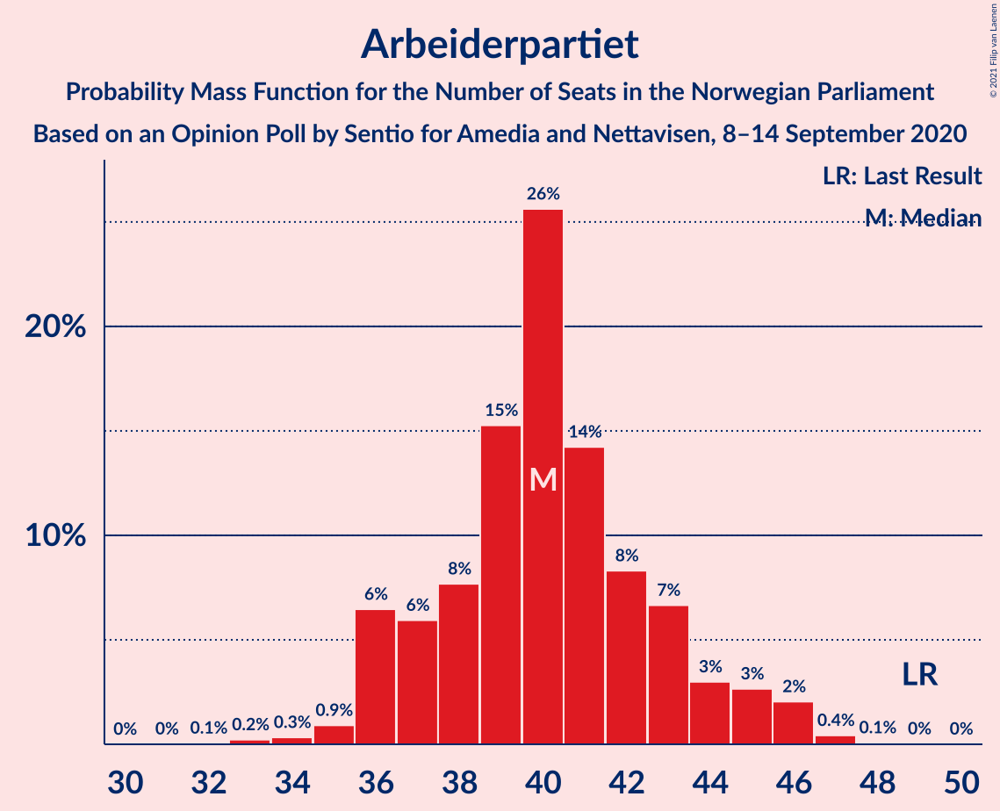

| Number of Seats | Probability | Accumulated | Special Marks |
|:---------------:|:-----------:|:-----------:|:-------------:|
| 32 | 0.1% | 100% |  |
| 33 | 0.2% | 99.9% |  |
| 34 | 0.3% | 99.7% |  |
| 35 | 0.9% | 99.3% |  |
| 36 | 6% | 98% |  |
| 37 | 6% | 92% |  |
| 38 | 8% | 86% |  |
| 39 | 15% | 78% |  |
| 40 | 26% | 63% | Median |
| 41 | 14% | 37% |  |
| 42 | 8% | 23% |  |
| 43 | 7% | 15% |  |
| 44 | 3% | 8% |  |
| 45 | 3% | 5% |  |
| 46 | 2% | 3% |  |
| 47 | 0.4% | 0.6% |  |
| 48 | 0.1% | 0.1% |  |
| 49 | 0% | 0.1% | Last Result |
| 50 | 0% | 0% |  |

### Fremskrittspartiet

*For a full overview of the results for this party, see the [Fremskrittspartiet](party-fremskrittspartiet.html) page.*

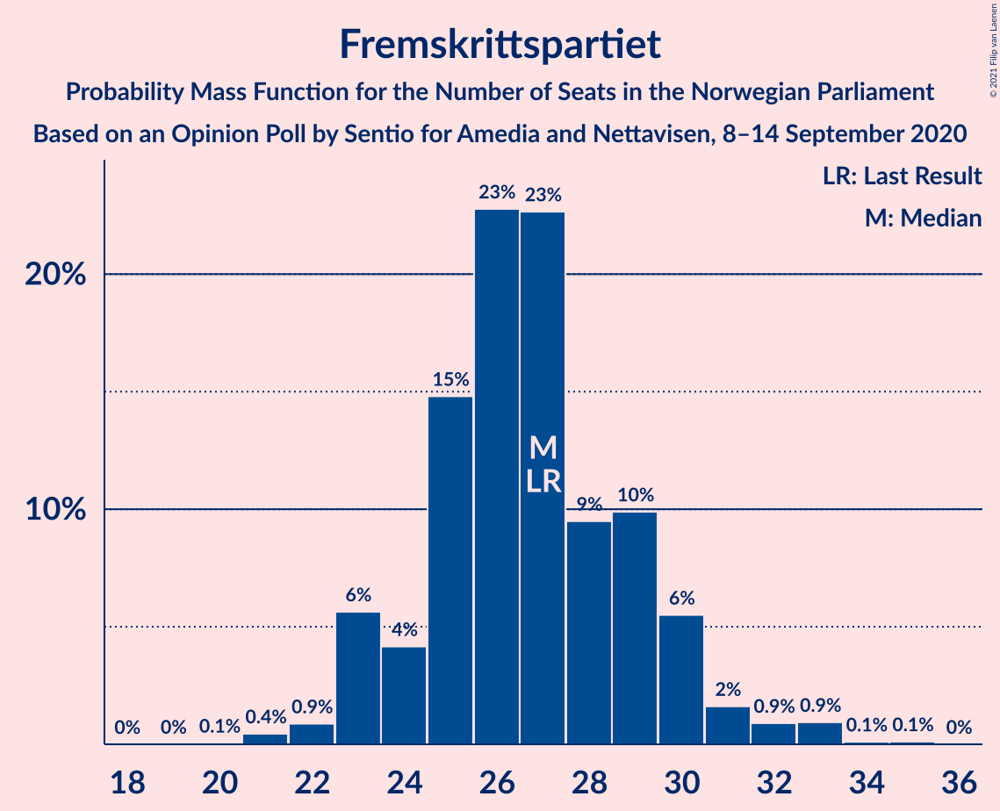

| Number of Seats | Probability | Accumulated | Special Marks |
|:---------------:|:-----------:|:-----------:|:-------------:|
| 20 | 0.1% | 100% |  |
| 21 | 0.4% | 99.9% |  |
| 22 | 0.9% | 99.5% |  |
| 23 | 6% | 98.6% |  |
| 24 | 4% | 93% |  |
| 25 | 15% | 89% |  |
| 26 | 23% | 74% |  |
| 27 | 23% | 51% | Last Result, Median |
| 28 | 9% | 29% |  |
| 29 | 10% | 19% |  |
| 30 | 6% | 9% |  |
| 31 | 2% | 4% |  |
| 32 | 0.9% | 2% |  |
| 33 | 0.9% | 1.2% |  |
| 34 | 0.1% | 0.2% |  |
| 35 | 0.1% | 0.1% |  |
| 36 | 0% | 0% |  |

### Senterpartiet

*For a full overview of the results for this party, see the [Senterpartiet](party-senterpartiet.html) page.*

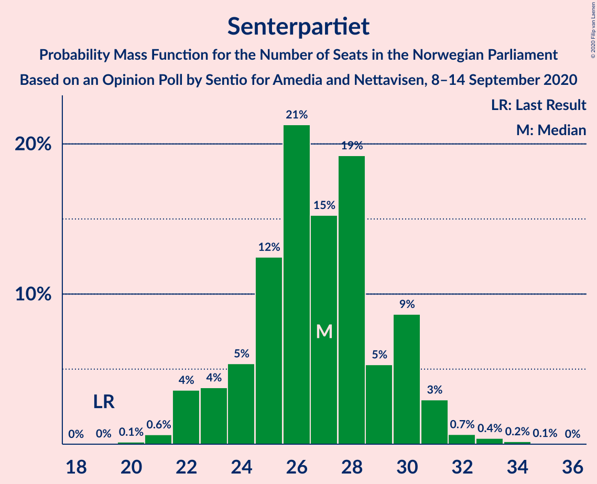

| Number of Seats | Probability | Accumulated | Special Marks |
|:---------------:|:-----------:|:-----------:|:-------------:|
| 19 | 0% | 100% | Last Result |
| 20 | 0.1% | 100% |  |
| 21 | 0.6% | 99.8% |  |
| 22 | 4% | 99.2% |  |
| 23 | 4% | 96% |  |
| 24 | 5% | 92% |  |
| 25 | 12% | 86% |  |
| 26 | 21% | 74% |  |
| 27 | 15% | 53% | Median |
| 28 | 19% | 37% |  |
| 29 | 5% | 18% |  |
| 30 | 9% | 13% |  |
| 31 | 3% | 4% |  |
| 32 | 0.7% | 1.3% |  |
| 33 | 0.4% | 0.7% |  |
| 34 | 0.2% | 0.3% |  |
| 35 | 0.1% | 0.1% |  |
| 36 | 0% | 0% |  |

### Sosialistisk Venstreparti

*For a full overview of the results for this party, see the [Sosialistisk Venstreparti](party-sosialistiskvenstreparti.html) page.*

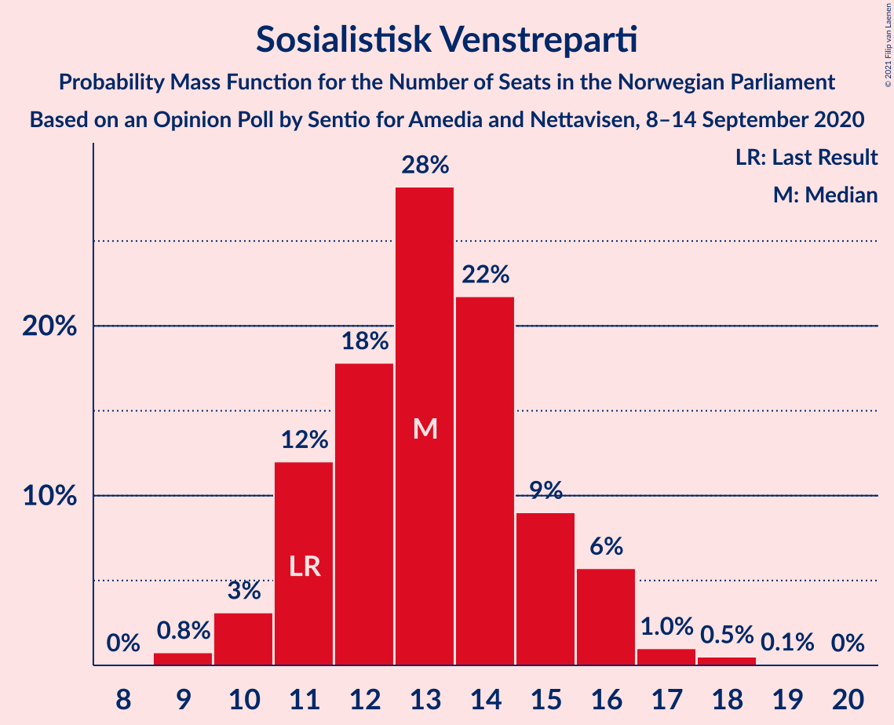

| Number of Seats | Probability | Accumulated | Special Marks |
|:---------------:|:-----------:|:-----------:|:-------------:|
| 9 | 0.8% | 100% |  |
| 10 | 3% | 99.2% |  |
| 11 | 12% | 96% | Last Result |
| 12 | 18% | 84% |  |
| 13 | 28% | 66% | Median |
| 14 | 22% | 38% |  |
| 15 | 9% | 16% |  |
| 16 | 6% | 7% |  |
| 17 | 1.0% | 2% |  |
| 18 | 0.5% | 0.6% |  |
| 19 | 0.1% | 0.1% |  |
| 20 | 0% | 0% |  |

### Miljøpartiet De Grønne

*For a full overview of the results for this party, see the [Miljøpartiet De Grønne](party-miljøpartietdegrønne.html) page.*

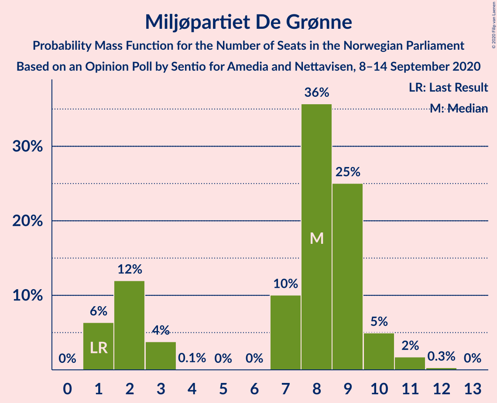

| Number of Seats | Probability | Accumulated | Special Marks |
|:---------------:|:-----------:|:-----------:|:-------------:|
| 1 | 6% | 100% | Last Result |
| 2 | 12% | 94% |  |
| 3 | 4% | 82% |  |
| 4 | 0.1% | 78% |  |
| 5 | 0% | 78% |  |
| 6 | 0% | 78% |  |
| 7 | 10% | 78% |  |
| 8 | 36% | 68% | Median |
| 9 | 25% | 32% |  |
| 10 | 5% | 7% |  |
| 11 | 2% | 2% |  |
| 12 | 0.3% | 0.3% |  |
| 13 | 0% | 0% |  |

### Rødt

*For a full overview of the results for this party, see the [Rødt](party-rødt.html) page.*

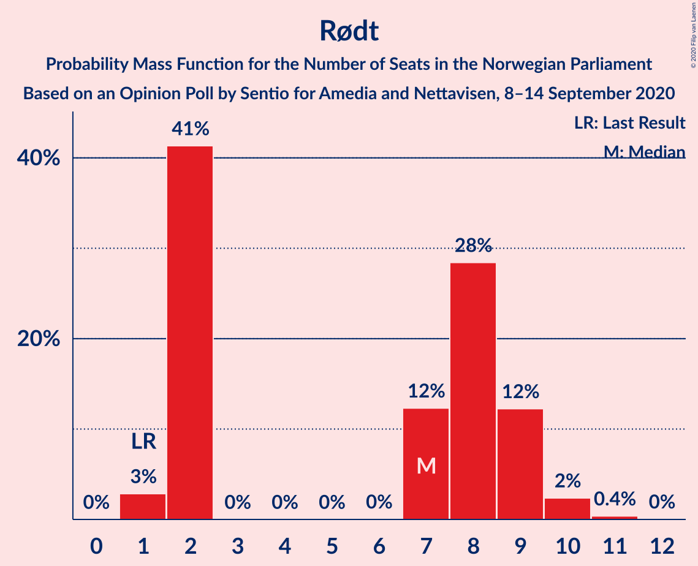

| Number of Seats | Probability | Accumulated | Special Marks |
|:---------------:|:-----------:|:-----------:|:-------------:|
| 1 | 3% | 100% | Last Result |
| 2 | 41% | 97% |  |
| 3 | 0% | 56% |  |
| 4 | 0% | 56% |  |
| 5 | 0% | 56% |  |
| 6 | 0% | 56% |  |
| 7 | 12% | 56% | Median |
| 8 | 28% | 43% |  |
| 9 | 12% | 15% |  |
| 10 | 2% | 3% |  |
| 11 | 0.4% | 0.4% |  |
| 12 | 0% | 0% |  |

### Kristelig Folkeparti

*For a full overview of the results for this party, see the [Kristelig Folkeparti](party-kristeligfolkeparti.html) page.*

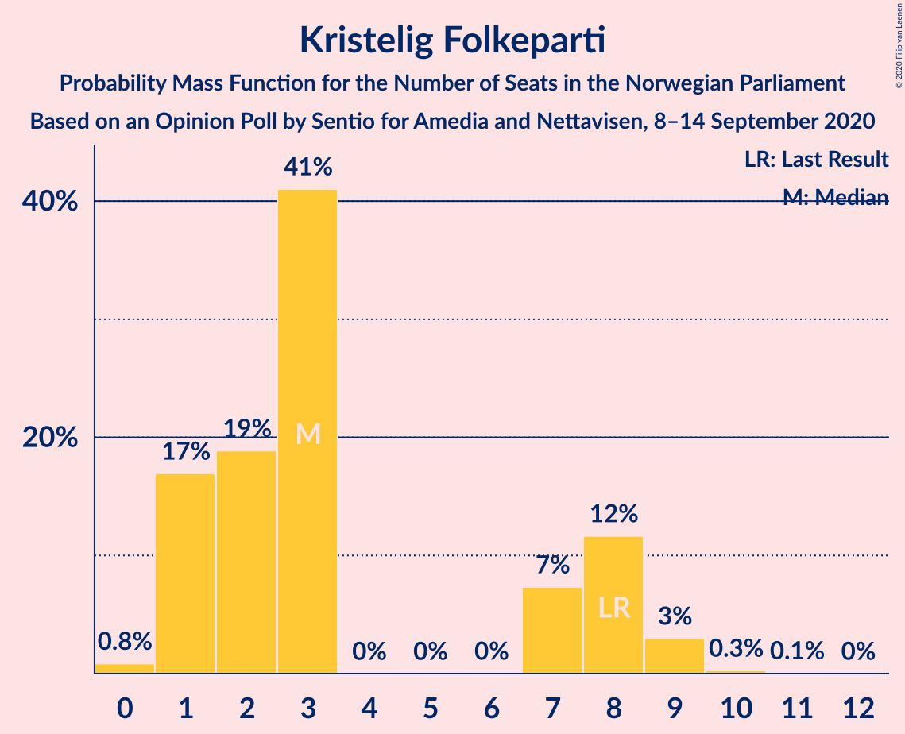

| Number of Seats | Probability | Accumulated | Special Marks |
|:---------------:|:-----------:|:-----------:|:-------------:|
| 0 | 0.8% | 100% |  |
| 1 | 17% | 99.2% |  |
| 2 | 19% | 82% |  |
| 3 | 41% | 63% | Median |
| 4 | 0% | 22% |  |
| 5 | 0% | 22% |  |
| 6 | 0% | 22% |  |
| 7 | 7% | 22% |  |
| 8 | 12% | 15% | Last Result |
| 9 | 3% | 3% |  |
| 10 | 0.3% | 0.3% |  |
| 11 | 0.1% | 0.1% |  |
| 12 | 0% | 0% |  |

### Venstre

*For a full overview of the results for this party, see the [Venstre](party-venstre.html) page.*

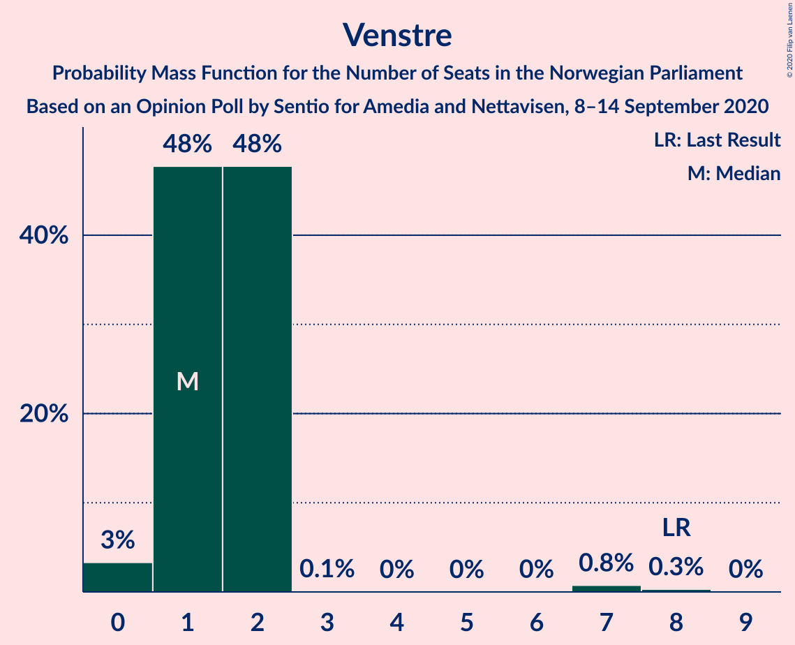

| Number of Seats | Probability | Accumulated | Special Marks |
|:---------------:|:-----------:|:-----------:|:-------------:|
| 0 | 3% | 100% |  |
| 1 | 48% | 97% | Median |
| 2 | 48% | 49% |  |
| 3 | 0.1% | 1.2% |  |
| 4 | 0% | 1.1% |  |
| 5 | 0% | 1.1% |  |
| 6 | 0% | 1.1% |  |
| 7 | 0.8% | 1.1% |  |
| 8 | 0.3% | 0.3% | Last Result |
| 9 | 0% | 0% |  |

## Coalitions

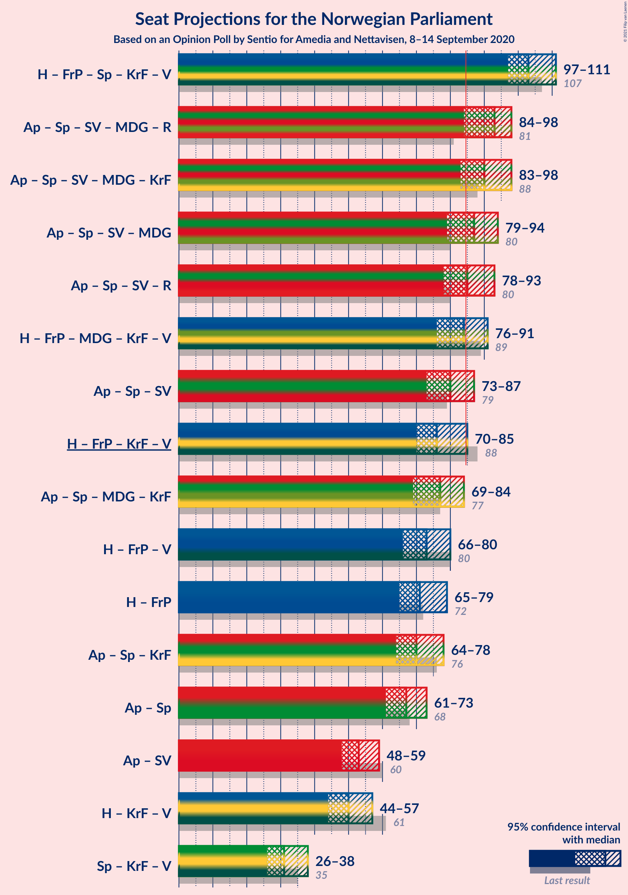

### Confidence Intervals

| Coalition | Last Result | Median | Majority? | 80% Confidence Interval | 90% Confidence Interval | 95% Confidence Interval | 99% Confidence Interval |
|:---------:|:-----------:|:------:|:---------:|:-----------------------:|:-----------------------:|:-----------------------:|:-----------------------:|
| Høyre – Fremskrittspartiet – Senterpartiet – Kristelig Folkeparti – Venstre | 107 | 103 | 100% | 98–109 | 98–111 | 97–111 | 95–114 |
| Arbeiderpartiet – Senterpartiet – Sosialistisk Venstreparti – Miljøpartiet De Grønne – Rødt | 81 | 93 | 96% | 87–97 | 86–98 | 84–98 | 81–101 |
| Arbeiderpartiet – Senterpartiet – Sosialistisk Venstreparti – Miljøpartiet De Grønne – Kristelig Folkeparti | 88 | 90 | 94% | 86–96 | 84–97 | 83–98 | 81–99 |
| Arbeiderpartiet – Senterpartiet – Sosialistisk Venstreparti – Miljøpartiet De Grønne | 80 | 87 | 74% | 82–92 | 81–93 | 79–94 | 77–96 |
| Arbeiderpartiet – Senterpartiet – Sosialistisk Venstreparti – Rødt | 80 | 85 | 58% | 80–90 | 79–91 | 78–93 | 76–94 |
| Høyre – Fremskrittspartiet – Miljøpartiet De Grønne – Kristelig Folkeparti – Venstre | 89 | 84 | 41% | 79–88 | 78–90 | 76–91 | 75–93 |
| Arbeiderpartiet – Senterpartiet – Sosialistisk Venstreparti | 79 | 80 | 11% | 75–85 | 74–86 | 73–87 | 72–89 |
| Høyre – Fremskrittspartiet – Kristelig Folkeparti – Venstre | 88 | 76 | 4% | 72–82 | 71–83 | 70–85 | 68–88 |
| Arbeiderpartiet – Senterpartiet – Miljøpartiet De Grønne – Kristelig Folkeparti | 77 | 77 | 2% | 73–83 | 71–84 | 69–84 | 67–86 |
| Høyre – Fremskrittspartiet – Venstre | 80 | 73 | 0.3% | 69–78 | 67–79 | 66–80 | 65–83 |
| Høyre – Fremskrittspartiet | 72 | 71 | 0.1% | 67–76 | 66–78 | 65–79 | 64–82 |
| Arbeiderpartiet – Senterpartiet – Kristelig Folkeparti | 76 | 70 | 0% | 66–76 | 65–77 | 64–78 | 63–79 |
| Arbeiderpartiet – Senterpartiet | 68 | 67 | 0% | 63–71 | 62–72 | 61–73 | 59–76 |
| Arbeiderpartiet – Sosialistisk Venstreparti | 60 | 53 | 0% | 49–57 | 49–58 | 48–59 | 46–61 |
| Høyre – Kristelig Folkeparti – Venstre | 61 | 50 | 0% | 46–54 | 45–56 | 44–57 | 42–61 |
| Senterpartiet – Kristelig Folkeparti – Venstre | 35 | 31 | 0% | 28–36 | 27–37 | 26–38 | 25–40 |

### Høyre – Fremskrittspartiet – Senterpartiet – Kristelig Folkeparti – Venstre

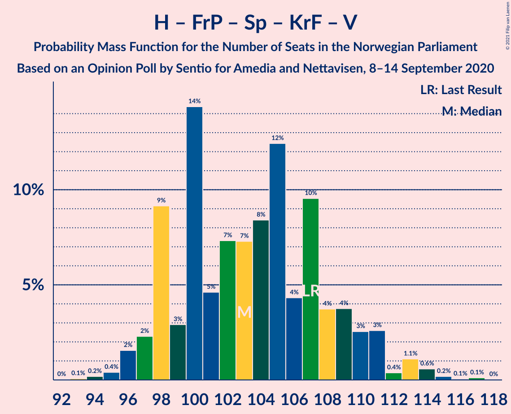

| Number of Seats | Probability | Accumulated | Special Marks |
|:---------------:|:-----------:|:-----------:|:-------------:|
| 93 | 0.1% | 100% |  |
| 94 | 0.2% | 99.9% |  |
| 95 | 0.4% | 99.7% |  |
| 96 | 2% | 99.3% |  |
| 97 | 2% | 98% |  |
| 98 | 9% | 95% |  |
| 99 | 3% | 86% |  |
| 100 | 14% | 83% |  |
| 101 | 5% | 69% |  |
| 102 | 7% | 64% |  |
| 103 | 7% | 57% | Median |
| 104 | 8% | 50% |  |
| 105 | 12% | 41% |  |
| 106 | 4% | 29% |  |
| 107 | 10% | 25% | Last Result |
| 108 | 4% | 15% |  |
| 109 | 4% | 11% |  |
| 110 | 3% | 8% |  |
| 111 | 3% | 5% |  |
| 112 | 0.4% | 2% |  |
| 113 | 1.1% | 2% |  |
| 114 | 0.6% | 1.0% |  |
| 115 | 0.2% | 0.4% |  |
| 116 | 0.1% | 0.2% |  |
| 117 | 0.1% | 0.1% |  |
| 118 | 0% | 0% |  |

### Arbeiderpartiet – Senterpartiet – Sosialistisk Venstreparti – Miljøpartiet De Grønne – Rødt

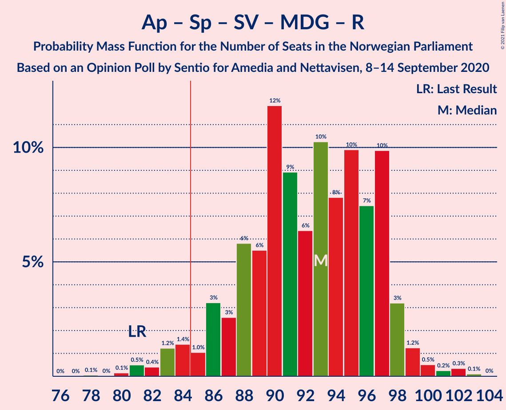

| Number of Seats | Probability | Accumulated | Special Marks |
|:---------------:|:-----------:|:-----------:|:-------------:|
| 78 | 0.1% | 100% |  |
| 79 | 0% | 99.9% |  |
| 80 | 0.1% | 99.9% |  |
| 81 | 0.5% | 99.8% | Last Result |
| 82 | 0.4% | 99.3% |  |
| 83 | 1.2% | 98.9% |  |
| 84 | 1.4% | 98% |  |
| 85 | 1.0% | 96% | Majority |
| 86 | 3% | 95% |  |
| 87 | 3% | 92% |  |
| 88 | 6% | 89% |  |
| 89 | 6% | 84% |  |
| 90 | 12% | 78% |  |
| 91 | 9% | 66% |  |
| 92 | 6% | 57% |  |
| 93 | 10% | 51% |  |
| 94 | 8% | 41% |  |
| 95 | 10% | 33% | Median |
| 96 | 7% | 23% |  |
| 97 | 10% | 16% |  |
| 98 | 3% | 6% |  |
| 99 | 1.2% | 2% |  |
| 100 | 0.5% | 1.2% |  |
| 101 | 0.2% | 0.7% |  |
| 102 | 0.3% | 0.5% |  |
| 103 | 0.1% | 0.1% |  |
| 104 | 0% | 0% |  |

### Arbeiderpartiet – Senterpartiet – Sosialistisk Venstreparti – Miljøpartiet De Grønne – Kristelig Folkeparti

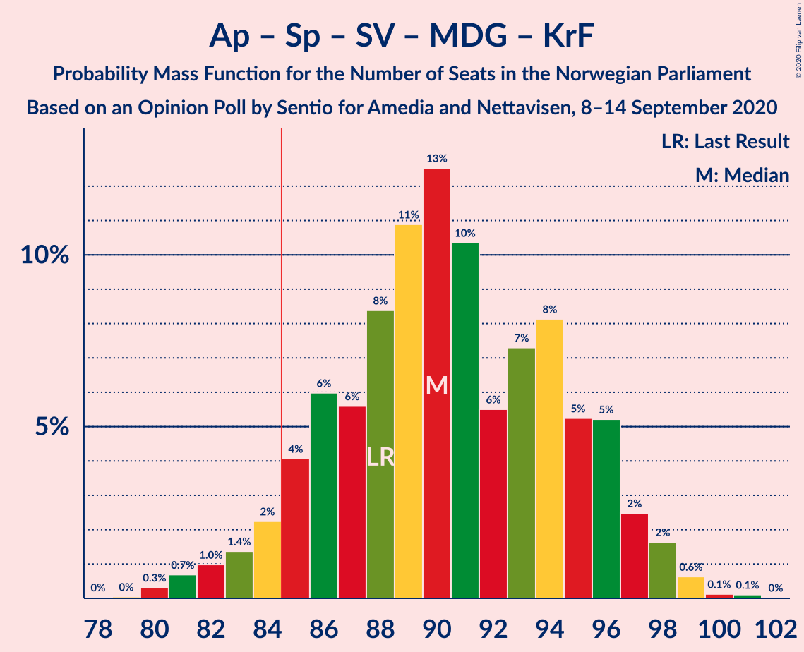

| Number of Seats | Probability | Accumulated | Special Marks |
|:---------------:|:-----------:|:-----------:|:-------------:|
| 78 | 0% | 100% |  |
| 79 | 0% | 99.9% |  |
| 80 | 0.3% | 99.9% |  |
| 81 | 0.7% | 99.6% |  |
| 82 | 1.0% | 98.9% |  |
| 83 | 1.4% | 98% |  |
| 84 | 2% | 97% |  |
| 85 | 4% | 94% | Majority |
| 86 | 6% | 90% |  |
| 87 | 6% | 84% |  |
| 88 | 8% | 79% | Last Result |
| 89 | 11% | 70% |  |
| 90 | 13% | 59% |  |
| 91 | 10% | 47% | Median |
| 92 | 6% | 36% |  |
| 93 | 7% | 31% |  |
| 94 | 8% | 24% |  |
| 95 | 5% | 16% |  |
| 96 | 5% | 10% |  |
| 97 | 2% | 5% |  |
| 98 | 2% | 3% |  |
| 99 | 0.6% | 0.9% |  |
| 100 | 0.1% | 0.3% |  |
| 101 | 0.1% | 0.2% |  |
| 102 | 0% | 0% |  |

### Arbeiderpartiet – Senterpartiet – Sosialistisk Venstreparti – Miljøpartiet De Grønne

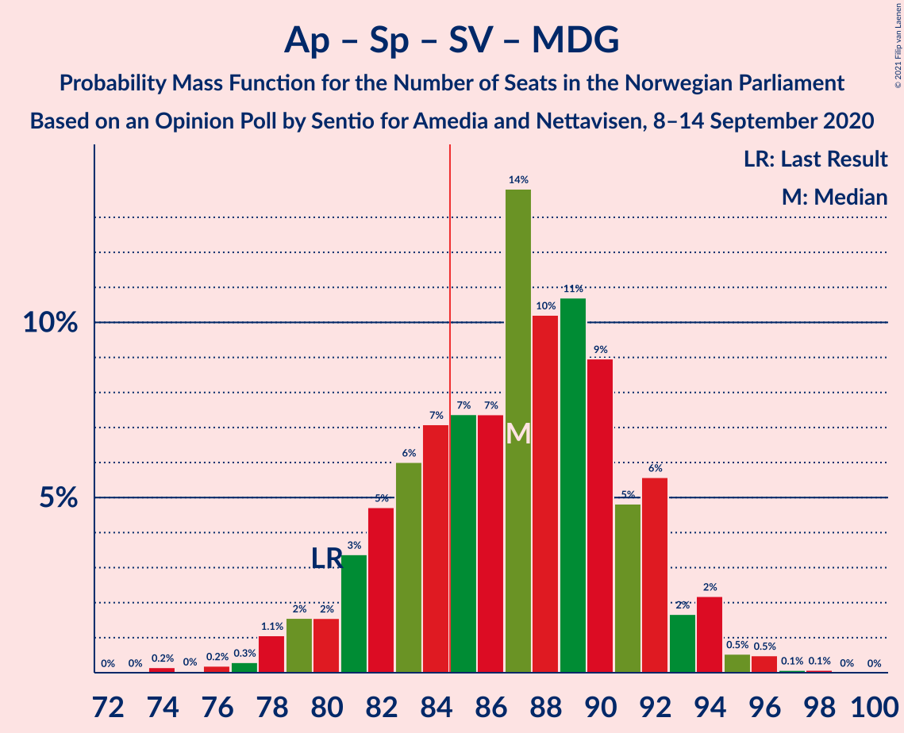

| Number of Seats | Probability | Accumulated | Special Marks |
|:---------------:|:-----------:|:-----------:|:-------------:|
| 74 | 0.2% | 100% |  |
| 75 | 0% | 99.8% |  |
| 76 | 0.2% | 99.8% |  |
| 77 | 0.3% | 99.6% |  |
| 78 | 1.1% | 99.3% |  |
| 79 | 2% | 98% |  |
| 80 | 2% | 97% | Last Result |
| 81 | 3% | 95% |  |
| 82 | 5% | 92% |  |
| 83 | 6% | 87% |  |
| 84 | 7% | 81% |  |
| 85 | 7% | 74% | Majority |
| 86 | 7% | 67% |  |
| 87 | 14% | 59% |  |
| 88 | 10% | 45% | Median |
| 89 | 11% | 35% |  |
| 90 | 9% | 24% |  |
| 91 | 5% | 15% |  |
| 92 | 6% | 11% |  |
| 93 | 2% | 5% |  |
| 94 | 2% | 3% |  |
| 95 | 0.5% | 1.2% |  |
| 96 | 0.5% | 0.7% |  |
| 97 | 0.1% | 0.2% |  |
| 98 | 0.1% | 0.1% |  |
| 99 | 0% | 0% |  |

### Arbeiderpartiet – Senterpartiet – Sosialistisk Venstreparti – Rødt

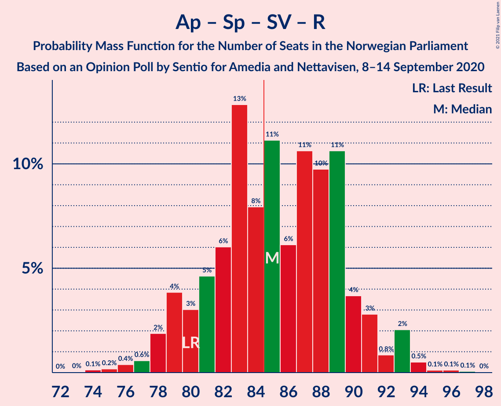

| Number of Seats | Probability | Accumulated | Special Marks |
|:---------------:|:-----------:|:-----------:|:-------------:|
| 73 | 0% | 100% |  |
| 74 | 0.1% | 99.9% |  |
| 75 | 0.2% | 99.8% |  |
| 76 | 0.4% | 99.6% |  |
| 77 | 0.6% | 99.2% |  |
| 78 | 2% | 98.7% |  |
| 79 | 4% | 97% |  |
| 80 | 3% | 93% | Last Result |
| 81 | 5% | 90% |  |
| 82 | 6% | 85% |  |
| 83 | 13% | 79% |  |
| 84 | 8% | 66% |  |
| 85 | 11% | 58% | Majority |
| 86 | 6% | 47% |  |
| 87 | 11% | 41% | Median |
| 88 | 10% | 31% |  |
| 89 | 11% | 21% |  |
| 90 | 4% | 10% |  |
| 91 | 3% | 7% |  |
| 92 | 0.8% | 4% |  |
| 93 | 2% | 3% |  |
| 94 | 0.5% | 0.8% |  |
| 95 | 0.1% | 0.3% |  |
| 96 | 0.1% | 0.2% |  |
| 97 | 0.1% | 0.1% |  |
| 98 | 0% | 0% |  |

### Høyre – Fremskrittspartiet – Miljøpartiet De Grønne – Kristelig Folkeparti – Venstre

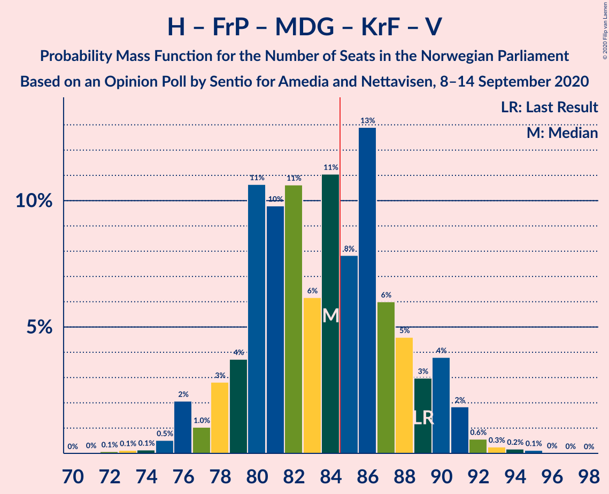

| Number of Seats | Probability | Accumulated | Special Marks |
|:---------------:|:-----------:|:-----------:|:-------------:|
| 71 | 0% | 100% |  |
| 72 | 0.1% | 99.9% |  |
| 73 | 0.1% | 99.9% |  |
| 74 | 0.1% | 99.7% |  |
| 75 | 0.5% | 99.6% |  |
| 76 | 2% | 99.1% |  |
| 77 | 1.0% | 97% |  |
| 78 | 3% | 96% |  |
| 79 | 4% | 93% |  |
| 80 | 11% | 89% |  |
| 81 | 10% | 79% |  |
| 82 | 11% | 69% |  |
| 83 | 6% | 58% |  |
| 84 | 11% | 52% | Median |
| 85 | 8% | 41% | Majority |
| 86 | 13% | 33% |  |
| 87 | 6% | 20% |  |
| 88 | 5% | 14% |  |
| 89 | 3% | 10% | Last Result |
| 90 | 4% | 7% |  |
| 91 | 2% | 3% |  |
| 92 | 0.6% | 1.2% |  |
| 93 | 0.3% | 0.6% |  |
| 94 | 0.2% | 0.3% |  |
| 95 | 0.1% | 0.2% |  |
| 96 | 0% | 0.1% |  |
| 97 | 0% | 0% |  |

### Arbeiderpartiet – Senterpartiet – Sosialistisk Venstreparti

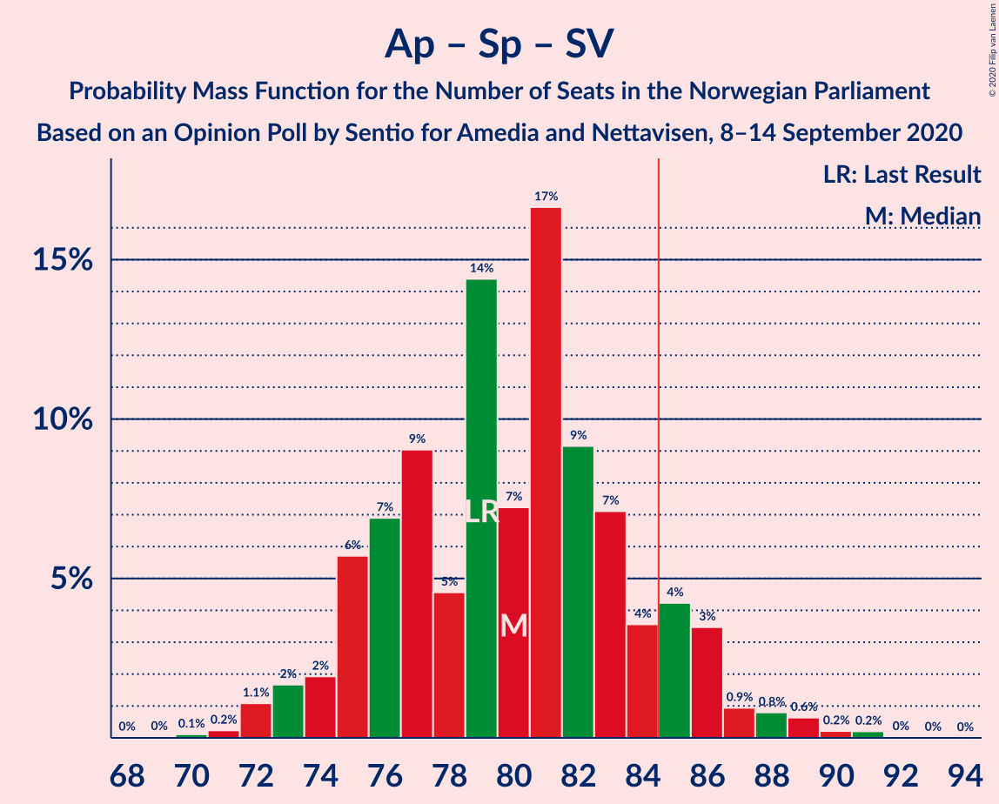

| Number of Seats | Probability | Accumulated | Special Marks |
|:---------------:|:-----------:|:-----------:|:-------------:|
| 69 | 0% | 100% |  |
| 70 | 0.1% | 99.9% |  |
| 71 | 0.2% | 99.8% |  |
| 72 | 1.1% | 99.6% |  |
| 73 | 2% | 98% |  |
| 74 | 2% | 97% |  |
| 75 | 6% | 95% |  |
| 76 | 7% | 89% |  |
| 77 | 9% | 82% |  |
| 78 | 5% | 73% |  |
| 79 | 14% | 69% | Last Result |
| 80 | 7% | 54% | Median |
| 81 | 17% | 47% |  |
| 82 | 9% | 30% |  |
| 83 | 7% | 21% |  |
| 84 | 4% | 14% |  |
| 85 | 4% | 11% | Majority |
| 86 | 3% | 6% |  |
| 87 | 0.9% | 3% |  |
| 88 | 0.8% | 2% |  |
| 89 | 0.6% | 1.1% |  |
| 90 | 0.2% | 0.5% |  |
| 91 | 0.2% | 0.3% |  |
| 92 | 0% | 0.1% |  |
| 93 | 0% | 0% |  |

### Høyre – Fremskrittspartiet – Kristelig Folkeparti – Venstre

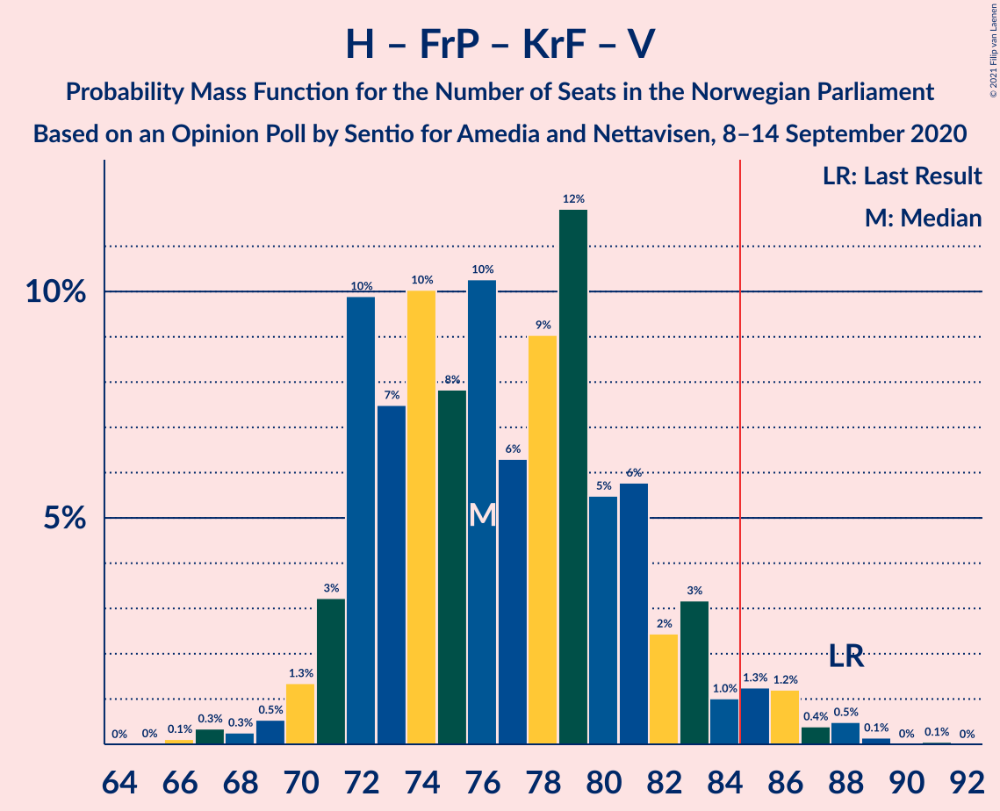

| Number of Seats | Probability | Accumulated | Special Marks |
|:---------------:|:-----------:|:-----------:|:-------------:|
| 66 | 0.1% | 100% |  |
| 67 | 0.3% | 99.9% |  |
| 68 | 0.3% | 99.5% |  |
| 69 | 0.5% | 99.3% |  |
| 70 | 1.3% | 98.7% |  |
| 71 | 3% | 97% |  |
| 72 | 10% | 94% |  |
| 73 | 7% | 84% |  |
| 74 | 10% | 77% |  |
| 75 | 8% | 67% |  |
| 76 | 10% | 59% | Median |
| 77 | 6% | 49% |  |
| 78 | 9% | 42% |  |
| 79 | 12% | 33% |  |
| 80 | 5% | 21% |  |
| 81 | 6% | 16% |  |
| 82 | 2% | 10% |  |
| 83 | 3% | 8% |  |
| 84 | 1.0% | 5% |  |
| 85 | 1.3% | 4% | Majority |
| 86 | 1.2% | 2% |  |
| 87 | 0.4% | 1.1% |  |
| 88 | 0.5% | 0.7% | Last Result |
| 89 | 0.1% | 0.2% |  |
| 90 | 0% | 0.1% |  |
| 91 | 0.1% | 0.1% |  |
| 92 | 0% | 0% |  |

### Arbeiderpartiet – Senterpartiet – Miljøpartiet De Grønne – Kristelig Folkeparti

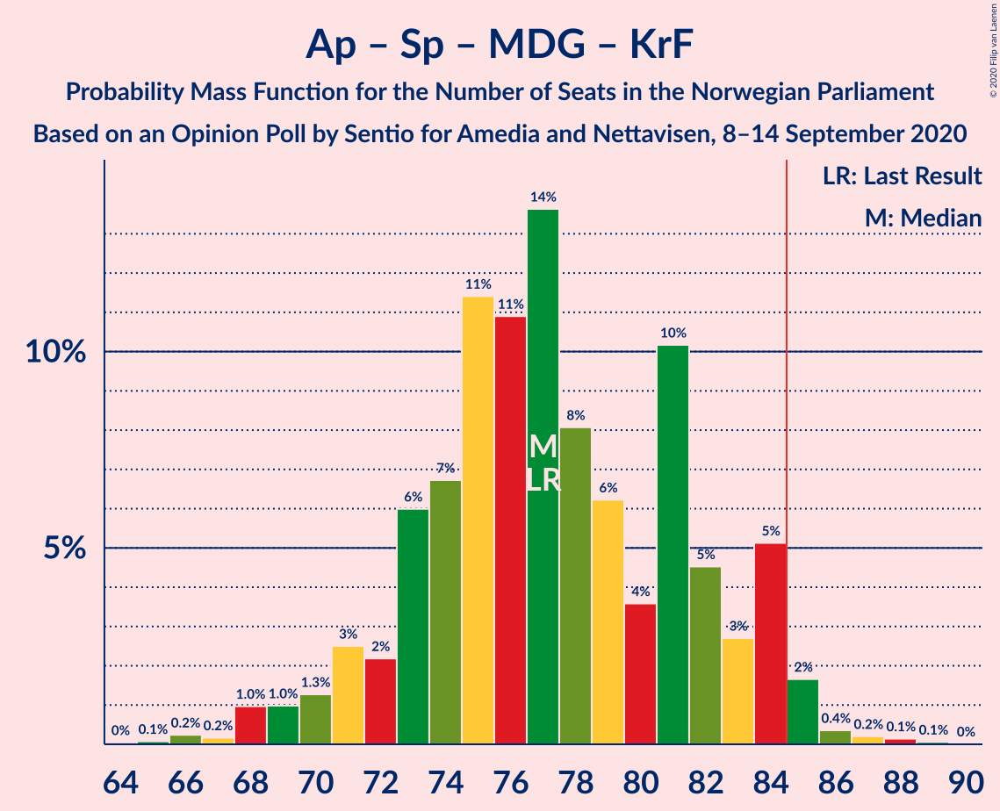

| Number of Seats | Probability | Accumulated | Special Marks |
|:---------------:|:-----------:|:-----------:|:-------------:|
| 64 | 0% | 100% |  |
| 65 | 0.1% | 99.9% |  |
| 66 | 0.2% | 99.9% |  |
| 67 | 0.2% | 99.6% |  |
| 68 | 1.0% | 99.4% |  |
| 69 | 1.0% | 98% |  |
| 70 | 1.3% | 97% |  |
| 71 | 3% | 96% |  |
| 72 | 2% | 94% |  |
| 73 | 6% | 92% |  |
| 74 | 7% | 86% |  |
| 75 | 11% | 79% |  |
| 76 | 11% | 67% |  |
| 77 | 14% | 56% | Last Result |
| 78 | 8% | 43% | Median |
| 79 | 6% | 35% |  |
| 80 | 4% | 29% |  |
| 81 | 10% | 25% |  |
| 82 | 5% | 15% |  |
| 83 | 3% | 10% |  |
| 84 | 5% | 8% |  |
| 85 | 2% | 2% | Majority |
| 86 | 0.4% | 0.8% |  |
| 87 | 0.2% | 0.4% |  |
| 88 | 0.1% | 0.2% |  |
| 89 | 0.1% | 0.1% |  |
| 90 | 0% | 0% |  |

### Høyre – Fremskrittspartiet – Venstre

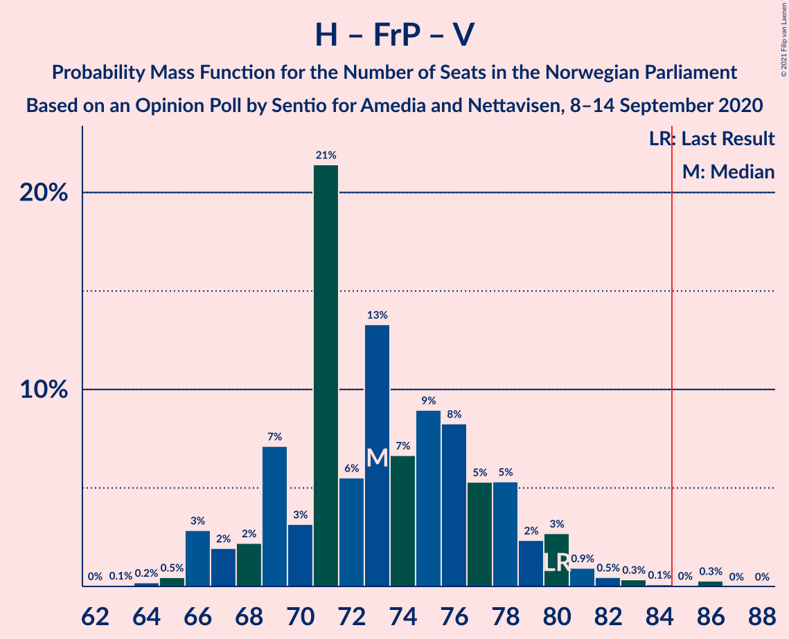

| Number of Seats | Probability | Accumulated | Special Marks |
|:---------------:|:-----------:|:-----------:|:-------------:|
| 62 | 0% | 100% |  |
| 63 | 0.1% | 99.9% |  |
| 64 | 0.2% | 99.9% |  |
| 65 | 0.5% | 99.7% |  |
| 66 | 3% | 99.2% |  |
| 67 | 2% | 96% |  |
| 68 | 2% | 94% |  |
| 69 | 7% | 92% |  |
| 70 | 3% | 85% |  |
| 71 | 21% | 82% |  |
| 72 | 6% | 61% |  |
| 73 | 13% | 55% | Median |
| 74 | 7% | 42% |  |
| 75 | 9% | 35% |  |
| 76 | 8% | 26% |  |
| 77 | 5% | 18% |  |
| 78 | 5% | 13% |  |
| 79 | 2% | 7% |  |
| 80 | 3% | 5% | Last Result |
| 81 | 0.9% | 2% |  |
| 82 | 0.5% | 1.2% |  |
| 83 | 0.3% | 0.8% |  |
| 84 | 0.1% | 0.4% |  |
| 85 | 0% | 0.3% | Majority |
| 86 | 0.3% | 0.3% |  |
| 87 | 0% | 0% |  |

### Høyre – Fremskrittspartiet

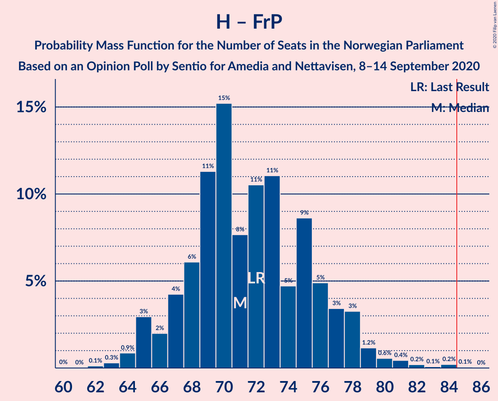

| Number of Seats | Probability | Accumulated | Special Marks |
|:---------------:|:-----------:|:-----------:|:-------------:|
| 60 | 0% | 100% |  |
| 61 | 0% | 99.9% |  |
| 62 | 0.1% | 99.9% |  |
| 63 | 0.3% | 99.8% |  |
| 64 | 0.9% | 99.5% |  |
| 65 | 3% | 98.6% |  |
| 66 | 2% | 96% |  |
| 67 | 4% | 94% |  |
| 68 | 6% | 89% |  |
| 69 | 11% | 83% |  |
| 70 | 15% | 72% |  |
| 71 | 8% | 57% |  |
| 72 | 11% | 49% | Last Result, Median |
| 73 | 11% | 39% |  |
| 74 | 5% | 28% |  |
| 75 | 9% | 23% |  |
| 76 | 5% | 14% |  |
| 77 | 3% | 9% |  |
| 78 | 3% | 6% |  |
| 79 | 1.2% | 3% |  |
| 80 | 0.6% | 2% |  |
| 81 | 0.4% | 1.0% |  |
| 82 | 0.2% | 0.5% |  |
| 83 | 0.1% | 0.3% |  |
| 84 | 0.2% | 0.3% |  |
| 85 | 0.1% | 0.1% | Majority |
| 86 | 0% | 0% |  |

### Arbeiderpartiet – Senterpartiet – Kristelig Folkeparti

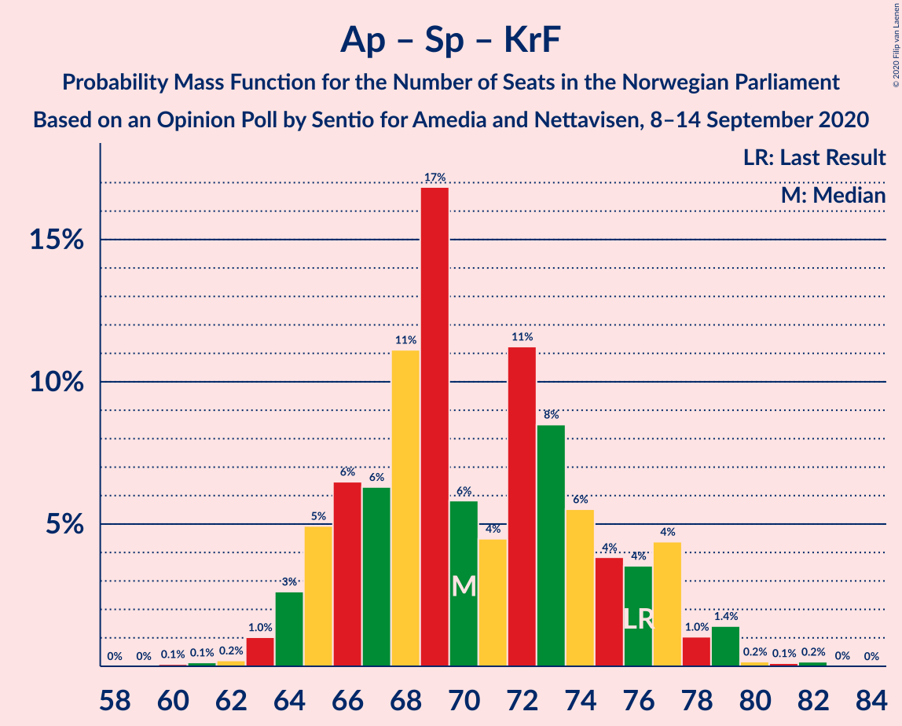

| Number of Seats | Probability | Accumulated | Special Marks |
|:---------------:|:-----------:|:-----------:|:-------------:|
| 60 | 0.1% | 100% |  |
| 61 | 0.1% | 99.9% |  |
| 62 | 0.2% | 99.8% |  |
| 63 | 1.0% | 99.6% |  |
| 64 | 3% | 98.5% |  |
| 65 | 5% | 96% |  |
| 66 | 6% | 91% |  |
| 67 | 6% | 84% |  |
| 68 | 11% | 78% |  |
| 69 | 17% | 67% |  |
| 70 | 6% | 50% | Median |
| 71 | 4% | 44% |  |
| 72 | 11% | 40% |  |
| 73 | 8% | 29% |  |
| 74 | 6% | 20% |  |
| 75 | 4% | 15% |  |
| 76 | 4% | 11% | Last Result |
| 77 | 4% | 7% |  |
| 78 | 1.0% | 3% |  |
| 79 | 1.4% | 2% |  |
| 80 | 0.2% | 0.5% |  |
| 81 | 0.1% | 0.3% |  |
| 82 | 0.2% | 0.2% |  |
| 83 | 0% | 0% |  |

### Arbeiderpartiet – Senterpartiet

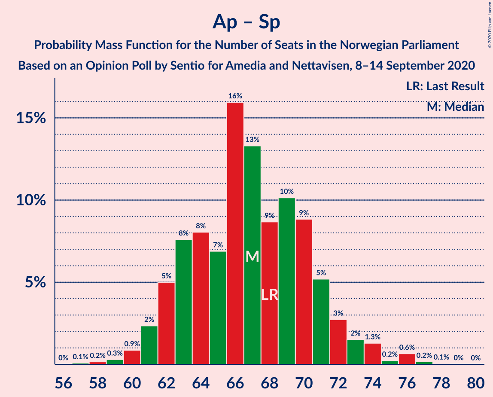

| Number of Seats | Probability | Accumulated | Special Marks |
|:---------------:|:-----------:|:-----------:|:-------------:|
| 57 | 0.1% | 100% |  |
| 58 | 0.2% | 99.9% |  |
| 59 | 0.3% | 99.7% |  |
| 60 | 0.9% | 99.5% |  |
| 61 | 2% | 98.6% |  |
| 62 | 5% | 96% |  |
| 63 | 8% | 91% |  |
| 64 | 8% | 84% |  |
| 65 | 7% | 76% |  |
| 66 | 16% | 69% |  |
| 67 | 13% | 53% | Median |
| 68 | 9% | 39% | Last Result |
| 69 | 10% | 31% |  |
| 70 | 9% | 21% |  |
| 71 | 5% | 12% |  |
| 72 | 3% | 7% |  |
| 73 | 2% | 4% |  |
| 74 | 1.3% | 2% |  |
| 75 | 0.2% | 1.1% |  |
| 76 | 0.6% | 0.9% |  |
| 77 | 0.2% | 0.2% |  |
| 78 | 0.1% | 0.1% |  |
| 79 | 0% | 0% |  |

### Arbeiderpartiet – Sosialistisk Venstreparti

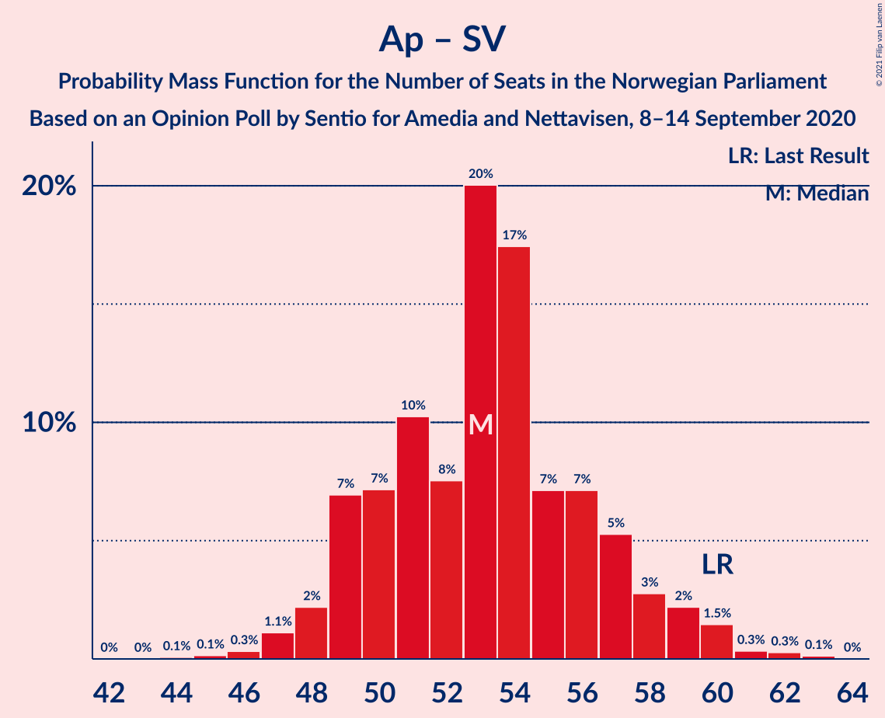

| Number of Seats | Probability | Accumulated | Special Marks |
|:---------------:|:-----------:|:-----------:|:-------------:|
| 44 | 0.1% | 100% |  |
| 45 | 0.1% | 99.9% |  |
| 46 | 0.3% | 99.7% |  |
| 47 | 1.1% | 99.4% |  |
| 48 | 2% | 98% |  |
| 49 | 7% | 96% |  |
| 50 | 7% | 89% |  |
| 51 | 10% | 82% |  |
| 52 | 8% | 72% |  |
| 53 | 20% | 64% | Median |
| 54 | 17% | 44% |  |
| 55 | 7% | 27% |  |
| 56 | 7% | 20% |  |
| 57 | 5% | 12% |  |
| 58 | 3% | 7% |  |
| 59 | 2% | 4% |  |
| 60 | 1.5% | 2% | Last Result |
| 61 | 0.3% | 0.8% |  |
| 62 | 0.3% | 0.4% |  |
| 63 | 0.1% | 0.2% |  |
| 64 | 0% | 0% |  |

### Høyre – Kristelig Folkeparti – Venstre

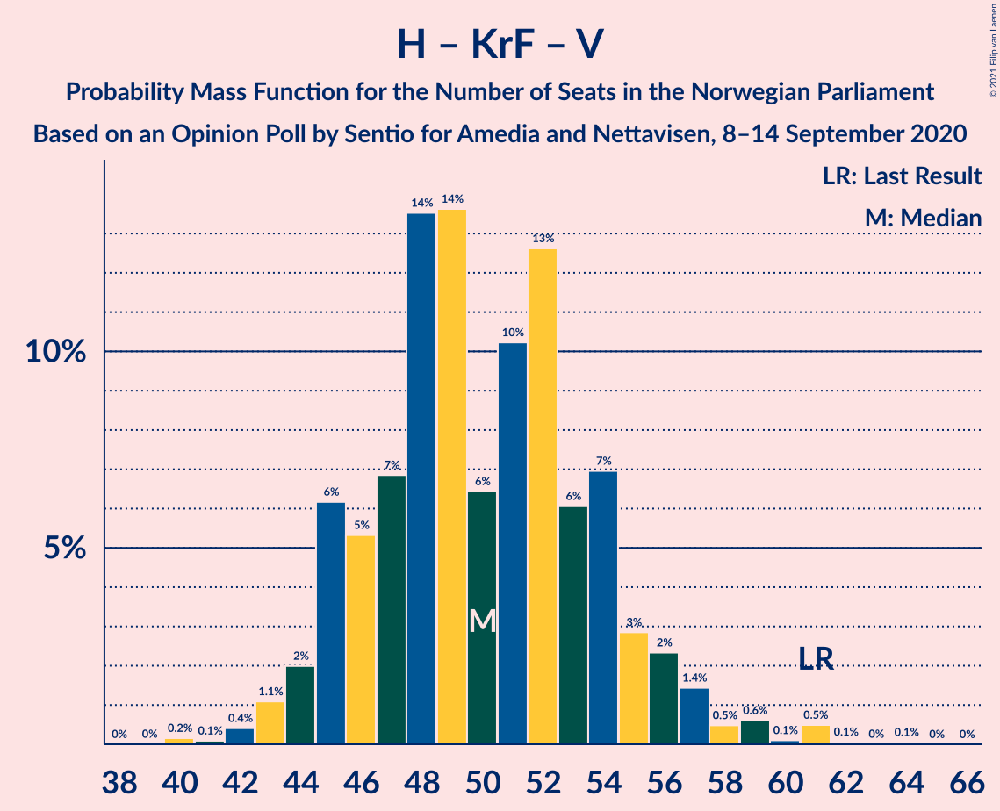

| Number of Seats | Probability | Accumulated | Special Marks |
|:---------------:|:-----------:|:-----------:|:-------------:|
| 40 | 0.2% | 100% |  |
| 41 | 0.1% | 99.8% |  |
| 42 | 0.4% | 99.7% |  |
| 43 | 1.1% | 99.3% |  |
| 44 | 2% | 98% |  |
| 45 | 6% | 96% |  |
| 46 | 5% | 90% |  |
| 47 | 7% | 85% |  |
| 48 | 14% | 78% |  |
| 49 | 14% | 64% | Median |
| 50 | 6% | 51% |  |
| 51 | 10% | 44% |  |
| 52 | 13% | 34% |  |
| 53 | 6% | 21% |  |
| 54 | 7% | 15% |  |
| 55 | 3% | 8% |  |
| 56 | 2% | 6% |  |
| 57 | 1.4% | 3% |  |
| 58 | 0.5% | 2% |  |
| 59 | 0.6% | 1.3% |  |
| 60 | 0.1% | 0.7% |  |
| 61 | 0.5% | 0.6% | Last Result |
| 62 | 0.1% | 0.1% |  |
| 63 | 0% | 0.1% |  |
| 64 | 0.1% | 0.1% |  |
| 65 | 0% | 0% |  |

### Senterpartiet – Kristelig Folkeparti – Venstre

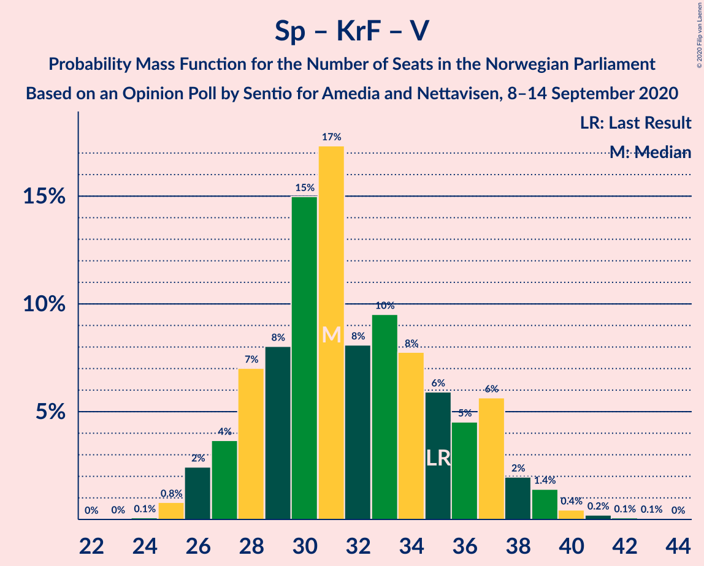

| Number of Seats | Probability | Accumulated | Special Marks |
|:---------------:|:-----------:|:-----------:|:-------------:|
| 24 | 0.1% | 100% |  |
| 25 | 0.8% | 99.9% |  |
| 26 | 2% | 99.1% |  |
| 27 | 4% | 97% |  |
| 28 | 7% | 93% |  |
| 29 | 8% | 86% |  |
| 30 | 15% | 78% |  |
| 31 | 17% | 63% | Median |
| 32 | 8% | 46% |  |
| 33 | 10% | 38% |  |
| 34 | 8% | 28% |  |
| 35 | 6% | 20% | Last Result |
| 36 | 5% | 14% |  |
| 37 | 6% | 10% |  |
| 38 | 2% | 4% |  |
| 39 | 1.4% | 2% |  |
| 40 | 0.4% | 0.8% |  |
| 41 | 0.2% | 0.4% |  |
| 42 | 0.1% | 0.2% |  |
| 43 | 0.1% | 0.1% |  |
| 44 | 0% | 0% |  |

## Technical Information

### Opinion Poll

+ **Polling firm:** Sentio
+ **Commissioner(s):** Amedia and Nettavisen
+ **Fieldwork period:** 8–14 September 2020

### Calculations

+ **Sample size:** 1000
+ **Simulations done:** 1,048,576
+ **Error estimate:** 2.16%

