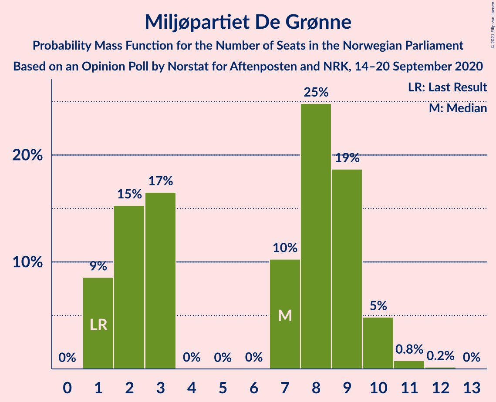
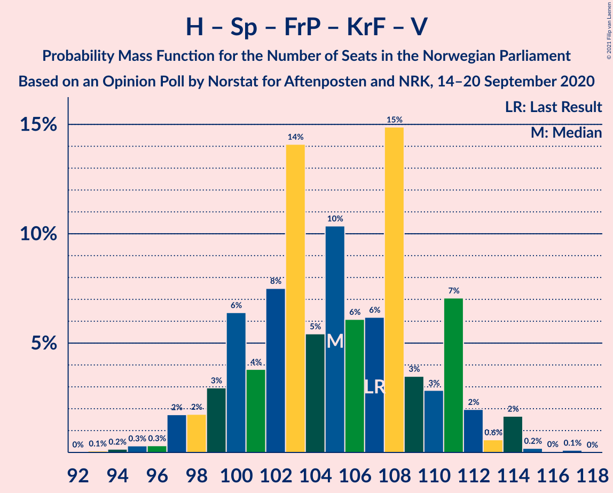
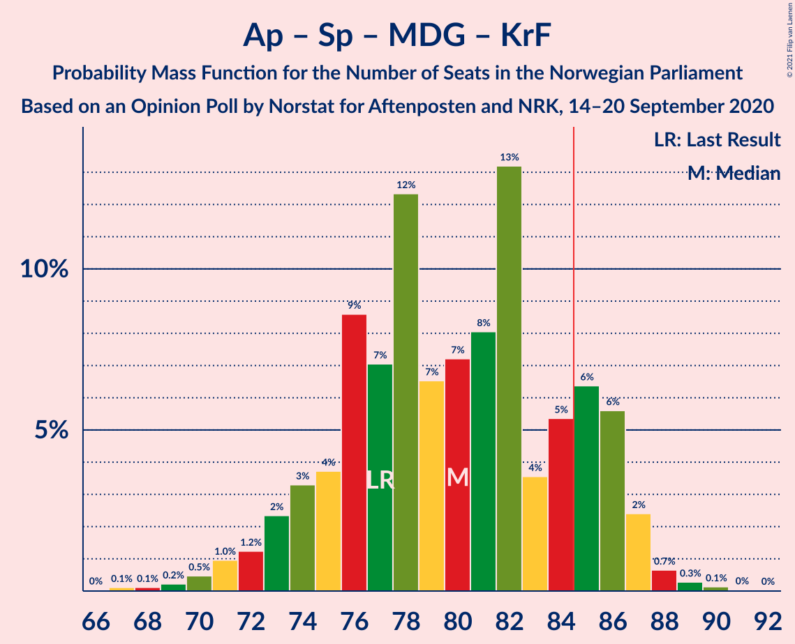
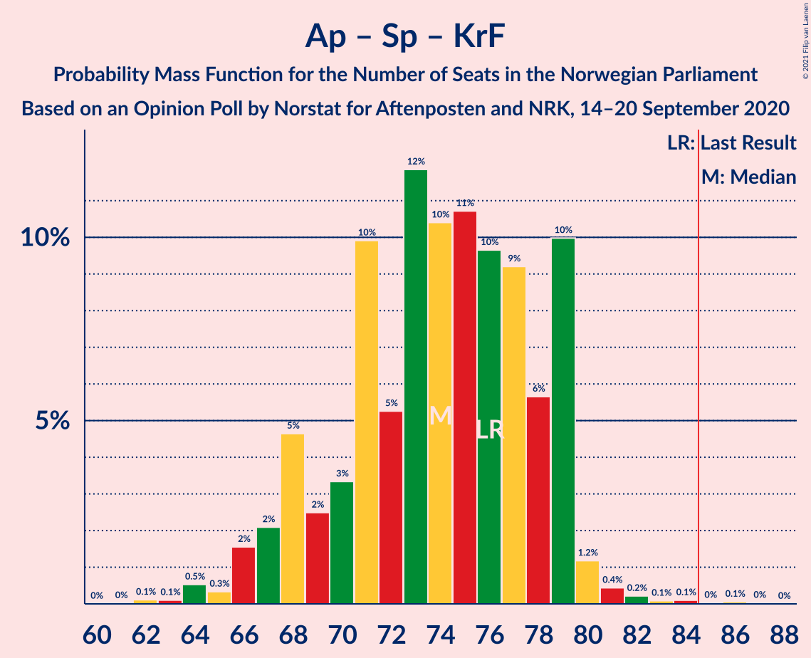
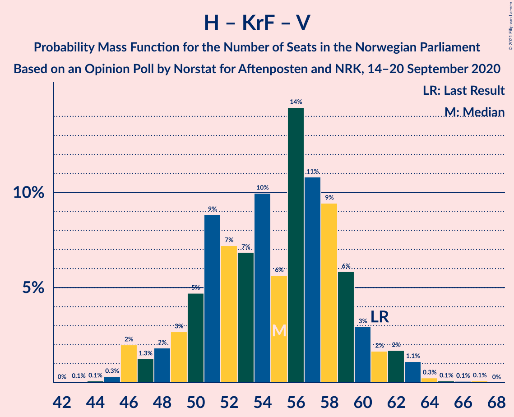

# Opinion Poll by Norstat for Aftenposten and NRK, 14–20 September 2020

<a href="#voting-intentions">Voting Intentions</a> | <a href="#seats">Seats</a> | <a href="#coalitions">Coalitions</a> | <a href="#technical-information">Technical Information</a>

## Voting Intentions

### Confidence Intervals

| Party | Last Result | Poll Result | 80% Confidence Interval | 90% Confidence Interval | 95% Confidence Interval | 99% Confidence Interval |
|:-----:|:-----------:|:-----------:|:-----------------------:|:-----------------------:|:-----------------------:|:-----------------------:|
| Høyre | 25.0% | 25.3% | 23.6–27.2% |23.1–27.7% |22.6–28.2% |21.8–29.1% |
| Arbeiderpartiet | 27.4% | 22.6% | 20.9–24.4% |20.4–24.9% |20.0–25.3% |19.2–26.2% |
| Senterpartiet | 10.3% | 14.3% | 13.0–15.9% |12.6–16.3% |12.3–16.7% |11.6–17.5% |
| Fremskrittspartiet | 15.2% | 13.3% | 12.0–14.8% |11.6–15.2% |11.3–15.6% |10.7–16.4% |
| Sosialistisk Venstreparti | 6.0% | 7.8% | 6.8–9.0% |6.5–9.4% |6.3–9.7% |5.8–10.3% |
| Miljøpartiet De Grønne | 3.2% | 4.2% | 3.5–5.2% |3.3–5.5% |3.1–5.7% |2.8–6.2% |
| Kristelig Folkeparti | 4.2% | 4.1% | 3.4–5.1% |3.2–5.3% |3.0–5.6% |2.7–6.1% |
| Rødt | 2.4% | 3.4% | 2.7–4.3% |2.5–4.5% |2.4–4.7% |2.1–5.2% |
| Venstre | 4.4% | 3.2% | 2.5–4.0% |2.4–4.3% |2.2–4.5% |2.0–4.9% |

*Note:* The poll result column reflects the actual value used in the calculations. Published results may vary slightly, and in addition be rounded to fewer digits.

## Seats

### Confidence Intervals

| Party | Last Result | Median | 80% Confidence Interval | 90% Confidence Interval | 95% Confidence Interval | 99% Confidence Interval |
|:-----:|:-----------:|:------:|:-----------------------:|:-----------------------:|:-----------------------:|:-----------------------:|
| <a href="#høyre">Høyre</a> | 45 | 45 | 42–50 |41–51 |40–52 |39–53 |
| <a href="#arbeiderpartiet">Arbeiderpartiet</a> | 49 | 41 | 38–44 |38–45 |36–46 |35–48 |
| <a href="#senterpartiet">Senterpartiet</a> | 19 | 26 | 23–29 |23–30 |22–31 |20–32 |
| <a href="#fremskrittspartiet">Fremskrittspartiet</a> | 27 | 24 | 21–27 |21–27 |20–29 |19–30 |
| <a href="#sosialistisk-venstreparti">Sosialistisk Venstreparti</a> | 11 | 14 | 12–16 |11–17 |11–18 |10–19 |
| <a href="#miljøpartiet-de-grønne">Miljøpartiet De Grønne</a> | 1 | 7 | 2–9 |1–10 |1–10 |1–11 |
| <a href="#kristelig-folkeparti">Kristelig Folkeparti</a> | 8 | 8 | 3–9 |2–10 |2–10 |1–11 |
| <a href="#rødt">Rødt</a> | 1 | 2 | 1–7 |1–8 |1–8 |1–9 |
| <a href="#venstre">Venstre</a> | 8 | 2 | 1–7 |1–7 |1–8 |1–9 |

### Høyre

*For a full overview of the results for this party, see the [Høyre](party-høyre.html) page.*

| Number of Seats | Probability | Accumulated | Special Marks |
|:---------------:|:-----------:|:-----------:|:-------------:|
| 36 | 0% | 100% |  |
| 37 | 0.2% | 99.9% |  |
| 38 | 0.2% | 99.7% |  |
| 39 | 0.9% | 99.5% |  |
| 40 | 2% | 98.6% |  |
| 41 | 4% | 97% |  |
| 42 | 6% | 92% |  |
| 43 | 5% | 86% |  |
| 44 | 12% | 81% |  |
| 45 | 21% | 69% | Last Result, Median |
| 46 | 16% | 48% |  |
| 47 | 9% | 33% |  |
| 48 | 6% | 24% |  |
| 49 | 8% | 18% |  |
| 50 | 4% | 10% |  |
| 51 | 3% | 6% |  |
| 52 | 3% | 3% |  |
| 53 | 0.6% | 0.9% |  |
| 54 | 0.1% | 0.4% |  |
| 55 | 0.2% | 0.3% |  |
| 56 | 0.1% | 0.1% |  |
| 57 | 0% | 0% |  |

### Arbeiderpartiet

*For a full overview of the results for this party, see the [Arbeiderpartiet](party-arbeiderpartiet.html) page.*

| Number of Seats | Probability | Accumulated | Special Marks |
|:---------------:|:-----------:|:-----------:|:-------------:|
| 33 | 0.1% | 100% |  |
| 34 | 0.3% | 99.9% |  |
| 35 | 0.4% | 99.6% |  |
| 36 | 2% | 99.2% |  |
| 37 | 2% | 97% |  |
| 38 | 6% | 96% |  |
| 39 | 5% | 90% |  |
| 40 | 27% | 85% |  |
| 41 | 10% | 58% | Median |
| 42 | 22% | 48% |  |
| 43 | 11% | 26% |  |
| 44 | 8% | 15% |  |
| 45 | 3% | 6% |  |
| 46 | 2% | 4% |  |
| 47 | 1.1% | 2% |  |
| 48 | 0.3% | 0.6% |  |
| 49 | 0.2% | 0.3% | Last Result |
| 50 | 0.1% | 0.1% |  |
| 51 | 0% | 0% |  |

### Senterpartiet

*For a full overview of the results for this party, see the [Senterpartiet](party-senterpartiet.html) page.*

| Number of Seats | Probability | Accumulated | Special Marks |
|:---------------:|:-----------:|:-----------:|:-------------:|
| 19 | 0.1% | 100% | Last Result |
| 20 | 0.6% | 99.9% |  |
| 21 | 0.9% | 99.3% |  |
| 22 | 3% | 98% |  |
| 23 | 15% | 95% |  |
| 24 | 11% | 80% |  |
| 25 | 11% | 70% |  |
| 26 | 10% | 58% | Median |
| 27 | 11% | 49% |  |
| 28 | 27% | 37% |  |
| 29 | 4% | 10% |  |
| 30 | 4% | 7% |  |
| 31 | 2% | 3% |  |
| 32 | 0.4% | 0.7% |  |
| 33 | 0.2% | 0.3% |  |
| 34 | 0.1% | 0.1% |  |
| 35 | 0% | 0% |  |

### Fremskrittspartiet

*For a full overview of the results for this party, see the [Fremskrittspartiet](party-fremskrittspartiet.html) page.*

| Number of Seats | Probability | Accumulated | Special Marks |
|:---------------:|:-----------:|:-----------:|:-------------:|
| 17 | 0% | 100% |  |
| 18 | 0.4% | 99.9% |  |
| 19 | 0.7% | 99.5% |  |
| 20 | 2% | 98.9% |  |
| 21 | 7% | 97% |  |
| 22 | 8% | 89% |  |
| 23 | 9% | 81% |  |
| 24 | 27% | 72% | Median |
| 25 | 16% | 45% |  |
| 26 | 11% | 29% |  |
| 27 | 13% | 18% | Last Result |
| 28 | 2% | 5% |  |
| 29 | 2% | 3% |  |
| 30 | 0.6% | 0.7% |  |
| 31 | 0.1% | 0.1% |  |
| 32 | 0% | 0% |  |

### Sosialistisk Venstreparti

*For a full overview of the results for this party, see the [Sosialistisk Venstreparti](party-sosialistiskvenstreparti.html) page.*

| Number of Seats | Probability | Accumulated | Special Marks |
|:---------------:|:-----------:|:-----------:|:-------------:|
| 9 | 0.1% | 100% |  |
| 10 | 0.8% | 99.9% |  |
| 11 | 8% | 99.1% | Last Result |
| 12 | 6% | 92% |  |
| 13 | 26% | 86% |  |
| 14 | 26% | 60% | Median |
| 15 | 19% | 34% |  |
| 16 | 8% | 15% |  |
| 17 | 3% | 7% |  |
| 18 | 3% | 3% |  |
| 19 | 0.7% | 0.8% |  |
| 20 | 0.1% | 0.1% |  |
| 21 | 0% | 0% |  |

### Miljøpartiet De Grønne

*For a full overview of the results for this party, see the [Miljøpartiet De Grønne](party-miljøpartietdegrønne.html) page.*

| Number of Seats | Probability | Accumulated | Special Marks |
|:---------------:|:-----------:|:-----------:|:-------------:|
| 1 | 8% | 100% | Last Result |
| 2 | 17% | 92% |  |
| 3 | 18% | 75% |  |
| 4 | 0% | 58% |  |
| 5 | 0% | 58% |  |
| 6 | 0% | 58% |  |
| 7 | 13% | 58% | Median |
| 8 | 24% | 45% |  |
| 9 | 16% | 21% |  |
| 10 | 4% | 5% |  |
| 11 | 0.7% | 0.8% |  |
| 12 | 0.1% | 0.1% |  |
| 13 | 0% | 0% |  |

### Kristelig Folkeparti

*For a full overview of the results for this party, see the [Kristelig Folkeparti](party-kristeligfolkeparti.html) page.*

| Number of Seats | Probability | Accumulated | Special Marks |
|:---------------:|:-----------:|:-----------:|:-------------:|
| 0 | 0.1% | 100% |  |
| 1 | 2% | 99.9% |  |
| 2 | 3% | 98% |  |
| 3 | 30% | 95% |  |
| 4 | 0% | 65% |  |
| 5 | 0% | 65% |  |
| 6 | 0.5% | 65% |  |
| 7 | 5% | 64% |  |
| 8 | 23% | 60% | Last Result, Median |
| 9 | 31% | 37% |  |
| 10 | 5% | 6% |  |
| 11 | 0.8% | 0.9% |  |
| 12 | 0.1% | 0.1% |  |
| 13 | 0% | 0% |  |

### Rødt

*For a full overview of the results for this party, see the [Rødt](party-rødt.html) page.*

| Number of Seats | Probability | Accumulated | Special Marks |
|:---------------:|:-----------:|:-----------:|:-------------:|
| 1 | 11% | 100% | Last Result |
| 2 | 73% | 89% | Median |
| 3 | 0% | 17% |  |
| 4 | 0% | 17% |  |
| 5 | 0% | 17% |  |
| 6 | 0% | 17% |  |
| 7 | 8% | 16% |  |
| 8 | 7% | 8% |  |
| 9 | 1.0% | 1.2% |  |
| 10 | 0.2% | 0.2% |  |
| 11 | 0% | 0% |  |

### Venstre

*For a full overview of the results for this party, see the [Venstre](party-venstre.html) page.*

| Number of Seats | Probability | Accumulated | Special Marks |
|:---------------:|:-----------:|:-----------:|:-------------:|
| 0 | 0.4% | 100% |  |
| 1 | 10% | 99.6% |  |
| 2 | 76% | 89% | Median |
| 3 | 0.1% | 13% |  |
| 4 | 0% | 13% |  |
| 5 | 0% | 13% |  |
| 6 | 0% | 13% |  |
| 7 | 10% | 13% |  |
| 8 | 2% | 3% | Last Result |
| 9 | 0.5% | 0.5% |  |
| 10 | 0% | 0% |  |

## Coalitions

### Confidence Intervals

| Coalition | Last Result | Median | Majority? | 80% Confidence Interval | 90% Confidence Interval | 95% Confidence Interval | 99% Confidence Interval |
|:---------:|:-----------:|:------:|:---------:|:-----------------------:|:-----------------------:|:-----------------------:|:-----------------------:|
| Høyre – Senterpartiet – Fremskrittspartiet – Kristelig Folkeparti – Venstre | 107 | 106 | 100% | 100–109 | 99–111 | 97–112 | 95–114 |
| Arbeiderpartiet – Senterpartiet – Sosialistisk Venstreparti – Miljøpartiet De Grønne – Kristelig Folkeparti | 88 | 94 | 99.4% | 89–98 | 88–99 | 87–100 | 84–103 |
| Arbeiderpartiet – Senterpartiet – Sosialistisk Venstreparti – Miljøpartiet De Grønne – Rødt | 81 | 89 | 96% | 85–96 | 85–97 | 84–98 | 81–100 |
| Arbeiderpartiet – Senterpartiet – Sosialistisk Venstreparti – Miljøpartiet De Grønne | 80 | 87 | 81% | 83–91 | 83–94 | 81–95 | 78–98 |
| Arbeiderpartiet – Senterpartiet – Sosialistisk Venstreparti – Rødt | 80 | 84 | 49% | 79–89 | 78–91 | 78–92 | 75–95 |
| Høyre – Fremskrittspartiet – Miljøpartiet De Grønne – Kristelig Folkeparti – Venstre | 89 | 85 | 51% | 80–90 | 78–91 | 77–91 | 74–94 |
| Arbeiderpartiet – Senterpartiet – Sosialistisk Venstreparti | 79 | 81 | 13% | 76–85 | 76–87 | 75–89 | 73–91 |
| Arbeiderpartiet – Senterpartiet – Miljøpartiet De Grønne – Kristelig Folkeparti | 77 | 80 | 9% | 74–84 | 73–85 | 72–86 | 70–88 |
| Høyre – Fremskrittspartiet – Kristelig Folkeparti – Venstre | 88 | 80 | 4% | 73–84 | 72–84 | 71–85 | 69–88 |
| Arbeiderpartiet – Senterpartiet – Kristelig Folkeparti | 76 | 74 | 0.1% | 68–79 | 67–79 | 66–79 | 64–81 |
| Høyre – Fremskrittspartiet – Venstre | 80 | 72 | 0.1% | 69–78 | 66–79 | 65–79 | 63–83 |
| Høyre – Fremskrittspartiet | 72 | 69 | 0% | 66–75 | 64–77 | 63–77 | 61–78 |
| Arbeiderpartiet – Senterpartiet | 68 | 68 | 0% | 63–71 | 63–72 | 62–74 | 59–75 |
| Høyre – Kristelig Folkeparti – Venstre | 61 | 56 | 0% | 50–59 | 48–60 | 47–62 | 45–63 |
| Arbeiderpartiet – Sosialistisk Venstreparti | 60 | 56 | 0% | 51–58 | 50–60 | 50–61 | 48–64 |
| Senterpartiet – Kristelig Folkeparti – Venstre | 35 | 35 | 0% | 30–39 | 28–40 | 28–42 | 27–43 |

### Høyre – Senterpartiet – Fremskrittspartiet – Kristelig Folkeparti – Venstre

| Number of Seats | Probability | Accumulated | Special Marks |
|:---------------:|:-----------:|:-----------:|:-------------:|
| 93 | 0.1% | 100% |  |
| 94 | 0.1% | 99.9% |  |
| 95 | 0.5% | 99.8% |  |
| 96 | 0.2% | 99.3% |  |
| 97 | 2% | 99.1% |  |
| 98 | 1.4% | 97% |  |
| 99 | 3% | 96% |  |
| 100 | 8% | 93% |  |
| 101 | 3% | 85% |  |
| 102 | 8% | 81% |  |
| 103 | 10% | 73% |  |
| 104 | 6% | 63% |  |
| 105 | 3% | 57% | Median |
| 106 | 6% | 54% |  |
| 107 | 8% | 48% | Last Result |
| 108 | 25% | 40% |  |
| 109 | 5% | 15% |  |
| 110 | 4% | 10% |  |
| 111 | 2% | 6% |  |
| 112 | 2% | 4% |  |
| 113 | 0.4% | 2% |  |
| 114 | 2% | 2% |  |
| 115 | 0.1% | 0.3% |  |
| 116 | 0.1% | 0.3% |  |
| 117 | 0.2% | 0.2% |  |
| 118 | 0% | 0% |  |

### Arbeiderpartiet – Senterpartiet – Sosialistisk Venstreparti – Miljøpartiet De Grønne – Kristelig Folkeparti

| Number of Seats | Probability | Accumulated | Special Marks |
|:---------------:|:-----------:|:-----------:|:-------------:|
| 80 | 0% | 100% |  |
| 81 | 0.1% | 99.9% |  |
| 82 | 0.1% | 99.8% |  |
| 83 | 0.1% | 99.8% |  |
| 84 | 0.4% | 99.7% |  |
| 85 | 0.8% | 99.4% | Majority |
| 86 | 0.5% | 98.6% |  |
| 87 | 1.0% | 98% |  |
| 88 | 5% | 97% | Last Result |
| 89 | 8% | 92% |  |
| 90 | 3% | 84% |  |
| 91 | 12% | 81% |  |
| 92 | 12% | 69% |  |
| 93 | 5% | 58% |  |
| 94 | 5% | 53% |  |
| 95 | 10% | 48% |  |
| 96 | 20% | 38% | Median |
| 97 | 7% | 18% |  |
| 98 | 6% | 11% |  |
| 99 | 2% | 5% |  |
| 100 | 2% | 3% |  |
| 101 | 0.5% | 2% |  |
| 102 | 0.5% | 1.1% |  |
| 103 | 0.2% | 0.6% |  |
| 104 | 0.3% | 0.4% |  |
| 105 | 0.1% | 0.1% |  |
| 106 | 0% | 0% |  |

### Arbeiderpartiet – Senterpartiet – Sosialistisk Venstreparti – Miljøpartiet De Grønne – Rødt

| Number of Seats | Probability | Accumulated | Special Marks |
|:---------------:|:-----------:|:-----------:|:-------------:|
| 78 | 0.2% | 100% |  |
| 79 | 0.1% | 99.8% |  |
| 80 | 0.2% | 99.8% |  |
| 81 | 0.3% | 99.6% | Last Result |
| 82 | 0.6% | 99.3% |  |
| 83 | 0.9% | 98.7% |  |
| 84 | 2% | 98% |  |
| 85 | 12% | 96% | Majority |
| 86 | 1.2% | 84% |  |
| 87 | 5% | 82% |  |
| 88 | 10% | 78% |  |
| 89 | 24% | 68% |  |
| 90 | 8% | 43% | Median |
| 91 | 11% | 36% |  |
| 92 | 5% | 25% |  |
| 93 | 3% | 21% |  |
| 94 | 3% | 18% |  |
| 95 | 2% | 14% |  |
| 96 | 7% | 12% |  |
| 97 | 2% | 6% |  |
| 98 | 1.0% | 3% |  |
| 99 | 0.9% | 2% |  |
| 100 | 1.1% | 1.2% |  |
| 101 | 0.1% | 0.1% |  |
| 102 | 0% | 0.1% |  |
| 103 | 0% | 0% |  |

### Arbeiderpartiet – Senterpartiet – Sosialistisk Venstreparti – Miljøpartiet De Grønne

| Number of Seats | Probability | Accumulated | Special Marks |
|:---------------:|:-----------:|:-----------:|:-------------:|
| 75 | 0% | 100% |  |
| 76 | 0.1% | 99.9% |  |
| 77 | 0.3% | 99.9% |  |
| 78 | 0.4% | 99.6% |  |
| 79 | 0.3% | 99.2% |  |
| 80 | 0.6% | 98.9% | Last Result |
| 81 | 2% | 98% |  |
| 82 | 2% | 97% |  |
| 83 | 12% | 95% |  |
| 84 | 2% | 83% |  |
| 85 | 7% | 81% | Majority |
| 86 | 12% | 74% |  |
| 87 | 26% | 62% |  |
| 88 | 9% | 36% | Median |
| 89 | 15% | 27% |  |
| 90 | 2% | 12% |  |
| 91 | 2% | 10% |  |
| 92 | 1.3% | 8% |  |
| 93 | 0.3% | 7% |  |
| 94 | 2% | 6% |  |
| 95 | 1.5% | 4% |  |
| 96 | 0.4% | 2% |  |
| 97 | 0.9% | 2% |  |
| 98 | 1.0% | 1.0% |  |
| 99 | 0% | 0.1% |  |
| 100 | 0% | 0% |  |

### Arbeiderpartiet – Senterpartiet – Sosialistisk Venstreparti – Rødt

| Number of Seats | Probability | Accumulated | Special Marks |
|:---------------:|:-----------:|:-----------:|:-------------:|
| 73 | 0% | 100% |  |
| 74 | 0.3% | 99.9% |  |
| 75 | 0.2% | 99.6% |  |
| 76 | 0.5% | 99.4% |  |
| 77 | 1.2% | 98.9% |  |
| 78 | 7% | 98% |  |
| 79 | 4% | 90% |  |
| 80 | 3% | 86% | Last Result |
| 81 | 9% | 83% |  |
| 82 | 13% | 74% |  |
| 83 | 7% | 61% | Median |
| 84 | 6% | 55% |  |
| 85 | 5% | 49% | Majority |
| 86 | 20% | 44% |  |
| 87 | 6% | 24% |  |
| 88 | 7% | 18% |  |
| 89 | 3% | 12% |  |
| 90 | 2% | 8% |  |
| 91 | 2% | 6% |  |
| 92 | 3% | 4% |  |
| 93 | 0.5% | 1.5% |  |
| 94 | 0.4% | 0.9% |  |
| 95 | 0.1% | 0.5% |  |
| 96 | 0.3% | 0.4% |  |
| 97 | 0.1% | 0.1% |  |
| 98 | 0% | 0% |  |

### Høyre – Fremskrittspartiet – Miljøpartiet De Grønne – Kristelig Folkeparti – Venstre

| Number of Seats | Probability | Accumulated | Special Marks |
|:---------------:|:-----------:|:-----------:|:-------------:|
| 72 | 0.1% | 100% |  |
| 73 | 0.3% | 99.9% |  |
| 74 | 0.1% | 99.6% |  |
| 75 | 0.4% | 99.5% |  |
| 76 | 0.5% | 99.0% |  |
| 77 | 3% | 98.5% |  |
| 78 | 2% | 96% |  |
| 79 | 2% | 94% |  |
| 80 | 3% | 92% |  |
| 81 | 7% | 88% |  |
| 82 | 6% | 82% |  |
| 83 | 20% | 76% |  |
| 84 | 5% | 56% |  |
| 85 | 6% | 51% | Majority |
| 86 | 7% | 45% | Median |
| 87 | 13% | 39% |  |
| 88 | 9% | 26% |  |
| 89 | 3% | 17% | Last Result |
| 90 | 4% | 14% |  |
| 91 | 7% | 10% |  |
| 92 | 1.2% | 2% |  |
| 93 | 0.5% | 1.1% |  |
| 94 | 0.2% | 0.6% |  |
| 95 | 0.3% | 0.4% |  |
| 96 | 0% | 0.1% |  |
| 97 | 0% | 0% |  |

### Arbeiderpartiet – Senterpartiet – Sosialistisk Venstreparti

| Number of Seats | Probability | Accumulated | Special Marks |
|:---------------:|:-----------:|:-----------:|:-------------:|
| 70 | 0.1% | 100% |  |
| 71 | 0.1% | 99.9% |  |
| 72 | 0.1% | 99.7% |  |
| 73 | 0.5% | 99.6% |  |
| 74 | 0.6% | 99.2% |  |
| 75 | 1.4% | 98.6% |  |
| 76 | 8% | 97% |  |
| 77 | 6% | 89% |  |
| 78 | 3% | 83% |  |
| 79 | 10% | 80% | Last Result |
| 80 | 16% | 71% |  |
| 81 | 9% | 55% | Median |
| 82 | 5% | 46% |  |
| 83 | 5% | 41% |  |
| 84 | 23% | 36% |  |
| 85 | 4% | 13% | Majority |
| 86 | 3% | 9% |  |
| 87 | 2% | 6% |  |
| 88 | 1.2% | 4% |  |
| 89 | 2% | 3% |  |
| 90 | 0.3% | 0.9% |  |
| 91 | 0.1% | 0.6% |  |
| 92 | 0% | 0.5% |  |
| 93 | 0.4% | 0.4% |  |
| 94 | 0% | 0.1% |  |
| 95 | 0% | 0% |  |

### Arbeiderpartiet – Senterpartiet – Miljøpartiet De Grønne – Kristelig Folkeparti

| Number of Seats | Probability | Accumulated | Special Marks |
|:---------------:|:-----------:|:-----------:|:-------------:|
| 66 | 0% | 100% |  |
| 67 | 0.1% | 99.9% |  |
| 68 | 0.1% | 99.9% |  |
| 69 | 0.2% | 99.8% |  |
| 70 | 0.7% | 99.6% |  |
| 71 | 0.7% | 98.9% |  |
| 72 | 0.8% | 98% |  |
| 73 | 3% | 97% |  |
| 74 | 5% | 94% |  |
| 75 | 5% | 89% |  |
| 76 | 7% | 85% |  |
| 77 | 7% | 77% | Last Result |
| 78 | 11% | 70% |  |
| 79 | 8% | 60% |  |
| 80 | 6% | 52% |  |
| 81 | 5% | 46% |  |
| 82 | 20% | 41% | Median |
| 83 | 4% | 21% |  |
| 84 | 8% | 17% |  |
| 85 | 5% | 9% | Majority |
| 86 | 1.4% | 3% |  |
| 87 | 1.2% | 2% |  |
| 88 | 0.4% | 0.9% |  |
| 89 | 0.2% | 0.5% |  |
| 90 | 0.2% | 0.2% |  |
| 91 | 0% | 0.1% |  |
| 92 | 0% | 0% |  |

### Høyre – Fremskrittspartiet – Kristelig Folkeparti – Venstre

| Number of Seats | Probability | Accumulated | Special Marks |
|:---------------:|:-----------:|:-----------:|:-------------:|
| 67 | 0% | 100% |  |
| 68 | 0.1% | 99.9% |  |
| 69 | 1.1% | 99.9% |  |
| 70 | 0.9% | 98.8% |  |
| 71 | 1.0% | 98% |  |
| 72 | 2% | 97% |  |
| 73 | 7% | 94% |  |
| 74 | 2% | 88% |  |
| 75 | 3% | 86% |  |
| 76 | 3% | 82% |  |
| 77 | 5% | 79% |  |
| 78 | 11% | 75% |  |
| 79 | 8% | 64% | Median |
| 80 | 24% | 57% |  |
| 81 | 10% | 32% |  |
| 82 | 5% | 22% |  |
| 83 | 1.2% | 18% |  |
| 84 | 12% | 16% |  |
| 85 | 2% | 4% | Majority |
| 86 | 0.9% | 2% |  |
| 87 | 0.6% | 1.3% |  |
| 88 | 0.3% | 0.7% | Last Result |
| 89 | 0.2% | 0.4% |  |
| 90 | 0.1% | 0.2% |  |
| 91 | 0.2% | 0.2% |  |
| 92 | 0% | 0% |  |

### Arbeiderpartiet – Senterpartiet – Kristelig Folkeparti

| Number of Seats | Probability | Accumulated | Special Marks |
|:---------------:|:-----------:|:-----------:|:-------------:|
| 62 | 0.2% | 100% |  |
| 63 | 0.1% | 99.8% |  |
| 64 | 0.2% | 99.6% |  |
| 65 | 0.2% | 99.5% |  |
| 66 | 2% | 99.3% |  |
| 67 | 3% | 97% |  |
| 68 | 6% | 94% |  |
| 69 | 2% | 88% |  |
| 70 | 4% | 86% |  |
| 71 | 13% | 83% |  |
| 72 | 7% | 69% |  |
| 73 | 9% | 62% |  |
| 74 | 10% | 54% |  |
| 75 | 4% | 44% | Median |
| 76 | 10% | 40% | Last Result |
| 77 | 7% | 30% |  |
| 78 | 4% | 23% |  |
| 79 | 17% | 18% |  |
| 80 | 0.8% | 2% |  |
| 81 | 0.5% | 1.0% |  |
| 82 | 0.3% | 0.5% |  |
| 83 | 0.1% | 0.2% |  |
| 84 | 0.1% | 0.1% |  |
| 85 | 0% | 0.1% | Majority |
| 86 | 0% | 0% |  |

### Høyre – Fremskrittspartiet – Venstre

| Number of Seats | Probability | Accumulated | Special Marks |
|:---------------:|:-----------:|:-----------:|:-------------:|
| 62 | 0.1% | 100% |  |
| 63 | 0.4% | 99.9% |  |
| 64 | 0.4% | 99.4% |  |
| 65 | 2% | 99.0% |  |
| 66 | 2% | 97% |  |
| 67 | 2% | 95% |  |
| 68 | 2% | 92% |  |
| 69 | 8% | 91% |  |
| 70 | 7% | 83% |  |
| 71 | 21% | 75% | Median |
| 72 | 10% | 54% |  |
| 73 | 5% | 45% |  |
| 74 | 4% | 39% |  |
| 75 | 11% | 35% |  |
| 76 | 12% | 25% |  |
| 77 | 2% | 13% |  |
| 78 | 5% | 11% |  |
| 79 | 3% | 5% |  |
| 80 | 1.0% | 2% | Last Result |
| 81 | 0.3% | 0.9% |  |
| 82 | 0.1% | 0.7% |  |
| 83 | 0.4% | 0.5% |  |
| 84 | 0% | 0.1% |  |
| 85 | 0% | 0.1% | Majority |
| 86 | 0% | 0.1% |  |
| 87 | 0% | 0% |  |

### Høyre – Fremskrittspartiet

| Number of Seats | Probability | Accumulated | Special Marks |
|:---------------:|:-----------:|:-----------:|:-------------:|
| 59 | 0.1% | 100% |  |
| 60 | 0.1% | 99.9% |  |
| 61 | 0.4% | 99.8% |  |
| 62 | 1.1% | 99.4% |  |
| 63 | 2% | 98% |  |
| 64 | 2% | 96% |  |
| 65 | 2% | 94% |  |
| 66 | 2% | 92% |  |
| 67 | 8% | 89% |  |
| 68 | 7% | 81% |  |
| 69 | 28% | 74% | Median |
| 70 | 11% | 47% |  |
| 71 | 5% | 35% |  |
| 72 | 3% | 30% | Last Result |
| 73 | 9% | 26% |  |
| 74 | 6% | 17% |  |
| 75 | 1.2% | 11% |  |
| 76 | 5% | 10% |  |
| 77 | 4% | 5% |  |
| 78 | 0.9% | 1.2% |  |
| 79 | 0.1% | 0.3% |  |
| 80 | 0.1% | 0.2% |  |
| 81 | 0% | 0.1% |  |
| 82 | 0% | 0% |  |

### Arbeiderpartiet – Senterpartiet

| Number of Seats | Probability | Accumulated | Special Marks |
|:---------------:|:-----------:|:-----------:|:-------------:|
| 57 | 0.1% | 100% |  |
| 58 | 0.1% | 99.9% |  |
| 59 | 0.3% | 99.8% |  |
| 60 | 0.5% | 99.5% |  |
| 61 | 0.6% | 99.0% |  |
| 62 | 3% | 98% |  |
| 63 | 10% | 95% |  |
| 64 | 9% | 85% |  |
| 65 | 10% | 76% |  |
| 66 | 3% | 66% |  |
| 67 | 9% | 64% | Median |
| 68 | 16% | 55% | Last Result |
| 69 | 7% | 39% |  |
| 70 | 20% | 32% |  |
| 71 | 6% | 12% |  |
| 72 | 2% | 6% |  |
| 73 | 2% | 4% |  |
| 74 | 0.8% | 3% |  |
| 75 | 1.3% | 2% |  |
| 76 | 0.3% | 0.4% |  |
| 77 | 0.1% | 0.2% |  |
| 78 | 0% | 0.1% |  |
| 79 | 0% | 0.1% |  |
| 80 | 0% | 0% |  |

### Høyre – Kristelig Folkeparti – Venstre

| Number of Seats | Probability | Accumulated | Special Marks |
|:---------------:|:-----------:|:-----------:|:-------------:|
| 43 | 0.1% | 100% |  |
| 44 | 0.1% | 99.9% |  |
| 45 | 0.3% | 99.8% |  |
| 46 | 2% | 99.5% |  |
| 47 | 2% | 98% |  |
| 48 | 2% | 96% |  |
| 49 | 3% | 94% |  |
| 50 | 5% | 91% |  |
| 51 | 8% | 86% |  |
| 52 | 4% | 78% |  |
| 53 | 8% | 74% |  |
| 54 | 9% | 67% |  |
| 55 | 5% | 58% | Median |
| 56 | 23% | 53% |  |
| 57 | 9% | 31% |  |
| 58 | 5% | 21% |  |
| 59 | 9% | 16% |  |
| 60 | 2% | 7% |  |
| 61 | 2% | 4% | Last Result |
| 62 | 1.4% | 3% |  |
| 63 | 1.1% | 2% |  |
| 64 | 0.1% | 0.5% |  |
| 65 | 0.1% | 0.3% |  |
| 66 | 0.1% | 0.3% |  |
| 67 | 0.1% | 0.2% |  |
| 68 | 0% | 0% |  |

### Arbeiderpartiet – Sosialistisk Venstreparti

| Number of Seats | Probability | Accumulated | Special Marks |
|:---------------:|:-----------:|:-----------:|:-------------:|
| 46 | 0.1% | 100% |  |
| 47 | 0.1% | 99.9% |  |
| 48 | 0.4% | 99.8% |  |
| 49 | 1.0% | 99.3% |  |
| 50 | 3% | 98% |  |
| 51 | 5% | 95% |  |
| 52 | 5% | 89% |  |
| 53 | 12% | 85% |  |
| 54 | 6% | 73% |  |
| 55 | 13% | 67% | Median |
| 56 | 29% | 54% |  |
| 57 | 11% | 25% |  |
| 58 | 5% | 14% |  |
| 59 | 4% | 9% |  |
| 60 | 3% | 6% | Last Result |
| 61 | 0.4% | 3% |  |
| 62 | 2% | 2% |  |
| 63 | 0.1% | 0.9% |  |
| 64 | 0.4% | 0.7% |  |
| 65 | 0.1% | 0.4% |  |
| 66 | 0.3% | 0.3% |  |
| 67 | 0% | 0% |  |

### Senterpartiet – Kristelig Folkeparti – Venstre

| Number of Seats | Probability | Accumulated | Special Marks |
|:---------------:|:-----------:|:-----------:|:-------------:|
| 25 | 0.2% | 100% |  |
| 26 | 0.3% | 99.8% |  |
| 27 | 0.7% | 99.5% |  |
| 28 | 4% | 98.8% |  |
| 29 | 2% | 95% |  |
| 30 | 8% | 93% |  |
| 31 | 7% | 85% |  |
| 32 | 6% | 78% |  |
| 33 | 7% | 72% |  |
| 34 | 5% | 65% |  |
| 35 | 11% | 60% | Last Result |
| 36 | 4% | 50% | Median |
| 37 | 8% | 45% |  |
| 38 | 12% | 38% |  |
| 39 | 18% | 25% |  |
| 40 | 3% | 7% |  |
| 41 | 1.2% | 4% |  |
| 42 | 2% | 3% |  |
| 43 | 0.4% | 0.8% |  |
| 44 | 0.1% | 0.4% |  |
| 45 | 0.2% | 0.3% |  |
| 46 | 0.1% | 0.1% |  |
| 47 | 0% | 0% |  |

## Technical Information

### Opinion Poll

+ **Polling firm:** Norstat
+ **Commissioner(s):** Aftenposten and NRK
+ **Fieldwork period:** 14–20 September 2020

### Calculations

+ **Sample size:** 948
+ **Simulations done:** 524,288
+ **Error estimate:** 1.60%

