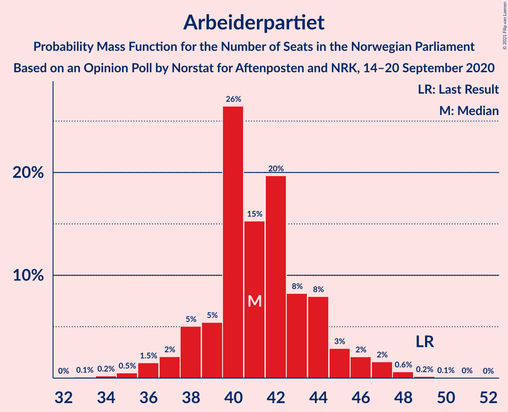
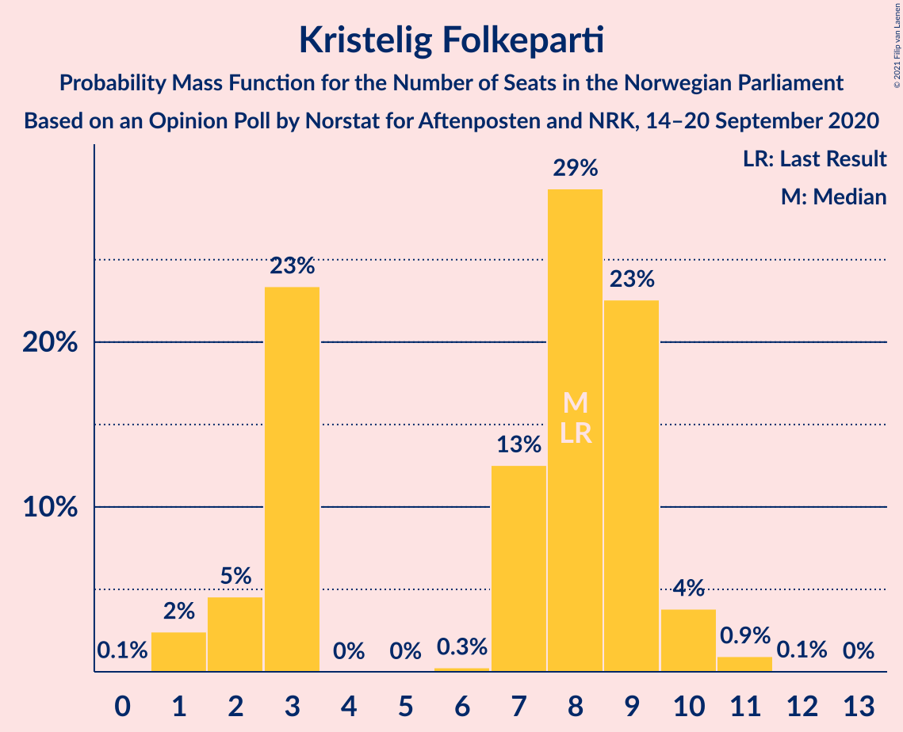
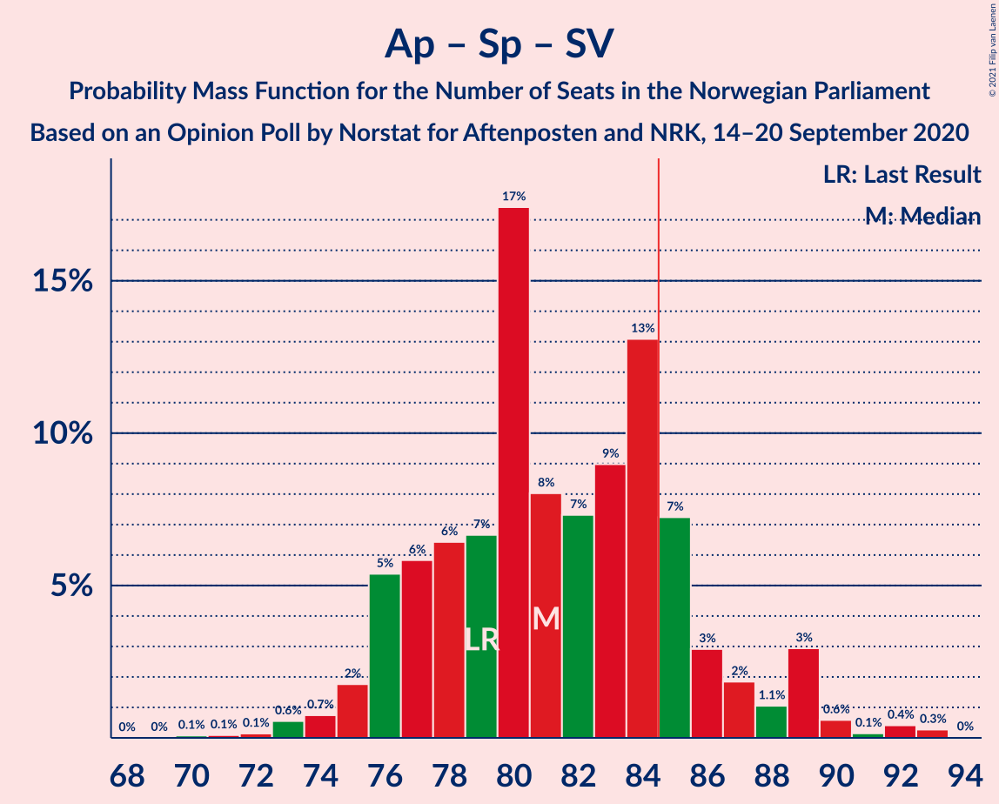

# Opinion Poll by Norstat for Aftenposten and NRK, 14–20 September 2020

<a href="#voting-intentions">Voting Intentions</a> | <a href="#seats">Seats</a> | <a href="#coalitions">Coalitions</a> | <a href="#technical-information">Technical Information</a>

## Voting Intentions

### Confidence Intervals

| Party | Last Result | Poll Result | 80% Confidence Interval | 90% Confidence Interval | 95% Confidence Interval | 99% Confidence Interval |
|:-----:|:-----------:|:-----------:|:-----------------------:|:-----------------------:|:-----------------------:|:-----------------------:|
| Høyre | 25.0% | 25.3% | 23.6–27.2% |23.1–27.7% |22.6–28.2% |21.8–29.1% |
| Arbeiderpartiet | 27.4% | 22.6% | 20.9–24.4% |20.4–24.9% |20.0–25.3% |19.2–26.2% |
| Senterpartiet | 10.3% | 14.3% | 13.0–15.9% |12.6–16.3% |12.3–16.7% |11.6–17.5% |
| Fremskrittspartiet | 15.2% | 13.3% | 12.0–14.8% |11.6–15.2% |11.3–15.6% |10.7–16.4% |
| Sosialistisk Venstreparti | 6.0% | 7.8% | 6.8–9.0% |6.5–9.4% |6.3–9.7% |5.8–10.3% |
| Miljøpartiet De Grønne | 3.2% | 4.2% | 3.5–5.2% |3.3–5.5% |3.1–5.7% |2.8–6.2% |
| Kristelig Folkeparti | 4.2% | 4.1% | 3.4–5.1% |3.2–5.3% |3.0–5.6% |2.7–6.1% |
| Rødt | 2.4% | 3.4% | 2.7–4.3% |2.5–4.5% |2.4–4.7% |2.1–5.2% |
| Venstre | 4.4% | 3.2% | 2.5–4.0% |2.4–4.3% |2.2–4.5% |2.0–4.9% |

*Note:* The poll result column reflects the actual value used in the calculations. Published results may vary slightly, and in addition be rounded to fewer digits.

## Seats

### Confidence Intervals

| Party | Last Result | Median | 80% Confidence Interval | 90% Confidence Interval | 95% Confidence Interval | 99% Confidence Interval |
|:-----:|:-----------:|:------:|:-----------------------:|:-----------------------:|:-----------------------:|:-----------------------:|
| <a href="#høyre">Høyre</a> | 45 | 45 | 42–49 |41–51 |40–52 |38–53 |
| <a href="#arbeiderpartiet">Arbeiderpartiet</a> | 49 | 41 | 39–44 |38–45 |37–47 |35–48 |
| <a href="#senterpartiet">Senterpartiet</a> | 19 | 27 | 23–29 |23–30 |22–30 |20–32 |
| <a href="#fremskrittspartiet">Fremskrittspartiet</a> | 27 | 24 | 21–27 |21–27 |20–28 |19–30 |
| <a href="#sosialistisk-venstreparti">Sosialistisk Venstreparti</a> | 11 | 14 | 12–16 |11–17 |11–18 |10–19 |
| <a href="#miljøpartiet-de-grønne">Miljøpartiet De Grønne</a> | 1 | 7 | 2–9 |1–10 |1–10 |1–11 |
| <a href="#kristelig-folkeparti">Kristelig Folkeparti</a> | 8 | 8 | 3–9 |2–9 |2–10 |1–11 |
| <a href="#rødt">Rødt</a> | 1 | 2 | 1–8 |1–8 |1–8 |1–9 |
| <a href="#venstre">Venstre</a> | 8 | 2 | 1–7 |1–7 |1–8 |1–9 |

### Høyre

*For a full overview of the results for this party, see the [Høyre](party-høyre.html) page.*

| Number of Seats | Probability | Accumulated | Special Marks |
|:---------------:|:-----------:|:-----------:|:-------------:|
| 36 | 0.1% | 100% |  |
| 37 | 0.2% | 99.9% |  |
| 38 | 0.6% | 99.8% |  |
| 39 | 0.8% | 99.2% |  |
| 40 | 2% | 98% |  |
| 41 | 5% | 97% |  |
| 42 | 10% | 91% |  |
| 43 | 4% | 81% |  |
| 44 | 10% | 77% |  |
| 45 | 18% | 66% | Last Result, Median |
| 46 | 13% | 48% |  |
| 47 | 9% | 35% |  |
| 48 | 11% | 26% |  |
| 49 | 6% | 15% |  |
| 50 | 4% | 10% |  |
| 51 | 2% | 5% |  |
| 52 | 2% | 3% |  |
| 53 | 1.2% | 2% |  |
| 54 | 0.2% | 0.4% |  |
| 55 | 0.1% | 0.2% |  |
| 56 | 0.1% | 0.1% |  |
| 57 | 0% | 0% |  |

### Arbeiderpartiet

*For a full overview of the results for this party, see the [Arbeiderpartiet](party-arbeiderpartiet.html) page.*

| Number of Seats | Probability | Accumulated | Special Marks |
|:---------------:|:-----------:|:-----------:|:-------------:|
| 33 | 0.1% | 100% |  |
| 34 | 0.2% | 99.9% |  |
| 35 | 0.5% | 99.7% |  |
| 36 | 1.5% | 99.1% |  |
| 37 | 2% | 98% |  |
| 38 | 5% | 96% |  |
| 39 | 5% | 91% |  |
| 40 | 26% | 85% |  |
| 41 | 15% | 59% | Median |
| 42 | 20% | 43% |  |
| 43 | 8% | 24% |  |
| 44 | 8% | 15% |  |
| 45 | 3% | 7% |  |
| 46 | 2% | 5% |  |
| 47 | 2% | 3% |  |
| 48 | 0.6% | 0.9% |  |
| 49 | 0.2% | 0.3% | Last Result |
| 50 | 0.1% | 0.1% |  |
| 51 | 0% | 0.1% |  |
| 52 | 0% | 0% |  |

### Senterpartiet

*For a full overview of the results for this party, see the [Senterpartiet](party-senterpartiet.html) page.*

| Number of Seats | Probability | Accumulated | Special Marks |
|:---------------:|:-----------:|:-----------:|:-------------:|
| 19 | 0.1% | 100% | Last Result |
| 20 | 0.6% | 99.9% |  |
| 21 | 0.8% | 99.3% |  |
| 22 | 3% | 98% |  |
| 23 | 11% | 95% |  |
| 24 | 12% | 84% |  |
| 25 | 10% | 72% |  |
| 26 | 10% | 62% |  |
| 27 | 21% | 52% | Median |
| 28 | 17% | 30% |  |
| 29 | 4% | 13% |  |
| 30 | 7% | 9% |  |
| 31 | 2% | 2% |  |
| 32 | 0.3% | 0.8% |  |
| 33 | 0.3% | 0.5% |  |
| 34 | 0.1% | 0.2% |  |
| 35 | 0% | 0% |  |

### Fremskrittspartiet

*For a full overview of the results for this party, see the [Fremskrittspartiet](party-fremskrittspartiet.html) page.*

| Number of Seats | Probability | Accumulated | Special Marks |
|:---------------:|:-----------:|:-----------:|:-------------:|
| 17 | 0.1% | 100% |  |
| 18 | 0.3% | 99.9% |  |
| 19 | 0.8% | 99.6% |  |
| 20 | 3% | 98.8% |  |
| 21 | 7% | 96% |  |
| 22 | 11% | 89% |  |
| 23 | 9% | 78% |  |
| 24 | 25% | 69% | Median |
| 25 | 14% | 44% |  |
| 26 | 17% | 30% |  |
| 27 | 9% | 13% | Last Result |
| 28 | 2% | 4% |  |
| 29 | 2% | 2% |  |
| 30 | 0.5% | 0.7% |  |
| 31 | 0.1% | 0.2% |  |
| 32 | 0% | 0% |  |

### Sosialistisk Venstreparti

*For a full overview of the results for this party, see the [Sosialistisk Venstreparti](party-sosialistiskvenstreparti.html) page.*

| Number of Seats | Probability | Accumulated | Special Marks |
|:---------------:|:-----------:|:-----------:|:-------------:|
| 9 | 0.1% | 100% |  |
| 10 | 0.9% | 99.9% |  |
| 11 | 5% | 99.0% | Last Result |
| 12 | 8% | 94% |  |
| 13 | 25% | 86% |  |
| 14 | 30% | 61% | Median |
| 15 | 16% | 31% |  |
| 16 | 8% | 15% |  |
| 17 | 4% | 8% |  |
| 18 | 3% | 4% |  |
| 19 | 0.6% | 0.8% |  |
| 20 | 0.2% | 0.2% |  |
| 21 | 0% | 0% |  |

### Miljøpartiet De Grønne

*For a full overview of the results for this party, see the [Miljøpartiet De Grønne](party-miljøpartietdegrønne.html) page.*

| Number of Seats | Probability | Accumulated | Special Marks |
|:---------------:|:-----------:|:-----------:|:-------------:|
| 1 | 9% | 100% | Last Result |
| 2 | 15% | 91% |  |
| 3 | 17% | 76% |  |
| 4 | 0% | 60% |  |
| 5 | 0% | 60% |  |
| 6 | 0% | 60% |  |
| 7 | 10% | 60% | Median |
| 8 | 25% | 49% |  |
| 9 | 19% | 25% |  |
| 10 | 5% | 6% |  |
| 11 | 0.8% | 1.0% |  |
| 12 | 0.2% | 0.2% |  |
| 13 | 0% | 0% |  |

### Kristelig Folkeparti

*For a full overview of the results for this party, see the [Kristelig Folkeparti](party-kristeligfolkeparti.html) page.*

| Number of Seats | Probability | Accumulated | Special Marks |
|:---------------:|:-----------:|:-----------:|:-------------:|
| 0 | 0.1% | 100% |  |
| 1 | 2% | 99.9% |  |
| 2 | 5% | 98% |  |
| 3 | 23% | 93% |  |
| 4 | 0% | 70% |  |
| 5 | 0% | 70% |  |
| 6 | 0.3% | 70% |  |
| 7 | 13% | 69% |  |
| 8 | 29% | 57% | Last Result, Median |
| 9 | 23% | 27% |  |
| 10 | 4% | 5% |  |
| 11 | 0.9% | 1.1% |  |
| 12 | 0.1% | 0.1% |  |
| 13 | 0% | 0% |  |

### Rødt

*For a full overview of the results for this party, see the [Rødt](party-rødt.html) page.*

| Number of Seats | Probability | Accumulated | Special Marks |
|:---------------:|:-----------:|:-----------:|:-------------:|
| 1 | 21% | 100% | Last Result |
| 2 | 63% | 79% | Median |
| 3 | 0% | 17% |  |
| 4 | 0% | 17% |  |
| 5 | 0% | 17% |  |
| 6 | 0.7% | 17% |  |
| 7 | 6% | 16% |  |
| 8 | 9% | 10% |  |
| 9 | 1.2% | 1.5% |  |
| 10 | 0.3% | 0.3% |  |
| 11 | 0% | 0% |  |

### Venstre

*For a full overview of the results for this party, see the [Venstre](party-venstre.html) page.*

| Number of Seats | Probability | Accumulated | Special Marks |
|:---------------:|:-----------:|:-----------:|:-------------:|
| 0 | 0.4% | 100% |  |
| 1 | 10% | 99.6% |  |
| 2 | 76% | 89% | Median |
| 3 | 0.3% | 13% |  |
| 4 | 0% | 13% |  |
| 5 | 0% | 13% |  |
| 6 | 0% | 13% |  |
| 7 | 9% | 13% |  |
| 8 | 4% | 4% | Last Result |
| 9 | 0.6% | 0.7% |  |
| 10 | 0.1% | 0.1% |  |
| 11 | 0% | 0% |  |

## Coalitions

### Confidence Intervals

| Coalition | Last Result | Median | Majority? | 80% Confidence Interval | 90% Confidence Interval | 95% Confidence Interval | 99% Confidence Interval |
|:---------:|:-----------:|:------:|:---------:|:-----------------------:|:-----------------------:|:-----------------------:|:-----------------------:|
| Høyre – Senterpartiet – Fremskrittspartiet – Kristelig Folkeparti – Venstre | 107 | 105 | 100% | 100–111 | 99–111 | 97–113 | 95–114 |
| Arbeiderpartiet – Senterpartiet – Sosialistisk Venstreparti – Miljøpartiet De Grønne – Kristelig Folkeparti | 88 | 94 | 99.3% | 89–99 | 88–100 | 87–100 | 84–103 |
| Arbeiderpartiet – Senterpartiet – Sosialistisk Venstreparti – Miljøpartiet De Grønne – Rødt | 81 | 90 | 96% | 85–96 | 85–96 | 83–98 | 80–100 |
| Arbeiderpartiet – Senterpartiet – Sosialistisk Venstreparti – Miljøpartiet De Grønne | 80 | 87 | 74% | 83–93 | 82–94 | 80–95 | 78–98 |
| Arbeiderpartiet – Senterpartiet – Sosialistisk Venstreparti – Rødt | 80 | 84 | 45% | 79–89 | 78–91 | 77–92 | 75–94 |
| Høyre – Fremskrittspartiet – Miljøpartiet De Grønne – Kristelig Folkeparti – Venstre | 89 | 85 | 55% | 80–90 | 78–91 | 77–92 | 75–94 |
| Arbeiderpartiet – Senterpartiet – Sosialistisk Venstreparti | 79 | 81 | 17% | 77–86 | 76–88 | 75–89 | 73–92 |
| Arbeiderpartiet – Senterpartiet – Miljøpartiet De Grønne – Kristelig Folkeparti | 77 | 80 | 16% | 75–85 | 73–86 | 72–87 | 70–88 |
| Høyre – Fremskrittspartiet – Kristelig Folkeparti – Venstre | 88 | 79 | 4% | 73–84 | 73–84 | 71–86 | 69–89 |
| Høyre – Fremskrittspartiet – Venstre | 80 | 72 | 0.1% | 68–77 | 66–78 | 65–80 | 64–82 |
| Arbeiderpartiet – Senterpartiet – Kristelig Folkeparti | 76 | 74 | 0.1% | 69–79 | 68–79 | 66–79 | 64–82 |
| Høyre – Fremskrittspartiet | 72 | 69 | 0% | 66–74 | 64–76 | 63–77 | 61–78 |
| Arbeiderpartiet – Senterpartiet | 68 | 68 | 0% | 63–71 | 62–72 | 62–74 | 60–77 |
| Arbeiderpartiet – Sosialistisk Venstreparti | 60 | 55 | 0% | 52–59 | 51–61 | 50–62 | 48–63 |
| Høyre – Kristelig Folkeparti – Venstre | 61 | 55 | 0% | 50–59 | 48–61 | 46–62 | 45–64 |
| Senterpartiet – Kristelig Folkeparti – Venstre | 35 | 36 | 0% | 30–39 | 29–40 | 28–42 | 26–43 |

### Høyre – Senterpartiet – Fremskrittspartiet – Kristelig Folkeparti – Venstre

| Number of Seats | Probability | Accumulated | Special Marks |
|:---------------:|:-----------:|:-----------:|:-------------:|
| 93 | 0.1% | 100% |  |
| 94 | 0.2% | 99.9% |  |
| 95 | 0.3% | 99.7% |  |
| 96 | 0.3% | 99.4% |  |
| 97 | 2% | 99.1% |  |
| 98 | 2% | 97% |  |
| 99 | 3% | 96% |  |
| 100 | 6% | 93% |  |
| 101 | 4% | 86% |  |
| 102 | 8% | 82% |  |
| 103 | 14% | 75% |  |
| 104 | 5% | 61% |  |
| 105 | 10% | 55% |  |
| 106 | 6% | 45% | Median |
| 107 | 6% | 39% | Last Result |
| 108 | 15% | 33% |  |
| 109 | 3% | 18% |  |
| 110 | 3% | 14% |  |
| 111 | 7% | 12% |  |
| 112 | 2% | 5% |  |
| 113 | 0.6% | 3% |  |
| 114 | 2% | 2% |  |
| 115 | 0.2% | 0.4% |  |
| 116 | 0% | 0.2% |  |
| 117 | 0.1% | 0.1% |  |
| 118 | 0% | 0% |  |

### Arbeiderpartiet – Senterpartiet – Sosialistisk Venstreparti – Miljøpartiet De Grønne – Kristelig Folkeparti

| Number of Seats | Probability | Accumulated | Special Marks |
|:---------------:|:-----------:|:-----------:|:-------------:|
| 81 | 0.1% | 100% |  |
| 82 | 0.1% | 99.8% |  |
| 83 | 0.2% | 99.8% |  |
| 84 | 0.3% | 99.6% |  |
| 85 | 1.3% | 99.3% | Majority |
| 86 | 0.5% | 98% |  |
| 87 | 1.4% | 98% |  |
| 88 | 4% | 96% | Last Result |
| 89 | 5% | 93% |  |
| 90 | 5% | 87% |  |
| 91 | 15% | 82% |  |
| 92 | 7% | 67% |  |
| 93 | 7% | 60% |  |
| 94 | 7% | 53% |  |
| 95 | 9% | 47% |  |
| 96 | 13% | 37% |  |
| 97 | 7% | 24% | Median |
| 98 | 4% | 17% |  |
| 99 | 5% | 14% |  |
| 100 | 7% | 9% |  |
| 101 | 0.6% | 2% |  |
| 102 | 0.5% | 1.5% |  |
| 103 | 0.6% | 1.0% |  |
| 104 | 0.3% | 0.3% |  |
| 105 | 0.1% | 0.1% |  |
| 106 | 0% | 0% |  |

### Arbeiderpartiet – Senterpartiet – Sosialistisk Venstreparti – Miljøpartiet De Grønne – Rødt

| Number of Seats | Probability | Accumulated | Special Marks |
|:---------------:|:-----------:|:-----------:|:-------------:|
| 78 | 0.1% | 100% |  |
| 79 | 0.1% | 99.9% |  |
| 80 | 0.6% | 99.8% |  |
| 81 | 0.6% | 99.2% | Last Result |
| 82 | 0.5% | 98.6% |  |
| 83 | 0.7% | 98% |  |
| 84 | 2% | 97% |  |
| 85 | 14% | 96% | Majority |
| 86 | 2% | 81% |  |
| 87 | 4% | 80% |  |
| 88 | 11% | 75% |  |
| 89 | 14% | 65% |  |
| 90 | 7% | 51% |  |
| 91 | 9% | 44% | Median |
| 92 | 6% | 35% |  |
| 93 | 8% | 29% |  |
| 94 | 8% | 21% |  |
| 95 | 2% | 13% |  |
| 96 | 6% | 11% |  |
| 97 | 2% | 5% |  |
| 98 | 0.7% | 3% |  |
| 99 | 1.0% | 2% |  |
| 100 | 0.8% | 1.1% |  |
| 101 | 0.1% | 0.3% |  |
| 102 | 0.1% | 0.2% |  |
| 103 | 0% | 0.1% |  |
| 104 | 0% | 0% |  |

### Arbeiderpartiet – Senterpartiet – Sosialistisk Venstreparti – Miljøpartiet De Grønne

| Number of Seats | Probability | Accumulated | Special Marks |
|:---------------:|:-----------:|:-----------:|:-------------:|
| 75 | 0% | 100% |  |
| 76 | 0% | 99.9% |  |
| 77 | 0.2% | 99.9% |  |
| 78 | 1.1% | 99.7% |  |
| 79 | 0.8% | 98.6% |  |
| 80 | 0.7% | 98% | Last Result |
| 81 | 1.4% | 97% |  |
| 82 | 2% | 96% |  |
| 83 | 17% | 93% |  |
| 84 | 3% | 77% |  |
| 85 | 6% | 74% | Majority |
| 86 | 11% | 69% |  |
| 87 | 16% | 58% |  |
| 88 | 7% | 42% |  |
| 89 | 9% | 34% | Median |
| 90 | 2% | 25% |  |
| 91 | 5% | 23% |  |
| 92 | 8% | 18% |  |
| 93 | 4% | 11% |  |
| 94 | 4% | 7% |  |
| 95 | 2% | 4% |  |
| 96 | 0.4% | 2% |  |
| 97 | 0.9% | 2% |  |
| 98 | 0.6% | 0.7% |  |
| 99 | 0% | 0% |  |

### Arbeiderpartiet – Senterpartiet – Sosialistisk Venstreparti – Rødt

| Number of Seats | Probability | Accumulated | Special Marks |
|:---------------:|:-----------:|:-----------:|:-------------:|
| 73 | 0% | 100% |  |
| 74 | 0.2% | 99.9% |  |
| 75 | 0.4% | 99.7% |  |
| 76 | 0.6% | 99.4% |  |
| 77 | 1.3% | 98.7% |  |
| 78 | 4% | 97% |  |
| 79 | 5% | 93% |  |
| 80 | 5% | 88% | Last Result |
| 81 | 7% | 83% |  |
| 82 | 13% | 76% |  |
| 83 | 7% | 62% |  |
| 84 | 11% | 56% | Median |
| 85 | 5% | 45% | Majority |
| 86 | 15% | 40% |  |
| 87 | 6% | 25% |  |
| 88 | 6% | 19% |  |
| 89 | 3% | 12% |  |
| 90 | 4% | 9% |  |
| 91 | 3% | 6% |  |
| 92 | 2% | 3% |  |
| 93 | 0.4% | 2% |  |
| 94 | 0.8% | 1.2% |  |
| 95 | 0.2% | 0.5% |  |
| 96 | 0.2% | 0.3% |  |
| 97 | 0.1% | 0.1% |  |
| 98 | 0% | 0.1% |  |
| 99 | 0% | 0% |  |

### Høyre – Fremskrittspartiet – Miljøpartiet De Grønne – Kristelig Folkeparti – Venstre

| Number of Seats | Probability | Accumulated | Special Marks |
|:---------------:|:-----------:|:-----------:|:-------------:|
| 71 | 0% | 100% |  |
| 72 | 0.1% | 99.9% |  |
| 73 | 0.2% | 99.9% |  |
| 74 | 0.2% | 99.7% |  |
| 75 | 0.8% | 99.5% |  |
| 76 | 0.4% | 98.8% |  |
| 77 | 2% | 98% |  |
| 78 | 3% | 97% |  |
| 79 | 4% | 94% |  |
| 80 | 3% | 91% |  |
| 81 | 6% | 88% |  |
| 82 | 6% | 81% |  |
| 83 | 15% | 75% |  |
| 84 | 5% | 60% |  |
| 85 | 11% | 55% | Majority |
| 86 | 7% | 44% | Median |
| 87 | 13% | 38% |  |
| 88 | 7% | 24% |  |
| 89 | 5% | 17% | Last Result |
| 90 | 5% | 12% |  |
| 91 | 4% | 7% |  |
| 92 | 1.3% | 3% |  |
| 93 | 0.6% | 1.3% |  |
| 94 | 0.4% | 0.6% |  |
| 95 | 0.2% | 0.3% |  |
| 96 | 0% | 0.1% |  |
| 97 | 0% | 0% |  |

### Arbeiderpartiet – Senterpartiet – Sosialistisk Venstreparti

| Number of Seats | Probability | Accumulated | Special Marks |
|:---------------:|:-----------:|:-----------:|:-------------:|
| 70 | 0.1% | 100% |  |
| 71 | 0.1% | 99.9% |  |
| 72 | 0.1% | 99.8% |  |
| 73 | 0.6% | 99.7% |  |
| 74 | 0.7% | 99.1% |  |
| 75 | 2% | 98% |  |
| 76 | 5% | 97% |  |
| 77 | 6% | 91% |  |
| 78 | 6% | 85% |  |
| 79 | 7% | 79% | Last Result |
| 80 | 17% | 72% |  |
| 81 | 8% | 55% |  |
| 82 | 7% | 47% | Median |
| 83 | 9% | 40% |  |
| 84 | 13% | 31% |  |
| 85 | 7% | 17% | Majority |
| 86 | 3% | 10% |  |
| 87 | 2% | 7% |  |
| 88 | 1.1% | 5% |  |
| 89 | 3% | 4% |  |
| 90 | 0.6% | 1.5% |  |
| 91 | 0.1% | 0.9% |  |
| 92 | 0.4% | 0.7% |  |
| 93 | 0.3% | 0.3% |  |
| 94 | 0% | 0% |  |

### Arbeiderpartiet – Senterpartiet – Miljøpartiet De Grønne – Kristelig Folkeparti

| Number of Seats | Probability | Accumulated | Special Marks |
|:---------------:|:-----------:|:-----------:|:-------------:|
| 67 | 0.1% | 100% |  |
| 68 | 0.1% | 99.8% |  |
| 69 | 0.2% | 99.7% |  |
| 70 | 0.5% | 99.5% |  |
| 71 | 1.0% | 99.0% |  |
| 72 | 1.2% | 98% |  |
| 73 | 2% | 97% |  |
| 74 | 3% | 94% |  |
| 75 | 4% | 91% |  |
| 76 | 9% | 87% |  |
| 77 | 7% | 79% | Last Result |
| 78 | 12% | 72% |  |
| 79 | 7% | 59% |  |
| 80 | 7% | 53% |  |
| 81 | 8% | 46% |  |
| 82 | 13% | 38% |  |
| 83 | 4% | 24% | Median |
| 84 | 5% | 21% |  |
| 85 | 6% | 16% | Majority |
| 86 | 6% | 9% |  |
| 87 | 2% | 4% |  |
| 88 | 0.7% | 1.2% |  |
| 89 | 0.3% | 0.5% |  |
| 90 | 0.1% | 0.2% |  |
| 91 | 0% | 0.1% |  |
| 92 | 0% | 0% |  |

### Høyre – Fremskrittspartiet – Kristelig Folkeparti – Venstre

| Number of Seats | Probability | Accumulated | Special Marks |
|:---------------:|:-----------:|:-----------:|:-------------:|
| 66 | 0% | 100% |  |
| 67 | 0.1% | 99.9% |  |
| 68 | 0.1% | 99.8% |  |
| 69 | 0.8% | 99.7% |  |
| 70 | 1.0% | 98.9% |  |
| 71 | 0.7% | 98% |  |
| 72 | 2% | 97% |  |
| 73 | 6% | 95% |  |
| 74 | 2% | 89% |  |
| 75 | 8% | 87% |  |
| 76 | 8% | 79% |  |
| 77 | 6% | 71% |  |
| 78 | 9% | 65% |  |
| 79 | 7% | 56% | Median |
| 80 | 14% | 49% |  |
| 81 | 11% | 35% |  |
| 82 | 4% | 25% |  |
| 83 | 2% | 20% |  |
| 84 | 14% | 19% |  |
| 85 | 2% | 4% | Majority |
| 86 | 0.7% | 3% |  |
| 87 | 0.5% | 2% |  |
| 88 | 0.6% | 1.4% | Last Result |
| 89 | 0.6% | 0.8% |  |
| 90 | 0.1% | 0.2% |  |
| 91 | 0.1% | 0.1% |  |
| 92 | 0% | 0% |  |

### Høyre – Fremskrittspartiet – Venstre

| Number of Seats | Probability | Accumulated | Special Marks |
|:---------------:|:-----------:|:-----------:|:-------------:|
| 61 | 0.1% | 100% |  |
| 62 | 0.1% | 99.9% |  |
| 63 | 0.3% | 99.8% |  |
| 64 | 0.7% | 99.5% |  |
| 65 | 2% | 98.8% |  |
| 66 | 2% | 97% |  |
| 67 | 3% | 95% |  |
| 68 | 7% | 92% |  |
| 69 | 8% | 85% |  |
| 70 | 8% | 77% |  |
| 71 | 14% | 69% | Median |
| 72 | 11% | 55% |  |
| 73 | 4% | 44% |  |
| 74 | 8% | 40% |  |
| 75 | 7% | 32% |  |
| 76 | 13% | 25% |  |
| 77 | 4% | 12% |  |
| 78 | 3% | 8% |  |
| 79 | 2% | 5% |  |
| 80 | 1.3% | 3% | Last Result |
| 81 | 0.4% | 1.2% |  |
| 82 | 0.5% | 0.9% |  |
| 83 | 0.3% | 0.4% |  |
| 84 | 0% | 0.2% |  |
| 85 | 0% | 0.1% | Majority |
| 86 | 0.1% | 0.1% |  |
| 87 | 0% | 0% |  |

### Arbeiderpartiet – Senterpartiet – Kristelig Folkeparti

| Number of Seats | Probability | Accumulated | Special Marks |
|:---------------:|:-----------:|:-----------:|:-------------:|
| 62 | 0.1% | 100% |  |
| 63 | 0.1% | 99.9% |  |
| 64 | 0.5% | 99.8% |  |
| 65 | 0.3% | 99.2% |  |
| 66 | 2% | 98.9% |  |
| 67 | 2% | 97% |  |
| 68 | 5% | 95% |  |
| 69 | 2% | 91% |  |
| 70 | 3% | 88% |  |
| 71 | 10% | 85% |  |
| 72 | 5% | 75% |  |
| 73 | 12% | 70% |  |
| 74 | 10% | 58% |  |
| 75 | 11% | 47% |  |
| 76 | 10% | 37% | Last Result, Median |
| 77 | 9% | 27% |  |
| 78 | 6% | 18% |  |
| 79 | 10% | 12% |  |
| 80 | 1.2% | 2% |  |
| 81 | 0.4% | 1.0% |  |
| 82 | 0.2% | 0.5% |  |
| 83 | 0.1% | 0.3% |  |
| 84 | 0.1% | 0.2% |  |
| 85 | 0% | 0.1% | Majority |
| 86 | 0.1% | 0.1% |  |
| 87 | 0% | 0% |  |

### Høyre – Fremskrittspartiet

| Number of Seats | Probability | Accumulated | Special Marks |
|:---------------:|:-----------:|:-----------:|:-------------:|
| 58 | 0% | 100% |  |
| 59 | 0.1% | 99.9% |  |
| 60 | 0.1% | 99.8% |  |
| 61 | 0.3% | 99.8% |  |
| 62 | 1.2% | 99.4% |  |
| 63 | 2% | 98% |  |
| 64 | 2% | 96% |  |
| 65 | 4% | 95% |  |
| 66 | 8% | 90% |  |
| 67 | 9% | 82% |  |
| 68 | 7% | 73% |  |
| 69 | 18% | 66% | Median |
| 70 | 12% | 47% |  |
| 71 | 4% | 36% |  |
| 72 | 7% | 32% | Last Result |
| 73 | 6% | 25% |  |
| 74 | 9% | 19% |  |
| 75 | 3% | 9% |  |
| 76 | 3% | 7% |  |
| 77 | 2% | 4% |  |
| 78 | 1.2% | 2% |  |
| 79 | 0.2% | 0.4% |  |
| 80 | 0.1% | 0.3% |  |
| 81 | 0.1% | 0.1% |  |
| 82 | 0% | 0.1% |  |
| 83 | 0% | 0% |  |

### Arbeiderpartiet – Senterpartiet

| Number of Seats | Probability | Accumulated | Special Marks |
|:---------------:|:-----------:|:-----------:|:-------------:|
| 57 | 0.1% | 100% |  |
| 58 | 0.1% | 99.9% |  |
| 59 | 0.3% | 99.8% |  |
| 60 | 0.5% | 99.5% |  |
| 61 | 1.3% | 99.0% |  |
| 62 | 3% | 98% |  |
| 63 | 7% | 94% |  |
| 64 | 8% | 88% |  |
| 65 | 10% | 79% |  |
| 66 | 6% | 70% |  |
| 67 | 13% | 64% |  |
| 68 | 12% | 51% | Last Result, Median |
| 69 | 11% | 39% |  |
| 70 | 12% | 28% |  |
| 71 | 10% | 16% |  |
| 72 | 2% | 6% |  |
| 73 | 2% | 5% |  |
| 74 | 1.0% | 3% |  |
| 75 | 0.8% | 2% |  |
| 76 | 0.6% | 1.2% |  |
| 77 | 0.3% | 0.6% |  |
| 78 | 0.3% | 0.3% |  |
| 79 | 0% | 0% |  |

### Arbeiderpartiet – Sosialistisk Venstreparti

| Number of Seats | Probability | Accumulated | Special Marks |
|:---------------:|:-----------:|:-----------:|:-------------:|
| 46 | 0.1% | 100% |  |
| 47 | 0.2% | 99.9% |  |
| 48 | 0.7% | 99.7% |  |
| 49 | 0.9% | 99.0% |  |
| 50 | 3% | 98% |  |
| 51 | 4% | 96% |  |
| 52 | 5% | 92% |  |
| 53 | 15% | 87% |  |
| 54 | 11% | 72% |  |
| 55 | 13% | 61% | Median |
| 56 | 23% | 48% |  |
| 57 | 9% | 25% |  |
| 58 | 4% | 16% |  |
| 59 | 4% | 12% |  |
| 60 | 2% | 8% | Last Result |
| 61 | 2% | 5% |  |
| 62 | 1.2% | 3% |  |
| 63 | 1.2% | 2% |  |
| 64 | 0.2% | 0.5% |  |
| 65 | 0.1% | 0.3% |  |
| 66 | 0.1% | 0.2% |  |
| 67 | 0.1% | 0.1% |  |
| 68 | 0% | 0% |  |

### Høyre – Kristelig Folkeparti – Venstre

| Number of Seats | Probability | Accumulated | Special Marks |
|:---------------:|:-----------:|:-----------:|:-------------:|
| 43 | 0.1% | 100% |  |
| 44 | 0.1% | 99.9% |  |
| 45 | 0.3% | 99.8% |  |
| 46 | 2% | 99.5% |  |
| 47 | 1.3% | 97% |  |
| 48 | 2% | 96% |  |
| 49 | 3% | 94% |  |
| 50 | 5% | 92% |  |
| 51 | 9% | 87% |  |
| 52 | 7% | 78% |  |
| 53 | 7% | 71% |  |
| 54 | 10% | 64% |  |
| 55 | 6% | 54% | Median |
| 56 | 14% | 49% |  |
| 57 | 11% | 34% |  |
| 58 | 9% | 23% |  |
| 59 | 6% | 14% |  |
| 60 | 3% | 8% |  |
| 61 | 2% | 5% | Last Result |
| 62 | 2% | 3% |  |
| 63 | 1.1% | 2% |  |
| 64 | 0.3% | 0.5% |  |
| 65 | 0.1% | 0.3% |  |
| 66 | 0.1% | 0.2% |  |
| 67 | 0.1% | 0.1% |  |
| 68 | 0% | 0% |  |

### Senterpartiet – Kristelig Folkeparti – Venstre

| Number of Seats | Probability | Accumulated | Special Marks |
|:---------------:|:-----------:|:-----------:|:-------------:|
| 25 | 0.2% | 100% |  |
| 26 | 0.3% | 99.8% |  |
| 27 | 0.7% | 99.5% |  |
| 28 | 3% | 98.8% |  |
| 29 | 2% | 96% |  |
| 30 | 5% | 94% |  |
| 31 | 7% | 88% |  |
| 32 | 4% | 82% |  |
| 33 | 7% | 78% |  |
| 34 | 6% | 70% |  |
| 35 | 11% | 64% | Last Result |
| 36 | 9% | 53% |  |
| 37 | 13% | 44% | Median |
| 38 | 10% | 31% |  |
| 39 | 13% | 21% |  |
| 40 | 3% | 7% |  |
| 41 | 1.2% | 4% |  |
| 42 | 2% | 3% |  |
| 43 | 0.5% | 1.0% |  |
| 44 | 0.1% | 0.4% |  |
| 45 | 0.2% | 0.3% |  |
| 46 | 0.1% | 0.2% |  |
| 47 | 0% | 0% |  |

## Technical Information

### Opinion Poll

+ **Polling firm:** Norstat
+ **Commissioner(s):** Aftenposten and NRK
+ **Fieldwork period:** 14–20 September 2020

### Calculations

+ **Sample size:** 948
+ **Simulations done:** 1,048,576
+ **Error estimate:** 1.84%

