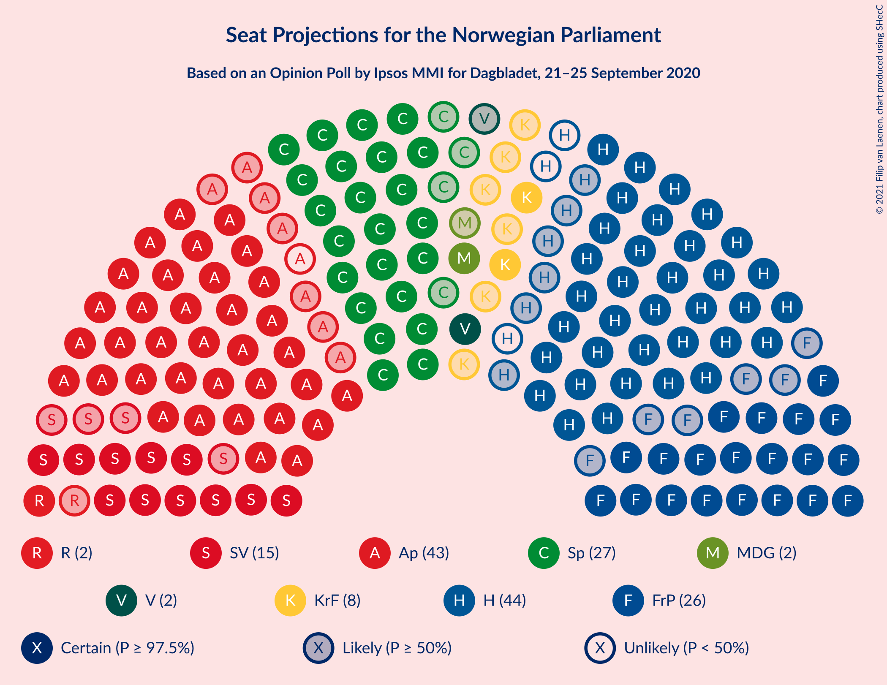
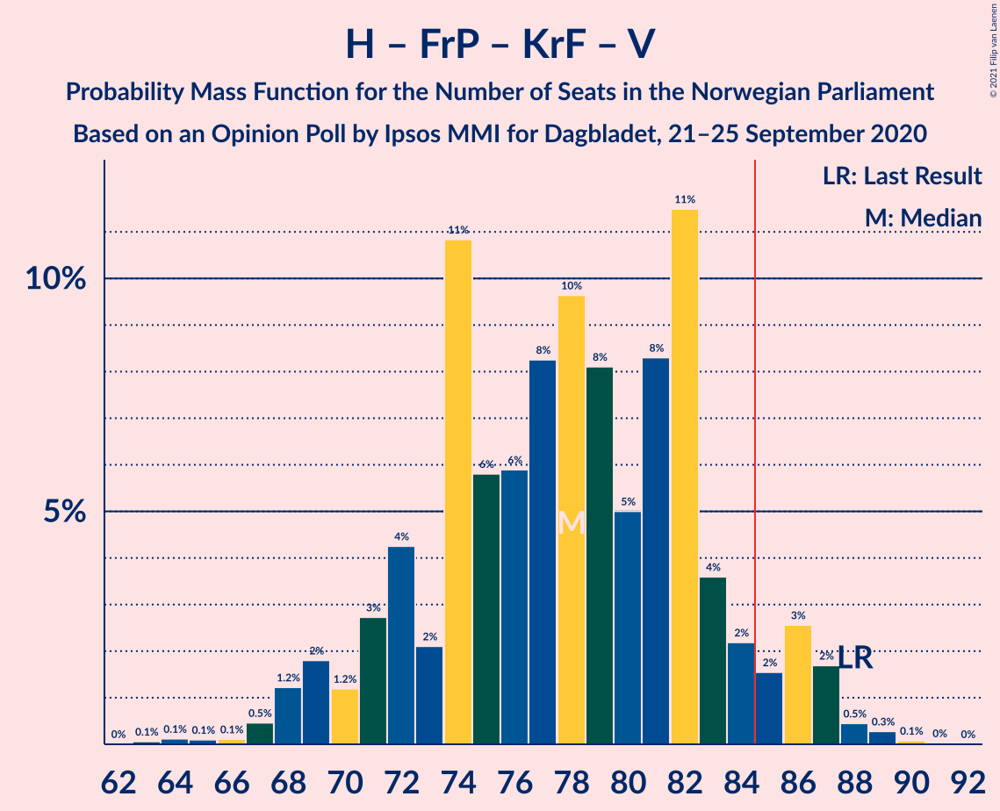

# Opinion Poll by Ipsos MMI for Dagbladet, 21–25 September 2020

<a href="#voting-intentions">Voting Intentions</a> | <a href="#seats">Seats</a> | <a href="#coalitions">Coalitions</a> | <a href="#technical-information">Technical Information</a>

## Voting Intentions

### Confidence Intervals

| Party | Last Result | Poll Result | 80% Confidence Interval | 90% Confidence Interval | 95% Confidence Interval | 99% Confidence Interval |
|:-----:|:-----------:|:-----------:|:-----------------------:|:-----------------------:|:-----------------------:|:-----------------------:|
| Høyre | 25.0% | 22.6% | 20.7–24.7% |20.1–25.3% |19.7–25.8% |18.8–26.8% |
| Arbeiderpartiet | 27.4% | 22.3% | 20.4–24.4% |19.9–25.0% |19.4–25.5% |18.5–26.5% |
| Senterpartiet | 10.3% | 15.1% | 13.5–17.0% |13.1–17.5% |12.7–18.0% |12.0–18.9% |
| Fremskrittspartiet | 15.2% | 13.9% | 12.3–15.7% |11.9–16.2% |11.5–16.6% |10.8–17.5% |
| Sosialistisk Venstreparti | 6.0% | 8.4% | 7.2–9.9% |6.9–10.3% |6.6–10.7% |6.1–11.4% |
| Kristelig Folkeparti | 4.2% | 4.6% | 3.8–5.8% |3.5–6.1% |3.3–6.4% |2.9–7.0% |
| Rødt | 2.4% | 3.6% | 2.9–4.7% |2.7–5.0% |2.5–5.3% |2.2–5.9% |
| Venstre | 4.4% | 3.6% | 2.9–4.7% |2.7–5.0% |2.5–5.3% |2.2–5.9% |
| Miljøpartiet De Grønne | 3.2% | 3.5% | 2.8–4.6% |2.6–4.9% |2.4–5.1% |2.1–5.7% |

*Note:* The poll result column reflects the actual value used in the calculations. Published results may vary slightly, and in addition be rounded to fewer digits.

## Seats

### Confidence Intervals

| Party | Last Result | Median | 80% Confidence Interval | 90% Confidence Interval | 95% Confidence Interval | 99% Confidence Interval |
|:-----:|:-----------:|:------:|:-----------------------:|:-----------------------:|:-----------------------:|:-----------------------:|
| <a href="#høyre">Høyre</a> | 45 | 41 | 36–44 |35–46 |35–47 |33–49 |
| <a href="#arbeiderpartiet">Arbeiderpartiet</a> | 49 | 42 | 38–45 |37–46 |35–47 |34–49 |
| <a href="#senterpartiet">Senterpartiet</a> | 19 | 27 | 24–31 |23–32 |23–33 |21–35 |
| <a href="#fremskrittspartiet">Fremskrittspartiet</a> | 27 | 26 | 22–29 |21–29 |20–30 |19–32 |
| <a href="#sosialistisk-venstreparti">Sosialistisk Venstreparti</a> | 11 | 15 | 13–18 |12–19 |11–19 |10–21 |
| <a href="#kristelig-folkeparti">Kristelig Folkeparti</a> | 8 | 8 | 3–10 |3–11 |2–12 |1–13 |
| <a href="#rødt">Rødt</a> | 1 | 2 | 1–8 |1–9 |1–10 |1–10 |
| <a href="#venstre">Venstre</a> | 8 | 2 | 2–8 |2–9 |1–9 |1–10 |
| <a href="#miljøpartiet-de-grønne">Miljøpartiet De Grønne</a> | 1 | 2 | 1–8 |1–8 |1–9 |1–10 |

### Høyre

*For a full overview of the results for this party, see the [Høyre](party-høyre.html) page.*

| Number of Seats | Probability | Accumulated | Special Marks |
|:---------------:|:-----------:|:-----------:|:-------------:|
| 31 | 0% | 100% |  |
| 32 | 0.3% | 99.9% |  |
| 33 | 0.5% | 99.6% |  |
| 34 | 0.9% | 99.2% |  |
| 35 | 6% | 98% |  |
| 36 | 5% | 93% |  |
| 37 | 5% | 87% |  |
| 38 | 8% | 82% |  |
| 39 | 6% | 74% |  |
| 40 | 9% | 69% |  |
| 41 | 11% | 60% | Median |
| 42 | 14% | 49% |  |
| 43 | 7% | 35% |  |
| 44 | 19% | 28% |  |
| 45 | 4% | 9% | Last Result |
| 46 | 2% | 5% |  |
| 47 | 2% | 4% |  |
| 48 | 0.6% | 2% |  |
| 49 | 0.6% | 1.0% |  |
| 50 | 0.3% | 0.4% |  |
| 51 | 0.1% | 0.1% |  |
| 52 | 0% | 0% |  |

### Arbeiderpartiet

*For a full overview of the results for this party, see the [Arbeiderpartiet](party-arbeiderpartiet.html) page.*

| Number of Seats | Probability | Accumulated | Special Marks |
|:---------------:|:-----------:|:-----------:|:-------------:|
| 32 | 0.1% | 100% |  |
| 33 | 0.2% | 99.8% |  |
| 34 | 0.8% | 99.6% |  |
| 35 | 2% | 98.9% |  |
| 36 | 2% | 97% |  |
| 37 | 4% | 96% |  |
| 38 | 9% | 91% |  |
| 39 | 6% | 82% |  |
| 40 | 12% | 75% |  |
| 41 | 13% | 63% |  |
| 42 | 13% | 50% | Median |
| 43 | 19% | 38% |  |
| 44 | 8% | 19% |  |
| 45 | 3% | 11% |  |
| 46 | 5% | 8% |  |
| 47 | 3% | 4% |  |
| 48 | 0.3% | 1.0% |  |
| 49 | 0.4% | 0.7% | Last Result |
| 50 | 0.1% | 0.2% |  |
| 51 | 0.1% | 0.1% |  |
| 52 | 0% | 0% |  |

### Senterpartiet

*For a full overview of the results for this party, see the [Senterpartiet](party-senterpartiet.html) page.*

| Number of Seats | Probability | Accumulated | Special Marks |
|:---------------:|:-----------:|:-----------:|:-------------:|
| 19 | 0.1% | 100% | Last Result |
| 20 | 0.2% | 99.9% |  |
| 21 | 0.5% | 99.8% |  |
| 22 | 1.0% | 99.3% |  |
| 23 | 4% | 98% |  |
| 24 | 5% | 95% |  |
| 25 | 8% | 90% |  |
| 26 | 12% | 82% |  |
| 27 | 22% | 71% | Median |
| 28 | 13% | 48% |  |
| 29 | 10% | 35% |  |
| 30 | 7% | 25% |  |
| 31 | 11% | 18% |  |
| 32 | 4% | 7% |  |
| 33 | 2% | 3% |  |
| 34 | 1.0% | 2% |  |
| 35 | 0.2% | 0.6% |  |
| 36 | 0.2% | 0.3% |  |
| 37 | 0% | 0.1% |  |
| 38 | 0% | 0% |  |

### Fremskrittspartiet

*For a full overview of the results for this party, see the [Fremskrittspartiet](party-fremskrittspartiet.html) page.*

| Number of Seats | Probability | Accumulated | Special Marks |
|:---------------:|:-----------:|:-----------:|:-------------:|
| 17 | 0% | 100% |  |
| 18 | 0.2% | 99.9% |  |
| 19 | 0.4% | 99.7% |  |
| 20 | 2% | 99.3% |  |
| 21 | 4% | 97% |  |
| 22 | 4% | 93% |  |
| 23 | 8% | 90% |  |
| 24 | 11% | 81% |  |
| 25 | 18% | 71% |  |
| 26 | 19% | 52% | Median |
| 27 | 9% | 34% | Last Result |
| 28 | 15% | 25% |  |
| 29 | 6% | 10% |  |
| 30 | 3% | 4% |  |
| 31 | 0.9% | 2% |  |
| 32 | 0.3% | 0.6% |  |
| 33 | 0.2% | 0.3% |  |
| 34 | 0.1% | 0.1% |  |
| 35 | 0% | 0% |  |

### Sosialistisk Venstreparti

*For a full overview of the results for this party, see the [Sosialistisk Venstreparti](party-sosialistiskvenstreparti.html) page.*

| Number of Seats | Probability | Accumulated | Special Marks |
|:---------------:|:-----------:|:-----------:|:-------------:|
| 9 | 0.1% | 100% |  |
| 10 | 0.5% | 99.9% |  |
| 11 | 3% | 99.4% | Last Result |
| 12 | 4% | 97% |  |
| 13 | 10% | 93% |  |
| 14 | 22% | 83% |  |
| 15 | 15% | 61% | Median |
| 16 | 21% | 46% |  |
| 17 | 12% | 25% |  |
| 18 | 9% | 14% |  |
| 19 | 3% | 5% |  |
| 20 | 1.1% | 2% |  |
| 21 | 0.5% | 0.7% |  |
| 22 | 0.2% | 0.2% |  |
| 23 | 0% | 0% |  |

### Kristelig Folkeparti

*For a full overview of the results for this party, see the [Kristelig Folkeparti](party-kristeligfolkeparti.html) page.*

| Number of Seats | Probability | Accumulated | Special Marks |
|:---------------:|:-----------:|:-----------:|:-------------:|
| 1 | 1.0% | 100% |  |
| 2 | 2% | 99.0% |  |
| 3 | 18% | 97% |  |
| 4 | 0% | 79% |  |
| 5 | 0% | 79% |  |
| 6 | 0.1% | 79% |  |
| 7 | 5% | 79% |  |
| 8 | 32% | 74% | Last Result, Median |
| 9 | 22% | 41% |  |
| 10 | 9% | 19% |  |
| 11 | 7% | 10% |  |
| 12 | 2% | 3% |  |
| 13 | 0.6% | 0.8% |  |
| 14 | 0.1% | 0.1% |  |
| 15 | 0% | 0% |  |

### Rødt

*For a full overview of the results for this party, see the [Rødt](party-rødt.html) page.*

| Number of Seats | Probability | Accumulated | Special Marks |
|:---------------:|:-----------:|:-----------:|:-------------:|
| 1 | 20% | 100% | Last Result |
| 2 | 48% | 80% | Median |
| 3 | 0% | 32% |  |
| 4 | 0% | 32% |  |
| 5 | 0% | 32% |  |
| 6 | 0.3% | 32% |  |
| 7 | 11% | 32% |  |
| 8 | 12% | 20% |  |
| 9 | 5% | 8% |  |
| 10 | 3% | 3% |  |
| 11 | 0.3% | 0.4% |  |
| 12 | 0.1% | 0.1% |  |
| 13 | 0% | 0% |  |

### Venstre

*For a full overview of the results for this party, see the [Venstre](party-venstre.html) page.*

| Number of Seats | Probability | Accumulated | Special Marks |
|:---------------:|:-----------:|:-----------:|:-------------:|
| 1 | 5% | 100% |  |
| 2 | 64% | 95% | Median |
| 3 | 1.4% | 32% |  |
| 4 | 0.1% | 30% |  |
| 5 | 0% | 30% |  |
| 6 | 0.2% | 30% |  |
| 7 | 12% | 30% |  |
| 8 | 11% | 18% | Last Result |
| 9 | 5% | 7% |  |
| 10 | 2% | 2% |  |
| 11 | 0.4% | 0.5% |  |
| 12 | 0% | 0% |  |

### Miljøpartiet De Grønne

*For a full overview of the results for this party, see the [Miljøpartiet De Grønne](party-miljøpartietdegrønne.html) page.*

| Number of Seats | Probability | Accumulated | Special Marks |
|:---------------:|:-----------:|:-----------:|:-------------:|
| 0 | 0.2% | 100% |  |
| 1 | 41% | 99.8% | Last Result |
| 2 | 34% | 59% | Median |
| 3 | 2% | 26% |  |
| 4 | 0% | 23% |  |
| 5 | 0% | 23% |  |
| 6 | 0.1% | 23% |  |
| 7 | 8% | 23% |  |
| 8 | 10% | 15% |  |
| 9 | 4% | 5% |  |
| 10 | 0.9% | 1.0% |  |
| 11 | 0.1% | 0.2% |  |
| 12 | 0% | 0% |  |

## Coalitions

### Confidence Intervals

| Coalition | Last Result | Median | Majority? | 80% Confidence Interval | 90% Confidence Interval | 95% Confidence Interval | 99% Confidence Interval |
|:---------:|:-----------:|:------:|:---------:|:-----------------------:|:-----------------------:|:-----------------------:|:-----------------------:|
| Høyre – Senterpartiet – Fremskrittspartiet – Kristelig Folkeparti – Venstre | 107 | 105 | 100% | 100–111 | 99–112 | 97–113 | 94–115 |
| Arbeiderpartiet – Senterpartiet – Sosialistisk Venstreparti – Kristelig Folkeparti – Miljøpartiet De Grønne | 88 | 95 | 98% | 90–100 | 88–102 | 85–103 | 84–105 |
| Arbeiderpartiet – Senterpartiet – Sosialistisk Venstreparti – Rødt – Miljøpartiet De Grønne | 81 | 91 | 93% | 86–97 | 83–98 | 82–100 | 81–102 |
| Arbeiderpartiet – Senterpartiet – Sosialistisk Venstreparti – Rødt | 80 | 88 | 80% | 82–93 | 81–95 | 80–97 | 78–99 |
| Arbeiderpartiet – Senterpartiet – Sosialistisk Venstreparti – Miljøpartiet De Grønne | 80 | 87 | 77% | 82–93 | 80–94 | 79–95 | 77–98 |
| Arbeiderpartiet – Senterpartiet – Sosialistisk Venstreparti | 79 | 84 | 45% | 79–90 | 78–91 | 76–92 | 74–94 |
| Høyre – Fremskrittspartiet – Kristelig Folkeparti – Venstre – Miljøpartiet De Grønne | 89 | 81 | 20% | 76–87 | 74–88 | 72–89 | 70–91 |
| Arbeiderpartiet – Senterpartiet – Kristelig Folkeparti – Miljøpartiet De Grønne | 77 | 80 | 12% | 74–85 | 73–87 | 71–88 | 69–90 |
| Høyre – Fremskrittspartiet – Kristelig Folkeparti – Venstre | 88 | 78 | 7% | 72–83 | 70–86 | 69–87 | 67–88 |
| Arbeiderpartiet – Senterpartiet – Kristelig Folkeparti | 76 | 78 | 2% | 71–82 | 69–83 | 68–83 | 66–87 |
| Høyre – Fremskrittspartiet – Venstre | 80 | 70 | 0% | 64–76 | 63–78 | 62–79 | 60–83 |
| Arbeiderpartiet – Senterpartiet | 68 | 69 | 0% | 64–74 | 63–75 | 62–76 | 60–78 |
| Høyre – Fremskrittspartiet | 72 | 67 | 0% | 61–72 | 59–73 | 58–74 | 56–76 |
| Arbeiderpartiet – Sosialistisk Venstreparti | 60 | 57 | 0% | 52–61 | 51–62 | 50–63 | 48–65 |
| Høyre – Kristelig Folkeparti – Venstre | 61 | 52 | 0% | 47–58 | 45–60 | 44–61 | 42–63 |
| Senterpartiet – Kristelig Folkeparti – Venstre | 35 | 38 | 0% | 35–44 | 33–46 | 31–48 | 29–49 |

### Høyre – Senterpartiet – Fremskrittspartiet – Kristelig Folkeparti – Venstre

| Number of Seats | Probability | Accumulated | Special Marks |
|:---------------:|:-----------:|:-----------:|:-------------:|
| 92 | 0% | 100% |  |
| 93 | 0.1% | 99.9% |  |
| 94 | 0.3% | 99.8% |  |
| 95 | 0.6% | 99.5% |  |
| 96 | 0.9% | 98.9% |  |
| 97 | 0.9% | 98% |  |
| 98 | 2% | 97% |  |
| 99 | 3% | 96% |  |
| 100 | 4% | 92% |  |
| 101 | 6% | 88% |  |
| 102 | 6% | 82% |  |
| 103 | 4% | 76% |  |
| 104 | 7% | 72% | Median |
| 105 | 17% | 65% |  |
| 106 | 7% | 48% |  |
| 107 | 6% | 41% | Last Result |
| 108 | 6% | 35% |  |
| 109 | 11% | 30% |  |
| 110 | 8% | 19% |  |
| 111 | 2% | 11% |  |
| 112 | 4% | 8% |  |
| 113 | 3% | 5% |  |
| 114 | 1.5% | 2% |  |
| 115 | 0.4% | 0.7% |  |
| 116 | 0.1% | 0.3% |  |
| 117 | 0.1% | 0.2% |  |
| 118 | 0.1% | 0.1% |  |
| 119 | 0% | 0% |  |

### Arbeiderpartiet – Senterpartiet – Sosialistisk Venstreparti – Kristelig Folkeparti – Miljøpartiet De Grønne

| Number of Seats | Probability | Accumulated | Special Marks |
|:---------------:|:-----------:|:-----------:|:-------------:|
| 81 | 0.1% | 100% |  |
| 82 | 0.1% | 99.9% |  |
| 83 | 0.1% | 99.8% |  |
| 84 | 1.3% | 99.7% |  |
| 85 | 0.9% | 98% | Majority |
| 86 | 0.4% | 97% |  |
| 87 | 1.1% | 97% |  |
| 88 | 2% | 96% | Last Result |
| 89 | 3% | 93% |  |
| 90 | 5% | 90% |  |
| 91 | 6% | 85% |  |
| 92 | 5% | 80% |  |
| 93 | 14% | 75% |  |
| 94 | 8% | 61% | Median |
| 95 | 7% | 53% |  |
| 96 | 10% | 46% |  |
| 97 | 9% | 36% |  |
| 98 | 8% | 27% |  |
| 99 | 6% | 20% |  |
| 100 | 5% | 13% |  |
| 101 | 3% | 8% |  |
| 102 | 2% | 5% |  |
| 103 | 1.1% | 3% |  |
| 104 | 0.7% | 2% |  |
| 105 | 1.2% | 1.5% |  |
| 106 | 0.1% | 0.3% |  |
| 107 | 0.1% | 0.2% |  |
| 108 | 0% | 0.1% |  |
| 109 | 0% | 0.1% |  |
| 110 | 0% | 0% |  |

### Arbeiderpartiet – Senterpartiet – Sosialistisk Venstreparti – Rødt – Miljøpartiet De Grønne

| Number of Seats | Probability | Accumulated | Special Marks |
|:---------------:|:-----------:|:-----------:|:-------------:|
| 78 | 0% | 100% |  |
| 79 | 0.1% | 99.9% |  |
| 80 | 0.3% | 99.9% |  |
| 81 | 0.5% | 99.6% | Last Result |
| 82 | 2% | 99.1% |  |
| 83 | 3% | 97% |  |
| 84 | 2% | 95% |  |
| 85 | 2% | 93% | Majority |
| 86 | 4% | 91% |  |
| 87 | 12% | 87% |  |
| 88 | 8% | 76% | Median |
| 89 | 5% | 67% |  |
| 90 | 8% | 62% |  |
| 91 | 10% | 54% |  |
| 92 | 8% | 44% |  |
| 93 | 6% | 36% |  |
| 94 | 6% | 30% |  |
| 95 | 11% | 25% |  |
| 96 | 2% | 14% |  |
| 97 | 4% | 12% |  |
| 98 | 3% | 8% |  |
| 99 | 1.2% | 5% |  |
| 100 | 2% | 4% |  |
| 101 | 1.2% | 2% |  |
| 102 | 0.4% | 0.9% |  |
| 103 | 0.1% | 0.4% |  |
| 104 | 0.1% | 0.3% |  |
| 105 | 0.1% | 0.2% |  |
| 106 | 0.1% | 0.1% |  |
| 107 | 0% | 0% |  |

### Arbeiderpartiet – Senterpartiet – Sosialistisk Venstreparti – Rødt

| Number of Seats | Probability | Accumulated | Special Marks |
|:---------------:|:-----------:|:-----------:|:-------------:|
| 75 | 0% | 100% |  |
| 76 | 0.1% | 99.9% |  |
| 77 | 0.3% | 99.8% |  |
| 78 | 0.7% | 99.5% |  |
| 79 | 1.1% | 98.8% |  |
| 80 | 0.9% | 98% | Last Result |
| 81 | 4% | 97% |  |
| 82 | 4% | 93% |  |
| 83 | 4% | 89% |  |
| 84 | 5% | 85% |  |
| 85 | 4% | 80% | Majority |
| 86 | 16% | 76% | Median |
| 87 | 6% | 60% |  |
| 88 | 9% | 54% |  |
| 89 | 9% | 45% |  |
| 90 | 6% | 36% |  |
| 91 | 7% | 30% |  |
| 92 | 5% | 24% |  |
| 93 | 11% | 19% |  |
| 94 | 3% | 8% |  |
| 95 | 2% | 5% |  |
| 96 | 0.5% | 3% |  |
| 97 | 1.5% | 3% |  |
| 98 | 0.2% | 1.3% |  |
| 99 | 0.7% | 1.1% |  |
| 100 | 0.2% | 0.4% |  |
| 101 | 0.1% | 0.2% |  |
| 102 | 0.1% | 0.1% |  |
| 103 | 0% | 0% |  |

### Arbeiderpartiet – Senterpartiet – Sosialistisk Venstreparti – Miljøpartiet De Grønne

| Number of Seats | Probability | Accumulated | Special Marks |
|:---------------:|:-----------:|:-----------:|:-------------:|
| 74 | 0.1% | 100% |  |
| 75 | 0% | 99.9% |  |
| 76 | 0.2% | 99.8% |  |
| 77 | 0.2% | 99.6% |  |
| 78 | 0.8% | 99.4% |  |
| 79 | 1.5% | 98.6% |  |
| 80 | 2% | 97% | Last Result |
| 81 | 4% | 95% |  |
| 82 | 5% | 91% |  |
| 83 | 4% | 86% |  |
| 84 | 5% | 82% |  |
| 85 | 14% | 77% | Majority |
| 86 | 9% | 63% | Median |
| 87 | 7% | 54% |  |
| 88 | 8% | 47% |  |
| 89 | 5% | 39% |  |
| 90 | 11% | 34% |  |
| 91 | 6% | 23% |  |
| 92 | 4% | 17% |  |
| 93 | 8% | 13% |  |
| 94 | 2% | 6% |  |
| 95 | 2% | 4% |  |
| 96 | 0.6% | 2% |  |
| 97 | 0.8% | 1.5% |  |
| 98 | 0.3% | 0.7% |  |
| 99 | 0.2% | 0.5% |  |
| 100 | 0.2% | 0.3% |  |
| 101 | 0.1% | 0.1% |  |
| 102 | 0% | 0% |  |

### Arbeiderpartiet – Senterpartiet – Sosialistisk Venstreparti

| Number of Seats | Probability | Accumulated | Special Marks |
|:---------------:|:-----------:|:-----------:|:-------------:|
| 71 | 0% | 100% |  |
| 72 | 0.1% | 99.9% |  |
| 73 | 0.2% | 99.8% |  |
| 74 | 0.3% | 99.7% |  |
| 75 | 0.5% | 99.4% |  |
| 76 | 2% | 98.9% |  |
| 77 | 2% | 97% |  |
| 78 | 3% | 95% |  |
| 79 | 4% | 92% | Last Result |
| 80 | 7% | 88% |  |
| 81 | 5% | 80% |  |
| 82 | 7% | 75% |  |
| 83 | 7% | 69% |  |
| 84 | 17% | 61% | Median |
| 85 | 8% | 45% | Majority |
| 86 | 8% | 37% |  |
| 87 | 5% | 29% |  |
| 88 | 7% | 24% |  |
| 89 | 4% | 17% |  |
| 90 | 3% | 13% |  |
| 91 | 6% | 9% |  |
| 92 | 2% | 3% |  |
| 93 | 0.7% | 1.3% |  |
| 94 | 0.3% | 0.6% |  |
| 95 | 0.2% | 0.3% |  |
| 96 | 0.1% | 0.2% |  |
| 97 | 0.1% | 0.1% |  |
| 98 | 0% | 0% |  |

### Høyre – Fremskrittspartiet – Kristelig Folkeparti – Venstre – Miljøpartiet De Grønne

| Number of Seats | Probability | Accumulated | Special Marks |
|:---------------:|:-----------:|:-----------:|:-------------:|
| 67 | 0.1% | 100% |  |
| 68 | 0.1% | 99.9% |  |
| 69 | 0.2% | 99.8% |  |
| 70 | 0.7% | 99.6% |  |
| 71 | 0.2% | 98.9% |  |
| 72 | 1.5% | 98.7% |  |
| 73 | 0.5% | 97% |  |
| 74 | 2% | 97% |  |
| 75 | 3% | 95% |  |
| 76 | 11% | 91% |  |
| 77 | 5% | 81% |  |
| 78 | 7% | 76% |  |
| 79 | 6% | 69% | Median |
| 80 | 9% | 63% |  |
| 81 | 9% | 54% |  |
| 82 | 5% | 45% |  |
| 83 | 16% | 40% |  |
| 84 | 4% | 24% |  |
| 85 | 5% | 20% | Majority |
| 86 | 4% | 15% |  |
| 87 | 4% | 11% |  |
| 88 | 4% | 7% |  |
| 89 | 0.8% | 3% | Last Result |
| 90 | 1.1% | 2% |  |
| 91 | 0.7% | 1.2% |  |
| 92 | 0.3% | 0.5% |  |
| 93 | 0.1% | 0.2% |  |
| 94 | 0% | 0.1% |  |
| 95 | 0% | 0% |  |

### Arbeiderpartiet – Senterpartiet – Kristelig Folkeparti – Miljøpartiet De Grønne

| Number of Seats | Probability | Accumulated | Special Marks |
|:---------------:|:-----------:|:-----------:|:-------------:|
| 66 | 0% | 100% |  |
| 67 | 0.2% | 99.9% |  |
| 68 | 0.2% | 99.7% |  |
| 69 | 0.3% | 99.6% |  |
| 70 | 1.3% | 99.2% |  |
| 71 | 2% | 98% |  |
| 72 | 1.3% | 96% |  |
| 73 | 4% | 95% |  |
| 74 | 3% | 91% |  |
| 75 | 4% | 88% |  |
| 76 | 5% | 84% |  |
| 77 | 8% | 79% | Last Result |
| 78 | 5% | 71% |  |
| 79 | 11% | 66% | Median |
| 80 | 18% | 55% |  |
| 81 | 8% | 37% |  |
| 82 | 3% | 29% |  |
| 83 | 8% | 26% |  |
| 84 | 6% | 18% |  |
| 85 | 3% | 12% | Majority |
| 86 | 3% | 9% |  |
| 87 | 2% | 5% |  |
| 88 | 0.9% | 3% |  |
| 89 | 0.9% | 2% |  |
| 90 | 1.0% | 1.4% |  |
| 91 | 0.1% | 0.4% |  |
| 92 | 0.1% | 0.3% |  |
| 93 | 0.1% | 0.1% |  |
| 94 | 0% | 0.1% |  |
| 95 | 0% | 0% |  |

### Høyre – Fremskrittspartiet – Kristelig Folkeparti – Venstre

| Number of Seats | Probability | Accumulated | Special Marks |
|:---------------:|:-----------:|:-----------:|:-------------:|
| 63 | 0.1% | 100% |  |
| 64 | 0.1% | 99.9% |  |
| 65 | 0.1% | 99.8% |  |
| 66 | 0.1% | 99.7% |  |
| 67 | 0.5% | 99.6% |  |
| 68 | 1.2% | 99.1% |  |
| 69 | 2% | 98% |  |
| 70 | 1.2% | 96% |  |
| 71 | 3% | 95% |  |
| 72 | 4% | 92% |  |
| 73 | 2% | 88% |  |
| 74 | 11% | 86% |  |
| 75 | 6% | 75% |  |
| 76 | 6% | 69% |  |
| 77 | 8% | 63% | Median |
| 78 | 10% | 55% |  |
| 79 | 8% | 45% |  |
| 80 | 5% | 37% |  |
| 81 | 8% | 32% |  |
| 82 | 11% | 24% |  |
| 83 | 4% | 12% |  |
| 84 | 2% | 9% |  |
| 85 | 2% | 7% | Majority |
| 86 | 3% | 5% |  |
| 87 | 2% | 3% |  |
| 88 | 0.5% | 0.9% | Last Result |
| 89 | 0.3% | 0.4% |  |
| 90 | 0.1% | 0.1% |  |
| 91 | 0% | 0.1% |  |
| 92 | 0% | 0% |  |

### Arbeiderpartiet – Senterpartiet – Kristelig Folkeparti

| Number of Seats | Probability | Accumulated | Special Marks |
|:---------------:|:-----------:|:-----------:|:-------------:|
| 64 | 0.1% | 100% |  |
| 65 | 0.2% | 99.9% |  |
| 66 | 0.4% | 99.7% |  |
| 67 | 1.3% | 99.3% |  |
| 68 | 1.4% | 98% |  |
| 69 | 2% | 97% |  |
| 70 | 3% | 95% |  |
| 71 | 4% | 92% |  |
| 72 | 3% | 88% |  |
| 73 | 6% | 84% |  |
| 74 | 5% | 78% |  |
| 75 | 6% | 73% |  |
| 76 | 8% | 67% | Last Result |
| 77 | 7% | 59% | Median |
| 78 | 23% | 52% |  |
| 79 | 10% | 30% |  |
| 80 | 4% | 20% |  |
| 81 | 5% | 15% |  |
| 82 | 5% | 10% |  |
| 83 | 3% | 5% |  |
| 84 | 0.7% | 2% |  |
| 85 | 0.7% | 2% | Majority |
| 86 | 0.4% | 0.9% |  |
| 87 | 0.4% | 0.6% |  |
| 88 | 0.1% | 0.1% |  |
| 89 | 0% | 0.1% |  |
| 90 | 0% | 0% |  |

### Høyre – Fremskrittspartiet – Venstre

| Number of Seats | Probability | Accumulated | Special Marks |
|:---------------:|:-----------:|:-----------:|:-------------:|
| 57 | 0% | 100% |  |
| 58 | 0.1% | 99.9% |  |
| 59 | 0.2% | 99.8% |  |
| 60 | 0.7% | 99.7% |  |
| 61 | 0.9% | 98.9% |  |
| 62 | 2% | 98% |  |
| 63 | 2% | 96% |  |
| 64 | 3% | 93% |  |
| 65 | 5% | 90% |  |
| 66 | 5% | 85% |  |
| 67 | 7% | 80% |  |
| 68 | 6% | 73% |  |
| 69 | 6% | 66% | Median |
| 70 | 11% | 60% |  |
| 71 | 10% | 49% |  |
| 72 | 5% | 39% |  |
| 73 | 8% | 34% |  |
| 74 | 10% | 26% |  |
| 75 | 3% | 16% |  |
| 76 | 5% | 12% |  |
| 77 | 2% | 7% |  |
| 78 | 3% | 5% |  |
| 79 | 1.1% | 3% |  |
| 80 | 0.4% | 1.5% | Last Result |
| 81 | 0.3% | 1.1% |  |
| 82 | 0.1% | 0.8% |  |
| 83 | 0.6% | 0.7% |  |
| 84 | 0.1% | 0.1% |  |
| 85 | 0% | 0% | Majority |

### Arbeiderpartiet – Senterpartiet

| Number of Seats | Probability | Accumulated | Special Marks |
|:---------------:|:-----------:|:-----------:|:-------------:|
| 57 | 0% | 100% |  |
| 58 | 0.2% | 99.9% |  |
| 59 | 0.2% | 99.8% |  |
| 60 | 0.3% | 99.5% |  |
| 61 | 1.3% | 99.2% |  |
| 62 | 2% | 98% |  |
| 63 | 2% | 95% |  |
| 64 | 6% | 94% |  |
| 65 | 6% | 87% |  |
| 66 | 6% | 82% |  |
| 67 | 8% | 76% |  |
| 68 | 10% | 68% | Last Result |
| 69 | 8% | 57% | Median |
| 70 | 18% | 49% |  |
| 71 | 5% | 31% |  |
| 72 | 8% | 26% |  |
| 73 | 5% | 18% |  |
| 74 | 4% | 13% |  |
| 75 | 6% | 9% |  |
| 76 | 0.8% | 3% |  |
| 77 | 0.7% | 2% |  |
| 78 | 0.9% | 1.1% |  |
| 79 | 0.1% | 0.3% |  |
| 80 | 0.1% | 0.2% |  |
| 81 | 0% | 0.1% |  |
| 82 | 0.1% | 0.1% |  |
| 83 | 0% | 0% |  |

### Høyre – Fremskrittspartiet

| Number of Seats | Probability | Accumulated | Special Marks |
|:---------------:|:-----------:|:-----------:|:-------------:|
| 53 | 0.1% | 100% |  |
| 54 | 0.1% | 99.9% |  |
| 55 | 0.1% | 99.9% |  |
| 56 | 1.2% | 99.8% |  |
| 57 | 0.6% | 98.6% |  |
| 58 | 2% | 98% |  |
| 59 | 2% | 97% |  |
| 60 | 3% | 95% |  |
| 61 | 5% | 92% |  |
| 62 | 5% | 87% |  |
| 63 | 6% | 82% |  |
| 64 | 8% | 77% |  |
| 65 | 9% | 69% |  |
| 66 | 8% | 60% |  |
| 67 | 7% | 52% | Median |
| 68 | 11% | 45% |  |
| 69 | 10% | 33% |  |
| 70 | 4% | 24% |  |
| 71 | 6% | 20% |  |
| 72 | 8% | 14% | Last Result |
| 73 | 2% | 6% |  |
| 74 | 3% | 4% |  |
| 75 | 0.4% | 1.0% |  |
| 76 | 0.1% | 0.6% |  |
| 77 | 0.1% | 0.4% |  |
| 78 | 0.2% | 0.3% |  |
| 79 | 0.1% | 0.2% |  |
| 80 | 0% | 0% |  |

### Arbeiderpartiet – Sosialistisk Venstreparti

| Number of Seats | Probability | Accumulated | Special Marks |
|:---------------:|:-----------:|:-----------:|:-------------:|
| 45 | 0% | 100% |  |
| 46 | 0.1% | 99.9% |  |
| 47 | 0.2% | 99.8% |  |
| 48 | 0.4% | 99.6% |  |
| 49 | 1.2% | 99.3% |  |
| 50 | 1.2% | 98% |  |
| 51 | 5% | 97% |  |
| 52 | 4% | 92% |  |
| 53 | 6% | 88% |  |
| 54 | 9% | 83% |  |
| 55 | 12% | 73% |  |
| 56 | 9% | 62% |  |
| 57 | 17% | 53% | Median |
| 58 | 6% | 36% |  |
| 59 | 8% | 30% |  |
| 60 | 10% | 22% | Last Result |
| 61 | 6% | 12% |  |
| 62 | 3% | 6% |  |
| 63 | 1.0% | 3% |  |
| 64 | 2% | 2% |  |
| 65 | 0.4% | 0.8% |  |
| 66 | 0.2% | 0.4% |  |
| 67 | 0.1% | 0.2% |  |
| 68 | 0.1% | 0.1% |  |
| 69 | 0% | 0% |  |

### Høyre – Kristelig Folkeparti – Venstre

| Number of Seats | Probability | Accumulated | Special Marks |
|:---------------:|:-----------:|:-----------:|:-------------:|
| 39 | 0.1% | 100% |  |
| 40 | 0.1% | 99.9% |  |
| 41 | 0.2% | 99.9% |  |
| 42 | 0.6% | 99.7% |  |
| 43 | 0.7% | 99.1% |  |
| 44 | 2% | 98% |  |
| 45 | 2% | 97% |  |
| 46 | 2% | 95% |  |
| 47 | 5% | 92% |  |
| 48 | 4% | 87% |  |
| 49 | 8% | 83% |  |
| 50 | 9% | 75% |  |
| 51 | 6% | 66% | Median |
| 52 | 13% | 60% |  |
| 53 | 6% | 47% |  |
| 54 | 13% | 41% |  |
| 55 | 8% | 28% |  |
| 56 | 4% | 19% |  |
| 57 | 5% | 15% |  |
| 58 | 1.3% | 10% |  |
| 59 | 4% | 9% |  |
| 60 | 1.5% | 5% |  |
| 61 | 2% | 4% | Last Result |
| 62 | 0.4% | 1.2% |  |
| 63 | 0.5% | 0.7% |  |
| 64 | 0.1% | 0.2% |  |
| 65 | 0.1% | 0.1% |  |
| 66 | 0% | 0.1% |  |
| 67 | 0% | 0% |  |

### Senterpartiet – Kristelig Folkeparti – Venstre

| Number of Seats | Probability | Accumulated | Special Marks |
|:---------------:|:-----------:|:-----------:|:-------------:|
| 27 | 0% | 100% |  |
| 28 | 0.1% | 99.9% |  |
| 29 | 0.3% | 99.8% |  |
| 30 | 0.3% | 99.5% |  |
| 31 | 2% | 99.2% |  |
| 32 | 1.2% | 97% |  |
| 33 | 2% | 96% |  |
| 34 | 4% | 94% |  |
| 35 | 4% | 90% | Last Result |
| 36 | 9% | 87% |  |
| 37 | 20% | 77% | Median |
| 38 | 10% | 58% |  |
| 39 | 4% | 48% |  |
| 40 | 6% | 44% |  |
| 41 | 10% | 38% |  |
| 42 | 10% | 28% |  |
| 43 | 4% | 18% |  |
| 44 | 6% | 14% |  |
| 45 | 2% | 8% |  |
| 46 | 2% | 6% |  |
| 47 | 0.9% | 4% |  |
| 48 | 0.7% | 3% |  |
| 49 | 2% | 2% |  |
| 50 | 0.2% | 0.3% |  |
| 51 | 0.1% | 0.2% |  |
| 52 | 0% | 0.1% |  |
| 53 | 0% | 0.1% |  |
| 54 | 0% | 0% |  |

## Technical Information

### Opinion Poll

+ **Polling firm:** Ipsos MMI
+ **Commissioner(s):** Dagbladet
+ **Fieldwork period:** 21–25 September 2020

### Calculations

+ **Sample size:** 713
+ **Simulations done:** 1,048,576
+ **Error estimate:** 1.98%

