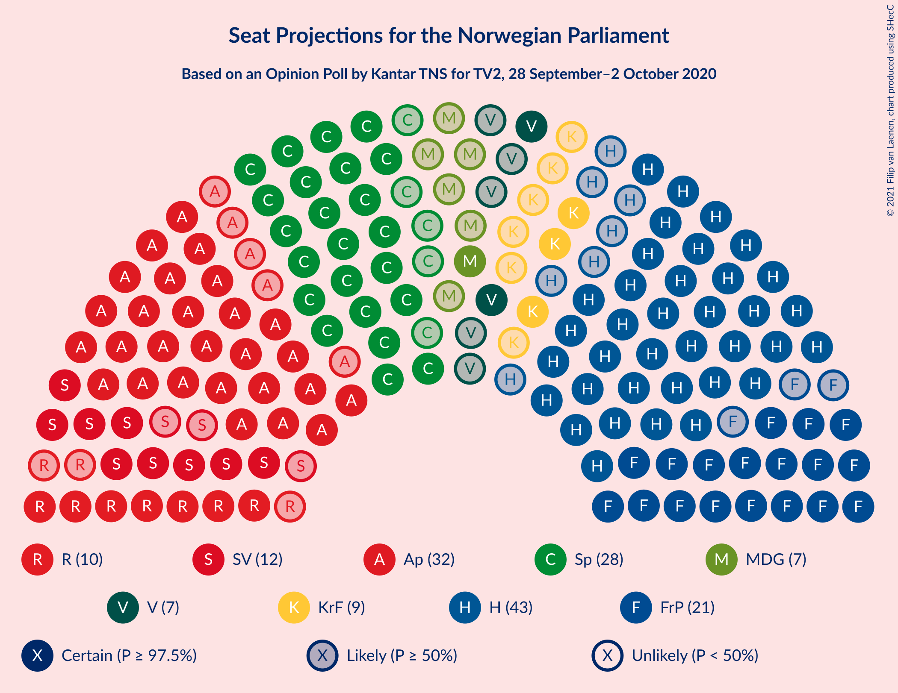
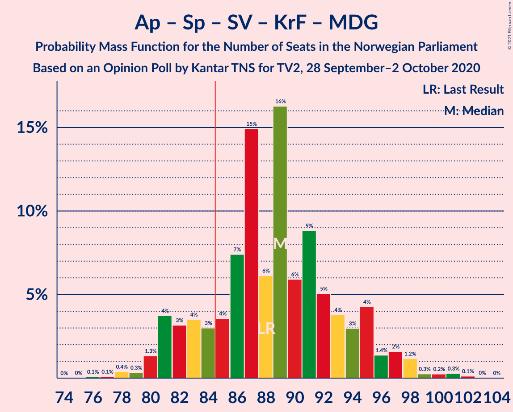
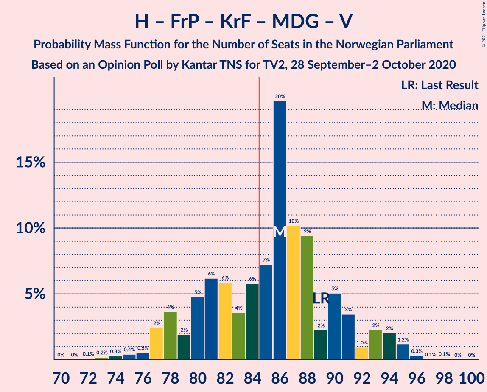
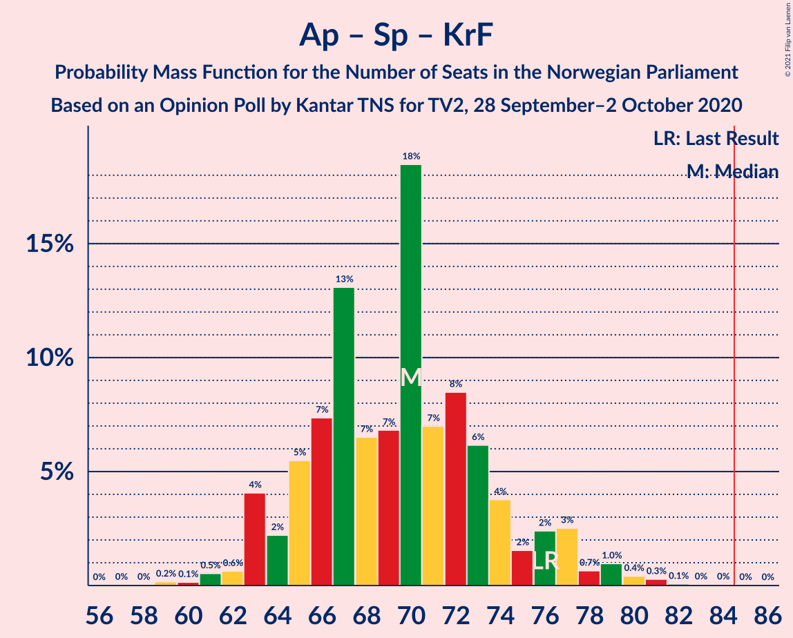

# Opinion Poll by Kantar TNS for TV2, 28 September–2 October 2020

<a href="#voting-intentions">Voting Intentions</a> | <a href="#seats">Seats</a> | <a href="#coalitions">Coalitions</a> | <a href="#technical-information">Technical Information</a>

## Voting Intentions

### Confidence Intervals

| Party | Last Result | Poll Result | 80% Confidence Interval | 90% Confidence Interval | 95% Confidence Interval | 99% Confidence Interval |
|:-----:|:-----------:|:-----------:|:-----------------------:|:-----------------------:|:-----------------------:|:-----------------------:|
| Høyre | 25.0% | 24.0% | 22.0–26.1% |21.5–26.7% |21.0–27.3% |20.1–28.3% |
| Arbeiderpartiet | 27.4% | 18.4% | 16.6–20.3% |16.1–20.9% |15.7–21.4% |14.9–22.4% |
| Senterpartiet | 10.3% | 16.3% | 14.6–18.2% |14.1–18.7% |13.7–19.2% |13.0–20.1% |
| Fremskrittspartiet | 15.2% | 12.8% | 11.3–14.5% |10.9–15.0% |10.5–15.4% |9.8–16.3% |
| Sosialistisk Venstreparti | 6.0% | 7.2% | 6.1–8.6% |5.7–8.9% |5.5–9.3% |5.0–10.0% |
| Rødt | 2.4% | 6.2% | 5.2–7.5% |4.9–7.9% |4.6–8.2% |4.2–8.9% |
| Kristelig Folkeparti | 4.2% | 5.0% | 4.1–6.3% |3.9–6.6% |3.7–6.9% |3.3–7.5% |
| Miljøpartiet De Grønne | 3.2% | 4.8% | 3.9–6.0% |3.6–6.3% |3.4–6.6% |3.0–7.2% |
| Venstre | 4.4% | 4.3% | 3.5–5.5% |3.3–5.8% |3.1–6.1% |2.7–6.7% |

*Note:* The poll result column reflects the actual value used in the calculations. Published results may vary slightly, and in addition be rounded to fewer digits.

## Seats

### Confidence Intervals

| Party | Last Result | Median | 80% Confidence Interval | 90% Confidence Interval | 95% Confidence Interval | 99% Confidence Interval |
|:-----:|:-----------:|:------:|:-----------------------:|:-----------------------:|:-----------------------:|:-----------------------:|
| <a href="#høyre">Høyre</a> | 45 | 43 | 38–46 |37–47 |36–47 |33–48 |
| <a href="#arbeiderpartiet">Arbeiderpartiet</a> | 49 | 32 | 29–37 |28–39 |27–39 |24–40 |
| <a href="#senterpartiet">Senterpartiet</a> | 19 | 29 | 25–33 |24–35 |23–36 |20–39 |
| <a href="#fremskrittspartiet">Fremskrittspartiet</a> | 27 | 22 | 19–26 |18–26 |18–27 |17–29 |
| <a href="#sosialistisk-venstreparti">Sosialistisk Venstreparti</a> | 11 | 12 | 10–15 |9–15 |9–16 |8–17 |
| <a href="#rødt">Rødt</a> | 1 | 10 | 9–13 |8–13 |7–13 |6–14 |
| <a href="#kristelig-folkeparti">Kristelig Folkeparti</a> | 8 | 8 | 7–10 |3–10 |3–11 |1–13 |
| <a href="#miljøpartiet-de-grønne">Miljøpartiet De Grønne</a> | 1 | 8 | 2–9 |2–10 |1–11 |1–11 |
| <a href="#venstre">Venstre</a> | 8 | 7 | 2–8 |2–9 |2–10 |2–11 |

### Høyre

*For a full overview of the results for this party, see the [Høyre](party-høyre.html) page.*

| Number of Seats | Probability | Accumulated | Special Marks |
|:---------------:|:-----------:|:-----------:|:-------------:|
| 31 | 0.1% | 100% |  |
| 32 | 0.1% | 99.9% |  |
| 33 | 0.3% | 99.8% |  |
| 34 | 0.7% | 99.5% |  |
| 35 | 0.9% | 98.8% |  |
| 36 | 0.7% | 98% |  |
| 37 | 3% | 97% |  |
| 38 | 7% | 94% |  |
| 39 | 5% | 87% |  |
| 40 | 11% | 82% |  |
| 41 | 7% | 71% |  |
| 42 | 6% | 64% |  |
| 43 | 23% | 58% | Median |
| 44 | 7% | 35% |  |
| 45 | 16% | 28% | Last Result |
| 46 | 2% | 11% |  |
| 47 | 8% | 9% |  |
| 48 | 0.7% | 1.0% |  |
| 49 | 0.2% | 0.4% |  |
| 50 | 0.1% | 0.2% |  |
| 51 | 0% | 0.1% |  |
| 52 | 0.1% | 0.1% |  |
| 53 | 0% | 0% |  |

### Arbeiderpartiet

*For a full overview of the results for this party, see the [Arbeiderpartiet](party-arbeiderpartiet.html) page.*

| Number of Seats | Probability | Accumulated | Special Marks |
|:---------------:|:-----------:|:-----------:|:-------------:|
| 23 | 0.1% | 100% |  |
| 24 | 0.4% | 99.9% |  |
| 25 | 0.5% | 99.5% |  |
| 26 | 0.7% | 99.0% |  |
| 27 | 2% | 98% |  |
| 28 | 2% | 96% |  |
| 29 | 8% | 94% |  |
| 30 | 13% | 86% |  |
| 31 | 19% | 73% |  |
| 32 | 6% | 54% | Median |
| 33 | 22% | 48% |  |
| 34 | 10% | 26% |  |
| 35 | 4% | 17% |  |
| 36 | 2% | 12% |  |
| 37 | 3% | 10% |  |
| 38 | 2% | 7% |  |
| 39 | 3% | 5% |  |
| 40 | 2% | 2% |  |
| 41 | 0.2% | 0.3% |  |
| 42 | 0.1% | 0.1% |  |
| 43 | 0% | 0% |  |
| 44 | 0% | 0% |  |
| 45 | 0% | 0% |  |
| 46 | 0% | 0% |  |
| 47 | 0% | 0% |  |
| 48 | 0% | 0% |  |
| 49 | 0% | 0% | Last Result |

### Senterpartiet

*For a full overview of the results for this party, see the [Senterpartiet](party-senterpartiet.html) page.*

| Number of Seats | Probability | Accumulated | Special Marks |
|:---------------:|:-----------:|:-----------:|:-------------:|
| 19 | 0.1% | 100% | Last Result |
| 20 | 0.5% | 99.9% |  |
| 21 | 0.1% | 99.4% |  |
| 22 | 2% | 99.3% |  |
| 23 | 0.6% | 98% |  |
| 24 | 2% | 97% |  |
| 25 | 6% | 95% |  |
| 26 | 3% | 88% |  |
| 27 | 27% | 85% |  |
| 28 | 4% | 59% |  |
| 29 | 6% | 55% | Median |
| 30 | 26% | 49% |  |
| 31 | 6% | 22% |  |
| 32 | 3% | 16% |  |
| 33 | 5% | 12% |  |
| 34 | 2% | 7% |  |
| 35 | 2% | 5% |  |
| 36 | 2% | 3% |  |
| 37 | 0.8% | 2% |  |
| 38 | 0.2% | 1.1% |  |
| 39 | 0.8% | 0.9% |  |
| 40 | 0% | 0.1% |  |
| 41 | 0% | 0% |  |

### Fremskrittspartiet

*For a full overview of the results for this party, see the [Fremskrittspartiet](party-fremskrittspartiet.html) page.*

| Number of Seats | Probability | Accumulated | Special Marks |
|:---------------:|:-----------:|:-----------:|:-------------:|
| 14 | 0.1% | 100% |  |
| 15 | 0.1% | 99.9% |  |
| 16 | 0.2% | 99.8% |  |
| 17 | 1.3% | 99.5% |  |
| 18 | 7% | 98% |  |
| 19 | 6% | 91% |  |
| 20 | 5% | 85% |  |
| 21 | 5% | 80% |  |
| 22 | 30% | 75% | Median |
| 23 | 11% | 46% |  |
| 24 | 16% | 35% |  |
| 25 | 8% | 19% |  |
| 26 | 6% | 11% |  |
| 27 | 4% | 5% | Last Result |
| 28 | 0.2% | 0.9% |  |
| 29 | 0.5% | 0.6% |  |
| 30 | 0.1% | 0.1% |  |
| 31 | 0% | 0% |  |

### Sosialistisk Venstreparti

*For a full overview of the results for this party, see the [Sosialistisk Venstreparti](party-sosialistiskvenstreparti.html) page.*

| Number of Seats | Probability | Accumulated | Special Marks |
|:---------------:|:-----------:|:-----------:|:-------------:|
| 7 | 0.3% | 100% |  |
| 8 | 0.9% | 99.7% |  |
| 9 | 6% | 98.8% |  |
| 10 | 18% | 93% |  |
| 11 | 7% | 75% | Last Result |
| 12 | 29% | 68% | Median |
| 13 | 21% | 39% |  |
| 14 | 7% | 18% |  |
| 15 | 7% | 11% |  |
| 16 | 2% | 4% |  |
| 17 | 1.2% | 1.4% |  |
| 18 | 0.2% | 0.2% |  |
| 19 | 0% | 0% |  |

### Rødt

*For a full overview of the results for this party, see the [Rødt](party-rødt.html) page.*

| Number of Seats | Probability | Accumulated | Special Marks |
|:---------------:|:-----------:|:-----------:|:-------------:|
| 1 | 0% | 100% | Last Result |
| 2 | 0.1% | 100% |  |
| 3 | 0% | 99.9% |  |
| 4 | 0% | 99.9% |  |
| 5 | 0% | 99.9% |  |
| 6 | 0.7% | 99.9% |  |
| 7 | 3% | 99.1% |  |
| 8 | 5% | 96% |  |
| 9 | 21% | 90% |  |
| 10 | 22% | 70% | Median |
| 11 | 19% | 47% |  |
| 12 | 7% | 29% |  |
| 13 | 20% | 22% |  |
| 14 | 2% | 2% |  |
| 15 | 0.4% | 0.5% |  |
| 16 | 0% | 0.1% |  |
| 17 | 0% | 0% |  |

### Kristelig Folkeparti

*For a full overview of the results for this party, see the [Kristelig Folkeparti](party-kristeligfolkeparti.html) page.*

| Number of Seats | Probability | Accumulated | Special Marks |
|:---------------:|:-----------:|:-----------:|:-------------:|
| 1 | 0.6% | 100% |  |
| 2 | 2% | 99.4% |  |
| 3 | 4% | 98% |  |
| 4 | 0% | 94% |  |
| 5 | 0% | 94% |  |
| 6 | 2% | 94% |  |
| 7 | 16% | 92% |  |
| 8 | 28% | 75% | Last Result, Median |
| 9 | 32% | 47% |  |
| 10 | 11% | 15% |  |
| 11 | 3% | 5% |  |
| 12 | 2% | 2% |  |
| 13 | 0.4% | 0.5% |  |
| 14 | 0.1% | 0.1% |  |
| 15 | 0% | 0% |  |

### Miljøpartiet De Grønne

*For a full overview of the results for this party, see the [Miljøpartiet De Grønne](party-miljøpartietdegrønne.html) page.*

| Number of Seats | Probability | Accumulated | Special Marks |
|:---------------:|:-----------:|:-----------:|:-------------:|
| 1 | 3% | 100% | Last Result |
| 2 | 20% | 97% |  |
| 3 | 0.9% | 77% |  |
| 4 | 0% | 76% |  |
| 5 | 0% | 76% |  |
| 6 | 5% | 76% |  |
| 7 | 12% | 71% |  |
| 8 | 39% | 59% | Median |
| 9 | 11% | 20% |  |
| 10 | 6% | 9% |  |
| 11 | 2% | 3% |  |
| 12 | 0.4% | 0.5% |  |
| 13 | 0.1% | 0.1% |  |
| 14 | 0% | 0% |  |

### Venstre

*For a full overview of the results for this party, see the [Venstre](party-venstre.html) page.*

| Number of Seats | Probability | Accumulated | Special Marks |
|:---------------:|:-----------:|:-----------:|:-------------:|
| 1 | 0.4% | 100% |  |
| 2 | 37% | 99.6% |  |
| 3 | 0% | 62% |  |
| 4 | 0% | 62% |  |
| 5 | 0% | 62% |  |
| 6 | 2% | 62% |  |
| 7 | 31% | 60% | Median |
| 8 | 20% | 29% | Last Result |
| 9 | 5% | 9% |  |
| 10 | 3% | 4% |  |
| 11 | 0.5% | 0.6% |  |
| 12 | 0.1% | 0.1% |  |
| 13 | 0% | 0% |  |

## Coalitions

### Confidence Intervals

| Coalition | Last Result | Median | Majority? | 80% Confidence Interval | 90% Confidence Interval | 95% Confidence Interval | 99% Confidence Interval |
|:---------:|:-----------:|:------:|:---------:|:-----------------------:|:-----------------------:|:-----------------------:|:-----------------------:|
| Høyre – Senterpartiet – Fremskrittspartiet – Kristelig Folkeparti – Venstre | 107 | 108 | 100% | 101–113 | 100–114 | 100–114 | 97–118 |
| Arbeiderpartiet – Senterpartiet – Sosialistisk Venstreparti – Rødt – Miljøpartiet De Grønne | 81 | 91 | 88% | 84–98 | 82–99 | 82–99 | 82–103 |
| Arbeiderpartiet – Senterpartiet – Sosialistisk Venstreparti – Kristelig Folkeparti – Miljøpartiet De Grønne | 88 | 87 | 81% | 81–95 | 81–96 | 81–97 | 79–101 |
| Høyre – Fremskrittspartiet – Kristelig Folkeparti – Miljøpartiet De Grønne – Venstre | 89 | 86 | 60% | 79–91 | 78–94 | 76–95 | 74–95 |
| Arbeiderpartiet – Senterpartiet – Sosialistisk Venstreparti – Rødt | 80 | 83 | 40% | 78–90 | 75–91 | 74–93 | 74–95 |
| Arbeiderpartiet – Senterpartiet – Sosialistisk Venstreparti – Miljøpartiet De Grønne | 80 | 78 | 18% | 74–87 | 73–88 | 72–89 | 71–94 |
| Høyre – Fremskrittspartiet – Kristelig Folkeparti – Venstre | 88 | 78 | 12% | 71–85 | 70–87 | 70–87 | 66–87 |
| Arbeiderpartiet – Senterpartiet – Kristelig Folkeparti – Miljøpartiet De Grønne | 77 | 74 | 6% | 71–81 | 70–85 | 69–86 | 67–88 |
| Arbeiderpartiet – Senterpartiet – Sosialistisk Venstreparti | 79 | 73 | 1.0% | 68–79 | 66–80 | 65–81 | 65–85 |
| Høyre – Fremskrittspartiet – Venstre | 80 | 70 | 0% | 64–78 | 61–78 | 61–79 | 59–80 |
| Arbeiderpartiet – Senterpartiet – Kristelig Folkeparti | 76 | 70 | 0% | 64–74 | 63–76 | 63–77 | 61–81 |
| Høyre – Fremskrittspartiet | 72 | 65 | 0% | 59–71 | 58–71 | 57–71 | 52–73 |
| Arbeiderpartiet – Senterpartiet | 68 | 61 | 0% | 56–66 | 55–69 | 55–70 | 53–72 |
| Høyre – Kristelig Folkeparti – Venstre | 61 | 56 | 0% | 51–61 | 49–63 | 49–63 | 45–65 |
| Arbeiderpartiet – Sosialistisk Venstreparti | 60 | 45 | 0% | 40–48 | 39–51 | 38–52 | 37–54 |
| Senterpartiet – Kristelig Folkeparti – Venstre | 35 | 42 | 0% | 39–48 | 37–50 | 36–52 | 33–53 |

### Høyre – Senterpartiet – Fremskrittspartiet – Kristelig Folkeparti – Venstre

| Number of Seats | Probability | Accumulated | Special Marks |
|:---------------:|:-----------:|:-----------:|:-------------:|
| 95 | 0.1% | 100% |  |
| 96 | 0.3% | 99.9% |  |
| 97 | 0.8% | 99.6% |  |
| 98 | 0.2% | 98.8% |  |
| 99 | 0.6% | 98.6% |  |
| 100 | 5% | 98% |  |
| 101 | 5% | 94% |  |
| 102 | 2% | 88% |  |
| 103 | 3% | 86% |  |
| 104 | 3% | 84% |  |
| 105 | 12% | 81% |  |
| 106 | 3% | 69% |  |
| 107 | 15% | 66% | Last Result |
| 108 | 18% | 51% |  |
| 109 | 4% | 33% | Median |
| 110 | 7% | 29% |  |
| 111 | 5% | 22% |  |
| 112 | 5% | 18% |  |
| 113 | 5% | 13% |  |
| 114 | 6% | 8% |  |
| 115 | 1.0% | 2% |  |
| 116 | 0.2% | 1.2% |  |
| 117 | 0.5% | 1.0% |  |
| 118 | 0.2% | 0.5% |  |
| 119 | 0.2% | 0.3% |  |
| 120 | 0% | 0.1% |  |
| 121 | 0% | 0% |  |

### Arbeiderpartiet – Senterpartiet – Sosialistisk Venstreparti – Rødt – Miljøpartiet De Grønne

| Number of Seats | Probability | Accumulated | Special Marks |
|:---------------:|:-----------:|:-----------:|:-------------:|
| 77 | 0.1% | 100% |  |
| 78 | 0% | 99.9% |  |
| 79 | 0.1% | 99.9% |  |
| 80 | 0.2% | 99.8% |  |
| 81 | 0.1% | 99.6% | Last Result |
| 82 | 6% | 99.5% |  |
| 83 | 2% | 94% |  |
| 84 | 4% | 92% |  |
| 85 | 3% | 88% | Majority |
| 86 | 5% | 85% |  |
| 87 | 2% | 80% |  |
| 88 | 2% | 78% |  |
| 89 | 15% | 76% |  |
| 90 | 9% | 61% |  |
| 91 | 22% | 52% | Median |
| 92 | 5% | 30% |  |
| 93 | 4% | 26% |  |
| 94 | 2% | 22% |  |
| 95 | 5% | 19% |  |
| 96 | 2% | 15% |  |
| 97 | 2% | 13% |  |
| 98 | 4% | 10% |  |
| 99 | 5% | 7% |  |
| 100 | 0.5% | 2% |  |
| 101 | 0.2% | 2% |  |
| 102 | 0.3% | 1.3% |  |
| 103 | 0.9% | 1.0% |  |
| 104 | 0.1% | 0.1% |  |
| 105 | 0% | 0.1% |  |
| 106 | 0% | 0% |  |

### Arbeiderpartiet – Senterpartiet – Sosialistisk Venstreparti – Kristelig Folkeparti – Miljøpartiet De Grønne

| Number of Seats | Probability | Accumulated | Special Marks |
|:---------------:|:-----------:|:-----------:|:-------------:|
| 75 | 0.1% | 100% |  |
| 76 | 0% | 99.9% |  |
| 77 | 0.2% | 99.9% |  |
| 78 | 0.2% | 99.7% |  |
| 79 | 0.2% | 99.5% |  |
| 80 | 0.6% | 99.3% |  |
| 81 | 9% | 98.7% |  |
| 82 | 2% | 90% |  |
| 83 | 1.3% | 88% |  |
| 84 | 6% | 87% |  |
| 85 | 4% | 81% | Majority |
| 86 | 15% | 77% |  |
| 87 | 17% | 62% |  |
| 88 | 4% | 45% | Last Result |
| 89 | 4% | 41% | Median |
| 90 | 7% | 38% |  |
| 91 | 12% | 31% |  |
| 92 | 3% | 19% |  |
| 93 | 2% | 16% |  |
| 94 | 1.3% | 14% |  |
| 95 | 6% | 12% |  |
| 96 | 2% | 6% |  |
| 97 | 2% | 4% |  |
| 98 | 0.3% | 2% |  |
| 99 | 0.4% | 1.4% |  |
| 100 | 0.2% | 1.0% |  |
| 101 | 0.8% | 0.9% |  |
| 102 | 0% | 0.1% |  |
| 103 | 0% | 0.1% |  |
| 104 | 0% | 0% |  |

### Høyre – Fremskrittspartiet – Kristelig Folkeparti – Miljøpartiet De Grønne – Venstre

| Number of Seats | Probability | Accumulated | Special Marks |
|:---------------:|:-----------:|:-----------:|:-------------:|
| 71 | 0% | 100% |  |
| 72 | 0% | 99.9% |  |
| 73 | 0.1% | 99.9% |  |
| 74 | 0.4% | 99.8% |  |
| 75 | 1.0% | 99.5% |  |
| 76 | 1.0% | 98% |  |
| 77 | 0.5% | 97% |  |
| 78 | 5% | 97% |  |
| 79 | 3% | 92% |  |
| 80 | 14% | 89% |  |
| 81 | 3% | 75% |  |
| 82 | 2% | 71% |  |
| 83 | 3% | 69% |  |
| 84 | 6% | 66% |  |
| 85 | 9% | 60% | Majority |
| 86 | 14% | 52% |  |
| 87 | 4% | 38% |  |
| 88 | 15% | 34% | Median |
| 89 | 2% | 18% | Last Result |
| 90 | 3% | 16% |  |
| 91 | 4% | 13% |  |
| 92 | 1.0% | 9% |  |
| 93 | 2% | 8% |  |
| 94 | 2% | 6% |  |
| 95 | 4% | 4% |  |
| 96 | 0.1% | 0.2% |  |
| 97 | 0% | 0.1% |  |
| 98 | 0.1% | 0.1% |  |
| 99 | 0% | 0% |  |

### Arbeiderpartiet – Senterpartiet – Sosialistisk Venstreparti – Rødt

| Number of Seats | Probability | Accumulated | Special Marks |
|:---------------:|:-----------:|:-----------:|:-------------:|
| 71 | 0.1% | 100% |  |
| 72 | 0% | 99.9% |  |
| 73 | 0.1% | 99.9% |  |
| 74 | 4% | 99.8% |  |
| 75 | 2% | 96% |  |
| 76 | 2% | 94% |  |
| 77 | 1.0% | 92% |  |
| 78 | 4% | 91% |  |
| 79 | 3% | 87% |  |
| 80 | 2% | 84% | Last Result |
| 81 | 15% | 82% |  |
| 82 | 4% | 66% |  |
| 83 | 14% | 62% | Median |
| 84 | 9% | 48% |  |
| 85 | 6% | 40% | Majority |
| 86 | 3% | 34% |  |
| 87 | 2% | 31% |  |
| 88 | 3% | 29% |  |
| 89 | 14% | 25% |  |
| 90 | 3% | 11% |  |
| 91 | 5% | 8% |  |
| 92 | 0.5% | 3% |  |
| 93 | 1.0% | 3% |  |
| 94 | 1.0% | 2% |  |
| 95 | 0.4% | 0.5% |  |
| 96 | 0.1% | 0.2% |  |
| 97 | 0% | 0.1% |  |
| 98 | 0% | 0.1% |  |
| 99 | 0% | 0% |  |

### Arbeiderpartiet – Senterpartiet – Sosialistisk Venstreparti – Miljøpartiet De Grønne

| Number of Seats | Probability | Accumulated | Special Marks |
|:---------------:|:-----------:|:-----------:|:-------------:|
| 67 | 0.1% | 100% |  |
| 68 | 0.1% | 99.9% |  |
| 69 | 0% | 99.8% |  |
| 70 | 0.3% | 99.8% |  |
| 71 | 0.2% | 99.5% |  |
| 72 | 2% | 99.3% |  |
| 73 | 5% | 97% |  |
| 74 | 5% | 92% |  |
| 75 | 1.0% | 87% |  |
| 76 | 7% | 86% |  |
| 77 | 2% | 80% |  |
| 78 | 28% | 78% |  |
| 79 | 3% | 50% |  |
| 80 | 5% | 47% | Last Result |
| 81 | 12% | 42% | Median |
| 82 | 5% | 30% |  |
| 83 | 4% | 25% |  |
| 84 | 3% | 21% |  |
| 85 | 1.3% | 18% | Majority |
| 86 | 7% | 17% |  |
| 87 | 2% | 10% |  |
| 88 | 3% | 8% |  |
| 89 | 3% | 5% |  |
| 90 | 0.2% | 2% |  |
| 91 | 0.3% | 1.4% |  |
| 92 | 0% | 1.1% |  |
| 93 | 0.5% | 1.1% |  |
| 94 | 0.5% | 0.6% |  |
| 95 | 0% | 0.1% |  |
| 96 | 0% | 0% |  |

### Høyre – Fremskrittspartiet – Kristelig Folkeparti – Venstre

| Number of Seats | Probability | Accumulated | Special Marks |
|:---------------:|:-----------:|:-----------:|:-------------:|
| 64 | 0% | 100% |  |
| 65 | 0.1% | 99.9% |  |
| 66 | 0.9% | 99.9% |  |
| 67 | 0.3% | 99.0% |  |
| 68 | 0.2% | 98.7% |  |
| 69 | 0.5% | 98% |  |
| 70 | 5% | 98% |  |
| 71 | 4% | 93% |  |
| 72 | 2% | 90% |  |
| 73 | 2% | 87% |  |
| 74 | 5% | 85% |  |
| 75 | 2% | 81% |  |
| 76 | 4% | 78% |  |
| 77 | 5% | 74% |  |
| 78 | 22% | 70% |  |
| 79 | 9% | 48% |  |
| 80 | 15% | 39% | Median |
| 81 | 2% | 24% |  |
| 82 | 2% | 22% |  |
| 83 | 5% | 20% |  |
| 84 | 3% | 15% |  |
| 85 | 4% | 12% | Majority |
| 86 | 2% | 8% |  |
| 87 | 6% | 6% |  |
| 88 | 0.1% | 0.5% | Last Result |
| 89 | 0.2% | 0.4% |  |
| 90 | 0.1% | 0.2% |  |
| 91 | 0% | 0.1% |  |
| 92 | 0.1% | 0.1% |  |
| 93 | 0% | 0% |  |

### Arbeiderpartiet – Senterpartiet – Kristelig Folkeparti – Miljøpartiet De Grønne

| Number of Seats | Probability | Accumulated | Special Marks |
|:---------------:|:-----------:|:-----------:|:-------------:|
| 62 | 0.1% | 100% |  |
| 63 | 0% | 99.9% |  |
| 64 | 0.1% | 99.8% |  |
| 65 | 0% | 99.8% |  |
| 66 | 0.2% | 99.7% |  |
| 67 | 0.1% | 99.5% |  |
| 68 | 0.9% | 99.5% |  |
| 69 | 2% | 98.5% |  |
| 70 | 4% | 97% |  |
| 71 | 10% | 93% |  |
| 72 | 5% | 83% |  |
| 73 | 2% | 78% |  |
| 74 | 29% | 76% |  |
| 75 | 4% | 47% |  |
| 76 | 2% | 43% |  |
| 77 | 3% | 41% | Last Result, Median |
| 78 | 3% | 38% |  |
| 79 | 10% | 35% |  |
| 80 | 10% | 24% |  |
| 81 | 4% | 14% |  |
| 82 | 1.1% | 10% |  |
| 83 | 0.9% | 9% |  |
| 84 | 2% | 8% |  |
| 85 | 2% | 6% | Majority |
| 86 | 2% | 4% |  |
| 87 | 0.5% | 1.4% |  |
| 88 | 0.7% | 1.0% |  |
| 89 | 0.1% | 0.2% |  |
| 90 | 0% | 0.1% |  |
| 91 | 0% | 0.1% |  |
| 92 | 0% | 0.1% |  |
| 93 | 0% | 0% |  |

### Arbeiderpartiet – Senterpartiet – Sosialistisk Venstreparti

| Number of Seats | Probability | Accumulated | Special Marks |
|:---------------:|:-----------:|:-----------:|:-------------:|
| 62 | 0.1% | 100% |  |
| 63 | 0.1% | 99.9% |  |
| 64 | 0.2% | 99.8% |  |
| 65 | 4% | 99.6% |  |
| 66 | 2% | 95% |  |
| 67 | 2% | 93% |  |
| 68 | 4% | 91% |  |
| 69 | 3% | 87% |  |
| 70 | 14% | 84% |  |
| 71 | 5% | 70% |  |
| 72 | 3% | 65% |  |
| 73 | 14% | 62% | Median |
| 74 | 9% | 48% |  |
| 75 | 5% | 39% |  |
| 76 | 16% | 34% |  |
| 77 | 2% | 18% |  |
| 78 | 6% | 16% |  |
| 79 | 3% | 10% | Last Result |
| 80 | 3% | 7% |  |
| 81 | 2% | 5% |  |
| 82 | 0.2% | 2% |  |
| 83 | 1.0% | 2% |  |
| 84 | 0.2% | 1.2% |  |
| 85 | 0.8% | 1.0% | Majority |
| 86 | 0.1% | 0.1% |  |
| 87 | 0% | 0.1% |  |
| 88 | 0% | 0% |  |

### Høyre – Fremskrittspartiet – Venstre

| Number of Seats | Probability | Accumulated | Special Marks |
|:---------------:|:-----------:|:-----------:|:-------------:|
| 57 | 0.1% | 100% |  |
| 58 | 0.2% | 99.9% |  |
| 59 | 0.8% | 99.7% |  |
| 60 | 0.4% | 98.8% |  |
| 61 | 3% | 98% |  |
| 62 | 1.0% | 95% |  |
| 63 | 1.4% | 94% |  |
| 64 | 3% | 93% |  |
| 65 | 4% | 89% |  |
| 66 | 2% | 86% |  |
| 67 | 4% | 84% |  |
| 68 | 12% | 80% |  |
| 69 | 16% | 69% |  |
| 70 | 9% | 52% |  |
| 71 | 2% | 44% |  |
| 72 | 17% | 41% | Median |
| 73 | 3% | 25% |  |
| 74 | 2% | 22% |  |
| 75 | 7% | 20% |  |
| 76 | 0.4% | 12% |  |
| 77 | 0.8% | 12% |  |
| 78 | 6% | 11% |  |
| 79 | 4% | 5% |  |
| 80 | 0.5% | 0.7% | Last Result |
| 81 | 0.2% | 0.3% |  |
| 82 | 0% | 0.1% |  |
| 83 | 0% | 0.1% |  |
| 84 | 0.1% | 0.1% |  |
| 85 | 0% | 0% | Majority |

### Arbeiderpartiet – Senterpartiet – Kristelig Folkeparti

| Number of Seats | Probability | Accumulated | Special Marks |
|:---------------:|:-----------:|:-----------:|:-------------:|
| 56 | 0.1% | 100% |  |
| 57 | 0% | 99.9% |  |
| 58 | 0% | 99.9% |  |
| 59 | 0.1% | 99.9% |  |
| 60 | 0.2% | 99.8% |  |
| 61 | 0.8% | 99.6% |  |
| 62 | 0.7% | 98.7% |  |
| 63 | 8% | 98% |  |
| 64 | 2% | 90% |  |
| 65 | 6% | 88% |  |
| 66 | 15% | 82% |  |
| 67 | 4% | 67% |  |
| 68 | 6% | 63% |  |
| 69 | 5% | 57% | Median |
| 70 | 4% | 52% |  |
| 71 | 10% | 48% |  |
| 72 | 20% | 38% |  |
| 73 | 5% | 18% |  |
| 74 | 4% | 13% |  |
| 75 | 0.7% | 8% |  |
| 76 | 3% | 8% | Last Result |
| 77 | 3% | 5% |  |
| 78 | 0.5% | 2% |  |
| 79 | 0.7% | 2% |  |
| 80 | 0.2% | 0.8% |  |
| 81 | 0.4% | 0.6% |  |
| 82 | 0.1% | 0.2% |  |
| 83 | 0.1% | 0.1% |  |
| 84 | 0% | 0.1% |  |
| 85 | 0% | 0% | Majority |

### Høyre – Fremskrittspartiet

| Number of Seats | Probability | Accumulated | Special Marks |
|:---------------:|:-----------:|:-----------:|:-------------:|
| 51 | 0% | 100% |  |
| 52 | 0.5% | 99.9% |  |
| 53 | 0.2% | 99.4% |  |
| 54 | 0.3% | 99.3% |  |
| 55 | 0.5% | 98.9% |  |
| 56 | 0.8% | 98% |  |
| 57 | 2% | 98% |  |
| 58 | 2% | 95% |  |
| 59 | 5% | 94% |  |
| 60 | 4% | 89% |  |
| 61 | 2% | 85% |  |
| 62 | 8% | 83% |  |
| 63 | 8% | 75% |  |
| 64 | 3% | 66% |  |
| 65 | 17% | 63% | Median |
| 66 | 10% | 46% |  |
| 67 | 20% | 37% |  |
| 68 | 3% | 17% |  |
| 69 | 1.1% | 14% |  |
| 70 | 2% | 13% |  |
| 71 | 9% | 11% |  |
| 72 | 0.8% | 1.3% | Last Result |
| 73 | 0.4% | 0.6% |  |
| 74 | 0.2% | 0.2% |  |
| 75 | 0% | 0% |  |

### Arbeiderpartiet – Senterpartiet

| Number of Seats | Probability | Accumulated | Special Marks |
|:---------------:|:-----------:|:-----------:|:-------------:|
| 52 | 0.3% | 100% |  |
| 53 | 0.3% | 99.7% |  |
| 54 | 2% | 99.4% |  |
| 55 | 5% | 98% |  |
| 56 | 3% | 93% |  |
| 57 | 2% | 90% |  |
| 58 | 19% | 88% |  |
| 59 | 7% | 68% |  |
| 60 | 7% | 62% |  |
| 61 | 10% | 55% | Median |
| 62 | 2% | 45% |  |
| 63 | 22% | 43% |  |
| 64 | 5% | 21% |  |
| 65 | 4% | 16% |  |
| 66 | 3% | 12% |  |
| 67 | 1.2% | 10% |  |
| 68 | 2% | 8% | Last Result |
| 69 | 2% | 7% |  |
| 70 | 3% | 5% |  |
| 71 | 0.9% | 2% |  |
| 72 | 0.6% | 0.9% |  |
| 73 | 0.1% | 0.3% |  |
| 74 | 0.1% | 0.1% |  |
| 75 | 0% | 0.1% |  |
| 76 | 0% | 0% |  |

### Høyre – Kristelig Folkeparti – Venstre

| Number of Seats | Probability | Accumulated | Special Marks |
|:---------------:|:-----------:|:-----------:|:-------------:|
| 41 | 0% | 100% |  |
| 42 | 0% | 99.9% |  |
| 43 | 0% | 99.9% |  |
| 44 | 0% | 99.9% |  |
| 45 | 0.4% | 99.9% |  |
| 46 | 0.8% | 99.5% |  |
| 47 | 0.7% | 98.7% |  |
| 48 | 0.6% | 98% |  |
| 49 | 3% | 98% |  |
| 50 | 3% | 94% |  |
| 51 | 6% | 91% |  |
| 52 | 3% | 85% |  |
| 53 | 6% | 82% |  |
| 54 | 6% | 76% |  |
| 55 | 11% | 70% |  |
| 56 | 17% | 59% |  |
| 57 | 5% | 42% |  |
| 58 | 15% | 37% | Median |
| 59 | 4% | 22% |  |
| 60 | 3% | 18% |  |
| 61 | 5% | 15% | Last Result |
| 62 | 3% | 9% |  |
| 63 | 6% | 7% |  |
| 64 | 0.3% | 1.1% |  |
| 65 | 0.4% | 0.8% |  |
| 66 | 0.3% | 0.5% |  |
| 67 | 0% | 0.2% |  |
| 68 | 0.1% | 0.1% |  |
| 69 | 0% | 0% |  |

### Arbeiderpartiet – Sosialistisk Venstreparti

| Number of Seats | Probability | Accumulated | Special Marks |
|:---------------:|:-----------:|:-----------:|:-------------:|
| 33 | 0% | 100% |  |
| 34 | 0% | 99.9% |  |
| 35 | 0.1% | 99.9% |  |
| 36 | 0.1% | 99.8% |  |
| 37 | 2% | 99.6% |  |
| 38 | 1.0% | 98% |  |
| 39 | 5% | 97% |  |
| 40 | 8% | 92% |  |
| 41 | 4% | 84% |  |
| 42 | 6% | 80% |  |
| 43 | 16% | 74% |  |
| 44 | 7% | 58% | Median |
| 45 | 6% | 51% |  |
| 46 | 27% | 46% |  |
| 47 | 5% | 19% |  |
| 48 | 6% | 14% |  |
| 49 | 2% | 9% |  |
| 50 | 1.2% | 7% |  |
| 51 | 2% | 5% |  |
| 52 | 2% | 3% |  |
| 53 | 0.7% | 1.2% |  |
| 54 | 0.4% | 0.5% |  |
| 55 | 0.1% | 0.1% |  |
| 56 | 0% | 0% |  |
| 57 | 0% | 0% |  |
| 58 | 0% | 0% |  |
| 59 | 0% | 0% |  |
| 60 | 0% | 0% | Last Result |

### Senterpartiet – Kristelig Folkeparti – Venstre

| Number of Seats | Probability | Accumulated | Special Marks |
|:---------------:|:-----------:|:-----------:|:-------------:|
| 31 | 0.3% | 100% |  |
| 32 | 0.1% | 99.7% |  |
| 33 | 0.4% | 99.6% |  |
| 34 | 0.3% | 99.2% |  |
| 35 | 0.6% | 98.9% | Last Result |
| 36 | 3% | 98% |  |
| 37 | 0.8% | 95% |  |
| 38 | 3% | 95% |  |
| 39 | 12% | 91% |  |
| 40 | 2% | 79% |  |
| 41 | 26% | 77% |  |
| 42 | 14% | 52% |  |
| 43 | 5% | 38% |  |
| 44 | 3% | 32% | Median |
| 45 | 2% | 29% |  |
| 46 | 12% | 27% |  |
| 47 | 4% | 15% |  |
| 48 | 4% | 11% |  |
| 49 | 1.1% | 8% |  |
| 50 | 2% | 7% |  |
| 51 | 2% | 4% |  |
| 52 | 1.4% | 3% |  |
| 53 | 1.1% | 1.3% |  |
| 54 | 0% | 0.2% |  |
| 55 | 0.1% | 0.2% |  |
| 56 | 0% | 0.1% |  |
| 57 | 0.1% | 0.1% |  |
| 58 | 0% | 0% |  |

## Technical Information

### Opinion Poll

+ **Polling firm:** Kantar TNS
+ **Commissioner(s):** TV2
+ **Fieldwork period:** 28 September–2 October 2020

### Calculations

+ **Sample size:** 713
+ **Simulations done:** 262,144
+ **Error estimate:** 2.47%

