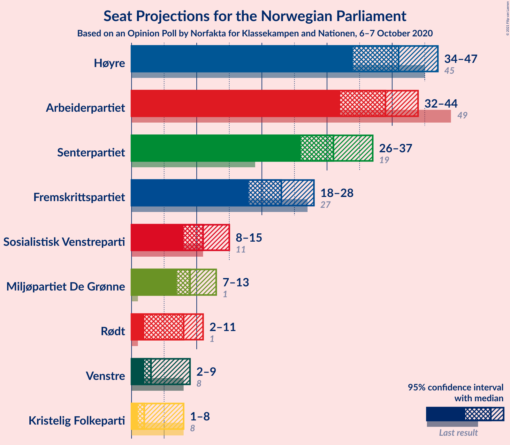
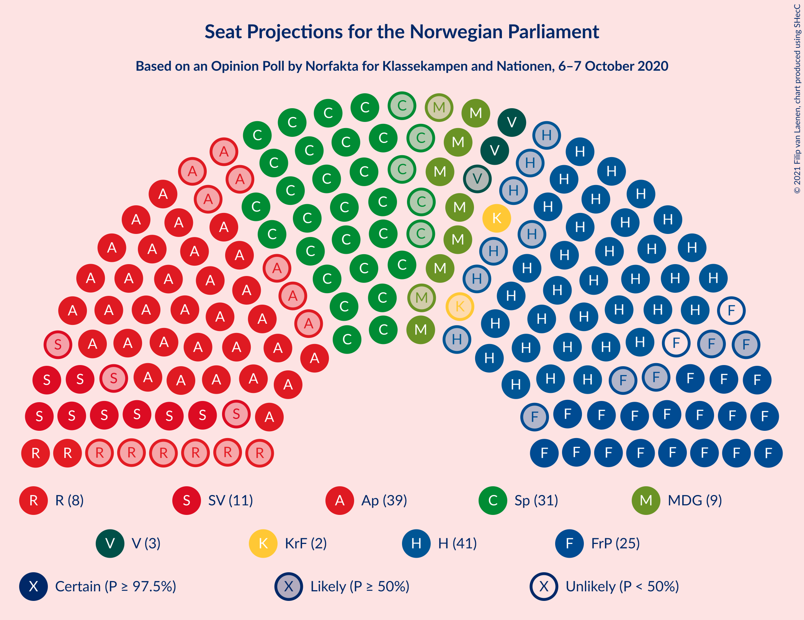
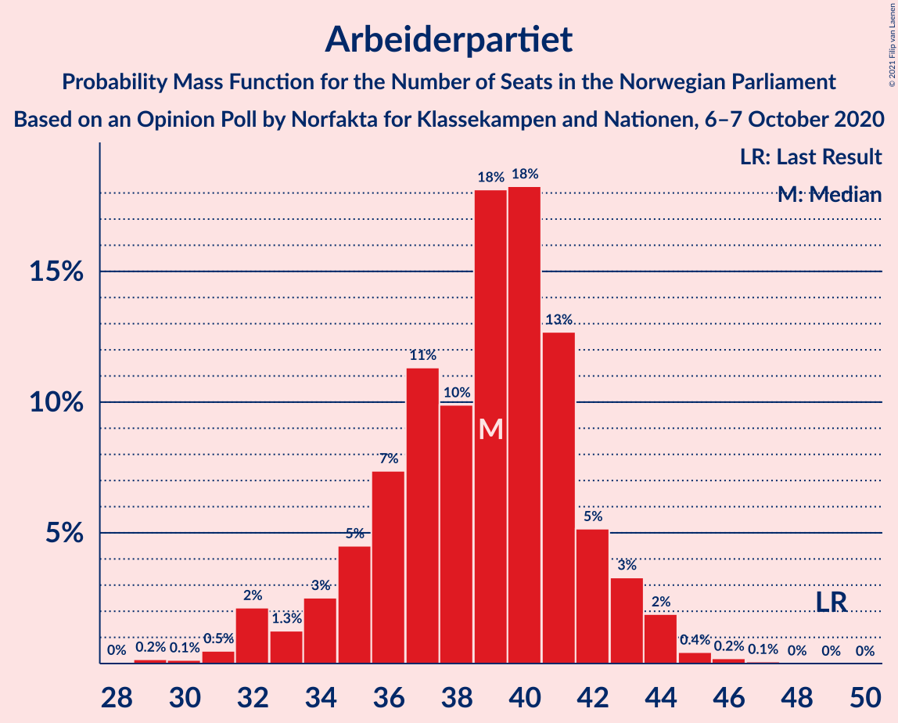
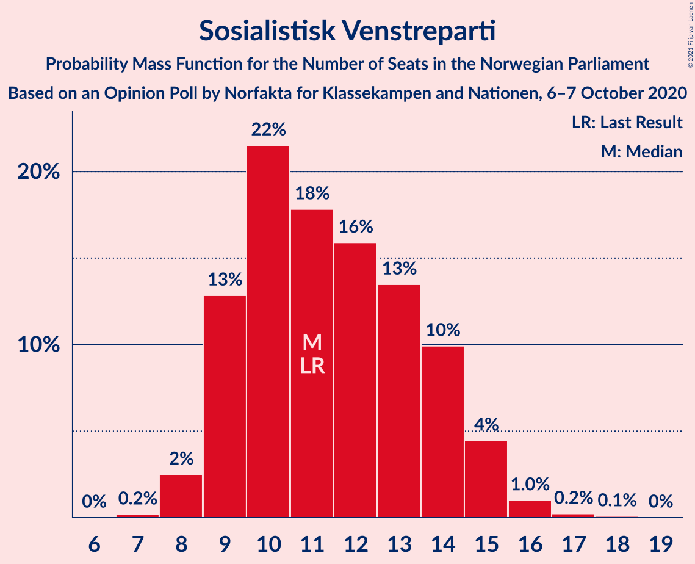
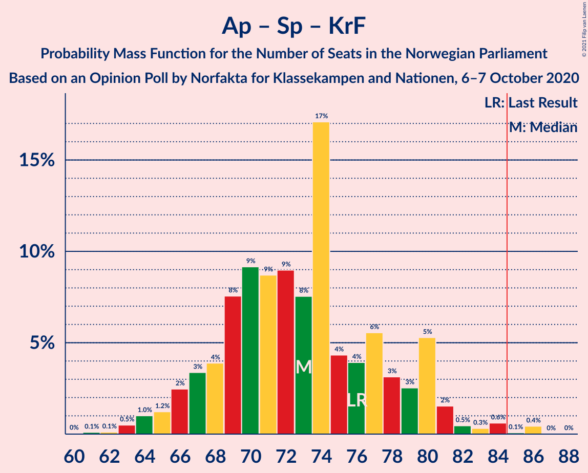
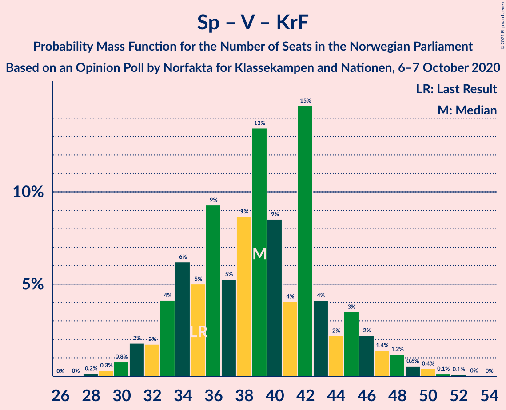

# Opinion Poll by Norfakta for Klassekampen and Nationen, 6–7 October 2020

<a href="#voting-intentions">Voting Intentions</a> | <a href="#seats">Seats</a> | <a href="#coalitions">Coalitions</a> | <a href="#technical-information">Technical Information</a>

## Voting Intentions

### Confidence Intervals

| Party | Last Result | Poll Result | 80% Confidence Interval | 90% Confidence Interval | 95% Confidence Interval | 99% Confidence Interval |
|:-----:|:-----------:|:-----------:|:-----------------------:|:-----------------------:|:-----------------------:|:-----------------------:|
| Høyre | 25.0% | 23.0% | 21.1–25.0% |20.6–25.6% |20.1–26.1% |19.3–27.1% |
| Arbeiderpartiet | 27.4% | 21.0% | 19.2–23.0% |18.7–23.5% |18.3–24.0% |17.5–25.0% |
| Senterpartiet | 10.3% | 17.0% | 15.3–18.8% |14.9–19.4% |14.5–19.8% |13.7–20.7% |
| Fremskrittspartiet | 15.2% | 13.1% | 11.6–14.8% |11.2–15.3% |10.9–15.7% |10.2–16.5% |
| Sosialistisk Venstreparti | 6.0% | 6.6% | 5.6–7.9% |5.3–8.3% |5.1–8.6% |4.6–9.3% |
| Miljøpartiet De Grønne | 3.2% | 5.6% | 4.6–6.8% |4.4–7.1% |4.2–7.4% |3.8–8.1% |
| Rødt | 2.4% | 4.4% | 3.6–5.5% |3.4–5.8% |3.2–6.1% |2.8–6.7% |
| Venstre | 4.4% | 3.9% | 3.1–4.9% |2.9–5.2% |2.7–5.5% |2.4–6.1% |
| Kristelig Folkeparti | 4.2% | 3.4% | 2.7–4.4% |2.5–4.6% |2.3–4.9% |2.0–5.4% |

*Note:* The poll result column reflects the actual value used in the calculations. Published results may vary slightly, and in addition be rounded to fewer digits.

## Seats

### Confidence Intervals

| Party | Last Result | Median | 80% Confidence Interval | 90% Confidence Interval | 95% Confidence Interval | 99% Confidence Interval |
|:-----:|:-----------:|:------:|:-----------------------:|:-----------------------:|:-----------------------:|:-----------------------:|
| <a href="#høyre">Høyre</a> | 45 | 41 | 37–44 |35–45 |34–47 |32–48 |
| <a href="#arbeiderpartiet">Arbeiderpartiet</a> | 49 | 39 | 35–42 |34–43 |32–44 |31–45 |
| <a href="#senterpartiet">Senterpartiet</a> | 19 | 31 | 27–35 |27–36 |26–37 |24–39 |
| <a href="#fremskrittspartiet">Fremskrittspartiet</a> | 27 | 23 | 20–26 |19–27 |18–28 |17–29 |
| <a href="#sosialistisk-venstreparti">Sosialistisk Venstreparti</a> | 11 | 11 | 9–14 |9–15 |8–15 |8–16 |
| <a href="#miljøpartiet-de-grønne">Miljøpartiet De Grønne</a> | 1 | 9 | 8–12 |7–12 |7–13 |2–14 |
| <a href="#rødt">Rødt</a> | 1 | 8 | 2–9 |2–10 |2–11 |1–12 |
| <a href="#venstre">Venstre</a> | 8 | 3 | 2–8 |2–9 |2–9 |1–10 |
| <a href="#kristelig-folkeparti">Kristelig Folkeparti</a> | 8 | 2 | 1–7 |1–8 |1–8 |0–9 |

### Høyre

*For a full overview of the results for this party, see the [Høyre](party-høyre.html) page.*

| Number of Seats | Probability | Accumulated | Special Marks |
|:---------------:|:-----------:|:-----------:|:-------------:|
| 31 | 0.1% | 100% |  |
| 32 | 0.6% | 99.9% |  |
| 33 | 0.8% | 99.3% |  |
| 34 | 1.3% | 98.5% |  |
| 35 | 2% | 97% |  |
| 36 | 5% | 95% |  |
| 37 | 6% | 90% |  |
| 38 | 9% | 84% |  |
| 39 | 10% | 74% |  |
| 40 | 13% | 65% |  |
| 41 | 19% | 52% | Median |
| 42 | 10% | 33% |  |
| 43 | 8% | 22% |  |
| 44 | 7% | 14% |  |
| 45 | 2% | 7% | Last Result |
| 46 | 2% | 5% |  |
| 47 | 1.1% | 3% |  |
| 48 | 1.4% | 2% |  |
| 49 | 0.2% | 0.4% |  |
| 50 | 0.1% | 0.2% |  |
| 51 | 0.1% | 0.1% |  |
| 52 | 0% | 0% |  |

### Arbeiderpartiet

*For a full overview of the results for this party, see the [Arbeiderpartiet](party-arbeiderpartiet.html) page.*

| Number of Seats | Probability | Accumulated | Special Marks |
|:---------------:|:-----------:|:-----------:|:-------------:|
| 28 | 0% | 100% |  |
| 29 | 0.2% | 99.9% |  |
| 30 | 0.1% | 99.8% |  |
| 31 | 0.5% | 99.6% |  |
| 32 | 2% | 99.2% |  |
| 33 | 1.3% | 97% |  |
| 34 | 3% | 96% |  |
| 35 | 5% | 93% |  |
| 36 | 7% | 89% |  |
| 37 | 11% | 81% |  |
| 38 | 10% | 70% |  |
| 39 | 18% | 60% | Median |
| 40 | 18% | 42% |  |
| 41 | 13% | 24% |  |
| 42 | 5% | 11% |  |
| 43 | 3% | 6% |  |
| 44 | 2% | 3% |  |
| 45 | 0.4% | 0.7% |  |
| 46 | 0.2% | 0.3% |  |
| 47 | 0.1% | 0.1% |  |
| 48 | 0% | 0% |  |
| 49 | 0% | 0% | Last Result |

### Senterpartiet

*For a full overview of the results for this party, see the [Senterpartiet](party-senterpartiet.html) page.*

| Number of Seats | Probability | Accumulated | Special Marks |
|:---------------:|:-----------:|:-----------:|:-------------:|
| 19 | 0% | 100% | Last Result |
| 20 | 0% | 100% |  |
| 21 | 0% | 100% |  |
| 22 | 0.1% | 100% |  |
| 23 | 0.2% | 99.9% |  |
| 24 | 0.6% | 99.7% |  |
| 25 | 0.8% | 99.2% |  |
| 26 | 2% | 98% |  |
| 27 | 7% | 97% |  |
| 28 | 7% | 90% |  |
| 29 | 13% | 82% |  |
| 30 | 17% | 69% |  |
| 31 | 8% | 52% | Median |
| 32 | 9% | 44% |  |
| 33 | 4% | 36% |  |
| 34 | 19% | 31% |  |
| 35 | 5% | 12% |  |
| 36 | 3% | 7% |  |
| 37 | 1.2% | 4% |  |
| 38 | 2% | 2% |  |
| 39 | 0.5% | 0.8% |  |
| 40 | 0.1% | 0.2% |  |
| 41 | 0.1% | 0.1% |  |
| 42 | 0% | 0% |  |

### Fremskrittspartiet

*For a full overview of the results for this party, see the [Fremskrittspartiet](party-fremskrittspartiet.html) page.*

| Number of Seats | Probability | Accumulated | Special Marks |
|:---------------:|:-----------:|:-----------:|:-------------:|
| 15 | 0% | 100% |  |
| 16 | 0.1% | 99.9% |  |
| 17 | 0.4% | 99.8% |  |
| 18 | 3% | 99.4% |  |
| 19 | 6% | 97% |  |
| 20 | 8% | 90% |  |
| 21 | 15% | 82% |  |
| 22 | 8% | 67% |  |
| 23 | 11% | 59% | Median |
| 24 | 12% | 48% |  |
| 25 | 20% | 36% |  |
| 26 | 7% | 16% |  |
| 27 | 5% | 9% | Last Result |
| 28 | 2% | 4% |  |
| 29 | 1.0% | 1.5% |  |
| 30 | 0.3% | 0.5% |  |
| 31 | 0.1% | 0.1% |  |
| 32 | 0% | 0.1% |  |
| 33 | 0% | 0% |  |

### Sosialistisk Venstreparti

*For a full overview of the results for this party, see the [Sosialistisk Venstreparti](party-sosialistiskvenstreparti.html) page.*

| Number of Seats | Probability | Accumulated | Special Marks |
|:---------------:|:-----------:|:-----------:|:-------------:|
| 7 | 0.2% | 100% |  |
| 8 | 2% | 99.8% |  |
| 9 | 13% | 97% |  |
| 10 | 22% | 84% |  |
| 11 | 18% | 63% | Last Result, Median |
| 12 | 16% | 45% |  |
| 13 | 13% | 29% |  |
| 14 | 10% | 16% |  |
| 15 | 4% | 6% |  |
| 16 | 1.0% | 1.3% |  |
| 17 | 0.2% | 0.3% |  |
| 18 | 0.1% | 0.1% |  |
| 19 | 0% | 0% |  |

### Miljøpartiet De Grønne

*For a full overview of the results for this party, see the [Miljøpartiet De Grønne](party-miljøpartietdegrønne.html) page.*

| Number of Seats | Probability | Accumulated | Special Marks |
|:---------------:|:-----------:|:-----------:|:-------------:|
| 1 | 0.1% | 100% | Last Result |
| 2 | 0.8% | 99.9% |  |
| 3 | 0.4% | 99.0% |  |
| 4 | 0% | 98.6% |  |
| 5 | 0% | 98.6% |  |
| 6 | 0.1% | 98.6% |  |
| 7 | 4% | 98% |  |
| 8 | 18% | 95% |  |
| 9 | 30% | 77% | Median |
| 10 | 20% | 47% |  |
| 11 | 15% | 27% |  |
| 12 | 7% | 12% |  |
| 13 | 3% | 5% |  |
| 14 | 0.9% | 1.2% |  |
| 15 | 0.3% | 0.3% |  |
| 16 | 0% | 0.1% |  |
| 17 | 0% | 0% |  |

### Rødt

*For a full overview of the results for this party, see the [Rødt](party-rødt.html) page.*

| Number of Seats | Probability | Accumulated | Special Marks |
|:---------------:|:-----------:|:-----------:|:-------------:|
| 1 | 2% | 100% | Last Result |
| 2 | 20% | 98% |  |
| 3 | 0% | 79% |  |
| 4 | 0% | 79% |  |
| 5 | 0% | 79% |  |
| 6 | 1.3% | 79% |  |
| 7 | 26% | 77% |  |
| 8 | 26% | 51% | Median |
| 9 | 17% | 25% |  |
| 10 | 6% | 9% |  |
| 11 | 2% | 3% |  |
| 12 | 0.6% | 0.7% |  |
| 13 | 0.1% | 0.1% |  |
| 14 | 0% | 0% |  |

### Venstre

*For a full overview of the results for this party, see the [Venstre](party-venstre.html) page.*

| Number of Seats | Probability | Accumulated | Special Marks |
|:---------------:|:-----------:|:-----------:|:-------------:|
| 1 | 2% | 100% |  |
| 2 | 48% | 98% |  |
| 3 | 0.5% | 50% | Median |
| 4 | 0% | 50% |  |
| 5 | 0% | 50% |  |
| 6 | 2% | 50% |  |
| 7 | 22% | 48% |  |
| 8 | 20% | 26% | Last Result |
| 9 | 5% | 6% |  |
| 10 | 0.8% | 1.2% |  |
| 11 | 0.3% | 0.4% |  |
| 12 | 0% | 0.1% |  |
| 13 | 0% | 0% |  |

### Kristelig Folkeparti

*For a full overview of the results for this party, see the [Kristelig Folkeparti](party-kristeligfolkeparti.html) page.*

| Number of Seats | Probability | Accumulated | Special Marks |
|:---------------:|:-----------:|:-----------:|:-------------:|
| 0 | 2% | 100% |  |
| 1 | 36% | 98% |  |
| 2 | 16% | 62% | Median |
| 3 | 24% | 46% |  |
| 4 | 0% | 22% |  |
| 5 | 0% | 22% |  |
| 6 | 4% | 22% |  |
| 7 | 11% | 18% |  |
| 8 | 6% | 7% | Last Result |
| 9 | 1.1% | 1.2% |  |
| 10 | 0.1% | 0.1% |  |
| 11 | 0% | 0% |  |

## Coalitions

### Confidence Intervals

| Coalition | Last Result | Median | Majority? | 80% Confidence Interval | 90% Confidence Interval | 95% Confidence Interval | 99% Confidence Interval |
|:---------:|:-----------:|:------:|:---------:|:-----------------------:|:-----------------------:|:-----------------------:|:-----------------------:|
| Høyre – Senterpartiet – Fremskrittspartiet – Venstre – Kristelig Folkeparti | 107 | 102 | 100% | 98–107 | 97–108 | 95–111 | 93–113 |
| Arbeiderpartiet – Senterpartiet – Sosialistisk Venstreparti – Miljøpartiet De Grønne – Rødt | 81 | 98 | 99.9% | 93–103 | 91–105 | 90–105 | 87–107 |
| Arbeiderpartiet – Senterpartiet – Sosialistisk Venstreparti – Miljøpartiet De Grønne – Kristelig Folkeparti | 88 | 93 | 99.1% | 89–99 | 88–101 | 87–102 | 84–105 |
| Arbeiderpartiet – Senterpartiet – Sosialistisk Venstreparti – Miljøpartiet De Grønne | 80 | 91 | 96% | 86–97 | 85–97 | 84–98 | 80–101 |
| Arbeiderpartiet – Senterpartiet – Sosialistisk Venstreparti – Rødt | 80 | 88 | 80% | 83–93 | 81–95 | 80–95 | 77–98 |
| Arbeiderpartiet – Senterpartiet – Miljøpartiet De Grønne – Kristelig Folkeparti | 77 | 83 | 28% | 78–88 | 76–89 | 75–91 | 72–95 |
| Høyre – Fremskrittspartiet – Miljøpartiet De Grønne – Venstre – Kristelig Folkeparti | 89 | 81 | 20% | 76–86 | 74–88 | 74–89 | 71–92 |
| Arbeiderpartiet – Senterpartiet – Sosialistisk Venstreparti | 79 | 81 | 19% | 77–86 | 75–87 | 74–88 | 72–90 |
| Arbeiderpartiet – Senterpartiet – Kristelig Folkeparti | 76 | 73 | 0.5% | 68–79 | 66–80 | 65–81 | 63–85 |
| Høyre – Fremskrittspartiet – Venstre – Kristelig Folkeparti | 88 | 71 | 0.1% | 66–76 | 64–78 | 64–79 | 62–82 |
| Arbeiderpartiet – Senterpartiet | 68 | 70 | 0% | 64–74 | 63–76 | 63–77 | 61–79 |
| Høyre – Fremskrittspartiet – Venstre | 80 | 69 | 0% | 63–73 | 62–75 | 60–76 | 57–79 |
| Høyre – Fremskrittspartiet | 72 | 63 | 0% | 59–68 | 58–70 | 56–71 | 54–73 |
| Høyre – Venstre – Kristelig Folkeparti | 61 | 48 | 0% | 43–53 | 42–55 | 41–57 | 39–59 |
| Arbeiderpartiet – Sosialistisk Venstreparti | 60 | 50 | 0% | 46–54 | 45–55 | 44–56 | 42–58 |
| Senterpartiet – Venstre – Kristelig Folkeparti | 35 | 39 | 0% | 34–44 | 33–46 | 31–47 | 29–50 |

### Høyre – Senterpartiet – Fremskrittspartiet – Venstre – Kristelig Folkeparti

| Number of Seats | Probability | Accumulated | Special Marks |
|:---------------:|:-----------:|:-----------:|:-------------:|
| 91 | 0.1% | 100% |  |
| 92 | 0.2% | 99.9% |  |
| 93 | 0.4% | 99.7% |  |
| 94 | 0.5% | 99.3% |  |
| 95 | 2% | 98.8% |  |
| 96 | 2% | 97% |  |
| 97 | 2% | 96% |  |
| 98 | 7% | 93% |  |
| 99 | 6% | 87% |  |
| 100 | 8% | 80% | Median |
| 101 | 11% | 72% |  |
| 102 | 12% | 62% |  |
| 103 | 12% | 50% |  |
| 104 | 16% | 38% |  |
| 105 | 4% | 22% |  |
| 106 | 4% | 18% |  |
| 107 | 5% | 14% | Last Result |
| 108 | 4% | 9% |  |
| 109 | 1.0% | 5% |  |
| 110 | 0.9% | 4% |  |
| 111 | 0.9% | 3% |  |
| 112 | 0.3% | 2% |  |
| 113 | 1.0% | 1.4% |  |
| 114 | 0.2% | 0.4% |  |
| 115 | 0.1% | 0.2% |  |
| 116 | 0.1% | 0.1% |  |
| 117 | 0% | 0% |  |

### Arbeiderpartiet – Senterpartiet – Sosialistisk Venstreparti – Miljøpartiet De Grønne – Rødt

| Number of Seats | Probability | Accumulated | Special Marks |
|:---------------:|:-----------:|:-----------:|:-------------:|
| 81 | 0% | 100% | Last Result |
| 82 | 0% | 100% |  |
| 83 | 0.1% | 100% |  |
| 84 | 0% | 99.9% |  |
| 85 | 0.1% | 99.9% | Majority |
| 86 | 0.1% | 99.8% |  |
| 87 | 1.0% | 99.6% |  |
| 88 | 0.5% | 98.6% |  |
| 89 | 0.5% | 98% |  |
| 90 | 1.5% | 98% |  |
| 91 | 2% | 96% |  |
| 92 | 4% | 95% |  |
| 93 | 6% | 91% |  |
| 94 | 5% | 85% |  |
| 95 | 9% | 79% |  |
| 96 | 9% | 70% |  |
| 97 | 7% | 61% |  |
| 98 | 7% | 54% | Median |
| 99 | 14% | 47% |  |
| 100 | 11% | 33% |  |
| 101 | 6% | 22% |  |
| 102 | 3% | 16% |  |
| 103 | 5% | 13% |  |
| 104 | 2% | 8% |  |
| 105 | 4% | 6% |  |
| 106 | 1.2% | 2% |  |
| 107 | 0.7% | 1.1% |  |
| 108 | 0.3% | 0.4% |  |
| 109 | 0.1% | 0.2% |  |
| 110 | 0% | 0.1% |  |
| 111 | 0% | 0% |  |

### Arbeiderpartiet – Senterpartiet – Sosialistisk Venstreparti – Miljøpartiet De Grønne – Kristelig Folkeparti

| Number of Seats | Probability | Accumulated | Special Marks |
|:---------------:|:-----------:|:-----------:|:-------------:|
| 81 | 0.1% | 100% |  |
| 82 | 0.2% | 99.9% |  |
| 83 | 0.1% | 99.7% |  |
| 84 | 0.5% | 99.6% |  |
| 85 | 0.8% | 99.1% | Majority |
| 86 | 0.5% | 98% |  |
| 87 | 1.4% | 98% |  |
| 88 | 4% | 96% | Last Result |
| 89 | 5% | 93% |  |
| 90 | 5% | 88% |  |
| 91 | 9% | 82% |  |
| 92 | 13% | 74% | Median |
| 93 | 16% | 61% |  |
| 94 | 6% | 45% |  |
| 95 | 5% | 39% |  |
| 96 | 8% | 34% |  |
| 97 | 6% | 27% |  |
| 98 | 8% | 21% |  |
| 99 | 4% | 13% |  |
| 100 | 3% | 9% |  |
| 101 | 2% | 6% |  |
| 102 | 1.3% | 4% |  |
| 103 | 0.7% | 2% |  |
| 104 | 0.8% | 2% |  |
| 105 | 0.6% | 0.9% |  |
| 106 | 0.2% | 0.3% |  |
| 107 | 0.1% | 0.1% |  |
| 108 | 0% | 0% |  |

### Arbeiderpartiet – Senterpartiet – Sosialistisk Venstreparti – Miljøpartiet De Grønne

| Number of Seats | Probability | Accumulated | Special Marks |
|:---------------:|:-----------:|:-----------:|:-------------:|
| 77 | 0% | 100% |  |
| 78 | 0.1% | 99.9% |  |
| 79 | 0.1% | 99.9% |  |
| 80 | 0.3% | 99.8% | Last Result |
| 81 | 0.4% | 99.5% |  |
| 82 | 0.6% | 99.0% |  |
| 83 | 0.8% | 98% |  |
| 84 | 2% | 98% |  |
| 85 | 5% | 96% | Majority |
| 86 | 4% | 91% |  |
| 87 | 4% | 87% |  |
| 88 | 10% | 83% |  |
| 89 | 9% | 73% |  |
| 90 | 10% | 64% | Median |
| 91 | 9% | 54% |  |
| 92 | 13% | 46% |  |
| 93 | 10% | 33% |  |
| 94 | 4% | 23% |  |
| 95 | 6% | 19% |  |
| 96 | 3% | 13% |  |
| 97 | 5% | 10% |  |
| 98 | 2% | 5% |  |
| 99 | 1.4% | 2% |  |
| 100 | 0.4% | 1.0% |  |
| 101 | 0.4% | 0.6% |  |
| 102 | 0.1% | 0.2% |  |
| 103 | 0.1% | 0.1% |  |
| 104 | 0% | 0% |  |

### Arbeiderpartiet – Senterpartiet – Sosialistisk Venstreparti – Rødt

| Number of Seats | Probability | Accumulated | Special Marks |
|:---------------:|:-----------:|:-----------:|:-------------:|
| 74 | 0% | 100% |  |
| 75 | 0.1% | 99.9% |  |
| 76 | 0.2% | 99.8% |  |
| 77 | 0.3% | 99.7% |  |
| 78 | 1.0% | 99.4% |  |
| 79 | 0.8% | 98% |  |
| 80 | 1.1% | 98% | Last Result |
| 81 | 2% | 96% |  |
| 82 | 3% | 94% |  |
| 83 | 3% | 92% |  |
| 84 | 8% | 88% |  |
| 85 | 6% | 80% | Majority |
| 86 | 6% | 74% |  |
| 87 | 9% | 68% |  |
| 88 | 10% | 59% |  |
| 89 | 7% | 49% | Median |
| 90 | 14% | 41% |  |
| 91 | 8% | 27% |  |
| 92 | 6% | 19% |  |
| 93 | 3% | 12% |  |
| 94 | 5% | 10% |  |
| 95 | 3% | 5% |  |
| 96 | 1.0% | 2% |  |
| 97 | 0.4% | 1.4% |  |
| 98 | 0.7% | 1.0% |  |
| 99 | 0.1% | 0.3% |  |
| 100 | 0.1% | 0.2% |  |
| 101 | 0.1% | 0.1% |  |
| 102 | 0% | 0% |  |

### Arbeiderpartiet – Senterpartiet – Miljøpartiet De Grønne – Kristelig Folkeparti

| Number of Seats | Probability | Accumulated | Special Marks |
|:---------------:|:-----------:|:-----------:|:-------------:|
| 68 | 0% | 100% |  |
| 69 | 0% | 99.9% |  |
| 70 | 0% | 99.9% |  |
| 71 | 0.1% | 99.9% |  |
| 72 | 0.4% | 99.8% |  |
| 73 | 0.6% | 99.4% |  |
| 74 | 1.1% | 98.8% |  |
| 75 | 2% | 98% |  |
| 76 | 3% | 96% |  |
| 77 | 2% | 93% | Last Result |
| 78 | 9% | 90% |  |
| 79 | 4% | 81% |  |
| 80 | 7% | 77% |  |
| 81 | 12% | 70% | Median |
| 82 | 6% | 58% |  |
| 83 | 17% | 51% |  |
| 84 | 7% | 34% |  |
| 85 | 4% | 28% | Majority |
| 86 | 4% | 23% |  |
| 87 | 4% | 19% |  |
| 88 | 7% | 14% |  |
| 89 | 3% | 8% |  |
| 90 | 2% | 5% |  |
| 91 | 0.9% | 3% |  |
| 92 | 0.5% | 2% |  |
| 93 | 0.1% | 1.3% |  |
| 94 | 0.2% | 1.2% |  |
| 95 | 0.6% | 1.0% |  |
| 96 | 0.4% | 0.4% |  |
| 97 | 0% | 0% |  |

### Høyre – Fremskrittspartiet – Miljøpartiet De Grønne – Venstre – Kristelig Folkeparti

| Number of Seats | Probability | Accumulated | Special Marks |
|:---------------:|:-----------:|:-----------:|:-------------:|
| 68 | 0.1% | 100% |  |
| 69 | 0.1% | 99.9% |  |
| 70 | 0.1% | 99.8% |  |
| 71 | 0.7% | 99.7% |  |
| 72 | 0.4% | 99.0% |  |
| 73 | 1.0% | 98.6% |  |
| 74 | 3% | 98% |  |
| 75 | 5% | 95% |  |
| 76 | 3% | 90% |  |
| 77 | 6% | 87% |  |
| 78 | 8% | 81% | Median |
| 79 | 14% | 73% |  |
| 80 | 7% | 58% |  |
| 81 | 10% | 51% |  |
| 82 | 9% | 41% |  |
| 83 | 6% | 31% |  |
| 84 | 6% | 26% |  |
| 85 | 8% | 20% | Majority |
| 86 | 3% | 11% |  |
| 87 | 3% | 8% |  |
| 88 | 2% | 6% |  |
| 89 | 1.1% | 4% | Last Result |
| 90 | 0.8% | 2% |  |
| 91 | 1.0% | 2% |  |
| 92 | 0.3% | 0.6% |  |
| 93 | 0.2% | 0.3% |  |
| 94 | 0.1% | 0.2% |  |
| 95 | 0% | 0.1% |  |
| 96 | 0% | 0% |  |

### Arbeiderpartiet – Senterpartiet – Sosialistisk Venstreparti

| Number of Seats | Probability | Accumulated | Special Marks |
|:---------------:|:-----------:|:-----------:|:-------------:|
| 69 | 0% | 100% |  |
| 70 | 0.1% | 99.9% |  |
| 71 | 0.1% | 99.8% |  |
| 72 | 0.5% | 99.7% |  |
| 73 | 0.7% | 99.1% |  |
| 74 | 1.1% | 98% |  |
| 75 | 4% | 97% |  |
| 76 | 3% | 94% |  |
| 77 | 6% | 91% |  |
| 78 | 8% | 84% |  |
| 79 | 6% | 76% | Last Result |
| 80 | 9% | 70% |  |
| 81 | 11% | 61% | Median |
| 82 | 10% | 50% |  |
| 83 | 14% | 40% |  |
| 84 | 7% | 27% |  |
| 85 | 4% | 19% | Majority |
| 86 | 7% | 15% |  |
| 87 | 4% | 8% |  |
| 88 | 2% | 5% |  |
| 89 | 1.4% | 2% |  |
| 90 | 0.4% | 0.9% |  |
| 91 | 0.3% | 0.5% |  |
| 92 | 0.1% | 0.2% |  |
| 93 | 0% | 0.1% |  |
| 94 | 0% | 0% |  |

### Arbeiderpartiet – Senterpartiet – Kristelig Folkeparti

| Number of Seats | Probability | Accumulated | Special Marks |
|:---------------:|:-----------:|:-----------:|:-------------:|
| 60 | 0% | 100% |  |
| 61 | 0.1% | 99.9% |  |
| 62 | 0.1% | 99.8% |  |
| 63 | 0.5% | 99.7% |  |
| 64 | 1.0% | 99.2% |  |
| 65 | 1.2% | 98% |  |
| 66 | 2% | 97% |  |
| 67 | 3% | 95% |  |
| 68 | 4% | 91% |  |
| 69 | 8% | 87% |  |
| 70 | 9% | 80% |  |
| 71 | 9% | 71% |  |
| 72 | 9% | 62% | Median |
| 73 | 8% | 53% |  |
| 74 | 17% | 45% |  |
| 75 | 4% | 28% |  |
| 76 | 4% | 24% | Last Result |
| 77 | 6% | 20% |  |
| 78 | 3% | 14% |  |
| 79 | 3% | 11% |  |
| 80 | 5% | 9% |  |
| 81 | 2% | 3% |  |
| 82 | 0.5% | 2% |  |
| 83 | 0.3% | 1.5% |  |
| 84 | 0.6% | 1.2% |  |
| 85 | 0.1% | 0.5% | Majority |
| 86 | 0.4% | 0.5% |  |
| 87 | 0% | 0% |  |

### Høyre – Fremskrittspartiet – Venstre – Kristelig Folkeparti

| Number of Seats | Probability | Accumulated | Special Marks |
|:---------------:|:-----------:|:-----------:|:-------------:|
| 59 | 0% | 100% |  |
| 60 | 0.1% | 99.9% |  |
| 61 | 0.3% | 99.8% |  |
| 62 | 0.7% | 99.5% |  |
| 63 | 1.2% | 98.8% |  |
| 64 | 4% | 98% |  |
| 65 | 2% | 94% |  |
| 66 | 5% | 92% |  |
| 67 | 3% | 87% |  |
| 68 | 6% | 84% |  |
| 69 | 11% | 78% | Median |
| 70 | 15% | 67% |  |
| 71 | 7% | 53% |  |
| 72 | 7% | 46% |  |
| 73 | 9% | 39% |  |
| 74 | 9% | 30% |  |
| 75 | 5% | 21% |  |
| 76 | 6% | 15% |  |
| 77 | 4% | 9% |  |
| 78 | 2% | 5% |  |
| 79 | 1.5% | 4% |  |
| 80 | 0.5% | 2% |  |
| 81 | 0.5% | 2% |  |
| 82 | 1.0% | 1.3% |  |
| 83 | 0.1% | 0.3% |  |
| 84 | 0.1% | 0.2% |  |
| 85 | 0% | 0.1% | Majority |
| 86 | 0.1% | 0.1% |  |
| 87 | 0% | 0% |  |
| 88 | 0% | 0% | Last Result |

### Arbeiderpartiet – Senterpartiet

| Number of Seats | Probability | Accumulated | Special Marks |
|:---------------:|:-----------:|:-----------:|:-------------:|
| 57 | 0% | 100% |  |
| 58 | 0% | 99.9% |  |
| 59 | 0.1% | 99.9% |  |
| 60 | 0.2% | 99.8% |  |
| 61 | 0.3% | 99.6% |  |
| 62 | 2% | 99.3% |  |
| 63 | 3% | 98% |  |
| 64 | 5% | 94% |  |
| 65 | 3% | 89% |  |
| 66 | 5% | 87% |  |
| 67 | 7% | 82% |  |
| 68 | 9% | 75% | Last Result |
| 69 | 9% | 66% |  |
| 70 | 10% | 56% | Median |
| 71 | 10% | 47% |  |
| 72 | 9% | 36% |  |
| 73 | 11% | 28% |  |
| 74 | 8% | 17% |  |
| 75 | 3% | 9% |  |
| 76 | 3% | 6% |  |
| 77 | 1.5% | 4% |  |
| 78 | 1.2% | 2% |  |
| 79 | 0.8% | 1.0% |  |
| 80 | 0.1% | 0.1% |  |
| 81 | 0% | 0% |  |

### Høyre – Fremskrittspartiet – Venstre

| Number of Seats | Probability | Accumulated | Special Marks |
|:---------------:|:-----------:|:-----------:|:-------------:|
| 56 | 0.3% | 100% |  |
| 57 | 0.5% | 99.7% |  |
| 58 | 0.7% | 99.2% |  |
| 59 | 0.8% | 98.5% |  |
| 60 | 1.0% | 98% |  |
| 61 | 2% | 97% |  |
| 62 | 3% | 95% |  |
| 63 | 7% | 93% |  |
| 64 | 5% | 85% |  |
| 65 | 6% | 81% |  |
| 66 | 5% | 75% |  |
| 67 | 6% | 70% | Median |
| 68 | 10% | 63% |  |
| 69 | 18% | 54% |  |
| 70 | 8% | 35% |  |
| 71 | 7% | 28% |  |
| 72 | 7% | 20% |  |
| 73 | 4% | 13% |  |
| 74 | 3% | 9% |  |
| 75 | 3% | 6% |  |
| 76 | 1.3% | 3% |  |
| 77 | 0.7% | 2% |  |
| 78 | 0.3% | 1.5% |  |
| 79 | 0.9% | 1.2% |  |
| 80 | 0.1% | 0.3% | Last Result |
| 81 | 0.1% | 0.1% |  |
| 82 | 0% | 0.1% |  |
| 83 | 0% | 0% |  |

### Høyre – Fremskrittspartiet

| Number of Seats | Probability | Accumulated | Special Marks |
|:---------------:|:-----------:|:-----------:|:-------------:|
| 51 | 0% | 100% |  |
| 52 | 0.1% | 99.9% |  |
| 53 | 0.3% | 99.8% |  |
| 54 | 0.5% | 99.6% |  |
| 55 | 1.2% | 99.1% |  |
| 56 | 1.2% | 98% |  |
| 57 | 1.1% | 97% |  |
| 58 | 3% | 96% |  |
| 59 | 3% | 93% |  |
| 60 | 4% | 90% |  |
| 61 | 14% | 86% |  |
| 62 | 17% | 72% |  |
| 63 | 10% | 55% |  |
| 64 | 6% | 45% | Median |
| 65 | 11% | 39% |  |
| 66 | 10% | 29% |  |
| 67 | 7% | 19% |  |
| 68 | 4% | 12% |  |
| 69 | 3% | 8% |  |
| 70 | 2% | 6% |  |
| 71 | 2% | 3% |  |
| 72 | 0.7% | 2% | Last Result |
| 73 | 0.7% | 1.1% |  |
| 74 | 0.2% | 0.4% |  |
| 75 | 0.1% | 0.2% |  |
| 76 | 0% | 0.1% |  |
| 77 | 0% | 0% |  |

### Høyre – Venstre – Kristelig Folkeparti

| Number of Seats | Probability | Accumulated | Special Marks |
|:---------------:|:-----------:|:-----------:|:-------------:|
| 37 | 0.1% | 100% |  |
| 38 | 0.2% | 99.9% |  |
| 39 | 0.3% | 99.7% |  |
| 40 | 0.8% | 99.5% |  |
| 41 | 2% | 98.6% |  |
| 42 | 3% | 97% |  |
| 43 | 6% | 94% |  |
| 44 | 8% | 88% |  |
| 45 | 7% | 80% |  |
| 46 | 6% | 74% | Median |
| 47 | 7% | 68% |  |
| 48 | 11% | 61% |  |
| 49 | 16% | 49% |  |
| 50 | 11% | 34% |  |
| 51 | 5% | 23% |  |
| 52 | 6% | 18% |  |
| 53 | 5% | 12% |  |
| 54 | 2% | 7% |  |
| 55 | 2% | 5% |  |
| 56 | 0.7% | 3% |  |
| 57 | 2% | 3% |  |
| 58 | 0.4% | 0.9% |  |
| 59 | 0.3% | 0.5% |  |
| 60 | 0.2% | 0.2% |  |
| 61 | 0% | 0.1% | Last Result |
| 62 | 0% | 0% |  |

### Arbeiderpartiet – Sosialistisk Venstreparti

| Number of Seats | Probability | Accumulated | Special Marks |
|:---------------:|:-----------:|:-----------:|:-------------:|
| 39 | 0.1% | 100% |  |
| 40 | 0.1% | 99.9% |  |
| 41 | 0.2% | 99.8% |  |
| 42 | 0.5% | 99.5% |  |
| 43 | 0.8% | 99.1% |  |
| 44 | 2% | 98% |  |
| 45 | 3% | 96% |  |
| 46 | 5% | 94% |  |
| 47 | 5% | 89% |  |
| 48 | 11% | 84% |  |
| 49 | 14% | 73% |  |
| 50 | 16% | 59% | Median |
| 51 | 11% | 44% |  |
| 52 | 13% | 32% |  |
| 53 | 5% | 19% |  |
| 54 | 7% | 14% |  |
| 55 | 4% | 7% |  |
| 56 | 2% | 3% |  |
| 57 | 0.7% | 1.2% |  |
| 58 | 0.3% | 0.5% |  |
| 59 | 0.1% | 0.3% |  |
| 60 | 0.1% | 0.2% | Last Result |
| 61 | 0% | 0% |  |

### Senterpartiet – Venstre – Kristelig Folkeparti

| Number of Seats | Probability | Accumulated | Special Marks |
|:---------------:|:-----------:|:-----------:|:-------------:|
| 28 | 0.2% | 100% |  |
| 29 | 0.3% | 99.8% |  |
| 30 | 0.8% | 99.5% |  |
| 31 | 2% | 98.7% |  |
| 32 | 2% | 97% |  |
| 33 | 4% | 95% |  |
| 34 | 6% | 91% |  |
| 35 | 5% | 85% | Last Result |
| 36 | 9% | 80% | Median |
| 37 | 5% | 71% |  |
| 38 | 9% | 65% |  |
| 39 | 13% | 57% |  |
| 40 | 9% | 43% |  |
| 41 | 4% | 35% |  |
| 42 | 15% | 31% |  |
| 43 | 4% | 16% |  |
| 44 | 2% | 12% |  |
| 45 | 3% | 10% |  |
| 46 | 2% | 6% |  |
| 47 | 1.4% | 4% |  |
| 48 | 1.2% | 2% |  |
| 49 | 0.6% | 1.3% |  |
| 50 | 0.4% | 0.7% |  |
| 51 | 0.1% | 0.3% |  |
| 52 | 0.1% | 0.2% |  |
| 53 | 0% | 0.1% |  |
| 54 | 0% | 0% |  |

## Technical Information

### Opinion Poll

+ **Polling firm:** Norfakta
+ **Commissioner(s):** Klassekampen and Nationen
+ **Fieldwork period:** 6–7 October 2020

### Calculations

+ **Sample size:** 771
+ **Simulations done:** 1,048,576
+ **Error estimate:** 2.15%

