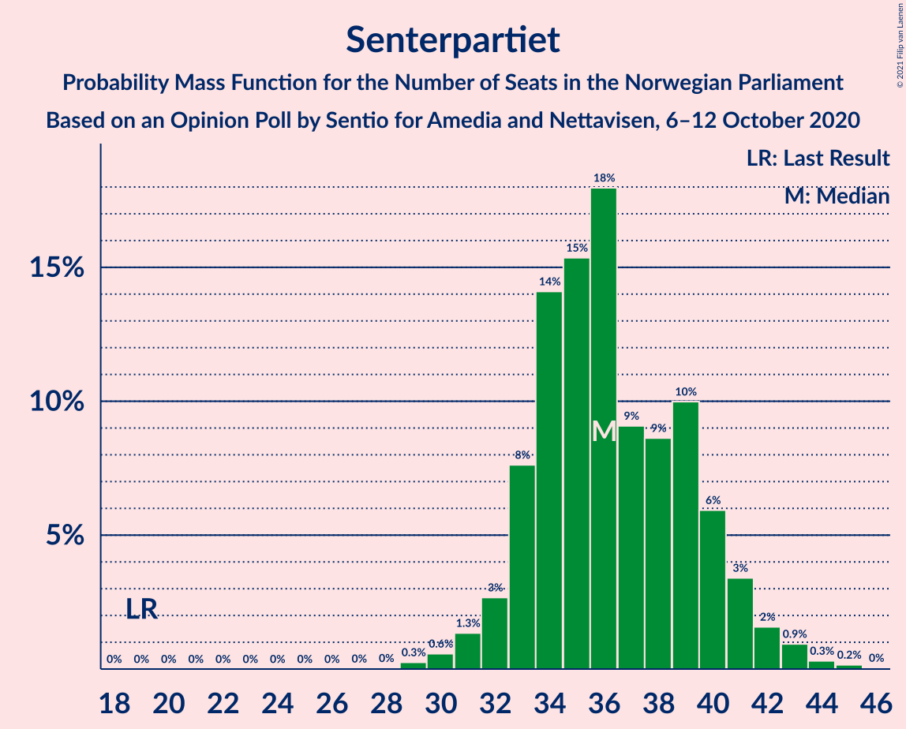
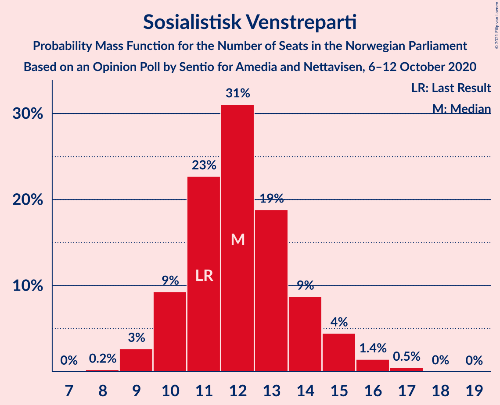
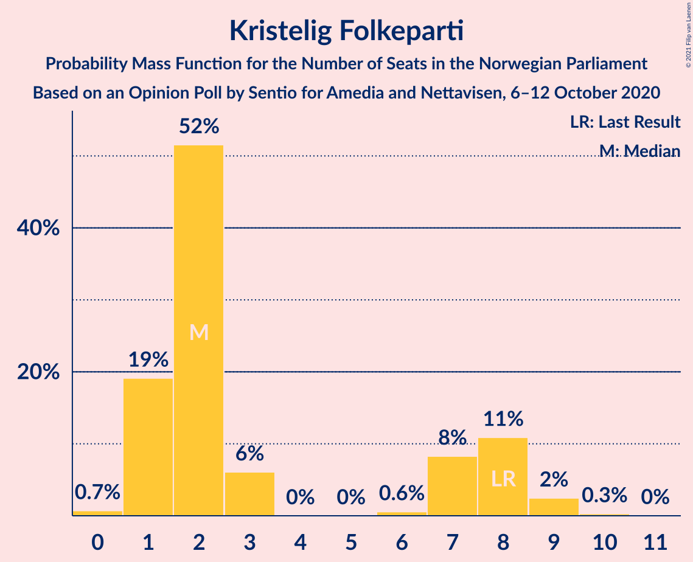
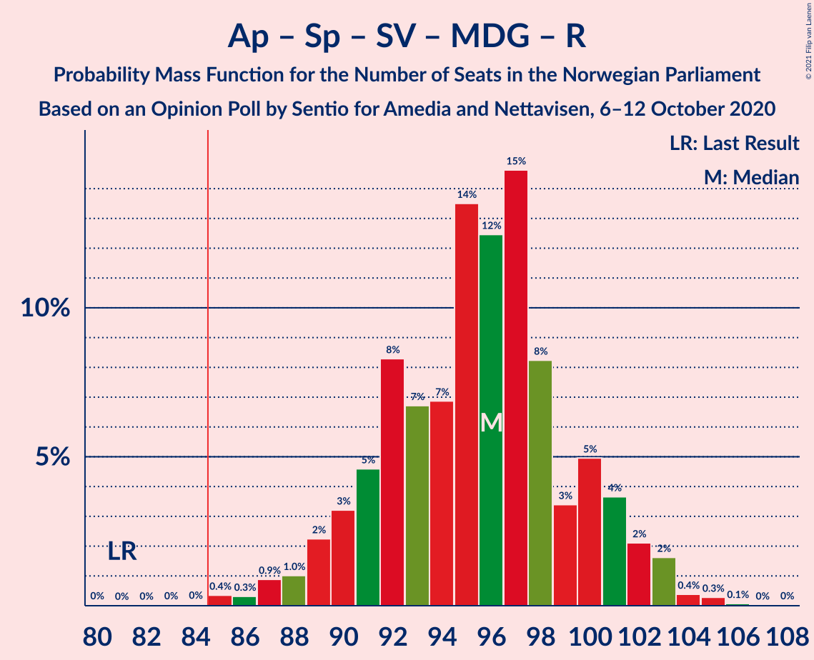

# Opinion Poll by Sentio for Amedia and Nettavisen, 6–12 October 2020

<a href="#voting-intentions">Voting Intentions</a> | <a href="#seats">Seats</a> | <a href="#coalitions">Coalitions</a> | <a href="#technical-information">Technical Information</a>

## Voting Intentions

### Confidence Intervals

| Party | Last Result | Poll Result | 80% Confidence Interval | 90% Confidence Interval | 95% Confidence Interval | 99% Confidence Interval |
|:-----:|:-----------:|:-----------:|:-----------------------:|:-----------------------:|:-----------------------:|:-----------------------:|
| Høyre | 25.0% | 23.6% | 21.9–25.4% |21.5–25.9% |21.1–26.3% |20.3–27.2% |
| Arbeiderpartiet | 27.4% | 20.8% | 19.2–22.5% |18.8–23.0% |18.4–23.4% |17.7–24.3% |
| Senterpartiet | 10.3% | 19.8% | 18.2–21.5% |17.8–22.0% |17.4–22.4% |16.7–23.2% |
| Fremskrittspartiet | 15.2% | 13.5% | 12.2–15.0% |11.8–15.4% |11.5–15.8% |10.9–16.5% |
| Sosialistisk Venstreparti | 6.0% | 6.6% | 5.7–7.7% |5.4–8.0% |5.2–8.3% |4.8–8.9% |
| Miljøpartiet De Grønne | 3.2% | 4.2% | 3.5–5.1% |3.3–5.4% |3.1–5.6% |2.8–6.1% |
| Kristelig Folkeparti | 4.2% | 3.5% | 2.9–4.4% |2.7–4.6% |2.5–4.8% |2.2–5.3% |
| Rødt | 2.4% | 3.3% | 2.7–4.1% |2.5–4.4% |2.4–4.6% |2.1–5.0% |
| Venstre | 4.4% | 3.3% | 2.7–4.1% |2.5–4.4% |2.4–4.6% |2.1–5.0% |

*Note:* The poll result column reflects the actual value used in the calculations. Published results may vary slightly, and in addition be rounded to fewer digits.

## Seats

### Confidence Intervals

| Party | Last Result | Median | 80% Confidence Interval | 90% Confidence Interval | 95% Confidence Interval | 99% Confidence Interval |
|:-----:|:-----------:|:------:|:-----------------------:|:-----------------------:|:-----------------------:|:-----------------------:|
| <a href="#høyre">Høyre</a> | 45 | 43 | 39–46 |39–48 |37–48 |36–50 |
| <a href="#arbeiderpartiet">Arbeiderpartiet</a> | 49 | 39 | 36–41 |35–42 |34–43 |32–45 |
| <a href="#senterpartiet">Senterpartiet</a> | 19 | 36 | 33–40 |33–41 |32–42 |30–43 |
| <a href="#fremskrittspartiet">Fremskrittspartiet</a> | 27 | 24 | 22–28 |21–28 |20–29 |19–30 |
| <a href="#sosialistisk-venstreparti">Sosialistisk Venstreparti</a> | 11 | 12 | 10–14 |10–14 |10–15 |9–17 |
| <a href="#miljøpartiet-de-grønne">Miljøpartiet De Grønne</a> | 1 | 8 | 2–9 |1–9 |1–10 |1–11 |
| <a href="#kristelig-folkeparti">Kristelig Folkeparti</a> | 8 | 2 | 1–8 |1–8 |1–8 |0–9 |
| <a href="#rødt">Rødt</a> | 1 | 2 | 1–2 |1–7 |1–7 |1–9 |
| <a href="#venstre">Venstre</a> | 8 | 2 | 2–7 |1–8 |1–8 |1–9 |

### Høyre

*For a full overview of the results for this party, see the [Høyre](party-høyre.html) page.*

| Number of Seats | Probability | Accumulated | Special Marks |
|:---------------:|:-----------:|:-----------:|:-------------:|
| 34 | 0.1% | 100% |  |
| 35 | 0.2% | 99.9% |  |
| 36 | 1.0% | 99.7% |  |
| 37 | 1.4% | 98.7% |  |
| 38 | 2% | 97% |  |
| 39 | 7% | 95% |  |
| 40 | 6% | 88% |  |
| 41 | 8% | 82% |  |
| 42 | 14% | 74% |  |
| 43 | 12% | 60% | Median |
| 44 | 12% | 49% |  |
| 45 | 25% | 37% | Last Result |
| 46 | 3% | 12% |  |
| 47 | 2% | 9% |  |
| 48 | 5% | 7% |  |
| 49 | 2% | 2% |  |
| 50 | 0.5% | 0.9% |  |
| 51 | 0.4% | 0.5% |  |
| 52 | 0.1% | 0.1% |  |
| 53 | 0% | 0% |  |

### Arbeiderpartiet

*For a full overview of the results for this party, see the [Arbeiderpartiet](party-arbeiderpartiet.html) page.*

| Number of Seats | Probability | Accumulated | Special Marks |
|:---------------:|:-----------:|:-----------:|:-------------:|
| 29 | 0.1% | 100% |  |
| 30 | 0% | 99.9% |  |
| 31 | 0.3% | 99.9% |  |
| 32 | 0.6% | 99.6% |  |
| 33 | 0.8% | 99.0% |  |
| 34 | 3% | 98% |  |
| 35 | 3% | 95% |  |
| 36 | 4% | 92% |  |
| 37 | 18% | 87% |  |
| 38 | 16% | 69% |  |
| 39 | 18% | 53% | Median |
| 40 | 21% | 36% |  |
| 41 | 8% | 15% |  |
| 42 | 4% | 7% |  |
| 43 | 2% | 3% |  |
| 44 | 0.7% | 1.4% |  |
| 45 | 0.3% | 0.7% |  |
| 46 | 0.4% | 0.4% |  |
| 47 | 0% | 0.1% |  |
| 48 | 0% | 0% |  |
| 49 | 0% | 0% | Last Result |

### Senterpartiet

*For a full overview of the results for this party, see the [Senterpartiet](party-senterpartiet.html) page.*

| Number of Seats | Probability | Accumulated | Special Marks |
|:---------------:|:-----------:|:-----------:|:-------------:|
| 19 | 0% | 100% | Last Result |
| 20 | 0% | 100% |  |
| 21 | 0% | 100% |  |
| 22 | 0% | 100% |  |
| 23 | 0% | 100% |  |
| 24 | 0% | 100% |  |
| 25 | 0% | 100% |  |
| 26 | 0% | 100% |  |
| 27 | 0% | 100% |  |
| 28 | 0% | 100% |  |
| 29 | 0.3% | 100% |  |
| 30 | 0.5% | 99.6% |  |
| 31 | 1.2% | 99.2% |  |
| 32 | 2% | 98% |  |
| 33 | 9% | 96% |  |
| 34 | 14% | 87% |  |
| 35 | 19% | 73% |  |
| 36 | 19% | 54% | Median |
| 37 | 7% | 34% |  |
| 38 | 7% | 28% |  |
| 39 | 10% | 20% |  |
| 40 | 5% | 11% |  |
| 41 | 3% | 6% |  |
| 42 | 2% | 3% |  |
| 43 | 0.7% | 1.0% |  |
| 44 | 0.2% | 0.3% |  |
| 45 | 0.1% | 0.1% |  |
| 46 | 0% | 0% |  |

### Fremskrittspartiet

*For a full overview of the results for this party, see the [Fremskrittspartiet](party-fremskrittspartiet.html) page.*

| Number of Seats | Probability | Accumulated | Special Marks |
|:---------------:|:-----------:|:-----------:|:-------------:|
| 17 | 0.1% | 100% |  |
| 18 | 0.3% | 99.9% |  |
| 19 | 0.3% | 99.7% |  |
| 20 | 3% | 99.4% |  |
| 21 | 3% | 97% |  |
| 22 | 9% | 93% |  |
| 23 | 29% | 84% |  |
| 24 | 7% | 55% | Median |
| 25 | 21% | 48% |  |
| 26 | 9% | 27% |  |
| 27 | 6% | 18% | Last Result |
| 28 | 9% | 12% |  |
| 29 | 2% | 3% |  |
| 30 | 0.8% | 1.0% |  |
| 31 | 0.2% | 0.2% |  |
| 32 | 0% | 0.1% |  |
| 33 | 0% | 0% |  |

### Sosialistisk Venstreparti

*For a full overview of the results for this party, see the [Sosialistisk Venstreparti](party-sosialistiskvenstreparti.html) page.*

| Number of Seats | Probability | Accumulated | Special Marks |
|:---------------:|:-----------:|:-----------:|:-------------:|
| 8 | 0.2% | 100% |  |
| 9 | 1.4% | 99.7% |  |
| 10 | 9% | 98% |  |
| 11 | 23% | 89% | Last Result |
| 12 | 31% | 66% | Median |
| 13 | 20% | 34% |  |
| 14 | 10% | 14% |  |
| 15 | 2% | 4% |  |
| 16 | 2% | 2% |  |
| 17 | 0.5% | 0.6% |  |
| 18 | 0% | 0% |  |

### Miljøpartiet De Grønne

*For a full overview of the results for this party, see the [Miljøpartiet De Grønne](party-miljøpartietdegrønne.html) page.*

| Number of Seats | Probability | Accumulated | Special Marks |
|:---------------:|:-----------:|:-----------:|:-------------:|
| 1 | 5% | 100% | Last Result |
| 2 | 12% | 95% |  |
| 3 | 8% | 82% |  |
| 4 | 0% | 75% |  |
| 5 | 0% | 75% |  |
| 6 | 0.1% | 75% |  |
| 7 | 7% | 75% |  |
| 8 | 41% | 68% | Median |
| 9 | 23% | 27% |  |
| 10 | 4% | 5% |  |
| 11 | 0.7% | 0.8% |  |
| 12 | 0.1% | 0.1% |  |
| 13 | 0% | 0% |  |

### Kristelig Folkeparti

*For a full overview of the results for this party, see the [Kristelig Folkeparti](party-kristeligfolkeparti.html) page.*

| Number of Seats | Probability | Accumulated | Special Marks |
|:---------------:|:-----------:|:-----------:|:-------------:|
| 0 | 0.5% | 100% |  |
| 1 | 20% | 99.5% |  |
| 2 | 49% | 79% | Median |
| 3 | 4% | 30% |  |
| 4 | 0% | 26% |  |
| 5 | 0% | 26% |  |
| 6 | 0.1% | 26% |  |
| 7 | 9% | 26% |  |
| 8 | 15% | 17% | Last Result |
| 9 | 2% | 2% |  |
| 10 | 0.2% | 0.2% |  |
| 11 | 0% | 0% |  |

### Rødt

*For a full overview of the results for this party, see the [Rødt](party-rødt.html) page.*

| Number of Seats | Probability | Accumulated | Special Marks |
|:---------------:|:-----------:|:-----------:|:-------------:|
| 1 | 40% | 100% | Last Result |
| 2 | 52% | 60% | Median |
| 3 | 0% | 8% |  |
| 4 | 0% | 8% |  |
| 5 | 0% | 8% |  |
| 6 | 0.1% | 8% |  |
| 7 | 7% | 8% |  |
| 8 | 0.3% | 1.2% |  |
| 9 | 0.8% | 0.9% |  |
| 10 | 0.1% | 0.1% |  |
| 11 | 0% | 0% |  |

### Venstre

*For a full overview of the results for this party, see the [Venstre](party-venstre.html) page.*

| Number of Seats | Probability | Accumulated | Special Marks |
|:---------------:|:-----------:|:-----------:|:-------------:|
| 0 | 0.1% | 100% |  |
| 1 | 8% | 99.9% |  |
| 2 | 77% | 92% | Median |
| 3 | 4% | 15% |  |
| 4 | 0% | 11% |  |
| 5 | 0% | 11% |  |
| 6 | 0% | 11% |  |
| 7 | 3% | 11% |  |
| 8 | 7% | 8% | Last Result |
| 9 | 1.1% | 1.2% |  |
| 10 | 0.1% | 0.1% |  |
| 11 | 0% | 0% |  |

## Coalitions

### Confidence Intervals

| Coalition | Last Result | Median | Majority? | 80% Confidence Interval | 90% Confidence Interval | 95% Confidence Interval | 99% Confidence Interval |
|:---------:|:-----------:|:------:|:---------:|:-----------------------:|:-----------------------:|:-----------------------:|:-----------------------:|
| Høyre – Senterpartiet – Fremskrittspartiet – Kristelig Folkeparti – Venstre | 107 | 109 | 100% | 106–114 | 105–116 | 103–117 | 100–119 |
| Arbeiderpartiet – Senterpartiet – Sosialistisk Venstreparti – Miljøpartiet De Grønne – Kristelig Folkeparti | 88 | 97 | 99.9% | 93–101 | 91–102 | 89–104 | 86–106 |
| Arbeiderpartiet – Senterpartiet – Sosialistisk Venstreparti – Miljøpartiet De Grønne – Rødt | 81 | 95 | 99.9% | 92–100 | 90–101 | 89–102 | 87–104 |
| Arbeiderpartiet – Senterpartiet – Sosialistisk Venstreparti – Miljøpartiet De Grønne | 80 | 93 | 98.8% | 90–98 | 88–99 | 86–100 | 83–102 |
| Arbeiderpartiet – Senterpartiet – Sosialistisk Venstreparti – Rødt | 80 | 89 | 93% | 85–93 | 84–95 | 83–96 | 81–98 |
| Arbeiderpartiet – Senterpartiet – Sosialistisk Venstreparti | 79 | 87 | 70% | 83–91 | 82–92 | 81–93 | 79–95 |
| Arbeiderpartiet – Senterpartiet – Miljøpartiet De Grønne – Kristelig Folkeparti | 77 | 85 | 50% | 81–89 | 79–91 | 77–92 | 74–95 |
| Arbeiderpartiet – Senterpartiet – Kristelig Folkeparti | 76 | 78 | 5% | 74–83 | 73–84 | 72–87 | 69–87 |
| Høyre – Fremskrittspartiet – Miljøpartiet De Grønne – Kristelig Folkeparti – Venstre | 89 | 80 | 7% | 76–84 | 74–85 | 73–86 | 71–88 |
| Arbeiderpartiet – Senterpartiet | 68 | 75 | 0.1% | 71–78 | 70–80 | 69–81 | 67–82 |
| Høyre – Fremskrittspartiet – Kristelig Folkeparti – Venstre | 88 | 74 | 0.1% | 69–77 | 68–79 | 67–80 | 65–82 |
| Høyre – Fremskrittspartiet – Venstre | 80 | 70 | 0% | 66–75 | 65–75 | 62–76 | 61–79 |
| Høyre – Fremskrittspartiet | 72 | 68 | 0% | 63–72 | 61–73 | 60–74 | 57–76 |
| Arbeiderpartiet – Sosialistisk Venstreparti | 60 | 51 | 0% | 47–54 | 47–55 | 45–56 | 43–58 |
| Høyre – Kristelig Folkeparti – Venstre | 61 | 49 | 0% | 45–53 | 43–55 | 42–55 | 41–57 |
| Senterpartiet – Kristelig Folkeparti – Venstre | 35 | 41 | 0% | 38–48 | 37–49 | 36–51 | 34–53 |

### Høyre – Senterpartiet – Fremskrittspartiet – Kristelig Folkeparti – Venstre

| Number of Seats | Probability | Accumulated | Special Marks |
|:---------------:|:-----------:|:-----------:|:-------------:|
| 98 | 0% | 100% |  |
| 99 | 0.1% | 99.9% |  |
| 100 | 0.9% | 99.8% |  |
| 101 | 0.2% | 99.0% |  |
| 102 | 0.7% | 98.8% |  |
| 103 | 0.7% | 98% |  |
| 104 | 2% | 97% |  |
| 105 | 2% | 95% |  |
| 106 | 4% | 93% |  |
| 107 | 14% | 89% | Last Result, Median |
| 108 | 17% | 75% |  |
| 109 | 18% | 58% |  |
| 110 | 8% | 40% |  |
| 111 | 7% | 32% |  |
| 112 | 6% | 25% |  |
| 113 | 6% | 19% |  |
| 114 | 4% | 13% |  |
| 115 | 4% | 9% |  |
| 116 | 3% | 5% |  |
| 117 | 1.0% | 3% |  |
| 118 | 0.7% | 1.5% |  |
| 119 | 0.6% | 0.8% |  |
| 120 | 0.1% | 0.2% |  |
| 121 | 0.1% | 0.1% |  |
| 122 | 0% | 0% |  |

### Arbeiderpartiet – Senterpartiet – Sosialistisk Venstreparti – Miljøpartiet De Grønne – Kristelig Folkeparti

| Number of Seats | Probability | Accumulated | Special Marks |
|:---------------:|:-----------:|:-----------:|:-------------:|
| 83 | 0% | 100% |  |
| 84 | 0% | 99.9% |  |
| 85 | 0.1% | 99.9% | Majority |
| 86 | 0.5% | 99.8% |  |
| 87 | 1.1% | 99.4% |  |
| 88 | 0.3% | 98% | Last Result |
| 89 | 0.8% | 98% |  |
| 90 | 0.8% | 97% |  |
| 91 | 2% | 96% |  |
| 92 | 3% | 94% |  |
| 93 | 5% | 92% |  |
| 94 | 10% | 87% |  |
| 95 | 13% | 77% |  |
| 96 | 13% | 64% |  |
| 97 | 13% | 51% | Median |
| 98 | 8% | 38% |  |
| 99 | 4% | 30% |  |
| 100 | 8% | 26% |  |
| 101 | 11% | 18% |  |
| 102 | 3% | 7% |  |
| 103 | 1.3% | 4% |  |
| 104 | 0.4% | 3% |  |
| 105 | 0.2% | 2% |  |
| 106 | 2% | 2% |  |
| 107 | 0% | 0.2% |  |
| 108 | 0.1% | 0.1% |  |
| 109 | 0% | 0% |  |

### Arbeiderpartiet – Senterpartiet – Sosialistisk Venstreparti – Miljøpartiet De Grønne – Rødt

| Number of Seats | Probability | Accumulated | Special Marks |
|:---------------:|:-----------:|:-----------:|:-------------:|
| 81 | 0% | 100% | Last Result |
| 82 | 0% | 100% |  |
| 83 | 0% | 100% |  |
| 84 | 0% | 99.9% |  |
| 85 | 0.1% | 99.9% | Majority |
| 86 | 0.2% | 99.8% |  |
| 87 | 0.4% | 99.6% |  |
| 88 | 0.6% | 99.2% |  |
| 89 | 1.4% | 98.6% |  |
| 90 | 3% | 97% |  |
| 91 | 3% | 94% |  |
| 92 | 10% | 91% |  |
| 93 | 8% | 81% |  |
| 94 | 7% | 73% |  |
| 95 | 19% | 66% |  |
| 96 | 9% | 48% |  |
| 97 | 18% | 39% | Median |
| 98 | 4% | 21% |  |
| 99 | 3% | 17% |  |
| 100 | 6% | 14% |  |
| 101 | 3% | 8% |  |
| 102 | 3% | 5% |  |
| 103 | 1.3% | 2% |  |
| 104 | 0.3% | 0.8% |  |
| 105 | 0.3% | 0.4% |  |
| 106 | 0.1% | 0.1% |  |
| 107 | 0% | 0.1% |  |
| 108 | 0% | 0.1% |  |
| 109 | 0% | 0% |  |

### Arbeiderpartiet – Senterpartiet – Sosialistisk Venstreparti – Miljøpartiet De Grønne

| Number of Seats | Probability | Accumulated | Special Marks |
|:---------------:|:-----------:|:-----------:|:-------------:|
| 80 | 0% | 100% | Last Result |
| 81 | 0% | 99.9% |  |
| 82 | 0.1% | 99.9% |  |
| 83 | 0.7% | 99.8% |  |
| 84 | 0.3% | 99.1% |  |
| 85 | 1.2% | 98.8% | Majority |
| 86 | 0.5% | 98% |  |
| 87 | 1.2% | 97% |  |
| 88 | 1.2% | 96% |  |
| 89 | 3% | 95% |  |
| 90 | 7% | 92% |  |
| 91 | 6% | 84% |  |
| 92 | 11% | 78% |  |
| 93 | 18% | 67% |  |
| 94 | 12% | 49% |  |
| 95 | 17% | 37% | Median |
| 96 | 6% | 20% |  |
| 97 | 3% | 14% |  |
| 98 | 3% | 12% |  |
| 99 | 6% | 9% |  |
| 100 | 2% | 3% |  |
| 101 | 0.9% | 1.4% |  |
| 102 | 0.4% | 0.5% |  |
| 103 | 0.1% | 0.1% |  |
| 104 | 0% | 0% |  |

### Arbeiderpartiet – Senterpartiet – Sosialistisk Venstreparti – Rødt

| Number of Seats | Probability | Accumulated | Special Marks |
|:---------------:|:-----------:|:-----------:|:-------------:|
| 79 | 0.1% | 100% |  |
| 80 | 0.1% | 99.9% | Last Result |
| 81 | 0.7% | 99.8% |  |
| 82 | 1.2% | 99.0% |  |
| 83 | 1.3% | 98% |  |
| 84 | 4% | 97% |  |
| 85 | 8% | 93% | Majority |
| 86 | 15% | 85% |  |
| 87 | 7% | 70% |  |
| 88 | 11% | 63% |  |
| 89 | 15% | 53% | Median |
| 90 | 10% | 38% |  |
| 91 | 9% | 28% |  |
| 92 | 7% | 19% |  |
| 93 | 4% | 13% |  |
| 94 | 3% | 8% |  |
| 95 | 2% | 6% |  |
| 96 | 1.5% | 4% |  |
| 97 | 1.2% | 2% |  |
| 98 | 0.4% | 0.9% |  |
| 99 | 0.3% | 0.4% |  |
| 100 | 0.1% | 0.2% |  |
| 101 | 0.1% | 0.1% |  |
| 102 | 0% | 0% |  |

### Arbeiderpartiet – Senterpartiet – Sosialistisk Venstreparti

| Number of Seats | Probability | Accumulated | Special Marks |
|:---------------:|:-----------:|:-----------:|:-------------:|
| 76 | 0% | 100% |  |
| 77 | 0.1% | 99.9% |  |
| 78 | 0.2% | 99.8% |  |
| 79 | 0.7% | 99.7% | Last Result |
| 80 | 1.3% | 98.9% |  |
| 81 | 2% | 98% |  |
| 82 | 2% | 96% |  |
| 83 | 5% | 94% |  |
| 84 | 19% | 89% |  |
| 85 | 4% | 70% | Majority |
| 86 | 14% | 66% |  |
| 87 | 14% | 52% | Median |
| 88 | 12% | 38% |  |
| 89 | 6% | 26% |  |
| 90 | 9% | 21% |  |
| 91 | 7% | 12% |  |
| 92 | 2% | 5% |  |
| 93 | 1.2% | 3% |  |
| 94 | 1.2% | 2% |  |
| 95 | 0.4% | 0.8% |  |
| 96 | 0.2% | 0.4% |  |
| 97 | 0.1% | 0.2% |  |
| 98 | 0.1% | 0.1% |  |
| 99 | 0% | 0% |  |

### Arbeiderpartiet – Senterpartiet – Miljøpartiet De Grønne – Kristelig Folkeparti

| Number of Seats | Probability | Accumulated | Special Marks |
|:---------------:|:-----------:|:-----------:|:-------------:|
| 71 | 0% | 100% |  |
| 72 | 0% | 99.9% |  |
| 73 | 0.1% | 99.9% |  |
| 74 | 0.5% | 99.8% |  |
| 75 | 0.8% | 99.3% |  |
| 76 | 0.8% | 98% |  |
| 77 | 0.8% | 98% | Last Result |
| 78 | 1.3% | 97% |  |
| 79 | 2% | 96% |  |
| 80 | 2% | 93% |  |
| 81 | 8% | 91% |  |
| 82 | 10% | 83% |  |
| 83 | 19% | 73% |  |
| 84 | 3% | 54% |  |
| 85 | 5% | 50% | Median, Majority |
| 86 | 17% | 45% |  |
| 87 | 3% | 28% |  |
| 88 | 4% | 25% |  |
| 89 | 14% | 21% |  |
| 90 | 2% | 7% |  |
| 91 | 0.9% | 5% |  |
| 92 | 2% | 4% |  |
| 93 | 0.2% | 2% |  |
| 94 | 0.5% | 2% |  |
| 95 | 2% | 2% |  |
| 96 | 0% | 0.1% |  |
| 97 | 0.1% | 0.1% |  |
| 98 | 0% | 0% |  |

### Arbeiderpartiet – Senterpartiet – Kristelig Folkeparti

| Number of Seats | Probability | Accumulated | Special Marks |
|:---------------:|:-----------:|:-----------:|:-------------:|
| 67 | 0% | 100% |  |
| 68 | 0.1% | 99.9% |  |
| 69 | 0.5% | 99.8% |  |
| 70 | 0.5% | 99.3% |  |
| 71 | 1.1% | 98.9% |  |
| 72 | 2% | 98% |  |
| 73 | 5% | 96% |  |
| 74 | 15% | 91% |  |
| 75 | 6% | 76% |  |
| 76 | 7% | 70% | Last Result |
| 77 | 6% | 63% | Median |
| 78 | 16% | 56% |  |
| 79 | 5% | 40% |  |
| 80 | 10% | 35% |  |
| 81 | 10% | 26% |  |
| 82 | 4% | 16% |  |
| 83 | 2% | 12% |  |
| 84 | 5% | 10% |  |
| 85 | 1.2% | 5% | Majority |
| 86 | 0.7% | 3% |  |
| 87 | 2% | 3% |  |
| 88 | 0.3% | 0.3% |  |
| 89 | 0% | 0.1% |  |
| 90 | 0% | 0% |  |

### Høyre – Fremskrittspartiet – Miljøpartiet De Grønne – Kristelig Folkeparti – Venstre

| Number of Seats | Probability | Accumulated | Special Marks |
|:---------------:|:-----------:|:-----------:|:-------------:|
| 68 | 0.1% | 100% |  |
| 69 | 0.1% | 99.9% |  |
| 70 | 0.3% | 99.8% |  |
| 71 | 0.4% | 99.6% |  |
| 72 | 1.2% | 99.1% |  |
| 73 | 1.5% | 98% |  |
| 74 | 2% | 96% |  |
| 75 | 3% | 94% |  |
| 76 | 4% | 92% |  |
| 77 | 7% | 87% |  |
| 78 | 9% | 81% |  |
| 79 | 10% | 72% | Median |
| 80 | 15% | 62% |  |
| 81 | 11% | 47% |  |
| 82 | 7% | 37% |  |
| 83 | 15% | 30% |  |
| 84 | 8% | 15% |  |
| 85 | 4% | 7% | Majority |
| 86 | 1.3% | 3% |  |
| 87 | 1.2% | 2% |  |
| 88 | 0.7% | 1.0% |  |
| 89 | 0.1% | 0.2% | Last Result |
| 90 | 0.1% | 0.1% |  |
| 91 | 0% | 0% |  |

### Arbeiderpartiet – Senterpartiet

| Number of Seats | Probability | Accumulated | Special Marks |
|:---------------:|:-----------:|:-----------:|:-------------:|
| 64 | 0% | 100% |  |
| 65 | 0% | 99.9% |  |
| 66 | 0.2% | 99.9% |  |
| 67 | 0.8% | 99.7% |  |
| 68 | 1.4% | 99.0% | Last Result |
| 69 | 1.1% | 98% |  |
| 70 | 2% | 97% |  |
| 71 | 5% | 94% |  |
| 72 | 18% | 89% |  |
| 73 | 9% | 71% |  |
| 74 | 9% | 62% |  |
| 75 | 12% | 53% | Median |
| 76 | 18% | 41% |  |
| 77 | 6% | 24% |  |
| 78 | 8% | 18% |  |
| 79 | 4% | 10% |  |
| 80 | 3% | 6% |  |
| 81 | 2% | 3% |  |
| 82 | 0.7% | 1.0% |  |
| 83 | 0.1% | 0.3% |  |
| 84 | 0.1% | 0.2% |  |
| 85 | 0% | 0.1% | Majority |
| 86 | 0.1% | 0.1% |  |
| 87 | 0% | 0% |  |

### Høyre – Fremskrittspartiet – Kristelig Folkeparti – Venstre

| Number of Seats | Probability | Accumulated | Special Marks |
|:---------------:|:-----------:|:-----------:|:-------------:|
| 61 | 0% | 100% |  |
| 62 | 0% | 99.9% |  |
| 63 | 0.1% | 99.9% |  |
| 64 | 0.3% | 99.9% |  |
| 65 | 0.3% | 99.6% |  |
| 66 | 1.3% | 99.2% |  |
| 67 | 3% | 98% |  |
| 68 | 3% | 95% |  |
| 69 | 6% | 92% |  |
| 70 | 3% | 86% |  |
| 71 | 4% | 83% | Median |
| 72 | 18% | 79% |  |
| 73 | 9% | 61% |  |
| 74 | 19% | 52% |  |
| 75 | 7% | 34% |  |
| 76 | 8% | 27% |  |
| 77 | 10% | 19% |  |
| 78 | 3% | 9% |  |
| 79 | 3% | 6% |  |
| 80 | 1.4% | 3% |  |
| 81 | 0.6% | 1.4% |  |
| 82 | 0.4% | 0.8% |  |
| 83 | 0.2% | 0.4% |  |
| 84 | 0.1% | 0.2% |  |
| 85 | 0% | 0.1% | Majority |
| 86 | 0% | 0.1% |  |
| 87 | 0% | 0% |  |
| 88 | 0% | 0% | Last Result |

### Høyre – Fremskrittspartiet – Venstre

| Number of Seats | Probability | Accumulated | Special Marks |
|:---------------:|:-----------:|:-----------:|:-------------:|
| 59 | 0.3% | 100% |  |
| 60 | 0.1% | 99.6% |  |
| 61 | 0.3% | 99.5% |  |
| 62 | 2% | 99.2% |  |
| 63 | 0.6% | 97% |  |
| 64 | 0.7% | 96% |  |
| 65 | 4% | 96% |  |
| 66 | 10% | 91% |  |
| 67 | 3% | 81% |  |
| 68 | 9% | 78% |  |
| 69 | 6% | 68% | Median |
| 70 | 14% | 62% |  |
| 71 | 9% | 48% |  |
| 72 | 18% | 39% |  |
| 73 | 4% | 21% |  |
| 74 | 6% | 17% |  |
| 75 | 6% | 11% |  |
| 76 | 2% | 4% |  |
| 77 | 0.7% | 2% |  |
| 78 | 0.6% | 2% |  |
| 79 | 0.6% | 1.0% |  |
| 80 | 0.3% | 0.5% | Last Result |
| 81 | 0.1% | 0.1% |  |
| 82 | 0% | 0.1% |  |
| 83 | 0% | 0% |  |

### Høyre – Fremskrittspartiet

| Number of Seats | Probability | Accumulated | Special Marks |
|:---------------:|:-----------:|:-----------:|:-------------:|
| 56 | 0.1% | 100% |  |
| 57 | 0.5% | 99.9% |  |
| 58 | 0.6% | 99.4% |  |
| 59 | 0.4% | 98.8% |  |
| 60 | 3% | 98% |  |
| 61 | 1.1% | 95% |  |
| 62 | 1.3% | 94% |  |
| 63 | 4% | 93% |  |
| 64 | 10% | 88% |  |
| 65 | 4% | 78% |  |
| 66 | 12% | 74% |  |
| 67 | 6% | 62% | Median |
| 68 | 16% | 56% |  |
| 69 | 6% | 40% |  |
| 70 | 18% | 34% |  |
| 71 | 4% | 16% |  |
| 72 | 4% | 12% | Last Result |
| 73 | 5% | 8% |  |
| 74 | 1.3% | 3% |  |
| 75 | 0.7% | 2% |  |
| 76 | 0.5% | 0.9% |  |
| 77 | 0.1% | 0.5% |  |
| 78 | 0.3% | 0.4% |  |
| 79 | 0% | 0.1% |  |
| 80 | 0% | 0% |  |

### Arbeiderpartiet – Sosialistisk Venstreparti

| Number of Seats | Probability | Accumulated | Special Marks |
|:---------------:|:-----------:|:-----------:|:-------------:|
| 40 | 0% | 100% |  |
| 41 | 0.1% | 99.9% |  |
| 42 | 0.1% | 99.8% |  |
| 43 | 0.2% | 99.7% |  |
| 44 | 0.8% | 99.4% |  |
| 45 | 1.4% | 98.7% |  |
| 46 | 2% | 97% |  |
| 47 | 7% | 95% |  |
| 48 | 4% | 88% |  |
| 49 | 16% | 84% |  |
| 50 | 12% | 68% |  |
| 51 | 21% | 56% | Median |
| 52 | 15% | 35% |  |
| 53 | 8% | 20% |  |
| 54 | 7% | 12% |  |
| 55 | 2% | 5% |  |
| 56 | 2% | 3% |  |
| 57 | 1.0% | 2% |  |
| 58 | 0.7% | 0.9% |  |
| 59 | 0.1% | 0.2% |  |
| 60 | 0.1% | 0.1% | Last Result |
| 61 | 0% | 0% |  |

### Høyre – Kristelig Folkeparti – Venstre

| Number of Seats | Probability | Accumulated | Special Marks |
|:---------------:|:-----------:|:-----------:|:-------------:|
| 40 | 0.1% | 100% |  |
| 41 | 0.9% | 99.8% |  |
| 42 | 3% | 99.0% |  |
| 43 | 3% | 96% |  |
| 44 | 3% | 94% |  |
| 45 | 2% | 91% |  |
| 46 | 9% | 88% |  |
| 47 | 9% | 79% | Median |
| 48 | 6% | 69% |  |
| 49 | 27% | 63% |  |
| 50 | 4% | 37% |  |
| 51 | 9% | 33% |  |
| 52 | 8% | 24% |  |
| 53 | 6% | 16% |  |
| 54 | 4% | 10% |  |
| 55 | 3% | 6% |  |
| 56 | 2% | 2% |  |
| 57 | 0.3% | 0.7% |  |
| 58 | 0.2% | 0.4% |  |
| 59 | 0.1% | 0.2% |  |
| 60 | 0% | 0.1% |  |
| 61 | 0% | 0.1% | Last Result |
| 62 | 0% | 0% |  |

### Senterpartiet – Kristelig Folkeparti – Venstre

| Number of Seats | Probability | Accumulated | Special Marks |
|:---------------:|:-----------:|:-----------:|:-------------:|
| 33 | 0.1% | 100% |  |
| 34 | 0.4% | 99.8% |  |
| 35 | 0.2% | 99.4% | Last Result |
| 36 | 2% | 99.2% |  |
| 37 | 3% | 97% |  |
| 38 | 6% | 95% |  |
| 39 | 22% | 89% |  |
| 40 | 13% | 67% | Median |
| 41 | 4% | 54% |  |
| 42 | 7% | 50% |  |
| 43 | 15% | 43% |  |
| 44 | 8% | 28% |  |
| 45 | 2% | 20% |  |
| 46 | 3% | 17% |  |
| 47 | 1.5% | 14% |  |
| 48 | 6% | 13% |  |
| 49 | 3% | 7% |  |
| 50 | 0.8% | 4% |  |
| 51 | 0.8% | 3% |  |
| 52 | 1.5% | 2% |  |
| 53 | 0.5% | 0.9% |  |
| 54 | 0.3% | 0.4% |  |
| 55 | 0% | 0.1% |  |
| 56 | 0% | 0.1% |  |
| 57 | 0% | 0% |  |

## Technical Information

### Opinion Poll

+ **Polling firm:** Sentio
+ **Commissioner(s):** Amedia and Nettavisen
+ **Fieldwork period:** 6–12 October 2020

### Calculations

+ **Sample size:** 1000
+ **Simulations done:** 524,288
+ **Error estimate:** 2.13%

