# Opinion Poll by Norstat for Aftenposten and NRK, 12–18 October 2020

<a href="#voting-intentions">Voting Intentions</a> | <a href="#seats">Seats</a> | <a href="#coalitions">Coalitions</a> | <a href="#technical-information">Technical Information</a>

## Voting Intentions

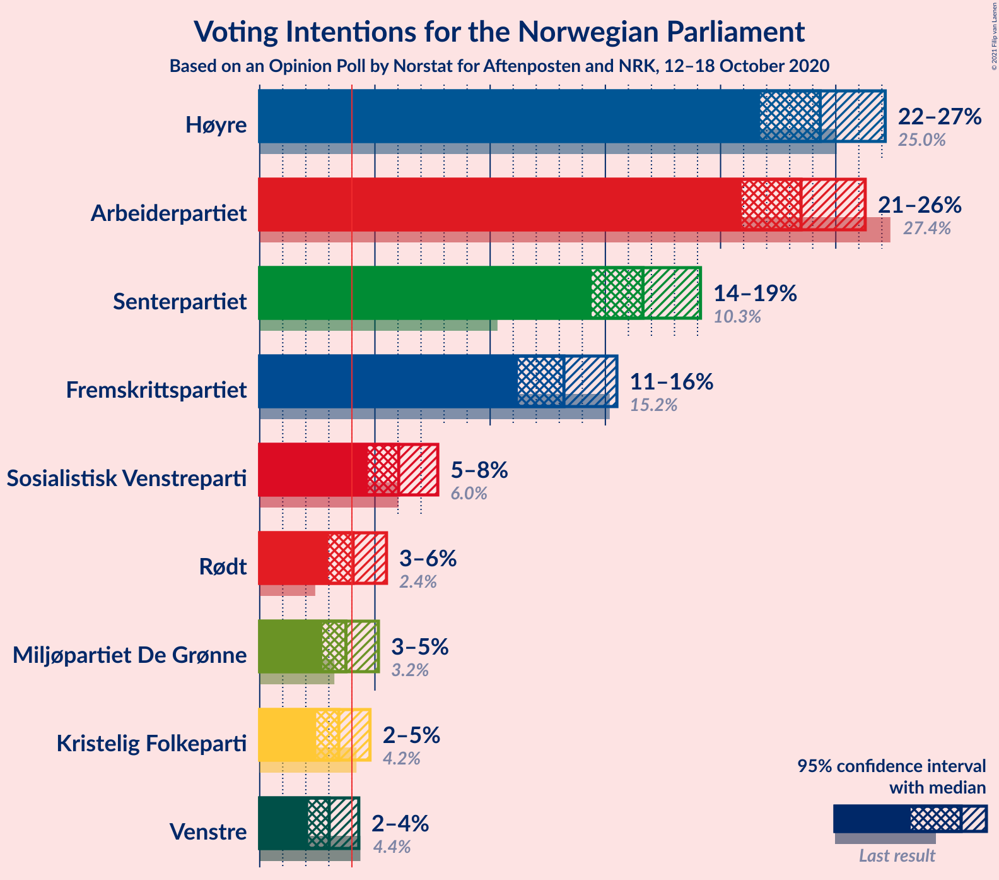

### Confidence Intervals

| Party | Last Result | Poll Result | 80% Confidence Interval | 90% Confidence Interval | 95% Confidence Interval | 99% Confidence Interval |
|:-----:|:-----------:|:-----------:|:-----------------------:|:-----------------------:|:-----------------------:|:-----------------------:|
| Høyre | 25.0% | 24.3% | 22.6–26.2% |22.1–26.7% |21.7–27.1% |20.9–28.0% |
| Arbeiderpartiet | 27.4% | 23.5% | 21.8–25.3% |21.3–25.8% |20.9–26.3% |20.1–27.2% |
| Senterpartiet | 10.3% | 16.6% | 15.2–18.3% |14.8–18.7% |14.4–19.1% |13.7–19.9% |
| Fremskrittspartiet | 15.2% | 13.2% | 11.9–14.7% |11.5–15.1% |11.2–15.5% |10.6–16.2% |
| Sosialistisk Venstreparti | 6.0% | 6.0% | 5.2–7.1% |4.9–7.5% |4.7–7.7% |4.3–8.3% |
| Rødt | 2.4% | 4.1% | 3.3–5.0% |3.1–5.3% |3.0–5.5% |2.7–6.0% |
| Miljøpartiet De Grønne | 3.2% | 3.7% | 3.1–4.6% |2.9–4.9% |2.7–5.2% |2.4–5.6% |
| Kristelig Folkeparti | 4.2% | 3.4% | 2.8–4.3% |2.6–4.6% |2.5–4.8% |2.2–5.2% |
| Venstre | 4.4% | 3.0% | 2.4–3.9% |2.2–4.1% |2.1–4.3% |1.8–4.7% |

*Note:* The poll result column reflects the actual value used in the calculations. Published results may vary slightly, and in addition be rounded to fewer digits.

## Seats

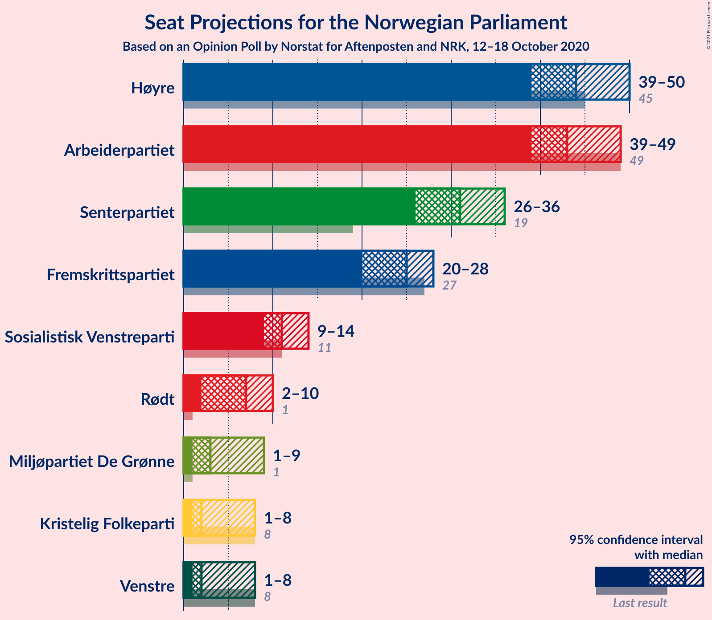

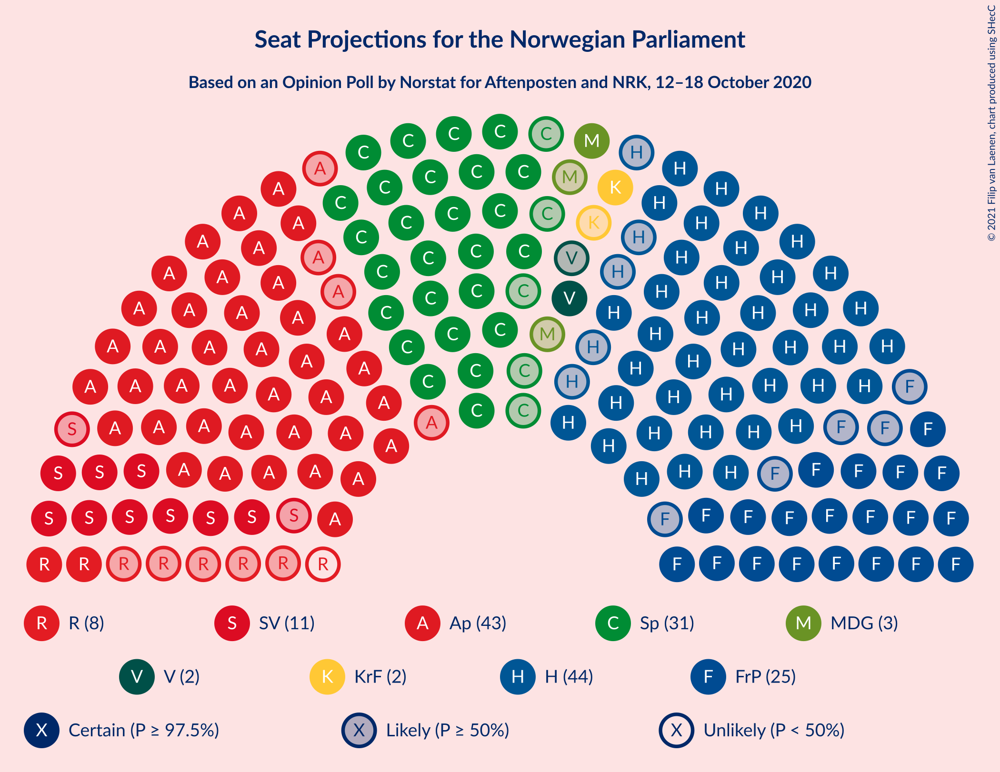

### Confidence Intervals

| Party | Last Result | Median | 80% Confidence Interval | 90% Confidence Interval | 95% Confidence Interval | 99% Confidence Interval |
|:-----:|:-----------:|:------:|:-----------------------:|:-----------------------:|:-----------------------:|:-----------------------:|
| <a href="#høyre">Høyre</a> | 45 | 44 | 40–48 |39–49 |39–50 |36–53 |
| <a href="#arbeiderpartiet">Arbeiderpartiet</a> | 49 | 43 | 40–46 |40–48 |39–49 |37–50 |
| <a href="#senterpartiet">Senterpartiet</a> | 19 | 31 | 28–34 |27–35 |26–36 |25–37 |
| <a href="#fremskrittspartiet">Fremskrittspartiet</a> | 27 | 25 | 21–27 |20–28 |20–28 |19–30 |
| <a href="#sosialistisk-venstreparti">Sosialistisk Venstreparti</a> | 11 | 11 | 9–13 |9–13 |9–14 |8–15 |
| <a href="#rødt">Rødt</a> | 1 | 7 | 2–9 |2–10 |2–10 |1–11 |
| <a href="#miljøpartiet-de-grønne">Miljøpartiet De Grønne</a> | 1 | 3 | 1–8 |1–9 |1–9 |1–10 |
| <a href="#kristelig-folkeparti">Kristelig Folkeparti</a> | 8 | 2 | 1–8 |1–8 |1–8 |0–9 |
| <a href="#venstre">Venstre</a> | 8 | 2 | 1–2 |1–2 |1–8 |0–9 |

### Høyre

*For a full overview of the results for this party, see the [Høyre](party-høyre.html) page.*

| Number of Seats | Probability | Accumulated | Special Marks |
|:---------------:|:-----------:|:-----------:|:-------------:|
| 35 | 0.1% | 100% |  |
| 36 | 0.5% | 99.9% |  |
| 37 | 0.5% | 99.4% |  |
| 38 | 1.0% | 98.9% |  |
| 39 | 4% | 98% |  |
| 40 | 4% | 94% |  |
| 41 | 7% | 90% |  |
| 42 | 11% | 83% |  |
| 43 | 12% | 72% |  |
| 44 | 18% | 59% | Median |
| 45 | 12% | 42% | Last Result |
| 46 | 12% | 30% |  |
| 47 | 5% | 18% |  |
| 48 | 6% | 13% |  |
| 49 | 3% | 7% |  |
| 50 | 2% | 4% |  |
| 51 | 1.2% | 2% |  |
| 52 | 0.3% | 1.1% |  |
| 53 | 0.6% | 0.8% |  |
| 54 | 0.2% | 0.2% |  |
| 55 | 0% | 0% |  |

### Arbeiderpartiet

*For a full overview of the results for this party, see the [Arbeiderpartiet](party-arbeiderpartiet.html) page.*

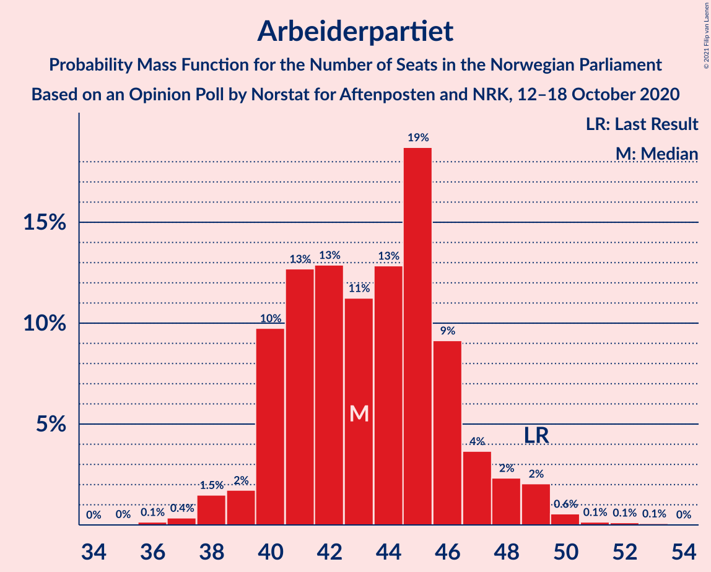

| Number of Seats | Probability | Accumulated | Special Marks |
|:---------------:|:-----------:|:-----------:|:-------------:|
| 35 | 0% | 100% |  |
| 36 | 0.1% | 99.9% |  |
| 37 | 0.4% | 99.8% |  |
| 38 | 1.5% | 99.4% |  |
| 39 | 2% | 98% |  |
| 40 | 10% | 96% |  |
| 41 | 13% | 86% |  |
| 42 | 13% | 74% |  |
| 43 | 11% | 61% | Median |
| 44 | 13% | 50% |  |
| 45 | 19% | 37% |  |
| 46 | 9% | 18% |  |
| 47 | 4% | 9% |  |
| 48 | 2% | 5% |  |
| 49 | 2% | 3% | Last Result |
| 50 | 0.6% | 0.9% |  |
| 51 | 0.1% | 0.4% |  |
| 52 | 0.1% | 0.2% |  |
| 53 | 0.1% | 0.1% |  |
| 54 | 0% | 0% |  |

### Senterpartiet

*For a full overview of the results for this party, see the [Senterpartiet](party-senterpartiet.html) page.*

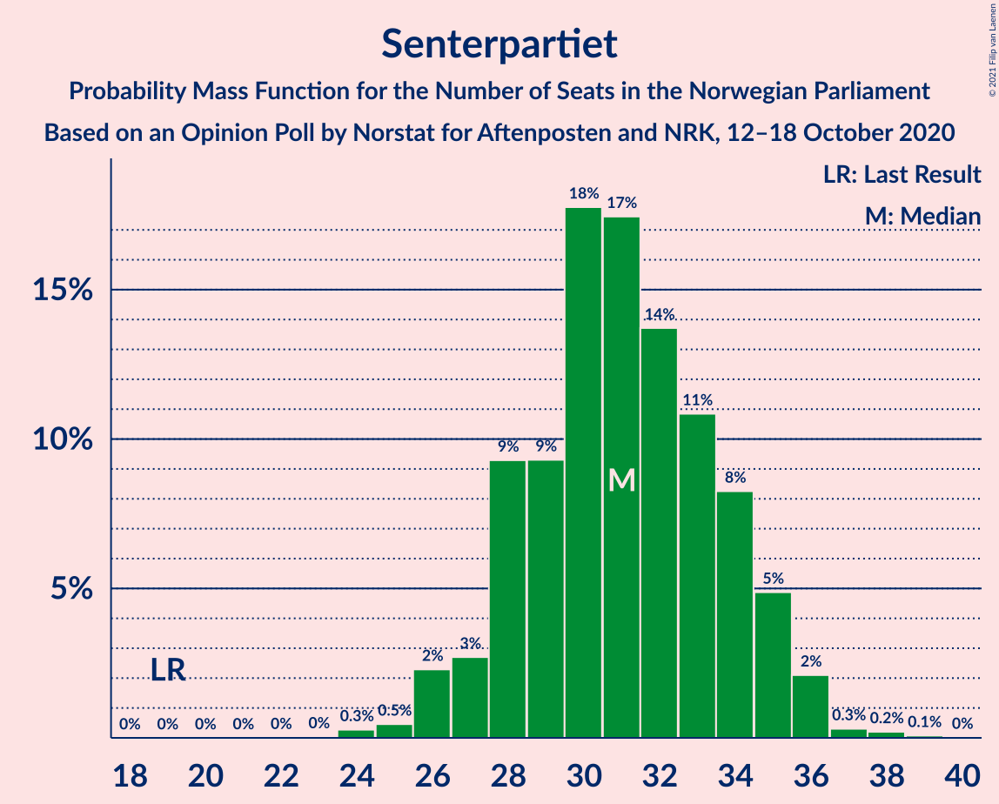

| Number of Seats | Probability | Accumulated | Special Marks |
|:---------------:|:-----------:|:-----------:|:-------------:|
| 19 | 0% | 100% | Last Result |
| 20 | 0% | 100% |  |
| 21 | 0% | 100% |  |
| 22 | 0% | 100% |  |
| 23 | 0% | 100% |  |
| 24 | 0.3% | 99.9% |  |
| 25 | 0.5% | 99.7% |  |
| 26 | 2% | 99.2% |  |
| 27 | 3% | 97% |  |
| 28 | 9% | 94% |  |
| 29 | 9% | 85% |  |
| 30 | 18% | 76% |  |
| 31 | 17% | 58% | Median |
| 32 | 14% | 40% |  |
| 33 | 11% | 27% |  |
| 34 | 8% | 16% |  |
| 35 | 5% | 8% |  |
| 36 | 2% | 3% |  |
| 37 | 0.3% | 0.6% |  |
| 38 | 0.2% | 0.3% |  |
| 39 | 0.1% | 0.1% |  |
| 40 | 0% | 0% |  |

### Fremskrittspartiet

*For a full overview of the results for this party, see the [Fremskrittspartiet](party-fremskrittspartiet.html) page.*

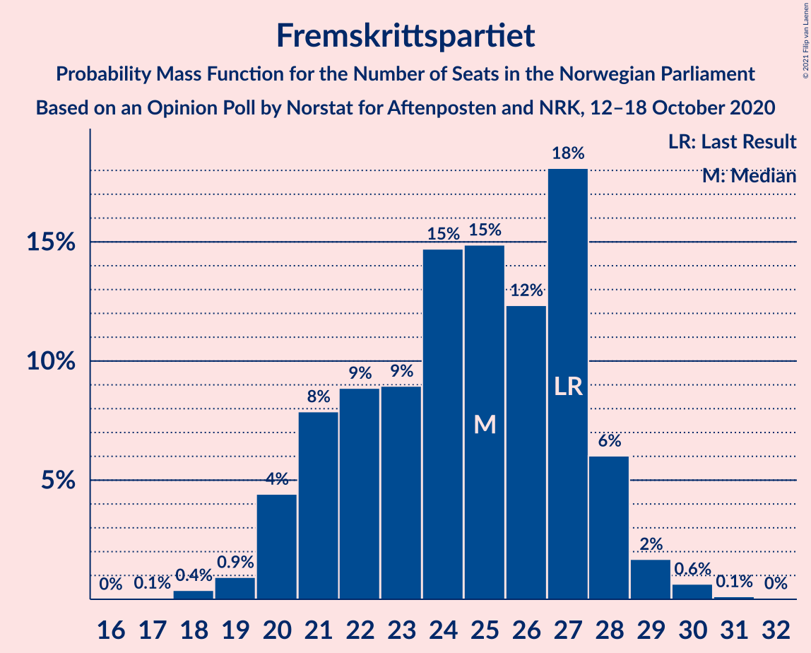

| Number of Seats | Probability | Accumulated | Special Marks |
|:---------------:|:-----------:|:-----------:|:-------------:|
| 17 | 0.1% | 100% |  |
| 18 | 0.4% | 99.9% |  |
| 19 | 0.9% | 99.6% |  |
| 20 | 4% | 98.6% |  |
| 21 | 8% | 94% |  |
| 22 | 9% | 86% |  |
| 23 | 9% | 77% |  |
| 24 | 15% | 69% |  |
| 25 | 15% | 54% | Median |
| 26 | 12% | 39% |  |
| 27 | 18% | 27% | Last Result |
| 28 | 6% | 9% |  |
| 29 | 2% | 2% |  |
| 30 | 0.6% | 0.8% |  |
| 31 | 0.1% | 0.2% |  |
| 32 | 0% | 0% |  |

### Sosialistisk Venstreparti

*For a full overview of the results for this party, see the [Sosialistisk Venstreparti](party-sosialistiskvenstreparti.html) page.*

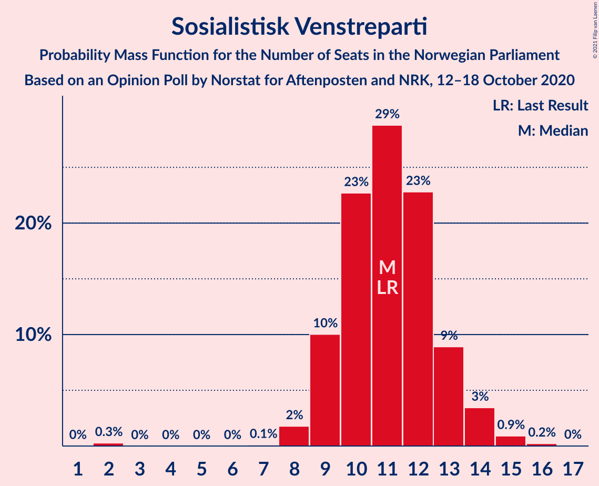

| Number of Seats | Probability | Accumulated | Special Marks |
|:---------------:|:-----------:|:-----------:|:-------------:|
| 2 | 0.3% | 100% |  |
| 3 | 0% | 99.7% |  |
| 4 | 0% | 99.7% |  |
| 5 | 0% | 99.7% |  |
| 6 | 0% | 99.7% |  |
| 7 | 0.1% | 99.7% |  |
| 8 | 2% | 99.6% |  |
| 9 | 10% | 98% |  |
| 10 | 23% | 88% |  |
| 11 | 29% | 65% | Last Result, Median |
| 12 | 23% | 36% |  |
| 13 | 9% | 14% |  |
| 14 | 3% | 5% |  |
| 15 | 0.9% | 1.2% |  |
| 16 | 0.2% | 0.3% |  |
| 17 | 0% | 0% |  |

### Rødt

*For a full overview of the results for this party, see the [Rødt](party-rødt.html) page.*

| Number of Seats | Probability | Accumulated | Special Marks |
|:---------------:|:-----------:|:-----------:|:-------------:|
| 1 | 2% | 100% | Last Result |
| 2 | 41% | 98% |  |
| 3 | 0% | 58% |  |
| 4 | 0% | 58% |  |
| 5 | 0% | 58% |  |
| 6 | 0.1% | 58% |  |
| 7 | 9% | 58% | Median |
| 8 | 29% | 49% |  |
| 9 | 12% | 20% |  |
| 10 | 6% | 7% |  |
| 11 | 1.3% | 1.4% |  |
| 12 | 0.1% | 0.1% |  |
| 13 | 0% | 0% |  |

### Miljøpartiet De Grønne

*For a full overview of the results for this party, see the [Miljøpartiet De Grønne](party-miljøpartietdegrønne.html) page.*

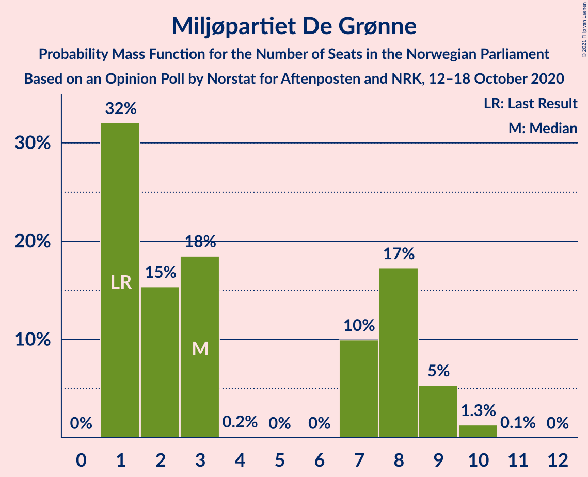

| Number of Seats | Probability | Accumulated | Special Marks |
|:---------------:|:-----------:|:-----------:|:-------------:|
| 1 | 32% | 100% | Last Result |
| 2 | 15% | 68% |  |
| 3 | 18% | 53% | Median |
| 4 | 0.2% | 34% |  |
| 5 | 0% | 34% |  |
| 6 | 0% | 34% |  |
| 7 | 10% | 34% |  |
| 8 | 17% | 24% |  |
| 9 | 5% | 7% |  |
| 10 | 1.3% | 1.4% |  |
| 11 | 0.1% | 0.1% |  |
| 12 | 0% | 0% |  |

### Kristelig Folkeparti

*For a full overview of the results for this party, see the [Kristelig Folkeparti](party-kristeligfolkeparti.html) page.*

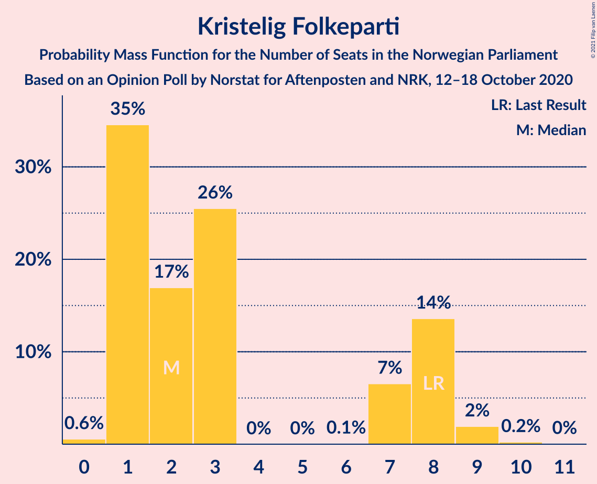

| Number of Seats | Probability | Accumulated | Special Marks |
|:---------------:|:-----------:|:-----------:|:-------------:|
| 0 | 0.6% | 100% |  |
| 1 | 35% | 99.4% |  |
| 2 | 17% | 65% | Median |
| 3 | 26% | 48% |  |
| 4 | 0% | 22% |  |
| 5 | 0% | 22% |  |
| 6 | 0.1% | 22% |  |
| 7 | 7% | 22% |  |
| 8 | 14% | 16% | Last Result |
| 9 | 2% | 2% |  |
| 10 | 0.2% | 0.3% |  |
| 11 | 0% | 0% |  |

### Venstre

*For a full overview of the results for this party, see the [Venstre](party-venstre.html) page.*

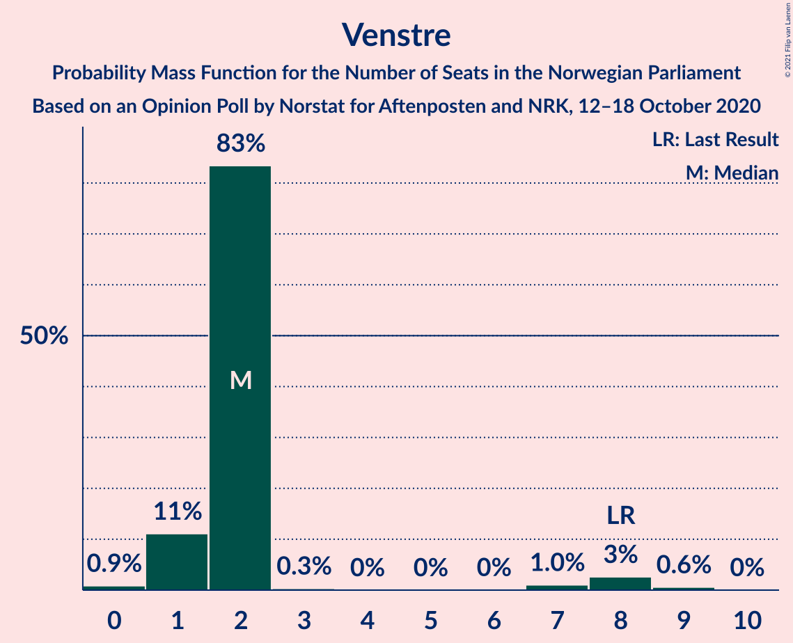

| Number of Seats | Probability | Accumulated | Special Marks |
|:---------------:|:-----------:|:-----------:|:-------------:|
| 0 | 0.9% | 100% |  |
| 1 | 11% | 99.1% |  |
| 2 | 83% | 88% | Median |
| 3 | 0.3% | 5% |  |
| 4 | 0% | 4% |  |
| 5 | 0% | 4% |  |
| 6 | 0% | 4% |  |
| 7 | 1.0% | 4% |  |
| 8 | 3% | 3% | Last Result |
| 9 | 0.6% | 0.6% |  |
| 10 | 0% | 0% |  |

## Coalitions

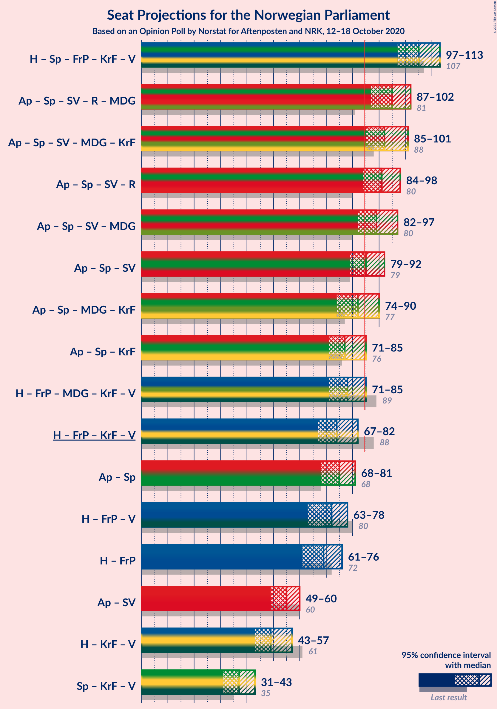

### Confidence Intervals

| Coalition | Last Result | Median | Majority? | 80% Confidence Interval | 90% Confidence Interval | 95% Confidence Interval | 99% Confidence Interval |
|:---------:|:-----------:|:------:|:---------:|:-----------------------:|:-----------------------:|:-----------------------:|:-----------------------:|
| Høyre – Senterpartiet – Fremskrittspartiet – Kristelig Folkeparti – Venstre | 107 | 105 | 100% | 100–110 | 98–112 | 97–113 | 94–114 |
| Arbeiderpartiet – Senterpartiet – Sosialistisk Venstreparti – Rødt – Miljøpartiet De Grønne | 81 | 95 | 99.7% | 89–100 | 88–101 | 87–102 | 85–106 |
| Arbeiderpartiet – Senterpartiet – Sosialistisk Venstreparti – Miljøpartiet De Grønne – Kristelig Folkeparti | 88 | 92 | 98% | 88–98 | 86–100 | 85–101 | 82–104 |
| Arbeiderpartiet – Senterpartiet – Sosialistisk Venstreparti – Rødt | 80 | 91 | 96% | 86–95 | 85–96 | 84–98 | 81–100 |
| Arbeiderpartiet – Senterpartiet – Sosialistisk Venstreparti – Miljøpartiet De Grønne | 80 | 89 | 89% | 84–95 | 83–96 | 82–97 | 80–99 |
| Arbeiderpartiet – Senterpartiet – Sosialistisk Venstreparti | 79 | 85 | 63% | 81–90 | 80–91 | 79–92 | 76–94 |
| Arbeiderpartiet – Senterpartiet – Miljøpartiet De Grønne – Kristelig Folkeparti | 77 | 82 | 22% | 76–87 | 74–89 | 74–90 | 71–93 |
| Arbeiderpartiet – Senterpartiet – Kristelig Folkeparti | 76 | 77 | 4% | 73–82 | 71–84 | 71–85 | 68–87 |
| Høyre – Fremskrittspartiet – Miljøpartiet De Grønne – Kristelig Folkeparti – Venstre | 89 | 78 | 4% | 74–83 | 73–84 | 71–85 | 69–88 |
| Høyre – Fremskrittspartiet – Kristelig Folkeparti – Venstre | 88 | 74 | 0.3% | 69–80 | 68–81 | 67–82 | 63–84 |
| Arbeiderpartiet – Senterpartiet | 68 | 75 | 0.1% | 70–78 | 69–80 | 68–81 | 66–83 |
| Høyre – Fremskrittspartiet – Venstre | 80 | 72 | 0% | 66–75 | 64–77 | 63–78 | 60–80 |
| Høyre – Fremskrittspartiet | 72 | 69 | 0% | 64–73 | 62–75 | 61–76 | 58–78 |
| Arbeiderpartiet – Sosialistisk Venstreparti | 60 | 55 | 0% | 51–58 | 50–59 | 49–60 | 47–62 |
| Høyre – Kristelig Folkeparti – Venstre | 61 | 49 | 0% | 45–54 | 45–55 | 43–57 | 42–59 |
| Senterpartiet – Kristelig Folkeparti – Venstre | 35 | 37 | 0% | 32–41 | 31–42 | 31–43 | 29–46 |

### Høyre – Senterpartiet – Fremskrittspartiet – Kristelig Folkeparti – Venstre

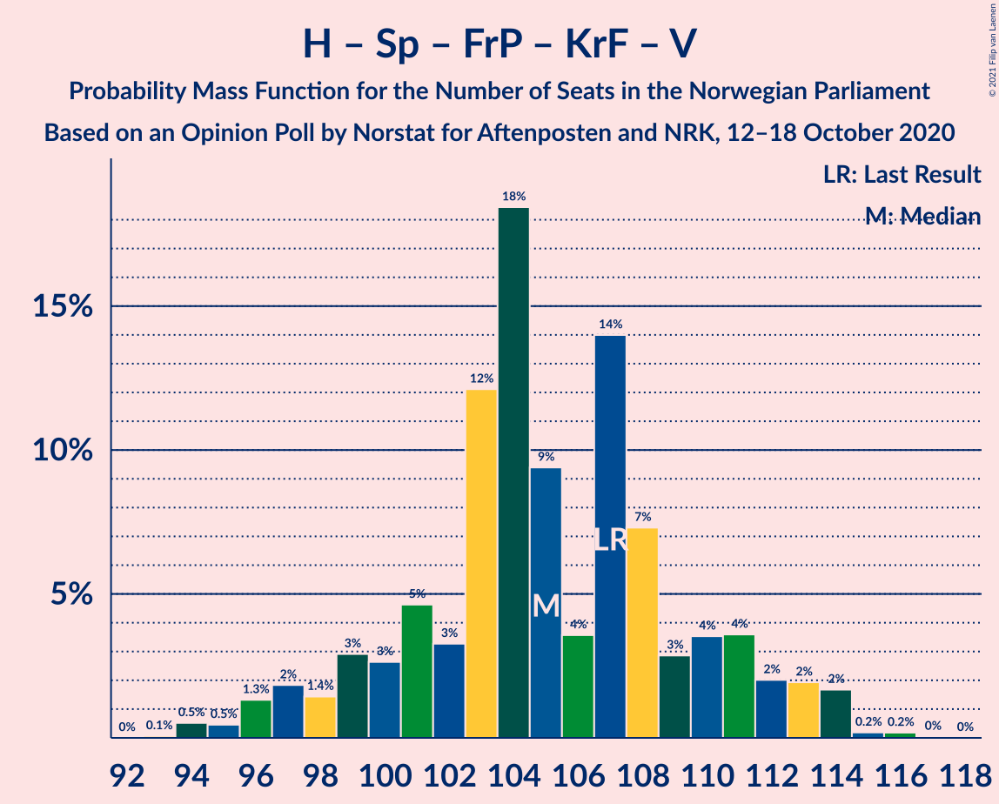

| Number of Seats | Probability | Accumulated | Special Marks |
|:---------------:|:-----------:|:-----------:|:-------------:|
| 93 | 0.1% | 100% |  |
| 94 | 0.5% | 99.9% |  |
| 95 | 0.5% | 99.4% |  |
| 96 | 1.3% | 98.9% |  |
| 97 | 2% | 98% |  |
| 98 | 1.4% | 96% |  |
| 99 | 3% | 94% |  |
| 100 | 3% | 91% |  |
| 101 | 5% | 89% |  |
| 102 | 3% | 84% |  |
| 103 | 12% | 81% |  |
| 104 | 18% | 69% | Median |
| 105 | 9% | 50% |  |
| 106 | 4% | 41% |  |
| 107 | 14% | 37% | Last Result |
| 108 | 7% | 23% |  |
| 109 | 3% | 16% |  |
| 110 | 4% | 13% |  |
| 111 | 4% | 10% |  |
| 112 | 2% | 6% |  |
| 113 | 2% | 4% |  |
| 114 | 2% | 2% |  |
| 115 | 0.2% | 0.4% |  |
| 116 | 0.2% | 0.3% |  |
| 117 | 0% | 0.1% |  |
| 118 | 0% | 0% |  |

### Arbeiderpartiet – Senterpartiet – Sosialistisk Venstreparti – Rødt – Miljøpartiet De Grønne

| Number of Seats | Probability | Accumulated | Special Marks |
|:---------------:|:-----------:|:-----------:|:-------------:|
| 81 | 0% | 100% | Last Result |
| 82 | 0.1% | 100% |  |
| 83 | 0.1% | 99.9% |  |
| 84 | 0.1% | 99.8% |  |
| 85 | 0.3% | 99.7% | Majority |
| 86 | 1.1% | 99.4% |  |
| 87 | 1.0% | 98% |  |
| 88 | 5% | 97% |  |
| 89 | 3% | 93% |  |
| 90 | 2% | 90% |  |
| 91 | 5% | 88% |  |
| 92 | 6% | 83% |  |
| 93 | 8% | 77% |  |
| 94 | 11% | 69% |  |
| 95 | 11% | 58% | Median |
| 96 | 17% | 48% |  |
| 97 | 6% | 30% |  |
| 98 | 8% | 25% |  |
| 99 | 5% | 17% |  |
| 100 | 5% | 11% |  |
| 101 | 3% | 7% |  |
| 102 | 2% | 4% |  |
| 103 | 1.3% | 2% |  |
| 104 | 0.2% | 0.9% |  |
| 105 | 0.2% | 0.7% |  |
| 106 | 0.3% | 0.5% |  |
| 107 | 0.2% | 0.2% |  |
| 108 | 0% | 0% |  |

### Arbeiderpartiet – Senterpartiet – Sosialistisk Venstreparti – Miljøpartiet De Grønne – Kristelig Folkeparti

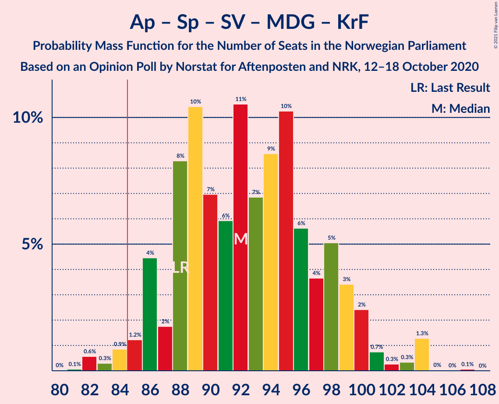

| Number of Seats | Probability | Accumulated | Special Marks |
|:---------------:|:-----------:|:-----------:|:-------------:|
| 81 | 0.1% | 100% |  |
| 82 | 0.6% | 99.9% |  |
| 83 | 0.3% | 99.3% |  |
| 84 | 0.9% | 99.0% |  |
| 85 | 1.2% | 98% | Majority |
| 86 | 4% | 97% |  |
| 87 | 2% | 92% |  |
| 88 | 8% | 91% | Last Result |
| 89 | 10% | 82% |  |
| 90 | 7% | 72% | Median |
| 91 | 6% | 65% |  |
| 92 | 11% | 59% |  |
| 93 | 7% | 49% |  |
| 94 | 9% | 42% |  |
| 95 | 10% | 33% |  |
| 96 | 6% | 23% |  |
| 97 | 4% | 17% |  |
| 98 | 5% | 14% |  |
| 99 | 3% | 9% |  |
| 100 | 2% | 5% |  |
| 101 | 0.7% | 3% |  |
| 102 | 0.3% | 2% |  |
| 103 | 0.3% | 2% |  |
| 104 | 1.3% | 1.4% |  |
| 105 | 0% | 0.1% |  |
| 106 | 0% | 0.1% |  |
| 107 | 0.1% | 0.1% |  |
| 108 | 0% | 0% |  |

### Arbeiderpartiet – Senterpartiet – Sosialistisk Venstreparti – Rødt

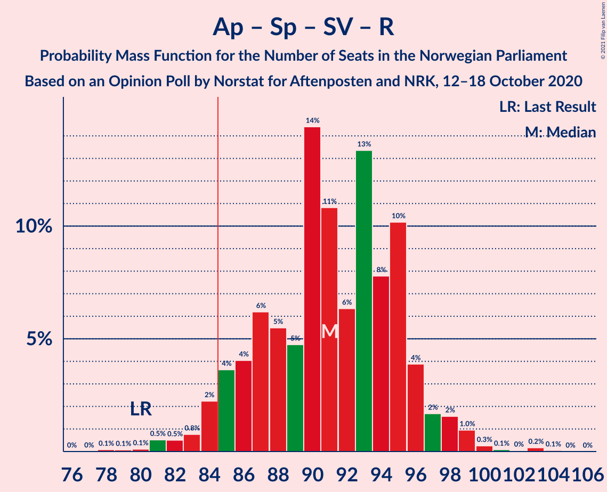

| Number of Seats | Probability | Accumulated | Special Marks |
|:---------------:|:-----------:|:-----------:|:-------------:|
| 78 | 0.1% | 100% |  |
| 79 | 0.1% | 99.9% |  |
| 80 | 0.1% | 99.8% | Last Result |
| 81 | 0.5% | 99.7% |  |
| 82 | 0.5% | 99.2% |  |
| 83 | 0.8% | 98.7% |  |
| 84 | 2% | 98% |  |
| 85 | 4% | 96% | Majority |
| 86 | 4% | 92% |  |
| 87 | 6% | 88% |  |
| 88 | 5% | 82% |  |
| 89 | 5% | 76% |  |
| 90 | 14% | 72% |  |
| 91 | 11% | 57% |  |
| 92 | 6% | 46% | Median |
| 93 | 13% | 40% |  |
| 94 | 8% | 27% |  |
| 95 | 10% | 19% |  |
| 96 | 4% | 9% |  |
| 97 | 2% | 5% |  |
| 98 | 2% | 3% |  |
| 99 | 1.0% | 2% |  |
| 100 | 0.3% | 0.6% |  |
| 101 | 0.1% | 0.4% |  |
| 102 | 0% | 0.3% |  |
| 103 | 0.2% | 0.2% |  |
| 104 | 0.1% | 0.1% |  |
| 105 | 0% | 0% |  |

### Arbeiderpartiet – Senterpartiet – Sosialistisk Venstreparti – Miljøpartiet De Grønne

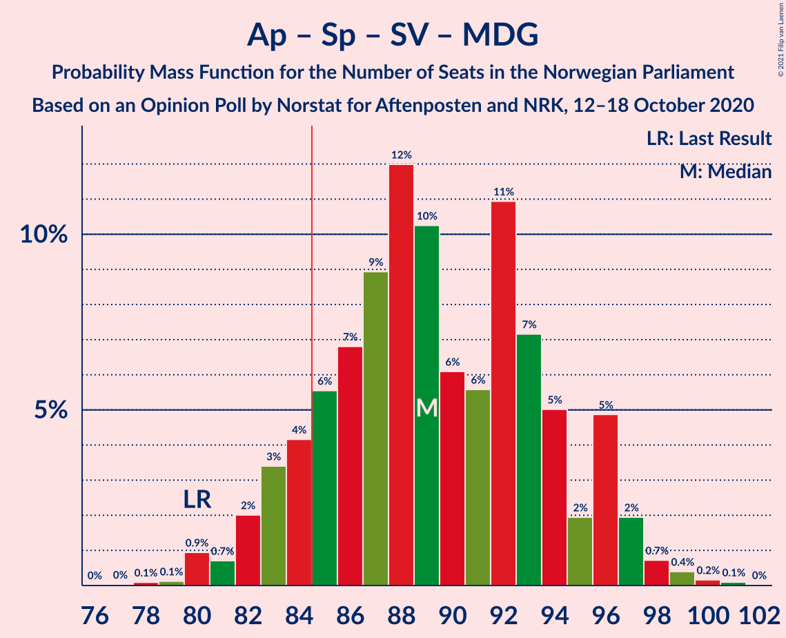

| Number of Seats | Probability | Accumulated | Special Marks |
|:---------------:|:-----------:|:-----------:|:-------------:|
| 77 | 0% | 100% |  |
| 78 | 0.1% | 99.9% |  |
| 79 | 0.1% | 99.8% |  |
| 80 | 0.9% | 99.7% | Last Result |
| 81 | 0.7% | 98.8% |  |
| 82 | 2% | 98% |  |
| 83 | 3% | 96% |  |
| 84 | 4% | 93% |  |
| 85 | 6% | 89% | Majority |
| 86 | 7% | 83% |  |
| 87 | 9% | 76% |  |
| 88 | 12% | 67% | Median |
| 89 | 10% | 55% |  |
| 90 | 6% | 45% |  |
| 91 | 6% | 39% |  |
| 92 | 11% | 33% |  |
| 93 | 7% | 22% |  |
| 94 | 5% | 15% |  |
| 95 | 2% | 10% |  |
| 96 | 5% | 8% |  |
| 97 | 2% | 3% |  |
| 98 | 0.7% | 1.4% |  |
| 99 | 0.4% | 0.7% |  |
| 100 | 0.2% | 0.3% |  |
| 101 | 0.1% | 0.1% |  |
| 102 | 0% | 0% |  |

### Arbeiderpartiet – Senterpartiet – Sosialistisk Venstreparti

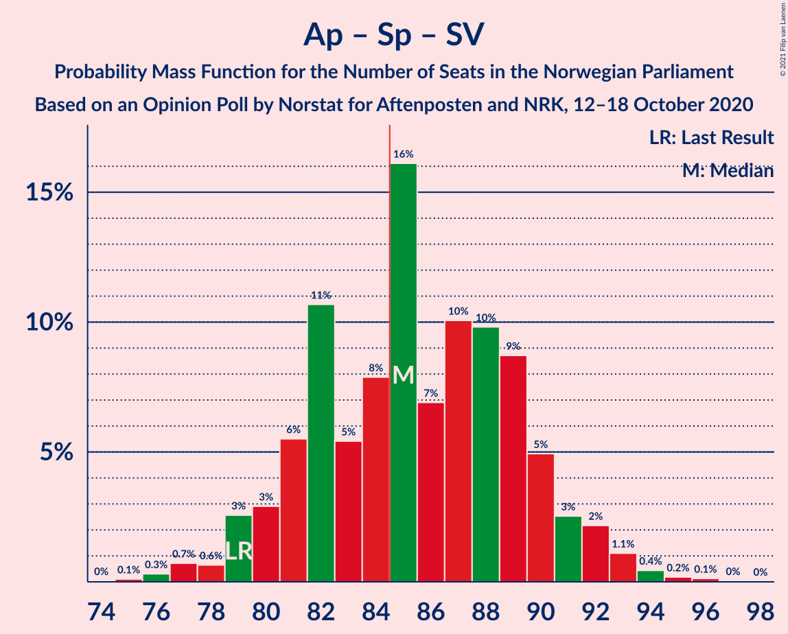

| Number of Seats | Probability | Accumulated | Special Marks |
|:---------------:|:-----------:|:-----------:|:-------------:|
| 74 | 0% | 100% |  |
| 75 | 0.1% | 99.9% |  |
| 76 | 0.3% | 99.8% |  |
| 77 | 0.7% | 99.5% |  |
| 78 | 0.6% | 98.8% |  |
| 79 | 3% | 98% | Last Result |
| 80 | 3% | 96% |  |
| 81 | 6% | 93% |  |
| 82 | 11% | 87% |  |
| 83 | 5% | 76% |  |
| 84 | 8% | 71% |  |
| 85 | 16% | 63% | Median, Majority |
| 86 | 7% | 47% |  |
| 87 | 10% | 40% |  |
| 88 | 10% | 30% |  |
| 89 | 9% | 20% |  |
| 90 | 5% | 12% |  |
| 91 | 3% | 7% |  |
| 92 | 2% | 4% |  |
| 93 | 1.1% | 2% |  |
| 94 | 0.4% | 0.8% |  |
| 95 | 0.2% | 0.4% |  |
| 96 | 0.1% | 0.2% |  |
| 97 | 0% | 0.1% |  |
| 98 | 0% | 0% |  |

### Arbeiderpartiet – Senterpartiet – Miljøpartiet De Grønne – Kristelig Folkeparti

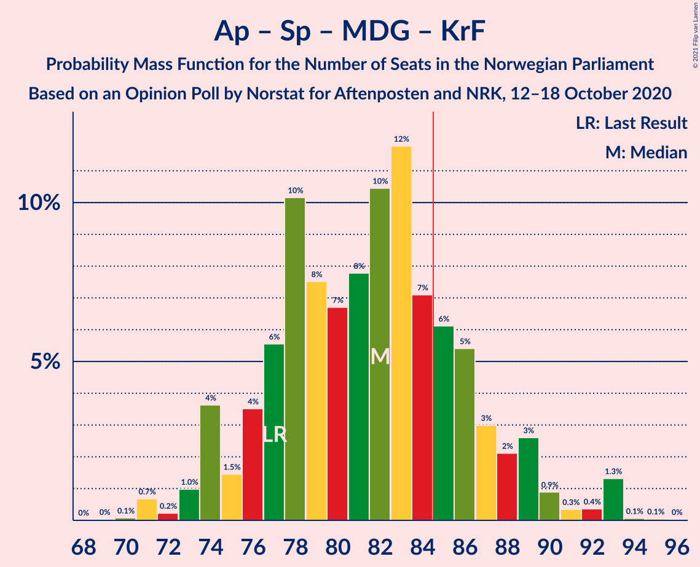

| Number of Seats | Probability | Accumulated | Special Marks |
|:---------------:|:-----------:|:-----------:|:-------------:|
| 69 | 0% | 100% |  |
| 70 | 0.1% | 99.9% |  |
| 71 | 0.7% | 99.9% |  |
| 72 | 0.2% | 99.2% |  |
| 73 | 1.0% | 99.0% |  |
| 74 | 4% | 98% |  |
| 75 | 1.5% | 94% |  |
| 76 | 4% | 93% |  |
| 77 | 6% | 89% | Last Result |
| 78 | 10% | 84% |  |
| 79 | 8% | 74% | Median |
| 80 | 7% | 66% |  |
| 81 | 8% | 59% |  |
| 82 | 10% | 52% |  |
| 83 | 12% | 41% |  |
| 84 | 7% | 29% |  |
| 85 | 6% | 22% | Majority |
| 86 | 5% | 16% |  |
| 87 | 3% | 11% |  |
| 88 | 2% | 8% |  |
| 89 | 3% | 6% |  |
| 90 | 0.9% | 3% |  |
| 91 | 0.3% | 2% |  |
| 92 | 0.4% | 2% |  |
| 93 | 1.3% | 1.5% |  |
| 94 | 0.1% | 0.2% |  |
| 95 | 0.1% | 0.1% |  |
| 96 | 0% | 0% |  |

### Arbeiderpartiet – Senterpartiet – Kristelig Folkeparti

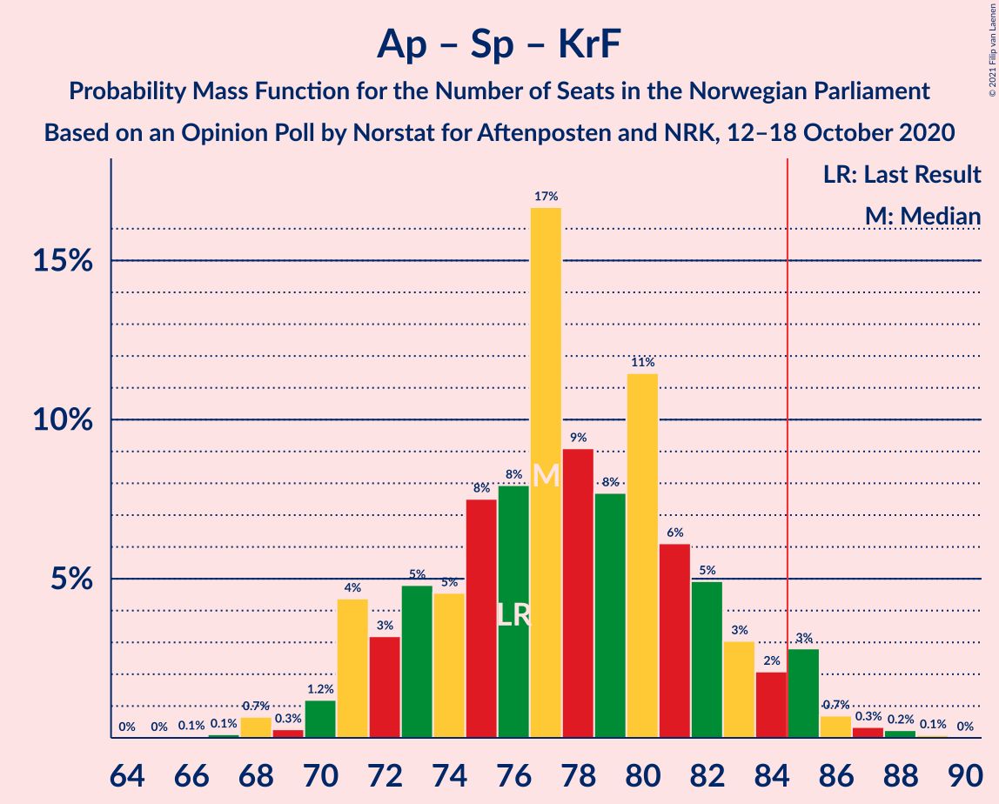

| Number of Seats | Probability | Accumulated | Special Marks |
|:---------------:|:-----------:|:-----------:|:-------------:|
| 66 | 0.1% | 100% |  |
| 67 | 0.1% | 99.9% |  |
| 68 | 0.7% | 99.8% |  |
| 69 | 0.3% | 99.2% |  |
| 70 | 1.2% | 98.9% |  |
| 71 | 4% | 98% |  |
| 72 | 3% | 93% |  |
| 73 | 5% | 90% |  |
| 74 | 5% | 85% |  |
| 75 | 8% | 81% |  |
| 76 | 8% | 73% | Last Result, Median |
| 77 | 17% | 65% |  |
| 78 | 9% | 49% |  |
| 79 | 8% | 40% |  |
| 80 | 11% | 32% |  |
| 81 | 6% | 20% |  |
| 82 | 5% | 14% |  |
| 83 | 3% | 9% |  |
| 84 | 2% | 6% |  |
| 85 | 3% | 4% | Majority |
| 86 | 0.7% | 1.4% |  |
| 87 | 0.3% | 0.7% |  |
| 88 | 0.2% | 0.4% |  |
| 89 | 0.1% | 0.1% |  |
| 90 | 0% | 0% |  |

### Høyre – Fremskrittspartiet – Miljøpartiet De Grønne – Kristelig Folkeparti – Venstre

| Number of Seats | Probability | Accumulated | Special Marks |
|:---------------:|:-----------:|:-----------:|:-------------:|
| 65 | 0.1% | 100% |  |
| 66 | 0.2% | 99.9% |  |
| 67 | 0% | 99.8% |  |
| 68 | 0.1% | 99.7% |  |
| 69 | 0.3% | 99.6% |  |
| 70 | 1.0% | 99.4% |  |
| 71 | 2% | 98% |  |
| 72 | 2% | 97% |  |
| 73 | 4% | 95% |  |
| 74 | 10% | 91% |  |
| 75 | 8% | 81% |  |
| 76 | 13% | 73% | Median |
| 77 | 6% | 60% |  |
| 78 | 11% | 54% |  |
| 79 | 14% | 43% |  |
| 80 | 5% | 28% |  |
| 81 | 5% | 24% |  |
| 82 | 6% | 18% |  |
| 83 | 4% | 12% |  |
| 84 | 4% | 8% |  |
| 85 | 2% | 4% | Majority |
| 86 | 0.8% | 2% |  |
| 87 | 0.5% | 1.3% |  |
| 88 | 0.5% | 0.8% |  |
| 89 | 0.1% | 0.3% | Last Result |
| 90 | 0.1% | 0.2% |  |
| 91 | 0.1% | 0.1% |  |
| 92 | 0% | 0% |  |

### Høyre – Fremskrittspartiet – Kristelig Folkeparti – Venstre

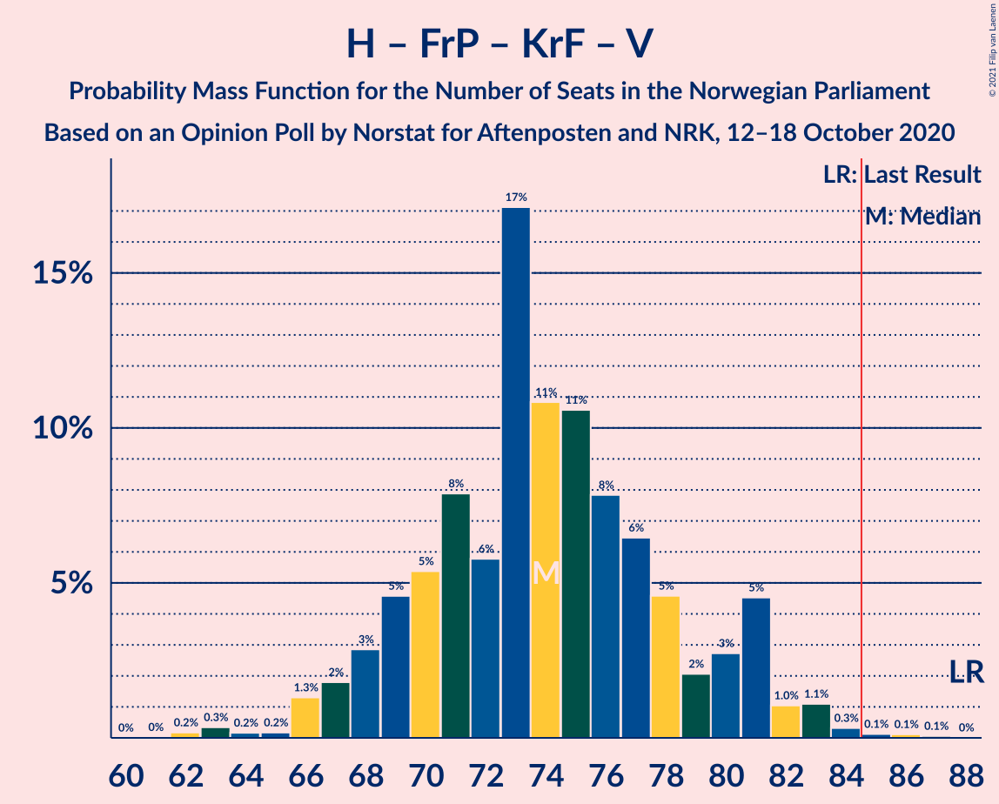

| Number of Seats | Probability | Accumulated | Special Marks |
|:---------------:|:-----------:|:-----------:|:-------------:|
| 62 | 0.2% | 100% |  |
| 63 | 0.3% | 99.8% |  |
| 64 | 0.2% | 99.5% |  |
| 65 | 0.2% | 99.3% |  |
| 66 | 1.3% | 99.1% |  |
| 67 | 2% | 98% |  |
| 68 | 3% | 96% |  |
| 69 | 5% | 93% |  |
| 70 | 5% | 89% |  |
| 71 | 8% | 83% |  |
| 72 | 6% | 75% |  |
| 73 | 17% | 70% | Median |
| 74 | 11% | 52% |  |
| 75 | 11% | 42% |  |
| 76 | 8% | 31% |  |
| 77 | 6% | 23% |  |
| 78 | 5% | 17% |  |
| 79 | 2% | 12% |  |
| 80 | 3% | 10% |  |
| 81 | 5% | 7% |  |
| 82 | 1.0% | 3% |  |
| 83 | 1.1% | 2% |  |
| 84 | 0.3% | 0.6% |  |
| 85 | 0.1% | 0.3% | Majority |
| 86 | 0.1% | 0.2% |  |
| 87 | 0.1% | 0.1% |  |
| 88 | 0% | 0% | Last Result |

### Arbeiderpartiet – Senterpartiet

| Number of Seats | Probability | Accumulated | Special Marks |
|:---------------:|:-----------:|:-----------:|:-------------:|
| 64 | 0.1% | 100% |  |
| 65 | 0.2% | 99.9% |  |
| 66 | 0.5% | 99.6% |  |
| 67 | 1.0% | 99.1% |  |
| 68 | 2% | 98% | Last Result |
| 69 | 3% | 97% |  |
| 70 | 7% | 94% |  |
| 71 | 8% | 86% |  |
| 72 | 7% | 78% |  |
| 73 | 7% | 71% |  |
| 74 | 12% | 64% | Median |
| 75 | 11% | 51% |  |
| 76 | 16% | 40% |  |
| 77 | 7% | 24% |  |
| 78 | 8% | 17% |  |
| 79 | 2% | 9% |  |
| 80 | 2% | 6% |  |
| 81 | 3% | 5% |  |
| 82 | 0.9% | 2% |  |
| 83 | 0.4% | 0.7% |  |
| 84 | 0.1% | 0.2% |  |
| 85 | 0.1% | 0.1% | Majority |
| 86 | 0% | 0% |  |

### Høyre – Fremskrittspartiet – Venstre

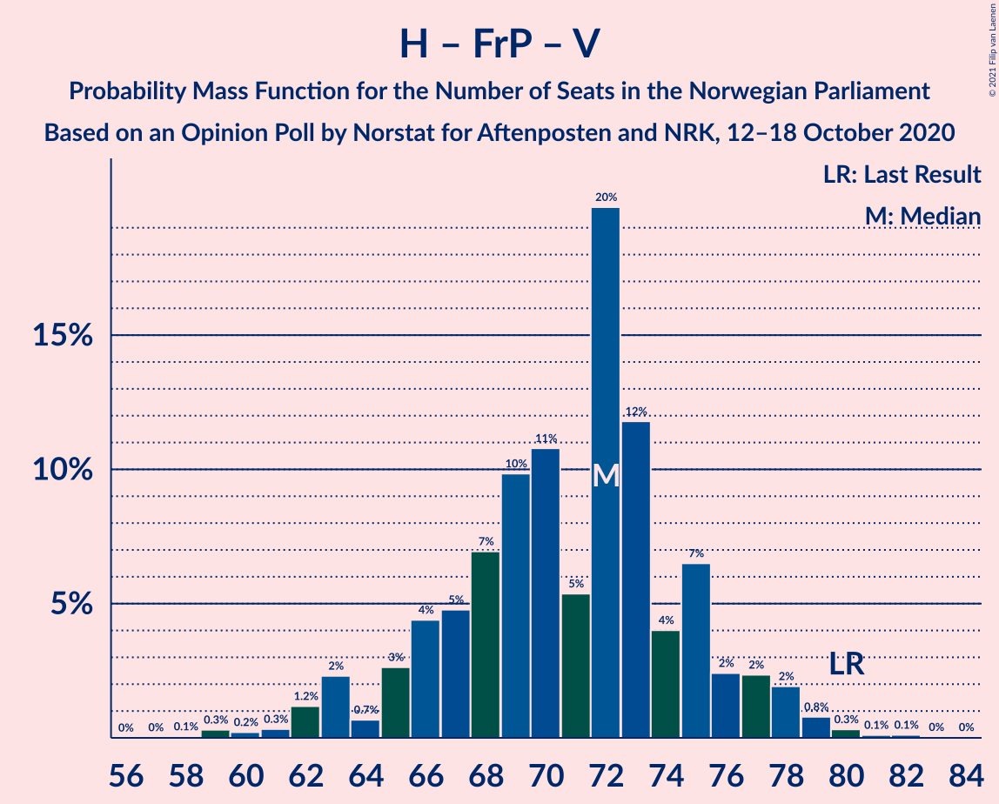

| Number of Seats | Probability | Accumulated | Special Marks |
|:---------------:|:-----------:|:-----------:|:-------------:|
| 58 | 0.1% | 100% |  |
| 59 | 0.3% | 99.9% |  |
| 60 | 0.2% | 99.6% |  |
| 61 | 0.3% | 99.4% |  |
| 62 | 1.2% | 99.1% |  |
| 63 | 2% | 98% |  |
| 64 | 0.7% | 96% |  |
| 65 | 3% | 95% |  |
| 66 | 4% | 92% |  |
| 67 | 5% | 88% |  |
| 68 | 7% | 83% |  |
| 69 | 10% | 76% |  |
| 70 | 11% | 66% |  |
| 71 | 5% | 56% | Median |
| 72 | 20% | 50% |  |
| 73 | 12% | 30% |  |
| 74 | 4% | 19% |  |
| 75 | 7% | 15% |  |
| 76 | 2% | 8% |  |
| 77 | 2% | 6% |  |
| 78 | 2% | 3% |  |
| 79 | 0.8% | 1.4% |  |
| 80 | 0.3% | 0.6% | Last Result |
| 81 | 0.1% | 0.3% |  |
| 82 | 0.1% | 0.2% |  |
| 83 | 0% | 0.1% |  |
| 84 | 0% | 0% |  |

### Høyre – Fremskrittspartiet

| Number of Seats | Probability | Accumulated | Special Marks |
|:---------------:|:-----------:|:-----------:|:-------------:|
| 56 | 0.1% | 100% |  |
| 57 | 0.2% | 99.9% |  |
| 58 | 0.3% | 99.7% |  |
| 59 | 0.3% | 99.4% |  |
| 60 | 1.3% | 99.1% |  |
| 61 | 2% | 98% |  |
| 62 | 1.3% | 96% |  |
| 63 | 3% | 94% |  |
| 64 | 4% | 92% |  |
| 65 | 4% | 87% |  |
| 66 | 7% | 83% |  |
| 67 | 10% | 76% |  |
| 68 | 12% | 66% |  |
| 69 | 6% | 54% | Median |
| 70 | 19% | 48% |  |
| 71 | 12% | 29% |  |
| 72 | 3% | 17% | Last Result |
| 73 | 6% | 13% |  |
| 74 | 2% | 7% |  |
| 75 | 2% | 5% |  |
| 76 | 2% | 3% |  |
| 77 | 0.7% | 1.3% |  |
| 78 | 0.3% | 0.5% |  |
| 79 | 0.1% | 0.2% |  |
| 80 | 0% | 0.1% |  |
| 81 | 0.1% | 0.1% |  |
| 82 | 0% | 0% |  |

### Arbeiderpartiet – Sosialistisk Venstreparti

| Number of Seats | Probability | Accumulated | Special Marks |
|:---------------:|:-----------:|:-----------:|:-------------:|
| 44 | 0% | 100% |  |
| 45 | 0% | 99.9% |  |
| 46 | 0.1% | 99.9% |  |
| 47 | 0.4% | 99.8% |  |
| 48 | 0.6% | 99.4% |  |
| 49 | 1.4% | 98.8% |  |
| 50 | 5% | 97% |  |
| 51 | 12% | 93% |  |
| 52 | 9% | 81% |  |
| 53 | 7% | 72% |  |
| 54 | 13% | 65% | Median |
| 55 | 17% | 53% |  |
| 56 | 15% | 36% |  |
| 57 | 9% | 21% |  |
| 58 | 4% | 12% |  |
| 59 | 4% | 8% |  |
| 60 | 2% | 4% | Last Result |
| 61 | 0.7% | 2% |  |
| 62 | 0.5% | 0.8% |  |
| 63 | 0.2% | 0.3% |  |
| 64 | 0.1% | 0.1% |  |
| 65 | 0% | 0.1% |  |
| 66 | 0% | 0% |  |

### Høyre – Kristelig Folkeparti – Venstre

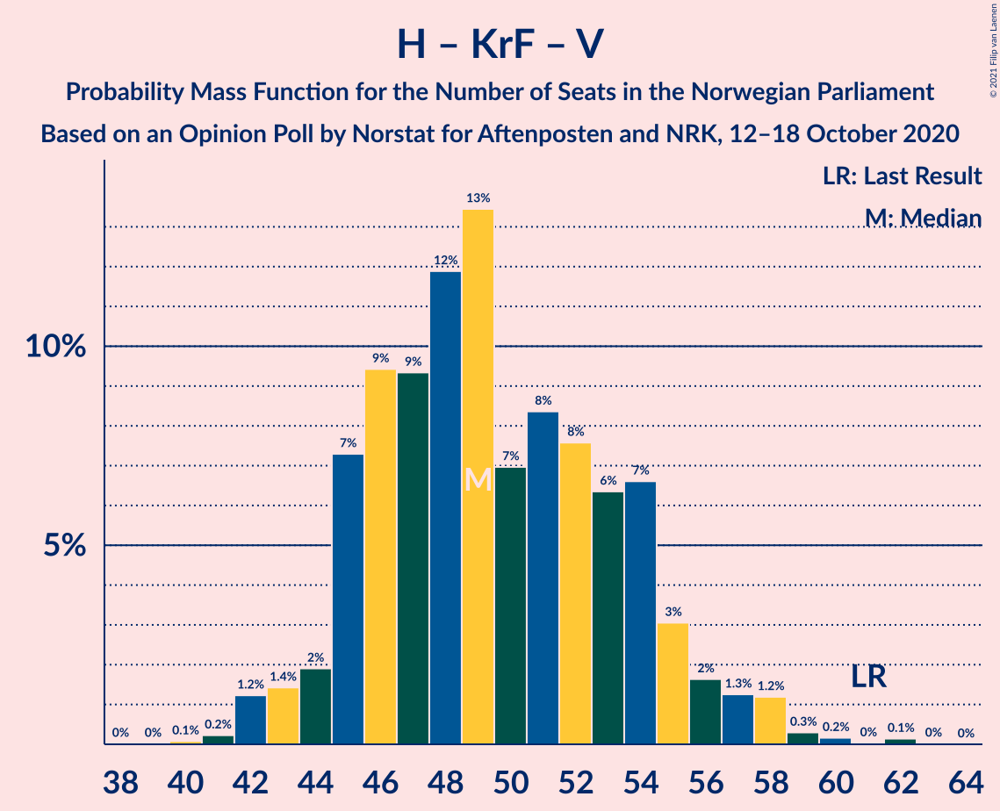

| Number of Seats | Probability | Accumulated | Special Marks |
|:---------------:|:-----------:|:-----------:|:-------------:|
| 40 | 0.1% | 100% |  |
| 41 | 0.2% | 99.9% |  |
| 42 | 1.2% | 99.7% |  |
| 43 | 1.4% | 98% |  |
| 44 | 2% | 97% |  |
| 45 | 7% | 95% |  |
| 46 | 9% | 88% |  |
| 47 | 9% | 78% |  |
| 48 | 12% | 69% | Median |
| 49 | 13% | 57% |  |
| 50 | 7% | 44% |  |
| 51 | 8% | 37% |  |
| 52 | 8% | 28% |  |
| 53 | 6% | 21% |  |
| 54 | 7% | 14% |  |
| 55 | 3% | 8% |  |
| 56 | 2% | 5% |  |
| 57 | 1.3% | 3% |  |
| 58 | 1.2% | 2% |  |
| 59 | 0.3% | 0.7% |  |
| 60 | 0.2% | 0.4% |  |
| 61 | 0% | 0.2% | Last Result |
| 62 | 0.1% | 0.2% |  |
| 63 | 0% | 0% |  |

### Senterpartiet – Kristelig Folkeparti – Venstre

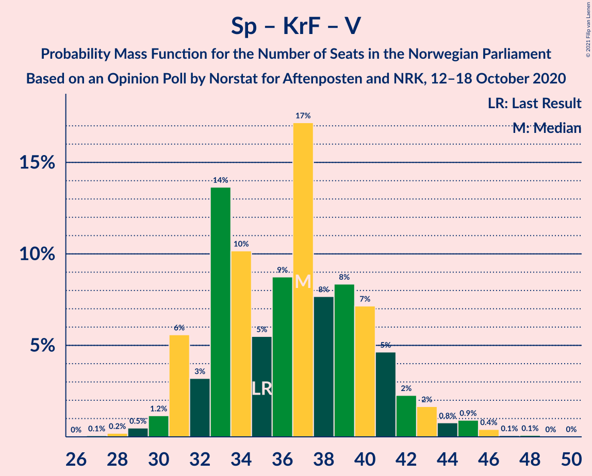

| Number of Seats | Probability | Accumulated | Special Marks |
|:---------------:|:-----------:|:-----------:|:-------------:|
| 27 | 0.1% | 100% |  |
| 28 | 0.2% | 99.9% |  |
| 29 | 0.5% | 99.7% |  |
| 30 | 1.2% | 99.2% |  |
| 31 | 6% | 98% |  |
| 32 | 3% | 92% |  |
| 33 | 14% | 89% |  |
| 34 | 10% | 76% |  |
| 35 | 5% | 65% | Last Result, Median |
| 36 | 9% | 60% |  |
| 37 | 17% | 51% |  |
| 38 | 8% | 34% |  |
| 39 | 8% | 26% |  |
| 40 | 7% | 18% |  |
| 41 | 5% | 11% |  |
| 42 | 2% | 6% |  |
| 43 | 2% | 4% |  |
| 44 | 0.8% | 2% |  |
| 45 | 0.9% | 2% |  |
| 46 | 0.4% | 0.6% |  |
| 47 | 0.1% | 0.2% |  |
| 48 | 0.1% | 0.1% |  |
| 49 | 0% | 0.1% |  |
| 50 | 0% | 0% |  |

## Technical Information

### Opinion Poll

+ **Polling firm:** Norstat
+ **Commissioner(s):** Aftenposten and NRK
+ **Fieldwork period:** 12–18 October 2020

### Calculations

+ **Sample size:** 962
+ **Simulations done:** 1,048,576
+ **Error estimate:** 1.83%

