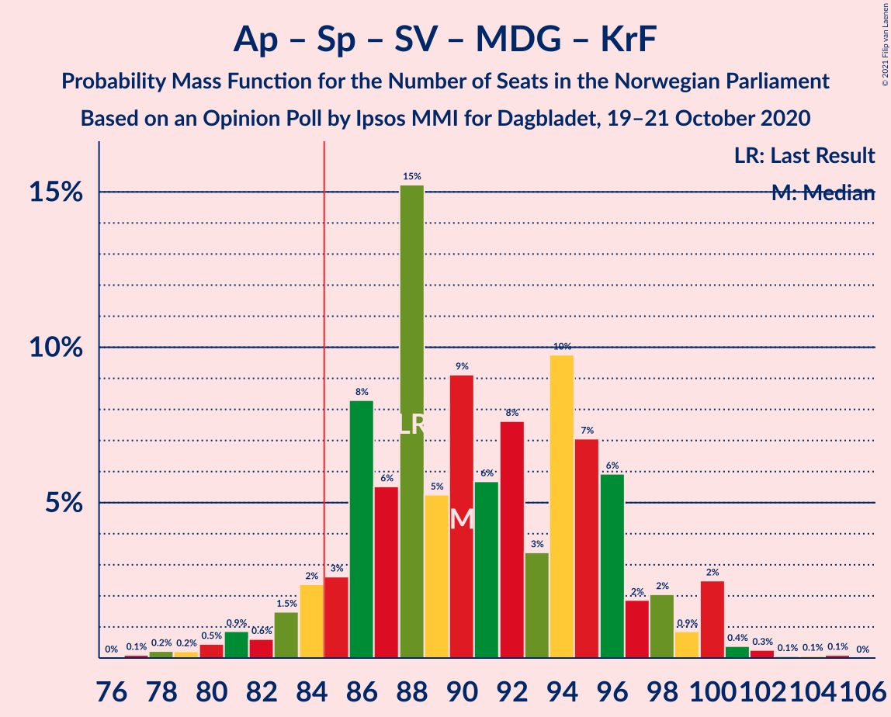
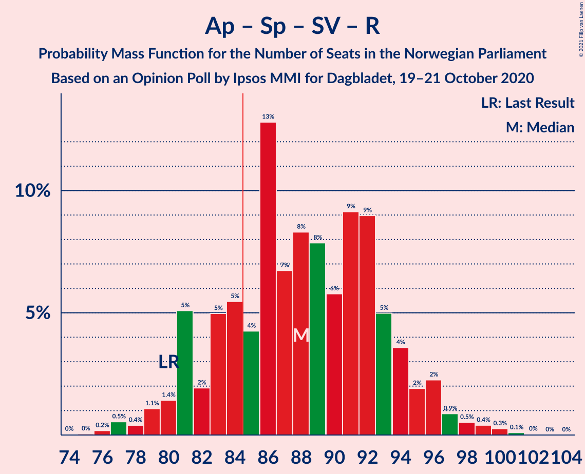

# Opinion Poll by Ipsos MMI for Dagbladet, 19–21 October 2020

<a href="#voting-intentions">Voting Intentions</a> | <a href="#seats">Seats</a> | <a href="#coalitions">Coalitions</a> | <a href="#technical-information">Technical Information</a>

## Voting Intentions

### Confidence Intervals

| Party | Last Result | Poll Result | 80% Confidence Interval | 90% Confidence Interval | 95% Confidence Interval | 99% Confidence Interval |
|:-----:|:-----------:|:-----------:|:-----------------------:|:-----------------------:|:-----------------------:|:-----------------------:|
| Høyre | 25.0% | 22.3% | 20.4–24.4% |19.9–25.0% |19.4–25.5% |18.5–26.5% |
| Arbeiderpartiet | 27.4% | 19.6% | 17.8–21.6% |17.3–22.1% |16.8–22.6% |16.0–23.6% |
| Senterpartiet | 10.3% | 17.8% | 16.0–19.7% |15.6–20.2% |15.2–20.7% |14.4–21.7% |
| Fremskrittspartiet | 15.2% | 12.7% | 11.2–14.4% |10.8–14.9% |10.4–15.3% |9.8–16.2% |
| Sosialistisk Venstreparti | 6.0% | 6.3% | 5.3–7.7% |5.0–8.0% |4.8–8.4% |4.3–9.0% |
| Rødt | 2.4% | 5.4% | 4.4–6.6% |4.2–7.0% |3.9–7.3% |3.6–7.9% |
| Miljøpartiet De Grønne | 3.2% | 4.7% | 3.8–5.9% |3.6–6.2% |3.4–6.5% |3.0–7.1% |
| Kristelig Folkeparti | 4.2% | 3.7% | 3.0–4.8% |2.7–5.1% |2.6–5.4% |2.2–5.9% |
| Venstre | 4.4% | 2.6% | 2.0–3.6% |1.8–3.8% |1.7–4.1% |1.4–4.6% |

*Note:* The poll result column reflects the actual value used in the calculations. Published results may vary slightly, and in addition be rounded to fewer digits.

## Seats

### Confidence Intervals

| Party | Last Result | Median | 80% Confidence Interval | 90% Confidence Interval | 95% Confidence Interval | 99% Confidence Interval |
|:-----:|:-----------:|:------:|:-----------------------:|:-----------------------:|:-----------------------:|:-----------------------:|
| <a href="#høyre">Høyre</a> | 45 | 40 | 37–44 |35–45 |34–46 |33–47 |
| <a href="#arbeiderpartiet">Arbeiderpartiet</a> | 49 | 38 | 33–40 |30–41 |30–41 |27–43 |
| <a href="#senterpartiet">Senterpartiet</a> | 19 | 33 | 30–37 |29–39 |28–40 |26–42 |
| <a href="#fremskrittspartiet">Fremskrittspartiet</a> | 27 | 22 | 18–26 |18–26 |17–27 |15–28 |
| <a href="#sosialistisk-venstreparti">Sosialistisk Venstreparti</a> | 11 | 10 | 8–12 |8–13 |7–13 |6–15 |
| <a href="#rødt">Rødt</a> | 1 | 8 | 7–11 |7–11 |6–12 |2–13 |
| <a href="#miljøpartiet-de-grønne">Miljøpartiet De Grønne</a> | 1 | 7 | 6–9 |2–9 |2–10 |1–11 |
| <a href="#kristelig-folkeparti">Kristelig Folkeparti</a> | 8 | 2 | 1–6 |1–7 |1–7 |0–9 |
| <a href="#venstre">Venstre</a> | 8 | 2 | 1–2 |1–2 |1–6 |0–7 |

### Høyre

*For a full overview of the results for this party, see the [Høyre](party-høyre.html) page.*

| Number of Seats | Probability | Accumulated | Special Marks |
|:---------------:|:-----------:|:-----------:|:-------------:|
| 31 | 0.1% | 100% |  |
| 32 | 0.3% | 99.9% |  |
| 33 | 2% | 99.6% |  |
| 34 | 2% | 98% |  |
| 35 | 2% | 96% |  |
| 36 | 3% | 94% |  |
| 37 | 2% | 90% |  |
| 38 | 10% | 89% |  |
| 39 | 6% | 79% |  |
| 40 | 36% | 73% | Median |
| 41 | 5% | 37% |  |
| 42 | 9% | 32% |  |
| 43 | 8% | 23% |  |
| 44 | 6% | 15% |  |
| 45 | 4% | 9% | Last Result |
| 46 | 4% | 4% |  |
| 47 | 0.5% | 0.7% |  |
| 48 | 0.1% | 0.2% |  |
| 49 | 0.1% | 0.1% |  |
| 50 | 0% | 0% |  |

### Arbeiderpartiet

*For a full overview of the results for this party, see the [Arbeiderpartiet](party-arbeiderpartiet.html) page.*

| Number of Seats | Probability | Accumulated | Special Marks |
|:---------------:|:-----------:|:-----------:|:-------------:|
| 26 | 0.2% | 100% |  |
| 27 | 0.6% | 99.8% |  |
| 28 | 0.3% | 99.2% |  |
| 29 | 0.9% | 98.9% |  |
| 30 | 5% | 98% |  |
| 31 | 1.3% | 93% |  |
| 32 | 1.5% | 92% |  |
| 33 | 4% | 91% |  |
| 34 | 9% | 86% |  |
| 35 | 12% | 77% |  |
| 36 | 8% | 65% |  |
| 37 | 7% | 57% |  |
| 38 | 25% | 50% | Median |
| 39 | 13% | 25% |  |
| 40 | 2% | 11% |  |
| 41 | 6% | 9% |  |
| 42 | 2% | 2% |  |
| 43 | 0.4% | 0.8% |  |
| 44 | 0.3% | 0.4% |  |
| 45 | 0.1% | 0.1% |  |
| 46 | 0% | 0% |  |
| 47 | 0% | 0% |  |
| 48 | 0% | 0% |  |
| 49 | 0% | 0% | Last Result |

### Senterpartiet

*For a full overview of the results for this party, see the [Senterpartiet](party-senterpartiet.html) page.*

| Number of Seats | Probability | Accumulated | Special Marks |
|:---------------:|:-----------:|:-----------:|:-------------:|
| 19 | 0% | 100% | Last Result |
| 20 | 0% | 100% |  |
| 21 | 0% | 100% |  |
| 22 | 0% | 100% |  |
| 23 | 0% | 100% |  |
| 24 | 0.2% | 100% |  |
| 25 | 0.1% | 99.8% |  |
| 26 | 0.8% | 99.7% |  |
| 27 | 0.9% | 98.9% |  |
| 28 | 2% | 98% |  |
| 29 | 3% | 96% |  |
| 30 | 7% | 94% |  |
| 31 | 7% | 86% |  |
| 32 | 22% | 79% |  |
| 33 | 11% | 57% | Median |
| 34 | 4% | 47% |  |
| 35 | 25% | 42% |  |
| 36 | 6% | 17% |  |
| 37 | 4% | 12% |  |
| 38 | 2% | 8% |  |
| 39 | 3% | 5% |  |
| 40 | 1.3% | 3% |  |
| 41 | 0.9% | 1.4% |  |
| 42 | 0.3% | 0.6% |  |
| 43 | 0.1% | 0.3% |  |
| 44 | 0.2% | 0.2% |  |
| 45 | 0% | 0% |  |

### Fremskrittspartiet

*For a full overview of the results for this party, see the [Fremskrittspartiet](party-fremskrittspartiet.html) page.*

| Number of Seats | Probability | Accumulated | Special Marks |
|:---------------:|:-----------:|:-----------:|:-------------:|
| 14 | 0.1% | 100% |  |
| 15 | 0.6% | 99.8% |  |
| 16 | 1.0% | 99.2% |  |
| 17 | 1.4% | 98% |  |
| 18 | 13% | 97% |  |
| 19 | 9% | 84% |  |
| 20 | 11% | 75% |  |
| 21 | 14% | 64% |  |
| 22 | 5% | 50% | Median |
| 23 | 22% | 46% |  |
| 24 | 5% | 24% |  |
| 25 | 7% | 19% |  |
| 26 | 9% | 12% |  |
| 27 | 2% | 3% | Last Result |
| 28 | 0.5% | 0.8% |  |
| 29 | 0.2% | 0.3% |  |
| 30 | 0.1% | 0.2% |  |
| 31 | 0.1% | 0.1% |  |
| 32 | 0% | 0% |  |

### Sosialistisk Venstreparti

*For a full overview of the results for this party, see the [Sosialistisk Venstreparti](party-sosialistiskvenstreparti.html) page.*

| Number of Seats | Probability | Accumulated | Special Marks |
|:---------------:|:-----------:|:-----------:|:-------------:|
| 2 | 0.3% | 100% |  |
| 3 | 0% | 99.7% |  |
| 4 | 0% | 99.7% |  |
| 5 | 0% | 99.7% |  |
| 6 | 0.5% | 99.7% |  |
| 7 | 4% | 99.2% |  |
| 8 | 7% | 95% |  |
| 9 | 37% | 88% |  |
| 10 | 21% | 51% | Median |
| 11 | 9% | 29% | Last Result |
| 12 | 13% | 21% |  |
| 13 | 5% | 7% |  |
| 14 | 1.4% | 2% |  |
| 15 | 0.9% | 1.1% |  |
| 16 | 0.1% | 0.2% |  |
| 17 | 0% | 0% |  |

### Rødt

*For a full overview of the results for this party, see the [Rødt](party-rødt.html) page.*

| Number of Seats | Probability | Accumulated | Special Marks |
|:---------------:|:-----------:|:-----------:|:-------------:|
| 1 | 0% | 100% | Last Result |
| 2 | 2% | 100% |  |
| 3 | 0% | 98% |  |
| 4 | 0% | 98% |  |
| 5 | 0% | 98% |  |
| 6 | 2% | 98% |  |
| 7 | 36% | 96% |  |
| 8 | 22% | 60% | Median |
| 9 | 21% | 38% |  |
| 10 | 7% | 17% |  |
| 11 | 7% | 10% |  |
| 12 | 2% | 3% |  |
| 13 | 1.3% | 1.4% |  |
| 14 | 0.1% | 0.2% |  |
| 15 | 0% | 0.1% |  |
| 16 | 0% | 0% |  |

### Miljøpartiet De Grønne

*For a full overview of the results for this party, see the [Miljøpartiet De Grønne](party-miljøpartietdegrønne.html) page.*

| Number of Seats | Probability | Accumulated | Special Marks |
|:---------------:|:-----------:|:-----------:|:-------------:|
| 1 | 2% | 100% | Last Result |
| 2 | 5% | 98% |  |
| 3 | 3% | 93% |  |
| 4 | 0.3% | 91% |  |
| 5 | 0% | 90% |  |
| 6 | 6% | 90% |  |
| 7 | 44% | 84% | Median |
| 8 | 20% | 40% |  |
| 9 | 16% | 20% |  |
| 10 | 2% | 4% |  |
| 11 | 1.3% | 2% |  |
| 12 | 0.3% | 0.4% |  |
| 13 | 0% | 0.1% |  |
| 14 | 0% | 0% |  |

### Kristelig Folkeparti

*For a full overview of the results for this party, see the [Kristelig Folkeparti](party-kristeligfolkeparti.html) page.*

| Number of Seats | Probability | Accumulated | Special Marks |
|:---------------:|:-----------:|:-----------:|:-------------:|
| 0 | 0.5% | 100% |  |
| 1 | 31% | 99.5% |  |
| 2 | 42% | 69% | Median |
| 3 | 11% | 26% |  |
| 4 | 0% | 15% |  |
| 5 | 0.2% | 15% |  |
| 6 | 7% | 15% |  |
| 7 | 6% | 8% |  |
| 8 | 1.1% | 2% | Last Result |
| 9 | 0.9% | 1.1% |  |
| 10 | 0.2% | 0.2% |  |
| 11 | 0% | 0% |  |

### Venstre

*For a full overview of the results for this party, see the [Venstre](party-venstre.html) page.*

| Number of Seats | Probability | Accumulated | Special Marks |
|:---------------:|:-----------:|:-----------:|:-------------:|
| 0 | 1.4% | 100% |  |
| 1 | 19% | 98.6% |  |
| 2 | 77% | 80% | Median |
| 3 | 0.1% | 3% |  |
| 4 | 0% | 3% |  |
| 5 | 0.2% | 3% |  |
| 6 | 2% | 3% |  |
| 7 | 1.0% | 1.0% |  |
| 8 | 0.1% | 0.1% | Last Result |
| 9 | 0% | 0% |  |

## Coalitions

### Confidence Intervals

| Coalition | Last Result | Median | Majority? | 80% Confidence Interval | 90% Confidence Interval | 95% Confidence Interval | 99% Confidence Interval |
|:---------:|:-----------:|:------:|:---------:|:-----------------------:|:-----------------------:|:-----------------------:|:-----------------------:|
| Høyre – Senterpartiet – Fremskrittspartiet – Kristelig Folkeparti – Venstre | 107 | 99 | 100% | 96–106 | 95–108 | 92–108 | 90–112 |
| Arbeiderpartiet – Senterpartiet – Sosialistisk Venstreparti – Rødt – Miljøpartiet De Grønne | 81 | 95 | 99.2% | 91–101 | 88–101 | 87–102 | 84–105 |
| Arbeiderpartiet – Senterpartiet – Sosialistisk Venstreparti – Miljøpartiet De Grønne – Kristelig Folkeparti | 88 | 88 | 93% | 85–94 | 84–95 | 82–97 | 78–100 |
| Arbeiderpartiet – Senterpartiet – Sosialistisk Venstreparti – Rødt | 80 | 88 | 85% | 83–93 | 81–95 | 81–96 | 77–100 |
| Arbeiderpartiet – Senterpartiet – Sosialistisk Venstreparti – Miljøpartiet De Grønne | 80 | 86 | 82% | 82–93 | 80–93 | 79–94 | 75–96 |
| Arbeiderpartiet – Senterpartiet – Sosialistisk Venstreparti | 79 | 79 | 11% | 75–85 | 73–86 | 73–87 | 70–89 |
| Arbeiderpartiet – Senterpartiet – Miljøpartiet De Grønne – Kristelig Folkeparti | 77 | 79 | 14% | 75–85 | 74–86 | 71–87 | 68–90 |
| Høyre – Fremskrittspartiet – Miljøpartiet De Grønne – Kristelig Folkeparti – Venstre | 89 | 74 | 0.3% | 69–79 | 67–80 | 65–82 | 62–84 |
| Arbeiderpartiet – Senterpartiet – Kristelig Folkeparti | 76 | 72 | 0.1% | 68–78 | 67–79 | 66–80 | 62–83 |
| Arbeiderpartiet – Senterpartiet | 68 | 70 | 0% | 65–75 | 64–77 | 63–77 | 60–79 |
| Høyre – Fremskrittspartiet – Kristelig Folkeparti – Venstre | 88 | 67 | 0% | 61–72 | 60–73 | 59–75 | 57–77 |
| Høyre – Fremskrittspartiet – Venstre | 80 | 65 | 0% | 60–68 | 58–70 | 57–71 | 54–74 |
| Høyre – Fremskrittspartiet | 72 | 63 | 0% | 58–66 | 56–68 | 55–70 | 53–73 |
| Høyre – Kristelig Folkeparti – Venstre | 61 | 44 | 0% | 41–50 | 38–53 | 38–54 | 37–54 |
| Arbeiderpartiet – Sosialistisk Venstreparti | 60 | 47 | 0% | 43–50 | 40–51 | 38–52 | 37–55 |
| Senterpartiet – Kristelig Folkeparti – Venstre | 35 | 37 | 0% | 33–43 | 33–44 | 32–47 | 30–50 |

### Høyre – Senterpartiet – Fremskrittspartiet – Kristelig Folkeparti – Venstre

| Number of Seats | Probability | Accumulated | Special Marks |
|:---------------:|:-----------:|:-----------:|:-------------:|
| 89 | 0.1% | 100% |  |
| 90 | 0.5% | 99.9% |  |
| 91 | 2% | 99.4% |  |
| 92 | 0.8% | 98% |  |
| 93 | 0.5% | 97% |  |
| 94 | 0.7% | 96% |  |
| 95 | 2% | 96% |  |
| 96 | 13% | 94% |  |
| 97 | 2% | 80% |  |
| 98 | 5% | 79% |  |
| 99 | 34% | 74% | Median |
| 100 | 8% | 39% |  |
| 101 | 4% | 31% |  |
| 102 | 7% | 28% |  |
| 103 | 3% | 20% |  |
| 104 | 3% | 18% |  |
| 105 | 4% | 15% |  |
| 106 | 1.4% | 11% |  |
| 107 | 5% | 10% | Last Result |
| 108 | 3% | 5% |  |
| 109 | 0.8% | 2% |  |
| 110 | 0.9% | 2% |  |
| 111 | 0.1% | 0.7% |  |
| 112 | 0.4% | 0.5% |  |
| 113 | 0% | 0.1% |  |
| 114 | 0% | 0.1% |  |
| 115 | 0% | 0% |  |

### Arbeiderpartiet – Senterpartiet – Sosialistisk Venstreparti – Rødt – Miljøpartiet De Grønne

| Number of Seats | Probability | Accumulated | Special Marks |
|:---------------:|:-----------:|:-----------:|:-------------:|
| 80 | 0% | 100% |  |
| 81 | 0% | 99.9% | Last Result |
| 82 | 0.1% | 99.9% |  |
| 83 | 0.1% | 99.8% |  |
| 84 | 0.5% | 99.8% |  |
| 85 | 0.4% | 99.2% | Majority |
| 86 | 1.1% | 98.8% |  |
| 87 | 0.7% | 98% |  |
| 88 | 3% | 97% |  |
| 89 | 0.8% | 94% |  |
| 90 | 2% | 93% |  |
| 91 | 6% | 91% |  |
| 92 | 4% | 85% |  |
| 93 | 21% | 81% |  |
| 94 | 9% | 60% |  |
| 95 | 10% | 51% |  |
| 96 | 6% | 41% | Median |
| 97 | 6% | 35% |  |
| 98 | 3% | 30% |  |
| 99 | 7% | 27% |  |
| 100 | 3% | 20% |  |
| 101 | 13% | 17% |  |
| 102 | 2% | 4% |  |
| 103 | 0.6% | 2% |  |
| 104 | 0.5% | 1.5% |  |
| 105 | 0.6% | 1.0% |  |
| 106 | 0.2% | 0.4% |  |
| 107 | 0% | 0.2% |  |
| 108 | 0% | 0.2% |  |
| 109 | 0.1% | 0.1% |  |
| 110 | 0% | 0% |  |

### Arbeiderpartiet – Senterpartiet – Sosialistisk Venstreparti – Miljøpartiet De Grønne – Kristelig Folkeparti

| Number of Seats | Probability | Accumulated | Special Marks |
|:---------------:|:-----------:|:-----------:|:-------------:|
| 77 | 0.2% | 100% |  |
| 78 | 0.4% | 99.8% |  |
| 79 | 0.3% | 99.4% |  |
| 80 | 0.7% | 99.1% |  |
| 81 | 0.7% | 98% |  |
| 82 | 0.9% | 98% |  |
| 83 | 0.9% | 97% |  |
| 84 | 3% | 96% |  |
| 85 | 4% | 93% | Majority |
| 86 | 13% | 89% |  |
| 87 | 2% | 76% |  |
| 88 | 26% | 74% | Last Result |
| 89 | 1.3% | 47% |  |
| 90 | 9% | 46% | Median |
| 91 | 6% | 37% |  |
| 92 | 2% | 31% |  |
| 93 | 3% | 29% |  |
| 94 | 16% | 26% |  |
| 95 | 6% | 10% |  |
| 96 | 1.2% | 4% |  |
| 97 | 0.8% | 3% |  |
| 98 | 0.8% | 2% |  |
| 99 | 0.3% | 0.9% |  |
| 100 | 0.5% | 0.7% |  |
| 101 | 0.1% | 0.2% |  |
| 102 | 0.1% | 0.2% |  |
| 103 | 0% | 0.1% |  |
| 104 | 0% | 0.1% |  |
| 105 | 0% | 0% |  |

### Arbeiderpartiet – Senterpartiet – Sosialistisk Venstreparti – Rødt

| Number of Seats | Probability | Accumulated | Special Marks |
|:---------------:|:-----------:|:-----------:|:-------------:|
| 74 | 0% | 100% |  |
| 75 | 0% | 99.9% |  |
| 76 | 0.2% | 99.9% |  |
| 77 | 0.4% | 99.8% |  |
| 78 | 0.3% | 99.4% |  |
| 79 | 0.4% | 99.1% |  |
| 80 | 0.5% | 98.6% | Last Result |
| 81 | 4% | 98% |  |
| 82 | 1.3% | 94% |  |
| 83 | 4% | 93% |  |
| 84 | 5% | 89% |  |
| 85 | 2% | 85% | Majority |
| 86 | 27% | 82% |  |
| 87 | 5% | 55% |  |
| 88 | 10% | 51% |  |
| 89 | 4% | 40% | Median |
| 90 | 5% | 36% |  |
| 91 | 5% | 31% |  |
| 92 | 10% | 26% |  |
| 93 | 9% | 15% |  |
| 94 | 2% | 7% |  |
| 95 | 2% | 5% |  |
| 96 | 0.7% | 3% |  |
| 97 | 0.5% | 2% |  |
| 98 | 0.7% | 2% |  |
| 99 | 0.2% | 1.0% |  |
| 100 | 0.6% | 0.9% |  |
| 101 | 0.2% | 0.3% |  |
| 102 | 0.1% | 0.1% |  |
| 103 | 0% | 0% |  |

### Arbeiderpartiet – Senterpartiet – Sosialistisk Venstreparti – Miljøpartiet De Grønne

| Number of Seats | Probability | Accumulated | Special Marks |
|:---------------:|:-----------:|:-----------:|:-------------:|
| 72 | 0.1% | 100% |  |
| 73 | 0% | 99.9% |  |
| 74 | 0.2% | 99.9% |  |
| 75 | 0.4% | 99.7% |  |
| 76 | 0.5% | 99.2% |  |
| 77 | 0.4% | 98.7% |  |
| 78 | 0.7% | 98% |  |
| 79 | 0.9% | 98% |  |
| 80 | 4% | 97% | Last Result |
| 81 | 1.0% | 93% |  |
| 82 | 4% | 91% |  |
| 83 | 4% | 88% |  |
| 84 | 3% | 84% |  |
| 85 | 12% | 82% | Majority |
| 86 | 23% | 70% |  |
| 87 | 5% | 46% |  |
| 88 | 12% | 42% | Median |
| 89 | 5% | 30% |  |
| 90 | 1.1% | 25% |  |
| 91 | 3% | 24% |  |
| 92 | 7% | 21% |  |
| 93 | 11% | 14% |  |
| 94 | 0.9% | 3% |  |
| 95 | 0.7% | 2% |  |
| 96 | 0.5% | 0.9% |  |
| 97 | 0.2% | 0.4% |  |
| 98 | 0.1% | 0.2% |  |
| 99 | 0% | 0.1% |  |
| 100 | 0% | 0% |  |

### Arbeiderpartiet – Senterpartiet – Sosialistisk Venstreparti

| Number of Seats | Probability | Accumulated | Special Marks |
|:---------------:|:-----------:|:-----------:|:-------------:|
| 67 | 0.1% | 100% |  |
| 68 | 0.1% | 99.9% |  |
| 69 | 0.2% | 99.8% |  |
| 70 | 0.3% | 99.6% |  |
| 71 | 0.6% | 99.3% |  |
| 72 | 0.4% | 98.7% |  |
| 73 | 5% | 98% |  |
| 74 | 3% | 94% |  |
| 75 | 1.1% | 91% |  |
| 76 | 3% | 90% |  |
| 77 | 14% | 86% |  |
| 78 | 4% | 72% |  |
| 79 | 21% | 68% | Last Result |
| 80 | 5% | 47% |  |
| 81 | 13% | 42% | Median |
| 82 | 4% | 30% |  |
| 83 | 2% | 26% |  |
| 84 | 13% | 24% |  |
| 85 | 2% | 11% | Majority |
| 86 | 6% | 9% |  |
| 87 | 1.0% | 3% |  |
| 88 | 1.2% | 2% |  |
| 89 | 1.0% | 1.3% |  |
| 90 | 0.1% | 0.3% |  |
| 91 | 0.1% | 0.2% |  |
| 92 | 0% | 0.1% |  |
| 93 | 0.1% | 0.1% |  |
| 94 | 0% | 0% |  |

### Arbeiderpartiet – Senterpartiet – Miljøpartiet De Grønne – Kristelig Folkeparti

| Number of Seats | Probability | Accumulated | Special Marks |
|:---------------:|:-----------:|:-----------:|:-------------:|
| 64 | 0% | 100% |  |
| 65 | 0.1% | 99.9% |  |
| 66 | 0% | 99.8% |  |
| 67 | 0.2% | 99.8% |  |
| 68 | 0.6% | 99.6% |  |
| 69 | 0.1% | 99.0% |  |
| 70 | 0.9% | 98.9% |  |
| 71 | 0.5% | 98% |  |
| 72 | 1.1% | 97% |  |
| 73 | 1.3% | 96% |  |
| 74 | 3% | 95% |  |
| 75 | 3% | 92% |  |
| 76 | 5% | 89% |  |
| 77 | 12% | 84% | Last Result |
| 78 | 14% | 72% |  |
| 79 | 21% | 58% |  |
| 80 | 3% | 37% | Median |
| 81 | 3% | 34% |  |
| 82 | 2% | 31% |  |
| 83 | 3% | 29% |  |
| 84 | 11% | 26% |  |
| 85 | 9% | 14% | Majority |
| 86 | 2% | 5% |  |
| 87 | 1.4% | 3% |  |
| 88 | 0.5% | 2% |  |
| 89 | 1.0% | 2% |  |
| 90 | 0.2% | 0.6% |  |
| 91 | 0.2% | 0.3% |  |
| 92 | 0% | 0.1% |  |
| 93 | 0% | 0.1% |  |
| 94 | 0% | 0% |  |

### Høyre – Fremskrittspartiet – Miljøpartiet De Grønne – Kristelig Folkeparti – Venstre

| Number of Seats | Probability | Accumulated | Special Marks |
|:---------------:|:-----------:|:-----------:|:-------------:|
| 59 | 0.1% | 100% |  |
| 60 | 0% | 99.9% |  |
| 61 | 0% | 99.9% |  |
| 62 | 0.7% | 99.9% |  |
| 63 | 0.4% | 99.2% |  |
| 64 | 0.8% | 98.7% |  |
| 65 | 0.7% | 98% |  |
| 66 | 2% | 97% |  |
| 67 | 1.3% | 95% |  |
| 68 | 3% | 94% |  |
| 69 | 7% | 90% |  |
| 70 | 12% | 84% |  |
| 71 | 2% | 72% |  |
| 72 | 4% | 70% |  |
| 73 | 1.3% | 66% | Median |
| 74 | 36% | 64% |  |
| 75 | 2% | 28% |  |
| 76 | 3% | 26% |  |
| 77 | 2% | 23% |  |
| 78 | 7% | 21% |  |
| 79 | 6% | 15% |  |
| 80 | 5% | 9% |  |
| 81 | 0.2% | 5% |  |
| 82 | 3% | 4% |  |
| 83 | 0.6% | 1.3% |  |
| 84 | 0.4% | 0.7% |  |
| 85 | 0.1% | 0.3% | Majority |
| 86 | 0.1% | 0.2% |  |
| 87 | 0% | 0.1% |  |
| 88 | 0% | 0.1% |  |
| 89 | 0% | 0% | Last Result |

### Arbeiderpartiet – Senterpartiet – Kristelig Folkeparti

| Number of Seats | Probability | Accumulated | Special Marks |
|:---------------:|:-----------:|:-----------:|:-------------:|
| 61 | 0.1% | 100% |  |
| 62 | 0.4% | 99.9% |  |
| 63 | 0.5% | 99.5% |  |
| 64 | 0.3% | 99.0% |  |
| 65 | 0.6% | 98.7% |  |
| 66 | 2% | 98% |  |
| 67 | 6% | 96% |  |
| 68 | 1.0% | 90% |  |
| 69 | 10% | 89% |  |
| 70 | 9% | 79% |  |
| 71 | 10% | 69% |  |
| 72 | 22% | 60% |  |
| 73 | 4% | 38% | Median |
| 74 | 1.5% | 33% |  |
| 75 | 12% | 32% |  |
| 76 | 3% | 20% | Last Result |
| 77 | 2% | 18% |  |
| 78 | 6% | 15% |  |
| 79 | 5% | 9% |  |
| 80 | 1.2% | 4% |  |
| 81 | 1.5% | 2% |  |
| 82 | 0.1% | 0.9% |  |
| 83 | 0.6% | 0.8% |  |
| 84 | 0.1% | 0.2% |  |
| 85 | 0% | 0.1% | Majority |
| 86 | 0% | 0.1% |  |
| 87 | 0% | 0% |  |

### Arbeiderpartiet – Senterpartiet

| Number of Seats | Probability | Accumulated | Special Marks |
|:---------------:|:-----------:|:-----------:|:-------------:|
| 58 | 0.1% | 100% |  |
| 59 | 0.3% | 99.9% |  |
| 60 | 0.2% | 99.5% |  |
| 61 | 0.7% | 99.3% |  |
| 62 | 0.5% | 98.6% |  |
| 63 | 2% | 98% |  |
| 64 | 3% | 96% |  |
| 65 | 6% | 93% |  |
| 66 | 4% | 87% |  |
| 67 | 6% | 83% |  |
| 68 | 10% | 77% | Last Result |
| 69 | 10% | 67% |  |
| 70 | 22% | 57% |  |
| 71 | 7% | 35% | Median |
| 72 | 3% | 29% |  |
| 73 | 2% | 26% |  |
| 74 | 12% | 24% |  |
| 75 | 2% | 12% |  |
| 76 | 2% | 9% |  |
| 77 | 6% | 7% |  |
| 78 | 0.8% | 1.4% |  |
| 79 | 0.2% | 0.6% |  |
| 80 | 0.2% | 0.3% |  |
| 81 | 0% | 0.1% |  |
| 82 | 0.1% | 0.1% |  |
| 83 | 0% | 0% |  |

### Høyre – Fremskrittspartiet – Kristelig Folkeparti – Venstre

| Number of Seats | Probability | Accumulated | Special Marks |
|:---------------:|:-----------:|:-----------:|:-------------:|
| 55 | 0% | 100% |  |
| 56 | 0.3% | 99.9% |  |
| 57 | 0.6% | 99.6% |  |
| 58 | 0.7% | 99.0% |  |
| 59 | 2% | 98% |  |
| 60 | 2% | 97% |  |
| 61 | 12% | 94% |  |
| 62 | 3% | 82% |  |
| 63 | 7% | 79% |  |
| 64 | 2% | 73% |  |
| 65 | 2% | 71% |  |
| 66 | 10% | 68% | Median |
| 67 | 29% | 58% |  |
| 68 | 2% | 30% |  |
| 69 | 4% | 28% |  |
| 70 | 8% | 24% |  |
| 71 | 1.0% | 16% |  |
| 72 | 5% | 15% |  |
| 73 | 6% | 9% |  |
| 74 | 0.5% | 3% |  |
| 75 | 0.7% | 3% |  |
| 76 | 1.3% | 2% |  |
| 77 | 0.5% | 0.8% |  |
| 78 | 0.1% | 0.3% |  |
| 79 | 0.1% | 0.2% |  |
| 80 | 0% | 0.1% |  |
| 81 | 0.1% | 0.1% |  |
| 82 | 0% | 0% |  |
| 83 | 0% | 0% |  |
| 84 | 0% | 0% |  |
| 85 | 0% | 0% | Majority |
| 86 | 0% | 0% |  |
| 87 | 0% | 0% |  |
| 88 | 0% | 0% | Last Result |

### Høyre – Fremskrittspartiet – Venstre

| Number of Seats | Probability | Accumulated | Special Marks |
|:---------------:|:-----------:|:-----------:|:-------------:|
| 51 | 0% | 100% |  |
| 52 | 0.1% | 99.9% |  |
| 53 | 0.1% | 99.9% |  |
| 54 | 0.3% | 99.8% |  |
| 55 | 0.9% | 99.5% |  |
| 56 | 0.5% | 98.6% |  |
| 57 | 2% | 98% |  |
| 58 | 2% | 96% |  |
| 59 | 2% | 94% |  |
| 60 | 14% | 92% |  |
| 61 | 7% | 78% |  |
| 62 | 2% | 70% |  |
| 63 | 3% | 68% |  |
| 64 | 5% | 66% | Median |
| 65 | 37% | 61% |  |
| 66 | 5% | 24% |  |
| 67 | 8% | 20% |  |
| 68 | 4% | 12% |  |
| 69 | 1.4% | 8% |  |
| 70 | 2% | 6% |  |
| 71 | 3% | 5% |  |
| 72 | 0.6% | 2% |  |
| 73 | 0.6% | 1.4% |  |
| 74 | 0.7% | 0.8% |  |
| 75 | 0% | 0.1% |  |
| 76 | 0% | 0.1% |  |
| 77 | 0% | 0.1% |  |
| 78 | 0% | 0% |  |
| 79 | 0% | 0% |  |
| 80 | 0% | 0% | Last Result |

### Høyre – Fremskrittspartiet

| Number of Seats | Probability | Accumulated | Special Marks |
|:---------------:|:-----------:|:-----------:|:-------------:|
| 50 | 0% | 100% |  |
| 51 | 0.1% | 99.9% |  |
| 52 | 0.2% | 99.8% |  |
| 53 | 1.0% | 99.6% |  |
| 54 | 0.9% | 98.7% |  |
| 55 | 2% | 98% |  |
| 56 | 2% | 96% |  |
| 57 | 1.4% | 94% |  |
| 58 | 15% | 93% |  |
| 59 | 7% | 77% |  |
| 60 | 1.1% | 70% |  |
| 61 | 3% | 69% |  |
| 62 | 5% | 67% | Median |
| 63 | 37% | 61% |  |
| 64 | 2% | 24% |  |
| 65 | 11% | 22% |  |
| 66 | 2% | 12% |  |
| 67 | 3% | 9% |  |
| 68 | 1.2% | 6% |  |
| 69 | 0.6% | 5% |  |
| 70 | 3% | 4% |  |
| 71 | 0.3% | 2% |  |
| 72 | 0.5% | 1.2% | Last Result |
| 73 | 0.7% | 0.7% |  |
| 74 | 0% | 0.1% |  |
| 75 | 0% | 0% |  |

### Høyre – Kristelig Folkeparti – Venstre

| Number of Seats | Probability | Accumulated | Special Marks |
|:---------------:|:-----------:|:-----------:|:-------------:|
| 36 | 0.2% | 100% |  |
| 37 | 0.7% | 99.8% |  |
| 38 | 4% | 99.1% |  |
| 39 | 2% | 95% |  |
| 40 | 3% | 93% |  |
| 41 | 5% | 91% |  |
| 42 | 7% | 86% |  |
| 43 | 15% | 79% |  |
| 44 | 21% | 64% | Median |
| 45 | 12% | 43% |  |
| 46 | 4% | 31% |  |
| 47 | 7% | 27% |  |
| 48 | 6% | 20% |  |
| 49 | 3% | 14% |  |
| 50 | 1.4% | 11% |  |
| 51 | 0.9% | 9% |  |
| 52 | 1.2% | 8% |  |
| 53 | 4% | 7% |  |
| 54 | 2% | 3% |  |
| 55 | 0.2% | 0.4% |  |
| 56 | 0.1% | 0.2% |  |
| 57 | 0.1% | 0.1% |  |
| 58 | 0% | 0.1% |  |
| 59 | 0% | 0% |  |
| 60 | 0% | 0% |  |
| 61 | 0% | 0% | Last Result |

### Arbeiderpartiet – Sosialistisk Venstreparti

| Number of Seats | Probability | Accumulated | Special Marks |
|:---------------:|:-----------:|:-----------:|:-------------:|
| 34 | 0% | 100% |  |
| 35 | 0.1% | 99.9% |  |
| 36 | 0.2% | 99.8% |  |
| 37 | 0.4% | 99.6% |  |
| 38 | 3% | 99.2% |  |
| 39 | 0.6% | 96% |  |
| 40 | 2% | 95% |  |
| 41 | 1.0% | 94% |  |
| 42 | 1.2% | 93% |  |
| 43 | 3% | 92% |  |
| 44 | 14% | 88% |  |
| 45 | 6% | 75% |  |
| 46 | 12% | 69% |  |
| 47 | 23% | 57% |  |
| 48 | 4% | 34% | Median |
| 49 | 16% | 30% |  |
| 50 | 8% | 14% |  |
| 51 | 2% | 6% |  |
| 52 | 1.2% | 4% |  |
| 53 | 0.9% | 2% |  |
| 54 | 0.6% | 1.4% |  |
| 55 | 0.7% | 0.8% |  |
| 56 | 0.1% | 0.2% |  |
| 57 | 0% | 0.1% |  |
| 58 | 0% | 0% |  |
| 59 | 0% | 0% |  |
| 60 | 0% | 0% | Last Result |

### Senterpartiet – Kristelig Folkeparti – Venstre

| Number of Seats | Probability | Accumulated | Special Marks |
|:---------------:|:-----------:|:-----------:|:-------------:|
| 28 | 0.1% | 100% |  |
| 29 | 0.3% | 99.9% |  |
| 30 | 0.3% | 99.7% |  |
| 31 | 1.1% | 99.3% |  |
| 32 | 2% | 98% |  |
| 33 | 7% | 96% |  |
| 34 | 2% | 89% |  |
| 35 | 6% | 87% | Last Result |
| 36 | 28% | 81% |  |
| 37 | 3% | 53% | Median |
| 38 | 13% | 50% |  |
| 39 | 9% | 36% |  |
| 40 | 6% | 27% |  |
| 41 | 5% | 21% |  |
| 42 | 2% | 15% |  |
| 43 | 5% | 13% |  |
| 44 | 5% | 9% |  |
| 45 | 0.5% | 3% |  |
| 46 | 0.5% | 3% |  |
| 47 | 0.7% | 3% |  |
| 48 | 0.3% | 2% |  |
| 49 | 0.9% | 1.4% |  |
| 50 | 0.2% | 0.5% |  |
| 51 | 0.2% | 0.3% |  |
| 52 | 0% | 0.2% |  |
| 53 | 0.2% | 0.2% |  |
| 54 | 0% | 0% |  |

## Technical Information

### Opinion Poll

+ **Polling firm:** Ipsos MMI
+ **Commissioner(s):** Dagbladet
+ **Fieldwork period:** 19–21 October 2020

### Calculations

+ **Sample size:** 726
+ **Simulations done:** 262,144
+ **Error estimate:** 1.20%

