# Opinion Poll by Norstat for Aftenposten and NRK, 20–25 October 2020

<a href="#voting-intentions">Voting Intentions</a> | <a href="#seats">Seats</a> | <a href="#coalitions">Coalitions</a> | <a href="#technical-information">Technical Information</a>

## Voting Intentions

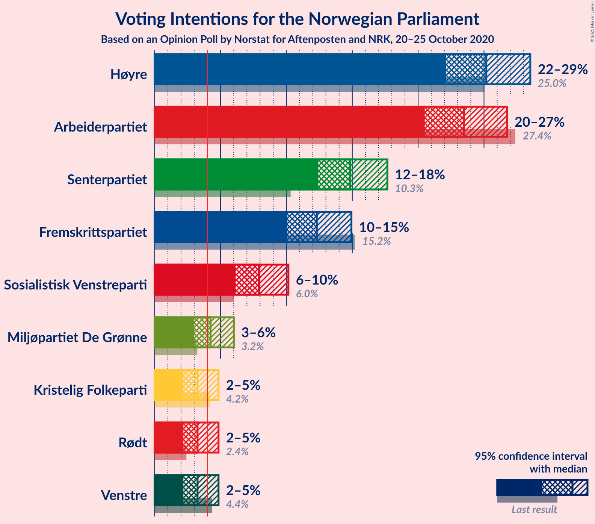

### Confidence Intervals

| Party | Last Result | Poll Result | 80% Confidence Interval | 90% Confidence Interval | 95% Confidence Interval | 99% Confidence Interval |
|:-----:|:-----------:|:-----------:|:-----------------------:|:-----------------------:|:-----------------------:|:-----------------------:|
| Høyre | 25.0% | 25.2% | 23.2–27.4% |22.6–28.0% |22.1–28.5% |21.2–29.6% |
| Arbeiderpartiet | 27.4% | 23.5% | 21.5–25.6% |21.0–26.2% |20.5–26.7% |19.6–27.8% |
| Senterpartiet | 10.3% | 14.9% | 13.2–16.7% |12.8–17.2% |12.4–17.7% |11.7–18.6% |
| Fremskrittspartiet | 15.2% | 12.3% | 10.8–14.0% |10.4–14.5% |10.1–14.9% |9.4–15.8% |
| Sosialistisk Venstreparti | 6.0% | 7.9% | 6.8–9.4% |6.4–9.8% |6.1–10.2% |5.6–10.9% |
| Miljøpartiet De Grønne | 3.2% | 4.2% | 3.4–5.4% |3.2–5.7% |3.0–6.0% |2.6–6.6% |
| Rødt | 2.4% | 3.3% | 2.5–4.3% |2.3–4.6% |2.2–4.8% |1.9–5.4% |
| Venstre | 4.4% | 3.3% | 2.5–4.3% |2.3–4.6% |2.2–4.8% |1.9–5.4% |
| Kristelig Folkeparti | 4.2% | 3.3% | 2.5–4.3% |2.3–4.6% |2.2–4.8% |1.9–5.4% |

*Note:* The poll result column reflects the actual value used in the calculations. Published results may vary slightly, and in addition be rounded to fewer digits.

## Seats

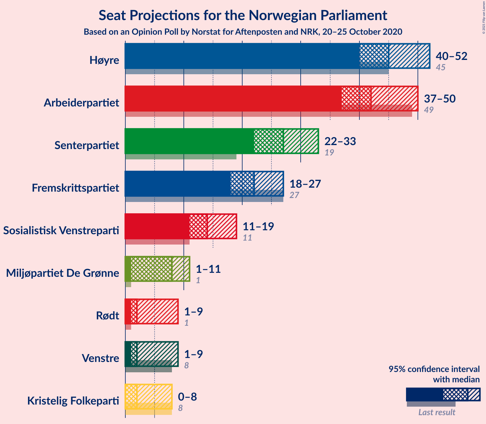

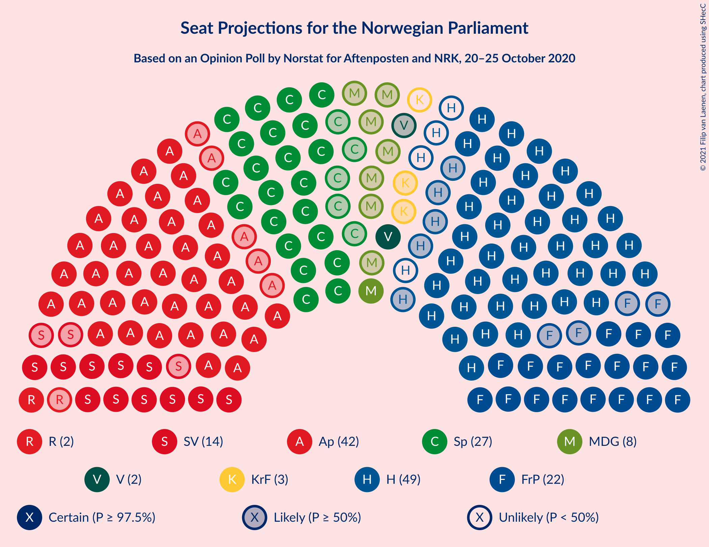

### Confidence Intervals

| Party | Last Result | Median | 80% Confidence Interval | 90% Confidence Interval | 95% Confidence Interval | 99% Confidence Interval |
|:-----:|:-----------:|:------:|:-----------------------:|:-----------------------:|:-----------------------:|:-----------------------:|
| <a href="#høyre">Høyre</a> | 45 | 45 | 42–50 |41–51 |40–52 |37–54 |
| <a href="#arbeiderpartiet">Arbeiderpartiet</a> | 49 | 42 | 40–46 |39–48 |37–50 |36–52 |
| <a href="#senterpartiet">Senterpartiet</a> | 19 | 27 | 24–31 |23–32 |22–33 |21–35 |
| <a href="#fremskrittspartiet">Fremskrittspartiet</a> | 27 | 22 | 20–25 |19–26 |18–27 |17–29 |
| <a href="#sosialistisk-venstreparti">Sosialistisk Venstreparti</a> | 11 | 14 | 12–17 |11–18 |11–19 |10–20 |
| <a href="#miljøpartiet-de-grønne">Miljøpartiet De Grønne</a> | 1 | 8 | 1–10 |1–10 |1–11 |1–12 |
| <a href="#rødt">Rødt</a> | 1 | 2 | 2–8 |2–9 |1–9 |1–9 |
| <a href="#venstre">Venstre</a> | 8 | 2 | 2–8 |1–9 |1–9 |1–10 |
| <a href="#kristelig-folkeparti">Kristelig Folkeparti</a> | 8 | 2 | 1–3 |0–7 |0–8 |0–9 |

### Høyre

*For a full overview of the results for this party, see the [Høyre](party-høyre.html) page.*

| Number of Seats | Probability | Accumulated | Special Marks |
|:---------------:|:-----------:|:-----------:|:-------------:|
| 36 | 0.2% | 100% |  |
| 37 | 0.4% | 99.8% |  |
| 38 | 0.7% | 99.4% |  |
| 39 | 0.9% | 98.7% |  |
| 40 | 2% | 98% |  |
| 41 | 5% | 95% |  |
| 42 | 11% | 90% |  |
| 43 | 9% | 79% |  |
| 44 | 11% | 70% |  |
| 45 | 10% | 59% | Last Result, Median |
| 46 | 10% | 49% |  |
| 47 | 7% | 39% |  |
| 48 | 5% | 32% |  |
| 49 | 15% | 26% |  |
| 50 | 3% | 11% |  |
| 51 | 4% | 8% |  |
| 52 | 2% | 4% |  |
| 53 | 0.8% | 2% |  |
| 54 | 0.5% | 0.9% |  |
| 55 | 0.3% | 0.4% |  |
| 56 | 0.1% | 0.1% |  |
| 57 | 0% | 0.1% |  |
| 58 | 0% | 0% |  |

### Arbeiderpartiet

*For a full overview of the results for this party, see the [Arbeiderpartiet](party-arbeiderpartiet.html) page.*

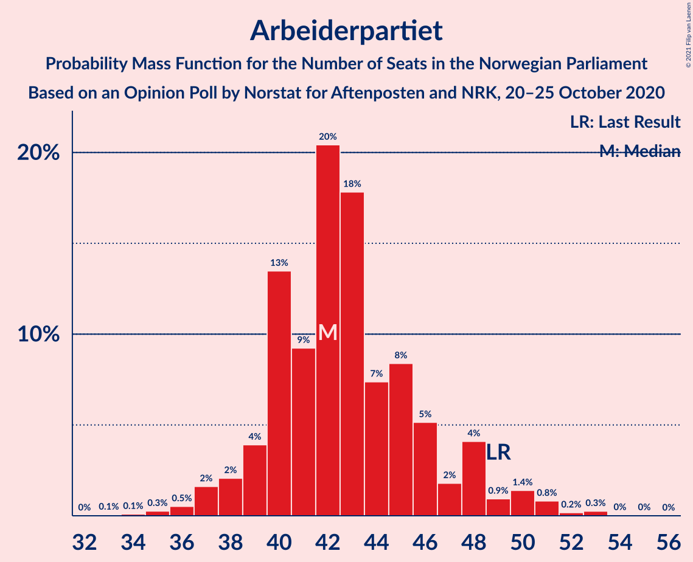

| Number of Seats | Probability | Accumulated | Special Marks |
|:---------------:|:-----------:|:-----------:|:-------------:|
| 33 | 0.1% | 100% |  |
| 34 | 0.1% | 99.9% |  |
| 35 | 0.3% | 99.8% |  |
| 36 | 0.5% | 99.6% |  |
| 37 | 2% | 99.0% |  |
| 38 | 2% | 97% |  |
| 39 | 4% | 95% |  |
| 40 | 13% | 91% |  |
| 41 | 9% | 78% |  |
| 42 | 20% | 69% | Median |
| 43 | 18% | 48% |  |
| 44 | 7% | 30% |  |
| 45 | 8% | 23% |  |
| 46 | 5% | 15% |  |
| 47 | 2% | 10% |  |
| 48 | 4% | 8% |  |
| 49 | 0.9% | 4% | Last Result |
| 50 | 1.4% | 3% |  |
| 51 | 0.8% | 1.3% |  |
| 52 | 0.2% | 0.5% |  |
| 53 | 0.3% | 0.3% |  |
| 54 | 0% | 0.1% |  |
| 55 | 0% | 0% |  |

### Senterpartiet

*For a full overview of the results for this party, see the [Senterpartiet](party-senterpartiet.html) page.*

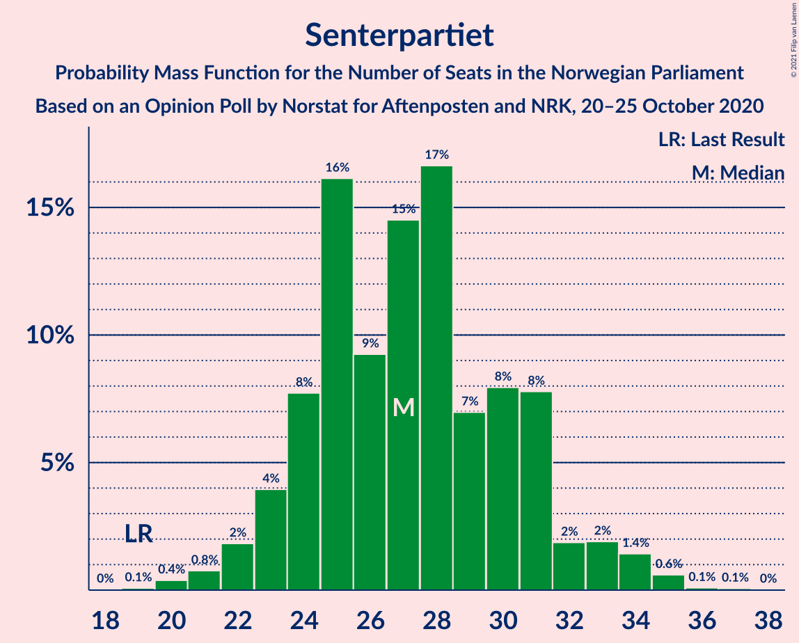

| Number of Seats | Probability | Accumulated | Special Marks |
|:---------------:|:-----------:|:-----------:|:-------------:|
| 19 | 0.1% | 100% | Last Result |
| 20 | 0.4% | 99.9% |  |
| 21 | 0.8% | 99.5% |  |
| 22 | 2% | 98.7% |  |
| 23 | 4% | 97% |  |
| 24 | 8% | 93% |  |
| 25 | 16% | 85% |  |
| 26 | 9% | 69% |  |
| 27 | 15% | 60% | Median |
| 28 | 17% | 45% |  |
| 29 | 7% | 29% |  |
| 30 | 8% | 22% |  |
| 31 | 8% | 14% |  |
| 32 | 2% | 6% |  |
| 33 | 2% | 4% |  |
| 34 | 1.4% | 2% |  |
| 35 | 0.6% | 0.8% |  |
| 36 | 0.1% | 0.2% |  |
| 37 | 0.1% | 0.1% |  |
| 38 | 0% | 0% |  |

### Fremskrittspartiet

*For a full overview of the results for this party, see the [Fremskrittspartiet](party-fremskrittspartiet.html) page.*

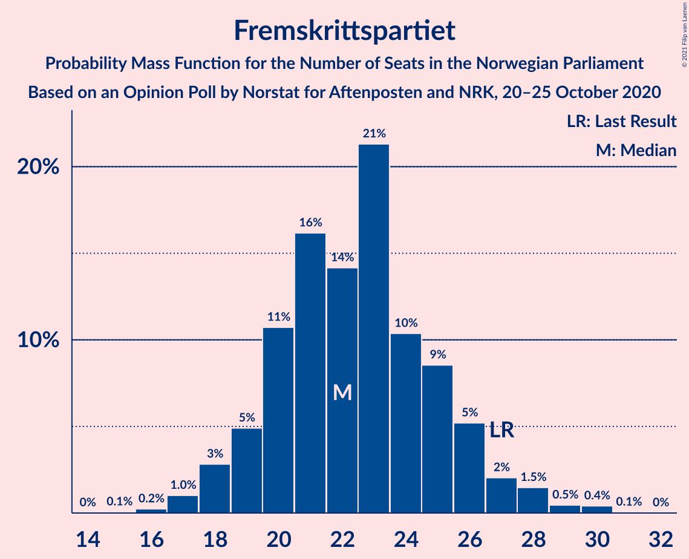

| Number of Seats | Probability | Accumulated | Special Marks |
|:---------------:|:-----------:|:-----------:|:-------------:|
| 15 | 0.1% | 100% |  |
| 16 | 0.2% | 99.9% |  |
| 17 | 1.0% | 99.7% |  |
| 18 | 3% | 98.7% |  |
| 19 | 5% | 96% |  |
| 20 | 11% | 91% |  |
| 21 | 16% | 80% |  |
| 22 | 14% | 64% | Median |
| 23 | 21% | 50% |  |
| 24 | 10% | 29% |  |
| 25 | 9% | 18% |  |
| 26 | 5% | 10% |  |
| 27 | 2% | 4% | Last Result |
| 28 | 1.5% | 2% |  |
| 29 | 0.5% | 0.9% |  |
| 30 | 0.4% | 0.5% |  |
| 31 | 0.1% | 0.1% |  |
| 32 | 0% | 0% |  |

### Sosialistisk Venstreparti

*For a full overview of the results for this party, see the [Sosialistisk Venstreparti](party-sosialistiskvenstreparti.html) page.*

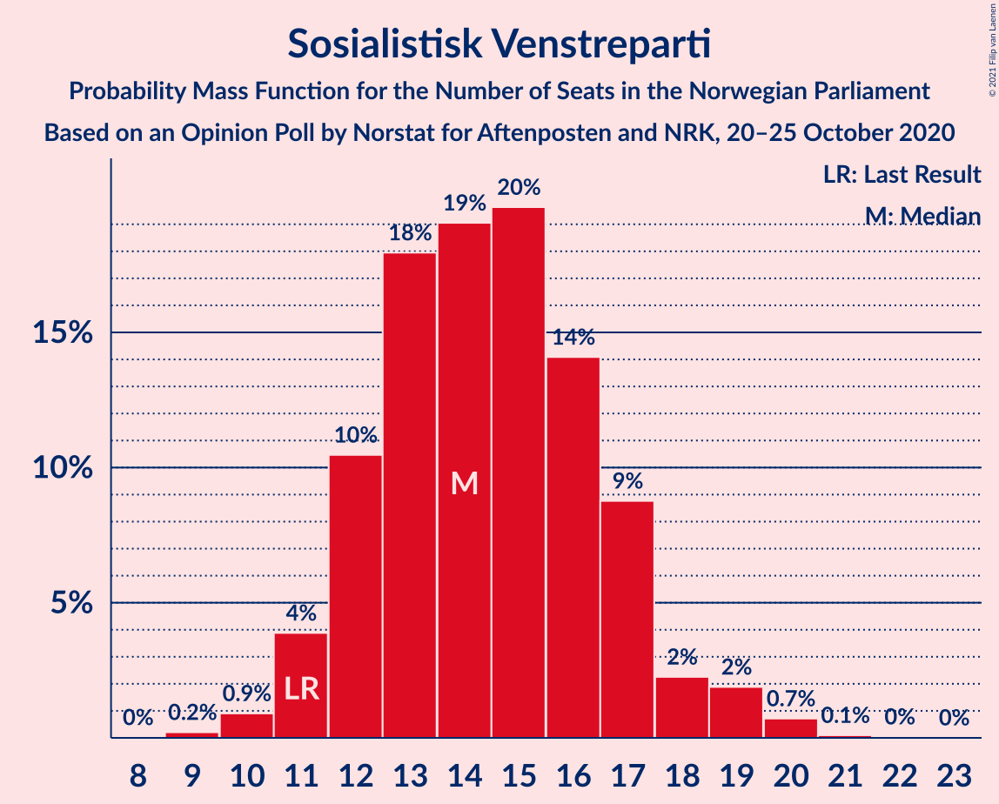

| Number of Seats | Probability | Accumulated | Special Marks |
|:---------------:|:-----------:|:-----------:|:-------------:|
| 9 | 0.2% | 100% |  |
| 10 | 0.9% | 99.8% |  |
| 11 | 4% | 98.9% | Last Result |
| 12 | 10% | 95% |  |
| 13 | 18% | 85% |  |
| 14 | 19% | 67% | Median |
| 15 | 20% | 48% |  |
| 16 | 14% | 28% |  |
| 17 | 9% | 14% |  |
| 18 | 2% | 5% |  |
| 19 | 2% | 3% |  |
| 20 | 0.7% | 0.9% |  |
| 21 | 0.1% | 0.2% |  |
| 22 | 0% | 0.1% |  |
| 23 | 0% | 0% |  |

### Miljøpartiet De Grønne

*For a full overview of the results for this party, see the [Miljøpartiet De Grønne](party-miljøpartietdegrønne.html) page.*

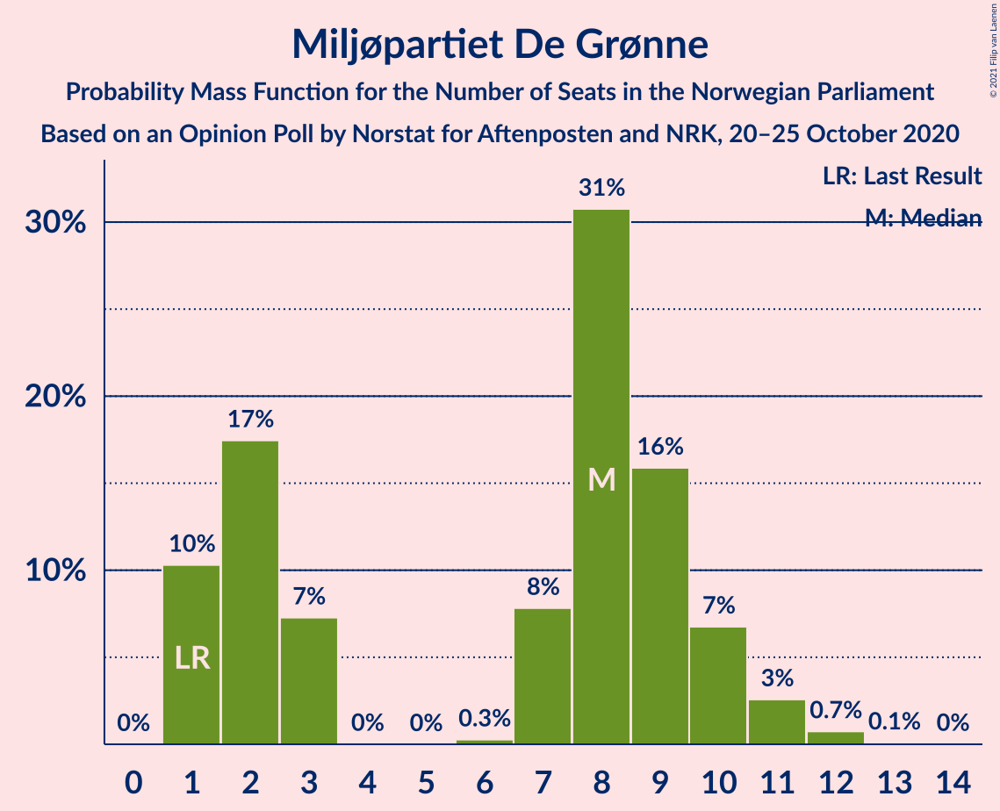

| Number of Seats | Probability | Accumulated | Special Marks |
|:---------------:|:-----------:|:-----------:|:-------------:|
| 1 | 10% | 100% | Last Result |
| 2 | 17% | 90% |  |
| 3 | 7% | 72% |  |
| 4 | 0% | 65% |  |
| 5 | 0% | 65% |  |
| 6 | 0.3% | 65% |  |
| 7 | 8% | 65% |  |
| 8 | 31% | 57% | Median |
| 9 | 16% | 26% |  |
| 10 | 7% | 10% |  |
| 11 | 3% | 3% |  |
| 12 | 0.7% | 0.9% |  |
| 13 | 0.1% | 0.1% |  |
| 14 | 0% | 0% |  |

### Rødt

*For a full overview of the results for this party, see the [Rødt](party-rødt.html) page.*

| Number of Seats | Probability | Accumulated | Special Marks |
|:---------------:|:-----------:|:-----------:|:-------------:|
| 1 | 4% | 100% | Last Result |
| 2 | 55% | 96% | Median |
| 3 | 0% | 41% |  |
| 4 | 0% | 41% |  |
| 5 | 0% | 41% |  |
| 6 | 0.3% | 41% |  |
| 7 | 1.4% | 41% |  |
| 8 | 34% | 39% |  |
| 9 | 5% | 5% |  |
| 10 | 0.1% | 0.1% |  |
| 11 | 0% | 0% |  |

### Venstre

*For a full overview of the results for this party, see the [Venstre](party-venstre.html) page.*

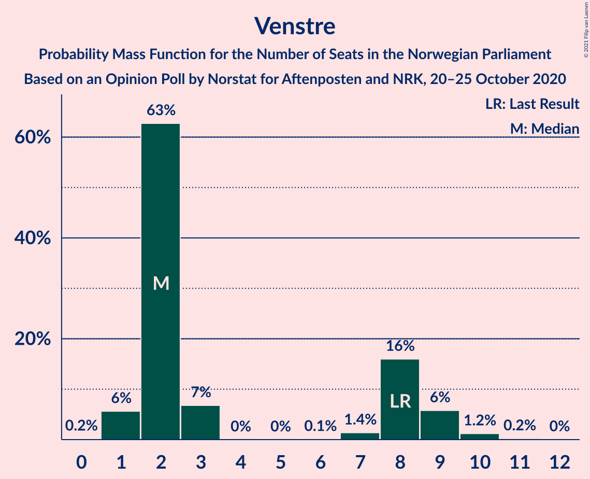

| Number of Seats | Probability | Accumulated | Special Marks |
|:---------------:|:-----------:|:-----------:|:-------------:|
| 0 | 0.2% | 100% |  |
| 1 | 6% | 99.8% |  |
| 2 | 63% | 94% | Median |
| 3 | 7% | 31% |  |
| 4 | 0% | 25% |  |
| 5 | 0% | 25% |  |
| 6 | 0.1% | 25% |  |
| 7 | 1.4% | 25% |  |
| 8 | 16% | 23% | Last Result |
| 9 | 6% | 7% |  |
| 10 | 1.2% | 1.4% |  |
| 11 | 0.2% | 0.3% |  |
| 12 | 0% | 0% |  |

### Kristelig Folkeparti

*For a full overview of the results for this party, see the [Kristelig Folkeparti](party-kristeligfolkeparti.html) page.*

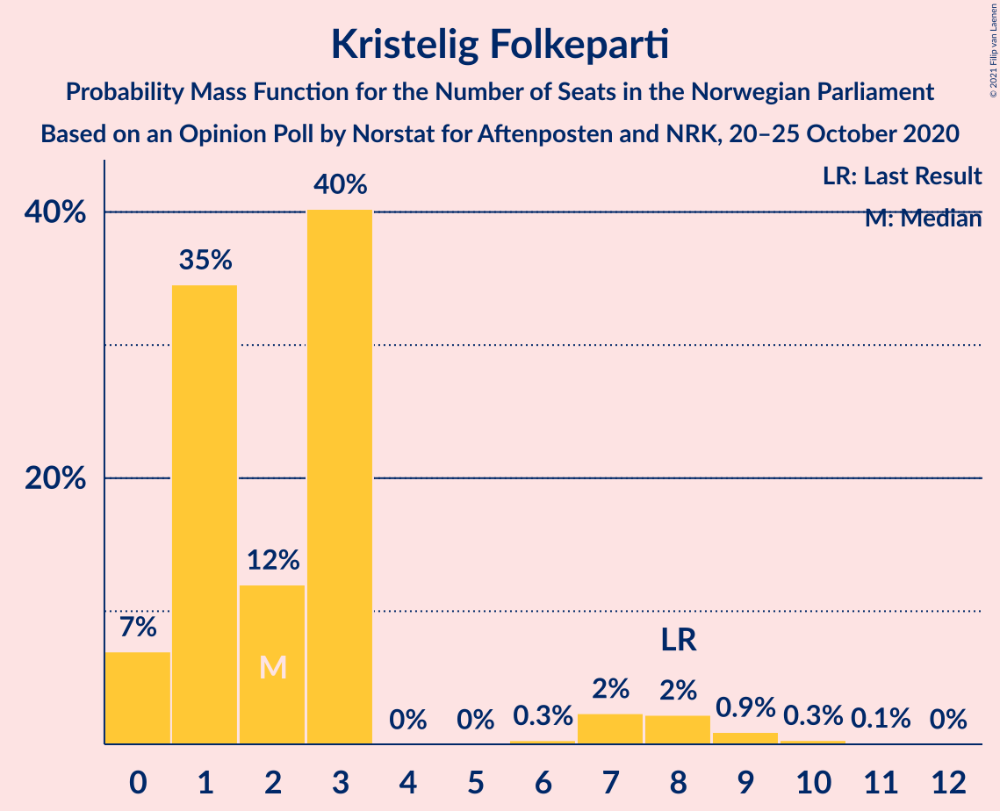

| Number of Seats | Probability | Accumulated | Special Marks |
|:---------------:|:-----------:|:-----------:|:-------------:|
| 0 | 7% | 100% |  |
| 1 | 35% | 93% |  |
| 2 | 12% | 58% | Median |
| 3 | 40% | 46% |  |
| 4 | 0% | 6% |  |
| 5 | 0% | 6% |  |
| 6 | 0.3% | 6% |  |
| 7 | 2% | 6% |  |
| 8 | 2% | 4% | Last Result |
| 9 | 0.9% | 1.4% |  |
| 10 | 0.3% | 0.5% |  |
| 11 | 0.1% | 0.1% |  |
| 12 | 0% | 0% |  |

## Coalitions

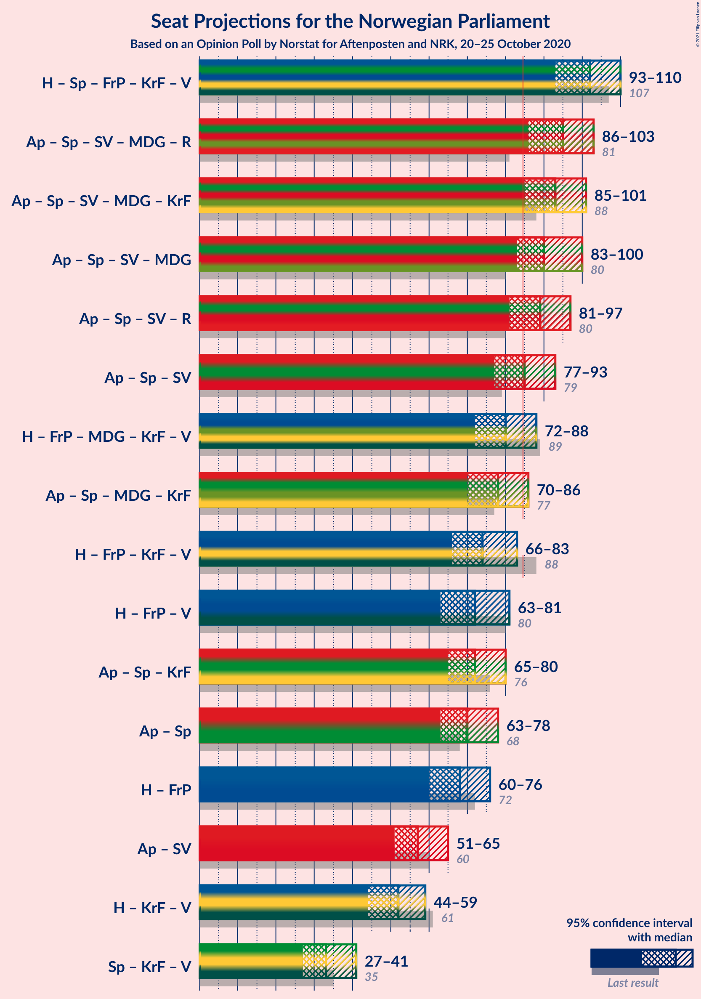

### Confidence Intervals

| Coalition | Last Result | Median | Majority? | 80% Confidence Interval | 90% Confidence Interval | 95% Confidence Interval | 99% Confidence Interval |
|:---------:|:-----------:|:------:|:---------:|:-----------------------:|:-----------------------:|:-----------------------:|:-----------------------:|
| Høyre – Senterpartiet – Fremskrittspartiet – Kristelig Folkeparti – Venstre | 107 | 102 | 100% | 96–107 | 94–108 | 93–110 | 90–112 |
| Arbeiderpartiet – Senterpartiet – Sosialistisk Venstreparti – Miljøpartiet De Grønne – Rødt | 81 | 95 | 99.2% | 90–101 | 88–102 | 86–103 | 84–106 |
| Arbeiderpartiet – Senterpartiet – Sosialistisk Venstreparti – Miljøpartiet De Grønne – Kristelig Folkeparti | 88 | 93 | 98% | 88–98 | 86–100 | 85–101 | 82–103 |
| Arbeiderpartiet – Senterpartiet – Sosialistisk Venstreparti – Miljøpartiet De Grønne | 80 | 90 | 93% | 86–96 | 84–98 | 83–100 | 79–102 |
| Arbeiderpartiet – Senterpartiet – Sosialistisk Venstreparti – Rødt | 80 | 89 | 80% | 83–94 | 82–96 | 81–97 | 78–100 |
| Arbeiderpartiet – Senterpartiet – Sosialistisk Venstreparti | 79 | 85 | 50% | 80–89 | 78–92 | 77–93 | 74–95 |
| Høyre – Fremskrittspartiet – Miljøpartiet De Grønne – Kristelig Folkeparti – Venstre | 89 | 80 | 20% | 75–86 | 73–87 | 72–88 | 69–91 |
| Arbeiderpartiet – Senterpartiet – Miljøpartiet De Grønne – Kristelig Folkeparti | 77 | 78 | 7% | 74–84 | 72–85 | 70–86 | 68–89 |
| Høyre – Fremskrittspartiet – Kristelig Folkeparti – Venstre | 88 | 74 | 0.8% | 68–79 | 67–81 | 66–83 | 63–85 |
| Høyre – Fremskrittspartiet – Venstre | 80 | 72 | 0.2% | 65–77 | 65–80 | 63–81 | 61–83 |
| Arbeiderpartiet – Senterpartiet – Kristelig Folkeparti | 76 | 72 | 0.2% | 67–77 | 66–79 | 65–80 | 63–83 |
| Arbeiderpartiet – Senterpartiet | 68 | 70 | 0% | 65–75 | 64–76 | 63–78 | 61–80 |
| Høyre – Fremskrittspartiet | 72 | 68 | 0% | 63–74 | 62–74 | 60–76 | 58–78 |
| Arbeiderpartiet – Sosialistisk Venstreparti | 60 | 57 | 0% | 53–62 | 52–63 | 51–65 | 49–67 |
| Høyre – Kristelig Folkeparti – Venstre | 61 | 52 | 0% | 46–56 | 45–58 | 44–59 | 42–62 |
| Senterpartiet – Kristelig Folkeparti – Venstre | 35 | 33 | 0% | 28–39 | 27–41 | 27–41 | 25–43 |

### Høyre – Senterpartiet – Fremskrittspartiet – Kristelig Folkeparti – Venstre

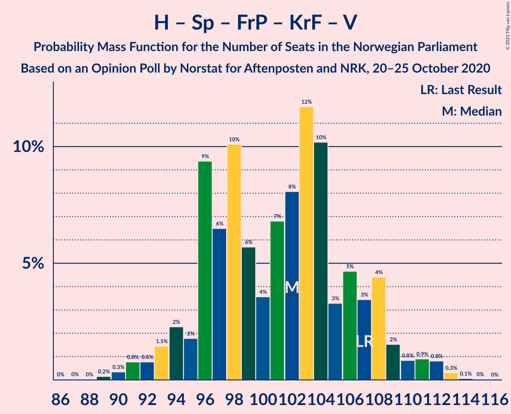

| Number of Seats | Probability | Accumulated | Special Marks |
|:---------------:|:-----------:|:-----------:|:-------------:|
| 86 | 0% | 100% |  |
| 87 | 0% | 99.9% |  |
| 88 | 0% | 99.9% |  |
| 89 | 0.2% | 99.9% |  |
| 90 | 0.3% | 99.7% |  |
| 91 | 0.8% | 99.4% |  |
| 92 | 0.8% | 98.6% |  |
| 93 | 1.5% | 98% |  |
| 94 | 2% | 96% |  |
| 95 | 2% | 94% |  |
| 96 | 9% | 92% |  |
| 97 | 6% | 83% |  |
| 98 | 10% | 76% | Median |
| 99 | 6% | 66% |  |
| 100 | 4% | 61% |  |
| 101 | 7% | 57% |  |
| 102 | 8% | 50% |  |
| 103 | 12% | 42% |  |
| 104 | 10% | 31% |  |
| 105 | 3% | 20% |  |
| 106 | 5% | 17% |  |
| 107 | 3% | 12% | Last Result |
| 108 | 4% | 9% |  |
| 109 | 2% | 5% |  |
| 110 | 0.8% | 3% |  |
| 111 | 0.9% | 2% |  |
| 112 | 0.8% | 1.2% |  |
| 113 | 0.3% | 0.4% |  |
| 114 | 0.1% | 0.1% |  |
| 115 | 0% | 0.1% |  |
| 116 | 0% | 0% |  |

### Arbeiderpartiet – Senterpartiet – Sosialistisk Venstreparti – Miljøpartiet De Grønne – Rødt

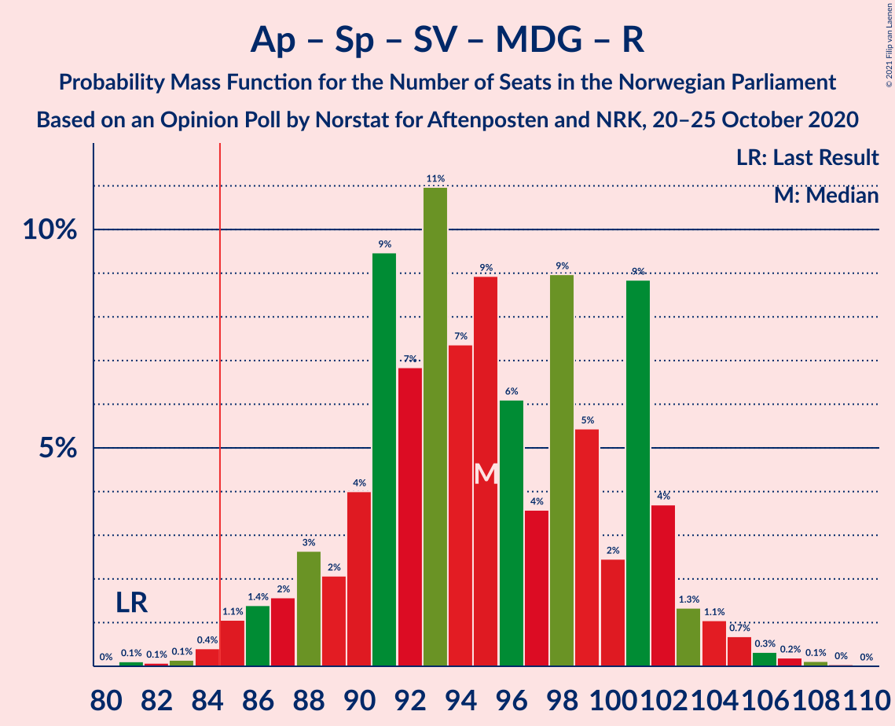

| Number of Seats | Probability | Accumulated | Special Marks |
|:---------------:|:-----------:|:-----------:|:-------------:|
| 81 | 0.1% | 100% | Last Result |
| 82 | 0.1% | 99.9% |  |
| 83 | 0.1% | 99.8% |  |
| 84 | 0.4% | 99.6% |  |
| 85 | 1.1% | 99.2% | Majority |
| 86 | 1.4% | 98% |  |
| 87 | 2% | 97% |  |
| 88 | 3% | 95% |  |
| 89 | 2% | 93% |  |
| 90 | 4% | 90% |  |
| 91 | 9% | 86% |  |
| 92 | 7% | 77% |  |
| 93 | 11% | 70% | Median |
| 94 | 7% | 59% |  |
| 95 | 9% | 52% |  |
| 96 | 6% | 43% |  |
| 97 | 4% | 37% |  |
| 98 | 9% | 33% |  |
| 99 | 5% | 24% |  |
| 100 | 2% | 19% |  |
| 101 | 9% | 16% |  |
| 102 | 4% | 7% |  |
| 103 | 1.3% | 4% |  |
| 104 | 1.1% | 2% |  |
| 105 | 0.7% | 1.4% |  |
| 106 | 0.3% | 0.7% |  |
| 107 | 0.2% | 0.4% |  |
| 108 | 0.1% | 0.2% |  |
| 109 | 0% | 0.1% |  |
| 110 | 0% | 0% |  |

### Arbeiderpartiet – Senterpartiet – Sosialistisk Venstreparti – Miljøpartiet De Grønne – Kristelig Folkeparti

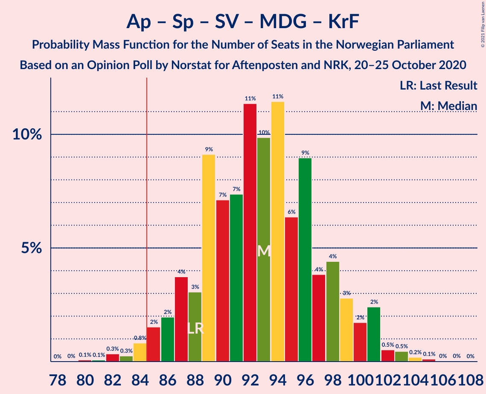

| Number of Seats | Probability | Accumulated | Special Marks |
|:---------------:|:-----------:|:-----------:|:-------------:|
| 80 | 0.1% | 100% |  |
| 81 | 0.1% | 99.9% |  |
| 82 | 0.3% | 99.8% |  |
| 83 | 0.3% | 99.5% |  |
| 84 | 0.8% | 99.2% |  |
| 85 | 2% | 98% | Majority |
| 86 | 2% | 97% |  |
| 87 | 4% | 95% |  |
| 88 | 3% | 91% | Last Result |
| 89 | 9% | 88% |  |
| 90 | 7% | 79% |  |
| 91 | 7% | 72% |  |
| 92 | 11% | 65% |  |
| 93 | 10% | 53% | Median |
| 94 | 11% | 43% |  |
| 95 | 6% | 32% |  |
| 96 | 9% | 25% |  |
| 97 | 4% | 17% |  |
| 98 | 4% | 13% |  |
| 99 | 3% | 8% |  |
| 100 | 2% | 5% |  |
| 101 | 2% | 4% |  |
| 102 | 0.5% | 1.3% |  |
| 103 | 0.5% | 0.8% |  |
| 104 | 0.2% | 0.4% |  |
| 105 | 0.1% | 0.2% |  |
| 106 | 0% | 0.1% |  |
| 107 | 0% | 0% |  |

### Arbeiderpartiet – Senterpartiet – Sosialistisk Venstreparti – Miljøpartiet De Grønne

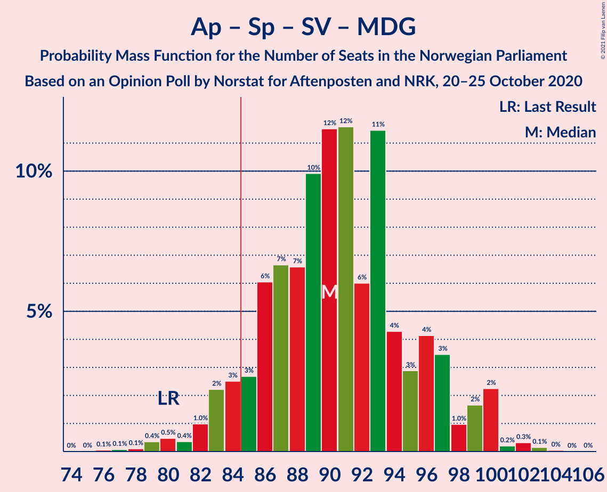

| Number of Seats | Probability | Accumulated | Special Marks |
|:---------------:|:-----------:|:-----------:|:-------------:|
| 76 | 0.1% | 100% |  |
| 77 | 0.1% | 99.9% |  |
| 78 | 0.1% | 99.8% |  |
| 79 | 0.4% | 99.7% |  |
| 80 | 0.5% | 99.4% | Last Result |
| 81 | 0.4% | 98.9% |  |
| 82 | 1.0% | 98.6% |  |
| 83 | 2% | 98% |  |
| 84 | 3% | 95% |  |
| 85 | 3% | 93% | Majority |
| 86 | 6% | 90% |  |
| 87 | 7% | 84% |  |
| 88 | 7% | 77% |  |
| 89 | 10% | 71% |  |
| 90 | 12% | 61% |  |
| 91 | 12% | 49% | Median |
| 92 | 6% | 38% |  |
| 93 | 11% | 32% |  |
| 94 | 4% | 20% |  |
| 95 | 3% | 16% |  |
| 96 | 4% | 13% |  |
| 97 | 3% | 9% |  |
| 98 | 1.0% | 6% |  |
| 99 | 2% | 5% |  |
| 100 | 2% | 3% |  |
| 101 | 0.2% | 0.7% |  |
| 102 | 0.3% | 0.5% |  |
| 103 | 0.1% | 0.2% |  |
| 104 | 0% | 0.1% |  |
| 105 | 0% | 0% |  |

### Arbeiderpartiet – Senterpartiet – Sosialistisk Venstreparti – Rødt

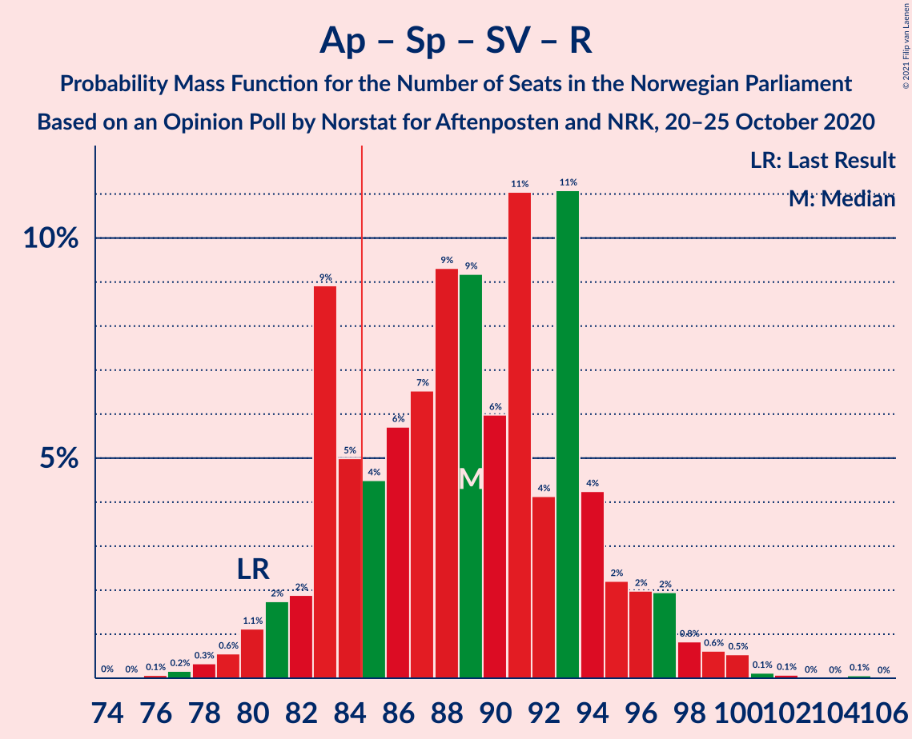

| Number of Seats | Probability | Accumulated | Special Marks |
|:---------------:|:-----------:|:-----------:|:-------------:|
| 75 | 0% | 100% |  |
| 76 | 0.1% | 99.9% |  |
| 77 | 0.2% | 99.9% |  |
| 78 | 0.3% | 99.7% |  |
| 79 | 0.6% | 99.4% |  |
| 80 | 1.1% | 98.8% | Last Result |
| 81 | 2% | 98% |  |
| 82 | 2% | 96% |  |
| 83 | 9% | 94% |  |
| 84 | 5% | 85% |  |
| 85 | 4% | 80% | Median, Majority |
| 86 | 6% | 76% |  |
| 87 | 7% | 70% |  |
| 88 | 9% | 63% |  |
| 89 | 9% | 54% |  |
| 90 | 6% | 45% |  |
| 91 | 11% | 39% |  |
| 92 | 4% | 28% |  |
| 93 | 11% | 24% |  |
| 94 | 4% | 13% |  |
| 95 | 2% | 8% |  |
| 96 | 2% | 6% |  |
| 97 | 2% | 4% |  |
| 98 | 0.8% | 2% |  |
| 99 | 0.6% | 1.4% |  |
| 100 | 0.5% | 0.8% |  |
| 101 | 0.1% | 0.3% |  |
| 102 | 0.1% | 0.2% |  |
| 103 | 0% | 0.1% |  |
| 104 | 0% | 0.1% |  |
| 105 | 0.1% | 0.1% |  |
| 106 | 0% | 0% |  |

### Arbeiderpartiet – Senterpartiet – Sosialistisk Venstreparti

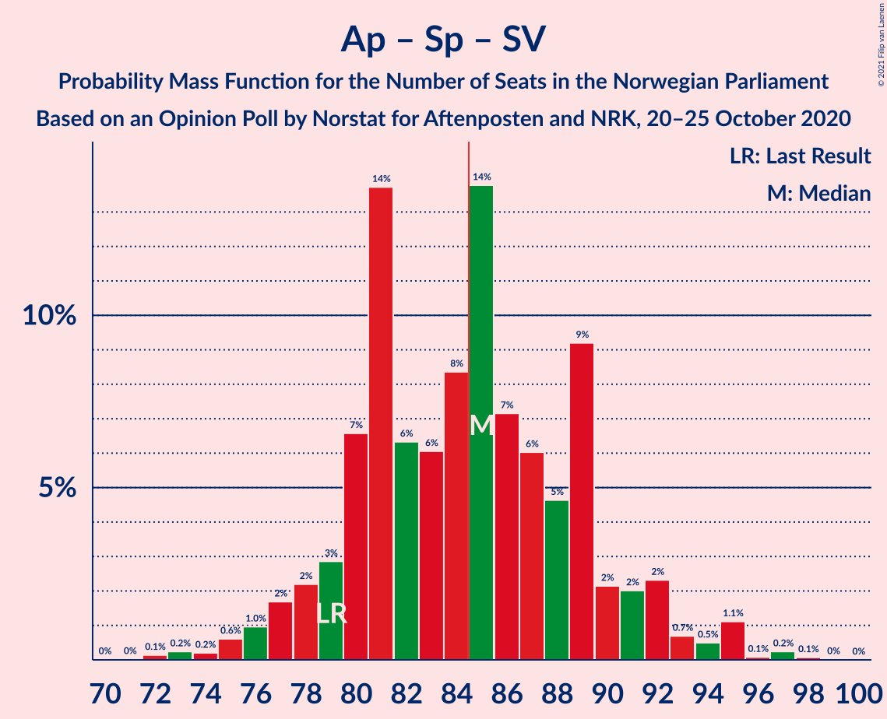

| Number of Seats | Probability | Accumulated | Special Marks |
|:---------------:|:-----------:|:-----------:|:-------------:|
| 72 | 0.1% | 100% |  |
| 73 | 0.2% | 99.8% |  |
| 74 | 0.2% | 99.6% |  |
| 75 | 0.6% | 99.4% |  |
| 76 | 1.0% | 98.8% |  |
| 77 | 2% | 98% |  |
| 78 | 2% | 96% |  |
| 79 | 3% | 94% | Last Result |
| 80 | 7% | 91% |  |
| 81 | 14% | 84% |  |
| 82 | 6% | 71% |  |
| 83 | 6% | 64% | Median |
| 84 | 8% | 58% |  |
| 85 | 14% | 50% | Majority |
| 86 | 7% | 36% |  |
| 87 | 6% | 29% |  |
| 88 | 5% | 23% |  |
| 89 | 9% | 18% |  |
| 90 | 2% | 9% |  |
| 91 | 2% | 7% |  |
| 92 | 2% | 5% |  |
| 93 | 0.7% | 3% |  |
| 94 | 0.5% | 2% |  |
| 95 | 1.1% | 2% |  |
| 96 | 0.1% | 0.4% |  |
| 97 | 0.2% | 0.3% |  |
| 98 | 0.1% | 0.1% |  |
| 99 | 0% | 0% |  |

### Høyre – Fremskrittspartiet – Miljøpartiet De Grønne – Kristelig Folkeparti – Venstre

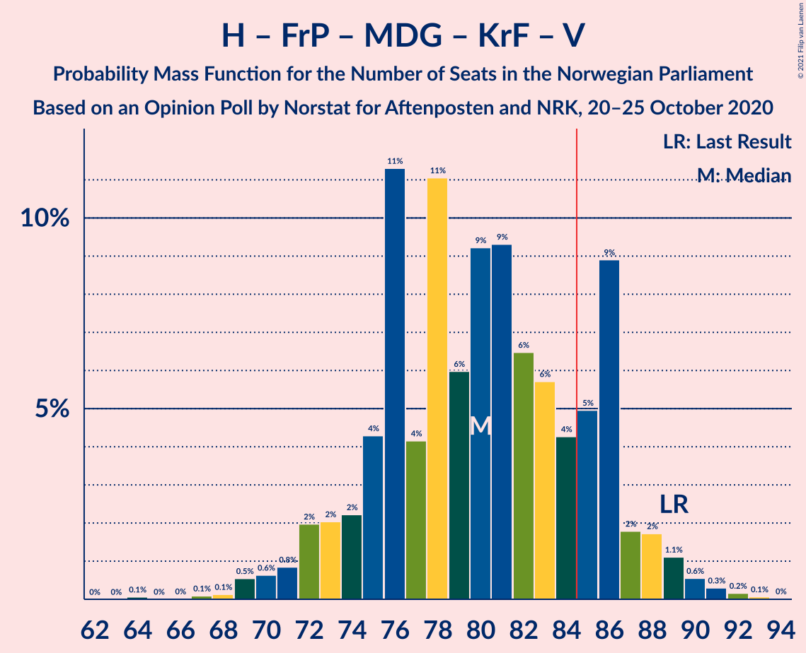

| Number of Seats | Probability | Accumulated | Special Marks |
|:---------------:|:-----------:|:-----------:|:-------------:|
| 64 | 0.1% | 100% |  |
| 65 | 0% | 99.9% |  |
| 66 | 0% | 99.9% |  |
| 67 | 0.1% | 99.9% |  |
| 68 | 0.1% | 99.8% |  |
| 69 | 0.5% | 99.7% |  |
| 70 | 0.6% | 99.1% |  |
| 71 | 0.8% | 98.5% |  |
| 72 | 2% | 98% |  |
| 73 | 2% | 96% |  |
| 74 | 2% | 94% |  |
| 75 | 4% | 91% |  |
| 76 | 11% | 87% |  |
| 77 | 4% | 76% |  |
| 78 | 11% | 72% |  |
| 79 | 6% | 61% | Median |
| 80 | 9% | 55% |  |
| 81 | 9% | 45% |  |
| 82 | 6% | 36% |  |
| 83 | 6% | 30% |  |
| 84 | 4% | 24% |  |
| 85 | 5% | 20% | Majority |
| 86 | 9% | 15% |  |
| 87 | 2% | 6% |  |
| 88 | 2% | 4% |  |
| 89 | 1.1% | 2% | Last Result |
| 90 | 0.6% | 1.1% |  |
| 91 | 0.3% | 0.6% |  |
| 92 | 0.2% | 0.3% |  |
| 93 | 0.1% | 0.1% |  |
| 94 | 0% | 0% |  |

### Arbeiderpartiet – Senterpartiet – Miljøpartiet De Grønne – Kristelig Folkeparti

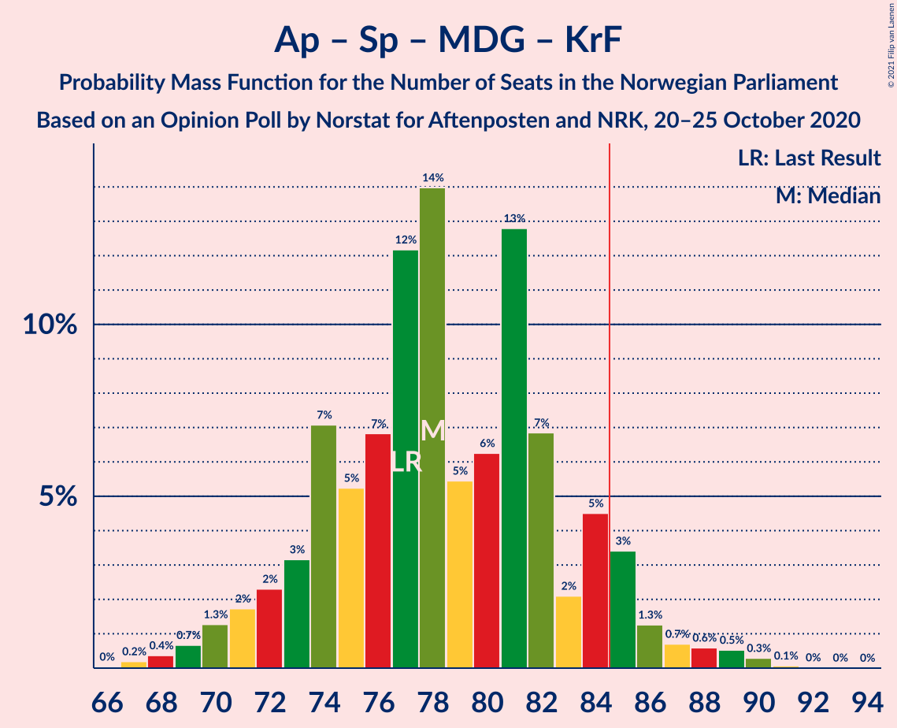

| Number of Seats | Probability | Accumulated | Special Marks |
|:---------------:|:-----------:|:-----------:|:-------------:|
| 66 | 0% | 100% |  |
| 67 | 0.2% | 99.9% |  |
| 68 | 0.4% | 99.7% |  |
| 69 | 0.7% | 99.3% |  |
| 70 | 1.3% | 98.7% |  |
| 71 | 2% | 97% |  |
| 72 | 2% | 96% |  |
| 73 | 3% | 93% |  |
| 74 | 7% | 90% |  |
| 75 | 5% | 83% |  |
| 76 | 7% | 78% |  |
| 77 | 12% | 71% | Last Result |
| 78 | 14% | 59% |  |
| 79 | 5% | 45% | Median |
| 80 | 6% | 39% |  |
| 81 | 13% | 33% |  |
| 82 | 7% | 20% |  |
| 83 | 2% | 14% |  |
| 84 | 5% | 11% |  |
| 85 | 3% | 7% | Majority |
| 86 | 1.3% | 4% |  |
| 87 | 0.7% | 2% |  |
| 88 | 0.6% | 2% |  |
| 89 | 0.5% | 1.0% |  |
| 90 | 0.3% | 0.4% |  |
| 91 | 0.1% | 0.1% |  |
| 92 | 0% | 0.1% |  |
| 93 | 0% | 0% |  |

### Høyre – Fremskrittspartiet – Kristelig Folkeparti – Venstre

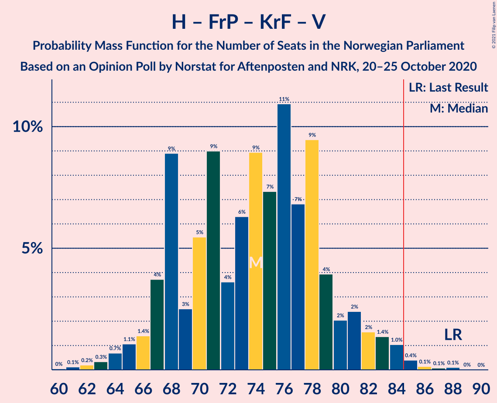

| Number of Seats | Probability | Accumulated | Special Marks |
|:---------------:|:-----------:|:-----------:|:-------------:|
| 60 | 0% | 100% |  |
| 61 | 0.1% | 99.9% |  |
| 62 | 0.2% | 99.8% |  |
| 63 | 0.3% | 99.6% |  |
| 64 | 0.7% | 99.3% |  |
| 65 | 1.1% | 98.6% |  |
| 66 | 1.4% | 98% |  |
| 67 | 4% | 96% |  |
| 68 | 9% | 92% |  |
| 69 | 3% | 83% |  |
| 70 | 5% | 81% |  |
| 71 | 9% | 76% | Median |
| 72 | 4% | 67% |  |
| 73 | 6% | 63% |  |
| 74 | 9% | 57% |  |
| 75 | 7% | 48% |  |
| 76 | 11% | 40% |  |
| 77 | 7% | 29% |  |
| 78 | 9% | 23% |  |
| 79 | 4% | 13% |  |
| 80 | 2% | 9% |  |
| 81 | 2% | 7% |  |
| 82 | 2% | 5% |  |
| 83 | 1.4% | 3% |  |
| 84 | 1.0% | 2% |  |
| 85 | 0.4% | 0.8% | Majority |
| 86 | 0.1% | 0.4% |  |
| 87 | 0.1% | 0.2% |  |
| 88 | 0.1% | 0.1% | Last Result |
| 89 | 0% | 0% |  |

### Høyre – Fremskrittspartiet – Venstre

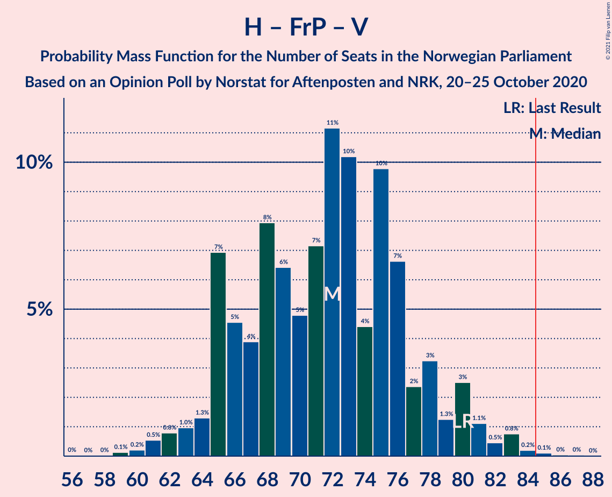

| Number of Seats | Probability | Accumulated | Special Marks |
|:---------------:|:-----------:|:-----------:|:-------------:|
| 57 | 0% | 100% |  |
| 58 | 0% | 99.9% |  |
| 59 | 0.1% | 99.9% |  |
| 60 | 0.2% | 99.8% |  |
| 61 | 0.5% | 99.6% |  |
| 62 | 0.8% | 99.0% |  |
| 63 | 1.0% | 98% |  |
| 64 | 1.3% | 97% |  |
| 65 | 7% | 96% |  |
| 66 | 5% | 89% |  |
| 67 | 4% | 84% |  |
| 68 | 8% | 81% |  |
| 69 | 6% | 73% | Median |
| 70 | 5% | 66% |  |
| 71 | 7% | 61% |  |
| 72 | 11% | 54% |  |
| 73 | 10% | 43% |  |
| 74 | 4% | 33% |  |
| 75 | 10% | 29% |  |
| 76 | 7% | 19% |  |
| 77 | 2% | 12% |  |
| 78 | 3% | 10% |  |
| 79 | 1.3% | 6% |  |
| 80 | 3% | 5% | Last Result |
| 81 | 1.1% | 3% |  |
| 82 | 0.5% | 2% |  |
| 83 | 0.8% | 1.2% |  |
| 84 | 0.2% | 0.4% |  |
| 85 | 0.1% | 0.2% | Majority |
| 86 | 0% | 0.1% |  |
| 87 | 0% | 0% |  |

### Arbeiderpartiet – Senterpartiet – Kristelig Folkeparti

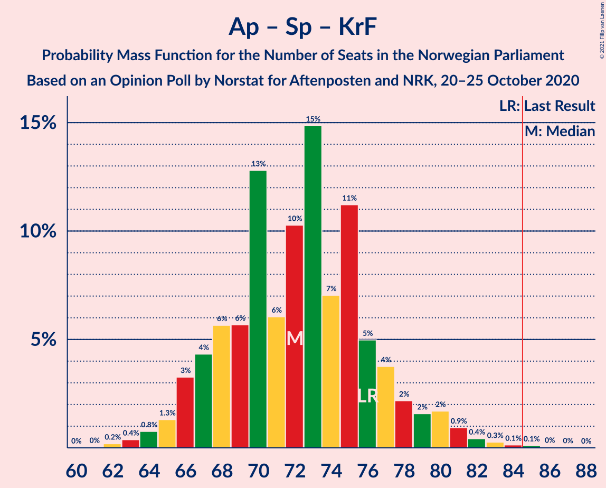

| Number of Seats | Probability | Accumulated | Special Marks |
|:---------------:|:-----------:|:-----------:|:-------------:|
| 61 | 0% | 100% |  |
| 62 | 0.2% | 99.9% |  |
| 63 | 0.4% | 99.7% |  |
| 64 | 0.8% | 99.4% |  |
| 65 | 1.3% | 98.6% |  |
| 66 | 3% | 97% |  |
| 67 | 4% | 94% |  |
| 68 | 6% | 90% |  |
| 69 | 6% | 84% |  |
| 70 | 13% | 78% |  |
| 71 | 6% | 66% | Median |
| 72 | 10% | 60% |  |
| 73 | 15% | 49% |  |
| 74 | 7% | 34% |  |
| 75 | 11% | 27% |  |
| 76 | 5% | 16% | Last Result |
| 77 | 4% | 11% |  |
| 78 | 2% | 7% |  |
| 79 | 2% | 5% |  |
| 80 | 2% | 4% |  |
| 81 | 0.9% | 2% |  |
| 82 | 0.4% | 1.0% |  |
| 83 | 0.3% | 0.6% |  |
| 84 | 0.1% | 0.3% |  |
| 85 | 0.1% | 0.2% | Majority |
| 86 | 0% | 0.1% |  |
| 87 | 0% | 0% |  |

### Arbeiderpartiet – Senterpartiet

| Number of Seats | Probability | Accumulated | Special Marks |
|:---------------:|:-----------:|:-----------:|:-------------:|
| 59 | 0.1% | 100% |  |
| 60 | 0.2% | 99.8% |  |
| 61 | 0.5% | 99.7% |  |
| 62 | 0.8% | 99.2% |  |
| 63 | 1.2% | 98% |  |
| 64 | 3% | 97% |  |
| 65 | 5% | 95% |  |
| 66 | 5% | 90% |  |
| 67 | 14% | 85% |  |
| 68 | 6% | 71% | Last Result |
| 69 | 10% | 65% | Median |
| 70 | 14% | 54% |  |
| 71 | 8% | 41% |  |
| 72 | 10% | 32% |  |
| 73 | 4% | 23% |  |
| 74 | 7% | 18% |  |
| 75 | 4% | 11% |  |
| 76 | 3% | 8% |  |
| 77 | 1.3% | 4% |  |
| 78 | 0.8% | 3% |  |
| 79 | 1.2% | 2% |  |
| 80 | 0.7% | 1.1% |  |
| 81 | 0.1% | 0.4% |  |
| 82 | 0.2% | 0.3% |  |
| 83 | 0.1% | 0.1% |  |
| 84 | 0% | 0% |  |

### Høyre – Fremskrittspartiet

| Number of Seats | Probability | Accumulated | Special Marks |
|:---------------:|:-----------:|:-----------:|:-------------:|
| 55 | 0.1% | 100% |  |
| 56 | 0.1% | 99.9% |  |
| 57 | 0.2% | 99.8% |  |
| 58 | 0.3% | 99.6% |  |
| 59 | 0.9% | 99.4% |  |
| 60 | 1.3% | 98% |  |
| 61 | 1.0% | 97% |  |
| 62 | 2% | 96% |  |
| 63 | 8% | 94% |  |
| 64 | 8% | 85% |  |
| 65 | 7% | 77% |  |
| 66 | 10% | 70% |  |
| 67 | 7% | 60% | Median |
| 68 | 7% | 53% |  |
| 69 | 7% | 47% |  |
| 70 | 8% | 39% |  |
| 71 | 9% | 31% |  |
| 72 | 9% | 22% | Last Result |
| 73 | 3% | 13% |  |
| 74 | 6% | 11% |  |
| 75 | 2% | 5% |  |
| 76 | 1.4% | 3% |  |
| 77 | 0.7% | 2% |  |
| 78 | 0.6% | 1.0% |  |
| 79 | 0.3% | 0.4% |  |
| 80 | 0% | 0.1% |  |
| 81 | 0.1% | 0.1% |  |
| 82 | 0% | 0% |  |

### Arbeiderpartiet – Sosialistisk Venstreparti

| Number of Seats | Probability | Accumulated | Special Marks |
|:---------------:|:-----------:|:-----------:|:-------------:|
| 46 | 0% | 100% |  |
| 47 | 0.1% | 99.9% |  |
| 48 | 0.3% | 99.9% |  |
| 49 | 0.4% | 99.6% |  |
| 50 | 2% | 99.2% |  |
| 51 | 2% | 98% |  |
| 52 | 2% | 95% |  |
| 53 | 4% | 93% |  |
| 54 | 8% | 89% |  |
| 55 | 11% | 81% |  |
| 56 | 18% | 70% | Median |
| 57 | 13% | 52% |  |
| 58 | 9% | 39% |  |
| 59 | 7% | 30% |  |
| 60 | 5% | 23% | Last Result |
| 61 | 8% | 18% |  |
| 62 | 4% | 10% |  |
| 63 | 2% | 6% |  |
| 64 | 0.8% | 4% |  |
| 65 | 1.3% | 3% |  |
| 66 | 1.2% | 2% |  |
| 67 | 0.3% | 0.6% |  |
| 68 | 0.1% | 0.3% |  |
| 69 | 0.1% | 0.2% |  |
| 70 | 0% | 0.1% |  |
| 71 | 0% | 0% |  |

### Høyre – Kristelig Folkeparti – Venstre

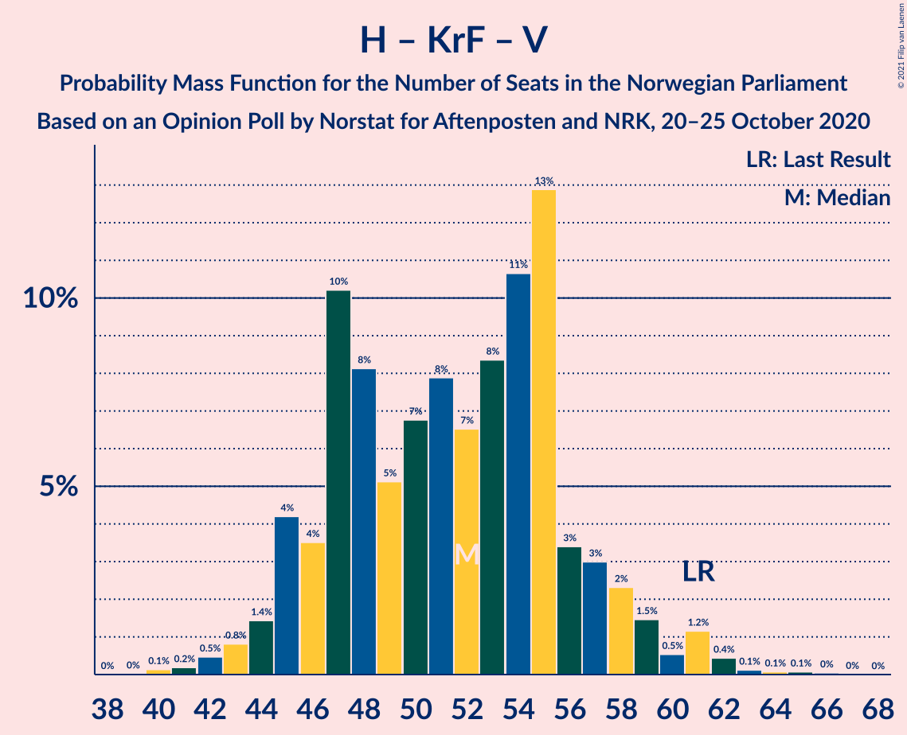

| Number of Seats | Probability | Accumulated | Special Marks |
|:---------------:|:-----------:|:-----------:|:-------------:|
| 40 | 0.1% | 100% |  |
| 41 | 0.2% | 99.8% |  |
| 42 | 0.5% | 99.6% |  |
| 43 | 0.8% | 99.2% |  |
| 44 | 1.4% | 98% |  |
| 45 | 4% | 97% |  |
| 46 | 4% | 93% |  |
| 47 | 10% | 89% |  |
| 48 | 8% | 79% |  |
| 49 | 5% | 71% | Median |
| 50 | 7% | 66% |  |
| 51 | 8% | 59% |  |
| 52 | 7% | 51% |  |
| 53 | 8% | 45% |  |
| 54 | 11% | 36% |  |
| 55 | 13% | 26% |  |
| 56 | 3% | 13% |  |
| 57 | 3% | 9% |  |
| 58 | 2% | 6% |  |
| 59 | 1.5% | 4% |  |
| 60 | 0.5% | 2% |  |
| 61 | 1.2% | 2% | Last Result |
| 62 | 0.4% | 0.8% |  |
| 63 | 0.1% | 0.3% |  |
| 64 | 0.1% | 0.2% |  |
| 65 | 0.1% | 0.1% |  |
| 66 | 0% | 0.1% |  |
| 67 | 0% | 0% |  |

### Senterpartiet – Kristelig Folkeparti – Venstre

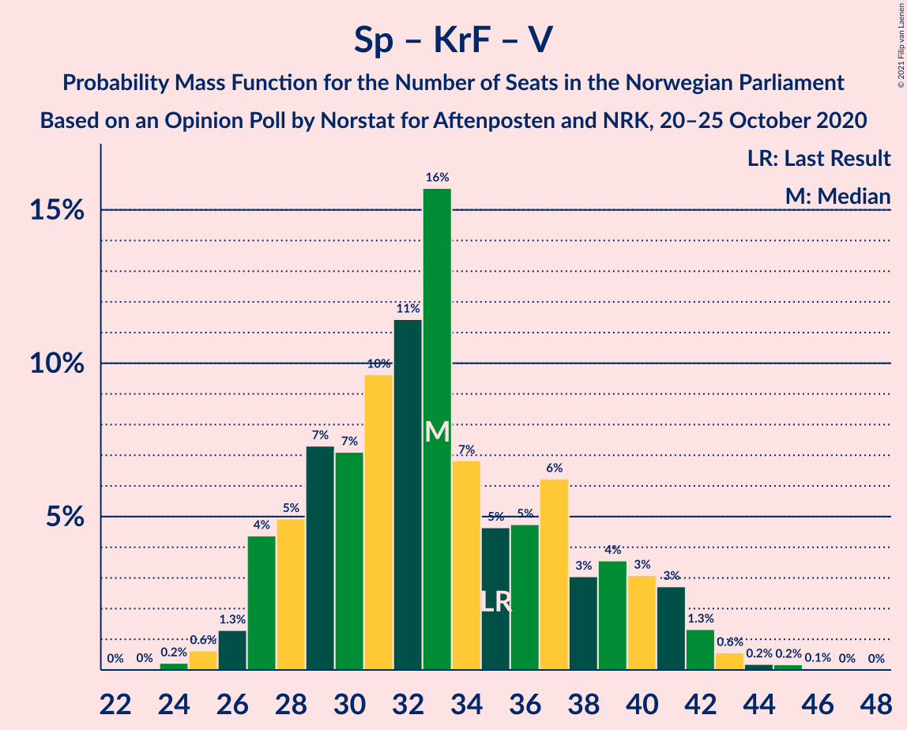

| Number of Seats | Probability | Accumulated | Special Marks |
|:---------------:|:-----------:|:-----------:|:-------------:|
| 23 | 0% | 100% |  |
| 24 | 0.2% | 99.9% |  |
| 25 | 0.6% | 99.7% |  |
| 26 | 1.3% | 99.1% |  |
| 27 | 4% | 98% |  |
| 28 | 5% | 93% |  |
| 29 | 7% | 88% |  |
| 30 | 7% | 81% |  |
| 31 | 10% | 74% | Median |
| 32 | 11% | 64% |  |
| 33 | 16% | 53% |  |
| 34 | 7% | 37% |  |
| 35 | 5% | 30% | Last Result |
| 36 | 5% | 26% |  |
| 37 | 6% | 21% |  |
| 38 | 3% | 15% |  |
| 39 | 4% | 12% |  |
| 40 | 3% | 8% |  |
| 41 | 3% | 5% |  |
| 42 | 1.3% | 2% |  |
| 43 | 0.6% | 1.0% |  |
| 44 | 0.2% | 0.5% |  |
| 45 | 0.2% | 0.3% |  |
| 46 | 0.1% | 0.1% |  |
| 47 | 0% | 0.1% |  |
| 48 | 0% | 0% |  |

## Technical Information

### Opinion Poll

+ **Polling firm:** Norstat
+ **Commissioner(s):** Aftenposten and NRK
+ **Fieldwork period:** 20–25 October 2020

### Calculations

+ **Sample size:** 707
+ **Simulations done:** 1,048,576
+ **Error estimate:** 3.15%

