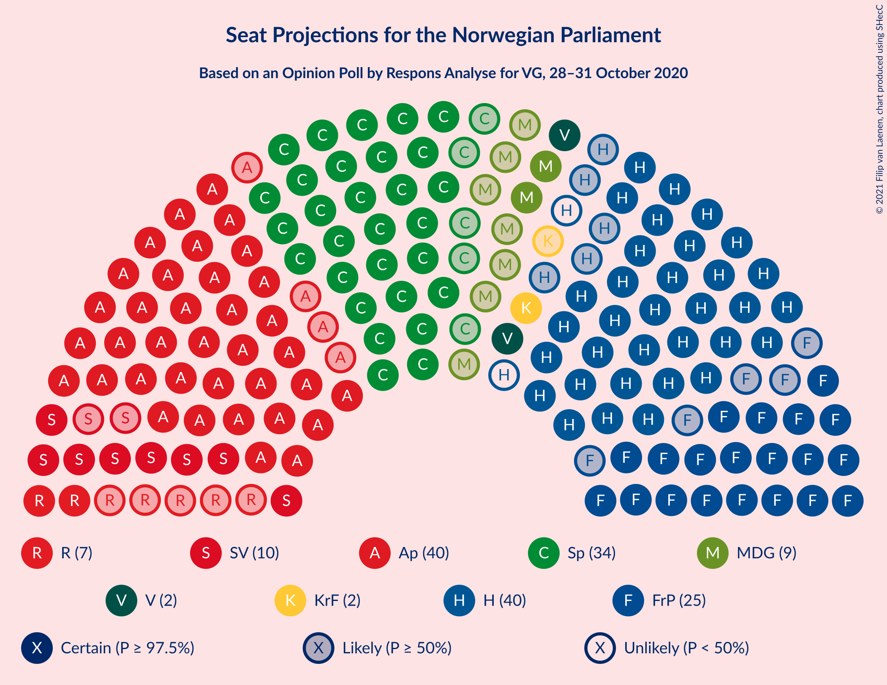
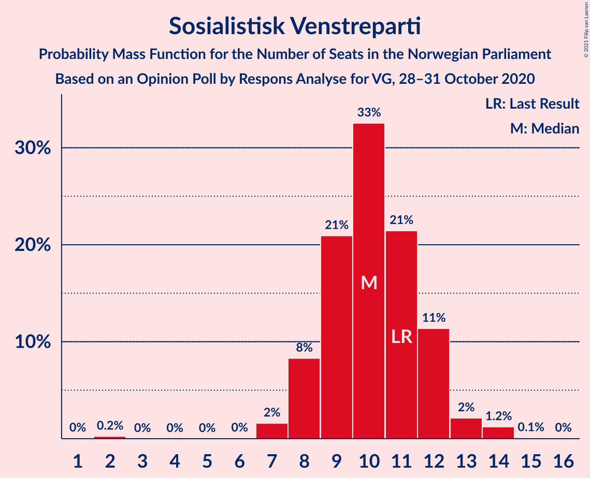

# Opinion Poll by Respons Analyse for VG, 28–31 October 2020

<a href="#voting-intentions">Voting Intentions</a> | <a href="#seats">Seats</a> | <a href="#coalitions">Coalitions</a> | <a href="#technical-information">Technical Information</a>

## Voting Intentions

### Confidence Intervals

| Party | Last Result | Poll Result | 80% Confidence Interval | 90% Confidence Interval | 95% Confidence Interval | 99% Confidence Interval |
|:-----:|:-----------:|:-----------:|:-----------------------:|:-----------------------:|:-----------------------:|:-----------------------:|
| Arbeiderpartiet | 27.4% | 22.0% | 20.4–23.7% |19.9–24.2% |19.5–24.7% |18.8–25.5% |
| Høyre | 25.0% | 21.6% | 20.0–23.4% |19.5–23.8% |19.2–24.3% |18.4–25.1% |
| Senterpartiet | 10.3% | 18.9% | 17.4–20.6% |16.9–21.0% |16.6–21.5% |15.9–22.3% |
| Fremskrittspartiet | 15.2% | 13.9% | 12.6–15.4% |12.2–15.8% |11.9–16.2% |11.3–16.9% |
| Sosialistisk Venstreparti | 6.0% | 5.7% | 4.9–6.8% |4.6–7.1% |4.4–7.3% |4.1–7.9% |
| Miljøpartiet De Grønne | 3.2% | 4.9% | 4.1–5.9% |3.9–6.2% |3.7–6.4% |3.4–6.9% |
| Rødt | 2.4% | 4.1% | 3.4–5.0% |3.2–5.3% |3.0–5.5% |2.7–6.0% |
| Venstre | 4.4% | 3.9% | 3.2–4.8% |3.0–5.1% |2.9–5.3% |2.6–5.8% |
| Kristelig Folkeparti | 4.2% | 3.5% | 2.9–4.4% |2.7–4.6% |2.5–4.8% |2.2–5.3% |

*Note:* The poll result column reflects the actual value used in the calculations. Published results may vary slightly, and in addition be rounded to fewer digits.

## Seats

### Confidence Intervals

| Party | Last Result | Median | 80% Confidence Interval | 90% Confidence Interval | 95% Confidence Interval | 99% Confidence Interval |
|:-----:|:-----------:|:------:|:-----------------------:|:-----------------------:|:-----------------------:|:-----------------------:|
| <a href="#arbeiderpartiet">Arbeiderpartiet</a> | 49 | 40 | 38–43 |37–44 |36–44 |34–46 |
| <a href="#høyre">Høyre</a> | 45 | 38 | 35–41 |34–42 |33–43 |32–45 |
| <a href="#senterpartiet">Senterpartiet</a> | 19 | 34 | 31–38 |30–39 |29–40 |29–41 |
| <a href="#fremskrittspartiet">Fremskrittspartiet</a> | 27 | 25 | 22–27 |21–28 |20–29 |19–31 |
| <a href="#sosialistisk-venstreparti">Sosialistisk Venstreparti</a> | 11 | 10 | 8–12 |8–12 |8–13 |7–14 |
| <a href="#miljøpartiet-de-grønne">Miljøpartiet De Grønne</a> | 1 | 9 | 7–10 |3–11 |2–11 |1–12 |
| <a href="#rødt">Rødt</a> | 1 | 7 | 2–9 |2–9 |2–10 |1–10 |
| <a href="#venstre">Venstre</a> | 8 | 2 | 2–8 |2–9 |2–9 |1–10 |
| <a href="#kristelig-folkeparti">Kristelig Folkeparti</a> | 8 | 2 | 1–7 |1–8 |1–8 |1–9 |

### Arbeiderpartiet

*For a full overview of the results for this party, see the [Arbeiderpartiet](party-arbeiderpartiet.html) page.*

| Number of Seats | Probability | Accumulated | Special Marks |
|:---------------:|:-----------:|:-----------:|:-------------:|
| 30 | 0.1% | 100% |  |
| 31 | 0.1% | 99.9% |  |
| 32 | 0.1% | 99.9% |  |
| 33 | 0.1% | 99.7% |  |
| 34 | 0.6% | 99.6% |  |
| 35 | 1.1% | 99.1% |  |
| 36 | 2% | 98% |  |
| 37 | 5% | 96% |  |
| 38 | 11% | 90% |  |
| 39 | 18% | 80% |  |
| 40 | 22% | 62% | Median |
| 41 | 15% | 40% |  |
| 42 | 13% | 25% |  |
| 43 | 6% | 12% |  |
| 44 | 4% | 6% |  |
| 45 | 0.8% | 2% |  |
| 46 | 1.0% | 1.4% |  |
| 47 | 0.3% | 0.4% |  |
| 48 | 0% | 0.1% |  |
| 49 | 0% | 0% | Last Result |

### Høyre

*For a full overview of the results for this party, see the [Høyre](party-høyre.html) page.*

| Number of Seats | Probability | Accumulated | Special Marks |
|:---------------:|:-----------:|:-----------:|:-------------:|
| 30 | 0.1% | 100% |  |
| 31 | 0.1% | 99.9% |  |
| 32 | 0.6% | 99.7% |  |
| 33 | 3% | 99.1% |  |
| 34 | 6% | 97% |  |
| 35 | 10% | 90% |  |
| 36 | 9% | 80% |  |
| 37 | 14% | 71% |  |
| 38 | 10% | 57% | Median |
| 39 | 9% | 47% |  |
| 40 | 22% | 38% |  |
| 41 | 9% | 16% |  |
| 42 | 3% | 7% |  |
| 43 | 2% | 4% |  |
| 44 | 1.3% | 2% |  |
| 45 | 0.7% | 0.8% | Last Result |
| 46 | 0.1% | 0.2% |  |
| 47 | 0.1% | 0.1% |  |
| 48 | 0% | 0% |  |

### Senterpartiet

*For a full overview of the results for this party, see the [Senterpartiet](party-senterpartiet.html) page.*

| Number of Seats | Probability | Accumulated | Special Marks |
|:---------------:|:-----------:|:-----------:|:-------------:|
| 19 | 0% | 100% | Last Result |
| 20 | 0% | 100% |  |
| 21 | 0% | 100% |  |
| 22 | 0% | 100% |  |
| 23 | 0% | 100% |  |
| 24 | 0% | 100% |  |
| 25 | 0% | 100% |  |
| 26 | 0% | 100% |  |
| 27 | 0% | 100% |  |
| 28 | 0.3% | 99.9% |  |
| 29 | 3% | 99.6% |  |
| 30 | 6% | 97% |  |
| 31 | 6% | 91% |  |
| 32 | 8% | 85% |  |
| 33 | 19% | 77% |  |
| 34 | 15% | 58% | Median |
| 35 | 12% | 44% |  |
| 36 | 15% | 32% |  |
| 37 | 6% | 17% |  |
| 38 | 5% | 11% |  |
| 39 | 2% | 5% |  |
| 40 | 2% | 3% |  |
| 41 | 0.7% | 1.2% |  |
| 42 | 0.2% | 0.4% |  |
| 43 | 0.1% | 0.3% |  |
| 44 | 0.1% | 0.1% |  |
| 45 | 0% | 0% |  |

### Fremskrittspartiet

*For a full overview of the results for this party, see the [Fremskrittspartiet](party-fremskrittspartiet.html) page.*

| Number of Seats | Probability | Accumulated | Special Marks |
|:---------------:|:-----------:|:-----------:|:-------------:|
| 18 | 0.4% | 100% |  |
| 19 | 0.5% | 99.6% |  |
| 20 | 3% | 99.1% |  |
| 21 | 4% | 96% |  |
| 22 | 8% | 91% |  |
| 23 | 16% | 84% |  |
| 24 | 12% | 68% |  |
| 25 | 14% | 56% | Median |
| 26 | 23% | 42% |  |
| 27 | 10% | 19% | Last Result |
| 28 | 4% | 9% |  |
| 29 | 3% | 5% |  |
| 30 | 0.7% | 1.3% |  |
| 31 | 0.5% | 0.6% |  |
| 32 | 0.1% | 0.1% |  |
| 33 | 0% | 0% |  |

### Sosialistisk Venstreparti

*For a full overview of the results for this party, see the [Sosialistisk Venstreparti](party-sosialistiskvenstreparti.html) page.*

| Number of Seats | Probability | Accumulated | Special Marks |
|:---------------:|:-----------:|:-----------:|:-------------:|
| 2 | 0.2% | 100% |  |
| 3 | 0% | 99.7% |  |
| 4 | 0% | 99.7% |  |
| 5 | 0% | 99.7% |  |
| 6 | 0% | 99.7% |  |
| 7 | 2% | 99.7% |  |
| 8 | 8% | 98% |  |
| 9 | 21% | 90% |  |
| 10 | 33% | 69% | Median |
| 11 | 21% | 36% | Last Result |
| 12 | 11% | 15% |  |
| 13 | 2% | 3% |  |
| 14 | 1.2% | 1.3% |  |
| 15 | 0.1% | 0.1% |  |
| 16 | 0% | 0% |  |

### Miljøpartiet De Grønne

*For a full overview of the results for this party, see the [Miljøpartiet De Grønne](party-miljøpartietdegrønne.html) page.*

| Number of Seats | Probability | Accumulated | Special Marks |
|:---------------:|:-----------:|:-----------:|:-------------:|
| 1 | 0.9% | 100% | Last Result |
| 2 | 2% | 99.1% |  |
| 3 | 4% | 97% |  |
| 4 | 0% | 94% |  |
| 5 | 0% | 94% |  |
| 6 | 0.7% | 94% |  |
| 7 | 12% | 93% |  |
| 8 | 20% | 82% |  |
| 9 | 39% | 62% | Median |
| 10 | 16% | 23% |  |
| 11 | 6% | 7% |  |
| 12 | 1.4% | 2% |  |
| 13 | 0.1% | 0.1% |  |
| 14 | 0% | 0% |  |

### Rødt

*For a full overview of the results for this party, see the [Rødt](party-rødt.html) page.*

| Number of Seats | Probability | Accumulated | Special Marks |
|:---------------:|:-----------:|:-----------:|:-------------:|
| 1 | 2% | 100% | Last Result |
| 2 | 39% | 98% |  |
| 3 | 0% | 59% |  |
| 4 | 0% | 59% |  |
| 5 | 0% | 59% |  |
| 6 | 0.8% | 59% |  |
| 7 | 23% | 58% | Median |
| 8 | 21% | 36% |  |
| 9 | 11% | 15% |  |
| 10 | 3% | 4% |  |
| 11 | 0.3% | 0.3% |  |
| 12 | 0% | 0% |  |

### Venstre

*For a full overview of the results for this party, see the [Venstre](party-venstre.html) page.*

| Number of Seats | Probability | Accumulated | Special Marks |
|:---------------:|:-----------:|:-----------:|:-------------:|
| 1 | 1.0% | 100% |  |
| 2 | 57% | 99.0% | Median |
| 3 | 0.3% | 42% |  |
| 4 | 0% | 42% |  |
| 5 | 0% | 42% |  |
| 6 | 3% | 42% |  |
| 7 | 15% | 39% |  |
| 8 | 19% | 24% | Last Result |
| 9 | 4% | 5% |  |
| 10 | 1.2% | 1.4% |  |
| 11 | 0.2% | 0.2% |  |
| 12 | 0% | 0% |  |

### Kristelig Folkeparti

*For a full overview of the results for this party, see the [Kristelig Folkeparti](party-kristeligfolkeparti.html) page.*

| Number of Seats | Probability | Accumulated | Special Marks |
|:---------------:|:-----------:|:-----------:|:-------------:|
| 0 | 0.4% | 100% |  |
| 1 | 19% | 99.6% |  |
| 2 | 36% | 81% | Median |
| 3 | 16% | 44% |  |
| 4 | 0% | 28% |  |
| 5 | 0% | 28% |  |
| 6 | 0.6% | 28% |  |
| 7 | 20% | 28% |  |
| 8 | 6% | 7% | Last Result |
| 9 | 0.8% | 1.0% |  |
| 10 | 0.1% | 0.2% |  |
| 11 | 0% | 0% |  |

## Coalitions

### Confidence Intervals

| Coalition | Last Result | Median | Majority? | 80% Confidence Interval | 90% Confidence Interval | 95% Confidence Interval | 99% Confidence Interval |
|:---------:|:-----------:|:------:|:---------:|:-----------------------:|:-----------------------:|:-----------------------:|:-----------------------:|
| Høyre – Senterpartiet – Fremskrittspartiet – Venstre – Kristelig Folkeparti | 107 | 105 | 100% | 100–110 | 99–111 | 98–112 | 96–114 |
| Arbeiderpartiet – Senterpartiet – Sosialistisk Venstreparti – Miljøpartiet De Grønne – Rødt | 81 | 98 | 100% | 94–103 | 93–104 | 91–106 | 89–108 |
| Arbeiderpartiet – Senterpartiet – Sosialistisk Venstreparti – Miljøpartiet De Grønne – Kristelig Folkeparti | 88 | 97 | 99.9% | 92–100 | 90–102 | 88–103 | 87–106 |
| Arbeiderpartiet – Senterpartiet – Sosialistisk Venstreparti – Miljøpartiet De Grønne | 80 | 93 | 99.0% | 89–97 | 87–98 | 86–99 | 83–102 |
| Arbeiderpartiet – Senterpartiet – Sosialistisk Venstreparti – Rødt | 80 | 90 | 94% | 85–95 | 84–96 | 83–98 | 81–99 |
| Arbeiderpartiet – Senterpartiet – Miljøpartiet De Grønne – Kristelig Folkeparti | 77 | 87 | 73% | 82–91 | 80–92 | 79–93 | 77–96 |
| Arbeiderpartiet – Senterpartiet – Sosialistisk Venstreparti | 79 | 84 | 46% | 80–88 | 79–90 | 78–92 | 76–93 |
| Høyre – Fremskrittspartiet – Miljøpartiet De Grønne – Venstre – Kristelig Folkeparti | 89 | 79 | 6% | 74–84 | 73–85 | 71–86 | 70–88 |
| Arbeiderpartiet – Senterpartiet – Kristelig Folkeparti | 76 | 78 | 3% | 74–82 | 72–84 | 71–85 | 70–87 |
| Arbeiderpartiet – Senterpartiet | 68 | 74 | 0.1% | 70–78 | 70–79 | 68–80 | 67–82 |
| Høyre – Fremskrittspartiet – Venstre – Kristelig Folkeparti | 88 | 71 | 0% | 66–75 | 65–76 | 63–78 | 61–80 |
| Høyre – Fremskrittspartiet – Venstre | 80 | 67 | 0% | 63–72 | 61–73 | 60–75 | 58–77 |
| Høyre – Fremskrittspartiet | 72 | 63 | 0% | 58–67 | 56–69 | 56–69 | 53–72 |
| Arbeiderpartiet – Sosialistisk Venstreparti | 60 | 50 | 0% | 47–53 | 46–54 | 45–55 | 43–58 |
| Høyre – Venstre – Kristelig Folkeparti | 61 | 46 | 0% | 41–50 | 41–51 | 39–53 | 38–56 |
| Senterpartiet – Venstre – Kristelig Folkeparti | 35 | 42 | 0% | 37–48 | 37–49 | 36–50 | 33–53 |

### Høyre – Senterpartiet – Fremskrittspartiet – Venstre – Kristelig Folkeparti

| Number of Seats | Probability | Accumulated | Special Marks |
|:---------------:|:-----------:|:-----------:|:-------------:|
| 94 | 0.1% | 100% |  |
| 95 | 0% | 99.9% |  |
| 96 | 0.6% | 99.9% |  |
| 97 | 0.6% | 99.3% |  |
| 98 | 1.3% | 98.7% |  |
| 99 | 5% | 97% |  |
| 100 | 9% | 92% |  |
| 101 | 7% | 83% | Median |
| 102 | 5% | 77% |  |
| 103 | 12% | 71% |  |
| 104 | 4% | 59% |  |
| 105 | 8% | 55% |  |
| 106 | 13% | 47% |  |
| 107 | 5% | 34% | Last Result |
| 108 | 14% | 29% |  |
| 109 | 5% | 15% |  |
| 110 | 3% | 11% |  |
| 111 | 3% | 7% |  |
| 112 | 3% | 4% |  |
| 113 | 0.5% | 1.3% |  |
| 114 | 0.3% | 0.8% |  |
| 115 | 0.3% | 0.4% |  |
| 116 | 0.1% | 0.2% |  |
| 117 | 0% | 0.1% |  |
| 118 | 0% | 0.1% |  |
| 119 | 0% | 0% |  |

### Arbeiderpartiet – Senterpartiet – Sosialistisk Venstreparti – Miljøpartiet De Grønne – Rødt

| Number of Seats | Probability | Accumulated | Special Marks |
|:---------------:|:-----------:|:-----------:|:-------------:|
| 81 | 0% | 100% | Last Result |
| 82 | 0% | 100% |  |
| 83 | 0% | 100% |  |
| 84 | 0% | 100% |  |
| 85 | 0% | 100% | Majority |
| 86 | 0.1% | 99.9% |  |
| 87 | 0.1% | 99.9% |  |
| 88 | 0.1% | 99.8% |  |
| 89 | 0.2% | 99.6% |  |
| 90 | 1.0% | 99.4% |  |
| 91 | 1.1% | 98% |  |
| 92 | 2% | 97% |  |
| 93 | 4% | 96% |  |
| 94 | 12% | 91% |  |
| 95 | 7% | 79% |  |
| 96 | 6% | 72% |  |
| 97 | 7% | 66% |  |
| 98 | 10% | 59% |  |
| 99 | 8% | 49% |  |
| 100 | 7% | 40% | Median |
| 101 | 5% | 34% |  |
| 102 | 17% | 29% |  |
| 103 | 4% | 12% |  |
| 104 | 4% | 8% |  |
| 105 | 2% | 4% |  |
| 106 | 1.3% | 3% |  |
| 107 | 0.9% | 2% |  |
| 108 | 0.4% | 0.6% |  |
| 109 | 0.1% | 0.2% |  |
| 110 | 0.1% | 0.1% |  |
| 111 | 0% | 0% |  |

### Arbeiderpartiet – Senterpartiet – Sosialistisk Venstreparti – Miljøpartiet De Grønne – Kristelig Folkeparti

| Number of Seats | Probability | Accumulated | Special Marks |
|:---------------:|:-----------:|:-----------:|:-------------:|
| 84 | 0.1% | 100% |  |
| 85 | 0.1% | 99.9% | Majority |
| 86 | 0.2% | 99.8% |  |
| 87 | 0.7% | 99.6% |  |
| 88 | 2% | 98.9% | Last Result |
| 89 | 2% | 97% |  |
| 90 | 2% | 96% |  |
| 91 | 2% | 93% |  |
| 92 | 4% | 91% |  |
| 93 | 5% | 87% |  |
| 94 | 8% | 82% |  |
| 95 | 10% | 73% | Median |
| 96 | 8% | 63% |  |
| 97 | 20% | 55% |  |
| 98 | 6% | 35% |  |
| 99 | 16% | 29% |  |
| 100 | 4% | 13% |  |
| 101 | 4% | 9% |  |
| 102 | 2% | 5% |  |
| 103 | 1.5% | 4% |  |
| 104 | 0.8% | 2% |  |
| 105 | 0.7% | 1.5% |  |
| 106 | 0.6% | 0.8% |  |
| 107 | 0.1% | 0.2% |  |
| 108 | 0% | 0.1% |  |
| 109 | 0% | 0% |  |

### Arbeiderpartiet – Senterpartiet – Sosialistisk Venstreparti – Miljøpartiet De Grønne

| Number of Seats | Probability | Accumulated | Special Marks |
|:---------------:|:-----------:|:-----------:|:-------------:|
| 80 | 0% | 100% | Last Result |
| 81 | 0% | 99.9% |  |
| 82 | 0.2% | 99.9% |  |
| 83 | 0.3% | 99.7% |  |
| 84 | 0.4% | 99.4% |  |
| 85 | 1.3% | 99.0% | Majority |
| 86 | 1.2% | 98% |  |
| 87 | 2% | 97% |  |
| 88 | 5% | 95% |  |
| 89 | 4% | 90% |  |
| 90 | 6% | 86% |  |
| 91 | 9% | 80% |  |
| 92 | 16% | 71% |  |
| 93 | 13% | 54% | Median |
| 94 | 6% | 41% |  |
| 95 | 17% | 35% |  |
| 96 | 7% | 18% |  |
| 97 | 4% | 11% |  |
| 98 | 3% | 7% |  |
| 99 | 2% | 4% |  |
| 100 | 0.9% | 2% |  |
| 101 | 0.5% | 1.1% |  |
| 102 | 0.4% | 0.6% |  |
| 103 | 0.1% | 0.2% |  |
| 104 | 0.1% | 0.1% |  |
| 105 | 0% | 0% |  |

### Arbeiderpartiet – Senterpartiet – Sosialistisk Venstreparti – Rødt

| Number of Seats | Probability | Accumulated | Special Marks |
|:---------------:|:-----------:|:-----------:|:-------------:|
| 78 | 0% | 100% |  |
| 79 | 0.1% | 99.9% |  |
| 80 | 0.2% | 99.8% | Last Result |
| 81 | 0.7% | 99.6% |  |
| 82 | 0.6% | 98.8% |  |
| 83 | 1.4% | 98% |  |
| 84 | 2% | 97% |  |
| 85 | 10% | 94% | Majority |
| 86 | 8% | 85% |  |
| 87 | 7% | 77% |  |
| 88 | 6% | 70% |  |
| 89 | 8% | 63% |  |
| 90 | 6% | 55% |  |
| 91 | 11% | 49% | Median |
| 92 | 9% | 37% |  |
| 93 | 12% | 28% |  |
| 94 | 6% | 16% |  |
| 95 | 5% | 11% |  |
| 96 | 2% | 6% |  |
| 97 | 1.3% | 4% |  |
| 98 | 2% | 3% |  |
| 99 | 0.3% | 0.8% |  |
| 100 | 0.2% | 0.4% |  |
| 101 | 0.2% | 0.3% |  |
| 102 | 0% | 0% |  |

### Arbeiderpartiet – Senterpartiet – Miljøpartiet De Grønne – Kristelig Folkeparti

| Number of Seats | Probability | Accumulated | Special Marks |
|:---------------:|:-----------:|:-----------:|:-------------:|
| 74 | 0.1% | 100% |  |
| 75 | 0.1% | 99.9% |  |
| 76 | 0.1% | 99.8% |  |
| 77 | 0.7% | 99.6% | Last Result |
| 78 | 1.1% | 98.9% |  |
| 79 | 0.9% | 98% |  |
| 80 | 3% | 97% |  |
| 81 | 3% | 94% |  |
| 82 | 7% | 91% |  |
| 83 | 3% | 84% |  |
| 84 | 8% | 81% |  |
| 85 | 13% | 73% | Median, Majority |
| 86 | 7% | 60% |  |
| 87 | 16% | 53% |  |
| 88 | 16% | 37% |  |
| 89 | 7% | 21% |  |
| 90 | 4% | 14% |  |
| 91 | 5% | 11% |  |
| 92 | 2% | 6% |  |
| 93 | 2% | 4% |  |
| 94 | 0.8% | 2% |  |
| 95 | 0.7% | 1.2% |  |
| 96 | 0.2% | 0.6% |  |
| 97 | 0.2% | 0.3% |  |
| 98 | 0% | 0.1% |  |
| 99 | 0% | 0% |  |

### Arbeiderpartiet – Senterpartiet – Sosialistisk Venstreparti

| Number of Seats | Probability | Accumulated | Special Marks |
|:---------------:|:-----------:|:-----------:|:-------------:|
| 74 | 0.1% | 100% |  |
| 75 | 0.1% | 99.9% |  |
| 76 | 0.3% | 99.7% |  |
| 77 | 0.8% | 99.4% |  |
| 78 | 2% | 98.6% |  |
| 79 | 3% | 97% | Last Result |
| 80 | 4% | 94% |  |
| 81 | 3% | 90% |  |
| 82 | 9% | 87% |  |
| 83 | 21% | 78% |  |
| 84 | 11% | 57% | Median |
| 85 | 7% | 46% | Majority |
| 86 | 17% | 39% |  |
| 87 | 8% | 22% |  |
| 88 | 4% | 14% |  |
| 89 | 3% | 10% |  |
| 90 | 3% | 6% |  |
| 91 | 0.9% | 4% |  |
| 92 | 2% | 3% |  |
| 93 | 0.5% | 0.8% |  |
| 94 | 0.1% | 0.2% |  |
| 95 | 0.1% | 0.1% |  |
| 96 | 0% | 0% |  |

### Høyre – Fremskrittspartiet – Miljøpartiet De Grønne – Venstre – Kristelig Folkeparti

| Number of Seats | Probability | Accumulated | Special Marks |
|:---------------:|:-----------:|:-----------:|:-------------:|
| 68 | 0.2% | 100% |  |
| 69 | 0.2% | 99.7% |  |
| 70 | 0.3% | 99.6% |  |
| 71 | 2% | 99.2% |  |
| 72 | 1.3% | 97% |  |
| 73 | 2% | 96% |  |
| 74 | 5% | 94% |  |
| 75 | 6% | 89% |  |
| 76 | 12% | 84% | Median |
| 77 | 9% | 72% |  |
| 78 | 11% | 63% |  |
| 79 | 6% | 51% |  |
| 80 | 8% | 45% |  |
| 81 | 6% | 37% |  |
| 82 | 7% | 30% |  |
| 83 | 8% | 23% |  |
| 84 | 10% | 15% |  |
| 85 | 2% | 6% | Majority |
| 86 | 1.4% | 3% |  |
| 87 | 0.6% | 2% |  |
| 88 | 0.7% | 1.2% |  |
| 89 | 0.2% | 0.4% | Last Result |
| 90 | 0.1% | 0.2% |  |
| 91 | 0% | 0.1% |  |
| 92 | 0% | 0% |  |

### Arbeiderpartiet – Senterpartiet – Kristelig Folkeparti

| Number of Seats | Probability | Accumulated | Special Marks |
|:---------------:|:-----------:|:-----------:|:-------------:|
| 67 | 0% | 100% |  |
| 68 | 0.1% | 99.9% |  |
| 69 | 0.2% | 99.9% |  |
| 70 | 0.8% | 99.7% |  |
| 71 | 2% | 98.9% |  |
| 72 | 4% | 96% |  |
| 73 | 2% | 93% |  |
| 74 | 8% | 91% |  |
| 75 | 11% | 83% |  |
| 76 | 5% | 72% | Last Result, Median |
| 77 | 10% | 67% |  |
| 78 | 15% | 57% |  |
| 79 | 14% | 42% |  |
| 80 | 8% | 28% |  |
| 81 | 7% | 20% |  |
| 82 | 5% | 13% |  |
| 83 | 2% | 7% |  |
| 84 | 2% | 6% |  |
| 85 | 1.3% | 3% | Majority |
| 86 | 0.8% | 2% |  |
| 87 | 0.5% | 0.9% |  |
| 88 | 0.3% | 0.4% |  |
| 89 | 0.1% | 0.1% |  |
| 90 | 0% | 0% |  |

### Arbeiderpartiet – Senterpartiet

| Number of Seats | Probability | Accumulated | Special Marks |
|:---------------:|:-----------:|:-----------:|:-------------:|
| 64 | 0% | 100% |  |
| 65 | 0.1% | 99.9% |  |
| 66 | 0.1% | 99.8% |  |
| 67 | 0.4% | 99.7% |  |
| 68 | 2% | 99.3% | Last Result |
| 69 | 2% | 97% |  |
| 70 | 5% | 95% |  |
| 71 | 2% | 90% |  |
| 72 | 16% | 87% |  |
| 73 | 13% | 71% |  |
| 74 | 10% | 58% | Median |
| 75 | 10% | 48% |  |
| 76 | 18% | 38% |  |
| 77 | 7% | 20% |  |
| 78 | 5% | 13% |  |
| 79 | 3% | 8% |  |
| 80 | 3% | 5% |  |
| 81 | 0.7% | 2% |  |
| 82 | 0.7% | 1.1% |  |
| 83 | 0.2% | 0.4% |  |
| 84 | 0.1% | 0.2% |  |
| 85 | 0% | 0.1% | Majority |
| 86 | 0.1% | 0.1% |  |
| 87 | 0% | 0% |  |

### Høyre – Fremskrittspartiet – Venstre – Kristelig Folkeparti

| Number of Seats | Probability | Accumulated | Special Marks |
|:---------------:|:-----------:|:-----------:|:-------------:|
| 59 | 0.1% | 100% |  |
| 60 | 0.1% | 99.9% |  |
| 61 | 0.4% | 99.8% |  |
| 62 | 0.9% | 99.4% |  |
| 63 | 1.3% | 98% |  |
| 64 | 2% | 97% |  |
| 65 | 4% | 96% |  |
| 66 | 4% | 92% |  |
| 67 | 17% | 88% | Median |
| 68 | 5% | 71% |  |
| 69 | 7% | 66% |  |
| 70 | 8% | 60% |  |
| 71 | 10% | 51% |  |
| 72 | 7% | 41% |  |
| 73 | 6% | 34% |  |
| 74 | 7% | 28% |  |
| 75 | 12% | 21% |  |
| 76 | 4% | 9% |  |
| 77 | 2% | 4% |  |
| 78 | 1.1% | 3% |  |
| 79 | 1.0% | 2% |  |
| 80 | 0.2% | 0.6% |  |
| 81 | 0.1% | 0.4% |  |
| 82 | 0.1% | 0.2% |  |
| 83 | 0.1% | 0.1% |  |
| 84 | 0% | 0.1% |  |
| 85 | 0% | 0% | Majority |
| 86 | 0% | 0% |  |
| 87 | 0% | 0% |  |
| 88 | 0% | 0% | Last Result |

### Høyre – Fremskrittspartiet – Venstre

| Number of Seats | Probability | Accumulated | Special Marks |
|:---------------:|:-----------:|:-----------:|:-------------:|
| 56 | 0.1% | 100% |  |
| 57 | 0.3% | 99.9% |  |
| 58 | 0.6% | 99.6% |  |
| 59 | 0.8% | 98.9% |  |
| 60 | 1.5% | 98% |  |
| 61 | 3% | 97% |  |
| 62 | 3% | 94% |  |
| 63 | 3% | 91% |  |
| 64 | 7% | 87% |  |
| 65 | 17% | 80% | Median |
| 66 | 7% | 64% |  |
| 67 | 8% | 57% |  |
| 68 | 18% | 49% |  |
| 69 | 6% | 31% |  |
| 70 | 8% | 25% |  |
| 71 | 6% | 17% |  |
| 72 | 3% | 11% |  |
| 73 | 4% | 8% |  |
| 74 | 2% | 4% |  |
| 75 | 1.2% | 3% |  |
| 76 | 0.3% | 1.3% |  |
| 77 | 0.7% | 1.0% |  |
| 78 | 0.1% | 0.3% |  |
| 79 | 0.1% | 0.2% |  |
| 80 | 0% | 0.1% | Last Result |
| 81 | 0% | 0% |  |

### Høyre – Fremskrittspartiet

| Number of Seats | Probability | Accumulated | Special Marks |
|:---------------:|:-----------:|:-----------:|:-------------:|
| 52 | 0% | 100% |  |
| 53 | 0.5% | 99.9% |  |
| 54 | 0.6% | 99.4% |  |
| 55 | 0.8% | 98.8% |  |
| 56 | 3% | 98% |  |
| 57 | 1.3% | 95% |  |
| 58 | 6% | 94% |  |
| 59 | 5% | 87% |  |
| 60 | 10% | 82% |  |
| 61 | 7% | 72% |  |
| 62 | 9% | 65% |  |
| 63 | 17% | 56% | Median |
| 64 | 6% | 39% |  |
| 65 | 6% | 33% |  |
| 66 | 13% | 27% |  |
| 67 | 5% | 13% |  |
| 68 | 3% | 9% |  |
| 69 | 4% | 6% |  |
| 70 | 0.8% | 2% |  |
| 71 | 0.8% | 1.5% |  |
| 72 | 0.5% | 0.7% | Last Result |
| 73 | 0.1% | 0.2% |  |
| 74 | 0.1% | 0.1% |  |
| 75 | 0% | 0.1% |  |
| 76 | 0% | 0% |  |

### Arbeiderpartiet – Sosialistisk Venstreparti

| Number of Seats | Probability | Accumulated | Special Marks |
|:---------------:|:-----------:|:-----------:|:-------------:|
| 39 | 0.1% | 100% |  |
| 40 | 0.1% | 99.9% |  |
| 41 | 0.1% | 99.9% |  |
| 42 | 0.1% | 99.8% |  |
| 43 | 0.4% | 99.6% |  |
| 44 | 0.7% | 99.3% |  |
| 45 | 2% | 98.5% |  |
| 46 | 4% | 97% |  |
| 47 | 7% | 93% |  |
| 48 | 8% | 86% |  |
| 49 | 9% | 78% |  |
| 50 | 31% | 69% | Median |
| 51 | 9% | 38% |  |
| 52 | 10% | 29% |  |
| 53 | 11% | 19% |  |
| 54 | 4% | 8% |  |
| 55 | 2% | 4% |  |
| 56 | 1.0% | 2% |  |
| 57 | 0.8% | 1.3% |  |
| 58 | 0.4% | 0.5% |  |
| 59 | 0% | 0.1% |  |
| 60 | 0% | 0% | Last Result |

### Høyre – Venstre – Kristelig Folkeparti

| Number of Seats | Probability | Accumulated | Special Marks |
|:---------------:|:-----------:|:-----------:|:-------------:|
| 36 | 0% | 100% |  |
| 37 | 0.3% | 99.9% |  |
| 38 | 0.7% | 99.6% |  |
| 39 | 3% | 98.9% |  |
| 40 | 1.2% | 96% |  |
| 41 | 7% | 95% |  |
| 42 | 4% | 88% | Median |
| 43 | 6% | 84% |  |
| 44 | 16% | 78% |  |
| 45 | 11% | 62% |  |
| 46 | 7% | 51% |  |
| 47 | 10% | 43% |  |
| 48 | 6% | 33% |  |
| 49 | 14% | 28% |  |
| 50 | 5% | 14% |  |
| 51 | 4% | 9% |  |
| 52 | 1.4% | 5% |  |
| 53 | 0.8% | 3% |  |
| 54 | 1.1% | 2% |  |
| 55 | 0.7% | 1.4% |  |
| 56 | 0.5% | 0.7% |  |
| 57 | 0% | 0.1% |  |
| 58 | 0.1% | 0.1% |  |
| 59 | 0% | 0% |  |
| 60 | 0% | 0% |  |
| 61 | 0% | 0% | Last Result |

### Senterpartiet – Venstre – Kristelig Folkeparti

| Number of Seats | Probability | Accumulated | Special Marks |
|:---------------:|:-----------:|:-----------:|:-------------:|
| 32 | 0% | 100% |  |
| 33 | 0.6% | 99.9% |  |
| 34 | 0.7% | 99.4% |  |
| 35 | 0.7% | 98.7% | Last Result |
| 36 | 3% | 98% |  |
| 37 | 9% | 95% |  |
| 38 | 4% | 86% | Median |
| 39 | 8% | 82% |  |
| 40 | 16% | 74% |  |
| 41 | 7% | 58% |  |
| 42 | 13% | 50% |  |
| 43 | 4% | 38% |  |
| 44 | 7% | 34% |  |
| 45 | 6% | 27% |  |
| 46 | 6% | 21% |  |
| 47 | 4% | 15% |  |
| 48 | 5% | 11% |  |
| 49 | 2% | 6% |  |
| 50 | 2% | 5% |  |
| 51 | 0.5% | 2% |  |
| 52 | 1.2% | 2% |  |
| 53 | 0.5% | 0.8% |  |
| 54 | 0.1% | 0.3% |  |
| 55 | 0.1% | 0.1% |  |
| 56 | 0% | 0.1% |  |
| 57 | 0% | 0% |  |

## Technical Information

### Opinion Poll

+ **Polling firm:** Respons Analyse
+ **Commissioner(s):** VG
+ **Fieldwork period:** 28–31 October 2020

### Calculations

+ **Sample size:** 1000
+ **Simulations done:** 1,048,576
+ **Error estimate:** 1.08%

