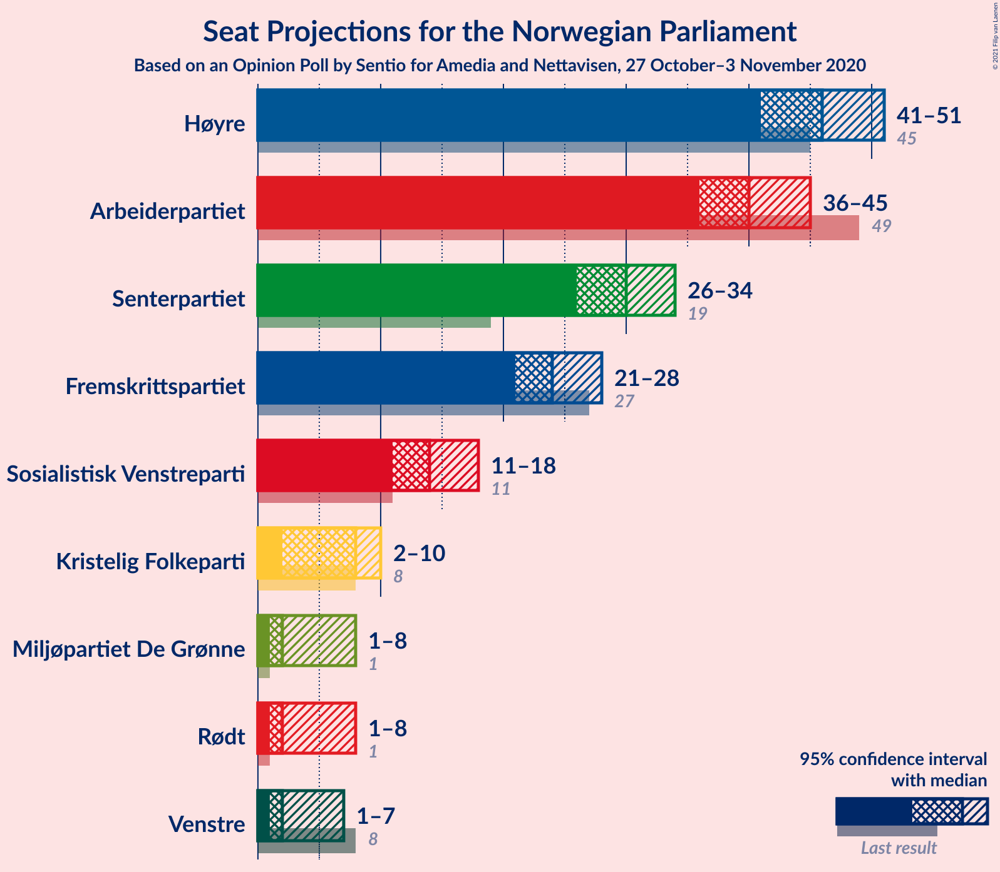
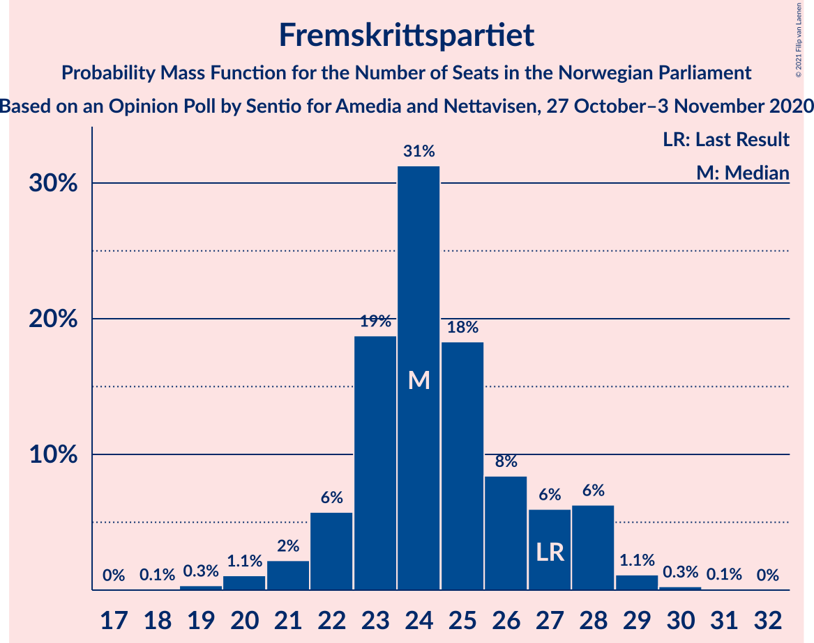
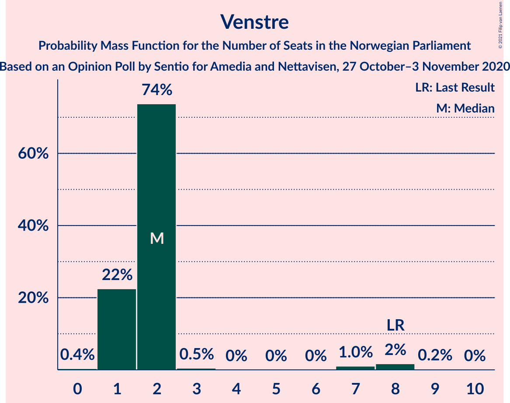
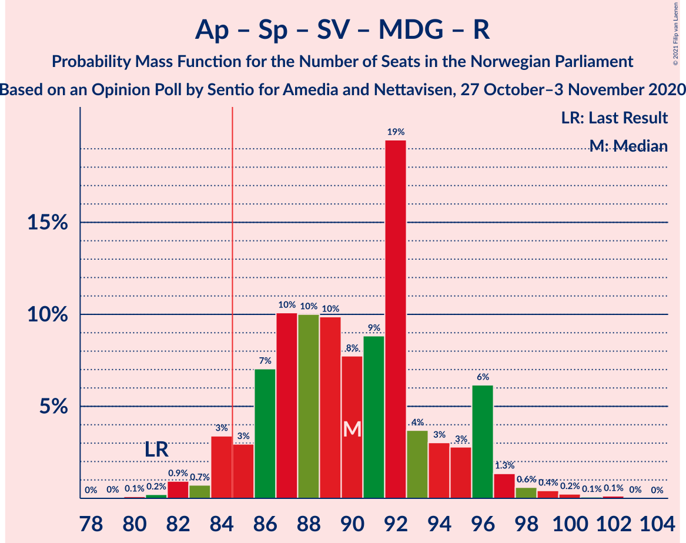
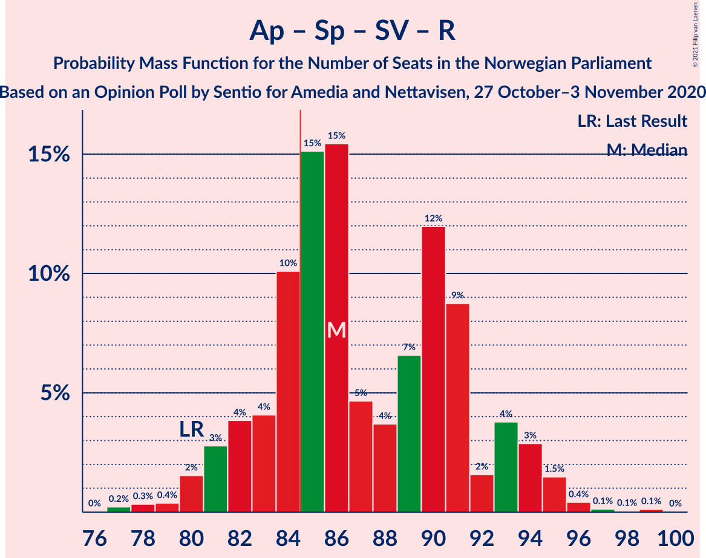
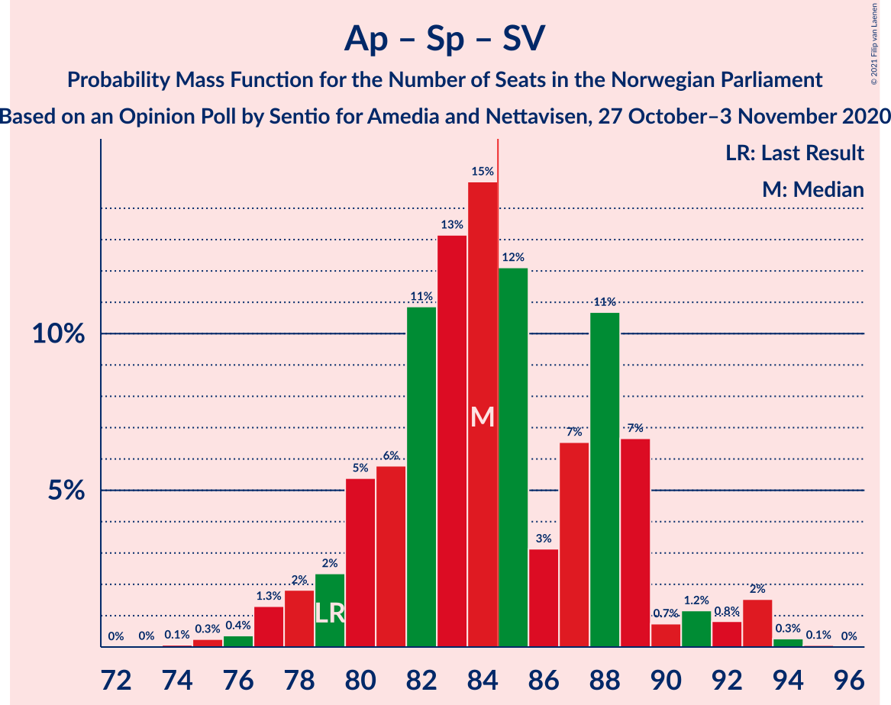

# Opinion Poll by Sentio for Amedia and Nettavisen, 27 October–3 November 2020

<a href="#voting-intentions">Voting Intentions</a> | <a href="#seats">Seats</a> | <a href="#coalitions">Coalitions</a> | <a href="#technical-information">Technical Information</a>

## Voting Intentions

### Confidence Intervals

| Party | Last Result | Poll Result | 80% Confidence Interval | 90% Confidence Interval | 95% Confidence Interval | 99% Confidence Interval |
|:-----:|:-----------:|:-----------:|:-----------------------:|:-----------------------:|:-----------------------:|:-----------------------:|
| Høyre | 25.0% | 25.0% | 23.3–26.8% |22.8–27.3% |22.4–27.8% |21.6–28.7% |
| Arbeiderpartiet | 27.4% | 21.9% | 20.3–23.7% |19.8–24.1% |19.4–24.6% |18.7–25.4% |
| Senterpartiet | 10.3% | 16.4% | 15.0–18.0% |14.6–18.4% |14.2–18.8% |13.6–19.6% |
| Fremskrittspartiet | 15.2% | 13.4% | 12.1–14.9% |11.7–15.3% |11.4–15.7% |10.8–16.4% |
| Sosialistisk Venstreparti | 6.0% | 7.6% | 6.6–8.8% |6.3–9.1% |6.1–9.4% |5.7–10.0% |
| Kristelig Folkeparti | 4.2% | 4.2% | 3.5–5.1% |3.3–5.4% |3.1–5.6% |2.8–6.1% |
| Miljøpartiet De Grønne | 3.2% | 3.5% | 2.9–4.4% |2.7–4.6% |2.5–4.8% |2.2–5.3% |
| Rødt | 2.4% | 3.4% | 2.8–4.3% |2.6–4.5% |2.4–4.7% |2.2–5.2% |
| Venstre | 4.4% | 3.0% | 2.4–3.8% |2.2–4.1% |2.1–4.3% |1.9–4.7% |

*Note:* The poll result column reflects the actual value used in the calculations. Published results may vary slightly, and in addition be rounded to fewer digits.

## Seats

### Confidence Intervals

| Party | Last Result | Median | 80% Confidence Interval | 90% Confidence Interval | 95% Confidence Interval | 99% Confidence Interval |
|:-----:|:-----------:|:------:|:-----------------------:|:-----------------------:|:-----------------------:|:-----------------------:|
| <a href="#høyre">Høyre</a> | 45 | 45 | 42–50 |42–51 |41–52 |39–53 |
| <a href="#arbeiderpartiet">Arbeiderpartiet</a> | 49 | 41 | 38–44 |37–44 |36–45 |35–47 |
| <a href="#senterpartiet">Senterpartiet</a> | 19 | 29 | 28–33 |27–34 |26–34 |25–35 |
| <a href="#fremskrittspartiet">Fremskrittspartiet</a> | 27 | 24 | 23–26 |22–28 |21–28 |19–29 |
| <a href="#sosialistisk-venstreparti">Sosialistisk Venstreparti</a> | 11 | 14 | 12–16 |12–17 |11–18 |10–18 |
| <a href="#kristelig-folkeparti">Kristelig Folkeparti</a> | 8 | 8 | 3–9 |3–10 |2–10 |1–11 |
| <a href="#miljøpartiet-de-grønne">Miljøpartiet De Grønne</a> | 1 | 2 | 1–8 |1–8 |1–8 |1–9 |
| <a href="#rødt">Rødt</a> | 1 | 2 | 1–7 |1–8 |1–8 |1–9 |
| <a href="#venstre">Venstre</a> | 8 | 2 | 1–2 |1–2 |1–3 |1–8 |

### Høyre

*For a full overview of the results for this party, see the [Høyre](party-høyre.html) page.*

| Number of Seats | Probability | Accumulated | Special Marks |
|:---------------:|:-----------:|:-----------:|:-------------:|
| 37 | 0.1% | 100% |  |
| 38 | 0.2% | 99.9% |  |
| 39 | 0.4% | 99.7% |  |
| 40 | 0.9% | 99.3% |  |
| 41 | 2% | 98% |  |
| 42 | 9% | 96% |  |
| 43 | 5% | 87% |  |
| 44 | 25% | 82% |  |
| 45 | 7% | 57% | Last Result, Median |
| 46 | 4% | 50% |  |
| 47 | 27% | 46% |  |
| 48 | 4% | 19% |  |
| 49 | 3% | 15% |  |
| 50 | 4% | 13% |  |
| 51 | 5% | 8% |  |
| 52 | 1.4% | 3% |  |
| 53 | 1.4% | 2% |  |
| 54 | 0.2% | 0.3% |  |
| 55 | 0.1% | 0.1% |  |
| 56 | 0% | 0% |  |

### Arbeiderpartiet

*For a full overview of the results for this party, see the [Arbeiderpartiet](party-arbeiderpartiet.html) page.*

| Number of Seats | Probability | Accumulated | Special Marks |
|:---------------:|:-----------:|:-----------:|:-------------:|
| 32 | 0.1% | 100% |  |
| 33 | 0.1% | 99.9% |  |
| 34 | 0.3% | 99.8% |  |
| 35 | 0.9% | 99.5% |  |
| 36 | 3% | 98.6% |  |
| 37 | 4% | 95% |  |
| 38 | 4% | 92% |  |
| 39 | 5% | 88% |  |
| 40 | 30% | 83% |  |
| 41 | 20% | 52% | Median |
| 42 | 17% | 32% |  |
| 43 | 3% | 15% |  |
| 44 | 8% | 12% |  |
| 45 | 2% | 4% |  |
| 46 | 1.1% | 2% |  |
| 47 | 0.4% | 0.6% |  |
| 48 | 0.1% | 0.2% |  |
| 49 | 0.1% | 0.1% | Last Result |
| 50 | 0% | 0% |  |

### Senterpartiet

*For a full overview of the results for this party, see the [Senterpartiet](party-senterpartiet.html) page.*

| Number of Seats | Probability | Accumulated | Special Marks |
|:---------------:|:-----------:|:-----------:|:-------------:|
| 19 | 0% | 100% | Last Result |
| 20 | 0% | 100% |  |
| 21 | 0% | 100% |  |
| 22 | 0% | 100% |  |
| 23 | 0.1% | 100% |  |
| 24 | 0.2% | 99.9% |  |
| 25 | 1.0% | 99.7% |  |
| 26 | 2% | 98.7% |  |
| 27 | 6% | 97% |  |
| 28 | 19% | 90% |  |
| 29 | 31% | 71% | Median |
| 30 | 8% | 40% |  |
| 31 | 17% | 32% |  |
| 32 | 4% | 15% |  |
| 33 | 4% | 12% |  |
| 34 | 6% | 8% |  |
| 35 | 1.2% | 2% |  |
| 36 | 0.2% | 0.4% |  |
| 37 | 0.1% | 0.2% |  |
| 38 | 0.1% | 0.1% |  |
| 39 | 0% | 0% |  |

### Fremskrittspartiet

*For a full overview of the results for this party, see the [Fremskrittspartiet](party-fremskrittspartiet.html) page.*

| Number of Seats | Probability | Accumulated | Special Marks |
|:---------------:|:-----------:|:-----------:|:-------------:|
| 18 | 0.1% | 100% |  |
| 19 | 0.4% | 99.9% |  |
| 20 | 1.0% | 99.5% |  |
| 21 | 2% | 98% |  |
| 22 | 5% | 96% |  |
| 23 | 27% | 91% |  |
| 24 | 35% | 64% | Median |
| 25 | 11% | 29% |  |
| 26 | 8% | 18% |  |
| 27 | 4% | 10% | Last Result |
| 28 | 5% | 6% |  |
| 29 | 0.6% | 1.0% |  |
| 30 | 0.2% | 0.4% |  |
| 31 | 0.1% | 0.1% |  |
| 32 | 0% | 0% |  |

### Sosialistisk Venstreparti

*For a full overview of the results for this party, see the [Sosialistisk Venstreparti](party-sosialistiskvenstreparti.html) page.*

| Number of Seats | Probability | Accumulated | Special Marks |
|:---------------:|:-----------:|:-----------:|:-------------:|
| 9 | 0.1% | 100% |  |
| 10 | 0.6% | 99.9% |  |
| 11 | 2% | 99.3% | Last Result |
| 12 | 9% | 97% |  |
| 13 | 27% | 88% |  |
| 14 | 36% | 61% | Median |
| 15 | 11% | 25% |  |
| 16 | 8% | 14% |  |
| 17 | 3% | 6% |  |
| 18 | 2% | 3% |  |
| 19 | 0.3% | 0.4% |  |
| 20 | 0.1% | 0.1% |  |
| 21 | 0% | 0% |  |

### Kristelig Folkeparti

*For a full overview of the results for this party, see the [Kristelig Folkeparti](party-kristeligfolkeparti.html) page.*

| Number of Seats | Probability | Accumulated | Special Marks |
|:---------------:|:-----------:|:-----------:|:-------------:|
| 1 | 0.9% | 100% |  |
| 2 | 3% | 99.1% |  |
| 3 | 20% | 96% |  |
| 4 | 0% | 76% |  |
| 5 | 0% | 76% |  |
| 6 | 0% | 76% |  |
| 7 | 4% | 76% |  |
| 8 | 39% | 72% | Last Result, Median |
| 9 | 27% | 33% |  |
| 10 | 4% | 5% |  |
| 11 | 0.7% | 0.9% |  |
| 12 | 0.2% | 0.2% |  |
| 13 | 0% | 0% |  |

### Miljøpartiet De Grønne

*For a full overview of the results for this party, see the [Miljøpartiet De Grønne](party-miljøpartietdegrønne.html) page.*

| Number of Seats | Probability | Accumulated | Special Marks |
|:---------------:|:-----------:|:-----------:|:-------------:|
| 0 | 0.1% | 100% |  |
| 1 | 28% | 99.9% | Last Result |
| 2 | 44% | 72% | Median |
| 3 | 3% | 27% |  |
| 4 | 0.1% | 24% |  |
| 5 | 0% | 24% |  |
| 6 | 0% | 24% |  |
| 7 | 3% | 24% |  |
| 8 | 19% | 22% |  |
| 9 | 2% | 2% |  |
| 10 | 0.4% | 0.5% |  |
| 11 | 0% | 0% |  |

### Rødt

*For a full overview of the results for this party, see the [Rødt](party-rødt.html) page.*

| Number of Seats | Probability | Accumulated | Special Marks |
|:---------------:|:-----------:|:-----------:|:-------------:|
| 1 | 20% | 100% | Last Result |
| 2 | 66% | 80% | Median |
| 3 | 0% | 14% |  |
| 4 | 0% | 14% |  |
| 5 | 0% | 14% |  |
| 6 | 0% | 14% |  |
| 7 | 9% | 14% |  |
| 8 | 4% | 5% |  |
| 9 | 0.8% | 1.0% |  |
| 10 | 0.1% | 0.1% |  |
| 11 | 0% | 0% |  |

### Venstre

*For a full overview of the results for this party, see the [Venstre](party-venstre.html) page.*

| Number of Seats | Probability | Accumulated | Special Marks |
|:---------------:|:-----------:|:-----------:|:-------------:|
| 0 | 0.4% | 100% |  |
| 1 | 17% | 99.6% |  |
| 2 | 80% | 83% | Median |
| 3 | 0.3% | 3% |  |
| 4 | 0% | 2% |  |
| 5 | 0% | 2% |  |
| 6 | 0% | 2% |  |
| 7 | 1.2% | 2% |  |
| 8 | 0.9% | 1.1% | Last Result |
| 9 | 0.1% | 0.1% |  |
| 10 | 0% | 0% |  |

## Coalitions

### Confidence Intervals

| Coalition | Last Result | Median | Majority? | 80% Confidence Interval | 90% Confidence Interval | 95% Confidence Interval | 99% Confidence Interval |
|:---------:|:-----------:|:------:|:---------:|:-----------------------:|:-----------------------:|:-----------------------:|:-----------------------:|
| Høyre – Senterpartiet – Fremskrittspartiet – Kristelig Folkeparti – Venstre | 107 | 109 | 100% | 104–113 | 104–113 | 102–115 | 100–116 |
| Arbeiderpartiet – Senterpartiet – Sosialistisk Venstreparti – Kristelig Folkeparti – Miljøpartiet De Grønne | 88 | 95 | 99.7% | 90–98 | 89–99 | 87–100 | 85–102 |
| Arbeiderpartiet – Senterpartiet – Sosialistisk Venstreparti – Miljøpartiet De Grønne – Rødt | 81 | 90 | 94% | 86–95 | 84–96 | 84–97 | 82–100 |
| Arbeiderpartiet – Senterpartiet – Sosialistisk Venstreparti – Miljøpartiet De Grønne | 80 | 87 | 86% | 84–91 | 82–94 | 81–95 | 78–96 |
| Arbeiderpartiet – Senterpartiet – Sosialistisk Venstreparti – Rødt | 80 | 86 | 72% | 82–91 | 82–94 | 81–95 | 79–96 |
| Arbeiderpartiet – Senterpartiet – Sosialistisk Venstreparti | 79 | 84 | 43% | 80–89 | 80–89 | 78–93 | 77–93 |
| Høyre – Fremskrittspartiet – Kristelig Folkeparti – Miljøpartiet De Grønne – Venstre | 89 | 83 | 28% | 78–87 | 75–87 | 74–88 | 73–90 |
| Arbeiderpartiet – Senterpartiet – Kristelig Folkeparti – Miljøpartiet De Grønne | 77 | 81 | 9% | 75–84 | 74–85 | 73–87 | 71–88 |
| Høyre – Fremskrittspartiet – Kristelig Folkeparti – Venstre | 88 | 79 | 6% | 74–83 | 73–85 | 72–85 | 69–87 |
| Arbeiderpartiet – Senterpartiet – Kristelig Folkeparti | 76 | 78 | 0.5% | 73–83 | 72–83 | 69–83 | 68–84 |
| Høyre – Fremskrittspartiet – Venstre | 80 | 73 | 0% | 68–77 | 66–78 | 65–78 | 64–81 |
| Arbeiderpartiet – Senterpartiet | 68 | 70 | 0% | 67–75 | 65–76 | 65–77 | 62–78 |
| Høyre – Fremskrittspartiet | 72 | 71 | 0% | 66–75 | 65–76 | 64–77 | 62–78 |
| Arbeiderpartiet – Sosialistisk Venstreparti | 60 | 54 | 0% | 52–58 | 50–59 | 50–61 | 48–61 |
| Høyre – Kristelig Folkeparti – Venstre | 61 | 54 | 0% | 51–58 | 49–60 | 48–61 | 46–62 |
| Senterpartiet – Kristelig Folkeparti – Venstre | 35 | 39 | 0% | 35–42 | 33–44 | 32–45 | 30–47 |

### Høyre – Senterpartiet – Fremskrittspartiet – Kristelig Folkeparti – Venstre

| Number of Seats | Probability | Accumulated | Special Marks |
|:---------------:|:-----------:|:-----------:|:-------------:|
| 96 | 0.1% | 100% |  |
| 97 | 0% | 99.9% |  |
| 98 | 0.1% | 99.9% |  |
| 99 | 0.2% | 99.7% |  |
| 100 | 0.4% | 99.5% |  |
| 101 | 0.5% | 99.1% |  |
| 102 | 2% | 98.6% |  |
| 103 | 2% | 97% |  |
| 104 | 5% | 95% |  |
| 105 | 13% | 90% |  |
| 106 | 10% | 77% |  |
| 107 | 5% | 67% | Last Result |
| 108 | 10% | 62% | Median |
| 109 | 3% | 52% |  |
| 110 | 13% | 49% |  |
| 111 | 19% | 36% |  |
| 112 | 5% | 16% |  |
| 113 | 7% | 11% |  |
| 114 | 1.0% | 4% |  |
| 115 | 2% | 3% |  |
| 116 | 0.4% | 0.9% |  |
| 117 | 0.2% | 0.5% |  |
| 118 | 0.2% | 0.3% |  |
| 119 | 0% | 0.1% |  |
| 120 | 0% | 0% |  |

### Arbeiderpartiet – Senterpartiet – Sosialistisk Venstreparti – Kristelig Folkeparti – Miljøpartiet De Grønne

| Number of Seats | Probability | Accumulated | Special Marks |
|:---------------:|:-----------:|:-----------:|:-------------:|
| 83 | 0.1% | 100% |  |
| 84 | 0.2% | 99.9% |  |
| 85 | 0.3% | 99.7% | Majority |
| 86 | 0.7% | 99.4% |  |
| 87 | 1.3% | 98.7% |  |
| 88 | 2% | 97% | Last Result |
| 89 | 5% | 96% |  |
| 90 | 7% | 91% |  |
| 91 | 3% | 84% |  |
| 92 | 2% | 81% |  |
| 93 | 11% | 79% |  |
| 94 | 18% | 68% | Median |
| 95 | 11% | 50% |  |
| 96 | 4% | 39% |  |
| 97 | 8% | 35% |  |
| 98 | 19% | 27% |  |
| 99 | 3% | 8% |  |
| 100 | 3% | 5% |  |
| 101 | 1.2% | 2% |  |
| 102 | 0.5% | 1.0% |  |
| 103 | 0.4% | 0.5% |  |
| 104 | 0% | 0.1% |  |
| 105 | 0% | 0.1% |  |
| 106 | 0% | 0% |  |

### Arbeiderpartiet – Senterpartiet – Sosialistisk Venstreparti – Miljøpartiet De Grønne – Rødt

| Number of Seats | Probability | Accumulated | Special Marks |
|:---------------:|:-----------:|:-----------:|:-------------:|
| 79 | 0.1% | 100% |  |
| 80 | 0.1% | 99.9% |  |
| 81 | 0.2% | 99.8% | Last Result |
| 82 | 0.6% | 99.6% |  |
| 83 | 0.3% | 99.0% |  |
| 84 | 5% | 98.7% |  |
| 85 | 2% | 94% | Majority |
| 86 | 4% | 91% |  |
| 87 | 14% | 87% |  |
| 88 | 14% | 73% | Median |
| 89 | 4% | 59% |  |
| 90 | 5% | 54% |  |
| 91 | 4% | 49% |  |
| 92 | 27% | 46% |  |
| 93 | 5% | 18% |  |
| 94 | 2% | 13% |  |
| 95 | 4% | 11% |  |
| 96 | 4% | 7% |  |
| 97 | 2% | 4% |  |
| 98 | 0.4% | 1.3% |  |
| 99 | 0.4% | 0.9% |  |
| 100 | 0.2% | 0.5% |  |
| 101 | 0.1% | 0.3% |  |
| 102 | 0.2% | 0.2% |  |
| 103 | 0% | 0% |  |

### Arbeiderpartiet – Senterpartiet – Sosialistisk Venstreparti – Miljøpartiet De Grønne

| Number of Seats | Probability | Accumulated | Special Marks |
|:---------------:|:-----------:|:-----------:|:-------------:|
| 76 | 0% | 100% |  |
| 77 | 0.1% | 99.9% |  |
| 78 | 0.6% | 99.9% |  |
| 79 | 0.4% | 99.3% |  |
| 80 | 0.8% | 98.9% | Last Result |
| 81 | 0.7% | 98% |  |
| 82 | 5% | 97% |  |
| 83 | 2% | 92% |  |
| 84 | 5% | 90% |  |
| 85 | 19% | 86% | Majority |
| 86 | 6% | 67% | Median |
| 87 | 12% | 60% |  |
| 88 | 7% | 48% |  |
| 89 | 5% | 41% |  |
| 90 | 22% | 36% |  |
| 91 | 5% | 13% |  |
| 92 | 0.9% | 8% |  |
| 93 | 1.4% | 7% |  |
| 94 | 3% | 6% |  |
| 95 | 2% | 3% |  |
| 96 | 0.5% | 1.0% |  |
| 97 | 0.1% | 0.5% |  |
| 98 | 0.2% | 0.4% |  |
| 99 | 0% | 0.1% |  |
| 100 | 0.1% | 0.1% |  |
| 101 | 0% | 0% |  |

### Arbeiderpartiet – Senterpartiet – Sosialistisk Venstreparti – Rødt

| Number of Seats | Probability | Accumulated | Special Marks |
|:---------------:|:-----------:|:-----------:|:-------------:|
| 77 | 0.1% | 100% |  |
| 78 | 0.2% | 99.8% |  |
| 79 | 0.6% | 99.7% |  |
| 80 | 1.1% | 99.1% | Last Result |
| 81 | 2% | 98% |  |
| 82 | 6% | 96% |  |
| 83 | 4% | 90% |  |
| 84 | 14% | 86% |  |
| 85 | 17% | 72% | Majority |
| 86 | 13% | 55% | Median |
| 87 | 4% | 42% |  |
| 88 | 4% | 38% |  |
| 89 | 4% | 33% |  |
| 90 | 6% | 29% |  |
| 91 | 14% | 23% |  |
| 92 | 1.4% | 9% |  |
| 93 | 2% | 7% |  |
| 94 | 3% | 6% |  |
| 95 | 2% | 3% |  |
| 96 | 0.5% | 0.8% |  |
| 97 | 0.1% | 0.3% |  |
| 98 | 0% | 0.2% |  |
| 99 | 0.1% | 0.2% |  |
| 100 | 0% | 0% |  |

### Arbeiderpartiet – Senterpartiet – Sosialistisk Venstreparti

| Number of Seats | Probability | Accumulated | Special Marks |
|:---------------:|:-----------:|:-----------:|:-------------:|
| 73 | 0% | 100% |  |
| 74 | 0.1% | 99.9% |  |
| 75 | 0.1% | 99.9% |  |
| 76 | 0.2% | 99.8% |  |
| 77 | 2% | 99.5% |  |
| 78 | 1.3% | 98% |  |
| 79 | 1.3% | 96% | Last Result |
| 80 | 8% | 95% |  |
| 81 | 4% | 87% |  |
| 82 | 14% | 83% |  |
| 83 | 18% | 70% |  |
| 84 | 9% | 52% | Median |
| 85 | 13% | 43% | Majority |
| 86 | 3% | 30% |  |
| 87 | 6% | 27% |  |
| 88 | 7% | 21% |  |
| 89 | 10% | 15% |  |
| 90 | 0.7% | 5% |  |
| 91 | 0.6% | 4% |  |
| 92 | 0.8% | 4% |  |
| 93 | 2% | 3% |  |
| 94 | 0.3% | 0.4% |  |
| 95 | 0% | 0.1% |  |
| 96 | 0% | 0% |  |

### Høyre – Fremskrittspartiet – Kristelig Folkeparti – Miljøpartiet De Grønne – Venstre

| Number of Seats | Probability | Accumulated | Special Marks |
|:---------------:|:-----------:|:-----------:|:-------------:|
| 70 | 0.1% | 100% |  |
| 71 | 0% | 99.8% |  |
| 72 | 0.1% | 99.8% |  |
| 73 | 0.5% | 99.7% |  |
| 74 | 2% | 99.2% |  |
| 75 | 3% | 97% |  |
| 76 | 2% | 94% |  |
| 77 | 1.4% | 93% |  |
| 78 | 14% | 91% |  |
| 79 | 6% | 77% |  |
| 80 | 4% | 71% |  |
| 81 | 4% | 67% | Median |
| 82 | 4% | 62% |  |
| 83 | 13% | 58% |  |
| 84 | 17% | 45% |  |
| 85 | 14% | 28% | Majority |
| 86 | 4% | 14% |  |
| 87 | 6% | 10% |  |
| 88 | 2% | 4% |  |
| 89 | 1.0% | 2% | Last Result |
| 90 | 0.6% | 0.9% |  |
| 91 | 0.2% | 0.3% |  |
| 92 | 0.1% | 0.2% |  |
| 93 | 0% | 0% |  |

### Arbeiderpartiet – Senterpartiet – Kristelig Folkeparti – Miljøpartiet De Grønne

| Number of Seats | Probability | Accumulated | Special Marks |
|:---------------:|:-----------:|:-----------:|:-------------:|
| 69 | 0.1% | 100% |  |
| 70 | 0.3% | 99.9% |  |
| 71 | 0.5% | 99.6% |  |
| 72 | 0.6% | 99.2% |  |
| 73 | 2% | 98.6% |  |
| 74 | 4% | 97% |  |
| 75 | 4% | 93% |  |
| 76 | 4% | 89% |  |
| 77 | 5% | 85% | Last Result |
| 78 | 9% | 79% |  |
| 79 | 1.2% | 71% |  |
| 80 | 3% | 69% | Median |
| 81 | 26% | 66% |  |
| 82 | 7% | 40% |  |
| 83 | 5% | 33% |  |
| 84 | 19% | 28% |  |
| 85 | 4% | 9% | Majority |
| 86 | 0.9% | 5% |  |
| 87 | 3% | 4% |  |
| 88 | 0.6% | 1.1% |  |
| 89 | 0.2% | 0.5% |  |
| 90 | 0.3% | 0.3% |  |
| 91 | 0% | 0.1% |  |
| 92 | 0% | 0.1% |  |
| 93 | 0% | 0% |  |

### Høyre – Fremskrittspartiet – Kristelig Folkeparti – Venstre

| Number of Seats | Probability | Accumulated | Special Marks |
|:---------------:|:-----------:|:-----------:|:-------------:|
| 67 | 0.2% | 100% |  |
| 68 | 0.1% | 99.8% |  |
| 69 | 0.2% | 99.7% |  |
| 70 | 0.4% | 99.5% |  |
| 71 | 0.4% | 99.1% |  |
| 72 | 2% | 98.7% |  |
| 73 | 4% | 96% |  |
| 74 | 4% | 93% |  |
| 75 | 2% | 89% |  |
| 76 | 5% | 87% |  |
| 77 | 27% | 82% |  |
| 78 | 4% | 54% |  |
| 79 | 5% | 51% | Median |
| 80 | 4% | 46% |  |
| 81 | 14% | 41% |  |
| 82 | 14% | 27% |  |
| 83 | 4% | 13% |  |
| 84 | 2% | 9% |  |
| 85 | 5% | 6% | Majority |
| 86 | 0.3% | 1.3% |  |
| 87 | 0.6% | 1.0% |  |
| 88 | 0.2% | 0.4% | Last Result |
| 89 | 0.1% | 0.2% |  |
| 90 | 0.1% | 0.1% |  |
| 91 | 0% | 0% |  |

### Arbeiderpartiet – Senterpartiet – Kristelig Folkeparti

| Number of Seats | Probability | Accumulated | Special Marks |
|:---------------:|:-----------:|:-----------:|:-------------:|
| 65 | 0% | 100% |  |
| 66 | 0.1% | 99.9% |  |
| 67 | 0.1% | 99.8% |  |
| 68 | 0.3% | 99.7% |  |
| 69 | 2% | 99.4% |  |
| 70 | 0.6% | 97% |  |
| 71 | 0.9% | 97% |  |
| 72 | 3% | 96% |  |
| 73 | 5% | 93% |  |
| 74 | 6% | 88% |  |
| 75 | 6% | 81% |  |
| 76 | 18% | 76% | Last Result |
| 77 | 5% | 57% |  |
| 78 | 3% | 52% | Median |
| 79 | 28% | 49% |  |
| 80 | 4% | 21% |  |
| 81 | 5% | 17% |  |
| 82 | 1.0% | 12% |  |
| 83 | 9% | 11% |  |
| 84 | 1.3% | 2% |  |
| 85 | 0.4% | 0.5% | Majority |
| 86 | 0.1% | 0.1% |  |
| 87 | 0% | 0% |  |

### Høyre – Fremskrittspartiet – Venstre

| Number of Seats | Probability | Accumulated | Special Marks |
|:---------------:|:-----------:|:-----------:|:-------------:|
| 61 | 0.1% | 100% |  |
| 62 | 0.1% | 99.8% |  |
| 63 | 0.1% | 99.8% |  |
| 64 | 0.5% | 99.7% |  |
| 65 | 2% | 99.2% |  |
| 66 | 2% | 97% |  |
| 67 | 3% | 95% |  |
| 68 | 4% | 91% |  |
| 69 | 23% | 88% |  |
| 70 | 4% | 64% |  |
| 71 | 5% | 60% | Median |
| 72 | 4% | 55% |  |
| 73 | 25% | 51% |  |
| 74 | 8% | 26% |  |
| 75 | 1.5% | 17% |  |
| 76 | 3% | 16% |  |
| 77 | 6% | 13% |  |
| 78 | 4% | 7% |  |
| 79 | 0.4% | 2% |  |
| 80 | 1.3% | 2% | Last Result |
| 81 | 0.3% | 0.6% |  |
| 82 | 0.2% | 0.3% |  |
| 83 | 0.1% | 0.1% |  |
| 84 | 0% | 0% |  |

### Arbeiderpartiet – Senterpartiet

| Number of Seats | Probability | Accumulated | Special Marks |
|:---------------:|:-----------:|:-----------:|:-------------:|
| 60 | 0% | 100% |  |
| 61 | 0.2% | 99.9% |  |
| 62 | 0.3% | 99.7% |  |
| 63 | 0.7% | 99.4% |  |
| 64 | 0.8% | 98.6% |  |
| 65 | 4% | 98% |  |
| 66 | 4% | 94% |  |
| 67 | 3% | 90% |  |
| 68 | 15% | 87% | Last Result |
| 69 | 10% | 72% |  |
| 70 | 19% | 62% | Median |
| 71 | 14% | 43% |  |
| 72 | 6% | 29% |  |
| 73 | 5% | 23% |  |
| 74 | 6% | 18% |  |
| 75 | 7% | 12% |  |
| 76 | 2% | 6% |  |
| 77 | 2% | 4% |  |
| 78 | 1.4% | 2% |  |
| 79 | 0.2% | 0.3% |  |
| 80 | 0% | 0.1% |  |
| 81 | 0% | 0.1% |  |
| 82 | 0% | 0% |  |

### Høyre – Fremskrittspartiet

| Number of Seats | Probability | Accumulated | Special Marks |
|:---------------:|:-----------:|:-----------:|:-------------:|
| 59 | 0.1% | 100% |  |
| 60 | 0.1% | 99.9% |  |
| 61 | 0.1% | 99.8% |  |
| 62 | 0.5% | 99.6% |  |
| 63 | 0.8% | 99.1% |  |
| 64 | 3% | 98% |  |
| 65 | 4% | 95% |  |
| 66 | 2% | 91% |  |
| 67 | 25% | 89% |  |
| 68 | 4% | 64% |  |
| 69 | 5% | 60% | Median |
| 70 | 4% | 55% |  |
| 71 | 24% | 50% |  |
| 72 | 7% | 26% | Last Result |
| 73 | 4% | 20% |  |
| 74 | 3% | 15% |  |
| 75 | 6% | 13% |  |
| 76 | 2% | 6% |  |
| 77 | 3% | 5% |  |
| 78 | 1.2% | 2% |  |
| 79 | 0.2% | 0.4% |  |
| 80 | 0.1% | 0.2% |  |
| 81 | 0.1% | 0.1% |  |
| 82 | 0% | 0% |  |

### Arbeiderpartiet – Sosialistisk Venstreparti

| Number of Seats | Probability | Accumulated | Special Marks |
|:---------------:|:-----------:|:-----------:|:-------------:|
| 45 | 0.1% | 100% |  |
| 46 | 0.1% | 99.9% |  |
| 47 | 0.2% | 99.9% |  |
| 48 | 1.2% | 99.7% |  |
| 49 | 0.7% | 98% |  |
| 50 | 3% | 98% |  |
| 51 | 4% | 94% |  |
| 52 | 5% | 91% |  |
| 53 | 10% | 85% |  |
| 54 | 32% | 75% |  |
| 55 | 10% | 43% | Median |
| 56 | 13% | 33% |  |
| 57 | 3% | 20% |  |
| 58 | 10% | 17% |  |
| 59 | 3% | 6% |  |
| 60 | 1.1% | 4% | Last Result |
| 61 | 2% | 3% |  |
| 62 | 0.3% | 0.5% |  |
| 63 | 0.1% | 0.1% |  |
| 64 | 0% | 0.1% |  |
| 65 | 0% | 0% |  |

### Høyre – Kristelig Folkeparti – Venstre

| Number of Seats | Probability | Accumulated | Special Marks |
|:---------------:|:-----------:|:-----------:|:-------------:|
| 43 | 0.1% | 100% |  |
| 44 | 0.1% | 99.9% |  |
| 45 | 0.2% | 99.8% |  |
| 46 | 0.6% | 99.6% |  |
| 47 | 0.5% | 99.0% |  |
| 48 | 1.5% | 98.6% |  |
| 49 | 4% | 97% |  |
| 50 | 2% | 93% |  |
| 51 | 5% | 91% |  |
| 52 | 6% | 86% |  |
| 53 | 11% | 80% |  |
| 54 | 22% | 70% |  |
| 55 | 9% | 48% | Median |
| 56 | 4% | 39% |  |
| 57 | 11% | 35% |  |
| 58 | 16% | 24% |  |
| 59 | 2% | 8% |  |
| 60 | 2% | 6% |  |
| 61 | 4% | 5% | Last Result |
| 62 | 0.4% | 0.8% |  |
| 63 | 0.2% | 0.4% |  |
| 64 | 0.2% | 0.3% |  |
| 65 | 0.1% | 0.1% |  |
| 66 | 0% | 0% |  |

### Senterpartiet – Kristelig Folkeparti – Venstre

| Number of Seats | Probability | Accumulated | Special Marks |
|:---------------:|:-----------:|:-----------:|:-------------:|
| 28 | 0.1% | 100% |  |
| 29 | 0.1% | 99.9% |  |
| 30 | 0.4% | 99.8% |  |
| 31 | 0.5% | 99.4% |  |
| 32 | 2% | 98.9% |  |
| 33 | 3% | 97% |  |
| 34 | 1.4% | 94% |  |
| 35 | 5% | 92% | Last Result |
| 36 | 6% | 87% |  |
| 37 | 5% | 81% |  |
| 38 | 19% | 76% |  |
| 39 | 19% | 57% | Median |
| 40 | 19% | 38% |  |
| 41 | 7% | 19% |  |
| 42 | 3% | 12% |  |
| 43 | 0.8% | 9% |  |
| 44 | 5% | 8% |  |
| 45 | 1.2% | 3% |  |
| 46 | 0.9% | 1.4% |  |
| 47 | 0.3% | 0.5% |  |
| 48 | 0.1% | 0.2% |  |
| 49 | 0.1% | 0.1% |  |
| 50 | 0% | 0% |  |

## Technical Information

### Opinion Poll

+ **Polling firm:** Sentio
+ **Commissioner(s):** Amedia and Nettavisen
+ **Fieldwork period:** 27 October–3 November 2020

### Calculations

+ **Sample size:** 1000
+ **Simulations done:** 524,288
+ **Error estimate:** 1.72%

