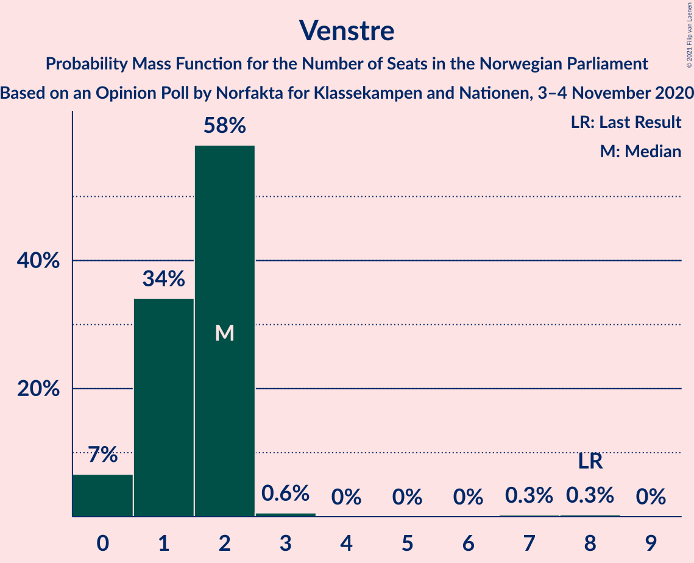
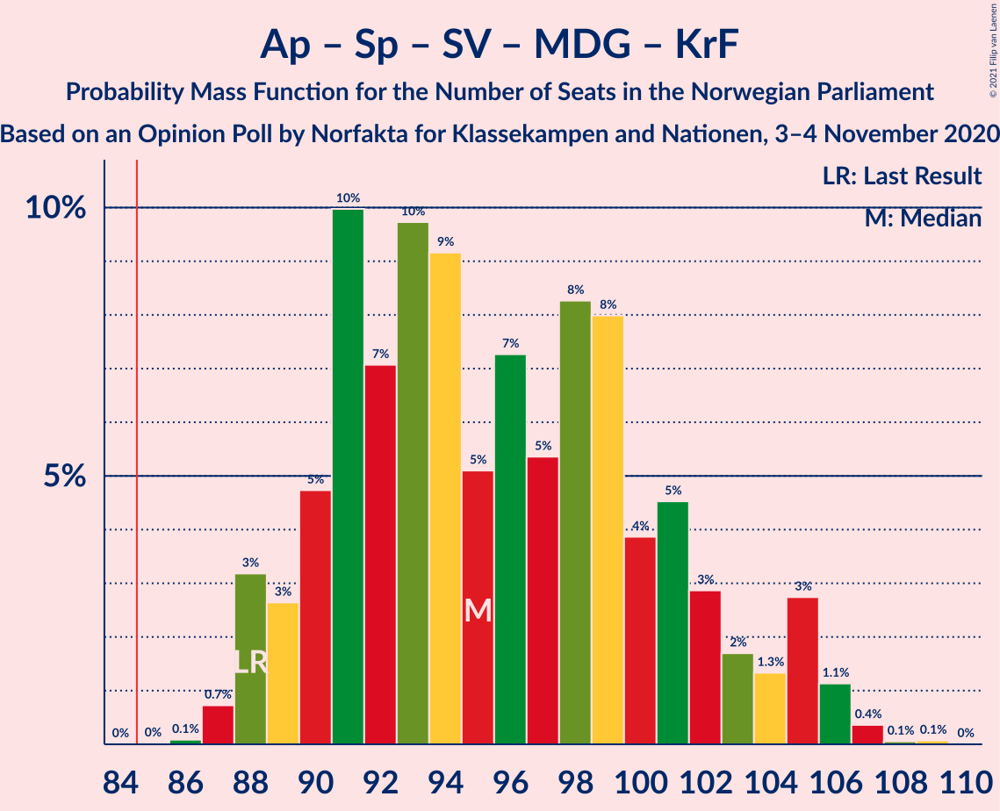
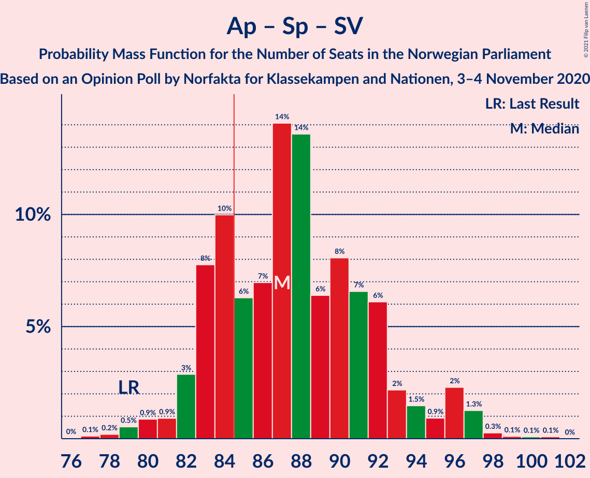
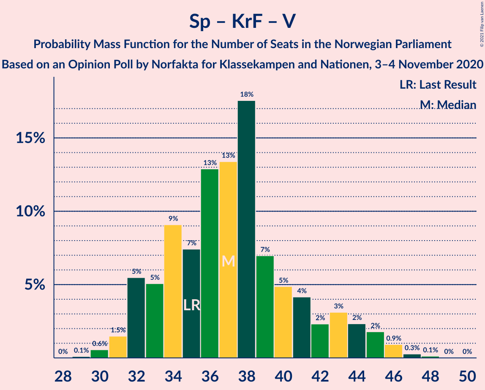

# Opinion Poll by Norfakta for Klassekampen and Nationen, 3–4 November 2020

<a href="#voting-intentions">Voting Intentions</a> | <a href="#seats">Seats</a> | <a href="#coalitions">Coalitions</a> | <a href="#technical-information">Technical Information</a>

## Voting Intentions

### Confidence Intervals

| Party | Last Result | Poll Result | 80% Confidence Interval | 90% Confidence Interval | 95% Confidence Interval | 99% Confidence Interval |
|:-----:|:-----------:|:-----------:|:-----------------------:|:-----------------------:|:-----------------------:|:-----------------------:|
| Høyre | 25.0% | 24.7% | 23.0–26.5% |22.5–27.0% |22.1–27.5% |21.3–28.4% |
| Arbeiderpartiet | 27.4% | 23.4% | 21.7–25.2% |21.3–25.7% |20.9–26.1% |20.1–27.0% |
| Senterpartiet | 10.3% | 17.7% | 16.2–19.3% |15.8–19.8% |15.5–20.2% |14.8–21.0% |
| Fremskrittspartiet | 15.2% | 11.2% | 10.0–12.6% |9.7–13.0% |9.4–13.3% |8.8–14.0% |
| Sosialistisk Venstreparti | 6.0% | 6.7% | 5.8–7.8% |5.5–8.2% |5.3–8.4% |4.9–9.0% |
| Rødt | 2.4% | 4.1% | 3.4–5.0% |3.2–5.3% |3.0–5.5% |2.7–6.0% |
| Miljøpartiet De Grønne | 3.2% | 4.0% | 3.3–4.9% |3.1–5.2% |2.9–5.4% |2.7–5.9% |
| Kristelig Folkeparti | 4.2% | 3.4% | 2.8–4.3% |2.6–4.5% |2.4–4.7% |2.2–5.2% |
| Venstre | 4.4% | 2.5% | 2.0–3.3% |1.8–3.5% |1.7–3.7% |1.5–4.1% |

*Note:* The poll result column reflects the actual value used in the calculations. Published results may vary slightly, and in addition be rounded to fewer digits.

## Seats

### Confidence Intervals

| Party | Last Result | Median | 80% Confidence Interval | 90% Confidence Interval | 95% Confidence Interval | 99% Confidence Interval |
|:-----:|:-----------:|:------:|:-----------------------:|:-----------------------:|:-----------------------:|:-----------------------:|
| <a href="#høyre">Høyre</a> | 45 | 43 | 41–48 |40–49 |40–50 |37–52 |
| <a href="#arbeiderpartiet">Arbeiderpartiet</a> | 49 | 42 | 40–46 |39–47 |38–47 |36–49 |
| <a href="#senterpartiet">Senterpartiet</a> | 19 | 33 | 30–36 |29–37 |28–37 |28–39 |
| <a href="#fremskrittspartiet">Fremskrittspartiet</a> | 27 | 20 | 18–23 |18–24 |16–24 |15–26 |
| <a href="#sosialistisk-venstreparti">Sosialistisk Venstreparti</a> | 11 | 12 | 11–14 |10–14 |10–15 |9–17 |
| <a href="#rødt">Rødt</a> | 1 | 8 | 2–9 |2–9 |2–10 |1–11 |
| <a href="#miljøpartiet-de-grønne">Miljøpartiet De Grønne</a> | 1 | 8 | 2–9 |1–9 |1–9 |1–10 |
| <a href="#kristelig-folkeparti">Kristelig Folkeparti</a> | 8 | 3 | 1–8 |1–8 |1–8 |0–9 |
| <a href="#venstre">Venstre</a> | 8 | 2 | 1–2 |0–2 |0–2 |0–3 |

### Høyre

*For a full overview of the results for this party, see the [Høyre](party-høyre.html) page.*

| Number of Seats | Probability | Accumulated | Special Marks |
|:---------------:|:-----------:|:-----------:|:-------------:|
| 36 | 0.2% | 100% |  |
| 37 | 0.3% | 99.8% |  |
| 38 | 0.4% | 99.5% |  |
| 39 | 1.3% | 99.1% |  |
| 40 | 4% | 98% |  |
| 41 | 5% | 94% |  |
| 42 | 16% | 89% |  |
| 43 | 23% | 73% | Median |
| 44 | 8% | 50% |  |
| 45 | 11% | 41% | Last Result |
| 46 | 9% | 30% |  |
| 47 | 3% | 21% |  |
| 48 | 9% | 18% |  |
| 49 | 4% | 9% |  |
| 50 | 4% | 5% |  |
| 51 | 0.7% | 1.2% |  |
| 52 | 0.1% | 0.6% |  |
| 53 | 0.4% | 0.5% |  |
| 54 | 0.1% | 0.1% |  |
| 55 | 0% | 0% |  |

### Arbeiderpartiet

*For a full overview of the results for this party, see the [Arbeiderpartiet](party-arbeiderpartiet.html) page.*

| Number of Seats | Probability | Accumulated | Special Marks |
|:---------------:|:-----------:|:-----------:|:-------------:|
| 34 | 0% | 100% |  |
| 35 | 0% | 99.9% |  |
| 36 | 0.9% | 99.9% |  |
| 37 | 0.6% | 99.0% |  |
| 38 | 2% | 98% |  |
| 39 | 2% | 97% |  |
| 40 | 6% | 95% |  |
| 41 | 23% | 89% |  |
| 42 | 22% | 65% | Median |
| 43 | 7% | 43% |  |
| 44 | 22% | 36% |  |
| 45 | 3% | 14% |  |
| 46 | 2% | 11% |  |
| 47 | 7% | 9% |  |
| 48 | 1.3% | 2% |  |
| 49 | 0.7% | 1.1% | Last Result |
| 50 | 0.3% | 0.5% |  |
| 51 | 0% | 0.2% |  |
| 52 | 0% | 0.1% |  |
| 53 | 0.1% | 0.1% |  |
| 54 | 0% | 0% |  |

### Senterpartiet

*For a full overview of the results for this party, see the [Senterpartiet](party-senterpartiet.html) page.*

| Number of Seats | Probability | Accumulated | Special Marks |
|:---------------:|:-----------:|:-----------:|:-------------:|
| 19 | 0% | 100% | Last Result |
| 20 | 0% | 100% |  |
| 21 | 0% | 100% |  |
| 22 | 0% | 100% |  |
| 23 | 0% | 100% |  |
| 24 | 0% | 100% |  |
| 25 | 0.1% | 100% |  |
| 26 | 0% | 99.9% |  |
| 27 | 0.1% | 99.9% |  |
| 28 | 4% | 99.8% |  |
| 29 | 2% | 96% |  |
| 30 | 9% | 94% |  |
| 31 | 7% | 86% |  |
| 32 | 7% | 79% |  |
| 33 | 26% | 72% | Median |
| 34 | 6% | 46% |  |
| 35 | 22% | 40% |  |
| 36 | 11% | 18% |  |
| 37 | 5% | 6% |  |
| 38 | 1.2% | 2% |  |
| 39 | 0.2% | 0.5% |  |
| 40 | 0.1% | 0.3% |  |
| 41 | 0.2% | 0.3% |  |
| 42 | 0% | 0% |  |

### Fremskrittspartiet

*For a full overview of the results for this party, see the [Fremskrittspartiet](party-fremskrittspartiet.html) page.*

| Number of Seats | Probability | Accumulated | Special Marks |
|:---------------:|:-----------:|:-----------:|:-------------:|
| 14 | 0.2% | 100% |  |
| 15 | 0.4% | 99.7% |  |
| 16 | 2% | 99.4% |  |
| 17 | 2% | 97% |  |
| 18 | 11% | 95% |  |
| 19 | 28% | 84% |  |
| 20 | 17% | 56% | Median |
| 21 | 23% | 39% |  |
| 22 | 4% | 16% |  |
| 23 | 7% | 12% |  |
| 24 | 3% | 5% |  |
| 25 | 1.2% | 2% |  |
| 26 | 0.8% | 0.9% |  |
| 27 | 0.1% | 0.1% | Last Result |
| 28 | 0% | 0% |  |

### Sosialistisk Venstreparti

*For a full overview of the results for this party, see the [Sosialistisk Venstreparti](party-sosialistiskvenstreparti.html) page.*

| Number of Seats | Probability | Accumulated | Special Marks |
|:---------------:|:-----------:|:-----------:|:-------------:|
| 8 | 0.2% | 100% |  |
| 9 | 2% | 99.8% |  |
| 10 | 3% | 98% |  |
| 11 | 36% | 94% | Last Result |
| 12 | 17% | 58% | Median |
| 13 | 21% | 41% |  |
| 14 | 16% | 20% |  |
| 15 | 2% | 4% |  |
| 16 | 0.9% | 2% |  |
| 17 | 0.7% | 0.7% |  |
| 18 | 0% | 0% |  |

### Rødt

*For a full overview of the results for this party, see the [Rødt](party-rødt.html) page.*

| Number of Seats | Probability | Accumulated | Special Marks |
|:---------------:|:-----------:|:-----------:|:-------------:|
| 1 | 2% | 100% | Last Result |
| 2 | 37% | 98% |  |
| 3 | 0% | 61% |  |
| 4 | 0% | 61% |  |
| 5 | 0% | 61% |  |
| 6 | 0.6% | 61% |  |
| 7 | 10% | 60% |  |
| 8 | 38% | 51% | Median |
| 9 | 10% | 13% |  |
| 10 | 2% | 3% |  |
| 11 | 0.5% | 0.6% |  |
| 12 | 0% | 0.1% |  |
| 13 | 0% | 0% |  |

### Miljøpartiet De Grønne

*For a full overview of the results for this party, see the [Miljøpartiet De Grønne](party-miljøpartietdegrønne.html) page.*

| Number of Seats | Probability | Accumulated | Special Marks |
|:---------------:|:-----------:|:-----------:|:-------------:|
| 1 | 9% | 100% | Last Result |
| 2 | 11% | 91% |  |
| 3 | 16% | 79% |  |
| 4 | 0% | 64% |  |
| 5 | 0% | 64% |  |
| 6 | 0% | 64% |  |
| 7 | 6% | 64% |  |
| 8 | 44% | 58% | Median |
| 9 | 12% | 14% |  |
| 10 | 1.5% | 2% |  |
| 11 | 0.2% | 0.2% |  |
| 12 | 0% | 0% |  |

### Kristelig Folkeparti

*For a full overview of the results for this party, see the [Kristelig Folkeparti](party-kristeligfolkeparti.html) page.*

| Number of Seats | Probability | Accumulated | Special Marks |
|:---------------:|:-----------:|:-----------:|:-------------:|
| 0 | 0.6% | 100% |  |
| 1 | 27% | 99.4% |  |
| 2 | 22% | 73% |  |
| 3 | 32% | 51% | Median |
| 4 | 0% | 19% |  |
| 5 | 0% | 19% |  |
| 6 | 0% | 19% |  |
| 7 | 7% | 19% |  |
| 8 | 11% | 12% | Last Result |
| 9 | 1.5% | 2% |  |
| 10 | 0.1% | 0.1% |  |
| 11 | 0% | 0% |  |

### Venstre

*For a full overview of the results for this party, see the [Venstre](party-venstre.html) page.*

| Number of Seats | Probability | Accumulated | Special Marks |
|:---------------:|:-----------:|:-----------:|:-------------:|
| 0 | 9% | 100% |  |
| 1 | 20% | 91% |  |
| 2 | 70% | 70% | Median |
| 3 | 0.4% | 0.9% |  |
| 4 | 0% | 0.5% |  |
| 5 | 0% | 0.5% |  |
| 6 | 0% | 0.5% |  |
| 7 | 0.4% | 0.5% |  |
| 8 | 0% | 0.1% | Last Result |
| 9 | 0% | 0% |  |

## Coalitions

### Confidence Intervals

| Coalition | Last Result | Median | Majority? | 80% Confidence Interval | 90% Confidence Interval | 95% Confidence Interval | 99% Confidence Interval |
|:---------:|:-----------:|:------:|:---------:|:-----------------------:|:-----------------------:|:-----------------------:|:-----------------------:|
| Høyre – Senterpartiet – Fremskrittspartiet – Kristelig Folkeparti – Venstre | 107 | 103 | 100% | 98–107 | 98–108 | 95–110 | 95–114 |
| Arbeiderpartiet – Senterpartiet – Sosialistisk Venstreparti – Rødt – Miljøpartiet De Grønne | 81 | 100 | 100% | 96–104 | 94–106 | 92–106 | 91–108 |
| Arbeiderpartiet – Senterpartiet – Sosialistisk Venstreparti – Miljøpartiet De Grønne – Kristelig Folkeparti | 88 | 97 | 100% | 94–104 | 92–105 | 90–106 | 87–107 |
| Arbeiderpartiet – Senterpartiet – Sosialistisk Venstreparti – Miljøpartiet De Grønne | 80 | 94 | 99.7% | 90–98 | 89–100 | 87–102 | 85–104 |
| Arbeiderpartiet – Senterpartiet – Sosialistisk Venstreparti – Rødt | 80 | 94 | 98.8% | 89–98 | 87–101 | 86–101 | 83–104 |
| Arbeiderpartiet – Senterpartiet – Sosialistisk Venstreparti | 79 | 88 | 85% | 84–93 | 82–93 | 81–96 | 79–97 |
| Arbeiderpartiet – Senterpartiet – Miljøpartiet De Grønne – Kristelig Folkeparti | 77 | 86 | 63% | 80–91 | 80–93 | 77–93 | 75–95 |
| Arbeiderpartiet – Senterpartiet – Kristelig Folkeparti | 76 | 78 | 9% | 76–84 | 74–85 | 73–87 | 72–90 |
| Høyre – Fremskrittspartiet – Miljøpartiet De Grønne – Kristelig Folkeparti – Venstre | 89 | 75 | 1.2% | 71–80 | 68–82 | 68–83 | 65–86 |
| Arbeiderpartiet – Senterpartiet | 68 | 76 | 1.0% | 71–81 | 70–82 | 69–82 | 68–86 |
| Høyre – Fremskrittspartiet – Kristelig Folkeparti – Venstre | 88 | 69 | 0% | 65–73 | 63–75 | 63–77 | 61–78 |
| Høyre – Fremskrittspartiet – Venstre | 80 | 65 | 0% | 62–71 | 61–71 | 60–73 | 58–75 |
| Høyre – Fremskrittspartiet | 72 | 64 | 0% | 61–69 | 59–69 | 58–71 | 56–74 |
| Arbeiderpartiet – Sosialistisk Venstreparti | 60 | 55 | 0% | 52–58 | 51–59 | 50–60 | 48–62 |
| Høyre – Kristelig Folkeparti – Venstre | 61 | 49 | 0% | 45–52 | 45–54 | 44–55 | 42–57 |
| Senterpartiet – Kristelig Folkeparti – Venstre | 35 | 38 | 0% | 35–42 | 33–45 | 33–45 | 31–47 |

### Høyre – Senterpartiet – Fremskrittspartiet – Kristelig Folkeparti – Venstre

| Number of Seats | Probability | Accumulated | Special Marks |
|:---------------:|:-----------:|:-----------:|:-------------:|
| 92 | 0.1% | 100% |  |
| 93 | 0.1% | 99.9% |  |
| 94 | 0% | 99.8% |  |
| 95 | 3% | 99.7% |  |
| 96 | 0.5% | 97% |  |
| 97 | 0.3% | 96% |  |
| 98 | 7% | 96% |  |
| 99 | 6% | 88% |  |
| 100 | 25% | 82% |  |
| 101 | 5% | 57% | Median |
| 102 | 2% | 52% |  |
| 103 | 3% | 50% |  |
| 104 | 19% | 47% |  |
| 105 | 3% | 28% |  |
| 106 | 11% | 26% |  |
| 107 | 10% | 15% | Last Result |
| 108 | 1.2% | 5% |  |
| 109 | 1.2% | 4% |  |
| 110 | 0.3% | 3% |  |
| 111 | 1.3% | 2% |  |
| 112 | 0.1% | 1.1% |  |
| 113 | 0.1% | 1.0% |  |
| 114 | 0.5% | 0.9% |  |
| 115 | 0.4% | 0.4% |  |
| 116 | 0% | 0% |  |

### Arbeiderpartiet – Senterpartiet – Sosialistisk Venstreparti – Rødt – Miljøpartiet De Grønne

| Number of Seats | Probability | Accumulated | Special Marks |
|:---------------:|:-----------:|:-----------:|:-------------:|
| 81 | 0% | 100% | Last Result |
| 82 | 0% | 100% |  |
| 83 | 0% | 100% |  |
| 84 | 0% | 100% |  |
| 85 | 0% | 100% | Majority |
| 86 | 0% | 100% |  |
| 87 | 0% | 100% |  |
| 88 | 0% | 100% |  |
| 89 | 0.1% | 99.9% |  |
| 90 | 0.3% | 99.9% |  |
| 91 | 0.4% | 99.6% |  |
| 92 | 2% | 99.2% |  |
| 93 | 1.1% | 97% |  |
| 94 | 2% | 96% |  |
| 95 | 1.2% | 94% |  |
| 96 | 4% | 93% |  |
| 97 | 10% | 89% |  |
| 98 | 15% | 79% |  |
| 99 | 13% | 64% |  |
| 100 | 9% | 51% |  |
| 101 | 6% | 42% |  |
| 102 | 21% | 36% |  |
| 103 | 1.1% | 15% | Median |
| 104 | 4% | 14% |  |
| 105 | 3% | 10% |  |
| 106 | 5% | 6% |  |
| 107 | 0.1% | 1.1% |  |
| 108 | 0.6% | 1.0% |  |
| 109 | 0.3% | 0.4% |  |
| 110 | 0.1% | 0.1% |  |
| 111 | 0% | 0% |  |

### Arbeiderpartiet – Senterpartiet – Sosialistisk Venstreparti – Miljøpartiet De Grønne – Kristelig Folkeparti

| Number of Seats | Probability | Accumulated | Special Marks |
|:---------------:|:-----------:|:-----------:|:-------------:|
| 86 | 0% | 100% |  |
| 87 | 0.5% | 99.9% |  |
| 88 | 0.3% | 99.4% | Last Result |
| 89 | 0.3% | 99.1% |  |
| 90 | 2% | 98.8% |  |
| 91 | 2% | 97% |  |
| 92 | 3% | 95% |  |
| 93 | 2% | 92% |  |
| 94 | 10% | 91% |  |
| 95 | 8% | 81% |  |
| 96 | 10% | 73% |  |
| 97 | 26% | 63% |  |
| 98 | 11% | 36% | Median |
| 99 | 6% | 25% |  |
| 100 | 4% | 19% |  |
| 101 | 3% | 15% |  |
| 102 | 1.3% | 12% |  |
| 103 | 0.2% | 10% |  |
| 104 | 0.9% | 10% |  |
| 105 | 6% | 9% |  |
| 106 | 3% | 4% |  |
| 107 | 0.5% | 1.0% |  |
| 108 | 0.2% | 0.4% |  |
| 109 | 0.1% | 0.2% |  |
| 110 | 0% | 0% |  |

### Arbeiderpartiet – Senterpartiet – Sosialistisk Venstreparti – Miljøpartiet De Grønne

| Number of Seats | Probability | Accumulated | Special Marks |
|:---------------:|:-----------:|:-----------:|:-------------:|
| 80 | 0% | 100% | Last Result |
| 81 | 0% | 100% |  |
| 82 | 0% | 100% |  |
| 83 | 0.1% | 100% |  |
| 84 | 0.1% | 99.9% |  |
| 85 | 0.6% | 99.7% | Majority |
| 86 | 1.3% | 99.2% |  |
| 87 | 2% | 98% |  |
| 88 | 1.0% | 96% |  |
| 89 | 3% | 95% |  |
| 90 | 3% | 92% |  |
| 91 | 7% | 89% |  |
| 92 | 14% | 82% |  |
| 93 | 0.7% | 68% |  |
| 94 | 23% | 67% |  |
| 95 | 10% | 44% | Median |
| 96 | 15% | 34% |  |
| 97 | 7% | 19% |  |
| 98 | 5% | 12% |  |
| 99 | 1.1% | 7% |  |
| 100 | 2% | 6% |  |
| 101 | 1.1% | 4% |  |
| 102 | 0.2% | 3% |  |
| 103 | 0.3% | 2% |  |
| 104 | 2% | 2% |  |
| 105 | 0% | 0.1% |  |
| 106 | 0% | 0% |  |

### Arbeiderpartiet – Senterpartiet – Sosialistisk Venstreparti – Rødt

| Number of Seats | Probability | Accumulated | Special Marks |
|:---------------:|:-----------:|:-----------:|:-------------:|
| 80 | 0% | 100% | Last Result |
| 81 | 0.1% | 100% |  |
| 82 | 0.1% | 99.8% |  |
| 83 | 0.6% | 99.8% |  |
| 84 | 0.3% | 99.1% |  |
| 85 | 0.2% | 98.8% | Majority |
| 86 | 1.4% | 98.5% |  |
| 87 | 3% | 97% |  |
| 88 | 1.4% | 95% |  |
| 89 | 7% | 93% |  |
| 90 | 7% | 87% |  |
| 91 | 9% | 80% |  |
| 92 | 2% | 71% |  |
| 93 | 7% | 68% |  |
| 94 | 28% | 62% |  |
| 95 | 4% | 34% | Median |
| 96 | 3% | 29% |  |
| 97 | 4% | 27% |  |
| 98 | 14% | 23% |  |
| 99 | 0.7% | 9% |  |
| 100 | 2% | 8% |  |
| 101 | 4% | 6% |  |
| 102 | 0.6% | 2% |  |
| 103 | 0.8% | 2% |  |
| 104 | 0.7% | 0.7% |  |
| 105 | 0% | 0% |  |

### Arbeiderpartiet – Senterpartiet – Sosialistisk Venstreparti

| Number of Seats | Probability | Accumulated | Special Marks |
|:---------------:|:-----------:|:-----------:|:-------------:|
| 78 | 0.1% | 100% |  |
| 79 | 1.5% | 99.9% | Last Result |
| 80 | 0.8% | 98% |  |
| 81 | 0.9% | 98% |  |
| 82 | 4% | 97% |  |
| 83 | 2% | 93% |  |
| 84 | 7% | 92% |  |
| 85 | 4% | 85% | Majority |
| 86 | 19% | 81% |  |
| 87 | 5% | 62% | Median |
| 88 | 10% | 57% |  |
| 89 | 8% | 47% |  |
| 90 | 14% | 38% |  |
| 91 | 3% | 25% |  |
| 92 | 10% | 21% |  |
| 93 | 7% | 12% |  |
| 94 | 2% | 5% |  |
| 95 | 0.4% | 3% |  |
| 96 | 2% | 3% |  |
| 97 | 0.4% | 0.7% |  |
| 98 | 0.1% | 0.3% |  |
| 99 | 0% | 0.3% |  |
| 100 | 0.1% | 0.3% |  |
| 101 | 0.2% | 0.2% |  |
| 102 | 0% | 0% |  |

### Arbeiderpartiet – Senterpartiet – Miljøpartiet De Grønne – Kristelig Folkeparti

| Number of Seats | Probability | Accumulated | Special Marks |
|:---------------:|:-----------:|:-----------:|:-------------:|
| 73 | 0% | 100% |  |
| 74 | 0.3% | 99.9% |  |
| 75 | 0.8% | 99.7% |  |
| 76 | 0.1% | 98.8% |  |
| 77 | 2% | 98.7% | Last Result |
| 78 | 0.8% | 97% |  |
| 79 | 0.6% | 96% |  |
| 80 | 8% | 95% |  |
| 81 | 3% | 87% |  |
| 82 | 8% | 84% |  |
| 83 | 9% | 76% |  |
| 84 | 4% | 67% |  |
| 85 | 11% | 63% | Majority |
| 86 | 26% | 52% | Median |
| 87 | 10% | 26% |  |
| 88 | 3% | 16% |  |
| 89 | 0.6% | 13% |  |
| 90 | 1.2% | 13% |  |
| 91 | 3% | 11% |  |
| 92 | 0.3% | 9% |  |
| 93 | 7% | 8% |  |
| 94 | 0.4% | 2% |  |
| 95 | 0.8% | 1.1% |  |
| 96 | 0.1% | 0.3% |  |
| 97 | 0.2% | 0.2% |  |
| 98 | 0% | 0% |  |

### Arbeiderpartiet – Senterpartiet – Kristelig Folkeparti

| Number of Seats | Probability | Accumulated | Special Marks |
|:---------------:|:-----------:|:-----------:|:-------------:|
| 69 | 0% | 100% |  |
| 70 | 0.1% | 99.9% |  |
| 71 | 0.1% | 99.8% |  |
| 72 | 1.0% | 99.6% |  |
| 73 | 1.4% | 98.7% |  |
| 74 | 5% | 97% |  |
| 75 | 2% | 92% |  |
| 76 | 10% | 90% | Last Result |
| 77 | 5% | 80% |  |
| 78 | 28% | 75% | Median |
| 79 | 11% | 48% |  |
| 80 | 12% | 37% |  |
| 81 | 3% | 25% |  |
| 82 | 3% | 21% |  |
| 83 | 7% | 19% |  |
| 84 | 2% | 12% |  |
| 85 | 5% | 9% | Majority |
| 86 | 1.3% | 4% |  |
| 87 | 0.8% | 3% |  |
| 88 | 0.7% | 2% |  |
| 89 | 0.5% | 1.2% |  |
| 90 | 0.2% | 0.7% |  |
| 91 | 0.4% | 0.5% |  |
| 92 | 0% | 0.1% |  |
| 93 | 0% | 0% |  |

### Høyre – Fremskrittspartiet – Miljøpartiet De Grønne – Kristelig Folkeparti – Venstre

| Number of Seats | Probability | Accumulated | Special Marks |
|:---------------:|:-----------:|:-----------:|:-------------:|
| 65 | 0.7% | 100% |  |
| 66 | 0.8% | 99.3% |  |
| 67 | 0.6% | 98% |  |
| 68 | 4% | 98% |  |
| 69 | 2% | 94% |  |
| 70 | 0.8% | 92% |  |
| 71 | 14% | 91% |  |
| 72 | 4% | 77% |  |
| 73 | 3% | 73% |  |
| 74 | 4% | 71% |  |
| 75 | 28% | 66% |  |
| 76 | 7% | 38% | Median |
| 77 | 2% | 32% |  |
| 78 | 9% | 29% |  |
| 79 | 7% | 20% |  |
| 80 | 7% | 13% |  |
| 81 | 1.4% | 7% |  |
| 82 | 3% | 5% |  |
| 83 | 1.4% | 3% |  |
| 84 | 0.2% | 1.5% |  |
| 85 | 0.3% | 1.2% | Majority |
| 86 | 0.6% | 0.9% |  |
| 87 | 0.1% | 0.2% |  |
| 88 | 0.1% | 0.2% |  |
| 89 | 0% | 0% | Last Result |

### Arbeiderpartiet – Senterpartiet

| Number of Seats | Probability | Accumulated | Special Marks |
|:---------------:|:-----------:|:-----------:|:-------------:|
| 66 | 0% | 100% |  |
| 67 | 0.2% | 99.9% |  |
| 68 | 0.9% | 99.7% | Last Result |
| 69 | 3% | 98.8% |  |
| 70 | 4% | 96% |  |
| 71 | 5% | 92% |  |
| 72 | 2% | 87% |  |
| 73 | 7% | 85% |  |
| 74 | 3% | 78% |  |
| 75 | 21% | 75% | Median |
| 76 | 11% | 54% |  |
| 77 | 13% | 44% |  |
| 78 | 5% | 30% |  |
| 79 | 11% | 25% |  |
| 80 | 3% | 14% |  |
| 81 | 4% | 11% |  |
| 82 | 4% | 6% |  |
| 83 | 0.6% | 2% |  |
| 84 | 0.6% | 2% |  |
| 85 | 0.4% | 1.0% | Majority |
| 86 | 0.5% | 0.5% |  |
| 87 | 0% | 0% |  |

### Høyre – Fremskrittspartiet – Kristelig Folkeparti – Venstre

| Number of Seats | Probability | Accumulated | Special Marks |
|:---------------:|:-----------:|:-----------:|:-------------:|
| 59 | 0.1% | 100% |  |
| 60 | 0.3% | 99.9% |  |
| 61 | 0.6% | 99.6% |  |
| 62 | 0.1% | 99.0% |  |
| 63 | 5% | 98.9% |  |
| 64 | 3% | 94% |  |
| 65 | 4% | 90% |  |
| 66 | 1.1% | 86% |  |
| 67 | 21% | 85% |  |
| 68 | 6% | 64% | Median |
| 69 | 9% | 58% |  |
| 70 | 13% | 49% |  |
| 71 | 15% | 36% |  |
| 72 | 10% | 21% |  |
| 73 | 4% | 11% |  |
| 74 | 1.2% | 7% |  |
| 75 | 2% | 6% |  |
| 76 | 1.1% | 4% |  |
| 77 | 2% | 3% |  |
| 78 | 0.4% | 0.8% |  |
| 79 | 0.3% | 0.4% |  |
| 80 | 0.1% | 0.1% |  |
| 81 | 0% | 0.1% |  |
| 82 | 0% | 0% |  |
| 83 | 0% | 0% |  |
| 84 | 0% | 0% |  |
| 85 | 0% | 0% | Majority |
| 86 | 0% | 0% |  |
| 87 | 0% | 0% |  |
| 88 | 0% | 0% | Last Result |

### Høyre – Fremskrittspartiet – Venstre

| Number of Seats | Probability | Accumulated | Special Marks |
|:---------------:|:-----------:|:-----------:|:-------------:|
| 53 | 0.1% | 100% |  |
| 54 | 0.2% | 99.9% |  |
| 55 | 0.1% | 99.7% |  |
| 56 | 0% | 99.6% |  |
| 57 | 0% | 99.6% |  |
| 58 | 0.3% | 99.5% |  |
| 59 | 0.8% | 99.2% |  |
| 60 | 3% | 98% |  |
| 61 | 5% | 96% |  |
| 62 | 8% | 91% |  |
| 63 | 6% | 84% |  |
| 64 | 24% | 78% |  |
| 65 | 5% | 54% | Median |
| 66 | 4% | 49% |  |
| 67 | 12% | 45% |  |
| 68 | 5% | 34% |  |
| 69 | 10% | 29% |  |
| 70 | 6% | 19% |  |
| 71 | 10% | 13% |  |
| 72 | 1.1% | 4% |  |
| 73 | 0.5% | 3% |  |
| 74 | 1.2% | 2% |  |
| 75 | 0.6% | 1.0% |  |
| 76 | 0.4% | 0.4% |  |
| 77 | 0% | 0.1% |  |
| 78 | 0% | 0.1% |  |
| 79 | 0% | 0% |  |
| 80 | 0% | 0% | Last Result |

### Høyre – Fremskrittspartiet

| Number of Seats | Probability | Accumulated | Special Marks |
|:---------------:|:-----------:|:-----------:|:-------------:|
| 52 | 0.1% | 100% |  |
| 53 | 0.2% | 99.9% |  |
| 54 | 0.1% | 99.7% |  |
| 55 | 0% | 99.6% |  |
| 56 | 0.1% | 99.6% |  |
| 57 | 0.3% | 99.5% |  |
| 58 | 2% | 99.2% |  |
| 59 | 3% | 97% |  |
| 60 | 2% | 94% |  |
| 61 | 12% | 92% |  |
| 62 | 25% | 80% |  |
| 63 | 1.5% | 55% | Median |
| 64 | 3% | 53% |  |
| 65 | 13% | 50% |  |
| 66 | 6% | 37% |  |
| 67 | 10% | 31% |  |
| 68 | 6% | 21% |  |
| 69 | 11% | 15% |  |
| 70 | 0.9% | 4% |  |
| 71 | 0.7% | 3% |  |
| 72 | 0.3% | 2% | Last Result |
| 73 | 1.1% | 2% |  |
| 74 | 0.2% | 0.6% |  |
| 75 | 0.4% | 0.4% |  |
| 76 | 0% | 0.1% |  |
| 77 | 0.1% | 0.1% |  |
| 78 | 0% | 0% |  |

### Arbeiderpartiet – Sosialistisk Venstreparti

| Number of Seats | Probability | Accumulated | Special Marks |
|:---------------:|:-----------:|:-----------:|:-------------:|
| 46 | 0.1% | 100% |  |
| 47 | 0.1% | 99.9% |  |
| 48 | 1.3% | 99.8% |  |
| 49 | 0.9% | 98.5% |  |
| 50 | 1.4% | 98% |  |
| 51 | 3% | 96% |  |
| 52 | 4% | 93% |  |
| 53 | 28% | 89% |  |
| 54 | 11% | 61% | Median |
| 55 | 17% | 50% |  |
| 56 | 3% | 33% |  |
| 57 | 15% | 30% |  |
| 58 | 7% | 16% |  |
| 59 | 3% | 8% |  |
| 60 | 4% | 5% | Last Result |
| 61 | 0.6% | 1.2% |  |
| 62 | 0.2% | 0.5% |  |
| 63 | 0.1% | 0.3% |  |
| 64 | 0.2% | 0.3% |  |
| 65 | 0% | 0.1% |  |
| 66 | 0% | 0.1% |  |
| 67 | 0% | 0.1% |  |
| 68 | 0% | 0% |  |

### Høyre – Kristelig Folkeparti – Venstre

| Number of Seats | Probability | Accumulated | Special Marks |
|:---------------:|:-----------:|:-----------:|:-------------:|
| 40 | 0.2% | 100% |  |
| 41 | 0.1% | 99.7% |  |
| 42 | 0.5% | 99.6% |  |
| 43 | 1.2% | 99.1% |  |
| 44 | 3% | 98% |  |
| 45 | 9% | 95% |  |
| 46 | 3% | 87% |  |
| 47 | 6% | 84% |  |
| 48 | 25% | 78% | Median |
| 49 | 10% | 53% |  |
| 50 | 10% | 43% |  |
| 51 | 19% | 33% |  |
| 52 | 4% | 13% |  |
| 53 | 2% | 9% |  |
| 54 | 2% | 7% |  |
| 55 | 4% | 5% |  |
| 56 | 0.6% | 1.2% |  |
| 57 | 0.2% | 0.6% |  |
| 58 | 0.2% | 0.4% |  |
| 59 | 0.1% | 0.2% |  |
| 60 | 0.1% | 0.1% |  |
| 61 | 0% | 0% | Last Result |

### Senterpartiet – Kristelig Folkeparti – Venstre

| Number of Seats | Probability | Accumulated | Special Marks |
|:---------------:|:-----------:|:-----------:|:-------------:|
| 29 | 0.1% | 100% |  |
| 30 | 0.1% | 99.9% |  |
| 31 | 0.5% | 99.8% |  |
| 32 | 0.4% | 99.3% |  |
| 33 | 5% | 98.8% |  |
| 34 | 2% | 94% |  |
| 35 | 5% | 91% | Last Result |
| 36 | 8% | 87% |  |
| 37 | 14% | 78% |  |
| 38 | 33% | 64% | Median |
| 39 | 13% | 31% |  |
| 40 | 3% | 18% |  |
| 41 | 3% | 15% |  |
| 42 | 3% | 12% |  |
| 43 | 0.6% | 9% |  |
| 44 | 0.8% | 8% |  |
| 45 | 6% | 8% |  |
| 46 | 1.2% | 2% |  |
| 47 | 0.7% | 0.8% |  |
| 48 | 0.1% | 0.1% |  |
| 49 | 0% | 0.1% |  |
| 50 | 0% | 0% |  |

## Technical Information

### Opinion Poll

+ **Polling firm:** Norfakta
+ **Commissioner(s):** Klassekampen and Nationen
+ **Fieldwork period:** 3–4 November 2020

### Calculations

+ **Sample size:** 1000
+ **Simulations done:** 131,072
+ **Error estimate:** 1.95%

