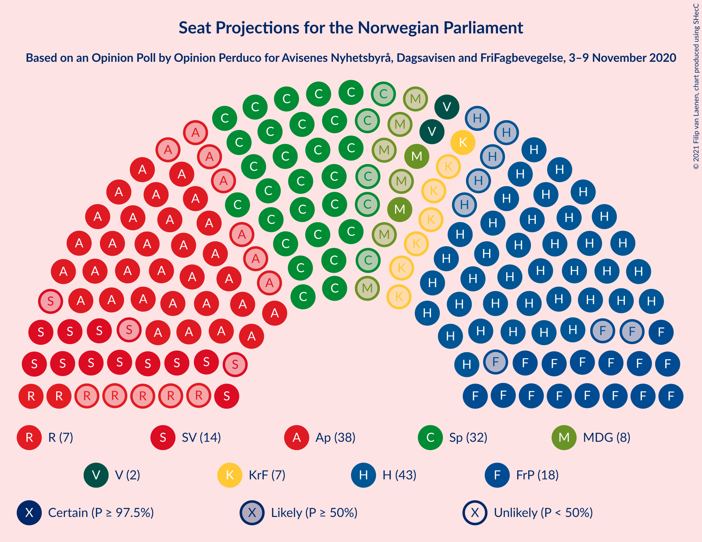
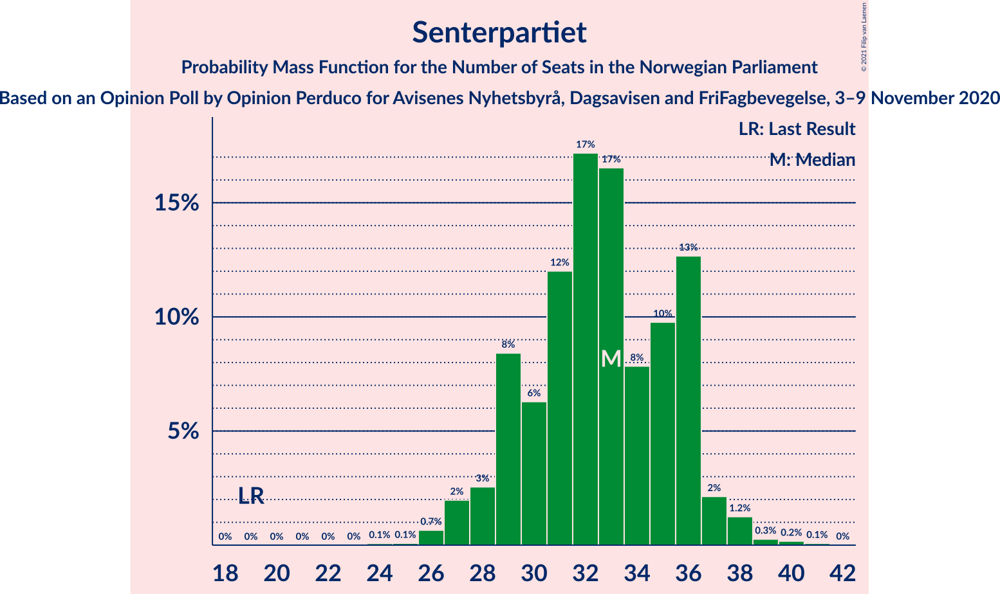
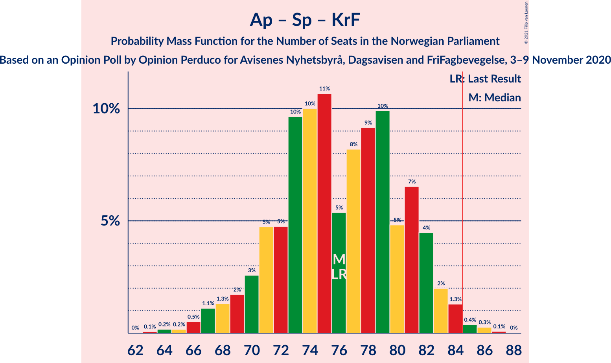

# Opinion Poll by Opinion Perduco for Avisenes Nyhetsbyrå, Dagsavisen and FriFagbevegelse, 3–9 November 2020

<a href="#voting-intentions">Voting Intentions</a> | <a href="#seats">Seats</a> | <a href="#coalitions">Coalitions</a> | <a href="#technical-information">Technical Information</a>

## Voting Intentions

### Confidence Intervals

| Party | Last Result | Poll Result | 80% Confidence Interval | 90% Confidence Interval | 95% Confidence Interval | 99% Confidence Interval |
|:-----:|:-----------:|:-----------:|:-----------------------:|:-----------------------:|:-----------------------:|:-----------------------:|
| Høyre | 25.0% | 24.6% | 22.8–26.4% |22.4–26.9% |21.9–27.4% |21.2–28.3% |
| Arbeiderpartiet | 27.4% | 20.3% | 18.7–22.1% |18.3–22.6% |17.9–23.0% |17.2–23.8% |
| Senterpartiet | 10.3% | 17.8% | 16.2–19.4% |15.8–19.9% |15.5–20.3% |14.8–21.1% |
| Fremskrittspartiet | 15.2% | 10.9% | 9.7–12.3% |9.4–12.7% |9.1–13.1% |8.6–13.8% |
| Sosialistisk Venstreparti | 6.0% | 8.0% | 7.0–9.3% |6.7–9.6% |6.5–9.9% |6.0–10.6% |
| Miljøpartiet De Grønne | 3.2% | 5.0% | 4.2–6.0% |3.9–6.3% |3.7–6.5% |3.4–7.0% |
| Rødt | 2.4% | 4.2% | 3.5–5.2% |3.3–5.5% |3.1–5.7% |2.8–6.2% |
| Kristelig Folkeparti | 4.2% | 4.2% | 3.5–5.2% |3.3–5.5% |3.1–5.7% |2.8–6.2% |
| Venstre | 4.4% | 3.4% | 2.8–4.3% |2.6–4.5% |2.4–4.8% |2.1–5.2% |

*Note:* The poll result column reflects the actual value used in the calculations. Published results may vary slightly, and in addition be rounded to fewer digits.

## Seats

### Confidence Intervals

| Party | Last Result | Median | 80% Confidence Interval | 90% Confidence Interval | 95% Confidence Interval | 99% Confidence Interval |
|:-----:|:-----------:|:------:|:-----------------------:|:-----------------------:|:-----------------------:|:-----------------------:|
| <a href="#høyre">Høyre</a> | 45 | 43 | 39–46 |39–48 |38–49 |36–52 |
| <a href="#arbeiderpartiet">Arbeiderpartiet</a> | 49 | 38 | 33–41 |33–41 |31–43 |29–43 |
| <a href="#senterpartiet">Senterpartiet</a> | 19 | 33 | 29–36 |28–36 |27–37 |26–39 |
| <a href="#fremskrittspartiet">Fremskrittspartiet</a> | 27 | 19 | 16–22 |16–23 |15–23 |14–24 |
| <a href="#sosialistisk-venstreparti">Sosialistisk Venstreparti</a> | 11 | 14 | 12–16 |11–17 |11–17 |10–19 |
| <a href="#miljøpartiet-de-grønne">Miljøpartiet De Grønne</a> | 1 | 8 | 7–10 |2–11 |2–11 |2–12 |
| <a href="#rødt">Rødt</a> | 1 | 7 | 2–9 |2–9 |2–10 |1–11 |
| <a href="#kristelig-folkeparti">Kristelig Folkeparti</a> | 8 | 7 | 2–9 |2–9 |1–9 |1–11 |
| <a href="#venstre">Venstre</a> | 8 | 2 | 2–7 |2–8 |2–8 |1–9 |

### Høyre

*For a full overview of the results for this party, see the [Høyre](party-høyre.html) page.*

| Number of Seats | Probability | Accumulated | Special Marks |
|:---------------:|:-----------:|:-----------:|:-------------:|
| 34 | 0.1% | 100% |  |
| 35 | 0.3% | 99.8% |  |
| 36 | 0.5% | 99.5% |  |
| 37 | 0.5% | 99.0% |  |
| 38 | 2% | 98% |  |
| 39 | 7% | 97% |  |
| 40 | 8% | 90% |  |
| 41 | 15% | 82% |  |
| 42 | 15% | 68% |  |
| 43 | 15% | 53% | Median |
| 44 | 9% | 38% |  |
| 45 | 8% | 28% | Last Result |
| 46 | 11% | 21% |  |
| 47 | 4% | 10% |  |
| 48 | 2% | 6% |  |
| 49 | 2% | 4% |  |
| 50 | 0.7% | 1.5% |  |
| 51 | 0.2% | 0.8% |  |
| 52 | 0.4% | 0.5% |  |
| 53 | 0.1% | 0.2% |  |
| 54 | 0% | 0% |  |

### Arbeiderpartiet

*For a full overview of the results for this party, see the [Arbeiderpartiet](party-arbeiderpartiet.html) page.*

| Number of Seats | Probability | Accumulated | Special Marks |
|:---------------:|:-----------:|:-----------:|:-------------:|
| 28 | 0.1% | 100% |  |
| 29 | 0.4% | 99.9% |  |
| 30 | 0.7% | 99.5% |  |
| 31 | 2% | 98.8% |  |
| 32 | 2% | 97% |  |
| 33 | 10% | 95% |  |
| 34 | 7% | 85% |  |
| 35 | 9% | 78% |  |
| 36 | 7% | 69% |  |
| 37 | 7% | 62% |  |
| 38 | 10% | 55% | Median |
| 39 | 11% | 46% |  |
| 40 | 19% | 34% |  |
| 41 | 11% | 16% |  |
| 42 | 1.3% | 4% |  |
| 43 | 3% | 3% |  |
| 44 | 0.3% | 0.4% |  |
| 45 | 0.1% | 0.2% |  |
| 46 | 0% | 0% |  |
| 47 | 0% | 0% |  |
| 48 | 0% | 0% |  |
| 49 | 0% | 0% | Last Result |

### Senterpartiet

*For a full overview of the results for this party, see the [Senterpartiet](party-senterpartiet.html) page.*

| Number of Seats | Probability | Accumulated | Special Marks |
|:---------------:|:-----------:|:-----------:|:-------------:|
| 19 | 0% | 100% | Last Result |
| 20 | 0% | 100% |  |
| 21 | 0% | 100% |  |
| 22 | 0% | 100% |  |
| 23 | 0% | 100% |  |
| 24 | 0.1% | 100% |  |
| 25 | 0.1% | 99.9% |  |
| 26 | 0.7% | 99.8% |  |
| 27 | 2% | 99.2% |  |
| 28 | 3% | 97% |  |
| 29 | 8% | 95% |  |
| 30 | 6% | 86% |  |
| 31 | 12% | 80% |  |
| 32 | 17% | 68% |  |
| 33 | 17% | 51% | Median |
| 34 | 8% | 34% |  |
| 35 | 10% | 26% |  |
| 36 | 13% | 17% |  |
| 37 | 2% | 4% |  |
| 38 | 1.2% | 2% |  |
| 39 | 0.3% | 0.6% |  |
| 40 | 0.2% | 0.3% |  |
| 41 | 0.1% | 0.1% |  |
| 42 | 0% | 0% |  |

### Fremskrittspartiet

*For a full overview of the results for this party, see the [Fremskrittspartiet](party-fremskrittspartiet.html) page.*

| Number of Seats | Probability | Accumulated | Special Marks |
|:---------------:|:-----------:|:-----------:|:-------------:|
| 13 | 0.1% | 100% |  |
| 14 | 1.3% | 99.9% |  |
| 15 | 3% | 98.6% |  |
| 16 | 6% | 96% |  |
| 17 | 17% | 90% |  |
| 18 | 20% | 72% |  |
| 19 | 14% | 52% | Median |
| 20 | 17% | 38% |  |
| 21 | 10% | 21% |  |
| 22 | 6% | 11% |  |
| 23 | 3% | 5% |  |
| 24 | 2% | 2% |  |
| 25 | 0.3% | 0.4% |  |
| 26 | 0.1% | 0.1% |  |
| 27 | 0% | 0% | Last Result |

### Sosialistisk Venstreparti

*For a full overview of the results for this party, see the [Sosialistisk Venstreparti](party-sosialistiskvenstreparti.html) page.*

| Number of Seats | Probability | Accumulated | Special Marks |
|:---------------:|:-----------:|:-----------:|:-------------:|
| 9 | 0.1% | 100% |  |
| 10 | 1.4% | 99.9% |  |
| 11 | 6% | 98.5% | Last Result |
| 12 | 12% | 93% |  |
| 13 | 16% | 81% |  |
| 14 | 27% | 65% | Median |
| 15 | 23% | 39% |  |
| 16 | 8% | 15% |  |
| 17 | 5% | 7% |  |
| 18 | 2% | 2% |  |
| 19 | 0.4% | 0.7% |  |
| 20 | 0.3% | 0.3% |  |
| 21 | 0% | 0% |  |

### Miljøpartiet De Grønne

*For a full overview of the results for this party, see the [Miljøpartiet De Grønne](party-miljøpartietdegrønne.html) page.*

| Number of Seats | Probability | Accumulated | Special Marks |
|:---------------:|:-----------:|:-----------:|:-------------:|
| 1 | 0% | 100% | Last Result |
| 2 | 7% | 100% |  |
| 3 | 0.4% | 93% |  |
| 4 | 0.6% | 92% |  |
| 5 | 0% | 92% |  |
| 6 | 0.1% | 92% |  |
| 7 | 5% | 92% |  |
| 8 | 43% | 87% | Median |
| 9 | 17% | 44% |  |
| 10 | 20% | 27% |  |
| 11 | 5% | 7% |  |
| 12 | 2% | 2% |  |
| 13 | 0.3% | 0.3% |  |
| 14 | 0% | 0% |  |

### Rødt

*For a full overview of the results for this party, see the [Rødt](party-rødt.html) page.*

| Number of Seats | Probability | Accumulated | Special Marks |
|:---------------:|:-----------:|:-----------:|:-------------:|
| 1 | 0.8% | 100% | Last Result |
| 2 | 33% | 99.2% |  |
| 3 | 0% | 66% |  |
| 4 | 0% | 66% |  |
| 5 | 0% | 66% |  |
| 6 | 3% | 66% |  |
| 7 | 22% | 63% | Median |
| 8 | 27% | 41% |  |
| 9 | 10% | 13% |  |
| 10 | 3% | 4% |  |
| 11 | 0.7% | 0.8% |  |
| 12 | 0.1% | 0.1% |  |
| 13 | 0% | 0% |  |

### Kristelig Folkeparti

*For a full overview of the results for this party, see the [Kristelig Folkeparti](party-kristeligfolkeparti.html) page.*

| Number of Seats | Probability | Accumulated | Special Marks |
|:---------------:|:-----------:|:-----------:|:-------------:|
| 1 | 5% | 100% |  |
| 2 | 16% | 95% |  |
| 3 | 12% | 80% |  |
| 4 | 0% | 68% |  |
| 5 | 0% | 68% |  |
| 6 | 2% | 68% |  |
| 7 | 29% | 66% | Median |
| 8 | 20% | 37% | Last Result |
| 9 | 14% | 17% |  |
| 10 | 2% | 2% |  |
| 11 | 0.5% | 0.6% |  |
| 12 | 0.1% | 0.1% |  |
| 13 | 0% | 0% |  |

### Venstre

*For a full overview of the results for this party, see the [Venstre](party-venstre.html) page.*

| Number of Seats | Probability | Accumulated | Special Marks |
|:---------------:|:-----------:|:-----------:|:-------------:|
| 1 | 1.2% | 100% |  |
| 2 | 78% | 98.8% | Median |
| 3 | 2% | 21% |  |
| 4 | 0% | 18% |  |
| 5 | 0% | 18% |  |
| 6 | 2% | 18% |  |
| 7 | 10% | 16% |  |
| 8 | 6% | 6% | Last Result |
| 9 | 0.6% | 0.6% |  |
| 10 | 0.1% | 0.1% |  |
| 11 | 0% | 0% |  |

## Coalitions

### Confidence Intervals

| Coalition | Last Result | Median | Majority? | 80% Confidence Interval | 90% Confidence Interval | 95% Confidence Interval | 99% Confidence Interval |
|:---------:|:-----------:|:------:|:---------:|:-----------------------:|:-----------------------:|:-----------------------:|:-----------------------:|
| Høyre – Senterpartiet – Fremskrittspartiet – Kristelig Folkeparti – Venstre | 107 | 103 | 100% | 98–109 | 97–110 | 96–111 | 95–114 |
| Arbeiderpartiet – Senterpartiet – Sosialistisk Venstreparti – Miljøpartiet De Grønne – Kristelig Folkeparti | 88 | 99 | 99.9% | 93–104 | 91–105 | 90–105 | 88–107 |
| Arbeiderpartiet – Senterpartiet – Sosialistisk Venstreparti – Miljøpartiet De Grønne – Rødt | 81 | 99 | 99.9% | 92–103 | 91–105 | 90–105 | 86–107 |
| Arbeiderpartiet – Senterpartiet – Sosialistisk Venstreparti – Miljøpartiet De Grønne | 80 | 93 | 97% | 88–97 | 86–99 | 84–99 | 83–101 |
| Arbeiderpartiet – Senterpartiet – Sosialistisk Venstreparti – Rødt | 80 | 90 | 89% | 84–95 | 83–96 | 82–97 | 79–99 |
| Arbeiderpartiet – Senterpartiet – Miljøpartiet De Grønne – Kristelig Folkeparti | 77 | 85 | 53% | 80–90 | 77–90 | 75–91 | 73–93 |
| Arbeiderpartiet – Senterpartiet – Sosialistisk Venstreparti | 79 | 85 | 52% | 79–89 | 78–89 | 76–90 | 75–93 |
| Høyre – Fremskrittspartiet – Miljøpartiet De Grønne – Kristelig Folkeparti – Venstre | 89 | 79 | 11% | 74–85 | 73–86 | 72–87 | 70–90 |
| Arbeiderpartiet – Senterpartiet – Kristelig Folkeparti | 76 | 76 | 0.8% | 71–81 | 69–82 | 68–83 | 66–85 |
| Høyre – Fremskrittspartiet – Kristelig Folkeparti – Venstre | 88 | 70 | 0.1% | 66–77 | 64–78 | 64–79 | 62–83 |
| Arbeiderpartiet – Senterpartiet | 68 | 71 | 0% | 66–74 | 64–76 | 63–76 | 60–78 |
| Høyre – Fremskrittspartiet – Venstre | 80 | 65 | 0% | 60–70 | 58–72 | 57–73 | 55–76 |
| Høyre – Fremskrittspartiet | 72 | 62 | 0% | 57–67 | 56–68 | 55–69 | 52–72 |
| Høyre – Kristelig Folkeparti – Venstre | 61 | 52 | 0% | 47–57 | 46–59 | 44–59 | 44–63 |
| Arbeiderpartiet – Sosialistisk Venstreparti | 60 | 52 | 0% | 47–55 | 45–56 | 45–57 | 43–59 |
| Senterpartiet – Kristelig Folkeparti – Venstre | 35 | 42 | 0% | 37–46 | 35–47 | 34–48 | 32–51 |

### Høyre – Senterpartiet – Fremskrittspartiet – Kristelig Folkeparti – Venstre

| Number of Seats | Probability | Accumulated | Special Marks |
|:---------------:|:-----------:|:-----------:|:-------------:|
| 92 | 0% | 100% |  |
| 93 | 0.2% | 99.9% |  |
| 94 | 0.2% | 99.7% |  |
| 95 | 1.2% | 99.5% |  |
| 96 | 0.8% | 98% |  |
| 97 | 5% | 97% |  |
| 98 | 4% | 93% |  |
| 99 | 9% | 89% |  |
| 100 | 5% | 80% |  |
| 101 | 8% | 76% |  |
| 102 | 10% | 67% |  |
| 103 | 12% | 57% |  |
| 104 | 7% | 46% | Median |
| 105 | 6% | 39% |  |
| 106 | 10% | 33% |  |
| 107 | 7% | 23% | Last Result |
| 108 | 4% | 16% |  |
| 109 | 4% | 11% |  |
| 110 | 3% | 7% |  |
| 111 | 2% | 4% |  |
| 112 | 1.0% | 2% |  |
| 113 | 0.5% | 1.2% |  |
| 114 | 0.2% | 0.7% |  |
| 115 | 0.3% | 0.5% |  |
| 116 | 0.1% | 0.1% |  |
| 117 | 0% | 0% |  |

### Arbeiderpartiet – Senterpartiet – Sosialistisk Venstreparti – Miljøpartiet De Grønne – Kristelig Folkeparti

| Number of Seats | Probability | Accumulated | Special Marks |
|:---------------:|:-----------:|:-----------:|:-------------:|
| 84 | 0% | 100% |  |
| 85 | 0.1% | 99.9% | Majority |
| 86 | 0.1% | 99.9% |  |
| 87 | 0.3% | 99.8% |  |
| 88 | 1.2% | 99.5% | Last Result |
| 89 | 0.6% | 98% |  |
| 90 | 2% | 98% |  |
| 91 | 1.3% | 96% |  |
| 92 | 2% | 95% |  |
| 93 | 3% | 92% |  |
| 94 | 4% | 89% |  |
| 95 | 8% | 85% |  |
| 96 | 10% | 76% |  |
| 97 | 5% | 66% |  |
| 98 | 7% | 61% |  |
| 99 | 12% | 54% |  |
| 100 | 13% | 42% | Median |
| 101 | 12% | 29% |  |
| 102 | 2% | 17% |  |
| 103 | 4% | 16% |  |
| 104 | 4% | 12% |  |
| 105 | 6% | 8% |  |
| 106 | 0.8% | 2% |  |
| 107 | 0.6% | 0.9% |  |
| 108 | 0.1% | 0.3% |  |
| 109 | 0.2% | 0.2% |  |
| 110 | 0% | 0% |  |

### Arbeiderpartiet – Senterpartiet – Sosialistisk Venstreparti – Miljøpartiet De Grønne – Rødt

| Number of Seats | Probability | Accumulated | Special Marks |
|:---------------:|:-----------:|:-----------:|:-------------:|
| 81 | 0% | 100% | Last Result |
| 82 | 0% | 100% |  |
| 83 | 0.1% | 100% |  |
| 84 | 0% | 99.9% |  |
| 85 | 0.1% | 99.9% | Majority |
| 86 | 0.3% | 99.8% |  |
| 87 | 0.2% | 99.5% |  |
| 88 | 0.4% | 99.3% |  |
| 89 | 0.4% | 98.9% |  |
| 90 | 1.3% | 98.5% |  |
| 91 | 3% | 97% |  |
| 92 | 5% | 95% |  |
| 93 | 3% | 89% |  |
| 94 | 5% | 86% |  |
| 95 | 9% | 81% |  |
| 96 | 6% | 72% |  |
| 97 | 6% | 66% |  |
| 98 | 7% | 60% |  |
| 99 | 12% | 53% |  |
| 100 | 6% | 41% | Median |
| 101 | 19% | 35% |  |
| 102 | 3% | 16% |  |
| 103 | 4% | 13% |  |
| 104 | 4% | 9% |  |
| 105 | 3% | 5% |  |
| 106 | 2% | 2% |  |
| 107 | 0.5% | 0.8% |  |
| 108 | 0.2% | 0.3% |  |
| 109 | 0.1% | 0.2% |  |
| 110 | 0% | 0.1% |  |
| 111 | 0% | 0% |  |

### Arbeiderpartiet – Senterpartiet – Sosialistisk Venstreparti – Miljøpartiet De Grønne

| Number of Seats | Probability | Accumulated | Special Marks |
|:---------------:|:-----------:|:-----------:|:-------------:|
| 78 | 0% | 100% |  |
| 79 | 0.1% | 99.9% |  |
| 80 | 0.1% | 99.9% | Last Result |
| 81 | 0.2% | 99.8% |  |
| 82 | 0.1% | 99.7% |  |
| 83 | 1.0% | 99.5% |  |
| 84 | 1.2% | 98% |  |
| 85 | 1.4% | 97% | Majority |
| 86 | 3% | 96% |  |
| 87 | 3% | 93% |  |
| 88 | 7% | 90% |  |
| 89 | 8% | 83% |  |
| 90 | 7% | 75% |  |
| 91 | 6% | 67% |  |
| 92 | 7% | 61% |  |
| 93 | 18% | 54% | Median |
| 94 | 8% | 36% |  |
| 95 | 5% | 28% |  |
| 96 | 5% | 23% |  |
| 97 | 11% | 18% |  |
| 98 | 3% | 8% |  |
| 99 | 4% | 5% |  |
| 100 | 0.5% | 1.5% |  |
| 101 | 0.6% | 0.9% |  |
| 102 | 0.2% | 0.4% |  |
| 103 | 0.2% | 0.2% |  |
| 104 | 0% | 0% |  |

### Arbeiderpartiet – Senterpartiet – Sosialistisk Venstreparti – Rødt

| Number of Seats | Probability | Accumulated | Special Marks |
|:---------------:|:-----------:|:-----------:|:-------------:|
| 77 | 0.1% | 100% |  |
| 78 | 0.3% | 99.8% |  |
| 79 | 0.2% | 99.6% |  |
| 80 | 0.4% | 99.4% | Last Result |
| 81 | 0.8% | 99.0% |  |
| 82 | 3% | 98% |  |
| 83 | 3% | 95% |  |
| 84 | 3% | 93% |  |
| 85 | 3% | 89% | Majority |
| 86 | 8% | 86% |  |
| 87 | 6% | 78% |  |
| 88 | 9% | 72% |  |
| 89 | 7% | 63% |  |
| 90 | 6% | 56% |  |
| 91 | 10% | 50% |  |
| 92 | 7% | 40% | Median |
| 93 | 17% | 33% |  |
| 94 | 5% | 16% |  |
| 95 | 4% | 11% |  |
| 96 | 2% | 7% |  |
| 97 | 2% | 4% |  |
| 98 | 2% | 2% |  |
| 99 | 0.4% | 0.7% |  |
| 100 | 0.1% | 0.3% |  |
| 101 | 0.1% | 0.2% |  |
| 102 | 0.1% | 0.1% |  |
| 103 | 0% | 0% |  |

### Arbeiderpartiet – Senterpartiet – Miljøpartiet De Grønne – Kristelig Folkeparti

| Number of Seats | Probability | Accumulated | Special Marks |
|:---------------:|:-----------:|:-----------:|:-------------:|
| 70 | 0.1% | 100% |  |
| 71 | 0.2% | 99.9% |  |
| 72 | 0.1% | 99.7% |  |
| 73 | 1.1% | 99.6% |  |
| 74 | 0.5% | 98.5% |  |
| 75 | 1.0% | 98% |  |
| 76 | 0.7% | 97% |  |
| 77 | 2% | 96% | Last Result |
| 78 | 2% | 94% |  |
| 79 | 2% | 92% |  |
| 80 | 6% | 90% |  |
| 81 | 9% | 84% |  |
| 82 | 9% | 75% |  |
| 83 | 5% | 66% |  |
| 84 | 8% | 60% |  |
| 85 | 11% | 53% | Majority |
| 86 | 14% | 42% | Median |
| 87 | 6% | 28% |  |
| 88 | 3% | 22% |  |
| 89 | 8% | 19% |  |
| 90 | 7% | 11% |  |
| 91 | 2% | 4% |  |
| 92 | 1.4% | 2% |  |
| 93 | 0.4% | 0.9% |  |
| 94 | 0.2% | 0.5% |  |
| 95 | 0.2% | 0.3% |  |
| 96 | 0.1% | 0.1% |  |
| 97 | 0% | 0% |  |

### Arbeiderpartiet – Senterpartiet – Sosialistisk Venstreparti

| Number of Seats | Probability | Accumulated | Special Marks |
|:---------------:|:-----------:|:-----------:|:-------------:|
| 72 | 0.1% | 100% |  |
| 73 | 0.1% | 99.9% |  |
| 74 | 0.1% | 99.8% |  |
| 75 | 1.3% | 99.7% |  |
| 76 | 0.9% | 98% |  |
| 77 | 2% | 97% |  |
| 78 | 3% | 96% |  |
| 79 | 4% | 93% | Last Result |
| 80 | 12% | 89% |  |
| 81 | 4% | 78% |  |
| 82 | 7% | 73% |  |
| 83 | 5% | 66% |  |
| 84 | 10% | 62% |  |
| 85 | 15% | 52% | Median, Majority |
| 86 | 8% | 36% |  |
| 87 | 11% | 28% |  |
| 88 | 4% | 17% |  |
| 89 | 8% | 13% |  |
| 90 | 2% | 4% |  |
| 91 | 1.1% | 2% |  |
| 92 | 0.6% | 1.2% |  |
| 93 | 0.3% | 0.6% |  |
| 94 | 0.3% | 0.3% |  |
| 95 | 0.1% | 0.1% |  |
| 96 | 0% | 0% |  |

### Høyre – Fremskrittspartiet – Miljøpartiet De Grønne – Kristelig Folkeparti – Venstre

| Number of Seats | Probability | Accumulated | Special Marks |
|:---------------:|:-----------:|:-----------:|:-------------:|
| 67 | 0.1% | 100% |  |
| 68 | 0.1% | 99.9% |  |
| 69 | 0.1% | 99.8% |  |
| 70 | 0.4% | 99.7% |  |
| 71 | 2% | 99.3% |  |
| 72 | 2% | 98% |  |
| 73 | 2% | 96% |  |
| 74 | 4% | 93% |  |
| 75 | 5% | 89% |  |
| 76 | 17% | 84% |  |
| 77 | 7% | 67% |  |
| 78 | 10% | 60% |  |
| 79 | 6% | 50% | Median |
| 80 | 7% | 44% |  |
| 81 | 9% | 37% |  |
| 82 | 6% | 28% |  |
| 83 | 8% | 22% |  |
| 84 | 3% | 14% |  |
| 85 | 3% | 11% | Majority |
| 86 | 3% | 7% |  |
| 87 | 3% | 5% |  |
| 88 | 0.8% | 2% |  |
| 89 | 0.4% | 1.0% | Last Result |
| 90 | 0.2% | 0.6% |  |
| 91 | 0.3% | 0.4% |  |
| 92 | 0.1% | 0.2% |  |
| 93 | 0% | 0% |  |

### Arbeiderpartiet – Senterpartiet – Kristelig Folkeparti

| Number of Seats | Probability | Accumulated | Special Marks |
|:---------------:|:-----------:|:-----------:|:-------------:|
| 63 | 0.1% | 100% |  |
| 64 | 0.2% | 99.9% |  |
| 65 | 0.2% | 99.7% |  |
| 66 | 0.5% | 99.5% |  |
| 67 | 1.1% | 99.0% |  |
| 68 | 1.3% | 98% |  |
| 69 | 2% | 97% |  |
| 70 | 3% | 95% |  |
| 71 | 5% | 92% |  |
| 72 | 5% | 88% |  |
| 73 | 10% | 83% |  |
| 74 | 10% | 73% |  |
| 75 | 11% | 63% |  |
| 76 | 5% | 53% | Last Result |
| 77 | 8% | 47% |  |
| 78 | 9% | 39% | Median |
| 79 | 10% | 30% |  |
| 80 | 5% | 20% |  |
| 81 | 7% | 15% |  |
| 82 | 4% | 9% |  |
| 83 | 2% | 4% |  |
| 84 | 1.3% | 2% |  |
| 85 | 0.4% | 0.8% | Majority |
| 86 | 0.3% | 0.4% |  |
| 87 | 0.1% | 0.1% |  |
| 88 | 0% | 0% |  |

### Høyre – Fremskrittspartiet – Kristelig Folkeparti – Venstre

| Number of Seats | Probability | Accumulated | Special Marks |
|:---------------:|:-----------:|:-----------:|:-------------:|
| 59 | 0% | 100% |  |
| 60 | 0.1% | 99.9% |  |
| 61 | 0.2% | 99.8% |  |
| 62 | 0.5% | 99.7% |  |
| 63 | 2% | 99.2% |  |
| 64 | 3% | 98% |  |
| 65 | 4% | 95% |  |
| 66 | 4% | 91% |  |
| 67 | 3% | 87% |  |
| 68 | 19% | 84% |  |
| 69 | 6% | 65% |  |
| 70 | 12% | 59% |  |
| 71 | 7% | 47% | Median |
| 72 | 6% | 40% |  |
| 73 | 6% | 34% |  |
| 74 | 9% | 28% |  |
| 75 | 5% | 19% |  |
| 76 | 3% | 14% |  |
| 77 | 5% | 11% |  |
| 78 | 3% | 5% |  |
| 79 | 1.3% | 3% |  |
| 80 | 0.4% | 1.5% |  |
| 81 | 0.4% | 1.1% |  |
| 82 | 0.2% | 0.7% |  |
| 83 | 0.3% | 0.5% |  |
| 84 | 0.1% | 0.2% |  |
| 85 | 0% | 0.1% | Majority |
| 86 | 0.1% | 0.1% |  |
| 87 | 0% | 0% |  |
| 88 | 0% | 0% | Last Result |

### Arbeiderpartiet – Senterpartiet

| Number of Seats | Probability | Accumulated | Special Marks |
|:---------------:|:-----------:|:-----------:|:-------------:|
| 58 | 0% | 100% |  |
| 59 | 0.1% | 99.9% |  |
| 60 | 0.4% | 99.8% |  |
| 61 | 0.4% | 99.4% |  |
| 62 | 0.8% | 99.0% |  |
| 63 | 3% | 98% |  |
| 64 | 2% | 95% |  |
| 65 | 4% | 94% |  |
| 66 | 11% | 90% |  |
| 67 | 5% | 79% |  |
| 68 | 7% | 74% | Last Result |
| 69 | 6% | 67% |  |
| 70 | 9% | 61% |  |
| 71 | 16% | 52% | Median |
| 72 | 11% | 36% |  |
| 73 | 3% | 24% |  |
| 74 | 13% | 21% |  |
| 75 | 2% | 7% |  |
| 76 | 3% | 5% |  |
| 77 | 2% | 2% |  |
| 78 | 0.4% | 0.7% |  |
| 79 | 0.2% | 0.3% |  |
| 80 | 0.1% | 0.1% |  |
| 81 | 0% | 0% |  |

### Høyre – Fremskrittspartiet – Venstre

| Number of Seats | Probability | Accumulated | Special Marks |
|:---------------:|:-----------:|:-----------:|:-------------:|
| 54 | 0.2% | 100% |  |
| 55 | 0.3% | 99.8% |  |
| 56 | 0.6% | 99.5% |  |
| 57 | 1.4% | 98.9% |  |
| 58 | 3% | 97% |  |
| 59 | 3% | 95% |  |
| 60 | 2% | 91% |  |
| 61 | 12% | 89% |  |
| 62 | 13% | 77% |  |
| 63 | 4% | 64% |  |
| 64 | 7% | 60% | Median |
| 65 | 8% | 53% |  |
| 66 | 12% | 45% |  |
| 67 | 9% | 33% |  |
| 68 | 9% | 25% |  |
| 69 | 4% | 16% |  |
| 70 | 3% | 13% |  |
| 71 | 4% | 9% |  |
| 72 | 1.3% | 5% |  |
| 73 | 2% | 4% |  |
| 74 | 1.0% | 2% |  |
| 75 | 0.3% | 0.8% |  |
| 76 | 0.2% | 0.6% |  |
| 77 | 0.1% | 0.3% |  |
| 78 | 0.1% | 0.2% |  |
| 79 | 0.1% | 0.1% |  |
| 80 | 0% | 0% | Last Result |

### Høyre – Fremskrittspartiet

| Number of Seats | Probability | Accumulated | Special Marks |
|:---------------:|:-----------:|:-----------:|:-------------:|
| 51 | 0.1% | 100% |  |
| 52 | 0.3% | 99.8% |  |
| 53 | 0.4% | 99.5% |  |
| 54 | 0.8% | 99.1% |  |
| 55 | 2% | 98% |  |
| 56 | 4% | 96% |  |
| 57 | 6% | 93% |  |
| 58 | 3% | 87% |  |
| 59 | 13% | 84% |  |
| 60 | 14% | 70% |  |
| 61 | 6% | 56% |  |
| 62 | 6% | 50% | Median |
| 63 | 8% | 44% |  |
| 64 | 12% | 37% |  |
| 65 | 9% | 25% |  |
| 66 | 6% | 16% |  |
| 67 | 4% | 10% |  |
| 68 | 2% | 7% |  |
| 69 | 2% | 5% |  |
| 70 | 1.2% | 2% |  |
| 71 | 0.6% | 1.1% |  |
| 72 | 0.4% | 0.6% | Last Result |
| 73 | 0.1% | 0.2% |  |
| 74 | 0% | 0.1% |  |
| 75 | 0.1% | 0.1% |  |
| 76 | 0% | 0% |  |

### Høyre – Kristelig Folkeparti – Venstre

| Number of Seats | Probability | Accumulated | Special Marks |
|:---------------:|:-----------:|:-----------:|:-------------:|
| 40 | 0.1% | 100% |  |
| 41 | 0.1% | 99.9% |  |
| 42 | 0.1% | 99.9% |  |
| 43 | 0.2% | 99.8% |  |
| 44 | 2% | 99.5% |  |
| 45 | 1.3% | 97% |  |
| 46 | 1.4% | 96% |  |
| 47 | 5% | 95% |  |
| 48 | 5% | 90% |  |
| 49 | 5% | 84% |  |
| 50 | 16% | 79% |  |
| 51 | 12% | 63% |  |
| 52 | 12% | 51% | Median |
| 53 | 6% | 40% |  |
| 54 | 11% | 34% |  |
| 55 | 8% | 23% |  |
| 56 | 3% | 15% |  |
| 57 | 4% | 12% |  |
| 58 | 2% | 7% |  |
| 59 | 3% | 5% |  |
| 60 | 1.3% | 2% |  |
| 61 | 0.3% | 1.1% | Last Result |
| 62 | 0.2% | 0.8% |  |
| 63 | 0.3% | 0.5% |  |
| 64 | 0% | 0.2% |  |
| 65 | 0.1% | 0.1% |  |
| 66 | 0% | 0.1% |  |
| 67 | 0.1% | 0.1% |  |
| 68 | 0% | 0% |  |

### Arbeiderpartiet – Sosialistisk Venstreparti

| Number of Seats | Probability | Accumulated | Special Marks |
|:---------------:|:-----------:|:-----------:|:-------------:|
| 40 | 0% | 100% |  |
| 41 | 0.1% | 99.9% |  |
| 42 | 0.1% | 99.9% |  |
| 43 | 0.6% | 99.7% |  |
| 44 | 1.4% | 99.2% |  |
| 45 | 3% | 98% |  |
| 46 | 2% | 95% |  |
| 47 | 9% | 92% |  |
| 48 | 7% | 83% |  |
| 49 | 8% | 77% |  |
| 50 | 7% | 68% |  |
| 51 | 4% | 62% |  |
| 52 | 8% | 57% | Median |
| 53 | 15% | 50% |  |
| 54 | 16% | 34% |  |
| 55 | 11% | 19% |  |
| 56 | 4% | 8% |  |
| 57 | 1.4% | 3% |  |
| 58 | 1.2% | 2% |  |
| 59 | 0.2% | 0.6% |  |
| 60 | 0.2% | 0.3% | Last Result |
| 61 | 0.1% | 0.1% |  |
| 62 | 0% | 0% |  |

### Senterpartiet – Kristelig Folkeparti – Venstre

| Number of Seats | Probability | Accumulated | Special Marks |
|:---------------:|:-----------:|:-----------:|:-------------:|
| 31 | 0.1% | 100% |  |
| 32 | 0.6% | 99.9% |  |
| 33 | 1.2% | 99.3% |  |
| 34 | 2% | 98% |  |
| 35 | 2% | 97% | Last Result |
| 36 | 4% | 95% |  |
| 37 | 3% | 91% |  |
| 38 | 7% | 88% |  |
| 39 | 7% | 81% |  |
| 40 | 15% | 74% |  |
| 41 | 5% | 59% |  |
| 42 | 13% | 54% | Median |
| 43 | 11% | 41% |  |
| 44 | 9% | 30% |  |
| 45 | 7% | 21% |  |
| 46 | 7% | 14% |  |
| 47 | 3% | 7% |  |
| 48 | 2% | 4% |  |
| 49 | 0.9% | 2% |  |
| 50 | 0.4% | 1.1% |  |
| 51 | 0.3% | 0.7% |  |
| 52 | 0.2% | 0.4% |  |
| 53 | 0.1% | 0.2% |  |
| 54 | 0.1% | 0.1% |  |
| 55 | 0% | 0% |  |

## Technical Information

### Opinion Poll

+ **Polling firm:** Opinion Perduco
+ **Commissioner(s):** Avisenes Nyhetsbyrå, Dagsavisen and FriFagbevegelse
+ **Fieldwork period:** 3–9 November 2020

### Calculations

+ **Sample size:** 969
+ **Simulations done:** 1,048,576
+ **Error estimate:** 1.34%

