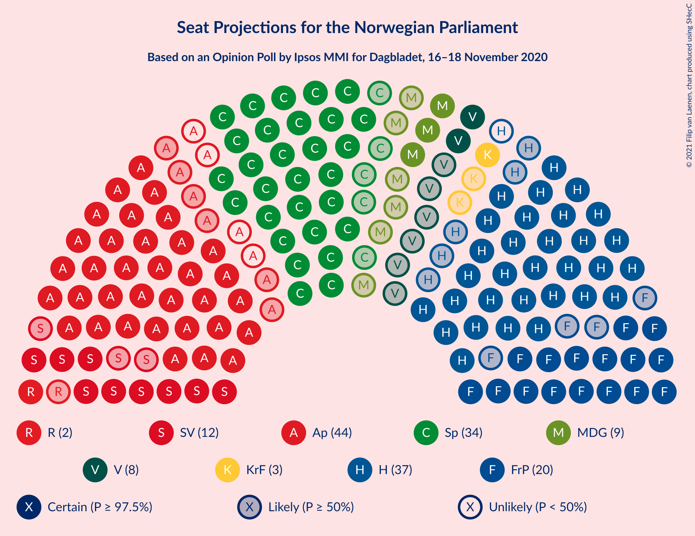
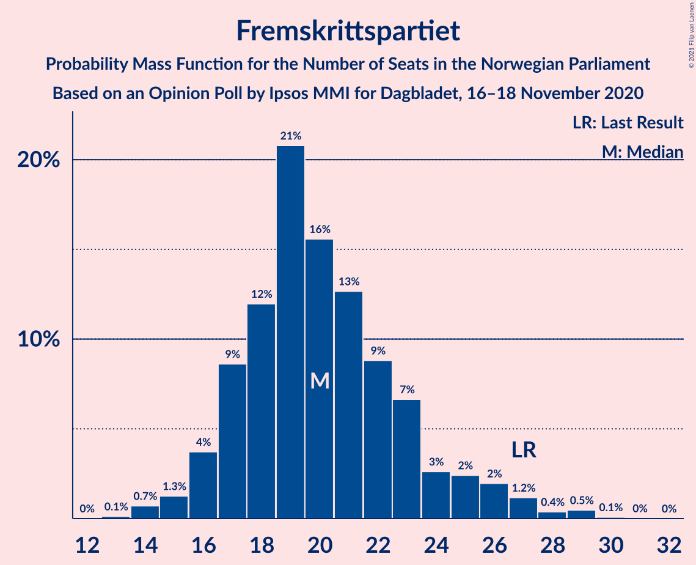
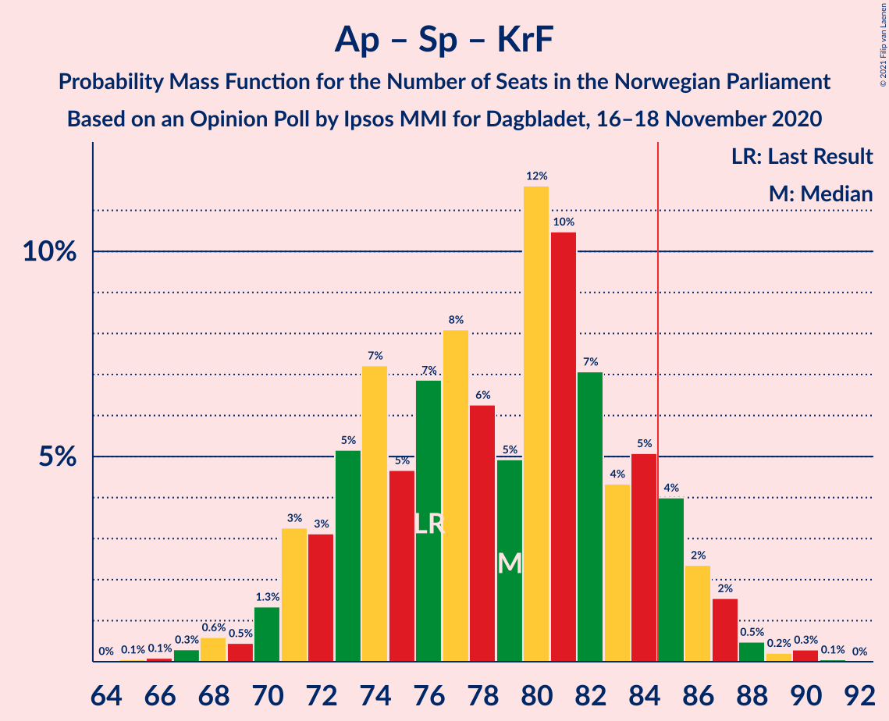
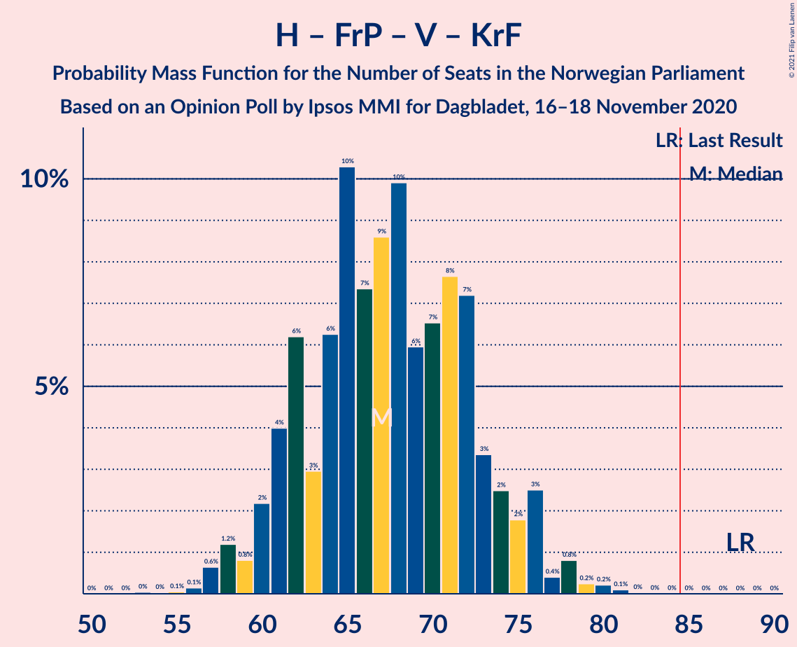
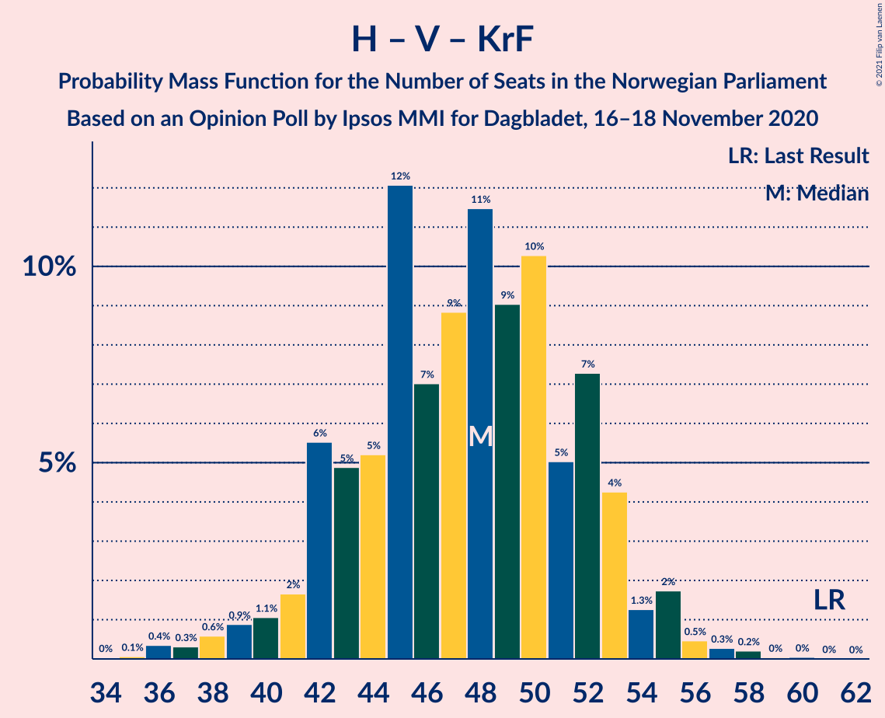
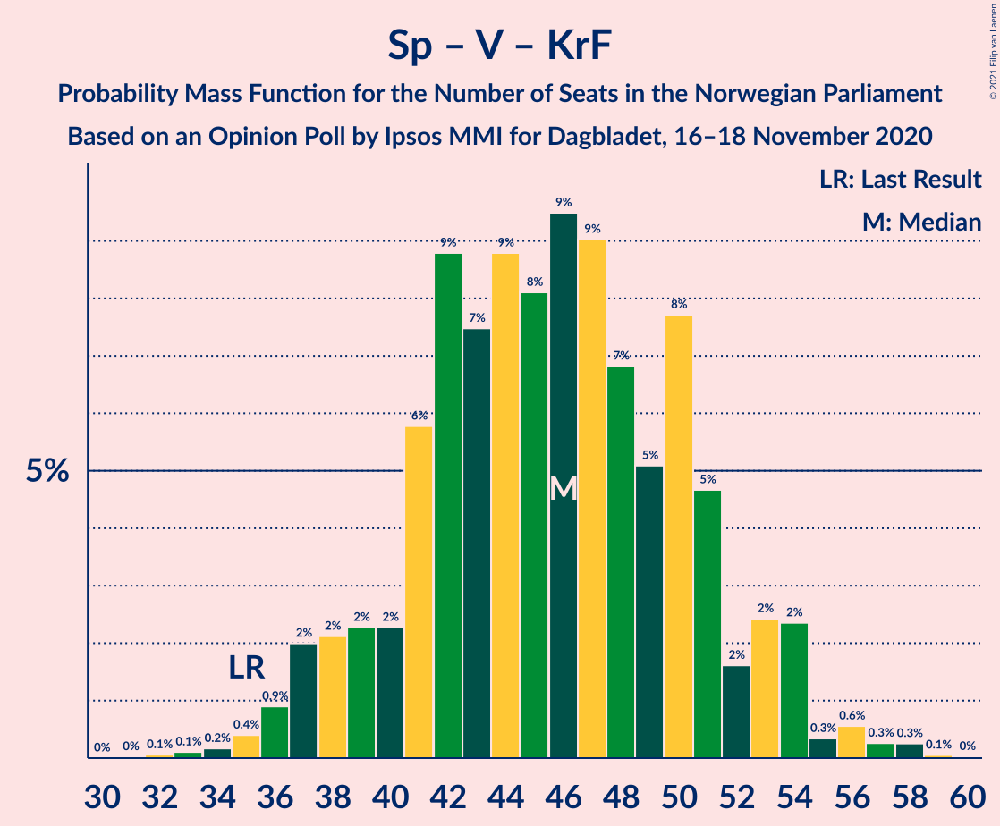

# Opinion Poll by Ipsos MMI for Dagbladet, 16–18 November 2020

<a href="#voting-intentions">Voting Intentions</a> | <a href="#seats">Seats</a> | <a href="#coalitions">Coalitions</a> | <a href="#technical-information">Technical Information</a>

## Voting Intentions

### Confidence Intervals

| Party | Last Result | Poll Result | 80% Confidence Interval | 90% Confidence Interval | 95% Confidence Interval | 99% Confidence Interval |
|:-----:|:-----------:|:-----------:|:-----------------------:|:-----------------------:|:-----------------------:|:-----------------------:|
| Arbeiderpartiet | 27.4% | 21.5% | 19.6–23.6% |19.1–24.2% |18.6–24.7% |17.7–25.7% |
| Høyre | 25.0% | 20.4% | 18.5–22.4% |18.0–23.0% |17.6–23.5% |16.7–24.5% |
| Senterpartiet | 10.3% | 18.7% | 16.9–20.7% |16.4–21.2% |15.9–21.7% |15.1–22.7% |
| Fremskrittspartiet | 15.2% | 12.0% | 10.5–13.7% |10.1–14.2% |9.8–14.6% |9.1–15.4% |
| Sosialistisk Venstreparti | 6.0% | 7.4% | 6.3–8.8% |6.0–9.2% |5.7–9.6% |5.2–10.3% |
| Miljøpartiet De Grønne | 3.2% | 5.3% | 4.3–6.5% |4.1–6.9% |3.8–7.2% |3.4–7.8% |
| Venstre | 4.4% | 4.6% | 3.7–5.7% |3.4–6.1% |3.2–6.4% |2.9–7.0% |
| Kristelig Folkeparti | 4.2% | 3.4% | 2.7–4.5% |2.5–4.8% |2.3–5.0% |2.0–5.6% |
| Rødt | 2.4% | 3.1% | 2.4–4.2% |2.2–4.5% |2.1–4.7% |1.8–5.2% |

*Note:* The poll result column reflects the actual value used in the calculations. Published results may vary slightly, and in addition be rounded to fewer digits.

## Seats

### Confidence Intervals

| Party | Last Result | Median | 80% Confidence Interval | 90% Confidence Interval | 95% Confidence Interval | 99% Confidence Interval |
|:-----:|:-----------:|:------:|:-----------------------:|:-----------------------:|:-----------------------:|:-----------------------:|
| <a href="#arbeiderpartiet">Arbeiderpartiet</a> | 49 | 40 | 37–44 |35–44 |34–44 |32–46 |
| <a href="#høyre">Høyre</a> | 45 | 37 | 33–41 |32–44 |31–44 |28–45 |
| <a href="#senterpartiet">Senterpartiet</a> | 19 | 34 | 32–39 |30–40 |29–40 |28–42 |
| <a href="#fremskrittspartiet">Fremskrittspartiet</a> | 27 | 19 | 16–24 |16–25 |15–27 |14–29 |
| <a href="#sosialistisk-venstreparti">Sosialistisk Venstreparti</a> | 11 | 12 | 9–15 |9–16 |9–16 |9–18 |
| <a href="#miljøpartiet-de-grønne">Miljøpartiet De Grønne</a> | 1 | 9 | 8–12 |7–12 |3–13 |2–13 |
| <a href="#venstre">Venstre</a> | 8 | 7 | 2–10 |2–11 |2–11 |2–13 |
| <a href="#kristelig-folkeparti">Kristelig Folkeparti</a> | 8 | 3 | 1–8 |1–8 |0–9 |0–10 |
| <a href="#rødt">Rødt</a> | 1 | 2 | 1–2 |1–7 |1–8 |1–9 |

### Arbeiderpartiet

*For a full overview of the results for this party, see the [Arbeiderpartiet](party-arbeiderpartiet.html) page.*

| Number of Seats | Probability | Accumulated | Special Marks |
|:---------------:|:-----------:|:-----------:|:-------------:|
| 29 | 0.1% | 100% |  |
| 30 | 0% | 99.9% |  |
| 31 | 0.2% | 99.8% |  |
| 32 | 0.3% | 99.6% |  |
| 33 | 0.4% | 99.4% |  |
| 34 | 2% | 99.0% |  |
| 35 | 3% | 97% |  |
| 36 | 3% | 94% |  |
| 37 | 16% | 91% |  |
| 38 | 12% | 75% |  |
| 39 | 8% | 62% |  |
| 40 | 7% | 55% | Median |
| 41 | 8% | 48% |  |
| 42 | 4% | 41% |  |
| 43 | 16% | 36% |  |
| 44 | 18% | 20% |  |
| 45 | 1.2% | 2% |  |
| 46 | 0.4% | 0.8% |  |
| 47 | 0.2% | 0.3% |  |
| 48 | 0.1% | 0.1% |  |
| 49 | 0% | 0% | Last Result |

### Høyre

*For a full overview of the results for this party, see the [Høyre](party-høyre.html) page.*

| Number of Seats | Probability | Accumulated | Special Marks |
|:---------------:|:-----------:|:-----------:|:-------------:|
| 25 | 0% | 100% |  |
| 26 | 0% | 99.9% |  |
| 27 | 0.1% | 99.9% |  |
| 28 | 0.6% | 99.8% |  |
| 29 | 0.2% | 99.3% |  |
| 30 | 1.2% | 99.1% |  |
| 31 | 2% | 98% |  |
| 32 | 2% | 96% |  |
| 33 | 8% | 94% |  |
| 34 | 8% | 87% |  |
| 35 | 21% | 79% |  |
| 36 | 7% | 57% |  |
| 37 | 12% | 51% | Median |
| 38 | 5% | 39% |  |
| 39 | 13% | 34% |  |
| 40 | 3% | 21% |  |
| 41 | 8% | 18% |  |
| 42 | 4% | 10% |  |
| 43 | 0.5% | 6% |  |
| 44 | 5% | 6% |  |
| 45 | 0.5% | 0.6% | Last Result |
| 46 | 0.1% | 0.1% |  |
| 47 | 0.1% | 0.1% |  |
| 48 | 0% | 0% |  |

### Senterpartiet

*For a full overview of the results for this party, see the [Senterpartiet](party-senterpartiet.html) page.*

| Number of Seats | Probability | Accumulated | Special Marks |
|:---------------:|:-----------:|:-----------:|:-------------:|
| 19 | 0% | 100% | Last Result |
| 20 | 0% | 100% |  |
| 21 | 0% | 100% |  |
| 22 | 0% | 100% |  |
| 23 | 0% | 100% |  |
| 24 | 0% | 100% |  |
| 25 | 0% | 100% |  |
| 26 | 0.1% | 100% |  |
| 27 | 0.3% | 99.8% |  |
| 28 | 0.7% | 99.5% |  |
| 29 | 3% | 98.8% |  |
| 30 | 2% | 96% |  |
| 31 | 1.0% | 94% |  |
| 32 | 14% | 93% |  |
| 33 | 14% | 80% |  |
| 34 | 18% | 65% | Median |
| 35 | 19% | 47% |  |
| 36 | 2% | 28% |  |
| 37 | 10% | 26% |  |
| 38 | 3% | 16% |  |
| 39 | 6% | 13% |  |
| 40 | 5% | 7% |  |
| 41 | 1.2% | 2% |  |
| 42 | 0.3% | 0.6% |  |
| 43 | 0.1% | 0.3% |  |
| 44 | 0.2% | 0.2% |  |
| 45 | 0% | 0% |  |

### Fremskrittspartiet

*For a full overview of the results for this party, see the [Fremskrittspartiet](party-fremskrittspartiet.html) page.*

| Number of Seats | Probability | Accumulated | Special Marks |
|:---------------:|:-----------:|:-----------:|:-------------:|
| 13 | 0% | 100% |  |
| 14 | 2% | 99.9% |  |
| 15 | 1.2% | 98% |  |
| 16 | 8% | 97% |  |
| 17 | 2% | 90% |  |
| 18 | 21% | 87% |  |
| 19 | 17% | 66% | Median |
| 20 | 16% | 49% |  |
| 21 | 10% | 34% |  |
| 22 | 10% | 23% |  |
| 23 | 2% | 13% |  |
| 24 | 3% | 11% |  |
| 25 | 4% | 8% |  |
| 26 | 0.6% | 4% |  |
| 27 | 2% | 3% | Last Result |
| 28 | 0.1% | 1.2% |  |
| 29 | 1.0% | 1.0% |  |
| 30 | 0% | 0% |  |

### Sosialistisk Venstreparti

*For a full overview of the results for this party, see the [Sosialistisk Venstreparti](party-sosialistiskvenstreparti.html) page.*

| Number of Seats | Probability | Accumulated | Special Marks |
|:---------------:|:-----------:|:-----------:|:-------------:|
| 7 | 0.1% | 100% |  |
| 8 | 0.3% | 99.9% |  |
| 9 | 15% | 99.6% |  |
| 10 | 6% | 85% |  |
| 11 | 13% | 79% | Last Result |
| 12 | 22% | 66% | Median |
| 13 | 15% | 44% |  |
| 14 | 12% | 29% |  |
| 15 | 8% | 17% |  |
| 16 | 6% | 9% |  |
| 17 | 2% | 2% |  |
| 18 | 0.2% | 0.5% |  |
| 19 | 0.3% | 0.3% |  |
| 20 | 0% | 0% |  |

### Miljøpartiet De Grønne

*For a full overview of the results for this party, see the [Miljøpartiet De Grønne](party-miljøpartietdegrønne.html) page.*

| Number of Seats | Probability | Accumulated | Special Marks |
|:---------------:|:-----------:|:-----------:|:-------------:|
| 1 | 0% | 100% | Last Result |
| 2 | 1.5% | 100% |  |
| 3 | 1.4% | 98.5% |  |
| 4 | 0.8% | 97% |  |
| 5 | 0% | 96% |  |
| 6 | 0.4% | 96% |  |
| 7 | 6% | 96% |  |
| 8 | 25% | 90% |  |
| 9 | 18% | 65% | Median |
| 10 | 22% | 47% |  |
| 11 | 14% | 25% |  |
| 12 | 8% | 12% |  |
| 13 | 4% | 4% |  |
| 14 | 0.3% | 0.3% |  |
| 15 | 0% | 0% |  |

### Venstre

*For a full overview of the results for this party, see the [Venstre](party-venstre.html) page.*

| Number of Seats | Probability | Accumulated | Special Marks |
|:---------------:|:-----------:|:-----------:|:-------------:|
| 2 | 21% | 100% |  |
| 3 | 13% | 79% |  |
| 4 | 0% | 67% |  |
| 5 | 0% | 67% |  |
| 6 | 0.8% | 67% |  |
| 7 | 18% | 66% | Median |
| 8 | 27% | 48% | Last Result |
| 9 | 11% | 21% |  |
| 10 | 4% | 10% |  |
| 11 | 5% | 6% |  |
| 12 | 0.5% | 1.1% |  |
| 13 | 0.5% | 0.6% |  |
| 14 | 0% | 0% |  |

### Kristelig Folkeparti

*For a full overview of the results for this party, see the [Kristelig Folkeparti](party-kristeligfolkeparti.html) page.*

| Number of Seats | Probability | Accumulated | Special Marks |
|:---------------:|:-----------:|:-----------:|:-------------:|
| 0 | 3% | 100% |  |
| 1 | 20% | 97% |  |
| 2 | 18% | 77% |  |
| 3 | 20% | 59% | Median |
| 4 | 0% | 39% |  |
| 5 | 0% | 39% |  |
| 6 | 13% | 39% |  |
| 7 | 8% | 26% |  |
| 8 | 15% | 18% | Last Result |
| 9 | 0.7% | 3% |  |
| 10 | 2% | 2% |  |
| 11 | 0.1% | 0.1% |  |
| 12 | 0% | 0% |  |

### Rødt

*For a full overview of the results for this party, see the [Rødt](party-rødt.html) page.*

| Number of Seats | Probability | Accumulated | Special Marks |
|:---------------:|:-----------:|:-----------:|:-------------:|
| 1 | 42% | 100% | Last Result |
| 2 | 48% | 58% | Median |
| 3 | 0% | 10% |  |
| 4 | 0% | 10% |  |
| 5 | 0.5% | 10% |  |
| 6 | 1.1% | 9% |  |
| 7 | 4% | 8% |  |
| 8 | 2% | 4% |  |
| 9 | 1.1% | 1.4% |  |
| 10 | 0.3% | 0.3% |  |
| 11 | 0% | 0% |  |

## Coalitions

### Confidence Intervals

| Coalition | Last Result | Median | Majority? | 80% Confidence Interval | 90% Confidence Interval | 95% Confidence Interval | 99% Confidence Interval |
|:---------:|:-----------:|:------:|:---------:|:-----------------------:|:-----------------------:|:-----------------------:|:-----------------------:|
| Høyre – Senterpartiet – Fremskrittspartiet – Venstre – Kristelig Folkeparti | 107 | 102 | 100% | 98–107 | 96–109 | 94–112 | 90–112 |
| Arbeiderpartiet – Senterpartiet – Sosialistisk Venstreparti – Miljøpartiet De Grønne – Kristelig Folkeparti | 88 | 100 | 100% | 94–108 | 94–109 | 92–109 | 89–111 |
| Arbeiderpartiet – Senterpartiet – Sosialistisk Venstreparti – Miljøpartiet De Grønne – Rødt | 81 | 99 | 100% | 93–105 | 93–106 | 92–107 | 89–111 |
| Arbeiderpartiet – Senterpartiet – Sosialistisk Venstreparti – Miljøpartiet De Grønne | 80 | 96 | 99.8% | 91–103 | 91–104 | 90–105 | 87–110 |
| Arbeiderpartiet – Senterpartiet – Sosialistisk Venstreparti – Rødt | 80 | 89 | 86% | 83–95 | 83–96 | 83–97 | 80–99 |
| Arbeiderpartiet – Senterpartiet – Miljøpartiet De Grønne – Kristelig Folkeparti | 77 | 90 | 74% | 82–96 | 80–96 | 78–96 | 76–98 |
| Arbeiderpartiet – Senterpartiet – Sosialistisk Venstreparti | 79 | 86 | 76% | 81–92 | 81–95 | 81–95 | 77–97 |
| Arbeiderpartiet – Senterpartiet – Kristelig Folkeparti | 76 | 79 | 13% | 72–86 | 72–87 | 70–87 | 68–87 |
| Høyre – Fremskrittspartiet – Miljøpartiet De Grønne – Venstre – Kristelig Folkeparti | 89 | 76 | 2% | 70–82 | 69–84 | 67–84 | 66–86 |
| Arbeiderpartiet – Senterpartiet | 68 | 75 | 0.3% | 69–80 | 69–81 | 68–82 | 66–82 |
| Høyre – Fremskrittspartiet – Venstre – Kristelig Folkeparti | 88 | 68 | 0% | 61–72 | 60–74 | 58–76 | 57–78 |
| Høyre – Fremskrittspartiet – Venstre | 80 | 63 | 0% | 58–69 | 56–71 | 55–72 | 54–77 |
| Høyre – Fremskrittspartiet | 72 | 56 | 0% | 52–64 | 49–65 | 49–65 | 46–67 |
| Arbeiderpartiet – Sosialistisk Venstreparti | 60 | 52 | 0% | 48–57 | 47–58 | 46–58 | 45–60 |
| Høyre – Venstre – Kristelig Folkeparti | 61 | 47 | 0% | 43–52 | 41–53 | 39–54 | 36–57 |
| Senterpartiet – Venstre – Kristelig Folkeparti | 35 | 45 | 0% | 39–50 | 38–51 | 37–52 | 36–55 |

### Høyre – Senterpartiet – Fremskrittspartiet – Venstre – Kristelig Folkeparti

| Number of Seats | Probability | Accumulated | Special Marks |
|:---------------:|:-----------:|:-----------:|:-------------:|
| 89 | 0% | 100% |  |
| 90 | 1.3% | 99.9% |  |
| 91 | 0.1% | 98.6% |  |
| 92 | 0.1% | 98.5% |  |
| 93 | 0.4% | 98% |  |
| 94 | 0.7% | 98% |  |
| 95 | 0.8% | 97% |  |
| 96 | 4% | 97% |  |
| 97 | 3% | 93% |  |
| 98 | 9% | 90% |  |
| 99 | 4% | 81% |  |
| 100 | 11% | 77% | Median |
| 101 | 12% | 66% |  |
| 102 | 17% | 54% |  |
| 103 | 13% | 37% |  |
| 104 | 8% | 24% |  |
| 105 | 0.8% | 16% |  |
| 106 | 3% | 15% |  |
| 107 | 2% | 12% | Last Result |
| 108 | 2% | 10% |  |
| 109 | 4% | 8% |  |
| 110 | 0.8% | 4% |  |
| 111 | 0.2% | 3% |  |
| 112 | 2% | 3% |  |
| 113 | 0.2% | 0.4% |  |
| 114 | 0.1% | 0.2% |  |
| 115 | 0% | 0.1% |  |
| 116 | 0% | 0.1% |  |
| 117 | 0.1% | 0.1% |  |
| 118 | 0% | 0% |  |

### Arbeiderpartiet – Senterpartiet – Sosialistisk Venstreparti – Miljøpartiet De Grønne – Kristelig Folkeparti

| Number of Seats | Probability | Accumulated | Special Marks |
|:---------------:|:-----------:|:-----------:|:-------------:|
| 86 | 0.1% | 100% |  |
| 87 | 0.1% | 99.9% |  |
| 88 | 0.2% | 99.8% | Last Result |
| 89 | 0.1% | 99.6% |  |
| 90 | 0.6% | 99.5% |  |
| 91 | 1.0% | 98.9% |  |
| 92 | 2% | 98% |  |
| 93 | 1.1% | 96% |  |
| 94 | 11% | 95% |  |
| 95 | 6% | 84% |  |
| 96 | 1.2% | 78% |  |
| 97 | 2% | 76% |  |
| 98 | 8% | 75% | Median |
| 99 | 7% | 67% |  |
| 100 | 19% | 59% |  |
| 101 | 3% | 41% |  |
| 102 | 3% | 38% |  |
| 103 | 7% | 35% |  |
| 104 | 5% | 28% |  |
| 105 | 3% | 23% |  |
| 106 | 5% | 20% |  |
| 107 | 3% | 15% |  |
| 108 | 3% | 12% |  |
| 109 | 8% | 9% |  |
| 110 | 0.2% | 2% |  |
| 111 | 1.2% | 1.5% |  |
| 112 | 0.1% | 0.2% |  |
| 113 | 0% | 0.1% |  |
| 114 | 0% | 0% |  |

### Arbeiderpartiet – Senterpartiet – Sosialistisk Venstreparti – Miljøpartiet De Grønne – Rødt

| Number of Seats | Probability | Accumulated | Special Marks |
|:---------------:|:-----------:|:-----------:|:-------------:|
| 81 | 0% | 100% | Last Result |
| 82 | 0% | 100% |  |
| 83 | 0% | 100% |  |
| 84 | 0% | 100% |  |
| 85 | 0% | 100% | Majority |
| 86 | 0.1% | 99.9% |  |
| 87 | 0.1% | 99.9% |  |
| 88 | 0.1% | 99.8% |  |
| 89 | 0.3% | 99.7% |  |
| 90 | 0.5% | 99.4% |  |
| 91 | 1.0% | 98.9% |  |
| 92 | 2% | 98% |  |
| 93 | 12% | 96% |  |
| 94 | 1.2% | 83% |  |
| 95 | 16% | 82% |  |
| 96 | 3% | 67% |  |
| 97 | 8% | 64% | Median |
| 98 | 6% | 56% |  |
| 99 | 8% | 50% |  |
| 100 | 6% | 42% |  |
| 101 | 11% | 36% |  |
| 102 | 2% | 25% |  |
| 103 | 9% | 23% |  |
| 104 | 4% | 14% |  |
| 105 | 3% | 11% |  |
| 106 | 5% | 7% |  |
| 107 | 1.0% | 3% |  |
| 108 | 0.1% | 2% |  |
| 109 | 0.2% | 1.4% |  |
| 110 | 0% | 1.3% |  |
| 111 | 1.1% | 1.2% |  |
| 112 | 0.2% | 0.2% |  |
| 113 | 0% | 0% |  |

### Arbeiderpartiet – Senterpartiet – Sosialistisk Venstreparti – Miljøpartiet De Grønne

| Number of Seats | Probability | Accumulated | Special Marks |
|:---------------:|:-----------:|:-----------:|:-------------:|
| 80 | 0% | 100% | Last Result |
| 81 | 0% | 100% |  |
| 82 | 0% | 100% |  |
| 83 | 0.1% | 100% |  |
| 84 | 0.1% | 99.9% |  |
| 85 | 0.1% | 99.8% | Majority |
| 86 | 0.1% | 99.7% |  |
| 87 | 0.3% | 99.5% |  |
| 88 | 0.6% | 99.3% |  |
| 89 | 0.5% | 98.7% |  |
| 90 | 2% | 98% |  |
| 91 | 12% | 96% |  |
| 92 | 4% | 84% |  |
| 93 | 5% | 79% |  |
| 94 | 14% | 75% |  |
| 95 | 4% | 61% | Median |
| 96 | 11% | 57% |  |
| 97 | 9% | 46% |  |
| 98 | 3% | 37% |  |
| 99 | 7% | 34% |  |
| 100 | 6% | 27% |  |
| 101 | 9% | 20% |  |
| 102 | 0.8% | 11% |  |
| 103 | 4% | 11% |  |
| 104 | 2% | 6% |  |
| 105 | 3% | 4% |  |
| 106 | 0.2% | 2% |  |
| 107 | 0% | 1.3% |  |
| 108 | 0.1% | 1.3% |  |
| 109 | 0% | 1.2% |  |
| 110 | 1.2% | 1.2% |  |
| 111 | 0% | 0% |  |

### Arbeiderpartiet – Senterpartiet – Sosialistisk Venstreparti – Rødt

| Number of Seats | Probability | Accumulated | Special Marks |
|:---------------:|:-----------:|:-----------:|:-------------:|
| 78 | 0.1% | 100% |  |
| 79 | 0.3% | 99.8% |  |
| 80 | 0.2% | 99.6% | Last Result |
| 81 | 0.3% | 99.4% |  |
| 82 | 0.3% | 99.1% |  |
| 83 | 10% | 98.8% |  |
| 84 | 2% | 89% |  |
| 85 | 5% | 86% | Majority |
| 86 | 6% | 81% |  |
| 87 | 19% | 75% |  |
| 88 | 6% | 56% | Median |
| 89 | 5% | 50% |  |
| 90 | 6% | 45% |  |
| 91 | 5% | 40% |  |
| 92 | 8% | 35% |  |
| 93 | 4% | 27% |  |
| 94 | 11% | 23% |  |
| 95 | 3% | 11% |  |
| 96 | 4% | 9% |  |
| 97 | 3% | 5% |  |
| 98 | 1.3% | 2% |  |
| 99 | 0.5% | 0.9% |  |
| 100 | 0.1% | 0.4% |  |
| 101 | 0.2% | 0.3% |  |
| 102 | 0.1% | 0.1% |  |
| 103 | 0% | 0.1% |  |
| 104 | 0% | 0% |  |

### Arbeiderpartiet – Senterpartiet – Miljøpartiet De Grønne – Kristelig Folkeparti

| Number of Seats | Probability | Accumulated | Special Marks |
|:---------------:|:-----------:|:-----------:|:-------------:|
| 74 | 0% | 100% |  |
| 75 | 0.1% | 99.9% |  |
| 76 | 1.2% | 99.9% |  |
| 77 | 0.4% | 98.7% | Last Result |
| 78 | 2% | 98% |  |
| 79 | 1.2% | 97% |  |
| 80 | 2% | 95% |  |
| 81 | 2% | 94% |  |
| 82 | 10% | 92% |  |
| 83 | 2% | 82% |  |
| 84 | 6% | 79% |  |
| 85 | 9% | 74% | Majority |
| 86 | 3% | 65% | Median |
| 87 | 7% | 62% |  |
| 88 | 2% | 55% |  |
| 89 | 1.1% | 52% |  |
| 90 | 6% | 51% |  |
| 91 | 24% | 45% |  |
| 92 | 2% | 21% |  |
| 93 | 6% | 19% |  |
| 94 | 1.4% | 13% |  |
| 95 | 1.0% | 12% |  |
| 96 | 8% | 11% |  |
| 97 | 2% | 2% |  |
| 98 | 0.3% | 0.6% |  |
| 99 | 0.2% | 0.3% |  |
| 100 | 0% | 0.1% |  |
| 101 | 0% | 0% |  |

### Arbeiderpartiet – Senterpartiet – Sosialistisk Venstreparti

| Number of Seats | Probability | Accumulated | Special Marks |
|:---------------:|:-----------:|:-----------:|:-------------:|
| 76 | 0.2% | 100% |  |
| 77 | 0.3% | 99.8% |  |
| 78 | 0.3% | 99.4% |  |
| 79 | 0.3% | 99.1% | Last Result |
| 80 | 0.4% | 98.9% |  |
| 81 | 10% | 98% |  |
| 82 | 2% | 88% |  |
| 83 | 5% | 86% |  |
| 84 | 5% | 81% |  |
| 85 | 10% | 76% | Majority |
| 86 | 17% | 66% | Median |
| 87 | 4% | 48% |  |
| 88 | 7% | 44% |  |
| 89 | 5% | 37% |  |
| 90 | 8% | 32% |  |
| 91 | 4% | 24% |  |
| 92 | 12% | 20% |  |
| 93 | 0.7% | 7% |  |
| 94 | 0.7% | 6% |  |
| 95 | 4% | 6% |  |
| 96 | 0.1% | 2% |  |
| 97 | 1.1% | 2% |  |
| 98 | 0.2% | 0.4% |  |
| 99 | 0.2% | 0.2% |  |
| 100 | 0% | 0% |  |

### Arbeiderpartiet – Senterpartiet – Kristelig Folkeparti

| Number of Seats | Probability | Accumulated | Special Marks |
|:---------------:|:-----------:|:-----------:|:-------------:|
| 65 | 0% | 100% |  |
| 66 | 0% | 99.9% |  |
| 67 | 0.2% | 99.9% |  |
| 68 | 1.2% | 99.7% |  |
| 69 | 0.6% | 98% |  |
| 70 | 0.4% | 98% |  |
| 71 | 2% | 97% |  |
| 72 | 11% | 96% |  |
| 73 | 7% | 85% |  |
| 74 | 1.4% | 77% |  |
| 75 | 4% | 76% |  |
| 76 | 9% | 72% | Last Result |
| 77 | 3% | 62% | Median |
| 78 | 4% | 60% |  |
| 79 | 6% | 55% |  |
| 80 | 2% | 50% |  |
| 81 | 9% | 48% |  |
| 82 | 9% | 39% |  |
| 83 | 13% | 29% |  |
| 84 | 2% | 16% |  |
| 85 | 1.5% | 13% | Majority |
| 86 | 4% | 12% |  |
| 87 | 8% | 8% |  |
| 88 | 0.2% | 0.4% |  |
| 89 | 0.1% | 0.2% |  |
| 90 | 0.1% | 0.1% |  |
| 91 | 0% | 0.1% |  |
| 92 | 0% | 0% |  |

### Høyre – Fremskrittspartiet – Miljøpartiet De Grønne – Venstre – Kristelig Folkeparti

| Number of Seats | Probability | Accumulated | Special Marks |
|:---------------:|:-----------:|:-----------:|:-------------:|
| 63 | 0% | 100% |  |
| 64 | 0.2% | 99.9% |  |
| 65 | 0.1% | 99.8% |  |
| 66 | 2% | 99.7% |  |
| 67 | 0.9% | 98% |  |
| 68 | 1.1% | 97% |  |
| 69 | 2% | 96% |  |
| 70 | 6% | 94% |  |
| 71 | 2% | 88% |  |
| 72 | 3% | 86% |  |
| 73 | 5% | 82% |  |
| 74 | 2% | 77% |  |
| 75 | 14% | 76% | Median |
| 76 | 16% | 61% |  |
| 77 | 3% | 45% |  |
| 78 | 15% | 42% |  |
| 79 | 5% | 28% |  |
| 80 | 5% | 23% |  |
| 81 | 4% | 18% |  |
| 82 | 6% | 14% |  |
| 83 | 2% | 8% |  |
| 84 | 4% | 6% |  |
| 85 | 1.0% | 2% | Majority |
| 86 | 0.1% | 0.6% |  |
| 87 | 0% | 0.5% |  |
| 88 | 0.1% | 0.4% |  |
| 89 | 0.1% | 0.3% | Last Result |
| 90 | 0.2% | 0.2% |  |
| 91 | 0% | 0% |  |

### Arbeiderpartiet – Senterpartiet

| Number of Seats | Probability | Accumulated | Special Marks |
|:---------------:|:-----------:|:-----------:|:-------------:|
| 63 | 0.1% | 100% |  |
| 64 | 0.1% | 99.8% |  |
| 65 | 0.2% | 99.8% |  |
| 66 | 0.2% | 99.6% |  |
| 67 | 2% | 99.4% |  |
| 68 | 0.9% | 98% | Last Result |
| 69 | 11% | 97% |  |
| 70 | 4% | 86% |  |
| 71 | 6% | 82% |  |
| 72 | 5% | 76% |  |
| 73 | 5% | 71% |  |
| 74 | 13% | 66% | Median |
| 75 | 4% | 52% |  |
| 76 | 4% | 48% |  |
| 77 | 16% | 43% |  |
| 78 | 4% | 27% |  |
| 79 | 12% | 23% |  |
| 80 | 4% | 11% |  |
| 81 | 4% | 7% |  |
| 82 | 2% | 3% |  |
| 83 | 0.1% | 0.4% |  |
| 84 | 0% | 0.3% |  |
| 85 | 0.1% | 0.3% | Majority |
| 86 | 0.2% | 0.2% |  |
| 87 | 0% | 0% |  |

### Høyre – Fremskrittspartiet – Venstre – Kristelig Folkeparti

| Number of Seats | Probability | Accumulated | Special Marks |
|:---------------:|:-----------:|:-----------:|:-------------:|
| 54 | 0.1% | 100% |  |
| 55 | 0% | 99.9% |  |
| 56 | 0% | 99.9% |  |
| 57 | 1.0% | 99.9% |  |
| 58 | 2% | 98.9% |  |
| 59 | 0.3% | 96% |  |
| 60 | 1.4% | 96% |  |
| 61 | 5% | 95% |  |
| 62 | 2% | 90% |  |
| 63 | 7% | 88% |  |
| 64 | 4% | 81% |  |
| 65 | 9% | 77% |  |
| 66 | 9% | 68% | Median |
| 67 | 4% | 59% |  |
| 68 | 26% | 55% |  |
| 69 | 5% | 29% |  |
| 70 | 7% | 24% |  |
| 71 | 6% | 17% |  |
| 72 | 3% | 11% |  |
| 73 | 0.9% | 8% |  |
| 74 | 3% | 7% |  |
| 75 | 0.2% | 4% |  |
| 76 | 2% | 4% |  |
| 77 | 0.3% | 1.5% |  |
| 78 | 0.9% | 1.2% |  |
| 79 | 0.1% | 0.2% |  |
| 80 | 0% | 0.1% |  |
| 81 | 0.1% | 0.1% |  |
| 82 | 0% | 0% |  |
| 83 | 0% | 0% |  |
| 84 | 0% | 0% |  |
| 85 | 0% | 0% | Majority |
| 86 | 0% | 0% |  |
| 87 | 0% | 0% |  |
| 88 | 0% | 0% | Last Result |

### Høyre – Fremskrittspartiet – Venstre

| Number of Seats | Probability | Accumulated | Special Marks |
|:---------------:|:-----------:|:-----------:|:-------------:|
| 51 | 0% | 100% |  |
| 52 | 0.1% | 99.9% |  |
| 53 | 0.1% | 99.9% |  |
| 54 | 0.8% | 99.8% |  |
| 55 | 3% | 99.0% |  |
| 56 | 3% | 96% |  |
| 57 | 2% | 93% |  |
| 58 | 9% | 91% |  |
| 59 | 2% | 82% |  |
| 60 | 8% | 80% |  |
| 61 | 6% | 72% |  |
| 62 | 15% | 66% |  |
| 63 | 6% | 51% | Median |
| 64 | 8% | 45% |  |
| 65 | 11% | 37% |  |
| 66 | 5% | 26% |  |
| 67 | 4% | 22% |  |
| 68 | 8% | 18% |  |
| 69 | 3% | 10% |  |
| 70 | 2% | 7% |  |
| 71 | 0.6% | 5% |  |
| 72 | 3% | 5% |  |
| 73 | 0.7% | 2% |  |
| 74 | 0% | 1.0% |  |
| 75 | 0.1% | 1.0% |  |
| 76 | 0% | 0.8% |  |
| 77 | 0.8% | 0.8% |  |
| 78 | 0% | 0% |  |
| 79 | 0% | 0% |  |
| 80 | 0% | 0% | Last Result |

### Høyre – Fremskrittspartiet

| Number of Seats | Probability | Accumulated | Special Marks |
|:---------------:|:-----------:|:-----------:|:-------------:|
| 46 | 0.6% | 100% |  |
| 47 | 0.2% | 99.3% |  |
| 48 | 1.4% | 99.1% |  |
| 49 | 3% | 98% |  |
| 50 | 1.1% | 94% |  |
| 51 | 2% | 93% |  |
| 52 | 4% | 91% |  |
| 53 | 8% | 87% |  |
| 54 | 6% | 79% |  |
| 55 | 14% | 73% |  |
| 56 | 10% | 59% | Median |
| 57 | 13% | 49% |  |
| 58 | 4% | 36% |  |
| 59 | 9% | 31% |  |
| 60 | 4% | 23% |  |
| 61 | 4% | 19% |  |
| 62 | 3% | 15% |  |
| 63 | 2% | 13% |  |
| 64 | 2% | 10% |  |
| 65 | 6% | 8% |  |
| 66 | 0.1% | 2% |  |
| 67 | 1.0% | 1.5% |  |
| 68 | 0% | 0.5% |  |
| 69 | 0.2% | 0.4% |  |
| 70 | 0.2% | 0.2% |  |
| 71 | 0% | 0% |  |
| 72 | 0% | 0% | Last Result |

### Arbeiderpartiet – Sosialistisk Venstreparti

| Number of Seats | Probability | Accumulated | Special Marks |
|:---------------:|:-----------:|:-----------:|:-------------:|
| 41 | 0.1% | 100% |  |
| 42 | 0.1% | 99.9% |  |
| 43 | 0.1% | 99.8% |  |
| 44 | 0.2% | 99.7% |  |
| 45 | 1.2% | 99.5% |  |
| 46 | 1.2% | 98% |  |
| 47 | 2% | 97% |  |
| 48 | 9% | 95% |  |
| 49 | 11% | 86% |  |
| 50 | 2% | 75% |  |
| 51 | 6% | 72% |  |
| 52 | 19% | 67% | Median |
| 53 | 9% | 47% |  |
| 54 | 9% | 38% |  |
| 55 | 8% | 30% |  |
| 56 | 5% | 22% |  |
| 57 | 11% | 17% |  |
| 58 | 4% | 6% |  |
| 59 | 0.3% | 2% |  |
| 60 | 1.2% | 2% | Last Result |
| 61 | 0.1% | 0.4% |  |
| 62 | 0.3% | 0.4% |  |
| 63 | 0% | 0.1% |  |
| 64 | 0% | 0% |  |

### Høyre – Venstre – Kristelig Folkeparti

| Number of Seats | Probability | Accumulated | Special Marks |
|:---------------:|:-----------:|:-----------:|:-------------:|
| 33 | 0.1% | 100% |  |
| 34 | 0% | 99.9% |  |
| 35 | 0.1% | 99.9% |  |
| 36 | 1.2% | 99.8% |  |
| 37 | 0.2% | 98.7% |  |
| 38 | 0.4% | 98% |  |
| 39 | 1.3% | 98% |  |
| 40 | 0.8% | 97% |  |
| 41 | 2% | 96% |  |
| 42 | 3% | 94% |  |
| 43 | 7% | 91% |  |
| 44 | 2% | 84% |  |
| 45 | 11% | 83% |  |
| 46 | 9% | 72% |  |
| 47 | 14% | 63% | Median |
| 48 | 16% | 49% |  |
| 49 | 8% | 33% |  |
| 50 | 11% | 25% |  |
| 51 | 2% | 15% |  |
| 52 | 5% | 13% |  |
| 53 | 4% | 8% |  |
| 54 | 2% | 4% |  |
| 55 | 0.9% | 2% |  |
| 56 | 0.3% | 0.8% |  |
| 57 | 0.4% | 0.5% |  |
| 58 | 0% | 0.1% |  |
| 59 | 0% | 0.1% |  |
| 60 | 0% | 0% |  |
| 61 | 0% | 0% | Last Result |

### Senterpartiet – Venstre – Kristelig Folkeparti

| Number of Seats | Probability | Accumulated | Special Marks |
|:---------------:|:-----------:|:-----------:|:-------------:|
| 33 | 0.1% | 100% |  |
| 34 | 0.1% | 99.9% |  |
| 35 | 0.1% | 99.8% | Last Result |
| 36 | 0.6% | 99.7% |  |
| 37 | 2% | 99.1% |  |
| 38 | 7% | 97% |  |
| 39 | 4% | 90% |  |
| 40 | 1.1% | 86% |  |
| 41 | 3% | 85% |  |
| 42 | 2% | 82% |  |
| 43 | 14% | 80% |  |
| 44 | 7% | 66% | Median |
| 45 | 15% | 59% |  |
| 46 | 7% | 44% |  |
| 47 | 12% | 37% |  |
| 48 | 7% | 25% |  |
| 49 | 5% | 18% |  |
| 50 | 5% | 14% |  |
| 51 | 5% | 9% |  |
| 52 | 0.9% | 3% |  |
| 53 | 0.5% | 2% |  |
| 54 | 1.2% | 2% |  |
| 55 | 0.5% | 0.7% |  |
| 56 | 0.1% | 0.3% |  |
| 57 | 0.1% | 0.1% |  |
| 58 | 0% | 0.1% |  |
| 59 | 0% | 0% |  |

## Technical Information

### Opinion Poll

+ **Polling firm:** Ipsos MMI
+ **Commissioner(s):** Dagbladet
+ **Fieldwork period:** 16–18 November 2020

### Calculations

+ **Sample size:** 702
+ **Simulations done:** 131,072
+ **Error estimate:** 1.62%

