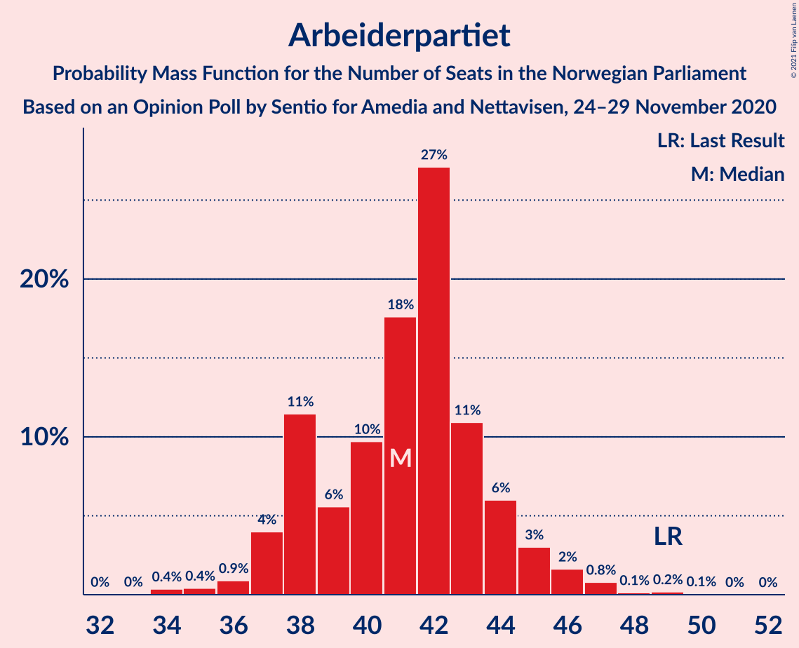
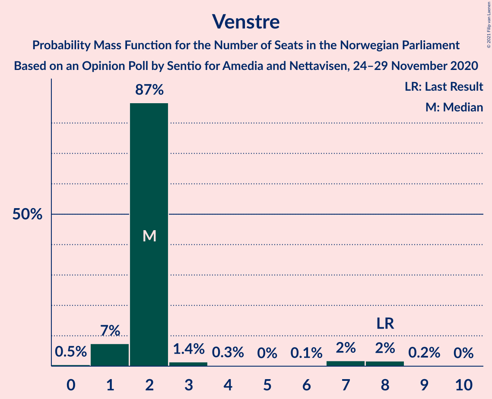
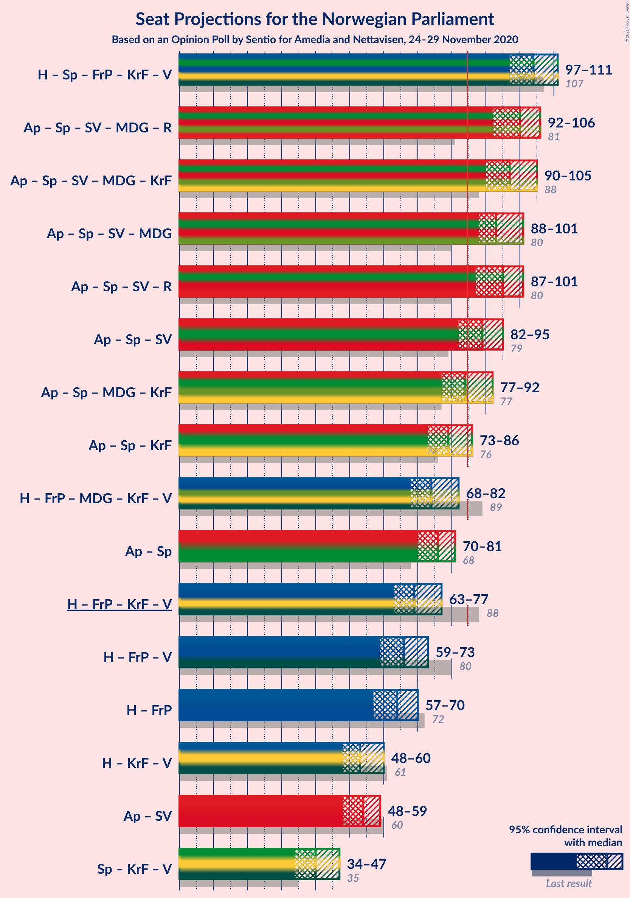
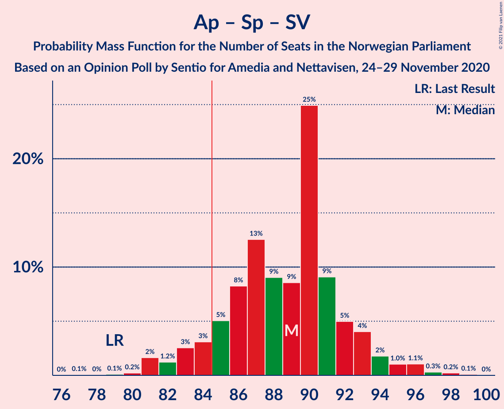
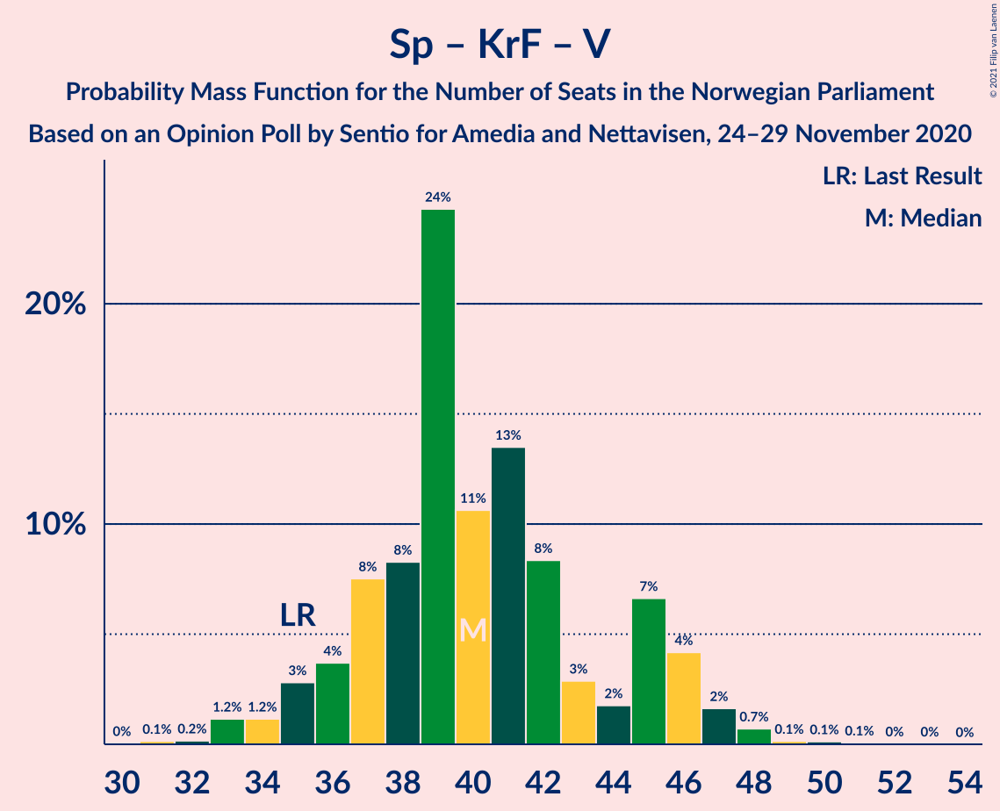

# Opinion Poll by Sentio for Amedia and Nettavisen, 24–29 November 2020

<a href="#voting-intentions">Voting Intentions</a> | <a href="#seats">Seats</a> | <a href="#coalitions">Coalitions</a> | <a href="#technical-information">Technical Information</a>

## Voting Intentions

### Confidence Intervals

| Party | Last Result | Poll Result | 80% Confidence Interval | 90% Confidence Interval | 95% Confidence Interval | 99% Confidence Interval |
|:-----:|:-----------:|:-----------:|:-----------------------:|:-----------------------:|:-----------------------:|:-----------------------:|
| Høyre | 25.0% | 26.5% | 24.8–28.3% |24.3–28.9% |23.9–29.3% |23.0–30.2% |
| Arbeiderpartiet | 27.4% | 22.4% | 20.8–24.2% |20.3–24.7% |19.9–25.1% |19.2–26.0% |
| Senterpartiet | 10.3% | 18.4% | 16.9–20.1% |16.5–20.5% |16.1–20.9% |15.4–21.7% |
| Fremskrittspartiet | 15.2% | 8.8% | 7.7–10.1% |7.4–10.4% |7.2–10.7% |6.7–11.4% |
| Sosialistisk Venstreparti | 6.0% | 7.0% | 6.1–8.2% |5.8–8.5% |5.6–8.8% |5.2–9.3% |
| Rødt | 2.4% | 4.0% | 3.3–4.9% |3.1–5.2% |2.9–5.4% |2.7–5.9% |
| Miljøpartiet De Grønne | 3.2% | 4.0% | 3.3–4.9% |3.1–5.2% |2.9–5.4% |2.7–5.9% |
| Kristelig Folkeparti | 4.2% | 3.4% | 2.8–4.3% |2.6–4.5% |2.4–4.7% |2.2–5.2% |
| Venstre | 4.4% | 2.9% | 2.3–3.7% |2.2–3.9% |2.0–4.1% |1.8–4.6% |

*Note:* The poll result column reflects the actual value used in the calculations. Published results may vary slightly, and in addition be rounded to fewer digits.

## Seats

### Confidence Intervals

| Party | Last Result | Median | 80% Confidence Interval | 90% Confidence Interval | 95% Confidence Interval | 99% Confidence Interval |
|:-----:|:-----------:|:------:|:-----------------------:|:-----------------------:|:-----------------------:|:-----------------------:|
| <a href="#høyre">Høyre</a> | 45 | 48 | 44–51 |43–53 |42–54 |41–56 |
| <a href="#arbeiderpartiet">Arbeiderpartiet</a> | 49 | 41 | 38–44 |37–45 |37–46 |35–47 |
| <a href="#senterpartiet">Senterpartiet</a> | 19 | 35 | 32–37 |31–38 |29–38 |28–40 |
| <a href="#fremskrittspartiet">Fremskrittspartiet</a> | 27 | 16 | 14–18 |13–19 |13–20 |12–21 |
| <a href="#sosialistisk-venstreparti">Sosialistisk Venstreparti</a> | 11 | 13 | 11–15 |10–15 |10–16 |9–18 |
| <a href="#rødt">Rødt</a> | 1 | 7 | 2–9 |2–9 |2–10 |1–10 |
| <a href="#miljøpartiet-de-grønne">Miljøpartiet De Grønne</a> | 1 | 7 | 2–8 |2–9 |1–9 |1–11 |
| <a href="#kristelig-folkeparti">Kristelig Folkeparti</a> | 8 | 3 | 1–7 |1–8 |1–8 |0–9 |
| <a href="#venstre">Venstre</a> | 8 | 2 | 2 |1–3 |1–7 |0–8 |

### Høyre

*For a full overview of the results for this party, see the [Høyre](party-høyre.html) page.*

| Number of Seats | Probability | Accumulated | Special Marks |
|:---------------:|:-----------:|:-----------:|:-------------:|
| 39 | 0.1% | 100% |  |
| 40 | 0.1% | 99.9% |  |
| 41 | 0.8% | 99.8% |  |
| 42 | 2% | 99.0% |  |
| 43 | 3% | 97% |  |
| 44 | 10% | 94% |  |
| 45 | 9% | 84% | Last Result |
| 46 | 9% | 75% |  |
| 47 | 11% | 66% |  |
| 48 | 23% | 55% | Median |
| 49 | 9% | 31% |  |
| 50 | 6% | 22% |  |
| 51 | 7% | 16% |  |
| 52 | 3% | 9% |  |
| 53 | 3% | 6% |  |
| 54 | 2% | 3% |  |
| 55 | 1.0% | 2% |  |
| 56 | 0.4% | 0.6% |  |
| 57 | 0.1% | 0.2% |  |
| 58 | 0.1% | 0.2% |  |
| 59 | 0% | 0% |  |

### Arbeiderpartiet

*For a full overview of the results for this party, see the [Arbeiderpartiet](party-arbeiderpartiet.html) page.*

| Number of Seats | Probability | Accumulated | Special Marks |
|:---------------:|:-----------:|:-----------:|:-------------:|
| 33 | 0% | 100% |  |
| 34 | 0.4% | 99.9% |  |
| 35 | 0.4% | 99.6% |  |
| 36 | 0.9% | 99.1% |  |
| 37 | 4% | 98% |  |
| 38 | 11% | 94% |  |
| 39 | 6% | 83% |  |
| 40 | 10% | 77% |  |
| 41 | 18% | 67% | Median |
| 42 | 27% | 50% |  |
| 43 | 11% | 23% |  |
| 44 | 6% | 12% |  |
| 45 | 3% | 6% |  |
| 46 | 2% | 3% |  |
| 47 | 0.8% | 1.2% |  |
| 48 | 0.1% | 0.4% |  |
| 49 | 0.2% | 0.3% | Last Result |
| 50 | 0.1% | 0.1% |  |
| 51 | 0% | 0% |  |

### Senterpartiet

*For a full overview of the results for this party, see the [Senterpartiet](party-senterpartiet.html) page.*

| Number of Seats | Probability | Accumulated | Special Marks |
|:---------------:|:-----------:|:-----------:|:-------------:|
| 19 | 0% | 100% | Last Result |
| 20 | 0% | 100% |  |
| 21 | 0% | 100% |  |
| 22 | 0% | 100% |  |
| 23 | 0% | 100% |  |
| 24 | 0% | 100% |  |
| 25 | 0.1% | 100% |  |
| 26 | 0.1% | 99.9% |  |
| 27 | 0.1% | 99.8% |  |
| 28 | 0.8% | 99.8% |  |
| 29 | 2% | 99.0% |  |
| 30 | 2% | 97% |  |
| 31 | 2% | 95% |  |
| 32 | 9% | 93% |  |
| 33 | 8% | 84% |  |
| 34 | 16% | 76% |  |
| 35 | 18% | 61% | Median |
| 36 | 29% | 42% |  |
| 37 | 9% | 14% |  |
| 38 | 3% | 5% |  |
| 39 | 1.2% | 2% |  |
| 40 | 0.6% | 1.0% |  |
| 41 | 0.3% | 0.4% |  |
| 42 | 0.1% | 0.1% |  |
| 43 | 0% | 0% |  |

### Fremskrittspartiet

*For a full overview of the results for this party, see the [Fremskrittspartiet](party-fremskrittspartiet.html) page.*

| Number of Seats | Probability | Accumulated | Special Marks |
|:---------------:|:-----------:|:-----------:|:-------------:|
| 11 | 0.3% | 100% |  |
| 12 | 2% | 99.7% |  |
| 13 | 7% | 98% |  |
| 14 | 7% | 91% |  |
| 15 | 21% | 84% |  |
| 16 | 29% | 64% | Median |
| 17 | 17% | 34% |  |
| 18 | 8% | 18% |  |
| 19 | 7% | 10% |  |
| 20 | 2% | 3% |  |
| 21 | 0.9% | 1.1% |  |
| 22 | 0.1% | 0.1% |  |
| 23 | 0% | 0% |  |
| 24 | 0% | 0% |  |
| 25 | 0% | 0% |  |
| 26 | 0% | 0% |  |
| 27 | 0% | 0% | Last Result |

### Sosialistisk Venstreparti

*For a full overview of the results for this party, see the [Sosialistisk Venstreparti](party-sosialistiskvenstreparti.html) page.*

| Number of Seats | Probability | Accumulated | Special Marks |
|:---------------:|:-----------:|:-----------:|:-------------:|
| 8 | 0.1% | 100% |  |
| 9 | 1.0% | 99.9% |  |
| 10 | 5% | 98.9% |  |
| 11 | 11% | 94% | Last Result |
| 12 | 26% | 82% |  |
| 13 | 22% | 57% | Median |
| 14 | 24% | 35% |  |
| 15 | 6% | 10% |  |
| 16 | 3% | 4% |  |
| 17 | 0.8% | 1.3% |  |
| 18 | 0.5% | 0.5% |  |
| 19 | 0% | 0% |  |

### Rødt

*For a full overview of the results for this party, see the [Rødt](party-rødt.html) page.*

| Number of Seats | Probability | Accumulated | Special Marks |
|:---------------:|:-----------:|:-----------:|:-------------:|
| 1 | 1.0% | 100% | Last Result |
| 2 | 29% | 99.0% |  |
| 3 | 0% | 70% |  |
| 4 | 0% | 70% |  |
| 5 | 0% | 70% |  |
| 6 | 0.7% | 70% |  |
| 7 | 30% | 69% | Median |
| 8 | 23% | 38% |  |
| 9 | 13% | 16% |  |
| 10 | 3% | 3% |  |
| 11 | 0.3% | 0.3% |  |
| 12 | 0.1% | 0.1% |  |
| 13 | 0% | 0% |  |

### Miljøpartiet De Grønne

*For a full overview of the results for this party, see the [Miljøpartiet De Grønne](party-miljøpartietdegrønne.html) page.*

| Number of Seats | Probability | Accumulated | Special Marks |
|:---------------:|:-----------:|:-----------:|:-------------:|
| 1 | 3% | 100% | Last Result |
| 2 | 26% | 97% |  |
| 3 | 21% | 71% |  |
| 4 | 0.1% | 51% |  |
| 5 | 0% | 51% |  |
| 6 | 0% | 51% |  |
| 7 | 17% | 51% | Median |
| 8 | 24% | 34% |  |
| 9 | 8% | 10% |  |
| 10 | 2% | 2% |  |
| 11 | 0.5% | 0.6% |  |
| 12 | 0% | 0% |  |

### Kristelig Folkeparti

*For a full overview of the results for this party, see the [Kristelig Folkeparti](party-kristeligfolkeparti.html) page.*

| Number of Seats | Probability | Accumulated | Special Marks |
|:---------------:|:-----------:|:-----------:|:-------------:|
| 0 | 0.9% | 100% |  |
| 1 | 20% | 99.1% |  |
| 2 | 15% | 79% |  |
| 3 | 44% | 63% | Median |
| 4 | 0% | 20% |  |
| 5 | 0% | 20% |  |
| 6 | 0.7% | 20% |  |
| 7 | 10% | 19% |  |
| 8 | 8% | 9% | Last Result |
| 9 | 1.0% | 1.2% |  |
| 10 | 0.2% | 0.2% |  |
| 11 | 0% | 0% |  |

### Venstre

*For a full overview of the results for this party, see the [Venstre](party-venstre.html) page.*

| Number of Seats | Probability | Accumulated | Special Marks |
|:---------------:|:-----------:|:-----------:|:-------------:|
| 0 | 0.5% | 100% |  |
| 1 | 7% | 99.5% |  |
| 2 | 87% | 92% | Median |
| 3 | 1.4% | 5% |  |
| 4 | 0.3% | 4% |  |
| 5 | 0% | 4% |  |
| 6 | 0.1% | 4% |  |
| 7 | 2% | 4% |  |
| 8 | 2% | 2% | Last Result |
| 9 | 0.2% | 0.2% |  |
| 10 | 0% | 0% |  |

## Coalitions

### Confidence Intervals

| Coalition | Last Result | Median | Majority? | 80% Confidence Interval | 90% Confidence Interval | 95% Confidence Interval | 99% Confidence Interval |
|:---------:|:-----------:|:------:|:---------:|:-----------------------:|:-----------------------:|:-----------------------:|:-----------------------:|
| Høyre – Senterpartiet – Fremskrittspartiet – Kristelig Folkeparti – Venstre | 107 | 104 | 100% | 99–109 | 98–110 | 97–111 | 96–114 |
| Arbeiderpartiet – Senterpartiet – Sosialistisk Venstreparti – Miljøpartiet De Grønne – Rødt | 81 | 100 | 100% | 95–105 | 94–106 | 92–106 | 90–108 |
| Arbeiderpartiet – Senterpartiet – Sosialistisk Venstreparti – Miljøpartiet De Grønne – Kristelig Folkeparti | 88 | 97 | 100% | 92–102 | 91–104 | 90–105 | 87–108 |
| Arbeiderpartiet – Senterpartiet – Sosialistisk Venstreparti – Miljøpartiet De Grønne | 80 | 93 | 99.5% | 89–99 | 88–100 | 88–101 | 84–103 |
| Arbeiderpartiet – Senterpartiet – Sosialistisk Venstreparti – Rødt | 80 | 95 | 99.3% | 89–99 | 88–100 | 87–101 | 84–103 |
| Arbeiderpartiet – Senterpartiet – Sosialistisk Venstreparti | 79 | 89 | 91% | 85–92 | 83–93 | 82–95 | 81–97 |
| Arbeiderpartiet – Senterpartiet – Miljøpartiet De Grønne – Kristelig Folkeparti | 77 | 84 | 45% | 79–90 | 78–91 | 77–92 | 75–94 |
| Arbeiderpartiet – Senterpartiet – Kristelig Folkeparti | 76 | 79 | 6% | 75–83 | 74–85 | 73–86 | 70–89 |
| Høyre – Fremskrittspartiet – Miljøpartiet De Grønne – Kristelig Folkeparti – Venstre | 89 | 74 | 0.7% | 70–80 | 69–81 | 68–82 | 66–85 |
| Arbeiderpartiet – Senterpartiet | 68 | 76 | 0.1% | 72–79 | 71–80 | 70–81 | 68–83 |
| Høyre – Fremskrittspartiet – Kristelig Folkeparti – Venstre | 88 | 69 | 0% | 64–74 | 63–75 | 63–77 | 61–79 |
| Høyre – Fremskrittspartiet – Venstre | 80 | 66 | 0% | 61–71 | 60–72 | 59–73 | 57–76 |
| Høyre – Fremskrittspartiet | 72 | 64 | 0% | 59–69 | 58–70 | 57–70 | 55–73 |
| Høyre – Kristelig Folkeparti – Venstre | 61 | 53 | 0% | 48–58 | 48–59 | 48–60 | 45–62 |
| Arbeiderpartiet – Sosialistisk Venstreparti | 60 | 54 | 0% | 50–57 | 50–58 | 48–59 | 47–62 |
| Senterpartiet – Kristelig Folkeparti – Venstre | 35 | 40 | 0% | 37–45 | 35–46 | 34–47 | 33–48 |

### Høyre – Senterpartiet – Fremskrittspartiet – Kristelig Folkeparti – Venstre

| Number of Seats | Probability | Accumulated | Special Marks |
|:---------------:|:-----------:|:-----------:|:-------------:|
| 93 | 0% | 100% |  |
| 94 | 0.1% | 99.9% |  |
| 95 | 0.3% | 99.8% |  |
| 96 | 1.1% | 99.5% |  |
| 97 | 1.5% | 98% |  |
| 98 | 5% | 97% |  |
| 99 | 5% | 92% |  |
| 100 | 8% | 87% |  |
| 101 | 4% | 79% |  |
| 102 | 8% | 74% |  |
| 103 | 15% | 66% |  |
| 104 | 14% | 51% | Median |
| 105 | 9% | 37% |  |
| 106 | 4% | 29% |  |
| 107 | 9% | 24% | Last Result |
| 108 | 6% | 16% |  |
| 109 | 3% | 10% |  |
| 110 | 4% | 7% |  |
| 111 | 2% | 4% |  |
| 112 | 0.7% | 2% |  |
| 113 | 0.5% | 2% |  |
| 114 | 0.8% | 1.1% |  |
| 115 | 0.1% | 0.3% |  |
| 116 | 0.1% | 0.2% |  |
| 117 | 0% | 0% |  |

### Arbeiderpartiet – Senterpartiet – Sosialistisk Venstreparti – Miljøpartiet De Grønne – Rødt

| Number of Seats | Probability | Accumulated | Special Marks |
|:---------------:|:-----------:|:-----------:|:-------------:|
| 81 | 0% | 100% | Last Result |
| 82 | 0% | 100% |  |
| 83 | 0% | 100% |  |
| 84 | 0% | 100% |  |
| 85 | 0% | 100% | Majority |
| 86 | 0% | 100% |  |
| 87 | 0% | 100% |  |
| 88 | 0.1% | 99.9% |  |
| 89 | 0.2% | 99.8% |  |
| 90 | 0.9% | 99.6% |  |
| 91 | 1.1% | 98.8% |  |
| 92 | 1.1% | 98% |  |
| 93 | 0.9% | 97% |  |
| 94 | 4% | 96% |  |
| 95 | 4% | 92% |  |
| 96 | 5% | 87% |  |
| 97 | 8% | 82% |  |
| 98 | 9% | 75% |  |
| 99 | 6% | 66% |  |
| 100 | 17% | 60% |  |
| 101 | 11% | 43% |  |
| 102 | 7% | 32% |  |
| 103 | 8% | 25% | Median |
| 104 | 6% | 17% |  |
| 105 | 3% | 11% |  |
| 106 | 6% | 8% |  |
| 107 | 0.9% | 2% |  |
| 108 | 0.6% | 1.0% |  |
| 109 | 0.3% | 0.4% |  |
| 110 | 0.1% | 0.1% |  |
| 111 | 0% | 0% |  |

### Arbeiderpartiet – Senterpartiet – Sosialistisk Venstreparti – Miljøpartiet De Grønne – Kristelig Folkeparti

| Number of Seats | Probability | Accumulated | Special Marks |
|:---------------:|:-----------:|:-----------:|:-------------:|
| 85 | 0.1% | 100% | Majority |
| 86 | 0.2% | 99.9% |  |
| 87 | 0.2% | 99.7% |  |
| 88 | 0.3% | 99.5% | Last Result |
| 89 | 1.0% | 99.2% |  |
| 90 | 2% | 98% |  |
| 91 | 3% | 97% |  |
| 92 | 4% | 94% |  |
| 93 | 4% | 90% |  |
| 94 | 4% | 85% |  |
| 95 | 10% | 81% |  |
| 96 | 19% | 71% |  |
| 97 | 12% | 52% |  |
| 98 | 8% | 40% |  |
| 99 | 6% | 32% | Median |
| 100 | 6% | 25% |  |
| 101 | 7% | 19% |  |
| 102 | 5% | 13% |  |
| 103 | 2% | 8% |  |
| 104 | 2% | 5% |  |
| 105 | 2% | 4% |  |
| 106 | 0.7% | 2% |  |
| 107 | 0.3% | 1.0% |  |
| 108 | 0.6% | 0.6% |  |
| 109 | 0.1% | 0.1% |  |
| 110 | 0% | 0% |  |

### Arbeiderpartiet – Senterpartiet – Sosialistisk Venstreparti – Miljøpartiet De Grønne

| Number of Seats | Probability | Accumulated | Special Marks |
|:---------------:|:-----------:|:-----------:|:-------------:|
| 80 | 0% | 100% | Last Result |
| 81 | 0% | 100% |  |
| 82 | 0.1% | 100% |  |
| 83 | 0.1% | 99.9% |  |
| 84 | 0.3% | 99.8% |  |
| 85 | 0.3% | 99.5% | Majority |
| 86 | 0.5% | 99.2% |  |
| 87 | 0.8% | 98.7% |  |
| 88 | 3% | 98% |  |
| 89 | 5% | 94% |  |
| 90 | 8% | 90% |  |
| 91 | 5% | 82% |  |
| 92 | 11% | 77% |  |
| 93 | 18% | 66% |  |
| 94 | 8% | 48% |  |
| 95 | 10% | 40% |  |
| 96 | 6% | 30% | Median |
| 97 | 7% | 24% |  |
| 98 | 7% | 17% |  |
| 99 | 5% | 11% |  |
| 100 | 2% | 5% |  |
| 101 | 1.2% | 3% |  |
| 102 | 1.4% | 2% |  |
| 103 | 0.3% | 0.5% |  |
| 104 | 0.1% | 0.2% |  |
| 105 | 0.1% | 0.1% |  |
| 106 | 0% | 0% |  |

### Arbeiderpartiet – Senterpartiet – Sosialistisk Venstreparti – Rødt

| Number of Seats | Probability | Accumulated | Special Marks |
|:---------------:|:-----------:|:-----------:|:-------------:|
| 80 | 0% | 100% | Last Result |
| 81 | 0% | 100% |  |
| 82 | 0% | 99.9% |  |
| 83 | 0.2% | 99.9% |  |
| 84 | 0.4% | 99.7% |  |
| 85 | 0.4% | 99.3% | Majority |
| 86 | 1.1% | 98.9% |  |
| 87 | 2% | 98% |  |
| 88 | 5% | 96% |  |
| 89 | 3% | 90% |  |
| 90 | 2% | 87% |  |
| 91 | 5% | 85% |  |
| 92 | 5% | 80% |  |
| 93 | 7% | 75% |  |
| 94 | 10% | 69% |  |
| 95 | 11% | 59% |  |
| 96 | 8% | 48% | Median |
| 97 | 20% | 41% |  |
| 98 | 7% | 21% |  |
| 99 | 8% | 13% |  |
| 100 | 2% | 5% |  |
| 101 | 2% | 3% |  |
| 102 | 0.6% | 1.3% |  |
| 103 | 0.4% | 0.7% |  |
| 104 | 0.2% | 0.3% |  |
| 105 | 0.1% | 0.1% |  |
| 106 | 0% | 0% |  |

### Arbeiderpartiet – Senterpartiet – Sosialistisk Venstreparti

| Number of Seats | Probability | Accumulated | Special Marks |
|:---------------:|:-----------:|:-----------:|:-------------:|
| 77 | 0.1% | 100% |  |
| 78 | 0% | 99.9% |  |
| 79 | 0.1% | 99.9% | Last Result |
| 80 | 0.2% | 99.8% |  |
| 81 | 2% | 99.6% |  |
| 82 | 1.2% | 98% |  |
| 83 | 3% | 97% |  |
| 84 | 3% | 94% |  |
| 85 | 5% | 91% | Majority |
| 86 | 8% | 86% |  |
| 87 | 13% | 78% |  |
| 88 | 9% | 65% |  |
| 89 | 9% | 56% | Median |
| 90 | 25% | 48% |  |
| 91 | 9% | 23% |  |
| 92 | 5% | 14% |  |
| 93 | 4% | 9% |  |
| 94 | 2% | 5% |  |
| 95 | 1.0% | 3% |  |
| 96 | 1.1% | 2% |  |
| 97 | 0.3% | 0.7% |  |
| 98 | 0.2% | 0.4% |  |
| 99 | 0.1% | 0.1% |  |
| 100 | 0% | 0% |  |

### Arbeiderpartiet – Senterpartiet – Miljøpartiet De Grønne – Kristelig Folkeparti

| Number of Seats | Probability | Accumulated | Special Marks |
|:---------------:|:-----------:|:-----------:|:-------------:|
| 72 | 0.1% | 100% |  |
| 73 | 0.2% | 99.9% |  |
| 74 | 0.2% | 99.7% |  |
| 75 | 0.7% | 99.5% |  |
| 76 | 0.3% | 98.8% |  |
| 77 | 3% | 98% | Last Result |
| 78 | 1.0% | 95% |  |
| 79 | 5% | 94% |  |
| 80 | 4% | 90% |  |
| 81 | 3% | 86% |  |
| 82 | 18% | 82% |  |
| 83 | 11% | 64% |  |
| 84 | 8% | 53% |  |
| 85 | 8% | 45% | Majority |
| 86 | 6% | 37% | Median |
| 87 | 10% | 31% |  |
| 88 | 7% | 21% |  |
| 89 | 3% | 14% |  |
| 90 | 4% | 10% |  |
| 91 | 3% | 7% |  |
| 92 | 2% | 4% |  |
| 93 | 1.0% | 2% |  |
| 94 | 0.9% | 1.3% |  |
| 95 | 0.2% | 0.4% |  |
| 96 | 0.1% | 0.2% |  |
| 97 | 0% | 0.1% |  |
| 98 | 0% | 0% |  |

### Arbeiderpartiet – Senterpartiet – Kristelig Folkeparti

| Number of Seats | Probability | Accumulated | Special Marks |
|:---------------:|:-----------:|:-----------:|:-------------:|
| 67 | 0% | 100% |  |
| 68 | 0.1% | 99.9% |  |
| 69 | 0.2% | 99.8% |  |
| 70 | 0.2% | 99.7% |  |
| 71 | 0.8% | 99.5% |  |
| 72 | 0.7% | 98.7% |  |
| 73 | 2% | 98% |  |
| 74 | 5% | 96% |  |
| 75 | 6% | 92% |  |
| 76 | 3% | 86% | Last Result |
| 77 | 14% | 83% |  |
| 78 | 8% | 69% |  |
| 79 | 14% | 62% | Median |
| 80 | 18% | 48% |  |
| 81 | 10% | 30% |  |
| 82 | 7% | 19% |  |
| 83 | 3% | 12% |  |
| 84 | 4% | 10% |  |
| 85 | 3% | 6% | Majority |
| 86 | 1.5% | 3% |  |
| 87 | 0.7% | 2% |  |
| 88 | 0.3% | 0.8% |  |
| 89 | 0.4% | 0.5% |  |
| 90 | 0.1% | 0.1% |  |
| 91 | 0% | 0% |  |

### Høyre – Fremskrittspartiet – Miljøpartiet De Grønne – Kristelig Folkeparti – Venstre

| Number of Seats | Probability | Accumulated | Special Marks |
|:---------------:|:-----------:|:-----------:|:-------------:|
| 64 | 0.1% | 100% |  |
| 65 | 0.2% | 99.8% |  |
| 66 | 0.5% | 99.6% |  |
| 67 | 0.6% | 99.2% |  |
| 68 | 2% | 98.6% |  |
| 69 | 2% | 97% |  |
| 70 | 8% | 95% |  |
| 71 | 7% | 86% |  |
| 72 | 20% | 79% |  |
| 73 | 8% | 59% |  |
| 74 | 11% | 51% |  |
| 75 | 10% | 41% |  |
| 76 | 7% | 31% | Median |
| 77 | 5% | 24% |  |
| 78 | 5% | 20% |  |
| 79 | 2% | 15% |  |
| 80 | 3% | 13% |  |
| 81 | 5% | 10% |  |
| 82 | 2% | 4% |  |
| 83 | 1.1% | 2% |  |
| 84 | 0.4% | 1.1% |  |
| 85 | 0.4% | 0.7% | Majority |
| 86 | 0.2% | 0.3% |  |
| 87 | 0% | 0.1% |  |
| 88 | 0% | 0% |  |
| 89 | 0% | 0% | Last Result |

### Arbeiderpartiet – Senterpartiet

| Number of Seats | Probability | Accumulated | Special Marks |
|:---------------:|:-----------:|:-----------:|:-------------:|
| 65 | 0% | 100% |  |
| 66 | 0.1% | 99.9% |  |
| 67 | 0.2% | 99.8% |  |
| 68 | 0.4% | 99.6% | Last Result |
| 69 | 0.5% | 99.2% |  |
| 70 | 3% | 98.7% |  |
| 71 | 2% | 96% |  |
| 72 | 4% | 94% |  |
| 73 | 8% | 89% |  |
| 74 | 12% | 82% |  |
| 75 | 9% | 69% |  |
| 76 | 17% | 60% | Median |
| 77 | 18% | 43% |  |
| 78 | 12% | 26% |  |
| 79 | 6% | 14% |  |
| 80 | 4% | 7% |  |
| 81 | 2% | 4% |  |
| 82 | 1.1% | 2% |  |
| 83 | 0.6% | 1.0% |  |
| 84 | 0.2% | 0.4% |  |
| 85 | 0.1% | 0.1% | Majority |
| 86 | 0% | 0.1% |  |
| 87 | 0% | 0% |  |

### Høyre – Fremskrittspartiet – Kristelig Folkeparti – Venstre

| Number of Seats | Probability | Accumulated | Special Marks |
|:---------------:|:-----------:|:-----------:|:-------------:|
| 59 | 0.1% | 100% |  |
| 60 | 0.3% | 99.9% |  |
| 61 | 0.6% | 99.6% |  |
| 62 | 0.9% | 99.0% |  |
| 63 | 6% | 98% |  |
| 64 | 3% | 92% |  |
| 65 | 6% | 89% |  |
| 66 | 8% | 83% |  |
| 67 | 8% | 75% |  |
| 68 | 11% | 67% |  |
| 69 | 17% | 56% | Median |
| 70 | 5% | 39% |  |
| 71 | 9% | 34% |  |
| 72 | 8% | 25% |  |
| 73 | 5% | 17% |  |
| 74 | 4% | 13% |  |
| 75 | 4% | 8% |  |
| 76 | 0.8% | 4% |  |
| 77 | 1.1% | 3% |  |
| 78 | 1.1% | 2% |  |
| 79 | 0.8% | 1.2% |  |
| 80 | 0.2% | 0.3% |  |
| 81 | 0.1% | 0.1% |  |
| 82 | 0% | 0.1% |  |
| 83 | 0% | 0% |  |
| 84 | 0% | 0% |  |
| 85 | 0% | 0% | Majority |
| 86 | 0% | 0% |  |
| 87 | 0% | 0% |  |
| 88 | 0% | 0% | Last Result |

### Høyre – Fremskrittspartiet – Venstre

| Number of Seats | Probability | Accumulated | Special Marks |
|:---------------:|:-----------:|:-----------:|:-------------:|
| 55 | 0.1% | 100% |  |
| 56 | 0.3% | 99.9% |  |
| 57 | 0.4% | 99.7% |  |
| 58 | 0.7% | 99.3% |  |
| 59 | 1.4% | 98.5% |  |
| 60 | 6% | 97% |  |
| 61 | 1.5% | 91% |  |
| 62 | 6% | 90% |  |
| 63 | 10% | 83% |  |
| 64 | 7% | 73% |  |
| 65 | 13% | 66% |  |
| 66 | 17% | 53% | Median |
| 67 | 10% | 36% |  |
| 68 | 3% | 26% |  |
| 69 | 6% | 23% |  |
| 70 | 6% | 17% |  |
| 71 | 5% | 12% |  |
| 72 | 3% | 6% |  |
| 73 | 1.0% | 3% |  |
| 74 | 0.6% | 2% |  |
| 75 | 0.5% | 1.0% |  |
| 76 | 0.3% | 0.5% |  |
| 77 | 0.1% | 0.2% |  |
| 78 | 0.1% | 0.1% |  |
| 79 | 0% | 0% |  |
| 80 | 0% | 0% | Last Result |

### Høyre – Fremskrittspartiet

| Number of Seats | Probability | Accumulated | Special Marks |
|:---------------:|:-----------:|:-----------:|:-------------:|
| 53 | 0.1% | 100% |  |
| 54 | 0.2% | 99.9% |  |
| 55 | 0.4% | 99.7% |  |
| 56 | 0.7% | 99.3% |  |
| 57 | 2% | 98.6% |  |
| 58 | 6% | 97% |  |
| 59 | 3% | 91% |  |
| 60 | 5% | 88% |  |
| 61 | 10% | 83% |  |
| 62 | 7% | 72% |  |
| 63 | 13% | 65% |  |
| 64 | 18% | 52% | Median |
| 65 | 10% | 34% |  |
| 66 | 3% | 24% |  |
| 67 | 6% | 22% |  |
| 68 | 5% | 16% |  |
| 69 | 5% | 10% |  |
| 70 | 3% | 6% |  |
| 71 | 0.9% | 2% |  |
| 72 | 0.5% | 1.3% | Last Result |
| 73 | 0.4% | 0.8% |  |
| 74 | 0.2% | 0.3% |  |
| 75 | 0.1% | 0.2% |  |
| 76 | 0.1% | 0.1% |  |
| 77 | 0% | 0% |  |

### Høyre – Kristelig Folkeparti – Venstre

| Number of Seats | Probability | Accumulated | Special Marks |
|:---------------:|:-----------:|:-----------:|:-------------:|
| 44 | 0.1% | 100% |  |
| 45 | 0.4% | 99.9% |  |
| 46 | 0.7% | 99.4% |  |
| 47 | 0.9% | 98.7% |  |
| 48 | 9% | 98% |  |
| 49 | 5% | 89% |  |
| 50 | 7% | 84% |  |
| 51 | 7% | 77% |  |
| 52 | 14% | 70% |  |
| 53 | 20% | 56% | Median |
| 54 | 9% | 35% |  |
| 55 | 4% | 26% |  |
| 56 | 3% | 22% |  |
| 57 | 6% | 19% |  |
| 58 | 3% | 13% |  |
| 59 | 6% | 10% |  |
| 60 | 3% | 4% |  |
| 61 | 0.8% | 1.5% | Last Result |
| 62 | 0.2% | 0.7% |  |
| 63 | 0.2% | 0.5% |  |
| 64 | 0.2% | 0.3% |  |
| 65 | 0.1% | 0.1% |  |
| 66 | 0% | 0% |  |

### Arbeiderpartiet – Sosialistisk Venstreparti

| Number of Seats | Probability | Accumulated | Special Marks |
|:---------------:|:-----------:|:-----------:|:-------------:|
| 45 | 0.1% | 100% |  |
| 46 | 0.3% | 99.9% |  |
| 47 | 0.5% | 99.6% |  |
| 48 | 2% | 99.1% |  |
| 49 | 2% | 97% |  |
| 50 | 7% | 96% |  |
| 51 | 8% | 88% |  |
| 52 | 12% | 81% |  |
| 53 | 9% | 69% |  |
| 54 | 13% | 60% | Median |
| 55 | 16% | 47% |  |
| 56 | 17% | 31% |  |
| 57 | 6% | 13% |  |
| 58 | 4% | 8% |  |
| 59 | 2% | 4% |  |
| 60 | 2% | 2% | Last Result |
| 61 | 0.3% | 0.9% |  |
| 62 | 0.3% | 0.5% |  |
| 63 | 0.2% | 0.2% |  |
| 64 | 0% | 0.1% |  |
| 65 | 0% | 0% |  |

### Senterpartiet – Kristelig Folkeparti – Venstre

| Number of Seats | Probability | Accumulated | Special Marks |
|:---------------:|:-----------:|:-----------:|:-------------:|
| 30 | 0% | 100% |  |
| 31 | 0.1% | 99.9% |  |
| 32 | 0.2% | 99.8% |  |
| 33 | 1.2% | 99.6% |  |
| 34 | 1.2% | 98% |  |
| 35 | 3% | 97% | Last Result |
| 36 | 4% | 95% |  |
| 37 | 8% | 91% |  |
| 38 | 8% | 83% |  |
| 39 | 24% | 75% |  |
| 40 | 11% | 51% | Median |
| 41 | 13% | 40% |  |
| 42 | 8% | 27% |  |
| 43 | 3% | 18% |  |
| 44 | 2% | 15% |  |
| 45 | 7% | 14% |  |
| 46 | 4% | 7% |  |
| 47 | 2% | 3% |  |
| 48 | 0.7% | 1.1% |  |
| 49 | 0.1% | 0.4% |  |
| 50 | 0.1% | 0.3% |  |
| 51 | 0.1% | 0.1% |  |
| 52 | 0% | 0.1% |  |
| 53 | 0% | 0% |  |

## Technical Information

### Opinion Poll

+ **Polling firm:** Sentio
+ **Commissioner(s):** Amedia and Nettavisen
+ **Fieldwork period:** 24–29 November 2020

### Calculations

+ **Sample size:** 1000
+ **Simulations done:** 1,048,576
+ **Error estimate:** 1.25%

