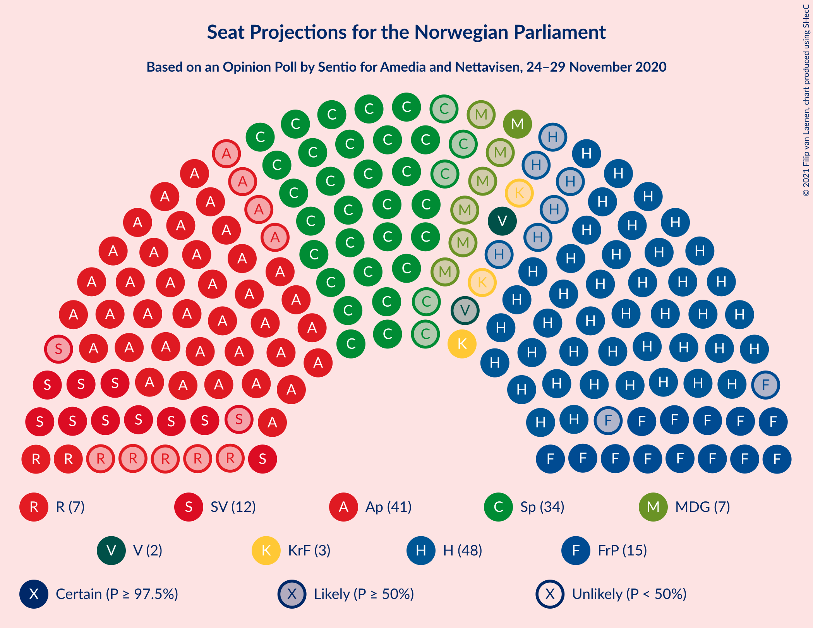
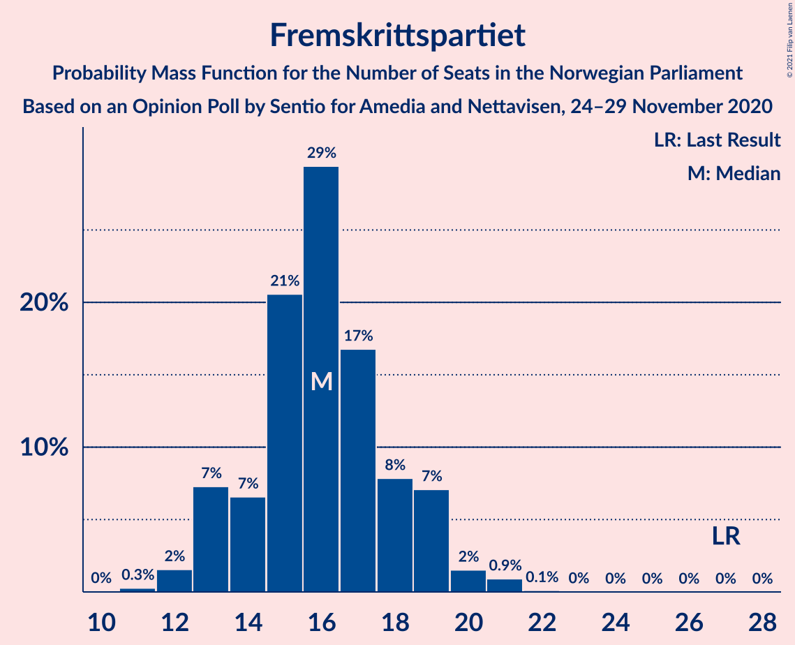
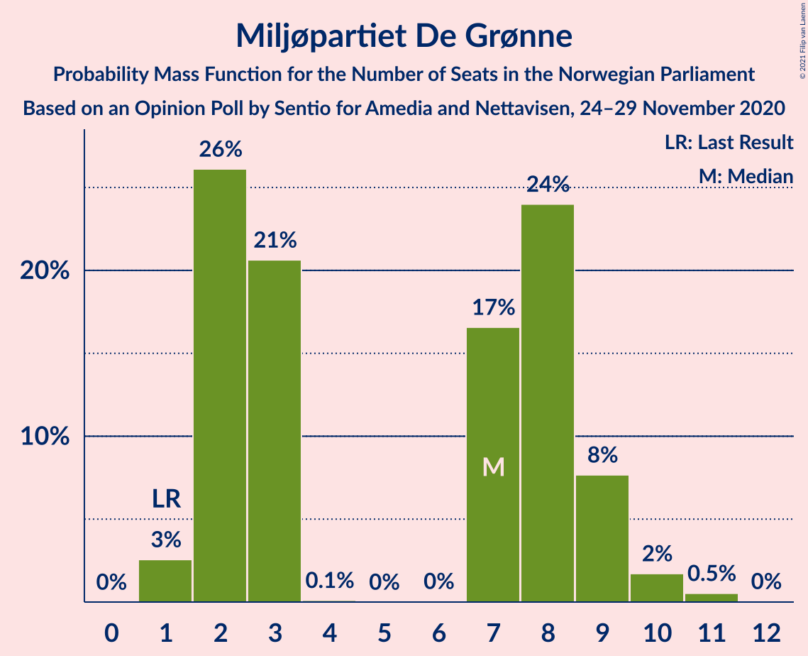
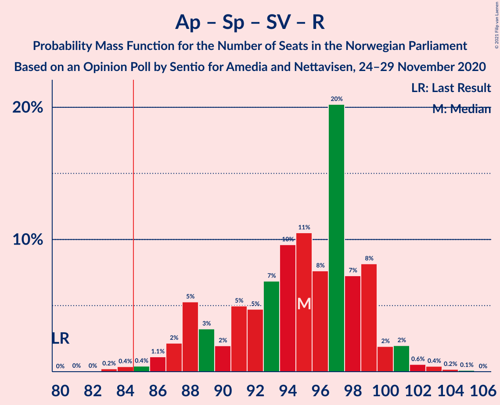
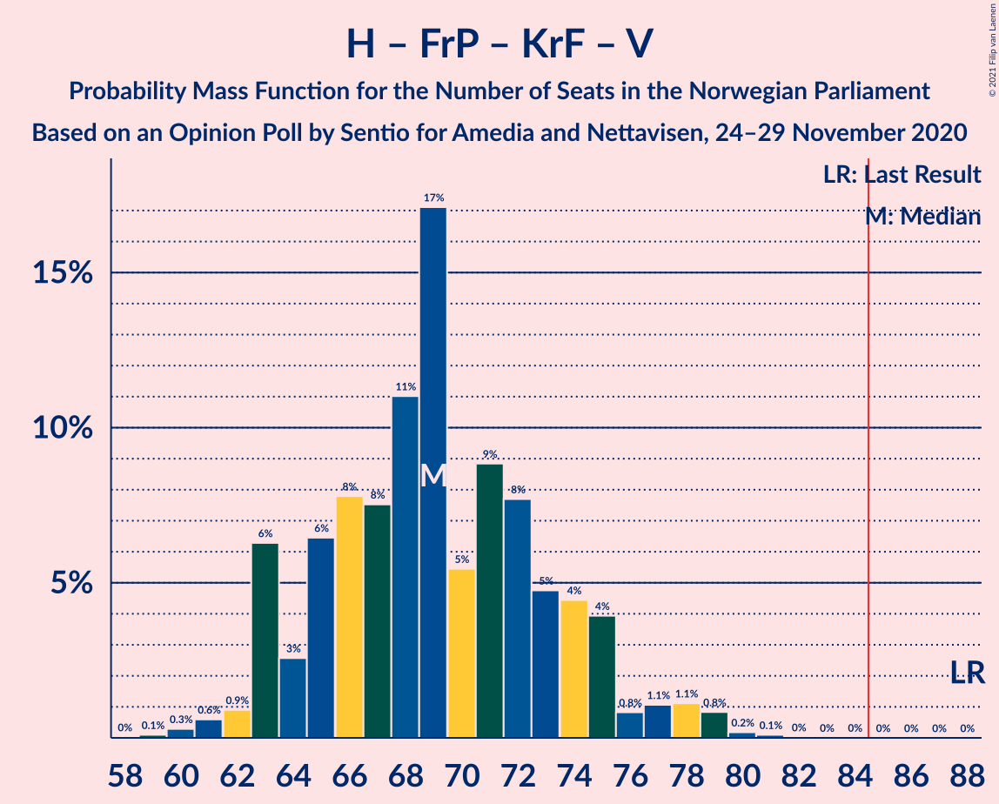
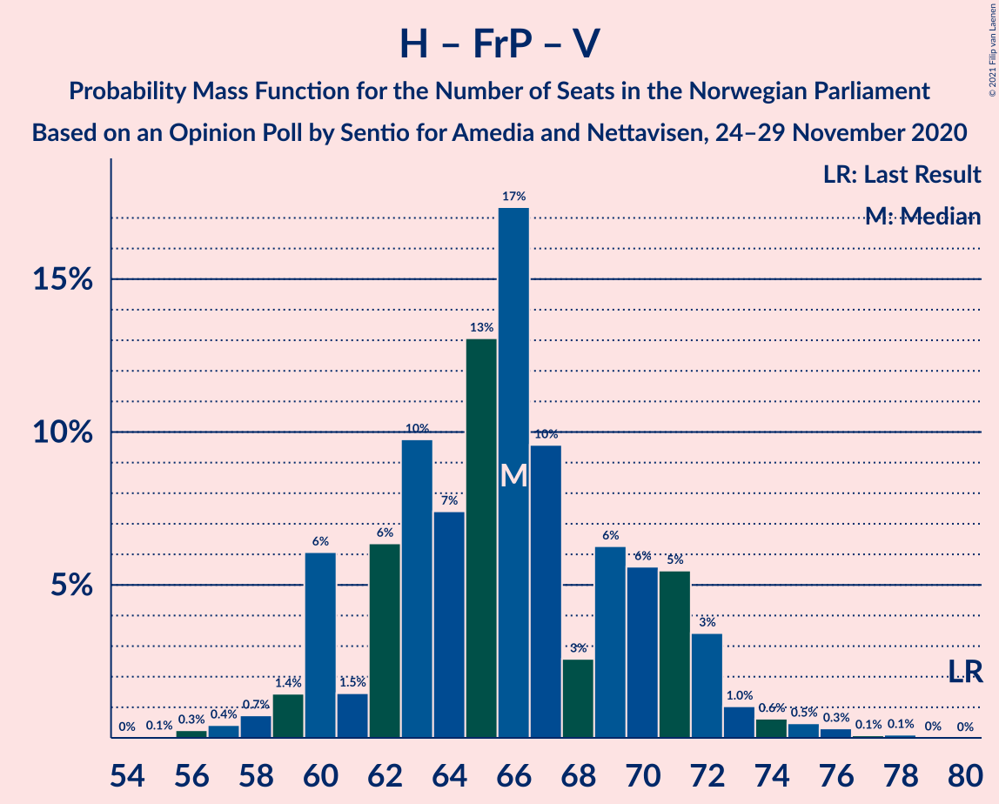

# Opinion Poll by Sentio for Amedia and Nettavisen, 24–29 November 2020

<a href="#voting-intentions">Voting Intentions</a> | <a href="#seats">Seats</a> | <a href="#coalitions">Coalitions</a> | <a href="#technical-information">Technical Information</a>

## Voting Intentions

### Confidence Intervals

| Party | Last Result | Poll Result | 80% Confidence Interval | 90% Confidence Interval | 95% Confidence Interval | 99% Confidence Interval |
|:-----:|:-----------:|:-----------:|:-----------------------:|:-----------------------:|:-----------------------:|:-----------------------:|
| Høyre | 25.0% | 26.5% | 24.8–28.3% |24.3–28.9% |23.9–29.3% |23.0–30.2% |
| Arbeiderpartiet | 27.4% | 22.4% | 20.8–24.2% |20.3–24.7% |19.9–25.1% |19.2–26.0% |
| Senterpartiet | 10.3% | 18.4% | 16.9–20.1% |16.5–20.5% |16.1–20.9% |15.4–21.7% |
| Fremskrittspartiet | 15.2% | 8.8% | 7.7–10.1% |7.4–10.4% |7.2–10.7% |6.7–11.4% |
| Sosialistisk Venstreparti | 6.0% | 7.0% | 6.1–8.2% |5.8–8.5% |5.6–8.8% |5.2–9.3% |
| Rødt | 2.4% | 4.0% | 3.3–4.9% |3.1–5.2% |2.9–5.4% |2.7–5.9% |
| Miljøpartiet De Grønne | 3.2% | 4.0% | 3.3–4.9% |3.1–5.2% |2.9–5.4% |2.7–5.9% |
| Kristelig Folkeparti | 4.2% | 3.4% | 2.8–4.3% |2.6–4.5% |2.4–4.7% |2.2–5.2% |
| Venstre | 4.4% | 2.9% | 2.3–3.7% |2.2–3.9% |2.0–4.1% |1.8–4.6% |

*Note:* The poll result column reflects the actual value used in the calculations. Published results may vary slightly, and in addition be rounded to fewer digits.

## Seats

### Confidence Intervals

| Party | Last Result | Median | 80% Confidence Interval | 90% Confidence Interval | 95% Confidence Interval | 99% Confidence Interval |
|:-----:|:-----------:|:------:|:-----------------------:|:-----------------------:|:-----------------------:|:-----------------------:|
| <a href="#høyre">Høyre</a> | 45 | 48 | 46–51 |45–52 |44–53 |41–55 |
| <a href="#arbeiderpartiet">Arbeiderpartiet</a> | 49 | 42 | 38–42 |37–44 |37–46 |37–47 |
| <a href="#senterpartiet">Senterpartiet</a> | 19 | 34 | 32–37 |32–37 |31–38 |29–40 |
| <a href="#fremskrittspartiet">Fremskrittspartiet</a> | 27 | 16 | 14–17 |13–18 |13–19 |12–21 |
| <a href="#sosialistisk-venstreparti">Sosialistisk Venstreparti</a> | 11 | 14 | 11–14 |11–15 |10–15 |9–17 |
| <a href="#rødt">Rødt</a> | 1 | 7 | 2–8 |2–8 |2–9 |2–10 |
| <a href="#miljøpartiet-de-grønne">Miljøpartiet De Grønne</a> | 1 | 3 | 2–8 |2–9 |2–9 |1–10 |
| <a href="#kristelig-folkeparti">Kristelig Folkeparti</a> | 8 | 3 | 1–3 |1–7 |1–8 |0–9 |
| <a href="#venstre">Venstre</a> | 8 | 2 | 2 |1–7 |1–8 |1–8 |

### Høyre

*For a full overview of the results for this party, see the [Høyre](party-høyre.html) page.*

| Number of Seats | Probability | Accumulated | Special Marks |
|:---------------:|:-----------:|:-----------:|:-------------:|
| 40 | 0.1% | 100% |  |
| 41 | 0.8% | 99.9% |  |
| 42 | 0.3% | 99.1% |  |
| 43 | 0.8% | 98.8% |  |
| 44 | 2% | 98% |  |
| 45 | 5% | 96% | Last Result |
| 46 | 4% | 91% |  |
| 47 | 2% | 87% |  |
| 48 | 64% | 85% | Median |
| 49 | 6% | 21% |  |
| 50 | 4% | 15% |  |
| 51 | 4% | 11% |  |
| 52 | 5% | 8% |  |
| 53 | 2% | 3% |  |
| 54 | 0.3% | 1.5% |  |
| 55 | 1.0% | 1.1% |  |
| 56 | 0.1% | 0.1% |  |
| 57 | 0% | 0.1% |  |
| 58 | 0% | 0.1% |  |
| 59 | 0% | 0.1% |  |
| 60 | 0% | 0% |  |

### Arbeiderpartiet

*For a full overview of the results for this party, see the [Arbeiderpartiet](party-arbeiderpartiet.html) page.*

| Number of Seats | Probability | Accumulated | Special Marks |
|:---------------:|:-----------:|:-----------:|:-------------:|
| 34 | 0.1% | 100% |  |
| 35 | 0.1% | 99.9% |  |
| 36 | 0.1% | 99.8% |  |
| 37 | 6% | 99.6% |  |
| 38 | 6% | 94% |  |
| 39 | 3% | 87% |  |
| 40 | 4% | 85% |  |
| 41 | 12% | 80% |  |
| 42 | 59% | 68% | Median |
| 43 | 4% | 9% |  |
| 44 | 1.2% | 5% |  |
| 45 | 1.2% | 4% |  |
| 46 | 2% | 3% |  |
| 47 | 0.5% | 0.8% |  |
| 48 | 0.1% | 0.3% |  |
| 49 | 0.1% | 0.2% | Last Result |
| 50 | 0.1% | 0.1% |  |
| 51 | 0% | 0% |  |

### Senterpartiet

*For a full overview of the results for this party, see the [Senterpartiet](party-senterpartiet.html) page.*

| Number of Seats | Probability | Accumulated | Special Marks |
|:---------------:|:-----------:|:-----------:|:-------------:|
| 19 | 0% | 100% | Last Result |
| 20 | 0% | 100% |  |
| 21 | 0% | 100% |  |
| 22 | 0% | 100% |  |
| 23 | 0% | 100% |  |
| 24 | 0% | 100% |  |
| 25 | 0% | 100% |  |
| 26 | 0% | 100% |  |
| 27 | 0% | 100% |  |
| 28 | 0.1% | 99.9% |  |
| 29 | 1.4% | 99.8% |  |
| 30 | 0.5% | 98% |  |
| 31 | 1.4% | 98% |  |
| 32 | 8% | 97% |  |
| 33 | 0.8% | 89% |  |
| 34 | 55% | 88% | Median |
| 35 | 4% | 33% |  |
| 36 | 17% | 29% |  |
| 37 | 9% | 12% |  |
| 38 | 2% | 3% |  |
| 39 | 0.3% | 1.3% |  |
| 40 | 0.8% | 1.0% |  |
| 41 | 0.1% | 0.1% |  |
| 42 | 0% | 0.1% |  |
| 43 | 0% | 0% |  |

### Fremskrittspartiet

*For a full overview of the results for this party, see the [Fremskrittspartiet](party-fremskrittspartiet.html) page.*

| Number of Seats | Probability | Accumulated | Special Marks |
|:---------------:|:-----------:|:-----------:|:-------------:|
| 10 | 0.1% | 100% |  |
| 11 | 0.4% | 99.9% |  |
| 12 | 0.5% | 99.5% |  |
| 13 | 4% | 99.1% |  |
| 14 | 7% | 95% |  |
| 15 | 11% | 88% |  |
| 16 | 57% | 77% | Median |
| 17 | 13% | 20% |  |
| 18 | 4% | 7% |  |
| 19 | 2% | 4% |  |
| 20 | 1.0% | 2% |  |
| 21 | 0.8% | 0.9% |  |
| 22 | 0.1% | 0.1% |  |
| 23 | 0% | 0% |  |
| 24 | 0% | 0% |  |
| 25 | 0% | 0% |  |
| 26 | 0% | 0% |  |
| 27 | 0% | 0% | Last Result |

### Sosialistisk Venstreparti

*For a full overview of the results for this party, see the [Sosialistisk Venstreparti](party-sosialistiskvenstreparti.html) page.*

| Number of Seats | Probability | Accumulated | Special Marks |
|:---------------:|:-----------:|:-----------:|:-------------:|
| 8 | 0.1% | 100% |  |
| 9 | 2% | 99.9% |  |
| 10 | 2% | 98% |  |
| 11 | 13% | 96% | Last Result |
| 12 | 13% | 83% |  |
| 13 | 8% | 70% |  |
| 14 | 56% | 62% | Median |
| 15 | 5% | 6% |  |
| 16 | 0.8% | 1.4% |  |
| 17 | 0.3% | 0.6% |  |
| 18 | 0.2% | 0.3% |  |
| 19 | 0% | 0% |  |

### Rødt

*For a full overview of the results for this party, see the [Rødt](party-rødt.html) page.*

| Number of Seats | Probability | Accumulated | Special Marks |
|:---------------:|:-----------:|:-----------:|:-------------:|
| 1 | 0.2% | 100% | Last Result |
| 2 | 22% | 99.8% |  |
| 3 | 0% | 78% |  |
| 4 | 0% | 78% |  |
| 5 | 0% | 78% |  |
| 6 | 0.1% | 78% |  |
| 7 | 55% | 78% | Median |
| 8 | 19% | 23% |  |
| 9 | 2% | 4% |  |
| 10 | 2% | 2% |  |
| 11 | 0.1% | 0.2% |  |
| 12 | 0.1% | 0.1% |  |
| 13 | 0% | 0% |  |

### Miljøpartiet De Grønne

*For a full overview of the results for this party, see the [Miljøpartiet De Grønne](party-miljøpartietdegrønne.html) page.*

| Number of Seats | Probability | Accumulated | Special Marks |
|:---------------:|:-----------:|:-----------:|:-------------:|
| 1 | 1.3% | 100% | Last Result |
| 2 | 14% | 98.7% |  |
| 3 | 53% | 85% | Median |
| 4 | 0.1% | 32% |  |
| 5 | 0% | 32% |  |
| 6 | 0.1% | 32% |  |
| 7 | 11% | 32% |  |
| 8 | 14% | 22% |  |
| 9 | 7% | 8% |  |
| 10 | 0.9% | 1.2% |  |
| 11 | 0.2% | 0.2% |  |
| 12 | 0% | 0% |  |

### Kristelig Folkeparti

*For a full overview of the results for this party, see the [Kristelig Folkeparti](party-kristeligfolkeparti.html) page.*

| Number of Seats | Probability | Accumulated | Special Marks |
|:---------------:|:-----------:|:-----------:|:-------------:|
| 0 | 0.6% | 100% |  |
| 1 | 11% | 99.4% |  |
| 2 | 5% | 88% |  |
| 3 | 76% | 83% | Median |
| 4 | 0% | 7% |  |
| 5 | 0% | 7% |  |
| 6 | 0% | 7% |  |
| 7 | 4% | 7% |  |
| 8 | 2% | 3% | Last Result |
| 9 | 1.0% | 1.1% |  |
| 10 | 0.2% | 0.2% |  |
| 11 | 0% | 0% |  |

### Venstre

*For a full overview of the results for this party, see the [Venstre](party-venstre.html) page.*

| Number of Seats | Probability | Accumulated | Special Marks |
|:---------------:|:-----------:|:-----------:|:-------------:|
| 0 | 0.2% | 100% |  |
| 1 | 10% | 99.8% |  |
| 2 | 84% | 90% | Median |
| 3 | 1.4% | 7% |  |
| 4 | 0% | 5% |  |
| 5 | 0% | 5% |  |
| 6 | 0% | 5% |  |
| 7 | 0.3% | 5% |  |
| 8 | 5% | 5% | Last Result |
| 9 | 0.1% | 0.1% |  |
| 10 | 0% | 0% |  |

## Coalitions

### Confidence Intervals

| Coalition | Last Result | Median | Majority? | 80% Confidence Interval | 90% Confidence Interval | 95% Confidence Interval | 99% Confidence Interval |
|:---------:|:-----------:|:------:|:---------:|:-----------------------:|:-----------------------:|:-----------------------:|:-----------------------:|
| Høyre – Senterpartiet – Fremskrittspartiet – Kristelig Folkeparti – Venstre | 107 | 103 | 100% | 100–108 | 100–110 | 98–110 | 97–112 |
| Arbeiderpartiet – Senterpartiet – Sosialistisk Venstreparti – Miljøpartiet De Grønne – Rødt | 81 | 100 | 100% | 96–102 | 95–105 | 94–105 | 91–107 |
| Arbeiderpartiet – Senterpartiet – Sosialistisk Venstreparti – Miljøpartiet De Grønne – Kristelig Folkeparti | 88 | 96 | 100% | 95–99 | 94–102 | 92–105 | 89–107 |
| Arbeiderpartiet – Senterpartiet – Sosialistisk Venstreparti – Miljøpartiet De Grønne | 80 | 93 | 99.7% | 91–96 | 91–98 | 89–101 | 86–103 |
| Arbeiderpartiet – Senterpartiet – Sosialistisk Venstreparti – Rødt | 80 | 97 | 99.6% | 88–97 | 88–98 | 87–99 | 86–103 |
| Arbeiderpartiet – Senterpartiet – Sosialistisk Venstreparti | 79 | 90 | 95% | 85–90 | 85–93 | 84–95 | 81–96 |
| Arbeiderpartiet – Senterpartiet – Miljøpartiet De Grønne – Kristelig Folkeparti | 77 | 82 | 22% | 82–86 | 82–89 | 80–92 | 75–93 |
| Arbeiderpartiet – Senterpartiet – Kristelig Folkeparti | 76 | 79 | 2% | 76–81 | 74–84 | 74–84 | 71–87 |
| Høyre – Fremskrittspartiet – Miljøpartiet De Grønne – Kristelig Folkeparti – Venstre | 89 | 72 | 0.4% | 72–81 | 71–81 | 70–82 | 66–83 |
| Arbeiderpartiet – Senterpartiet | 68 | 76 | 0.1% | 73–78 | 73–80 | 72–81 | 70–82 |
| Høyre – Fremskrittspartiet – Kristelig Folkeparti – Venstre | 88 | 69 | 0% | 67–73 | 64–74 | 64–75 | 62–77 |
| Høyre – Fremskrittspartiet – Venstre | 80 | 66 | 0% | 63–71 | 62–71 | 61–72 | 57–73 |
| Høyre – Fremskrittspartiet | 72 | 64 | 0% | 61–68 | 60–69 | 59–69 | 55–71 |
| Arbeiderpartiet – Sosialistisk Venstreparti | 60 | 56 | 0% | 50–56 | 50–57 | 50–60 | 48–61 |
| Høyre – Kristelig Folkeparti – Venstre | 61 | 53 | 0% | 51–57 | 49–59 | 48–60 | 47–61 |
| Senterpartiet – Kristelig Folkeparti – Venstre | 35 | 39 | 0% | 38–43 | 36–47 | 35–47 | 33–48 |

### Høyre – Senterpartiet – Fremskrittspartiet – Kristelig Folkeparti – Venstre

| Number of Seats | Probability | Accumulated | Special Marks |
|:---------------:|:-----------:|:-----------:|:-------------:|
| 93 | 0% | 100% |  |
| 94 | 0% | 99.9% |  |
| 95 | 0.1% | 99.9% |  |
| 96 | 0.1% | 99.8% |  |
| 97 | 0.6% | 99.7% |  |
| 98 | 2% | 99.1% |  |
| 99 | 2% | 97% |  |
| 100 | 9% | 96% |  |
| 101 | 3% | 87% |  |
| 102 | 1.0% | 83% |  |
| 103 | 53% | 82% | Median |
| 104 | 2% | 30% |  |
| 105 | 4% | 28% |  |
| 106 | 1.5% | 23% |  |
| 107 | 8% | 22% | Last Result |
| 108 | 4% | 14% |  |
| 109 | 2% | 10% |  |
| 110 | 6% | 7% |  |
| 111 | 0.7% | 2% |  |
| 112 | 0.8% | 1.0% |  |
| 113 | 0.1% | 0.3% |  |
| 114 | 0% | 0.1% |  |
| 115 | 0% | 0.1% |  |
| 116 | 0.1% | 0.1% |  |
| 117 | 0% | 0% |  |

### Arbeiderpartiet – Senterpartiet – Sosialistisk Venstreparti – Miljøpartiet De Grønne – Rødt

| Number of Seats | Probability | Accumulated | Special Marks |
|:---------------:|:-----------:|:-----------:|:-------------:|
| 81 | 0% | 100% | Last Result |
| 82 | 0% | 100% |  |
| 83 | 0% | 100% |  |
| 84 | 0% | 100% |  |
| 85 | 0% | 100% | Majority |
| 86 | 0% | 100% |  |
| 87 | 0% | 100% |  |
| 88 | 0.1% | 100% |  |
| 89 | 0.2% | 99.9% |  |
| 90 | 0.1% | 99.8% |  |
| 91 | 0.2% | 99.6% |  |
| 92 | 0.3% | 99.5% |  |
| 93 | 1.3% | 99.2% |  |
| 94 | 0.7% | 98% |  |
| 95 | 6% | 97% |  |
| 96 | 3% | 91% |  |
| 97 | 4% | 88% |  |
| 98 | 4% | 84% |  |
| 99 | 7% | 80% |  |
| 100 | 55% | 73% | Median |
| 101 | 6% | 18% |  |
| 102 | 2% | 12% |  |
| 103 | 1.4% | 10% |  |
| 104 | 2% | 8% |  |
| 105 | 5% | 6% |  |
| 106 | 0.4% | 1.1% |  |
| 107 | 0.5% | 0.7% |  |
| 108 | 0% | 0.2% |  |
| 109 | 0.1% | 0.2% |  |
| 110 | 0% | 0% |  |

### Arbeiderpartiet – Senterpartiet – Sosialistisk Venstreparti – Miljøpartiet De Grønne – Kristelig Folkeparti

| Number of Seats | Probability | Accumulated | Special Marks |
|:---------------:|:-----------:|:-----------:|:-------------:|
| 86 | 0.1% | 100% |  |
| 87 | 0.2% | 99.9% |  |
| 88 | 0.1% | 99.7% | Last Result |
| 89 | 1.2% | 99.6% |  |
| 90 | 0.1% | 98% |  |
| 91 | 0.2% | 98% |  |
| 92 | 0.8% | 98% |  |
| 93 | 0.2% | 97% |  |
| 94 | 7% | 97% |  |
| 95 | 1.3% | 90% |  |
| 96 | 68% | 89% | Median |
| 97 | 6% | 21% |  |
| 98 | 3% | 16% |  |
| 99 | 5% | 12% |  |
| 100 | 2% | 8% |  |
| 101 | 0.5% | 6% |  |
| 102 | 0.8% | 5% |  |
| 103 | 0.4% | 4% |  |
| 104 | 1.3% | 4% |  |
| 105 | 1.0% | 3% |  |
| 106 | 0.9% | 2% |  |
| 107 | 0.8% | 0.8% |  |
| 108 | 0% | 0.1% |  |
| 109 | 0% | 0% |  |

### Arbeiderpartiet – Senterpartiet – Sosialistisk Venstreparti – Miljøpartiet De Grønne

| Number of Seats | Probability | Accumulated | Special Marks |
|:---------------:|:-----------:|:-----------:|:-------------:|
| 80 | 0% | 100% | Last Result |
| 81 | 0% | 100% |  |
| 82 | 0.1% | 100% |  |
| 83 | 0% | 99.9% |  |
| 84 | 0.1% | 99.8% |  |
| 85 | 0.1% | 99.7% | Majority |
| 86 | 0.7% | 99.6% |  |
| 87 | 0.3% | 98.9% |  |
| 88 | 0.7% | 98.6% |  |
| 89 | 2% | 98% |  |
| 90 | 0.5% | 96% |  |
| 91 | 8% | 96% |  |
| 92 | 0.8% | 87% |  |
| 93 | 64% | 87% | Median |
| 94 | 3% | 23% |  |
| 95 | 5% | 20% |  |
| 96 | 5% | 15% |  |
| 97 | 4% | 10% |  |
| 98 | 2% | 6% |  |
| 99 | 0.6% | 4% |  |
| 100 | 0.7% | 3% |  |
| 101 | 1.2% | 3% |  |
| 102 | 0.4% | 1.3% |  |
| 103 | 0.8% | 0.9% |  |
| 104 | 0.1% | 0.1% |  |
| 105 | 0% | 0% |  |

### Arbeiderpartiet – Senterpartiet – Sosialistisk Venstreparti – Rødt

| Number of Seats | Probability | Accumulated | Special Marks |
|:---------------:|:-----------:|:-----------:|:-------------:|
| 80 | 0% | 100% | Last Result |
| 81 | 0% | 100% |  |
| 82 | 0.1% | 100% |  |
| 83 | 0.1% | 99.9% |  |
| 84 | 0.1% | 99.8% |  |
| 85 | 0% | 99.6% | Majority |
| 86 | 1.4% | 99.6% |  |
| 87 | 1.0% | 98% |  |
| 88 | 7% | 97% |  |
| 89 | 1.5% | 90% |  |
| 90 | 3% | 88% |  |
| 91 | 2% | 85% |  |
| 92 | 2% | 83% |  |
| 93 | 7% | 81% |  |
| 94 | 3% | 74% |  |
| 95 | 2% | 71% |  |
| 96 | 0.4% | 69% |  |
| 97 | 63% | 69% | Median |
| 98 | 3% | 6% |  |
| 99 | 1.3% | 3% |  |
| 100 | 0.9% | 2% |  |
| 101 | 0% | 1.1% |  |
| 102 | 0.3% | 1.0% |  |
| 103 | 0.3% | 0.8% |  |
| 104 | 0.4% | 0.4% |  |
| 105 | 0% | 0% |  |

### Arbeiderpartiet – Senterpartiet – Sosialistisk Venstreparti

| Number of Seats | Probability | Accumulated | Special Marks |
|:---------------:|:-----------:|:-----------:|:-------------:|
| 78 | 0.1% | 100% |  |
| 79 | 0% | 99.9% | Last Result |
| 80 | 0.1% | 99.9% |  |
| 81 | 0.3% | 99.8% |  |
| 82 | 2% | 99.5% |  |
| 83 | 0.4% | 98% |  |
| 84 | 2% | 98% |  |
| 85 | 9% | 95% | Majority |
| 86 | 8% | 87% |  |
| 87 | 0.4% | 79% |  |
| 88 | 4% | 78% |  |
| 89 | 12% | 75% |  |
| 90 | 52% | 62% | Median |
| 91 | 1.5% | 10% |  |
| 92 | 3% | 9% |  |
| 93 | 1.4% | 5% |  |
| 94 | 0.9% | 4% |  |
| 95 | 0.9% | 3% |  |
| 96 | 2% | 2% |  |
| 97 | 0.1% | 0.1% |  |
| 98 | 0% | 0.1% |  |
| 99 | 0% | 0.1% |  |
| 100 | 0% | 0.1% |  |
| 101 | 0% | 0% |  |

### Arbeiderpartiet – Senterpartiet – Miljøpartiet De Grønne – Kristelig Folkeparti

| Number of Seats | Probability | Accumulated | Special Marks |
|:---------------:|:-----------:|:-----------:|:-------------:|
| 72 | 0.1% | 100% |  |
| 73 | 0% | 99.9% |  |
| 74 | 0.1% | 99.9% |  |
| 75 | 0.6% | 99.8% |  |
| 76 | 0.1% | 99.2% |  |
| 77 | 0.7% | 99.0% | Last Result |
| 78 | 0.2% | 98% |  |
| 79 | 0.1% | 98% |  |
| 80 | 1.0% | 98% |  |
| 81 | 0.5% | 97% |  |
| 82 | 54% | 97% | Median |
| 83 | 11% | 42% |  |
| 84 | 9% | 31% |  |
| 85 | 7% | 22% | Majority |
| 86 | 5% | 15% |  |
| 87 | 4% | 10% |  |
| 88 | 0.5% | 6% |  |
| 89 | 0.3% | 5% |  |
| 90 | 0.7% | 5% |  |
| 91 | 0.5% | 4% |  |
| 92 | 2% | 4% |  |
| 93 | 1.5% | 2% |  |
| 94 | 0.1% | 0.4% |  |
| 95 | 0.1% | 0.3% |  |
| 96 | 0.1% | 0.2% |  |
| 97 | 0% | 0.1% |  |
| 98 | 0% | 0% |  |

### Arbeiderpartiet – Senterpartiet – Kristelig Folkeparti

| Number of Seats | Probability | Accumulated | Special Marks |
|:---------------:|:-----------:|:-----------:|:-------------:|
| 68 | 0% | 100% |  |
| 69 | 0% | 99.9% |  |
| 70 | 0.1% | 99.9% |  |
| 71 | 0.5% | 99.8% |  |
| 72 | 0.1% | 99.3% |  |
| 73 | 0.3% | 99.2% |  |
| 74 | 5% | 98.9% |  |
| 75 | 3% | 94% |  |
| 76 | 1.0% | 91% | Last Result |
| 77 | 12% | 90% |  |
| 78 | 5% | 78% |  |
| 79 | 54% | 73% | Median |
| 80 | 3% | 20% |  |
| 81 | 7% | 17% |  |
| 82 | 2% | 9% |  |
| 83 | 2% | 8% |  |
| 84 | 3% | 6% |  |
| 85 | 0.7% | 2% | Majority |
| 86 | 0.9% | 2% |  |
| 87 | 0.3% | 0.7% |  |
| 88 | 0% | 0.4% |  |
| 89 | 0.2% | 0.3% |  |
| 90 | 0.1% | 0.1% |  |
| 91 | 0% | 0% |  |

### Høyre – Fremskrittspartiet – Miljøpartiet De Grønne – Kristelig Folkeparti – Venstre

| Number of Seats | Probability | Accumulated | Special Marks |
|:---------------:|:-----------:|:-----------:|:-------------:|
| 65 | 0.4% | 100% |  |
| 66 | 0.4% | 99.6% |  |
| 67 | 0.3% | 99.2% |  |
| 68 | 0% | 98.9% |  |
| 69 | 1.0% | 98.9% |  |
| 70 | 1.4% | 98% |  |
| 71 | 3% | 97% |  |
| 72 | 63% | 94% | Median |
| 73 | 0.4% | 31% |  |
| 74 | 2% | 30% |  |
| 75 | 3% | 29% |  |
| 76 | 7% | 25% |  |
| 77 | 2% | 19% |  |
| 78 | 2% | 16% |  |
| 79 | 3% | 14% |  |
| 80 | 1.4% | 12% |  |
| 81 | 7% | 10% |  |
| 82 | 1.0% | 3% |  |
| 83 | 1.4% | 2% |  |
| 84 | 0% | 0.4% |  |
| 85 | 0.1% | 0.4% | Majority |
| 86 | 0.1% | 0.2% |  |
| 87 | 0.1% | 0.1% |  |
| 88 | 0% | 0% |  |
| 89 | 0% | 0% | Last Result |

### Arbeiderpartiet – Senterpartiet

| Number of Seats | Probability | Accumulated | Special Marks |
|:---------------:|:-----------:|:-----------:|:-------------:|
| 66 | 0% | 100% |  |
| 67 | 0.1% | 99.9% |  |
| 68 | 0.1% | 99.8% | Last Result |
| 69 | 0.1% | 99.7% |  |
| 70 | 1.1% | 99.6% |  |
| 71 | 1.0% | 98.5% |  |
| 72 | 2% | 98% |  |
| 73 | 7% | 95% |  |
| 74 | 12% | 88% |  |
| 75 | 2% | 76% |  |
| 76 | 53% | 74% | Median |
| 77 | 7% | 22% |  |
| 78 | 6% | 15% |  |
| 79 | 3% | 8% |  |
| 80 | 2% | 5% |  |
| 81 | 1.4% | 3% |  |
| 82 | 2% | 2% |  |
| 83 | 0.1% | 0.2% |  |
| 84 | 0% | 0.1% |  |
| 85 | 0% | 0.1% | Majority |
| 86 | 0% | 0.1% |  |
| 87 | 0% | 0% |  |

### Høyre – Fremskrittspartiet – Kristelig Folkeparti – Venstre

| Number of Seats | Probability | Accumulated | Special Marks |
|:---------------:|:-----------:|:-----------:|:-------------:|
| 59 | 0% | 100% |  |
| 60 | 0.1% | 99.9% |  |
| 61 | 0% | 99.8% |  |
| 62 | 0.6% | 99.8% |  |
| 63 | 0.4% | 99.2% |  |
| 64 | 5% | 98.8% |  |
| 65 | 2% | 94% |  |
| 66 | 1.5% | 92% |  |
| 67 | 2% | 90% |  |
| 68 | 6% | 88% |  |
| 69 | 55% | 82% | Median |
| 70 | 7% | 27% |  |
| 71 | 4% | 20% |  |
| 72 | 4% | 16% |  |
| 73 | 3% | 12% |  |
| 74 | 6% | 9% |  |
| 75 | 0.7% | 3% |  |
| 76 | 1.3% | 2% |  |
| 77 | 0.3% | 0.7% |  |
| 78 | 0.1% | 0.5% |  |
| 79 | 0.1% | 0.3% |  |
| 80 | 0.2% | 0.2% |  |
| 81 | 0.1% | 0.1% |  |
| 82 | 0% | 0% |  |
| 83 | 0% | 0% |  |
| 84 | 0% | 0% |  |
| 85 | 0% | 0% | Majority |
| 86 | 0% | 0% |  |
| 87 | 0% | 0% |  |
| 88 | 0% | 0% | Last Result |

### Høyre – Fremskrittspartiet – Venstre

| Number of Seats | Probability | Accumulated | Special Marks |
|:---------------:|:-----------:|:-----------:|:-------------:|
| 56 | 0.2% | 100% |  |
| 57 | 0.6% | 99.8% |  |
| 58 | 0.1% | 99.1% |  |
| 59 | 0.2% | 99.1% |  |
| 60 | 1.1% | 98.8% |  |
| 61 | 1.4% | 98% |  |
| 62 | 4% | 96% |  |
| 63 | 4% | 92% |  |
| 64 | 2% | 89% |  |
| 65 | 6% | 86% |  |
| 66 | 54% | 81% | Median |
| 67 | 9% | 26% |  |
| 68 | 2% | 17% |  |
| 69 | 0.4% | 16% |  |
| 70 | 4% | 15% |  |
| 71 | 9% | 12% |  |
| 72 | 2% | 3% |  |
| 73 | 0.6% | 1.1% |  |
| 74 | 0.3% | 0.5% |  |
| 75 | 0% | 0.2% |  |
| 76 | 0.1% | 0.2% |  |
| 77 | 0% | 0.1% |  |
| 78 | 0% | 0.1% |  |
| 79 | 0% | 0.1% |  |
| 80 | 0% | 0% | Last Result |

### Høyre – Fremskrittspartiet

| Number of Seats | Probability | Accumulated | Special Marks |
|:---------------:|:-----------:|:-----------:|:-------------:|
| 54 | 0.2% | 100% |  |
| 55 | 0.7% | 99.8% |  |
| 56 | 0.1% | 99.0% |  |
| 57 | 0.3% | 98.9% |  |
| 58 | 1.1% | 98.6% |  |
| 59 | 2% | 98% |  |
| 60 | 2% | 95% |  |
| 61 | 5% | 93% |  |
| 62 | 2% | 88% |  |
| 63 | 5% | 86% |  |
| 64 | 58% | 82% | Median |
| 65 | 11% | 23% |  |
| 66 | 1.2% | 13% |  |
| 67 | 0.5% | 11% |  |
| 68 | 3% | 11% |  |
| 69 | 6% | 8% |  |
| 70 | 1.1% | 2% |  |
| 71 | 0.6% | 1.0% |  |
| 72 | 0.2% | 0.4% | Last Result |
| 73 | 0% | 0.1% |  |
| 74 | 0% | 0.1% |  |
| 75 | 0% | 0.1% |  |
| 76 | 0% | 0.1% |  |
| 77 | 0% | 0% |  |

### Arbeiderpartiet – Sosialistisk Venstreparti

| Number of Seats | Probability | Accumulated | Special Marks |
|:---------------:|:-----------:|:-----------:|:-------------:|
| 46 | 0.1% | 100% |  |
| 47 | 0.1% | 99.9% |  |
| 48 | 0.9% | 99.8% |  |
| 49 | 1.2% | 98.9% |  |
| 50 | 10% | 98% |  |
| 51 | 1.3% | 88% |  |
| 52 | 10% | 87% |  |
| 53 | 10% | 76% |  |
| 54 | 2% | 66% |  |
| 55 | 4% | 64% |  |
| 56 | 54% | 60% | Median |
| 57 | 2% | 6% |  |
| 58 | 0.3% | 4% |  |
| 59 | 1.0% | 4% |  |
| 60 | 2% | 3% | Last Result |
| 61 | 0.2% | 0.6% |  |
| 62 | 0.3% | 0.4% |  |
| 63 | 0% | 0.2% |  |
| 64 | 0% | 0.1% |  |
| 65 | 0.1% | 0.1% |  |
| 66 | 0% | 0% |  |

### Høyre – Kristelig Folkeparti – Venstre

| Number of Seats | Probability | Accumulated | Special Marks |
|:---------------:|:-----------:|:-----------:|:-------------:|
| 44 | 0.1% | 100% |  |
| 45 | 0.2% | 99.9% |  |
| 46 | 0.1% | 99.6% |  |
| 47 | 0.1% | 99.5% |  |
| 48 | 3% | 99.4% |  |
| 49 | 2% | 96% |  |
| 50 | 4% | 95% |  |
| 51 | 3% | 91% |  |
| 52 | 2% | 88% |  |
| 53 | 66% | 86% | Median |
| 54 | 2% | 20% |  |
| 55 | 7% | 19% |  |
| 56 | 1.2% | 12% |  |
| 57 | 1.5% | 11% |  |
| 58 | 0.9% | 9% |  |
| 59 | 6% | 8% |  |
| 60 | 2% | 3% |  |
| 61 | 0.3% | 0.7% | Last Result |
| 62 | 0.1% | 0.4% |  |
| 63 | 0.2% | 0.3% |  |
| 64 | 0.1% | 0.1% |  |
| 65 | 0.1% | 0.1% |  |
| 66 | 0% | 0% |  |

### Senterpartiet – Kristelig Folkeparti – Venstre

| Number of Seats | Probability | Accumulated | Special Marks |
|:---------------:|:-----------:|:-----------:|:-------------:|
| 31 | 0% | 100% |  |
| 32 | 0.2% | 99.9% |  |
| 33 | 1.2% | 99.7% |  |
| 34 | 0.5% | 98.6% |  |
| 35 | 0.8% | 98% | Last Result |
| 36 | 5% | 97% |  |
| 37 | 2% | 92% |  |
| 38 | 3% | 90% |  |
| 39 | 61% | 87% | Median |
| 40 | 4% | 26% |  |
| 41 | 3% | 22% |  |
| 42 | 8% | 19% |  |
| 43 | 2% | 11% |  |
| 44 | 1.1% | 9% |  |
| 45 | 2% | 8% |  |
| 46 | 0.3% | 7% |  |
| 47 | 6% | 6% |  |
| 48 | 0.4% | 0.8% |  |
| 49 | 0.2% | 0.4% |  |
| 50 | 0% | 0.1% |  |
| 51 | 0.1% | 0.1% |  |
| 52 | 0% | 0% |  |

## Technical Information

### Opinion Poll

+ **Polling firm:** Sentio
+ **Commissioner(s):** Amedia and Nettavisen
+ **Fieldwork period:** 24–29 November 2020

### Calculations

+ **Sample size:** 1000
+ **Simulations done:** 131,072
+ **Error estimate:** 2.51%

