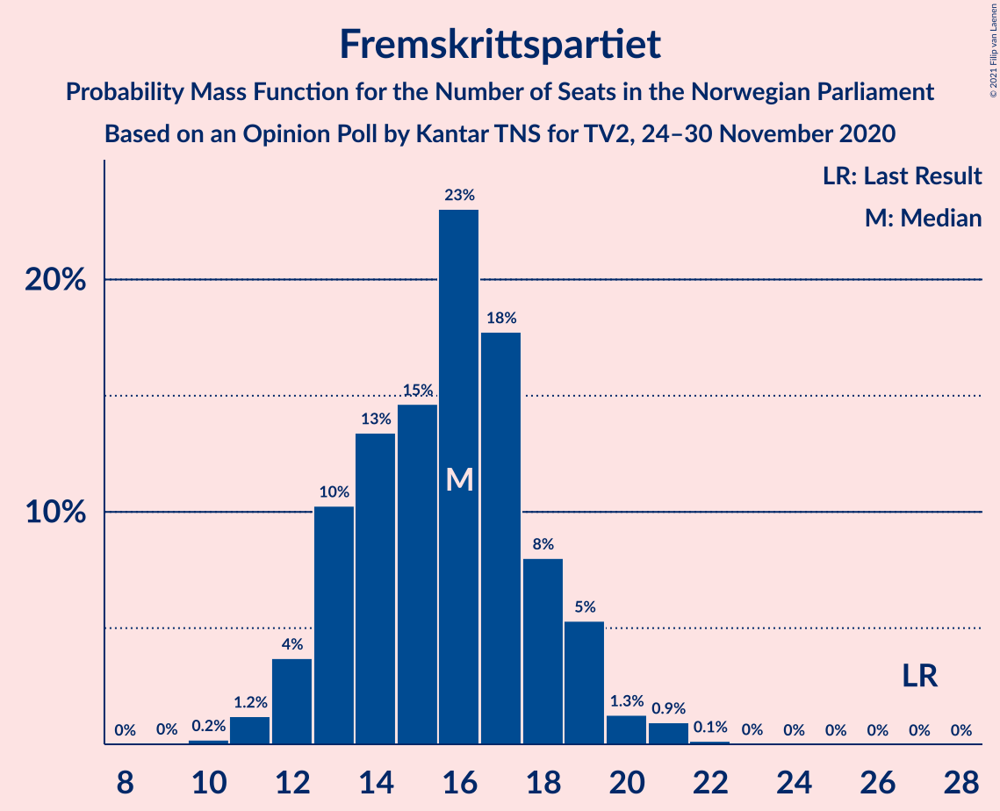
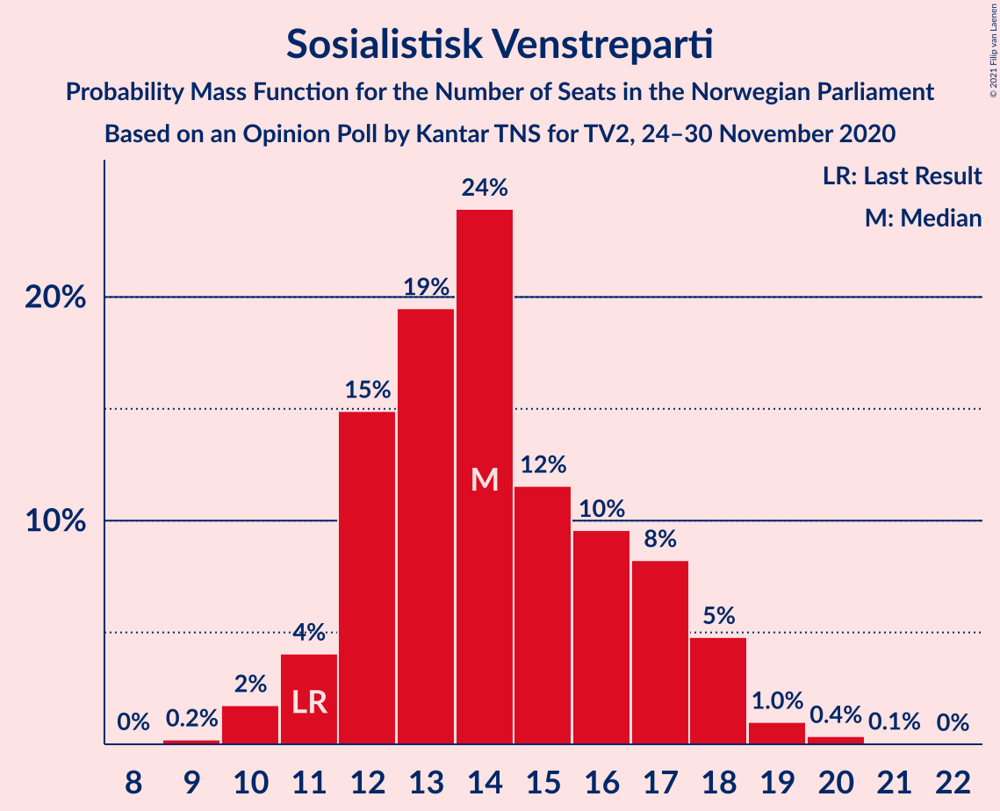
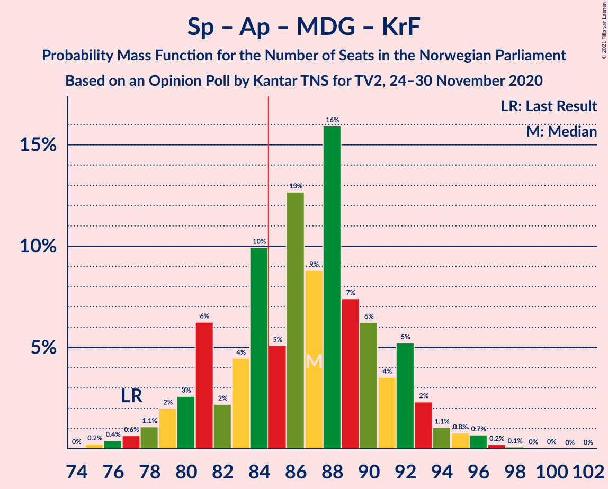
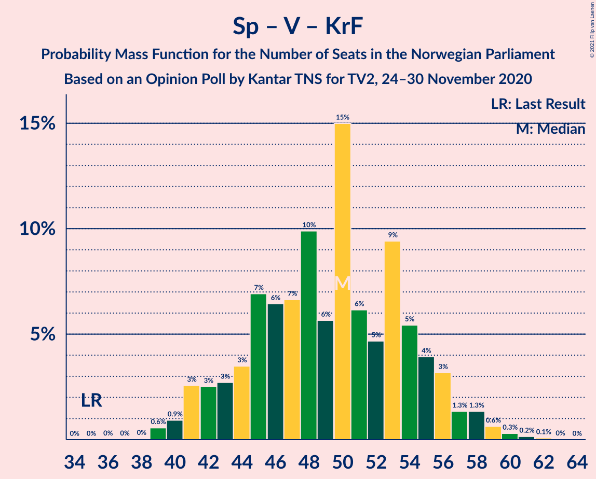

# Opinion Poll by Kantar TNS for TV2, 24–30 November 2020

<a href="#voting-intentions">Voting Intentions</a> | <a href="#seats">Seats</a> | <a href="#coalitions">Coalitions</a> | <a href="#technical-information">Technical Information</a>

## Voting Intentions

### Confidence Intervals

| Party | Last Result | Poll Result | 80% Confidence Interval | 90% Confidence Interval | 95% Confidence Interval | 99% Confidence Interval |
|:-----:|:-----------:|:-----------:|:-----------------------:|:-----------------------:|:-----------------------:|:-----------------------:|
| Senterpartiet | 10.3% | 22.1% | 20.3–24.1% |19.8–24.6% |19.3–25.1% |18.5–26.1% |
| Arbeiderpartiet | 27.4% | 20.3% | 18.6–22.3% |18.1–22.8% |17.7–23.3% |16.9–24.2% |
| Høyre | 25.0% | 20.2% | 18.5–22.1% |18.0–22.7% |17.6–23.1% |16.8–24.1% |
| Fremskrittspartiet | 15.2% | 8.8% | 7.6–10.2% |7.3–10.6% |7.0–11.0% |6.5–11.7% |
| Sosialistisk Venstreparti | 6.0% | 8.0% | 6.9–9.4% |6.6–9.8% |6.3–10.1% |5.8–10.8% |
| Rødt | 2.4% | 6.4% | 5.4–7.7% |5.1–8.0% |4.9–8.3% |4.5–9.0% |
| Miljøpartiet De Grønne | 3.2% | 4.0% | 3.2–5.1% |3.0–5.3% |2.9–5.6% |2.5–6.2% |
| Venstre | 4.4% | 4.0% | 3.2–5.1% |3.0–5.3% |2.9–5.6% |2.5–6.2% |
| Kristelig Folkeparti | 4.2% | 3.3% | 2.6–4.2% |2.4–4.5% |2.2–4.7% |2.0–5.2% |

*Note:* The poll result column reflects the actual value used in the calculations. Published results may vary slightly, and in addition be rounded to fewer digits.

## Seats

### Confidence Intervals

| Party | Last Result | Median | 80% Confidence Interval | 90% Confidence Interval | 95% Confidence Interval | 99% Confidence Interval |
|:-----:|:-----------:|:------:|:-----------------------:|:-----------------------:|:-----------------------:|:-----------------------:|
| <a href="#senterpartiet">Senterpartiet</a> | 19 | 41 | 37–45 |37–45 |36–46 |35–47 |
| <a href="#arbeiderpartiet">Arbeiderpartiet</a> | 49 | 38 | 33–41 |31–43 |30–43 |29–44 |
| <a href="#høyre">Høyre</a> | 45 | 36 | 33–39 |32–40 |31–41 |29–44 |
| <a href="#fremskrittspartiet">Fremskrittspartiet</a> | 27 | 16 | 13–18 |13–19 |12–20 |11–21 |
| <a href="#sosialistisk-venstreparti">Sosialistisk Venstreparti</a> | 11 | 14 | 12–17 |11–17 |11–18 |10–20 |
| <a href="#rødt">Rødt</a> | 1 | 11 | 9–14 |9–15 |8–15 |8–16 |
| <a href="#miljøpartiet-de-grønne">Miljøpartiet De Grønne</a> | 1 | 3 | 2–9 |2–9 |1–10 |1–11 |
| <a href="#venstre">Venstre</a> | 8 | 6 | 2–9 |2–9 |2–9 |2–11 |
| <a href="#kristelig-folkeparti">Kristelig Folkeparti</a> | 8 | 3 | 1–7 |1–7 |1–8 |0–9 |

### Senterpartiet

*For a full overview of the results for this party, see the [Senterpartiet](party-senterpartiet.html) page.*

| Number of Seats | Probability | Accumulated | Special Marks |
|:---------------:|:-----------:|:-----------:|:-------------:|
| 19 | 0% | 100% | Last Result |
| 20 | 0% | 100% |  |
| 21 | 0% | 100% |  |
| 22 | 0% | 100% |  |
| 23 | 0% | 100% |  |
| 24 | 0% | 100% |  |
| 25 | 0% | 100% |  |
| 26 | 0% | 100% |  |
| 27 | 0% | 100% |  |
| 28 | 0% | 100% |  |
| 29 | 0% | 100% |  |
| 30 | 0% | 100% |  |
| 31 | 0% | 100% |  |
| 32 | 0% | 100% |  |
| 33 | 0.1% | 100% |  |
| 34 | 0.2% | 99.9% |  |
| 35 | 0.5% | 99.7% |  |
| 36 | 3% | 99.2% |  |
| 37 | 8% | 96% |  |
| 38 | 5% | 89% |  |
| 39 | 14% | 84% |  |
| 40 | 8% | 70% |  |
| 41 | 13% | 62% | Median |
| 42 | 10% | 49% |  |
| 43 | 13% | 38% |  |
| 44 | 12% | 26% |  |
| 45 | 11% | 14% |  |
| 46 | 2% | 3% |  |
| 47 | 1.2% | 1.4% |  |
| 48 | 0.2% | 0.2% |  |
| 49 | 0% | 0.1% |  |
| 50 | 0% | 0% |  |

### Arbeiderpartiet

*For a full overview of the results for this party, see the [Arbeiderpartiet](party-arbeiderpartiet.html) page.*

| Number of Seats | Probability | Accumulated | Special Marks |
|:---------------:|:-----------:|:-----------:|:-------------:|
| 28 | 0.1% | 100% |  |
| 29 | 0.4% | 99.9% |  |
| 30 | 3% | 99.5% |  |
| 31 | 2% | 97% |  |
| 32 | 3% | 94% |  |
| 33 | 3% | 91% |  |
| 34 | 3% | 88% |  |
| 35 | 15% | 85% |  |
| 36 | 10% | 71% |  |
| 37 | 8% | 61% |  |
| 38 | 7% | 53% | Median |
| 39 | 17% | 46% |  |
| 40 | 11% | 29% |  |
| 41 | 10% | 18% |  |
| 42 | 3% | 8% |  |
| 43 | 4% | 5% |  |
| 44 | 0.6% | 0.8% |  |
| 45 | 0.1% | 0.2% |  |
| 46 | 0% | 0.1% |  |
| 47 | 0% | 0% |  |
| 48 | 0% | 0% |  |
| 49 | 0% | 0% | Last Result |

### Høyre

*For a full overview of the results for this party, see the [Høyre](party-høyre.html) page.*

| Number of Seats | Probability | Accumulated | Special Marks |
|:---------------:|:-----------:|:-----------:|:-------------:|
| 27 | 0.1% | 100% |  |
| 28 | 0.2% | 99.9% |  |
| 29 | 0.4% | 99.7% |  |
| 30 | 0.7% | 99.3% |  |
| 31 | 2% | 98.6% |  |
| 32 | 6% | 97% |  |
| 33 | 11% | 91% |  |
| 34 | 6% | 79% |  |
| 35 | 17% | 74% |  |
| 36 | 16% | 57% | Median |
| 37 | 14% | 41% |  |
| 38 | 16% | 27% |  |
| 39 | 4% | 12% |  |
| 40 | 4% | 8% |  |
| 41 | 2% | 4% |  |
| 42 | 1.0% | 2% |  |
| 43 | 0.7% | 1.2% |  |
| 44 | 0.4% | 0.5% |  |
| 45 | 0% | 0.1% | Last Result |
| 46 | 0.1% | 0.1% |  |
| 47 | 0% | 0% |  |

### Fremskrittspartiet

*For a full overview of the results for this party, see the [Fremskrittspartiet](party-fremskrittspartiet.html) page.*

| Number of Seats | Probability | Accumulated | Special Marks |
|:---------------:|:-----------:|:-----------:|:-------------:|
| 9 | 0% | 100% |  |
| 10 | 0.2% | 99.9% |  |
| 11 | 1.3% | 99.7% |  |
| 12 | 3% | 98% |  |
| 13 | 15% | 95% |  |
| 14 | 11% | 80% |  |
| 15 | 19% | 69% |  |
| 16 | 21% | 50% | Median |
| 17 | 10% | 30% |  |
| 18 | 12% | 19% |  |
| 19 | 5% | 8% |  |
| 20 | 2% | 3% |  |
| 21 | 0.6% | 0.9% |  |
| 22 | 0.2% | 0.3% |  |
| 23 | 0% | 0% |  |
| 24 | 0% | 0% |  |
| 25 | 0% | 0% |  |
| 26 | 0% | 0% |  |
| 27 | 0% | 0% | Last Result |

### Sosialistisk Venstreparti

*For a full overview of the results for this party, see the [Sosialistisk Venstreparti](party-sosialistiskvenstreparti.html) page.*

| Number of Seats | Probability | Accumulated | Special Marks |
|:---------------:|:-----------:|:-----------:|:-------------:|
| 9 | 0.2% | 100% |  |
| 10 | 2% | 99.8% |  |
| 11 | 3% | 98% | Last Result |
| 12 | 19% | 95% |  |
| 13 | 19% | 75% |  |
| 14 | 20% | 56% | Median |
| 15 | 12% | 36% |  |
| 16 | 11% | 24% |  |
| 17 | 9% | 13% |  |
| 18 | 3% | 4% |  |
| 19 | 1.0% | 1.5% |  |
| 20 | 0.4% | 0.5% |  |
| 21 | 0.1% | 0.1% |  |
| 22 | 0% | 0% |  |

### Rødt

*For a full overview of the results for this party, see the [Rødt](party-rødt.html) page.*

| Number of Seats | Probability | Accumulated | Special Marks |
|:---------------:|:-----------:|:-----------:|:-------------:|
| 1 | 0% | 100% | Last Result |
| 2 | 0.1% | 100% |  |
| 3 | 0% | 99.9% |  |
| 4 | 0% | 99.9% |  |
| 5 | 0% | 99.9% |  |
| 6 | 0% | 99.9% |  |
| 7 | 0.3% | 99.9% |  |
| 8 | 3% | 99.6% |  |
| 9 | 11% | 96% |  |
| 10 | 16% | 85% |  |
| 11 | 27% | 69% | Median |
| 12 | 16% | 43% |  |
| 13 | 16% | 27% |  |
| 14 | 5% | 11% |  |
| 15 | 5% | 6% |  |
| 16 | 0.4% | 0.6% |  |
| 17 | 0.1% | 0.2% |  |
| 18 | 0% | 0% |  |

### Miljøpartiet De Grønne

*For a full overview of the results for this party, see the [Miljøpartiet De Grønne](party-miljøpartietdegrønne.html) page.*

| Number of Seats | Probability | Accumulated | Special Marks |
|:---------------:|:-----------:|:-----------:|:-------------:|
| 1 | 4% | 100% | Last Result |
| 2 | 40% | 96% |  |
| 3 | 7% | 56% | Median |
| 4 | 0.2% | 49% |  |
| 5 | 0% | 48% |  |
| 6 | 0.2% | 48% |  |
| 7 | 15% | 48% |  |
| 8 | 21% | 33% |  |
| 9 | 10% | 12% |  |
| 10 | 2% | 3% |  |
| 11 | 0.5% | 0.6% |  |
| 12 | 0.1% | 0.1% |  |
| 13 | 0% | 0% |  |

### Venstre

*For a full overview of the results for this party, see the [Venstre](party-venstre.html) page.*

| Number of Seats | Probability | Accumulated | Special Marks |
|:---------------:|:-----------:|:-----------:|:-------------:|
| 1 | 0.3% | 100% |  |
| 2 | 42% | 99.7% |  |
| 3 | 6% | 58% |  |
| 4 | 0.2% | 52% |  |
| 5 | 0% | 52% |  |
| 6 | 2% | 52% | Median |
| 7 | 11% | 49% |  |
| 8 | 26% | 38% | Last Result |
| 9 | 10% | 12% |  |
| 10 | 2% | 2% |  |
| 11 | 0.5% | 0.5% |  |
| 12 | 0.1% | 0.1% |  |
| 13 | 0% | 0% |  |

### Kristelig Folkeparti

*For a full overview of the results for this party, see the [Kristelig Folkeparti](party-kristeligfolkeparti.html) page.*

| Number of Seats | Probability | Accumulated | Special Marks |
|:---------------:|:-----------:|:-----------:|:-------------:|
| 0 | 1.1% | 100% |  |
| 1 | 29% | 98.9% |  |
| 2 | 15% | 69% |  |
| 3 | 38% | 54% | Median |
| 4 | 0% | 17% |  |
| 5 | 0% | 17% |  |
| 6 | 0.6% | 17% |  |
| 7 | 12% | 16% |  |
| 8 | 3% | 4% | Last Result |
| 9 | 0.6% | 0.8% |  |
| 10 | 0.2% | 0.2% |  |
| 11 | 0% | 0% |  |

## Coalitions

### Confidence Intervals

| Coalition | Last Result | Median | Majority? | 80% Confidence Interval | 90% Confidence Interval | 95% Confidence Interval | 99% Confidence Interval |
|:---------:|:-----------:|:------:|:---------:|:-----------------------:|:-----------------------:|:-----------------------:|:-----------------------:|
| Senterpartiet – Arbeiderpartiet – Sosialistisk Venstreparti – Rødt – Miljøpartiet De Grønne | 81 | 109 | 100% | 105–113 | 103–114 | 102–116 | 99–118 |
| Senterpartiet – Arbeiderpartiet – Sosialistisk Venstreparti – Rødt | 80 | 104 | 100% | 99–109 | 98–111 | 97–111 | 95–112 |
| Senterpartiet – Høyre – Fremskrittspartiet – Venstre – Kristelig Folkeparti | 107 | 101 | 100% | 96–106 | 95–107 | 94–109 | 91–112 |
| Senterpartiet – Arbeiderpartiet – Sosialistisk Venstreparti – Miljøpartiet De Grønne – Kristelig Folkeparti | 88 | 101 | 100% | 96–105 | 95–107 | 92–107 | 90–110 |
| Senterpartiet – Arbeiderpartiet – Sosialistisk Venstreparti – Miljøpartiet De Grønne | 80 | 98 | 100% | 94–102 | 92–103 | 90–104 | 88–107 |
| Senterpartiet – Arbeiderpartiet – Sosialistisk Venstreparti | 79 | 93 | 99.5% | 88–98 | 87–99 | 86–100 | 84–101 |
| Senterpartiet – Arbeiderpartiet – Miljøpartiet De Grønne – Kristelig Folkeparti | 77 | 86 | 70% | 83–92 | 80–93 | 78–95 | 76–96 |
| Senterpartiet – Arbeiderpartiet – Kristelig Folkeparti | 76 | 82 | 20% | 77–86 | 75–87 | 75–88 | 73–90 |
| Senterpartiet – Arbeiderpartiet | 68 | 79 | 3% | 75–82 | 73–84 | 72–85 | 71–85 |
| Høyre – Fremskrittspartiet – Miljøpartiet De Grønne – Venstre – Kristelig Folkeparti | 89 | 65 | 0% | 59–70 | 58–71 | 58–72 | 55–74 |
| Høyre – Fremskrittspartiet – Venstre – Kristelig Folkeparti | 88 | 59 | 0% | 56–63 | 54–65 | 53–67 | 50–69 |
| Høyre – Fremskrittspartiet – Venstre | 80 | 56 | 0% | 52–61 | 50–63 | 50–64 | 48–67 |
| Høyre – Fremskrittspartiet | 72 | 52 | 0% | 48–55 | 47–57 | 46–59 | 43–61 |
| Arbeiderpartiet – Sosialistisk Venstreparti | 60 | 52 | 0% | 47–55 | 45–58 | 44–59 | 43–59 |
| Senterpartiet – Venstre – Kristelig Folkeparti | 35 | 49 | 0% | 45–55 | 42–56 | 41–57 | 40–60 |
| Høyre – Venstre – Kristelig Folkeparti | 61 | 44 | 0% | 39–49 | 38–50 | 37–51 | 34–53 |

### Senterpartiet – Arbeiderpartiet – Sosialistisk Venstreparti – Rødt – Miljøpartiet De Grønne

| Number of Seats | Probability | Accumulated | Special Marks |
|:---------------:|:-----------:|:-----------:|:-------------:|
| 81 | 0% | 100% | Last Result |
| 82 | 0% | 100% |  |
| 83 | 0% | 100% |  |
| 84 | 0% | 100% |  |
| 85 | 0% | 100% | Majority |
| 86 | 0% | 100% |  |
| 87 | 0% | 100% |  |
| 88 | 0% | 100% |  |
| 89 | 0% | 100% |  |
| 90 | 0% | 100% |  |
| 91 | 0% | 100% |  |
| 92 | 0% | 100% |  |
| 93 | 0% | 100% |  |
| 94 | 0% | 100% |  |
| 95 | 0% | 100% |  |
| 96 | 0% | 100% |  |
| 97 | 0.1% | 99.9% |  |
| 98 | 0.1% | 99.9% |  |
| 99 | 0.3% | 99.8% |  |
| 100 | 1.0% | 99.5% |  |
| 101 | 0.9% | 98% |  |
| 102 | 2% | 98% |  |
| 103 | 1.4% | 96% |  |
| 104 | 3% | 94% |  |
| 105 | 3% | 92% |  |
| 106 | 11% | 88% |  |
| 107 | 9% | 77% | Median |
| 108 | 9% | 68% |  |
| 109 | 10% | 59% |  |
| 110 | 10% | 49% |  |
| 111 | 16% | 38% |  |
| 112 | 6% | 23% |  |
| 113 | 9% | 16% |  |
| 114 | 3% | 7% |  |
| 115 | 1.2% | 4% |  |
| 116 | 1.4% | 3% |  |
| 117 | 0.5% | 2% |  |
| 118 | 1.0% | 1.4% |  |
| 119 | 0.4% | 0.4% |  |
| 120 | 0% | 0.1% |  |
| 121 | 0% | 0% |  |

### Senterpartiet – Arbeiderpartiet – Sosialistisk Venstreparti – Rødt

| Number of Seats | Probability | Accumulated | Special Marks |
|:---------------:|:-----------:|:-----------:|:-------------:|
| 80 | 0% | 100% | Last Result |
| 81 | 0% | 100% |  |
| 82 | 0% | 100% |  |
| 83 | 0% | 100% |  |
| 84 | 0% | 100% |  |
| 85 | 0% | 100% | Majority |
| 86 | 0% | 100% |  |
| 87 | 0% | 100% |  |
| 88 | 0% | 100% |  |
| 89 | 0% | 100% |  |
| 90 | 0% | 100% |  |
| 91 | 0% | 100% |  |
| 92 | 0.1% | 99.9% |  |
| 93 | 0.1% | 99.9% |  |
| 94 | 0.1% | 99.8% |  |
| 95 | 0.5% | 99.7% |  |
| 96 | 0.5% | 99.3% |  |
| 97 | 2% | 98.8% |  |
| 98 | 4% | 97% |  |
| 99 | 6% | 93% |  |
| 100 | 5% | 87% |  |
| 101 | 6% | 82% |  |
| 102 | 10% | 76% |  |
| 103 | 9% | 66% |  |
| 104 | 14% | 57% | Median |
| 105 | 7% | 42% |  |
| 106 | 5% | 36% |  |
| 107 | 6% | 30% |  |
| 108 | 8% | 25% |  |
| 109 | 8% | 17% |  |
| 110 | 4% | 9% |  |
| 111 | 4% | 5% |  |
| 112 | 0.5% | 0.8% |  |
| 113 | 0.2% | 0.4% |  |
| 114 | 0% | 0.2% |  |
| 115 | 0.1% | 0.1% |  |
| 116 | 0% | 0% |  |

### Senterpartiet – Høyre – Fremskrittspartiet – Venstre – Kristelig Folkeparti

| Number of Seats | Probability | Accumulated | Special Marks |
|:---------------:|:-----------:|:-----------:|:-------------:|
| 88 | 0% | 100% |  |
| 89 | 0% | 99.9% |  |
| 90 | 0.3% | 99.9% |  |
| 91 | 0.8% | 99.6% |  |
| 92 | 0.5% | 98.9% |  |
| 93 | 0.7% | 98% |  |
| 94 | 2% | 98% |  |
| 95 | 5% | 96% |  |
| 96 | 6% | 91% |  |
| 97 | 5% | 86% |  |
| 98 | 6% | 80% |  |
| 99 | 12% | 75% |  |
| 100 | 8% | 63% |  |
| 101 | 12% | 55% |  |
| 102 | 8% | 43% | Median |
| 103 | 13% | 35% |  |
| 104 | 8% | 22% |  |
| 105 | 3% | 14% |  |
| 106 | 3% | 10% |  |
| 107 | 3% | 7% | Last Result |
| 108 | 2% | 5% |  |
| 109 | 1.4% | 3% |  |
| 110 | 0.6% | 2% |  |
| 111 | 0.4% | 1.0% |  |
| 112 | 0.5% | 0.6% |  |
| 113 | 0.1% | 0.1% |  |
| 114 | 0.1% | 0.1% |  |
| 115 | 0% | 0% |  |

### Senterpartiet – Arbeiderpartiet – Sosialistisk Venstreparti – Miljøpartiet De Grønne – Kristelig Folkeparti

| Number of Seats | Probability | Accumulated | Special Marks |
|:---------------:|:-----------:|:-----------:|:-------------:|
| 88 | 0% | 100% | Last Result |
| 89 | 0.1% | 99.9% |  |
| 90 | 0.6% | 99.9% |  |
| 91 | 1.0% | 99.2% |  |
| 92 | 1.0% | 98% |  |
| 93 | 0.6% | 97% |  |
| 94 | 1.3% | 97% |  |
| 95 | 4% | 95% |  |
| 96 | 7% | 92% |  |
| 97 | 4% | 85% |  |
| 98 | 8% | 81% |  |
| 99 | 13% | 73% | Median |
| 100 | 4% | 60% |  |
| 101 | 13% | 56% |  |
| 102 | 12% | 44% |  |
| 103 | 6% | 31% |  |
| 104 | 11% | 25% |  |
| 105 | 5% | 14% |  |
| 106 | 3% | 9% |  |
| 107 | 3% | 6% |  |
| 108 | 2% | 2% |  |
| 109 | 0.3% | 0.8% |  |
| 110 | 0.2% | 0.5% |  |
| 111 | 0.1% | 0.3% |  |
| 112 | 0.1% | 0.2% |  |
| 113 | 0.1% | 0.1% |  |
| 114 | 0% | 0.1% |  |
| 115 | 0.1% | 0.1% |  |
| 116 | 0% | 0% |  |

### Senterpartiet – Arbeiderpartiet – Sosialistisk Venstreparti – Miljøpartiet De Grønne

| Number of Seats | Probability | Accumulated | Special Marks |
|:---------------:|:-----------:|:-----------:|:-------------:|
| 80 | 0% | 100% | Last Result |
| 81 | 0% | 100% |  |
| 82 | 0% | 100% |  |
| 83 | 0% | 100% |  |
| 84 | 0% | 100% |  |
| 85 | 0% | 100% | Majority |
| 86 | 0.1% | 100% |  |
| 87 | 0.4% | 99.9% |  |
| 88 | 0.7% | 99.5% |  |
| 89 | 0.8% | 98.8% |  |
| 90 | 0.9% | 98% |  |
| 91 | 2% | 97% |  |
| 92 | 2% | 96% |  |
| 93 | 2% | 93% |  |
| 94 | 4% | 91% |  |
| 95 | 14% | 87% |  |
| 96 | 10% | 73% | Median |
| 97 | 13% | 63% |  |
| 98 | 10% | 50% |  |
| 99 | 7% | 41% |  |
| 100 | 10% | 34% |  |
| 101 | 11% | 23% |  |
| 102 | 5% | 12% |  |
| 103 | 3% | 8% |  |
| 104 | 2% | 5% |  |
| 105 | 1.1% | 2% |  |
| 106 | 0.5% | 1.2% |  |
| 107 | 0.4% | 0.7% |  |
| 108 | 0.3% | 0.4% |  |
| 109 | 0.1% | 0.1% |  |
| 110 | 0% | 0% |  |

### Senterpartiet – Arbeiderpartiet – Sosialistisk Venstreparti

| Number of Seats | Probability | Accumulated | Special Marks |
|:---------------:|:-----------:|:-----------:|:-------------:|
| 79 | 0% | 100% | Last Result |
| 80 | 0% | 100% |  |
| 81 | 0% | 100% |  |
| 82 | 0.1% | 99.9% |  |
| 83 | 0.1% | 99.9% |  |
| 84 | 0.3% | 99.8% |  |
| 85 | 0.7% | 99.5% | Majority |
| 86 | 2% | 98.8% |  |
| 87 | 3% | 97% |  |
| 88 | 6% | 94% |  |
| 89 | 4% | 88% |  |
| 90 | 7% | 84% |  |
| 91 | 12% | 77% |  |
| 92 | 14% | 65% |  |
| 93 | 10% | 51% | Median |
| 94 | 12% | 42% |  |
| 95 | 9% | 29% |  |
| 96 | 5% | 20% |  |
| 97 | 3% | 15% |  |
| 98 | 6% | 11% |  |
| 99 | 2% | 5% |  |
| 100 | 3% | 4% |  |
| 101 | 0.4% | 0.7% |  |
| 102 | 0.2% | 0.3% |  |
| 103 | 0.1% | 0.1% |  |
| 104 | 0% | 0% |  |

### Senterpartiet – Arbeiderpartiet – Miljøpartiet De Grønne – Kristelig Folkeparti

| Number of Seats | Probability | Accumulated | Special Marks |
|:---------------:|:-----------:|:-----------:|:-------------:|
| 74 | 0.1% | 100% |  |
| 75 | 0.4% | 99.9% |  |
| 76 | 0.7% | 99.5% |  |
| 77 | 0.9% | 98.9% | Last Result |
| 78 | 0.9% | 98% |  |
| 79 | 1.2% | 97% |  |
| 80 | 2% | 96% |  |
| 81 | 2% | 94% |  |
| 82 | 2% | 93% |  |
| 83 | 6% | 90% |  |
| 84 | 14% | 84% |  |
| 85 | 5% | 70% | Median, Majority |
| 86 | 18% | 65% |  |
| 87 | 8% | 47% |  |
| 88 | 11% | 39% |  |
| 89 | 7% | 28% |  |
| 90 | 4% | 21% |  |
| 91 | 3% | 17% |  |
| 92 | 8% | 14% |  |
| 93 | 2% | 6% |  |
| 94 | 1.2% | 4% |  |
| 95 | 1.2% | 3% |  |
| 96 | 1.0% | 1.4% |  |
| 97 | 0.3% | 0.5% |  |
| 98 | 0% | 0.2% |  |
| 99 | 0.1% | 0.1% |  |
| 100 | 0.1% | 0.1% |  |
| 101 | 0% | 0% |  |

### Senterpartiet – Arbeiderpartiet – Kristelig Folkeparti

| Number of Seats | Probability | Accumulated | Special Marks |
|:---------------:|:-----------:|:-----------:|:-------------:|
| 70 | 0% | 100% |  |
| 71 | 0.1% | 99.9% |  |
| 72 | 0.2% | 99.9% |  |
| 73 | 0.4% | 99.7% |  |
| 74 | 2% | 99.3% |  |
| 75 | 3% | 98% |  |
| 76 | 4% | 95% | Last Result |
| 77 | 4% | 90% |  |
| 78 | 7% | 86% |  |
| 79 | 3% | 79% |  |
| 80 | 7% | 76% |  |
| 81 | 14% | 69% |  |
| 82 | 11% | 55% | Median |
| 83 | 11% | 44% |  |
| 84 | 12% | 32% |  |
| 85 | 8% | 20% | Majority |
| 86 | 4% | 12% |  |
| 87 | 4% | 8% |  |
| 88 | 3% | 4% |  |
| 89 | 1.0% | 2% |  |
| 90 | 0.5% | 0.9% |  |
| 91 | 0.2% | 0.4% |  |
| 92 | 0.1% | 0.2% |  |
| 93 | 0.1% | 0.1% |  |
| 94 | 0% | 0% |  |

### Senterpartiet – Arbeiderpartiet

| Number of Seats | Probability | Accumulated | Special Marks |
|:---------------:|:-----------:|:-----------:|:-------------:|
| 68 | 0% | 100% | Last Result |
| 69 | 0.1% | 99.9% |  |
| 70 | 0.2% | 99.9% |  |
| 71 | 0.8% | 99.7% |  |
| 72 | 2% | 98.9% |  |
| 73 | 2% | 97% |  |
| 74 | 5% | 95% |  |
| 75 | 6% | 90% |  |
| 76 | 5% | 84% |  |
| 77 | 10% | 79% |  |
| 78 | 12% | 69% |  |
| 79 | 13% | 57% | Median |
| 80 | 15% | 44% |  |
| 81 | 11% | 29% |  |
| 82 | 10% | 18% |  |
| 83 | 2% | 8% |  |
| 84 | 3% | 6% |  |
| 85 | 2% | 3% | Majority |
| 86 | 0.1% | 0.5% |  |
| 87 | 0.3% | 0.4% |  |
| 88 | 0% | 0.1% |  |
| 89 | 0% | 0% |  |

### Høyre – Fremskrittspartiet – Miljøpartiet De Grønne – Venstre – Kristelig Folkeparti

| Number of Seats | Probability | Accumulated | Special Marks |
|:---------------:|:-----------:|:-----------:|:-------------:|
| 52 | 0.1% | 100% |  |
| 53 | 0.3% | 99.9% |  |
| 54 | 0.1% | 99.6% |  |
| 55 | 0.2% | 99.5% |  |
| 56 | 0.2% | 99.4% |  |
| 57 | 0.7% | 99.1% |  |
| 58 | 5% | 98% |  |
| 59 | 4% | 94% |  |
| 60 | 8% | 90% |  |
| 61 | 8% | 82% |  |
| 62 | 6% | 73% |  |
| 63 | 7% | 68% |  |
| 64 | 7% | 61% | Median |
| 65 | 15% | 54% |  |
| 66 | 9% | 40% |  |
| 67 | 9% | 31% |  |
| 68 | 6% | 21% |  |
| 69 | 4% | 16% |  |
| 70 | 5% | 11% |  |
| 71 | 3% | 6% |  |
| 72 | 2% | 3% |  |
| 73 | 0.4% | 0.9% |  |
| 74 | 0.4% | 0.6% |  |
| 75 | 0.1% | 0.2% |  |
| 76 | 0.1% | 0.1% |  |
| 77 | 0.1% | 0.1% |  |
| 78 | 0% | 0% |  |
| 79 | 0% | 0% |  |
| 80 | 0% | 0% |  |
| 81 | 0% | 0% |  |
| 82 | 0% | 0% |  |
| 83 | 0% | 0% |  |
| 84 | 0% | 0% |  |
| 85 | 0% | 0% | Majority |
| 86 | 0% | 0% |  |
| 87 | 0% | 0% |  |
| 88 | 0% | 0% |  |
| 89 | 0% | 0% | Last Result |

### Høyre – Fremskrittspartiet – Venstre – Kristelig Folkeparti

| Number of Seats | Probability | Accumulated | Special Marks |
|:---------------:|:-----------:|:-----------:|:-------------:|
| 49 | 0.1% | 100% |  |
| 50 | 0.5% | 99.8% |  |
| 51 | 1.3% | 99.4% |  |
| 52 | 0.6% | 98% |  |
| 53 | 1.5% | 98% |  |
| 54 | 2% | 96% |  |
| 55 | 3% | 94% |  |
| 56 | 11% | 91% |  |
| 57 | 7% | 81% |  |
| 58 | 16% | 74% |  |
| 59 | 10% | 58% |  |
| 60 | 10% | 48% |  |
| 61 | 9% | 38% | Median |
| 62 | 8% | 29% |  |
| 63 | 11% | 21% |  |
| 64 | 3% | 10% |  |
| 65 | 2% | 7% |  |
| 66 | 1.3% | 5% |  |
| 67 | 2% | 3% |  |
| 68 | 0.7% | 2% |  |
| 69 | 0.8% | 1.1% |  |
| 70 | 0.1% | 0.3% |  |
| 71 | 0.1% | 0.2% |  |
| 72 | 0.1% | 0.1% |  |
| 73 | 0% | 0% |  |
| 74 | 0% | 0% |  |
| 75 | 0% | 0% |  |
| 76 | 0% | 0% |  |
| 77 | 0% | 0% |  |
| 78 | 0% | 0% |  |
| 79 | 0% | 0% |  |
| 80 | 0% | 0% |  |
| 81 | 0% | 0% |  |
| 82 | 0% | 0% |  |
| 83 | 0% | 0% |  |
| 84 | 0% | 0% |  |
| 85 | 0% | 0% | Majority |
| 86 | 0% | 0% |  |
| 87 | 0% | 0% |  |
| 88 | 0% | 0% | Last Result |

### Høyre – Fremskrittspartiet – Venstre

| Number of Seats | Probability | Accumulated | Special Marks |
|:---------------:|:-----------:|:-----------:|:-------------:|
| 44 | 0.1% | 100% |  |
| 45 | 0% | 99.9% |  |
| 46 | 0.1% | 99.9% |  |
| 47 | 0.2% | 99.8% |  |
| 48 | 0.4% | 99.6% |  |
| 49 | 1.2% | 99.2% |  |
| 50 | 3% | 98% |  |
| 51 | 4% | 95% |  |
| 52 | 2% | 91% |  |
| 53 | 6% | 89% |  |
| 54 | 8% | 83% |  |
| 55 | 12% | 75% |  |
| 56 | 13% | 63% |  |
| 57 | 16% | 50% |  |
| 58 | 9% | 34% | Median |
| 59 | 3% | 25% |  |
| 60 | 8% | 22% |  |
| 61 | 7% | 14% |  |
| 62 | 2% | 7% |  |
| 63 | 2% | 6% |  |
| 64 | 2% | 4% |  |
| 65 | 0.8% | 2% |  |
| 66 | 0.9% | 2% |  |
| 67 | 0.2% | 0.6% |  |
| 68 | 0.4% | 0.4% |  |
| 69 | 0% | 0% |  |
| 70 | 0% | 0% |  |
| 71 | 0% | 0% |  |
| 72 | 0% | 0% |  |
| 73 | 0% | 0% |  |
| 74 | 0% | 0% |  |
| 75 | 0% | 0% |  |
| 76 | 0% | 0% |  |
| 77 | 0% | 0% |  |
| 78 | 0% | 0% |  |
| 79 | 0% | 0% |  |
| 80 | 0% | 0% | Last Result |

### Høyre – Fremskrittspartiet

| Number of Seats | Probability | Accumulated | Special Marks |
|:---------------:|:-----------:|:-----------:|:-------------:|
| 41 | 0.1% | 100% |  |
| 42 | 0.1% | 99.9% |  |
| 43 | 0.4% | 99.8% |  |
| 44 | 0.5% | 99.4% |  |
| 45 | 0.5% | 98.9% |  |
| 46 | 2% | 98% |  |
| 47 | 6% | 97% |  |
| 48 | 12% | 91% |  |
| 49 | 14% | 79% |  |
| 50 | 6% | 65% |  |
| 51 | 8% | 59% |  |
| 52 | 13% | 51% | Median |
| 53 | 12% | 38% |  |
| 54 | 6% | 26% |  |
| 55 | 12% | 19% |  |
| 56 | 2% | 7% |  |
| 57 | 0.9% | 5% |  |
| 58 | 2% | 4% |  |
| 59 | 1.2% | 3% |  |
| 60 | 0.4% | 1.4% |  |
| 61 | 1.0% | 1.1% |  |
| 62 | 0% | 0.1% |  |
| 63 | 0% | 0.1% |  |
| 64 | 0% | 0.1% |  |
| 65 | 0% | 0% |  |
| 66 | 0% | 0% |  |
| 67 | 0% | 0% |  |
| 68 | 0% | 0% |  |
| 69 | 0% | 0% |  |
| 70 | 0% | 0% |  |
| 71 | 0% | 0% |  |
| 72 | 0% | 0% | Last Result |

### Arbeiderpartiet – Sosialistisk Venstreparti

| Number of Seats | Probability | Accumulated | Special Marks |
|:---------------:|:-----------:|:-----------:|:-------------:|
| 40 | 0% | 100% |  |
| 41 | 0.2% | 99.9% |  |
| 42 | 0.2% | 99.7% |  |
| 43 | 0.7% | 99.5% |  |
| 44 | 2% | 98.8% |  |
| 45 | 3% | 96% |  |
| 46 | 3% | 93% |  |
| 47 | 3% | 91% |  |
| 48 | 7% | 88% |  |
| 49 | 6% | 81% |  |
| 50 | 8% | 74% |  |
| 51 | 12% | 67% |  |
| 52 | 11% | 55% | Median |
| 53 | 22% | 44% |  |
| 54 | 8% | 22% |  |
| 55 | 4% | 14% |  |
| 56 | 2% | 10% |  |
| 57 | 2% | 8% |  |
| 58 | 3% | 6% |  |
| 59 | 3% | 3% |  |
| 60 | 0.3% | 0.4% | Last Result |
| 61 | 0.1% | 0.1% |  |
| 62 | 0% | 0% |  |

### Senterpartiet – Venstre – Kristelig Folkeparti

| Number of Seats | Probability | Accumulated | Special Marks |
|:---------------:|:-----------:|:-----------:|:-------------:|
| 35 | 0% | 100% | Last Result |
| 36 | 0% | 100% |  |
| 37 | 0% | 100% |  |
| 38 | 0.1% | 100% |  |
| 39 | 0.3% | 99.9% |  |
| 40 | 1.1% | 99.6% |  |
| 41 | 1.0% | 98% |  |
| 42 | 4% | 97% |  |
| 43 | 1.4% | 94% |  |
| 44 | 2% | 92% |  |
| 45 | 11% | 91% |  |
| 46 | 5% | 80% |  |
| 47 | 9% | 74% |  |
| 48 | 13% | 66% |  |
| 49 | 8% | 52% |  |
| 50 | 4% | 45% | Median |
| 51 | 7% | 40% |  |
| 52 | 6% | 33% |  |
| 53 | 7% | 28% |  |
| 54 | 7% | 21% |  |
| 55 | 6% | 13% |  |
| 56 | 5% | 8% |  |
| 57 | 1.2% | 3% |  |
| 58 | 0.8% | 2% |  |
| 59 | 0.5% | 1.0% |  |
| 60 | 0.4% | 0.5% |  |
| 61 | 0.1% | 0.2% |  |
| 62 | 0.1% | 0.1% |  |
| 63 | 0% | 0% |  |

### Høyre – Venstre – Kristelig Folkeparti

| Number of Seats | Probability | Accumulated | Special Marks |
|:---------------:|:-----------:|:-----------:|:-------------:|
| 33 | 0.1% | 100% |  |
| 34 | 0.5% | 99.9% |  |
| 35 | 0.2% | 99.3% |  |
| 36 | 0.7% | 99.2% |  |
| 37 | 2% | 98% |  |
| 38 | 3% | 97% |  |
| 39 | 5% | 94% |  |
| 40 | 3% | 88% |  |
| 41 | 16% | 85% |  |
| 42 | 3% | 69% |  |
| 43 | 11% | 66% |  |
| 44 | 14% | 55% |  |
| 45 | 8% | 41% | Median |
| 46 | 5% | 33% |  |
| 47 | 11% | 28% |  |
| 48 | 4% | 17% |  |
| 49 | 3% | 12% |  |
| 50 | 6% | 9% |  |
| 51 | 1.1% | 3% |  |
| 52 | 2% | 2% |  |
| 53 | 0.3% | 0.6% |  |
| 54 | 0.1% | 0.3% |  |
| 55 | 0.1% | 0.2% |  |
| 56 | 0% | 0.1% |  |
| 57 | 0% | 0% |  |
| 58 | 0% | 0% |  |
| 59 | 0% | 0% |  |
| 60 | 0% | 0% |  |
| 61 | 0% | 0% | Last Result |

## Technical Information

### Opinion Poll

+ **Polling firm:** Kantar TNS
+ **Commissioner(s):** TV2
+ **Fieldwork period:** 24–30 November 2020

### Calculations

+ **Sample size:** 797
+ **Simulations done:** 524,288
+ **Error estimate:** 2.04%

