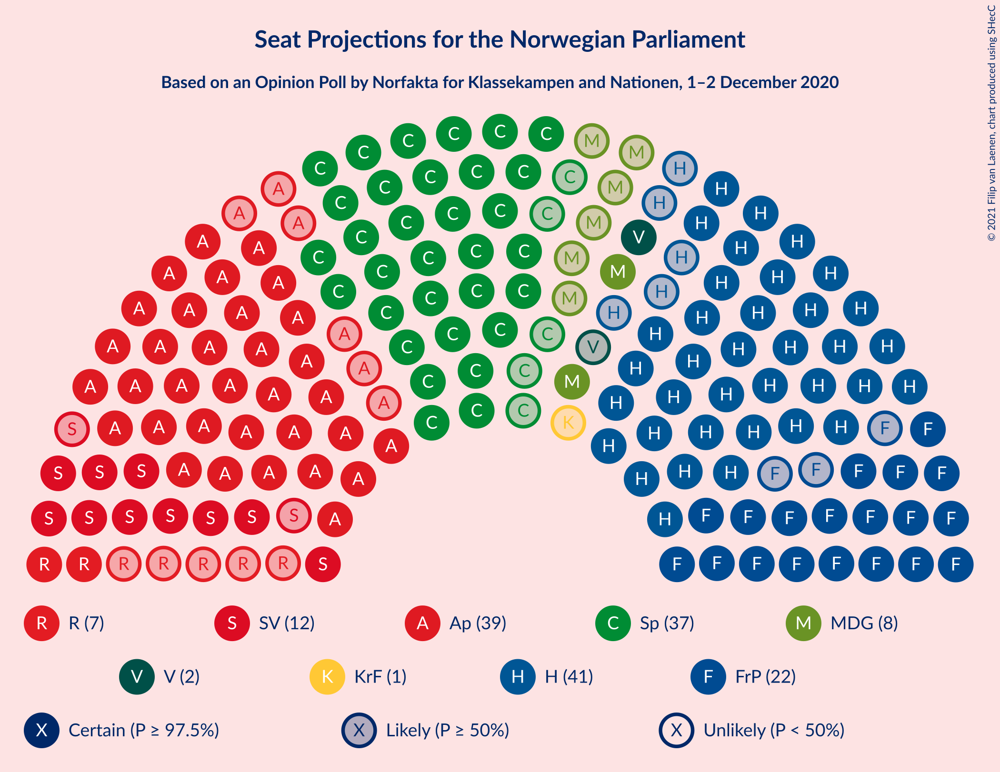
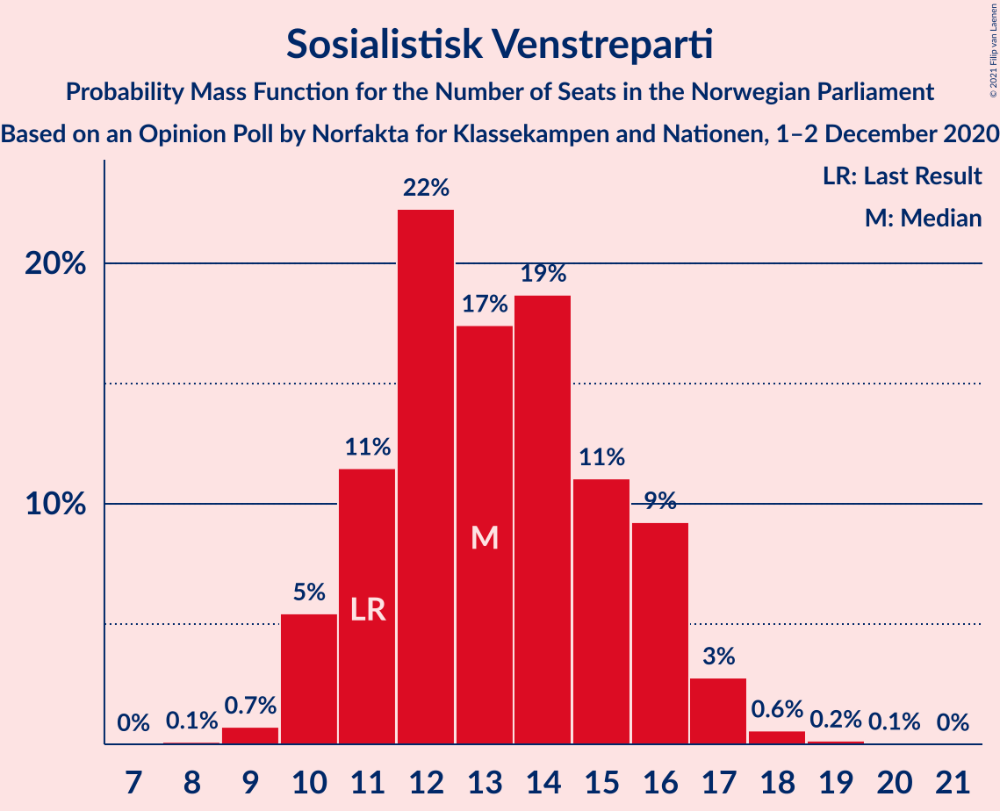
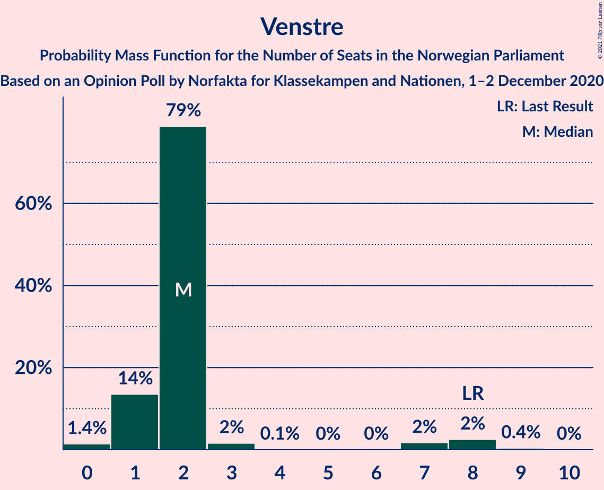
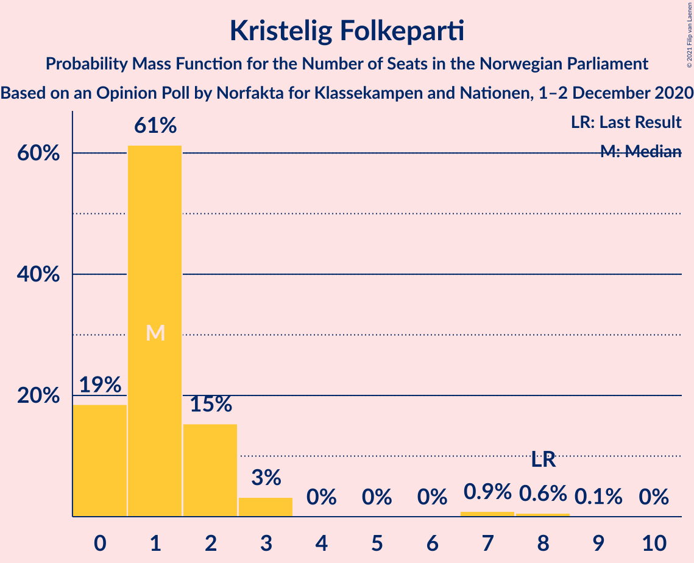
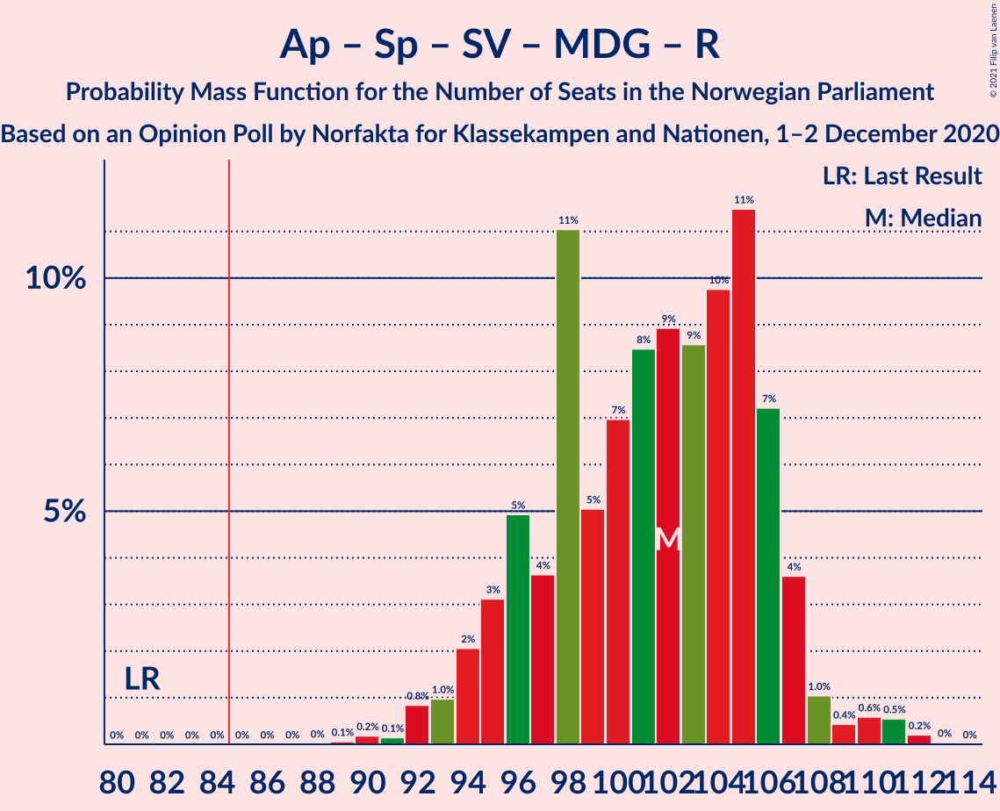
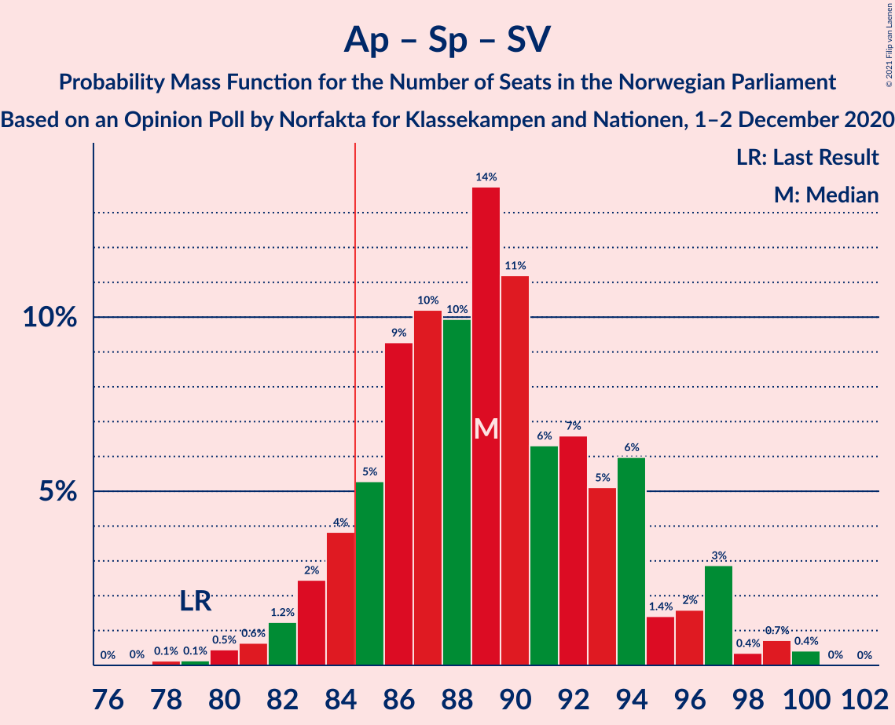
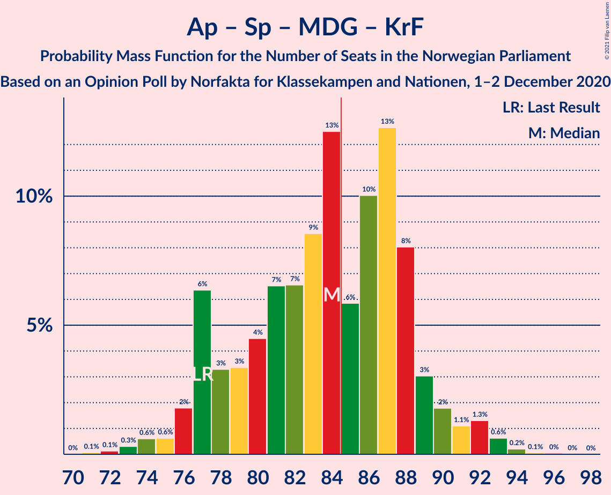
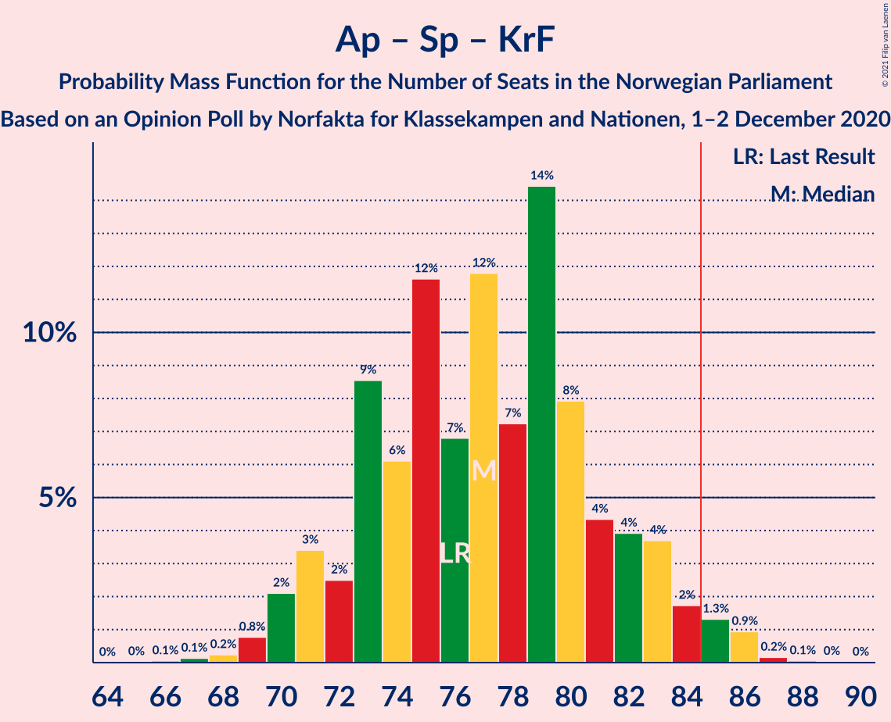
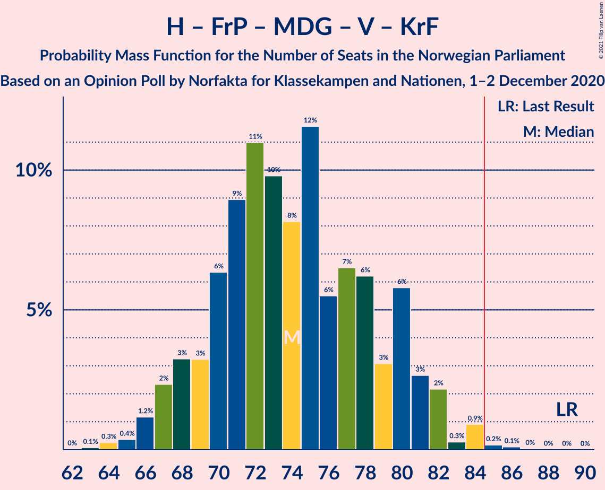

# Opinion Poll by Norfakta for Klassekampen and Nationen, 1–2 December 2020

<a href="#voting-intentions">Voting Intentions</a> | <a href="#seats">Seats</a> | <a href="#coalitions">Coalitions</a> | <a href="#technical-information">Technical Information</a>

## Voting Intentions

### Confidence Intervals

| Party | Last Result | Poll Result | 80% Confidence Interval | 90% Confidence Interval | 95% Confidence Interval | 99% Confidence Interval |
|:-----:|:-----------:|:-----------:|:-----------------------:|:-----------------------:|:-----------------------:|:-----------------------:|
| Høyre | 25.0% | 23.0% | 21.1–25.0% |20.6–25.5% |20.2–26.0% |19.3–27.0% |
| Arbeiderpartiet | 27.4% | 21.1% | 19.4–23.0% |18.9–23.6% |18.4–24.1% |17.6–25.0% |
| Senterpartiet | 10.3% | 20.1% | 18.4–22.0% |17.9–22.6% |17.5–23.0% |16.7–24.0% |
| Fremskrittspartiet | 15.2% | 12.3% | 11.0–13.9% |10.6–14.4% |10.3–14.8% |9.6–15.6% |
| Sosialistisk Venstreparti | 6.0% | 7.2% | 6.1–8.5% |5.8–8.8% |5.6–9.2% |5.1–9.8% |
| Miljøpartiet De Grønne | 3.2% | 4.3% | 3.5–5.4% |3.3–5.7% |3.1–6.0% |2.8–6.5% |
| Rødt | 2.4% | 4.1% | 3.3–5.1% |3.1–5.4% |2.9–5.7% |2.6–6.2% |
| Venstre | 4.4% | 2.8% | 2.2–3.7% |2.0–4.0% |1.9–4.2% |1.6–4.7% |
| Kristelig Folkeparti | 4.2% | 2.6% | 2.0–3.5% |1.8–3.7% |1.7–3.9% |1.4–4.4% |

*Note:* The poll result column reflects the actual value used in the calculations. Published results may vary slightly, and in addition be rounded to fewer digits.

## Seats

### Confidence Intervals

| Party | Last Result | Median | 80% Confidence Interval | 90% Confidence Interval | 95% Confidence Interval | 99% Confidence Interval |
|:-----:|:-----------:|:------:|:-----------------------:|:-----------------------:|:-----------------------:|:-----------------------:|
| <a href="#høyre">Høyre</a> | 45 | 42 | 38–47 |37–48 |36–48 |34–50 |
| <a href="#arbeiderpartiet">Arbeiderpartiet</a> | 49 | 38 | 35–42 |34–43 |34–44 |32–46 |
| <a href="#senterpartiet">Senterpartiet</a> | 19 | 38 | 35–41 |34–42 |33–43 |30–45 |
| <a href="#fremskrittspartiet">Fremskrittspartiet</a> | 27 | 22 | 19–26 |19–27 |18–27 |17–29 |
| <a href="#sosialistisk-venstreparti">Sosialistisk Venstreparti</a> | 11 | 14 | 11–16 |10–17 |10–17 |9–18 |
| <a href="#miljøpartiet-de-grønne">Miljøpartiet De Grønne</a> | 1 | 8 | 2–10 |2–10 |2–11 |1–12 |
| <a href="#rødt">Rødt</a> | 1 | 2 | 2–8 |2–9 |2–10 |1–11 |
| <a href="#venstre">Venstre</a> | 8 | 2 | 1–2 |1–7 |0–8 |0–8 |
| <a href="#kristelig-folkeparti">Kristelig Folkeparti</a> | 8 | 1 | 0–2 |0–3 |0–3 |0–8 |

### Høyre

*For a full overview of the results for this party, see the [Høyre](party-høyre.html) page.*

| Number of Seats | Probability | Accumulated | Special Marks |
|:---------------:|:-----------:|:-----------:|:-------------:|
| 34 | 0.6% | 100% |  |
| 35 | 0.9% | 99.4% |  |
| 36 | 3% | 98.5% |  |
| 37 | 1.4% | 96% |  |
| 38 | 9% | 94% |  |
| 39 | 3% | 86% |  |
| 40 | 13% | 82% |  |
| 41 | 11% | 69% |  |
| 42 | 12% | 59% | Median |
| 43 | 13% | 47% |  |
| 44 | 5% | 34% |  |
| 45 | 6% | 29% | Last Result |
| 46 | 2% | 23% |  |
| 47 | 13% | 20% |  |
| 48 | 6% | 7% |  |
| 49 | 0.8% | 1.5% |  |
| 50 | 0.5% | 0.7% |  |
| 51 | 0% | 0.1% |  |
| 52 | 0.1% | 0.1% |  |
| 53 | 0% | 0% |  |

### Arbeiderpartiet

*For a full overview of the results for this party, see the [Arbeiderpartiet](party-arbeiderpartiet.html) page.*

| Number of Seats | Probability | Accumulated | Special Marks |
|:---------------:|:-----------:|:-----------:|:-------------:|
| 29 | 0.1% | 100% |  |
| 30 | 0.1% | 99.9% |  |
| 31 | 0.3% | 99.9% |  |
| 32 | 1.0% | 99.6% |  |
| 33 | 1.0% | 98.6% |  |
| 34 | 5% | 98% |  |
| 35 | 6% | 93% |  |
| 36 | 10% | 87% |  |
| 37 | 23% | 78% |  |
| 38 | 5% | 54% | Median |
| 39 | 20% | 50% |  |
| 40 | 9% | 30% |  |
| 41 | 4% | 21% |  |
| 42 | 9% | 17% |  |
| 43 | 5% | 8% |  |
| 44 | 1.4% | 3% |  |
| 45 | 0.5% | 2% |  |
| 46 | 1.1% | 1.4% |  |
| 47 | 0.1% | 0.3% |  |
| 48 | 0% | 0.2% |  |
| 49 | 0.2% | 0.2% | Last Result |
| 50 | 0% | 0% |  |

### Senterpartiet

*For a full overview of the results for this party, see the [Senterpartiet](party-senterpartiet.html) page.*

| Number of Seats | Probability | Accumulated | Special Marks |
|:---------------:|:-----------:|:-----------:|:-------------:|
| 19 | 0% | 100% | Last Result |
| 20 | 0% | 100% |  |
| 21 | 0% | 100% |  |
| 22 | 0% | 100% |  |
| 23 | 0% | 100% |  |
| 24 | 0% | 100% |  |
| 25 | 0% | 100% |  |
| 26 | 0% | 100% |  |
| 27 | 0% | 100% |  |
| 28 | 0% | 100% |  |
| 29 | 0.1% | 100% |  |
| 30 | 0.5% | 99.9% |  |
| 31 | 0.3% | 99.3% |  |
| 32 | 0.4% | 99.0% |  |
| 33 | 2% | 98.6% |  |
| 34 | 6% | 96% |  |
| 35 | 19% | 90% |  |
| 36 | 14% | 71% |  |
| 37 | 6% | 57% |  |
| 38 | 9% | 51% | Median |
| 39 | 4% | 42% |  |
| 40 | 13% | 38% |  |
| 41 | 16% | 25% |  |
| 42 | 6% | 9% |  |
| 43 | 2% | 3% |  |
| 44 | 0.8% | 1.5% |  |
| 45 | 0.6% | 0.7% |  |
| 46 | 0% | 0% |  |

### Fremskrittspartiet

*For a full overview of the results for this party, see the [Fremskrittspartiet](party-fremskrittspartiet.html) page.*

| Number of Seats | Probability | Accumulated | Special Marks |
|:---------------:|:-----------:|:-----------:|:-------------:|
| 15 | 0.1% | 100% |  |
| 16 | 0.2% | 99.9% |  |
| 17 | 0.5% | 99.7% |  |
| 18 | 3% | 99.3% |  |
| 19 | 7% | 97% |  |
| 20 | 4% | 90% |  |
| 21 | 28% | 86% |  |
| 22 | 9% | 58% | Median |
| 23 | 16% | 49% |  |
| 24 | 10% | 33% |  |
| 25 | 11% | 22% |  |
| 26 | 5% | 12% |  |
| 27 | 5% | 6% | Last Result |
| 28 | 0.9% | 2% |  |
| 29 | 0.6% | 0.7% |  |
| 30 | 0.1% | 0.1% |  |
| 31 | 0% | 0% |  |

### Sosialistisk Venstreparti

*For a full overview of the results for this party, see the [Sosialistisk Venstreparti](party-sosialistiskvenstreparti.html) page.*

| Number of Seats | Probability | Accumulated | Special Marks |
|:---------------:|:-----------:|:-----------:|:-------------:|
| 8 | 0.1% | 100% |  |
| 9 | 0.9% | 99.9% |  |
| 10 | 9% | 99.0% |  |
| 11 | 6% | 90% | Last Result |
| 12 | 15% | 84% |  |
| 13 | 10% | 69% |  |
| 14 | 13% | 59% | Median |
| 15 | 19% | 46% |  |
| 16 | 21% | 27% |  |
| 17 | 6% | 6% |  |
| 18 | 0.4% | 0.6% |  |
| 19 | 0.1% | 0.1% |  |
| 20 | 0% | 0% |  |

### Miljøpartiet De Grønne

*For a full overview of the results for this party, see the [Miljøpartiet De Grønne](party-miljøpartietdegrønne.html) page.*

| Number of Seats | Probability | Accumulated | Special Marks |
|:---------------:|:-----------:|:-----------:|:-------------:|
| 1 | 0.8% | 100% | Last Result |
| 2 | 26% | 99.2% |  |
| 3 | 11% | 74% |  |
| 4 | 0.3% | 62% |  |
| 5 | 0% | 62% |  |
| 6 | 0% | 62% |  |
| 7 | 8% | 62% |  |
| 8 | 21% | 54% | Median |
| 9 | 17% | 33% |  |
| 10 | 13% | 16% |  |
| 11 | 2% | 3% |  |
| 12 | 0.5% | 0.6% |  |
| 13 | 0.1% | 0.1% |  |
| 14 | 0% | 0% |  |

### Rødt

*For a full overview of the results for this party, see the [Rødt](party-rødt.html) page.*

| Number of Seats | Probability | Accumulated | Special Marks |
|:---------------:|:-----------:|:-----------:|:-------------:|
| 1 | 0.9% | 100% | Last Result |
| 2 | 59% | 99.1% | Median |
| 3 | 0% | 40% |  |
| 4 | 0% | 40% |  |
| 5 | 0% | 40% |  |
| 6 | 0.1% | 40% |  |
| 7 | 6% | 40% |  |
| 8 | 24% | 33% |  |
| 9 | 5% | 9% |  |
| 10 | 3% | 4% |  |
| 11 | 1.1% | 1.4% |  |
| 12 | 0.2% | 0.3% |  |
| 13 | 0% | 0% |  |

### Venstre

*For a full overview of the results for this party, see the [Venstre](party-venstre.html) page.*

| Number of Seats | Probability | Accumulated | Special Marks |
|:---------------:|:-----------:|:-----------:|:-------------:|
| 0 | 3% | 100% |  |
| 1 | 12% | 97% |  |
| 2 | 79% | 86% | Median |
| 3 | 0.8% | 6% |  |
| 4 | 0% | 6% |  |
| 5 | 0% | 6% |  |
| 6 | 0% | 6% |  |
| 7 | 2% | 6% |  |
| 8 | 3% | 4% | Last Result |
| 9 | 0.1% | 0.2% |  |
| 10 | 0.1% | 0.1% |  |
| 11 | 0% | 0% |  |

### Kristelig Folkeparti

*For a full overview of the results for this party, see the [Kristelig Folkeparti](party-kristeligfolkeparti.html) page.*

| Number of Seats | Probability | Accumulated | Special Marks |
|:---------------:|:-----------:|:-----------:|:-------------:|
| 0 | 32% | 100% |  |
| 1 | 51% | 68% | Median |
| 2 | 9% | 16% |  |
| 3 | 5% | 7% |  |
| 4 | 0% | 2% |  |
| 5 | 0% | 2% |  |
| 6 | 0.1% | 2% |  |
| 7 | 0.5% | 2% |  |
| 8 | 1.2% | 1.4% | Last Result |
| 9 | 0.2% | 0.2% |  |
| 10 | 0% | 0% |  |

## Coalitions

### Confidence Intervals

| Coalition | Last Result | Median | Majority? | 80% Confidence Interval | 90% Confidence Interval | 95% Confidence Interval | 99% Confidence Interval |
|:---------:|:-----------:|:------:|:---------:|:-----------------------:|:-----------------------:|:-----------------------:|:-----------------------:|
| Høyre – Senterpartiet – Fremskrittspartiet – Venstre – Kristelig Folkeparti | 107 | 105 | 100% | 101–112 | 99–112 | 98–112 | 94–115 |
| Arbeiderpartiet – Senterpartiet – Sosialistisk Venstreparti – Miljøpartiet De Grønne – Rødt | 81 | 101 | 100% | 96–104 | 94–108 | 94–110 | 92–111 |
| Arbeiderpartiet – Senterpartiet – Sosialistisk Venstreparti – Miljøpartiet De Grønne – Kristelig Folkeparti | 88 | 97 | 99.9% | 93–102 | 92–103 | 89–103 | 87–106 |
| Arbeiderpartiet – Senterpartiet – Sosialistisk Venstreparti – Miljøpartiet De Grønne | 80 | 96 | 99.9% | 92–101 | 90–102 | 88–102 | 86–104 |
| Arbeiderpartiet – Senterpartiet – Sosialistisk Venstreparti – Rødt | 80 | 95 | 99.8% | 88–101 | 87–102 | 85–102 | 85–103 |
| Arbeiderpartiet – Senterpartiet – Sosialistisk Venstreparti | 79 | 90 | 92% | 85–94 | 83–94 | 83–96 | 80–98 |
| Arbeiderpartiet – Senterpartiet – Miljøpartiet De Grønne – Kristelig Folkeparti | 77 | 83 | 41% | 79–89 | 78–90 | 75–91 | 72–93 |
| Arbeiderpartiet – Senterpartiet – Kristelig Folkeparti | 76 | 78 | 2% | 71–82 | 71–83 | 70–84 | 69–86 |
| Høyre – Fremskrittspartiet – Miljøpartiet De Grønne – Venstre – Kristelig Folkeparti | 89 | 74 | 0.2% | 68–81 | 67–82 | 67–84 | 66–84 |
| Arbeiderpartiet – Senterpartiet | 68 | 78 | 0.5% | 71–80 | 70–81 | 70–82 | 68–84 |
| Høyre – Fremskrittspartiet – Venstre – Kristelig Folkeparti | 88 | 68 | 0% | 65–73 | 61–75 | 59–75 | 58–77 |
| Høyre – Fremskrittspartiet – Venstre | 80 | 66 | 0% | 64–72 | 60–74 | 59–75 | 56–75 |
| Høyre – Fremskrittspartiet | 72 | 64 | 0% | 60–71 | 58–72 | 57–73 | 54–73 |
| Arbeiderpartiet – Sosialistisk Venstreparti | 60 | 53 | 0% | 48–55 | 48–56 | 46–57 | 44–60 |
| Høyre – Venstre – Kristelig Folkeparti | 61 | 46 | 0% | 42–50 | 40–51 | 38–51 | 37–53 |
| Senterpartiet – Venstre – Kristelig Folkeparti | 35 | 41 | 0% | 37–45 | 36–46 | 36–49 | 33–50 |

### Høyre – Senterpartiet – Fremskrittspartiet – Venstre – Kristelig Folkeparti

| Number of Seats | Probability | Accumulated | Special Marks |
|:---------------:|:-----------:|:-----------:|:-------------:|
| 92 | 0.1% | 100% |  |
| 93 | 0.2% | 99.9% |  |
| 94 | 0.2% | 99.7% |  |
| 95 | 0.2% | 99.5% |  |
| 96 | 0.7% | 99.3% |  |
| 97 | 0.9% | 98.5% |  |
| 98 | 0.7% | 98% |  |
| 99 | 2% | 97% |  |
| 100 | 2% | 95% |  |
| 101 | 7% | 92% |  |
| 102 | 12% | 85% |  |
| 103 | 5% | 74% |  |
| 104 | 8% | 69% |  |
| 105 | 14% | 61% | Median |
| 106 | 4% | 47% |  |
| 107 | 4% | 43% | Last Result |
| 108 | 3% | 39% |  |
| 109 | 6% | 36% |  |
| 110 | 9% | 29% |  |
| 111 | 8% | 21% |  |
| 112 | 11% | 13% |  |
| 113 | 0.2% | 1.1% |  |
| 114 | 0.1% | 0.9% |  |
| 115 | 0.5% | 0.7% |  |
| 116 | 0.1% | 0.2% |  |
| 117 | 0% | 0.1% |  |
| 118 | 0.1% | 0.1% |  |
| 119 | 0% | 0% |  |

### Arbeiderpartiet – Senterpartiet – Sosialistisk Venstreparti – Miljøpartiet De Grønne – Rødt

| Number of Seats | Probability | Accumulated | Special Marks |
|:---------------:|:-----------:|:-----------:|:-------------:|
| 81 | 0% | 100% | Last Result |
| 82 | 0% | 100% |  |
| 83 | 0% | 100% |  |
| 84 | 0% | 100% |  |
| 85 | 0% | 100% | Majority |
| 86 | 0% | 100% |  |
| 87 | 0% | 100% |  |
| 88 | 0% | 100% |  |
| 89 | 0% | 100% |  |
| 90 | 0.1% | 99.9% |  |
| 91 | 0.1% | 99.9% |  |
| 92 | 0.4% | 99.8% |  |
| 93 | 0.3% | 99.4% |  |
| 94 | 5% | 99.2% |  |
| 95 | 0.6% | 94% |  |
| 96 | 9% | 94% |  |
| 97 | 2% | 84% |  |
| 98 | 14% | 82% |  |
| 99 | 5% | 68% |  |
| 100 | 12% | 63% | Median |
| 101 | 6% | 51% |  |
| 102 | 12% | 45% |  |
| 103 | 2% | 33% |  |
| 104 | 23% | 31% |  |
| 105 | 1.5% | 8% |  |
| 106 | 1.1% | 7% |  |
| 107 | 0.6% | 6% |  |
| 108 | 0.8% | 5% |  |
| 109 | 2% | 4% |  |
| 110 | 2% | 3% |  |
| 111 | 0.4% | 0.6% |  |
| 112 | 0.1% | 0.2% |  |
| 113 | 0.1% | 0.1% |  |
| 114 | 0% | 0% |  |

### Arbeiderpartiet – Senterpartiet – Sosialistisk Venstreparti – Miljøpartiet De Grønne – Kristelig Folkeparti

| Number of Seats | Probability | Accumulated | Special Marks |
|:---------------:|:-----------:|:-----------:|:-------------:|
| 84 | 0% | 100% |  |
| 85 | 0% | 99.9% | Majority |
| 86 | 0.1% | 99.9% |  |
| 87 | 0.4% | 99.8% |  |
| 88 | 1.5% | 99.4% | Last Result |
| 89 | 0.8% | 98% |  |
| 90 | 1.2% | 97% |  |
| 91 | 0.5% | 96% |  |
| 92 | 5% | 95% |  |
| 93 | 2% | 90% |  |
| 94 | 7% | 89% |  |
| 95 | 8% | 82% |  |
| 96 | 13% | 74% |  |
| 97 | 21% | 61% |  |
| 98 | 4% | 40% |  |
| 99 | 10% | 36% | Median |
| 100 | 2% | 26% |  |
| 101 | 9% | 24% |  |
| 102 | 10% | 15% |  |
| 103 | 3% | 5% |  |
| 104 | 0.7% | 2% |  |
| 105 | 0.5% | 2% |  |
| 106 | 0.5% | 1.0% |  |
| 107 | 0.2% | 0.4% |  |
| 108 | 0.1% | 0.2% |  |
| 109 | 0.1% | 0.1% |  |
| 110 | 0% | 0% |  |

### Arbeiderpartiet – Senterpartiet – Sosialistisk Venstreparti – Miljøpartiet De Grønne

| Number of Seats | Probability | Accumulated | Special Marks |
|:---------------:|:-----------:|:-----------:|:-------------:|
| 80 | 0% | 100% | Last Result |
| 81 | 0% | 100% |  |
| 82 | 0% | 100% |  |
| 83 | 0% | 100% |  |
| 84 | 0.1% | 99.9% |  |
| 85 | 0.2% | 99.9% | Majority |
| 86 | 0.3% | 99.7% |  |
| 87 | 0.2% | 99.3% |  |
| 88 | 3% | 99.1% |  |
| 89 | 0.6% | 96% |  |
| 90 | 1.4% | 96% |  |
| 91 | 0.8% | 94% |  |
| 92 | 5% | 94% |  |
| 93 | 4% | 88% |  |
| 94 | 10% | 85% |  |
| 95 | 5% | 75% |  |
| 96 | 30% | 70% |  |
| 97 | 4% | 39% |  |
| 98 | 11% | 35% | Median |
| 99 | 5% | 24% |  |
| 100 | 9% | 19% |  |
| 101 | 3% | 10% |  |
| 102 | 6% | 7% |  |
| 103 | 0.5% | 1.0% |  |
| 104 | 0.2% | 0.5% |  |
| 105 | 0.1% | 0.3% |  |
| 106 | 0.1% | 0.2% |  |
| 107 | 0.1% | 0.1% |  |
| 108 | 0.1% | 0.1% |  |
| 109 | 0% | 0% |  |

### Arbeiderpartiet – Senterpartiet – Sosialistisk Venstreparti – Rødt

| Number of Seats | Probability | Accumulated | Special Marks |
|:---------------:|:-----------:|:-----------:|:-------------:|
| 80 | 0% | 100% | Last Result |
| 81 | 0% | 100% |  |
| 82 | 0% | 100% |  |
| 83 | 0.1% | 99.9% |  |
| 84 | 0.1% | 99.9% |  |
| 85 | 4% | 99.8% | Majority |
| 86 | 0.2% | 95% |  |
| 87 | 3% | 95% |  |
| 88 | 5% | 92% |  |
| 89 | 1.2% | 87% |  |
| 90 | 4% | 85% |  |
| 91 | 4% | 81% |  |
| 92 | 12% | 77% | Median |
| 93 | 3% | 65% |  |
| 94 | 8% | 63% |  |
| 95 | 9% | 54% |  |
| 96 | 18% | 45% |  |
| 97 | 2% | 27% |  |
| 98 | 6% | 25% |  |
| 99 | 0.9% | 18% |  |
| 100 | 1.2% | 17% |  |
| 101 | 10% | 16% |  |
| 102 | 5% | 6% |  |
| 103 | 0.2% | 0.5% |  |
| 104 | 0% | 0.3% |  |
| 105 | 0.1% | 0.3% |  |
| 106 | 0.1% | 0.2% |  |
| 107 | 0% | 0.1% |  |
| 108 | 0.1% | 0.1% |  |
| 109 | 0% | 0% |  |

### Arbeiderpartiet – Senterpartiet – Sosialistisk Venstreparti

| Number of Seats | Probability | Accumulated | Special Marks |
|:---------------:|:-----------:|:-----------:|:-------------:|
| 78 | 0.1% | 100% |  |
| 79 | 0.2% | 99.9% | Last Result |
| 80 | 1.1% | 99.7% |  |
| 81 | 0.4% | 98.6% |  |
| 82 | 0.4% | 98% |  |
| 83 | 5% | 98% |  |
| 84 | 0.9% | 93% |  |
| 85 | 4% | 92% | Majority |
| 86 | 9% | 88% |  |
| 87 | 2% | 79% |  |
| 88 | 13% | 77% |  |
| 89 | 4% | 64% |  |
| 90 | 12% | 59% | Median |
| 91 | 4% | 47% |  |
| 92 | 7% | 43% |  |
| 93 | 16% | 37% |  |
| 94 | 16% | 20% |  |
| 95 | 0.3% | 5% |  |
| 96 | 3% | 4% |  |
| 97 | 0.5% | 1.1% |  |
| 98 | 0.1% | 0.6% |  |
| 99 | 0.1% | 0.5% |  |
| 100 | 0.3% | 0.4% |  |
| 101 | 0% | 0% |  |

### Arbeiderpartiet – Senterpartiet – Miljøpartiet De Grønne – Kristelig Folkeparti

| Number of Seats | Probability | Accumulated | Special Marks |
|:---------------:|:-----------:|:-----------:|:-------------:|
| 72 | 0.5% | 100% |  |
| 73 | 1.1% | 99.4% |  |
| 74 | 0.6% | 98% |  |
| 75 | 0.3% | 98% |  |
| 76 | 0.1% | 97% |  |
| 77 | 0.4% | 97% | Last Result |
| 78 | 3% | 97% |  |
| 79 | 4% | 94% |  |
| 80 | 7% | 90% |  |
| 81 | 19% | 83% |  |
| 82 | 12% | 63% |  |
| 83 | 6% | 51% |  |
| 84 | 5% | 45% |  |
| 85 | 11% | 41% | Median, Majority |
| 86 | 3% | 30% |  |
| 87 | 10% | 26% |  |
| 88 | 5% | 16% |  |
| 89 | 2% | 10% |  |
| 90 | 5% | 8% |  |
| 91 | 2% | 3% |  |
| 92 | 0.3% | 2% |  |
| 93 | 0.9% | 1.3% |  |
| 94 | 0.2% | 0.4% |  |
| 95 | 0.1% | 0.2% |  |
| 96 | 0% | 0% |  |

### Arbeiderpartiet – Senterpartiet – Kristelig Folkeparti

| Number of Seats | Probability | Accumulated | Special Marks |
|:---------------:|:-----------:|:-----------:|:-------------:|
| 66 | 0% | 100% |  |
| 67 | 0.1% | 99.9% |  |
| 68 | 0.2% | 99.8% |  |
| 69 | 0.4% | 99.6% |  |
| 70 | 2% | 99.2% |  |
| 71 | 8% | 97% |  |
| 72 | 3% | 89% |  |
| 73 | 6% | 86% |  |
| 74 | 2% | 80% |  |
| 75 | 11% | 78% |  |
| 76 | 3% | 67% | Last Result |
| 77 | 6% | 64% | Median |
| 78 | 8% | 58% |  |
| 79 | 30% | 49% |  |
| 80 | 6% | 19% |  |
| 81 | 0.7% | 13% |  |
| 82 | 4% | 12% |  |
| 83 | 6% | 8% |  |
| 84 | 0.4% | 3% |  |
| 85 | 1.4% | 2% | Majority |
| 86 | 0.3% | 0.7% |  |
| 87 | 0.2% | 0.4% |  |
| 88 | 0% | 0.1% |  |
| 89 | 0.1% | 0.1% |  |
| 90 | 0% | 0% |  |

### Høyre – Fremskrittspartiet – Miljøpartiet De Grønne – Venstre – Kristelig Folkeparti

| Number of Seats | Probability | Accumulated | Special Marks |
|:---------------:|:-----------:|:-----------:|:-------------:|
| 61 | 0.1% | 100% |  |
| 62 | 0% | 99.9% |  |
| 63 | 0.1% | 99.9% |  |
| 64 | 0.1% | 99.8% |  |
| 65 | 0.1% | 99.7% |  |
| 66 | 0.4% | 99.6% |  |
| 67 | 5% | 99.1% |  |
| 68 | 11% | 94% |  |
| 69 | 1.3% | 83% |  |
| 70 | 1.0% | 82% |  |
| 71 | 6% | 81% |  |
| 72 | 2% | 75% |  |
| 73 | 18% | 72% |  |
| 74 | 9% | 54% |  |
| 75 | 8% | 45% | Median |
| 76 | 3% | 37% |  |
| 77 | 12% | 34% |  |
| 78 | 4% | 23% |  |
| 79 | 4% | 19% |  |
| 80 | 1.2% | 14% |  |
| 81 | 5% | 13% |  |
| 82 | 3% | 8% |  |
| 83 | 0.2% | 5% |  |
| 84 | 4% | 5% |  |
| 85 | 0.1% | 0.2% | Majority |
| 86 | 0.1% | 0.1% |  |
| 87 | 0% | 0% |  |
| 88 | 0% | 0% |  |
| 89 | 0% | 0% | Last Result |

### Arbeiderpartiet – Senterpartiet

| Number of Seats | Probability | Accumulated | Special Marks |
|:---------------:|:-----------:|:-----------:|:-------------:|
| 65 | 0% | 100% |  |
| 66 | 0.1% | 99.9% |  |
| 67 | 0.2% | 99.8% |  |
| 68 | 1.0% | 99.6% | Last Result |
| 69 | 1.1% | 98.6% |  |
| 70 | 4% | 98% |  |
| 71 | 8% | 94% |  |
| 72 | 2% | 86% |  |
| 73 | 7% | 85% |  |
| 74 | 13% | 78% |  |
| 75 | 2% | 65% |  |
| 76 | 9% | 63% | Median |
| 77 | 3% | 54% |  |
| 78 | 22% | 50% |  |
| 79 | 16% | 29% |  |
| 80 | 6% | 13% |  |
| 81 | 4% | 7% |  |
| 82 | 1.4% | 3% |  |
| 83 | 0.5% | 2% |  |
| 84 | 0.6% | 1.1% |  |
| 85 | 0.4% | 0.5% | Majority |
| 86 | 0% | 0% |  |

### Høyre – Fremskrittspartiet – Venstre – Kristelig Folkeparti

| Number of Seats | Probability | Accumulated | Special Marks |
|:---------------:|:-----------:|:-----------:|:-------------:|
| 56 | 0.1% | 100% |  |
| 57 | 0.2% | 99.9% |  |
| 58 | 0.4% | 99.7% |  |
| 59 | 2% | 99.3% |  |
| 60 | 2% | 97% |  |
| 61 | 0.8% | 96% |  |
| 62 | 0.6% | 95% |  |
| 63 | 1.1% | 94% |  |
| 64 | 2% | 93% |  |
| 65 | 23% | 91% |  |
| 66 | 2% | 68% |  |
| 67 | 12% | 66% | Median |
| 68 | 6% | 54% |  |
| 69 | 12% | 48% |  |
| 70 | 5% | 36% |  |
| 71 | 14% | 31% |  |
| 72 | 2% | 17% |  |
| 73 | 9% | 15% |  |
| 74 | 0.6% | 6% |  |
| 75 | 4% | 5% |  |
| 76 | 0.2% | 0.8% |  |
| 77 | 0.3% | 0.5% |  |
| 78 | 0.1% | 0.2% |  |
| 79 | 0% | 0.1% |  |
| 80 | 0% | 0.1% |  |
| 81 | 0% | 0% |  |
| 82 | 0% | 0% |  |
| 83 | 0% | 0% |  |
| 84 | 0% | 0% |  |
| 85 | 0% | 0% | Majority |
| 86 | 0% | 0% |  |
| 87 | 0% | 0% |  |
| 88 | 0% | 0% | Last Result |

### Høyre – Fremskrittspartiet – Venstre

| Number of Seats | Probability | Accumulated | Special Marks |
|:---------------:|:-----------:|:-----------:|:-------------:|
| 55 | 0.2% | 100% |  |
| 56 | 0.4% | 99.8% |  |
| 57 | 0.5% | 99.4% |  |
| 58 | 0.8% | 98.8% |  |
| 59 | 3% | 98% |  |
| 60 | 0.9% | 95% |  |
| 61 | 0.9% | 94% |  |
| 62 | 1.0% | 93% |  |
| 63 | 2% | 92% |  |
| 64 | 9% | 91% |  |
| 65 | 23% | 81% |  |
| 66 | 10% | 59% | Median |
| 67 | 2% | 48% |  |
| 68 | 12% | 46% |  |
| 69 | 3% | 34% |  |
| 70 | 13% | 31% |  |
| 71 | 3% | 18% |  |
| 72 | 5% | 15% |  |
| 73 | 4% | 10% |  |
| 74 | 0.9% | 5% |  |
| 75 | 4% | 5% |  |
| 76 | 0.1% | 0.2% |  |
| 77 | 0% | 0.1% |  |
| 78 | 0% | 0.1% |  |
| 79 | 0% | 0.1% |  |
| 80 | 0% | 0% | Last Result |

### Høyre – Fremskrittspartiet

| Number of Seats | Probability | Accumulated | Special Marks |
|:---------------:|:-----------:|:-----------:|:-------------:|
| 53 | 0.2% | 100% |  |
| 54 | 0.5% | 99.8% |  |
| 55 | 0.2% | 99.3% |  |
| 56 | 0.9% | 99.0% |  |
| 57 | 3% | 98% |  |
| 58 | 3% | 95% |  |
| 59 | 0.9% | 92% |  |
| 60 | 3% | 91% |  |
| 61 | 1.4% | 88% |  |
| 62 | 8% | 87% |  |
| 63 | 18% | 79% |  |
| 64 | 13% | 61% | Median |
| 65 | 4% | 48% |  |
| 66 | 11% | 44% |  |
| 67 | 3% | 34% |  |
| 68 | 13% | 31% |  |
| 69 | 3% | 18% |  |
| 70 | 5% | 15% |  |
| 71 | 5% | 10% |  |
| 72 | 0.5% | 5% | Last Result |
| 73 | 4% | 5% |  |
| 74 | 0.1% | 0.2% |  |
| 75 | 0% | 0.1% |  |
| 76 | 0% | 0.1% |  |
| 77 | 0% | 0% |  |

### Arbeiderpartiet – Sosialistisk Venstreparti

| Number of Seats | Probability | Accumulated | Special Marks |
|:---------------:|:-----------:|:-----------:|:-------------:|
| 41 | 0.1% | 100% |  |
| 42 | 0.2% | 99.9% |  |
| 43 | 0.2% | 99.7% |  |
| 44 | 1.2% | 99.6% |  |
| 45 | 0.3% | 98% |  |
| 46 | 1.0% | 98% |  |
| 47 | 2% | 97% |  |
| 48 | 12% | 95% |  |
| 49 | 4% | 83% |  |
| 50 | 4% | 79% |  |
| 51 | 5% | 74% |  |
| 52 | 11% | 70% | Median |
| 53 | 28% | 58% |  |
| 54 | 4% | 31% |  |
| 55 | 19% | 26% |  |
| 56 | 4% | 8% |  |
| 57 | 1.2% | 4% |  |
| 58 | 1.4% | 2% |  |
| 59 | 0.5% | 1.1% |  |
| 60 | 0.2% | 0.6% | Last Result |
| 61 | 0.2% | 0.4% |  |
| 62 | 0.2% | 0.2% |  |
| 63 | 0% | 0% |  |

### Høyre – Venstre – Kristelig Folkeparti

| Number of Seats | Probability | Accumulated | Special Marks |
|:---------------:|:-----------:|:-----------:|:-------------:|
| 36 | 0.1% | 100% |  |
| 37 | 0.5% | 99.9% |  |
| 38 | 2% | 99.4% |  |
| 39 | 0.6% | 97% |  |
| 40 | 5% | 97% |  |
| 41 | 2% | 92% |  |
| 42 | 8% | 90% |  |
| 43 | 9% | 82% |  |
| 44 | 15% | 73% |  |
| 45 | 6% | 58% | Median |
| 46 | 11% | 52% |  |
| 47 | 14% | 41% |  |
| 48 | 4% | 27% |  |
| 49 | 2% | 24% |  |
| 50 | 16% | 22% |  |
| 51 | 4% | 5% |  |
| 52 | 1.1% | 2% |  |
| 53 | 0.3% | 0.6% |  |
| 54 | 0.1% | 0.3% |  |
| 55 | 0.1% | 0.2% |  |
| 56 | 0.1% | 0.1% |  |
| 57 | 0% | 0% |  |
| 58 | 0% | 0% |  |
| 59 | 0% | 0% |  |
| 60 | 0% | 0% |  |
| 61 | 0% | 0% | Last Result |

### Senterpartiet – Venstre – Kristelig Folkeparti

| Number of Seats | Probability | Accumulated | Special Marks |
|:---------------:|:-----------:|:-----------:|:-------------:|
| 31 | 0.1% | 100% |  |
| 32 | 0.1% | 99.8% |  |
| 33 | 0.5% | 99.8% |  |
| 34 | 0.3% | 99.3% |  |
| 35 | 1.1% | 99.0% | Last Result |
| 36 | 3% | 98% |  |
| 37 | 6% | 95% |  |
| 38 | 17% | 89% |  |
| 39 | 13% | 71% |  |
| 40 | 7% | 58% |  |
| 41 | 7% | 51% | Median |
| 42 | 10% | 44% |  |
| 43 | 3% | 33% |  |
| 44 | 18% | 30% |  |
| 45 | 5% | 11% |  |
| 46 | 2% | 7% |  |
| 47 | 1.1% | 5% |  |
| 48 | 0.7% | 4% |  |
| 49 | 2% | 3% |  |
| 50 | 0.7% | 0.9% |  |
| 51 | 0.1% | 0.2% |  |
| 52 | 0% | 0.1% |  |
| 53 | 0% | 0.1% |  |
| 54 | 0% | 0.1% |  |
| 55 | 0% | 0% |  |

## Technical Information

### Opinion Poll

+ **Polling firm:** Norfakta
+ **Commissioner(s):** Klassekampen and Nationen
+ **Fieldwork period:** 1–2 December 2020

### Calculations

+ **Sample size:** 810
+ **Simulations done:** 131,072
+ **Error estimate:** 2.65%

