# Opinion Poll by Norstat for Aftenposten and NRK, 28 December 2020–2 January 2021

<a href="#voting-intentions">Voting Intentions</a> | <a href="#seats">Seats</a> | <a href="#coalitions">Coalitions</a> | <a href="#technical-information">Technical Information</a>

## Voting Intentions

### Confidence Intervals

| Party | Last Result | Poll Result | 80% Confidence Interval | 90% Confidence Interval | 95% Confidence Interval | 99% Confidence Interval |
|:-----:|:-----------:|:-----------:|:-----------------------:|:-----------------------:|:-----------------------:|:-----------------------:|
| Høyre | 25.0% | 22.6% | 20.9–24.4% |20.4–24.9% |20.0–25.3% |19.3–26.2% |
| Senterpartiet | 10.3% | 21.3% | 19.7–23.1% |19.2–23.6% |18.8–24.0% |18.1–24.9% |
| Arbeiderpartiet | 27.4% | 20.1% | 18.5–21.8% |18.0–22.3% |17.6–22.7% |16.9–23.6% |
| Fremskrittspartiet | 15.2% | 11.3% | 10.1–12.7% |9.8–13.2% |9.5–13.5% |8.9–14.2% |
| Sosialistisk Venstreparti | 6.0% | 8.9% | 7.8–10.2% |7.5–10.6% |7.3–10.9% |6.8–11.6% |
| Miljøpartiet De Grønne | 3.2% | 4.0% | 3.2–4.9% |3.0–5.2% |2.9–5.4% |2.6–5.9% |
| Rødt | 2.4% | 3.7% | 3.1–4.6% |2.9–4.9% |2.7–5.2% |2.4–5.6% |
| Kristelig Folkeparti | 4.2% | 3.7% | 3.1–4.6% |2.9–4.9% |2.7–5.2% |2.4–5.6% |
| Venstre | 4.4% | 2.5% | 2.0–3.3% |1.8–3.5% |1.7–3.7% |1.4–4.1% |

*Note:* The poll result column reflects the actual value used in the calculations. Published results may vary slightly, and in addition be rounded to fewer digits.

## Seats

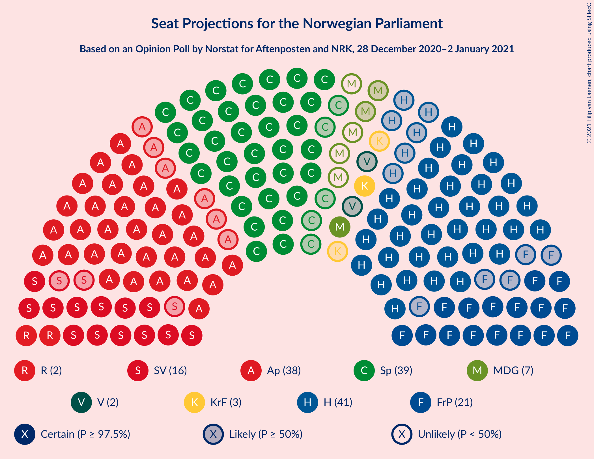

### Confidence Intervals

| Party | Last Result | Median | 80% Confidence Interval | 90% Confidence Interval | 95% Confidence Interval | 99% Confidence Interval |
|:-----:|:-----------:|:------:|:-----------------------:|:-----------------------:|:-----------------------:|:-----------------------:|
| <a href="#høyre">Høyre</a> | 45 | 41 | 38–44 |37–44 |36–46 |34–47 |
| <a href="#senterpartiet">Senterpartiet</a> | 19 | 39 | 36–43 |36–44 |35–44 |32–46 |
| <a href="#arbeiderpartiet">Arbeiderpartiet</a> | 49 | 37 | 33–39 |33–41 |32–42 |30–44 |
| <a href="#fremskrittspartiet">Fremskrittspartiet</a> | 27 | 20 | 16–24 |16–24 |16–25 |16–26 |
| <a href="#sosialistisk-venstreparti">Sosialistisk Venstreparti</a> | 11 | 16 | 14–18 |14–19 |13–19 |12–22 |
| <a href="#miljøpartiet-de-grønne">Miljøpartiet De Grønne</a> | 1 | 7 | 2–9 |2–9 |1–10 |1–10 |
| <a href="#rødt">Rødt</a> | 1 | 2 | 2–8 |2–8 |2–9 |1–10 |
| <a href="#kristelig-folkeparti">Kristelig Folkeparti</a> | 8 | 3 | 1–8 |1–8 |1–9 |1–11 |
| <a href="#venstre">Venstre</a> | 8 | 2 | 1–2 |1–2 |1–2 |0–3 |

### Høyre

*For a full overview of the results for this party, see the [Høyre](party-høyre.html) page.*

| Number of Seats | Probability | Accumulated | Special Marks |
|:---------------:|:-----------:|:-----------:|:-------------:|
| 33 | 0.2% | 100% |  |
| 34 | 0.9% | 99.7% |  |
| 35 | 0.9% | 98.9% |  |
| 36 | 2% | 98% |  |
| 37 | 3% | 96% |  |
| 38 | 5% | 93% |  |
| 39 | 28% | 88% |  |
| 40 | 6% | 60% |  |
| 41 | 30% | 54% | Median |
| 42 | 4% | 24% |  |
| 43 | 4% | 21% |  |
| 44 | 12% | 17% |  |
| 45 | 2% | 5% | Last Result |
| 46 | 1.3% | 3% |  |
| 47 | 0.8% | 1.2% |  |
| 48 | 0.2% | 0.4% |  |
| 49 | 0.1% | 0.2% |  |
| 50 | 0% | 0.1% |  |
| 51 | 0% | 0% |  |

### Senterpartiet

*For a full overview of the results for this party, see the [Senterpartiet](party-senterpartiet.html) page.*

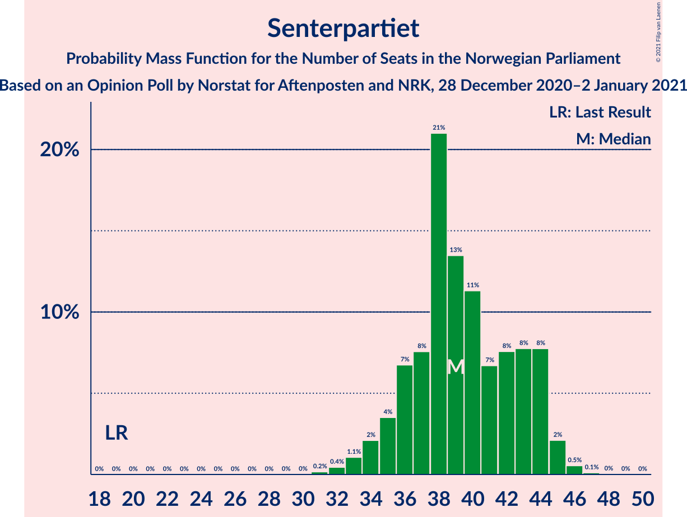

| Number of Seats | Probability | Accumulated | Special Marks |
|:---------------:|:-----------:|:-----------:|:-------------:|
| 19 | 0% | 100% | Last Result |
| 20 | 0% | 100% |  |
| 21 | 0% | 100% |  |
| 22 | 0% | 100% |  |
| 23 | 0% | 100% |  |
| 24 | 0% | 100% |  |
| 25 | 0% | 100% |  |
| 26 | 0% | 100% |  |
| 27 | 0% | 100% |  |
| 28 | 0% | 100% |  |
| 29 | 0% | 100% |  |
| 30 | 0% | 100% |  |
| 31 | 0.1% | 100% |  |
| 32 | 1.5% | 99.9% |  |
| 33 | 0.4% | 98% |  |
| 34 | 0.4% | 98% |  |
| 35 | 2% | 98% |  |
| 36 | 15% | 95% |  |
| 37 | 2% | 80% |  |
| 38 | 28% | 78% |  |
| 39 | 5% | 50% | Median |
| 40 | 5% | 46% |  |
| 41 | 12% | 40% |  |
| 42 | 3% | 29% |  |
| 43 | 21% | 26% |  |
| 44 | 3% | 5% |  |
| 45 | 1.0% | 2% |  |
| 46 | 0.5% | 0.7% |  |
| 47 | 0.1% | 0.2% |  |
| 48 | 0% | 0.1% |  |
| 49 | 0% | 0% |  |

### Arbeiderpartiet

*For a full overview of the results for this party, see the [Arbeiderpartiet](party-arbeiderpartiet.html) page.*

| Number of Seats | Probability | Accumulated | Special Marks |
|:---------------:|:-----------:|:-----------:|:-------------:|
| 29 | 0.2% | 100% |  |
| 30 | 0.5% | 99.7% |  |
| 31 | 1.2% | 99.3% |  |
| 32 | 2% | 98% |  |
| 33 | 12% | 96% |  |
| 34 | 12% | 84% |  |
| 35 | 3% | 72% |  |
| 36 | 5% | 69% |  |
| 37 | 13% | 63% | Median |
| 38 | 26% | 50% |  |
| 39 | 16% | 24% |  |
| 40 | 3% | 8% |  |
| 41 | 2% | 5% |  |
| 42 | 2% | 3% |  |
| 43 | 0.3% | 1.0% |  |
| 44 | 0.5% | 0.7% |  |
| 45 | 0.1% | 0.2% |  |
| 46 | 0% | 0% |  |
| 47 | 0% | 0% |  |
| 48 | 0% | 0% |  |
| 49 | 0% | 0% | Last Result |

### Fremskrittspartiet

*For a full overview of the results for this party, see the [Fremskrittspartiet](party-fremskrittspartiet.html) page.*

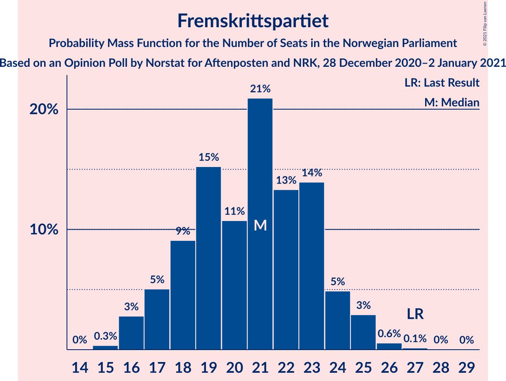

| Number of Seats | Probability | Accumulated | Special Marks |
|:---------------:|:-----------:|:-----------:|:-------------:|
| 15 | 0.2% | 100% |  |
| 16 | 11% | 99.8% |  |
| 17 | 3% | 89% |  |
| 18 | 18% | 87% |  |
| 19 | 18% | 69% |  |
| 20 | 6% | 51% | Median |
| 21 | 7% | 45% |  |
| 22 | 25% | 38% |  |
| 23 | 2% | 13% |  |
| 24 | 8% | 11% |  |
| 25 | 2% | 3% |  |
| 26 | 0.7% | 0.8% |  |
| 27 | 0.1% | 0.1% | Last Result |
| 28 | 0% | 0.1% |  |
| 29 | 0% | 0% |  |

### Sosialistisk Venstreparti

*For a full overview of the results for this party, see the [Sosialistisk Venstreparti](party-sosialistiskvenstreparti.html) page.*

| Number of Seats | Probability | Accumulated | Special Marks |
|:---------------:|:-----------:|:-----------:|:-------------:|
| 11 | 0.1% | 100% | Last Result |
| 12 | 0.4% | 99.9% |  |
| 13 | 3% | 99.5% |  |
| 14 | 11% | 97% |  |
| 15 | 23% | 86% |  |
| 16 | 39% | 62% | Median |
| 17 | 9% | 23% |  |
| 18 | 5% | 15% |  |
| 19 | 7% | 9% |  |
| 20 | 1.2% | 2% |  |
| 21 | 0.2% | 1.1% |  |
| 22 | 0.8% | 0.9% |  |
| 23 | 0% | 0% |  |

### Miljøpartiet De Grønne

*For a full overview of the results for this party, see the [Miljøpartiet De Grønne](party-miljøpartietdegrønne.html) page.*

| Number of Seats | Probability | Accumulated | Special Marks |
|:---------------:|:-----------:|:-----------:|:-------------:|
| 1 | 3% | 100% | Last Result |
| 2 | 25% | 97% |  |
| 3 | 2% | 72% |  |
| 4 | 0.8% | 71% |  |
| 5 | 0% | 70% |  |
| 6 | 0% | 70% |  |
| 7 | 27% | 70% | Median |
| 8 | 24% | 43% |  |
| 9 | 16% | 19% |  |
| 10 | 3% | 3% |  |
| 11 | 0.1% | 0.1% |  |
| 12 | 0% | 0% |  |

### Rødt

*For a full overview of the results for this party, see the [Rødt](party-rødt.html) page.*

| Number of Seats | Probability | Accumulated | Special Marks |
|:---------------:|:-----------:|:-----------:|:-------------:|
| 1 | 2% | 100% | Last Result |
| 2 | 61% | 98% | Median |
| 3 | 0% | 38% |  |
| 4 | 0% | 38% |  |
| 5 | 0% | 38% |  |
| 6 | 0% | 38% |  |
| 7 | 13% | 38% |  |
| 8 | 21% | 24% |  |
| 9 | 3% | 3% |  |
| 10 | 0.5% | 0.6% |  |
| 11 | 0.1% | 0.1% |  |
| 12 | 0% | 0% |  |

### Kristelig Folkeparti

*For a full overview of the results for this party, see the [Kristelig Folkeparti](party-kristeligfolkeparti.html) page.*

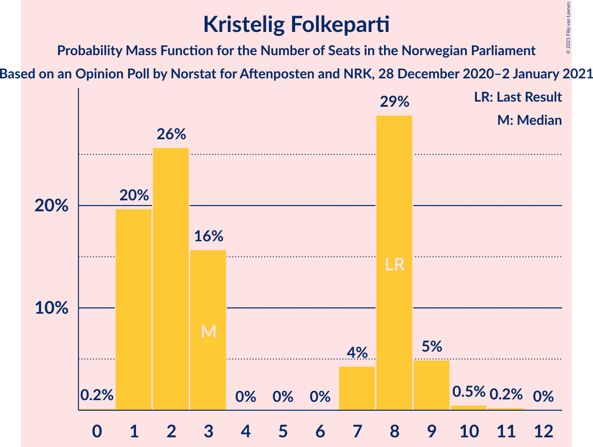

| Number of Seats | Probability | Accumulated | Special Marks |
|:---------------:|:-----------:|:-----------:|:-------------:|
| 0 | 0.2% | 100% |  |
| 1 | 21% | 99.8% |  |
| 2 | 14% | 78% |  |
| 3 | 29% | 64% | Median |
| 4 | 0% | 36% |  |
| 5 | 0% | 36% |  |
| 6 | 0% | 36% |  |
| 7 | 2% | 36% |  |
| 8 | 29% | 34% | Last Result |
| 9 | 3% | 4% |  |
| 10 | 0.3% | 1.2% |  |
| 11 | 0.9% | 0.9% |  |
| 12 | 0% | 0% |  |

### Venstre

*For a full overview of the results for this party, see the [Venstre](party-venstre.html) page.*

| Number of Seats | Probability | Accumulated | Special Marks |
|:---------------:|:-----------:|:-----------:|:-------------:|
| 0 | 1.1% | 100% |  |
| 1 | 37% | 98.9% |  |
| 2 | 60% | 62% | Median |
| 3 | 1.5% | 2% |  |
| 4 | 0% | 0.5% |  |
| 5 | 0% | 0.5% |  |
| 6 | 0% | 0.5% |  |
| 7 | 0.1% | 0.5% |  |
| 8 | 0.3% | 0.3% | Last Result |
| 9 | 0% | 0% |  |

## Coalitions

### Confidence Intervals

| Coalition | Last Result | Median | Majority? | 80% Confidence Interval | 90% Confidence Interval | 95% Confidence Interval | 99% Confidence Interval |
|:---------:|:-----------:|:------:|:---------:|:-----------------------:|:-----------------------:|:-----------------------:|:-----------------------:|
| Høyre – Senterpartiet – Fremskrittspartiet – Kristelig Folkeparti – Venstre | 107 | 106 | 100% | 101–111 | 100–111 | 100–113 | 96–118 |
| Senterpartiet – Arbeiderpartiet – Sosialistisk Venstreparti – Miljøpartiet De Grønne – Kristelig Folkeparti | 88 | 102 | 100% | 97–108 | 97–108 | 96–108 | 92–110 |
| Senterpartiet – Arbeiderpartiet – Sosialistisk Venstreparti – Miljøpartiet De Grønne – Rødt | 81 | 103 | 100% | 97–106 | 97–107 | 95–108 | 92–111 |
| Senterpartiet – Arbeiderpartiet – Sosialistisk Venstreparti – Miljøpartiet De Grønne | 80 | 99 | 100% | 89–104 | 89–104 | 89–105 | 89–106 |
| Senterpartiet – Arbeiderpartiet – Sosialistisk Venstreparti – Rødt | 80 | 95 | 99.9% | 93–100 | 91–103 | 89–104 | 87–105 |
| Senterpartiet – Arbeiderpartiet – Sosialistisk Venstreparti | 79 | 93 | 98.8% | 87–97 | 87–97 | 85–98 | 84–100 |
| Senterpartiet – Arbeiderpartiet – Miljøpartiet De Grønne – Kristelig Folkeparti | 77 | 87 | 77% | 81–92 | 79–92 | 78–92 | 74–94 |
| Senterpartiet – Arbeiderpartiet – Kristelig Folkeparti | 76 | 80 | 15% | 77–85 | 76–85 | 74–87 | 70–90 |
| Senterpartiet – Arbeiderpartiet | 68 | 77 | 0.1% | 71–81 | 71–81 | 70–81 | 68–84 |
| Høyre – Fremskrittspartiet – Miljøpartiet De Grønne – Kristelig Folkeparti – Venstre | 89 | 74 | 0.1% | 69–76 | 66–78 | 65–80 | 64–82 |
| Høyre – Fremskrittspartiet – Kristelig Folkeparti – Venstre | 88 | 66 | 0% | 63–72 | 62–72 | 61–74 | 58–77 |
| Høyre – Fremskrittspartiet – Venstre | 80 | 62 | 0% | 59–66 | 58–68 | 57–69 | 54–72 |
| Høyre – Fremskrittspartiet | 72 | 61 | 0% | 57–65 | 57–66 | 55–67 | 53–70 |
| Arbeiderpartiet – Sosialistisk Venstreparti | 60 | 53 | 0% | 49–56 | 48–58 | 47–58 | 45–60 |
| Høyre – Kristelig Folkeparti – Venstre | 61 | 44 | 0% | 43–54 | 42–54 | 41–54 | 39–55 |
| Senterpartiet – Kristelig Folkeparti – Venstre | 35 | 46 | 0% | 40–49 | 40–52 | 40–52 | 37–56 |

### Høyre – Senterpartiet – Fremskrittspartiet – Kristelig Folkeparti – Venstre

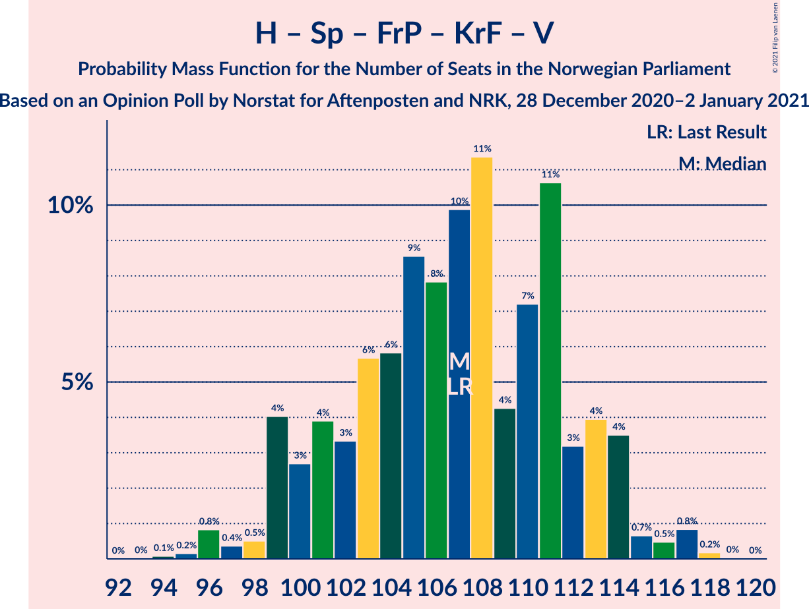

| Number of Seats | Probability | Accumulated | Special Marks |
|:---------------:|:-----------:|:-----------:|:-------------:|
| 94 | 0.2% | 100% |  |
| 95 | 0% | 99.8% |  |
| 96 | 0.8% | 99.8% |  |
| 97 | 0.2% | 99.0% |  |
| 98 | 0.2% | 98.7% |  |
| 99 | 0.2% | 98.6% |  |
| 100 | 5% | 98% |  |
| 101 | 12% | 94% |  |
| 102 | 2% | 81% |  |
| 103 | 3% | 79% |  |
| 104 | 3% | 76% |  |
| 105 | 16% | 73% | Median |
| 106 | 22% | 58% |  |
| 107 | 4% | 35% | Last Result |
| 108 | 1.3% | 31% |  |
| 109 | 4% | 30% |  |
| 110 | 14% | 26% |  |
| 111 | 8% | 12% |  |
| 112 | 0.9% | 4% |  |
| 113 | 0.7% | 3% |  |
| 114 | 0.6% | 2% |  |
| 115 | 0.6% | 2% |  |
| 116 | 0.4% | 1.1% |  |
| 117 | 0.1% | 0.7% |  |
| 118 | 0.5% | 0.6% |  |
| 119 | 0.1% | 0.1% |  |
| 120 | 0% | 0% |  |

### Senterpartiet – Arbeiderpartiet – Sosialistisk Venstreparti – Miljøpartiet De Grønne – Kristelig Folkeparti

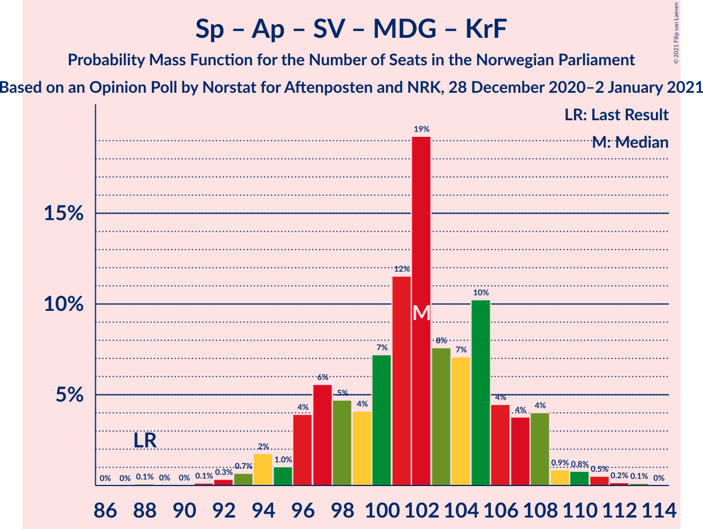

| Number of Seats | Probability | Accumulated | Special Marks |
|:---------------:|:-----------:|:-----------:|:-------------:|
| 88 | 0.2% | 100% | Last Result |
| 89 | 0% | 99.8% |  |
| 90 | 0.1% | 99.8% |  |
| 91 | 0% | 99.7% |  |
| 92 | 1.0% | 99.7% |  |
| 93 | 0.1% | 98.7% |  |
| 94 | 0.6% | 98.6% |  |
| 95 | 0.4% | 98% |  |
| 96 | 1.4% | 98% |  |
| 97 | 12% | 96% |  |
| 98 | 2% | 84% |  |
| 99 | 3% | 82% |  |
| 100 | 14% | 79% |  |
| 101 | 8% | 65% |  |
| 102 | 8% | 57% | Median |
| 103 | 3% | 49% |  |
| 104 | 3% | 46% |  |
| 105 | 23% | 43% |  |
| 106 | 2% | 20% |  |
| 107 | 1.1% | 18% |  |
| 108 | 15% | 17% |  |
| 109 | 1.5% | 2% |  |
| 110 | 0.6% | 0.8% |  |
| 111 | 0.1% | 0.2% |  |
| 112 | 0% | 0.1% |  |
| 113 | 0.1% | 0.1% |  |
| 114 | 0% | 0% |  |

### Senterpartiet – Arbeiderpartiet – Sosialistisk Venstreparti – Miljøpartiet De Grønne – Rødt

| Number of Seats | Probability | Accumulated | Special Marks |
|:---------------:|:-----------:|:-----------:|:-------------:|
| 81 | 0% | 100% | Last Result |
| 82 | 0% | 100% |  |
| 83 | 0% | 100% |  |
| 84 | 0% | 100% |  |
| 85 | 0% | 100% | Majority |
| 86 | 0% | 100% |  |
| 87 | 0% | 100% |  |
| 88 | 0% | 100% |  |
| 89 | 0% | 100% |  |
| 90 | 0% | 100% |  |
| 91 | 0.3% | 99.9% |  |
| 92 | 0.2% | 99.7% |  |
| 93 | 0.6% | 99.4% |  |
| 94 | 0.4% | 98.9% |  |
| 95 | 1.3% | 98% |  |
| 96 | 0.5% | 97% |  |
| 97 | 13% | 97% |  |
| 98 | 1.4% | 84% |  |
| 99 | 3% | 82% |  |
| 100 | 2% | 79% |  |
| 101 | 9% | 77% | Median |
| 102 | 15% | 68% |  |
| 103 | 6% | 53% |  |
| 104 | 22% | 47% |  |
| 105 | 2% | 25% |  |
| 106 | 14% | 22% |  |
| 107 | 5% | 8% |  |
| 108 | 0.9% | 3% |  |
| 109 | 0.4% | 2% |  |
| 110 | 0.3% | 1.4% |  |
| 111 | 0.8% | 1.1% |  |
| 112 | 0.2% | 0.2% |  |
| 113 | 0% | 0% |  |

### Senterpartiet – Arbeiderpartiet – Sosialistisk Venstreparti – Miljøpartiet De Grønne

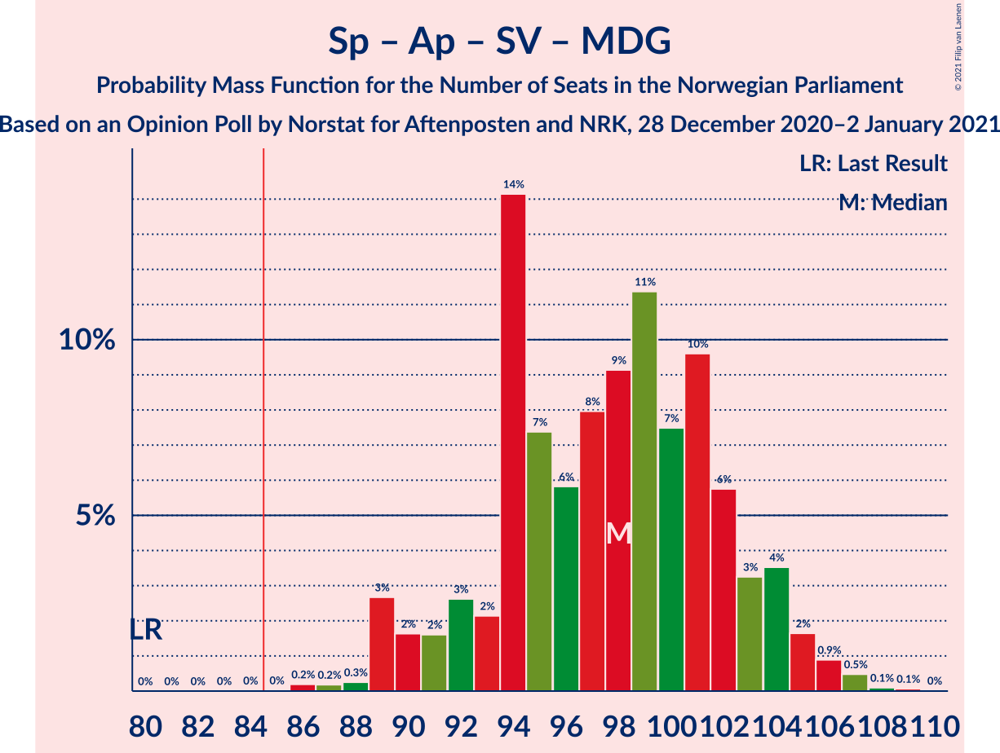

| Number of Seats | Probability | Accumulated | Special Marks |
|:---------------:|:-----------:|:-----------:|:-------------:|
| 80 | 0% | 100% | Last Result |
| 81 | 0% | 100% |  |
| 82 | 0% | 100% |  |
| 83 | 0% | 100% |  |
| 84 | 0% | 100% |  |
| 85 | 0.1% | 100% | Majority |
| 86 | 0% | 99.9% |  |
| 87 | 0.3% | 99.9% |  |
| 88 | 0.1% | 99.6% |  |
| 89 | 10% | 99.5% |  |
| 90 | 0.7% | 90% |  |
| 91 | 2% | 89% |  |
| 92 | 1.2% | 88% |  |
| 93 | 2% | 86% |  |
| 94 | 3% | 85% |  |
| 95 | 6% | 82% |  |
| 96 | 3% | 76% |  |
| 97 | 15% | 73% |  |
| 98 | 2% | 58% |  |
| 99 | 10% | 55% | Median |
| 100 | 13% | 45% |  |
| 101 | 4% | 33% |  |
| 102 | 11% | 29% |  |
| 103 | 1.2% | 18% |  |
| 104 | 13% | 17% |  |
| 105 | 4% | 5% |  |
| 106 | 0.2% | 0.6% |  |
| 107 | 0.2% | 0.4% |  |
| 108 | 0.2% | 0.2% |  |
| 109 | 0% | 0% |  |

### Senterpartiet – Arbeiderpartiet – Sosialistisk Venstreparti – Rødt

| Number of Seats | Probability | Accumulated | Special Marks |
|:---------------:|:-----------:|:-----------:|:-------------:|
| 80 | 0% | 100% | Last Result |
| 81 | 0% | 100% |  |
| 82 | 0% | 100% |  |
| 83 | 0% | 100% |  |
| 84 | 0.1% | 100% |  |
| 85 | 0.2% | 99.9% | Majority |
| 86 | 0% | 99.7% |  |
| 87 | 0.7% | 99.6% |  |
| 88 | 0.8% | 99.0% |  |
| 89 | 2% | 98% |  |
| 90 | 0.4% | 96% |  |
| 91 | 1.2% | 96% |  |
| 92 | 2% | 95% |  |
| 93 | 7% | 92% |  |
| 94 | 3% | 85% | Median |
| 95 | 32% | 82% |  |
| 96 | 14% | 50% |  |
| 97 | 3% | 36% |  |
| 98 | 5% | 33% |  |
| 99 | 14% | 28% |  |
| 100 | 4% | 14% |  |
| 101 | 4% | 10% |  |
| 102 | 1.4% | 6% |  |
| 103 | 2% | 5% |  |
| 104 | 2% | 3% |  |
| 105 | 0.9% | 1.1% |  |
| 106 | 0% | 0.2% |  |
| 107 | 0.1% | 0.2% |  |
| 108 | 0% | 0% |  |

### Senterpartiet – Arbeiderpartiet – Sosialistisk Venstreparti

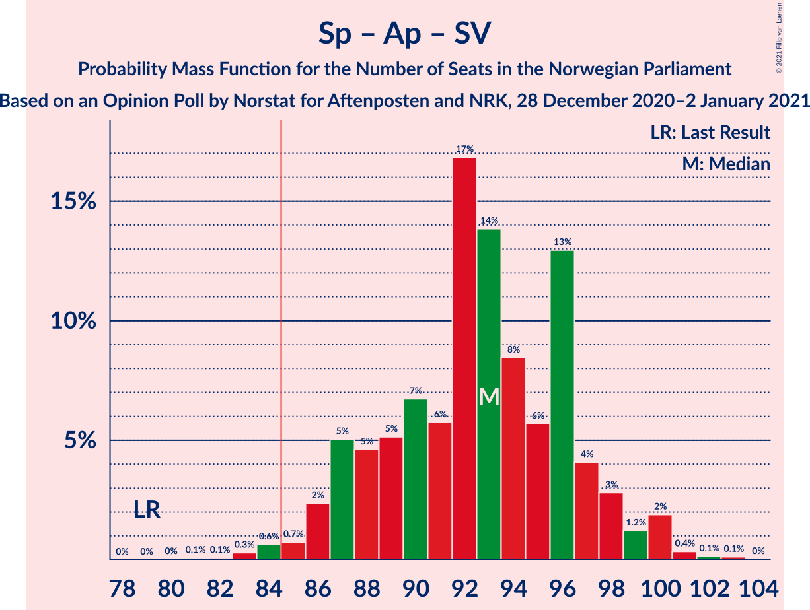

| Number of Seats | Probability | Accumulated | Special Marks |
|:---------------:|:-----------:|:-----------:|:-------------:|
| 79 | 0% | 100% | Last Result |
| 80 | 0% | 100% |  |
| 81 | 0% | 100% |  |
| 82 | 0.2% | 100% |  |
| 83 | 0.2% | 99.8% |  |
| 84 | 0.8% | 99.6% |  |
| 85 | 2% | 98.8% | Majority |
| 86 | 0.5% | 97% |  |
| 87 | 12% | 97% |  |
| 88 | 0.9% | 85% |  |
| 89 | 12% | 84% |  |
| 90 | 4% | 72% |  |
| 91 | 8% | 68% |  |
| 92 | 5% | 60% | Median |
| 93 | 25% | 54% |  |
| 94 | 3% | 30% |  |
| 95 | 4% | 26% |  |
| 96 | 6% | 22% |  |
| 97 | 12% | 16% |  |
| 98 | 1.0% | 3% |  |
| 99 | 1.4% | 2% |  |
| 100 | 0.7% | 0.8% |  |
| 101 | 0.1% | 0.2% |  |
| 102 | 0.1% | 0.1% |  |
| 103 | 0.1% | 0.1% |  |
| 104 | 0% | 0% |  |

### Senterpartiet – Arbeiderpartiet – Miljøpartiet De Grønne – Kristelig Folkeparti

| Number of Seats | Probability | Accumulated | Special Marks |
|:---------------:|:-----------:|:-----------:|:-------------:|
| 72 | 0.2% | 100% |  |
| 73 | 0% | 99.7% |  |
| 74 | 0.8% | 99.7% |  |
| 75 | 0.3% | 99.0% |  |
| 76 | 0.1% | 98.7% |  |
| 77 | 0.4% | 98.6% | Last Result |
| 78 | 0.9% | 98% |  |
| 79 | 3% | 97% |  |
| 80 | 0.9% | 95% |  |
| 81 | 12% | 94% |  |
| 82 | 2% | 82% |  |
| 83 | 2% | 80% |  |
| 84 | 1.1% | 78% |  |
| 85 | 15% | 77% | Majority |
| 86 | 6% | 62% | Median |
| 87 | 10% | 55% |  |
| 88 | 3% | 45% |  |
| 89 | 17% | 42% |  |
| 90 | 10% | 25% |  |
| 91 | 2% | 15% |  |
| 92 | 11% | 13% |  |
| 93 | 0.7% | 1.4% |  |
| 94 | 0.3% | 0.7% |  |
| 95 | 0.2% | 0.5% |  |
| 96 | 0.1% | 0.2% |  |
| 97 | 0.1% | 0.1% |  |
| 98 | 0.1% | 0.1% |  |
| 99 | 0% | 0% |  |

### Senterpartiet – Arbeiderpartiet – Kristelig Folkeparti

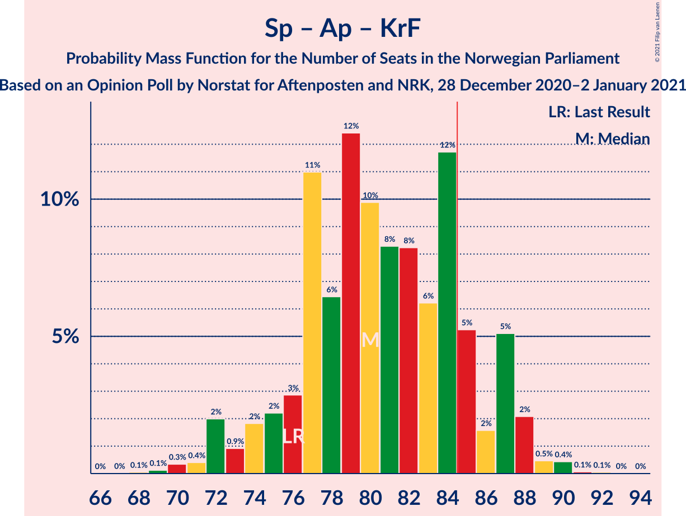

| Number of Seats | Probability | Accumulated | Special Marks |
|:---------------:|:-----------:|:-----------:|:-------------:|
| 69 | 0.1% | 100% |  |
| 70 | 0.6% | 99.9% |  |
| 71 | 0.5% | 99.3% |  |
| 72 | 0.2% | 98.9% |  |
| 73 | 1.1% | 98.7% |  |
| 74 | 1.2% | 98% |  |
| 75 | 0.9% | 96% |  |
| 76 | 2% | 96% | Last Result |
| 77 | 16% | 94% |  |
| 78 | 2% | 78% |  |
| 79 | 21% | 77% | Median |
| 80 | 8% | 55% |  |
| 81 | 11% | 48% |  |
| 82 | 15% | 37% |  |
| 83 | 4% | 22% |  |
| 84 | 4% | 19% |  |
| 85 | 11% | 15% | Majority |
| 86 | 0.6% | 4% |  |
| 87 | 2% | 4% |  |
| 88 | 0.5% | 2% |  |
| 89 | 0% | 1.1% |  |
| 90 | 0.9% | 1.0% |  |
| 91 | 0% | 0.1% |  |
| 92 | 0% | 0.1% |  |
| 93 | 0.1% | 0.1% |  |
| 94 | 0% | 0% |  |

### Senterpartiet – Arbeiderpartiet

| Number of Seats | Probability | Accumulated | Special Marks |
|:---------------:|:-----------:|:-----------:|:-------------:|
| 67 | 0.3% | 100% |  |
| 68 | 0.7% | 99.7% | Last Result |
| 69 | 0.3% | 98.9% |  |
| 70 | 1.4% | 98.6% |  |
| 71 | 12% | 97% |  |
| 72 | 1.4% | 85% |  |
| 73 | 3% | 84% |  |
| 74 | 13% | 81% |  |
| 75 | 5% | 68% |  |
| 76 | 8% | 63% | Median |
| 77 | 23% | 55% |  |
| 78 | 11% | 32% |  |
| 79 | 3% | 21% |  |
| 80 | 2% | 18% |  |
| 81 | 13% | 15% |  |
| 82 | 0.9% | 2% |  |
| 83 | 0.2% | 0.8% |  |
| 84 | 0.5% | 0.6% |  |
| 85 | 0.1% | 0.1% | Majority |
| 86 | 0% | 0.1% |  |
| 87 | 0% | 0.1% |  |
| 88 | 0% | 0% |  |

### Høyre – Fremskrittspartiet – Miljøpartiet De Grønne – Kristelig Folkeparti – Venstre

| Number of Seats | Probability | Accumulated | Special Marks |
|:---------------:|:-----------:|:-----------:|:-------------:|
| 62 | 0.1% | 100% |  |
| 63 | 0% | 99.8% |  |
| 64 | 0.9% | 99.8% |  |
| 65 | 2% | 98.9% |  |
| 66 | 2% | 97% |  |
| 67 | 1.4% | 95% |  |
| 68 | 4% | 94% |  |
| 69 | 4% | 90% |  |
| 70 | 14% | 86% |  |
| 71 | 5% | 72% |  |
| 72 | 3% | 67% |  |
| 73 | 14% | 64% | Median |
| 74 | 32% | 50% |  |
| 75 | 3% | 18% |  |
| 76 | 7% | 15% |  |
| 77 | 2% | 8% |  |
| 78 | 1.2% | 5% |  |
| 79 | 0.4% | 4% |  |
| 80 | 2% | 4% |  |
| 81 | 0.8% | 2% |  |
| 82 | 0.7% | 1.0% |  |
| 83 | 0% | 0.4% |  |
| 84 | 0.2% | 0.3% |  |
| 85 | 0.1% | 0.1% | Majority |
| 86 | 0% | 0% |  |
| 87 | 0% | 0% |  |
| 88 | 0% | 0% |  |
| 89 | 0% | 0% | Last Result |

### Høyre – Fremskrittspartiet – Kristelig Folkeparti – Venstre

| Number of Seats | Probability | Accumulated | Special Marks |
|:---------------:|:-----------:|:-----------:|:-------------:|
| 57 | 0.2% | 100% |  |
| 58 | 0.8% | 99.8% |  |
| 59 | 0.3% | 98.9% |  |
| 60 | 0.4% | 98.6% |  |
| 61 | 0.9% | 98% |  |
| 62 | 5% | 97% |  |
| 63 | 14% | 92% |  |
| 64 | 2% | 78% |  |
| 65 | 22% | 75% |  |
| 66 | 6% | 53% | Median |
| 67 | 15% | 47% |  |
| 68 | 9% | 32% |  |
| 69 | 2% | 23% |  |
| 70 | 3% | 21% |  |
| 71 | 1.4% | 18% |  |
| 72 | 13% | 16% |  |
| 73 | 0.5% | 3% |  |
| 74 | 1.3% | 3% |  |
| 75 | 0.4% | 2% |  |
| 76 | 0.6% | 1.1% |  |
| 77 | 0.2% | 0.6% |  |
| 78 | 0.3% | 0.3% |  |
| 79 | 0% | 0.1% |  |
| 80 | 0% | 0% |  |
| 81 | 0% | 0% |  |
| 82 | 0% | 0% |  |
| 83 | 0% | 0% |  |
| 84 | 0% | 0% |  |
| 85 | 0% | 0% | Majority |
| 86 | 0% | 0% |  |
| 87 | 0% | 0% |  |
| 88 | 0% | 0% | Last Result |

### Høyre – Fremskrittspartiet – Venstre

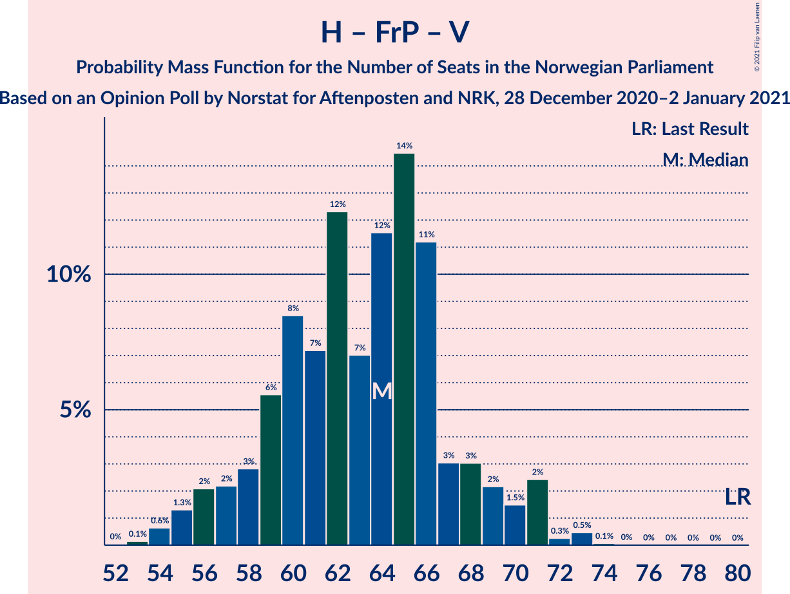

| Number of Seats | Probability | Accumulated | Special Marks |
|:---------------:|:-----------:|:-----------:|:-------------:|
| 52 | 0% | 100% |  |
| 53 | 0.1% | 99.9% |  |
| 54 | 0.3% | 99.8% |  |
| 55 | 0.4% | 99.5% |  |
| 56 | 0.7% | 99.1% |  |
| 57 | 1.5% | 98% |  |
| 58 | 2% | 97% |  |
| 59 | 18% | 95% |  |
| 60 | 1.5% | 76% |  |
| 61 | 4% | 75% |  |
| 62 | 36% | 71% |  |
| 63 | 1.0% | 36% | Median |
| 64 | 16% | 35% |  |
| 65 | 6% | 19% |  |
| 66 | 8% | 13% |  |
| 67 | 0.3% | 6% |  |
| 68 | 2% | 6% |  |
| 69 | 1.5% | 4% |  |
| 70 | 0.5% | 2% |  |
| 71 | 0.9% | 2% |  |
| 72 | 0.1% | 0.6% |  |
| 73 | 0.4% | 0.5% |  |
| 74 | 0% | 0% |  |
| 75 | 0% | 0% |  |
| 76 | 0% | 0% |  |
| 77 | 0% | 0% |  |
| 78 | 0% | 0% |  |
| 79 | 0% | 0% |  |
| 80 | 0% | 0% | Last Result |

### Høyre – Fremskrittspartiet

| Number of Seats | Probability | Accumulated | Special Marks |
|:---------------:|:-----------:|:-----------:|:-------------:|
| 51 | 0.1% | 100% |  |
| 52 | 0.1% | 99.9% |  |
| 53 | 0.4% | 99.7% |  |
| 54 | 1.0% | 99.3% |  |
| 55 | 1.2% | 98% |  |
| 56 | 0.9% | 97% |  |
| 57 | 19% | 96% |  |
| 58 | 3% | 78% |  |
| 59 | 2% | 75% |  |
| 60 | 17% | 73% |  |
| 61 | 21% | 56% | Median |
| 62 | 13% | 34% |  |
| 63 | 7% | 22% |  |
| 64 | 2% | 15% |  |
| 65 | 7% | 12% |  |
| 66 | 2% | 5% |  |
| 67 | 1.3% | 3% |  |
| 68 | 0.7% | 2% |  |
| 69 | 0.8% | 1.4% |  |
| 70 | 0.1% | 0.6% |  |
| 71 | 0.4% | 0.5% |  |
| 72 | 0% | 0% | Last Result |

### Arbeiderpartiet – Sosialistisk Venstreparti

| Number of Seats | Probability | Accumulated | Special Marks |
|:---------------:|:-----------:|:-----------:|:-------------:|
| 43 | 0% | 100% |  |
| 44 | 0.1% | 99.9% |  |
| 45 | 0.4% | 99.8% |  |
| 46 | 0.6% | 99.4% |  |
| 47 | 2% | 98.9% |  |
| 48 | 7% | 97% |  |
| 49 | 13% | 90% |  |
| 50 | 4% | 78% |  |
| 51 | 3% | 73% |  |
| 52 | 12% | 70% |  |
| 53 | 14% | 58% | Median |
| 54 | 18% | 44% |  |
| 55 | 13% | 26% |  |
| 56 | 2% | 12% |  |
| 57 | 1.4% | 10% |  |
| 58 | 6% | 8% |  |
| 59 | 1.1% | 2% |  |
| 60 | 0.7% | 1.2% | Last Result |
| 61 | 0.4% | 0.4% |  |
| 62 | 0% | 0.1% |  |
| 63 | 0% | 0% |  |

### Høyre – Kristelig Folkeparti – Venstre

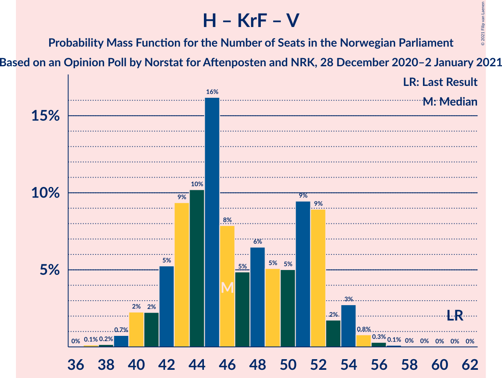

| Number of Seats | Probability | Accumulated | Special Marks |
|:---------------:|:-----------:|:-----------:|:-------------:|
| 37 | 0% | 100% |  |
| 38 | 0.2% | 99.9% |  |
| 39 | 0.5% | 99.7% |  |
| 40 | 0.2% | 99.2% |  |
| 41 | 3% | 99.0% |  |
| 42 | 2% | 96% |  |
| 43 | 23% | 94% |  |
| 44 | 23% | 72% |  |
| 45 | 4% | 48% |  |
| 46 | 4% | 45% | Median |
| 47 | 4% | 41% |  |
| 48 | 6% | 37% |  |
| 49 | 2% | 31% |  |
| 50 | 5% | 29% |  |
| 51 | 12% | 24% |  |
| 52 | 0.2% | 12% |  |
| 53 | 1.3% | 12% |  |
| 54 | 10% | 10% |  |
| 55 | 0.3% | 0.7% |  |
| 56 | 0% | 0.4% |  |
| 57 | 0.3% | 0.3% |  |
| 58 | 0% | 0.1% |  |
| 59 | 0% | 0% |  |
| 60 | 0% | 0% |  |
| 61 | 0% | 0% | Last Result |

### Senterpartiet – Kristelig Folkeparti – Venstre

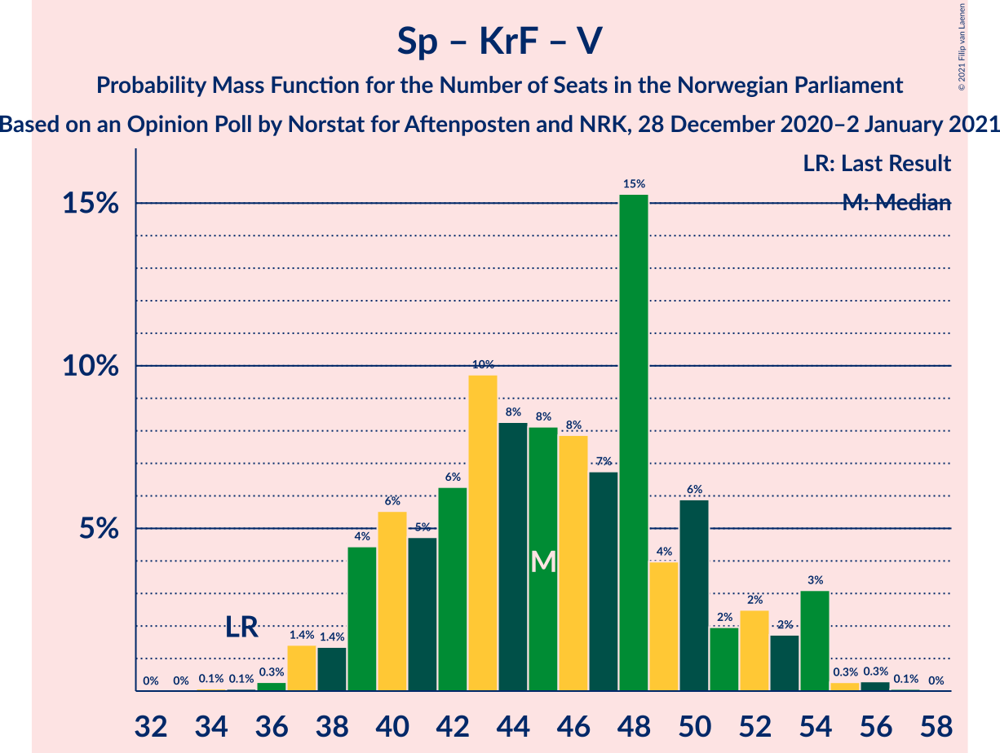

| Number of Seats | Probability | Accumulated | Special Marks |
|:---------------:|:-----------:|:-----------:|:-------------:|
| 35 | 0% | 100% | Last Result |
| 36 | 0.1% | 100% |  |
| 37 | 0.5% | 99.9% |  |
| 38 | 1.0% | 99.4% |  |
| 39 | 0.7% | 98% |  |
| 40 | 12% | 98% |  |
| 41 | 4% | 86% |  |
| 42 | 7% | 81% |  |
| 43 | 5% | 75% |  |
| 44 | 2% | 69% | Median |
| 45 | 12% | 68% |  |
| 46 | 19% | 56% |  |
| 47 | 5% | 37% |  |
| 48 | 21% | 32% |  |
| 49 | 2% | 10% |  |
| 50 | 2% | 9% |  |
| 51 | 1.3% | 7% |  |
| 52 | 3% | 6% |  |
| 53 | 0.9% | 2% |  |
| 54 | 0.3% | 1.4% |  |
| 55 | 0.4% | 1.1% |  |
| 56 | 0.4% | 0.7% |  |
| 57 | 0.3% | 0.3% |  |
| 58 | 0% | 0% |  |

## Technical Information

### Opinion Poll

+ **Polling firm:** Norstat
+ **Commissioner(s):** Aftenposten and NRK
+ **Fieldwork period:** 28 December 2020–2 January 2021

### Calculations

+ **Sample size:** 962
+ **Simulations done:** 131,072
+ **Error estimate:** 2.76%

