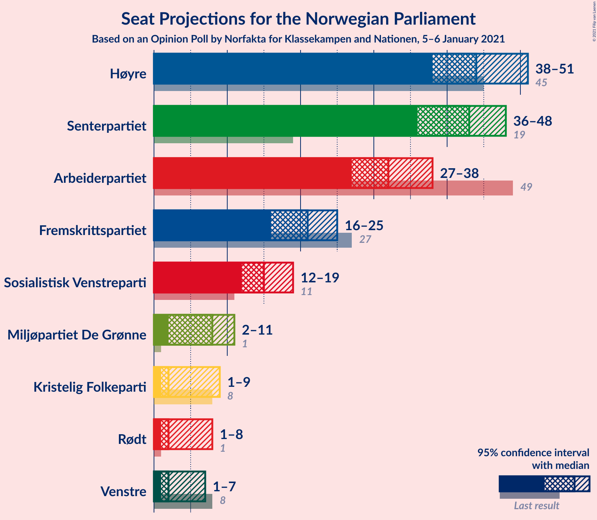
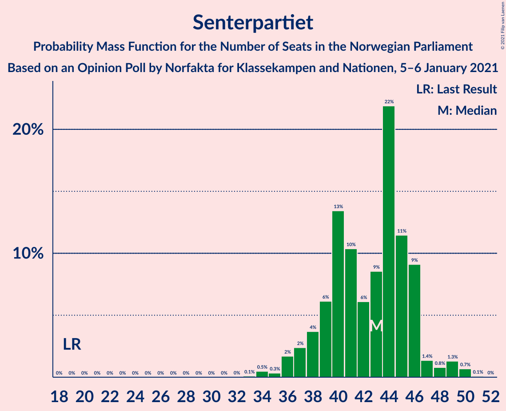
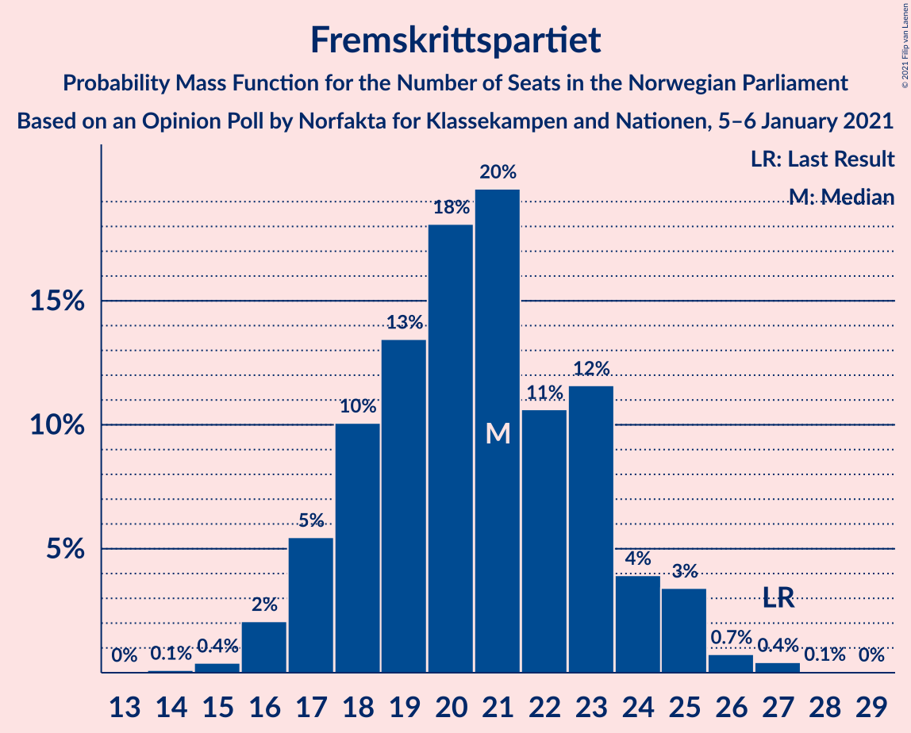
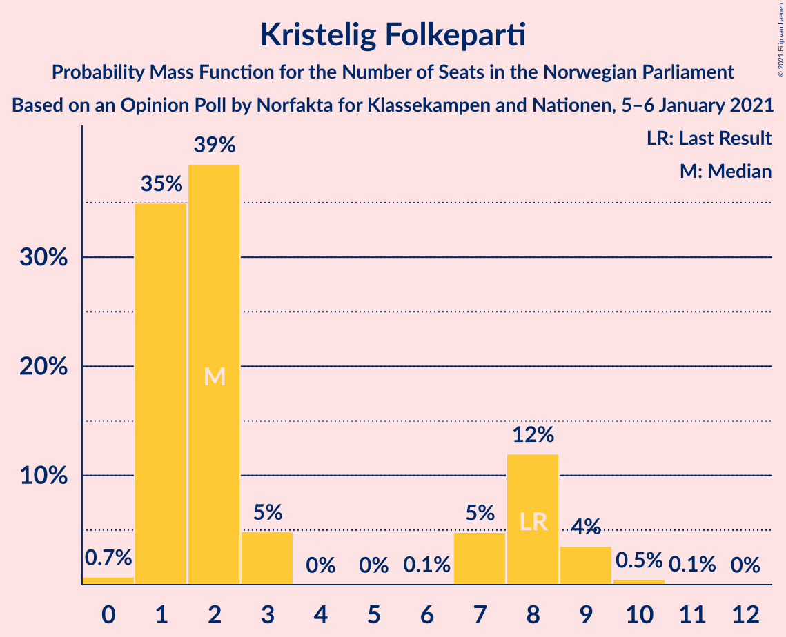
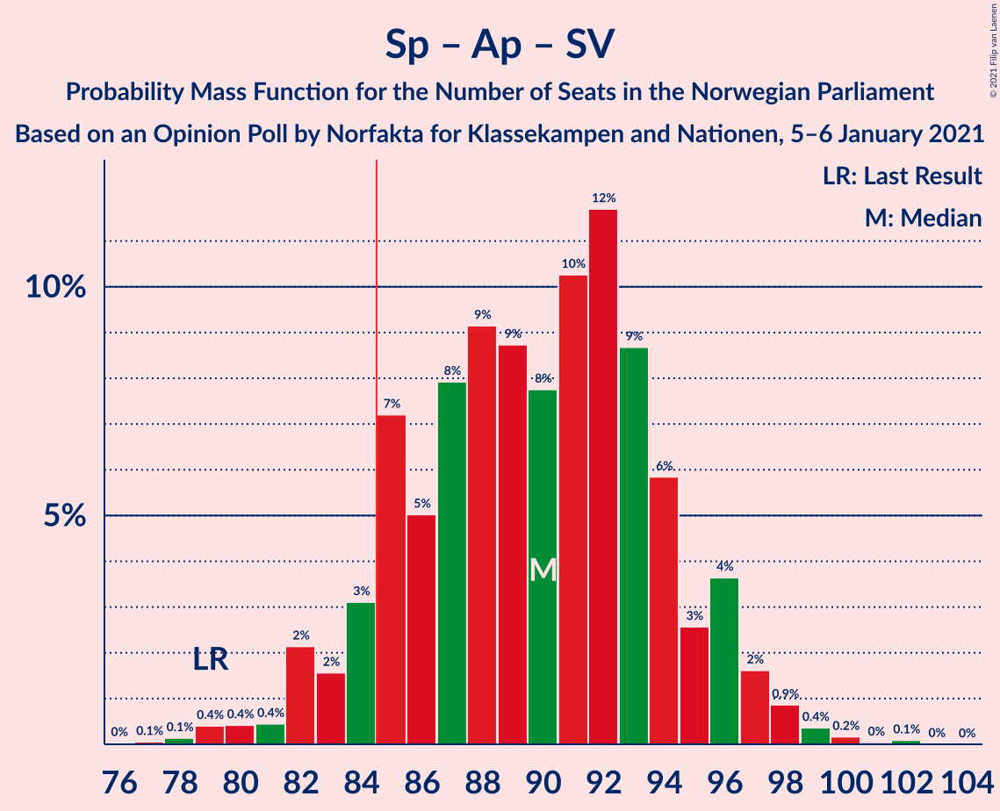
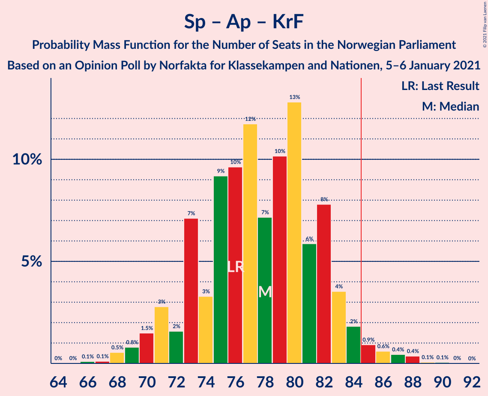
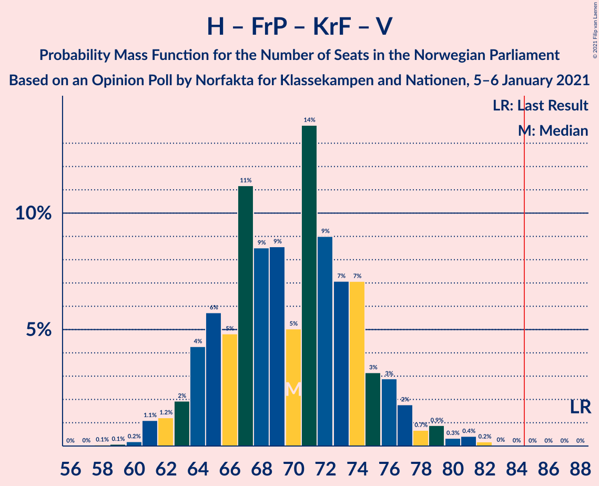
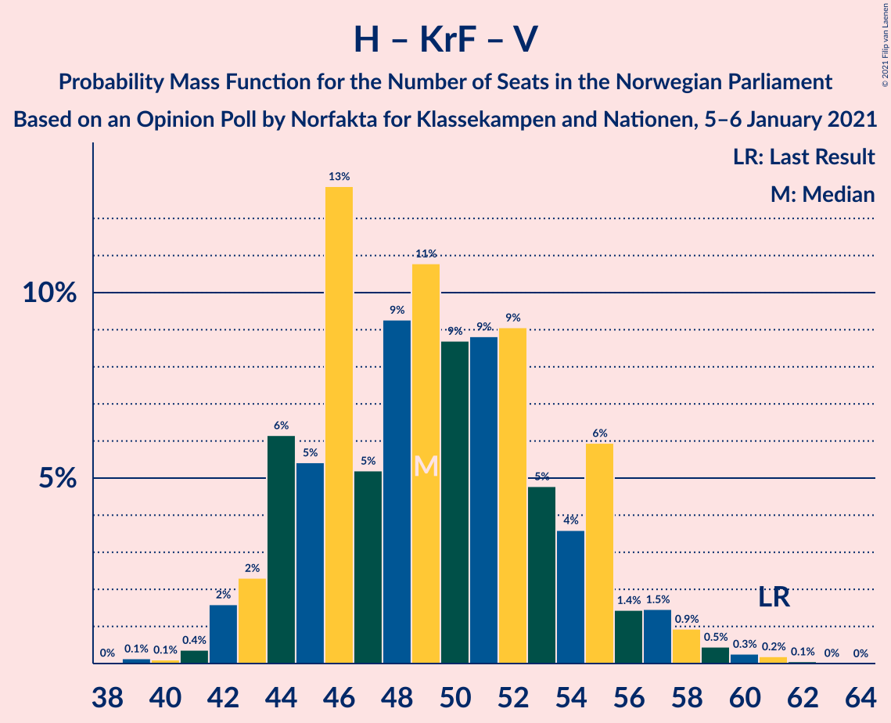

# Opinion Poll by Norfakta for Klassekampen and Nationen, 5–6 January 2021

<a href="#voting-intentions">Voting Intentions</a> | <a href="#seats">Seats</a> | <a href="#coalitions">Coalitions</a> | <a href="#technical-information">Technical Information</a>

## Voting Intentions

### Confidence Intervals

| Party | Last Result | Poll Result | 80% Confidence Interval | 90% Confidence Interval | 95% Confidence Interval | 99% Confidence Interval |
|:-----:|:-----------:|:-----------:|:-----------------------:|:-----------------------:|:-----------------------:|:-----------------------:|
| Høyre | 25.0% | 24.3% | 22.4–26.4% |21.9–27.0% |21.4–27.5% |20.6–28.5% |
| Senterpartiet | 10.3% | 22.7% | 20.8–24.7% |20.3–25.2% |19.9–25.7% |19.0–26.7% |
| Arbeiderpartiet | 27.4% | 17.5% | 15.9–19.4% |15.4–19.9% |15.0–20.4% |14.3–21.3% |
| Fremskrittspartiet | 15.2% | 11.1% | 9.8–12.7% |9.4–13.2% |9.1–13.5% |8.5–14.3% |
| Sosialistisk Venstreparti | 6.0% | 8.2% | 7.1–9.6% |6.7–10.0% |6.5–10.3% |6.0–11.1% |
| Miljøpartiet De Grønne | 3.2% | 4.5% | 3.7–5.6% |3.4–5.9% |3.2–6.2% |2.9–6.8% |
| Kristelig Folkeparti | 4.2% | 3.5% | 2.7–4.5% |2.5–4.7% |2.4–5.0% |2.1–5.5% |
| Rødt | 2.4% | 3.1% | 2.4–4.0% |2.2–4.3% |2.1–4.5% |1.8–5.0% |
| Venstre | 4.4% | 2.7% | 2.1–3.6% |1.9–3.9% |1.8–4.1% |1.5–4.6% |

*Note:* The poll result column reflects the actual value used in the calculations. Published results may vary slightly, and in addition be rounded to fewer digits.

## Seats

### Confidence Intervals

| Party | Last Result | Median | 80% Confidence Interval | 90% Confidence Interval | 95% Confidence Interval | 99% Confidence Interval |
|:-----:|:-----------:|:------:|:-----------------------:|:-----------------------:|:-----------------------:|:-----------------------:|
| <a href="#høyre">Høyre</a> | 45 | 44 | 41–49 |40–50 |40–52 |37–54 |
| <a href="#senterpartiet">Senterpartiet</a> | 19 | 43 | 38–45 |37–46 |36–46 |35–48 |
| <a href="#arbeiderpartiet">Arbeiderpartiet</a> | 49 | 31 | 30–35 |28–35 |28–36 |26–37 |
| <a href="#fremskrittspartiet">Fremskrittspartiet</a> | 27 | 22 | 20–24 |19–25 |18–25 |16–26 |
| <a href="#sosialistisk-venstreparti">Sosialistisk Venstreparti</a> | 11 | 14 | 13–16 |12–17 |11–18 |11–19 |
| <a href="#miljøpartiet-de-grønne">Miljøpartiet De Grønne</a> | 1 | 9 | 8–11 |3–11 |2–11 |2–12 |
| <a href="#kristelig-folkeparti">Kristelig Folkeparti</a> | 8 | 1 | 1–2 |1–8 |1–9 |0–9 |
| <a href="#rødt">Rødt</a> | 1 | 2 | 1–2 |1–7 |1–8 |1–9 |
| <a href="#venstre">Venstre</a> | 8 | 2 | 1–2 |1–2 |1–3 |0–7 |

### Høyre

*For a full overview of the results for this party, see the [Høyre](party-høyre.html) page.*

| Number of Seats | Probability | Accumulated | Special Marks |
|:---------------:|:-----------:|:-----------:|:-------------:|
| 35 | 0.1% | 100% |  |
| 36 | 0.2% | 99.9% |  |
| 37 | 0.4% | 99.7% |  |
| 38 | 0.8% | 99.3% |  |
| 39 | 0.8% | 98% |  |
| 40 | 4% | 98% |  |
| 41 | 5% | 93% |  |
| 42 | 8% | 89% |  |
| 43 | 15% | 81% |  |
| 44 | 24% | 65% | Median |
| 45 | 10% | 41% | Last Result |
| 46 | 1.4% | 31% |  |
| 47 | 17% | 29% |  |
| 48 | 2% | 12% |  |
| 49 | 5% | 10% |  |
| 50 | 2% | 6% |  |
| 51 | 0.7% | 3% |  |
| 52 | 2% | 3% |  |
| 53 | 0.1% | 0.8% |  |
| 54 | 0.6% | 0.7% |  |
| 55 | 0.1% | 0.1% |  |
| 56 | 0% | 0% |  |

### Senterpartiet

*For a full overview of the results for this party, see the [Senterpartiet](party-senterpartiet.html) page.*

| Number of Seats | Probability | Accumulated | Special Marks |
|:---------------:|:-----------:|:-----------:|:-------------:|
| 19 | 0% | 100% | Last Result |
| 20 | 0% | 100% |  |
| 21 | 0% | 100% |  |
| 22 | 0% | 100% |  |
| 23 | 0% | 100% |  |
| 24 | 0% | 100% |  |
| 25 | 0% | 100% |  |
| 26 | 0% | 100% |  |
| 27 | 0% | 100% |  |
| 28 | 0% | 100% |  |
| 29 | 0% | 100% |  |
| 30 | 0% | 100% |  |
| 31 | 0% | 100% |  |
| 32 | 0% | 100% |  |
| 33 | 0.3% | 100% |  |
| 34 | 0.1% | 99.7% |  |
| 35 | 0.3% | 99.6% |  |
| 36 | 2% | 99.3% |  |
| 37 | 4% | 97% |  |
| 38 | 3% | 93% |  |
| 39 | 7% | 90% |  |
| 40 | 10% | 83% |  |
| 41 | 20% | 73% |  |
| 42 | 3% | 53% |  |
| 43 | 24% | 50% | Median |
| 44 | 16% | 26% |  |
| 45 | 5% | 11% |  |
| 46 | 4% | 6% |  |
| 47 | 0.4% | 1.3% |  |
| 48 | 0.6% | 0.9% |  |
| 49 | 0.2% | 0.3% |  |
| 50 | 0.1% | 0.1% |  |
| 51 | 0% | 0.1% |  |
| 52 | 0% | 0% |  |

### Arbeiderpartiet

*For a full overview of the results for this party, see the [Arbeiderpartiet](party-arbeiderpartiet.html) page.*

| Number of Seats | Probability | Accumulated | Special Marks |
|:---------------:|:-----------:|:-----------:|:-------------:|
| 24 | 0.1% | 100% |  |
| 25 | 0.2% | 99.9% |  |
| 26 | 0.8% | 99.7% |  |
| 27 | 1.2% | 99.0% |  |
| 28 | 6% | 98% |  |
| 29 | 2% | 92% |  |
| 30 | 20% | 90% |  |
| 31 | 20% | 70% | Median |
| 32 | 5% | 50% |  |
| 33 | 23% | 45% |  |
| 34 | 2% | 22% |  |
| 35 | 17% | 20% |  |
| 36 | 0.8% | 3% |  |
| 37 | 2% | 2% |  |
| 38 | 0.2% | 0.5% |  |
| 39 | 0.2% | 0.3% |  |
| 40 | 0% | 0.1% |  |
| 41 | 0.1% | 0.1% |  |
| 42 | 0% | 0% |  |
| 43 | 0% | 0% |  |
| 44 | 0% | 0% |  |
| 45 | 0% | 0% |  |
| 46 | 0% | 0% |  |
| 47 | 0% | 0% |  |
| 48 | 0% | 0% |  |
| 49 | 0% | 0% | Last Result |

### Fremskrittspartiet

*For a full overview of the results for this party, see the [Fremskrittspartiet](party-fremskrittspartiet.html) page.*

| Number of Seats | Probability | Accumulated | Special Marks |
|:---------------:|:-----------:|:-----------:|:-------------:|
| 14 | 0.1% | 100% |  |
| 15 | 0.2% | 99.9% |  |
| 16 | 1.4% | 99.7% |  |
| 17 | 0.8% | 98% |  |
| 18 | 2% | 98% |  |
| 19 | 1.3% | 96% |  |
| 20 | 20% | 95% |  |
| 21 | 14% | 75% |  |
| 22 | 14% | 61% | Median |
| 23 | 31% | 47% |  |
| 24 | 11% | 16% |  |
| 25 | 4% | 5% |  |
| 26 | 0.8% | 0.9% |  |
| 27 | 0% | 0.1% | Last Result |
| 28 | 0% | 0% |  |

### Sosialistisk Venstreparti

*For a full overview of the results for this party, see the [Sosialistisk Venstreparti](party-sosialistiskvenstreparti.html) page.*

| Number of Seats | Probability | Accumulated | Special Marks |
|:---------------:|:-----------:|:-----------:|:-------------:|
| 10 | 0.4% | 100% |  |
| 11 | 3% | 99.6% | Last Result |
| 12 | 2% | 96% |  |
| 13 | 32% | 94% |  |
| 14 | 35% | 63% | Median |
| 15 | 3% | 27% |  |
| 16 | 19% | 24% |  |
| 17 | 3% | 6% |  |
| 18 | 0.9% | 3% |  |
| 19 | 2% | 2% |  |
| 20 | 0.2% | 0.3% |  |
| 21 | 0% | 0.1% |  |
| 22 | 0.1% | 0.1% |  |
| 23 | 0% | 0% |  |

### Miljøpartiet De Grønne

*For a full overview of the results for this party, see the [Miljøpartiet De Grønne](party-miljøpartietdegrønne.html) page.*

| Number of Seats | Probability | Accumulated | Special Marks |
|:---------------:|:-----------:|:-----------:|:-------------:|
| 1 | 0.3% | 100% | Last Result |
| 2 | 3% | 99.7% |  |
| 3 | 4% | 97% |  |
| 4 | 1.1% | 93% |  |
| 5 | 0% | 92% |  |
| 6 | 0% | 92% |  |
| 7 | 1.2% | 92% |  |
| 8 | 18% | 91% |  |
| 9 | 31% | 73% | Median |
| 10 | 28% | 41% |  |
| 11 | 11% | 13% |  |
| 12 | 2% | 2% |  |
| 13 | 0.2% | 0.3% |  |
| 14 | 0% | 0% |  |

### Kristelig Folkeparti

*For a full overview of the results for this party, see the [Kristelig Folkeparti](party-kristeligfolkeparti.html) page.*

| Number of Seats | Probability | Accumulated | Special Marks |
|:---------------:|:-----------:|:-----------:|:-------------:|
| 0 | 1.2% | 100% |  |
| 1 | 49% | 98.8% | Median |
| 2 | 40% | 49% |  |
| 3 | 2% | 9% |  |
| 4 | 0% | 7% |  |
| 5 | 0% | 7% |  |
| 6 | 0.1% | 7% |  |
| 7 | 2% | 7% |  |
| 8 | 2% | 5% | Last Result |
| 9 | 2% | 3% |  |
| 10 | 0.1% | 0.5% |  |
| 11 | 0.3% | 0.3% |  |
| 12 | 0% | 0% |  |

### Rødt

*For a full overview of the results for this party, see the [Rødt](party-rødt.html) page.*

| Number of Seats | Probability | Accumulated | Special Marks |
|:---------------:|:-----------:|:-----------:|:-------------:|
| 1 | 35% | 100% | Last Result |
| 2 | 59% | 65% | Median |
| 3 | 0% | 6% |  |
| 4 | 0% | 6% |  |
| 5 | 0% | 6% |  |
| 6 | 0% | 6% |  |
| 7 | 3% | 6% |  |
| 8 | 3% | 3% |  |
| 9 | 0.7% | 0.9% |  |
| 10 | 0.1% | 0.2% |  |
| 11 | 0% | 0% |  |

### Venstre

*For a full overview of the results for this party, see the [Venstre](party-venstre.html) page.*

| Number of Seats | Probability | Accumulated | Special Marks |
|:---------------:|:-----------:|:-----------:|:-------------:|
| 0 | 1.4% | 100% |  |
| 1 | 29% | 98.6% |  |
| 2 | 65% | 69% | Median |
| 3 | 3% | 4% |  |
| 4 | 0% | 0.6% |  |
| 5 | 0% | 0.6% |  |
| 6 | 0% | 0.6% |  |
| 7 | 0.2% | 0.5% |  |
| 8 | 0.3% | 0.3% | Last Result |
| 9 | 0% | 0.1% |  |
| 10 | 0% | 0% |  |

## Coalitions

### Confidence Intervals

| Coalition | Last Result | Median | Majority? | 80% Confidence Interval | 90% Confidence Interval | 95% Confidence Interval | 99% Confidence Interval |
|:---------:|:-----------:|:------:|:---------:|:-----------------------:|:-----------------------:|:-----------------------:|:-----------------------:|
| Høyre – Senterpartiet – Fremskrittspartiet – Kristelig Folkeparti – Venstre | 107 | 112 | 100% | 108–115 | 107–118 | 106–119 | 104–121 |
| Senterpartiet – Arbeiderpartiet – Sosialistisk Venstreparti – Miljøpartiet De Grønne – Rødt | 81 | 99 | 99.9% | 94–102 | 92–105 | 90–106 | 88–107 |
| Senterpartiet – Arbeiderpartiet – Sosialistisk Venstreparti – Miljøpartiet De Grønne – Kristelig Folkeparti | 88 | 99 | 100% | 95–102 | 93–104 | 90–105 | 88–107 |
| Senterpartiet – Arbeiderpartiet – Sosialistisk Venstreparti – Miljøpartiet De Grønne | 80 | 97 | 99.9% | 91–101 | 89–101 | 88–104 | 86–104 |
| Senterpartiet – Arbeiderpartiet – Sosialistisk Venstreparti – Rødt | 80 | 89 | 95% | 86–93 | 84–95 | 84–96 | 82–98 |
| Senterpartiet – Arbeiderpartiet – Sosialistisk Venstreparti | 79 | 88 | 88% | 84–92 | 82–93 | 82–94 | 80–96 |
| Senterpartiet – Arbeiderpartiet – Miljøpartiet De Grønne – Kristelig Folkeparti | 77 | 85 | 63% | 80–88 | 78–90 | 77–91 | 75–93 |
| Høyre – Fremskrittspartiet – Miljøpartiet De Grønne – Kristelig Folkeparti – Venstre | 89 | 80 | 5% | 76–83 | 74–84 | 73–85 | 70–87 |
| Senterpartiet – Arbeiderpartiet – Kristelig Folkeparti | 76 | 76 | 0.6% | 71–79 | 70–80 | 69–82 | 68–85 |
| Senterpartiet – Arbeiderpartiet | 68 | 74 | 0% | 69–78 | 68–78 | 67–79 | 65–81 |
| Høyre – Fremskrittspartiet – Kristelig Folkeparti – Venstre | 88 | 70 | 0% | 67–75 | 64–77 | 63–78 | 62–81 |
| Høyre – Fremskrittspartiet – Venstre | 80 | 69 | 0% | 64–72 | 62–75 | 61–77 | 59–79 |
| Høyre – Fremskrittspartiet | 72 | 67 | 0% | 62–70 | 60–73 | 59–75 | 57–77 |
| Høyre – Kristelig Folkeparti – Venstre | 61 | 48 | 0% | 45–52 | 44–54 | 43–56 | 41–57 |
| Senterpartiet – Kristelig Folkeparti – Venstre | 35 | 45 | 0% | 43–49 | 40–51 | 40–53 | 39–57 |
| Arbeiderpartiet – Sosialistisk Venstreparti | 60 | 46 | 0% | 44–49 | 43–49 | 42–50 | 39–54 |

### Høyre – Senterpartiet – Fremskrittspartiet – Kristelig Folkeparti – Venstre

| Number of Seats | Probability | Accumulated | Special Marks |
|:---------------:|:-----------:|:-----------:|:-------------:|
| 101 | 0.1% | 100% |  |
| 102 | 0.1% | 99.9% |  |
| 103 | 0.2% | 99.8% |  |
| 104 | 0.6% | 99.7% |  |
| 105 | 0.7% | 99.0% |  |
| 106 | 2% | 98% |  |
| 107 | 5% | 97% | Last Result |
| 108 | 9% | 92% |  |
| 109 | 2% | 83% |  |
| 110 | 15% | 81% |  |
| 111 | 12% | 67% |  |
| 112 | 7% | 55% | Median |
| 113 | 12% | 48% |  |
| 114 | 19% | 36% |  |
| 115 | 8% | 17% |  |
| 116 | 2% | 9% |  |
| 117 | 1.1% | 7% |  |
| 118 | 2% | 6% |  |
| 119 | 2% | 4% |  |
| 120 | 1.2% | 2% |  |
| 121 | 0.5% | 0.8% |  |
| 122 | 0.1% | 0.3% |  |
| 123 | 0.1% | 0.2% |  |
| 124 | 0% | 0.1% |  |
| 125 | 0.1% | 0.1% |  |
| 126 | 0% | 0% |  |

### Senterpartiet – Arbeiderpartiet – Sosialistisk Venstreparti – Miljøpartiet De Grønne – Rødt

| Number of Seats | Probability | Accumulated | Special Marks |
|:---------------:|:-----------:|:-----------:|:-------------:|
| 81 | 0% | 100% | Last Result |
| 82 | 0% | 100% |  |
| 83 | 0% | 100% |  |
| 84 | 0.1% | 100% |  |
| 85 | 0% | 99.9% | Majority |
| 86 | 0% | 99.9% |  |
| 87 | 0% | 99.9% |  |
| 88 | 1.3% | 99.9% |  |
| 89 | 0.7% | 98.6% |  |
| 90 | 0.5% | 98% |  |
| 91 | 2% | 97% |  |
| 92 | 3% | 95% |  |
| 93 | 2% | 92% |  |
| 94 | 1.1% | 90% |  |
| 95 | 2% | 89% |  |
| 96 | 7% | 87% |  |
| 97 | 1.4% | 81% |  |
| 98 | 25% | 79% |  |
| 99 | 15% | 54% | Median |
| 100 | 11% | 40% |  |
| 101 | 9% | 29% |  |
| 102 | 12% | 20% |  |
| 103 | 2% | 8% |  |
| 104 | 0.6% | 6% |  |
| 105 | 2% | 5% |  |
| 106 | 3% | 3% |  |
| 107 | 0.3% | 0.6% |  |
| 108 | 0.3% | 0.3% |  |
| 109 | 0% | 0.1% |  |
| 110 | 0% | 0% |  |

### Senterpartiet – Arbeiderpartiet – Sosialistisk Venstreparti – Miljøpartiet De Grønne – Kristelig Folkeparti

| Number of Seats | Probability | Accumulated | Special Marks |
|:---------------:|:-----------:|:-----------:|:-------------:|
| 87 | 0% | 100% |  |
| 88 | 0.6% | 99.9% | Last Result |
| 89 | 0.3% | 99.3% |  |
| 90 | 2% | 99.0% |  |
| 91 | 0.6% | 97% |  |
| 92 | 1.5% | 97% |  |
| 93 | 3% | 95% |  |
| 94 | 1.0% | 92% |  |
| 95 | 6% | 91% |  |
| 96 | 4% | 85% |  |
| 97 | 1.1% | 81% |  |
| 98 | 23% | 80% | Median |
| 99 | 20% | 56% |  |
| 100 | 14% | 36% |  |
| 101 | 2% | 22% |  |
| 102 | 12% | 20% |  |
| 103 | 2% | 8% |  |
| 104 | 1.5% | 6% |  |
| 105 | 3% | 4% |  |
| 106 | 0.8% | 2% |  |
| 107 | 0.5% | 0.8% |  |
| 108 | 0.2% | 0.3% |  |
| 109 | 0% | 0.1% |  |
| 110 | 0% | 0% |  |

### Senterpartiet – Arbeiderpartiet – Sosialistisk Venstreparti – Miljøpartiet De Grønne

| Number of Seats | Probability | Accumulated | Special Marks |
|:---------------:|:-----------:|:-----------:|:-------------:|
| 80 | 0% | 100% | Last Result |
| 81 | 0% | 100% |  |
| 82 | 0.1% | 100% |  |
| 83 | 0% | 99.9% |  |
| 84 | 0% | 99.9% |  |
| 85 | 0.1% | 99.9% | Majority |
| 86 | 1.2% | 99.8% |  |
| 87 | 0.8% | 98.6% |  |
| 88 | 0.3% | 98% |  |
| 89 | 3% | 97% |  |
| 90 | 2% | 95% |  |
| 91 | 4% | 93% |  |
| 92 | 2% | 89% |  |
| 93 | 2% | 88% |  |
| 94 | 6% | 86% |  |
| 95 | 3% | 80% |  |
| 96 | 19% | 77% |  |
| 97 | 11% | 57% | Median |
| 98 | 19% | 46% |  |
| 99 | 10% | 28% |  |
| 100 | 3% | 18% |  |
| 101 | 10% | 15% |  |
| 102 | 0.2% | 4% |  |
| 103 | 1.3% | 4% |  |
| 104 | 2% | 3% |  |
| 105 | 0.1% | 0.4% |  |
| 106 | 0.2% | 0.2% |  |
| 107 | 0% | 0% |  |

### Senterpartiet – Arbeiderpartiet – Sosialistisk Venstreparti – Rødt

| Number of Seats | Probability | Accumulated | Special Marks |
|:---------------:|:-----------:|:-----------:|:-------------:|
| 80 | 0% | 100% | Last Result |
| 81 | 0.3% | 99.9% |  |
| 82 | 0.4% | 99.6% |  |
| 83 | 1.3% | 99.2% |  |
| 84 | 3% | 98% |  |
| 85 | 1.1% | 95% | Majority |
| 86 | 5% | 94% |  |
| 87 | 8% | 88% |  |
| 88 | 9% | 80% |  |
| 89 | 24% | 71% |  |
| 90 | 3% | 46% | Median |
| 91 | 13% | 44% |  |
| 92 | 13% | 31% |  |
| 93 | 9% | 18% |  |
| 94 | 2% | 9% |  |
| 95 | 2% | 7% |  |
| 96 | 3% | 5% |  |
| 97 | 0.4% | 2% |  |
| 98 | 0.8% | 1.3% |  |
| 99 | 0.2% | 0.5% |  |
| 100 | 0.1% | 0.3% |  |
| 101 | 0% | 0.2% |  |
| 102 | 0% | 0.2% |  |
| 103 | 0.1% | 0.1% |  |
| 104 | 0% | 0% |  |

### Senterpartiet – Arbeiderpartiet – Sosialistisk Venstreparti

| Number of Seats | Probability | Accumulated | Special Marks |
|:---------------:|:-----------:|:-----------:|:-------------:|
| 77 | 0% | 100% |  |
| 78 | 0.1% | 99.9% |  |
| 79 | 0.2% | 99.9% | Last Result |
| 80 | 0.5% | 99.7% |  |
| 81 | 0.4% | 99.2% |  |
| 82 | 4% | 98.8% |  |
| 83 | 2% | 94% |  |
| 84 | 4% | 92% |  |
| 85 | 9% | 88% | Majority |
| 86 | 7% | 80% |  |
| 87 | 20% | 72% |  |
| 88 | 11% | 53% | Median |
| 89 | 11% | 41% |  |
| 90 | 12% | 30% |  |
| 91 | 4% | 17% |  |
| 92 | 8% | 13% |  |
| 93 | 2% | 5% |  |
| 94 | 1.4% | 3% |  |
| 95 | 0.5% | 1.3% |  |
| 96 | 0.6% | 0.8% |  |
| 97 | 0% | 0.2% |  |
| 98 | 0% | 0.2% |  |
| 99 | 0% | 0.2% |  |
| 100 | 0% | 0.1% |  |
| 101 | 0.1% | 0.1% |  |
| 102 | 0% | 0% |  |

### Senterpartiet – Arbeiderpartiet – Miljøpartiet De Grønne – Kristelig Folkeparti

| Number of Seats | Probability | Accumulated | Special Marks |
|:---------------:|:-----------:|:-----------:|:-------------:|
| 72 | 0% | 100% |  |
| 73 | 0% | 99.9% |  |
| 74 | 0.1% | 99.9% |  |
| 75 | 1.2% | 99.8% |  |
| 76 | 0.4% | 98.6% |  |
| 77 | 2% | 98% | Last Result |
| 78 | 2% | 96% |  |
| 79 | 3% | 95% |  |
| 80 | 4% | 92% |  |
| 81 | 4% | 88% |  |
| 82 | 8% | 83% |  |
| 83 | 9% | 76% |  |
| 84 | 4% | 67% | Median |
| 85 | 27% | 63% | Majority |
| 86 | 12% | 36% |  |
| 87 | 5% | 25% |  |
| 88 | 10% | 19% |  |
| 89 | 3% | 9% |  |
| 90 | 2% | 5% |  |
| 91 | 2% | 4% |  |
| 92 | 0.5% | 1.3% |  |
| 93 | 0.4% | 0.8% |  |
| 94 | 0.1% | 0.4% |  |
| 95 | 0.2% | 0.3% |  |
| 96 | 0% | 0.1% |  |
| 97 | 0% | 0% |  |

### Høyre – Fremskrittspartiet – Miljøpartiet De Grønne – Kristelig Folkeparti – Venstre

| Number of Seats | Probability | Accumulated | Special Marks |
|:---------------:|:-----------:|:-----------:|:-------------:|
| 66 | 0.1% | 100% |  |
| 67 | 0% | 99.9% |  |
| 68 | 0% | 99.8% |  |
| 69 | 0.1% | 99.8% |  |
| 70 | 0.2% | 99.7% |  |
| 71 | 0.8% | 99.5% |  |
| 72 | 0.5% | 98.7% |  |
| 73 | 3% | 98% |  |
| 74 | 2% | 95% |  |
| 75 | 2% | 93% |  |
| 76 | 9% | 91% |  |
| 77 | 13% | 82% |  |
| 78 | 13% | 68% | Median |
| 79 | 3% | 55% |  |
| 80 | 24% | 53% |  |
| 81 | 9% | 28% |  |
| 82 | 8% | 19% |  |
| 83 | 5% | 11% |  |
| 84 | 1.0% | 6% |  |
| 85 | 3% | 5% | Majority |
| 86 | 1.2% | 2% |  |
| 87 | 0.4% | 0.7% |  |
| 88 | 0.3% | 0.3% |  |
| 89 | 0% | 0% | Last Result |

### Senterpartiet – Arbeiderpartiet – Kristelig Folkeparti

| Number of Seats | Probability | Accumulated | Special Marks |
|:---------------:|:-----------:|:-----------:|:-------------:|
| 66 | 0.2% | 100% |  |
| 67 | 0.1% | 99.7% |  |
| 68 | 1.0% | 99.6% |  |
| 69 | 1.5% | 98.6% |  |
| 70 | 2% | 97% |  |
| 71 | 8% | 95% |  |
| 72 | 3% | 87% |  |
| 73 | 9% | 84% |  |
| 74 | 4% | 75% |  |
| 75 | 15% | 71% | Median |
| 76 | 21% | 56% | Last Result |
| 77 | 8% | 35% |  |
| 78 | 3% | 27% |  |
| 79 | 15% | 24% |  |
| 80 | 4% | 9% |  |
| 81 | 2% | 5% |  |
| 82 | 1.1% | 3% |  |
| 83 | 0.5% | 2% |  |
| 84 | 0.5% | 1.1% |  |
| 85 | 0.5% | 0.6% | Majority |
| 86 | 0.1% | 0.2% |  |
| 87 | 0.1% | 0.1% |  |
| 88 | 0% | 0% |  |

### Senterpartiet – Arbeiderpartiet

| Number of Seats | Probability | Accumulated | Special Marks |
|:---------------:|:-----------:|:-----------:|:-------------:|
| 62 | 0% | 100% |  |
| 63 | 0% | 99.9% |  |
| 64 | 0.2% | 99.9% |  |
| 65 | 0.3% | 99.7% |  |
| 66 | 1.2% | 99.4% |  |
| 67 | 2% | 98% |  |
| 68 | 2% | 96% | Last Result |
| 69 | 9% | 95% |  |
| 70 | 2% | 85% |  |
| 71 | 8% | 83% |  |
| 72 | 6% | 75% |  |
| 73 | 3% | 69% |  |
| 74 | 29% | 66% | Median |
| 75 | 9% | 37% |  |
| 76 | 6% | 28% |  |
| 77 | 9% | 22% |  |
| 78 | 9% | 13% |  |
| 79 | 3% | 4% |  |
| 80 | 0.4% | 1.1% |  |
| 81 | 0.6% | 0.7% |  |
| 82 | 0.1% | 0.2% |  |
| 83 | 0.1% | 0.1% |  |
| 84 | 0% | 0% |  |

### Høyre – Fremskrittspartiet – Kristelig Folkeparti – Venstre

| Number of Seats | Probability | Accumulated | Special Marks |
|:---------------:|:-----------:|:-----------:|:-------------:|
| 60 | 0% | 100% |  |
| 61 | 0.3% | 99.9% |  |
| 62 | 0.3% | 99.7% |  |
| 63 | 3% | 99.4% |  |
| 64 | 2% | 96% |  |
| 65 | 0.7% | 94% |  |
| 66 | 2% | 94% |  |
| 67 | 12% | 91% |  |
| 68 | 9% | 80% |  |
| 69 | 11% | 70% | Median |
| 70 | 15% | 60% |  |
| 71 | 25% | 45% |  |
| 72 | 1.3% | 20% |  |
| 73 | 6% | 19% |  |
| 74 | 2% | 12% |  |
| 75 | 1.1% | 11% |  |
| 76 | 2% | 10% |  |
| 77 | 3% | 8% |  |
| 78 | 2% | 5% |  |
| 79 | 0.5% | 2% |  |
| 80 | 0.6% | 2% |  |
| 81 | 1.2% | 1.3% |  |
| 82 | 0% | 0.1% |  |
| 83 | 0% | 0% |  |
| 84 | 0% | 0% |  |
| 85 | 0% | 0% | Majority |
| 86 | 0% | 0% |  |
| 87 | 0% | 0% |  |
| 88 | 0% | 0% | Last Result |

### Høyre – Fremskrittspartiet – Venstre

| Number of Seats | Probability | Accumulated | Special Marks |
|:---------------:|:-----------:|:-----------:|:-------------:|
| 57 | 0.1% | 100% |  |
| 58 | 0.1% | 99.9% |  |
| 59 | 0.7% | 99.8% |  |
| 60 | 0.9% | 99.1% |  |
| 61 | 1.5% | 98% |  |
| 62 | 3% | 97% |  |
| 63 | 3% | 93% |  |
| 64 | 2% | 91% |  |
| 65 | 3% | 89% |  |
| 66 | 10% | 86% |  |
| 67 | 14% | 76% |  |
| 68 | 9% | 62% | Median |
| 69 | 34% | 54% |  |
| 70 | 4% | 20% |  |
| 71 | 2% | 16% |  |
| 72 | 7% | 15% |  |
| 73 | 1.1% | 8% |  |
| 74 | 0.8% | 7% |  |
| 75 | 3% | 6% |  |
| 76 | 0.1% | 3% |  |
| 77 | 2% | 3% |  |
| 78 | 0.1% | 0.8% |  |
| 79 | 0.6% | 0.6% |  |
| 80 | 0% | 0% | Last Result |

### Høyre – Fremskrittspartiet

| Number of Seats | Probability | Accumulated | Special Marks |
|:---------------:|:-----------:|:-----------:|:-------------:|
| 54 | 0% | 100% |  |
| 55 | 0% | 99.9% |  |
| 56 | 0.1% | 99.9% |  |
| 57 | 0.7% | 99.8% |  |
| 58 | 0.4% | 99.1% |  |
| 59 | 1.4% | 98.7% |  |
| 60 | 3% | 97% |  |
| 61 | 3% | 94% |  |
| 62 | 2% | 91% |  |
| 63 | 1.4% | 89% |  |
| 64 | 4% | 88% |  |
| 65 | 16% | 84% |  |
| 66 | 13% | 68% | Median |
| 67 | 30% | 55% |  |
| 68 | 8% | 24% |  |
| 69 | 2% | 17% |  |
| 70 | 7% | 15% |  |
| 71 | 0.6% | 8% |  |
| 72 | 1.1% | 7% | Last Result |
| 73 | 2% | 6% |  |
| 74 | 1.2% | 4% |  |
| 75 | 0.2% | 3% |  |
| 76 | 2% | 2% |  |
| 77 | 0.6% | 0.7% |  |
| 78 | 0% | 0% |  |

### Høyre – Kristelig Folkeparti – Venstre

| Number of Seats | Probability | Accumulated | Special Marks |
|:---------------:|:-----------:|:-----------:|:-------------:|
| 40 | 0.3% | 100% |  |
| 41 | 0.5% | 99.7% |  |
| 42 | 0.3% | 99.2% |  |
| 43 | 4% | 98.9% |  |
| 44 | 4% | 95% |  |
| 45 | 7% | 91% |  |
| 46 | 14% | 84% |  |
| 47 | 11% | 70% | Median |
| 48 | 21% | 59% |  |
| 49 | 5% | 38% |  |
| 50 | 16% | 33% |  |
| 51 | 2% | 18% |  |
| 52 | 6% | 16% |  |
| 53 | 3% | 10% |  |
| 54 | 3% | 7% |  |
| 55 | 0.6% | 4% |  |
| 56 | 2% | 3% |  |
| 57 | 1.1% | 2% |  |
| 58 | 0.2% | 0.4% |  |
| 59 | 0.1% | 0.2% |  |
| 60 | 0% | 0.1% |  |
| 61 | 0% | 0.1% | Last Result |
| 62 | 0% | 0.1% |  |
| 63 | 0% | 0% |  |

### Senterpartiet – Kristelig Folkeparti – Venstre

| Number of Seats | Probability | Accumulated | Special Marks |
|:---------------:|:-----------:|:-----------:|:-------------:|
| 35 | 0% | 100% | Last Result |
| 36 | 0% | 100% |  |
| 37 | 0% | 99.9% |  |
| 38 | 0.3% | 99.9% |  |
| 39 | 2% | 99.6% |  |
| 40 | 3% | 98% |  |
| 41 | 0.4% | 95% |  |
| 42 | 3% | 94% |  |
| 43 | 18% | 92% |  |
| 44 | 17% | 73% |  |
| 45 | 8% | 57% |  |
| 46 | 4% | 49% | Median |
| 47 | 30% | 45% |  |
| 48 | 5% | 15% |  |
| 49 | 4% | 10% |  |
| 50 | 0.9% | 6% |  |
| 51 | 1.3% | 5% |  |
| 52 | 0.8% | 4% |  |
| 53 | 2% | 3% |  |
| 54 | 0.4% | 2% |  |
| 55 | 0.3% | 1.2% |  |
| 56 | 0.3% | 0.9% |  |
| 57 | 0.3% | 0.6% |  |
| 58 | 0.2% | 0.2% |  |
| 59 | 0% | 0.1% |  |
| 60 | 0% | 0% |  |

### Arbeiderpartiet – Sosialistisk Venstreparti

| Number of Seats | Probability | Accumulated | Special Marks |
|:---------------:|:-----------:|:-----------:|:-------------:|
| 37 | 0% | 100% |  |
| 38 | 0.2% | 99.9% |  |
| 39 | 0.3% | 99.7% |  |
| 40 | 1.0% | 99.4% |  |
| 41 | 0.7% | 98% |  |
| 42 | 1.4% | 98% |  |
| 43 | 5% | 96% |  |
| 44 | 24% | 92% |  |
| 45 | 4% | 67% | Median |
| 46 | 22% | 63% |  |
| 47 | 16% | 41% |  |
| 48 | 3% | 24% |  |
| 49 | 19% | 21% |  |
| 50 | 2% | 3% |  |
| 51 | 0.3% | 1.1% |  |
| 52 | 0.1% | 0.7% |  |
| 53 | 0% | 0.6% |  |
| 54 | 0.1% | 0.6% |  |
| 55 | 0% | 0.5% |  |
| 56 | 0.1% | 0.4% |  |
| 57 | 0.1% | 0.3% |  |
| 58 | 0.1% | 0.2% |  |
| 59 | 0.1% | 0.1% |  |
| 60 | 0% | 0% | Last Result |

## Technical Information

### Opinion Poll

+ **Polling firm:** Norfakta
+ **Commissioner(s):** Klassekampen and Nationen
+ **Fieldwork period:** 5–6 January 2021

### Calculations

+ **Sample size:** 781
+ **Simulations done:** 131,072
+ **Error estimate:** 2.35%

