# Opinion Poll by Respons Analyse for VG, 4–6 January 2021

<a href="#voting-intentions">Voting Intentions</a> | <a href="#seats">Seats</a> | <a href="#coalitions">Coalitions</a> | <a href="#technical-information">Technical Information</a>

## Voting Intentions

### Confidence Intervals

| Party | Last Result | Poll Result | 80% Confidence Interval | 90% Confidence Interval | 95% Confidence Interval | 99% Confidence Interval |
|:-----:|:-----------:|:-----------:|:-----------------------:|:-----------------------:|:-----------------------:|:-----------------------:|
| Høyre | 25.0% | 26.5% | 24.8–28.3% |24.3–28.9% |23.9–29.3% |23.0–30.2% |
| Arbeiderpartiet | 27.4% | 20.5% | 18.9–22.2% |18.5–22.7% |18.1–23.1% |17.4–24.0% |
| Senterpartiet | 10.3% | 19.2% | 17.7–20.9% |17.2–21.4% |16.9–21.8% |16.2–22.6% |
| Fremskrittspartiet | 15.2% | 9.3% | 8.2–10.6% |7.9–10.9% |7.7–11.3% |7.2–11.9% |
| Sosialistisk Venstreparti | 6.0% | 7.7% | 6.7–8.9% |6.4–9.2% |6.2–9.5% |5.8–10.1% |
| Miljøpartiet De Grønne | 3.2% | 3.8% | 3.1–4.7% |2.9–5.0% |2.8–5.2% |2.5–5.6% |
| Rødt | 2.4% | 3.4% | 2.8–4.3% |2.6–4.5% |2.4–4.7% |2.2–5.2% |
| Venstre | 4.4% | 3.4% | 2.8–4.3% |2.6–4.5% |2.4–4.7% |2.2–5.2% |
| Kristelig Folkeparti | 4.2% | 3.4% | 2.8–4.3% |2.6–4.5% |2.4–4.7% |2.2–5.2% |

*Note:* The poll result column reflects the actual value used in the calculations. Published results may vary slightly, and in addition be rounded to fewer digits.

## Seats

### Confidence Intervals

| Party | Last Result | Median | 80% Confidence Interval | 90% Confidence Interval | 95% Confidence Interval | 99% Confidence Interval |
|:-----:|:-----------:|:------:|:-----------------------:|:-----------------------:|:-----------------------:|:-----------------------:|
| <a href="#høyre">Høyre</a> | 45 | 47 | 44–53 |43–54 |43–54 |42–55 |
| <a href="#arbeiderpartiet">Arbeiderpartiet</a> | 49 | 37 | 35–41 |34–42 |33–43 |31–44 |
| <a href="#senterpartiet">Senterpartiet</a> | 19 | 36 | 34–38 |33–40 |31–40 |29–41 |
| <a href="#fremskrittspartiet">Fremskrittspartiet</a> | 27 | 18 | 14–19 |13–20 |13–20 |13–21 |
| <a href="#sosialistisk-venstreparti">Sosialistisk Venstreparti</a> | 11 | 16 | 12–16 |12–16 |11–17 |10–18 |
| <a href="#miljøpartiet-de-grønne">Miljøpartiet De Grønne</a> | 1 | 2 | 2–8 |2–9 |1–9 |1–10 |
| <a href="#rødt">Rødt</a> | 1 | 8 | 1–8 |1–8 |1–8 |1–9 |
| <a href="#venstre">Venstre</a> | 8 | 2 | 2–7 |2–7 |2–8 |1–9 |
| <a href="#kristelig-folkeparti">Kristelig Folkeparti</a> | 8 | 2 | 1–8 |1–8 |1–9 |1–9 |

### Høyre

*For a full overview of the results for this party, see the [Høyre](party-høyre.html) page.*

| Number of Seats | Probability | Accumulated | Special Marks |
|:---------------:|:-----------:|:-----------:|:-------------:|
| 39 | 0% | 100% |  |
| 40 | 0% | 99.9% |  |
| 41 | 0.1% | 99.9% |  |
| 42 | 2% | 99.8% |  |
| 43 | 4% | 98% |  |
| 44 | 6% | 94% |  |
| 45 | 4% | 88% | Last Result |
| 46 | 8% | 83% |  |
| 47 | 42% | 75% | Median |
| 48 | 2% | 33% |  |
| 49 | 2% | 31% |  |
| 50 | 4% | 29% |  |
| 51 | 6% | 24% |  |
| 52 | 8% | 18% |  |
| 53 | 4% | 11% |  |
| 54 | 6% | 7% |  |
| 55 | 0.4% | 0.6% |  |
| 56 | 0% | 0.2% |  |
| 57 | 0% | 0.2% |  |
| 58 | 0.1% | 0.1% |  |
| 59 | 0% | 0% |  |

### Arbeiderpartiet

*For a full overview of the results for this party, see the [Arbeiderpartiet](party-arbeiderpartiet.html) page.*

| Number of Seats | Probability | Accumulated | Special Marks |
|:---------------:|:-----------:|:-----------:|:-------------:|
| 28 | 0.1% | 100% |  |
| 29 | 0% | 99.9% |  |
| 30 | 0.2% | 99.9% |  |
| 31 | 0.7% | 99.7% |  |
| 32 | 1.1% | 99.0% |  |
| 33 | 3% | 98% |  |
| 34 | 3% | 95% |  |
| 35 | 5% | 92% |  |
| 36 | 7% | 86% |  |
| 37 | 43% | 80% | Median |
| 38 | 5% | 37% |  |
| 39 | 13% | 32% |  |
| 40 | 3% | 19% |  |
| 41 | 11% | 16% |  |
| 42 | 2% | 5% |  |
| 43 | 2% | 3% |  |
| 44 | 0.5% | 0.8% |  |
| 45 | 0.2% | 0.3% |  |
| 46 | 0% | 0% |  |
| 47 | 0% | 0% |  |
| 48 | 0% | 0% |  |
| 49 | 0% | 0% | Last Result |

### Senterpartiet

*For a full overview of the results for this party, see the [Senterpartiet](party-senterpartiet.html) page.*

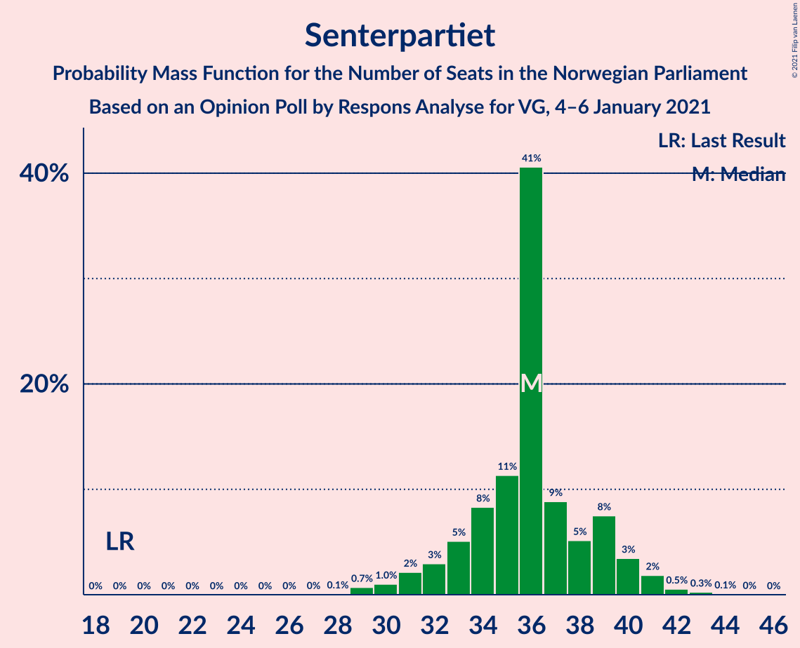

| Number of Seats | Probability | Accumulated | Special Marks |
|:---------------:|:-----------:|:-----------:|:-------------:|
| 19 | 0% | 100% | Last Result |
| 20 | 0% | 100% |  |
| 21 | 0% | 100% |  |
| 22 | 0% | 100% |  |
| 23 | 0% | 100% |  |
| 24 | 0% | 100% |  |
| 25 | 0% | 100% |  |
| 26 | 0% | 100% |  |
| 27 | 0% | 100% |  |
| 28 | 0.2% | 100% |  |
| 29 | 1.3% | 99.8% |  |
| 30 | 0.7% | 98.5% |  |
| 31 | 0.5% | 98% |  |
| 32 | 2% | 97% |  |
| 33 | 5% | 96% |  |
| 34 | 5% | 91% |  |
| 35 | 10% | 86% |  |
| 36 | 53% | 76% | Median |
| 37 | 7% | 23% |  |
| 38 | 6% | 16% |  |
| 39 | 3% | 10% |  |
| 40 | 5% | 7% |  |
| 41 | 2% | 2% |  |
| 42 | 0.1% | 0.5% |  |
| 43 | 0.2% | 0.4% |  |
| 44 | 0.1% | 0.1% |  |
| 45 | 0% | 0% |  |

### Fremskrittspartiet

*For a full overview of the results for this party, see the [Fremskrittspartiet](party-fremskrittspartiet.html) page.*

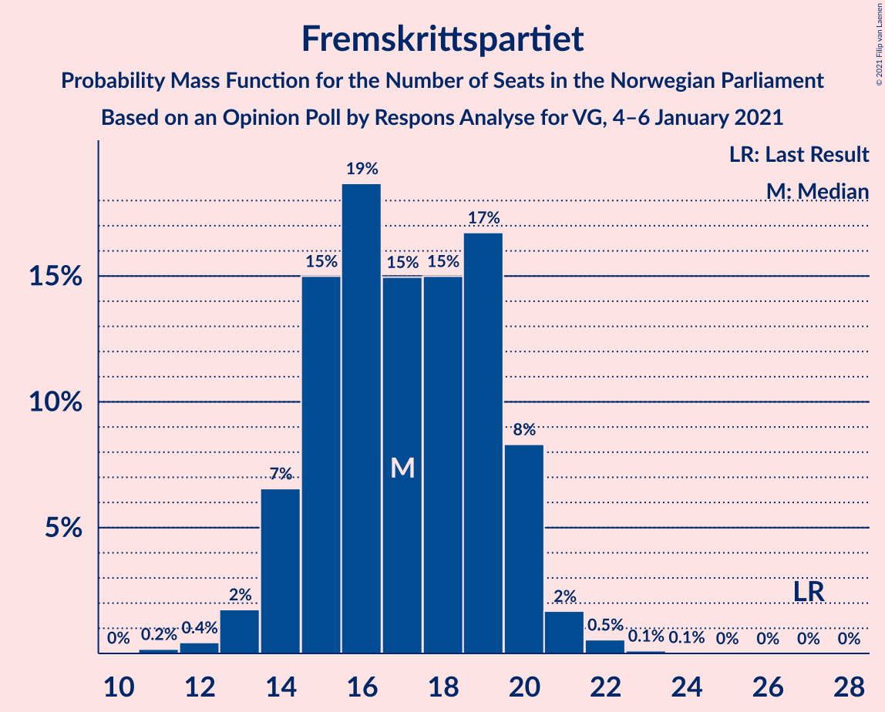

| Number of Seats | Probability | Accumulated | Special Marks |
|:---------------:|:-----------:|:-----------:|:-------------:|
| 12 | 0.2% | 100% |  |
| 13 | 6% | 99.7% |  |
| 14 | 4% | 94% |  |
| 15 | 8% | 89% |  |
| 16 | 12% | 82% |  |
| 17 | 11% | 69% |  |
| 18 | 9% | 58% | Median |
| 19 | 42% | 49% |  |
| 20 | 5% | 8% |  |
| 21 | 2% | 2% |  |
| 22 | 0.3% | 0.5% |  |
| 23 | 0.1% | 0.1% |  |
| 24 | 0% | 0% |  |
| 25 | 0% | 0% |  |
| 26 | 0% | 0% |  |
| 27 | 0% | 0% | Last Result |

### Sosialistisk Venstreparti

*For a full overview of the results for this party, see the [Sosialistisk Venstreparti](party-sosialistiskvenstreparti.html) page.*

| Number of Seats | Probability | Accumulated | Special Marks |
|:---------------:|:-----------:|:-----------:|:-------------:|
| 9 | 0.1% | 100% |  |
| 10 | 2% | 99.9% |  |
| 11 | 2% | 98% | Last Result |
| 12 | 13% | 96% |  |
| 13 | 8% | 83% |  |
| 14 | 11% | 75% |  |
| 15 | 11% | 64% |  |
| 16 | 48% | 53% | Median |
| 17 | 3% | 5% |  |
| 18 | 1.5% | 2% |  |
| 19 | 0.4% | 0.5% |  |
| 20 | 0% | 0% |  |

### Miljøpartiet De Grønne

*For a full overview of the results for this party, see the [Miljøpartiet De Grønne](party-miljøpartietdegrønne.html) page.*

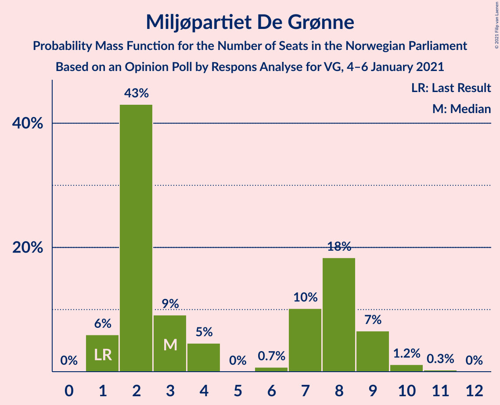

| Number of Seats | Probability | Accumulated | Special Marks |
|:---------------:|:-----------:|:-----------:|:-------------:|
| 1 | 4% | 100% | Last Result |
| 2 | 67% | 96% | Median |
| 3 | 4% | 29% |  |
| 4 | 0.5% | 24% |  |
| 5 | 0% | 24% |  |
| 6 | 0% | 24% |  |
| 7 | 8% | 24% |  |
| 8 | 10% | 16% |  |
| 9 | 5% | 6% |  |
| 10 | 1.0% | 1.2% |  |
| 11 | 0.2% | 0.2% |  |
| 12 | 0% | 0% |  |

### Rødt

*For a full overview of the results for this party, see the [Rødt](party-rødt.html) page.*

| Number of Seats | Probability | Accumulated | Special Marks |
|:---------------:|:-----------:|:-----------:|:-------------:|
| 1 | 11% | 100% | Last Result |
| 2 | 23% | 89% |  |
| 3 | 0% | 66% |  |
| 4 | 0% | 66% |  |
| 5 | 0% | 66% |  |
| 6 | 0.1% | 66% |  |
| 7 | 14% | 66% |  |
| 8 | 51% | 52% | Median |
| 9 | 0.2% | 0.5% |  |
| 10 | 0.2% | 0.3% |  |
| 11 | 0.1% | 0.1% |  |
| 12 | 0% | 0% |  |

### Venstre

*For a full overview of the results for this party, see the [Venstre](party-venstre.html) page.*

| Number of Seats | Probability | Accumulated | Special Marks |
|:---------------:|:-----------:|:-----------:|:-------------:|
| 1 | 2% | 100% |  |
| 2 | 77% | 98% | Median |
| 3 | 6% | 21% |  |
| 4 | 4% | 15% |  |
| 5 | 0% | 12% |  |
| 6 | 0.7% | 12% |  |
| 7 | 7% | 11% |  |
| 8 | 4% | 4% | Last Result |
| 9 | 0.4% | 0.7% |  |
| 10 | 0.2% | 0.2% |  |
| 11 | 0% | 0% |  |

### Kristelig Folkeparti

*For a full overview of the results for this party, see the [Kristelig Folkeparti](party-kristeligfolkeparti.html) page.*

| Number of Seats | Probability | Accumulated | Special Marks |
|:---------------:|:-----------:|:-----------:|:-------------:|
| 0 | 0.4% | 100% |  |
| 1 | 17% | 99.6% |  |
| 2 | 44% | 82% | Median |
| 3 | 19% | 38% |  |
| 4 | 0% | 19% |  |
| 5 | 0% | 19% |  |
| 6 | 0.7% | 19% |  |
| 7 | 4% | 19% |  |
| 8 | 11% | 15% | Last Result |
| 9 | 3% | 4% |  |
| 10 | 0.2% | 0.3% |  |
| 11 | 0% | 0% |  |

## Coalitions

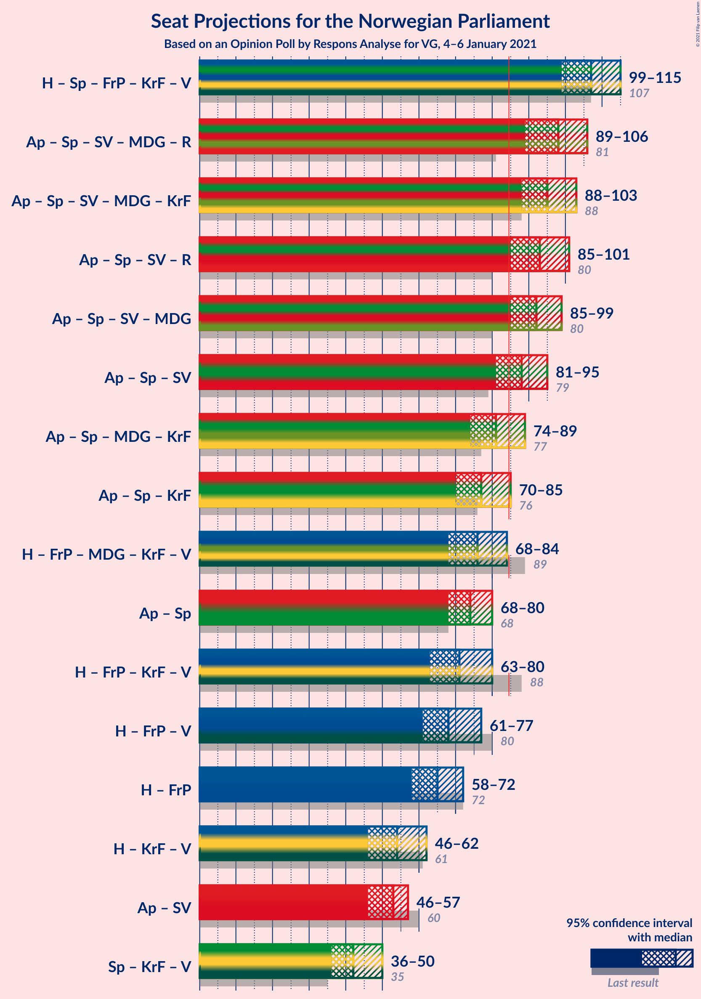

### Confidence Intervals

| Coalition | Last Result | Median | Majority? | 80% Confidence Interval | 90% Confidence Interval | 95% Confidence Interval | 99% Confidence Interval |
|:---------:|:-----------:|:------:|:---------:|:-----------------------:|:-----------------------:|:-----------------------:|:-----------------------:|
| Høyre – Senterpartiet – Fremskrittspartiet – Kristelig Folkeparti – Venstre | 107 | 106 | 100% | 104–112 | 101–114 | 99–115 | 97–117 |
| Arbeiderpartiet – Senterpartiet – Sosialistisk Venstreparti – Miljøpartiet De Grønne – Rødt | 81 | 99 | 99.9% | 93–102 | 90–103 | 89–105 | 87–107 |
| Arbeiderpartiet – Senterpartiet – Sosialistisk Venstreparti – Miljøpartiet De Grønne – Kristelig Folkeparti | 88 | 93 | 99.6% | 92–101 | 90–102 | 88–105 | 86–107 |
| Arbeiderpartiet – Senterpartiet – Sosialistisk Venstreparti – Rødt | 80 | 95 | 98% | 88–97 | 86–99 | 85–101 | 83–102 |
| Arbeiderpartiet – Senterpartiet – Sosialistisk Venstreparti – Miljøpartiet De Grønne | 80 | 91 | 99.1% | 88–97 | 87–98 | 86–99 | 83–101 |
| Arbeiderpartiet – Senterpartiet – Sosialistisk Venstreparti | 79 | 89 | 88% | 84–93 | 83–93 | 82–94 | 79–96 |
| Arbeiderpartiet – Senterpartiet – Miljøpartiet De Grønne – Kristelig Folkeparti | 77 | 79 | 20% | 77–87 | 75–89 | 73–90 | 71–95 |
| Arbeiderpartiet – Senterpartiet – Kristelig Folkeparti | 76 | 75 | 5% | 73–82 | 71–84 | 71–86 | 68–88 |
| Høyre – Fremskrittspartiet – Miljøpartiet De Grønne – Kristelig Folkeparti – Venstre | 89 | 73 | 1.4% | 72–81 | 70–82 | 68–83 | 66–86 |
| Høyre – Fremskrittspartiet – Kristelig Folkeparti – Venstre | 88 | 70 | 0% | 67–76 | 66–79 | 64–80 | 62–81 |
| Arbeiderpartiet – Senterpartiet | 68 | 73 | 0% | 70–77 | 69–79 | 68–79 | 65–81 |
| Høyre – Fremskrittspartiet – Venstre | 80 | 68 | 0% | 64–72 | 62–74 | 61–76 | 60–80 |
| Høyre – Fremskrittspartiet | 72 | 66 | 0% | 60–69 | 59–70 | 57–72 | 56–74 |
| Høyre – Kristelig Folkeparti – Venstre | 61 | 53 | 0% | 50–60 | 49–61 | 48–63 | 45–64 |
| Arbeiderpartiet – Sosialistisk Venstreparti | 60 | 53 | 0% | 48–55 | 48–56 | 45–58 | 44–60 |
| Senterpartiet – Kristelig Folkeparti – Venstre | 35 | 40 | 0% | 39–47 | 37–50 | 36–51 | 34–55 |

### Høyre – Senterpartiet – Fremskrittspartiet – Kristelig Folkeparti – Venstre

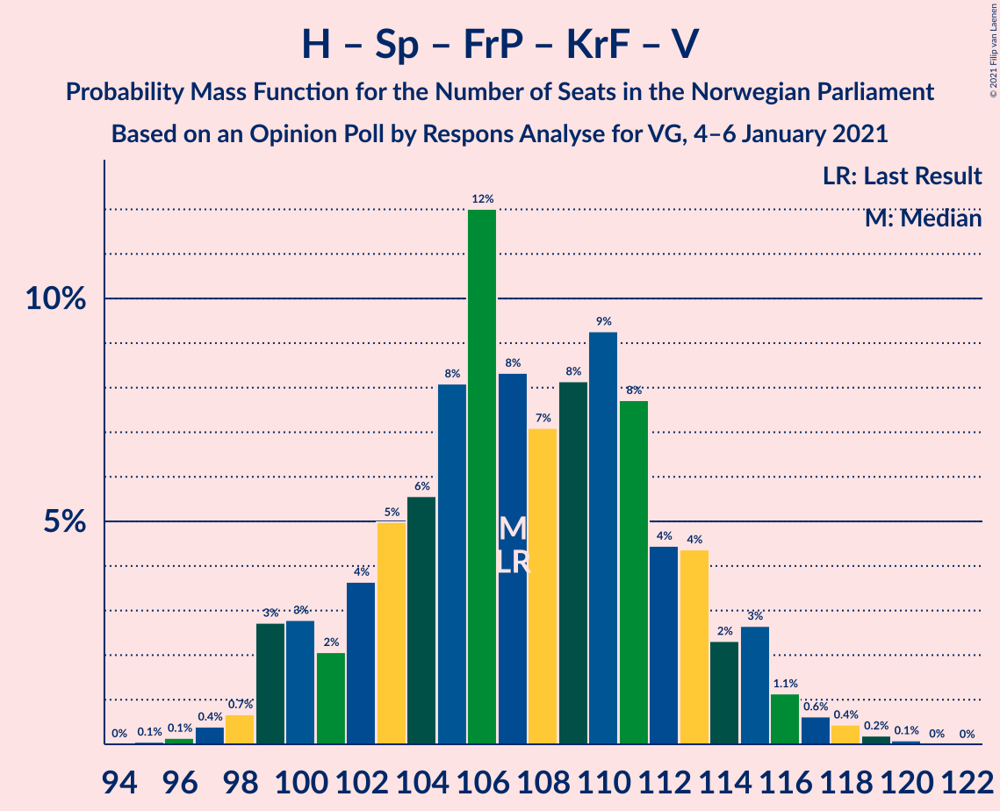

| Number of Seats | Probability | Accumulated | Special Marks |
|:---------------:|:-----------:|:-----------:|:-------------:|
| 96 | 0% | 100% |  |
| 97 | 0.5% | 99.9% |  |
| 98 | 0.7% | 99.4% |  |
| 99 | 1.5% | 98.7% |  |
| 100 | 0.3% | 97% |  |
| 101 | 2% | 97% |  |
| 102 | 2% | 95% |  |
| 103 | 2% | 93% |  |
| 104 | 1.5% | 91% |  |
| 105 | 5% | 90% | Median |
| 106 | 43% | 84% |  |
| 107 | 5% | 41% | Last Result |
| 108 | 9% | 36% |  |
| 109 | 1.5% | 28% |  |
| 110 | 7% | 26% |  |
| 111 | 8% | 20% |  |
| 112 | 2% | 11% |  |
| 113 | 4% | 10% |  |
| 114 | 2% | 6% |  |
| 115 | 2% | 4% |  |
| 116 | 0.7% | 2% |  |
| 117 | 0.8% | 1.2% |  |
| 118 | 0% | 0.4% |  |
| 119 | 0.2% | 0.4% |  |
| 120 | 0.2% | 0.2% |  |
| 121 | 0% | 0% |  |

### Arbeiderpartiet – Senterpartiet – Sosialistisk Venstreparti – Miljøpartiet De Grønne – Rødt

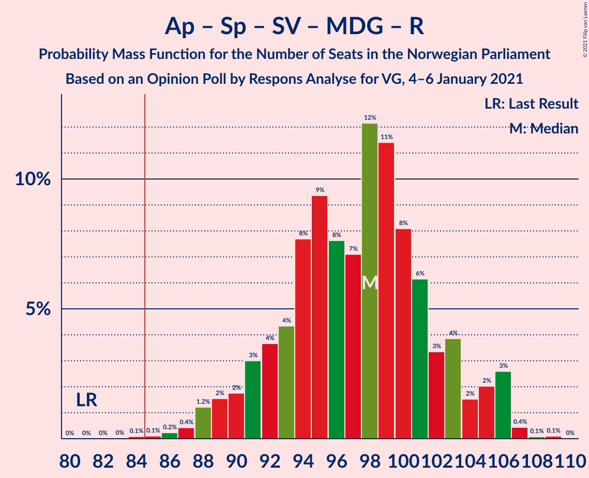

| Number of Seats | Probability | Accumulated | Special Marks |
|:---------------:|:-----------:|:-----------:|:-------------:|
| 81 | 0% | 100% | Last Result |
| 82 | 0% | 100% |  |
| 83 | 0% | 100% |  |
| 84 | 0% | 100% |  |
| 85 | 0.2% | 99.9% | Majority |
| 86 | 0.1% | 99.8% |  |
| 87 | 0.4% | 99.6% |  |
| 88 | 1.1% | 99.3% |  |
| 89 | 2% | 98% |  |
| 90 | 3% | 96% |  |
| 91 | 1.0% | 94% |  |
| 92 | 2% | 93% |  |
| 93 | 4% | 91% |  |
| 94 | 9% | 87% |  |
| 95 | 3% | 78% |  |
| 96 | 7% | 74% |  |
| 97 | 6% | 68% |  |
| 98 | 3% | 62% |  |
| 99 | 44% | 59% | Median |
| 100 | 3% | 15% |  |
| 101 | 2% | 12% |  |
| 102 | 1.2% | 10% |  |
| 103 | 5% | 9% |  |
| 104 | 2% | 4% |  |
| 105 | 1.1% | 3% |  |
| 106 | 0.5% | 2% |  |
| 107 | 1.0% | 1.1% |  |
| 108 | 0% | 0.1% |  |
| 109 | 0% | 0.1% |  |
| 110 | 0% | 0% |  |

### Arbeiderpartiet – Senterpartiet – Sosialistisk Venstreparti – Miljøpartiet De Grønne – Kristelig Folkeparti

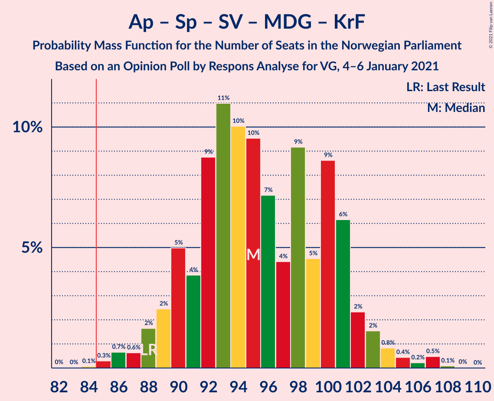

| Number of Seats | Probability | Accumulated | Special Marks |
|:---------------:|:-----------:|:-----------:|:-------------:|
| 82 | 0.2% | 100% |  |
| 83 | 0% | 99.8% |  |
| 84 | 0.2% | 99.8% |  |
| 85 | 0.1% | 99.6% | Majority |
| 86 | 1.1% | 99.5% |  |
| 87 | 0.2% | 98% |  |
| 88 | 2% | 98% | Last Result |
| 89 | 0.3% | 96% |  |
| 90 | 2% | 96% |  |
| 91 | 2% | 94% |  |
| 92 | 6% | 92% |  |
| 93 | 38% | 86% | Median |
| 94 | 3% | 47% |  |
| 95 | 8% | 45% |  |
| 96 | 13% | 37% |  |
| 97 | 2% | 24% |  |
| 98 | 2% | 22% |  |
| 99 | 5% | 20% |  |
| 100 | 4% | 15% |  |
| 101 | 6% | 11% |  |
| 102 | 0.9% | 5% |  |
| 103 | 2% | 5% |  |
| 104 | 0.5% | 3% |  |
| 105 | 1.0% | 3% |  |
| 106 | 0.4% | 2% |  |
| 107 | 1.1% | 1.2% |  |
| 108 | 0% | 0.1% |  |
| 109 | 0% | 0% |  |

### Arbeiderpartiet – Senterpartiet – Sosialistisk Venstreparti – Rødt

| Number of Seats | Probability | Accumulated | Special Marks |
|:---------------:|:-----------:|:-----------:|:-------------:|
| 79 | 0.1% | 100% |  |
| 80 | 0% | 99.9% | Last Result |
| 81 | 0% | 99.9% |  |
| 82 | 0.1% | 99.9% |  |
| 83 | 1.0% | 99.7% |  |
| 84 | 0.3% | 98.7% |  |
| 85 | 1.0% | 98% | Majority |
| 86 | 2% | 97% |  |
| 87 | 2% | 95% |  |
| 88 | 6% | 92% |  |
| 89 | 1.4% | 86% |  |
| 90 | 5% | 85% |  |
| 91 | 7% | 80% |  |
| 92 | 9% | 74% |  |
| 93 | 3% | 65% |  |
| 94 | 4% | 62% |  |
| 95 | 8% | 58% |  |
| 96 | 2% | 49% |  |
| 97 | 41% | 48% | Median |
| 98 | 2% | 7% |  |
| 99 | 1.4% | 5% |  |
| 100 | 0.5% | 4% |  |
| 101 | 3% | 3% |  |
| 102 | 0.3% | 0.8% |  |
| 103 | 0.4% | 0.5% |  |
| 104 | 0% | 0.1% |  |
| 105 | 0% | 0% |  |

### Arbeiderpartiet – Senterpartiet – Sosialistisk Venstreparti – Miljøpartiet De Grønne

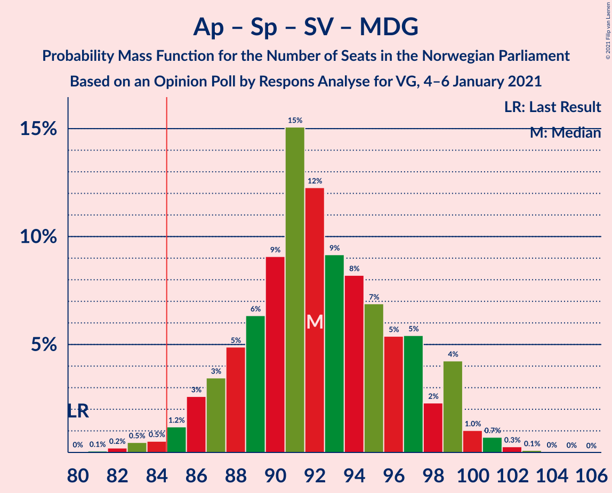

| Number of Seats | Probability | Accumulated | Special Marks |
|:---------------:|:-----------:|:-----------:|:-------------:|
| 79 | 0.1% | 100% |  |
| 80 | 0.2% | 99.9% | Last Result |
| 81 | 0.2% | 99.8% |  |
| 82 | 0.1% | 99.6% |  |
| 83 | 0.2% | 99.5% |  |
| 84 | 0.2% | 99.4% |  |
| 85 | 2% | 99.1% | Majority |
| 86 | 0.5% | 98% |  |
| 87 | 5% | 97% |  |
| 88 | 4% | 92% |  |
| 89 | 4% | 88% |  |
| 90 | 2% | 84% |  |
| 91 | 43% | 81% | Median |
| 92 | 11% | 38% |  |
| 93 | 3% | 27% |  |
| 94 | 4% | 24% |  |
| 95 | 7% | 20% |  |
| 96 | 1.0% | 12% |  |
| 97 | 4% | 11% |  |
| 98 | 3% | 8% |  |
| 99 | 2% | 4% |  |
| 100 | 0.9% | 2% |  |
| 101 | 1.0% | 1.4% |  |
| 102 | 0.2% | 0.3% |  |
| 103 | 0.1% | 0.2% |  |
| 104 | 0% | 0% |  |

### Arbeiderpartiet – Senterpartiet – Sosialistisk Venstreparti

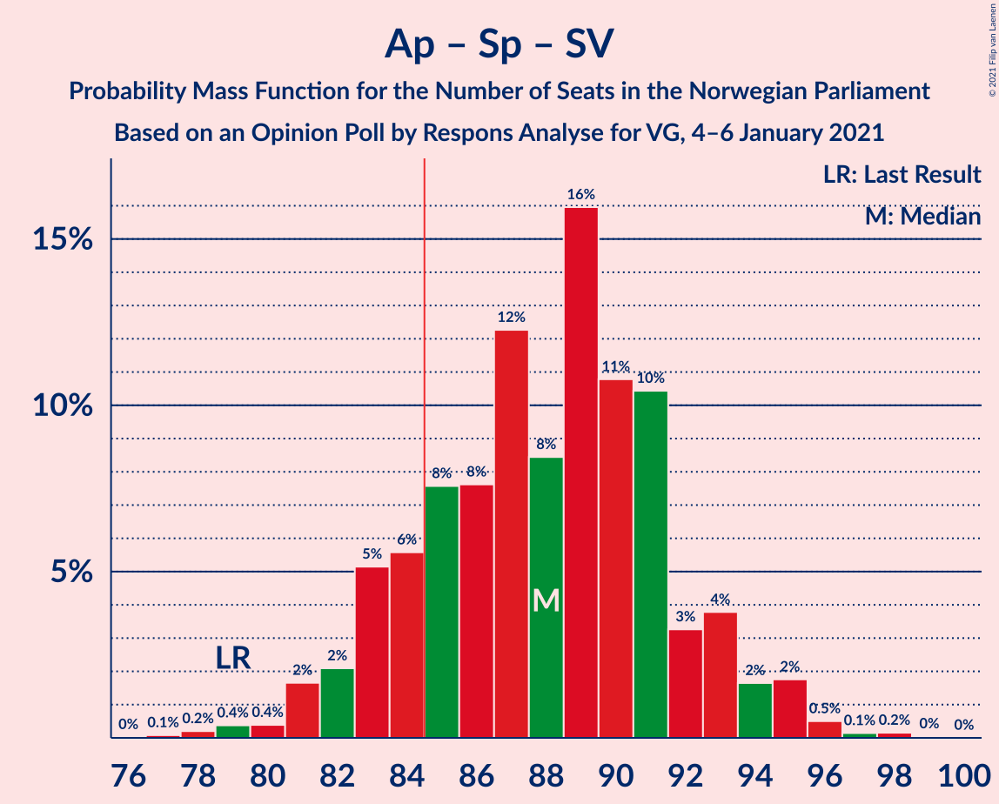

| Number of Seats | Probability | Accumulated | Special Marks |
|:---------------:|:-----------:|:-----------:|:-------------:|
| 76 | 0.1% | 100% |  |
| 77 | 0.1% | 99.9% |  |
| 78 | 0.2% | 99.8% |  |
| 79 | 0.3% | 99.6% | Last Result |
| 80 | 0.6% | 99.3% |  |
| 81 | 0.8% | 98.7% |  |
| 82 | 1.1% | 98% |  |
| 83 | 3% | 97% |  |
| 84 | 5% | 94% |  |
| 85 | 5% | 88% | Majority |
| 86 | 6% | 83% |  |
| 87 | 6% | 77% |  |
| 88 | 4% | 71% |  |
| 89 | 43% | 67% | Median |
| 90 | 7% | 24% |  |
| 91 | 4% | 16% |  |
| 92 | 2% | 12% |  |
| 93 | 7% | 10% |  |
| 94 | 0.4% | 3% |  |
| 95 | 2% | 2% |  |
| 96 | 0.5% | 0.7% |  |
| 97 | 0.1% | 0.2% |  |
| 98 | 0.1% | 0.1% |  |
| 99 | 0% | 0% |  |

### Arbeiderpartiet – Senterpartiet – Miljøpartiet De Grønne – Kristelig Folkeparti

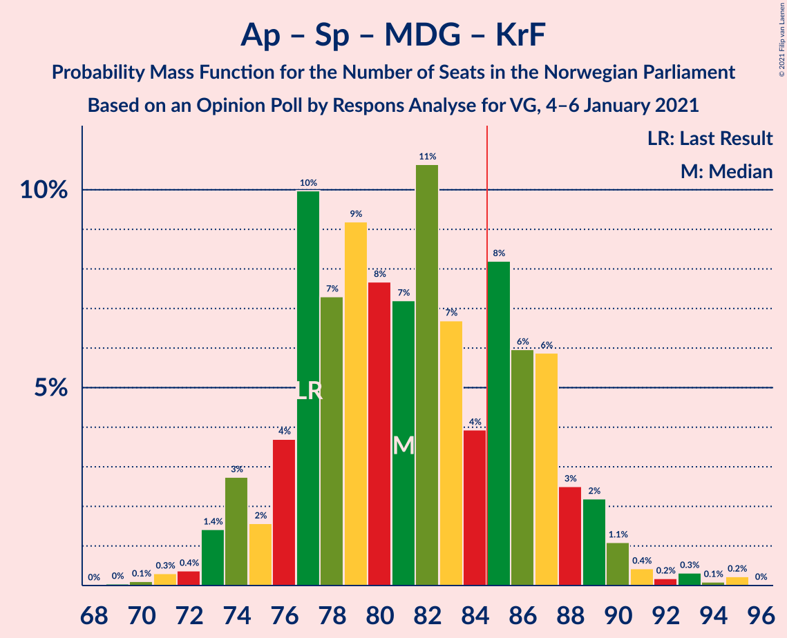

| Number of Seats | Probability | Accumulated | Special Marks |
|:---------------:|:-----------:|:-----------:|:-------------:|
| 69 | 0.2% | 100% |  |
| 70 | 0.2% | 99.8% |  |
| 71 | 0.2% | 99.6% |  |
| 72 | 0.3% | 99.4% |  |
| 73 | 3% | 99.1% |  |
| 74 | 1.2% | 96% |  |
| 75 | 0.3% | 95% |  |
| 76 | 0.9% | 95% |  |
| 77 | 39% | 94% | Last Result, Median |
| 78 | 2% | 55% |  |
| 79 | 8% | 53% |  |
| 80 | 9% | 45% |  |
| 81 | 3% | 36% |  |
| 82 | 6% | 33% |  |
| 83 | 6% | 27% |  |
| 84 | 0.9% | 21% |  |
| 85 | 5% | 20% | Majority |
| 86 | 2% | 15% |  |
| 87 | 4% | 13% |  |
| 88 | 2% | 9% |  |
| 89 | 4% | 7% |  |
| 90 | 1.1% | 3% |  |
| 91 | 0.2% | 2% |  |
| 92 | 0.4% | 2% |  |
| 93 | 0.1% | 1.3% |  |
| 94 | 0.1% | 1.3% |  |
| 95 | 1.1% | 1.1% |  |
| 96 | 0% | 0% |  |

### Arbeiderpartiet – Senterpartiet – Kristelig Folkeparti

| Number of Seats | Probability | Accumulated | Special Marks |
|:---------------:|:-----------:|:-----------:|:-------------:|
| 64 | 0.1% | 100% |  |
| 65 | 0% | 99.9% |  |
| 66 | 0% | 99.9% |  |
| 67 | 0.3% | 99.9% |  |
| 68 | 0.6% | 99.6% |  |
| 69 | 0.5% | 99.0% |  |
| 70 | 0.5% | 98% |  |
| 71 | 4% | 98% |  |
| 72 | 2% | 94% |  |
| 73 | 2% | 92% |  |
| 74 | 0.8% | 89% |  |
| 75 | 42% | 89% | Median |
| 76 | 4% | 46% | Last Result |
| 77 | 7% | 43% |  |
| 78 | 10% | 35% |  |
| 79 | 5% | 25% |  |
| 80 | 8% | 21% |  |
| 81 | 1.0% | 13% |  |
| 82 | 4% | 12% |  |
| 83 | 1.3% | 8% |  |
| 84 | 1.4% | 6% |  |
| 85 | 2% | 5% | Majority |
| 86 | 0.7% | 3% |  |
| 87 | 1.1% | 2% |  |
| 88 | 1.1% | 1.2% |  |
| 89 | 0% | 0.1% |  |
| 90 | 0% | 0% |  |

### Høyre – Fremskrittspartiet – Miljøpartiet De Grønne – Kristelig Folkeparti – Venstre

| Number of Seats | Probability | Accumulated | Special Marks |
|:---------------:|:-----------:|:-----------:|:-------------:|
| 64 | 0% | 100% |  |
| 65 | 0.1% | 99.9% |  |
| 66 | 0.5% | 99.9% |  |
| 67 | 0.3% | 99.4% |  |
| 68 | 3% | 99.1% |  |
| 69 | 0.5% | 96% |  |
| 70 | 1.5% | 96% |  |
| 71 | 2% | 94% | Median |
| 72 | 41% | 92% |  |
| 73 | 2% | 51% |  |
| 74 | 8% | 49% |  |
| 75 | 4% | 41% |  |
| 76 | 3% | 37% |  |
| 77 | 9% | 34% |  |
| 78 | 7% | 25% |  |
| 79 | 4% | 18% |  |
| 80 | 1.4% | 14% |  |
| 81 | 6% | 13% |  |
| 82 | 2% | 7% |  |
| 83 | 2% | 5% |  |
| 84 | 0.9% | 2% |  |
| 85 | 0.2% | 1.4% | Majority |
| 86 | 1.0% | 1.2% |  |
| 87 | 0.1% | 0.2% |  |
| 88 | 0% | 0.1% |  |
| 89 | 0% | 0.1% | Last Result |
| 90 | 0.1% | 0.1% |  |
| 91 | 0% | 0% |  |

### Høyre – Fremskrittspartiet – Kristelig Folkeparti – Venstre

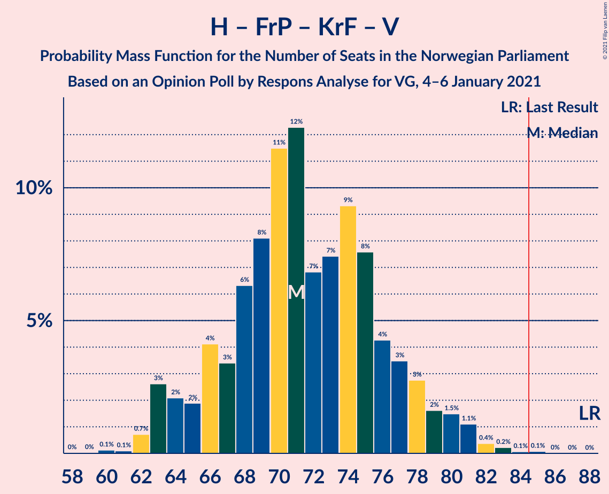

| Number of Seats | Probability | Accumulated | Special Marks |
|:---------------:|:-----------:|:-----------:|:-------------:|
| 60 | 0% | 100% |  |
| 61 | 0.1% | 99.9% |  |
| 62 | 1.0% | 99.9% |  |
| 63 | 0.5% | 98.9% |  |
| 64 | 1.2% | 98% |  |
| 65 | 2% | 97% |  |
| 66 | 5% | 96% |  |
| 67 | 1.2% | 91% |  |
| 68 | 2% | 90% |  |
| 69 | 3% | 87% | Median |
| 70 | 45% | 84% |  |
| 71 | 3% | 39% |  |
| 72 | 6% | 36% |  |
| 73 | 7% | 31% |  |
| 74 | 3% | 24% |  |
| 75 | 9% | 21% |  |
| 76 | 4% | 12% |  |
| 77 | 2% | 8% |  |
| 78 | 1.0% | 6% |  |
| 79 | 2% | 5% |  |
| 80 | 1.4% | 3% |  |
| 81 | 1.1% | 2% |  |
| 82 | 0.2% | 0.4% |  |
| 83 | 0.1% | 0.3% |  |
| 84 | 0.1% | 0.2% |  |
| 85 | 0% | 0% | Majority |
| 86 | 0% | 0% |  |
| 87 | 0% | 0% |  |
| 88 | 0% | 0% | Last Result |

### Arbeiderpartiet – Senterpartiet

| Number of Seats | Probability | Accumulated | Special Marks |
|:---------------:|:-----------:|:-----------:|:-------------:|
| 63 | 0.1% | 100% |  |
| 64 | 0.2% | 99.9% |  |
| 65 | 0.4% | 99.6% |  |
| 66 | 0.2% | 99.2% |  |
| 67 | 0.7% | 99.0% |  |
| 68 | 2% | 98% | Last Result |
| 69 | 1.4% | 96% |  |
| 70 | 7% | 95% |  |
| 71 | 4% | 88% |  |
| 72 | 5% | 84% |  |
| 73 | 40% | 79% | Median |
| 74 | 11% | 39% |  |
| 75 | 8% | 28% |  |
| 76 | 3% | 20% |  |
| 77 | 8% | 17% |  |
| 78 | 2% | 10% |  |
| 79 | 5% | 7% |  |
| 80 | 1.3% | 2% |  |
| 81 | 0.9% | 1.1% |  |
| 82 | 0.2% | 0.2% |  |
| 83 | 0% | 0.1% |  |
| 84 | 0% | 0% |  |

### Høyre – Fremskrittspartiet – Venstre

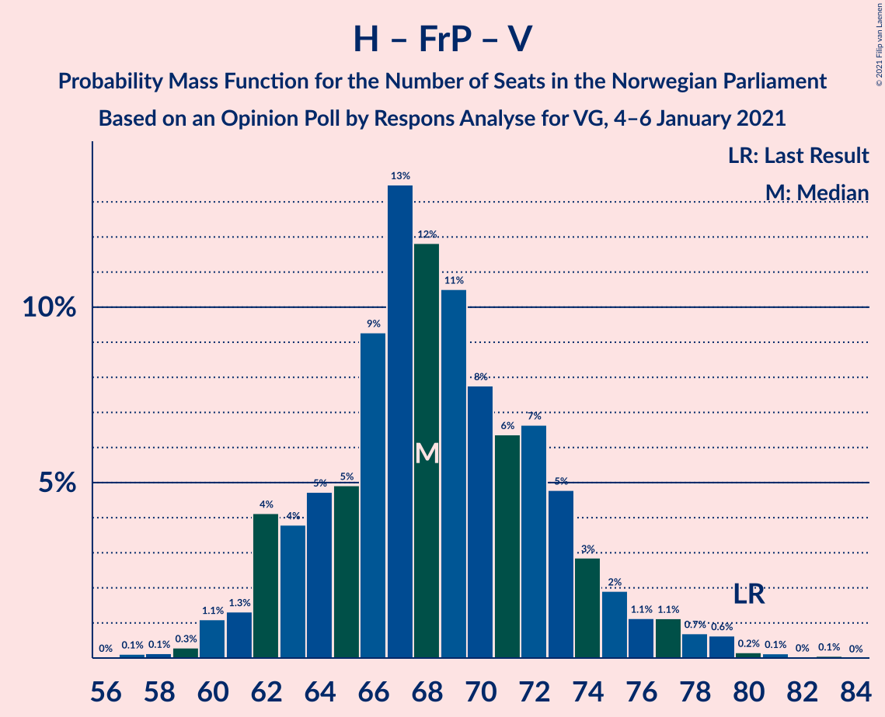

| Number of Seats | Probability | Accumulated | Special Marks |
|:---------------:|:-----------:|:-----------:|:-------------:|
| 58 | 0.1% | 100% |  |
| 59 | 0.2% | 99.8% |  |
| 60 | 2% | 99.6% |  |
| 61 | 2% | 98% |  |
| 62 | 2% | 96% |  |
| 63 | 3% | 94% |  |
| 64 | 3% | 91% |  |
| 65 | 4% | 88% |  |
| 66 | 5% | 84% |  |
| 67 | 7% | 78% | Median |
| 68 | 40% | 71% |  |
| 69 | 8% | 31% |  |
| 70 | 2% | 24% |  |
| 71 | 7% | 21% |  |
| 72 | 8% | 15% |  |
| 73 | 1.3% | 7% |  |
| 74 | 0.6% | 5% |  |
| 75 | 1.3% | 5% |  |
| 76 | 1.0% | 3% |  |
| 77 | 1.1% | 2% |  |
| 78 | 0.2% | 1.2% |  |
| 79 | 0% | 1.0% |  |
| 80 | 0.8% | 0.9% | Last Result |
| 81 | 0% | 0.1% |  |
| 82 | 0.1% | 0.1% |  |
| 83 | 0% | 0% |  |

### Høyre – Fremskrittspartiet

| Number of Seats | Probability | Accumulated | Special Marks |
|:---------------:|:-----------:|:-----------:|:-------------:|
| 55 | 0% | 100% |  |
| 56 | 2% | 99.9% |  |
| 57 | 0.6% | 98% |  |
| 58 | 2% | 97% |  |
| 59 | 2% | 95% |  |
| 60 | 6% | 93% |  |
| 61 | 1.0% | 87% |  |
| 62 | 2% | 86% |  |
| 63 | 5% | 84% |  |
| 64 | 5% | 79% |  |
| 65 | 9% | 73% | Median |
| 66 | 39% | 65% |  |
| 67 | 4% | 26% |  |
| 68 | 2% | 21% |  |
| 69 | 9% | 19% |  |
| 70 | 6% | 10% |  |
| 71 | 1.1% | 4% |  |
| 72 | 1.0% | 3% | Last Result |
| 73 | 0.8% | 2% |  |
| 74 | 1.3% | 1.4% |  |
| 75 | 0% | 0.1% |  |
| 76 | 0% | 0% |  |

### Høyre – Kristelig Folkeparti – Venstre

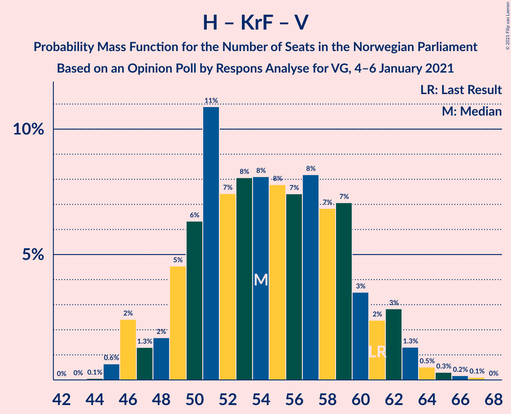

| Number of Seats | Probability | Accumulated | Special Marks |
|:---------------:|:-----------:|:-----------:|:-------------:|
| 44 | 0% | 100% |  |
| 45 | 0.6% | 99.9% |  |
| 46 | 0.4% | 99.4% |  |
| 47 | 1.1% | 99.0% |  |
| 48 | 1.5% | 98% |  |
| 49 | 5% | 96% |  |
| 50 | 2% | 92% |  |
| 51 | 37% | 90% | Median |
| 52 | 2% | 52% |  |
| 53 | 1.2% | 50% |  |
| 54 | 14% | 49% |  |
| 55 | 4% | 35% |  |
| 56 | 5% | 30% |  |
| 57 | 7% | 26% |  |
| 58 | 2% | 19% |  |
| 59 | 6% | 16% |  |
| 60 | 0.8% | 10% |  |
| 61 | 5% | 10% | Last Result |
| 62 | 0.8% | 4% |  |
| 63 | 3% | 4% |  |
| 64 | 0.5% | 0.9% |  |
| 65 | 0.1% | 0.3% |  |
| 66 | 0.1% | 0.2% |  |
| 67 | 0.1% | 0.1% |  |
| 68 | 0% | 0% |  |

### Arbeiderpartiet – Sosialistisk Venstreparti

| Number of Seats | Probability | Accumulated | Special Marks |
|:---------------:|:-----------:|:-----------:|:-------------:|
| 40 | 0.1% | 100% |  |
| 41 | 0% | 99.9% |  |
| 42 | 0% | 99.9% |  |
| 43 | 0.1% | 99.9% |  |
| 44 | 1.1% | 99.8% |  |
| 45 | 1.4% | 98.7% |  |
| 46 | 1.1% | 97% |  |
| 47 | 1.0% | 96% |  |
| 48 | 6% | 95% |  |
| 49 | 5% | 89% |  |
| 50 | 3% | 84% |  |
| 51 | 7% | 81% |  |
| 52 | 7% | 74% |  |
| 53 | 44% | 67% | Median |
| 54 | 5% | 23% |  |
| 55 | 11% | 18% |  |
| 56 | 2% | 6% |  |
| 57 | 1.4% | 4% |  |
| 58 | 2% | 3% |  |
| 59 | 0.6% | 1.1% |  |
| 60 | 0.3% | 0.5% | Last Result |
| 61 | 0.2% | 0.3% |  |
| 62 | 0% | 0% |  |

### Senterpartiet – Kristelig Folkeparti – Venstre

| Number of Seats | Probability | Accumulated | Special Marks |
|:---------------:|:-----------:|:-----------:|:-------------:|
| 32 | 0.1% | 100% |  |
| 33 | 0.4% | 99.9% |  |
| 34 | 1.2% | 99.5% |  |
| 35 | 0.7% | 98% | Last Result |
| 36 | 1.2% | 98% |  |
| 37 | 2% | 96% |  |
| 38 | 2% | 94% |  |
| 39 | 3% | 92% |  |
| 40 | 43% | 89% | Median |
| 41 | 8% | 46% |  |
| 42 | 5% | 38% |  |
| 43 | 10% | 32% |  |
| 44 | 3% | 22% |  |
| 45 | 2% | 20% |  |
| 46 | 4% | 18% |  |
| 47 | 4% | 14% |  |
| 48 | 2% | 10% |  |
| 49 | 0.9% | 8% |  |
| 50 | 4% | 7% |  |
| 51 | 3% | 4% |  |
| 52 | 0.1% | 0.9% |  |
| 53 | 0.1% | 0.8% |  |
| 54 | 0.2% | 0.7% |  |
| 55 | 0.5% | 0.5% |  |
| 56 | 0% | 0% |  |

## Technical Information

### Opinion Poll

+ **Polling firm:** Respons Analyse
+ **Commissioner(s):** VG
+ **Fieldwork period:** 4–6 January 2021

### Calculations

+ **Sample size:** 1000
+ **Simulations done:** 131,072
+ **Error estimate:** 2.91%

