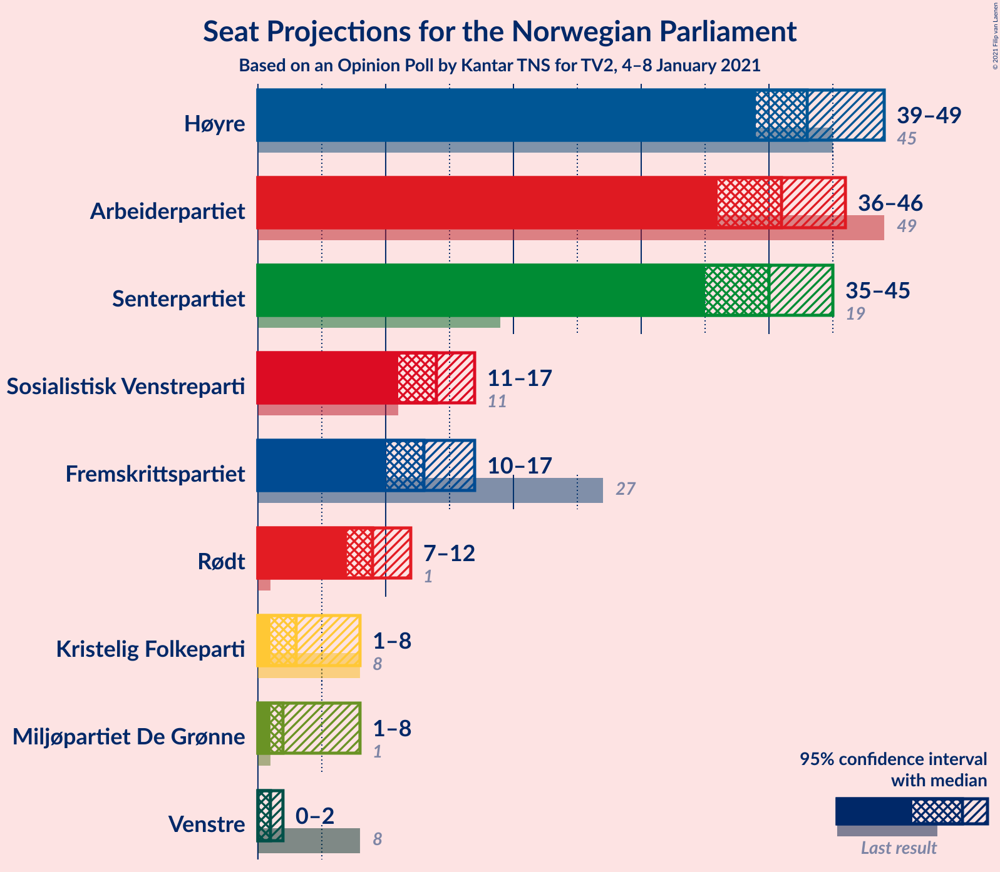
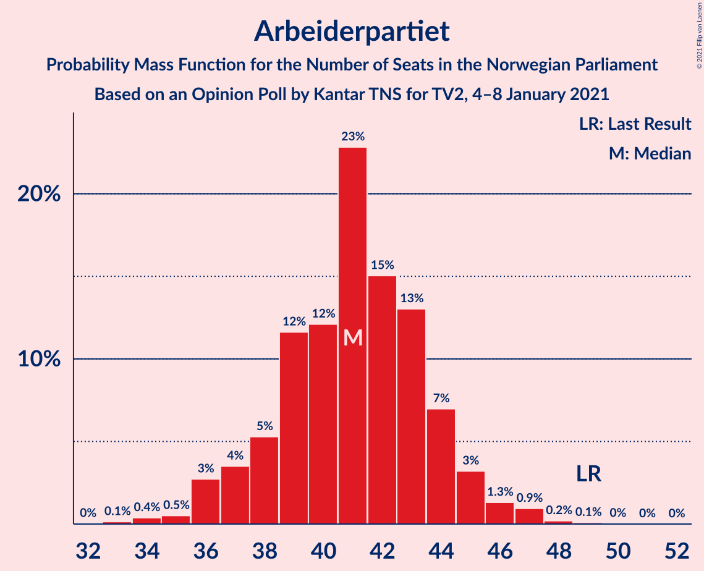
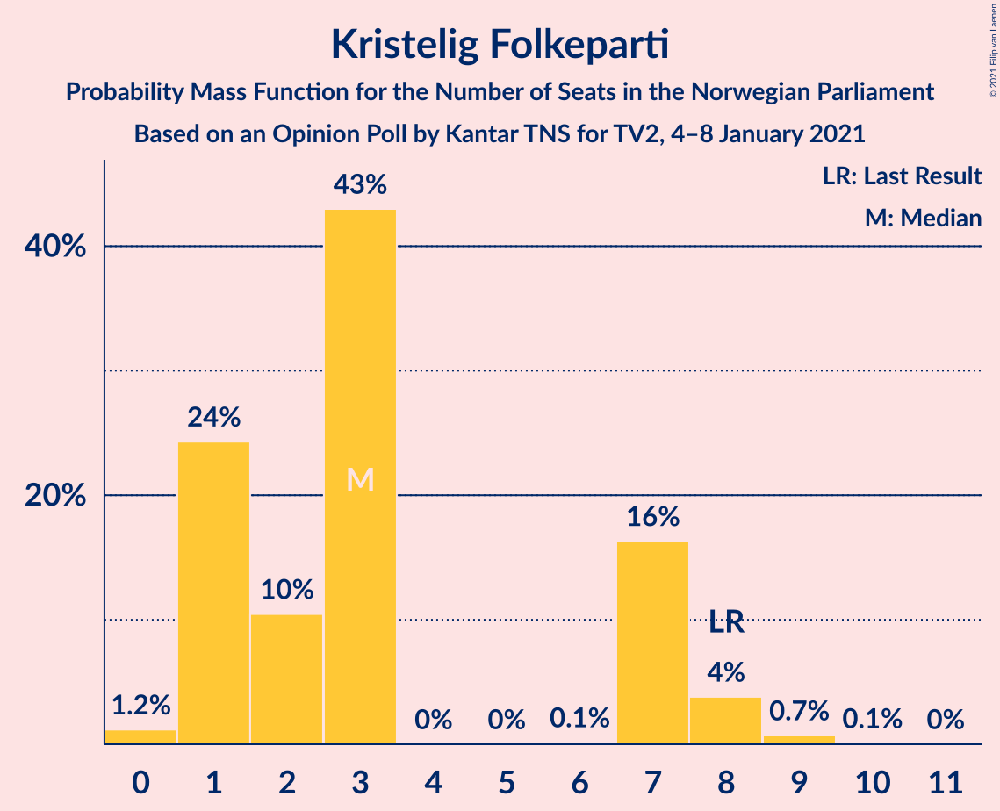
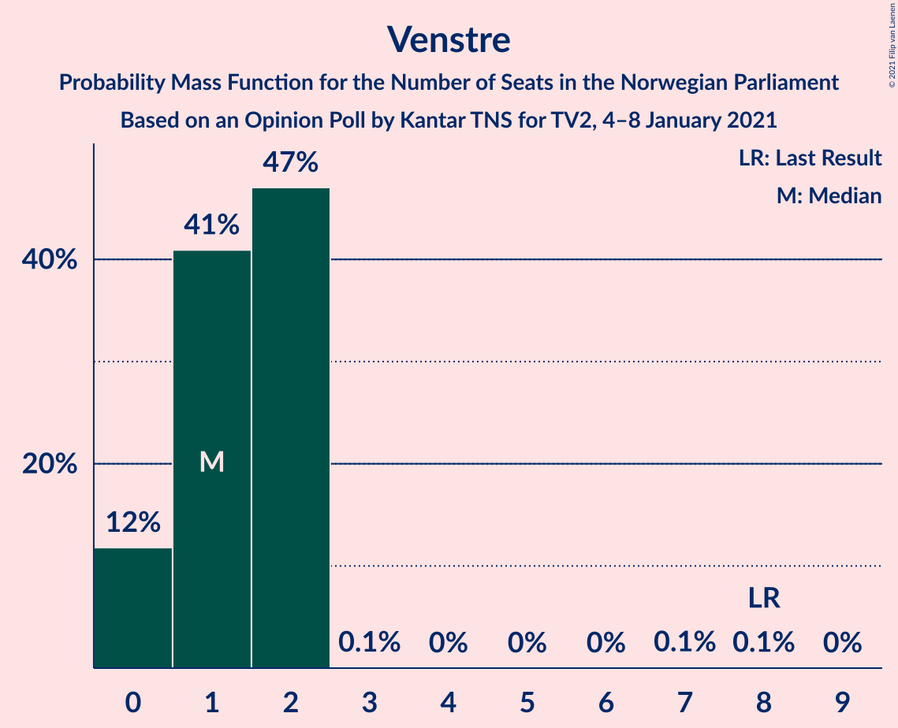
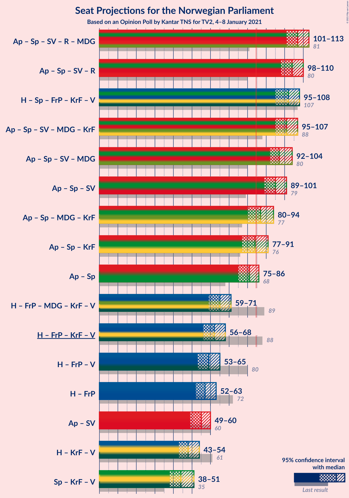
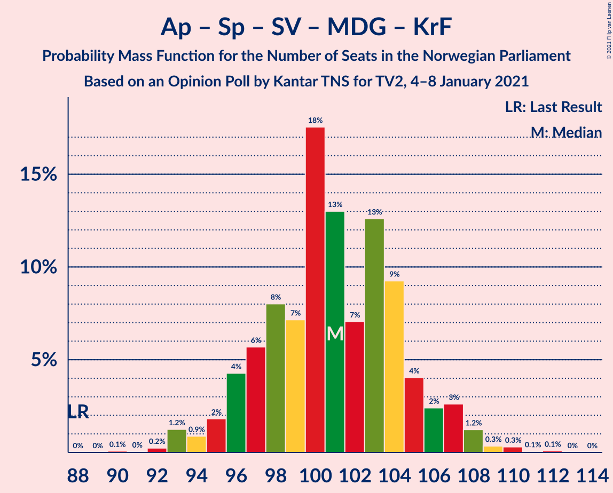
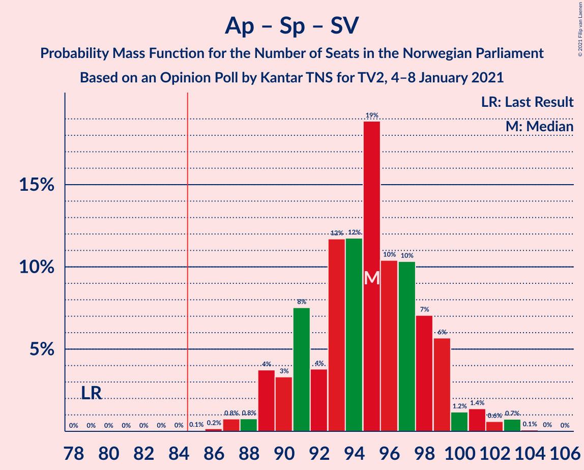
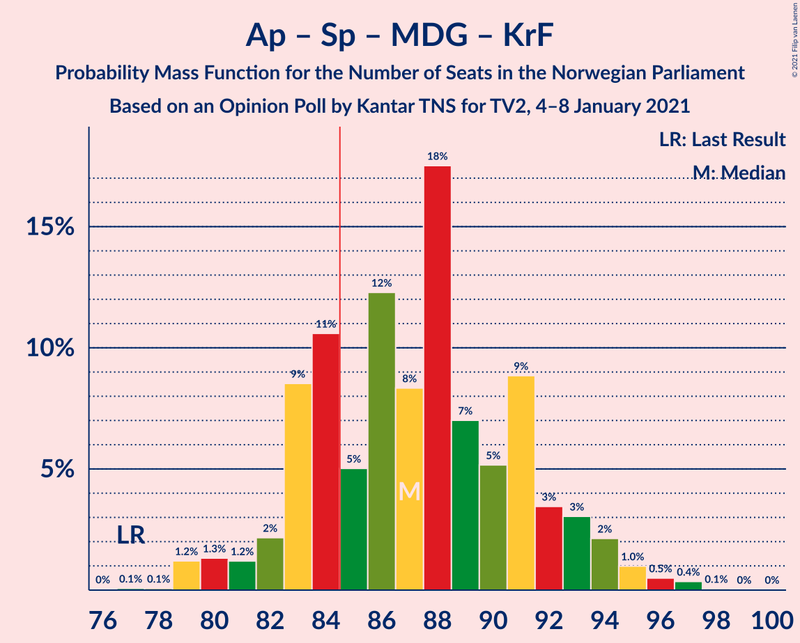
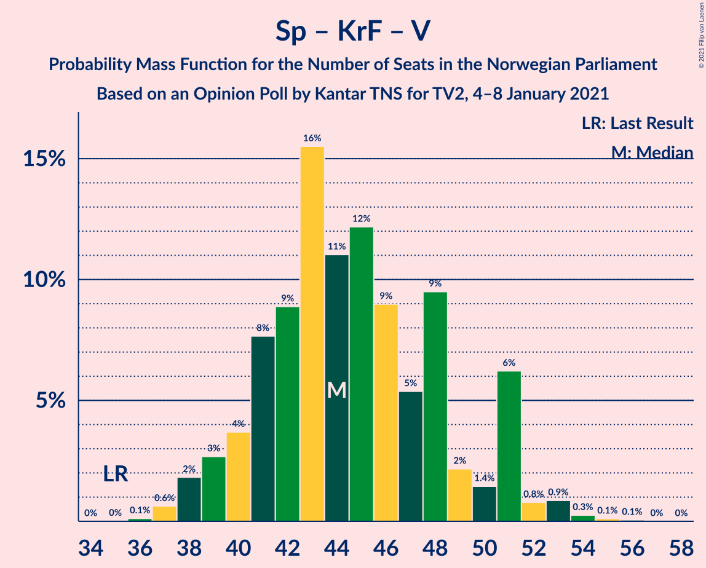

# Opinion Poll by Kantar TNS for TV2, 4–8 January 2021

<a href="#voting-intentions">Voting Intentions</a> | <a href="#seats">Seats</a> | <a href="#coalitions">Coalitions</a> | <a href="#technical-information">Technical Information</a>

## Voting Intentions

### Confidence Intervals

| Party | Last Result | Poll Result | 80% Confidence Interval | 90% Confidence Interval | 95% Confidence Interval | 99% Confidence Interval |
|:-----:|:-----------:|:-----------:|:-----------------------:|:-----------------------:|:-----------------------:|:-----------------------:|
| Høyre | 25.0% | 24.3% | 22.6–26.1% |22.1–26.6% |21.7–27.1% |20.9–28.0% |
| Arbeiderpartiet | 27.4% | 22.4% | 20.8–24.2% |20.3–24.7% |19.9–25.2% |19.2–26.0% |
| Senterpartiet | 10.3% | 21.7% | 20.1–23.5% |19.6–24.0% |19.2–24.4% |18.5–25.3% |
| Sosialistisk Venstreparti | 6.0% | 7.6% | 6.6–8.8% |6.3–9.1% |6.1–9.4% |5.6–10.0% |
| Fremskrittspartiet | 15.2% | 7.4% | 6.4–8.6% |6.1–8.9% |5.9–9.2% |5.5–9.8% |
| Rødt | 2.4% | 5.3% | 4.5–6.4% |4.3–6.7% |4.1–6.9% |3.7–7.5% |
| Miljøpartiet De Grønne | 3.2% | 3.4% | 2.7–4.3% |2.6–4.5% |2.4–4.7% |2.1–5.2% |
| Kristelig Folkeparti | 4.2% | 3.3% | 2.7–4.1% |2.5–4.4% |2.3–4.6% |2.1–5.0% |
| Venstre | 4.4% | 2.3% | 1.8–3.0% |1.6–3.2% |1.5–3.4% |1.3–3.8% |

*Note:* The poll result column reflects the actual value used in the calculations. Published results may vary slightly, and in addition be rounded to fewer digits.

## Seats

### Confidence Intervals

| Party | Last Result | Median | 80% Confidence Interval | 90% Confidence Interval | 95% Confidence Interval | 99% Confidence Interval |
|:-----:|:-----------:|:------:|:-----------------------:|:-----------------------:|:-----------------------:|:-----------------------:|
| <a href="#høyre">Høyre</a> | 45 | 43 | 42–46 |40–47 |39–48 |38–49 |
| <a href="#arbeiderpartiet">Arbeiderpartiet</a> | 49 | 41 | 38–44 |36–44 |36–46 |35–47 |
| <a href="#senterpartiet">Senterpartiet</a> | 19 | 41 | 37–42 |36–43 |36–43 |35–46 |
| <a href="#sosialistisk-venstreparti">Sosialistisk Venstreparti</a> | 11 | 14 | 12–16 |11–16 |11–16 |10–18 |
| <a href="#fremskrittspartiet">Fremskrittspartiet</a> | 27 | 14 | 11–15 |11–16 |11–16 |9–17 |
| <a href="#rødt">Rødt</a> | 1 | 9 | 8–11 |8–11 |8–12 |2–13 |
| <a href="#miljøpartiet-de-grønne">Miljøpartiet De Grønne</a> | 1 | 3 | 1–7 |1–7 |1–8 |1–9 |
| <a href="#kristelig-folkeparti">Kristelig Folkeparti</a> | 8 | 2 | 1–7 |1–7 |1–7 |0–8 |
| <a href="#venstre">Venstre</a> | 8 | 1 | 0–2 |0–2 |0–2 |0–2 |

### Høyre

*For a full overview of the results for this party, see the [Høyre](party-høyre.html) page.*

| Number of Seats | Probability | Accumulated | Special Marks |
|:---------------:|:-----------:|:-----------:|:-------------:|
| 36 | 0% | 100% |  |
| 37 | 0.2% | 99.9% |  |
| 38 | 2% | 99.8% |  |
| 39 | 0.6% | 98% |  |
| 40 | 3% | 97% |  |
| 41 | 1.3% | 95% |  |
| 42 | 35% | 93% |  |
| 43 | 16% | 58% | Median |
| 44 | 14% | 42% |  |
| 45 | 10% | 28% | Last Result |
| 46 | 9% | 18% |  |
| 47 | 6% | 10% |  |
| 48 | 3% | 3% |  |
| 49 | 0.3% | 0.7% |  |
| 50 | 0.2% | 0.5% |  |
| 51 | 0.1% | 0.3% |  |
| 52 | 0% | 0.2% |  |
| 53 | 0% | 0.1% |  |
| 54 | 0% | 0.1% |  |
| 55 | 0.1% | 0.1% |  |
| 56 | 0% | 0% |  |

### Arbeiderpartiet

*For a full overview of the results for this party, see the [Arbeiderpartiet](party-arbeiderpartiet.html) page.*

| Number of Seats | Probability | Accumulated | Special Marks |
|:---------------:|:-----------:|:-----------:|:-------------:|
| 33 | 0.1% | 100% |  |
| 34 | 0.1% | 99.9% |  |
| 35 | 0.7% | 99.8% |  |
| 36 | 6% | 99.1% |  |
| 37 | 1.4% | 93% |  |
| 38 | 2% | 92% |  |
| 39 | 4% | 90% |  |
| 40 | 21% | 86% |  |
| 41 | 23% | 65% | Median |
| 42 | 5% | 42% |  |
| 43 | 24% | 38% |  |
| 44 | 9% | 13% |  |
| 45 | 2% | 5% |  |
| 46 | 0.3% | 3% |  |
| 47 | 2% | 2% |  |
| 48 | 0.2% | 0.4% |  |
| 49 | 0.1% | 0.2% | Last Result |
| 50 | 0.1% | 0.1% |  |
| 51 | 0% | 0% |  |

### Senterpartiet

*For a full overview of the results for this party, see the [Senterpartiet](party-senterpartiet.html) page.*

| Number of Seats | Probability | Accumulated | Special Marks |
|:---------------:|:-----------:|:-----------:|:-------------:|
| 19 | 0% | 100% | Last Result |
| 20 | 0% | 100% |  |
| 21 | 0% | 100% |  |
| 22 | 0% | 100% |  |
| 23 | 0% | 100% |  |
| 24 | 0% | 100% |  |
| 25 | 0% | 100% |  |
| 26 | 0% | 100% |  |
| 27 | 0% | 100% |  |
| 28 | 0% | 100% |  |
| 29 | 0% | 100% |  |
| 30 | 0% | 100% |  |
| 31 | 0% | 100% |  |
| 32 | 0% | 100% |  |
| 33 | 0% | 100% |  |
| 34 | 0.2% | 100% |  |
| 35 | 1.3% | 99.7% |  |
| 36 | 5% | 98% |  |
| 37 | 7% | 93% |  |
| 38 | 8% | 86% |  |
| 39 | 9% | 78% |  |
| 40 | 14% | 69% |  |
| 41 | 23% | 54% | Median |
| 42 | 25% | 32% |  |
| 43 | 5% | 7% |  |
| 44 | 0.6% | 2% |  |
| 45 | 0.8% | 1.5% |  |
| 46 | 0.3% | 0.6% |  |
| 47 | 0.3% | 0.3% |  |
| 48 | 0% | 0.1% |  |
| 49 | 0.1% | 0.1% |  |
| 50 | 0% | 0% |  |

### Sosialistisk Venstreparti

*For a full overview of the results for this party, see the [Sosialistisk Venstreparti](party-sosialistiskvenstreparti.html) page.*

| Number of Seats | Probability | Accumulated | Special Marks |
|:---------------:|:-----------:|:-----------:|:-------------:|
| 9 | 0.1% | 100% |  |
| 10 | 2% | 99.9% |  |
| 11 | 3% | 98% | Last Result |
| 12 | 20% | 94% |  |
| 13 | 13% | 74% |  |
| 14 | 41% | 61% | Median |
| 15 | 9% | 20% |  |
| 16 | 9% | 10% |  |
| 17 | 0.8% | 2% |  |
| 18 | 0.4% | 0.8% |  |
| 19 | 0.4% | 0.4% |  |
| 20 | 0% | 0.1% |  |
| 21 | 0% | 0% |  |

### Fremskrittspartiet

*For a full overview of the results for this party, see the [Fremskrittspartiet](party-fremskrittspartiet.html) page.*

| Number of Seats | Probability | Accumulated | Special Marks |
|:---------------:|:-----------:|:-----------:|:-------------:|
| 9 | 0.7% | 100% |  |
| 10 | 0.8% | 99.3% |  |
| 11 | 10% | 98% |  |
| 12 | 6% | 88% |  |
| 13 | 23% | 83% |  |
| 14 | 40% | 60% | Median |
| 15 | 13% | 20% |  |
| 16 | 5% | 6% |  |
| 17 | 0.8% | 1.0% |  |
| 18 | 0.1% | 0.2% |  |
| 19 | 0% | 0.1% |  |
| 20 | 0% | 0% |  |
| 21 | 0% | 0% |  |
| 22 | 0% | 0% |  |
| 23 | 0% | 0% |  |
| 24 | 0% | 0% |  |
| 25 | 0% | 0% |  |
| 26 | 0% | 0% |  |
| 27 | 0% | 0% | Last Result |

### Rødt

*For a full overview of the results for this party, see the [Rødt](party-rødt.html) page.*

| Number of Seats | Probability | Accumulated | Special Marks |
|:---------------:|:-----------:|:-----------:|:-------------:|
| 1 | 0% | 100% | Last Result |
| 2 | 0.9% | 100% |  |
| 3 | 0% | 99.1% |  |
| 4 | 0% | 99.1% |  |
| 5 | 0% | 99.1% |  |
| 6 | 0% | 99.1% |  |
| 7 | 0.8% | 99.1% |  |
| 8 | 14% | 98% |  |
| 9 | 46% | 84% | Median |
| 10 | 15% | 38% |  |
| 11 | 19% | 23% |  |
| 12 | 3% | 4% |  |
| 13 | 0.9% | 1.1% |  |
| 14 | 0.2% | 0.2% |  |
| 15 | 0% | 0% |  |

### Miljøpartiet De Grønne

*For a full overview of the results for this party, see the [Miljøpartiet De Grønne](party-miljøpartietdegrønne.html) page.*

| Number of Seats | Probability | Accumulated | Special Marks |
|:---------------:|:-----------:|:-----------:|:-------------:|
| 1 | 32% | 100% | Last Result |
| 2 | 11% | 68% |  |
| 3 | 25% | 56% | Median |
| 4 | 0.3% | 32% |  |
| 5 | 0% | 31% |  |
| 6 | 0% | 31% |  |
| 7 | 28% | 31% |  |
| 8 | 3% | 3% |  |
| 9 | 0.1% | 0.5% |  |
| 10 | 0.4% | 0.4% |  |
| 11 | 0% | 0% |  |

### Kristelig Folkeparti

*For a full overview of the results for this party, see the [Kristelig Folkeparti](party-kristeligfolkeparti.html) page.*

| Number of Seats | Probability | Accumulated | Special Marks |
|:---------------:|:-----------:|:-----------:|:-------------:|
| 0 | 0.8% | 100% |  |
| 1 | 41% | 99.2% |  |
| 2 | 14% | 58% | Median |
| 3 | 32% | 44% |  |
| 4 | 0% | 13% |  |
| 5 | 0% | 13% |  |
| 6 | 0% | 13% |  |
| 7 | 11% | 13% |  |
| 8 | 1.4% | 2% | Last Result |
| 9 | 0.1% | 0.2% |  |
| 10 | 0.1% | 0.1% |  |
| 11 | 0% | 0% |  |

### Venstre

*For a full overview of the results for this party, see the [Venstre](party-venstre.html) page.*

| Number of Seats | Probability | Accumulated | Special Marks |
|:---------------:|:-----------:|:-----------:|:-------------:|
| 0 | 12% | 100% |  |
| 1 | 42% | 88% | Median |
| 2 | 46% | 46% |  |
| 3 | 0% | 0.1% |  |
| 4 | 0% | 0.1% |  |
| 5 | 0% | 0.1% |  |
| 6 | 0% | 0.1% |  |
| 7 | 0.1% | 0.1% |  |
| 8 | 0% | 0% | Last Result |

## Coalitions

### Confidence Intervals

| Coalition | Last Result | Median | Majority? | 80% Confidence Interval | 90% Confidence Interval | 95% Confidence Interval | 99% Confidence Interval |
|:---------:|:-----------:|:------:|:---------:|:-----------------------:|:-----------------------:|:-----------------------:|:-----------------------:|
| Arbeiderpartiet – Senterpartiet – Sosialistisk Venstreparti – Rødt – Miljøpartiet De Grønne | 81 | 108 | 100% | 105–111 | 103–111 | 102–112 | 100–114 |
| Arbeiderpartiet – Senterpartiet – Sosialistisk Venstreparti – Rødt | 80 | 105 | 100% | 99–108 | 98–108 | 98–109 | 97–111 |
| Arbeiderpartiet – Senterpartiet – Sosialistisk Venstreparti – Miljøpartiet De Grønne – Kristelig Folkeparti | 88 | 102 | 100% | 97–104 | 96–105 | 95–108 | 94–110 |
| Høyre – Senterpartiet – Fremskrittspartiet – Kristelig Folkeparti – Venstre | 107 | 101 | 100% | 99–104 | 97–105 | 95–106 | 94–109 |
| Arbeiderpartiet – Senterpartiet – Sosialistisk Venstreparti – Miljøpartiet De Grønne | 80 | 99 | 100% | 95–102 | 94–102 | 92–103 | 91–105 |
| Arbeiderpartiet – Senterpartiet – Sosialistisk Venstreparti | 79 | 96 | 100% | 89–99 | 89–99 | 89–100 | 88–101 |
| Arbeiderpartiet – Senterpartiet – Miljøpartiet De Grønne – Kristelig Folkeparti | 77 | 89 | 74% | 83–91 | 82–92 | 81–94 | 79–97 |
| Arbeiderpartiet – Senterpartiet – Kristelig Folkeparti | 76 | 84 | 49% | 80–87 | 77–88 | 76–90 | 76–92 |
| Arbeiderpartiet – Senterpartiet | 68 | 82 | 27% | 77–85 | 75–85 | 75–87 | 74–88 |
| Høyre – Fremskrittspartiet – Miljøpartiet De Grønne – Kristelig Folkeparti – Venstre | 89 | 64 | 0% | 61–70 | 61–71 | 60–71 | 58–72 |
| Høyre – Fremskrittspartiet – Kristelig Folkeparti – Venstre | 88 | 61 | 0% | 58–64 | 58–66 | 57–67 | 55–69 |
| Høyre – Fremskrittspartiet – Venstre | 80 | 58 | 0% | 56–63 | 55–63 | 53–63 | 51–65 |
| Høyre – Fremskrittspartiet | 72 | 56 | 0% | 55–61 | 53–61 | 51–63 | 49–64 |
| Arbeiderpartiet – Sosialistisk Venstreparti | 60 | 55 | 0% | 52–57 | 50–59 | 50–60 | 48–61 |
| Høyre – Kristelig Folkeparti – Venstre | 61 | 47 | 0% | 44–52 | 44–52 | 44–52 | 43–55 |
| Senterpartiet – Kristelig Folkeparti – Venstre | 35 | 44 | 0% | 41–46 | 39–48 | 39–51 | 38–52 |

### Arbeiderpartiet – Senterpartiet – Sosialistisk Venstreparti – Rødt – Miljøpartiet De Grønne

| Number of Seats | Probability | Accumulated | Special Marks |
|:---------------:|:-----------:|:-----------:|:-------------:|
| 81 | 0% | 100% | Last Result |
| 82 | 0% | 100% |  |
| 83 | 0% | 100% |  |
| 84 | 0% | 100% |  |
| 85 | 0% | 100% | Majority |
| 86 | 0% | 100% |  |
| 87 | 0% | 100% |  |
| 88 | 0% | 100% |  |
| 89 | 0% | 100% |  |
| 90 | 0% | 100% |  |
| 91 | 0% | 100% |  |
| 92 | 0% | 100% |  |
| 93 | 0% | 100% |  |
| 94 | 0% | 100% |  |
| 95 | 0% | 100% |  |
| 96 | 0.1% | 100% |  |
| 97 | 0% | 99.9% |  |
| 98 | 0.3% | 99.9% |  |
| 99 | 0.1% | 99.7% |  |
| 100 | 0.2% | 99.6% |  |
| 101 | 0.2% | 99.4% |  |
| 102 | 2% | 99.3% |  |
| 103 | 4% | 97% |  |
| 104 | 0.9% | 94% |  |
| 105 | 11% | 93% |  |
| 106 | 14% | 81% |  |
| 107 | 4% | 67% |  |
| 108 | 17% | 63% | Median |
| 109 | 11% | 46% |  |
| 110 | 5% | 34% |  |
| 111 | 26% | 29% |  |
| 112 | 2% | 4% |  |
| 113 | 0.8% | 2% |  |
| 114 | 0.9% | 1.1% |  |
| 115 | 0.1% | 0.2% |  |
| 116 | 0% | 0.2% |  |
| 117 | 0.1% | 0.1% |  |
| 118 | 0% | 0% |  |

### Arbeiderpartiet – Senterpartiet – Sosialistisk Venstreparti – Rødt

| Number of Seats | Probability | Accumulated | Special Marks |
|:---------------:|:-----------:|:-----------:|:-------------:|
| 80 | 0% | 100% | Last Result |
| 81 | 0% | 100% |  |
| 82 | 0% | 100% |  |
| 83 | 0% | 100% |  |
| 84 | 0% | 100% |  |
| 85 | 0% | 100% | Majority |
| 86 | 0% | 100% |  |
| 87 | 0% | 100% |  |
| 88 | 0% | 100% |  |
| 89 | 0% | 100% |  |
| 90 | 0% | 100% |  |
| 91 | 0% | 100% |  |
| 92 | 0% | 100% |  |
| 93 | 0% | 100% |  |
| 94 | 0% | 99.9% |  |
| 95 | 0.1% | 99.9% |  |
| 96 | 0.2% | 99.8% |  |
| 97 | 0.6% | 99.6% |  |
| 98 | 5% | 99.1% |  |
| 99 | 7% | 94% |  |
| 100 | 2% | 86% |  |
| 101 | 2% | 85% |  |
| 102 | 14% | 83% |  |
| 103 | 4% | 68% |  |
| 104 | 8% | 64% |  |
| 105 | 9% | 56% | Median |
| 106 | 9% | 47% |  |
| 107 | 11% | 38% |  |
| 108 | 23% | 28% |  |
| 109 | 2% | 4% |  |
| 110 | 1.1% | 2% |  |
| 111 | 0.3% | 0.8% |  |
| 112 | 0.3% | 0.4% |  |
| 113 | 0.1% | 0.1% |  |
| 114 | 0% | 0% |  |

### Arbeiderpartiet – Senterpartiet – Sosialistisk Venstreparti – Miljøpartiet De Grønne – Kristelig Folkeparti

| Number of Seats | Probability | Accumulated | Special Marks |
|:---------------:|:-----------:|:-----------:|:-------------:|
| 88 | 0% | 100% | Last Result |
| 89 | 0% | 100% |  |
| 90 | 0% | 100% |  |
| 91 | 0% | 99.9% |  |
| 92 | 0.2% | 99.9% |  |
| 93 | 0.2% | 99.7% |  |
| 94 | 0.4% | 99.6% |  |
| 95 | 4% | 99.2% |  |
| 96 | 2% | 95% |  |
| 97 | 8% | 93% |  |
| 98 | 5% | 85% |  |
| 99 | 2% | 80% |  |
| 100 | 18% | 78% |  |
| 101 | 6% | 60% | Median |
| 102 | 12% | 54% |  |
| 103 | 31% | 42% |  |
| 104 | 2% | 11% |  |
| 105 | 3% | 8% |  |
| 106 | 1.5% | 5% |  |
| 107 | 0.6% | 4% |  |
| 108 | 2% | 3% |  |
| 109 | 0.1% | 1.4% |  |
| 110 | 1.2% | 1.3% |  |
| 111 | 0% | 0.1% |  |
| 112 | 0% | 0% |  |

### Høyre – Senterpartiet – Fremskrittspartiet – Kristelig Folkeparti – Venstre

| Number of Seats | Probability | Accumulated | Special Marks |
|:---------------:|:-----------:|:-----------:|:-------------:|
| 91 | 0.1% | 100% |  |
| 92 | 0% | 99.9% |  |
| 93 | 0.3% | 99.9% |  |
| 94 | 0.2% | 99.6% |  |
| 95 | 2% | 99.4% |  |
| 96 | 1.1% | 97% |  |
| 97 | 2% | 96% |  |
| 98 | 2% | 95% |  |
| 99 | 5% | 93% |  |
| 100 | 33% | 88% |  |
| 101 | 16% | 55% | Median |
| 102 | 16% | 39% |  |
| 103 | 11% | 23% |  |
| 104 | 4% | 11% |  |
| 105 | 3% | 7% |  |
| 106 | 3% | 4% |  |
| 107 | 0.3% | 1.1% | Last Result |
| 108 | 0.3% | 0.8% |  |
| 109 | 0.2% | 0.5% |  |
| 110 | 0% | 0.3% |  |
| 111 | 0.1% | 0.2% |  |
| 112 | 0.1% | 0.1% |  |
| 113 | 0% | 0.1% |  |
| 114 | 0% | 0% |  |

### Arbeiderpartiet – Senterpartiet – Sosialistisk Venstreparti – Miljøpartiet De Grønne

| Number of Seats | Probability | Accumulated | Special Marks |
|:---------------:|:-----------:|:-----------:|:-------------:|
| 80 | 0% | 100% | Last Result |
| 81 | 0% | 100% |  |
| 82 | 0% | 100% |  |
| 83 | 0% | 100% |  |
| 84 | 0% | 100% |  |
| 85 | 0% | 100% | Majority |
| 86 | 0% | 100% |  |
| 87 | 0% | 100% |  |
| 88 | 0% | 100% |  |
| 89 | 0.1% | 100% |  |
| 90 | 0.2% | 99.9% |  |
| 91 | 1.0% | 99.7% |  |
| 92 | 1.4% | 98.6% |  |
| 93 | 0.4% | 97% |  |
| 94 | 5% | 97% |  |
| 95 | 6% | 92% |  |
| 96 | 14% | 86% |  |
| 97 | 13% | 71% |  |
| 98 | 7% | 58% |  |
| 99 | 7% | 52% | Median |
| 100 | 13% | 45% |  |
| 101 | 3% | 31% |  |
| 102 | 24% | 28% |  |
| 103 | 2% | 4% |  |
| 104 | 1.2% | 2% |  |
| 105 | 0.8% | 1.3% |  |
| 106 | 0.3% | 0.4% |  |
| 107 | 0.1% | 0.2% |  |
| 108 | 0% | 0.1% |  |
| 109 | 0% | 0% |  |

### Arbeiderpartiet – Senterpartiet – Sosialistisk Venstreparti

| Number of Seats | Probability | Accumulated | Special Marks |
|:---------------:|:-----------:|:-----------:|:-------------:|
| 79 | 0% | 100% | Last Result |
| 80 | 0% | 100% |  |
| 81 | 0% | 100% |  |
| 82 | 0% | 100% |  |
| 83 | 0% | 100% |  |
| 84 | 0% | 100% |  |
| 85 | 0% | 100% | Majority |
| 86 | 0% | 100% |  |
| 87 | 0.2% | 99.9% |  |
| 88 | 0.5% | 99.7% |  |
| 89 | 12% | 99.2% |  |
| 90 | 0.6% | 87% |  |
| 91 | 3% | 86% |  |
| 92 | 4% | 83% |  |
| 93 | 17% | 80% |  |
| 94 | 7% | 63% |  |
| 95 | 2% | 56% |  |
| 96 | 14% | 54% | Median |
| 97 | 11% | 40% |  |
| 98 | 3% | 29% |  |
| 99 | 24% | 26% |  |
| 100 | 0.7% | 3% |  |
| 101 | 2% | 2% |  |
| 102 | 0.1% | 0.4% |  |
| 103 | 0.2% | 0.3% |  |
| 104 | 0.1% | 0.2% |  |
| 105 | 0% | 0% |  |

### Arbeiderpartiet – Senterpartiet – Miljøpartiet De Grønne – Kristelig Folkeparti

| Number of Seats | Probability | Accumulated | Special Marks |
|:---------------:|:-----------:|:-----------:|:-------------:|
| 77 | 0.1% | 100% | Last Result |
| 78 | 0% | 99.8% |  |
| 79 | 0.4% | 99.8% |  |
| 80 | 1.0% | 99.4% |  |
| 81 | 0.9% | 98% |  |
| 82 | 3% | 97% |  |
| 83 | 10% | 95% |  |
| 84 | 11% | 85% |  |
| 85 | 1.3% | 74% | Majority |
| 86 | 12% | 72% |  |
| 87 | 3% | 61% | Median |
| 88 | 6% | 58% |  |
| 89 | 23% | 52% |  |
| 90 | 12% | 29% |  |
| 91 | 10% | 17% |  |
| 92 | 3% | 7% |  |
| 93 | 1.0% | 5% |  |
| 94 | 1.2% | 4% |  |
| 95 | 2% | 2% |  |
| 96 | 0.3% | 0.9% |  |
| 97 | 0.4% | 0.6% |  |
| 98 | 0.1% | 0.1% |  |
| 99 | 0% | 0.1% |  |
| 100 | 0% | 0% |  |

### Arbeiderpartiet – Senterpartiet – Kristelig Folkeparti

| Number of Seats | Probability | Accumulated | Special Marks |
|:---------------:|:-----------:|:-----------:|:-------------:|
| 75 | 0.2% | 100% |  |
| 76 | 5% | 99.8% | Last Result |
| 77 | 0.5% | 95% |  |
| 78 | 0.6% | 95% |  |
| 79 | 2% | 94% |  |
| 80 | 3% | 92% |  |
| 81 | 2% | 89% |  |
| 82 | 10% | 87% |  |
| 83 | 19% | 78% |  |
| 84 | 9% | 58% | Median |
| 85 | 12% | 49% | Majority |
| 86 | 25% | 37% |  |
| 87 | 7% | 13% |  |
| 88 | 2% | 6% |  |
| 89 | 0.2% | 4% |  |
| 90 | 3% | 4% |  |
| 91 | 0.5% | 1.3% |  |
| 92 | 0.6% | 0.8% |  |
| 93 | 0.1% | 0.2% |  |
| 94 | 0.1% | 0.1% |  |
| 95 | 0% | 0% |  |

### Arbeiderpartiet – Senterpartiet

| Number of Seats | Probability | Accumulated | Special Marks |
|:---------------:|:-----------:|:-----------:|:-------------:|
| 68 | 0% | 100% | Last Result |
| 69 | 0% | 100% |  |
| 70 | 0% | 100% |  |
| 71 | 0% | 100% |  |
| 72 | 0% | 100% |  |
| 73 | 0.1% | 99.9% |  |
| 74 | 1.4% | 99.9% |  |
| 75 | 5% | 98% |  |
| 76 | 0.9% | 93% |  |
| 77 | 8% | 92% |  |
| 78 | 2% | 84% |  |
| 79 | 7% | 82% |  |
| 80 | 7% | 75% |  |
| 81 | 17% | 68% |  |
| 82 | 13% | 50% | Median |
| 83 | 4% | 37% |  |
| 84 | 6% | 33% |  |
| 85 | 24% | 27% | Majority |
| 86 | 0.8% | 3% |  |
| 87 | 2% | 3% |  |
| 88 | 0.2% | 0.5% |  |
| 89 | 0.1% | 0.3% |  |
| 90 | 0.1% | 0.2% |  |
| 91 | 0.1% | 0.1% |  |
| 92 | 0% | 0% |  |

### Høyre – Fremskrittspartiet – Miljøpartiet De Grønne – Kristelig Folkeparti – Venstre

| Number of Seats | Probability | Accumulated | Special Marks |
|:---------------:|:-----------:|:-----------:|:-------------:|
| 56 | 0.1% | 100% |  |
| 57 | 0.3% | 99.9% |  |
| 58 | 0.4% | 99.6% |  |
| 59 | 1.1% | 99.2% |  |
| 60 | 2% | 98% |  |
| 61 | 24% | 96% |  |
| 62 | 11% | 72% |  |
| 63 | 9% | 61% | Median |
| 64 | 9% | 53% |  |
| 65 | 8% | 44% |  |
| 66 | 4% | 36% |  |
| 67 | 14% | 32% |  |
| 68 | 2% | 17% |  |
| 69 | 2% | 15% |  |
| 70 | 7% | 13% |  |
| 71 | 5% | 6% |  |
| 72 | 0.5% | 0.9% |  |
| 73 | 0.2% | 0.4% |  |
| 74 | 0.1% | 0.2% |  |
| 75 | 0% | 0.1% |  |
| 76 | 0% | 0.1% |  |
| 77 | 0% | 0% |  |
| 78 | 0% | 0% |  |
| 79 | 0% | 0% |  |
| 80 | 0% | 0% |  |
| 81 | 0% | 0% |  |
| 82 | 0% | 0% |  |
| 83 | 0% | 0% |  |
| 84 | 0% | 0% |  |
| 85 | 0% | 0% | Majority |
| 86 | 0% | 0% |  |
| 87 | 0% | 0% |  |
| 88 | 0% | 0% |  |
| 89 | 0% | 0% | Last Result |

### Høyre – Fremskrittspartiet – Kristelig Folkeparti – Venstre

| Number of Seats | Probability | Accumulated | Special Marks |
|:---------------:|:-----------:|:-----------:|:-------------:|
| 52 | 0.1% | 100% |  |
| 53 | 0% | 99.9% |  |
| 54 | 0.1% | 99.8% |  |
| 55 | 0.9% | 99.8% |  |
| 56 | 0.9% | 98.9% |  |
| 57 | 2% | 98% |  |
| 58 | 26% | 96% |  |
| 59 | 5% | 71% |  |
| 60 | 11% | 66% | Median |
| 61 | 17% | 54% |  |
| 62 | 4% | 37% |  |
| 63 | 14% | 33% |  |
| 64 | 11% | 18% |  |
| 65 | 0.9% | 7% |  |
| 66 | 4% | 6% |  |
| 67 | 2% | 3% |  |
| 68 | 0.2% | 0.7% |  |
| 69 | 0.1% | 0.5% |  |
| 70 | 0% | 0.4% |  |
| 71 | 0.3% | 0.3% |  |
| 72 | 0% | 0.1% |  |
| 73 | 0.1% | 0.1% |  |
| 74 | 0% | 0% |  |
| 75 | 0% | 0% |  |
| 76 | 0% | 0% |  |
| 77 | 0% | 0% |  |
| 78 | 0% | 0% |  |
| 79 | 0% | 0% |  |
| 80 | 0% | 0% |  |
| 81 | 0% | 0% |  |
| 82 | 0% | 0% |  |
| 83 | 0% | 0% |  |
| 84 | 0% | 0% |  |
| 85 | 0% | 0% | Majority |
| 86 | 0% | 0% |  |
| 87 | 0% | 0% |  |
| 88 | 0% | 0% | Last Result |

### Høyre – Fremskrittspartiet – Venstre

| Number of Seats | Probability | Accumulated | Special Marks |
|:---------------:|:-----------:|:-----------:|:-------------:|
| 50 | 0.1% | 100% |  |
| 51 | 1.3% | 99.8% |  |
| 52 | 0.9% | 98.6% |  |
| 53 | 2% | 98% |  |
| 54 | 0.9% | 96% |  |
| 55 | 2% | 95% |  |
| 56 | 13% | 93% |  |
| 57 | 23% | 80% |  |
| 58 | 20% | 57% | Median |
| 59 | 6% | 37% |  |
| 60 | 13% | 32% |  |
| 61 | 3% | 18% |  |
| 62 | 1.3% | 15% |  |
| 63 | 12% | 13% |  |
| 64 | 1.3% | 2% |  |
| 65 | 0.2% | 0.6% |  |
| 66 | 0.1% | 0.4% |  |
| 67 | 0.1% | 0.3% |  |
| 68 | 0.1% | 0.2% |  |
| 69 | 0.1% | 0.1% |  |
| 70 | 0% | 0% |  |
| 71 | 0% | 0% |  |
| 72 | 0% | 0% |  |
| 73 | 0% | 0% |  |
| 74 | 0% | 0% |  |
| 75 | 0% | 0% |  |
| 76 | 0% | 0% |  |
| 77 | 0% | 0% |  |
| 78 | 0% | 0% |  |
| 79 | 0% | 0% |  |
| 80 | 0% | 0% | Last Result |

### Høyre – Fremskrittspartiet

| Number of Seats | Probability | Accumulated | Special Marks |
|:---------------:|:-----------:|:-----------:|:-------------:|
| 48 | 0.1% | 100% |  |
| 49 | 0.5% | 99.9% |  |
| 50 | 2% | 99.4% |  |
| 51 | 0.9% | 98% |  |
| 52 | 1.1% | 97% |  |
| 53 | 1.4% | 96% |  |
| 54 | 3% | 94% |  |
| 55 | 11% | 92% |  |
| 56 | 43% | 81% |  |
| 57 | 4% | 38% | Median |
| 58 | 9% | 35% |  |
| 59 | 4% | 26% |  |
| 60 | 8% | 22% |  |
| 61 | 10% | 14% |  |
| 62 | 1.3% | 4% |  |
| 63 | 3% | 3% |  |
| 64 | 0.1% | 0.5% |  |
| 65 | 0.1% | 0.4% |  |
| 66 | 0.2% | 0.3% |  |
| 67 | 0% | 0.1% |  |
| 68 | 0.1% | 0.1% |  |
| 69 | 0% | 0% |  |
| 70 | 0% | 0% |  |
| 71 | 0% | 0% |  |
| 72 | 0% | 0% | Last Result |

### Arbeiderpartiet – Sosialistisk Venstreparti

| Number of Seats | Probability | Accumulated | Special Marks |
|:---------------:|:-----------:|:-----------:|:-------------:|
| 45 | 0.1% | 100% |  |
| 46 | 0.1% | 99.9% |  |
| 47 | 0.1% | 99.8% |  |
| 48 | 0.2% | 99.7% |  |
| 49 | 0.7% | 99.5% |  |
| 50 | 6% | 98.8% |  |
| 51 | 2% | 93% |  |
| 52 | 22% | 92% |  |
| 53 | 3% | 70% |  |
| 54 | 6% | 66% |  |
| 55 | 12% | 61% | Median |
| 56 | 8% | 49% |  |
| 57 | 32% | 41% |  |
| 58 | 4% | 9% |  |
| 59 | 2% | 5% |  |
| 60 | 1.1% | 3% | Last Result |
| 61 | 2% | 2% |  |
| 62 | 0.2% | 0.3% |  |
| 63 | 0.1% | 0.2% |  |
| 64 | 0% | 0.1% |  |
| 65 | 0% | 0% |  |

### Høyre – Kristelig Folkeparti – Venstre

| Number of Seats | Probability | Accumulated | Special Marks |
|:---------------:|:-----------:|:-----------:|:-------------:|
| 40 | 0.1% | 100% |  |
| 41 | 0.2% | 99.9% |  |
| 42 | 0.2% | 99.7% |  |
| 43 | 2% | 99.6% |  |
| 44 | 23% | 98% |  |
| 45 | 6% | 75% |  |
| 46 | 6% | 69% | Median |
| 47 | 23% | 62% |  |
| 48 | 4% | 39% |  |
| 49 | 11% | 35% |  |
| 50 | 9% | 24% |  |
| 51 | 2% | 15% |  |
| 52 | 11% | 13% |  |
| 53 | 0.3% | 2% |  |
| 54 | 1.1% | 2% |  |
| 55 | 0.3% | 0.6% |  |
| 56 | 0.1% | 0.3% |  |
| 57 | 0% | 0.2% |  |
| 58 | 0.1% | 0.2% |  |
| 59 | 0% | 0.1% |  |
| 60 | 0% | 0% |  |
| 61 | 0% | 0% | Last Result |

### Senterpartiet – Kristelig Folkeparti – Venstre

| Number of Seats | Probability | Accumulated | Special Marks |
|:---------------:|:-----------:|:-----------:|:-------------:|
| 35 | 0% | 100% | Last Result |
| 36 | 0% | 100% |  |
| 37 | 0.2% | 99.9% |  |
| 38 | 0.3% | 99.7% |  |
| 39 | 5% | 99.5% |  |
| 40 | 2% | 94% |  |
| 41 | 7% | 92% |  |
| 42 | 6% | 85% |  |
| 43 | 6% | 79% |  |
| 44 | 29% | 73% | Median |
| 45 | 23% | 43% |  |
| 46 | 14% | 21% |  |
| 47 | 1.1% | 7% |  |
| 48 | 2% | 6% |  |
| 49 | 0.9% | 4% |  |
| 50 | 0.4% | 3% |  |
| 51 | 2% | 3% |  |
| 52 | 0.6% | 0.9% |  |
| 53 | 0.1% | 0.3% |  |
| 54 | 0.2% | 0.2% |  |
| 55 | 0% | 0% |  |

## Technical Information

### Opinion Poll

+ **Polling firm:** Kantar TNS
+ **Commissioner(s):** TV2
+ **Fieldwork period:** 4–8 January 2021

### Calculations

+ **Sample size:** 976
+ **Simulations done:** 131,072
+ **Error estimate:** 1.94%

