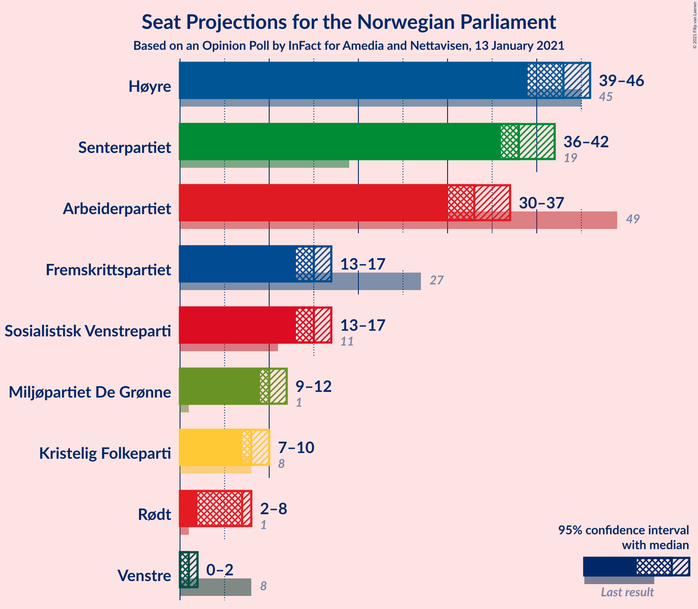
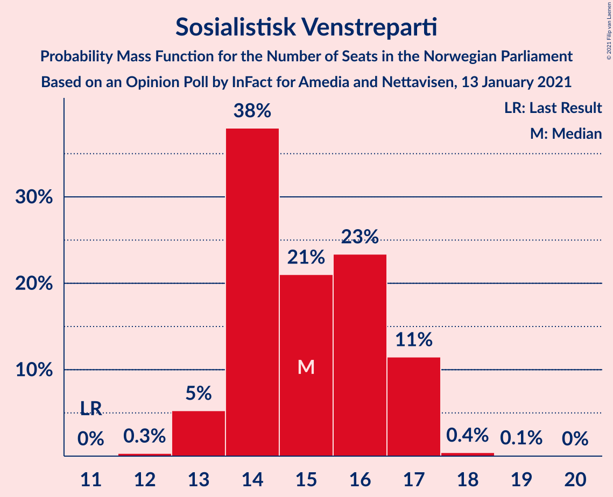
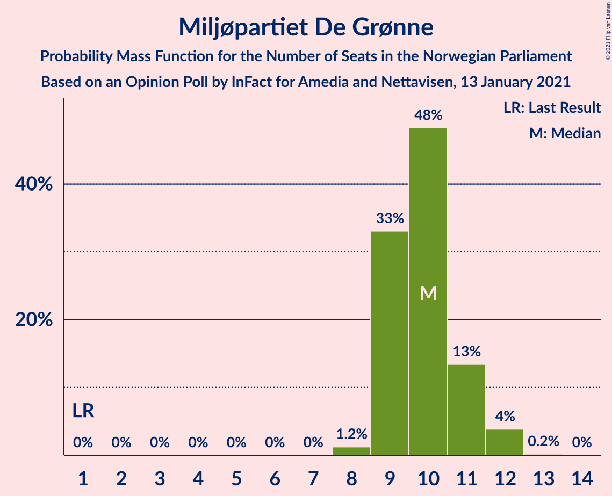
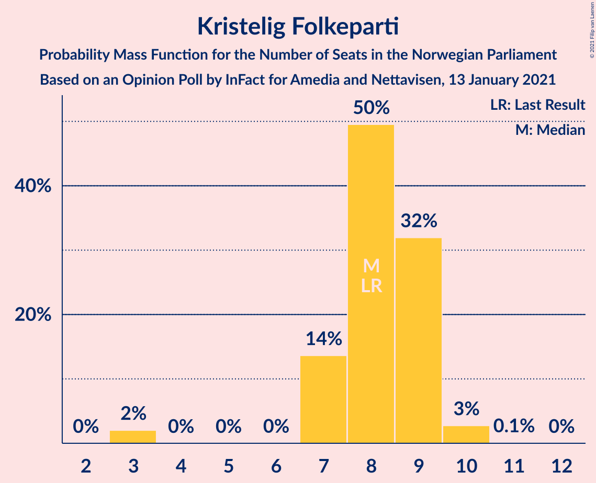
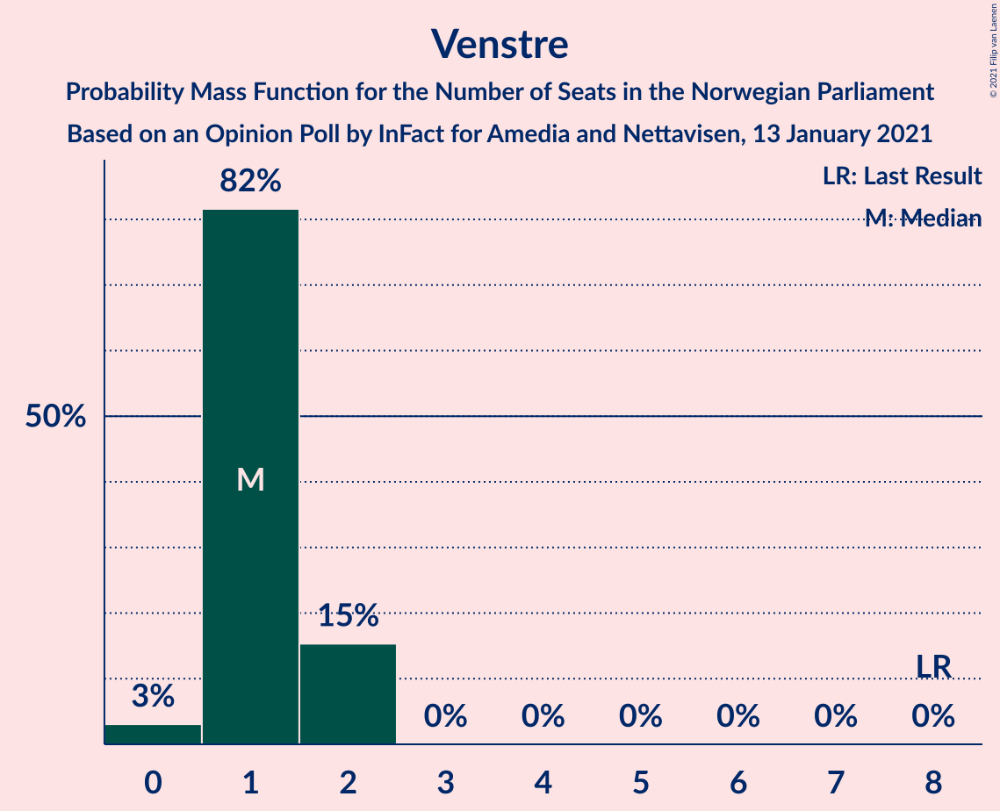
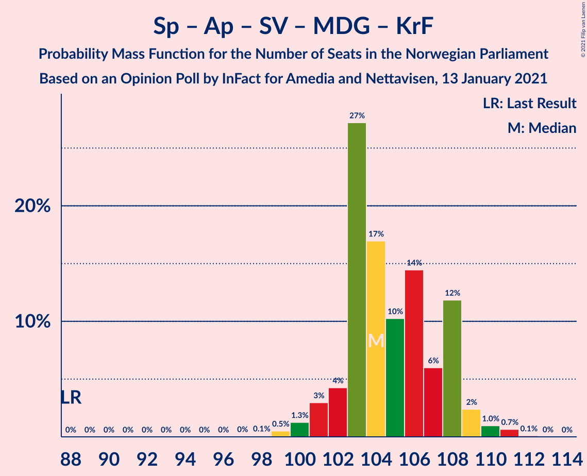
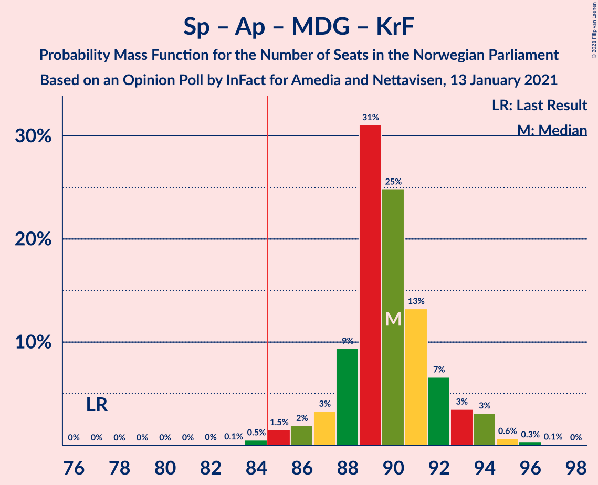
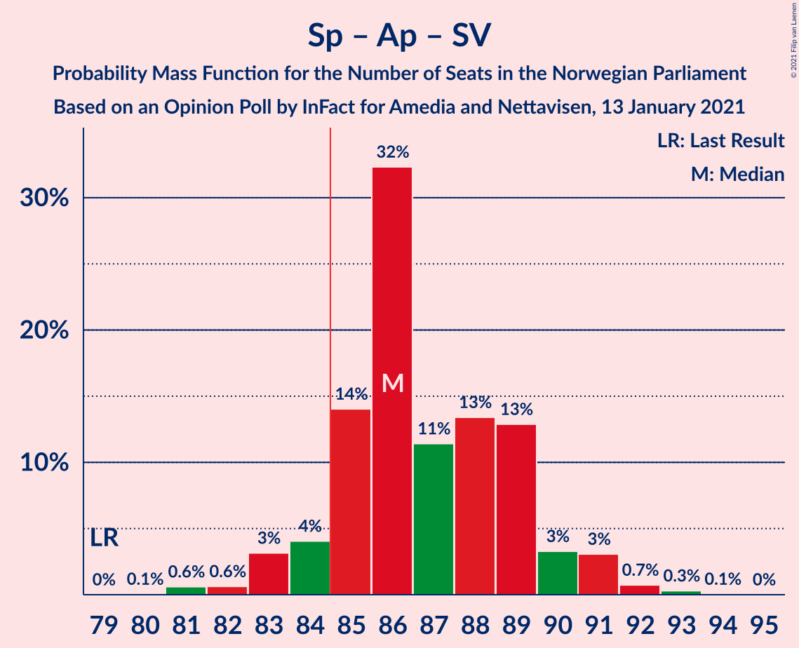
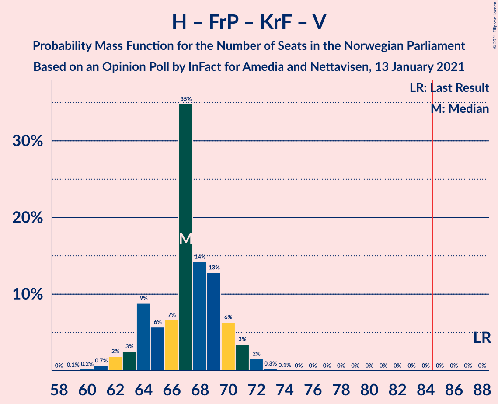

# Opinion Poll by InFact for Amedia and Nettavisen, 13 January 2021

<a href="#voting-intentions">Voting Intentions</a> | <a href="#seats">Seats</a> | <a href="#coalitions">Coalitions</a> | <a href="#technical-information">Technical Information</a>

## Voting Intentions

### Confidence Intervals

| Party | Last Result | Poll Result | 80% Confidence Interval | 90% Confidence Interval | 95% Confidence Interval | 99% Confidence Interval |
|:-----:|:-----------:|:-----------:|:-----------------------:|:-----------------------:|:-----------------------:|:-----------------------:|
| Høyre | 25.0% | 24.1% | 23.2–25.1% |22.9–25.4% |22.6–25.6% |22.2–26.1% |
| Senterpartiet | 10.3% | 20.5% | 19.6–21.4% |19.4–21.7% |19.1–21.9% |18.7–22.4% |
| Arbeiderpartiet | 27.4% | 18.4% | 17.5–19.3% |17.3–19.6% |17.1–19.8% |16.7–20.2% |
| Sosialistisk Venstreparti | 6.0% | 8.7% | 8.1–9.4% |7.9–9.6% |7.8–9.7% |7.5–10.0% |
| Fremskrittspartiet | 15.2% | 8.6% | 8.0–9.3% |7.8–9.4% |7.7–9.6% |7.4–10.0% |
| Miljøpartiet De Grønne | 3.2% | 5.8% | 5.3–6.4% |5.2–6.5% |5.0–6.7% |4.8–6.9% |
| Kristelig Folkeparti | 4.2% | 4.7% | 4.3–5.2% |4.1–5.4% |4.0–5.5% |3.8–5.8% |
| Rødt | 2.4% | 4.0% | 3.6–4.5% |3.5–4.6% |3.4–4.7% |3.2–5.0% |
| Venstre | 4.4% | 2.1% | 1.8–2.5% |1.7–2.6% |1.6–2.7% |1.5–2.8% |

*Note:* The poll result column reflects the actual value used in the calculations. Published results may vary slightly, and in addition be rounded to fewer digits.

## Seats

### Confidence Intervals

| Party | Last Result | Median | 80% Confidence Interval | 90% Confidence Interval | 95% Confidence Interval | 99% Confidence Interval |
|:-----:|:-----------:|:------:|:-----------------------:|:-----------------------:|:-----------------------:|:-----------------------:|
| <a href="#høyre">Høyre</a> | 45 | 43 | 39–46 |39–46 |39–46 |37–48 |
| <a href="#senterpartiet">Senterpartiet</a> | 19 | 38 | 36–42 |36–42 |36–43 |35–44 |
| <a href="#arbeiderpartiet">Arbeiderpartiet</a> | 49 | 33 | 31–36 |30–37 |30–37 |29–38 |
| <a href="#sosialistisk-venstreparti">Sosialistisk Venstreparti</a> | 11 | 15 | 14–17 |14–17 |13–17 |13–18 |
| <a href="#fremskrittspartiet">Fremskrittspartiet</a> | 27 | 14 | 12–16 |12–16 |12–17 |12–18 |
| <a href="#miljøpartiet-de-grønne">Miljøpartiet De Grønne</a> | 1 | 10 | 9–11 |9–11 |9–11 |8–12 |
| <a href="#kristelig-folkeparti">Kristelig Folkeparti</a> | 8 | 8 | 7–9 |7–10 |3–10 |3–10 |
| <a href="#rødt">Rødt</a> | 1 | 7 | 2–8 |2–8 |2–8 |2–9 |
| <a href="#venstre">Venstre</a> | 8 | 1 | 0–1 |0–2 |0–2 |0–2 |

### Høyre

*For a full overview of the results for this party, see the [Høyre](party-høyre.html) page.*

| Number of Seats | Probability | Accumulated | Special Marks |
|:---------------:|:-----------:|:-----------:|:-------------:|
| 36 | 0.3% | 100% |  |
| 37 | 0.3% | 99.7% |  |
| 38 | 0.3% | 99.4% |  |
| 39 | 10% | 99.2% |  |
| 40 | 8% | 89% |  |
| 41 | 14% | 82% |  |
| 42 | 15% | 68% |  |
| 43 | 28% | 53% | Median |
| 44 | 6% | 24% |  |
| 45 | 5% | 18% | Last Result |
| 46 | 11% | 13% |  |
| 47 | 1.3% | 2% |  |
| 48 | 0.6% | 0.7% |  |
| 49 | 0.1% | 0.1% |  |
| 50 | 0% | 0% |  |

### Senterpartiet

*For a full overview of the results for this party, see the [Senterpartiet](party-senterpartiet.html) page.*

| Number of Seats | Probability | Accumulated | Special Marks |
|:---------------:|:-----------:|:-----------:|:-------------:|
| 19 | 0% | 100% | Last Result |
| 20 | 0% | 100% |  |
| 21 | 0% | 100% |  |
| 22 | 0% | 100% |  |
| 23 | 0% | 100% |  |
| 24 | 0% | 100% |  |
| 25 | 0% | 100% |  |
| 26 | 0% | 100% |  |
| 27 | 0% | 100% |  |
| 28 | 0% | 100% |  |
| 29 | 0% | 100% |  |
| 30 | 0% | 100% |  |
| 31 | 0% | 100% |  |
| 32 | 0% | 100% |  |
| 33 | 0% | 100% |  |
| 34 | 0% | 100% |  |
| 35 | 2% | 100% |  |
| 36 | 11% | 98% |  |
| 37 | 20% | 87% |  |
| 38 | 17% | 66% | Median |
| 39 | 13% | 50% |  |
| 40 | 11% | 36% |  |
| 41 | 14% | 25% |  |
| 42 | 7% | 12% |  |
| 43 | 3% | 5% |  |
| 44 | 2% | 2% |  |
| 45 | 0.3% | 0.3% |  |
| 46 | 0% | 0% |  |

### Arbeiderpartiet

*For a full overview of the results for this party, see the [Arbeiderpartiet](party-arbeiderpartiet.html) page.*

| Number of Seats | Probability | Accumulated | Special Marks |
|:---------------:|:-----------:|:-----------:|:-------------:|
| 28 | 0.3% | 100% |  |
| 29 | 1.0% | 99.7% |  |
| 30 | 6% | 98.8% |  |
| 31 | 6% | 92% |  |
| 32 | 23% | 86% |  |
| 33 | 18% | 63% | Median |
| 34 | 17% | 44% |  |
| 35 | 14% | 27% |  |
| 36 | 7% | 13% |  |
| 37 | 4% | 6% |  |
| 38 | 1.5% | 2% |  |
| 39 | 0.2% | 0.5% |  |
| 40 | 0.3% | 0.3% |  |
| 41 | 0.1% | 0.1% |  |
| 42 | 0% | 0% |  |
| 43 | 0% | 0% |  |
| 44 | 0% | 0% |  |
| 45 | 0% | 0% |  |
| 46 | 0% | 0% |  |
| 47 | 0% | 0% |  |
| 48 | 0% | 0% |  |
| 49 | 0% | 0% | Last Result |

### Sosialistisk Venstreparti

*For a full overview of the results for this party, see the [Sosialistisk Venstreparti](party-sosialistiskvenstreparti.html) page.*

| Number of Seats | Probability | Accumulated | Special Marks |
|:---------------:|:-----------:|:-----------:|:-------------:|
| 11 | 0% | 100% | Last Result |
| 12 | 0.2% | 100% |  |
| 13 | 3% | 99.8% |  |
| 14 | 9% | 97% |  |
| 15 | 44% | 88% | Median |
| 16 | 27% | 44% |  |
| 17 | 16% | 18% |  |
| 18 | 2% | 2% |  |
| 19 | 0.4% | 0.4% |  |
| 20 | 0% | 0% |  |

### Fremskrittspartiet

*For a full overview of the results for this party, see the [Fremskrittspartiet](party-fremskrittspartiet.html) page.*

| Number of Seats | Probability | Accumulated | Special Marks |
|:---------------:|:-----------:|:-----------:|:-------------:|
| 11 | 0.1% | 100% |  |
| 12 | 12% | 99.9% |  |
| 13 | 6% | 88% |  |
| 14 | 34% | 82% | Median |
| 15 | 23% | 48% |  |
| 16 | 20% | 24% |  |
| 17 | 3% | 4% |  |
| 18 | 0.8% | 0.8% |  |
| 19 | 0% | 0% |  |
| 20 | 0% | 0% |  |
| 21 | 0% | 0% |  |
| 22 | 0% | 0% |  |
| 23 | 0% | 0% |  |
| 24 | 0% | 0% |  |
| 25 | 0% | 0% |  |
| 26 | 0% | 0% |  |
| 27 | 0% | 0% | Last Result |

### Miljøpartiet De Grønne

*For a full overview of the results for this party, see the [Miljøpartiet De Grønne](party-miljøpartietdegrønne.html) page.*

| Number of Seats | Probability | Accumulated | Special Marks |
|:---------------:|:-----------:|:-----------:|:-------------:|
| 1 | 0% | 100% | Last Result |
| 2 | 0% | 100% |  |
| 3 | 0% | 100% |  |
| 4 | 0% | 100% |  |
| 5 | 0% | 100% |  |
| 6 | 0% | 100% |  |
| 7 | 0.1% | 100% |  |
| 8 | 1.1% | 99.9% |  |
| 9 | 19% | 98.8% |  |
| 10 | 51% | 79% | Median |
| 11 | 26% | 28% |  |
| 12 | 2% | 2% |  |
| 13 | 0.2% | 0.2% |  |
| 14 | 0% | 0% |  |

### Kristelig Folkeparti

*For a full overview of the results for this party, see the [Kristelig Folkeparti](party-kristeligfolkeparti.html) page.*

| Number of Seats | Probability | Accumulated | Special Marks |
|:---------------:|:-----------:|:-----------:|:-------------:|
| 3 | 4% | 100% |  |
| 4 | 0% | 96% |  |
| 5 | 0% | 96% |  |
| 6 | 0% | 96% |  |
| 7 | 10% | 96% |  |
| 8 | 47% | 87% | Last Result, Median |
| 9 | 33% | 40% |  |
| 10 | 6% | 6% |  |
| 11 | 0.1% | 0.1% |  |
| 12 | 0% | 0% |  |

### Rødt

*For a full overview of the results for this party, see the [Rødt](party-rødt.html) page.*

| Number of Seats | Probability | Accumulated | Special Marks |
|:---------------:|:-----------:|:-----------:|:-------------:|
| 1 | 0% | 100% | Last Result |
| 2 | 40% | 100% |  |
| 3 | 0% | 60% |  |
| 4 | 0% | 60% |  |
| 5 | 0% | 60% |  |
| 6 | 0.8% | 60% |  |
| 7 | 46% | 59% | Median |
| 8 | 12% | 13% |  |
| 9 | 1.0% | 1.0% |  |
| 10 | 0% | 0% |  |

### Venstre

*For a full overview of the results for this party, see the [Venstre](party-venstre.html) page.*

| Number of Seats | Probability | Accumulated | Special Marks |
|:---------------:|:-----------:|:-----------:|:-------------:|
| 0 | 13% | 100% |  |
| 1 | 78% | 87% | Median |
| 2 | 9% | 9% |  |
| 3 | 0% | 0% |  |
| 4 | 0% | 0% |  |
| 5 | 0% | 0% |  |
| 6 | 0% | 0% |  |
| 7 | 0% | 0% |  |
| 8 | 0% | 0% | Last Result |

## Coalitions

### Confidence Intervals

| Coalition | Last Result | Median | Majority? | 80% Confidence Interval | 90% Confidence Interval | 95% Confidence Interval | 99% Confidence Interval |
|:---------:|:-----------:|:------:|:---------:|:-----------------------:|:-----------------------:|:-----------------------:|:-----------------------:|
| Senterpartiet – Arbeiderpartiet – Sosialistisk Venstreparti – Miljøpartiet De Grønne – Kristelig Folkeparti | 88 | 106 | 100% | 103–108 | 102–109 | 102–111 | 99–112 |
| Høyre – Senterpartiet – Fremskrittspartiet – Kristelig Folkeparti – Venstre | 107 | 105 | 100% | 102–109 | 100–110 | 100–110 | 99–113 |
| Senterpartiet – Arbeiderpartiet – Sosialistisk Venstreparti – Miljøpartiet De Grønne – Rødt | 81 | 103 | 100% | 98–107 | 97–107 | 97–108 | 96–108 |
| Senterpartiet – Arbeiderpartiet – Sosialistisk Venstreparti – Miljøpartiet De Grønne | 80 | 98 | 100% | 95–101 | 94–101 | 94–102 | 92–103 |
| Senterpartiet – Arbeiderpartiet – Sosialistisk Venstreparti – Rødt | 80 | 93 | 100% | 88–97 | 87–97 | 87–98 | 86–99 |
| Senterpartiet – Arbeiderpartiet – Miljøpartiet De Grønne – Kristelig Folkeparti | 77 | 90 | 99.4% | 87–93 | 86–94 | 86–94 | 84–96 |
| Senterpartiet – Arbeiderpartiet – Sosialistisk Venstreparti | 79 | 88 | 89% | 84–91 | 84–91 | 84–92 | 82–93 |
| Senterpartiet – Arbeiderpartiet – Kristelig Folkeparti | 76 | 81 | 2% | 77–83 | 75–84 | 75–84 | 74–86 |
| Høyre – Fremskrittspartiet – Miljøpartiet De Grønne – Kristelig Folkeparti – Venstre | 89 | 76 | 0% | 72–81 | 72–82 | 71–82 | 70–83 |
| Senterpartiet – Arbeiderpartiet | 68 | 72 | 0% | 69–75 | 67–76 | 67–76 | 67–78 |
| Høyre – Fremskrittspartiet – Kristelig Folkeparti – Venstre | 88 | 66 | 0% | 62–71 | 62–72 | 61–72 | 61–73 |
| Høyre – Fremskrittspartiet – Venstre | 80 | 58 | 0% | 54–63 | 54–63 | 53–63 | 53–65 |
| Høyre – Fremskrittspartiet | 72 | 57 | 0% | 53–62 | 53–62 | 52–62 | 51–63 |
| Høyre – Kristelig Folkeparti – Venstre | 61 | 52 | 0% | 48–55 | 48–56 | 47–56 | 45–56 |
| Arbeiderpartiet – Sosialistisk Venstreparti | 60 | 49 | 0% | 47–52 | 46–53 | 45–53 | 44–54 |
| Senterpartiet – Kristelig Folkeparti – Venstre | 35 | 48 | 0% | 45–51 | 44–52 | 42–52 | 41–53 |

### Senterpartiet – Arbeiderpartiet – Sosialistisk Venstreparti – Miljøpartiet De Grønne – Kristelig Folkeparti

| Number of Seats | Probability | Accumulated | Special Marks |
|:---------------:|:-----------:|:-----------:|:-------------:|
| 88 | 0% | 100% | Last Result |
| 89 | 0% | 100% |  |
| 90 | 0% | 100% |  |
| 91 | 0% | 100% |  |
| 92 | 0% | 100% |  |
| 93 | 0% | 100% |  |
| 94 | 0% | 100% |  |
| 95 | 0% | 100% |  |
| 96 | 0% | 100% |  |
| 97 | 0.1% | 100% |  |
| 98 | 0.2% | 99.9% |  |
| 99 | 0.5% | 99.7% |  |
| 100 | 0.8% | 99.2% |  |
| 101 | 0.7% | 98% |  |
| 102 | 3% | 98% |  |
| 103 | 10% | 95% |  |
| 104 | 19% | 85% | Median |
| 105 | 14% | 66% |  |
| 106 | 7% | 52% |  |
| 107 | 11% | 45% |  |
| 108 | 24% | 34% |  |
| 109 | 5% | 10% |  |
| 110 | 0.8% | 5% |  |
| 111 | 3% | 4% |  |
| 112 | 0.6% | 0.6% |  |
| 113 | 0% | 0% |  |

### Høyre – Senterpartiet – Fremskrittspartiet – Kristelig Folkeparti – Venstre

| Number of Seats | Probability | Accumulated | Special Marks |
|:---------------:|:-----------:|:-----------:|:-------------:|
| 97 | 0.1% | 100% |  |
| 98 | 0.2% | 99.9% |  |
| 99 | 0.4% | 99.7% |  |
| 100 | 4% | 99.3% |  |
| 101 | 1.1% | 95% |  |
| 102 | 10% | 94% |  |
| 103 | 20% | 84% |  |
| 104 | 12% | 64% | Median |
| 105 | 15% | 52% |  |
| 106 | 10% | 37% |  |
| 107 | 11% | 27% | Last Result |
| 108 | 5% | 16% |  |
| 109 | 0.9% | 11% |  |
| 110 | 9% | 10% |  |
| 111 | 0.2% | 0.7% |  |
| 112 | 0% | 0.5% |  |
| 113 | 0.5% | 0.5% |  |
| 114 | 0% | 0% |  |

### Senterpartiet – Arbeiderpartiet – Sosialistisk Venstreparti – Miljøpartiet De Grønne – Rødt

| Number of Seats | Probability | Accumulated | Special Marks |
|:---------------:|:-----------:|:-----------:|:-------------:|
| 81 | 0% | 100% | Last Result |
| 82 | 0% | 100% |  |
| 83 | 0% | 100% |  |
| 84 | 0% | 100% |  |
| 85 | 0% | 100% | Majority |
| 86 | 0% | 100% |  |
| 87 | 0% | 100% |  |
| 88 | 0% | 100% |  |
| 89 | 0% | 100% |  |
| 90 | 0% | 100% |  |
| 91 | 0% | 100% |  |
| 92 | 0% | 100% |  |
| 93 | 0% | 100% |  |
| 94 | 0% | 100% |  |
| 95 | 0.1% | 100% |  |
| 96 | 0.7% | 99.9% |  |
| 97 | 9% | 99.2% |  |
| 98 | 2% | 90% |  |
| 99 | 5% | 88% |  |
| 100 | 3% | 83% |  |
| 101 | 13% | 81% |  |
| 102 | 8% | 67% |  |
| 103 | 24% | 59% | Median |
| 104 | 5% | 35% |  |
| 105 | 4% | 30% |  |
| 106 | 6% | 26% |  |
| 107 | 15% | 20% |  |
| 108 | 4% | 5% |  |
| 109 | 0.2% | 0.4% |  |
| 110 | 0.2% | 0.2% |  |
| 111 | 0% | 0% |  |

### Senterpartiet – Arbeiderpartiet – Sosialistisk Venstreparti – Miljøpartiet De Grønne

| Number of Seats | Probability | Accumulated | Special Marks |
|:---------------:|:-----------:|:-----------:|:-------------:|
| 80 | 0% | 100% | Last Result |
| 81 | 0% | 100% |  |
| 82 | 0% | 100% |  |
| 83 | 0% | 100% |  |
| 84 | 0% | 100% |  |
| 85 | 0% | 100% | Majority |
| 86 | 0% | 100% |  |
| 87 | 0% | 100% |  |
| 88 | 0% | 100% |  |
| 89 | 0% | 100% |  |
| 90 | 0.1% | 100% |  |
| 91 | 0.3% | 99.9% |  |
| 92 | 0.3% | 99.5% |  |
| 93 | 2% | 99.3% |  |
| 94 | 4% | 98% |  |
| 95 | 18% | 94% |  |
| 96 | 17% | 76% | Median |
| 97 | 6% | 58% |  |
| 98 | 5% | 52% |  |
| 99 | 16% | 47% |  |
| 100 | 18% | 31% |  |
| 101 | 10% | 14% |  |
| 102 | 2% | 3% |  |
| 103 | 0.9% | 1.3% |  |
| 104 | 0.2% | 0.4% |  |
| 105 | 0.2% | 0.2% |  |
| 106 | 0% | 0% |  |

### Senterpartiet – Arbeiderpartiet – Sosialistisk Venstreparti – Rødt

| Number of Seats | Probability | Accumulated | Special Marks |
|:---------------:|:-----------:|:-----------:|:-------------:|
| 80 | 0% | 100% | Last Result |
| 81 | 0% | 100% |  |
| 82 | 0% | 100% |  |
| 83 | 0% | 100% |  |
| 84 | 0% | 100% |  |
| 85 | 0% | 100% | Majority |
| 86 | 1.0% | 100% |  |
| 87 | 9% | 99.0% |  |
| 88 | 2% | 90% |  |
| 89 | 4% | 88% |  |
| 90 | 9% | 85% |  |
| 91 | 11% | 75% |  |
| 92 | 14% | 65% |  |
| 93 | 11% | 51% | Median |
| 94 | 10% | 40% |  |
| 95 | 6% | 29% |  |
| 96 | 2% | 23% |  |
| 97 | 17% | 22% |  |
| 98 | 3% | 5% |  |
| 99 | 2% | 2% |  |
| 100 | 0.1% | 0.3% |  |
| 101 | 0.2% | 0.2% |  |
| 102 | 0% | 0% |  |

### Senterpartiet – Arbeiderpartiet – Miljøpartiet De Grønne – Kristelig Folkeparti

| Number of Seats | Probability | Accumulated | Special Marks |
|:---------------:|:-----------:|:-----------:|:-------------:|
| 77 | 0% | 100% | Last Result |
| 78 | 0% | 100% |  |
| 79 | 0% | 100% |  |
| 80 | 0% | 100% |  |
| 81 | 0% | 100% |  |
| 82 | 0.2% | 100% |  |
| 83 | 0% | 99.8% |  |
| 84 | 0.3% | 99.7% |  |
| 85 | 0.6% | 99.4% | Majority |
| 86 | 7% | 98.9% |  |
| 87 | 4% | 92% |  |
| 88 | 10% | 89% |  |
| 89 | 17% | 78% | Median |
| 90 | 15% | 61% |  |
| 91 | 5% | 46% |  |
| 92 | 17% | 41% |  |
| 93 | 17% | 24% |  |
| 94 | 5% | 7% |  |
| 95 | 0.8% | 2% |  |
| 96 | 0.5% | 1.0% |  |
| 97 | 0.5% | 0.5% |  |
| 98 | 0% | 0% |  |

### Senterpartiet – Arbeiderpartiet – Sosialistisk Venstreparti

| Number of Seats | Probability | Accumulated | Special Marks |
|:---------------:|:-----------:|:-----------:|:-------------:|
| 79 | 0% | 100% | Last Result |
| 80 | 0.1% | 100% |  |
| 81 | 0.2% | 99.9% |  |
| 82 | 0.3% | 99.7% |  |
| 83 | 1.1% | 99.4% |  |
| 84 | 9% | 98% |  |
| 85 | 15% | 89% | Majority |
| 86 | 10% | 74% | Median |
| 87 | 13% | 65% |  |
| 88 | 12% | 52% |  |
| 89 | 9% | 40% |  |
| 90 | 20% | 31% |  |
| 91 | 7% | 11% |  |
| 92 | 3% | 4% |  |
| 93 | 0.7% | 1.0% |  |
| 94 | 0.2% | 0.3% |  |
| 95 | 0% | 0% |  |

### Senterpartiet – Arbeiderpartiet – Kristelig Folkeparti

| Number of Seats | Probability | Accumulated | Special Marks |
|:---------------:|:-----------:|:-----------:|:-------------:|
| 72 | 0.2% | 100% |  |
| 73 | 0% | 99.8% |  |
| 74 | 0.5% | 99.8% |  |
| 75 | 5% | 99.2% |  |
| 76 | 2% | 94% | Last Result |
| 77 | 6% | 92% |  |
| 78 | 9% | 86% |  |
| 79 | 17% | 77% | Median |
| 80 | 7% | 60% |  |
| 81 | 15% | 53% |  |
| 82 | 15% | 38% |  |
| 83 | 16% | 23% |  |
| 84 | 5% | 7% |  |
| 85 | 0.8% | 2% | Majority |
| 86 | 1.0% | 1.1% |  |
| 87 | 0.1% | 0.1% |  |
| 88 | 0% | 0% |  |

### Høyre – Fremskrittspartiet – Miljøpartiet De Grønne – Kristelig Folkeparti – Venstre

| Number of Seats | Probability | Accumulated | Special Marks |
|:---------------:|:-----------:|:-----------:|:-------------:|
| 68 | 0.2% | 100% |  |
| 69 | 0.1% | 99.8% |  |
| 70 | 2% | 99.7% |  |
| 71 | 3% | 98% |  |
| 72 | 17% | 95% |  |
| 73 | 2% | 78% |  |
| 74 | 6% | 76% |  |
| 75 | 11% | 70% |  |
| 76 | 11% | 59% | Median |
| 77 | 14% | 48% |  |
| 78 | 11% | 34% |  |
| 79 | 9% | 24% |  |
| 80 | 4% | 15% |  |
| 81 | 2% | 11% |  |
| 82 | 8% | 9% |  |
| 83 | 0.9% | 0.9% |  |
| 84 | 0% | 0% |  |
| 85 | 0% | 0% | Majority |
| 86 | 0% | 0% |  |
| 87 | 0% | 0% |  |
| 88 | 0% | 0% |  |
| 89 | 0% | 0% | Last Result |

### Senterpartiet – Arbeiderpartiet

| Number of Seats | Probability | Accumulated | Special Marks |
|:---------------:|:-----------:|:-----------:|:-------------:|
| 66 | 0.1% | 100% |  |
| 67 | 5% | 99.9% |  |
| 68 | 1.5% | 95% | Last Result |
| 69 | 7% | 93% |  |
| 70 | 21% | 87% |  |
| 71 | 3% | 66% | Median |
| 72 | 15% | 62% |  |
| 73 | 11% | 47% |  |
| 74 | 16% | 36% |  |
| 75 | 14% | 20% |  |
| 76 | 5% | 6% |  |
| 77 | 0.8% | 1.4% |  |
| 78 | 0.6% | 0.6% |  |
| 79 | 0% | 0.1% |  |
| 80 | 0% | 0% |  |

### Høyre – Fremskrittspartiet – Kristelig Folkeparti – Venstre

| Number of Seats | Probability | Accumulated | Special Marks |
|:---------------:|:-----------:|:-----------:|:-------------:|
| 59 | 0.2% | 100% |  |
| 60 | 0.2% | 99.8% |  |
| 61 | 4% | 99.6% |  |
| 62 | 15% | 95% |  |
| 63 | 7% | 80% |  |
| 64 | 4% | 74% |  |
| 65 | 6% | 69% |  |
| 66 | 24% | 64% | Median |
| 67 | 8% | 40% |  |
| 68 | 13% | 32% |  |
| 69 | 3% | 18% |  |
| 70 | 4% | 15% |  |
| 71 | 2% | 11% |  |
| 72 | 9% | 9% |  |
| 73 | 0.6% | 0.6% |  |
| 74 | 0% | 0% |  |
| 75 | 0% | 0% |  |
| 76 | 0% | 0% |  |
| 77 | 0% | 0% |  |
| 78 | 0% | 0% |  |
| 79 | 0% | 0% |  |
| 80 | 0% | 0% |  |
| 81 | 0% | 0% |  |
| 82 | 0% | 0% |  |
| 83 | 0% | 0% |  |
| 84 | 0% | 0% |  |
| 85 | 0% | 0% | Majority |
| 86 | 0% | 0% |  |
| 87 | 0% | 0% |  |
| 88 | 0% | 0% | Last Result |

### Høyre – Fremskrittspartiet – Venstre

| Number of Seats | Probability | Accumulated | Special Marks |
|:---------------:|:-----------:|:-----------:|:-------------:|
| 51 | 0.2% | 100% |  |
| 52 | 0.1% | 99.8% |  |
| 53 | 2% | 99.7% |  |
| 54 | 17% | 97% |  |
| 55 | 6% | 81% |  |
| 56 | 7% | 75% |  |
| 57 | 15% | 68% |  |
| 58 | 13% | 53% | Median |
| 59 | 13% | 40% |  |
| 60 | 10% | 27% |  |
| 61 | 3% | 18% |  |
| 62 | 2% | 15% |  |
| 63 | 12% | 13% |  |
| 64 | 1.3% | 2% |  |
| 65 | 0.5% | 0.6% |  |
| 66 | 0% | 0% |  |
| 67 | 0% | 0% |  |
| 68 | 0% | 0% |  |
| 69 | 0% | 0% |  |
| 70 | 0% | 0% |  |
| 71 | 0% | 0% |  |
| 72 | 0% | 0% |  |
| 73 | 0% | 0% |  |
| 74 | 0% | 0% |  |
| 75 | 0% | 0% |  |
| 76 | 0% | 0% |  |
| 77 | 0% | 0% |  |
| 78 | 0% | 0% |  |
| 79 | 0% | 0% |  |
| 80 | 0% | 0% | Last Result |

### Høyre – Fremskrittspartiet

| Number of Seats | Probability | Accumulated | Special Marks |
|:---------------:|:-----------:|:-----------:|:-------------:|
| 50 | 0.2% | 100% |  |
| 51 | 0.4% | 99.8% |  |
| 52 | 2% | 99.4% |  |
| 53 | 17% | 97% |  |
| 54 | 5% | 81% |  |
| 55 | 7% | 76% |  |
| 56 | 10% | 68% |  |
| 57 | 19% | 58% | Median |
| 58 | 12% | 40% |  |
| 59 | 11% | 28% |  |
| 60 | 2% | 17% |  |
| 61 | 2% | 15% |  |
| 62 | 12% | 14% |  |
| 63 | 1.1% | 1.5% |  |
| 64 | 0.4% | 0.4% |  |
| 65 | 0% | 0% |  |
| 66 | 0% | 0% |  |
| 67 | 0% | 0% |  |
| 68 | 0% | 0% |  |
| 69 | 0% | 0% |  |
| 70 | 0% | 0% |  |
| 71 | 0% | 0% |  |
| 72 | 0% | 0% | Last Result |

### Høyre – Kristelig Folkeparti – Venstre

| Number of Seats | Probability | Accumulated | Special Marks |
|:---------------:|:-----------:|:-----------:|:-------------:|
| 45 | 0.5% | 100% |  |
| 46 | 0.5% | 99.4% |  |
| 47 | 2% | 98.9% |  |
| 48 | 9% | 97% |  |
| 49 | 5% | 88% |  |
| 50 | 14% | 83% |  |
| 51 | 12% | 69% |  |
| 52 | 28% | 56% | Median |
| 53 | 9% | 28% |  |
| 54 | 5% | 19% |  |
| 55 | 4% | 14% |  |
| 56 | 9% | 9% |  |
| 57 | 0.2% | 0.3% |  |
| 58 | 0.1% | 0.1% |  |
| 59 | 0% | 0% |  |
| 60 | 0% | 0% |  |
| 61 | 0% | 0% | Last Result |

### Arbeiderpartiet – Sosialistisk Venstreparti

| Number of Seats | Probability | Accumulated | Special Marks |
|:---------------:|:-----------:|:-----------:|:-------------:|
| 42 | 0.2% | 100% |  |
| 43 | 0.2% | 99.8% |  |
| 44 | 1.4% | 99.7% |  |
| 45 | 1.5% | 98% |  |
| 46 | 6% | 97% |  |
| 47 | 22% | 91% |  |
| 48 | 11% | 69% | Median |
| 49 | 27% | 58% |  |
| 50 | 10% | 31% |  |
| 51 | 9% | 21% |  |
| 52 | 7% | 12% |  |
| 53 | 5% | 5% |  |
| 54 | 0.4% | 0.7% |  |
| 55 | 0.1% | 0.3% |  |
| 56 | 0.2% | 0.2% |  |
| 57 | 0% | 0% |  |
| 58 | 0% | 0% |  |
| 59 | 0% | 0% |  |
| 60 | 0% | 0% | Last Result |

### Senterpartiet – Kristelig Folkeparti – Venstre

| Number of Seats | Probability | Accumulated | Special Marks |
|:---------------:|:-----------:|:-----------:|:-------------:|
| 35 | 0% | 100% | Last Result |
| 36 | 0% | 100% |  |
| 37 | 0% | 100% |  |
| 38 | 0% | 100% |  |
| 39 | 0% | 100% |  |
| 40 | 0.3% | 100% |  |
| 41 | 0.4% | 99.7% |  |
| 42 | 2% | 99.3% |  |
| 43 | 1.2% | 97% |  |
| 44 | 2% | 96% |  |
| 45 | 6% | 94% |  |
| 46 | 14% | 88% |  |
| 47 | 17% | 74% | Median |
| 48 | 18% | 58% |  |
| 49 | 11% | 39% |  |
| 50 | 16% | 28% |  |
| 51 | 5% | 12% |  |
| 52 | 5% | 7% |  |
| 53 | 2% | 2% |  |
| 54 | 0.3% | 0.3% |  |
| 55 | 0% | 0% |  |

## Technical Information

### Opinion Poll

+ **Polling firm:** InFact
+ **Commissioner(s):** Amedia and Nettavisen
+ **Fieldwork period:** 13 January 2021

### Calculations

+ **Sample size:** 3245
+ **Simulations done:** 131,072
+ **Error estimate:** 1.46%

