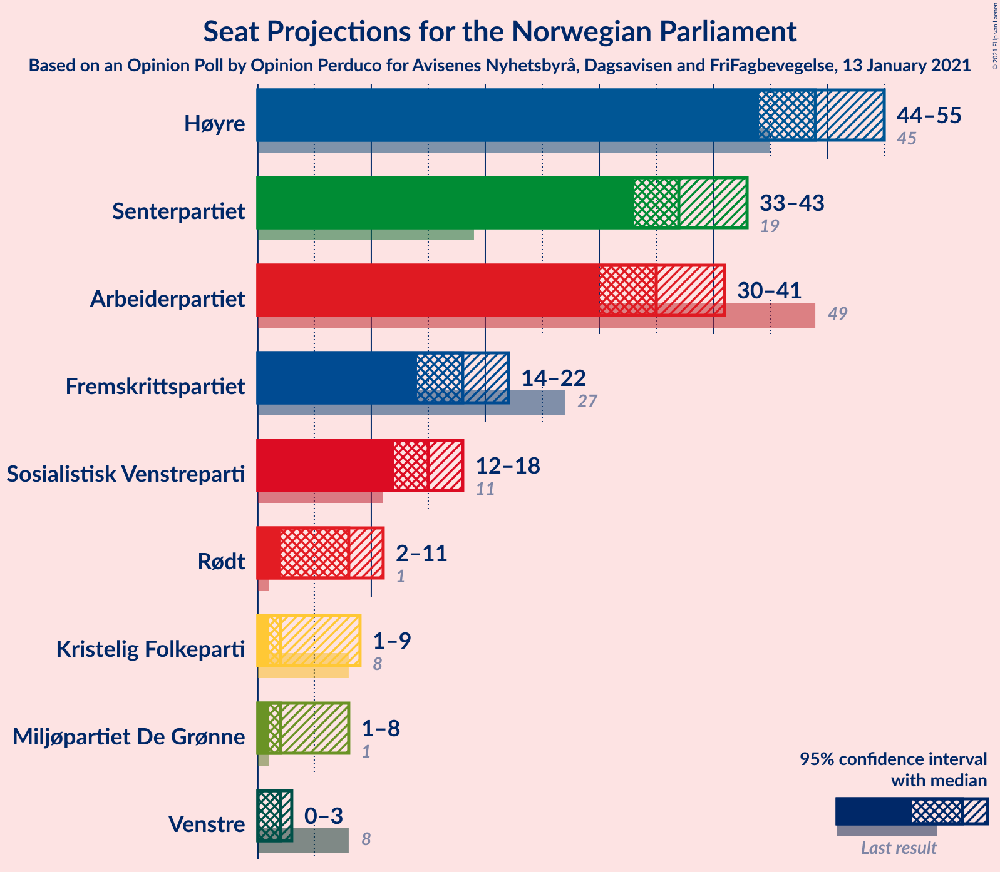
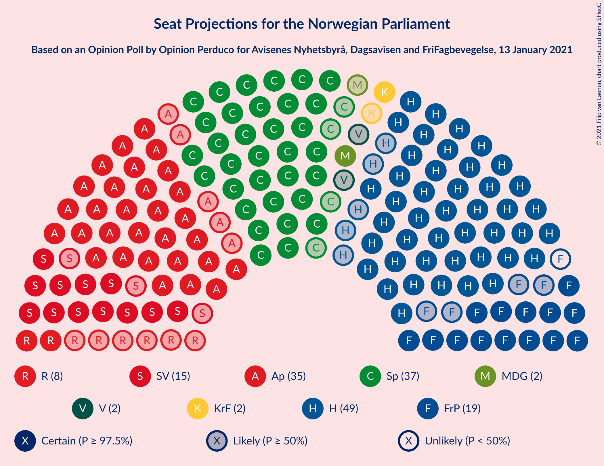
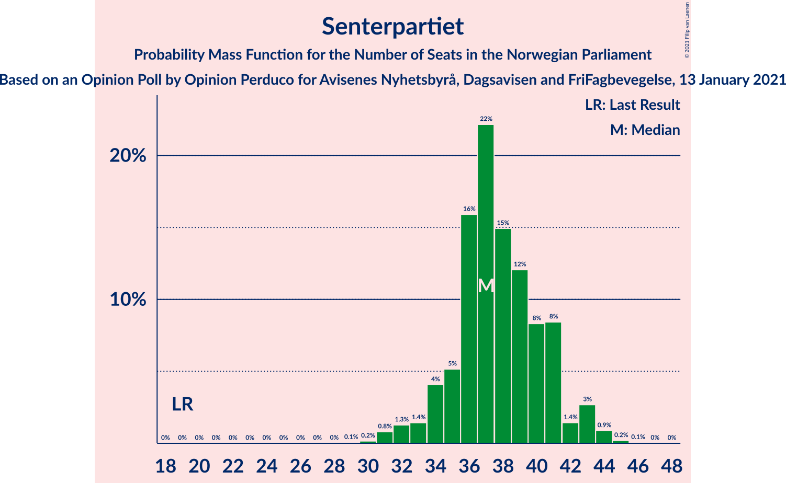
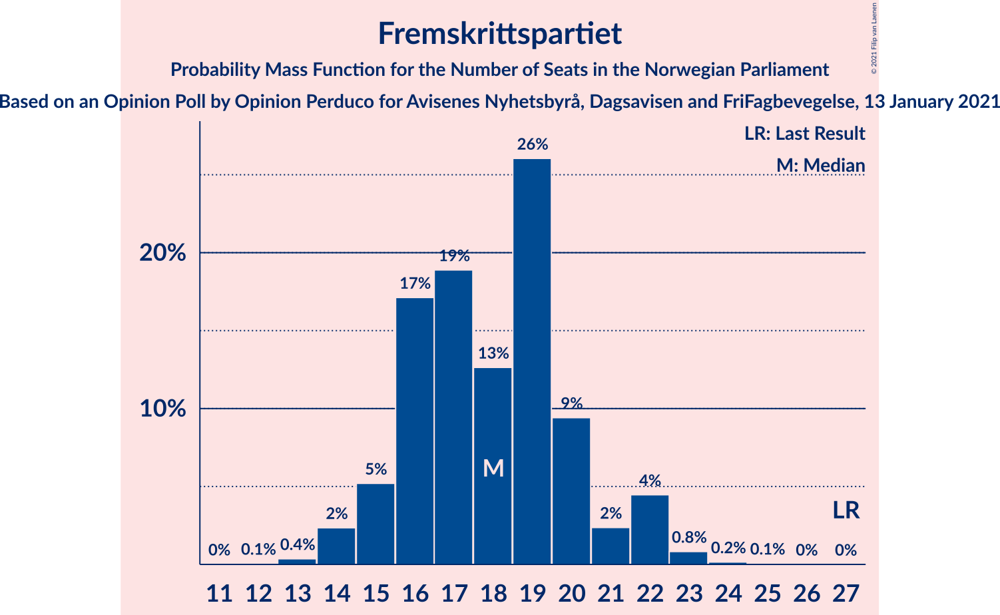
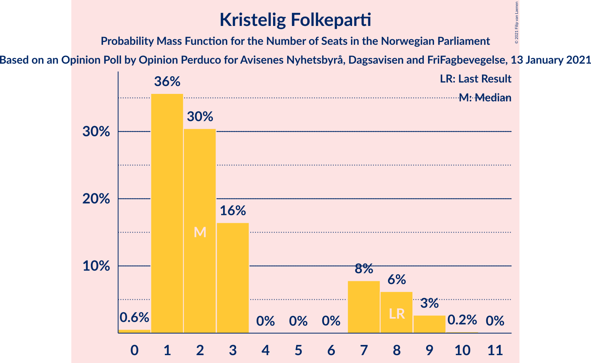
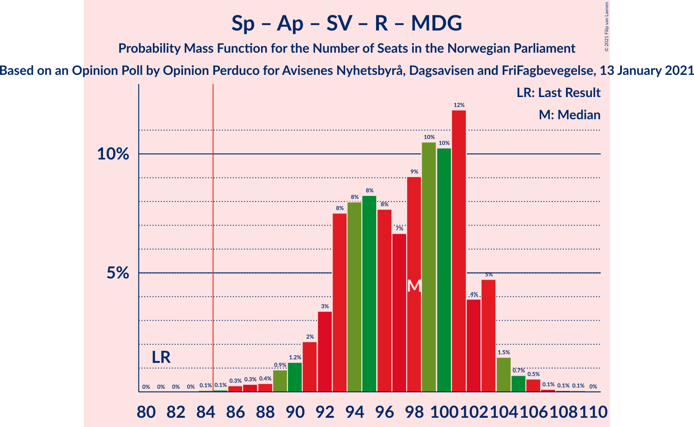
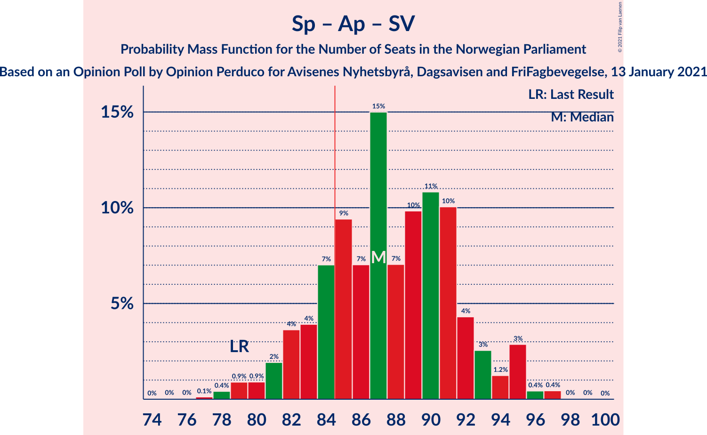
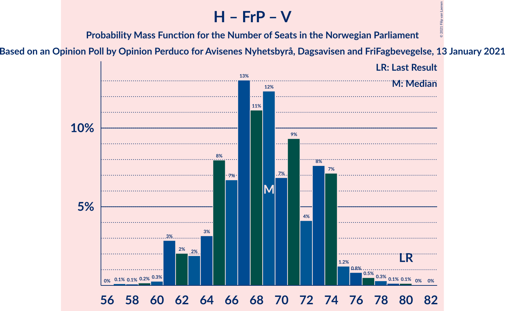

# Opinion Poll by Opinion Perduco for Avisenes Nyhetsbyrå, Dagsavisen and FriFagbevegelse, 13 January 2021

<a href="#voting-intentions">Voting Intentions</a> | <a href="#seats">Seats</a> | <a href="#coalitions">Coalitions</a> | <a href="#technical-information">Technical Information</a>

## Voting Intentions

### Confidence Intervals

| Party | Last Result | Poll Result | 80% Confidence Interval | 90% Confidence Interval | 95% Confidence Interval | 99% Confidence Interval |
|:-----:|:-----------:|:-----------:|:-----------------------:|:-----------------------:|:-----------------------:|:-----------------------:|
| Høyre | 25.0% | 26.9% | 25.1–28.8% |24.6–29.3% |24.1–29.8% |23.3–30.7% |
| Senterpartiet | 10.3% | 20.1% | 18.5–21.8% |18.0–22.3% |17.6–22.8% |16.9–23.6% |
| Arbeiderpartiet | 27.4% | 19.0% | 17.4–20.7% |17.0–21.2% |16.6–21.6% |15.9–22.5% |
| Fremskrittspartiet | 15.2% | 9.8% | 8.6–11.1% |8.3–11.5% |8.0–11.8% |7.5–12.5% |
| Sosialistisk Venstreparti | 6.0% | 8.0% | 6.9–9.2% |6.6–9.6% |6.4–9.9% |5.9–10.5% |
| Rødt | 2.4% | 4.4% | 3.6–5.3% |3.4–5.6% |3.2–5.9% |2.9–6.4% |
| Miljøpartiet De Grønne | 3.2% | 3.4% | 2.7–4.3% |2.6–4.5% |2.4–4.8% |2.1–5.2% |
| Kristelig Folkeparti | 4.2% | 3.4% | 2.7–4.3% |2.6–4.5% |2.4–4.8% |2.1–5.2% |
| Venstre | 4.4% | 2.7% | 2.1–3.5% |1.9–3.7% |1.8–3.9% |1.6–4.3% |

*Note:* The poll result column reflects the actual value used in the calculations. Published results may vary slightly, and in addition be rounded to fewer digits.

## Seats

### Confidence Intervals

| Party | Last Result | Median | 80% Confidence Interval | 90% Confidence Interval | 95% Confidence Interval | 99% Confidence Interval |
|:-----:|:-----------:|:------:|:-----------------------:|:-----------------------:|:-----------------------:|:-----------------------:|
| <a href="#høyre">Høyre</a> | 45 | 50 | 46–54 |45–54 |43–54 |41–56 |
| <a href="#senterpartiet">Senterpartiet</a> | 19 | 37 | 35–41 |33–41 |32–43 |31–44 |
| <a href="#arbeiderpartiet">Arbeiderpartiet</a> | 49 | 34 | 32–39 |31–40 |30–40 |29–41 |
| <a href="#fremskrittspartiet">Fremskrittspartiet</a> | 27 | 17 | 16–20 |15–20 |14–21 |13–23 |
| <a href="#sosialistisk-venstreparti">Sosialistisk Venstreparti</a> | 11 | 14 | 13–17 |12–17 |11–17 |11–19 |
| <a href="#rødt">Rødt</a> | 1 | 9 | 2–10 |2–10 |2–11 |2–11 |
| <a href="#miljøpartiet-de-grønne">Miljøpartiet De Grønne</a> | 1 | 2 | 1–8 |1–8 |1–9 |1–9 |
| <a href="#kristelig-folkeparti">Kristelig Folkeparti</a> | 8 | 1 | 1–7 |1–8 |1–8 |0–9 |
| <a href="#venstre">Venstre</a> | 8 | 2 | 1–2 |1–2 |0–7 |0–8 |

### Høyre

*For a full overview of the results for this party, see the [Høyre](party-høyre.html) page.*

| Number of Seats | Probability | Accumulated | Special Marks |
|:---------------:|:-----------:|:-----------:|:-------------:|
| 40 | 0.1% | 100% |  |
| 41 | 0.9% | 99.9% |  |
| 42 | 0.7% | 99.0% |  |
| 43 | 0.8% | 98% |  |
| 44 | 0.8% | 97% |  |
| 45 | 5% | 97% | Last Result |
| 46 | 11% | 92% |  |
| 47 | 6% | 81% |  |
| 48 | 14% | 75% |  |
| 49 | 7% | 62% |  |
| 50 | 7% | 54% | Median |
| 51 | 10% | 47% |  |
| 52 | 4% | 37% |  |
| 53 | 0.3% | 33% |  |
| 54 | 31% | 33% |  |
| 55 | 0.5% | 2% |  |
| 56 | 1.0% | 1.4% |  |
| 57 | 0.3% | 0.5% |  |
| 58 | 0% | 0.2% |  |
| 59 | 0.1% | 0.1% |  |
| 60 | 0% | 0% |  |

### Senterpartiet

*For a full overview of the results for this party, see the [Senterpartiet](party-senterpartiet.html) page.*

| Number of Seats | Probability | Accumulated | Special Marks |
|:---------------:|:-----------:|:-----------:|:-------------:|
| 19 | 0% | 100% | Last Result |
| 20 | 0% | 100% |  |
| 21 | 0% | 100% |  |
| 22 | 0% | 100% |  |
| 23 | 0% | 100% |  |
| 24 | 0% | 100% |  |
| 25 | 0% | 100% |  |
| 26 | 0% | 100% |  |
| 27 | 0% | 100% |  |
| 28 | 0% | 100% |  |
| 29 | 0% | 100% |  |
| 30 | 0.1% | 99.9% |  |
| 31 | 0.9% | 99.8% |  |
| 32 | 3% | 98.9% |  |
| 33 | 0.6% | 96% |  |
| 34 | 1.4% | 95% |  |
| 35 | 4% | 94% |  |
| 36 | 6% | 90% |  |
| 37 | 37% | 84% | Median |
| 38 | 6% | 46% |  |
| 39 | 16% | 40% |  |
| 40 | 7% | 24% |  |
| 41 | 13% | 17% |  |
| 42 | 1.4% | 4% |  |
| 43 | 2% | 3% |  |
| 44 | 0.3% | 0.6% |  |
| 45 | 0.2% | 0.3% |  |
| 46 | 0% | 0.1% |  |
| 47 | 0% | 0% |  |

### Arbeiderpartiet

*For a full overview of the results for this party, see the [Arbeiderpartiet](party-arbeiderpartiet.html) page.*

| Number of Seats | Probability | Accumulated | Special Marks |
|:---------------:|:-----------:|:-----------:|:-------------:|
| 27 | 0.1% | 100% |  |
| 28 | 0.2% | 99.9% |  |
| 29 | 1.1% | 99.7% |  |
| 30 | 2% | 98.6% |  |
| 31 | 3% | 97% |  |
| 32 | 6% | 94% |  |
| 33 | 4% | 87% |  |
| 34 | 44% | 83% | Median |
| 35 | 14% | 39% |  |
| 36 | 3% | 25% |  |
| 37 | 4% | 22% |  |
| 38 | 5% | 18% |  |
| 39 | 8% | 13% |  |
| 40 | 5% | 5% |  |
| 41 | 0.2% | 0.6% |  |
| 42 | 0.4% | 0.4% |  |
| 43 | 0.1% | 0.1% |  |
| 44 | 0% | 0% |  |
| 45 | 0% | 0% |  |
| 46 | 0% | 0% |  |
| 47 | 0% | 0% |  |
| 48 | 0% | 0% |  |
| 49 | 0% | 0% | Last Result |

### Fremskrittspartiet

*For a full overview of the results for this party, see the [Fremskrittspartiet](party-fremskrittspartiet.html) page.*

| Number of Seats | Probability | Accumulated | Special Marks |
|:---------------:|:-----------:|:-----------:|:-------------:|
| 12 | 0.2% | 100% |  |
| 13 | 0.6% | 99.8% |  |
| 14 | 4% | 99.2% |  |
| 15 | 4% | 95% |  |
| 16 | 15% | 91% |  |
| 17 | 36% | 76% | Median |
| 18 | 13% | 40% |  |
| 19 | 14% | 27% |  |
| 20 | 7% | 12% |  |
| 21 | 3% | 5% |  |
| 22 | 1.0% | 2% |  |
| 23 | 0.7% | 0.9% |  |
| 24 | 0.1% | 0.2% |  |
| 25 | 0.1% | 0.1% |  |
| 26 | 0% | 0% |  |
| 27 | 0% | 0% | Last Result |

### Sosialistisk Venstreparti

*For a full overview of the results for this party, see the [Sosialistisk Venstreparti](party-sosialistiskvenstreparti.html) page.*

| Number of Seats | Probability | Accumulated | Special Marks |
|:---------------:|:-----------:|:-----------:|:-------------:|
| 10 | 0.3% | 100% |  |
| 11 | 2% | 99.7% | Last Result |
| 12 | 4% | 97% |  |
| 13 | 34% | 93% |  |
| 14 | 18% | 59% | Median |
| 15 | 6% | 41% |  |
| 16 | 13% | 35% |  |
| 17 | 21% | 23% |  |
| 18 | 1.1% | 2% |  |
| 19 | 0.4% | 0.6% |  |
| 20 | 0.1% | 0.2% |  |
| 21 | 0% | 0% |  |

### Rødt

*For a full overview of the results for this party, see the [Rødt](party-rødt.html) page.*

| Number of Seats | Probability | Accumulated | Special Marks |
|:---------------:|:-----------:|:-----------:|:-------------:|
| 1 | 0.2% | 100% | Last Result |
| 2 | 24% | 99.8% |  |
| 3 | 0% | 76% |  |
| 4 | 0% | 76% |  |
| 5 | 0% | 76% |  |
| 6 | 0% | 76% |  |
| 7 | 2% | 76% |  |
| 8 | 12% | 73% |  |
| 9 | 47% | 62% | Median |
| 10 | 11% | 15% |  |
| 11 | 3% | 3% |  |
| 12 | 0.4% | 0.5% |  |
| 13 | 0.1% | 0.1% |  |
| 14 | 0% | 0% |  |

### Miljøpartiet De Grønne

*For a full overview of the results for this party, see the [Miljøpartiet De Grønne](party-miljøpartietdegrønne.html) page.*

| Number of Seats | Probability | Accumulated | Special Marks |
|:---------------:|:-----------:|:-----------:|:-------------:|
| 0 | 0.1% | 100% |  |
| 1 | 19% | 99.9% | Last Result |
| 2 | 63% | 81% | Median |
| 3 | 2% | 18% |  |
| 4 | 0.2% | 16% |  |
| 5 | 0% | 15% |  |
| 6 | 0% | 15% |  |
| 7 | 5% | 15% |  |
| 8 | 6% | 10% |  |
| 9 | 4% | 4% |  |
| 10 | 0.4% | 0.4% |  |
| 11 | 0% | 0% |  |

### Kristelig Folkeparti

*For a full overview of the results for this party, see the [Kristelig Folkeparti](party-kristeligfolkeparti.html) page.*

| Number of Seats | Probability | Accumulated | Special Marks |
|:---------------:|:-----------:|:-----------:|:-------------:|
| 0 | 0.8% | 100% |  |
| 1 | 61% | 99.2% | Median |
| 2 | 17% | 38% |  |
| 3 | 11% | 21% |  |
| 4 | 0% | 10% |  |
| 5 | 0% | 10% |  |
| 6 | 0% | 10% |  |
| 7 | 3% | 10% |  |
| 8 | 5% | 7% | Last Result |
| 9 | 2% | 2% |  |
| 10 | 0.1% | 0.2% |  |
| 11 | 0.1% | 0.1% |  |
| 12 | 0% | 0% |  |

### Venstre

*For a full overview of the results for this party, see the [Venstre](party-venstre.html) page.*

| Number of Seats | Probability | Accumulated | Special Marks |
|:---------------:|:-----------:|:-----------:|:-------------:|
| 0 | 4% | 100% |  |
| 1 | 16% | 96% |  |
| 2 | 77% | 80% | Median |
| 3 | 0.3% | 4% |  |
| 4 | 0% | 3% |  |
| 5 | 0% | 3% |  |
| 6 | 0% | 3% |  |
| 7 | 2% | 3% |  |
| 8 | 0.9% | 0.9% | Last Result |
| 9 | 0% | 0% |  |

## Coalitions

### Confidence Intervals

| Coalition | Last Result | Median | Majority? | 80% Confidence Interval | 90% Confidence Interval | 95% Confidence Interval | 99% Confidence Interval |
|:---------:|:-----------:|:------:|:---------:|:-----------------------:|:-----------------------:|:-----------------------:|:-----------------------:|
| Høyre – Senterpartiet – Fremskrittspartiet – Kristelig Folkeparti – Venstre | 107 | 110 | 100% | 104–113 | 104–115 | 103–117 | 99–120 |
| Senterpartiet – Arbeiderpartiet – Sosialistisk Venstreparti – Rødt – Miljøpartiet De Grønne | 81 | 96 | 100% | 94–103 | 90–103 | 89–103 | 87–106 |
| Senterpartiet – Arbeiderpartiet – Sosialistisk Venstreparti – Rødt | 80 | 93 | 99.6% | 89–101 | 88–101 | 87–101 | 85–102 |
| Senterpartiet – Arbeiderpartiet – Sosialistisk Venstreparti – Kristelig Folkeparti – Miljøpartiet De Grønne | 88 | 93 | 99.4% | 87–98 | 87–99 | 87–100 | 84–102 |
| Senterpartiet – Arbeiderpartiet – Sosialistisk Venstreparti – Miljøpartiet De Grønne | 80 | 90 | 96% | 86–96 | 85–97 | 83–98 | 81–99 |
| Senterpartiet – Arbeiderpartiet – Sosialistisk Venstreparti | 79 | 87 | 61% | 84–92 | 82–93 | 80–93 | 78–95 |
| Senterpartiet – Arbeiderpartiet – Kristelig Folkeparti – Miljøpartiet De Grønne | 77 | 77 | 6% | 74–84 | 74–86 | 73–86 | 71–88 |
| Senterpartiet – Arbeiderpartiet – Kristelig Folkeparti | 76 | 75 | 0.8% | 72–79 | 70–81 | 69–82 | 68–86 |
| Høyre – Fremskrittspartiet – Kristelig Folkeparti – Miljøpartiet De Grønne – Venstre | 89 | 76 | 0.3% | 68–80 | 68–81 | 68–82 | 67–84 |
| Høyre – Fremskrittspartiet – Kristelig Folkeparti – Venstre | 88 | 73 | 0% | 66–75 | 66–78 | 66–80 | 63–82 |
| Senterpartiet – Arbeiderpartiet | 68 | 72 | 0% | 70–76 | 67–77 | 66–79 | 64–81 |
| Høyre – Fremskrittspartiet – Venstre | 80 | 70 | 0% | 65–73 | 63–73 | 62–75 | 60–77 |
| Høyre – Fremskrittspartiet | 72 | 69 | 0% | 64–71 | 61–71 | 60–72 | 57–74 |
| Høyre – Kristelig Folkeparti – Venstre | 61 | 54 | 0% | 50–58 | 49–60 | 49–62 | 45–64 |
| Arbeiderpartiet – Sosialistisk Venstreparti | 60 | 49 | 0% | 46–54 | 45–55 | 44–55 | 41–56 |
| Senterpartiet – Kristelig Folkeparti – Venstre | 35 | 42 | 0% | 40–46 | 38–47 | 35–50 | 34–54 |

### Høyre – Senterpartiet – Fremskrittspartiet – Kristelig Folkeparti – Venstre

| Number of Seats | Probability | Accumulated | Special Marks |
|:---------------:|:-----------:|:-----------:|:-------------:|
| 96 | 0% | 100% |  |
| 97 | 0% | 99.9% |  |
| 98 | 0.4% | 99.9% |  |
| 99 | 0.2% | 99.5% |  |
| 100 | 0.1% | 99.4% |  |
| 101 | 0.2% | 99.3% |  |
| 102 | 2% | 99.1% |  |
| 103 | 2% | 98% |  |
| 104 | 7% | 96% |  |
| 105 | 3% | 89% |  |
| 106 | 3% | 85% |  |
| 107 | 11% | 83% | Last Result, Median |
| 108 | 5% | 72% |  |
| 109 | 11% | 67% |  |
| 110 | 8% | 55% |  |
| 111 | 28% | 47% |  |
| 112 | 2% | 19% |  |
| 113 | 10% | 17% |  |
| 114 | 1.0% | 7% |  |
| 115 | 2% | 6% |  |
| 116 | 0.6% | 4% |  |
| 117 | 1.3% | 4% |  |
| 118 | 0.1% | 2% |  |
| 119 | 0.3% | 2% |  |
| 120 | 2% | 2% |  |
| 121 | 0.3% | 0.4% |  |
| 122 | 0% | 0.1% |  |
| 123 | 0.1% | 0.1% |  |
| 124 | 0% | 0% |  |

### Senterpartiet – Arbeiderpartiet – Sosialistisk Venstreparti – Rødt – Miljøpartiet De Grønne

| Number of Seats | Probability | Accumulated | Special Marks |
|:---------------:|:-----------:|:-----------:|:-------------:|
| 81 | 0% | 100% | Last Result |
| 82 | 0% | 100% |  |
| 83 | 0% | 100% |  |
| 84 | 0% | 100% |  |
| 85 | 0.3% | 100% | Majority |
| 86 | 0.1% | 99.7% |  |
| 87 | 0.4% | 99.6% |  |
| 88 | 0.3% | 99.2% |  |
| 89 | 3% | 99.0% |  |
| 90 | 1.3% | 96% |  |
| 91 | 1.1% | 95% |  |
| 92 | 0.7% | 94% |  |
| 93 | 3% | 93% |  |
| 94 | 2% | 90% |  |
| 95 | 38% | 89% |  |
| 96 | 2% | 51% | Median |
| 97 | 1.3% | 49% |  |
| 98 | 9% | 47% |  |
| 99 | 2% | 39% |  |
| 100 | 15% | 36% |  |
| 101 | 1.3% | 21% |  |
| 102 | 7% | 20% |  |
| 103 | 12% | 13% |  |
| 104 | 0.7% | 1.5% |  |
| 105 | 0.3% | 0.8% |  |
| 106 | 0.4% | 0.6% |  |
| 107 | 0.1% | 0.2% |  |
| 108 | 0% | 0.1% |  |
| 109 | 0.1% | 0.1% |  |
| 110 | 0% | 0% |  |

### Senterpartiet – Arbeiderpartiet – Sosialistisk Venstreparti – Rødt

| Number of Seats | Probability | Accumulated | Special Marks |
|:---------------:|:-----------:|:-----------:|:-------------:|
| 80 | 0% | 100% | Last Result |
| 81 | 0% | 100% |  |
| 82 | 0% | 100% |  |
| 83 | 0.1% | 100% |  |
| 84 | 0.3% | 99.9% |  |
| 85 | 1.0% | 99.6% | Majority |
| 86 | 0.3% | 98.7% |  |
| 87 | 3% | 98% |  |
| 88 | 2% | 96% |  |
| 89 | 4% | 94% |  |
| 90 | 4% | 90% |  |
| 91 | 3% | 86% |  |
| 92 | 5% | 83% |  |
| 93 | 39% | 78% |  |
| 94 | 3% | 39% | Median |
| 95 | 2% | 37% |  |
| 96 | 0.9% | 35% |  |
| 97 | 3% | 34% |  |
| 98 | 7% | 31% |  |
| 99 | 5% | 24% |  |
| 100 | 1.1% | 19% |  |
| 101 | 17% | 18% |  |
| 102 | 0.2% | 0.5% |  |
| 103 | 0.2% | 0.3% |  |
| 104 | 0% | 0.1% |  |
| 105 | 0% | 0% |  |

### Senterpartiet – Arbeiderpartiet – Sosialistisk Venstreparti – Kristelig Folkeparti – Miljøpartiet De Grønne

| Number of Seats | Probability | Accumulated | Special Marks |
|:---------------:|:-----------:|:-----------:|:-------------:|
| 82 | 0% | 100% |  |
| 83 | 0.2% | 99.9% |  |
| 84 | 0.4% | 99.8% |  |
| 85 | 0.9% | 99.4% | Majority |
| 86 | 0.5% | 98.5% |  |
| 87 | 28% | 98% |  |
| 88 | 2% | 70% | Last Result, Median |
| 89 | 2% | 68% |  |
| 90 | 3% | 66% |  |
| 91 | 4% | 63% |  |
| 92 | 8% | 59% |  |
| 93 | 5% | 51% |  |
| 94 | 16% | 46% |  |
| 95 | 11% | 30% |  |
| 96 | 3% | 19% |  |
| 97 | 2% | 16% |  |
| 98 | 8% | 14% |  |
| 99 | 3% | 6% |  |
| 100 | 2% | 3% |  |
| 101 | 0.5% | 1.3% |  |
| 102 | 0.4% | 0.8% |  |
| 103 | 0.3% | 0.4% |  |
| 104 | 0% | 0.2% |  |
| 105 | 0% | 0.1% |  |
| 106 | 0% | 0.1% |  |
| 107 | 0% | 0.1% |  |
| 108 | 0% | 0% |  |

### Senterpartiet – Arbeiderpartiet – Sosialistisk Venstreparti – Miljøpartiet De Grønne

| Number of Seats | Probability | Accumulated | Special Marks |
|:---------------:|:-----------:|:-----------:|:-------------:|
| 79 | 0% | 100% |  |
| 80 | 0.1% | 99.9% | Last Result |
| 81 | 0.8% | 99.9% |  |
| 82 | 0.5% | 99.1% |  |
| 83 | 2% | 98.6% |  |
| 84 | 0.6% | 97% |  |
| 85 | 1.4% | 96% | Majority |
| 86 | 29% | 95% |  |
| 87 | 6% | 65% | Median |
| 88 | 3% | 60% |  |
| 89 | 2% | 57% |  |
| 90 | 9% | 55% |  |
| 91 | 6% | 46% |  |
| 92 | 3% | 40% |  |
| 93 | 14% | 37% |  |
| 94 | 9% | 23% |  |
| 95 | 3% | 13% |  |
| 96 | 4% | 10% |  |
| 97 | 2% | 6% |  |
| 98 | 3% | 4% |  |
| 99 | 0.5% | 0.8% |  |
| 100 | 0.1% | 0.3% |  |
| 101 | 0.1% | 0.1% |  |
| 102 | 0% | 0.1% |  |
| 103 | 0% | 0.1% |  |
| 104 | 0% | 0% |  |

### Senterpartiet – Arbeiderpartiet – Sosialistisk Venstreparti

| Number of Seats | Probability | Accumulated | Special Marks |
|:---------------:|:-----------:|:-----------:|:-------------:|
| 77 | 0.2% | 100% |  |
| 78 | 0.5% | 99.8% |  |
| 79 | 1.1% | 99.3% | Last Result |
| 80 | 1.1% | 98% |  |
| 81 | 1.3% | 97% |  |
| 82 | 2% | 96% |  |
| 83 | 2% | 93% |  |
| 84 | 31% | 92% |  |
| 85 | 5% | 61% | Median, Majority |
| 86 | 3% | 56% |  |
| 87 | 5% | 53% |  |
| 88 | 6% | 48% |  |
| 89 | 8% | 41% |  |
| 90 | 4% | 33% |  |
| 91 | 9% | 29% |  |
| 92 | 15% | 20% |  |
| 93 | 3% | 5% |  |
| 94 | 0.1% | 2% |  |
| 95 | 2% | 2% |  |
| 96 | 0.1% | 0.5% |  |
| 97 | 0.3% | 0.4% |  |
| 98 | 0% | 0% |  |

### Senterpartiet – Arbeiderpartiet – Kristelig Folkeparti – Miljøpartiet De Grønne

| Number of Seats | Probability | Accumulated | Special Marks |
|:---------------:|:-----------:|:-----------:|:-------------:|
| 68 | 0% | 100% |  |
| 69 | 0% | 99.9% |  |
| 70 | 0.2% | 99.9% |  |
| 71 | 1.4% | 99.7% |  |
| 72 | 0.6% | 98% |  |
| 73 | 0.7% | 98% |  |
| 74 | 30% | 97% | Median |
| 75 | 6% | 67% |  |
| 76 | 3% | 61% |  |
| 77 | 10% | 58% | Last Result |
| 78 | 19% | 47% |  |
| 79 | 4% | 28% |  |
| 80 | 2% | 24% |  |
| 81 | 4% | 22% |  |
| 82 | 4% | 18% |  |
| 83 | 2% | 14% |  |
| 84 | 6% | 12% |  |
| 85 | 0.2% | 6% | Majority |
| 86 | 4% | 6% |  |
| 87 | 0.4% | 2% |  |
| 88 | 0.9% | 1.3% |  |
| 89 | 0.1% | 0.4% |  |
| 90 | 0% | 0.3% |  |
| 91 | 0.2% | 0.2% |  |
| 92 | 0% | 0.1% |  |
| 93 | 0% | 0% |  |

### Senterpartiet – Arbeiderpartiet – Kristelig Folkeparti

| Number of Seats | Probability | Accumulated | Special Marks |
|:---------------:|:-----------:|:-----------:|:-------------:|
| 65 | 0.3% | 100% |  |
| 66 | 0.1% | 99.7% |  |
| 67 | 0.1% | 99.6% |  |
| 68 | 0.3% | 99.5% |  |
| 69 | 2% | 99.2% |  |
| 70 | 2% | 97% |  |
| 71 | 0.7% | 94% |  |
| 72 | 28% | 94% | Median |
| 73 | 9% | 66% |  |
| 74 | 4% | 57% |  |
| 75 | 13% | 53% |  |
| 76 | 10% | 40% | Last Result |
| 77 | 13% | 30% |  |
| 78 | 5% | 18% |  |
| 79 | 4% | 12% |  |
| 80 | 4% | 9% |  |
| 81 | 0.6% | 5% |  |
| 82 | 3% | 4% |  |
| 83 | 0.3% | 1.4% |  |
| 84 | 0.3% | 1.1% |  |
| 85 | 0.1% | 0.8% | Majority |
| 86 | 0.3% | 0.7% |  |
| 87 | 0.3% | 0.4% |  |
| 88 | 0% | 0.1% |  |
| 89 | 0% | 0% |  |

### Høyre – Fremskrittspartiet – Kristelig Folkeparti – Miljøpartiet De Grønne – Venstre

| Number of Seats | Probability | Accumulated | Special Marks |
|:---------------:|:-----------:|:-----------:|:-------------:|
| 64 | 0% | 100% |  |
| 65 | 0.1% | 99.9% |  |
| 66 | 0.2% | 99.9% |  |
| 67 | 0.3% | 99.6% |  |
| 68 | 17% | 99.4% |  |
| 69 | 1.2% | 82% |  |
| 70 | 5% | 81% |  |
| 71 | 7% | 76% |  |
| 72 | 3% | 69% | Median |
| 73 | 0.9% | 66% |  |
| 74 | 2% | 65% |  |
| 75 | 3% | 63% |  |
| 76 | 39% | 60% |  |
| 77 | 5% | 22% |  |
| 78 | 3% | 17% |  |
| 79 | 4% | 14% |  |
| 80 | 4% | 10% |  |
| 81 | 2% | 6% |  |
| 82 | 3% | 4% |  |
| 83 | 0.2% | 2% |  |
| 84 | 1.0% | 1.3% |  |
| 85 | 0.3% | 0.3% | Majority |
| 86 | 0% | 0.1% |  |
| 87 | 0% | 0% |  |
| 88 | 0% | 0% |  |
| 89 | 0% | 0% | Last Result |

### Høyre – Fremskrittspartiet – Kristelig Folkeparti – Venstre

| Number of Seats | Probability | Accumulated | Special Marks |
|:---------------:|:-----------:|:-----------:|:-------------:|
| 60 | 0.1% | 100% |  |
| 61 | 0% | 99.9% |  |
| 62 | 0.1% | 99.8% |  |
| 63 | 0.4% | 99.8% |  |
| 64 | 0.3% | 99.4% |  |
| 65 | 0.7% | 99.1% |  |
| 66 | 12% | 98% |  |
| 67 | 7% | 87% |  |
| 68 | 1.4% | 80% |  |
| 69 | 15% | 79% |  |
| 70 | 3% | 63% | Median |
| 71 | 9% | 61% |  |
| 72 | 1.3% | 52% |  |
| 73 | 2% | 51% |  |
| 74 | 38% | 49% |  |
| 75 | 2% | 11% |  |
| 76 | 3% | 9% |  |
| 77 | 0.6% | 7% |  |
| 78 | 1.0% | 6% |  |
| 79 | 1.3% | 5% |  |
| 80 | 3% | 4% |  |
| 81 | 0.2% | 0.9% |  |
| 82 | 0.4% | 0.7% |  |
| 83 | 0.1% | 0.4% |  |
| 84 | 0.2% | 0.3% |  |
| 85 | 0% | 0% | Majority |
| 86 | 0% | 0% |  |
| 87 | 0% | 0% |  |
| 88 | 0% | 0% | Last Result |

### Senterpartiet – Arbeiderpartiet

| Number of Seats | Probability | Accumulated | Special Marks |
|:---------------:|:-----------:|:-----------:|:-------------:|
| 63 | 0% | 100% |  |
| 64 | 0.5% | 99.9% |  |
| 65 | 0.3% | 99.4% |  |
| 66 | 2% | 99.0% |  |
| 67 | 3% | 97% |  |
| 68 | 3% | 95% | Last Result |
| 69 | 1.5% | 92% |  |
| 70 | 1.5% | 90% |  |
| 71 | 36% | 89% | Median |
| 72 | 6% | 53% |  |
| 73 | 5% | 47% |  |
| 74 | 8% | 42% |  |
| 75 | 16% | 34% |  |
| 76 | 9% | 18% |  |
| 77 | 6% | 9% |  |
| 78 | 0.4% | 3% |  |
| 79 | 0.7% | 3% |  |
| 80 | 0.2% | 2% |  |
| 81 | 2% | 2% |  |
| 82 | 0% | 0.3% |  |
| 83 | 0% | 0.3% |  |
| 84 | 0.2% | 0.3% |  |
| 85 | 0% | 0% | Majority |

### Høyre – Fremskrittspartiet – Venstre

| Number of Seats | Probability | Accumulated | Special Marks |
|:---------------:|:-----------:|:-----------:|:-------------:|
| 57 | 0.1% | 100% |  |
| 58 | 0.1% | 99.9% |  |
| 59 | 0.3% | 99.8% |  |
| 60 | 0.5% | 99.5% |  |
| 61 | 1.4% | 99.0% |  |
| 62 | 0.8% | 98% |  |
| 63 | 4% | 97% |  |
| 64 | 0.5% | 93% |  |
| 65 | 10% | 93% |  |
| 66 | 8% | 83% |  |
| 67 | 10% | 75% |  |
| 68 | 8% | 65% |  |
| 69 | 5% | 57% | Median |
| 70 | 3% | 51% |  |
| 71 | 5% | 48% |  |
| 72 | 2% | 43% |  |
| 73 | 36% | 41% |  |
| 74 | 1.5% | 5% |  |
| 75 | 1.4% | 3% |  |
| 76 | 1.3% | 2% |  |
| 77 | 0.2% | 0.6% |  |
| 78 | 0.2% | 0.4% |  |
| 79 | 0% | 0.2% |  |
| 80 | 0% | 0.2% | Last Result |
| 81 | 0.1% | 0.1% |  |
| 82 | 0% | 0% |  |

### Høyre – Fremskrittspartiet

| Number of Seats | Probability | Accumulated | Special Marks |
|:---------------:|:-----------:|:-----------:|:-------------:|
| 55 | 0.2% | 100% |  |
| 56 | 0.1% | 99.8% |  |
| 57 | 0.3% | 99.6% |  |
| 58 | 0.5% | 99.4% |  |
| 59 | 0.5% | 98.9% |  |
| 60 | 2% | 98% |  |
| 61 | 4% | 97% |  |
| 62 | 0.3% | 93% |  |
| 63 | 1.1% | 93% |  |
| 64 | 17% | 92% |  |
| 65 | 10% | 74% |  |
| 66 | 8% | 64% |  |
| 67 | 3% | 56% | Median |
| 68 | 2% | 52% |  |
| 69 | 8% | 50% |  |
| 70 | 3% | 42% |  |
| 71 | 35% | 39% |  |
| 72 | 2% | 4% | Last Result |
| 73 | 1.2% | 2% |  |
| 74 | 0.8% | 1.3% |  |
| 75 | 0% | 0.5% |  |
| 76 | 0.2% | 0.5% |  |
| 77 | 0.1% | 0.3% |  |
| 78 | 0% | 0.1% |  |
| 79 | 0.1% | 0.1% |  |
| 80 | 0% | 0% |  |

### Høyre – Kristelig Folkeparti – Venstre

| Number of Seats | Probability | Accumulated | Special Marks |
|:---------------:|:-----------:|:-----------:|:-------------:|
| 44 | 0.1% | 100% |  |
| 45 | 0.6% | 99.9% |  |
| 46 | 0.2% | 99.3% |  |
| 47 | 0.6% | 99.1% |  |
| 48 | 0.3% | 98.5% |  |
| 49 | 8% | 98% |  |
| 50 | 16% | 91% |  |
| 51 | 8% | 75% |  |
| 52 | 9% | 67% |  |
| 53 | 2% | 59% | Median |
| 54 | 9% | 57% |  |
| 55 | 5% | 48% |  |
| 56 | 2% | 43% |  |
| 57 | 31% | 42% |  |
| 58 | 1.2% | 11% |  |
| 59 | 4% | 10% |  |
| 60 | 2% | 6% |  |
| 61 | 1.2% | 4% | Last Result |
| 62 | 0.8% | 3% |  |
| 63 | 1.4% | 2% |  |
| 64 | 0.7% | 0.9% |  |
| 65 | 0% | 0.2% |  |
| 66 | 0.1% | 0.1% |  |
| 67 | 0% | 0% |  |

### Arbeiderpartiet – Sosialistisk Venstreparti

| Number of Seats | Probability | Accumulated | Special Marks |
|:---------------:|:-----------:|:-----------:|:-------------:|
| 40 | 0% | 100% |  |
| 41 | 0.7% | 99.9% |  |
| 42 | 0.7% | 99.3% |  |
| 43 | 1.0% | 98.5% |  |
| 44 | 1.4% | 98% |  |
| 45 | 4% | 96% |  |
| 46 | 3% | 92% |  |
| 47 | 28% | 90% |  |
| 48 | 7% | 61% | Median |
| 49 | 11% | 55% |  |
| 50 | 7% | 44% |  |
| 51 | 13% | 37% |  |
| 52 | 9% | 24% |  |
| 53 | 2% | 15% |  |
| 54 | 4% | 13% |  |
| 55 | 8% | 10% |  |
| 56 | 1.2% | 1.4% |  |
| 57 | 0.1% | 0.2% |  |
| 58 | 0% | 0.1% |  |
| 59 | 0.1% | 0.1% |  |
| 60 | 0% | 0% | Last Result |

### Senterpartiet – Kristelig Folkeparti – Venstre

| Number of Seats | Probability | Accumulated | Special Marks |
|:---------------:|:-----------:|:-----------:|:-------------:|
| 33 | 0.1% | 100% |  |
| 34 | 1.2% | 99.9% |  |
| 35 | 2% | 98.7% | Last Result |
| 36 | 1.2% | 97% |  |
| 37 | 0.9% | 96% |  |
| 38 | 1.0% | 95% |  |
| 39 | 2% | 94% |  |
| 40 | 38% | 93% | Median |
| 41 | 4% | 55% |  |
| 42 | 9% | 50% |  |
| 43 | 17% | 41% |  |
| 44 | 8% | 24% |  |
| 45 | 6% | 16% |  |
| 46 | 4% | 11% |  |
| 47 | 2% | 7% |  |
| 48 | 1.0% | 4% |  |
| 49 | 0.4% | 3% |  |
| 50 | 0.8% | 3% |  |
| 51 | 0.7% | 2% |  |
| 52 | 0% | 2% |  |
| 53 | 0.2% | 2% |  |
| 54 | 1.3% | 1.3% |  |
| 55 | 0% | 0% |  |

## Technical Information

### Opinion Poll

+ **Polling firm:** Opinion Perduco
+ **Commissioner(s):** Avisenes Nyhetsbyrå, Dagsavisen and FriFagbevegelse
+ **Fieldwork period:** 13 January 2021

### Calculations

+ **Sample size:** 942
+ **Simulations done:** 131,072
+ **Error estimate:** 2.16%

