# Opinion Poll by Opinion Perduco for Avisenes Nyhetsbyrå, Dagsavisen and FriFagbevegelse, 13 January 2021

<a href="#voting-intentions">Voting Intentions</a> | <a href="#seats">Seats</a> | <a href="#coalitions">Coalitions</a> | <a href="#technical-information">Technical Information</a>

## Voting Intentions

### Confidence Intervals

| Party | Last Result | Poll Result | 80% Confidence Interval | 90% Confidence Interval | 95% Confidence Interval | 99% Confidence Interval |
|:-----:|:-----------:|:-----------:|:-----------------------:|:-----------------------:|:-----------------------:|:-----------------------:|
| Høyre | 25.0% | 26.9% | 25.1–28.8% |24.6–29.3% |24.1–29.8% |23.3–30.7% |
| Senterpartiet | 10.3% | 20.1% | 18.5–21.8% |18.0–22.3% |17.6–22.8% |16.9–23.6% |
| Arbeiderpartiet | 27.4% | 19.0% | 17.4–20.7% |17.0–21.2% |16.6–21.6% |15.9–22.5% |
| Fremskrittspartiet | 15.2% | 9.8% | 8.6–11.1% |8.3–11.5% |8.0–11.8% |7.5–12.5% |
| Sosialistisk Venstreparti | 6.0% | 8.0% | 6.9–9.2% |6.6–9.6% |6.4–9.9% |5.9–10.5% |
| Rødt | 2.4% | 4.4% | 3.6–5.3% |3.4–5.6% |3.2–5.9% |2.9–6.4% |
| Miljøpartiet De Grønne | 3.2% | 3.4% | 2.7–4.3% |2.6–4.5% |2.4–4.8% |2.1–5.2% |
| Kristelig Folkeparti | 4.2% | 3.4% | 2.7–4.3% |2.6–4.5% |2.4–4.8% |2.1–5.2% |
| Venstre | 4.4% | 2.7% | 2.1–3.5% |1.9–3.7% |1.8–3.9% |1.6–4.3% |

*Note:* The poll result column reflects the actual value used in the calculations. Published results may vary slightly, and in addition be rounded to fewer digits.

## Seats

### Confidence Intervals

| Party | Last Result | Median | 80% Confidence Interval | 90% Confidence Interval | 95% Confidence Interval | 99% Confidence Interval |
|:-----:|:-----------:|:------:|:-----------------------:|:-----------------------:|:-----------------------:|:-----------------------:|
| <a href="#høyre">Høyre</a> | 45 | 49 | 45–54 |44–54 |44–55 |41–57 |
| <a href="#senterpartiet">Senterpartiet</a> | 19 | 37 | 35–41 |34–42 |33–43 |31–44 |
| <a href="#arbeiderpartiet">Arbeiderpartiet</a> | 49 | 35 | 32–38 |31–40 |30–41 |29–42 |
| <a href="#fremskrittspartiet">Fremskrittspartiet</a> | 27 | 18 | 16–20 |15–22 |14–22 |14–23 |
| <a href="#sosialistisk-venstreparti">Sosialistisk Venstreparti</a> | 11 | 15 | 13–17 |12–17 |12–18 |11–19 |
| <a href="#rødt">Rødt</a> | 1 | 8 | 2–10 |2–10 |2–11 |2–11 |
| <a href="#miljøpartiet-de-grønne">Miljøpartiet De Grønne</a> | 1 | 2 | 1–7 |1–8 |1–8 |1–9 |
| <a href="#kristelig-folkeparti">Kristelig Folkeparti</a> | 8 | 2 | 1–7 |1–8 |1–9 |0–9 |
| <a href="#venstre">Venstre</a> | 8 | 2 | 1–2 |1–2 |0–3 |0–8 |

### Høyre

*For a full overview of the results for this party, see the [Høyre](party-høyre.html) page.*

| Number of Seats | Probability | Accumulated | Special Marks |
|:---------------:|:-----------:|:-----------:|:-------------:|
| 40 | 0.1% | 100% |  |
| 41 | 0.4% | 99.9% |  |
| 42 | 0.6% | 99.5% |  |
| 43 | 0.8% | 98.9% |  |
| 44 | 4% | 98% |  |
| 45 | 5% | 94% | Last Result |
| 46 | 11% | 89% |  |
| 47 | 15% | 78% |  |
| 48 | 11% | 63% |  |
| 49 | 9% | 51% | Median |
| 50 | 17% | 43% |  |
| 51 | 6% | 26% |  |
| 52 | 5% | 20% |  |
| 53 | 5% | 15% |  |
| 54 | 8% | 11% |  |
| 55 | 1.4% | 3% |  |
| 56 | 0.5% | 1.1% |  |
| 57 | 0.4% | 0.6% |  |
| 58 | 0.2% | 0.3% |  |
| 59 | 0.1% | 0.1% |  |
| 60 | 0% | 0% |  |

### Senterpartiet

*For a full overview of the results for this party, see the [Senterpartiet](party-senterpartiet.html) page.*

| Number of Seats | Probability | Accumulated | Special Marks |
|:---------------:|:-----------:|:-----------:|:-------------:|
| 19 | 0% | 100% | Last Result |
| 20 | 0% | 100% |  |
| 21 | 0% | 100% |  |
| 22 | 0% | 100% |  |
| 23 | 0% | 100% |  |
| 24 | 0% | 100% |  |
| 25 | 0% | 100% |  |
| 26 | 0% | 100% |  |
| 27 | 0% | 100% |  |
| 28 | 0% | 100% |  |
| 29 | 0.1% | 100% |  |
| 30 | 0.2% | 99.9% |  |
| 31 | 0.8% | 99.8% |  |
| 32 | 1.3% | 99.0% |  |
| 33 | 1.4% | 98% |  |
| 34 | 4% | 96% |  |
| 35 | 5% | 92% |  |
| 36 | 16% | 87% |  |
| 37 | 22% | 71% | Median |
| 38 | 15% | 49% |  |
| 39 | 12% | 34% |  |
| 40 | 8% | 22% |  |
| 41 | 8% | 14% |  |
| 42 | 1.4% | 5% |  |
| 43 | 3% | 4% |  |
| 44 | 0.9% | 1.1% |  |
| 45 | 0.2% | 0.3% |  |
| 46 | 0.1% | 0.1% |  |
| 47 | 0% | 0% |  |

### Arbeiderpartiet

*For a full overview of the results for this party, see the [Arbeiderpartiet](party-arbeiderpartiet.html) page.*

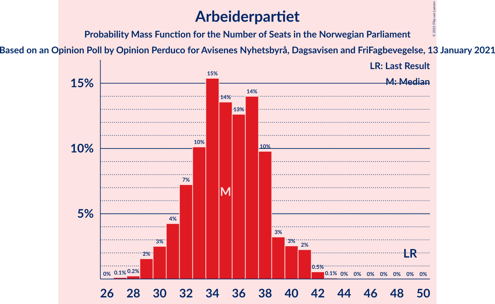

| Number of Seats | Probability | Accumulated | Special Marks |
|:---------------:|:-----------:|:-----------:|:-------------:|
| 27 | 0.1% | 100% |  |
| 28 | 0.2% | 99.9% |  |
| 29 | 2% | 99.6% |  |
| 30 | 3% | 98% |  |
| 31 | 4% | 96% |  |
| 32 | 7% | 91% |  |
| 33 | 10% | 84% |  |
| 34 | 15% | 74% |  |
| 35 | 14% | 59% | Median |
| 36 | 13% | 45% |  |
| 37 | 14% | 32% |  |
| 38 | 10% | 18% |  |
| 39 | 3% | 9% |  |
| 40 | 3% | 5% |  |
| 41 | 2% | 3% |  |
| 42 | 0.5% | 0.6% |  |
| 43 | 0.1% | 0.1% |  |
| 44 | 0% | 0% |  |
| 45 | 0% | 0% |  |
| 46 | 0% | 0% |  |
| 47 | 0% | 0% |  |
| 48 | 0% | 0% |  |
| 49 | 0% | 0% | Last Result |

### Fremskrittspartiet

*For a full overview of the results for this party, see the [Fremskrittspartiet](party-fremskrittspartiet.html) page.*

| Number of Seats | Probability | Accumulated | Special Marks |
|:---------------:|:-----------:|:-----------:|:-------------:|
| 12 | 0.1% | 100% |  |
| 13 | 0.4% | 99.9% |  |
| 14 | 2% | 99.6% |  |
| 15 | 5% | 97% |  |
| 16 | 17% | 92% |  |
| 17 | 19% | 75% |  |
| 18 | 13% | 56% | Median |
| 19 | 26% | 43% |  |
| 20 | 9% | 17% |  |
| 21 | 2% | 8% |  |
| 22 | 4% | 6% |  |
| 23 | 0.8% | 1.1% |  |
| 24 | 0.2% | 0.2% |  |
| 25 | 0.1% | 0.1% |  |
| 26 | 0% | 0% |  |
| 27 | 0% | 0% | Last Result |

### Sosialistisk Venstreparti

*For a full overview of the results for this party, see the [Sosialistisk Venstreparti](party-sosialistiskvenstreparti.html) page.*

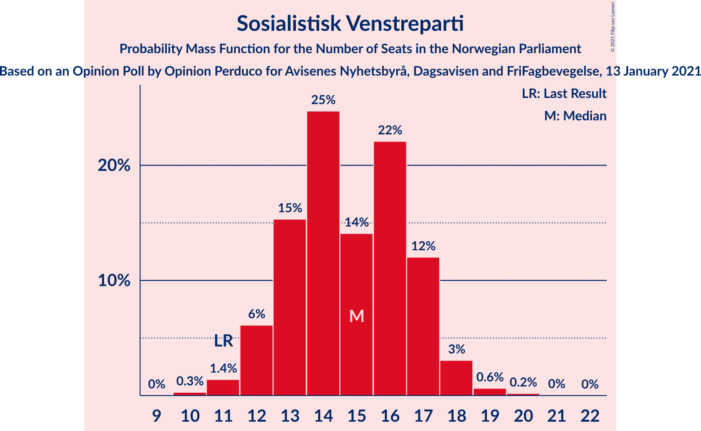

| Number of Seats | Probability | Accumulated | Special Marks |
|:---------------:|:-----------:|:-----------:|:-------------:|
| 10 | 0.3% | 100% |  |
| 11 | 1.4% | 99.7% | Last Result |
| 12 | 6% | 98% |  |
| 13 | 15% | 92% |  |
| 14 | 25% | 77% |  |
| 15 | 14% | 52% | Median |
| 16 | 22% | 38% |  |
| 17 | 12% | 16% |  |
| 18 | 3% | 4% |  |
| 19 | 0.6% | 0.9% |  |
| 20 | 0.2% | 0.2% |  |
| 21 | 0% | 0.1% |  |
| 22 | 0% | 0% |  |

### Rødt

*For a full overview of the results for this party, see the [Rødt](party-rødt.html) page.*

| Number of Seats | Probability | Accumulated | Special Marks |
|:---------------:|:-----------:|:-----------:|:-------------:|
| 1 | 0.2% | 100% | Last Result |
| 2 | 28% | 99.8% |  |
| 3 | 0% | 72% |  |
| 4 | 0% | 72% |  |
| 5 | 0% | 72% |  |
| 6 | 0% | 72% |  |
| 7 | 7% | 72% |  |
| 8 | 27% | 65% | Median |
| 9 | 27% | 38% |  |
| 10 | 8% | 11% |  |
| 11 | 2% | 3% |  |
| 12 | 0.3% | 0.4% |  |
| 13 | 0.1% | 0.1% |  |
| 14 | 0% | 0% |  |

### Miljøpartiet De Grønne

*For a full overview of the results for this party, see the [Miljøpartiet De Grønne](party-miljøpartietdegrønne.html) page.*

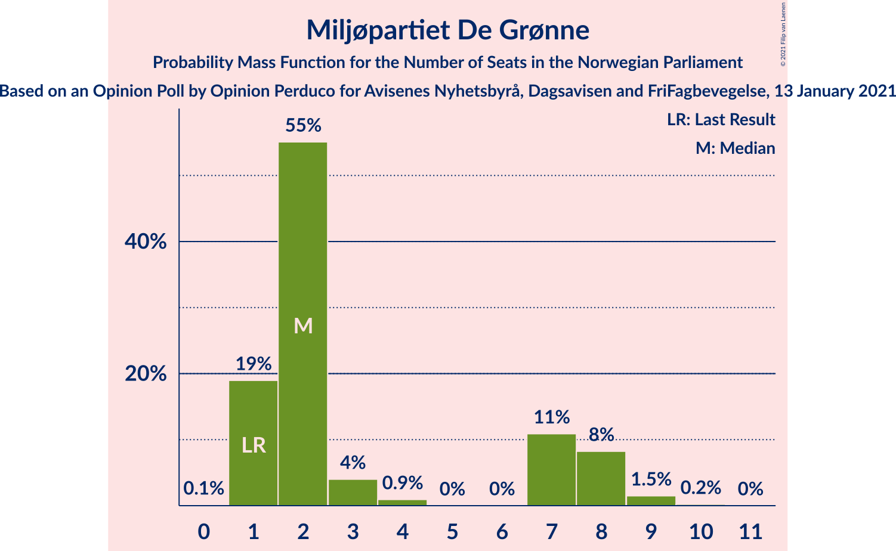

| Number of Seats | Probability | Accumulated | Special Marks |
|:---------------:|:-----------:|:-----------:|:-------------:|
| 0 | 0.1% | 100% |  |
| 1 | 19% | 99.9% | Last Result |
| 2 | 55% | 81% | Median |
| 3 | 4% | 26% |  |
| 4 | 0.9% | 22% |  |
| 5 | 0% | 21% |  |
| 6 | 0% | 21% |  |
| 7 | 11% | 21% |  |
| 8 | 8% | 10% |  |
| 9 | 1.5% | 2% |  |
| 10 | 0.2% | 0.2% |  |
| 11 | 0% | 0% |  |

### Kristelig Folkeparti

*For a full overview of the results for this party, see the [Kristelig Folkeparti](party-kristeligfolkeparti.html) page.*

| Number of Seats | Probability | Accumulated | Special Marks |
|:---------------:|:-----------:|:-----------:|:-------------:|
| 0 | 0.6% | 100% |  |
| 1 | 36% | 99.4% |  |
| 2 | 30% | 64% | Median |
| 3 | 16% | 33% |  |
| 4 | 0% | 17% |  |
| 5 | 0% | 17% |  |
| 6 | 0% | 17% |  |
| 7 | 8% | 17% |  |
| 8 | 6% | 9% | Last Result |
| 9 | 3% | 3% |  |
| 10 | 0.2% | 0.2% |  |
| 11 | 0% | 0% |  |

### Venstre

*For a full overview of the results for this party, see the [Venstre](party-venstre.html) page.*

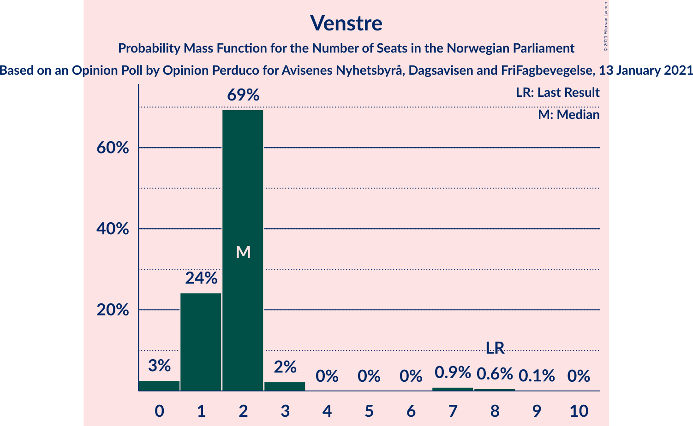

| Number of Seats | Probability | Accumulated | Special Marks |
|:---------------:|:-----------:|:-----------:|:-------------:|
| 0 | 3% | 100% |  |
| 1 | 24% | 97% |  |
| 2 | 69% | 73% | Median |
| 3 | 2% | 4% |  |
| 4 | 0% | 2% |  |
| 5 | 0% | 2% |  |
| 6 | 0% | 2% |  |
| 7 | 0.9% | 2% |  |
| 8 | 0.6% | 0.7% | Last Result |
| 9 | 0.1% | 0.1% |  |
| 10 | 0% | 0% |  |

## Coalitions

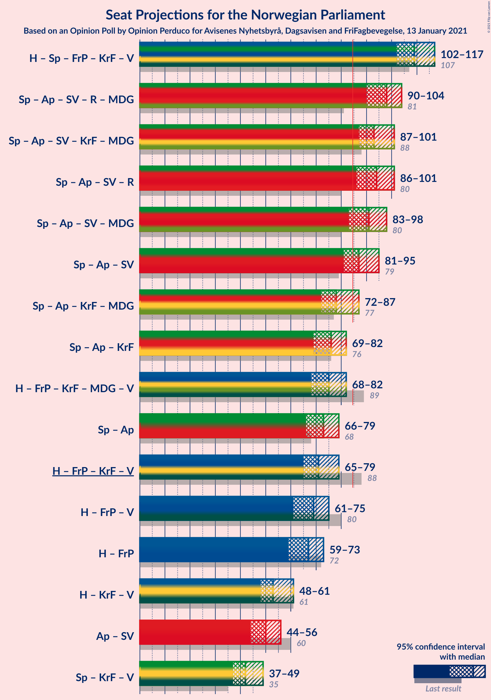

### Confidence Intervals

| Coalition | Last Result | Median | Majority? | 80% Confidence Interval | 90% Confidence Interval | 95% Confidence Interval | 99% Confidence Interval |
|:---------:|:-----------:|:------:|:---------:|:-----------------------:|:-----------------------:|:-----------------------:|:-----------------------:|
| Høyre – Senterpartiet – Fremskrittspartiet – Kristelig Folkeparti – Venstre | 107 | 109 | 100% | 104–114 | 103–116 | 102–117 | 100–120 |
| Senterpartiet – Arbeiderpartiet – Sosialistisk Venstreparti – Rødt – Miljøpartiet De Grønne | 81 | 98 | 99.9% | 93–102 | 91–103 | 90–104 | 87–106 |
| Senterpartiet – Arbeiderpartiet – Sosialistisk Venstreparti – Kristelig Folkeparti – Miljøpartiet De Grønne | 88 | 93 | 99.6% | 89–99 | 87–100 | 87–101 | 85–103 |
| Senterpartiet – Arbeiderpartiet – Sosialistisk Venstreparti – Rødt | 80 | 94 | 98.9% | 90–99 | 88–100 | 86–101 | 84–102 |
| Senterpartiet – Arbeiderpartiet – Sosialistisk Venstreparti – Miljøpartiet De Grønne | 80 | 91 | 95% | 86–96 | 84–98 | 83–98 | 82–101 |
| Senterpartiet – Arbeiderpartiet – Sosialistisk Venstreparti | 79 | 87 | 81% | 83–92 | 82–94 | 81–95 | 78–97 |
| Senterpartiet – Arbeiderpartiet – Kristelig Folkeparti – Miljøpartiet De Grønne | 77 | 78 | 9% | 74–84 | 73–86 | 72–87 | 70–89 |
| Senterpartiet – Arbeiderpartiet – Kristelig Folkeparti | 76 | 76 | 0.5% | 72–79 | 71–81 | 69–82 | 67–85 |
| Høyre – Fremskrittspartiet – Kristelig Folkeparti – Miljøpartiet De Grønne – Venstre | 89 | 75 | 1.1% | 70–79 | 69–81 | 68–82 | 66–85 |
| Senterpartiet – Arbeiderpartiet | 68 | 73 | 0% | 69–77 | 68–78 | 66–79 | 65–80 |
| Høyre – Fremskrittspartiet – Kristelig Folkeparti – Venstre | 88 | 71 | 0.1% | 67–76 | 66–77 | 65–79 | 63–82 |
| Høyre – Fremskrittspartiet – Venstre | 80 | 69 | 0% | 64–74 | 62–74 | 61–75 | 60–78 |
| Høyre – Fremskrittspartiet | 72 | 67 | 0% | 63–72 | 61–72 | 59–73 | 58–76 |
| Høyre – Kristelig Folkeparti – Venstre | 61 | 53 | 0% | 49–58 | 48–60 | 48–61 | 46–64 |
| Arbeiderpartiet – Sosialistisk Venstreparti | 60 | 50 | 0% | 46–54 | 44–55 | 44–56 | 42–58 |
| Senterpartiet – Kristelig Folkeparti – Venstre | 35 | 42 | 0% | 39–47 | 38–48 | 37–49 | 35–53 |

### Høyre – Senterpartiet – Fremskrittspartiet – Kristelig Folkeparti – Venstre

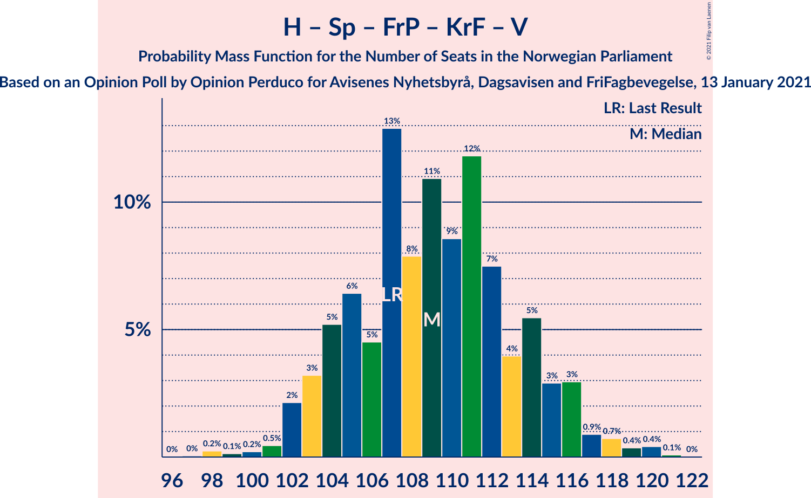

| Number of Seats | Probability | Accumulated | Special Marks |
|:---------------:|:-----------:|:-----------:|:-------------:|
| 97 | 0% | 100% |  |
| 98 | 0.2% | 99.9% |  |
| 99 | 0.1% | 99.7% |  |
| 100 | 0.2% | 99.5% |  |
| 101 | 0.5% | 99.3% |  |
| 102 | 2% | 98.9% |  |
| 103 | 3% | 97% |  |
| 104 | 5% | 94% |  |
| 105 | 6% | 88% |  |
| 106 | 5% | 82% |  |
| 107 | 13% | 77% | Last Result |
| 108 | 8% | 64% | Median |
| 109 | 11% | 57% |  |
| 110 | 9% | 46% |  |
| 111 | 12% | 37% |  |
| 112 | 7% | 25% |  |
| 113 | 4% | 18% |  |
| 114 | 5% | 14% |  |
| 115 | 3% | 8% |  |
| 116 | 3% | 5% |  |
| 117 | 0.9% | 3% |  |
| 118 | 0.7% | 2% |  |
| 119 | 0.4% | 0.9% |  |
| 120 | 0.4% | 0.5% |  |
| 121 | 0.1% | 0.1% |  |
| 122 | 0% | 0% |  |

### Senterpartiet – Arbeiderpartiet – Sosialistisk Venstreparti – Rødt – Miljøpartiet De Grønne

| Number of Seats | Probability | Accumulated | Special Marks |
|:---------------:|:-----------:|:-----------:|:-------------:|
| 81 | 0% | 100% | Last Result |
| 82 | 0% | 100% |  |
| 83 | 0% | 100% |  |
| 84 | 0.1% | 100% |  |
| 85 | 0.1% | 99.9% | Majority |
| 86 | 0.3% | 99.8% |  |
| 87 | 0.3% | 99.6% |  |
| 88 | 0.4% | 99.3% |  |
| 89 | 0.9% | 98.9% |  |
| 90 | 1.2% | 98% |  |
| 91 | 2% | 97% |  |
| 92 | 3% | 95% |  |
| 93 | 8% | 91% |  |
| 94 | 8% | 84% |  |
| 95 | 8% | 76% |  |
| 96 | 8% | 68% |  |
| 97 | 7% | 60% | Median |
| 98 | 9% | 53% |  |
| 99 | 10% | 44% |  |
| 100 | 10% | 34% |  |
| 101 | 12% | 23% |  |
| 102 | 4% | 12% |  |
| 103 | 5% | 8% |  |
| 104 | 1.5% | 3% |  |
| 105 | 0.7% | 1.5% |  |
| 106 | 0.5% | 0.8% |  |
| 107 | 0.1% | 0.2% |  |
| 108 | 0.1% | 0.1% |  |
| 109 | 0.1% | 0.1% |  |
| 110 | 0% | 0% |  |

### Senterpartiet – Arbeiderpartiet – Sosialistisk Venstreparti – Kristelig Folkeparti – Miljøpartiet De Grønne

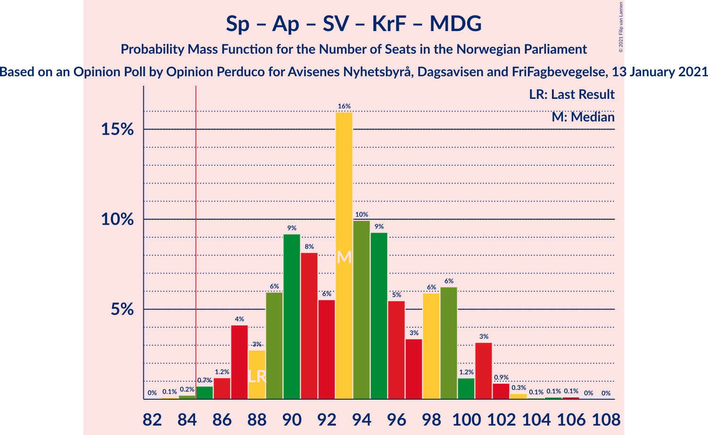

| Number of Seats | Probability | Accumulated | Special Marks |
|:---------------:|:-----------:|:-----------:|:-------------:|
| 82 | 0% | 100% |  |
| 83 | 0.1% | 99.9% |  |
| 84 | 0.2% | 99.8% |  |
| 85 | 0.7% | 99.6% | Majority |
| 86 | 1.2% | 98.9% |  |
| 87 | 4% | 98% |  |
| 88 | 3% | 94% | Last Result |
| 89 | 6% | 91% |  |
| 90 | 9% | 85% |  |
| 91 | 8% | 76% | Median |
| 92 | 6% | 68% |  |
| 93 | 16% | 62% |  |
| 94 | 10% | 46% |  |
| 95 | 9% | 36% |  |
| 96 | 5% | 27% |  |
| 97 | 3% | 21% |  |
| 98 | 6% | 18% |  |
| 99 | 6% | 12% |  |
| 100 | 1.2% | 6% |  |
| 101 | 3% | 5% |  |
| 102 | 0.9% | 2% |  |
| 103 | 0.3% | 0.7% |  |
| 104 | 0.1% | 0.3% |  |
| 105 | 0.1% | 0.3% |  |
| 106 | 0.1% | 0.2% |  |
| 107 | 0% | 0% |  |

### Senterpartiet – Arbeiderpartiet – Sosialistisk Venstreparti – Rødt

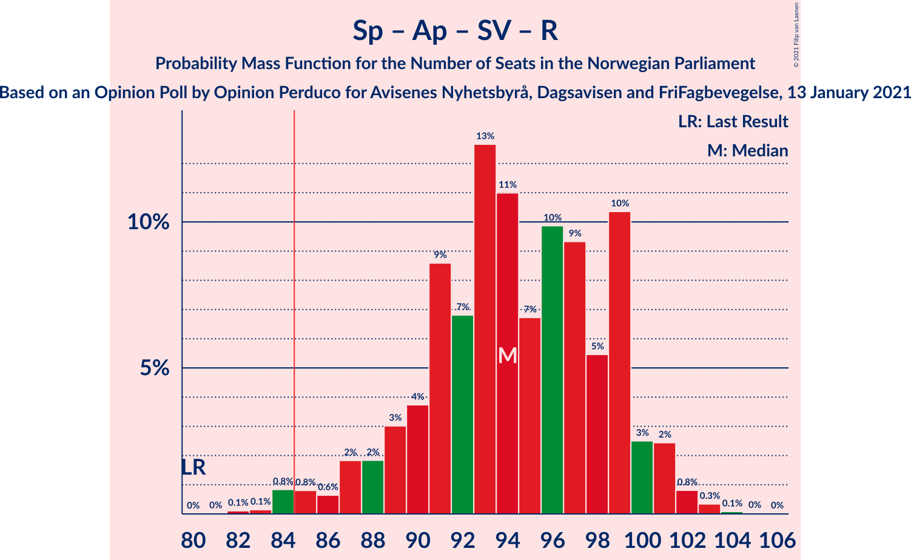

| Number of Seats | Probability | Accumulated | Special Marks |
|:---------------:|:-----------:|:-----------:|:-------------:|
| 80 | 0% | 100% | Last Result |
| 81 | 0% | 100% |  |
| 82 | 0.1% | 100% |  |
| 83 | 0.1% | 99.9% |  |
| 84 | 0.8% | 99.7% |  |
| 85 | 0.8% | 98.9% | Majority |
| 86 | 0.6% | 98% |  |
| 87 | 2% | 97% |  |
| 88 | 2% | 96% |  |
| 89 | 3% | 94% |  |
| 90 | 4% | 91% |  |
| 91 | 9% | 87% |  |
| 92 | 7% | 78% |  |
| 93 | 13% | 72% |  |
| 94 | 11% | 59% |  |
| 95 | 7% | 48% | Median |
| 96 | 10% | 41% |  |
| 97 | 9% | 31% |  |
| 98 | 5% | 22% |  |
| 99 | 10% | 17% |  |
| 100 | 3% | 6% |  |
| 101 | 2% | 4% |  |
| 102 | 0.8% | 1.3% |  |
| 103 | 0.3% | 0.5% |  |
| 104 | 0.1% | 0.1% |  |
| 105 | 0% | 0.1% |  |
| 106 | 0% | 0% |  |

### Senterpartiet – Arbeiderpartiet – Sosialistisk Venstreparti – Miljøpartiet De Grønne

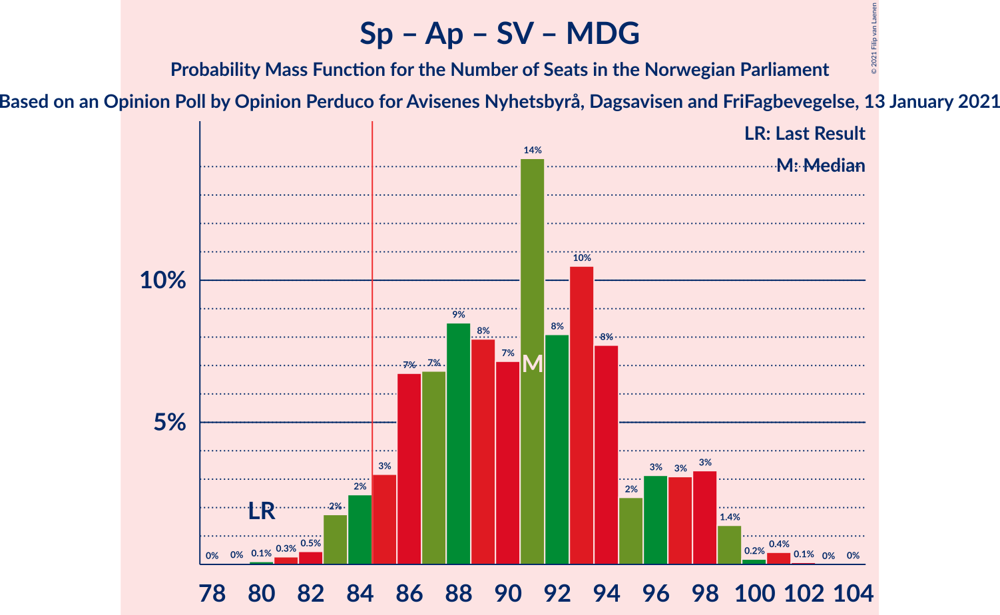

| Number of Seats | Probability | Accumulated | Special Marks |
|:---------------:|:-----------:|:-----------:|:-------------:|
| 78 | 0% | 100% |  |
| 79 | 0% | 99.9% |  |
| 80 | 0.1% | 99.9% | Last Result |
| 81 | 0.3% | 99.8% |  |
| 82 | 0.5% | 99.5% |  |
| 83 | 2% | 99.1% |  |
| 84 | 2% | 97% |  |
| 85 | 3% | 95% | Majority |
| 86 | 7% | 92% |  |
| 87 | 7% | 85% |  |
| 88 | 9% | 78% |  |
| 89 | 8% | 70% | Median |
| 90 | 7% | 62% |  |
| 91 | 14% | 55% |  |
| 92 | 8% | 40% |  |
| 93 | 10% | 32% |  |
| 94 | 8% | 22% |  |
| 95 | 2% | 14% |  |
| 96 | 3% | 12% |  |
| 97 | 3% | 8% |  |
| 98 | 3% | 5% |  |
| 99 | 1.4% | 2% |  |
| 100 | 0.2% | 0.7% |  |
| 101 | 0.4% | 0.5% |  |
| 102 | 0.1% | 0.1% |  |
| 103 | 0% | 0% |  |

### Senterpartiet – Arbeiderpartiet – Sosialistisk Venstreparti

| Number of Seats | Probability | Accumulated | Special Marks |
|:---------------:|:-----------:|:-----------:|:-------------:|
| 75 | 0% | 100% |  |
| 76 | 0% | 99.9% |  |
| 77 | 0.1% | 99.9% |  |
| 78 | 0.4% | 99.8% |  |
| 79 | 0.9% | 99.4% | Last Result |
| 80 | 0.9% | 98% |  |
| 81 | 2% | 98% |  |
| 82 | 4% | 96% |  |
| 83 | 4% | 92% |  |
| 84 | 7% | 88% |  |
| 85 | 9% | 81% | Majority |
| 86 | 7% | 72% |  |
| 87 | 15% | 65% | Median |
| 88 | 7% | 50% |  |
| 89 | 10% | 43% |  |
| 90 | 11% | 33% |  |
| 91 | 10% | 22% |  |
| 92 | 4% | 12% |  |
| 93 | 3% | 8% |  |
| 94 | 1.2% | 5% |  |
| 95 | 3% | 4% |  |
| 96 | 0.4% | 1.0% |  |
| 97 | 0.4% | 0.5% |  |
| 98 | 0% | 0.1% |  |
| 99 | 0% | 0% |  |

### Senterpartiet – Arbeiderpartiet – Kristelig Folkeparti – Miljøpartiet De Grønne

| Number of Seats | Probability | Accumulated | Special Marks |
|:---------------:|:-----------:|:-----------:|:-------------:|
| 68 | 0.1% | 100% |  |
| 69 | 0.3% | 99.9% |  |
| 70 | 0.4% | 99.6% |  |
| 71 | 0.9% | 99.2% |  |
| 72 | 1.0% | 98% |  |
| 73 | 4% | 97% |  |
| 74 | 9% | 94% |  |
| 75 | 5% | 85% |  |
| 76 | 7% | 80% | Median |
| 77 | 13% | 73% | Last Result |
| 78 | 14% | 60% |  |
| 79 | 9% | 46% |  |
| 80 | 6% | 37% |  |
| 81 | 10% | 30% |  |
| 82 | 4% | 20% |  |
| 83 | 5% | 16% |  |
| 84 | 3% | 12% |  |
| 85 | 3% | 9% | Majority |
| 86 | 1.1% | 5% |  |
| 87 | 3% | 4% |  |
| 88 | 0.4% | 1.0% |  |
| 89 | 0.3% | 0.7% |  |
| 90 | 0.1% | 0.4% |  |
| 91 | 0.2% | 0.3% |  |
| 92 | 0.1% | 0.1% |  |
| 93 | 0% | 0% |  |

### Senterpartiet – Arbeiderpartiet – Kristelig Folkeparti

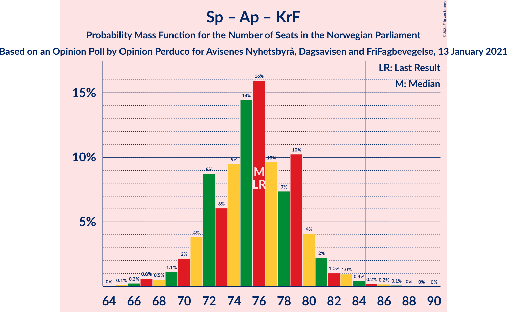

| Number of Seats | Probability | Accumulated | Special Marks |
|:---------------:|:-----------:|:-----------:|:-------------:|
| 65 | 0.1% | 100% |  |
| 66 | 0.2% | 99.8% |  |
| 67 | 0.6% | 99.6% |  |
| 68 | 0.5% | 98.9% |  |
| 69 | 1.1% | 98% |  |
| 70 | 2% | 97% |  |
| 71 | 4% | 95% |  |
| 72 | 9% | 91% |  |
| 73 | 6% | 83% |  |
| 74 | 9% | 76% | Median |
| 75 | 14% | 67% |  |
| 76 | 16% | 53% | Last Result |
| 77 | 10% | 37% |  |
| 78 | 7% | 27% |  |
| 79 | 10% | 20% |  |
| 80 | 4% | 9% |  |
| 81 | 2% | 5% |  |
| 82 | 1.0% | 3% |  |
| 83 | 1.0% | 2% |  |
| 84 | 0.4% | 1.0% |  |
| 85 | 0.2% | 0.5% | Majority |
| 86 | 0.2% | 0.3% |  |
| 87 | 0.1% | 0.2% |  |
| 88 | 0% | 0.1% |  |
| 89 | 0% | 0% |  |

### Høyre – Fremskrittspartiet – Kristelig Folkeparti – Miljøpartiet De Grønne – Venstre

| Number of Seats | Probability | Accumulated | Special Marks |
|:---------------:|:-----------:|:-----------:|:-------------:|
| 64 | 0% | 100% |  |
| 65 | 0.1% | 99.9% |  |
| 66 | 0.4% | 99.8% |  |
| 67 | 0.9% | 99.5% |  |
| 68 | 3% | 98.5% |  |
| 69 | 3% | 96% |  |
| 70 | 10% | 93% |  |
| 71 | 6% | 83% |  |
| 72 | 9% | 77% |  |
| 73 | 10% | 68% | Median |
| 74 | 7% | 58% |  |
| 75 | 11% | 51% |  |
| 76 | 12% | 40% |  |
| 77 | 7% | 27% |  |
| 78 | 8% | 21% |  |
| 79 | 4% | 12% |  |
| 80 | 3% | 9% |  |
| 81 | 1.4% | 6% |  |
| 82 | 2% | 4% |  |
| 83 | 0.6% | 2% |  |
| 84 | 0.8% | 2% |  |
| 85 | 0.8% | 1.1% | Majority |
| 86 | 0.1% | 0.2% |  |
| 87 | 0.1% | 0.1% |  |
| 88 | 0% | 0% |  |
| 89 | 0% | 0% | Last Result |

### Senterpartiet – Arbeiderpartiet

| Number of Seats | Probability | Accumulated | Special Marks |
|:---------------:|:-----------:|:-----------:|:-------------:|
| 62 | 0% | 100% |  |
| 63 | 0.1% | 99.9% |  |
| 64 | 0.3% | 99.8% |  |
| 65 | 0.6% | 99.5% |  |
| 66 | 2% | 98.9% |  |
| 67 | 1.5% | 97% |  |
| 68 | 6% | 96% | Last Result |
| 69 | 5% | 90% |  |
| 70 | 7% | 85% |  |
| 71 | 11% | 78% |  |
| 72 | 10% | 67% | Median |
| 73 | 13% | 57% |  |
| 74 | 12% | 44% |  |
| 75 | 13% | 32% |  |
| 76 | 8% | 19% |  |
| 77 | 5% | 11% |  |
| 78 | 4% | 6% |  |
| 79 | 1.2% | 3% |  |
| 80 | 0.9% | 1.4% |  |
| 81 | 0.3% | 0.5% |  |
| 82 | 0.1% | 0.2% |  |
| 83 | 0.1% | 0.1% |  |
| 84 | 0% | 0% |  |

### Høyre – Fremskrittspartiet – Kristelig Folkeparti – Venstre

| Number of Seats | Probability | Accumulated | Special Marks |
|:---------------:|:-----------:|:-----------:|:-------------:|
| 60 | 0.1% | 100% |  |
| 61 | 0.1% | 99.9% |  |
| 62 | 0.1% | 99.9% |  |
| 63 | 0.6% | 99.7% |  |
| 64 | 0.7% | 99.2% |  |
| 65 | 2% | 98% |  |
| 66 | 5% | 97% |  |
| 67 | 4% | 92% |  |
| 68 | 12% | 88% |  |
| 69 | 10% | 76% |  |
| 70 | 11% | 65% |  |
| 71 | 9% | 55% | Median |
| 72 | 7% | 46% |  |
| 73 | 8% | 39% |  |
| 74 | 8% | 31% |  |
| 75 | 8% | 23% |  |
| 76 | 7% | 15% |  |
| 77 | 3% | 8% |  |
| 78 | 2% | 5% |  |
| 79 | 0.8% | 3% |  |
| 80 | 0.9% | 2% |  |
| 81 | 0.3% | 1.0% |  |
| 82 | 0.3% | 0.7% |  |
| 83 | 0.3% | 0.4% |  |
| 84 | 0.1% | 0.1% |  |
| 85 | 0.1% | 0.1% | Majority |
| 86 | 0% | 0% |  |
| 87 | 0% | 0% |  |
| 88 | 0% | 0% | Last Result |

### Høyre – Fremskrittspartiet – Venstre

| Number of Seats | Probability | Accumulated | Special Marks |
|:---------------:|:-----------:|:-----------:|:-------------:|
| 57 | 0.1% | 100% |  |
| 58 | 0.1% | 99.9% |  |
| 59 | 0.2% | 99.8% |  |
| 60 | 0.3% | 99.6% |  |
| 61 | 3% | 99.4% |  |
| 62 | 2% | 96% |  |
| 63 | 2% | 94% |  |
| 64 | 3% | 93% |  |
| 65 | 8% | 89% |  |
| 66 | 7% | 81% |  |
| 67 | 13% | 75% |  |
| 68 | 11% | 62% |  |
| 69 | 12% | 51% | Median |
| 70 | 7% | 38% |  |
| 71 | 9% | 31% |  |
| 72 | 4% | 22% |  |
| 73 | 8% | 18% |  |
| 74 | 7% | 10% |  |
| 75 | 1.2% | 3% |  |
| 76 | 0.8% | 2% |  |
| 77 | 0.5% | 1.1% |  |
| 78 | 0.3% | 0.6% |  |
| 79 | 0.1% | 0.3% |  |
| 80 | 0.1% | 0.2% | Last Result |
| 81 | 0% | 0.1% |  |
| 82 | 0% | 0% |  |

### Høyre – Fremskrittspartiet

| Number of Seats | Probability | Accumulated | Special Marks |
|:---------------:|:-----------:|:-----------:|:-------------:|
| 55 | 0.1% | 100% |  |
| 56 | 0.1% | 99.9% |  |
| 57 | 0.2% | 99.8% |  |
| 58 | 0.3% | 99.6% |  |
| 59 | 3% | 99.4% |  |
| 60 | 1.1% | 97% |  |
| 61 | 3% | 95% |  |
| 62 | 3% | 93% |  |
| 63 | 5% | 90% |  |
| 64 | 10% | 85% |  |
| 65 | 8% | 75% |  |
| 66 | 15% | 67% |  |
| 67 | 13% | 52% | Median |
| 68 | 8% | 39% |  |
| 69 | 7% | 31% |  |
| 70 | 4% | 24% |  |
| 71 | 9% | 20% |  |
| 72 | 5% | 10% | Last Result |
| 73 | 3% | 5% |  |
| 74 | 0.9% | 2% |  |
| 75 | 0.4% | 0.9% |  |
| 76 | 0.2% | 0.5% |  |
| 77 | 0.1% | 0.3% |  |
| 78 | 0.1% | 0.2% |  |
| 79 | 0% | 0% |  |

### Høyre – Kristelig Folkeparti – Venstre

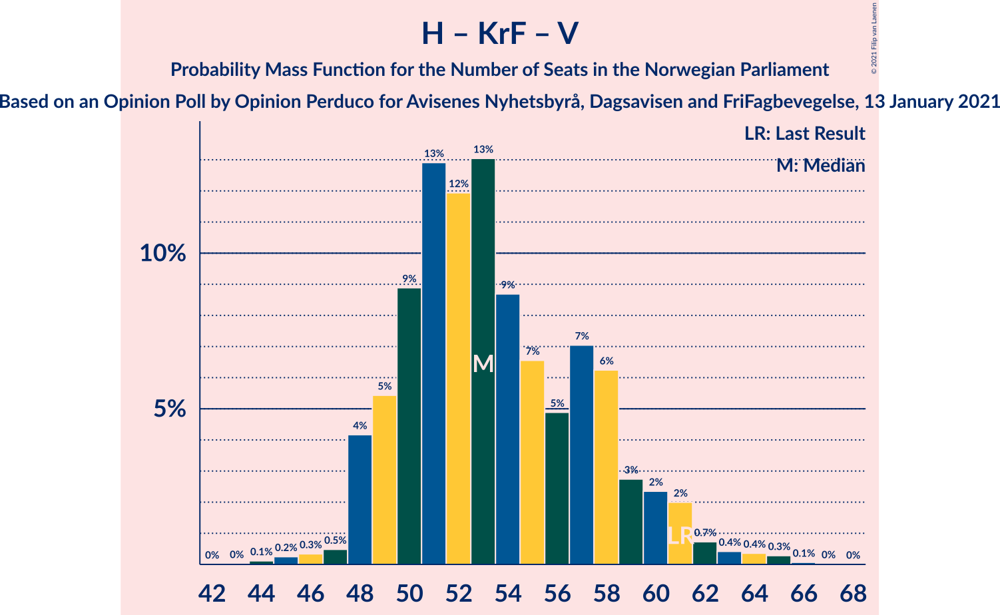

| Number of Seats | Probability | Accumulated | Special Marks |
|:---------------:|:-----------:|:-----------:|:-------------:|
| 44 | 0.1% | 100% |  |
| 45 | 0.2% | 99.9% |  |
| 46 | 0.3% | 99.6% |  |
| 47 | 0.5% | 99.3% |  |
| 48 | 4% | 98.8% |  |
| 49 | 5% | 95% |  |
| 50 | 9% | 89% |  |
| 51 | 13% | 80% |  |
| 52 | 12% | 67% |  |
| 53 | 13% | 55% | Median |
| 54 | 9% | 42% |  |
| 55 | 7% | 34% |  |
| 56 | 5% | 27% |  |
| 57 | 7% | 22% |  |
| 58 | 6% | 15% |  |
| 59 | 3% | 9% |  |
| 60 | 2% | 6% |  |
| 61 | 2% | 4% | Last Result |
| 62 | 0.7% | 2% |  |
| 63 | 0.4% | 1.2% |  |
| 64 | 0.4% | 0.7% |  |
| 65 | 0.3% | 0.4% |  |
| 66 | 0.1% | 0.1% |  |
| 67 | 0% | 0% |  |

### Arbeiderpartiet – Sosialistisk Venstreparti

| Number of Seats | Probability | Accumulated | Special Marks |
|:---------------:|:-----------:|:-----------:|:-------------:|
| 40 | 0.1% | 100% |  |
| 41 | 0.2% | 99.8% |  |
| 42 | 1.1% | 99.6% |  |
| 43 | 0.8% | 98.5% |  |
| 44 | 3% | 98% |  |
| 45 | 4% | 95% |  |
| 46 | 3% | 91% |  |
| 47 | 9% | 87% |  |
| 48 | 9% | 79% |  |
| 49 | 16% | 69% |  |
| 50 | 10% | 53% | Median |
| 51 | 13% | 43% |  |
| 52 | 7% | 30% |  |
| 53 | 8% | 23% |  |
| 54 | 8% | 15% |  |
| 55 | 4% | 7% |  |
| 56 | 1.2% | 3% |  |
| 57 | 1.1% | 2% |  |
| 58 | 0.3% | 0.5% |  |
| 59 | 0.2% | 0.2% |  |
| 60 | 0% | 0.1% | Last Result |
| 61 | 0% | 0% |  |

### Senterpartiet – Kristelig Folkeparti – Venstre

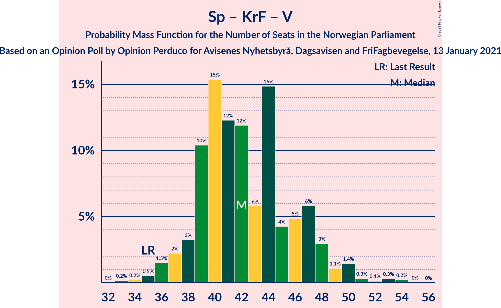

| Number of Seats | Probability | Accumulated | Special Marks |
|:---------------:|:-----------:|:-----------:|:-------------:|
| 33 | 0.2% | 100% |  |
| 34 | 0.2% | 99.8% |  |
| 35 | 0.5% | 99.6% | Last Result |
| 36 | 1.5% | 99.1% |  |
| 37 | 2% | 98% |  |
| 38 | 3% | 95% |  |
| 39 | 10% | 92% |  |
| 40 | 15% | 82% |  |
| 41 | 12% | 66% | Median |
| 42 | 12% | 54% |  |
| 43 | 6% | 42% |  |
| 44 | 15% | 36% |  |
| 45 | 4% | 21% |  |
| 46 | 5% | 17% |  |
| 47 | 6% | 12% |  |
| 48 | 3% | 7% |  |
| 49 | 1.1% | 4% |  |
| 50 | 1.4% | 2% |  |
| 51 | 0.3% | 1.0% |  |
| 52 | 0.1% | 0.7% |  |
| 53 | 0.3% | 0.6% |  |
| 54 | 0.2% | 0.3% |  |
| 55 | 0% | 0% |  |

## Technical Information

### Opinion Poll

+ **Polling firm:** Opinion Perduco
+ **Commissioner(s):** Avisenes Nyhetsbyrå, Dagsavisen and FriFagbevegelse
+ **Fieldwork period:** 13 January 2021

### Calculations

+ **Sample size:** 942
+ **Simulations done:** 1,048,576
+ **Error estimate:** 2.13%

