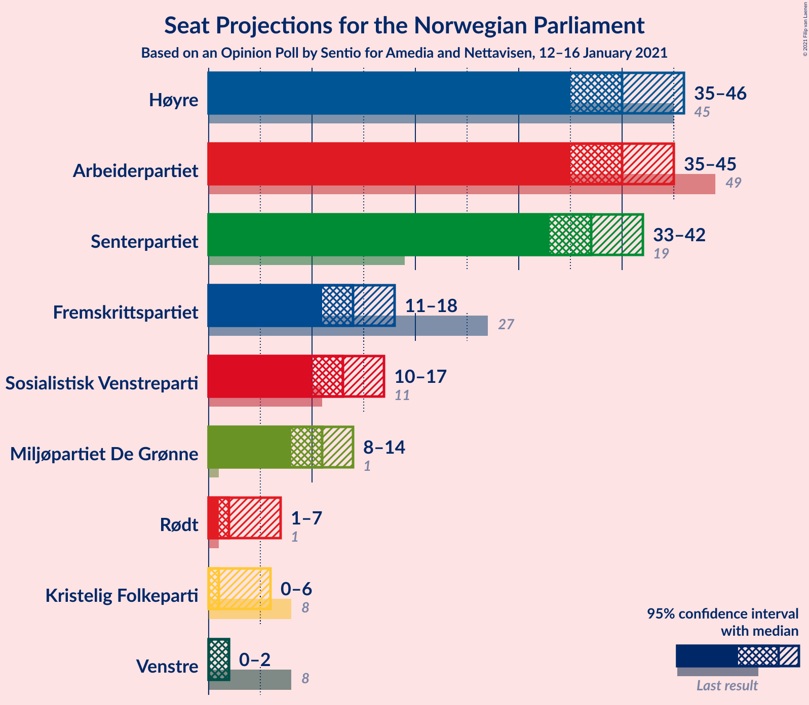
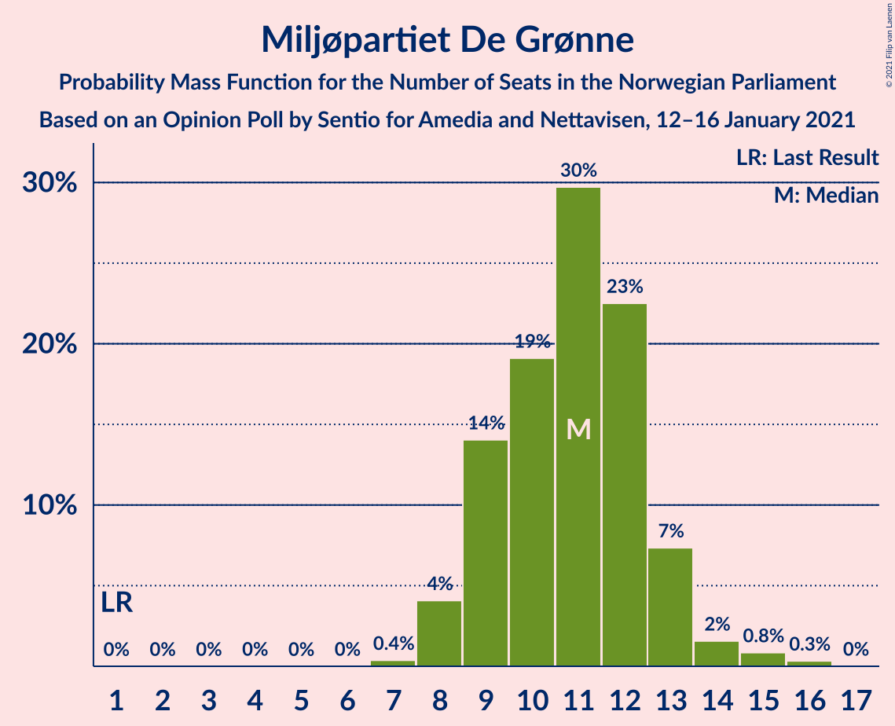
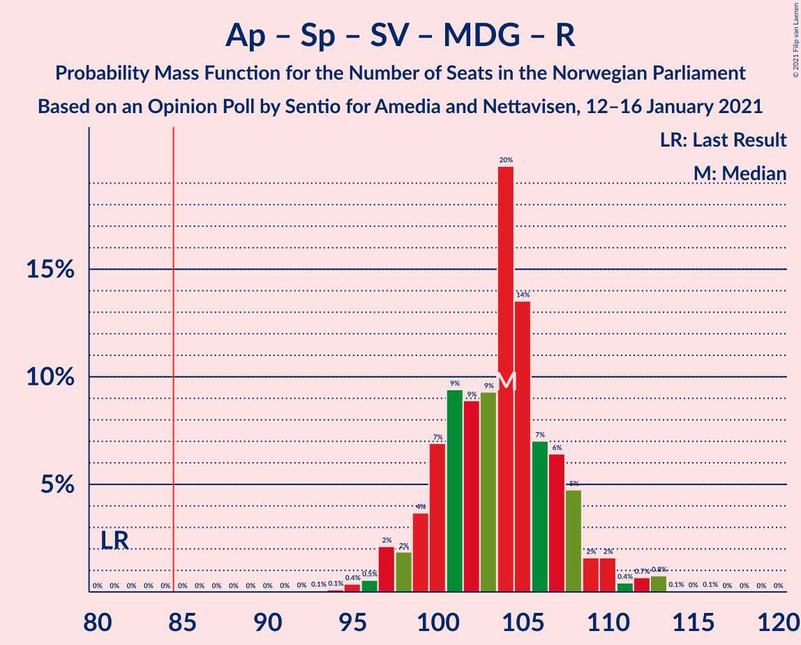
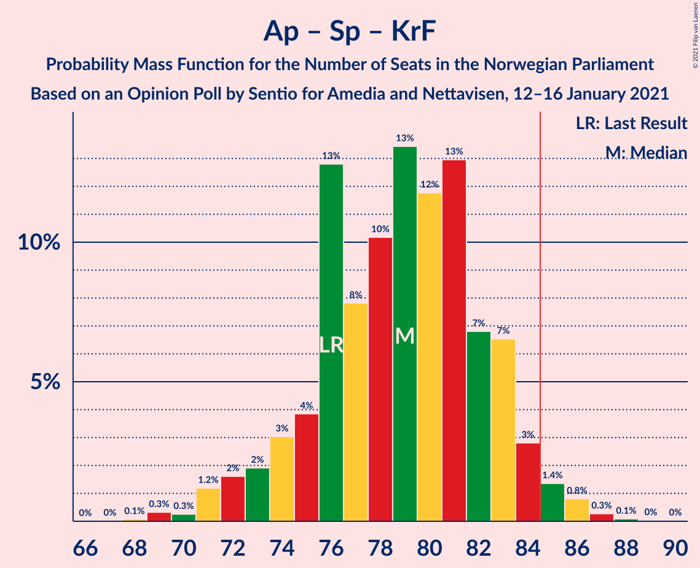
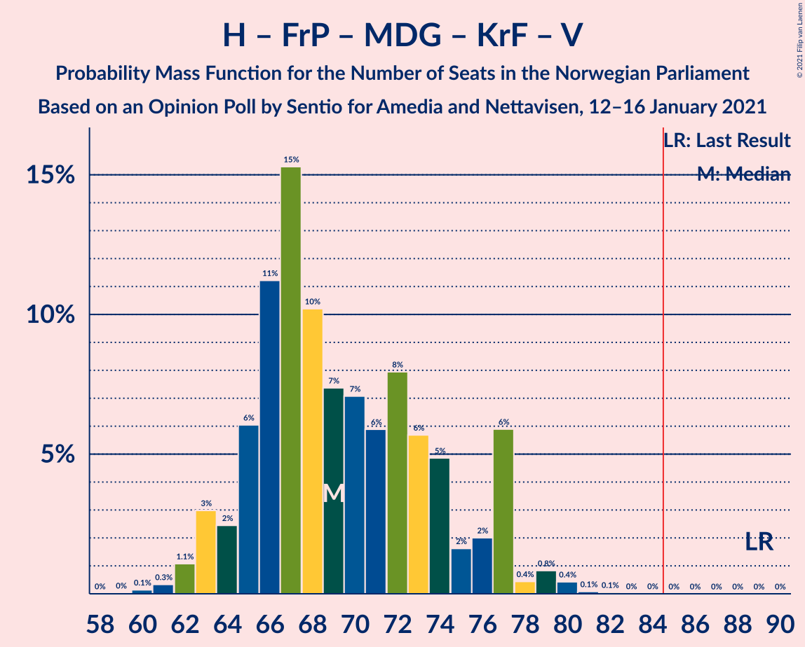

# Opinion Poll by Sentio for Amedia and Nettavisen, 12–16 January 2021

<a href="#voting-intentions">Voting Intentions</a> | <a href="#seats">Seats</a> | <a href="#coalitions">Coalitions</a> | <a href="#technical-information">Technical Information</a>

## Voting Intentions

### Confidence Intervals

| Party | Last Result | Poll Result | 80% Confidence Interval | 90% Confidence Interval | 95% Confidence Interval | 99% Confidence Interval |
|:-----:|:-----------:|:-----------:|:-----------------------:|:-----------------------:|:-----------------------:|:-----------------------:|
| Høyre | 25.0% | 23.0% | 21.4–24.8% |20.9–25.3% |20.5–25.7% |19.7–26.6% |
| Arbeiderpartiet | 27.4% | 21.3% | 19.7–23.0% |19.3–23.5% |18.9–24.0% |18.1–24.8% |
| Senterpartiet | 10.3% | 19.6% | 18.1–21.3% |17.6–21.8% |17.3–22.2% |16.5–23.0% |
| Fremskrittspartiet | 15.2% | 8.4% | 7.4–9.6% |7.1–10.0% |6.8–10.3% |6.4–10.9% |
| Sosialistisk Venstreparti | 6.0% | 7.8% | 6.8–9.0% |6.5–9.3% |6.3–9.6% |5.8–10.2% |
| Miljøpartiet De Grønne | 3.2% | 6.4% | 5.5–7.5% |5.3–7.8% |5.0–8.1% |4.6–8.7% |
| Rødt | 2.4% | 3.3% | 2.7–4.1% |2.5–4.4% |2.4–4.6% |2.1–5.0% |
| Kristelig Folkeparti | 4.2% | 2.9% | 2.3–3.7% |2.2–3.9% |2.0–4.1% |1.8–4.6% |
| Venstre | 4.4% | 2.6% | 2.1–3.4% |1.9–3.6% |1.8–3.8% |1.6–4.2% |

*Note:* The poll result column reflects the actual value used in the calculations. Published results may vary slightly, and in addition be rounded to fewer digits.

## Seats

### Confidence Intervals

| Party | Last Result | Median | 80% Confidence Interval | 90% Confidence Interval | 95% Confidence Interval | 99% Confidence Interval |
|:-----:|:-----------:|:------:|:-----------------------:|:-----------------------:|:-----------------------:|:-----------------------:|
| <a href="#høyre">Høyre</a> | 45 | 40 | 38–42 |37–43 |36–44 |34–48 |
| <a href="#arbeiderpartiet">Arbeiderpartiet</a> | 49 | 40 | 37–43 |35–43 |35–44 |33–45 |
| <a href="#senterpartiet">Senterpartiet</a> | 19 | 37 | 36–39 |34–42 |33–42 |31–43 |
| <a href="#fremskrittspartiet">Fremskrittspartiet</a> | 27 | 14 | 11–15 |11–17 |11–18 |10–19 |
| <a href="#sosialistisk-venstreparti">Sosialistisk Venstreparti</a> | 11 | 12 | 11–15 |10–16 |10–16 |9–17 |
| <a href="#miljøpartiet-de-grønne">Miljøpartiet De Grønne</a> | 1 | 11 | 9–12 |9–13 |8–13 |8–14 |
| <a href="#rødt">Rødt</a> | 1 | 2 | 2–7 |1–7 |1–7 |1–8 |
| <a href="#kristelig-folkeparti">Kristelig Folkeparti</a> | 8 | 2 | 0–3 |0–3 |0–7 |0–8 |
| <a href="#venstre">Venstre</a> | 8 | 2 | 1–2 |1–2 |1–2 |0–7 |

### Høyre

*For a full overview of the results for this party, see the [Høyre](party-høyre.html) page.*

| Number of Seats | Probability | Accumulated | Special Marks |
|:---------------:|:-----------:|:-----------:|:-------------:|
| 33 | 0.1% | 100% |  |
| 34 | 0.7% | 99.9% |  |
| 35 | 2% | 99.3% |  |
| 36 | 2% | 98% |  |
| 37 | 4% | 96% |  |
| 38 | 19% | 92% |  |
| 39 | 23% | 73% |  |
| 40 | 23% | 50% | Median |
| 41 | 9% | 27% |  |
| 42 | 11% | 18% |  |
| 43 | 3% | 7% |  |
| 44 | 2% | 4% |  |
| 45 | 0.9% | 2% | Last Result |
| 46 | 0.5% | 2% |  |
| 47 | 0.4% | 1.1% |  |
| 48 | 0.5% | 0.7% |  |
| 49 | 0.1% | 0.2% |  |
| 50 | 0.1% | 0.1% |  |
| 51 | 0% | 0% |  |

### Arbeiderpartiet

*For a full overview of the results for this party, see the [Arbeiderpartiet](party-arbeiderpartiet.html) page.*

| Number of Seats | Probability | Accumulated | Special Marks |
|:---------------:|:-----------:|:-----------:|:-------------:|
| 29 | 0.1% | 100% |  |
| 30 | 0% | 99.9% |  |
| 31 | 0.1% | 99.9% |  |
| 32 | 0.1% | 99.9% |  |
| 33 | 0.6% | 99.8% |  |
| 34 | 0.8% | 99.2% |  |
| 35 | 8% | 98% |  |
| 36 | 0.5% | 91% |  |
| 37 | 1.3% | 90% |  |
| 38 | 6% | 89% |  |
| 39 | 2% | 83% |  |
| 40 | 37% | 81% | Median |
| 41 | 20% | 44% |  |
| 42 | 2% | 24% |  |
| 43 | 19% | 22% |  |
| 44 | 1.4% | 3% |  |
| 45 | 2% | 2% |  |
| 46 | 0.1% | 0.2% |  |
| 47 | 0.1% | 0.1% |  |
| 48 | 0.1% | 0.1% |  |
| 49 | 0% | 0% | Last Result |

### Senterpartiet

*For a full overview of the results for this party, see the [Senterpartiet](party-senterpartiet.html) page.*

| Number of Seats | Probability | Accumulated | Special Marks |
|:---------------:|:-----------:|:-----------:|:-------------:|
| 19 | 0% | 100% | Last Result |
| 20 | 0% | 100% |  |
| 21 | 0% | 100% |  |
| 22 | 0% | 100% |  |
| 23 | 0% | 100% |  |
| 24 | 0% | 100% |  |
| 25 | 0% | 100% |  |
| 26 | 0% | 100% |  |
| 27 | 0% | 100% |  |
| 28 | 0% | 100% |  |
| 29 | 0.1% | 100% |  |
| 30 | 0.1% | 99.9% |  |
| 31 | 0.7% | 99.8% |  |
| 32 | 0.5% | 99.1% |  |
| 33 | 2% | 98.5% |  |
| 34 | 2% | 97% |  |
| 35 | 3% | 94% |  |
| 36 | 8% | 91% |  |
| 37 | 58% | 83% | Median |
| 38 | 11% | 25% |  |
| 39 | 4% | 13% |  |
| 40 | 0.9% | 10% |  |
| 41 | 3% | 9% |  |
| 42 | 5% | 6% |  |
| 43 | 0.4% | 0.7% |  |
| 44 | 0.2% | 0.3% |  |
| 45 | 0.1% | 0.1% |  |
| 46 | 0% | 0% |  |

### Fremskrittspartiet

*For a full overview of the results for this party, see the [Fremskrittspartiet](party-fremskrittspartiet.html) page.*

| Number of Seats | Probability | Accumulated | Special Marks |
|:---------------:|:-----------:|:-----------:|:-------------:|
| 9 | 0.1% | 100% |  |
| 10 | 2% | 99.9% |  |
| 11 | 10% | 98% |  |
| 12 | 4% | 88% |  |
| 13 | 19% | 84% |  |
| 14 | 28% | 65% | Median |
| 15 | 28% | 37% |  |
| 16 | 4% | 9% |  |
| 17 | 3% | 6% |  |
| 18 | 2% | 3% |  |
| 19 | 0.4% | 0.6% |  |
| 20 | 0.1% | 0.2% |  |
| 21 | 0.1% | 0.1% |  |
| 22 | 0% | 0% |  |
| 23 | 0% | 0% |  |
| 24 | 0% | 0% |  |
| 25 | 0% | 0% |  |
| 26 | 0% | 0% |  |
| 27 | 0% | 0% | Last Result |

### Sosialistisk Venstreparti

*For a full overview of the results for this party, see the [Sosialistisk Venstreparti](party-sosialistiskvenstreparti.html) page.*

| Number of Seats | Probability | Accumulated | Special Marks |
|:---------------:|:-----------:|:-----------:|:-------------:|
| 9 | 0.5% | 100% |  |
| 10 | 6% | 99.5% |  |
| 11 | 19% | 94% | Last Result |
| 12 | 28% | 74% | Median |
| 13 | 17% | 46% |  |
| 14 | 13% | 29% |  |
| 15 | 8% | 17% |  |
| 16 | 7% | 8% |  |
| 17 | 1.1% | 2% |  |
| 18 | 0.3% | 0.4% |  |
| 19 | 0% | 0.1% |  |
| 20 | 0.1% | 0.1% |  |
| 21 | 0% | 0% |  |

### Miljøpartiet De Grønne

*For a full overview of the results for this party, see the [Miljøpartiet De Grønne](party-miljøpartietdegrønne.html) page.*

| Number of Seats | Probability | Accumulated | Special Marks |
|:---------------:|:-----------:|:-----------:|:-------------:|
| 1 | 0% | 100% | Last Result |
| 2 | 0% | 100% |  |
| 3 | 0% | 100% |  |
| 4 | 0% | 100% |  |
| 5 | 0% | 100% |  |
| 6 | 0% | 100% |  |
| 7 | 0.3% | 100% |  |
| 8 | 4% | 99.6% |  |
| 9 | 21% | 96% |  |
| 10 | 14% | 74% |  |
| 11 | 44% | 60% | Median |
| 12 | 10% | 16% |  |
| 13 | 5% | 7% |  |
| 14 | 1.0% | 1.4% |  |
| 15 | 0.1% | 0.4% |  |
| 16 | 0.2% | 0.3% |  |
| 17 | 0% | 0% |  |

### Rødt

*For a full overview of the results for this party, see the [Rødt](party-rødt.html) page.*

| Number of Seats | Probability | Accumulated | Special Marks |
|:---------------:|:-----------:|:-----------:|:-------------:|
| 1 | 7% | 100% | Last Result |
| 2 | 69% | 93% | Median |
| 3 | 0% | 24% |  |
| 4 | 0% | 24% |  |
| 5 | 0% | 24% |  |
| 6 | 1.5% | 24% |  |
| 7 | 21% | 23% |  |
| 8 | 1.1% | 1.2% |  |
| 9 | 0.1% | 0.1% |  |
| 10 | 0% | 0% |  |

### Kristelig Folkeparti

*For a full overview of the results for this party, see the [Kristelig Folkeparti](party-kristeligfolkeparti.html) page.*

| Number of Seats | Probability | Accumulated | Special Marks |
|:---------------:|:-----------:|:-----------:|:-------------:|
| 0 | 22% | 100% |  |
| 1 | 21% | 78% |  |
| 2 | 27% | 57% | Median |
| 3 | 26% | 30% |  |
| 4 | 0% | 4% |  |
| 5 | 0% | 4% |  |
| 6 | 1.4% | 4% |  |
| 7 | 2% | 3% |  |
| 8 | 0.8% | 0.8% | Last Result |
| 9 | 0% | 0% |  |

### Venstre

*For a full overview of the results for this party, see the [Venstre](party-venstre.html) page.*

| Number of Seats | Probability | Accumulated | Special Marks |
|:---------------:|:-----------:|:-----------:|:-------------:|
| 0 | 1.3% | 100% |  |
| 1 | 24% | 98.7% |  |
| 2 | 73% | 75% | Median |
| 3 | 0.3% | 2% |  |
| 4 | 0% | 2% |  |
| 5 | 0% | 2% |  |
| 6 | 0.1% | 2% |  |
| 7 | 2% | 2% |  |
| 8 | 0% | 0% | Last Result |

## Coalitions

### Confidence Intervals

| Coalition | Last Result | Median | Majority? | 80% Confidence Interval | 90% Confidence Interval | 95% Confidence Interval | 99% Confidence Interval |
|:---------:|:-----------:|:------:|:---------:|:-----------------------:|:-----------------------:|:-----------------------:|:-----------------------:|
| Arbeiderpartiet – Senterpartiet – Sosialistisk Venstreparti – Miljøpartiet De Grønne – Rødt | 81 | 104 | 100% | 101–106 | 99–108 | 98–110 | 96–112 |
| Arbeiderpartiet – Senterpartiet – Sosialistisk Venstreparti – Miljøpartiet De Grønne – Kristelig Folkeparti | 88 | 102 | 100% | 99–106 | 99–108 | 97–109 | 95–114 |
| Arbeiderpartiet – Senterpartiet – Sosialistisk Venstreparti – Miljøpartiet De Grønne | 80 | 102 | 100% | 97–104 | 97–105 | 95–106 | 92–110 |
| Høyre – Senterpartiet – Fremskrittspartiet – Kristelig Folkeparti – Venstre | 107 | 94 | 100% | 92–100 | 91–100 | 89–101 | 88–105 |
| Arbeiderpartiet – Senterpartiet – Sosialistisk Venstreparti – Rødt | 80 | 94 | 99.8% | 90–96 | 88–97 | 87–99 | 85–102 |
| Arbeiderpartiet – Senterpartiet – Miljøpartiet De Grønne – Kristelig Folkeparti | 77 | 89 | 97% | 88–94 | 86–95 | 83–96 | 80–99 |
| Arbeiderpartiet – Senterpartiet – Sosialistisk Venstreparti | 79 | 91 | 98% | 87–93 | 86–94 | 85–95 | 83–97 |
| Arbeiderpartiet – Senterpartiet – Kristelig Folkeparti | 76 | 79 | 2% | 77–83 | 75–83 | 72–84 | 69–87 |
| Arbeiderpartiet – Senterpartiet | 68 | 78 | 0.2% | 75–80 | 73–80 | 71–80 | 68–83 |
| Høyre – Fremskrittspartiet – Miljøpartiet De Grønne – Kristelig Folkeparti – Venstre | 89 | 67 | 0% | 65–71 | 65–74 | 63–76 | 60–78 |
| Høyre – Fremskrittspartiet – Kristelig Folkeparti – Venstre | 88 | 57 | 0% | 55–60 | 54–63 | 53–64 | 51–67 |
| Høyre – Fremskrittspartiet – Venstre | 80 | 55 | 0% | 53–59 | 52–60 | 51–63 | 50–66 |
| Høyre – Fremskrittspartiet | 72 | 53 | 0% | 52–57 | 51–58 | 49–61 | 48–64 |
| Arbeiderpartiet – Sosialistisk Venstreparti | 60 | 54 | 0% | 50–56 | 47–56 | 47–58 | 45–59 |
| Høyre – Kristelig Folkeparti – Venstre | 61 | 43 | 0% | 41–46 | 40–48 | 39–50 | 37–52 |
| Senterpartiet – Kristelig Folkeparti – Venstre | 35 | 41 | 0% | 39–45 | 37–46 | 36–48 | 33–50 |

### Arbeiderpartiet – Senterpartiet – Sosialistisk Venstreparti – Miljøpartiet De Grønne – Rødt

| Number of Seats | Probability | Accumulated | Special Marks |
|:---------------:|:-----------:|:-----------:|:-------------:|
| 81 | 0% | 100% | Last Result |
| 82 | 0% | 100% |  |
| 83 | 0% | 100% |  |
| 84 | 0% | 100% |  |
| 85 | 0% | 100% | Majority |
| 86 | 0% | 100% |  |
| 87 | 0% | 100% |  |
| 88 | 0% | 100% |  |
| 89 | 0% | 100% |  |
| 90 | 0% | 100% |  |
| 91 | 0% | 100% |  |
| 92 | 0% | 100% |  |
| 93 | 0.1% | 100% |  |
| 94 | 0.1% | 99.9% |  |
| 95 | 0.1% | 99.8% |  |
| 96 | 1.4% | 99.7% |  |
| 97 | 0.6% | 98% |  |
| 98 | 0.9% | 98% |  |
| 99 | 3% | 97% |  |
| 100 | 1.4% | 94% |  |
| 101 | 7% | 92% |  |
| 102 | 3% | 85% | Median |
| 103 | 9% | 82% |  |
| 104 | 40% | 73% |  |
| 105 | 18% | 33% |  |
| 106 | 6% | 15% |  |
| 107 | 2% | 9% |  |
| 108 | 3% | 7% |  |
| 109 | 1.2% | 4% |  |
| 110 | 1.1% | 3% |  |
| 111 | 1.0% | 2% |  |
| 112 | 0.9% | 0.9% |  |
| 113 | 0% | 0.1% |  |
| 114 | 0% | 0.1% |  |
| 115 | 0% | 0% |  |

### Arbeiderpartiet – Senterpartiet – Sosialistisk Venstreparti – Miljøpartiet De Grønne – Kristelig Folkeparti

| Number of Seats | Probability | Accumulated | Special Marks |
|:---------------:|:-----------:|:-----------:|:-------------:|
| 88 | 0% | 100% | Last Result |
| 89 | 0% | 100% |  |
| 90 | 0% | 100% |  |
| 91 | 0% | 100% |  |
| 92 | 0.1% | 100% |  |
| 93 | 0.2% | 99.9% |  |
| 94 | 0.1% | 99.7% |  |
| 95 | 0.9% | 99.5% |  |
| 96 | 0.3% | 98.7% |  |
| 97 | 0.8% | 98% |  |
| 98 | 1.3% | 97% |  |
| 99 | 19% | 96% |  |
| 100 | 6% | 77% |  |
| 101 | 3% | 71% |  |
| 102 | 25% | 68% | Median |
| 103 | 2% | 43% |  |
| 104 | 14% | 41% |  |
| 105 | 4% | 27% |  |
| 106 | 17% | 23% |  |
| 107 | 1.0% | 6% |  |
| 108 | 1.2% | 5% |  |
| 109 | 2% | 4% |  |
| 110 | 0.3% | 2% |  |
| 111 | 0.8% | 2% |  |
| 112 | 0.2% | 0.9% |  |
| 113 | 0% | 0.7% |  |
| 114 | 0.6% | 0.6% |  |
| 115 | 0% | 0% |  |

### Arbeiderpartiet – Senterpartiet – Sosialistisk Venstreparti – Miljøpartiet De Grønne

| Number of Seats | Probability | Accumulated | Special Marks |
|:---------------:|:-----------:|:-----------:|:-------------:|
| 80 | 0% | 100% | Last Result |
| 81 | 0% | 100% |  |
| 82 | 0% | 100% |  |
| 83 | 0% | 100% |  |
| 84 | 0% | 100% |  |
| 85 | 0% | 100% | Majority |
| 86 | 0% | 100% |  |
| 87 | 0% | 100% |  |
| 88 | 0% | 100% |  |
| 89 | 0% | 100% |  |
| 90 | 0% | 100% |  |
| 91 | 0.1% | 100% |  |
| 92 | 0.4% | 99.9% |  |
| 93 | 0.2% | 99.5% |  |
| 94 | 1.0% | 99.3% |  |
| 95 | 1.1% | 98% |  |
| 96 | 1.1% | 97% |  |
| 97 | 20% | 96% |  |
| 98 | 2% | 76% |  |
| 99 | 8% | 74% |  |
| 100 | 2% | 66% | Median |
| 101 | 10% | 64% |  |
| 102 | 23% | 54% |  |
| 103 | 19% | 30% |  |
| 104 | 6% | 11% |  |
| 105 | 2% | 5% |  |
| 106 | 1.5% | 3% |  |
| 107 | 0.4% | 2% |  |
| 108 | 0.6% | 2% |  |
| 109 | 0.2% | 1.0% |  |
| 110 | 0.7% | 0.8% |  |
| 111 | 0% | 0.1% |  |
| 112 | 0% | 0% |  |

### Høyre – Senterpartiet – Fremskrittspartiet – Kristelig Folkeparti – Venstre

| Number of Seats | Probability | Accumulated | Special Marks |
|:---------------:|:-----------:|:-----------:|:-------------:|
| 86 | 0.2% | 100% |  |
| 87 | 0% | 99.8% |  |
| 88 | 2% | 99.8% |  |
| 89 | 0.5% | 98% |  |
| 90 | 2% | 97% |  |
| 91 | 2% | 96% |  |
| 92 | 16% | 94% |  |
| 93 | 25% | 78% |  |
| 94 | 11% | 53% |  |
| 95 | 19% | 42% | Median |
| 96 | 3% | 24% |  |
| 97 | 5% | 21% |  |
| 98 | 4% | 16% |  |
| 99 | 1.2% | 12% |  |
| 100 | 8% | 11% |  |
| 101 | 0.6% | 3% |  |
| 102 | 0.6% | 2% |  |
| 103 | 0.4% | 2% |  |
| 104 | 0.3% | 1.2% |  |
| 105 | 0.5% | 0.9% |  |
| 106 | 0.2% | 0.3% |  |
| 107 | 0.1% | 0.2% | Last Result |
| 108 | 0.1% | 0.1% |  |
| 109 | 0% | 0% |  |

### Arbeiderpartiet – Senterpartiet – Sosialistisk Venstreparti – Rødt

| Number of Seats | Probability | Accumulated | Special Marks |
|:---------------:|:-----------:|:-----------:|:-------------:|
| 80 | 0% | 100% | Last Result |
| 81 | 0% | 100% |  |
| 82 | 0.1% | 100% |  |
| 83 | 0% | 99.9% |  |
| 84 | 0.1% | 99.9% |  |
| 85 | 2% | 99.8% | Majority |
| 86 | 0.6% | 98% |  |
| 87 | 0.7% | 98% |  |
| 88 | 3% | 97% |  |
| 89 | 2% | 94% |  |
| 90 | 3% | 92% |  |
| 91 | 8% | 89% | Median |
| 92 | 4% | 81% |  |
| 93 | 26% | 77% |  |
| 94 | 20% | 51% |  |
| 95 | 18% | 31% |  |
| 96 | 7% | 13% |  |
| 97 | 2% | 6% |  |
| 98 | 2% | 5% |  |
| 99 | 1.0% | 3% |  |
| 100 | 1.0% | 2% |  |
| 101 | 0.1% | 0.7% |  |
| 102 | 0.6% | 0.7% |  |
| 103 | 0% | 0% |  |

### Arbeiderpartiet – Senterpartiet – Miljøpartiet De Grønne – Kristelig Folkeparti

| Number of Seats | Probability | Accumulated | Special Marks |
|:---------------:|:-----------:|:-----------:|:-------------:|
| 77 | 0% | 100% | Last Result |
| 78 | 0% | 100% |  |
| 79 | 0% | 100% |  |
| 80 | 0.9% | 100% |  |
| 81 | 0.7% | 99.0% |  |
| 82 | 0.7% | 98% |  |
| 83 | 0.3% | 98% |  |
| 84 | 0.4% | 97% |  |
| 85 | 1.2% | 97% | Majority |
| 86 | 1.4% | 96% |  |
| 87 | 3% | 94% |  |
| 88 | 25% | 91% |  |
| 89 | 21% | 65% |  |
| 90 | 17% | 44% | Median |
| 91 | 2% | 27% |  |
| 92 | 0.3% | 24% |  |
| 93 | 1.3% | 24% |  |
| 94 | 17% | 23% |  |
| 95 | 2% | 5% |  |
| 96 | 1.1% | 3% |  |
| 97 | 1.2% | 2% |  |
| 98 | 0.1% | 0.9% |  |
| 99 | 0.8% | 0.8% |  |
| 100 | 0% | 0% |  |

### Arbeiderpartiet – Senterpartiet – Sosialistisk Venstreparti

| Number of Seats | Probability | Accumulated | Special Marks |
|:---------------:|:-----------:|:-----------:|:-------------:|
| 79 | 0% | 100% | Last Result |
| 80 | 0.1% | 100% |  |
| 81 | 0% | 99.9% |  |
| 82 | 0.2% | 99.9% |  |
| 83 | 1.4% | 99.7% |  |
| 84 | 0.8% | 98% |  |
| 85 | 0.7% | 98% | Majority |
| 86 | 4% | 97% |  |
| 87 | 3% | 93% |  |
| 88 | 19% | 90% |  |
| 89 | 8% | 70% | Median |
| 90 | 4% | 62% |  |
| 91 | 27% | 58% |  |
| 92 | 19% | 31% |  |
| 93 | 3% | 12% |  |
| 94 | 6% | 9% |  |
| 95 | 1.3% | 3% |  |
| 96 | 0.9% | 2% |  |
| 97 | 0.9% | 1.0% |  |
| 98 | 0.1% | 0.2% |  |
| 99 | 0% | 0% |  |

### Arbeiderpartiet – Senterpartiet – Kristelig Folkeparti

| Number of Seats | Probability | Accumulated | Special Marks |
|:---------------:|:-----------:|:-----------:|:-------------:|
| 69 | 1.2% | 100% |  |
| 70 | 0.2% | 98.8% |  |
| 71 | 0.5% | 98.6% |  |
| 72 | 1.3% | 98% |  |
| 73 | 0.5% | 97% |  |
| 74 | 0.9% | 96% |  |
| 75 | 2% | 95% |  |
| 76 | 1.3% | 94% | Last Result |
| 77 | 4% | 92% |  |
| 78 | 28% | 88% |  |
| 79 | 28% | 61% | Median |
| 80 | 5% | 33% |  |
| 81 | 3% | 27% |  |
| 82 | 1.2% | 24% |  |
| 83 | 18% | 23% |  |
| 84 | 3% | 5% |  |
| 85 | 0.3% | 2% | Majority |
| 86 | 0.9% | 2% |  |
| 87 | 1.0% | 1.1% |  |
| 88 | 0% | 0.1% |  |
| 89 | 0% | 0% |  |

### Arbeiderpartiet – Senterpartiet

| Number of Seats | Probability | Accumulated | Special Marks |
|:---------------:|:-----------:|:-----------:|:-------------:|
| 67 | 0.1% | 100% |  |
| 68 | 1.2% | 99.9% | Last Result |
| 69 | 0.2% | 98.7% |  |
| 70 | 0.9% | 98.5% |  |
| 71 | 2% | 98% |  |
| 72 | 0.5% | 96% |  |
| 73 | 0.4% | 95% |  |
| 74 | 2% | 95% |  |
| 75 | 3% | 93% |  |
| 76 | 7% | 90% |  |
| 77 | 31% | 82% | Median |
| 78 | 23% | 52% |  |
| 79 | 6% | 28% |  |
| 80 | 20% | 22% |  |
| 81 | 1.0% | 2% |  |
| 82 | 0.3% | 1.4% |  |
| 83 | 0.8% | 1.1% |  |
| 84 | 0.1% | 0.3% |  |
| 85 | 0.1% | 0.2% | Majority |
| 86 | 0.1% | 0.1% |  |
| 87 | 0% | 0% |  |

### Høyre – Fremskrittspartiet – Miljøpartiet De Grønne – Kristelig Folkeparti – Venstre

| Number of Seats | Probability | Accumulated | Special Marks |
|:---------------:|:-----------:|:-----------:|:-------------:|
| 59 | 0.1% | 100% |  |
| 60 | 0.6% | 99.9% |  |
| 61 | 0.3% | 99.3% |  |
| 62 | 0.2% | 99.1% |  |
| 63 | 2% | 98.9% |  |
| 64 | 2% | 97% |  |
| 65 | 9% | 95% |  |
| 66 | 15% | 87% |  |
| 67 | 34% | 71% |  |
| 68 | 12% | 38% |  |
| 69 | 3% | 26% | Median |
| 70 | 9% | 23% |  |
| 71 | 4% | 13% |  |
| 72 | 2% | 9% |  |
| 73 | 2% | 7% |  |
| 74 | 1.3% | 6% |  |
| 75 | 2% | 4% |  |
| 76 | 1.1% | 3% |  |
| 77 | 1.1% | 2% |  |
| 78 | 0.4% | 0.7% |  |
| 79 | 0.1% | 0.4% |  |
| 80 | 0.1% | 0.3% |  |
| 81 | 0.1% | 0.2% |  |
| 82 | 0.1% | 0.1% |  |
| 83 | 0% | 0% |  |
| 84 | 0% | 0% |  |
| 85 | 0% | 0% | Majority |
| 86 | 0% | 0% |  |
| 87 | 0% | 0% |  |
| 88 | 0% | 0% |  |
| 89 | 0% | 0% | Last Result |

### Høyre – Fremskrittspartiet – Kristelig Folkeparti – Venstre

| Number of Seats | Probability | Accumulated | Special Marks |
|:---------------:|:-----------:|:-----------:|:-------------:|
| 50 | 0.3% | 100% |  |
| 51 | 1.1% | 99.7% |  |
| 52 | 0.6% | 98.6% |  |
| 53 | 2% | 98% |  |
| 54 | 2% | 96% |  |
| 55 | 21% | 94% |  |
| 56 | 18% | 73% |  |
| 57 | 9% | 55% |  |
| 58 | 25% | 45% | Median |
| 59 | 4% | 20% |  |
| 60 | 7% | 16% |  |
| 61 | 3% | 9% |  |
| 62 | 1.0% | 6% |  |
| 63 | 1.3% | 5% |  |
| 64 | 2% | 4% |  |
| 65 | 0.7% | 2% |  |
| 66 | 0.5% | 1.0% |  |
| 67 | 0.2% | 0.6% |  |
| 68 | 0.1% | 0.3% |  |
| 69 | 0.1% | 0.2% |  |
| 70 | 0% | 0.1% |  |
| 71 | 0.1% | 0.1% |  |
| 72 | 0% | 0% |  |
| 73 | 0% | 0% |  |
| 74 | 0% | 0% |  |
| 75 | 0% | 0% |  |
| 76 | 0% | 0% |  |
| 77 | 0% | 0% |  |
| 78 | 0% | 0% |  |
| 79 | 0% | 0% |  |
| 80 | 0% | 0% |  |
| 81 | 0% | 0% |  |
| 82 | 0% | 0% |  |
| 83 | 0% | 0% |  |
| 84 | 0% | 0% |  |
| 85 | 0% | 0% | Majority |
| 86 | 0% | 0% |  |
| 87 | 0% | 0% |  |
| 88 | 0% | 0% | Last Result |

### Høyre – Fremskrittspartiet – Venstre

| Number of Seats | Probability | Accumulated | Special Marks |
|:---------------:|:-----------:|:-----------:|:-------------:|
| 47 | 0.1% | 100% |  |
| 48 | 0% | 99.9% |  |
| 49 | 0.2% | 99.9% |  |
| 50 | 2% | 99.7% |  |
| 51 | 2% | 98% |  |
| 52 | 2% | 96% |  |
| 53 | 20% | 94% |  |
| 54 | 5% | 74% |  |
| 55 | 28% | 70% |  |
| 56 | 19% | 42% | Median |
| 57 | 8% | 23% |  |
| 58 | 4% | 15% |  |
| 59 | 4% | 11% |  |
| 60 | 2% | 7% |  |
| 61 | 0.6% | 5% |  |
| 62 | 1.3% | 4% |  |
| 63 | 2% | 3% |  |
| 64 | 0.2% | 1.0% |  |
| 65 | 0.2% | 0.7% |  |
| 66 | 0.4% | 0.6% |  |
| 67 | 0.1% | 0.2% |  |
| 68 | 0% | 0.1% |  |
| 69 | 0.1% | 0.1% |  |
| 70 | 0% | 0% |  |
| 71 | 0% | 0% |  |
| 72 | 0% | 0% |  |
| 73 | 0% | 0% |  |
| 74 | 0% | 0% |  |
| 75 | 0% | 0% |  |
| 76 | 0% | 0% |  |
| 77 | 0% | 0% |  |
| 78 | 0% | 0% |  |
| 79 | 0% | 0% |  |
| 80 | 0% | 0% | Last Result |

### Høyre – Fremskrittspartiet

| Number of Seats | Probability | Accumulated | Special Marks |
|:---------------:|:-----------:|:-----------:|:-------------:|
| 46 | 0% | 100% |  |
| 47 | 0.2% | 99.9% |  |
| 48 | 2% | 99.7% |  |
| 49 | 1.4% | 98% |  |
| 50 | 2% | 97% |  |
| 51 | 3% | 95% |  |
| 52 | 23% | 92% |  |
| 53 | 29% | 69% |  |
| 54 | 18% | 40% | Median |
| 55 | 8% | 22% |  |
| 56 | 4% | 14% |  |
| 57 | 4% | 10% |  |
| 58 | 2% | 7% |  |
| 59 | 0.5% | 5% |  |
| 60 | 1.4% | 4% |  |
| 61 | 0.8% | 3% |  |
| 62 | 1.1% | 2% |  |
| 63 | 0.1% | 0.8% |  |
| 64 | 0.3% | 0.6% |  |
| 65 | 0.3% | 0.4% |  |
| 66 | 0% | 0.1% |  |
| 67 | 0.1% | 0.1% |  |
| 68 | 0% | 0% |  |
| 69 | 0% | 0% |  |
| 70 | 0% | 0% |  |
| 71 | 0% | 0% |  |
| 72 | 0% | 0% | Last Result |

### Arbeiderpartiet – Sosialistisk Venstreparti

| Number of Seats | Probability | Accumulated | Special Marks |
|:---------------:|:-----------:|:-----------:|:-------------:|
| 43 | 0% | 100% |  |
| 44 | 0.2% | 99.9% |  |
| 45 | 0.5% | 99.8% |  |
| 46 | 0.5% | 99.2% |  |
| 47 | 6% | 98.7% |  |
| 48 | 1.0% | 93% |  |
| 49 | 1.0% | 92% |  |
| 50 | 5% | 91% |  |
| 51 | 21% | 86% |  |
| 52 | 2% | 65% | Median |
| 53 | 7% | 63% |  |
| 54 | 25% | 56% |  |
| 55 | 19% | 31% |  |
| 56 | 8% | 12% |  |
| 57 | 2% | 5% |  |
| 58 | 1.3% | 3% |  |
| 59 | 1.5% | 2% |  |
| 60 | 0.1% | 0.2% | Last Result |
| 61 | 0% | 0.1% |  |
| 62 | 0.1% | 0.1% |  |
| 63 | 0% | 0% |  |

### Høyre – Kristelig Folkeparti – Venstre

| Number of Seats | Probability | Accumulated | Special Marks |
|:---------------:|:-----------:|:-----------:|:-------------:|
| 36 | 0.1% | 100% |  |
| 37 | 0.5% | 99.9% |  |
| 38 | 1.4% | 99.4% |  |
| 39 | 2% | 98% |  |
| 40 | 4% | 96% |  |
| 41 | 5% | 93% |  |
| 42 | 31% | 87% |  |
| 43 | 24% | 56% |  |
| 44 | 5% | 31% | Median |
| 45 | 4% | 26% |  |
| 46 | 13% | 22% |  |
| 47 | 1.2% | 9% |  |
| 48 | 4% | 8% |  |
| 49 | 1.1% | 4% |  |
| 50 | 2% | 3% |  |
| 51 | 0.5% | 1.1% |  |
| 52 | 0.3% | 0.6% |  |
| 53 | 0.2% | 0.3% |  |
| 54 | 0% | 0.1% |  |
| 55 | 0% | 0.1% |  |
| 56 | 0% | 0% |  |
| 57 | 0% | 0% |  |
| 58 | 0% | 0% |  |
| 59 | 0% | 0% |  |
| 60 | 0% | 0% |  |
| 61 | 0% | 0% | Last Result |

### Senterpartiet – Kristelig Folkeparti – Venstre

| Number of Seats | Probability | Accumulated | Special Marks |
|:---------------:|:-----------:|:-----------:|:-------------:|
| 31 | 0.1% | 100% |  |
| 32 | 0% | 99.9% |  |
| 33 | 0.7% | 99.9% |  |
| 34 | 0.2% | 99.2% |  |
| 35 | 1.3% | 99.0% | Last Result |
| 36 | 2% | 98% |  |
| 37 | 2% | 96% |  |
| 38 | 2% | 94% |  |
| 39 | 17% | 92% |  |
| 40 | 11% | 75% |  |
| 41 | 47% | 64% | Median |
| 42 | 2% | 18% |  |
| 43 | 2% | 16% |  |
| 44 | 0.7% | 13% |  |
| 45 | 7% | 12% |  |
| 46 | 1.3% | 6% |  |
| 47 | 2% | 5% |  |
| 48 | 2% | 3% |  |
| 49 | 0.2% | 0.9% |  |
| 50 | 0.5% | 0.7% |  |
| 51 | 0.1% | 0.1% |  |
| 52 | 0% | 0.1% |  |
| 53 | 0% | 0% |  |

## Technical Information

### Opinion Poll

+ **Polling firm:** Sentio
+ **Commissioner(s):** Amedia and Nettavisen
+ **Fieldwork period:** 12–16 January 2021

### Calculations

+ **Sample size:** 1000
+ **Simulations done:** 131,072
+ **Error estimate:** 1.28%

