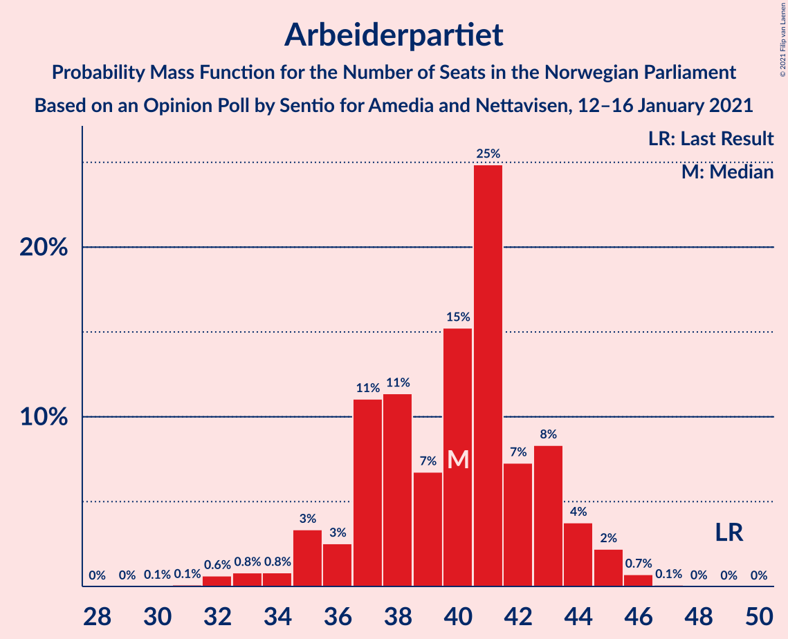
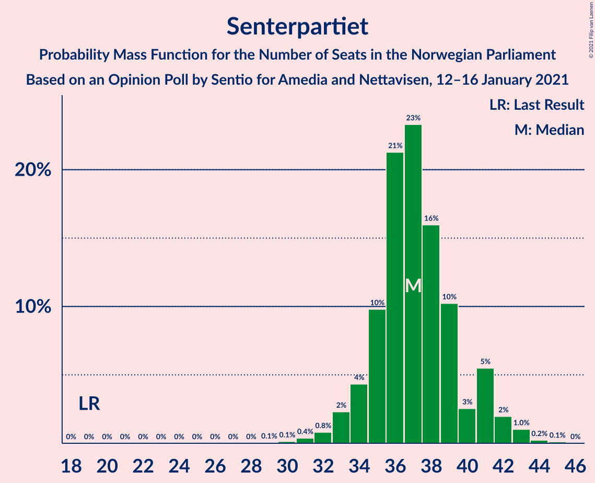
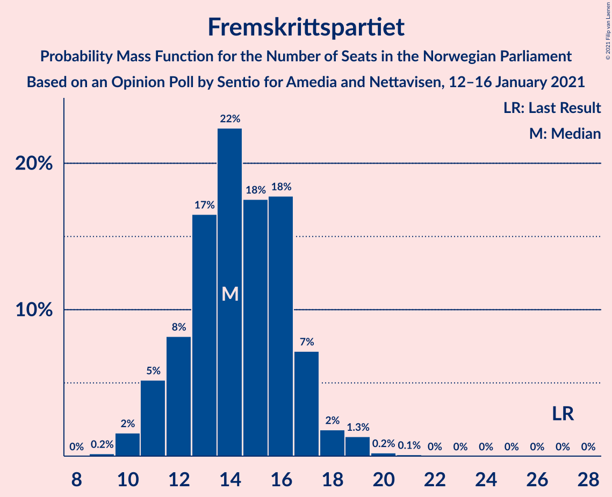
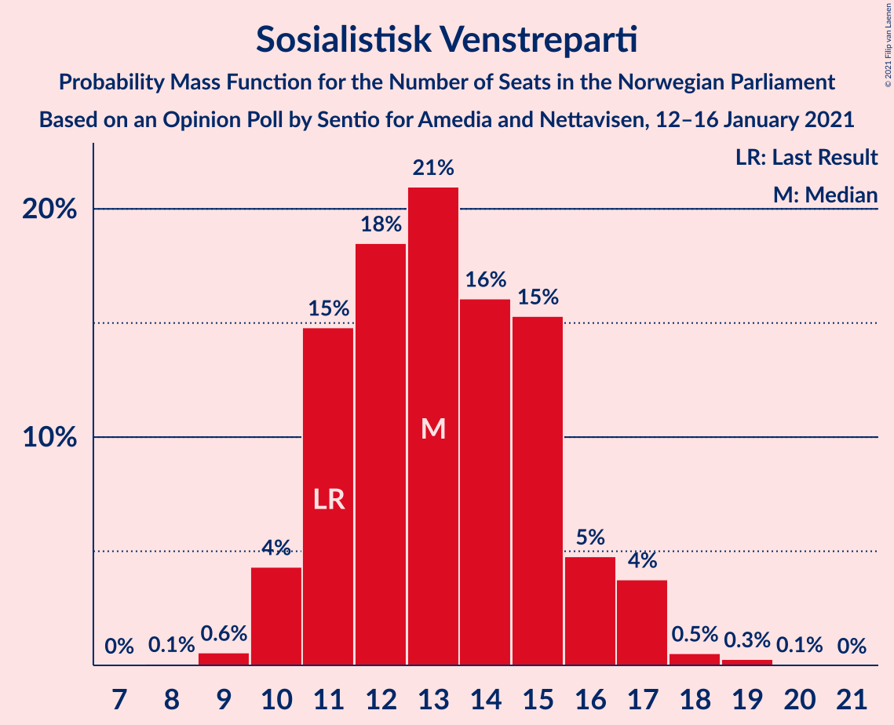
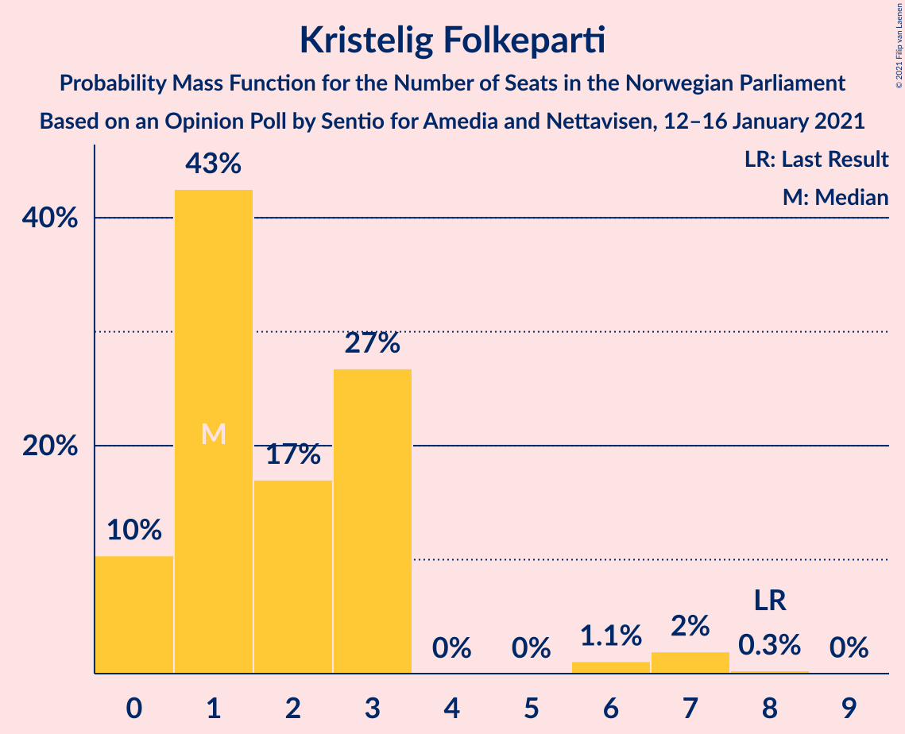
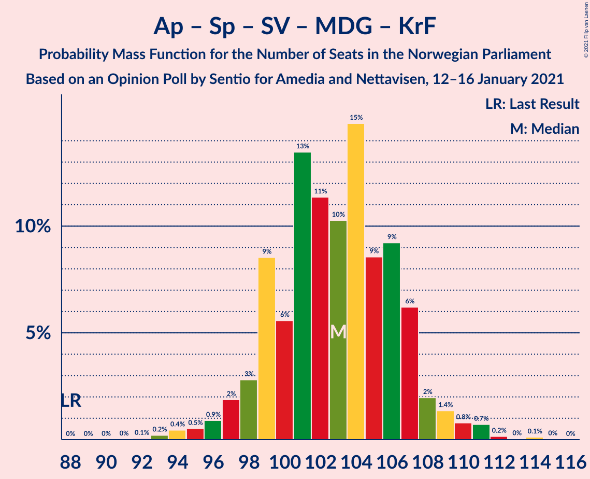
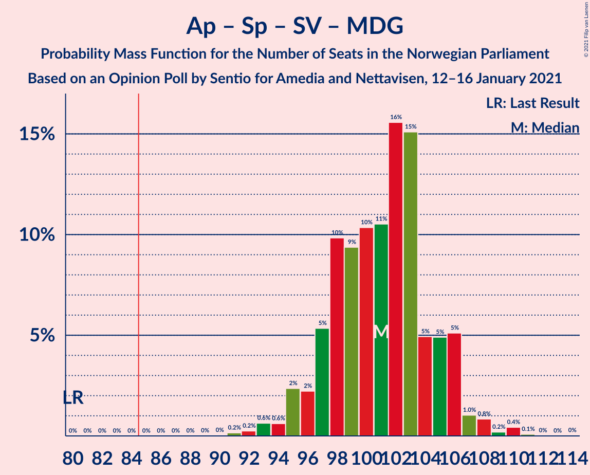
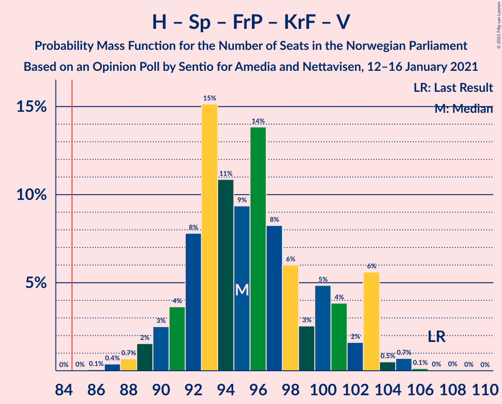
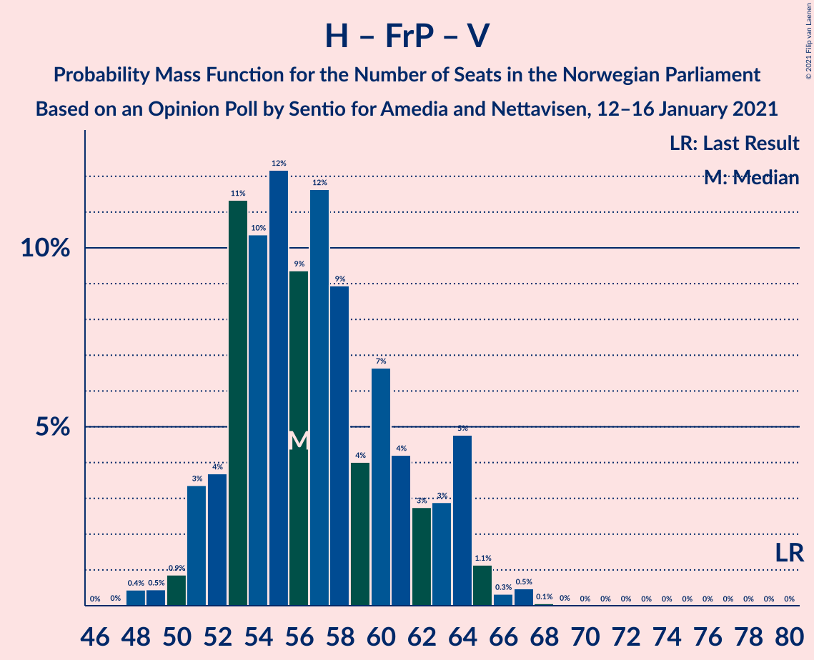
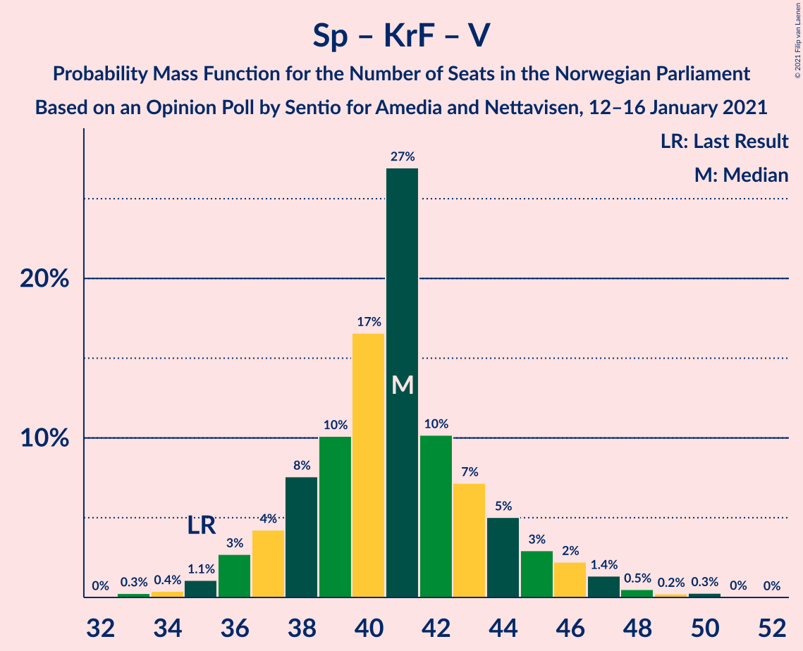

# Opinion Poll by Sentio for Amedia and Nettavisen, 12–16 January 2021

<a href="#voting-intentions">Voting Intentions</a> | <a href="#seats">Seats</a> | <a href="#coalitions">Coalitions</a> | <a href="#technical-information">Technical Information</a>

## Voting Intentions

### Confidence Intervals

| Party | Last Result | Poll Result | 80% Confidence Interval | 90% Confidence Interval | 95% Confidence Interval | 99% Confidence Interval |
|:-----:|:-----------:|:-----------:|:-----------------------:|:-----------------------:|:-----------------------:|:-----------------------:|
| Høyre | 25.0% | 23.0% | 21.4–24.8% |20.9–25.3% |20.5–25.7% |19.7–26.6% |
| Arbeiderpartiet | 27.4% | 21.3% | 19.7–23.0% |19.3–23.5% |18.9–24.0% |18.1–24.8% |
| Senterpartiet | 10.3% | 19.6% | 18.1–21.3% |17.6–21.8% |17.3–22.2% |16.5–23.0% |
| Fremskrittspartiet | 15.2% | 8.4% | 7.4–9.6% |7.1–10.0% |6.8–10.3% |6.4–10.9% |
| Sosialistisk Venstreparti | 6.0% | 7.8% | 6.8–9.0% |6.5–9.3% |6.3–9.6% |5.8–10.2% |
| Miljøpartiet De Grønne | 3.2% | 6.4% | 5.5–7.5% |5.3–7.8% |5.0–8.1% |4.6–8.7% |
| Rødt | 2.4% | 3.3% | 2.7–4.1% |2.5–4.4% |2.4–4.6% |2.1–5.0% |
| Kristelig Folkeparti | 4.2% | 2.9% | 2.3–3.7% |2.2–3.9% |2.0–4.1% |1.8–4.6% |
| Venstre | 4.4% | 2.6% | 2.1–3.4% |1.9–3.6% |1.8–3.8% |1.6–4.2% |

*Note:* The poll result column reflects the actual value used in the calculations. Published results may vary slightly, and in addition be rounded to fewer digits.

## Seats

### Confidence Intervals

| Party | Last Result | Median | 80% Confidence Interval | 90% Confidence Interval | 95% Confidence Interval | 99% Confidence Interval |
|:-----:|:-----------:|:------:|:-----------------------:|:-----------------------:|:-----------------------:|:-----------------------:|
| <a href="#høyre">Høyre</a> | 45 | 40 | 37–45 |36–46 |35–46 |34–48 |
| <a href="#arbeiderpartiet">Arbeiderpartiet</a> | 49 | 40 | 37–43 |35–44 |35–45 |32–46 |
| <a href="#senterpartiet">Senterpartiet</a> | 19 | 37 | 35–40 |34–41 |33–42 |31–43 |
| <a href="#fremskrittspartiet">Fremskrittspartiet</a> | 27 | 14 | 12–17 |11–17 |11–18 |10–19 |
| <a href="#sosialistisk-venstreparti">Sosialistisk Venstreparti</a> | 11 | 13 | 11–15 |11–16 |10–17 |9–18 |
| <a href="#miljøpartiet-de-grønne">Miljøpartiet De Grønne</a> | 1 | 11 | 9–13 |9–13 |8–14 |8–15 |
| <a href="#rødt">Rødt</a> | 1 | 2 | 1–7 |1–7 |1–7 |1–8 |
| <a href="#kristelig-folkeparti">Kristelig Folkeparti</a> | 8 | 1 | 0–3 |0–3 |0–6 |0–7 |
| <a href="#venstre">Venstre</a> | 8 | 2 | 1–2 |1–2 |0–2 |0–7 |

### Høyre

*For a full overview of the results for this party, see the [Høyre](party-høyre.html) page.*

| Number of Seats | Probability | Accumulated | Special Marks |
|:---------------:|:-----------:|:-----------:|:-------------:|
| 33 | 0.1% | 100% |  |
| 34 | 1.3% | 99.9% |  |
| 35 | 1.4% | 98.6% |  |
| 36 | 3% | 97% |  |
| 37 | 8% | 95% |  |
| 38 | 7% | 86% |  |
| 39 | 15% | 79% |  |
| 40 | 15% | 64% | Median |
| 41 | 21% | 49% |  |
| 42 | 7% | 28% |  |
| 43 | 5% | 20% |  |
| 44 | 4% | 16% |  |
| 45 | 4% | 11% | Last Result |
| 46 | 6% | 7% |  |
| 47 | 0.7% | 2% |  |
| 48 | 0.7% | 1.0% |  |
| 49 | 0.1% | 0.3% |  |
| 50 | 0.1% | 0.2% |  |
| 51 | 0% | 0.1% |  |
| 52 | 0% | 0% |  |

### Arbeiderpartiet

*For a full overview of the results for this party, see the [Arbeiderpartiet](party-arbeiderpartiet.html) page.*

| Number of Seats | Probability | Accumulated | Special Marks |
|:---------------:|:-----------:|:-----------:|:-------------:|
| 30 | 0.1% | 100% |  |
| 31 | 0.1% | 99.9% |  |
| 32 | 0.6% | 99.8% |  |
| 33 | 0.8% | 99.2% |  |
| 34 | 0.8% | 98% |  |
| 35 | 3% | 98% |  |
| 36 | 3% | 94% |  |
| 37 | 11% | 92% |  |
| 38 | 11% | 81% |  |
| 39 | 7% | 69% |  |
| 40 | 15% | 63% | Median |
| 41 | 25% | 47% |  |
| 42 | 7% | 22% |  |
| 43 | 8% | 15% |  |
| 44 | 4% | 7% |  |
| 45 | 2% | 3% |  |
| 46 | 0.7% | 0.8% |  |
| 47 | 0.1% | 0.1% |  |
| 48 | 0% | 0% |  |
| 49 | 0% | 0% | Last Result |

### Senterpartiet

*For a full overview of the results for this party, see the [Senterpartiet](party-senterpartiet.html) page.*

| Number of Seats | Probability | Accumulated | Special Marks |
|:---------------:|:-----------:|:-----------:|:-------------:|
| 19 | 0% | 100% | Last Result |
| 20 | 0% | 100% |  |
| 21 | 0% | 100% |  |
| 22 | 0% | 100% |  |
| 23 | 0% | 100% |  |
| 24 | 0% | 100% |  |
| 25 | 0% | 100% |  |
| 26 | 0% | 100% |  |
| 27 | 0% | 100% |  |
| 28 | 0% | 100% |  |
| 29 | 0.1% | 100% |  |
| 30 | 0.1% | 99.9% |  |
| 31 | 0.4% | 99.8% |  |
| 32 | 0.8% | 99.4% |  |
| 33 | 2% | 98.6% |  |
| 34 | 4% | 96% |  |
| 35 | 10% | 92% |  |
| 36 | 21% | 82% |  |
| 37 | 23% | 61% | Median |
| 38 | 16% | 38% |  |
| 39 | 10% | 22% |  |
| 40 | 3% | 11% |  |
| 41 | 5% | 9% |  |
| 42 | 2% | 3% |  |
| 43 | 1.0% | 1.4% |  |
| 44 | 0.2% | 0.3% |  |
| 45 | 0.1% | 0.1% |  |
| 46 | 0% | 0% |  |

### Fremskrittspartiet

*For a full overview of the results for this party, see the [Fremskrittspartiet](party-fremskrittspartiet.html) page.*

| Number of Seats | Probability | Accumulated | Special Marks |
|:---------------:|:-----------:|:-----------:|:-------------:|
| 9 | 0.2% | 100% |  |
| 10 | 2% | 99.8% |  |
| 11 | 5% | 98% |  |
| 12 | 8% | 93% |  |
| 13 | 17% | 85% |  |
| 14 | 22% | 68% | Median |
| 15 | 18% | 46% |  |
| 16 | 18% | 28% |  |
| 17 | 7% | 11% |  |
| 18 | 2% | 3% |  |
| 19 | 1.3% | 2% |  |
| 20 | 0.2% | 0.3% |  |
| 21 | 0.1% | 0.1% |  |
| 22 | 0% | 0% |  |
| 23 | 0% | 0% |  |
| 24 | 0% | 0% |  |
| 25 | 0% | 0% |  |
| 26 | 0% | 0% |  |
| 27 | 0% | 0% | Last Result |

### Sosialistisk Venstreparti

*For a full overview of the results for this party, see the [Sosialistisk Venstreparti](party-sosialistiskvenstreparti.html) page.*

| Number of Seats | Probability | Accumulated | Special Marks |
|:---------------:|:-----------:|:-----------:|:-------------:|
| 8 | 0.1% | 100% |  |
| 9 | 0.6% | 99.9% |  |
| 10 | 4% | 99.4% |  |
| 11 | 15% | 95% | Last Result |
| 12 | 18% | 80% |  |
| 13 | 21% | 62% | Median |
| 14 | 16% | 41% |  |
| 15 | 15% | 25% |  |
| 16 | 5% | 9% |  |
| 17 | 4% | 5% |  |
| 18 | 0.5% | 0.9% |  |
| 19 | 0.3% | 0.3% |  |
| 20 | 0.1% | 0.1% |  |
| 21 | 0% | 0% |  |

### Miljøpartiet De Grønne

*For a full overview of the results for this party, see the [Miljøpartiet De Grønne](party-miljøpartietdegrønne.html) page.*

| Number of Seats | Probability | Accumulated | Special Marks |
|:---------------:|:-----------:|:-----------:|:-------------:|
| 1 | 0% | 100% | Last Result |
| 2 | 0% | 100% |  |
| 3 | 0% | 100% |  |
| 4 | 0% | 100% |  |
| 5 | 0% | 100% |  |
| 6 | 0% | 100% |  |
| 7 | 0.4% | 100% |  |
| 8 | 4% | 99.6% |  |
| 9 | 14% | 96% |  |
| 10 | 19% | 81% |  |
| 11 | 30% | 62% | Median |
| 12 | 23% | 33% |  |
| 13 | 7% | 10% |  |
| 14 | 2% | 3% |  |
| 15 | 0.8% | 1.2% |  |
| 16 | 0.3% | 0.4% |  |
| 17 | 0% | 0% |  |

### Rødt

*For a full overview of the results for this party, see the [Rødt](party-rødt.html) page.*

| Number of Seats | Probability | Accumulated | Special Marks |
|:---------------:|:-----------:|:-----------:|:-------------:|
| 1 | 15% | 100% | Last Result |
| 2 | 71% | 85% | Median |
| 3 | 0% | 15% |  |
| 4 | 0% | 15% |  |
| 5 | 0% | 15% |  |
| 6 | 4% | 15% |  |
| 7 | 9% | 11% |  |
| 8 | 2% | 2% |  |
| 9 | 0.2% | 0.2% |  |
| 10 | 0% | 0% |  |

### Kristelig Folkeparti

*For a full overview of the results for this party, see the [Kristelig Folkeparti](party-kristeligfolkeparti.html) page.*

| Number of Seats | Probability | Accumulated | Special Marks |
|:---------------:|:-----------:|:-----------:|:-------------:|
| 0 | 10% | 100% |  |
| 1 | 43% | 90% | Median |
| 2 | 17% | 47% |  |
| 3 | 27% | 30% |  |
| 4 | 0% | 3% |  |
| 5 | 0% | 3% |  |
| 6 | 1.1% | 3% |  |
| 7 | 2% | 2% |  |
| 8 | 0.3% | 0.3% | Last Result |
| 9 | 0% | 0% |  |

### Venstre

*For a full overview of the results for this party, see the [Venstre](party-venstre.html) page.*

| Number of Seats | Probability | Accumulated | Special Marks |
|:---------------:|:-----------:|:-----------:|:-------------:|
| 0 | 3% | 100% |  |
| 1 | 17% | 97% |  |
| 2 | 79% | 81% | Median |
| 3 | 0.6% | 2% |  |
| 4 | 0.1% | 1.2% |  |
| 5 | 0% | 1.2% |  |
| 6 | 0.2% | 1.2% |  |
| 7 | 0.8% | 1.0% |  |
| 8 | 0.1% | 0.1% | Last Result |
| 9 | 0% | 0% |  |

## Coalitions

### Confidence Intervals

| Coalition | Last Result | Median | Majority? | 80% Confidence Interval | 90% Confidence Interval | 95% Confidence Interval | 99% Confidence Interval |
|:---------:|:-----------:|:------:|:---------:|:-----------------------:|:-----------------------:|:-----------------------:|:-----------------------:|
| Arbeiderpartiet – Senterpartiet – Sosialistisk Venstreparti – Miljøpartiet De Grønne – Rødt | 81 | 104 | 100% | 100–107 | 98–109 | 97–110 | 95–113 |
| Arbeiderpartiet – Senterpartiet – Sosialistisk Venstreparti – Miljøpartiet De Grønne – Kristelig Folkeparti | 88 | 103 | 100% | 99–107 | 98–108 | 97–109 | 94–111 |
| Arbeiderpartiet – Senterpartiet – Sosialistisk Venstreparti – Miljøpartiet De Grønne | 80 | 101 | 100% | 97–105 | 96–106 | 95–107 | 93–110 |
| Høyre – Senterpartiet – Fremskrittspartiet – Kristelig Folkeparti – Venstre | 107 | 95 | 100% | 92–101 | 90–103 | 89–103 | 88–105 |
| Arbeiderpartiet – Senterpartiet – Sosialistisk Venstreparti – Rødt | 80 | 93 | 99.6% | 89–96 | 88–98 | 87–99 | 85–102 |
| Arbeiderpartiet – Senterpartiet – Miljøpartiet De Grønne – Kristelig Folkeparti | 77 | 90 | 95% | 86–93 | 84–94 | 83–96 | 81–97 |
| Arbeiderpartiet – Senterpartiet – Sosialistisk Venstreparti | 79 | 90 | 97% | 87–94 | 86–95 | 84–95 | 82–97 |
| Arbeiderpartiet – Senterpartiet – Kristelig Folkeparti | 76 | 79 | 3% | 75–83 | 73–84 | 72–85 | 70–86 |
| Arbeiderpartiet – Senterpartiet | 68 | 77 | 0.1% | 73–80 | 72–81 | 71–82 | 68–83 |
| Høyre – Fremskrittspartiet – Miljøpartiet De Grønne – Kristelig Folkeparti – Venstre | 89 | 69 | 0% | 65–75 | 64–77 | 63–77 | 61–80 |
| Høyre – Fremskrittspartiet – Kristelig Folkeparti – Venstre | 88 | 58 | 0% | 54–64 | 54–65 | 52–66 | 51–68 |
| Høyre – Fremskrittspartiet – Venstre | 80 | 56 | 0% | 53–62 | 51–64 | 51–64 | 49–67 |
| Høyre – Fremskrittspartiet | 72 | 54 | 0% | 51–60 | 50–62 | 49–62 | 47–65 |
| Arbeiderpartiet – Sosialistisk Venstreparti | 60 | 53 | 0% | 50–57 | 49–57 | 47–58 | 45–60 |
| Høyre – Kristelig Folkeparti – Venstre | 61 | 44 | 0% | 41–49 | 40–49 | 39–50 | 38–53 |
| Senterpartiet – Kristelig Folkeparti – Venstre | 35 | 41 | 0% | 38–44 | 37–45 | 36–46 | 34–49 |

### Arbeiderpartiet – Senterpartiet – Sosialistisk Venstreparti – Miljøpartiet De Grønne – Rødt

| Number of Seats | Probability | Accumulated | Special Marks |
|:---------------:|:-----------:|:-----------:|:-------------:|
| 81 | 0% | 100% | Last Result |
| 82 | 0% | 100% |  |
| 83 | 0% | 100% |  |
| 84 | 0% | 100% |  |
| 85 | 0% | 100% | Majority |
| 86 | 0% | 100% |  |
| 87 | 0% | 100% |  |
| 88 | 0% | 100% |  |
| 89 | 0% | 100% |  |
| 90 | 0% | 100% |  |
| 91 | 0% | 100% |  |
| 92 | 0% | 100% |  |
| 93 | 0.1% | 100% |  |
| 94 | 0.1% | 99.9% |  |
| 95 | 0.4% | 99.8% |  |
| 96 | 0.5% | 99.4% |  |
| 97 | 2% | 98.9% |  |
| 98 | 2% | 97% |  |
| 99 | 4% | 95% |  |
| 100 | 7% | 91% |  |
| 101 | 9% | 84% |  |
| 102 | 9% | 75% |  |
| 103 | 9% | 66% | Median |
| 104 | 20% | 57% |  |
| 105 | 14% | 37% |  |
| 106 | 7% | 23% |  |
| 107 | 6% | 16% |  |
| 108 | 5% | 10% |  |
| 109 | 2% | 5% |  |
| 110 | 2% | 4% |  |
| 111 | 0.4% | 2% |  |
| 112 | 0.7% | 2% |  |
| 113 | 0.8% | 0.9% |  |
| 114 | 0.1% | 0.2% |  |
| 115 | 0% | 0.1% |  |
| 116 | 0.1% | 0.1% |  |
| 117 | 0% | 0% |  |

### Arbeiderpartiet – Senterpartiet – Sosialistisk Venstreparti – Miljøpartiet De Grønne – Kristelig Folkeparti

| Number of Seats | Probability | Accumulated | Special Marks |
|:---------------:|:-----------:|:-----------:|:-------------:|
| 88 | 0% | 100% | Last Result |
| 89 | 0% | 100% |  |
| 90 | 0% | 100% |  |
| 91 | 0% | 100% |  |
| 92 | 0.1% | 100% |  |
| 93 | 0.2% | 99.9% |  |
| 94 | 0.4% | 99.7% |  |
| 95 | 0.5% | 99.3% |  |
| 96 | 0.9% | 98.7% |  |
| 97 | 2% | 98% |  |
| 98 | 3% | 96% |  |
| 99 | 9% | 93% |  |
| 100 | 6% | 85% |  |
| 101 | 13% | 79% |  |
| 102 | 11% | 66% | Median |
| 103 | 10% | 54% |  |
| 104 | 15% | 44% |  |
| 105 | 9% | 29% |  |
| 106 | 9% | 21% |  |
| 107 | 6% | 11% |  |
| 108 | 2% | 5% |  |
| 109 | 1.4% | 3% |  |
| 110 | 0.8% | 2% |  |
| 111 | 0.7% | 1.1% |  |
| 112 | 0.2% | 0.3% |  |
| 113 | 0% | 0.2% |  |
| 114 | 0.1% | 0.1% |  |
| 115 | 0% | 0% |  |

### Arbeiderpartiet – Senterpartiet – Sosialistisk Venstreparti – Miljøpartiet De Grønne

| Number of Seats | Probability | Accumulated | Special Marks |
|:---------------:|:-----------:|:-----------:|:-------------:|
| 80 | 0% | 100% | Last Result |
| 81 | 0% | 100% |  |
| 82 | 0% | 100% |  |
| 83 | 0% | 100% |  |
| 84 | 0% | 100% |  |
| 85 | 0% | 100% | Majority |
| 86 | 0% | 100% |  |
| 87 | 0% | 100% |  |
| 88 | 0% | 100% |  |
| 89 | 0% | 100% |  |
| 90 | 0% | 100% |  |
| 91 | 0.2% | 99.9% |  |
| 92 | 0.2% | 99.8% |  |
| 93 | 0.6% | 99.5% |  |
| 94 | 0.6% | 98.9% |  |
| 95 | 2% | 98% |  |
| 96 | 2% | 96% |  |
| 97 | 5% | 94% |  |
| 98 | 10% | 88% |  |
| 99 | 9% | 79% |  |
| 100 | 10% | 69% |  |
| 101 | 11% | 59% | Median |
| 102 | 16% | 48% |  |
| 103 | 15% | 33% |  |
| 104 | 5% | 18% |  |
| 105 | 5% | 13% |  |
| 106 | 5% | 8% |  |
| 107 | 1.0% | 3% |  |
| 108 | 0.8% | 2% |  |
| 109 | 0.2% | 0.8% |  |
| 110 | 0.4% | 0.6% |  |
| 111 | 0.1% | 0.1% |  |
| 112 | 0% | 0.1% |  |
| 113 | 0% | 0% |  |

### Høyre – Senterpartiet – Fremskrittspartiet – Kristelig Folkeparti – Venstre

| Number of Seats | Probability | Accumulated | Special Marks |
|:---------------:|:-----------:|:-----------:|:-------------:|
| 86 | 0.1% | 100% |  |
| 87 | 0.4% | 99.9% |  |
| 88 | 0.7% | 99.5% |  |
| 89 | 2% | 98.8% |  |
| 90 | 3% | 97% |  |
| 91 | 4% | 95% |  |
| 92 | 8% | 91% |  |
| 93 | 15% | 83% |  |
| 94 | 11% | 68% | Median |
| 95 | 9% | 57% |  |
| 96 | 14% | 48% |  |
| 97 | 8% | 34% |  |
| 98 | 6% | 26% |  |
| 99 | 3% | 20% |  |
| 100 | 5% | 17% |  |
| 101 | 4% | 13% |  |
| 102 | 2% | 9% |  |
| 103 | 6% | 7% |  |
| 104 | 0.5% | 1.4% |  |
| 105 | 0.7% | 0.9% |  |
| 106 | 0.1% | 0.2% |  |
| 107 | 0% | 0.1% | Last Result |
| 108 | 0% | 0.1% |  |
| 109 | 0% | 0% |  |

### Arbeiderpartiet – Senterpartiet – Sosialistisk Venstreparti – Rødt

| Number of Seats | Probability | Accumulated | Special Marks |
|:---------------:|:-----------:|:-----------:|:-------------:|
| 80 | 0% | 100% | Last Result |
| 81 | 0% | 100% |  |
| 82 | 0% | 100% |  |
| 83 | 0.1% | 99.9% |  |
| 84 | 0.2% | 99.9% |  |
| 85 | 0.8% | 99.6% | Majority |
| 86 | 1.2% | 98.8% |  |
| 87 | 2% | 98% |  |
| 88 | 4% | 96% |  |
| 89 | 7% | 92% |  |
| 90 | 8% | 85% |  |
| 91 | 10% | 77% |  |
| 92 | 13% | 66% | Median |
| 93 | 13% | 54% |  |
| 94 | 12% | 41% |  |
| 95 | 10% | 29% |  |
| 96 | 9% | 19% |  |
| 97 | 5% | 10% |  |
| 98 | 2% | 5% |  |
| 99 | 1.3% | 3% |  |
| 100 | 0.8% | 2% |  |
| 101 | 0.3% | 1.3% |  |
| 102 | 0.9% | 1.0% |  |
| 103 | 0.1% | 0.1% |  |
| 104 | 0% | 0% |  |

### Arbeiderpartiet – Senterpartiet – Miljøpartiet De Grønne – Kristelig Folkeparti

| Number of Seats | Probability | Accumulated | Special Marks |
|:---------------:|:-----------:|:-----------:|:-------------:|
| 77 | 0% | 100% | Last Result |
| 78 | 0% | 100% |  |
| 79 | 0.1% | 100% |  |
| 80 | 0.3% | 99.9% |  |
| 81 | 0.6% | 99.6% |  |
| 82 | 0.8% | 99.0% |  |
| 83 | 2% | 98% |  |
| 84 | 2% | 97% |  |
| 85 | 4% | 95% | Majority |
| 86 | 4% | 91% |  |
| 87 | 9% | 87% |  |
| 88 | 14% | 78% |  |
| 89 | 13% | 64% | Median |
| 90 | 13% | 51% |  |
| 91 | 8% | 38% |  |
| 92 | 9% | 30% |  |
| 93 | 11% | 21% |  |
| 94 | 5% | 10% |  |
| 95 | 2% | 5% |  |
| 96 | 2% | 3% |  |
| 97 | 0.8% | 1.2% |  |
| 98 | 0.1% | 0.4% |  |
| 99 | 0.2% | 0.3% |  |
| 100 | 0.1% | 0.1% |  |
| 101 | 0% | 0% |  |

### Arbeiderpartiet – Senterpartiet – Sosialistisk Venstreparti

| Number of Seats | Probability | Accumulated | Special Marks |
|:---------------:|:-----------:|:-----------:|:-------------:|
| 79 | 0% | 100% | Last Result |
| 80 | 0.1% | 100% |  |
| 81 | 0.1% | 99.9% |  |
| 82 | 0.3% | 99.8% |  |
| 83 | 0.8% | 99.5% |  |
| 84 | 1.5% | 98.7% |  |
| 85 | 2% | 97% | Majority |
| 86 | 4% | 95% |  |
| 87 | 9% | 91% |  |
| 88 | 9% | 83% |  |
| 89 | 13% | 74% |  |
| 90 | 13% | 61% | Median |
| 91 | 15% | 48% |  |
| 92 | 12% | 33% |  |
| 93 | 8% | 20% |  |
| 94 | 7% | 12% |  |
| 95 | 3% | 5% |  |
| 96 | 1.0% | 2% |  |
| 97 | 0.6% | 0.9% |  |
| 98 | 0.3% | 0.4% |  |
| 99 | 0% | 0.1% |  |
| 100 | 0% | 0.1% |  |
| 101 | 0% | 0% |  |

### Arbeiderpartiet – Senterpartiet – Kristelig Folkeparti

| Number of Seats | Probability | Accumulated | Special Marks |
|:---------------:|:-----------:|:-----------:|:-------------:|
| 68 | 0.1% | 100% |  |
| 69 | 0.3% | 99.9% |  |
| 70 | 0.3% | 99.6% |  |
| 71 | 1.2% | 99.3% |  |
| 72 | 2% | 98% |  |
| 73 | 2% | 97% |  |
| 74 | 3% | 95% |  |
| 75 | 4% | 92% |  |
| 76 | 13% | 88% | Last Result |
| 77 | 8% | 75% |  |
| 78 | 10% | 67% | Median |
| 79 | 13% | 57% |  |
| 80 | 12% | 43% |  |
| 81 | 13% | 32% |  |
| 82 | 7% | 19% |  |
| 83 | 7% | 12% |  |
| 84 | 3% | 5% |  |
| 85 | 1.4% | 3% | Majority |
| 86 | 0.8% | 1.2% |  |
| 87 | 0.3% | 0.4% |  |
| 88 | 0.1% | 0.1% |  |
| 89 | 0% | 0.1% |  |
| 90 | 0% | 0% |  |

### Arbeiderpartiet – Senterpartiet

| Number of Seats | Probability | Accumulated | Special Marks |
|:---------------:|:-----------:|:-----------:|:-------------:|
| 67 | 0.1% | 100% |  |
| 68 | 0.4% | 99.8% | Last Result |
| 69 | 0.3% | 99.5% |  |
| 70 | 1.4% | 99.2% |  |
| 71 | 2% | 98% |  |
| 72 | 2% | 96% |  |
| 73 | 5% | 94% |  |
| 74 | 9% | 89% |  |
| 75 | 8% | 80% |  |
| 76 | 10% | 73% |  |
| 77 | 13% | 62% | Median |
| 78 | 19% | 50% |  |
| 79 | 11% | 31% |  |
| 80 | 12% | 20% |  |
| 81 | 4% | 8% |  |
| 82 | 2% | 4% |  |
| 83 | 0.7% | 1.1% |  |
| 84 | 0.3% | 0.4% |  |
| 85 | 0.1% | 0.1% | Majority |
| 86 | 0% | 0% |  |

### Høyre – Fremskrittspartiet – Miljøpartiet De Grønne – Kristelig Folkeparti – Venstre

| Number of Seats | Probability | Accumulated | Special Marks |
|:---------------:|:-----------:|:-----------:|:-------------:|
| 60 | 0.1% | 100% |  |
| 61 | 0.3% | 99.8% |  |
| 62 | 1.1% | 99.5% |  |
| 63 | 3% | 98% |  |
| 64 | 2% | 95% |  |
| 65 | 6% | 93% |  |
| 66 | 11% | 87% |  |
| 67 | 15% | 76% |  |
| 68 | 10% | 60% | Median |
| 69 | 7% | 50% |  |
| 70 | 7% | 43% |  |
| 71 | 6% | 36% |  |
| 72 | 8% | 30% |  |
| 73 | 6% | 22% |  |
| 74 | 5% | 16% |  |
| 75 | 2% | 11% |  |
| 76 | 2% | 10% |  |
| 77 | 6% | 8% |  |
| 78 | 0.4% | 2% |  |
| 79 | 0.8% | 1.4% |  |
| 80 | 0.4% | 0.6% |  |
| 81 | 0.1% | 0.2% |  |
| 82 | 0.1% | 0.1% |  |
| 83 | 0% | 0% |  |
| 84 | 0% | 0% |  |
| 85 | 0% | 0% | Majority |
| 86 | 0% | 0% |  |
| 87 | 0% | 0% |  |
| 88 | 0% | 0% |  |
| 89 | 0% | 0% | Last Result |

### Høyre – Fremskrittspartiet – Kristelig Folkeparti – Venstre

| Number of Seats | Probability | Accumulated | Special Marks |
|:---------------:|:-----------:|:-----------:|:-------------:|
| 49 | 0.1% | 100% |  |
| 50 | 0.2% | 99.9% |  |
| 51 | 0.8% | 99.7% |  |
| 52 | 1.4% | 98.9% |  |
| 53 | 2% | 97% |  |
| 54 | 7% | 96% |  |
| 55 | 10% | 88% |  |
| 56 | 11% | 79% |  |
| 57 | 13% | 67% | Median |
| 58 | 9% | 55% |  |
| 59 | 9% | 46% |  |
| 60 | 9% | 36% |  |
| 61 | 7% | 28% |  |
| 62 | 4% | 20% |  |
| 63 | 4% | 16% |  |
| 64 | 4% | 12% |  |
| 65 | 6% | 8% |  |
| 66 | 1.3% | 3% |  |
| 67 | 0.6% | 1.4% |  |
| 68 | 0.6% | 0.8% |  |
| 69 | 0.1% | 0.2% |  |
| 70 | 0.1% | 0.1% |  |
| 71 | 0% | 0% |  |
| 72 | 0% | 0% |  |
| 73 | 0% | 0% |  |
| 74 | 0% | 0% |  |
| 75 | 0% | 0% |  |
| 76 | 0% | 0% |  |
| 77 | 0% | 0% |  |
| 78 | 0% | 0% |  |
| 79 | 0% | 0% |  |
| 80 | 0% | 0% |  |
| 81 | 0% | 0% |  |
| 82 | 0% | 0% |  |
| 83 | 0% | 0% |  |
| 84 | 0% | 0% |  |
| 85 | 0% | 0% | Majority |
| 86 | 0% | 0% |  |
| 87 | 0% | 0% |  |
| 88 | 0% | 0% | Last Result |

### Høyre – Fremskrittspartiet – Venstre

| Number of Seats | Probability | Accumulated | Special Marks |
|:---------------:|:-----------:|:-----------:|:-------------:|
| 48 | 0.4% | 100% |  |
| 49 | 0.5% | 99.5% |  |
| 50 | 0.9% | 99.1% |  |
| 51 | 3% | 98% |  |
| 52 | 4% | 95% |  |
| 53 | 11% | 91% |  |
| 54 | 10% | 80% |  |
| 55 | 12% | 69% |  |
| 56 | 9% | 57% | Median |
| 57 | 12% | 48% |  |
| 58 | 9% | 36% |  |
| 59 | 4% | 27% |  |
| 60 | 7% | 23% |  |
| 61 | 4% | 17% |  |
| 62 | 3% | 12% |  |
| 63 | 3% | 10% |  |
| 64 | 5% | 7% |  |
| 65 | 1.1% | 2% |  |
| 66 | 0.3% | 0.9% |  |
| 67 | 0.5% | 0.6% |  |
| 68 | 0.1% | 0.1% |  |
| 69 | 0% | 0% |  |
| 70 | 0% | 0% |  |
| 71 | 0% | 0% |  |
| 72 | 0% | 0% |  |
| 73 | 0% | 0% |  |
| 74 | 0% | 0% |  |
| 75 | 0% | 0% |  |
| 76 | 0% | 0% |  |
| 77 | 0% | 0% |  |
| 78 | 0% | 0% |  |
| 79 | 0% | 0% |  |
| 80 | 0% | 0% | Last Result |

### Høyre – Fremskrittspartiet

| Number of Seats | Probability | Accumulated | Special Marks |
|:---------------:|:-----------:|:-----------:|:-------------:|
| 46 | 0.2% | 100% |  |
| 47 | 0.6% | 99.8% |  |
| 48 | 0.8% | 99.2% |  |
| 49 | 2% | 98% |  |
| 50 | 4% | 96% |  |
| 51 | 9% | 92% |  |
| 52 | 13% | 84% |  |
| 53 | 10% | 71% |  |
| 54 | 12% | 61% | Median |
| 55 | 12% | 48% |  |
| 56 | 9% | 37% |  |
| 57 | 3% | 28% |  |
| 58 | 6% | 25% |  |
| 59 | 6% | 18% |  |
| 60 | 3% | 13% |  |
| 61 | 3% | 10% |  |
| 62 | 5% | 7% |  |
| 63 | 1.2% | 2% |  |
| 64 | 0.2% | 0.8% |  |
| 65 | 0.5% | 0.6% |  |
| 66 | 0% | 0.1% |  |
| 67 | 0% | 0% |  |
| 68 | 0% | 0% |  |
| 69 | 0% | 0% |  |
| 70 | 0% | 0% |  |
| 71 | 0% | 0% |  |
| 72 | 0% | 0% | Last Result |

### Arbeiderpartiet – Sosialistisk Venstreparti

| Number of Seats | Probability | Accumulated | Special Marks |
|:---------------:|:-----------:|:-----------:|:-------------:|
| 43 | 0.1% | 100% |  |
| 44 | 0.2% | 99.9% |  |
| 45 | 0.5% | 99.7% |  |
| 46 | 1.1% | 99.3% |  |
| 47 | 2% | 98% |  |
| 48 | 1.0% | 97% |  |
| 49 | 3% | 96% |  |
| 50 | 7% | 93% |  |
| 51 | 14% | 86% |  |
| 52 | 15% | 71% |  |
| 53 | 14% | 56% | Median |
| 54 | 11% | 42% |  |
| 55 | 12% | 31% |  |
| 56 | 9% | 19% |  |
| 57 | 6% | 10% |  |
| 58 | 2% | 4% |  |
| 59 | 1.2% | 2% |  |
| 60 | 0.7% | 1.0% | Last Result |
| 61 | 0.2% | 0.3% |  |
| 62 | 0.1% | 0.1% |  |
| 63 | 0% | 0% |  |

### Høyre – Kristelig Folkeparti – Venstre

| Number of Seats | Probability | Accumulated | Special Marks |
|:---------------:|:-----------:|:-----------:|:-------------:|
| 36 | 0.1% | 100% |  |
| 37 | 0.4% | 99.9% |  |
| 38 | 2% | 99.5% |  |
| 39 | 2% | 98% |  |
| 40 | 5% | 96% |  |
| 41 | 8% | 91% |  |
| 42 | 13% | 83% |  |
| 43 | 15% | 69% | Median |
| 44 | 13% | 54% |  |
| 45 | 10% | 41% |  |
| 46 | 10% | 32% |  |
| 47 | 5% | 21% |  |
| 48 | 6% | 16% |  |
| 49 | 7% | 10% |  |
| 50 | 2% | 3% |  |
| 51 | 0.9% | 2% |  |
| 52 | 0.4% | 1.0% |  |
| 53 | 0.4% | 0.7% |  |
| 54 | 0.1% | 0.3% |  |
| 55 | 0.1% | 0.2% |  |
| 56 | 0.1% | 0.1% |  |
| 57 | 0% | 0% |  |
| 58 | 0% | 0% |  |
| 59 | 0% | 0% |  |
| 60 | 0% | 0% |  |
| 61 | 0% | 0% | Last Result |

### Senterpartiet – Kristelig Folkeparti – Venstre

| Number of Seats | Probability | Accumulated | Special Marks |
|:---------------:|:-----------:|:-----------:|:-------------:|
| 33 | 0.3% | 100% |  |
| 34 | 0.4% | 99.7% |  |
| 35 | 1.1% | 99.3% | Last Result |
| 36 | 3% | 98% |  |
| 37 | 4% | 95% |  |
| 38 | 8% | 91% |  |
| 39 | 10% | 84% |  |
| 40 | 17% | 74% | Median |
| 41 | 27% | 57% |  |
| 42 | 10% | 30% |  |
| 43 | 7% | 20% |  |
| 44 | 5% | 13% |  |
| 45 | 3% | 8% |  |
| 46 | 2% | 5% |  |
| 47 | 1.4% | 2% |  |
| 48 | 0.5% | 1.1% |  |
| 49 | 0.2% | 0.6% |  |
| 50 | 0.3% | 0.4% |  |
| 51 | 0% | 0.1% |  |
| 52 | 0% | 0% |  |

## Technical Information

### Opinion Poll

+ **Polling firm:** Sentio
+ **Commissioner(s):** Amedia and Nettavisen
+ **Fieldwork period:** 12–16 January 2021

### Calculations

+ **Sample size:** 1000
+ **Simulations done:** 1,048,576
+ **Error estimate:** 3.49%

