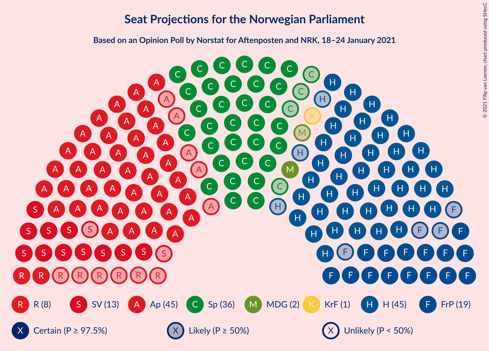
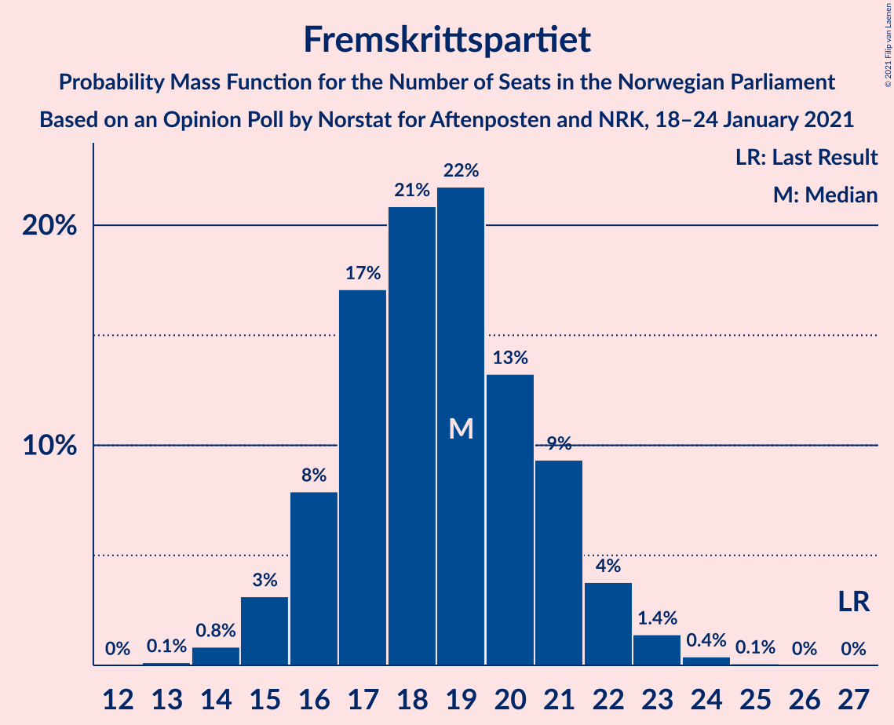
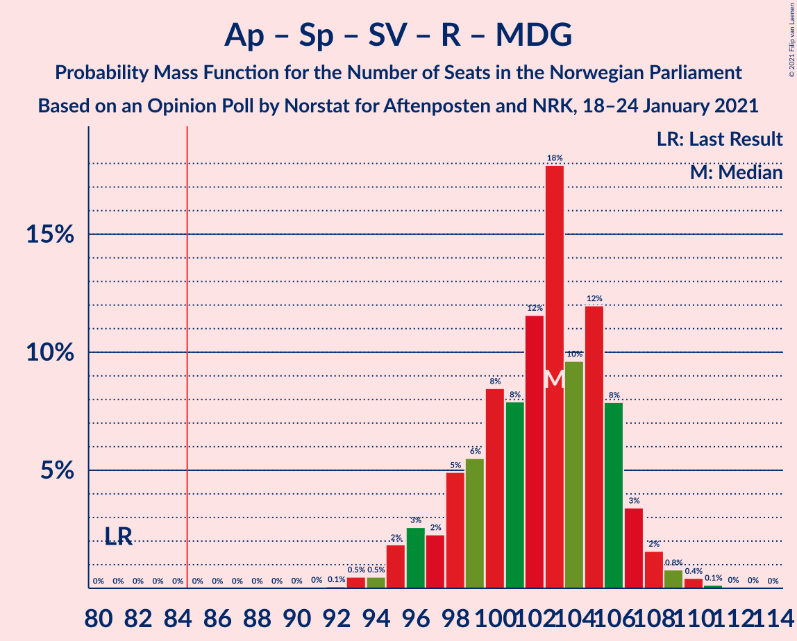

# Opinion Poll by Norstat for Aftenposten and NRK, 18–24 January 2021

<a href="#voting-intentions">Voting Intentions</a> | <a href="#seats">Seats</a> | <a href="#coalitions">Coalitions</a> | <a href="#technical-information">Technical Information</a>

## Voting Intentions

### Confidence Intervals

| Party | Last Result | Poll Result | 80% Confidence Interval | 90% Confidence Interval | 95% Confidence Interval | 99% Confidence Interval |
|:-----:|:-----------:|:-----------:|:-----------------------:|:-----------------------:|:-----------------------:|:-----------------------:|
| Høyre | 25.0% | 25.6% | 23.8–27.5% |23.3–28.0% |22.9–28.4% |22.1–29.4% |
| Arbeiderpartiet | 27.4% | 24.2% | 22.5–26.1% |22.0–26.6% |21.6–27.0% |20.8–27.9% |
| Senterpartiet | 10.3% | 19.6% | 18.0–21.3% |17.6–21.8% |17.2–22.3% |16.5–23.1% |
| Fremskrittspartiet | 15.2% | 10.0% | 8.8–11.3% |8.5–11.7% |8.2–12.0% |7.7–12.7% |
| Sosialistisk Venstreparti | 6.0% | 7.7% | 6.6–8.9% |6.4–9.2% |6.1–9.5% |5.7–10.1% |
| Rødt | 2.4% | 3.8% | 3.1–4.7% |2.9–5.0% |2.7–5.2% |2.4–5.7% |
| Miljøpartiet De Grønne | 3.2% | 3.0% | 2.4–3.9% |2.3–4.1% |2.1–4.3% |1.9–4.8% |
| Kristelig Folkeparti | 4.2% | 2.7% | 2.1–3.5% |2.0–3.8% |1.9–4.0% |1.6–4.4% |
| Venstre | 4.4% | 1.6% | 1.2–2.2% |1.1–2.4% |1.0–2.6% |0.8–2.9% |

*Note:* The poll result column reflects the actual value used in the calculations. Published results may vary slightly, and in addition be rounded to fewer digits.

## Seats

### Confidence Intervals

| Party | Last Result | Median | 80% Confidence Interval | 90% Confidence Interval | 95% Confidence Interval | 99% Confidence Interval |
|:-----:|:-----------:|:------:|:-----------------------:|:-----------------------:|:-----------------------:|:-----------------------:|
| <a href="#høyre">Høyre</a> | 45 | 46 | 44–50 |42–50 |42–51 |39–54 |
| <a href="#arbeiderpartiet">Arbeiderpartiet</a> | 49 | 45 | 41–47 |41–49 |40–50 |39–52 |
| <a href="#senterpartiet">Senterpartiet</a> | 19 | 36 | 34–39 |33–40 |31–42 |30–44 |
| <a href="#fremskrittspartiet">Fremskrittspartiet</a> | 27 | 19 | 16–21 |16–21 |15–22 |14–23 |
| <a href="#sosialistisk-venstreparti">Sosialistisk Venstreparti</a> | 11 | 13 | 12–17 |12–17 |12–18 |11–19 |
| <a href="#rødt">Rødt</a> | 1 | 8 | 2–8 |2–9 |2–9 |1–10 |
| <a href="#miljøpartiet-de-grønne">Miljøpartiet De Grønne</a> | 1 | 2 | 1–3 |1–7 |1–8 |1–9 |
| <a href="#kristelig-folkeparti">Kristelig Folkeparti</a> | 8 | 1 | 0–2 |0–3 |0–3 |0–8 |
| <a href="#venstre">Venstre</a> | 8 | 0 | 0–1 |0–2 |0–2 |0–2 |

### Høyre

*For a full overview of the results for this party, see the [Høyre](party-høyre.html) page.*

| Number of Seats | Probability | Accumulated | Special Marks |
|:---------------:|:-----------:|:-----------:|:-------------:|
| 39 | 0.7% | 100% |  |
| 40 | 0.2% | 99.2% |  |
| 41 | 0.2% | 99.1% |  |
| 42 | 4% | 98.8% |  |
| 43 | 3% | 94% |  |
| 44 | 7% | 91% |  |
| 45 | 32% | 84% | Last Result |
| 46 | 15% | 52% | Median |
| 47 | 11% | 37% |  |
| 48 | 4% | 26% |  |
| 49 | 11% | 22% |  |
| 50 | 8% | 12% |  |
| 51 | 1.3% | 3% |  |
| 52 | 0.7% | 2% |  |
| 53 | 0.8% | 1.4% |  |
| 54 | 0.4% | 0.6% |  |
| 55 | 0.1% | 0.2% |  |
| 56 | 0% | 0.1% |  |
| 57 | 0.1% | 0.1% |  |
| 58 | 0% | 0% |  |

### Arbeiderpartiet

*For a full overview of the results for this party, see the [Arbeiderpartiet](party-arbeiderpartiet.html) page.*

| Number of Seats | Probability | Accumulated | Special Marks |
|:---------------:|:-----------:|:-----------:|:-------------:|
| 37 | 0.1% | 100% |  |
| 38 | 0.1% | 99.9% |  |
| 39 | 1.2% | 99.8% |  |
| 40 | 3% | 98.6% |  |
| 41 | 8% | 95% |  |
| 42 | 10% | 88% |  |
| 43 | 4% | 78% |  |
| 44 | 16% | 74% |  |
| 45 | 33% | 58% | Median |
| 46 | 13% | 25% |  |
| 47 | 3% | 12% |  |
| 48 | 0.9% | 9% |  |
| 49 | 5% | 8% | Last Result |
| 50 | 2% | 3% |  |
| 51 | 0.3% | 1.2% |  |
| 52 | 0.8% | 0.9% |  |
| 53 | 0.1% | 0.1% |  |
| 54 | 0% | 0% |  |

### Senterpartiet

*For a full overview of the results for this party, see the [Senterpartiet](party-senterpartiet.html) page.*

| Number of Seats | Probability | Accumulated | Special Marks |
|:---------------:|:-----------:|:-----------:|:-------------:|
| 19 | 0% | 100% | Last Result |
| 20 | 0% | 100% |  |
| 21 | 0% | 100% |  |
| 22 | 0% | 100% |  |
| 23 | 0% | 100% |  |
| 24 | 0% | 100% |  |
| 25 | 0% | 100% |  |
| 26 | 0% | 100% |  |
| 27 | 0% | 100% |  |
| 28 | 0% | 100% |  |
| 29 | 0% | 100% |  |
| 30 | 0.8% | 99.9% |  |
| 31 | 2% | 99.1% |  |
| 32 | 2% | 97% |  |
| 33 | 5% | 95% |  |
| 34 | 16% | 90% |  |
| 35 | 13% | 75% |  |
| 36 | 20% | 62% | Median |
| 37 | 13% | 41% |  |
| 38 | 17% | 28% |  |
| 39 | 4% | 11% |  |
| 40 | 3% | 7% |  |
| 41 | 1.4% | 4% |  |
| 42 | 2% | 3% |  |
| 43 | 0.6% | 1.1% |  |
| 44 | 0.1% | 0.5% |  |
| 45 | 0.4% | 0.4% |  |
| 46 | 0% | 0% |  |

### Fremskrittspartiet

*For a full overview of the results for this party, see the [Fremskrittspartiet](party-fremskrittspartiet.html) page.*

| Number of Seats | Probability | Accumulated | Special Marks |
|:---------------:|:-----------:|:-----------:|:-------------:|
| 13 | 0.1% | 100% |  |
| 14 | 0.5% | 99.9% |  |
| 15 | 3% | 99.4% |  |
| 16 | 9% | 97% |  |
| 17 | 20% | 87% |  |
| 18 | 13% | 67% |  |
| 19 | 22% | 54% | Median |
| 20 | 14% | 32% |  |
| 21 | 14% | 18% |  |
| 22 | 2% | 4% |  |
| 23 | 1.0% | 1.4% |  |
| 24 | 0.4% | 0.4% |  |
| 25 | 0.1% | 0.1% |  |
| 26 | 0% | 0% |  |
| 27 | 0% | 0% | Last Result |

### Sosialistisk Venstreparti

*For a full overview of the results for this party, see the [Sosialistisk Venstreparti](party-sosialistiskvenstreparti.html) page.*

| Number of Seats | Probability | Accumulated | Special Marks |
|:---------------:|:-----------:|:-----------:|:-------------:|
| 10 | 0.2% | 100% |  |
| 11 | 2% | 99.8% | Last Result |
| 12 | 12% | 98% |  |
| 13 | 37% | 85% | Median |
| 14 | 18% | 48% |  |
| 15 | 9% | 31% |  |
| 16 | 10% | 22% |  |
| 17 | 8% | 12% |  |
| 18 | 4% | 4% |  |
| 19 | 0.6% | 0.6% |  |
| 20 | 0% | 0% |  |

### Rødt

*For a full overview of the results for this party, see the [Rødt](party-rødt.html) page.*

| Number of Seats | Probability | Accumulated | Special Marks |
|:---------------:|:-----------:|:-----------:|:-------------:|
| 1 | 1.4% | 100% | Last Result |
| 2 | 38% | 98.6% |  |
| 3 | 2% | 60% |  |
| 4 | 0% | 58% |  |
| 5 | 0% | 58% |  |
| 6 | 0% | 58% |  |
| 7 | 3% | 58% |  |
| 8 | 47% | 56% | Median |
| 9 | 8% | 9% |  |
| 10 | 1.2% | 1.5% |  |
| 11 | 0.3% | 0.3% |  |
| 12 | 0% | 0% |  |

### Miljøpartiet De Grønne

*For a full overview of the results for this party, see the [Miljøpartiet De Grønne](party-miljøpartietdegrønne.html) page.*

| Number of Seats | Probability | Accumulated | Special Marks |
|:---------------:|:-----------:|:-----------:|:-------------:|
| 0 | 0.2% | 100% |  |
| 1 | 45% | 99.8% | Last Result |
| 2 | 43% | 55% | Median |
| 3 | 3% | 12% |  |
| 4 | 4% | 9% |  |
| 5 | 0% | 5% |  |
| 6 | 0% | 5% |  |
| 7 | 2% | 5% |  |
| 8 | 3% | 3% |  |
| 9 | 0.9% | 0.9% |  |
| 10 | 0% | 0% |  |

### Kristelig Folkeparti

*For a full overview of the results for this party, see the [Kristelig Folkeparti](party-kristeligfolkeparti.html) page.*

| Number of Seats | Probability | Accumulated | Special Marks |
|:---------------:|:-----------:|:-----------:|:-------------:|
| 0 | 12% | 100% |  |
| 1 | 55% | 88% | Median |
| 2 | 24% | 33% |  |
| 3 | 7% | 10% |  |
| 4 | 0% | 2% |  |
| 5 | 0% | 2% |  |
| 6 | 0% | 2% |  |
| 7 | 1.5% | 2% |  |
| 8 | 0.6% | 0.6% | Last Result |
| 9 | 0.1% | 0.1% |  |
| 10 | 0% | 0% |  |

### Venstre

*For a full overview of the results for this party, see the [Venstre](party-venstre.html) page.*

| Number of Seats | Probability | Accumulated | Special Marks |
|:---------------:|:-----------:|:-----------:|:-------------:|
| 0 | 53% | 100% | Median |
| 1 | 38% | 47% |  |
| 2 | 8% | 8% |  |
| 3 | 0% | 0% |  |
| 4 | 0% | 0% |  |
| 5 | 0% | 0% |  |
| 6 | 0% | 0% |  |
| 7 | 0% | 0% |  |
| 8 | 0% | 0% | Last Result |

## Coalitions

### Confidence Intervals

| Coalition | Last Result | Median | Majority? | 80% Confidence Interval | 90% Confidence Interval | 95% Confidence Interval | 99% Confidence Interval |
|:---------:|:-----------:|:------:|:---------:|:-----------------------:|:-----------------------:|:-----------------------:|:-----------------------:|
| Høyre – Senterpartiet – Fremskrittspartiet – Kristelig Folkeparti – Venstre | 107 | 102 | 100% | 100–108 | 98–110 | 96–111 | 95–113 |
| Arbeiderpartiet – Senterpartiet – Sosialistisk Venstreparti – Rødt – Miljøpartiet De Grønne | 81 | 103 | 100% | 99–105 | 96–107 | 95–107 | 93–109 |
| Arbeiderpartiet – Senterpartiet – Sosialistisk Venstreparti – Rødt | 80 | 100 | 100% | 96–104 | 94–104 | 94–105 | 91–107 |
| Arbeiderpartiet – Senterpartiet – Sosialistisk Venstreparti – Miljøpartiet De Grønne – Kristelig Folkeparti | 88 | 98 | 100% | 94–104 | 92–104 | 91–105 | 91–107 |
| Arbeiderpartiet – Senterpartiet – Sosialistisk Venstreparti – Miljøpartiet De Grønne | 80 | 97 | 100% | 93–101 | 92–102 | 91–103 | 90–105 |
| Arbeiderpartiet – Senterpartiet – Sosialistisk Venstreparti | 79 | 95 | 99.9% | 91–99 | 90–100 | 89–101 | 87–104 |
| Arbeiderpartiet – Senterpartiet – Miljøpartiet De Grønne – Kristelig Folkeparti | 77 | 83 | 39% | 81–89 | 77–90 | 76–91 | 75–92 |
| Arbeiderpartiet – Senterpartiet – Kristelig Folkeparti | 76 | 82 | 14% | 79–86 | 75–88 | 74–88 | 73–91 |
| Arbeiderpartiet – Senterpartiet | 68 | 80 | 11% | 77–85 | 75–86 | 74–87 | 72–89 |
| Høyre – Fremskrittspartiet – Miljøpartiet De Grønne – Kristelig Folkeparti – Venstre | 89 | 69 | 0% | 65–73 | 65–75 | 64–75 | 62–78 |
| Høyre – Fremskrittspartiet – Kristelig Folkeparti – Venstre | 88 | 66 | 0% | 64–70 | 62–73 | 62–74 | 60–76 |
| Høyre – Fremskrittspartiet – Venstre | 80 | 65 | 0% | 62–70 | 61–72 | 60–72 | 57–74 |
| Høyre – Fremskrittspartiet | 72 | 65 | 0% | 61–70 | 61–70 | 59–71 | 56–74 |
| Arbeiderpartiet – Sosialistisk Venstreparti | 60 | 58 | 0% | 55–63 | 55–63 | 53–64 | 52–68 |
| Høyre – Kristelig Folkeparti – Venstre | 61 | 47 | 0% | 46–51 | 45–53 | 45–54 | 43–57 |
| Senterpartiet – Kristelig Folkeparti – Venstre | 35 | 38 | 0% | 34–41 | 33–43 | 33–44 | 31–46 |

### Høyre – Senterpartiet – Fremskrittspartiet – Kristelig Folkeparti – Venstre

| Number of Seats | Probability | Accumulated | Special Marks |
|:---------------:|:-----------:|:-----------:|:-------------:|
| 93 | 0.1% | 100% |  |
| 94 | 0.2% | 99.8% |  |
| 95 | 0.6% | 99.7% |  |
| 96 | 2% | 99.1% |  |
| 97 | 2% | 97% |  |
| 98 | 2% | 95% |  |
| 99 | 2% | 93% |  |
| 100 | 7% | 92% |  |
| 101 | 12% | 84% |  |
| 102 | 24% | 72% | Median |
| 103 | 19% | 48% |  |
| 104 | 8% | 29% |  |
| 105 | 3% | 21% |  |
| 106 | 4% | 18% |  |
| 107 | 3% | 14% | Last Result |
| 108 | 4% | 11% |  |
| 109 | 0.9% | 7% |  |
| 110 | 3% | 7% |  |
| 111 | 2% | 3% |  |
| 112 | 0.6% | 1.4% |  |
| 113 | 0.7% | 0.8% |  |
| 114 | 0.1% | 0.1% |  |
| 115 | 0% | 0% |  |

### Arbeiderpartiet – Senterpartiet – Sosialistisk Venstreparti – Rødt – Miljøpartiet De Grønne

| Number of Seats | Probability | Accumulated | Special Marks |
|:---------------:|:-----------:|:-----------:|:-------------:|
| 81 | 0% | 100% | Last Result |
| 82 | 0% | 100% |  |
| 83 | 0% | 100% |  |
| 84 | 0% | 100% |  |
| 85 | 0% | 100% | Majority |
| 86 | 0% | 100% |  |
| 87 | 0% | 100% |  |
| 88 | 0% | 100% |  |
| 89 | 0% | 100% |  |
| 90 | 0% | 100% |  |
| 91 | 0.1% | 100% |  |
| 92 | 0.1% | 99.9% |  |
| 93 | 0.4% | 99.8% |  |
| 94 | 0.3% | 99.4% |  |
| 95 | 4% | 99.2% |  |
| 96 | 0.9% | 95% |  |
| 97 | 1.0% | 94% |  |
| 98 | 3% | 93% |  |
| 99 | 8% | 90% |  |
| 100 | 8% | 83% |  |
| 101 | 5% | 75% |  |
| 102 | 18% | 70% |  |
| 103 | 21% | 52% |  |
| 104 | 9% | 31% | Median |
| 105 | 14% | 22% |  |
| 106 | 3% | 8% |  |
| 107 | 4% | 5% |  |
| 108 | 0.5% | 2% |  |
| 109 | 0.9% | 1.2% |  |
| 110 | 0.1% | 0.3% |  |
| 111 | 0.2% | 0.2% |  |
| 112 | 0% | 0% |  |

### Arbeiderpartiet – Senterpartiet – Sosialistisk Venstreparti – Rødt

| Number of Seats | Probability | Accumulated | Special Marks |
|:---------------:|:-----------:|:-----------:|:-------------:|
| 80 | 0% | 100% | Last Result |
| 81 | 0% | 100% |  |
| 82 | 0% | 100% |  |
| 83 | 0% | 100% |  |
| 84 | 0% | 100% |  |
| 85 | 0% | 100% | Majority |
| 86 | 0% | 100% |  |
| 87 | 0% | 100% |  |
| 88 | 0% | 100% |  |
| 89 | 0.1% | 100% |  |
| 90 | 0.1% | 99.8% |  |
| 91 | 0.5% | 99.8% |  |
| 92 | 0.7% | 99.3% |  |
| 93 | 0.8% | 98.6% |  |
| 94 | 4% | 98% |  |
| 95 | 1.5% | 94% |  |
| 96 | 3% | 92% |  |
| 97 | 8% | 89% |  |
| 98 | 10% | 81% |  |
| 99 | 6% | 71% |  |
| 100 | 14% | 64% |  |
| 101 | 11% | 50% |  |
| 102 | 16% | 39% | Median |
| 103 | 5% | 23% |  |
| 104 | 13% | 18% |  |
| 105 | 3% | 5% |  |
| 106 | 1.2% | 2% |  |
| 107 | 0.7% | 0.9% |  |
| 108 | 0.1% | 0.2% |  |
| 109 | 0% | 0.1% |  |
| 110 | 0.1% | 0.1% |  |
| 111 | 0% | 0% |  |

### Arbeiderpartiet – Senterpartiet – Sosialistisk Venstreparti – Miljøpartiet De Grønne – Kristelig Folkeparti

| Number of Seats | Probability | Accumulated | Special Marks |
|:---------------:|:-----------:|:-----------:|:-------------:|
| 88 | 0% | 100% | Last Result |
| 89 | 0.1% | 100% |  |
| 90 | 0.2% | 99.8% |  |
| 91 | 3% | 99.6% |  |
| 92 | 3% | 97% |  |
| 93 | 2% | 94% |  |
| 94 | 3% | 93% |  |
| 95 | 13% | 90% |  |
| 96 | 13% | 77% |  |
| 97 | 10% | 64% | Median |
| 98 | 18% | 54% |  |
| 99 | 9% | 36% |  |
| 100 | 5% | 27% |  |
| 101 | 4% | 22% |  |
| 102 | 7% | 19% |  |
| 103 | 2% | 12% |  |
| 104 | 6% | 10% |  |
| 105 | 2% | 5% |  |
| 106 | 1.2% | 2% |  |
| 107 | 0.8% | 1.0% |  |
| 108 | 0.1% | 0.2% |  |
| 109 | 0.1% | 0.2% |  |
| 110 | 0.1% | 0.1% |  |
| 111 | 0% | 0% |  |

### Arbeiderpartiet – Senterpartiet – Sosialistisk Venstreparti – Miljøpartiet De Grønne

| Number of Seats | Probability | Accumulated | Special Marks |
|:---------------:|:-----------:|:-----------:|:-------------:|
| 80 | 0% | 100% | Last Result |
| 81 | 0% | 100% |  |
| 82 | 0% | 100% |  |
| 83 | 0% | 100% |  |
| 84 | 0% | 100% |  |
| 85 | 0% | 100% | Majority |
| 86 | 0% | 100% |  |
| 87 | 0% | 99.9% |  |
| 88 | 0.1% | 99.9% |  |
| 89 | 0.2% | 99.8% |  |
| 90 | 1.0% | 99.6% |  |
| 91 | 3% | 98.6% |  |
| 92 | 5% | 95% |  |
| 93 | 4% | 91% |  |
| 94 | 13% | 86% |  |
| 95 | 16% | 73% |  |
| 96 | 6% | 57% | Median |
| 97 | 17% | 51% |  |
| 98 | 8% | 34% |  |
| 99 | 5% | 26% |  |
| 100 | 8% | 21% |  |
| 101 | 4% | 13% |  |
| 102 | 5% | 9% |  |
| 103 | 2% | 4% |  |
| 104 | 1.4% | 2% |  |
| 105 | 0.6% | 0.9% |  |
| 106 | 0.2% | 0.3% |  |
| 107 | 0.1% | 0.1% |  |
| 108 | 0.1% | 0.1% |  |
| 109 | 0% | 0% |  |

### Arbeiderpartiet – Senterpartiet – Sosialistisk Venstreparti

| Number of Seats | Probability | Accumulated | Special Marks |
|:---------------:|:-----------:|:-----------:|:-------------:|
| 79 | 0% | 100% | Last Result |
| 80 | 0% | 100% |  |
| 81 | 0% | 100% |  |
| 82 | 0% | 100% |  |
| 83 | 0% | 100% |  |
| 84 | 0.1% | 100% |  |
| 85 | 0% | 99.9% | Majority |
| 86 | 0.1% | 99.9% |  |
| 87 | 0.4% | 99.8% |  |
| 88 | 1.4% | 99.4% |  |
| 89 | 3% | 98% |  |
| 90 | 4% | 95% |  |
| 91 | 5% | 91% |  |
| 92 | 16% | 86% |  |
| 93 | 7% | 70% |  |
| 94 | 12% | 64% | Median |
| 95 | 10% | 52% |  |
| 96 | 20% | 42% |  |
| 97 | 6% | 22% |  |
| 98 | 4% | 16% |  |
| 99 | 4% | 12% |  |
| 100 | 6% | 9% |  |
| 101 | 2% | 3% |  |
| 102 | 0.8% | 2% |  |
| 103 | 0.2% | 0.8% |  |
| 104 | 0.5% | 0.6% |  |
| 105 | 0.1% | 0.1% |  |
| 106 | 0% | 0% |  |

### Arbeiderpartiet – Senterpartiet – Miljøpartiet De Grønne – Kristelig Folkeparti

| Number of Seats | Probability | Accumulated | Special Marks |
|:---------------:|:-----------:|:-----------:|:-------------:|
| 74 | 0.1% | 100% |  |
| 75 | 0.8% | 99.9% |  |
| 76 | 2% | 99.1% |  |
| 77 | 2% | 97% | Last Result |
| 78 | 0.2% | 95% |  |
| 79 | 0.7% | 94% |  |
| 80 | 3% | 94% |  |
| 81 | 9% | 91% |  |
| 82 | 10% | 82% |  |
| 83 | 23% | 72% |  |
| 84 | 9% | 49% | Median |
| 85 | 16% | 39% | Majority |
| 86 | 4% | 24% |  |
| 87 | 2% | 20% |  |
| 88 | 5% | 18% |  |
| 89 | 4% | 13% |  |
| 90 | 4% | 9% |  |
| 91 | 2% | 4% |  |
| 92 | 2% | 2% |  |
| 93 | 0.2% | 0.4% |  |
| 94 | 0.1% | 0.2% |  |
| 95 | 0.1% | 0.1% |  |
| 96 | 0% | 0% |  |

### Arbeiderpartiet – Senterpartiet – Kristelig Folkeparti

| Number of Seats | Probability | Accumulated | Special Marks |
|:---------------:|:-----------:|:-----------:|:-------------:|
| 72 | 0% | 100% |  |
| 73 | 0.9% | 99.9% |  |
| 74 | 2% | 99.1% |  |
| 75 | 2% | 97% |  |
| 76 | 1.0% | 95% | Last Result |
| 77 | 0.7% | 94% |  |
| 78 | 3% | 93% |  |
| 79 | 6% | 90% |  |
| 80 | 12% | 85% |  |
| 81 | 16% | 73% |  |
| 82 | 17% | 57% | Median |
| 83 | 5% | 40% |  |
| 84 | 20% | 34% |  |
| 85 | 3% | 14% | Majority |
| 86 | 2% | 12% |  |
| 87 | 1.4% | 10% |  |
| 88 | 6% | 8% |  |
| 89 | 0.4% | 2% |  |
| 90 | 1.3% | 2% |  |
| 91 | 0.5% | 0.6% |  |
| 92 | 0.1% | 0.1% |  |
| 93 | 0% | 0% |  |

### Arbeiderpartiet – Senterpartiet

| Number of Seats | Probability | Accumulated | Special Marks |
|:---------------:|:-----------:|:-----------:|:-------------:|
| 68 | 0% | 100% | Last Result |
| 69 | 0% | 100% |  |
| 70 | 0% | 100% |  |
| 71 | 0.1% | 100% |  |
| 72 | 0.8% | 99.9% |  |
| 73 | 0.2% | 99.1% |  |
| 74 | 3% | 98.9% |  |
| 75 | 2% | 96% |  |
| 76 | 1.0% | 94% |  |
| 77 | 3% | 93% |  |
| 78 | 9% | 89% |  |
| 79 | 11% | 80% |  |
| 80 | 20% | 69% |  |
| 81 | 14% | 49% | Median |
| 82 | 8% | 35% |  |
| 83 | 15% | 27% |  |
| 84 | 1.2% | 12% |  |
| 85 | 4% | 11% | Majority |
| 86 | 4% | 7% |  |
| 87 | 2% | 3% |  |
| 88 | 0.2% | 0.7% |  |
| 89 | 0.1% | 0.6% |  |
| 90 | 0.4% | 0.4% |  |
| 91 | 0% | 0% |  |

### Høyre – Fremskrittspartiet – Miljøpartiet De Grønne – Kristelig Folkeparti – Venstre

| Number of Seats | Probability | Accumulated | Special Marks |
|:---------------:|:-----------:|:-----------:|:-------------:|
| 59 | 0.1% | 100% |  |
| 60 | 0% | 99.9% |  |
| 61 | 0.1% | 99.9% |  |
| 62 | 0.7% | 99.8% |  |
| 63 | 1.2% | 99.1% |  |
| 64 | 3% | 98% |  |
| 65 | 13% | 95% |  |
| 66 | 5% | 82% |  |
| 67 | 16% | 77% |  |
| 68 | 11% | 61% | Median |
| 69 | 14% | 50% |  |
| 70 | 6% | 36% |  |
| 71 | 10% | 29% |  |
| 72 | 8% | 19% |  |
| 73 | 3% | 11% |  |
| 74 | 1.5% | 8% |  |
| 75 | 4% | 6% |  |
| 76 | 0.8% | 2% |  |
| 77 | 0.7% | 1.4% |  |
| 78 | 0.5% | 0.7% |  |
| 79 | 0.1% | 0.2% |  |
| 80 | 0.1% | 0.2% |  |
| 81 | 0% | 0% |  |
| 82 | 0% | 0% |  |
| 83 | 0% | 0% |  |
| 84 | 0% | 0% |  |
| 85 | 0% | 0% | Majority |
| 86 | 0% | 0% |  |
| 87 | 0% | 0% |  |
| 88 | 0% | 0% |  |
| 89 | 0% | 0% | Last Result |

### Høyre – Fremskrittspartiet – Kristelig Folkeparti – Venstre

| Number of Seats | Probability | Accumulated | Special Marks |
|:---------------:|:-----------:|:-----------:|:-------------:|
| 58 | 0.2% | 100% |  |
| 59 | 0.1% | 99.8% |  |
| 60 | 0.9% | 99.7% |  |
| 61 | 0.5% | 98.8% |  |
| 62 | 4% | 98% |  |
| 63 | 3% | 95% |  |
| 64 | 14% | 92% |  |
| 65 | 9% | 78% |  |
| 66 | 21% | 69% | Median |
| 67 | 18% | 48% |  |
| 68 | 5% | 30% |  |
| 69 | 8% | 25% |  |
| 70 | 8% | 17% |  |
| 71 | 3% | 10% |  |
| 72 | 1.0% | 7% |  |
| 73 | 0.9% | 6% |  |
| 74 | 4% | 5% |  |
| 75 | 0.3% | 0.8% |  |
| 76 | 0.4% | 0.6% |  |
| 77 | 0.1% | 0.2% |  |
| 78 | 0.1% | 0.1% |  |
| 79 | 0% | 0% |  |
| 80 | 0% | 0% |  |
| 81 | 0% | 0% |  |
| 82 | 0% | 0% |  |
| 83 | 0% | 0% |  |
| 84 | 0% | 0% |  |
| 85 | 0% | 0% | Majority |
| 86 | 0% | 0% |  |
| 87 | 0% | 0% |  |
| 88 | 0% | 0% | Last Result |

### Høyre – Fremskrittspartiet – Venstre

| Number of Seats | Probability | Accumulated | Special Marks |
|:---------------:|:-----------:|:-----------:|:-------------:|
| 57 | 0.9% | 100% |  |
| 58 | 0.2% | 99.1% |  |
| 59 | 1.1% | 98.8% |  |
| 60 | 1.2% | 98% |  |
| 61 | 3% | 97% |  |
| 62 | 8% | 94% |  |
| 63 | 17% | 86% |  |
| 64 | 9% | 69% |  |
| 65 | 20% | 60% | Median |
| 66 | 11% | 40% |  |
| 67 | 5% | 29% |  |
| 68 | 7% | 25% |  |
| 69 | 6% | 18% |  |
| 70 | 5% | 12% |  |
| 71 | 1.2% | 7% |  |
| 72 | 4% | 5% |  |
| 73 | 0.4% | 1.1% |  |
| 74 | 0.5% | 0.7% |  |
| 75 | 0.1% | 0.2% |  |
| 76 | 0% | 0.1% |  |
| 77 | 0% | 0% |  |
| 78 | 0% | 0% |  |
| 79 | 0% | 0% |  |
| 80 | 0% | 0% | Last Result |

### Høyre – Fremskrittspartiet

| Number of Seats | Probability | Accumulated | Special Marks |
|:---------------:|:-----------:|:-----------:|:-------------:|
| 56 | 0.7% | 100% |  |
| 57 | 0.3% | 99.3% |  |
| 58 | 0.4% | 99.0% |  |
| 59 | 2% | 98.5% |  |
| 60 | 2% | 97% |  |
| 61 | 6% | 95% |  |
| 62 | 18% | 89% |  |
| 63 | 4% | 71% |  |
| 64 | 15% | 67% |  |
| 65 | 14% | 52% | Median |
| 66 | 12% | 38% |  |
| 67 | 7% | 26% |  |
| 68 | 4% | 19% |  |
| 69 | 4% | 15% |  |
| 70 | 6% | 11% |  |
| 71 | 3% | 4% |  |
| 72 | 0.6% | 1.3% | Last Result |
| 73 | 0.2% | 0.7% |  |
| 74 | 0.4% | 0.5% |  |
| 75 | 0% | 0.1% |  |
| 76 | 0% | 0.1% |  |
| 77 | 0% | 0% |  |

### Arbeiderpartiet – Sosialistisk Venstreparti

| Number of Seats | Probability | Accumulated | Special Marks |
|:---------------:|:-----------:|:-----------:|:-------------:|
| 50 | 0.1% | 100% |  |
| 51 | 0.2% | 99.9% |  |
| 52 | 0.5% | 99.7% |  |
| 53 | 2% | 99.2% |  |
| 54 | 1.2% | 97% |  |
| 55 | 8% | 96% |  |
| 56 | 13% | 87% |  |
| 57 | 5% | 74% |  |
| 58 | 30% | 69% | Median |
| 59 | 7% | 39% |  |
| 60 | 11% | 32% | Last Result |
| 61 | 5% | 21% |  |
| 62 | 7% | 17% |  |
| 63 | 6% | 10% |  |
| 64 | 1.5% | 4% |  |
| 65 | 1.1% | 2% |  |
| 66 | 0.3% | 1.0% |  |
| 67 | 0.2% | 0.8% |  |
| 68 | 0.5% | 0.5% |  |
| 69 | 0% | 0.1% |  |
| 70 | 0.1% | 0.1% |  |
| 71 | 0% | 0% |  |

### Høyre – Kristelig Folkeparti – Venstre

| Number of Seats | Probability | Accumulated | Special Marks |
|:---------------:|:-----------:|:-----------:|:-------------:|
| 40 | 0% | 100% |  |
| 41 | 0.1% | 99.9% |  |
| 42 | 0.2% | 99.9% |  |
| 43 | 0.4% | 99.7% |  |
| 44 | 0.5% | 99.2% |  |
| 45 | 6% | 98.7% |  |
| 46 | 14% | 92% |  |
| 47 | 31% | 79% | Median |
| 48 | 8% | 48% |  |
| 49 | 15% | 40% |  |
| 50 | 9% | 25% |  |
| 51 | 8% | 16% |  |
| 52 | 2% | 8% |  |
| 53 | 3% | 7% |  |
| 54 | 2% | 3% |  |
| 55 | 0.7% | 1.3% |  |
| 56 | 0.1% | 0.6% |  |
| 57 | 0.3% | 0.5% |  |
| 58 | 0.1% | 0.2% |  |
| 59 | 0.1% | 0.1% |  |
| 60 | 0% | 0.1% |  |
| 61 | 0% | 0% | Last Result |

### Senterpartiet – Kristelig Folkeparti – Venstre

| Number of Seats | Probability | Accumulated | Special Marks |
|:---------------:|:-----------:|:-----------:|:-------------:|
| 31 | 0.8% | 100% |  |
| 32 | 2% | 99.2% |  |
| 33 | 3% | 98% |  |
| 34 | 6% | 95% |  |
| 35 | 3% | 89% | Last Result |
| 36 | 11% | 86% |  |
| 37 | 22% | 75% | Median |
| 38 | 4% | 53% |  |
| 39 | 14% | 49% |  |
| 40 | 22% | 35% |  |
| 41 | 6% | 13% |  |
| 42 | 2% | 7% |  |
| 43 | 2% | 5% |  |
| 44 | 1.0% | 3% |  |
| 45 | 1.2% | 2% |  |
| 46 | 0.5% | 0.8% |  |
| 47 | 0.2% | 0.3% |  |
| 48 | 0.1% | 0.1% |  |
| 49 | 0% | 0% |  |

## Technical Information

### Opinion Poll

+ **Polling firm:** Norstat
+ **Commissioner(s):** Aftenposten and NRK
+ **Fieldwork period:** 18–24 January 2021

### Calculations

+ **Sample size:** 954
+ **Simulations done:** 262,144
+ **Error estimate:** 1.60%

