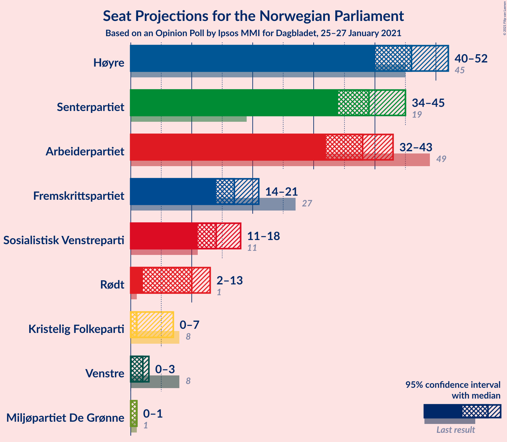
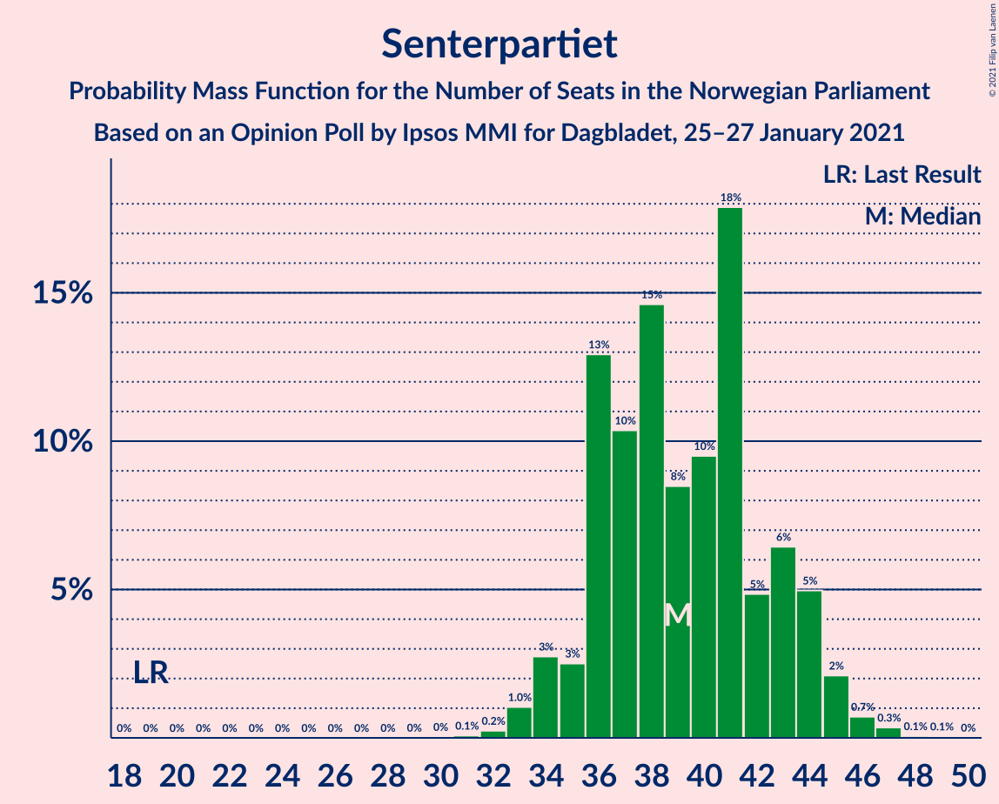
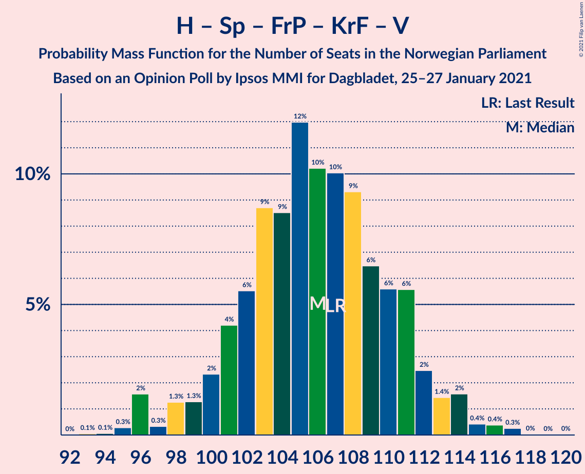
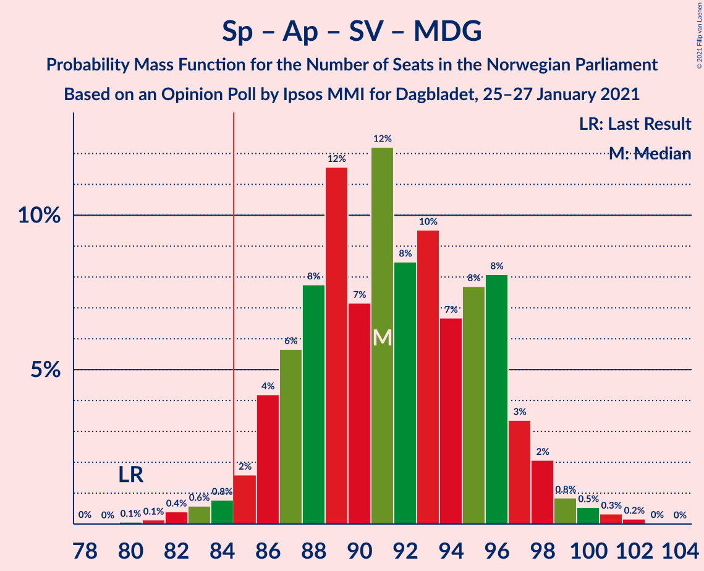
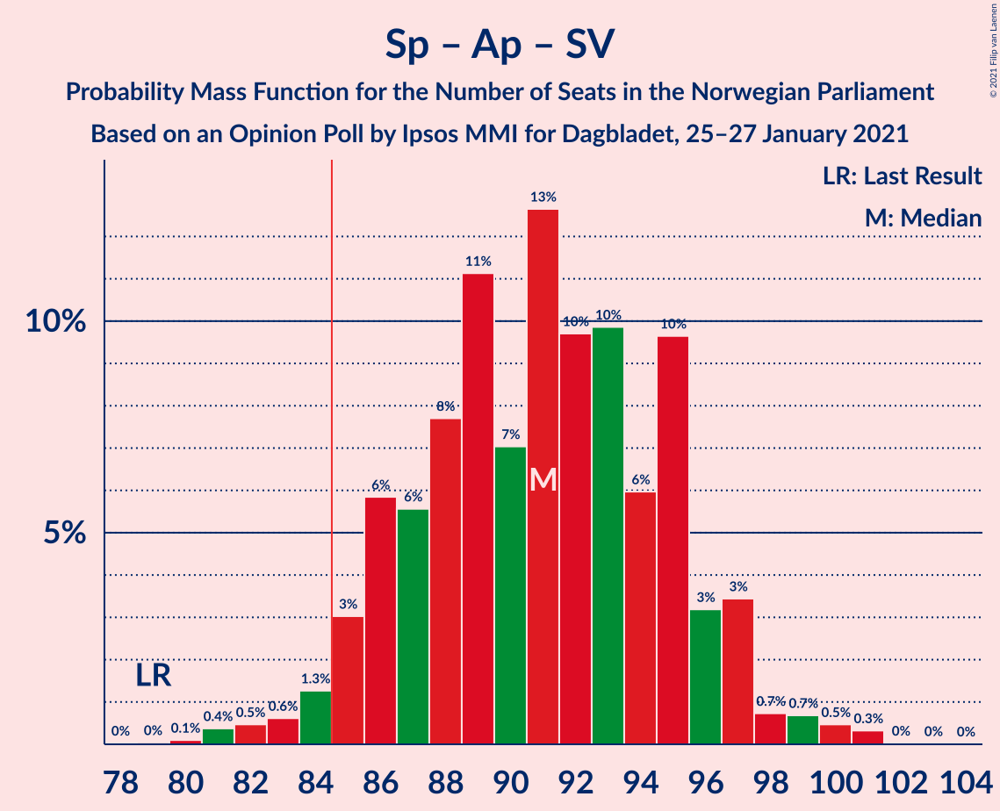
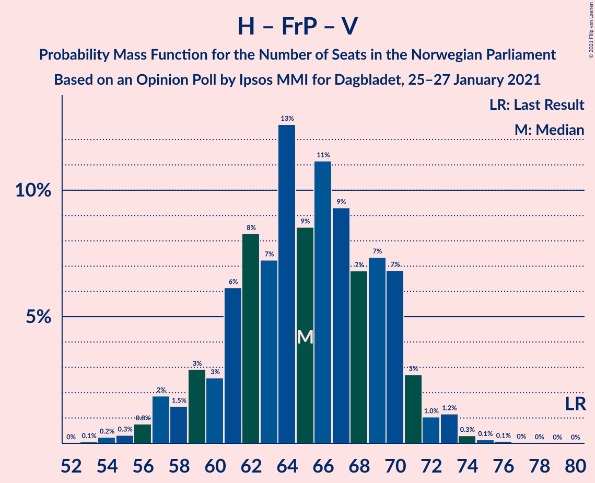

# Opinion Poll by Ipsos MMI for Dagbladet, 25–27 January 2021

<a href="#voting-intentions">Voting Intentions</a> | <a href="#seats">Seats</a> | <a href="#coalitions">Coalitions</a> | <a href="#technical-information">Technical Information</a>

## Voting Intentions

### Confidence Intervals

| Party | Last Result | Poll Result | 80% Confidence Interval | 90% Confidence Interval | 95% Confidence Interval | 99% Confidence Interval |
|:-----:|:-----------:|:-----------:|:-----------------------:|:-----------------------:|:-----------------------:|:-----------------------:|
| Høyre | 25.0% | 25.3% | 23.4–27.5% |22.8–28.1% |22.3–28.6% |21.4–29.7% |
| Senterpartiet | 10.3% | 21.4% | 19.5–23.4% |19.0–24.0% |18.6–24.5% |17.7–25.5% |
| Arbeiderpartiet | 27.4% | 20.4% | 18.6–22.5% |18.1–23.0% |17.7–23.5% |16.8–24.5% |
| Fremskrittspartiet | 15.2% | 9.5% | 8.3–11.1% |7.9–11.5% |7.6–11.9% |7.0–12.7% |
| Sosialistisk Venstreparti | 6.0% | 7.8% | 6.6–9.2% |6.3–9.6% |6.0–9.9% |5.5–10.7% |
| Rødt | 2.4% | 5.3% | 4.4–6.5% |4.1–6.9% |3.9–7.2% |3.5–7.8% |
| Kristelig Folkeparti | 4.2% | 2.9% | 2.2–3.8% |2.0–4.1% |1.9–4.3% |1.6–4.8% |
| Venstre | 4.4% | 2.5% | 1.9–3.4% |1.7–3.6% |1.6–3.9% |1.3–4.3% |
| Miljøpartiet De Grønne | 3.2% | 1.8% | 1.3–2.6% |1.1–2.8% |1.0–3.0% |0.8–3.4% |

*Note:* The poll result column reflects the actual value used in the calculations. Published results may vary slightly, and in addition be rounded to fewer digits.

## Seats

### Confidence Intervals

| Party | Last Result | Median | 80% Confidence Interval | 90% Confidence Interval | 95% Confidence Interval | 99% Confidence Interval |
|:-----:|:-----------:|:------:|:-----------------------:|:-----------------------:|:-----------------------:|:-----------------------:|
| <a href="#høyre">Høyre</a> | 45 | 46 | 45–50 |43–52 |41–53 |40–53 |
| <a href="#senterpartiet">Senterpartiet</a> | 19 | 41 | 36–44 |36–45 |35–46 |34–47 |
| <a href="#arbeiderpartiet">Arbeiderpartiet</a> | 49 | 37 | 33–41 |33–41 |32–42 |29–44 |
| <a href="#fremskrittspartiet">Fremskrittspartiet</a> | 27 | 17 | 14–19 |14–20 |14–21 |12–22 |
| <a href="#sosialistisk-venstreparti">Sosialistisk Venstreparti</a> | 11 | 14 | 12–17 |11–17 |11–18 |10–19 |
| <a href="#rødt">Rødt</a> | 1 | 10 | 8–12 |7–12 |2–13 |2–15 |
| <a href="#kristelig-folkeparti">Kristelig Folkeparti</a> | 8 | 1 | 0–3 |0–7 |0–7 |0–9 |
| <a href="#venstre">Venstre</a> | 8 | 2 | 1–2 |1–3 |1–6 |0–8 |
| <a href="#miljøpartiet-de-grønne">Miljøpartiet De Grønne</a> | 1 | 1 | 0–1 |0–1 |0–1 |0–2 |

### Høyre

*For a full overview of the results for this party, see the [Høyre](party-høyre.html) page.*

| Number of Seats | Probability | Accumulated | Special Marks |
|:---------------:|:-----------:|:-----------:|:-------------:|
| 37 | 0% | 100% |  |
| 38 | 0.1% | 99.9% |  |
| 39 | 0.2% | 99.8% |  |
| 40 | 2% | 99.6% |  |
| 41 | 0.7% | 98% |  |
| 42 | 1.1% | 97% |  |
| 43 | 3% | 96% |  |
| 44 | 3% | 93% |  |
| 45 | 25% | 90% | Last Result |
| 46 | 19% | 65% | Median |
| 47 | 7% | 46% |  |
| 48 | 7% | 38% |  |
| 49 | 18% | 32% |  |
| 50 | 5% | 14% |  |
| 51 | 2% | 8% |  |
| 52 | 4% | 7% |  |
| 53 | 2% | 3% |  |
| 54 | 0.2% | 0.5% |  |
| 55 | 0.2% | 0.3% |  |
| 56 | 0.1% | 0.1% |  |
| 57 | 0% | 0% |  |

### Senterpartiet

*For a full overview of the results for this party, see the [Senterpartiet](party-senterpartiet.html) page.*

| Number of Seats | Probability | Accumulated | Special Marks |
|:---------------:|:-----------:|:-----------:|:-------------:|
| 19 | 0% | 100% | Last Result |
| 20 | 0% | 100% |  |
| 21 | 0% | 100% |  |
| 22 | 0% | 100% |  |
| 23 | 0% | 100% |  |
| 24 | 0% | 100% |  |
| 25 | 0% | 100% |  |
| 26 | 0% | 100% |  |
| 27 | 0% | 100% |  |
| 28 | 0% | 100% |  |
| 29 | 0% | 100% |  |
| 30 | 0% | 100% |  |
| 31 | 0% | 100% |  |
| 32 | 0.2% | 99.9% |  |
| 33 | 0.1% | 99.7% |  |
| 34 | 1.2% | 99.6% |  |
| 35 | 3% | 98% |  |
| 36 | 6% | 96% |  |
| 37 | 11% | 90% |  |
| 38 | 12% | 79% |  |
| 39 | 4% | 67% |  |
| 40 | 10% | 63% |  |
| 41 | 30% | 53% | Median |
| 42 | 4% | 23% |  |
| 43 | 2% | 18% |  |
| 44 | 12% | 17% |  |
| 45 | 2% | 5% |  |
| 46 | 3% | 3% |  |
| 47 | 0.7% | 0.9% |  |
| 48 | 0.1% | 0.2% |  |
| 49 | 0% | 0.1% |  |
| 50 | 0% | 0% |  |

### Arbeiderpartiet

*For a full overview of the results for this party, see the [Arbeiderpartiet](party-arbeiderpartiet.html) page.*

| Number of Seats | Probability | Accumulated | Special Marks |
|:---------------:|:-----------:|:-----------:|:-------------:|
| 28 | 0% | 100% |  |
| 29 | 0.5% | 99.9% |  |
| 30 | 0.6% | 99.5% |  |
| 31 | 0.9% | 98.9% |  |
| 32 | 2% | 98% |  |
| 33 | 10% | 96% |  |
| 34 | 15% | 86% |  |
| 35 | 8% | 71% |  |
| 36 | 10% | 63% |  |
| 37 | 4% | 53% | Median |
| 38 | 24% | 49% |  |
| 39 | 9% | 25% |  |
| 40 | 0.6% | 16% |  |
| 41 | 12% | 15% |  |
| 42 | 1.1% | 4% |  |
| 43 | 2% | 2% |  |
| 44 | 0.4% | 0.6% |  |
| 45 | 0.1% | 0.2% |  |
| 46 | 0% | 0.1% |  |
| 47 | 0.1% | 0.1% |  |
| 48 | 0% | 0% |  |
| 49 | 0% | 0% | Last Result |

### Fremskrittspartiet

*For a full overview of the results for this party, see the [Fremskrittspartiet](party-fremskrittspartiet.html) page.*

| Number of Seats | Probability | Accumulated | Special Marks |
|:---------------:|:-----------:|:-----------:|:-------------:|
| 11 | 0.2% | 100% |  |
| 12 | 0.3% | 99.8% |  |
| 13 | 1.5% | 99.5% |  |
| 14 | 25% | 98% |  |
| 15 | 12% | 73% |  |
| 16 | 5% | 61% |  |
| 17 | 23% | 56% | Median |
| 18 | 22% | 33% |  |
| 19 | 2% | 11% |  |
| 20 | 5% | 9% |  |
| 21 | 1.2% | 3% |  |
| 22 | 2% | 2% |  |
| 23 | 0.3% | 0.4% |  |
| 24 | 0.1% | 0.1% |  |
| 25 | 0% | 0% |  |
| 26 | 0% | 0% |  |
| 27 | 0% | 0% | Last Result |

### Sosialistisk Venstreparti

*For a full overview of the results for this party, see the [Sosialistisk Venstreparti](party-sosialistiskvenstreparti.html) page.*

| Number of Seats | Probability | Accumulated | Special Marks |
|:---------------:|:-----------:|:-----------:|:-------------:|
| 9 | 0.3% | 100% |  |
| 10 | 1.5% | 99.7% |  |
| 11 | 7% | 98% | Last Result |
| 12 | 13% | 91% |  |
| 13 | 13% | 78% |  |
| 14 | 19% | 65% | Median |
| 15 | 21% | 46% |  |
| 16 | 8% | 24% |  |
| 17 | 12% | 16% |  |
| 18 | 3% | 4% |  |
| 19 | 1.4% | 2% |  |
| 20 | 0.2% | 0.2% |  |
| 21 | 0% | 0.1% |  |
| 22 | 0% | 0% |  |

### Rødt

*For a full overview of the results for this party, see the [Rødt](party-rødt.html) page.*

| Number of Seats | Probability | Accumulated | Special Marks |
|:---------------:|:-----------:|:-----------:|:-------------:|
| 1 | 0% | 100% | Last Result |
| 2 | 4% | 100% |  |
| 3 | 0% | 96% |  |
| 4 | 0% | 96% |  |
| 5 | 0% | 96% |  |
| 6 | 0% | 96% |  |
| 7 | 2% | 96% |  |
| 8 | 7% | 94% |  |
| 9 | 26% | 87% |  |
| 10 | 21% | 61% | Median |
| 11 | 15% | 40% |  |
| 12 | 21% | 26% |  |
| 13 | 4% | 5% |  |
| 14 | 0.9% | 1.4% |  |
| 15 | 0.5% | 0.5% |  |
| 16 | 0% | 0% |  |

### Kristelig Folkeparti

*For a full overview of the results for this party, see the [Kristelig Folkeparti](party-kristeligfolkeparti.html) page.*

| Number of Seats | Probability | Accumulated | Special Marks |
|:---------------:|:-----------:|:-----------:|:-------------:|
| 0 | 17% | 100% |  |
| 1 | 56% | 83% | Median |
| 2 | 11% | 27% |  |
| 3 | 10% | 16% |  |
| 4 | 0% | 6% |  |
| 5 | 0% | 6% |  |
| 6 | 0% | 6% |  |
| 7 | 4% | 6% |  |
| 8 | 2% | 2% | Last Result |
| 9 | 0.5% | 0.6% |  |
| 10 | 0% | 0% |  |

### Venstre

*For a full overview of the results for this party, see the [Venstre](party-venstre.html) page.*

| Number of Seats | Probability | Accumulated | Special Marks |
|:---------------:|:-----------:|:-----------:|:-------------:|
| 0 | 1.4% | 100% |  |
| 1 | 20% | 98.6% |  |
| 2 | 74% | 79% | Median |
| 3 | 2% | 5% |  |
| 4 | 0% | 3% |  |
| 5 | 0% | 3% |  |
| 6 | 0% | 3% |  |
| 7 | 2% | 2% |  |
| 8 | 0.6% | 0.7% | Last Result |
| 9 | 0.1% | 0.1% |  |
| 10 | 0% | 0% |  |

### Miljøpartiet De Grønne

*For a full overview of the results for this party, see the [Miljøpartiet De Grønne](party-miljøpartietdegrønne.html) page.*

| Number of Seats | Probability | Accumulated | Special Marks |
|:---------------:|:-----------:|:-----------:|:-------------:|
| 0 | 49% | 100% |  |
| 1 | 50% | 51% | Last Result, Median |
| 2 | 0.8% | 0.9% |  |
| 3 | 0% | 0% |  |

## Coalitions

### Confidence Intervals

| Coalition | Last Result | Median | Majority? | 80% Confidence Interval | 90% Confidence Interval | 95% Confidence Interval | 99% Confidence Interval |
|:---------:|:-----------:|:------:|:---------:|:-----------------------:|:-----------------------:|:-----------------------:|:-----------------------:|
| Høyre – Senterpartiet – Fremskrittspartiet – Kristelig Folkeparti – Venstre | 107 | 107 | 100% | 103–111 | 102–112 | 101–113 | 98–117 |
| Senterpartiet – Arbeiderpartiet – Sosialistisk Venstreparti – Rødt – Miljøpartiet De Grønne | 81 | 102 | 100% | 97–107 | 95–107 | 94–107 | 91–109 |
| Senterpartiet – Arbeiderpartiet – Sosialistisk Venstreparti – Rødt | 80 | 101 | 100% | 96–106 | 95–106 | 94–106 | 91–108 |
| Senterpartiet – Arbeiderpartiet – Sosialistisk Venstreparti – Kristelig Folkeparti – Miljøpartiet De Grønne | 88 | 93 | 99.3% | 89–97 | 87–98 | 86–98 | 84–101 |
| Senterpartiet – Arbeiderpartiet – Sosialistisk Venstreparti – Miljøpartiet De Grønne | 80 | 92 | 98% | 87–95 | 85–96 | 85–97 | 82–99 |
| Senterpartiet – Arbeiderpartiet – Sosialistisk Venstreparti | 79 | 91 | 96% | 86–94 | 85–96 | 84–97 | 81–98 |
| Senterpartiet – Arbeiderpartiet – Kristelig Folkeparti – Miljøpartiet De Grønne | 77 | 80 | 6% | 75–84 | 73–85 | 72–86 | 69–87 |
| Senterpartiet – Arbeiderpartiet – Kristelig Folkeparti | 76 | 79 | 5% | 74–83 | 72–85 | 72–86 | 69–87 |
| Senterpartiet – Arbeiderpartiet | 68 | 77 | 3% | 73–81 | 71–83 | 70–85 | 68–85 |
| Høyre – Fremskrittspartiet – Kristelig Folkeparti – Venstre – Miljøpartiet De Grønne | 89 | 67 | 0% | 63–72 | 63–74 | 61–75 | 60–76 |
| Høyre – Fremskrittspartiet – Kristelig Folkeparti – Venstre | 88 | 66 | 0% | 62–72 | 62–73 | 61–74 | 59–76 |
| Høyre – Fremskrittspartiet – Venstre | 80 | 65 | 0% | 61–71 | 60–71 | 59–72 | 56–73 |
| Høyre – Fremskrittspartiet | 72 | 63 | 0% | 59–69 | 58–69 | 57–70 | 54–71 |
| Høyre – Kristelig Folkeparti – Venstre | 61 | 50 | 0% | 48–55 | 47–56 | 45–57 | 43–58 |
| Arbeiderpartiet – Sosialistisk Venstreparti | 60 | 51 | 0% | 47–55 | 46–56 | 45–56 | 43–58 |
| Senterpartiet – Kristelig Folkeparti – Venstre | 35 | 44 | 0% | 40–47 | 38–49 | 38–49 | 36–53 |

### Høyre – Senterpartiet – Fremskrittspartiet – Kristelig Folkeparti – Venstre

| Number of Seats | Probability | Accumulated | Special Marks |
|:---------------:|:-----------:|:-----------:|:-------------:|
| 95 | 0% | 100% |  |
| 96 | 0.1% | 99.9% |  |
| 97 | 0.2% | 99.8% |  |
| 98 | 0.3% | 99.6% |  |
| 99 | 0.9% | 99.4% |  |
| 100 | 0.4% | 98% |  |
| 101 | 0.7% | 98% |  |
| 102 | 3% | 97% |  |
| 103 | 25% | 94% |  |
| 104 | 6% | 69% |  |
| 105 | 4% | 63% |  |
| 106 | 2% | 59% |  |
| 107 | 10% | 57% | Last Result, Median |
| 108 | 4% | 47% |  |
| 109 | 13% | 43% |  |
| 110 | 15% | 30% |  |
| 111 | 5% | 15% |  |
| 112 | 5% | 9% |  |
| 113 | 2% | 5% |  |
| 114 | 0.6% | 2% |  |
| 115 | 0% | 2% |  |
| 116 | 1.1% | 2% |  |
| 117 | 0.5% | 0.7% |  |
| 118 | 0% | 0.1% |  |
| 119 | 0.1% | 0.1% |  |
| 120 | 0% | 0% |  |

### Senterpartiet – Arbeiderpartiet – Sosialistisk Venstreparti – Rødt – Miljøpartiet De Grønne

| Number of Seats | Probability | Accumulated | Special Marks |
|:---------------:|:-----------:|:-----------:|:-------------:|
| 81 | 0% | 100% | Last Result |
| 82 | 0% | 100% |  |
| 83 | 0% | 100% |  |
| 84 | 0% | 100% |  |
| 85 | 0% | 100% | Majority |
| 86 | 0% | 100% |  |
| 87 | 0% | 100% |  |
| 88 | 0% | 99.9% |  |
| 89 | 0% | 99.9% |  |
| 90 | 0.1% | 99.9% |  |
| 91 | 0.2% | 99.7% |  |
| 92 | 0.5% | 99.5% |  |
| 93 | 0.6% | 99.0% |  |
| 94 | 1.2% | 98% |  |
| 95 | 3% | 97% |  |
| 96 | 4% | 95% |  |
| 97 | 11% | 91% |  |
| 98 | 5% | 80% |  |
| 99 | 5% | 75% |  |
| 100 | 10% | 70% |  |
| 101 | 8% | 60% |  |
| 102 | 6% | 52% |  |
| 103 | 10% | 45% | Median |
| 104 | 12% | 36% |  |
| 105 | 3% | 24% |  |
| 106 | 3% | 21% |  |
| 107 | 17% | 18% |  |
| 108 | 0.6% | 1.2% |  |
| 109 | 0.4% | 0.5% |  |
| 110 | 0.1% | 0.2% |  |
| 111 | 0% | 0% |  |

### Senterpartiet – Arbeiderpartiet – Sosialistisk Venstreparti – Rødt

| Number of Seats | Probability | Accumulated | Special Marks |
|:---------------:|:-----------:|:-----------:|:-------------:|
| 80 | 0% | 100% | Last Result |
| 81 | 0% | 100% |  |
| 82 | 0% | 100% |  |
| 83 | 0% | 100% |  |
| 84 | 0% | 100% |  |
| 85 | 0% | 100% | Majority |
| 86 | 0% | 100% |  |
| 87 | 0% | 100% |  |
| 88 | 0% | 99.9% |  |
| 89 | 0.2% | 99.9% |  |
| 90 | 0.1% | 99.7% |  |
| 91 | 0.3% | 99.6% |  |
| 92 | 0.7% | 99.4% |  |
| 93 | 1.0% | 98.6% |  |
| 94 | 2% | 98% |  |
| 95 | 5% | 96% |  |
| 96 | 3% | 91% |  |
| 97 | 11% | 89% |  |
| 98 | 4% | 78% |  |
| 99 | 4% | 73% |  |
| 100 | 11% | 69% |  |
| 101 | 9% | 58% |  |
| 102 | 12% | 49% | Median |
| 103 | 11% | 37% |  |
| 104 | 3% | 26% |  |
| 105 | 2% | 23% |  |
| 106 | 19% | 21% |  |
| 107 | 2% | 2% |  |
| 108 | 0.3% | 0.7% |  |
| 109 | 0.4% | 0.5% |  |
| 110 | 0.1% | 0.1% |  |
| 111 | 0% | 0% |  |

### Senterpartiet – Arbeiderpartiet – Sosialistisk Venstreparti – Kristelig Folkeparti – Miljøpartiet De Grønne

| Number of Seats | Probability | Accumulated | Special Marks |
|:---------------:|:-----------:|:-----------:|:-------------:|
| 82 | 0.2% | 100% |  |
| 83 | 0.2% | 99.8% |  |
| 84 | 0.2% | 99.6% |  |
| 85 | 1.0% | 99.3% | Majority |
| 86 | 1.1% | 98% |  |
| 87 | 5% | 97% |  |
| 88 | 2% | 92% | Last Result |
| 89 | 4% | 90% |  |
| 90 | 7% | 86% |  |
| 91 | 5% | 79% |  |
| 92 | 15% | 74% |  |
| 93 | 12% | 59% |  |
| 94 | 13% | 48% | Median |
| 95 | 3% | 35% |  |
| 96 | 19% | 32% |  |
| 97 | 6% | 14% |  |
| 98 | 5% | 7% |  |
| 99 | 0.8% | 2% |  |
| 100 | 0.4% | 1.3% |  |
| 101 | 0.6% | 0.9% |  |
| 102 | 0.1% | 0.3% |  |
| 103 | 0.1% | 0.2% |  |
| 104 | 0% | 0.1% |  |
| 105 | 0% | 0% |  |

### Senterpartiet – Arbeiderpartiet – Sosialistisk Venstreparti – Miljøpartiet De Grønne

| Number of Seats | Probability | Accumulated | Special Marks |
|:---------------:|:-----------:|:-----------:|:-------------:|
| 80 | 0.1% | 100% | Last Result |
| 81 | 0.3% | 99.9% |  |
| 82 | 0.2% | 99.6% |  |
| 83 | 0.4% | 99.4% |  |
| 84 | 1.1% | 99.0% |  |
| 85 | 4% | 98% | Majority |
| 86 | 4% | 94% |  |
| 87 | 4% | 90% |  |
| 88 | 8% | 86% |  |
| 89 | 5% | 78% |  |
| 90 | 4% | 73% |  |
| 91 | 14% | 69% |  |
| 92 | 8% | 55% |  |
| 93 | 8% | 47% | Median |
| 94 | 14% | 38% |  |
| 95 | 17% | 25% |  |
| 96 | 3% | 7% |  |
| 97 | 4% | 5% |  |
| 98 | 0.6% | 1.2% |  |
| 99 | 0.2% | 0.5% |  |
| 100 | 0.2% | 0.3% |  |
| 101 | 0% | 0.1% |  |
| 102 | 0% | 0.1% |  |
| 103 | 0% | 0% |  |

### Senterpartiet – Arbeiderpartiet – Sosialistisk Venstreparti

| Number of Seats | Probability | Accumulated | Special Marks |
|:---------------:|:-----------:|:-----------:|:-------------:|
| 79 | 0.1% | 100% | Last Result |
| 80 | 0.2% | 99.9% |  |
| 81 | 0.2% | 99.7% |  |
| 82 | 0.3% | 99.5% |  |
| 83 | 0.9% | 99.2% |  |
| 84 | 2% | 98% |  |
| 85 | 2% | 96% | Majority |
| 86 | 5% | 94% |  |
| 87 | 4% | 88% |  |
| 88 | 7% | 85% |  |
| 89 | 6% | 77% |  |
| 90 | 6% | 72% |  |
| 91 | 17% | 66% |  |
| 92 | 6% | 48% | Median |
| 93 | 15% | 42% |  |
| 94 | 18% | 27% |  |
| 95 | 3% | 9% |  |
| 96 | 2% | 6% |  |
| 97 | 3% | 4% |  |
| 98 | 0.2% | 0.6% |  |
| 99 | 0.2% | 0.4% |  |
| 100 | 0.1% | 0.2% |  |
| 101 | 0% | 0.1% |  |
| 102 | 0% | 0% |  |

### Senterpartiet – Arbeiderpartiet – Kristelig Folkeparti – Miljøpartiet De Grønne

| Number of Seats | Probability | Accumulated | Special Marks |
|:---------------:|:-----------:|:-----------:|:-------------:|
| 67 | 0.1% | 100% |  |
| 68 | 0.2% | 99.9% |  |
| 69 | 0.4% | 99.7% |  |
| 70 | 0.2% | 99.3% |  |
| 71 | 1.3% | 99.1% |  |
| 72 | 2% | 98% |  |
| 73 | 2% | 95% |  |
| 74 | 2% | 94% |  |
| 75 | 13% | 91% |  |
| 76 | 10% | 79% |  |
| 77 | 6% | 69% | Last Result |
| 78 | 5% | 63% |  |
| 79 | 5% | 58% |  |
| 80 | 15% | 53% | Median |
| 81 | 20% | 39% |  |
| 82 | 3% | 19% |  |
| 83 | 5% | 15% |  |
| 84 | 4% | 10% |  |
| 85 | 3% | 6% | Majority |
| 86 | 3% | 4% |  |
| 87 | 0.3% | 0.7% |  |
| 88 | 0.2% | 0.4% |  |
| 89 | 0.1% | 0.2% |  |
| 90 | 0% | 0.1% |  |
| 91 | 0% | 0% |  |

### Senterpartiet – Arbeiderpartiet – Kristelig Folkeparti

| Number of Seats | Probability | Accumulated | Special Marks |
|:---------------:|:-----------:|:-----------:|:-------------:|
| 67 | 0.1% | 100% |  |
| 68 | 0.2% | 99.8% |  |
| 69 | 0.4% | 99.7% |  |
| 70 | 0.6% | 99.3% |  |
| 71 | 1.1% | 98.6% |  |
| 72 | 3% | 98% |  |
| 73 | 2% | 94% |  |
| 74 | 2% | 92% |  |
| 75 | 12% | 90% |  |
| 76 | 12% | 78% | Last Result |
| 77 | 3% | 66% |  |
| 78 | 6% | 63% |  |
| 79 | 17% | 57% | Median |
| 80 | 18% | 39% |  |
| 81 | 5% | 21% |  |
| 82 | 4% | 16% |  |
| 83 | 5% | 12% |  |
| 84 | 2% | 7% |  |
| 85 | 1.5% | 5% | Majority |
| 86 | 3% | 4% |  |
| 87 | 0.2% | 0.5% |  |
| 88 | 0.2% | 0.3% |  |
| 89 | 0% | 0.1% |  |
| 90 | 0% | 0% |  |

### Senterpartiet – Arbeiderpartiet

| Number of Seats | Probability | Accumulated | Special Marks |
|:---------------:|:-----------:|:-----------:|:-------------:|
| 65 | 0% | 100% |  |
| 66 | 0.1% | 99.9% |  |
| 67 | 0.2% | 99.8% |  |
| 68 | 0.8% | 99.6% | Last Result |
| 69 | 0.5% | 98.9% |  |
| 70 | 1.2% | 98% |  |
| 71 | 5% | 97% |  |
| 72 | 2% | 93% |  |
| 73 | 3% | 90% |  |
| 74 | 13% | 87% |  |
| 75 | 10% | 74% |  |
| 76 | 11% | 65% |  |
| 77 | 5% | 54% |  |
| 78 | 10% | 49% | Median |
| 79 | 28% | 40% |  |
| 80 | 2% | 12% |  |
| 81 | 3% | 11% |  |
| 82 | 2% | 8% |  |
| 83 | 3% | 6% |  |
| 84 | 0.5% | 3% |  |
| 85 | 2% | 3% | Majority |
| 86 | 0% | 0.2% |  |
| 87 | 0% | 0.1% |  |
| 88 | 0.1% | 0.1% |  |
| 89 | 0% | 0% |  |

### Høyre – Fremskrittspartiet – Kristelig Folkeparti – Venstre – Miljøpartiet De Grønne

| Number of Seats | Probability | Accumulated | Special Marks |
|:---------------:|:-----------:|:-----------:|:-------------:|
| 57 | 0% | 100% |  |
| 58 | 0% | 99.9% |  |
| 59 | 0.2% | 99.9% |  |
| 60 | 2% | 99.6% |  |
| 61 | 0.7% | 98% |  |
| 62 | 2% | 97% |  |
| 63 | 19% | 95% |  |
| 64 | 5% | 77% |  |
| 65 | 3% | 72% |  |
| 66 | 11% | 68% |  |
| 67 | 13% | 57% | Median |
| 68 | 9% | 45% |  |
| 69 | 11% | 36% |  |
| 70 | 4% | 25% |  |
| 71 | 2% | 21% |  |
| 72 | 10% | 19% |  |
| 73 | 2% | 9% |  |
| 74 | 4% | 6% |  |
| 75 | 1.3% | 3% |  |
| 76 | 0.8% | 1.3% |  |
| 77 | 0.2% | 0.5% |  |
| 78 | 0.1% | 0.3% |  |
| 79 | 0% | 0.1% |  |
| 80 | 0.1% | 0.1% |  |
| 81 | 0% | 0% |  |
| 82 | 0% | 0% |  |
| 83 | 0% | 0% |  |
| 84 | 0% | 0% |  |
| 85 | 0% | 0% | Majority |
| 86 | 0% | 0% |  |
| 87 | 0% | 0% |  |
| 88 | 0% | 0% |  |
| 89 | 0% | 0% | Last Result |

### Høyre – Fremskrittspartiet – Kristelig Folkeparti – Venstre

| Number of Seats | Probability | Accumulated | Special Marks |
|:---------------:|:-----------:|:-----------:|:-------------:|
| 56 | 0% | 100% |  |
| 57 | 0.1% | 99.9% |  |
| 58 | 0.1% | 99.9% |  |
| 59 | 1.4% | 99.8% |  |
| 60 | 0.7% | 98% |  |
| 61 | 0.8% | 98% |  |
| 62 | 17% | 97% |  |
| 63 | 4% | 80% |  |
| 64 | 6% | 76% |  |
| 65 | 12% | 70% |  |
| 66 | 10% | 59% | Median |
| 67 | 6% | 49% |  |
| 68 | 8% | 43% |  |
| 69 | 10% | 35% |  |
| 70 | 5% | 24% |  |
| 71 | 2% | 19% |  |
| 72 | 10% | 17% |  |
| 73 | 4% | 7% |  |
| 74 | 2% | 3% |  |
| 75 | 1.0% | 2% |  |
| 76 | 0.3% | 0.6% |  |
| 77 | 0.1% | 0.3% |  |
| 78 | 0.1% | 0.2% |  |
| 79 | 0.1% | 0.1% |  |
| 80 | 0% | 0.1% |  |
| 81 | 0% | 0% |  |
| 82 | 0% | 0% |  |
| 83 | 0% | 0% |  |
| 84 | 0% | 0% |  |
| 85 | 0% | 0% | Majority |
| 86 | 0% | 0% |  |
| 87 | 0% | 0% |  |
| 88 | 0% | 0% | Last Result |

### Høyre – Fremskrittspartiet – Venstre

| Number of Seats | Probability | Accumulated | Special Marks |
|:---------------:|:-----------:|:-----------:|:-------------:|
| 54 | 0% | 100% |  |
| 55 | 0.1% | 99.9% |  |
| 56 | 1.2% | 99.9% |  |
| 57 | 0.3% | 98.6% |  |
| 58 | 0.5% | 98% |  |
| 59 | 1.3% | 98% |  |
| 60 | 2% | 97% |  |
| 61 | 16% | 94% |  |
| 62 | 5% | 78% |  |
| 63 | 6% | 73% |  |
| 64 | 5% | 67% |  |
| 65 | 16% | 62% | Median |
| 66 | 7% | 45% |  |
| 67 | 11% | 38% |  |
| 68 | 8% | 28% |  |
| 69 | 5% | 19% |  |
| 70 | 3% | 14% |  |
| 71 | 8% | 11% |  |
| 72 | 2% | 3% |  |
| 73 | 1.2% | 2% |  |
| 74 | 0.2% | 0.4% |  |
| 75 | 0.1% | 0.2% |  |
| 76 | 0% | 0.1% |  |
| 77 | 0% | 0.1% |  |
| 78 | 0% | 0% |  |
| 79 | 0% | 0% |  |
| 80 | 0% | 0% | Last Result |

### Høyre – Fremskrittspartiet

| Number of Seats | Probability | Accumulated | Special Marks |
|:---------------:|:-----------:|:-----------:|:-------------:|
| 52 | 0% | 100% |  |
| 53 | 0.1% | 99.9% |  |
| 54 | 1.2% | 99.8% |  |
| 55 | 0.3% | 98.6% |  |
| 56 | 0.4% | 98% |  |
| 57 | 1.0% | 98% |  |
| 58 | 3% | 97% |  |
| 59 | 16% | 94% |  |
| 60 | 4% | 78% |  |
| 61 | 8% | 74% |  |
| 62 | 4% | 65% |  |
| 63 | 17% | 61% | Median |
| 64 | 5% | 44% |  |
| 65 | 9% | 39% |  |
| 66 | 4% | 30% |  |
| 67 | 13% | 26% |  |
| 68 | 2% | 13% |  |
| 69 | 7% | 11% |  |
| 70 | 1.3% | 3% |  |
| 71 | 2% | 2% |  |
| 72 | 0.2% | 0.4% | Last Result |
| 73 | 0.1% | 0.2% |  |
| 74 | 0% | 0.1% |  |
| 75 | 0% | 0.1% |  |
| 76 | 0% | 0% |  |

### Høyre – Kristelig Folkeparti – Venstre

| Number of Seats | Probability | Accumulated | Special Marks |
|:---------------:|:-----------:|:-----------:|:-------------:|
| 39 | 0% | 100% |  |
| 40 | 0% | 99.9% |  |
| 41 | 0.2% | 99.9% |  |
| 42 | 0.1% | 99.8% |  |
| 43 | 1.0% | 99.6% |  |
| 44 | 0.4% | 98.6% |  |
| 45 | 2% | 98% |  |
| 46 | 0.6% | 97% |  |
| 47 | 1.2% | 96% |  |
| 48 | 33% | 95% |  |
| 49 | 5% | 62% | Median |
| 50 | 16% | 56% |  |
| 51 | 13% | 41% |  |
| 52 | 9% | 28% |  |
| 53 | 4% | 19% |  |
| 54 | 3% | 15% |  |
| 55 | 6% | 13% |  |
| 56 | 2% | 7% |  |
| 57 | 3% | 5% |  |
| 58 | 1.2% | 1.4% |  |
| 59 | 0.1% | 0.2% |  |
| 60 | 0.1% | 0.1% |  |
| 61 | 0% | 0.1% | Last Result |
| 62 | 0% | 0% |  |

### Arbeiderpartiet – Sosialistisk Venstreparti

| Number of Seats | Probability | Accumulated | Special Marks |
|:---------------:|:-----------:|:-----------:|:-------------:|
| 41 | 0% | 100% |  |
| 42 | 0.2% | 99.9% |  |
| 43 | 0.7% | 99.7% |  |
| 44 | 0.5% | 99.1% |  |
| 45 | 2% | 98.5% |  |
| 46 | 2% | 97% |  |
| 47 | 8% | 94% |  |
| 48 | 8% | 86% |  |
| 49 | 8% | 78% |  |
| 50 | 19% | 70% |  |
| 51 | 6% | 51% | Median |
| 52 | 9% | 45% |  |
| 53 | 19% | 37% |  |
| 54 | 2% | 18% |  |
| 55 | 9% | 16% |  |
| 56 | 5% | 6% |  |
| 57 | 0.2% | 1.1% |  |
| 58 | 0.4% | 0.9% |  |
| 59 | 0.3% | 0.5% |  |
| 60 | 0.1% | 0.2% | Last Result |
| 61 | 0.1% | 0.1% |  |
| 62 | 0% | 0% |  |

### Senterpartiet – Kristelig Folkeparti – Venstre

| Number of Seats | Probability | Accumulated | Special Marks |
|:---------------:|:-----------:|:-----------:|:-------------:|
| 34 | 0.1% | 100% |  |
| 35 | 0.1% | 99.9% | Last Result |
| 36 | 0.6% | 99.8% |  |
| 37 | 0.6% | 99.2% |  |
| 38 | 5% | 98.6% |  |
| 39 | 1.4% | 94% |  |
| 40 | 17% | 92% |  |
| 41 | 1.3% | 75% |  |
| 42 | 5% | 74% |  |
| 43 | 14% | 69% |  |
| 44 | 22% | 55% | Median |
| 45 | 5% | 33% |  |
| 46 | 8% | 28% |  |
| 47 | 10% | 19% |  |
| 48 | 2% | 9% |  |
| 49 | 5% | 7% |  |
| 50 | 0.8% | 2% |  |
| 51 | 0.2% | 1.2% |  |
| 52 | 0.1% | 1.0% |  |
| 53 | 0.4% | 0.9% |  |
| 54 | 0.1% | 0.5% |  |
| 55 | 0.3% | 0.4% |  |
| 56 | 0.1% | 0.1% |  |
| 57 | 0% | 0% |  |

## Technical Information

### Opinion Poll

+ **Polling firm:** Ipsos MMI
+ **Commissioner(s):** Dagbladet
+ **Fieldwork period:** 25–27 January 2021

### Calculations

+ **Sample size:** 734
+ **Simulations done:** 131,072
+ **Error estimate:** 2.00%

