# Opinion Poll by Kantar TNS for TV2, 25–29 January 2021

<a href="#voting-intentions">Voting Intentions</a> | <a href="#seats">Seats</a> | <a href="#coalitions">Coalitions</a> | <a href="#technical-information">Technical Information</a>

## Voting Intentions

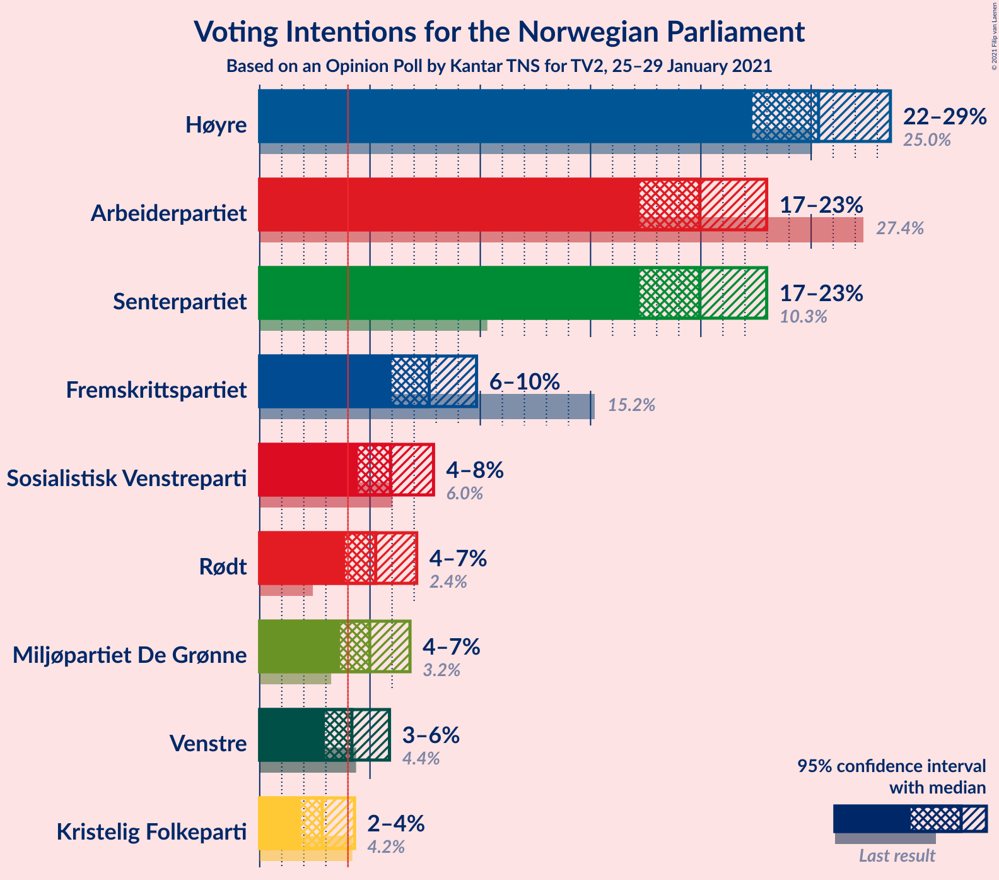

### Confidence Intervals

| Party | Last Result | Poll Result | 80% Confidence Interval | 90% Confidence Interval | 95% Confidence Interval | 99% Confidence Interval |
|:-----:|:-----------:|:-----------:|:-----------------------:|:-----------------------:|:-----------------------:|:-----------------------:|
| Høyre | 25.0% | 25.3% | 23.4–27.5% |22.8–28.1% |22.3–28.6% |21.4–29.6% |
| Arbeiderpartiet | 27.4% | 19.9% | 18.2–21.9% |17.6–22.5% |17.2–23.0% |16.4–24.0% |
| Senterpartiet | 10.3% | 19.9% | 18.2–21.9% |17.6–22.5% |17.2–23.0% |16.4–24.0% |
| Fremskrittspartiet | 15.2% | 7.7% | 6.6–9.1% |6.2–9.5% |6.0–9.8% |5.5–10.5% |
| Sosialistisk Venstreparti | 6.0% | 5.9% | 5.0–7.2% |4.7–7.6% |4.5–7.9% |4.0–8.5% |
| Rødt | 2.4% | 5.3% | 4.3–6.5% |4.1–6.8% |3.9–7.1% |3.5–7.7% |
| Miljøpartiet De Grønne | 3.2% | 5.0% | 4.1–6.2% |3.8–6.5% |3.6–6.8% |3.2–7.4% |
| Venstre | 4.4% | 4.2% | 3.4–5.3% |3.1–5.6% |3.0–5.9% |2.6–6.4% |
| Kristelig Folkeparti | 4.2% | 2.8% | 2.2–3.8% |2.0–4.1% |1.9–4.3% |1.6–4.8% |

*Note:* The poll result column reflects the actual value used in the calculations. Published results may vary slightly, and in addition be rounded to fewer digits.

## Seats

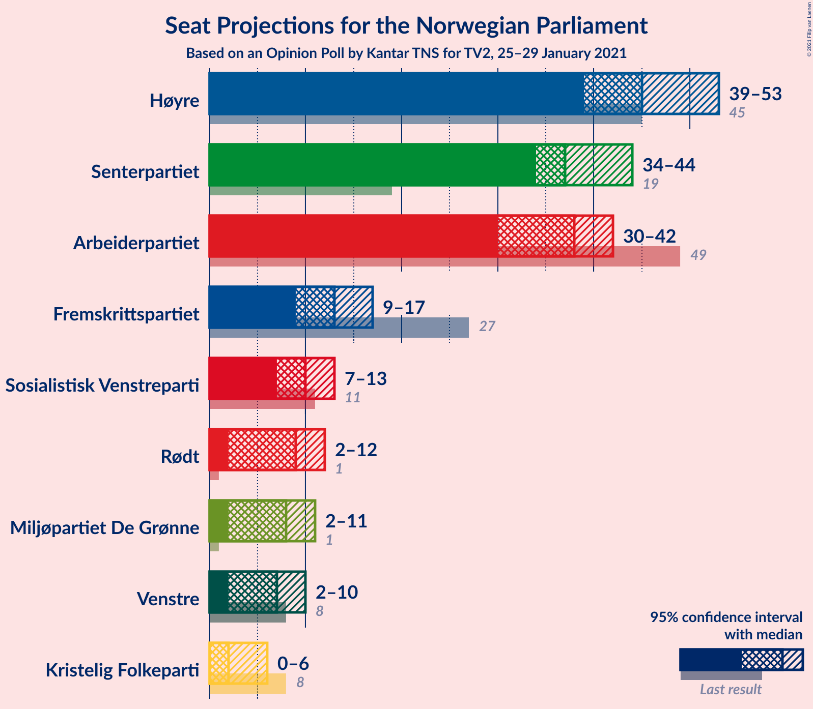

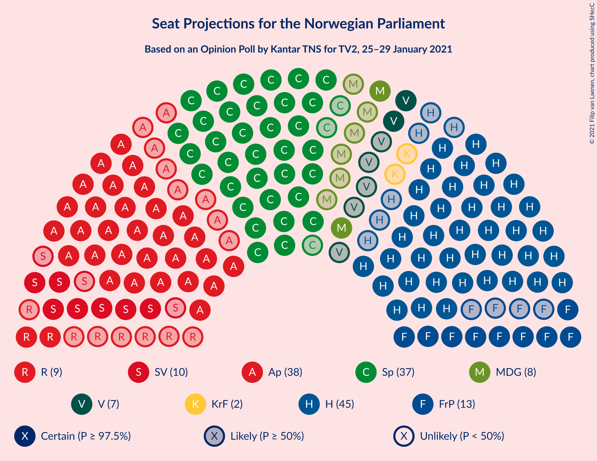

### Confidence Intervals

| Party | Last Result | Median | 80% Confidence Interval | 90% Confidence Interval | 95% Confidence Interval | 99% Confidence Interval |
|:-----:|:-----------:|:------:|:-----------------------:|:-----------------------:|:-----------------------:|:-----------------------:|
| <a href="#høyre">Høyre</a> | 45 | 45 | 41–49 |40–52 |39–53 |37–54 |
| <a href="#arbeiderpartiet">Arbeiderpartiet</a> | 49 | 38 | 32–41 |30–41 |30–42 |27–44 |
| <a href="#senterpartiet">Senterpartiet</a> | 19 | 37 | 36–42 |35–44 |34–44 |31–46 |
| <a href="#fremskrittspartiet">Fremskrittspartiet</a> | 27 | 13 | 10–15 |9–16 |9–17 |8–18 |
| <a href="#sosialistisk-venstreparti">Sosialistisk Venstreparti</a> | 11 | 10 | 8–12 |7–13 |7–13 |6–15 |
| <a href="#rødt">Rødt</a> | 1 | 9 | 7–11 |6–11 |2–12 |2–13 |
| <a href="#miljøpartiet-de-grønne">Miljøpartiet De Grønne</a> | 1 | 8 | 6–10 |2–11 |2–11 |2–12 |
| <a href="#venstre">Venstre</a> | 8 | 7 | 2–8 |2–9 |2–10 |2–11 |
| <a href="#kristelig-folkeparti">Kristelig Folkeparti</a> | 8 | 2 | 1–3 |0–3 |0–6 |0–7 |

### Høyre

*For a full overview of the results for this party, see the [Høyre](party-høyre.html) page.*

| Number of Seats | Probability | Accumulated | Special Marks |
|:---------------:|:-----------:|:-----------:|:-------------:|
| 35 | 0.1% | 100% |  |
| 36 | 0.1% | 99.9% |  |
| 37 | 0.4% | 99.8% |  |
| 38 | 1.0% | 99.4% |  |
| 39 | 2% | 98% |  |
| 40 | 6% | 96% |  |
| 41 | 4% | 90% |  |
| 42 | 6% | 86% |  |
| 43 | 17% | 79% |  |
| 44 | 13% | 63% |  |
| 45 | 9% | 50% | Last Result, Median |
| 46 | 14% | 41% |  |
| 47 | 4% | 27% |  |
| 48 | 5% | 23% |  |
| 49 | 8% | 18% |  |
| 50 | 2% | 10% |  |
| 51 | 2% | 7% |  |
| 52 | 1.4% | 5% |  |
| 53 | 3% | 4% |  |
| 54 | 0.8% | 1.3% |  |
| 55 | 0.2% | 0.5% |  |
| 56 | 0.2% | 0.2% |  |
| 57 | 0% | 0.1% |  |
| 58 | 0% | 0% |  |

### Arbeiderpartiet

*For a full overview of the results for this party, see the [Arbeiderpartiet](party-arbeiderpartiet.html) page.*

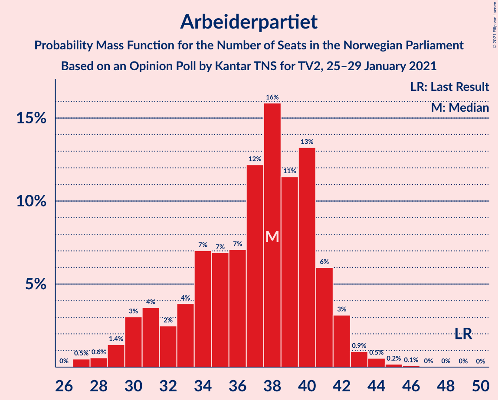

| Number of Seats | Probability | Accumulated | Special Marks |
|:---------------:|:-----------:|:-----------:|:-------------:|
| 27 | 0.5% | 100% |  |
| 28 | 0.6% | 99.5% |  |
| 29 | 1.4% | 98.9% |  |
| 30 | 3% | 98% |  |
| 31 | 4% | 95% |  |
| 32 | 2% | 91% |  |
| 33 | 4% | 88% |  |
| 34 | 7% | 85% |  |
| 35 | 7% | 78% |  |
| 36 | 7% | 71% |  |
| 37 | 12% | 64% |  |
| 38 | 16% | 51% | Median |
| 39 | 11% | 36% |  |
| 40 | 13% | 24% |  |
| 41 | 6% | 11% |  |
| 42 | 3% | 5% |  |
| 43 | 0.9% | 2% |  |
| 44 | 0.5% | 0.8% |  |
| 45 | 0.2% | 0.3% |  |
| 46 | 0.1% | 0.1% |  |
| 47 | 0% | 0% |  |
| 48 | 0% | 0% |  |
| 49 | 0% | 0% | Last Result |

### Senterpartiet

*For a full overview of the results for this party, see the [Senterpartiet](party-senterpartiet.html) page.*

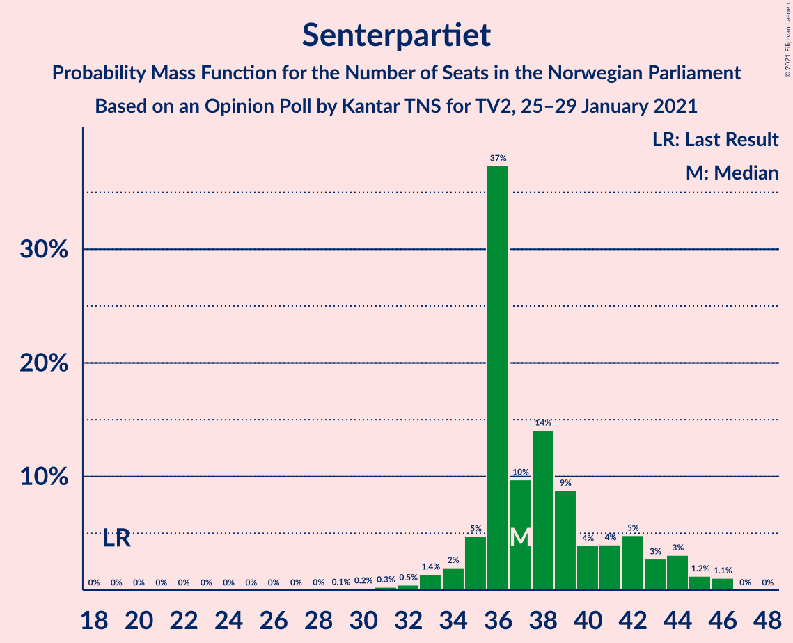

| Number of Seats | Probability | Accumulated | Special Marks |
|:---------------:|:-----------:|:-----------:|:-------------:|
| 19 | 0% | 100% | Last Result |
| 20 | 0% | 100% |  |
| 21 | 0% | 100% |  |
| 22 | 0% | 100% |  |
| 23 | 0% | 100% |  |
| 24 | 0% | 100% |  |
| 25 | 0% | 100% |  |
| 26 | 0% | 100% |  |
| 27 | 0% | 100% |  |
| 28 | 0% | 100% |  |
| 29 | 0.1% | 100% |  |
| 30 | 0.2% | 99.9% |  |
| 31 | 0.3% | 99.7% |  |
| 32 | 0.5% | 99.5% |  |
| 33 | 1.4% | 99.0% |  |
| 34 | 2% | 98% |  |
| 35 | 5% | 96% |  |
| 36 | 37% | 91% |  |
| 37 | 10% | 53% | Median |
| 38 | 14% | 44% |  |
| 39 | 9% | 30% |  |
| 40 | 4% | 21% |  |
| 41 | 4% | 17% |  |
| 42 | 5% | 13% |  |
| 43 | 3% | 8% |  |
| 44 | 3% | 5% |  |
| 45 | 1.2% | 2% |  |
| 46 | 1.1% | 1.1% |  |
| 47 | 0% | 0% |  |

### Fremskrittspartiet

*For a full overview of the results for this party, see the [Fremskrittspartiet](party-fremskrittspartiet.html) page.*

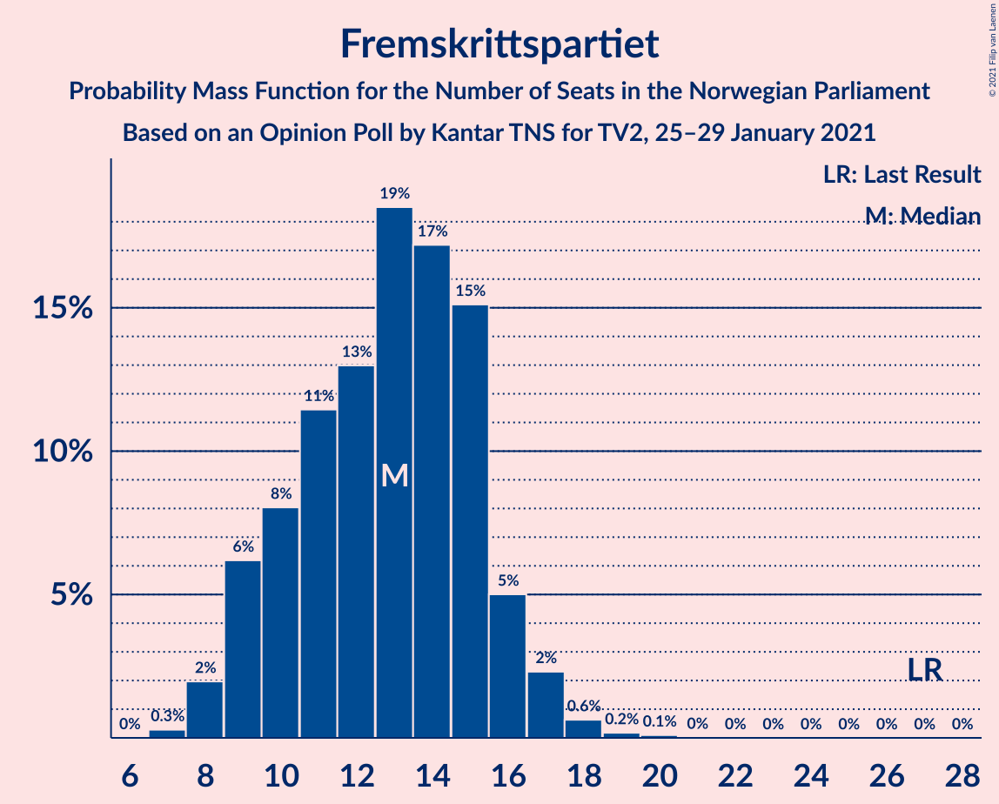

| Number of Seats | Probability | Accumulated | Special Marks |
|:---------------:|:-----------:|:-----------:|:-------------:|
| 7 | 0.3% | 100% |  |
| 8 | 2% | 99.7% |  |
| 9 | 6% | 98% |  |
| 10 | 8% | 92% |  |
| 11 | 11% | 84% |  |
| 12 | 13% | 72% |  |
| 13 | 19% | 59% | Median |
| 14 | 17% | 41% |  |
| 15 | 15% | 23% |  |
| 16 | 5% | 8% |  |
| 17 | 2% | 3% |  |
| 18 | 0.6% | 0.9% |  |
| 19 | 0.2% | 0.3% |  |
| 20 | 0.1% | 0.1% |  |
| 21 | 0% | 0% |  |
| 22 | 0% | 0% |  |
| 23 | 0% | 0% |  |
| 24 | 0% | 0% |  |
| 25 | 0% | 0% |  |
| 26 | 0% | 0% |  |
| 27 | 0% | 0% | Last Result |

### Sosialistisk Venstreparti

*For a full overview of the results for this party, see the [Sosialistisk Venstreparti](party-sosialistiskvenstreparti.html) page.*

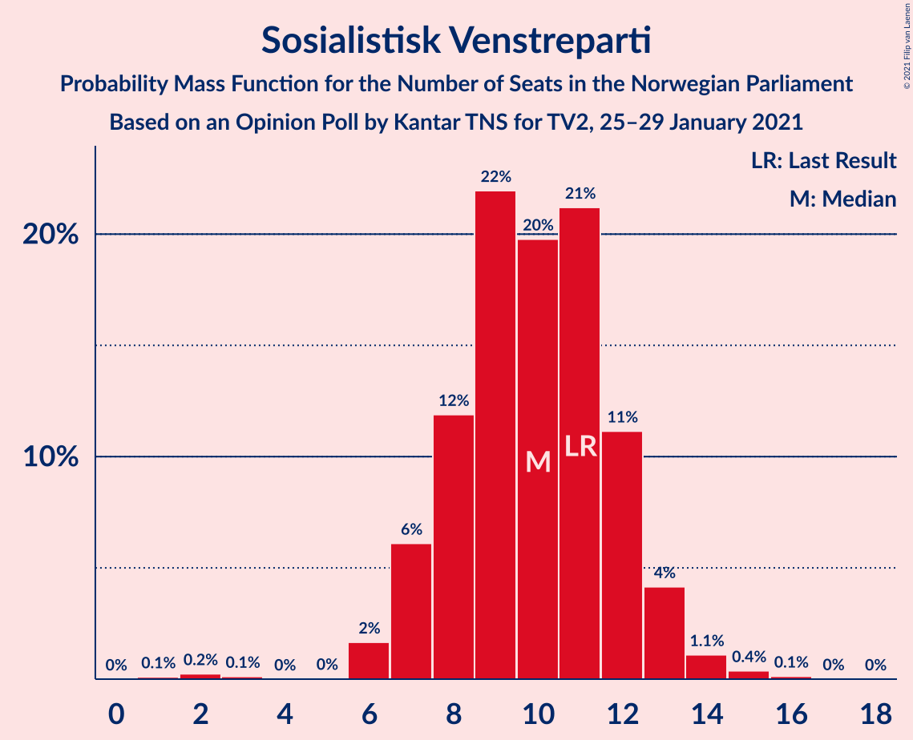

| Number of Seats | Probability | Accumulated | Special Marks |
|:---------------:|:-----------:|:-----------:|:-------------:|
| 1 | 0.1% | 100% |  |
| 2 | 0.2% | 99.9% |  |
| 3 | 0.1% | 99.7% |  |
| 4 | 0% | 99.5% |  |
| 5 | 0% | 99.5% |  |
| 6 | 2% | 99.5% |  |
| 7 | 6% | 98% |  |
| 8 | 12% | 92% |  |
| 9 | 22% | 80% |  |
| 10 | 20% | 58% | Median |
| 11 | 21% | 38% | Last Result |
| 12 | 11% | 17% |  |
| 13 | 4% | 6% |  |
| 14 | 1.1% | 2% |  |
| 15 | 0.4% | 0.5% |  |
| 16 | 0.1% | 0.1% |  |
| 17 | 0% | 0% |  |

### Rødt

*For a full overview of the results for this party, see the [Rødt](party-rødt.html) page.*

| Number of Seats | Probability | Accumulated | Special Marks |
|:---------------:|:-----------:|:-----------:|:-------------:|
| 1 | 0% | 100% | Last Result |
| 2 | 4% | 100% |  |
| 3 | 0% | 96% |  |
| 4 | 0% | 96% |  |
| 5 | 0% | 96% |  |
| 6 | 5% | 96% |  |
| 7 | 10% | 90% |  |
| 8 | 25% | 80% |  |
| 9 | 27% | 56% | Median |
| 10 | 18% | 29% |  |
| 11 | 7% | 11% |  |
| 12 | 3% | 3% |  |
| 13 | 0.5% | 0.6% |  |
| 14 | 0.1% | 0.1% |  |
| 15 | 0% | 0% |  |

### Miljøpartiet De Grønne

*For a full overview of the results for this party, see the [Miljøpartiet De Grønne](party-miljøpartietdegrønne.html) page.*

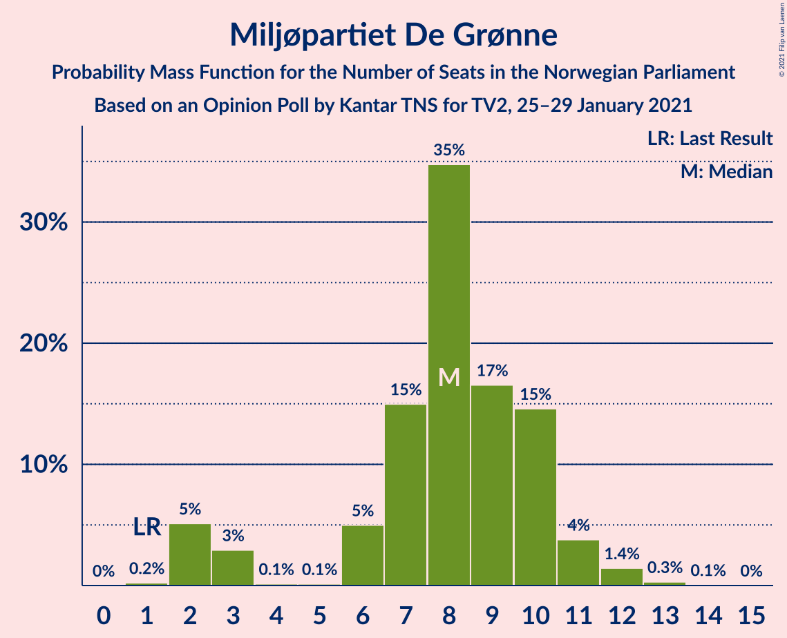

| Number of Seats | Probability | Accumulated | Special Marks |
|:---------------:|:-----------:|:-----------:|:-------------:|
| 1 | 0.2% | 100% | Last Result |
| 2 | 5% | 99.8% |  |
| 3 | 3% | 95% |  |
| 4 | 0.1% | 92% |  |
| 5 | 0.1% | 92% |  |
| 6 | 5% | 91% |  |
| 7 | 15% | 86% |  |
| 8 | 35% | 71% | Median |
| 9 | 17% | 37% |  |
| 10 | 15% | 20% |  |
| 11 | 4% | 6% |  |
| 12 | 1.4% | 2% |  |
| 13 | 0.3% | 0.4% |  |
| 14 | 0.1% | 0.1% |  |
| 15 | 0% | 0% |  |

### Venstre

*For a full overview of the results for this party, see the [Venstre](party-venstre.html) page.*

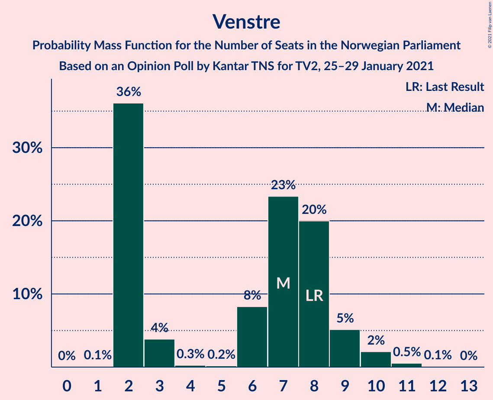

| Number of Seats | Probability | Accumulated | Special Marks |
|:---------------:|:-----------:|:-----------:|:-------------:|
| 1 | 0.1% | 100% |  |
| 2 | 36% | 99.9% |  |
| 3 | 4% | 64% |  |
| 4 | 0.3% | 60% |  |
| 5 | 0.2% | 60% |  |
| 6 | 8% | 60% |  |
| 7 | 23% | 51% | Median |
| 8 | 20% | 28% | Last Result |
| 9 | 5% | 8% |  |
| 10 | 2% | 3% |  |
| 11 | 0.5% | 0.7% |  |
| 12 | 0.1% | 0.1% |  |
| 13 | 0% | 0% |  |

### Kristelig Folkeparti

*For a full overview of the results for this party, see the [Kristelig Folkeparti](party-kristeligfolkeparti.html) page.*

| Number of Seats | Probability | Accumulated | Special Marks |
|:---------------:|:-----------:|:-----------:|:-------------:|
| 0 | 8% | 100% |  |
| 1 | 41% | 92% |  |
| 2 | 18% | 51% | Median |
| 3 | 29% | 33% |  |
| 4 | 0% | 5% |  |
| 5 | 0.1% | 5% |  |
| 6 | 3% | 5% |  |
| 7 | 1.5% | 2% |  |
| 8 | 0.4% | 0.5% | Last Result |
| 9 | 0.1% | 0.1% |  |
| 10 | 0% | 0% |  |

## Coalitions

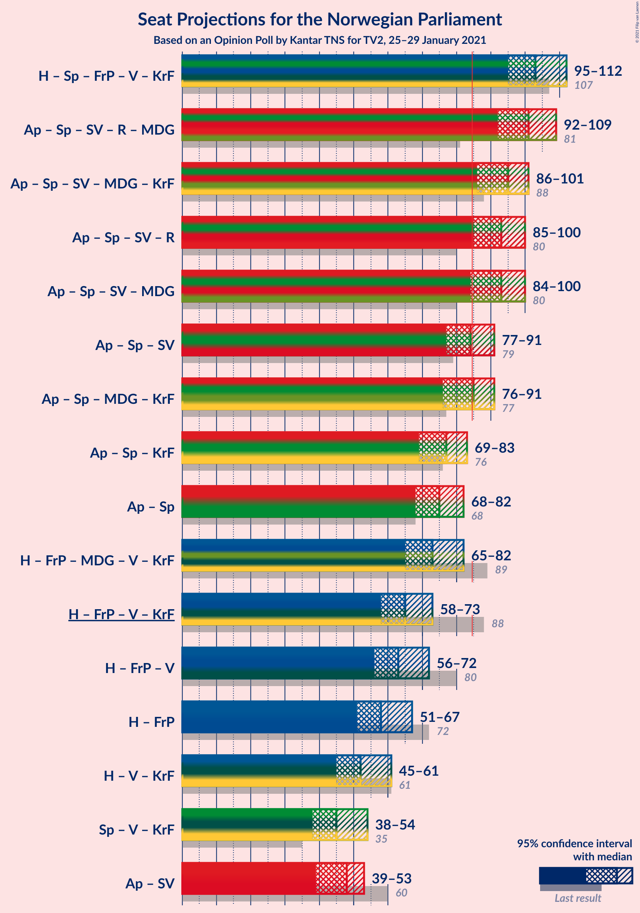

### Confidence Intervals

| Coalition | Last Result | Median | Majority? | 80% Confidence Interval | 90% Confidence Interval | 95% Confidence Interval | 99% Confidence Interval |
|:---------:|:-----------:|:------:|:---------:|:-----------------------:|:-----------------------:|:-----------------------:|:-----------------------:|
| Høyre – Senterpartiet – Fremskrittspartiet – Venstre – Kristelig Folkeparti | 107 | 103 | 100% | 97–108 | 95–110 | 95–112 | 93–114 |
| Arbeiderpartiet – Senterpartiet – Sosialistisk Venstreparti – Rødt – Miljøpartiet De Grønne | 81 | 101 | 100% | 96–107 | 94–108 | 92–109 | 90–111 |
| Arbeiderpartiet – Senterpartiet – Sosialistisk Venstreparti – Miljøpartiet De Grønne – Kristelig Folkeparti | 88 | 95 | 98.6% | 89–100 | 87–101 | 86–101 | 84–104 |
| Arbeiderpartiet – Senterpartiet – Sosialistisk Venstreparti – Rødt | 80 | 93 | 98% | 88–99 | 87–100 | 85–100 | 82–103 |
| Arbeiderpartiet – Senterpartiet – Sosialistisk Venstreparti – Miljøpartiet De Grønne | 80 | 93 | 97% | 87–98 | 85–99 | 84–100 | 82–102 |
| Arbeiderpartiet – Senterpartiet – Sosialistisk Venstreparti | 79 | 84 | 49% | 80–90 | 78–91 | 77–91 | 75–93 |
| Arbeiderpartiet – Senterpartiet – Miljøpartiet De Grønne – Kristelig Folkeparti | 77 | 85 | 51% | 80–89 | 78–90 | 76–91 | 74–93 |
| Arbeiderpartiet – Senterpartiet – Kristelig Folkeparti | 76 | 77 | 2% | 72–81 | 70–83 | 69–83 | 67–85 |
| Arbeiderpartiet – Senterpartiet | 68 | 75 | 0% | 71–79 | 68–80 | 68–82 | 65–83 |
| Høyre – Fremskrittspartiet – Miljøpartiet De Grønne – Venstre – Kristelig Folkeparti | 89 | 73 | 0.3% | 67–79 | 66–80 | 65–82 | 62–84 |
| Høyre – Fremskrittspartiet – Venstre – Kristelig Folkeparti | 88 | 65 | 0% | 60–70 | 58–72 | 58–73 | 55–77 |
| Høyre – Fremskrittspartiet – Venstre | 80 | 63 | 0% | 58–69 | 56–70 | 56–72 | 54–75 |
| Høyre – Fremskrittspartiet | 72 | 58 | 0% | 53–63 | 52–65 | 51–67 | 49–68 |
| Høyre – Venstre – Kristelig Folkeparti | 61 | 52 | 0% | 47–58 | 46–59 | 45–61 | 43–63 |
| Senterpartiet – Venstre – Kristelig Folkeparti | 35 | 45 | 0% | 40–50 | 39–52 | 38–54 | 37–55 |
| Arbeiderpartiet – Sosialistisk Venstreparti | 60 | 48 | 0% | 42–51 | 40–53 | 39–53 | 37–55 |

### Høyre – Senterpartiet – Fremskrittspartiet – Venstre – Kristelig Folkeparti

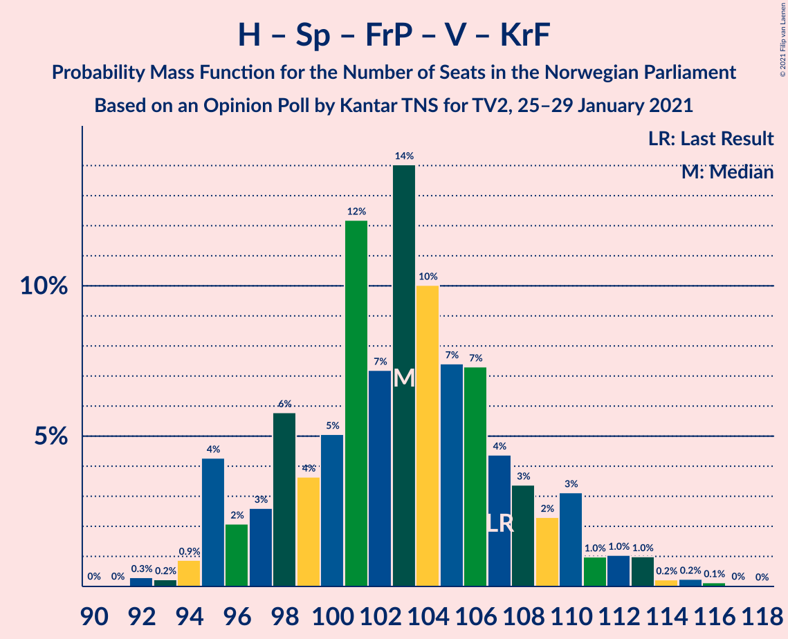

| Number of Seats | Probability | Accumulated | Special Marks |
|:---------------:|:-----------:|:-----------:|:-------------:|
| 90 | 0% | 100% |  |
| 91 | 0% | 99.9% |  |
| 92 | 0.3% | 99.9% |  |
| 93 | 0.2% | 99.6% |  |
| 94 | 0.9% | 99.4% |  |
| 95 | 4% | 98% |  |
| 96 | 2% | 94% |  |
| 97 | 3% | 92% |  |
| 98 | 6% | 90% |  |
| 99 | 4% | 84% |  |
| 100 | 5% | 80% |  |
| 101 | 12% | 75% |  |
| 102 | 7% | 63% |  |
| 103 | 14% | 56% |  |
| 104 | 10% | 42% | Median |
| 105 | 7% | 32% |  |
| 106 | 7% | 24% |  |
| 107 | 4% | 17% | Last Result |
| 108 | 3% | 13% |  |
| 109 | 2% | 9% |  |
| 110 | 3% | 7% |  |
| 111 | 1.0% | 4% |  |
| 112 | 1.0% | 3% |  |
| 113 | 1.0% | 2% |  |
| 114 | 0.2% | 0.7% |  |
| 115 | 0.2% | 0.5% |  |
| 116 | 0.1% | 0.2% |  |
| 117 | 0% | 0.1% |  |
| 118 | 0% | 0% |  |

### Arbeiderpartiet – Senterpartiet – Sosialistisk Venstreparti – Rødt – Miljøpartiet De Grønne

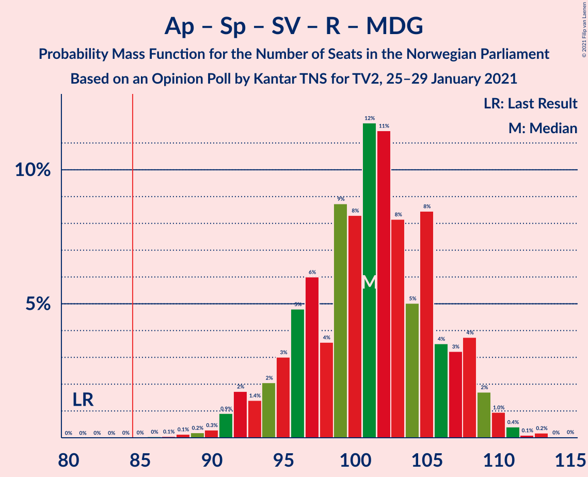

| Number of Seats | Probability | Accumulated | Special Marks |
|:---------------:|:-----------:|:-----------:|:-------------:|
| 81 | 0% | 100% | Last Result |
| 82 | 0% | 100% |  |
| 83 | 0% | 100% |  |
| 84 | 0% | 100% |  |
| 85 | 0% | 100% | Majority |
| 86 | 0% | 100% |  |
| 87 | 0.1% | 99.9% |  |
| 88 | 0.1% | 99.9% |  |
| 89 | 0.2% | 99.7% |  |
| 90 | 0.3% | 99.5% |  |
| 91 | 0.9% | 99.3% |  |
| 92 | 2% | 98% |  |
| 93 | 1.4% | 97% |  |
| 94 | 2% | 95% |  |
| 95 | 3% | 93% |  |
| 96 | 5% | 90% |  |
| 97 | 6% | 85% |  |
| 98 | 4% | 79% |  |
| 99 | 9% | 76% |  |
| 100 | 8% | 67% |  |
| 101 | 12% | 59% |  |
| 102 | 11% | 47% | Median |
| 103 | 8% | 36% |  |
| 104 | 5% | 27% |  |
| 105 | 8% | 22% |  |
| 106 | 4% | 14% |  |
| 107 | 3% | 10% |  |
| 108 | 4% | 7% |  |
| 109 | 2% | 3% |  |
| 110 | 1.0% | 2% |  |
| 111 | 0.4% | 0.7% |  |
| 112 | 0.1% | 0.3% |  |
| 113 | 0.2% | 0.2% |  |
| 114 | 0% | 0.1% |  |
| 115 | 0% | 0% |  |

### Arbeiderpartiet – Senterpartiet – Sosialistisk Venstreparti – Miljøpartiet De Grønne – Kristelig Folkeparti

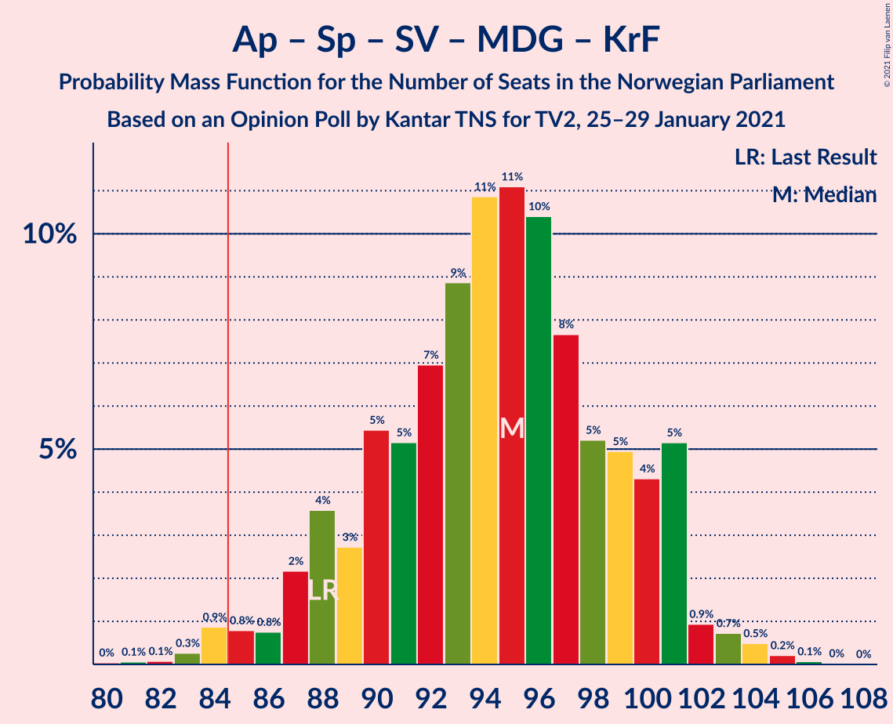

| Number of Seats | Probability | Accumulated | Special Marks |
|:---------------:|:-----------:|:-----------:|:-------------:|
| 80 | 0% | 100% |  |
| 81 | 0.1% | 99.9% |  |
| 82 | 0.1% | 99.9% |  |
| 83 | 0.3% | 99.8% |  |
| 84 | 0.9% | 99.5% |  |
| 85 | 0.8% | 98.6% | Majority |
| 86 | 0.8% | 98% |  |
| 87 | 2% | 97% |  |
| 88 | 4% | 95% | Last Result |
| 89 | 3% | 91% |  |
| 90 | 5% | 89% |  |
| 91 | 5% | 83% |  |
| 92 | 7% | 78% |  |
| 93 | 9% | 71% |  |
| 94 | 11% | 62% |  |
| 95 | 11% | 51% | Median |
| 96 | 10% | 40% |  |
| 97 | 8% | 30% |  |
| 98 | 5% | 22% |  |
| 99 | 5% | 17% |  |
| 100 | 4% | 12% |  |
| 101 | 5% | 8% |  |
| 102 | 0.9% | 2% |  |
| 103 | 0.7% | 2% |  |
| 104 | 0.5% | 0.8% |  |
| 105 | 0.2% | 0.3% |  |
| 106 | 0.1% | 0.1% |  |
| 107 | 0% | 0% |  |

### Arbeiderpartiet – Senterpartiet – Sosialistisk Venstreparti – Rødt

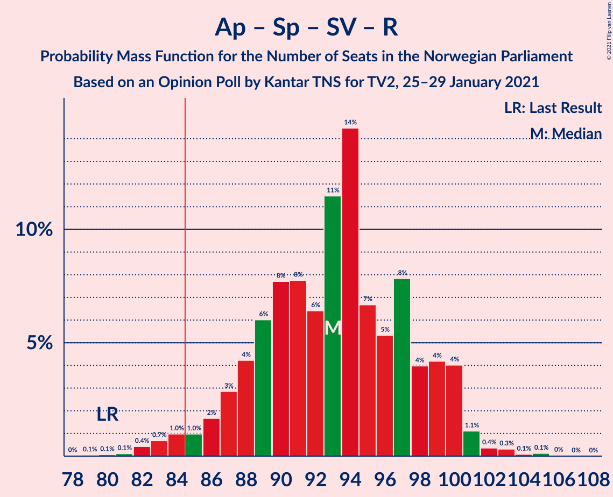

| Number of Seats | Probability | Accumulated | Special Marks |
|:---------------:|:-----------:|:-----------:|:-------------:|
| 79 | 0.1% | 100% |  |
| 80 | 0.1% | 99.9% | Last Result |
| 81 | 0.1% | 99.9% |  |
| 82 | 0.4% | 99.7% |  |
| 83 | 0.7% | 99.3% |  |
| 84 | 1.0% | 98.6% |  |
| 85 | 1.0% | 98% | Majority |
| 86 | 2% | 97% |  |
| 87 | 3% | 95% |  |
| 88 | 4% | 92% |  |
| 89 | 6% | 88% |  |
| 90 | 8% | 82% |  |
| 91 | 8% | 74% |  |
| 92 | 6% | 66% |  |
| 93 | 11% | 60% |  |
| 94 | 14% | 49% | Median |
| 95 | 7% | 34% |  |
| 96 | 5% | 27% |  |
| 97 | 8% | 22% |  |
| 98 | 4% | 14% |  |
| 99 | 4% | 10% |  |
| 100 | 4% | 6% |  |
| 101 | 1.1% | 2% |  |
| 102 | 0.4% | 0.9% |  |
| 103 | 0.3% | 0.6% |  |
| 104 | 0.1% | 0.3% |  |
| 105 | 0.1% | 0.2% |  |
| 106 | 0% | 0.1% |  |
| 107 | 0% | 0% |  |

### Arbeiderpartiet – Senterpartiet – Sosialistisk Venstreparti – Miljøpartiet De Grønne

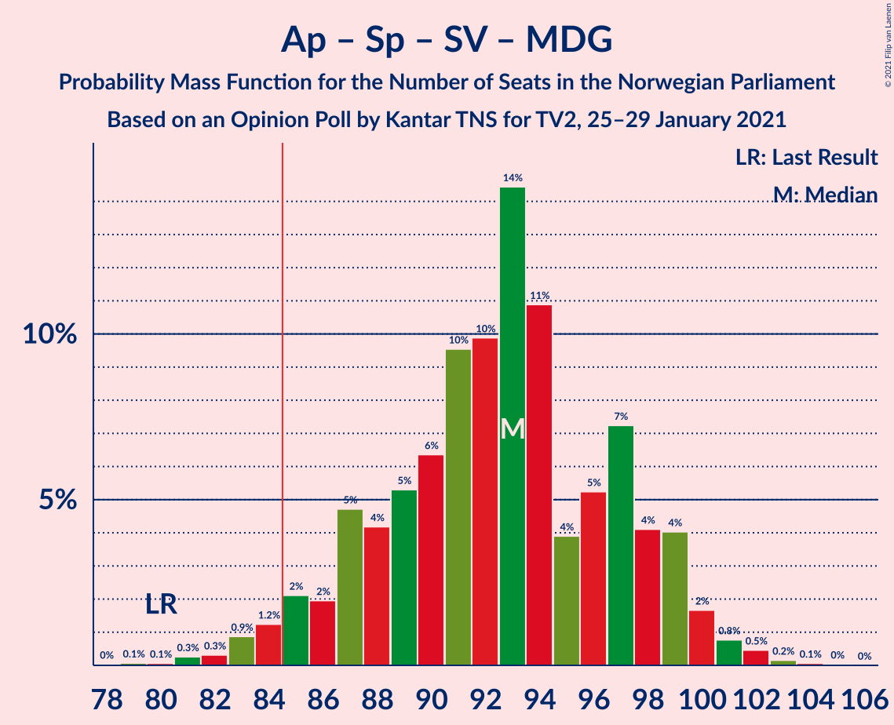

| Number of Seats | Probability | Accumulated | Special Marks |
|:---------------:|:-----------:|:-----------:|:-------------:|
| 78 | 0% | 100% |  |
| 79 | 0.1% | 99.9% |  |
| 80 | 0.1% | 99.9% | Last Result |
| 81 | 0.3% | 99.8% |  |
| 82 | 0.3% | 99.5% |  |
| 83 | 0.9% | 99.2% |  |
| 84 | 1.2% | 98% |  |
| 85 | 2% | 97% | Majority |
| 86 | 2% | 95% |  |
| 87 | 5% | 93% |  |
| 88 | 4% | 88% |  |
| 89 | 5% | 84% |  |
| 90 | 6% | 79% |  |
| 91 | 10% | 72% |  |
| 92 | 10% | 63% |  |
| 93 | 14% | 53% | Median |
| 94 | 11% | 39% |  |
| 95 | 4% | 28% |  |
| 96 | 5% | 24% |  |
| 97 | 7% | 19% |  |
| 98 | 4% | 11% |  |
| 99 | 4% | 7% |  |
| 100 | 2% | 3% |  |
| 101 | 0.8% | 2% |  |
| 102 | 0.5% | 0.7% |  |
| 103 | 0.2% | 0.3% |  |
| 104 | 0.1% | 0.1% |  |
| 105 | 0% | 0% |  |

### Arbeiderpartiet – Senterpartiet – Sosialistisk Venstreparti

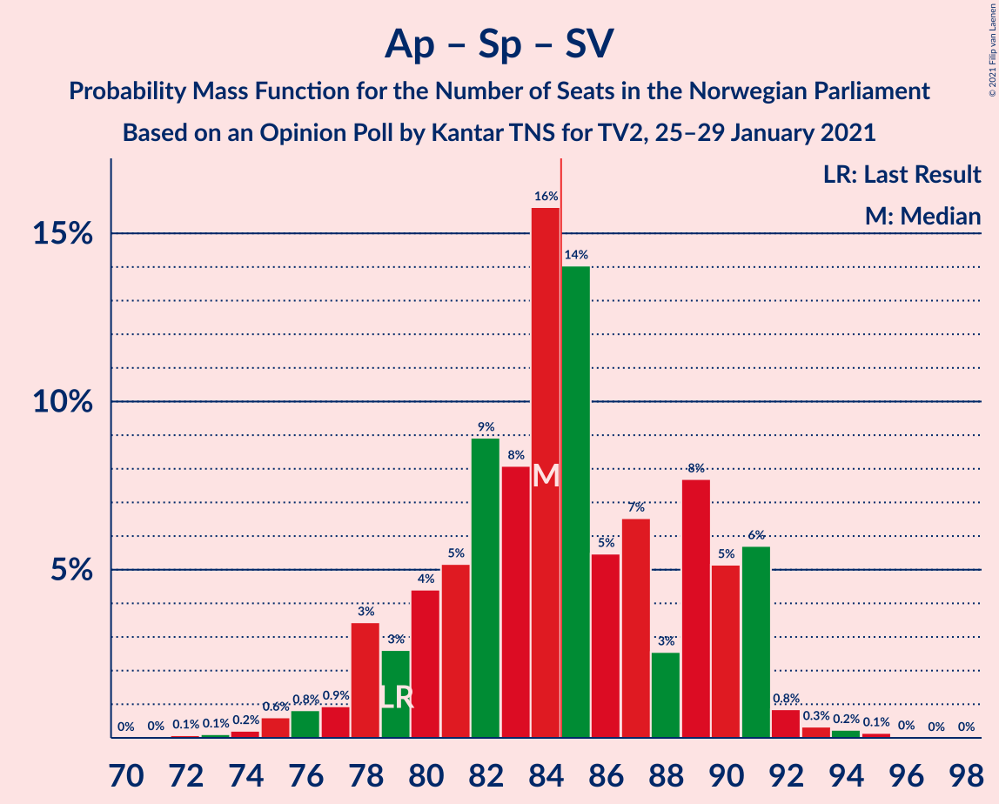

| Number of Seats | Probability | Accumulated | Special Marks |
|:---------------:|:-----------:|:-----------:|:-------------:|
| 72 | 0.1% | 100% |  |
| 73 | 0.1% | 99.9% |  |
| 74 | 0.2% | 99.8% |  |
| 75 | 0.6% | 99.6% |  |
| 76 | 0.8% | 99.0% |  |
| 77 | 0.9% | 98% |  |
| 78 | 3% | 97% |  |
| 79 | 3% | 94% | Last Result |
| 80 | 4% | 91% |  |
| 81 | 5% | 87% |  |
| 82 | 9% | 82% |  |
| 83 | 8% | 73% |  |
| 84 | 16% | 65% |  |
| 85 | 14% | 49% | Median, Majority |
| 86 | 5% | 35% |  |
| 87 | 7% | 29% |  |
| 88 | 3% | 23% |  |
| 89 | 8% | 20% |  |
| 90 | 5% | 12% |  |
| 91 | 6% | 7% |  |
| 92 | 0.8% | 2% |  |
| 93 | 0.3% | 0.8% |  |
| 94 | 0.2% | 0.4% |  |
| 95 | 0.1% | 0.2% |  |
| 96 | 0% | 0.1% |  |
| 97 | 0% | 0% |  |

### Arbeiderpartiet – Senterpartiet – Miljøpartiet De Grønne – Kristelig Folkeparti

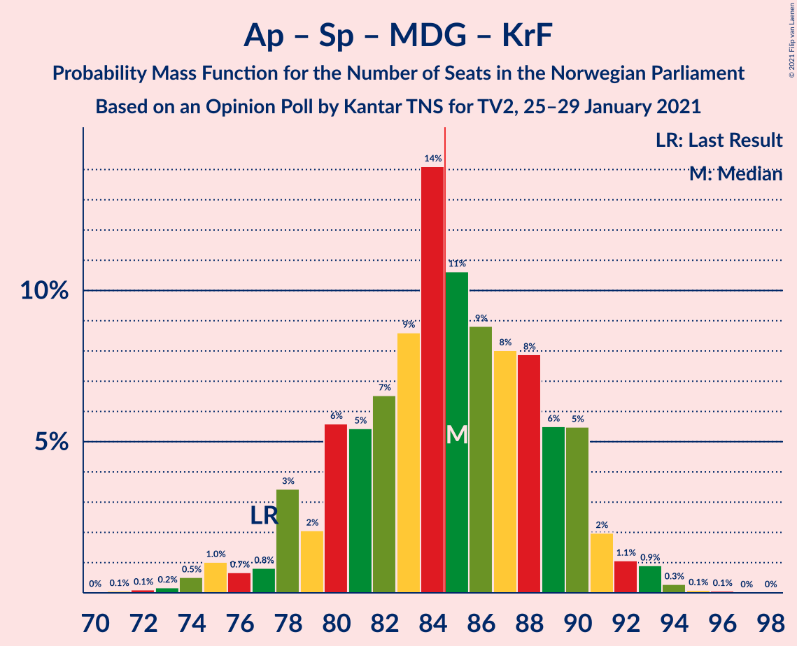

| Number of Seats | Probability | Accumulated | Special Marks |
|:---------------:|:-----------:|:-----------:|:-------------:|
| 70 | 0% | 100% |  |
| 71 | 0.1% | 99.9% |  |
| 72 | 0.1% | 99.9% |  |
| 73 | 0.2% | 99.8% |  |
| 74 | 0.5% | 99.6% |  |
| 75 | 1.0% | 99.1% |  |
| 76 | 0.7% | 98% |  |
| 77 | 0.8% | 97% | Last Result |
| 78 | 3% | 97% |  |
| 79 | 2% | 93% |  |
| 80 | 6% | 91% |  |
| 81 | 5% | 85% |  |
| 82 | 7% | 80% |  |
| 83 | 9% | 74% |  |
| 84 | 14% | 65% |  |
| 85 | 11% | 51% | Median, Majority |
| 86 | 9% | 40% |  |
| 87 | 8% | 31% |  |
| 88 | 8% | 23% |  |
| 89 | 6% | 15% |  |
| 90 | 5% | 10% |  |
| 91 | 2% | 4% |  |
| 92 | 1.1% | 2% |  |
| 93 | 0.9% | 1.4% |  |
| 94 | 0.3% | 0.5% |  |
| 95 | 0.1% | 0.2% |  |
| 96 | 0.1% | 0.1% |  |
| 97 | 0% | 0% |  |

### Arbeiderpartiet – Senterpartiet – Kristelig Folkeparti

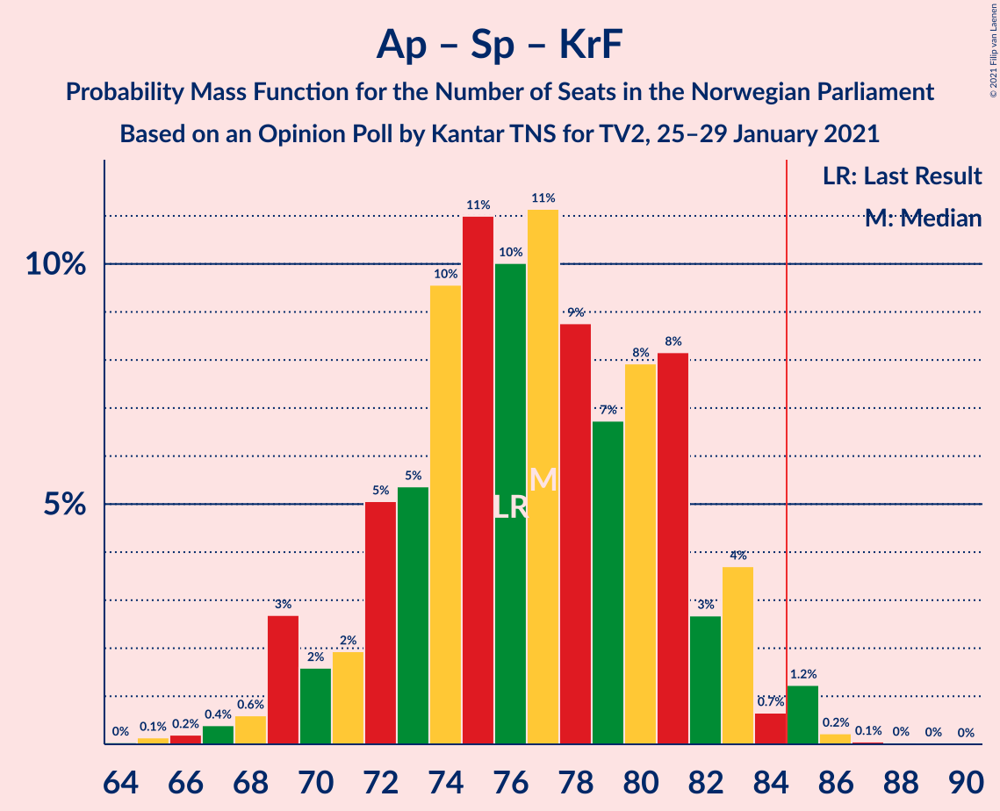

| Number of Seats | Probability | Accumulated | Special Marks |
|:---------------:|:-----------:|:-----------:|:-------------:|
| 64 | 0% | 100% |  |
| 65 | 0.1% | 99.9% |  |
| 66 | 0.2% | 99.8% |  |
| 67 | 0.4% | 99.6% |  |
| 68 | 0.6% | 99.2% |  |
| 69 | 3% | 98.6% |  |
| 70 | 2% | 96% |  |
| 71 | 2% | 94% |  |
| 72 | 5% | 92% |  |
| 73 | 5% | 87% |  |
| 74 | 10% | 82% |  |
| 75 | 11% | 72% |  |
| 76 | 10% | 61% | Last Result |
| 77 | 11% | 51% | Median |
| 78 | 9% | 40% |  |
| 79 | 7% | 31% |  |
| 80 | 8% | 25% |  |
| 81 | 8% | 17% |  |
| 82 | 3% | 9% |  |
| 83 | 4% | 6% |  |
| 84 | 0.7% | 2% |  |
| 85 | 1.2% | 2% | Majority |
| 86 | 0.2% | 0.4% |  |
| 87 | 0.1% | 0.1% |  |
| 88 | 0% | 0.1% |  |
| 89 | 0% | 0% |  |

### Arbeiderpartiet – Senterpartiet

| Number of Seats | Probability | Accumulated | Special Marks |
|:---------------:|:-----------:|:-----------:|:-------------:|
| 63 | 0% | 100% |  |
| 64 | 0.1% | 99.9% |  |
| 65 | 0.6% | 99.8% |  |
| 66 | 0.7% | 99.3% |  |
| 67 | 0.9% | 98.6% |  |
| 68 | 3% | 98% | Last Result |
| 69 | 2% | 95% |  |
| 70 | 2% | 93% |  |
| 71 | 6% | 90% |  |
| 72 | 8% | 85% |  |
| 73 | 12% | 77% |  |
| 74 | 14% | 65% |  |
| 75 | 12% | 51% | Median |
| 76 | 10% | 39% |  |
| 77 | 7% | 29% |  |
| 78 | 8% | 22% |  |
| 79 | 6% | 15% |  |
| 80 | 4% | 9% |  |
| 81 | 2% | 5% |  |
| 82 | 1.3% | 3% |  |
| 83 | 1.1% | 1.3% |  |
| 84 | 0.2% | 0.2% |  |
| 85 | 0% | 0% | Majority |

### Høyre – Fremskrittspartiet – Miljøpartiet De Grønne – Venstre – Kristelig Folkeparti

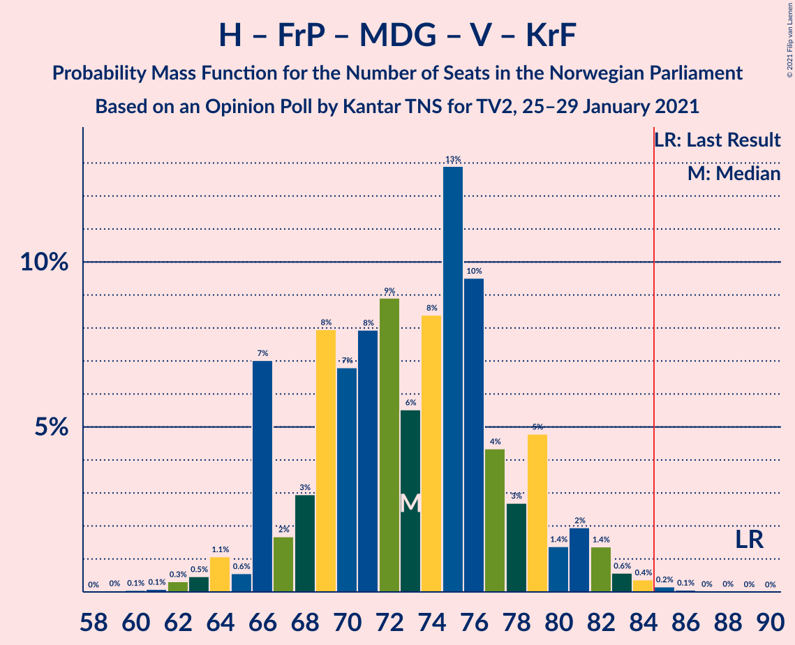

| Number of Seats | Probability | Accumulated | Special Marks |
|:---------------:|:-----------:|:-----------:|:-------------:|
| 59 | 0% | 100% |  |
| 60 | 0.1% | 99.9% |  |
| 61 | 0.1% | 99.9% |  |
| 62 | 0.3% | 99.8% |  |
| 63 | 0.5% | 99.5% |  |
| 64 | 1.1% | 99.0% |  |
| 65 | 0.6% | 98% |  |
| 66 | 7% | 97% |  |
| 67 | 2% | 90% |  |
| 68 | 3% | 89% |  |
| 69 | 8% | 86% |  |
| 70 | 7% | 78% |  |
| 71 | 8% | 71% |  |
| 72 | 9% | 63% |  |
| 73 | 6% | 54% |  |
| 74 | 8% | 49% |  |
| 75 | 13% | 40% | Median |
| 76 | 10% | 27% |  |
| 77 | 4% | 18% |  |
| 78 | 3% | 13% |  |
| 79 | 5% | 11% |  |
| 80 | 1.4% | 6% |  |
| 81 | 2% | 5% |  |
| 82 | 1.4% | 3% |  |
| 83 | 0.6% | 1.2% |  |
| 84 | 0.4% | 0.7% |  |
| 85 | 0.2% | 0.3% | Majority |
| 86 | 0.1% | 0.1% |  |
| 87 | 0% | 0.1% |  |
| 88 | 0% | 0.1% |  |
| 89 | 0% | 0% | Last Result |

### Høyre – Fremskrittspartiet – Venstre – Kristelig Folkeparti

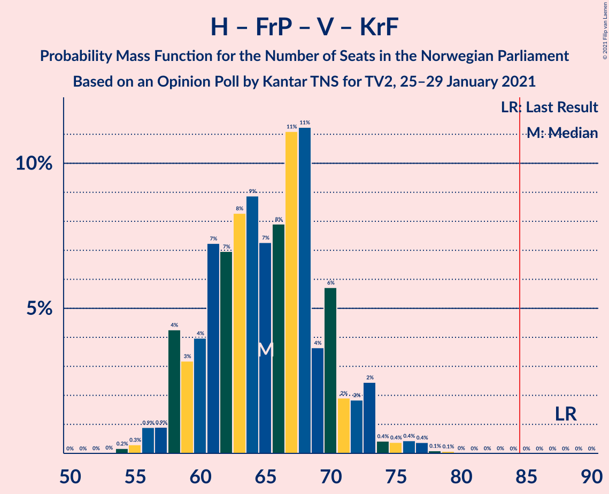

| Number of Seats | Probability | Accumulated | Special Marks |
|:---------------:|:-----------:|:-----------:|:-------------:|
| 54 | 0.2% | 100% |  |
| 55 | 0.3% | 99.8% |  |
| 56 | 0.9% | 99.5% |  |
| 57 | 0.9% | 98.6% |  |
| 58 | 4% | 98% |  |
| 59 | 3% | 93% |  |
| 60 | 4% | 90% |  |
| 61 | 7% | 86% |  |
| 62 | 7% | 79% |  |
| 63 | 8% | 72% |  |
| 64 | 9% | 64% |  |
| 65 | 7% | 55% |  |
| 66 | 8% | 48% |  |
| 67 | 11% | 40% | Median |
| 68 | 11% | 29% |  |
| 69 | 4% | 17% |  |
| 70 | 6% | 14% |  |
| 71 | 2% | 8% |  |
| 72 | 2% | 6% |  |
| 73 | 2% | 4% |  |
| 74 | 0.4% | 2% |  |
| 75 | 0.4% | 1.4% |  |
| 76 | 0.4% | 1.0% |  |
| 77 | 0.4% | 0.6% |  |
| 78 | 0.1% | 0.2% |  |
| 79 | 0.1% | 0.1% |  |
| 80 | 0% | 0% |  |
| 81 | 0% | 0% |  |
| 82 | 0% | 0% |  |
| 83 | 0% | 0% |  |
| 84 | 0% | 0% |  |
| 85 | 0% | 0% | Majority |
| 86 | 0% | 0% |  |
| 87 | 0% | 0% |  |
| 88 | 0% | 0% | Last Result |

### Høyre – Fremskrittspartiet – Venstre

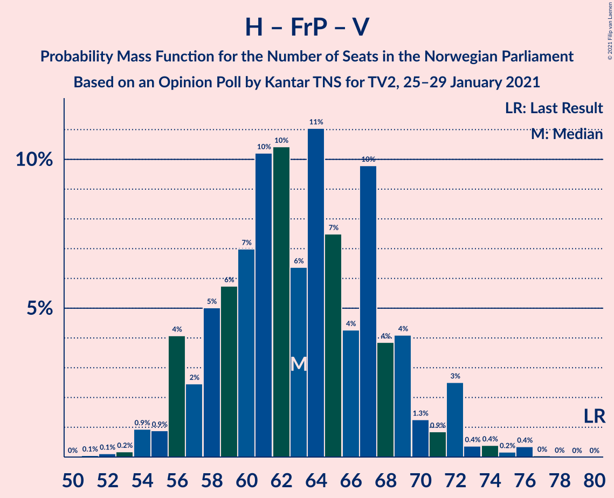

| Number of Seats | Probability | Accumulated | Special Marks |
|:---------------:|:-----------:|:-----------:|:-------------:|
| 51 | 0.1% | 100% |  |
| 52 | 0.1% | 99.9% |  |
| 53 | 0.2% | 99.8% |  |
| 54 | 0.9% | 99.6% |  |
| 55 | 0.9% | 98.7% |  |
| 56 | 4% | 98% |  |
| 57 | 2% | 94% |  |
| 58 | 5% | 91% |  |
| 59 | 6% | 86% |  |
| 60 | 7% | 81% |  |
| 61 | 10% | 74% |  |
| 62 | 10% | 63% |  |
| 63 | 6% | 53% |  |
| 64 | 11% | 47% |  |
| 65 | 7% | 35% | Median |
| 66 | 4% | 28% |  |
| 67 | 10% | 24% |  |
| 68 | 4% | 14% |  |
| 69 | 4% | 10% |  |
| 70 | 1.3% | 6% |  |
| 71 | 0.9% | 5% |  |
| 72 | 3% | 4% |  |
| 73 | 0.4% | 1.4% |  |
| 74 | 0.4% | 1.0% |  |
| 75 | 0.2% | 0.6% |  |
| 76 | 0.4% | 0.4% |  |
| 77 | 0% | 0.1% |  |
| 78 | 0% | 0% |  |
| 79 | 0% | 0% |  |
| 80 | 0% | 0% | Last Result |

### Høyre – Fremskrittspartiet

| Number of Seats | Probability | Accumulated | Special Marks |
|:---------------:|:-----------:|:-----------:|:-------------:|
| 47 | 0.1% | 100% |  |
| 48 | 0.3% | 99.9% |  |
| 49 | 0.6% | 99.6% |  |
| 50 | 1.3% | 99.0% |  |
| 51 | 1.4% | 98% |  |
| 52 | 2% | 96% |  |
| 53 | 7% | 94% |  |
| 54 | 11% | 87% |  |
| 55 | 6% | 76% |  |
| 56 | 11% | 71% |  |
| 57 | 5% | 60% |  |
| 58 | 13% | 54% | Median |
| 59 | 9% | 41% |  |
| 60 | 11% | 33% |  |
| 61 | 6% | 21% |  |
| 62 | 5% | 15% |  |
| 63 | 2% | 10% |  |
| 64 | 3% | 9% |  |
| 65 | 1.5% | 6% |  |
| 66 | 1.2% | 4% |  |
| 67 | 2% | 3% |  |
| 68 | 0.4% | 0.7% |  |
| 69 | 0.1% | 0.3% |  |
| 70 | 0.1% | 0.1% |  |
| 71 | 0% | 0.1% |  |
| 72 | 0% | 0% | Last Result |

### Høyre – Venstre – Kristelig Folkeparti

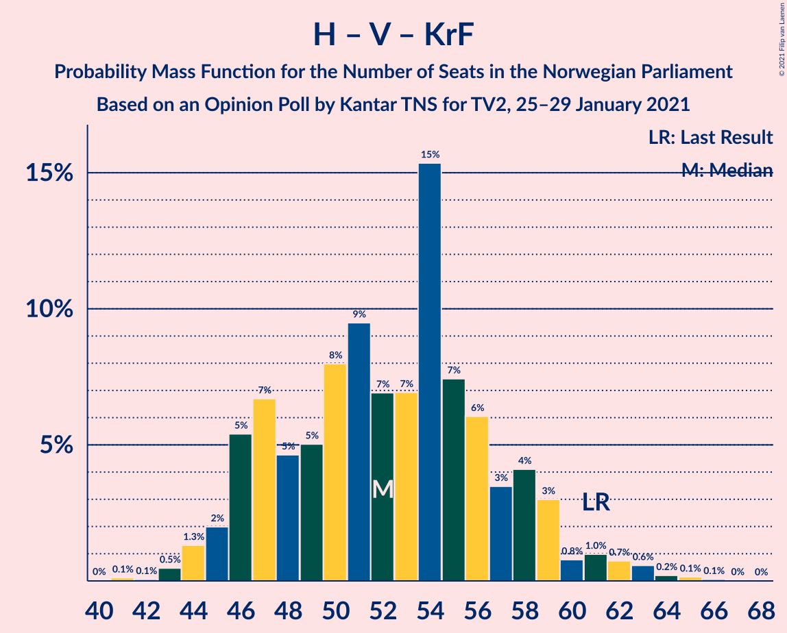

| Number of Seats | Probability | Accumulated | Special Marks |
|:---------------:|:-----------:|:-----------:|:-------------:|
| 41 | 0.1% | 100% |  |
| 42 | 0.1% | 99.8% |  |
| 43 | 0.5% | 99.8% |  |
| 44 | 1.3% | 99.3% |  |
| 45 | 2% | 98% |  |
| 46 | 5% | 96% |  |
| 47 | 7% | 91% |  |
| 48 | 5% | 84% |  |
| 49 | 5% | 79% |  |
| 50 | 8% | 74% |  |
| 51 | 9% | 66% |  |
| 52 | 7% | 57% |  |
| 53 | 7% | 50% |  |
| 54 | 15% | 43% | Median |
| 55 | 7% | 28% |  |
| 56 | 6% | 20% |  |
| 57 | 3% | 14% |  |
| 58 | 4% | 11% |  |
| 59 | 3% | 7% |  |
| 60 | 0.8% | 4% |  |
| 61 | 1.0% | 3% | Last Result |
| 62 | 0.7% | 2% |  |
| 63 | 0.6% | 1.0% |  |
| 64 | 0.2% | 0.4% |  |
| 65 | 0.1% | 0.2% |  |
| 66 | 0.1% | 0.1% |  |
| 67 | 0% | 0% |  |

### Senterpartiet – Venstre – Kristelig Folkeparti

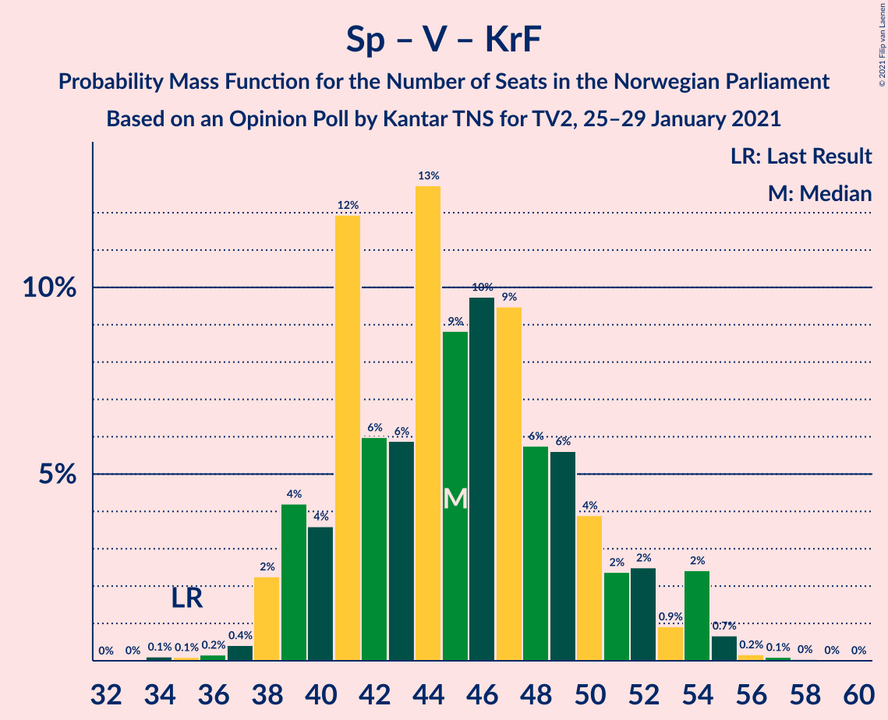

| Number of Seats | Probability | Accumulated | Special Marks |
|:---------------:|:-----------:|:-----------:|:-------------:|
| 34 | 0.1% | 100% |  |
| 35 | 0.1% | 99.9% | Last Result |
| 36 | 0.2% | 99.8% |  |
| 37 | 0.4% | 99.6% |  |
| 38 | 2% | 99.2% |  |
| 39 | 4% | 97% |  |
| 40 | 4% | 93% |  |
| 41 | 12% | 89% |  |
| 42 | 6% | 77% |  |
| 43 | 6% | 71% |  |
| 44 | 13% | 65% |  |
| 45 | 9% | 53% |  |
| 46 | 10% | 44% | Median |
| 47 | 9% | 34% |  |
| 48 | 6% | 25% |  |
| 49 | 6% | 19% |  |
| 50 | 4% | 13% |  |
| 51 | 2% | 9% |  |
| 52 | 2% | 7% |  |
| 53 | 0.9% | 4% |  |
| 54 | 2% | 3% |  |
| 55 | 0.7% | 1.0% |  |
| 56 | 0.2% | 0.4% |  |
| 57 | 0.1% | 0.2% |  |
| 58 | 0% | 0.1% |  |
| 59 | 0% | 0% |  |

### Arbeiderpartiet – Sosialistisk Venstreparti

| Number of Seats | Probability | Accumulated | Special Marks |
|:---------------:|:-----------:|:-----------:|:-------------:|
| 35 | 0.1% | 100% |  |
| 36 | 0.3% | 99.9% |  |
| 37 | 0.5% | 99.6% |  |
| 38 | 1.3% | 99.1% |  |
| 39 | 3% | 98% |  |
| 40 | 2% | 95% |  |
| 41 | 3% | 93% |  |
| 42 | 2% | 90% |  |
| 43 | 5% | 88% |  |
| 44 | 9% | 83% |  |
| 45 | 8% | 74% |  |
| 46 | 4% | 66% |  |
| 47 | 12% | 62% |  |
| 48 | 15% | 50% | Median |
| 49 | 14% | 35% |  |
| 50 | 7% | 21% |  |
| 51 | 4% | 14% |  |
| 52 | 4% | 10% |  |
| 53 | 4% | 6% |  |
| 54 | 0.7% | 2% |  |
| 55 | 0.5% | 0.9% |  |
| 56 | 0.1% | 0.5% |  |
| 57 | 0.3% | 0.3% |  |
| 58 | 0.1% | 0.1% |  |
| 59 | 0% | 0% |  |
| 60 | 0% | 0% | Last Result |

## Technical Information

### Opinion Poll

+ **Polling firm:** Kantar TNS
+ **Commissioner(s):** TV2
+ **Fieldwork period:** 25–29 January 2021

### Calculations

+ **Sample size:** 742
+ **Simulations done:** 1,048,576
+ **Error estimate:** 1.95%

