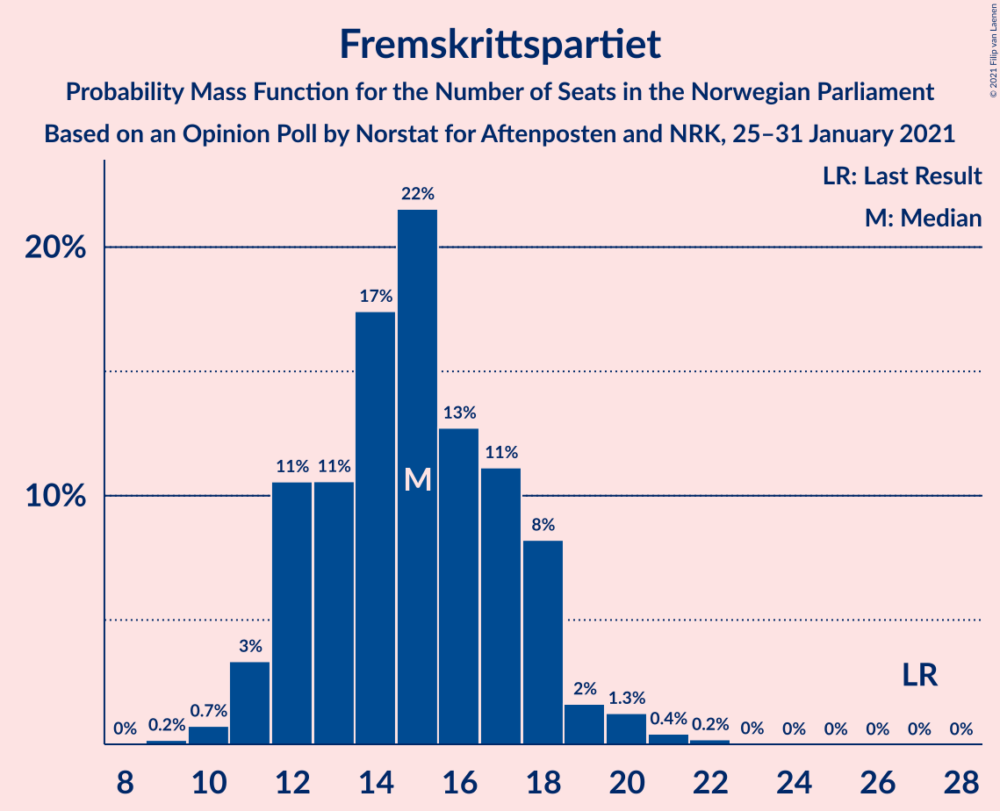
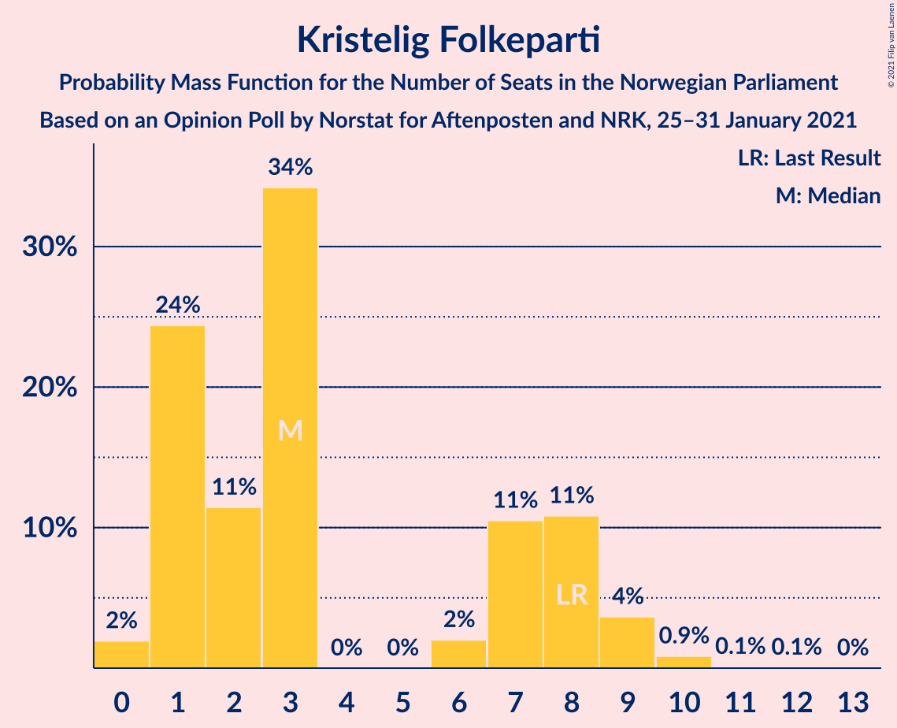
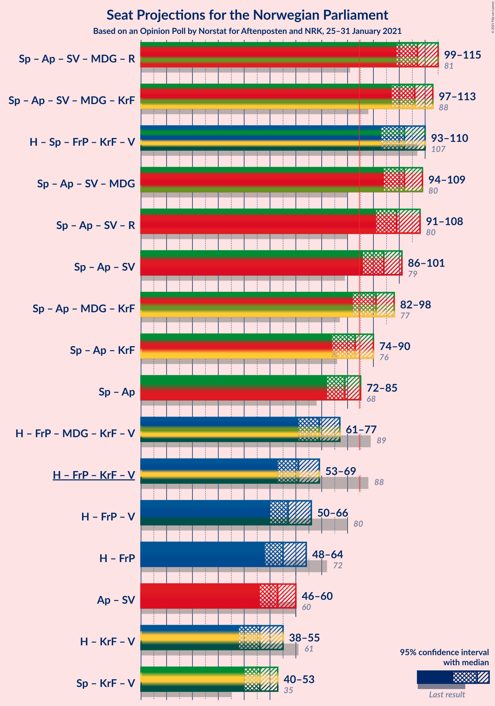
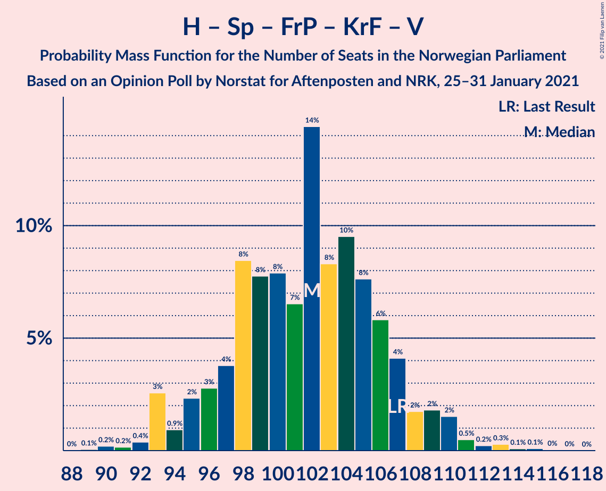
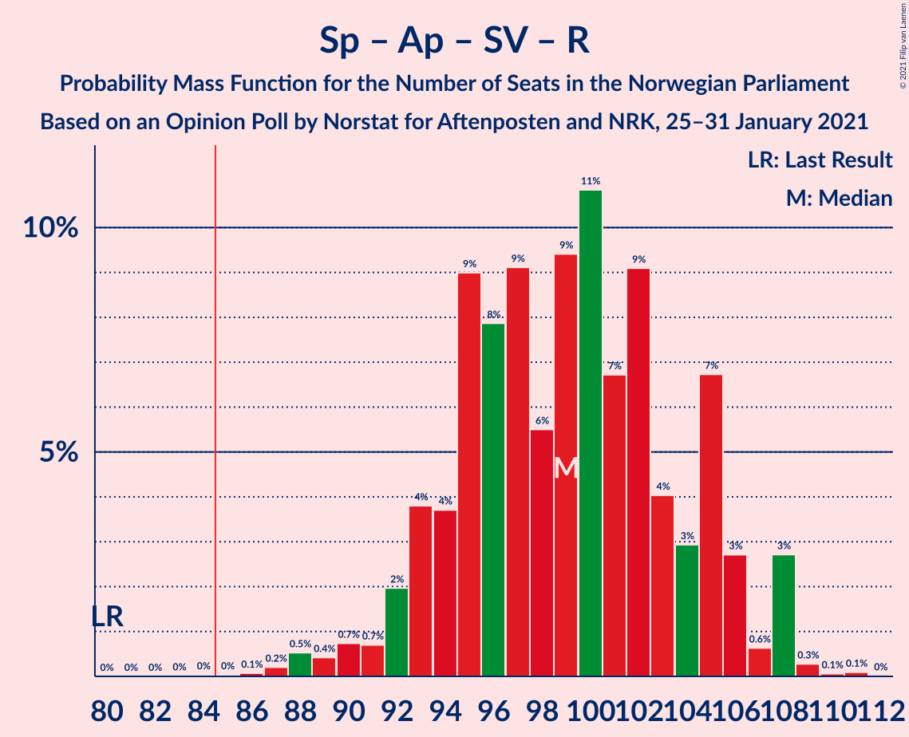
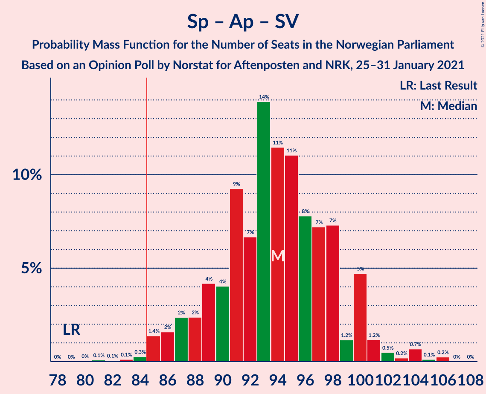
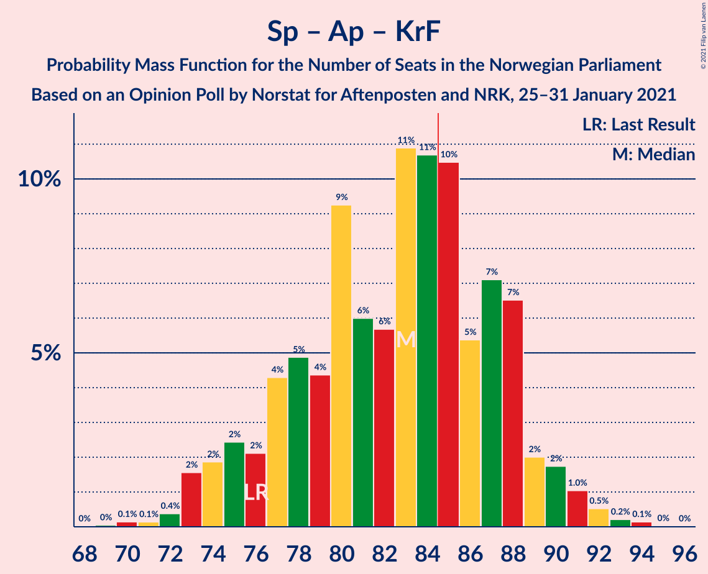
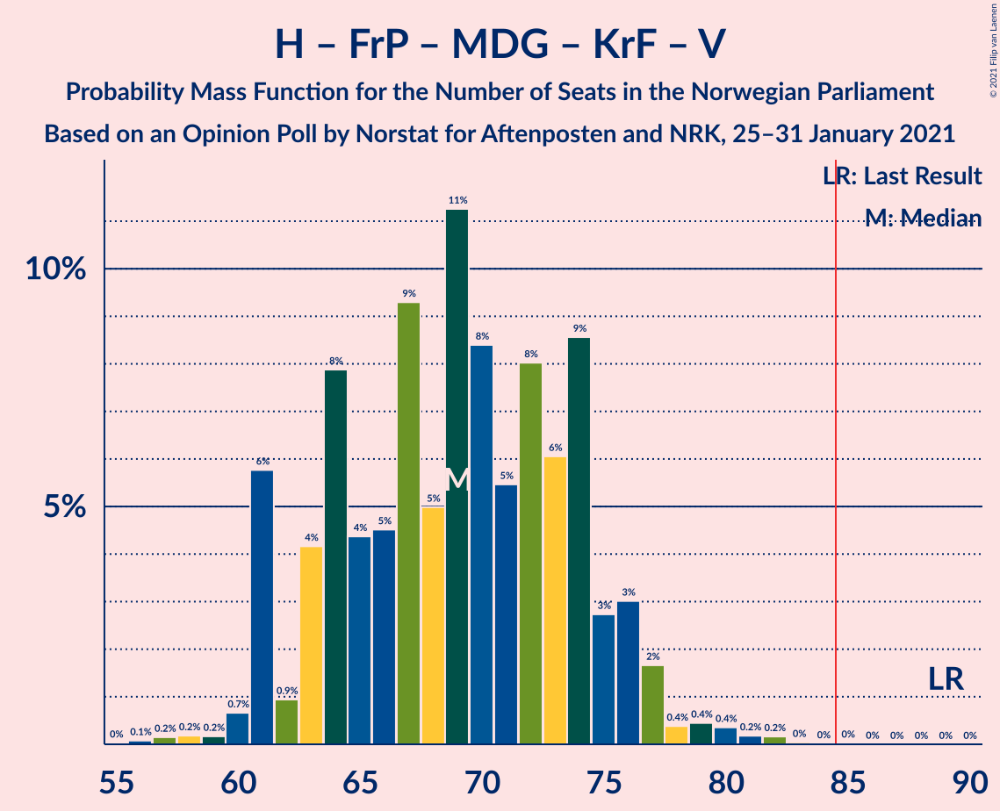

# Opinion Poll by Norstat for Aftenposten and NRK, 25–31 January 2021

<a href="#voting-intentions">Voting Intentions</a> | <a href="#seats">Seats</a> | <a href="#coalitions">Coalitions</a> | <a href="#technical-information">Technical Information</a>

## Voting Intentions

### Confidence Intervals

| Party | Last Result | Poll Result | 80% Confidence Interval | 90% Confidence Interval | 95% Confidence Interval | 99% Confidence Interval |
|:-----:|:-----------:|:-----------:|:-----------------------:|:-----------------------:|:-----------------------:|:-----------------------:|
| Høyre | 25.0% | 22.8% | 20.9–24.9% |20.3–25.5% |19.9–26.0% |19.0–27.1% |
| Senterpartiet | 10.3% | 22.0% | 20.0–24.1% |19.5–24.6% |19.1–25.2% |18.2–26.2% |
| Arbeiderpartiet | 27.4% | 20.7% | 18.8–22.7% |18.3–23.3% |17.8–23.8% |17.0–24.8% |
| Sosialistisk Venstreparti | 6.0% | 8.4% | 7.1–9.8% |6.8–10.3% |6.5–10.6% |6.0–11.4% |
| Fremskrittspartiet | 15.2% | 8.4% | 7.1–9.8% |6.8–10.3% |6.5–10.6% |6.0–11.4% |
| Miljøpartiet De Grønne | 3.2% | 4.8% | 3.9–6.0% |3.7–6.4% |3.5–6.7% |3.1–7.3% |
| Rødt | 2.4% | 4.0% | 3.2–5.1% |2.9–5.4% |2.8–5.7% |2.4–6.3% |
| Kristelig Folkeparti | 4.2% | 3.5% | 2.8–4.6% |2.6–4.9% |2.4–5.2% |2.1–5.7% |
| Venstre | 4.4% | 2.4% | 1.8–3.3% |1.6–3.6% |1.5–3.8% |1.3–4.3% |

*Note:* The poll result column reflects the actual value used in the calculations. Published results may vary slightly, and in addition be rounded to fewer digits.

## Seats

### Confidence Intervals

| Party | Last Result | Median | 80% Confidence Interval | 90% Confidence Interval | 95% Confidence Interval | 99% Confidence Interval |
|:-----:|:-----------:|:------:|:-----------------------:|:-----------------------:|:-----------------------:|:-----------------------:|
| <a href="#høyre">Høyre</a> | 45 | 40 | 36–45 |36–48 |35–48 |34–50 |
| <a href="#senterpartiet">Senterpartiet</a> | 19 | 41 | 38–44 |36–45 |36–45 |35–49 |
| <a href="#arbeiderpartiet">Arbeiderpartiet</a> | 49 | 39 | 34–42 |34–42 |33–44 |31–46 |
| <a href="#sosialistisk-venstreparti">Sosialistisk Venstreparti</a> | 11 | 15 | 13–17 |12–19 |12–20 |10–20 |
| <a href="#fremskrittspartiet">Fremskrittspartiet</a> | 27 | 16 | 14–18 |12–18 |11–18 |10–20 |
| <a href="#miljøpartiet-de-grønne">Miljøpartiet De Grønne</a> | 1 | 9 | 2–10 |2–11 |2–11 |2–12 |
| <a href="#rødt">Rødt</a> | 1 | 2 | 2–9 |2–10 |2–10 |1–11 |
| <a href="#kristelig-folkeparti">Kristelig Folkeparti</a> | 8 | 2 | 1–7 |1–8 |1–8 |0–10 |
| <a href="#venstre">Venstre</a> | 8 | 2 | 1–2 |1–2 |0–2 |0–7 |

### Høyre

*For a full overview of the results for this party, see the [Høyre](party-høyre.html) page.*

| Number of Seats | Probability | Accumulated | Special Marks |
|:---------------:|:-----------:|:-----------:|:-------------:|
| 33 | 0.3% | 100% |  |
| 34 | 0.3% | 99.7% |  |
| 35 | 2% | 99.4% |  |
| 36 | 11% | 97% |  |
| 37 | 3% | 86% |  |
| 38 | 10% | 83% |  |
| 39 | 6% | 73% |  |
| 40 | 25% | 67% | Median |
| 41 | 6% | 43% |  |
| 42 | 11% | 36% |  |
| 43 | 12% | 26% |  |
| 44 | 1.0% | 14% |  |
| 45 | 4% | 13% | Last Result |
| 46 | 0.8% | 9% |  |
| 47 | 0.8% | 8% |  |
| 48 | 6% | 7% |  |
| 49 | 0.2% | 1.4% |  |
| 50 | 0.8% | 1.2% |  |
| 51 | 0.2% | 0.4% |  |
| 52 | 0.1% | 0.2% |  |
| 53 | 0.1% | 0.1% |  |
| 54 | 0% | 0% |  |

### Senterpartiet

*For a full overview of the results for this party, see the [Senterpartiet](party-senterpartiet.html) page.*

| Number of Seats | Probability | Accumulated | Special Marks |
|:---------------:|:-----------:|:-----------:|:-------------:|
| 19 | 0% | 100% | Last Result |
| 20 | 0% | 100% |  |
| 21 | 0% | 100% |  |
| 22 | 0% | 100% |  |
| 23 | 0% | 100% |  |
| 24 | 0% | 100% |  |
| 25 | 0% | 100% |  |
| 26 | 0% | 100% |  |
| 27 | 0% | 100% |  |
| 28 | 0% | 100% |  |
| 29 | 0% | 100% |  |
| 30 | 0% | 100% |  |
| 31 | 0% | 100% |  |
| 32 | 0% | 100% |  |
| 33 | 0.2% | 100% |  |
| 34 | 0.2% | 99.8% |  |
| 35 | 1.1% | 99.7% |  |
| 36 | 4% | 98.6% |  |
| 37 | 2% | 95% |  |
| 38 | 9% | 93% |  |
| 39 | 15% | 84% |  |
| 40 | 13% | 69% |  |
| 41 | 17% | 56% | Median |
| 42 | 16% | 39% |  |
| 43 | 10% | 22% |  |
| 44 | 4% | 12% |  |
| 45 | 7% | 8% |  |
| 46 | 0.7% | 2% |  |
| 47 | 0.3% | 1.0% |  |
| 48 | 0.1% | 0.6% |  |
| 49 | 0.3% | 0.5% |  |
| 50 | 0.2% | 0.2% |  |
| 51 | 0% | 0% |  |

### Arbeiderpartiet

*For a full overview of the results for this party, see the [Arbeiderpartiet](party-arbeiderpartiet.html) page.*

| Number of Seats | Probability | Accumulated | Special Marks |
|:---------------:|:-----------:|:-----------:|:-------------:|
| 29 | 0.1% | 100% |  |
| 30 | 0.1% | 99.9% |  |
| 31 | 0.3% | 99.8% |  |
| 32 | 0.3% | 99.5% |  |
| 33 | 2% | 99.2% |  |
| 34 | 8% | 97% |  |
| 35 | 6% | 89% |  |
| 36 | 12% | 83% |  |
| 37 | 2% | 71% |  |
| 38 | 9% | 69% |  |
| 39 | 20% | 60% | Median |
| 40 | 3% | 40% |  |
| 41 | 15% | 37% |  |
| 42 | 18% | 21% |  |
| 43 | 0.6% | 3% |  |
| 44 | 1.4% | 3% |  |
| 45 | 0.4% | 2% |  |
| 46 | 0.9% | 1.2% |  |
| 47 | 0.3% | 0.3% |  |
| 48 | 0% | 0% |  |
| 49 | 0% | 0% | Last Result |

### Sosialistisk Venstreparti

*For a full overview of the results for this party, see the [Sosialistisk Venstreparti](party-sosialistiskvenstreparti.html) page.*

| Number of Seats | Probability | Accumulated | Special Marks |
|:---------------:|:-----------:|:-----------:|:-------------:|
| 9 | 0.1% | 100% |  |
| 10 | 1.2% | 99.9% |  |
| 11 | 0.9% | 98.7% | Last Result |
| 12 | 7% | 98% |  |
| 13 | 2% | 91% |  |
| 14 | 20% | 88% |  |
| 15 | 30% | 68% | Median |
| 16 | 10% | 38% |  |
| 17 | 21% | 28% |  |
| 18 | 1.4% | 7% |  |
| 19 | 0.6% | 6% |  |
| 20 | 5% | 5% |  |
| 21 | 0.2% | 0.2% |  |
| 22 | 0% | 0.1% |  |
| 23 | 0% | 0% |  |

### Fremskrittspartiet

*For a full overview of the results for this party, see the [Fremskrittspartiet](party-fremskrittspartiet.html) page.*

| Number of Seats | Probability | Accumulated | Special Marks |
|:---------------:|:-----------:|:-----------:|:-------------:|
| 9 | 0.1% | 100% |  |
| 10 | 2% | 99.8% |  |
| 11 | 1.5% | 98% |  |
| 12 | 4% | 97% |  |
| 13 | 2% | 93% |  |
| 14 | 16% | 91% |  |
| 15 | 18% | 75% |  |
| 16 | 18% | 57% | Median |
| 17 | 12% | 39% |  |
| 18 | 26% | 28% |  |
| 19 | 0.8% | 2% |  |
| 20 | 1.0% | 1.1% |  |
| 21 | 0.1% | 0.1% |  |
| 22 | 0.1% | 0.1% |  |
| 23 | 0% | 0% |  |
| 24 | 0% | 0% |  |
| 25 | 0% | 0% |  |
| 26 | 0% | 0% |  |
| 27 | 0% | 0% | Last Result |

### Miljøpartiet De Grønne

*For a full overview of the results for this party, see the [Miljøpartiet De Grønne](party-miljøpartietdegrønne.html) page.*

| Number of Seats | Probability | Accumulated | Special Marks |
|:---------------:|:-----------:|:-----------:|:-------------:|
| 1 | 0.2% | 100% | Last Result |
| 2 | 22% | 99.8% |  |
| 3 | 5% | 78% |  |
| 4 | 0.6% | 73% |  |
| 5 | 0% | 72% |  |
| 6 | 0.7% | 72% |  |
| 7 | 4% | 71% |  |
| 8 | 14% | 67% |  |
| 9 | 12% | 53% | Median |
| 10 | 33% | 41% |  |
| 11 | 7% | 9% |  |
| 12 | 0.7% | 1.1% |  |
| 13 | 0.2% | 0.4% |  |
| 14 | 0.1% | 0.2% |  |
| 15 | 0% | 0% |  |

### Rødt

*For a full overview of the results for this party, see the [Rødt](party-rødt.html) page.*

| Number of Seats | Probability | Accumulated | Special Marks |
|:---------------:|:-----------:|:-----------:|:-------------:|
| 1 | 0.7% | 100% | Last Result |
| 2 | 55% | 99.3% | Median |
| 3 | 0% | 44% |  |
| 4 | 0% | 44% |  |
| 5 | 0% | 44% |  |
| 6 | 0.7% | 44% |  |
| 7 | 5% | 43% |  |
| 8 | 26% | 38% |  |
| 9 | 2% | 12% |  |
| 10 | 7% | 10% |  |
| 11 | 2% | 2% |  |
| 12 | 0% | 0.1% |  |
| 13 | 0% | 0% |  |

### Kristelig Folkeparti

*For a full overview of the results for this party, see the [Kristelig Folkeparti](party-kristeligfolkeparti.html) page.*

| Number of Seats | Probability | Accumulated | Special Marks |
|:---------------:|:-----------:|:-----------:|:-------------:|
| 0 | 1.1% | 100% |  |
| 1 | 29% | 98.9% |  |
| 2 | 24% | 70% | Median |
| 3 | 33% | 45% |  |
| 4 | 0% | 12% |  |
| 5 | 0% | 12% |  |
| 6 | 0.2% | 12% |  |
| 7 | 6% | 12% |  |
| 8 | 4% | 6% | Last Result |
| 9 | 1.0% | 2% |  |
| 10 | 0.6% | 0.8% |  |
| 11 | 0.2% | 0.2% |  |
| 12 | 0% | 0% |  |

### Venstre

*For a full overview of the results for this party, see the [Venstre](party-venstre.html) page.*

| Number of Seats | Probability | Accumulated | Special Marks |
|:---------------:|:-----------:|:-----------:|:-------------:|
| 0 | 5% | 100% |  |
| 1 | 18% | 95% |  |
| 2 | 77% | 78% | Median |
| 3 | 0.6% | 1.2% |  |
| 4 | 0% | 0.6% |  |
| 5 | 0% | 0.6% |  |
| 6 | 0.1% | 0.6% |  |
| 7 | 0.3% | 0.6% |  |
| 8 | 0.3% | 0.3% | Last Result |
| 9 | 0% | 0% |  |

## Coalitions

### Confidence Intervals

| Coalition | Last Result | Median | Majority? | 80% Confidence Interval | 90% Confidence Interval | 95% Confidence Interval | 99% Confidence Interval |
|:---------:|:-----------:|:------:|:---------:|:-----------------------:|:-----------------------:|:-----------------------:|:-----------------------:|
| Senterpartiet – Arbeiderpartiet – Sosialistisk Venstreparti – Miljøpartiet De Grønne – Rødt | 81 | 107 | 100% | 103–111 | 102–112 | 100–113 | 97–115 |
| Senterpartiet – Arbeiderpartiet – Sosialistisk Venstreparti – Miljøpartiet De Grønne – Kristelig Folkeparti | 88 | 106 | 100% | 101–109 | 100–110 | 99–112 | 96–115 |
| Senterpartiet – Arbeiderpartiet – Sosialistisk Venstreparti – Miljøpartiet De Grønne | 80 | 103 | 100% | 98–106 | 97–108 | 95–108 | 90–111 |
| Høyre – Senterpartiet – Fremskrittspartiet – Kristelig Folkeparti – Venstre | 107 | 102 | 100% | 96–106 | 96–107 | 94–108 | 92–111 |
| Senterpartiet – Arbeiderpartiet – Sosialistisk Venstreparti – Rødt | 80 | 99 | 99.9% | 93–105 | 92–108 | 92–108 | 89–109 |
| Senterpartiet – Arbeiderpartiet – Sosialistisk Venstreparti | 79 | 95 | 99.7% | 89–100 | 89–100 | 87–100 | 86–102 |
| Senterpartiet – Arbeiderpartiet – Miljøpartiet De Grønne – Kristelig Folkeparti | 77 | 90 | 97% | 85–95 | 85–96 | 84–98 | 81–101 |
| Senterpartiet – Arbeiderpartiet – Kristelig Folkeparti | 76 | 83 | 22% | 77–86 | 75–87 | 75–88 | 73–92 |
| Senterpartiet – Arbeiderpartiet | 68 | 80 | 10% | 74–84 | 74–85 | 72–85 | 70–86 |
| Høyre – Fremskrittspartiet – Miljøpartiet De Grønne – Kristelig Folkeparti – Venstre | 89 | 67 | 0% | 62–76 | 61–76 | 61–77 | 57–79 |
| Høyre – Fremskrittspartiet – Kristelig Folkeparti – Venstre | 88 | 62 | 0% | 55–66 | 55–66 | 55–68 | 51–70 |
| Høyre – Fremskrittspartiet – Venstre | 80 | 59 | 0% | 53–65 | 52–65 | 50–65 | 49–66 |
| Høyre – Fremskrittspartiet | 72 | 57 | 0% | 51–63 | 50–64 | 48–64 | 47–65 |
| Arbeiderpartiet – Sosialistisk Venstreparti | 60 | 53 | 0% | 49–59 | 49–60 | 48–62 | 46–62 |
| Senterpartiet – Kristelig Folkeparti – Venstre | 35 | 45 | 0% | 42–49 | 41–51 | 40–54 | 39–55 |
| Høyre – Kristelig Folkeparti – Venstre | 61 | 45 | 0% | 40–50 | 40–50 | 40–53 | 38–56 |

### Senterpartiet – Arbeiderpartiet – Sosialistisk Venstreparti – Miljøpartiet De Grønne – Rødt

| Number of Seats | Probability | Accumulated | Special Marks |
|:---------------:|:-----------:|:-----------:|:-------------:|
| 81 | 0% | 100% | Last Result |
| 82 | 0% | 100% |  |
| 83 | 0% | 100% |  |
| 84 | 0% | 100% |  |
| 85 | 0% | 100% | Majority |
| 86 | 0% | 100% |  |
| 87 | 0% | 100% |  |
| 88 | 0% | 100% |  |
| 89 | 0% | 100% |  |
| 90 | 0% | 100% |  |
| 91 | 0.1% | 100% |  |
| 92 | 0% | 99.9% |  |
| 93 | 0% | 99.9% |  |
| 94 | 0% | 99.9% |  |
| 95 | 0.1% | 99.9% |  |
| 96 | 0% | 99.8% |  |
| 97 | 0.5% | 99.8% |  |
| 98 | 0.4% | 99.3% |  |
| 99 | 0.4% | 98.9% |  |
| 100 | 2% | 98% |  |
| 101 | 0.8% | 96% |  |
| 102 | 1.1% | 95% |  |
| 103 | 11% | 94% |  |
| 104 | 1.0% | 83% |  |
| 105 | 5% | 82% |  |
| 106 | 10% | 77% | Median |
| 107 | 37% | 67% |  |
| 108 | 4% | 30% |  |
| 109 | 2% | 27% |  |
| 110 | 14% | 25% |  |
| 111 | 3% | 11% |  |
| 112 | 3% | 8% |  |
| 113 | 2% | 5% |  |
| 114 | 2% | 2% |  |
| 115 | 0.4% | 0.8% |  |
| 116 | 0% | 0.4% |  |
| 117 | 0.2% | 0.4% |  |
| 118 | 0.1% | 0.1% |  |
| 119 | 0% | 0% |  |

### Senterpartiet – Arbeiderpartiet – Sosialistisk Venstreparti – Miljøpartiet De Grønne – Kristelig Folkeparti

| Number of Seats | Probability | Accumulated | Special Marks |
|:---------------:|:-----------:|:-----------:|:-------------:|
| 88 | 0% | 100% | Last Result |
| 89 | 0% | 100% |  |
| 90 | 0% | 100% |  |
| 91 | 0% | 100% |  |
| 92 | 0.1% | 99.9% |  |
| 93 | 0% | 99.9% |  |
| 94 | 0% | 99.8% |  |
| 95 | 0.1% | 99.8% |  |
| 96 | 0.3% | 99.7% |  |
| 97 | 0.9% | 99.4% |  |
| 98 | 0.8% | 98.5% |  |
| 99 | 0.9% | 98% |  |
| 100 | 5% | 97% |  |
| 101 | 3% | 92% |  |
| 102 | 23% | 89% |  |
| 103 | 9% | 66% |  |
| 104 | 2% | 57% |  |
| 105 | 2% | 55% |  |
| 106 | 16% | 53% | Median |
| 107 | 17% | 36% |  |
| 108 | 6% | 20% |  |
| 109 | 8% | 14% |  |
| 110 | 1.4% | 5% |  |
| 111 | 0.7% | 4% |  |
| 112 | 2% | 3% |  |
| 113 | 0.2% | 1.0% |  |
| 114 | 0.1% | 0.7% |  |
| 115 | 0.2% | 0.6% |  |
| 116 | 0.1% | 0.4% |  |
| 117 | 0% | 0.3% |  |
| 118 | 0.2% | 0.3% |  |
| 119 | 0% | 0% |  |

### Senterpartiet – Arbeiderpartiet – Sosialistisk Venstreparti – Miljøpartiet De Grønne

| Number of Seats | Probability | Accumulated | Special Marks |
|:---------------:|:-----------:|:-----------:|:-------------:|
| 80 | 0% | 100% | Last Result |
| 81 | 0% | 100% |  |
| 82 | 0% | 100% |  |
| 83 | 0% | 100% |  |
| 84 | 0% | 100% |  |
| 85 | 0% | 100% | Majority |
| 86 | 0% | 100% |  |
| 87 | 0% | 100% |  |
| 88 | 0% | 100% |  |
| 89 | 0.1% | 99.9% |  |
| 90 | 0.4% | 99.9% |  |
| 91 | 0.1% | 99.5% |  |
| 92 | 0.1% | 99.4% |  |
| 93 | 0.2% | 99.3% |  |
| 94 | 1.0% | 99.1% |  |
| 95 | 1.3% | 98% |  |
| 96 | 1.0% | 97% |  |
| 97 | 5% | 96% |  |
| 98 | 4% | 90% |  |
| 99 | 15% | 86% |  |
| 100 | 1.3% | 72% |  |
| 101 | 11% | 70% |  |
| 102 | 9% | 59% |  |
| 103 | 7% | 50% |  |
| 104 | 13% | 43% | Median |
| 105 | 21% | 31% |  |
| 106 | 2% | 10% |  |
| 107 | 0.9% | 8% |  |
| 108 | 6% | 7% |  |
| 109 | 0.7% | 2% |  |
| 110 | 0.6% | 1.1% |  |
| 111 | 0.3% | 0.5% |  |
| 112 | 0% | 0.2% |  |
| 113 | 0.1% | 0.1% |  |
| 114 | 0% | 0% |  |

### Høyre – Senterpartiet – Fremskrittspartiet – Kristelig Folkeparti – Venstre

| Number of Seats | Probability | Accumulated | Special Marks |
|:---------------:|:-----------:|:-----------:|:-------------:|
| 89 | 0.1% | 100% |  |
| 90 | 0.2% | 99.9% |  |
| 91 | 0% | 99.7% |  |
| 92 | 0.5% | 99.7% |  |
| 93 | 1.4% | 99.2% |  |
| 94 | 0.5% | 98% |  |
| 95 | 1.0% | 97% |  |
| 96 | 10% | 96% |  |
| 97 | 2% | 86% |  |
| 98 | 2% | 84% |  |
| 99 | 3% | 82% |  |
| 100 | 7% | 79% |  |
| 101 | 16% | 71% | Median |
| 102 | 18% | 55% |  |
| 103 | 1.1% | 38% |  |
| 104 | 18% | 37% |  |
| 105 | 2% | 18% |  |
| 106 | 9% | 17% |  |
| 107 | 5% | 8% | Last Result |
| 108 | 1.0% | 3% |  |
| 109 | 1.0% | 2% |  |
| 110 | 0.5% | 1.2% |  |
| 111 | 0.1% | 0.6% |  |
| 112 | 0.3% | 0.5% |  |
| 113 | 0.1% | 0.2% |  |
| 114 | 0% | 0.1% |  |
| 115 | 0% | 0.1% |  |
| 116 | 0% | 0.1% |  |
| 117 | 0% | 0% |  |

### Senterpartiet – Arbeiderpartiet – Sosialistisk Venstreparti – Rødt

| Number of Seats | Probability | Accumulated | Special Marks |
|:---------------:|:-----------:|:-----------:|:-------------:|
| 80 | 0% | 100% | Last Result |
| 81 | 0% | 100% |  |
| 82 | 0% | 100% |  |
| 83 | 0% | 100% |  |
| 84 | 0% | 99.9% |  |
| 85 | 0% | 99.9% | Majority |
| 86 | 0% | 99.9% |  |
| 87 | 0% | 99.9% |  |
| 88 | 0.1% | 99.8% |  |
| 89 | 0.3% | 99.7% |  |
| 90 | 0.9% | 99.4% |  |
| 91 | 0.7% | 98.6% |  |
| 92 | 3% | 98% |  |
| 93 | 7% | 95% |  |
| 94 | 2% | 88% |  |
| 95 | 1.4% | 86% |  |
| 96 | 11% | 84% |  |
| 97 | 16% | 74% | Median |
| 98 | 7% | 58% |  |
| 99 | 7% | 51% |  |
| 100 | 3% | 44% |  |
| 101 | 1.3% | 42% |  |
| 102 | 12% | 40% |  |
| 103 | 3% | 29% |  |
| 104 | 1.0% | 25% |  |
| 105 | 15% | 24% |  |
| 106 | 0.9% | 10% |  |
| 107 | 0.3% | 9% |  |
| 108 | 8% | 8% |  |
| 109 | 0.4% | 0.5% |  |
| 110 | 0.1% | 0.1% |  |
| 111 | 0% | 0% |  |

### Senterpartiet – Arbeiderpartiet – Sosialistisk Venstreparti

| Number of Seats | Probability | Accumulated | Special Marks |
|:---------------:|:-----------:|:-----------:|:-------------:|
| 79 | 0% | 100% | Last Result |
| 80 | 0% | 100% |  |
| 81 | 0.1% | 100% |  |
| 82 | 0% | 99.9% |  |
| 83 | 0.1% | 99.9% |  |
| 84 | 0.1% | 99.8% |  |
| 85 | 0.2% | 99.7% | Majority |
| 86 | 0.5% | 99.6% |  |
| 87 | 2% | 99.1% |  |
| 88 | 2% | 97% |  |
| 89 | 7% | 95% |  |
| 90 | 4% | 89% |  |
| 91 | 8% | 85% |  |
| 92 | 3% | 76% |  |
| 93 | 2% | 73% |  |
| 94 | 13% | 71% |  |
| 95 | 17% | 58% | Median |
| 96 | 6% | 40% |  |
| 97 | 13% | 35% |  |
| 98 | 2% | 22% |  |
| 99 | 0.8% | 20% |  |
| 100 | 17% | 19% |  |
| 101 | 1.2% | 2% |  |
| 102 | 0.2% | 0.7% |  |
| 103 | 0.4% | 0.4% |  |
| 104 | 0% | 0.1% |  |
| 105 | 0% | 0% |  |

### Senterpartiet – Arbeiderpartiet – Miljøpartiet De Grønne – Kristelig Folkeparti

| Number of Seats | Probability | Accumulated | Special Marks |
|:---------------:|:-----------:|:-----------:|:-------------:|
| 77 | 0% | 100% | Last Result |
| 78 | 0.1% | 99.9% |  |
| 79 | 0.1% | 99.9% |  |
| 80 | 0.1% | 99.8% |  |
| 81 | 0.2% | 99.7% |  |
| 82 | 0.4% | 99.5% |  |
| 83 | 0.9% | 99.1% |  |
| 84 | 1.5% | 98% |  |
| 85 | 18% | 97% | Majority |
| 86 | 8% | 79% |  |
| 87 | 8% | 71% |  |
| 88 | 10% | 63% |  |
| 89 | 2% | 53% |  |
| 90 | 4% | 50% |  |
| 91 | 9% | 46% | Median |
| 92 | 7% | 37% |  |
| 93 | 18% | 30% |  |
| 94 | 1.3% | 12% |  |
| 95 | 3% | 11% |  |
| 96 | 5% | 8% |  |
| 97 | 0.8% | 3% |  |
| 98 | 0.9% | 3% |  |
| 99 | 0.9% | 2% |  |
| 100 | 0.1% | 0.7% |  |
| 101 | 0.3% | 0.5% |  |
| 102 | 0% | 0.3% |  |
| 103 | 0.2% | 0.2% |  |
| 104 | 0% | 0% |  |

### Senterpartiet – Arbeiderpartiet – Kristelig Folkeparti

| Number of Seats | Probability | Accumulated | Special Marks |
|:---------------:|:-----------:|:-----------:|:-------------:|
| 70 | 0% | 100% |  |
| 71 | 0% | 99.9% |  |
| 72 | 0.3% | 99.9% |  |
| 73 | 0.2% | 99.6% |  |
| 74 | 0.3% | 99.4% |  |
| 75 | 5% | 99.0% |  |
| 76 | 0.5% | 94% | Last Result |
| 77 | 11% | 94% |  |
| 78 | 0.9% | 83% |  |
| 79 | 5% | 82% |  |
| 80 | 1.4% | 77% |  |
| 81 | 10% | 76% |  |
| 82 | 3% | 66% | Median |
| 83 | 31% | 62% |  |
| 84 | 9% | 31% |  |
| 85 | 3% | 22% | Majority |
| 86 | 9% | 19% |  |
| 87 | 5% | 10% |  |
| 88 | 3% | 5% |  |
| 89 | 1.3% | 2% |  |
| 90 | 0.3% | 1.1% |  |
| 91 | 0.2% | 0.8% |  |
| 92 | 0.1% | 0.6% |  |
| 93 | 0.2% | 0.5% |  |
| 94 | 0.2% | 0.2% |  |
| 95 | 0% | 0% |  |

### Senterpartiet – Arbeiderpartiet

| Number of Seats | Probability | Accumulated | Special Marks |
|:---------------:|:-----------:|:-----------:|:-------------:|
| 68 | 0.1% | 100% | Last Result |
| 69 | 0.2% | 99.8% |  |
| 70 | 0.4% | 99.6% |  |
| 71 | 0.2% | 99.2% |  |
| 72 | 2% | 99.0% |  |
| 73 | 0.8% | 97% |  |
| 74 | 8% | 96% |  |
| 75 | 2% | 88% |  |
| 76 | 10% | 86% |  |
| 77 | 3% | 77% |  |
| 78 | 3% | 74% |  |
| 79 | 11% | 71% |  |
| 80 | 19% | 59% | Median |
| 81 | 17% | 40% |  |
| 82 | 3% | 24% |  |
| 83 | 6% | 21% |  |
| 84 | 5% | 14% |  |
| 85 | 9% | 10% | Majority |
| 86 | 0.2% | 0.6% |  |
| 87 | 0.4% | 0.4% |  |
| 88 | 0% | 0.1% |  |
| 89 | 0% | 0.1% |  |
| 90 | 0% | 0.1% |  |
| 91 | 0% | 0% |  |

### Høyre – Fremskrittspartiet – Miljøpartiet De Grønne – Kristelig Folkeparti – Venstre

| Number of Seats | Probability | Accumulated | Special Marks |
|:---------------:|:-----------:|:-----------:|:-------------:|
| 57 | 0.5% | 100% |  |
| 58 | 0.2% | 99.4% |  |
| 59 | 0.2% | 99.3% |  |
| 60 | 0.5% | 99.0% |  |
| 61 | 8% | 98.5% |  |
| 62 | 1.0% | 91% |  |
| 63 | 1.3% | 90% |  |
| 64 | 14% | 88% |  |
| 65 | 10% | 74% |  |
| 66 | 4% | 64% |  |
| 67 | 12% | 61% |  |
| 68 | 1.4% | 48% |  |
| 69 | 2% | 47% | Median |
| 70 | 7% | 45% |  |
| 71 | 7% | 37% |  |
| 72 | 15% | 30% |  |
| 73 | 2% | 15% |  |
| 74 | 0.8% | 13% |  |
| 75 | 2% | 12% |  |
| 76 | 6% | 11% |  |
| 77 | 3% | 4% |  |
| 78 | 0.4% | 2% |  |
| 79 | 0.8% | 1.3% |  |
| 80 | 0.3% | 0.4% |  |
| 81 | 0.1% | 0.1% |  |
| 82 | 0% | 0% |  |
| 83 | 0% | 0% |  |
| 84 | 0% | 0% |  |
| 85 | 0% | 0% | Majority |
| 86 | 0% | 0% |  |
| 87 | 0% | 0% |  |
| 88 | 0% | 0% |  |
| 89 | 0% | 0% | Last Result |

### Høyre – Fremskrittspartiet – Kristelig Folkeparti – Venstre

| Number of Seats | Probability | Accumulated | Special Marks |
|:---------------:|:-----------:|:-----------:|:-------------:|
| 50 | 0% | 100% |  |
| 51 | 0.8% | 99.9% |  |
| 52 | 0.3% | 99.1% |  |
| 53 | 0.1% | 98.8% |  |
| 54 | 0.8% | 98.8% |  |
| 55 | 11% | 98% |  |
| 56 | 2% | 87% |  |
| 57 | 4% | 85% |  |
| 58 | 3% | 81% |  |
| 59 | 14% | 78% |  |
| 60 | 2% | 64% | Median |
| 61 | 4% | 62% |  |
| 62 | 36% | 58% |  |
| 63 | 3% | 23% |  |
| 64 | 5% | 20% |  |
| 65 | 0.5% | 15% |  |
| 66 | 11% | 15% |  |
| 67 | 0.9% | 4% |  |
| 68 | 0.5% | 3% |  |
| 69 | 2% | 2% |  |
| 70 | 0.3% | 0.7% |  |
| 71 | 0.2% | 0.4% |  |
| 72 | 0.1% | 0.2% |  |
| 73 | 0% | 0.1% |  |
| 74 | 0% | 0.1% |  |
| 75 | 0% | 0% |  |
| 76 | 0% | 0% |  |
| 77 | 0% | 0% |  |
| 78 | 0% | 0% |  |
| 79 | 0% | 0% |  |
| 80 | 0% | 0% |  |
| 81 | 0% | 0% |  |
| 82 | 0% | 0% |  |
| 83 | 0% | 0% |  |
| 84 | 0% | 0% |  |
| 85 | 0% | 0% | Majority |
| 86 | 0% | 0% |  |
| 87 | 0% | 0% |  |
| 88 | 0% | 0% | Last Result |

### Høyre – Fremskrittspartiet – Venstre

| Number of Seats | Probability | Accumulated | Special Marks |
|:---------------:|:-----------:|:-----------:|:-------------:|
| 47 | 0.1% | 100% |  |
| 48 | 0.2% | 99.9% |  |
| 49 | 2% | 99.7% |  |
| 50 | 2% | 98% |  |
| 51 | 0.5% | 96% |  |
| 52 | 1.0% | 95% |  |
| 53 | 9% | 94% |  |
| 54 | 4% | 86% |  |
| 55 | 4% | 81% |  |
| 56 | 3% | 78% |  |
| 57 | 2% | 74% |  |
| 58 | 17% | 72% | Median |
| 59 | 23% | 55% |  |
| 60 | 15% | 32% |  |
| 61 | 5% | 17% |  |
| 62 | 1.2% | 12% |  |
| 63 | 0.5% | 11% |  |
| 64 | 0.1% | 10% |  |
| 65 | 9% | 10% |  |
| 66 | 1.1% | 1.5% |  |
| 67 | 0.1% | 0.3% |  |
| 68 | 0.2% | 0.2% |  |
| 69 | 0% | 0.1% |  |
| 70 | 0% | 0% |  |
| 71 | 0% | 0% |  |
| 72 | 0% | 0% |  |
| 73 | 0% | 0% |  |
| 74 | 0% | 0% |  |
| 75 | 0% | 0% |  |
| 76 | 0% | 0% |  |
| 77 | 0% | 0% |  |
| 78 | 0% | 0% |  |
| 79 | 0% | 0% |  |
| 80 | 0% | 0% | Last Result |

### Høyre – Fremskrittspartiet

| Number of Seats | Probability | Accumulated | Special Marks |
|:---------------:|:-----------:|:-----------:|:-------------:|
| 45 | 0.1% | 100% |  |
| 46 | 0.2% | 99.9% |  |
| 47 | 2% | 99.7% |  |
| 48 | 2% | 98% |  |
| 49 | 0.3% | 96% |  |
| 50 | 0.7% | 96% |  |
| 51 | 9% | 95% |  |
| 52 | 2% | 86% |  |
| 53 | 3% | 84% |  |
| 54 | 4% | 81% |  |
| 55 | 3% | 76% |  |
| 56 | 17% | 73% | Median |
| 57 | 19% | 56% |  |
| 58 | 20% | 37% |  |
| 59 | 5% | 17% |  |
| 60 | 2% | 13% |  |
| 61 | 0.7% | 11% |  |
| 62 | 0.3% | 10% |  |
| 63 | 3% | 10% |  |
| 64 | 6% | 7% |  |
| 65 | 0.8% | 1.3% |  |
| 66 | 0.4% | 0.5% |  |
| 67 | 0% | 0.1% |  |
| 68 | 0% | 0% |  |
| 69 | 0% | 0% |  |
| 70 | 0% | 0% |  |
| 71 | 0% | 0% |  |
| 72 | 0% | 0% | Last Result |

### Arbeiderpartiet – Sosialistisk Venstreparti

| Number of Seats | Probability | Accumulated | Special Marks |
|:---------------:|:-----------:|:-----------:|:-------------:|
| 42 | 0% | 100% |  |
| 43 | 0.1% | 99.9% |  |
| 44 | 0.2% | 99.9% |  |
| 45 | 0.2% | 99.7% |  |
| 46 | 0.9% | 99.5% |  |
| 47 | 0.9% | 98.6% |  |
| 48 | 2% | 98% |  |
| 49 | 7% | 96% |  |
| 50 | 5% | 89% |  |
| 51 | 12% | 84% |  |
| 52 | 8% | 72% |  |
| 53 | 23% | 64% |  |
| 54 | 2% | 41% | Median |
| 55 | 3% | 39% |  |
| 56 | 2% | 37% |  |
| 57 | 10% | 35% |  |
| 58 | 14% | 25% |  |
| 59 | 6% | 12% |  |
| 60 | 1.2% | 6% | Last Result |
| 61 | 0.2% | 4% |  |
| 62 | 4% | 4% |  |
| 63 | 0% | 0.1% |  |
| 64 | 0% | 0.1% |  |
| 65 | 0% | 0% |  |

### Senterpartiet – Kristelig Folkeparti – Venstre

| Number of Seats | Probability | Accumulated | Special Marks |
|:---------------:|:-----------:|:-----------:|:-------------:|
| 35 | 0% | 100% | Last Result |
| 36 | 0% | 100% |  |
| 37 | 0.1% | 100% |  |
| 38 | 0.4% | 99.9% |  |
| 39 | 1.3% | 99.5% |  |
| 40 | 0.9% | 98% |  |
| 41 | 6% | 97% |  |
| 42 | 7% | 91% |  |
| 43 | 5% | 84% |  |
| 44 | 20% | 79% |  |
| 45 | 16% | 59% | Median |
| 46 | 25% | 43% |  |
| 47 | 2% | 18% |  |
| 48 | 1.3% | 15% |  |
| 49 | 6% | 14% |  |
| 50 | 2% | 9% |  |
| 51 | 2% | 6% |  |
| 52 | 1.0% | 5% |  |
| 53 | 0.5% | 4% |  |
| 54 | 2% | 3% |  |
| 55 | 0.5% | 0.8% |  |
| 56 | 0.1% | 0.4% |  |
| 57 | 0.1% | 0.2% |  |
| 58 | 0.1% | 0.2% |  |
| 59 | 0% | 0.1% |  |
| 60 | 0% | 0% |  |

### Høyre – Kristelig Folkeparti – Venstre

| Number of Seats | Probability | Accumulated | Special Marks |
|:---------------:|:-----------:|:-----------:|:-------------:|
| 37 | 0.3% | 100% |  |
| 38 | 0.9% | 99.6% |  |
| 39 | 0.5% | 98.7% |  |
| 40 | 13% | 98% |  |
| 41 | 7% | 86% |  |
| 42 | 2% | 78% |  |
| 43 | 9% | 76% |  |
| 44 | 17% | 67% | Median |
| 45 | 5% | 50% |  |
| 46 | 3% | 45% |  |
| 47 | 11% | 42% |  |
| 48 | 17% | 30% |  |
| 49 | 1.4% | 13% |  |
| 50 | 7% | 12% |  |
| 51 | 0.8% | 5% |  |
| 52 | 0.8% | 4% |  |
| 53 | 1.1% | 3% |  |
| 54 | 0.9% | 2% |  |
| 55 | 0.3% | 1.2% |  |
| 56 | 0.6% | 0.9% |  |
| 57 | 0.1% | 0.2% |  |
| 58 | 0.1% | 0.1% |  |
| 59 | 0% | 0% |  |
| 60 | 0% | 0% |  |
| 61 | 0% | 0% | Last Result |

## Technical Information

### Opinion Poll

+ **Polling firm:** Norstat
+ **Commissioner(s):** Aftenposten and NRK
+ **Fieldwork period:** 25–31 January 2021

### Calculations

+ **Sample size:** 706
+ **Simulations done:** 131,072
+ **Error estimate:** 1.68%

