# Opinion Poll by Respons Analyse for VG, 27 January–2 February 2021

<a href="#voting-intentions">Voting Intentions</a> | <a href="#seats">Seats</a> | <a href="#coalitions">Coalitions</a> | <a href="#technical-information">Technical Information</a>

## Voting Intentions

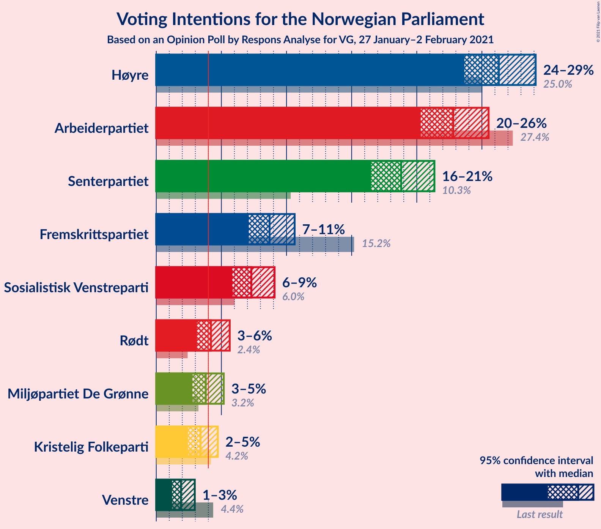

### Confidence Intervals

| Party | Last Result | Poll Result | 80% Confidence Interval | 90% Confidence Interval | 95% Confidence Interval | 99% Confidence Interval |
|:-----:|:-----------:|:-----------:|:-----------------------:|:-----------------------:|:-----------------------:|:-----------------------:|
| Høyre | 25.0% | 26.3% | 24.6–28.2% |24.1–28.7% |23.7–29.1% |22.8–30.0% |
| Arbeiderpartiet | 27.4% | 22.8% | 21.2–24.6% |20.7–25.1% |20.3–25.5% |19.5–26.4% |
| Senterpartiet | 10.3% | 18.8% | 17.3–20.5% |16.9–20.9% |16.5–21.4% |15.8–22.2% |
| Fremskrittspartiet | 15.2% | 8.7% | 7.7–10.0% |7.3–10.3% |7.1–10.6% |6.6–11.2% |
| Sosialistisk Venstreparti | 6.0% | 7.3% | 6.3–8.5% |6.1–8.8% |5.8–9.1% |5.4–9.7% |
| Rødt | 2.4% | 4.2% | 3.5–5.1% |3.3–5.4% |3.1–5.6% |2.8–6.1% |
| Miljøpartiet De Grønne | 3.2% | 3.8% | 3.1–4.7% |2.9–5.0% |2.8–5.2% |2.5–5.6% |
| Kristelig Folkeparti | 4.2% | 3.4% | 2.8–4.3% |2.6–4.5% |2.4–4.7% |2.2–5.2% |
| Venstre | 4.4% | 1.9% | 1.4–2.6% |1.3–2.8% |1.2–3.0% |1.0–3.3% |

*Note:* The poll result column reflects the actual value used in the calculations. Published results may vary slightly, and in addition be rounded to fewer digits.

## Seats

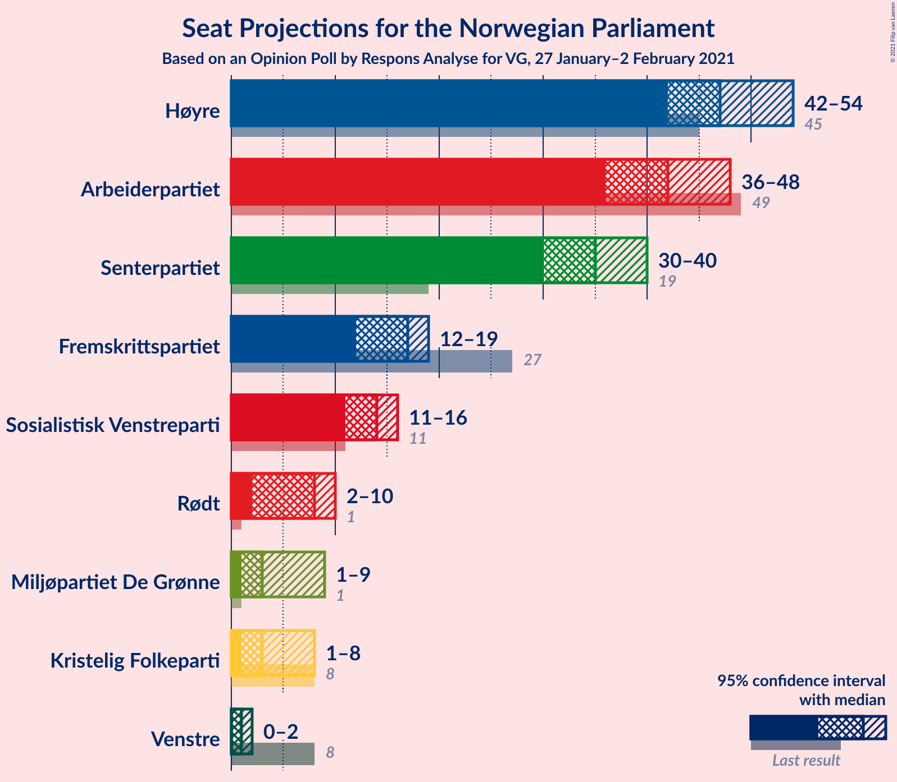

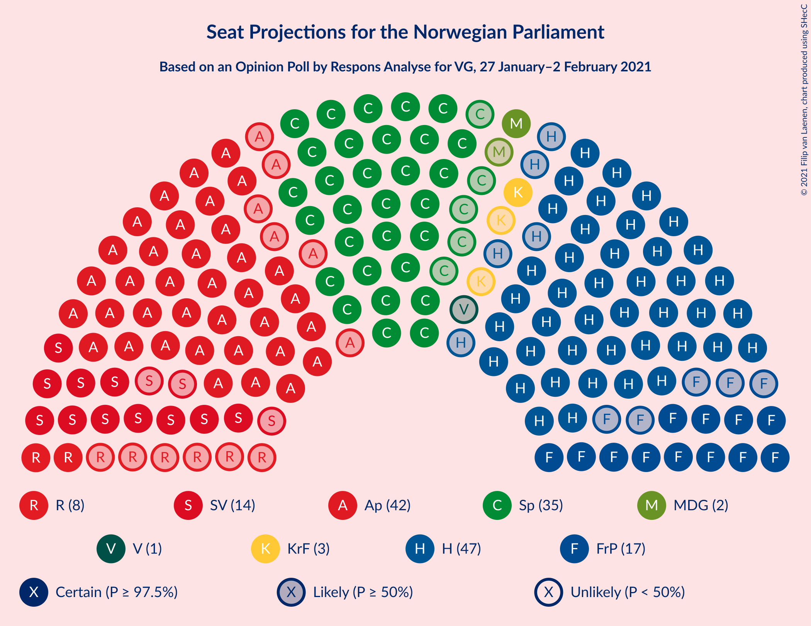

### Confidence Intervals

| Party | Last Result | Median | 80% Confidence Interval | 90% Confidence Interval | 95% Confidence Interval | 99% Confidence Interval |
|:-----:|:-----------:|:------:|:-----------------------:|:-----------------------:|:-----------------------:|:-----------------------:|
| <a href="#høyre">Høyre</a> | 45 | 47 | 43–51 |43–53 |42–54 |40–56 |
| <a href="#arbeiderpartiet">Arbeiderpartiet</a> | 49 | 42 | 39–44 |38–46 |36–48 |35–49 |
| <a href="#senterpartiet">Senterpartiet</a> | 19 | 35 | 32–38 |31–38 |30–40 |29–41 |
| <a href="#fremskrittspartiet">Fremskrittspartiet</a> | 27 | 17 | 13–18 |13–18 |12–19 |11–21 |
| <a href="#sosialistisk-venstreparti">Sosialistisk Venstreparti</a> | 11 | 14 | 11–16 |11–16 |11–16 |10–18 |
| <a href="#rødt">Rødt</a> | 1 | 8 | 2–9 |2–10 |2–10 |2–11 |
| <a href="#miljøpartiet-de-grønne">Miljøpartiet De Grønne</a> | 1 | 3 | 2–8 |1–9 |1–9 |1–10 |
| <a href="#kristelig-folkeparti">Kristelig Folkeparti</a> | 8 | 3 | 1–7 |1–8 |1–8 |0–9 |
| <a href="#venstre">Venstre</a> | 8 | 1 | 0–2 |0–2 |0–2 |0–2 |

### Høyre

*For a full overview of the results for this party, see the [Høyre](party-høyre.html) page.*

| Number of Seats | Probability | Accumulated | Special Marks |
|:---------------:|:-----------:|:-----------:|:-------------:|
| 38 | 0.1% | 100% |  |
| 39 | 0.1% | 99.9% |  |
| 40 | 0.6% | 99.8% |  |
| 41 | 0.9% | 99.2% |  |
| 42 | 2% | 98% |  |
| 43 | 6% | 96% |  |
| 44 | 6% | 90% |  |
| 45 | 15% | 84% | Last Result |
| 46 | 6% | 68% |  |
| 47 | 14% | 62% | Median |
| 48 | 12% | 48% |  |
| 49 | 12% | 37% |  |
| 50 | 8% | 25% |  |
| 51 | 8% | 17% |  |
| 52 | 3% | 9% |  |
| 53 | 3% | 6% |  |
| 54 | 1.2% | 3% |  |
| 55 | 1.0% | 2% |  |
| 56 | 0.3% | 0.5% |  |
| 57 | 0.1% | 0.2% |  |
| 58 | 0% | 0.1% |  |
| 59 | 0% | 0% |  |

### Arbeiderpartiet

*For a full overview of the results for this party, see the [Arbeiderpartiet](party-arbeiderpartiet.html) page.*

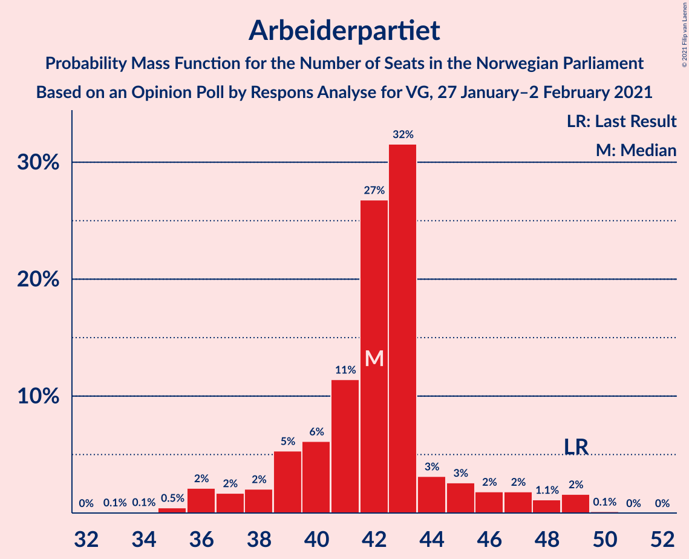

| Number of Seats | Probability | Accumulated | Special Marks |
|:---------------:|:-----------:|:-----------:|:-------------:|
| 33 | 0.1% | 100% |  |
| 34 | 0.1% | 99.9% |  |
| 35 | 0.5% | 99.8% |  |
| 36 | 2% | 99.4% |  |
| 37 | 2% | 97% |  |
| 38 | 2% | 96% |  |
| 39 | 5% | 93% |  |
| 40 | 6% | 88% |  |
| 41 | 11% | 82% |  |
| 42 | 27% | 71% | Median |
| 43 | 32% | 44% |  |
| 44 | 3% | 12% |  |
| 45 | 3% | 9% |  |
| 46 | 2% | 7% |  |
| 47 | 2% | 5% |  |
| 48 | 1.1% | 3% |  |
| 49 | 2% | 2% | Last Result |
| 50 | 0.1% | 0.1% |  |
| 51 | 0% | 0% |  |

### Senterpartiet

*For a full overview of the results for this party, see the [Senterpartiet](party-senterpartiet.html) page.*

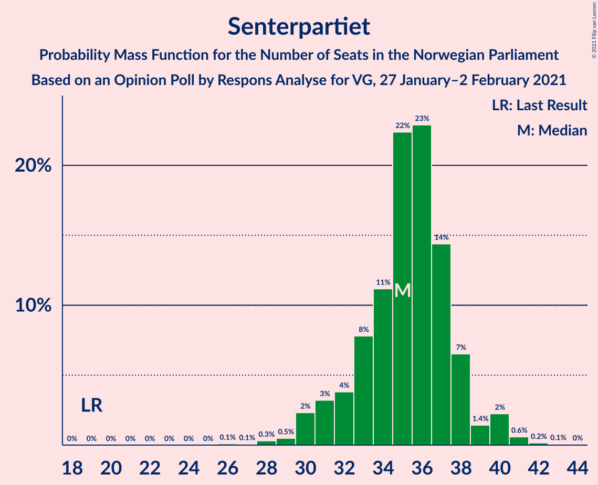

| Number of Seats | Probability | Accumulated | Special Marks |
|:---------------:|:-----------:|:-----------:|:-------------:|
| 19 | 0% | 100% | Last Result |
| 20 | 0% | 100% |  |
| 21 | 0% | 100% |  |
| 22 | 0% | 100% |  |
| 23 | 0% | 100% |  |
| 24 | 0% | 100% |  |
| 25 | 0% | 100% |  |
| 26 | 0.1% | 100% |  |
| 27 | 0.1% | 99.9% |  |
| 28 | 0.3% | 99.8% |  |
| 29 | 0.5% | 99.5% |  |
| 30 | 2% | 99.0% |  |
| 31 | 3% | 97% |  |
| 32 | 4% | 94% |  |
| 33 | 8% | 90% |  |
| 34 | 11% | 82% |  |
| 35 | 22% | 71% | Median |
| 36 | 23% | 48% |  |
| 37 | 14% | 25% |  |
| 38 | 7% | 11% |  |
| 39 | 1.4% | 5% |  |
| 40 | 2% | 3% |  |
| 41 | 0.6% | 0.9% |  |
| 42 | 0.2% | 0.3% |  |
| 43 | 0.1% | 0.1% |  |
| 44 | 0% | 0% |  |

### Fremskrittspartiet

*For a full overview of the results for this party, see the [Fremskrittspartiet](party-fremskrittspartiet.html) page.*

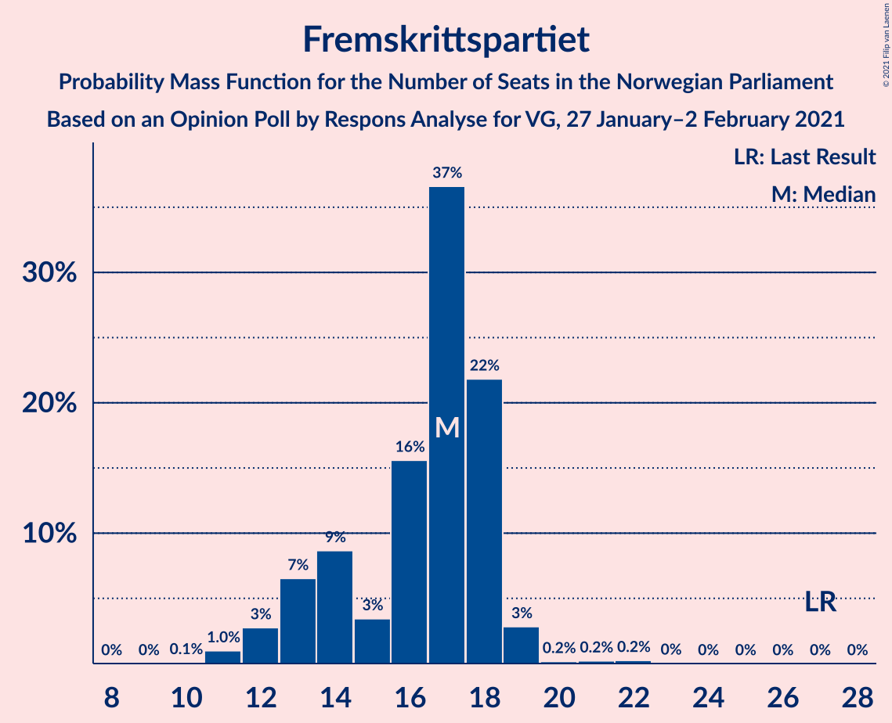

| Number of Seats | Probability | Accumulated | Special Marks |
|:---------------:|:-----------:|:-----------:|:-------------:|
| 10 | 0.1% | 100% |  |
| 11 | 1.0% | 99.9% |  |
| 12 | 3% | 98.9% |  |
| 13 | 7% | 96% |  |
| 14 | 9% | 90% |  |
| 15 | 3% | 81% |  |
| 16 | 16% | 78% |  |
| 17 | 37% | 62% | Median |
| 18 | 22% | 25% |  |
| 19 | 3% | 3% |  |
| 20 | 0.2% | 0.7% |  |
| 21 | 0.2% | 0.5% |  |
| 22 | 0.2% | 0.3% |  |
| 23 | 0% | 0% |  |
| 24 | 0% | 0% |  |
| 25 | 0% | 0% |  |
| 26 | 0% | 0% |  |
| 27 | 0% | 0% | Last Result |

### Sosialistisk Venstreparti

*For a full overview of the results for this party, see the [Sosialistisk Venstreparti](party-sosialistiskvenstreparti.html) page.*

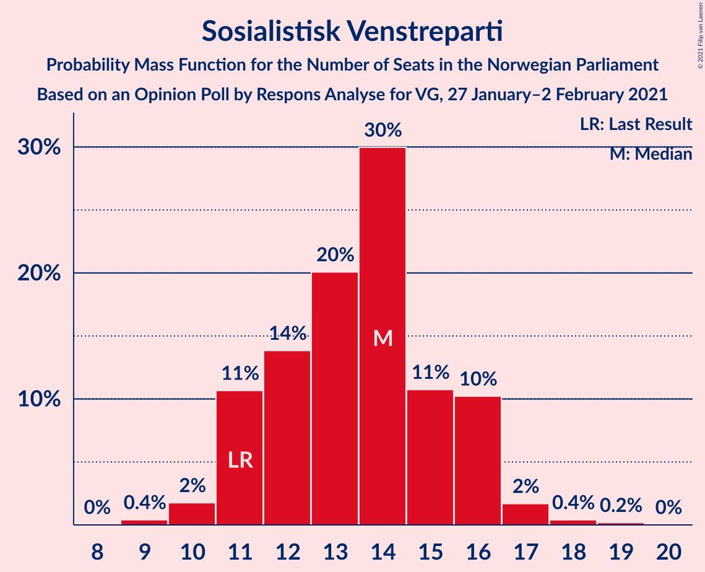

| Number of Seats | Probability | Accumulated | Special Marks |
|:---------------:|:-----------:|:-----------:|:-------------:|
| 9 | 0.4% | 100% |  |
| 10 | 2% | 99.6% |  |
| 11 | 11% | 98% | Last Result |
| 12 | 14% | 87% |  |
| 13 | 20% | 73% |  |
| 14 | 30% | 53% | Median |
| 15 | 11% | 23% |  |
| 16 | 10% | 13% |  |
| 17 | 2% | 2% |  |
| 18 | 0.4% | 0.6% |  |
| 19 | 0.2% | 0.2% |  |
| 20 | 0% | 0% |  |

### Rødt

*For a full overview of the results for this party, see the [Rødt](party-rødt.html) page.*

| Number of Seats | Probability | Accumulated | Special Marks |
|:---------------:|:-----------:|:-----------:|:-------------:|
| 1 | 0.5% | 100% | Last Result |
| 2 | 33% | 99.5% |  |
| 3 | 0.6% | 67% |  |
| 4 | 0% | 66% |  |
| 5 | 0% | 66% |  |
| 6 | 0.1% | 66% |  |
| 7 | 11% | 66% |  |
| 8 | 35% | 55% | Median |
| 9 | 14% | 20% |  |
| 10 | 4% | 6% |  |
| 11 | 1.5% | 2% |  |
| 12 | 0.1% | 0.1% |  |
| 13 | 0% | 0% |  |

### Miljøpartiet De Grønne

*For a full overview of the results for this party, see the [Miljøpartiet De Grønne](party-miljøpartietdegrønne.html) page.*

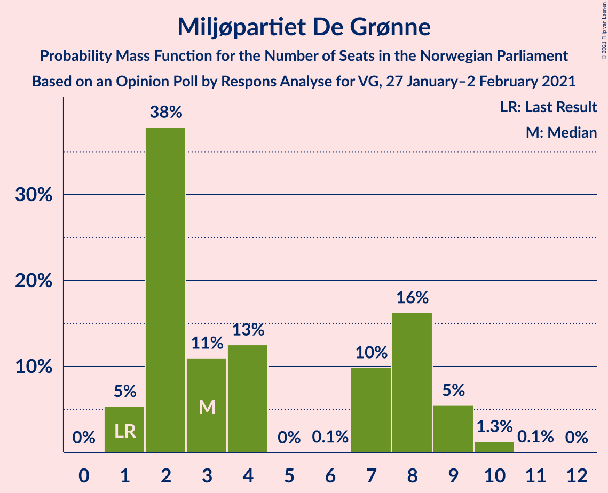

| Number of Seats | Probability | Accumulated | Special Marks |
|:---------------:|:-----------:|:-----------:|:-------------:|
| 1 | 5% | 100% | Last Result |
| 2 | 38% | 95% |  |
| 3 | 11% | 57% | Median |
| 4 | 13% | 46% |  |
| 5 | 0% | 33% |  |
| 6 | 0.1% | 33% |  |
| 7 | 10% | 33% |  |
| 8 | 16% | 23% |  |
| 9 | 5% | 7% |  |
| 10 | 1.3% | 1.4% |  |
| 11 | 0.1% | 0.1% |  |
| 12 | 0% | 0% |  |

### Kristelig Folkeparti

*For a full overview of the results for this party, see the [Kristelig Folkeparti](party-kristeligfolkeparti.html) page.*

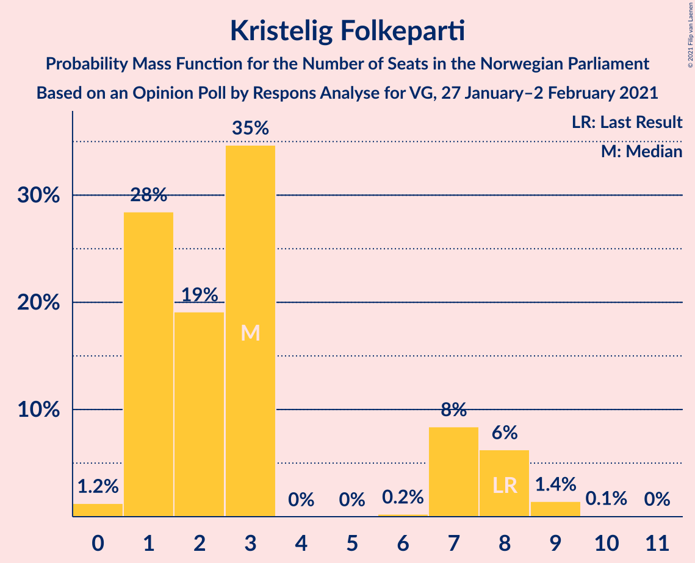

| Number of Seats | Probability | Accumulated | Special Marks |
|:---------------:|:-----------:|:-----------:|:-------------:|
| 0 | 1.2% | 100% |  |
| 1 | 28% | 98.8% |  |
| 2 | 19% | 70% |  |
| 3 | 35% | 51% | Median |
| 4 | 0% | 17% |  |
| 5 | 0% | 17% |  |
| 6 | 0.2% | 17% |  |
| 7 | 8% | 16% |  |
| 8 | 6% | 8% | Last Result |
| 9 | 1.4% | 2% |  |
| 10 | 0.1% | 0.2% |  |
| 11 | 0% | 0% |  |

### Venstre

*For a full overview of the results for this party, see the [Venstre](party-venstre.html) page.*

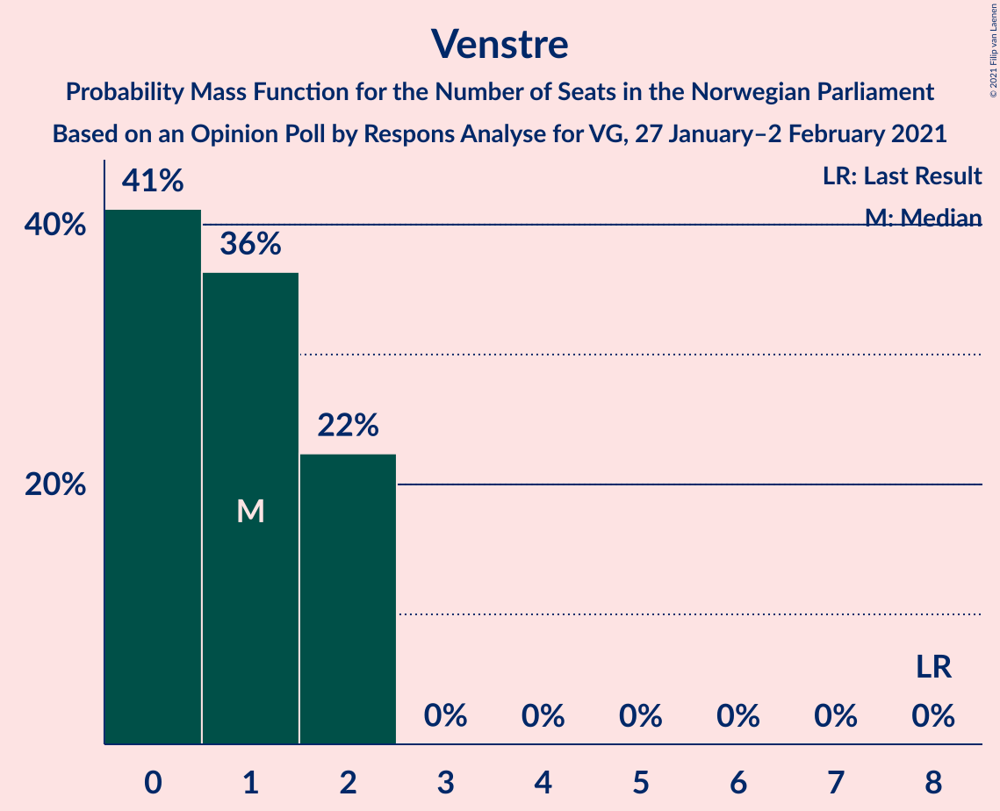

| Number of Seats | Probability | Accumulated | Special Marks |
|:---------------:|:-----------:|:-----------:|:-------------:|
| 0 | 41% | 100% |  |
| 1 | 36% | 59% | Median |
| 2 | 22% | 22% |  |
| 3 | 0% | 0% |  |
| 4 | 0% | 0% |  |
| 5 | 0% | 0% |  |
| 6 | 0% | 0% |  |
| 7 | 0% | 0% |  |
| 8 | 0% | 0% | Last Result |

## Coalitions

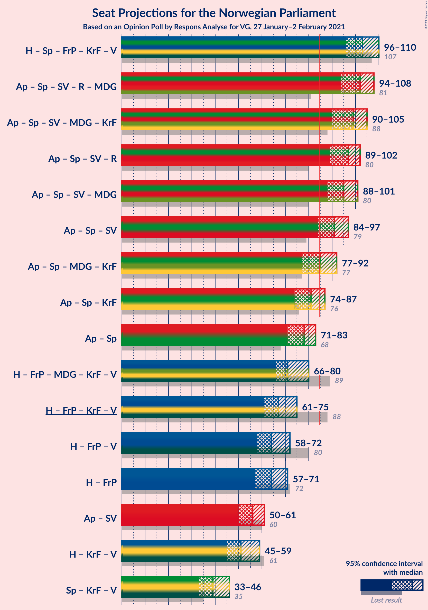

### Confidence Intervals

| Coalition | Last Result | Median | Majority? | 80% Confidence Interval | 90% Confidence Interval | 95% Confidence Interval | 99% Confidence Interval |
|:---------:|:-----------:|:------:|:---------:|:-----------------------:|:-----------------------:|:-----------------------:|:-----------------------:|
| Høyre – Senterpartiet – Fremskrittspartiet – Kristelig Folkeparti – Venstre | 107 | 103 | 100% | 98–108 | 97–109 | 96–110 | 94–112 |
| Arbeiderpartiet – Senterpartiet – Sosialistisk Venstreparti – Rødt – Miljøpartiet De Grønne | 81 | 102 | 100% | 96–106 | 95–107 | 94–108 | 92–110 |
| Arbeiderpartiet – Senterpartiet – Sosialistisk Venstreparti – Miljøpartiet De Grønne – Kristelig Folkeparti | 88 | 99 | 100% | 93–103 | 92–104 | 90–105 | 89–107 |
| Arbeiderpartiet – Senterpartiet – Sosialistisk Venstreparti – Rødt | 80 | 97 | 99.9% | 93–101 | 91–102 | 89–102 | 87–105 |
| Arbeiderpartiet – Senterpartiet – Sosialistisk Venstreparti – Miljøpartiet De Grønne | 80 | 95 | 99.9% | 90–100 | 89–101 | 88–101 | 86–104 |
| Arbeiderpartiet – Senterpartiet – Sosialistisk Venstreparti | 79 | 91 | 97% | 86–95 | 85–96 | 84–97 | 82–99 |
| Arbeiderpartiet – Senterpartiet – Miljøpartiet De Grønne – Kristelig Folkeparti | 77 | 85 | 55% | 80–89 | 78–91 | 77–92 | 75–95 |
| Arbeiderpartiet – Senterpartiet – Kristelig Folkeparti | 76 | 81 | 11% | 76–85 | 75–86 | 74–87 | 72–89 |
| Arbeiderpartiet – Senterpartiet | 68 | 78 | 0.5% | 73–81 | 72–82 | 71–83 | 69–85 |
| Høyre – Fremskrittspartiet – Miljøpartiet De Grønne – Kristelig Folkeparti – Venstre | 89 | 71 | 0.1% | 68–76 | 67–78 | 66–80 | 64–82 |
| Høyre – Fremskrittspartiet – Kristelig Folkeparti – Venstre | 88 | 67 | 0% | 63–73 | 62–74 | 61–75 | 59–77 |
| Høyre – Fremskrittspartiet – Venstre | 80 | 64 | 0% | 60–70 | 59–71 | 58–72 | 55–74 |
| Høyre – Fremskrittspartiet | 72 | 64 | 0% | 59–69 | 58–70 | 57–71 | 54–73 |
| Arbeiderpartiet – Sosialistisk Venstreparti | 60 | 56 | 0% | 52–59 | 50–60 | 50–61 | 48–63 |
| Høyre – Kristelig Folkeparti – Venstre | 61 | 51 | 0% | 47–56 | 46–57 | 45–59 | 43–62 |
| Senterpartiet – Kristelig Folkeparti – Venstre | 35 | 39 | 0% | 35–44 | 34–45 | 33–46 | 32–48 |

### Høyre – Senterpartiet – Fremskrittspartiet – Kristelig Folkeparti – Venstre

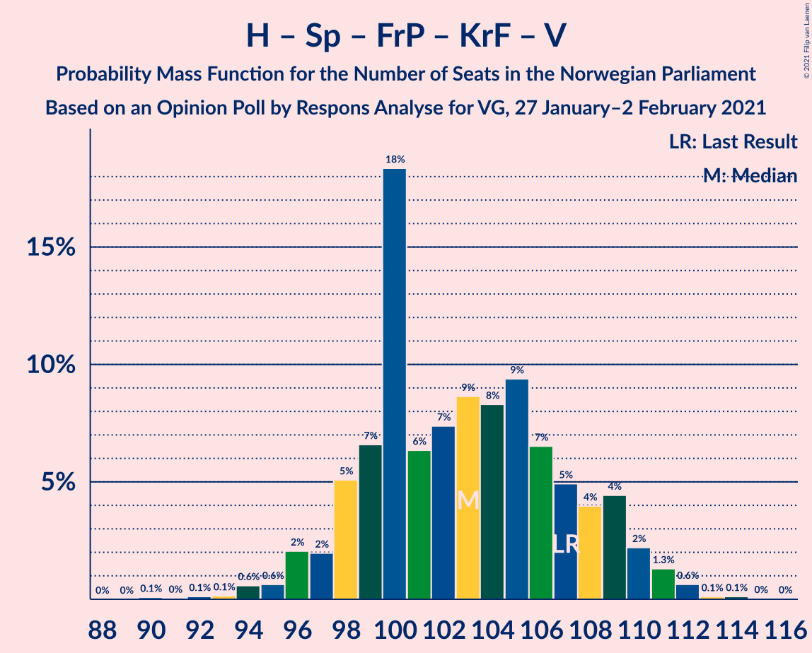

| Number of Seats | Probability | Accumulated | Special Marks |
|:---------------:|:-----------:|:-----------:|:-------------:|
| 90 | 0.1% | 100% |  |
| 91 | 0% | 99.9% |  |
| 92 | 0.1% | 99.9% |  |
| 93 | 0.1% | 99.7% |  |
| 94 | 0.6% | 99.6% |  |
| 95 | 0.6% | 99.0% |  |
| 96 | 2% | 98% |  |
| 97 | 2% | 96% |  |
| 98 | 5% | 94% |  |
| 99 | 7% | 89% |  |
| 100 | 18% | 83% |  |
| 101 | 6% | 64% |  |
| 102 | 7% | 58% |  |
| 103 | 9% | 51% | Median |
| 104 | 8% | 42% |  |
| 105 | 9% | 34% |  |
| 106 | 7% | 24% |  |
| 107 | 5% | 18% | Last Result |
| 108 | 4% | 13% |  |
| 109 | 4% | 9% |  |
| 110 | 2% | 4% |  |
| 111 | 1.3% | 2% |  |
| 112 | 0.6% | 0.9% |  |
| 113 | 0.1% | 0.3% |  |
| 114 | 0.1% | 0.2% |  |
| 115 | 0% | 0.1% |  |
| 116 | 0% | 0% |  |

### Arbeiderpartiet – Senterpartiet – Sosialistisk Venstreparti – Rødt – Miljøpartiet De Grønne

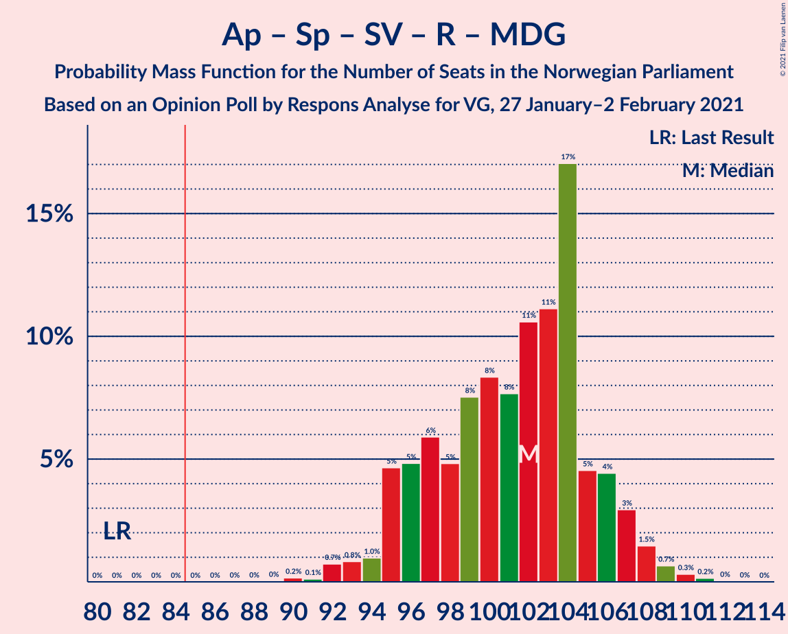

| Number of Seats | Probability | Accumulated | Special Marks |
|:---------------:|:-----------:|:-----------:|:-------------:|
| 81 | 0% | 100% | Last Result |
| 82 | 0% | 100% |  |
| 83 | 0% | 100% |  |
| 84 | 0% | 100% |  |
| 85 | 0% | 100% | Majority |
| 86 | 0% | 100% |  |
| 87 | 0% | 100% |  |
| 88 | 0% | 100% |  |
| 89 | 0% | 100% |  |
| 90 | 0.2% | 99.9% |  |
| 91 | 0.1% | 99.8% |  |
| 92 | 0.7% | 99.6% |  |
| 93 | 0.8% | 98.9% |  |
| 94 | 1.0% | 98% |  |
| 95 | 5% | 97% |  |
| 96 | 5% | 92% |  |
| 97 | 6% | 88% |  |
| 98 | 5% | 82% |  |
| 99 | 8% | 77% |  |
| 100 | 8% | 69% |  |
| 101 | 8% | 61% |  |
| 102 | 11% | 53% | Median |
| 103 | 11% | 43% |  |
| 104 | 17% | 32% |  |
| 105 | 5% | 15% |  |
| 106 | 4% | 10% |  |
| 107 | 3% | 6% |  |
| 108 | 1.5% | 3% |  |
| 109 | 0.7% | 1.2% |  |
| 110 | 0.3% | 0.5% |  |
| 111 | 0.2% | 0.2% |  |
| 112 | 0% | 0.1% |  |
| 113 | 0% | 0% |  |

### Arbeiderpartiet – Senterpartiet – Sosialistisk Venstreparti – Miljøpartiet De Grønne – Kristelig Folkeparti

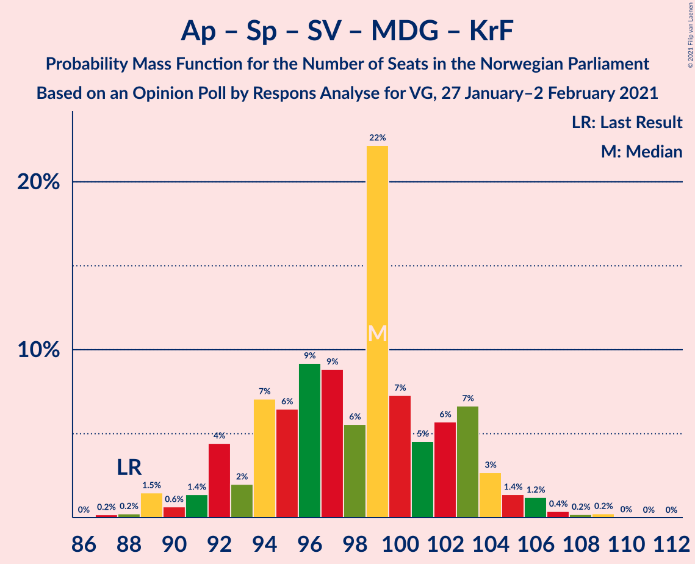

| Number of Seats | Probability | Accumulated | Special Marks |
|:---------------:|:-----------:|:-----------:|:-------------:|
| 87 | 0.2% | 100% |  |
| 88 | 0.2% | 99.8% | Last Result |
| 89 | 1.5% | 99.6% |  |
| 90 | 0.6% | 98% |  |
| 91 | 1.4% | 97% |  |
| 92 | 4% | 96% |  |
| 93 | 2% | 92% |  |
| 94 | 7% | 90% |  |
| 95 | 6% | 83% |  |
| 96 | 9% | 76% |  |
| 97 | 9% | 67% | Median |
| 98 | 6% | 58% |  |
| 99 | 22% | 52% |  |
| 100 | 7% | 30% |  |
| 101 | 5% | 23% |  |
| 102 | 6% | 18% |  |
| 103 | 7% | 13% |  |
| 104 | 3% | 6% |  |
| 105 | 1.4% | 3% |  |
| 106 | 1.2% | 2% |  |
| 107 | 0.4% | 0.9% |  |
| 108 | 0.2% | 0.5% |  |
| 109 | 0.2% | 0.3% |  |
| 110 | 0% | 0.1% |  |
| 111 | 0% | 0% |  |

### Arbeiderpartiet – Senterpartiet – Sosialistisk Venstreparti – Rødt

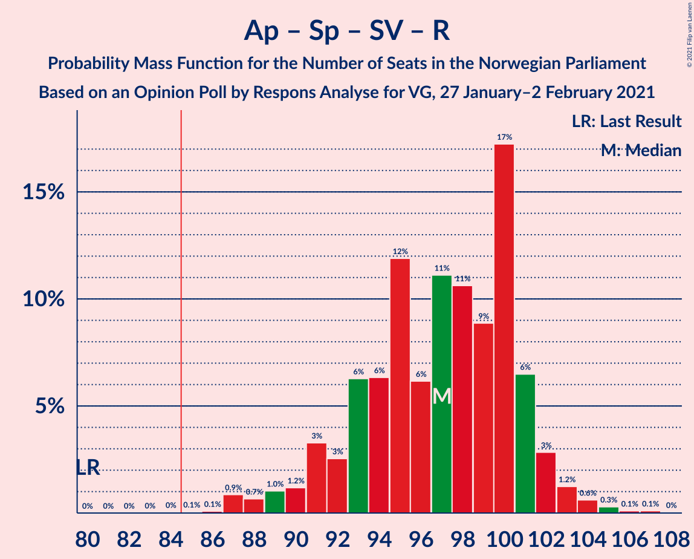

| Number of Seats | Probability | Accumulated | Special Marks |
|:---------------:|:-----------:|:-----------:|:-------------:|
| 80 | 0% | 100% | Last Result |
| 81 | 0% | 100% |  |
| 82 | 0% | 100% |  |
| 83 | 0% | 100% |  |
| 84 | 0% | 100% |  |
| 85 | 0.1% | 99.9% | Majority |
| 86 | 0.1% | 99.9% |  |
| 87 | 0.9% | 99.8% |  |
| 88 | 0.7% | 98.9% |  |
| 89 | 1.0% | 98% |  |
| 90 | 1.2% | 97% |  |
| 91 | 3% | 96% |  |
| 92 | 3% | 93% |  |
| 93 | 6% | 90% |  |
| 94 | 6% | 84% |  |
| 95 | 12% | 78% |  |
| 96 | 6% | 66% |  |
| 97 | 11% | 60% |  |
| 98 | 11% | 48% |  |
| 99 | 9% | 38% | Median |
| 100 | 17% | 29% |  |
| 101 | 6% | 12% |  |
| 102 | 3% | 5% |  |
| 103 | 1.2% | 2% |  |
| 104 | 0.6% | 1.2% |  |
| 105 | 0.3% | 0.5% |  |
| 106 | 0.1% | 0.3% |  |
| 107 | 0.1% | 0.1% |  |
| 108 | 0% | 0% |  |

### Arbeiderpartiet – Senterpartiet – Sosialistisk Venstreparti – Miljøpartiet De Grønne

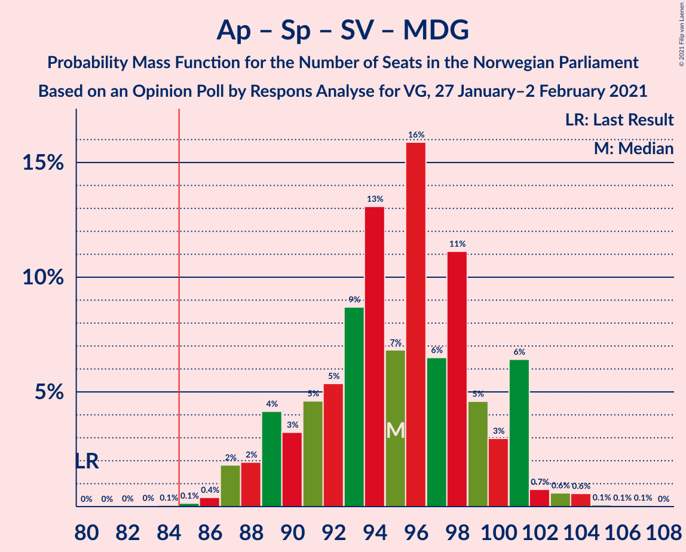

| Number of Seats | Probability | Accumulated | Special Marks |
|:---------------:|:-----------:|:-----------:|:-------------:|
| 80 | 0% | 100% | Last Result |
| 81 | 0% | 100% |  |
| 82 | 0% | 100% |  |
| 83 | 0% | 100% |  |
| 84 | 0.1% | 99.9% |  |
| 85 | 0.1% | 99.9% | Majority |
| 86 | 0.4% | 99.7% |  |
| 87 | 2% | 99.3% |  |
| 88 | 2% | 98% |  |
| 89 | 4% | 96% |  |
| 90 | 3% | 91% |  |
| 91 | 5% | 88% |  |
| 92 | 5% | 84% |  |
| 93 | 9% | 78% |  |
| 94 | 13% | 70% | Median |
| 95 | 7% | 56% |  |
| 96 | 16% | 50% |  |
| 97 | 6% | 34% |  |
| 98 | 11% | 27% |  |
| 99 | 5% | 16% |  |
| 100 | 3% | 12% |  |
| 101 | 6% | 9% |  |
| 102 | 0.7% | 2% |  |
| 103 | 0.6% | 1.4% |  |
| 104 | 0.6% | 0.8% |  |
| 105 | 0.1% | 0.2% |  |
| 106 | 0.1% | 0.1% |  |
| 107 | 0.1% | 0.1% |  |
| 108 | 0% | 0% |  |

### Arbeiderpartiet – Senterpartiet – Sosialistisk Venstreparti

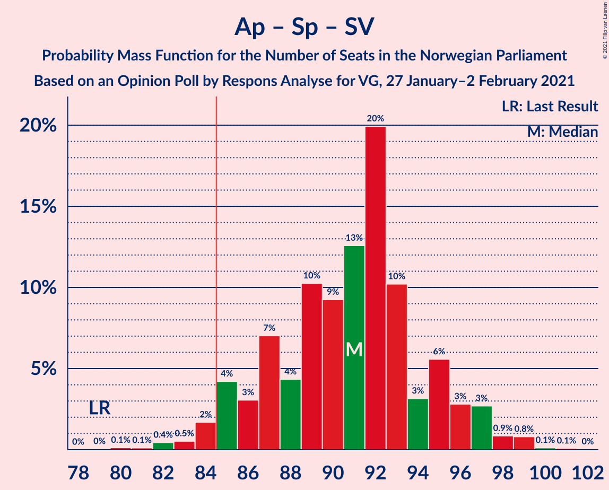

| Number of Seats | Probability | Accumulated | Special Marks |
|:---------------:|:-----------:|:-----------:|:-------------:|
| 79 | 0% | 100% | Last Result |
| 80 | 0.1% | 99.9% |  |
| 81 | 0.1% | 99.8% |  |
| 82 | 0.4% | 99.7% |  |
| 83 | 0.5% | 99.2% |  |
| 84 | 2% | 98.7% |  |
| 85 | 4% | 97% | Majority |
| 86 | 3% | 93% |  |
| 87 | 7% | 90% |  |
| 88 | 4% | 83% |  |
| 89 | 10% | 78% |  |
| 90 | 9% | 68% |  |
| 91 | 13% | 59% | Median |
| 92 | 20% | 46% |  |
| 93 | 10% | 26% |  |
| 94 | 3% | 16% |  |
| 95 | 6% | 13% |  |
| 96 | 3% | 7% |  |
| 97 | 3% | 5% |  |
| 98 | 0.9% | 2% |  |
| 99 | 0.8% | 1.0% |  |
| 100 | 0.1% | 0.2% |  |
| 101 | 0.1% | 0.1% |  |
| 102 | 0% | 0% |  |

### Arbeiderpartiet – Senterpartiet – Miljøpartiet De Grønne – Kristelig Folkeparti

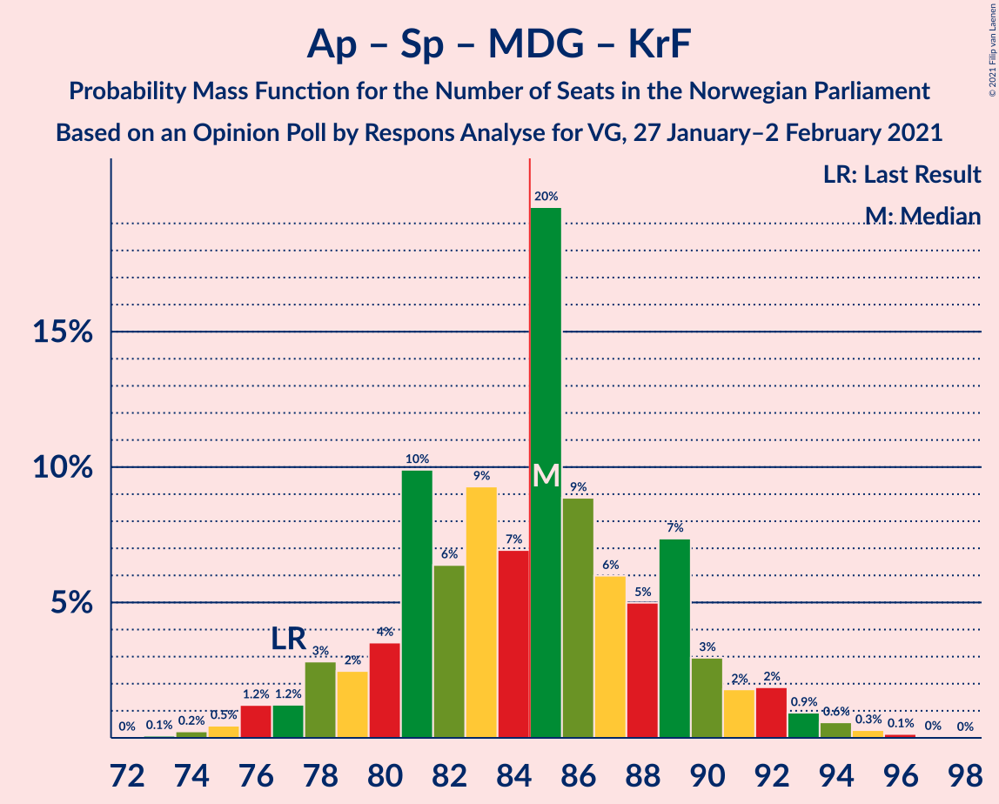

| Number of Seats | Probability | Accumulated | Special Marks |
|:---------------:|:-----------:|:-----------:|:-------------:|
| 73 | 0.1% | 100% |  |
| 74 | 0.2% | 99.9% |  |
| 75 | 0.5% | 99.6% |  |
| 76 | 1.2% | 99.2% |  |
| 77 | 1.2% | 98% | Last Result |
| 78 | 3% | 97% |  |
| 79 | 2% | 94% |  |
| 80 | 4% | 91% |  |
| 81 | 10% | 88% |  |
| 82 | 6% | 78% |  |
| 83 | 9% | 72% | Median |
| 84 | 7% | 62% |  |
| 85 | 20% | 55% | Majority |
| 86 | 9% | 36% |  |
| 87 | 6% | 27% |  |
| 88 | 5% | 21% |  |
| 89 | 7% | 16% |  |
| 90 | 3% | 9% |  |
| 91 | 2% | 6% |  |
| 92 | 2% | 4% |  |
| 93 | 0.9% | 2% |  |
| 94 | 0.6% | 1.1% |  |
| 95 | 0.3% | 0.5% |  |
| 96 | 0.1% | 0.2% |  |
| 97 | 0% | 0.1% |  |
| 98 | 0% | 0% |  |

### Arbeiderpartiet – Senterpartiet – Kristelig Folkeparti

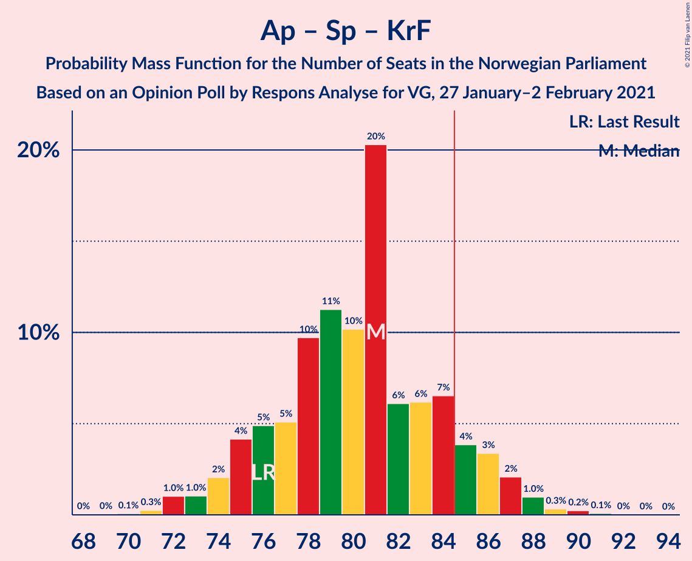

| Number of Seats | Probability | Accumulated | Special Marks |
|:---------------:|:-----------:|:-----------:|:-------------:|
| 69 | 0% | 100% |  |
| 70 | 0.1% | 99.9% |  |
| 71 | 0.3% | 99.8% |  |
| 72 | 1.0% | 99.6% |  |
| 73 | 1.0% | 98.6% |  |
| 74 | 2% | 98% |  |
| 75 | 4% | 95% |  |
| 76 | 5% | 91% | Last Result |
| 77 | 5% | 86% |  |
| 78 | 10% | 81% |  |
| 79 | 11% | 72% |  |
| 80 | 10% | 60% | Median |
| 81 | 20% | 50% |  |
| 82 | 6% | 30% |  |
| 83 | 6% | 24% |  |
| 84 | 7% | 18% |  |
| 85 | 4% | 11% | Majority |
| 86 | 3% | 7% |  |
| 87 | 2% | 4% |  |
| 88 | 1.0% | 2% |  |
| 89 | 0.3% | 0.7% |  |
| 90 | 0.2% | 0.4% |  |
| 91 | 0.1% | 0.1% |  |
| 92 | 0% | 0.1% |  |
| 93 | 0% | 0% |  |

### Arbeiderpartiet – Senterpartiet

| Number of Seats | Probability | Accumulated | Special Marks |
|:---------------:|:-----------:|:-----------:|:-------------:|
| 66 | 0% | 100% |  |
| 67 | 0.1% | 99.9% |  |
| 68 | 0.1% | 99.8% | Last Result |
| 69 | 0.4% | 99.7% |  |
| 70 | 0.5% | 99.3% |  |
| 71 | 2% | 98.8% |  |
| 72 | 4% | 97% |  |
| 73 | 6% | 93% |  |
| 74 | 3% | 87% |  |
| 75 | 5% | 84% |  |
| 76 | 13% | 79% |  |
| 77 | 13% | 65% | Median |
| 78 | 21% | 53% |  |
| 79 | 13% | 32% |  |
| 80 | 8% | 19% |  |
| 81 | 4% | 11% |  |
| 82 | 2% | 7% |  |
| 83 | 2% | 5% |  |
| 84 | 2% | 2% |  |
| 85 | 0.2% | 0.5% | Majority |
| 86 | 0.2% | 0.3% |  |
| 87 | 0% | 0.1% |  |
| 88 | 0% | 0.1% |  |
| 89 | 0% | 0% |  |

### Høyre – Fremskrittspartiet – Miljøpartiet De Grønne – Kristelig Folkeparti – Venstre

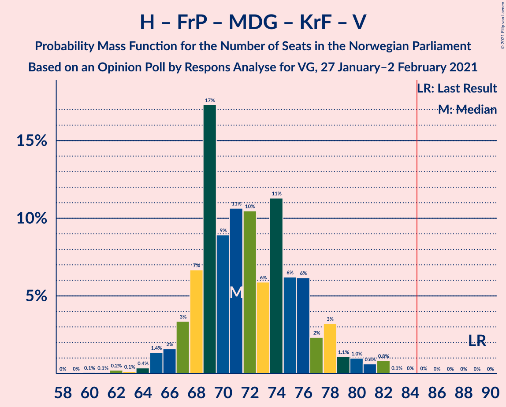

| Number of Seats | Probability | Accumulated | Special Marks |
|:---------------:|:-----------:|:-----------:|:-------------:|
| 60 | 0.1% | 100% |  |
| 61 | 0.1% | 99.9% |  |
| 62 | 0.2% | 99.9% |  |
| 63 | 0.1% | 99.6% |  |
| 64 | 0.4% | 99.5% |  |
| 65 | 1.4% | 99.1% |  |
| 66 | 2% | 98% |  |
| 67 | 3% | 96% |  |
| 68 | 7% | 93% |  |
| 69 | 17% | 86% |  |
| 70 | 9% | 69% |  |
| 71 | 11% | 60% | Median |
| 72 | 10% | 49% |  |
| 73 | 6% | 39% |  |
| 74 | 11% | 33% |  |
| 75 | 6% | 22% |  |
| 76 | 6% | 15% |  |
| 77 | 2% | 9% |  |
| 78 | 3% | 7% |  |
| 79 | 1.1% | 4% |  |
| 80 | 1.0% | 3% |  |
| 81 | 0.6% | 2% |  |
| 82 | 0.8% | 1.0% |  |
| 83 | 0.1% | 0.2% |  |
| 84 | 0% | 0.1% |  |
| 85 | 0% | 0.1% | Majority |
| 86 | 0% | 0% |  |
| 87 | 0% | 0% |  |
| 88 | 0% | 0% |  |
| 89 | 0% | 0% | Last Result |

### Høyre – Fremskrittspartiet – Kristelig Folkeparti – Venstre

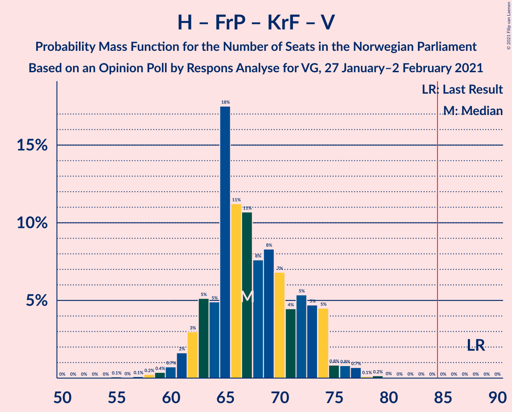

| Number of Seats | Probability | Accumulated | Special Marks |
|:---------------:|:-----------:|:-----------:|:-------------:|
| 55 | 0.1% | 100% |  |
| 56 | 0% | 99.9% |  |
| 57 | 0.1% | 99.9% |  |
| 58 | 0.2% | 99.8% |  |
| 59 | 0.4% | 99.6% |  |
| 60 | 0.7% | 99.2% |  |
| 61 | 2% | 98% |  |
| 62 | 3% | 97% |  |
| 63 | 5% | 94% |  |
| 64 | 5% | 89% |  |
| 65 | 18% | 84% |  |
| 66 | 11% | 66% |  |
| 67 | 11% | 55% |  |
| 68 | 8% | 44% | Median |
| 69 | 8% | 37% |  |
| 70 | 7% | 28% |  |
| 71 | 4% | 22% |  |
| 72 | 5% | 17% |  |
| 73 | 5% | 12% |  |
| 74 | 5% | 7% |  |
| 75 | 0.8% | 3% |  |
| 76 | 0.8% | 2% |  |
| 77 | 0.7% | 1.0% |  |
| 78 | 0.1% | 0.3% |  |
| 79 | 0.2% | 0.2% |  |
| 80 | 0% | 0.1% |  |
| 81 | 0% | 0% |  |
| 82 | 0% | 0% |  |
| 83 | 0% | 0% |  |
| 84 | 0% | 0% |  |
| 85 | 0% | 0% | Majority |
| 86 | 0% | 0% |  |
| 87 | 0% | 0% |  |
| 88 | 0% | 0% | Last Result |

### Høyre – Fremskrittspartiet – Venstre

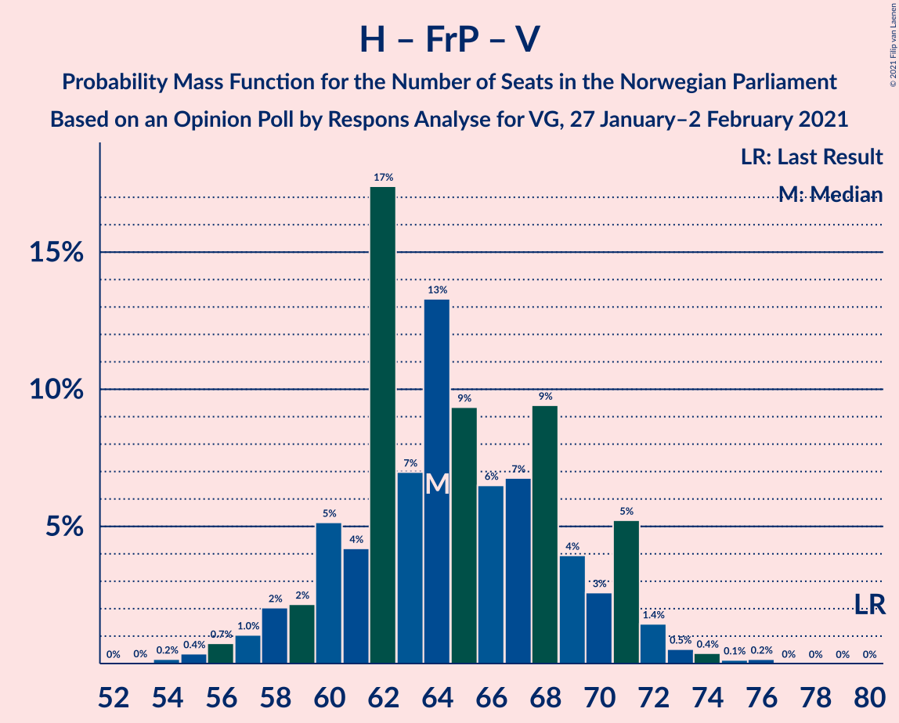

| Number of Seats | Probability | Accumulated | Special Marks |
|:---------------:|:-----------:|:-----------:|:-------------:|
| 54 | 0.2% | 100% |  |
| 55 | 0.4% | 99.8% |  |
| 56 | 0.7% | 99.4% |  |
| 57 | 1.0% | 98.7% |  |
| 58 | 2% | 98% |  |
| 59 | 2% | 96% |  |
| 60 | 5% | 93% |  |
| 61 | 4% | 88% |  |
| 62 | 17% | 84% |  |
| 63 | 7% | 67% |  |
| 64 | 13% | 60% |  |
| 65 | 9% | 46% | Median |
| 66 | 6% | 37% |  |
| 67 | 7% | 31% |  |
| 68 | 9% | 24% |  |
| 69 | 4% | 14% |  |
| 70 | 3% | 10% |  |
| 71 | 5% | 8% |  |
| 72 | 1.4% | 3% |  |
| 73 | 0.5% | 1.2% |  |
| 74 | 0.4% | 0.7% |  |
| 75 | 0.1% | 0.3% |  |
| 76 | 0.2% | 0.2% |  |
| 77 | 0% | 0% |  |
| 78 | 0% | 0% |  |
| 79 | 0% | 0% |  |
| 80 | 0% | 0% | Last Result |

### Høyre – Fremskrittspartiet

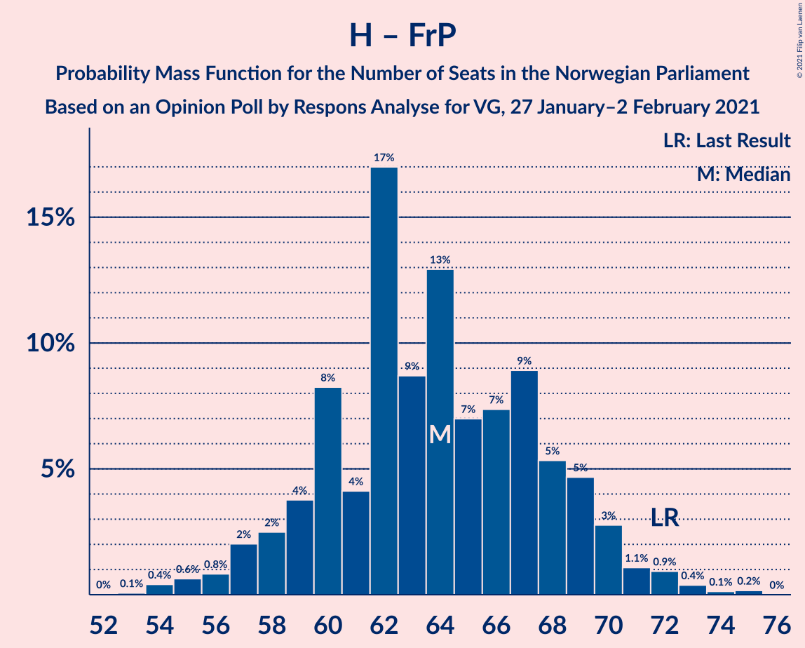

| Number of Seats | Probability | Accumulated | Special Marks |
|:---------------:|:-----------:|:-----------:|:-------------:|
| 53 | 0.1% | 100% |  |
| 54 | 0.4% | 99.9% |  |
| 55 | 0.6% | 99.5% |  |
| 56 | 0.8% | 98.9% |  |
| 57 | 2% | 98% |  |
| 58 | 2% | 96% |  |
| 59 | 4% | 94% |  |
| 60 | 8% | 90% |  |
| 61 | 4% | 82% |  |
| 62 | 17% | 77% |  |
| 63 | 9% | 60% |  |
| 64 | 13% | 52% | Median |
| 65 | 7% | 39% |  |
| 66 | 7% | 32% |  |
| 67 | 9% | 24% |  |
| 68 | 5% | 15% |  |
| 69 | 5% | 10% |  |
| 70 | 3% | 5% |  |
| 71 | 1.1% | 3% |  |
| 72 | 0.9% | 2% | Last Result |
| 73 | 0.4% | 0.7% |  |
| 74 | 0.1% | 0.3% |  |
| 75 | 0.2% | 0.2% |  |
| 76 | 0% | 0% |  |

### Arbeiderpartiet – Sosialistisk Venstreparti

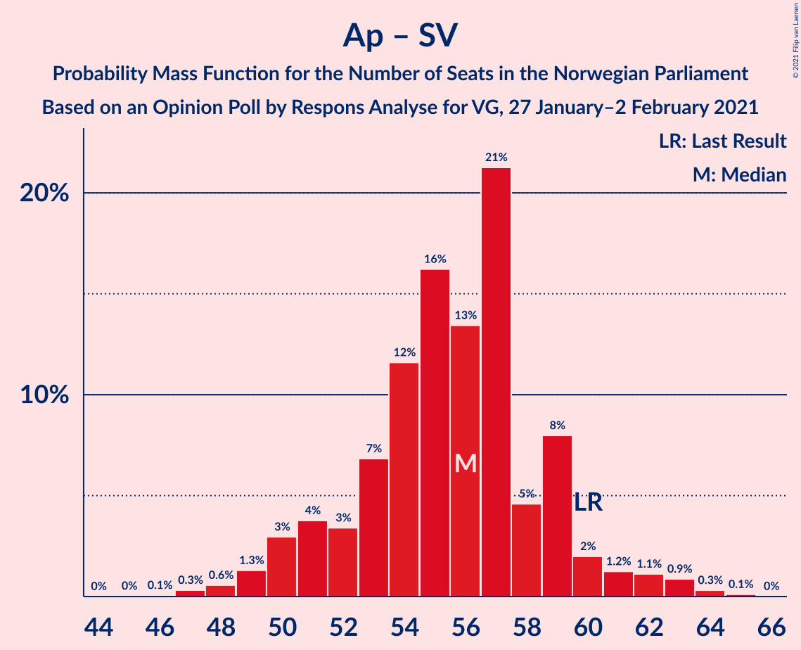

| Number of Seats | Probability | Accumulated | Special Marks |
|:---------------:|:-----------:|:-----------:|:-------------:|
| 46 | 0.1% | 100% |  |
| 47 | 0.3% | 99.9% |  |
| 48 | 0.6% | 99.6% |  |
| 49 | 1.3% | 99.0% |  |
| 50 | 3% | 98% |  |
| 51 | 4% | 95% |  |
| 52 | 3% | 91% |  |
| 53 | 7% | 88% |  |
| 54 | 12% | 81% |  |
| 55 | 16% | 69% |  |
| 56 | 13% | 53% | Median |
| 57 | 21% | 40% |  |
| 58 | 5% | 18% |  |
| 59 | 8% | 14% |  |
| 60 | 2% | 6% | Last Result |
| 61 | 1.2% | 4% |  |
| 62 | 1.1% | 2% |  |
| 63 | 0.9% | 1.3% |  |
| 64 | 0.3% | 0.5% |  |
| 65 | 0.1% | 0.1% |  |
| 66 | 0% | 0% |  |

### Høyre – Kristelig Folkeparti – Venstre

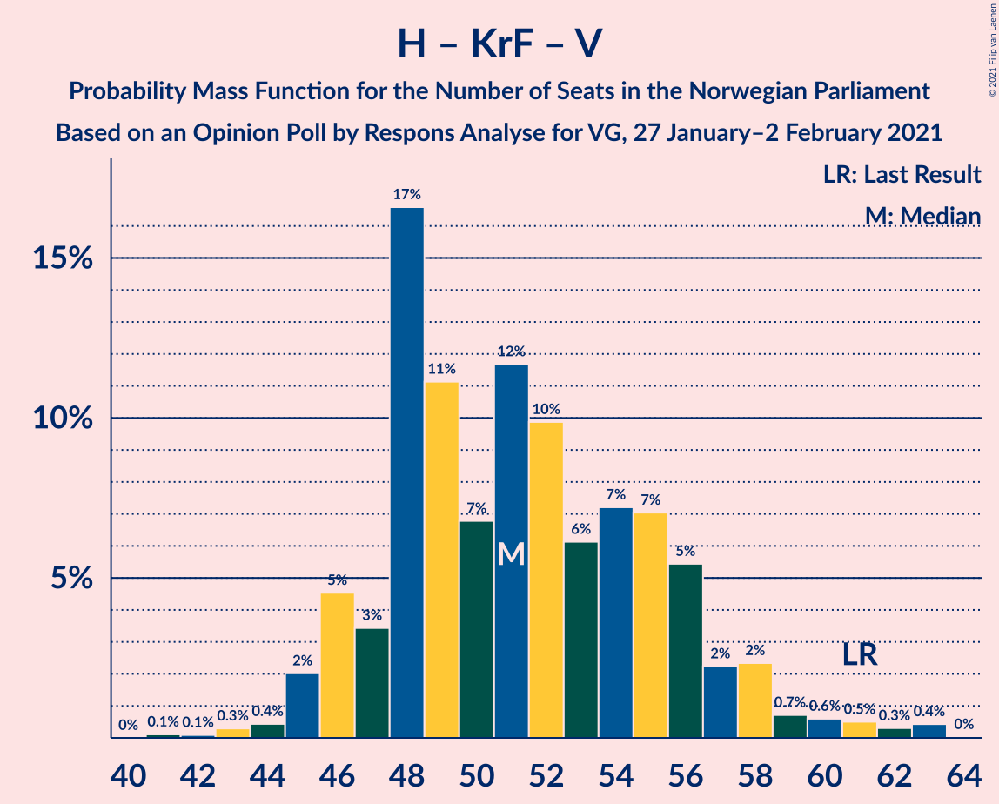

| Number of Seats | Probability | Accumulated | Special Marks |
|:---------------:|:-----------:|:-----------:|:-------------:|
| 41 | 0.1% | 100% |  |
| 42 | 0.1% | 99.9% |  |
| 43 | 0.3% | 99.8% |  |
| 44 | 0.4% | 99.5% |  |
| 45 | 2% | 99.1% |  |
| 46 | 5% | 97% |  |
| 47 | 3% | 93% |  |
| 48 | 17% | 89% |  |
| 49 | 11% | 72% |  |
| 50 | 7% | 61% |  |
| 51 | 12% | 55% | Median |
| 52 | 10% | 43% |  |
| 53 | 6% | 33% |  |
| 54 | 7% | 27% |  |
| 55 | 7% | 20% |  |
| 56 | 5% | 13% |  |
| 57 | 2% | 7% |  |
| 58 | 2% | 5% |  |
| 59 | 0.7% | 3% |  |
| 60 | 0.6% | 2% |  |
| 61 | 0.5% | 1.3% | Last Result |
| 62 | 0.3% | 0.8% |  |
| 63 | 0.4% | 0.5% |  |
| 64 | 0% | 0% |  |

### Senterpartiet – Kristelig Folkeparti – Venstre

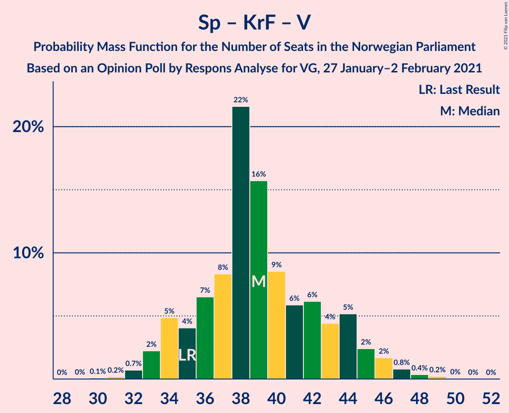

| Number of Seats | Probability | Accumulated | Special Marks |
|:---------------:|:-----------:|:-----------:|:-------------:|
| 30 | 0.1% | 100% |  |
| 31 | 0.2% | 99.9% |  |
| 32 | 0.7% | 99.7% |  |
| 33 | 2% | 99.0% |  |
| 34 | 5% | 97% |  |
| 35 | 4% | 92% | Last Result |
| 36 | 7% | 88% |  |
| 37 | 8% | 81% |  |
| 38 | 22% | 73% |  |
| 39 | 16% | 51% | Median |
| 40 | 9% | 36% |  |
| 41 | 6% | 27% |  |
| 42 | 6% | 21% |  |
| 43 | 4% | 15% |  |
| 44 | 5% | 11% |  |
| 45 | 2% | 6% |  |
| 46 | 2% | 3% |  |
| 47 | 0.8% | 1.4% |  |
| 48 | 0.4% | 0.6% |  |
| 49 | 0.2% | 0.3% |  |
| 50 | 0% | 0.1% |  |
| 51 | 0% | 0% |  |

## Technical Information

### Opinion Poll

+ **Polling firm:** Respons Analyse
+ **Commissioner(s):** VG
+ **Fieldwork period:** 27 January–2 February 2021

### Calculations

+ **Sample size:** 1000
+ **Simulations done:** 1,048,576
+ **Error estimate:** 0.69%

