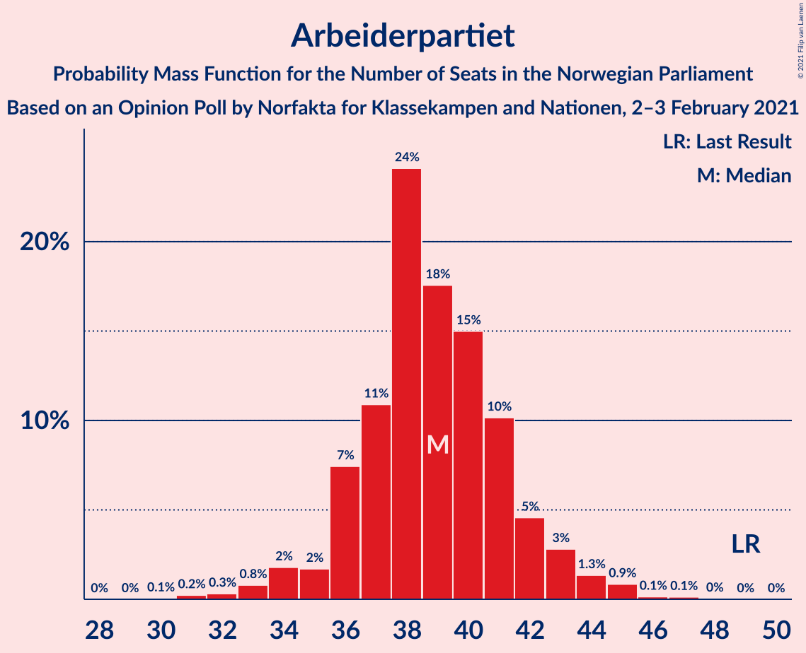
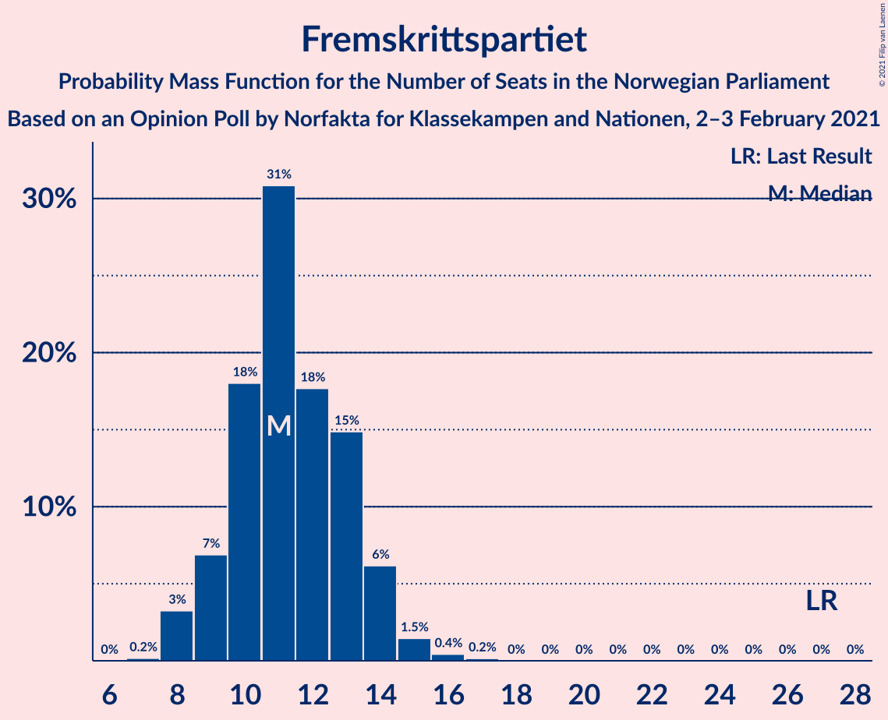
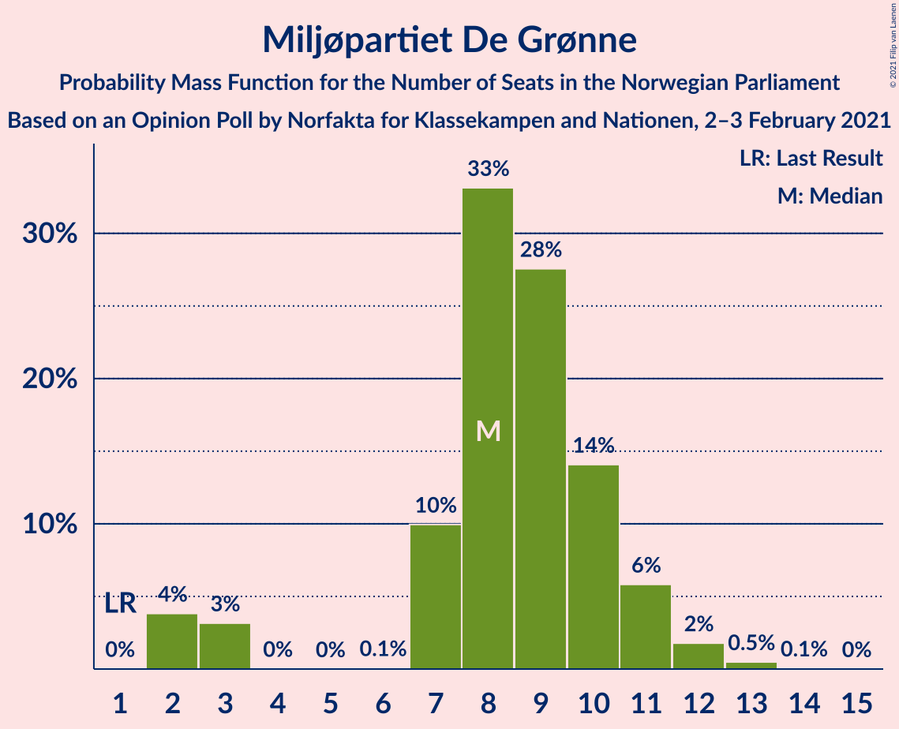
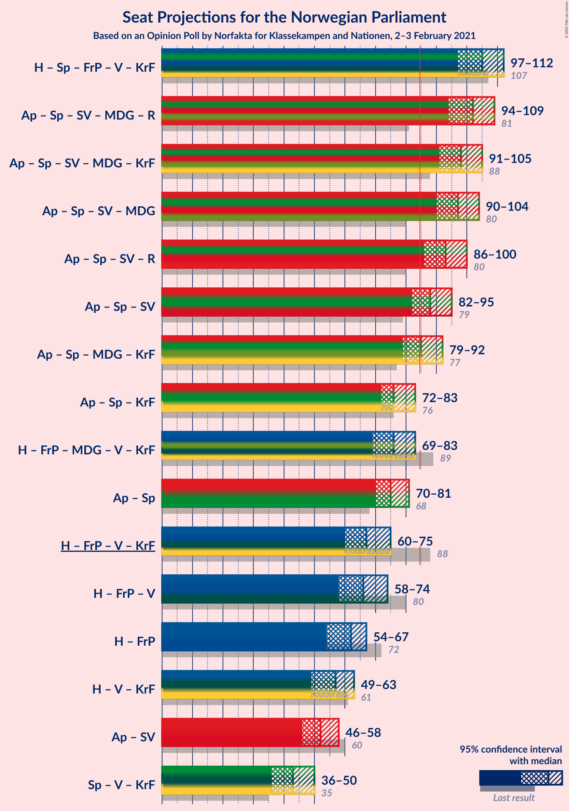
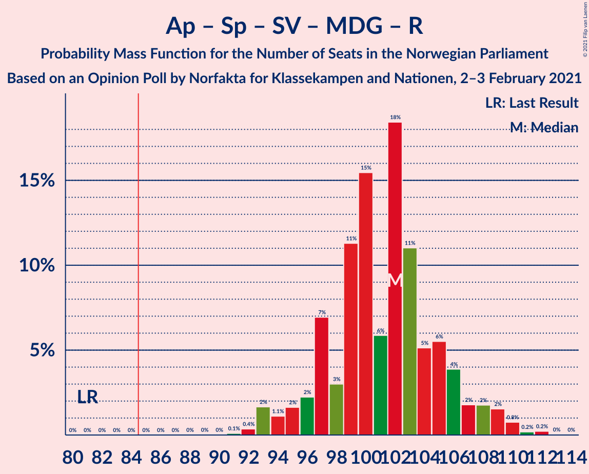
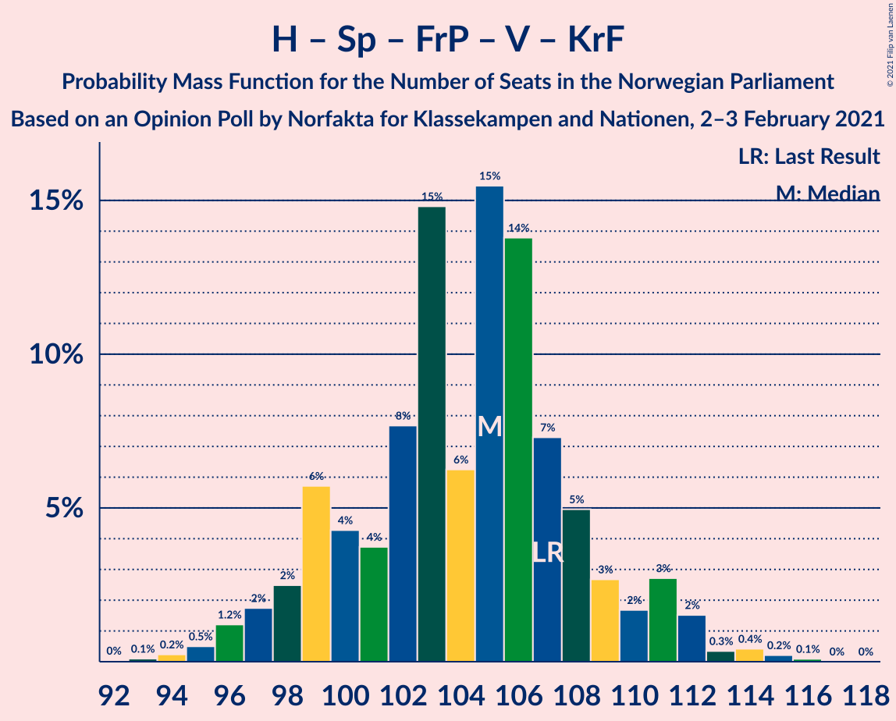
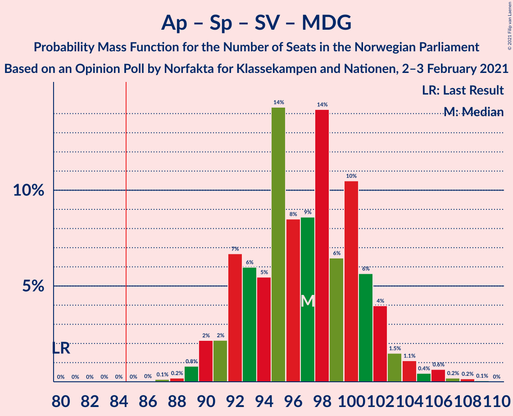
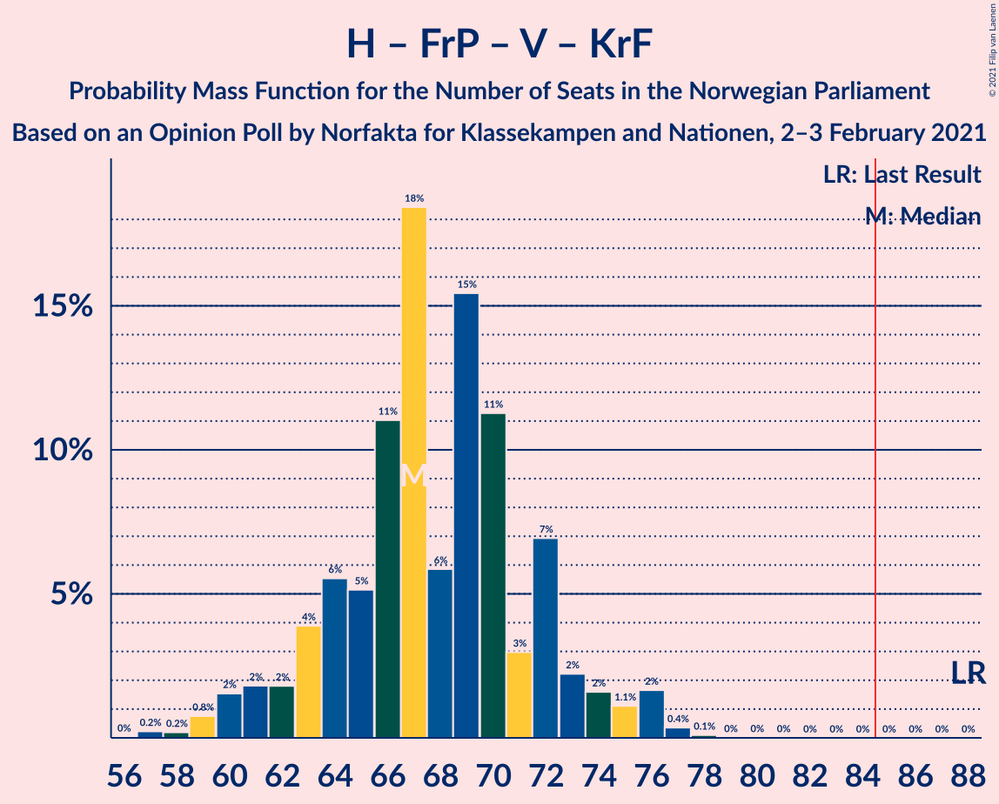
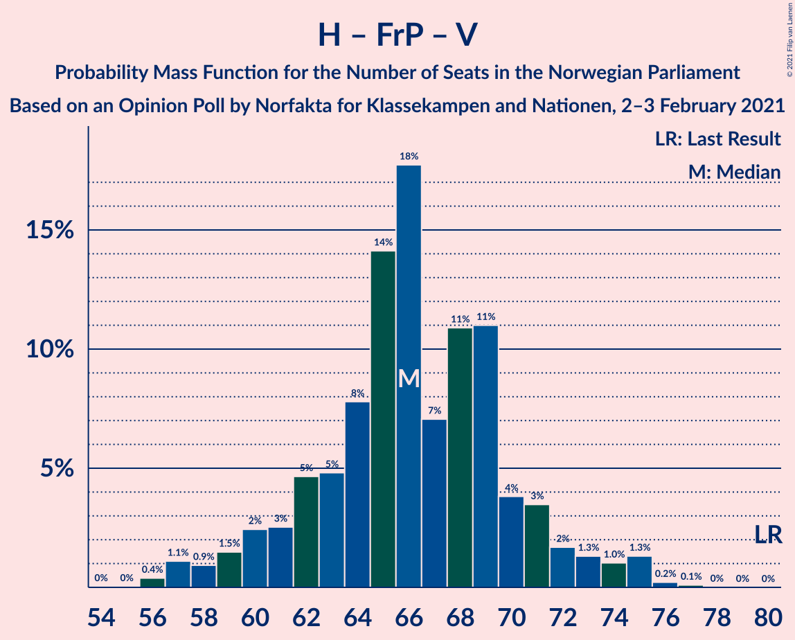
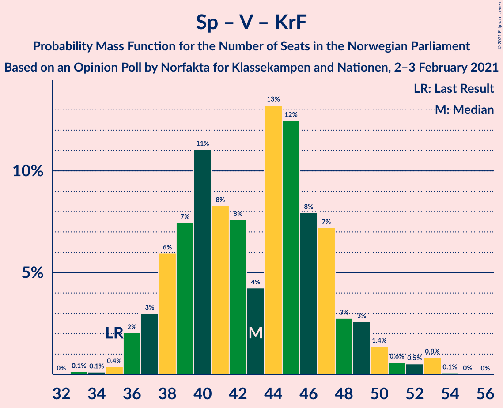

# Opinion Poll by Norfakta for Klassekampen and Nationen, 2–3 February 2021

<a href="#voting-intentions">Voting Intentions</a> | <a href="#seats">Seats</a> | <a href="#coalitions">Coalitions</a> | <a href="#technical-information">Technical Information</a>

## Voting Intentions

### Confidence Intervals

| Party | Last Result | Poll Result | 80% Confidence Interval | 90% Confidence Interval | 95% Confidence Interval | 99% Confidence Interval |
|:-----:|:-----------:|:-----------:|:-----------------------:|:-----------------------:|:-----------------------:|:-----------------------:|
| Høyre | 25.0% | 27.3% | 25.5–29.2% |25.0–29.7% |24.6–30.1% |23.8–31.1% |
| Arbeiderpartiet | 27.4% | 21.3% | 19.7–23.0% |19.3–23.5% |18.9–24.0% |18.1–24.8% |
| Senterpartiet | 10.3% | 19.7% | 18.2–21.4% |17.7–21.9% |17.3–22.3% |16.6–23.1% |
| Sosialistisk Venstreparti | 6.0% | 7.5% | 6.5–8.7% |6.2–9.0% |6.0–9.3% |5.6–9.9% |
| Fremskrittspartiet | 15.2% | 6.4% | 5.5–7.5% |5.3–7.8% |5.0–8.1% |4.6–8.7% |
| Miljøpartiet De Grønne | 3.2% | 5.0% | 4.2–6.0% |4.0–6.3% |3.8–6.5% |3.5–7.1% |
| Venstre | 4.4% | 4.0% | 3.3–4.9% |3.1–5.2% |2.9–5.4% |2.7–5.9% |
| Rødt | 2.4% | 3.8% | 3.1–4.7% |2.9–5.0% |2.8–5.2% |2.5–5.6% |
| Kristelig Folkeparti | 4.2% | 2.7% | 2.1–3.5% |2.0–3.7% |1.9–3.9% |1.6–4.3% |

*Note:* The poll result column reflects the actual value used in the calculations. Published results may vary slightly, and in addition be rounded to fewer digits.

## Seats

### Confidence Intervals

| Party | Last Result | Median | 80% Confidence Interval | 90% Confidence Interval | 95% Confidence Interval | 99% Confidence Interval |
|:-----:|:-----------:|:------:|:-----------------------:|:-----------------------:|:-----------------------:|:-----------------------:|
| <a href="#høyre">Høyre</a> | 45 | 50 | 45–54 |45–56 |44–56 |42–56 |
| <a href="#arbeiderpartiet">Arbeiderpartiet</a> | 49 | 39 | 37–41 |37–43 |35–43 |31–45 |
| <a href="#senterpartiet">Senterpartiet</a> | 19 | 36 | 35–40 |33–40 |33–41 |32–42 |
| <a href="#sosialistisk-venstreparti">Sosialistisk Venstreparti</a> | 11 | 13 | 11–15 |11–16 |11–17 |10–18 |
| <a href="#fremskrittspartiet">Fremskrittspartiet</a> | 27 | 11 | 10–14 |9–14 |9–14 |8–16 |
| <a href="#miljøpartiet-de-grønne">Miljøpartiet De Grønne</a> | 1 | 9 | 7–10 |3–10 |2–11 |2–12 |
| <a href="#venstre">Venstre</a> | 8 | 2 | 2–8 |2–8 |2–9 |2–10 |
| <a href="#rødt">Rødt</a> | 1 | 2 | 2–8 |2–8 |2–9 |1–10 |
| <a href="#kristelig-folkeparti">Kristelig Folkeparti</a> | 8 | 2 | 0–3 |0–3 |0–3 |0–7 |

### Høyre

*For a full overview of the results for this party, see the [Høyre](party-høyre.html) page.*

| Number of Seats | Probability | Accumulated | Special Marks |
|:---------------:|:-----------:|:-----------:|:-------------:|
| 40 | 0.1% | 100% |  |
| 41 | 0.2% | 99.9% |  |
| 42 | 0.7% | 99.7% |  |
| 43 | 0.6% | 99.1% |  |
| 44 | 2% | 98.5% |  |
| 45 | 7% | 97% | Last Result |
| 46 | 2% | 90% |  |
| 47 | 3% | 88% |  |
| 48 | 8% | 85% |  |
| 49 | 2% | 76% |  |
| 50 | 45% | 75% | Median |
| 51 | 9% | 30% |  |
| 52 | 7% | 21% |  |
| 53 | 2% | 14% |  |
| 54 | 4% | 12% |  |
| 55 | 0.5% | 8% |  |
| 56 | 7% | 8% |  |
| 57 | 0.1% | 0.2% |  |
| 58 | 0.1% | 0.1% |  |
| 59 | 0% | 0% |  |

### Arbeiderpartiet

*For a full overview of the results for this party, see the [Arbeiderpartiet](party-arbeiderpartiet.html) page.*

| Number of Seats | Probability | Accumulated | Special Marks |
|:---------------:|:-----------:|:-----------:|:-------------:|
| 31 | 0.5% | 100% |  |
| 32 | 0.1% | 99.4% |  |
| 33 | 0.4% | 99.3% |  |
| 34 | 1.3% | 98.9% |  |
| 35 | 0.7% | 98% |  |
| 36 | 0.8% | 97% |  |
| 37 | 16% | 96% |  |
| 38 | 27% | 80% |  |
| 39 | 6% | 53% | Median |
| 40 | 29% | 47% |  |
| 41 | 9% | 18% |  |
| 42 | 2% | 9% |  |
| 43 | 5% | 7% |  |
| 44 | 1.4% | 2% |  |
| 45 | 0.1% | 0.6% |  |
| 46 | 0% | 0.5% |  |
| 47 | 0.4% | 0.4% |  |
| 48 | 0.1% | 0.1% |  |
| 49 | 0% | 0% | Last Result |

### Senterpartiet

*For a full overview of the results for this party, see the [Senterpartiet](party-senterpartiet.html) page.*

| Number of Seats | Probability | Accumulated | Special Marks |
|:---------------:|:-----------:|:-----------:|:-------------:|
| 19 | 0% | 100% | Last Result |
| 20 | 0% | 100% |  |
| 21 | 0% | 100% |  |
| 22 | 0% | 100% |  |
| 23 | 0% | 100% |  |
| 24 | 0% | 100% |  |
| 25 | 0% | 100% |  |
| 26 | 0% | 100% |  |
| 27 | 0% | 100% |  |
| 28 | 0% | 100% |  |
| 29 | 0.1% | 100% |  |
| 30 | 0.1% | 99.9% |  |
| 31 | 0.2% | 99.8% |  |
| 32 | 0.1% | 99.6% |  |
| 33 | 5% | 99.5% |  |
| 34 | 3% | 95% |  |
| 35 | 25% | 92% |  |
| 36 | 38% | 67% | Median |
| 37 | 6% | 28% |  |
| 38 | 11% | 23% |  |
| 39 | 1.3% | 12% |  |
| 40 | 8% | 11% |  |
| 41 | 2% | 3% |  |
| 42 | 1.1% | 1.5% |  |
| 43 | 0.3% | 0.4% |  |
| 44 | 0.1% | 0.1% |  |
| 45 | 0% | 0% |  |

### Sosialistisk Venstreparti

*For a full overview of the results for this party, see the [Sosialistisk Venstreparti](party-sosialistiskvenstreparti.html) page.*

| Number of Seats | Probability | Accumulated | Special Marks |
|:---------------:|:-----------:|:-----------:|:-------------:|
| 8 | 0.1% | 100% |  |
| 9 | 0.2% | 99.9% |  |
| 10 | 0.9% | 99.7% |  |
| 11 | 19% | 98.7% | Last Result |
| 12 | 14% | 80% |  |
| 13 | 20% | 66% | Median |
| 14 | 18% | 46% |  |
| 15 | 22% | 28% |  |
| 16 | 3% | 6% |  |
| 17 | 3% | 3% |  |
| 18 | 0.4% | 0.5% |  |
| 19 | 0.1% | 0.2% |  |
| 20 | 0% | 0% |  |

### Fremskrittspartiet

*For a full overview of the results for this party, see the [Fremskrittspartiet](party-fremskrittspartiet.html) page.*

| Number of Seats | Probability | Accumulated | Special Marks |
|:---------------:|:-----------:|:-----------:|:-------------:|
| 7 | 0.2% | 100% |  |
| 8 | 2% | 99.7% |  |
| 9 | 4% | 98% |  |
| 10 | 17% | 94% |  |
| 11 | 29% | 77% | Median |
| 12 | 8% | 47% |  |
| 13 | 24% | 39% |  |
| 14 | 13% | 15% |  |
| 15 | 0.7% | 1.3% |  |
| 16 | 0.5% | 0.6% |  |
| 17 | 0.1% | 0.1% |  |
| 18 | 0% | 0% |  |
| 19 | 0% | 0% |  |
| 20 | 0% | 0% |  |
| 21 | 0% | 0% |  |
| 22 | 0% | 0% |  |
| 23 | 0% | 0% |  |
| 24 | 0% | 0% |  |
| 25 | 0% | 0% |  |
| 26 | 0% | 0% |  |
| 27 | 0% | 0% | Last Result |

### Miljøpartiet De Grønne

*For a full overview of the results for this party, see the [Miljøpartiet De Grønne](party-miljøpartietdegrønne.html) page.*

| Number of Seats | Probability | Accumulated | Special Marks |
|:---------------:|:-----------:|:-----------:|:-------------:|
| 1 | 0% | 100% | Last Result |
| 2 | 4% | 100% |  |
| 3 | 4% | 96% |  |
| 4 | 0% | 92% |  |
| 5 | 0% | 92% |  |
| 6 | 0% | 92% |  |
| 7 | 4% | 92% |  |
| 8 | 6% | 88% |  |
| 9 | 51% | 82% | Median |
| 10 | 27% | 30% |  |
| 11 | 2% | 4% |  |
| 12 | 2% | 2% |  |
| 13 | 0.1% | 0.2% |  |
| 14 | 0% | 0% |  |

### Venstre

*For a full overview of the results for this party, see the [Venstre](party-venstre.html) page.*

| Number of Seats | Probability | Accumulated | Special Marks |
|:---------------:|:-----------:|:-----------:|:-------------:|
| 2 | 55% | 100% | Median |
| 3 | 1.0% | 45% |  |
| 4 | 0% | 44% |  |
| 5 | 0% | 44% |  |
| 6 | 3% | 44% |  |
| 7 | 7% | 42% |  |
| 8 | 30% | 35% | Last Result |
| 9 | 3% | 4% |  |
| 10 | 0.5% | 1.0% |  |
| 11 | 0.4% | 0.4% |  |
| 12 | 0% | 0% |  |

### Rødt

*For a full overview of the results for this party, see the [Rødt](party-rødt.html) page.*

| Number of Seats | Probability | Accumulated | Special Marks |
|:---------------:|:-----------:|:-----------:|:-------------:|
| 1 | 2% | 100% | Last Result |
| 2 | 69% | 98% | Median |
| 3 | 0% | 30% |  |
| 4 | 0% | 30% |  |
| 5 | 0% | 30% |  |
| 6 | 0.6% | 30% |  |
| 7 | 14% | 29% |  |
| 8 | 11% | 15% |  |
| 9 | 3% | 4% |  |
| 10 | 0.5% | 0.5% |  |
| 11 | 0% | 0% |  |

### Kristelig Folkeparti

*For a full overview of the results for this party, see the [Kristelig Folkeparti](party-kristeligfolkeparti.html) page.*

| Number of Seats | Probability | Accumulated | Special Marks |
|:---------------:|:-----------:|:-----------:|:-------------:|
| 0 | 15% | 100% |  |
| 1 | 29% | 85% |  |
| 2 | 31% | 56% | Median |
| 3 | 24% | 25% |  |
| 4 | 0% | 1.3% |  |
| 5 | 0% | 1.3% |  |
| 6 | 0.2% | 1.3% |  |
| 7 | 0.9% | 1.1% |  |
| 8 | 0.2% | 0.2% | Last Result |
| 9 | 0% | 0% |  |

## Coalitions

### Confidence Intervals

| Coalition | Last Result | Median | Majority? | 80% Confidence Interval | 90% Confidence Interval | 95% Confidence Interval | 99% Confidence Interval |
|:---------:|:-----------:|:------:|:---------:|:-----------------------:|:-----------------------:|:-----------------------:|:-----------------------:|
| Arbeiderpartiet – Senterpartiet – Sosialistisk Venstreparti – Miljøpartiet De Grønne – Rødt | 81 | 102 | 100% | 97–104 | 97–107 | 97–109 | 93–110 |
| Høyre – Senterpartiet – Fremskrittspartiet – Venstre – Kristelig Folkeparti | 107 | 105 | 100% | 101–107 | 98–108 | 96–108 | 95–112 |
| Arbeiderpartiet – Senterpartiet – Sosialistisk Venstreparti – Miljøpartiet De Grønne – Kristelig Folkeparti | 88 | 99 | 100% | 94–102 | 94–103 | 93–104 | 90–109 |
| Arbeiderpartiet – Senterpartiet – Sosialistisk Venstreparti – Miljøpartiet De Grønne | 80 | 97 | 100% | 93–100 | 93–102 | 93–103 | 89–107 |
| Arbeiderpartiet – Senterpartiet – Sosialistisk Venstreparti – Rødt | 80 | 92 | 99.9% | 88–99 | 88–100 | 88–100 | 86–102 |
| Arbeiderpartiet – Senterpartiet – Sosialistisk Venstreparti | 79 | 89 | 88% | 84–92 | 84–93 | 84–93 | 80–98 |
| Arbeiderpartiet – Senterpartiet – Miljøpartiet De Grønne – Kristelig Folkeparti | 77 | 86 | 75% | 83–89 | 82–90 | 81–91 | 78–95 |
| Arbeiderpartiet – Senterpartiet – Kristelig Folkeparti | 76 | 76 | 1.1% | 74–81 | 74–83 | 73–83 | 70–86 |
| Arbeiderpartiet – Senterpartiet | 68 | 76 | 0.1% | 73–79 | 73–81 | 72–81 | 68–84 |
| Høyre – Fremskrittspartiet – Miljøpartiet De Grønne – Venstre – Kristelig Folkeparti | 89 | 77 | 0.1% | 70–81 | 69–81 | 69–81 | 67–83 |
| Høyre – Fremskrittspartiet – Venstre – Kristelig Folkeparti | 88 | 67 | 0% | 65–72 | 62–72 | 60–72 | 59–76 |
| Høyre – Fremskrittspartiet – Venstre | 80 | 67 | 0% | 64–69 | 60–69 | 58–70 | 57–73 |
| Høyre – Fremskrittspartiet | 72 | 62 | 0% | 57–65 | 56–67 | 55–67 | 52–68 |
| Høyre – Venstre – Kristelig Folkeparti | 61 | 56 | 0% | 53–61 | 50–61 | 49–61 | 48–65 |
| Arbeiderpartiet – Sosialistisk Venstreparti | 60 | 52 | 0% | 48–55 | 48–56 | 48–57 | 44–60 |
| Senterpartiet – Venstre – Kristelig Folkeparti | 35 | 42 | 0% | 38–46 | 38–49 | 38–49 | 37–51 |

### Arbeiderpartiet – Senterpartiet – Sosialistisk Venstreparti – Miljøpartiet De Grønne – Rødt

| Number of Seats | Probability | Accumulated | Special Marks |
|:---------------:|:-----------:|:-----------:|:-------------:|
| 81 | 0% | 100% | Last Result |
| 82 | 0% | 100% |  |
| 83 | 0% | 100% |  |
| 84 | 0% | 100% |  |
| 85 | 0% | 100% | Majority |
| 86 | 0% | 100% |  |
| 87 | 0% | 100% |  |
| 88 | 0% | 100% |  |
| 89 | 0.1% | 100% |  |
| 90 | 0% | 99.9% |  |
| 91 | 0% | 99.9% |  |
| 92 | 0.1% | 99.9% |  |
| 93 | 0.4% | 99.8% |  |
| 94 | 0.4% | 99.5% |  |
| 95 | 0.2% | 99.1% |  |
| 96 | 0.6% | 98.9% |  |
| 97 | 15% | 98% |  |
| 98 | 1.2% | 83% |  |
| 99 | 12% | 82% | Median |
| 100 | 12% | 70% |  |
| 101 | 6% | 58% |  |
| 102 | 36% | 52% |  |
| 103 | 4% | 16% |  |
| 104 | 4% | 12% |  |
| 105 | 1.3% | 8% |  |
| 106 | 0.8% | 7% |  |
| 107 | 2% | 6% |  |
| 108 | 1.2% | 5% |  |
| 109 | 1.3% | 3% |  |
| 110 | 2% | 2% |  |
| 111 | 0.1% | 0.1% |  |
| 112 | 0% | 0% |  |

### Høyre – Senterpartiet – Fremskrittspartiet – Venstre – Kristelig Folkeparti

| Number of Seats | Probability | Accumulated | Special Marks |
|:---------------:|:-----------:|:-----------:|:-------------:|
| 93 | 0.1% | 100% |  |
| 94 | 0.1% | 99.9% |  |
| 95 | 0.5% | 99.8% |  |
| 96 | 3% | 99.3% |  |
| 97 | 0.8% | 96% |  |
| 98 | 0.8% | 96% |  |
| 99 | 1.2% | 95% |  |
| 100 | 1.4% | 93% |  |
| 101 | 4% | 92% | Median |
| 102 | 1.2% | 88% |  |
| 103 | 25% | 87% |  |
| 104 | 6% | 62% |  |
| 105 | 27% | 56% |  |
| 106 | 6% | 29% |  |
| 107 | 16% | 24% | Last Result |
| 108 | 5% | 7% |  |
| 109 | 0.3% | 2% |  |
| 110 | 0.7% | 2% |  |
| 111 | 0.2% | 1.2% |  |
| 112 | 0.7% | 1.0% |  |
| 113 | 0.1% | 0.3% |  |
| 114 | 0.1% | 0.2% |  |
| 115 | 0% | 0.1% |  |
| 116 | 0.1% | 0.1% |  |
| 117 | 0% | 0% |  |

### Arbeiderpartiet – Senterpartiet – Sosialistisk Venstreparti – Miljøpartiet De Grønne – Kristelig Folkeparti

| Number of Seats | Probability | Accumulated | Special Marks |
|:---------------:|:-----------:|:-----------:|:-------------:|
| 88 | 0% | 100% | Last Result |
| 89 | 0.1% | 100% |  |
| 90 | 0.7% | 99.9% |  |
| 91 | 0.2% | 99.1% |  |
| 92 | 0.3% | 99.0% |  |
| 93 | 2% | 98.7% |  |
| 94 | 10% | 97% |  |
| 95 | 2% | 87% |  |
| 96 | 4% | 85% |  |
| 97 | 7% | 81% |  |
| 98 | 24% | 75% |  |
| 99 | 1.0% | 50% | Median |
| 100 | 17% | 49% |  |
| 101 | 2% | 32% |  |
| 102 | 20% | 30% |  |
| 103 | 5% | 10% |  |
| 104 | 2% | 5% |  |
| 105 | 0.2% | 2% |  |
| 106 | 1.0% | 2% |  |
| 107 | 0.4% | 1.0% |  |
| 108 | 0% | 0.5% |  |
| 109 | 0.4% | 0.5% |  |
| 110 | 0% | 0.1% |  |
| 111 | 0.1% | 0.1% |  |
| 112 | 0% | 0% |  |

### Arbeiderpartiet – Senterpartiet – Sosialistisk Venstreparti – Miljøpartiet De Grønne

| Number of Seats | Probability | Accumulated | Special Marks |
|:---------------:|:-----------:|:-----------:|:-------------:|
| 80 | 0% | 100% | Last Result |
| 81 | 0% | 100% |  |
| 82 | 0% | 100% |  |
| 83 | 0% | 100% |  |
| 84 | 0% | 100% |  |
| 85 | 0% | 100% | Majority |
| 86 | 0% | 100% |  |
| 87 | 0.3% | 100% |  |
| 88 | 0% | 99.6% |  |
| 89 | 0.5% | 99.6% |  |
| 90 | 0.3% | 99.1% |  |
| 91 | 0.7% | 98.8% |  |
| 92 | 0.5% | 98% |  |
| 93 | 13% | 98% |  |
| 94 | 3% | 85% |  |
| 95 | 22% | 82% |  |
| 96 | 2% | 61% |  |
| 97 | 12% | 59% | Median |
| 98 | 1.4% | 47% |  |
| 99 | 6% | 46% |  |
| 100 | 32% | 40% |  |
| 101 | 1.4% | 8% |  |
| 102 | 4% | 6% |  |
| 103 | 2% | 3% |  |
| 104 | 0.3% | 1.1% |  |
| 105 | 0.3% | 0.9% |  |
| 106 | 0% | 0.5% |  |
| 107 | 0.2% | 0.5% |  |
| 108 | 0.3% | 0.3% |  |
| 109 | 0% | 0% |  |

### Arbeiderpartiet – Senterpartiet – Sosialistisk Venstreparti – Rødt

| Number of Seats | Probability | Accumulated | Special Marks |
|:---------------:|:-----------:|:-----------:|:-------------:|
| 80 | 0% | 100% | Last Result |
| 81 | 0% | 100% |  |
| 82 | 0% | 100% |  |
| 83 | 0% | 99.9% |  |
| 84 | 0% | 99.9% |  |
| 85 | 0.2% | 99.9% | Majority |
| 86 | 0.6% | 99.6% |  |
| 87 | 0.6% | 99.0% |  |
| 88 | 14% | 98% |  |
| 89 | 13% | 85% |  |
| 90 | 3% | 72% | Median |
| 91 | 12% | 70% |  |
| 92 | 15% | 58% |  |
| 93 | 20% | 43% |  |
| 94 | 2% | 23% |  |
| 95 | 5% | 21% |  |
| 96 | 2% | 15% |  |
| 97 | 0.7% | 13% |  |
| 98 | 2% | 13% |  |
| 99 | 2% | 10% |  |
| 100 | 5% | 8% |  |
| 101 | 2% | 2% |  |
| 102 | 0.4% | 0.5% |  |
| 103 | 0% | 0.1% |  |
| 104 | 0.1% | 0.1% |  |
| 105 | 0% | 0% |  |

### Arbeiderpartiet – Senterpartiet – Sosialistisk Venstreparti

| Number of Seats | Probability | Accumulated | Special Marks |
|:---------------:|:-----------:|:-----------:|:-------------:|
| 79 | 0.3% | 100% | Last Result |
| 80 | 0.3% | 99.7% |  |
| 81 | 0.1% | 99.4% |  |
| 82 | 0.4% | 99.3% |  |
| 83 | 0.6% | 98.8% |  |
| 84 | 10% | 98% |  |
| 85 | 1.1% | 88% | Majority |
| 86 | 16% | 87% |  |
| 87 | 15% | 71% |  |
| 88 | 3% | 56% | Median |
| 89 | 5% | 54% |  |
| 90 | 15% | 49% |  |
| 91 | 21% | 34% |  |
| 92 | 4% | 13% |  |
| 93 | 6% | 9% |  |
| 94 | 0.6% | 2% |  |
| 95 | 0.1% | 2% |  |
| 96 | 0.5% | 2% |  |
| 97 | 0.2% | 1.1% |  |
| 98 | 0.4% | 0.8% |  |
| 99 | 0% | 0.4% |  |
| 100 | 0.4% | 0.4% |  |
| 101 | 0% | 0% |  |

### Arbeiderpartiet – Senterpartiet – Miljøpartiet De Grønne – Kristelig Folkeparti

| Number of Seats | Probability | Accumulated | Special Marks |
|:---------------:|:-----------:|:-----------:|:-------------:|
| 75 | 0% | 100% |  |
| 76 | 0.1% | 99.9% |  |
| 77 | 0.1% | 99.8% | Last Result |
| 78 | 0.4% | 99.7% |  |
| 79 | 0.5% | 99.4% |  |
| 80 | 0.7% | 98.9% |  |
| 81 | 3% | 98% |  |
| 82 | 2% | 95% |  |
| 83 | 14% | 93% |  |
| 84 | 5% | 79% |  |
| 85 | 16% | 75% | Majority |
| 86 | 22% | 59% | Median |
| 87 | 23% | 36% |  |
| 88 | 1.0% | 14% |  |
| 89 | 5% | 13% |  |
| 90 | 5% | 8% |  |
| 91 | 0.4% | 3% |  |
| 92 | 1.0% | 2% |  |
| 93 | 0.3% | 1.2% |  |
| 94 | 0.2% | 1.0% |  |
| 95 | 0.7% | 0.8% |  |
| 96 | 0% | 0.1% |  |
| 97 | 0.1% | 0.1% |  |
| 98 | 0% | 0% |  |

### Arbeiderpartiet – Senterpartiet – Kristelig Folkeparti

| Number of Seats | Probability | Accumulated | Special Marks |
|:---------------:|:-----------:|:-----------:|:-------------:|
| 68 | 0.1% | 100% |  |
| 69 | 0.3% | 99.9% |  |
| 70 | 0.4% | 99.6% |  |
| 71 | 0.6% | 99.2% |  |
| 72 | 0.3% | 98.6% |  |
| 73 | 2% | 98% |  |
| 74 | 14% | 97% |  |
| 75 | 2% | 83% |  |
| 76 | 33% | 80% | Last Result |
| 77 | 5% | 47% | Median |
| 78 | 21% | 42% |  |
| 79 | 6% | 21% |  |
| 80 | 3% | 14% |  |
| 81 | 4% | 11% |  |
| 82 | 1.4% | 7% |  |
| 83 | 4% | 6% |  |
| 84 | 0.6% | 2% |  |
| 85 | 0.4% | 1.1% | Majority |
| 86 | 0.3% | 0.7% |  |
| 87 | 0.3% | 0.4% |  |
| 88 | 0.1% | 0.1% |  |
| 89 | 0% | 0% |  |

### Arbeiderpartiet – Senterpartiet

| Number of Seats | Probability | Accumulated | Special Marks |
|:---------------:|:-----------:|:-----------:|:-------------:|
| 67 | 0% | 100% |  |
| 68 | 0.8% | 99.9% | Last Result |
| 69 | 0.2% | 99.1% |  |
| 70 | 0.7% | 98.9% |  |
| 71 | 0.3% | 98% |  |
| 72 | 2% | 98% |  |
| 73 | 25% | 96% |  |
| 74 | 5% | 71% |  |
| 75 | 13% | 65% | Median |
| 76 | 33% | 52% |  |
| 77 | 5% | 19% |  |
| 78 | 4% | 14% |  |
| 79 | 4% | 10% |  |
| 80 | 0.7% | 6% |  |
| 81 | 3% | 5% |  |
| 82 | 0.5% | 2% |  |
| 83 | 0.6% | 1.1% |  |
| 84 | 0.4% | 0.5% |  |
| 85 | 0.1% | 0.1% | Majority |
| 86 | 0% | 0% |  |

### Høyre – Fremskrittspartiet – Miljøpartiet De Grønne – Venstre – Kristelig Folkeparti

| Number of Seats | Probability | Accumulated | Special Marks |
|:---------------:|:-----------:|:-----------:|:-------------:|
| 65 | 0.1% | 100% |  |
| 66 | 0% | 99.9% |  |
| 67 | 0.4% | 99.9% |  |
| 68 | 2% | 99.4% |  |
| 69 | 5% | 98% |  |
| 70 | 2% | 92% |  |
| 71 | 2% | 90% |  |
| 72 | 0.7% | 87% |  |
| 73 | 2% | 87% |  |
| 74 | 5% | 85% | Median |
| 75 | 2% | 79% |  |
| 76 | 20% | 77% |  |
| 77 | 15% | 57% |  |
| 78 | 12% | 42% |  |
| 79 | 3% | 30% |  |
| 80 | 13% | 28% |  |
| 81 | 14% | 15% |  |
| 82 | 0.6% | 2% |  |
| 83 | 0.6% | 1.0% |  |
| 84 | 0.2% | 0.4% |  |
| 85 | 0% | 0.1% | Majority |
| 86 | 0% | 0.1% |  |
| 87 | 0% | 0.1% |  |
| 88 | 0% | 0% |  |
| 89 | 0% | 0% | Last Result |

### Høyre – Fremskrittspartiet – Venstre – Kristelig Folkeparti

| Number of Seats | Probability | Accumulated | Special Marks |
|:---------------:|:-----------:|:-----------:|:-------------:|
| 57 | 0% | 100% |  |
| 58 | 0.1% | 99.9% |  |
| 59 | 2% | 99.9% |  |
| 60 | 1.3% | 98% |  |
| 61 | 1.2% | 97% |  |
| 62 | 2% | 95% |  |
| 63 | 0.8% | 94% |  |
| 64 | 1.3% | 93% |  |
| 65 | 4% | 92% | Median |
| 66 | 4% | 88% |  |
| 67 | 36% | 84% |  |
| 68 | 6% | 48% |  |
| 69 | 12% | 42% |  |
| 70 | 12% | 30% |  |
| 71 | 1.2% | 18% |  |
| 72 | 15% | 17% |  |
| 73 | 0.6% | 2% |  |
| 74 | 0.2% | 1.1% |  |
| 75 | 0.4% | 0.9% |  |
| 76 | 0.4% | 0.5% |  |
| 77 | 0.1% | 0.2% |  |
| 78 | 0% | 0.1% |  |
| 79 | 0% | 0.1% |  |
| 80 | 0.1% | 0.1% |  |
| 81 | 0% | 0% |  |
| 82 | 0% | 0% |  |
| 83 | 0% | 0% |  |
| 84 | 0% | 0% |  |
| 85 | 0% | 0% | Majority |
| 86 | 0% | 0% |  |
| 87 | 0% | 0% |  |
| 88 | 0% | 0% | Last Result |

### Høyre – Fremskrittspartiet – Venstre

| Number of Seats | Probability | Accumulated | Special Marks |
|:---------------:|:-----------:|:-----------:|:-------------:|
| 55 | 0% | 100% |  |
| 56 | 0.1% | 99.9% |  |
| 57 | 2% | 99.8% |  |
| 58 | 1.1% | 98% |  |
| 59 | 0.6% | 97% |  |
| 60 | 2% | 96% |  |
| 61 | 2% | 94% |  |
| 62 | 0.6% | 92% |  |
| 63 | 0.7% | 92% | Median |
| 64 | 10% | 91% |  |
| 65 | 23% | 81% |  |
| 66 | 3% | 58% |  |
| 67 | 17% | 55% |  |
| 68 | 10% | 38% |  |
| 69 | 23% | 28% |  |
| 70 | 3% | 5% |  |
| 71 | 0.3% | 2% |  |
| 72 | 0.6% | 1.2% |  |
| 73 | 0.3% | 0.6% |  |
| 74 | 0.1% | 0.3% |  |
| 75 | 0.1% | 0.2% |  |
| 76 | 0% | 0.1% |  |
| 77 | 0.1% | 0.1% |  |
| 78 | 0% | 0% |  |
| 79 | 0% | 0% |  |
| 80 | 0% | 0% | Last Result |

### Høyre – Fremskrittspartiet

| Number of Seats | Probability | Accumulated | Special Marks |
|:---------------:|:-----------:|:-----------:|:-------------:|
| 51 | 0.1% | 100% |  |
| 52 | 0.5% | 99.9% |  |
| 53 | 0.5% | 99.5% |  |
| 54 | 0.5% | 99.0% |  |
| 55 | 2% | 98% |  |
| 56 | 2% | 96% |  |
| 57 | 7% | 95% |  |
| 58 | 4% | 88% |  |
| 59 | 5% | 84% |  |
| 60 | 10% | 79% |  |
| 61 | 16% | 68% | Median |
| 62 | 7% | 52% |  |
| 63 | 20% | 45% |  |
| 64 | 0.7% | 25% |  |
| 65 | 15% | 24% |  |
| 66 | 0.5% | 9% |  |
| 67 | 7% | 8% |  |
| 68 | 0.6% | 0.8% |  |
| 69 | 0.1% | 0.2% |  |
| 70 | 0.1% | 0.2% |  |
| 71 | 0% | 0.1% |  |
| 72 | 0% | 0% | Last Result |

### Høyre – Venstre – Kristelig Folkeparti

| Number of Seats | Probability | Accumulated | Special Marks |
|:---------------:|:-----------:|:-----------:|:-------------:|
| 45 | 0.1% | 100% |  |
| 46 | 0% | 99.9% |  |
| 47 | 0.2% | 99.9% |  |
| 48 | 0.3% | 99.8% |  |
| 49 | 3% | 99.4% |  |
| 50 | 1.4% | 96% |  |
| 51 | 0.4% | 95% |  |
| 52 | 2% | 94% |  |
| 53 | 12% | 93% |  |
| 54 | 25% | 81% | Median |
| 55 | 4% | 56% |  |
| 56 | 4% | 52% |  |
| 57 | 8% | 48% |  |
| 58 | 5% | 40% |  |
| 59 | 18% | 36% |  |
| 60 | 1.3% | 17% |  |
| 61 | 14% | 16% | Last Result |
| 62 | 0.3% | 2% |  |
| 63 | 0.8% | 2% |  |
| 64 | 0.4% | 0.9% |  |
| 65 | 0.2% | 0.5% |  |
| 66 | 0.4% | 0.4% |  |
| 67 | 0% | 0% |  |

### Arbeiderpartiet – Sosialistisk Venstreparti

| Number of Seats | Probability | Accumulated | Special Marks |
|:---------------:|:-----------:|:-----------:|:-------------:|
| 42 | 0.3% | 100% |  |
| 43 | 0.1% | 99.7% |  |
| 44 | 0.2% | 99.6% |  |
| 45 | 0.1% | 99.4% |  |
| 46 | 0.7% | 99.3% |  |
| 47 | 0.5% | 98.7% |  |
| 48 | 10% | 98% |  |
| 49 | 1.4% | 88% |  |
| 50 | 6% | 87% |  |
| 51 | 18% | 81% |  |
| 52 | 22% | 63% | Median |
| 53 | 6% | 41% |  |
| 54 | 5% | 35% |  |
| 55 | 22% | 30% |  |
| 56 | 5% | 8% |  |
| 57 | 1.5% | 4% |  |
| 58 | 1.4% | 2% |  |
| 59 | 0.1% | 0.6% |  |
| 60 | 0.1% | 0.5% | Last Result |
| 61 | 0.4% | 0.4% |  |
| 62 | 0% | 0% |  |

### Senterpartiet – Venstre – Kristelig Folkeparti

| Number of Seats | Probability | Accumulated | Special Marks |
|:---------------:|:-----------:|:-----------:|:-------------:|
| 34 | 0% | 100% |  |
| 35 | 0.2% | 99.9% | Last Result |
| 36 | 0.1% | 99.8% |  |
| 37 | 0.9% | 99.7% |  |
| 38 | 14% | 98.7% |  |
| 39 | 0.9% | 85% |  |
| 40 | 28% | 84% | Median |
| 41 | 3% | 56% |  |
| 42 | 6% | 53% |  |
| 43 | 4% | 47% |  |
| 44 | 3% | 43% |  |
| 45 | 16% | 41% |  |
| 46 | 15% | 25% |  |
| 47 | 2% | 10% |  |
| 48 | 0.6% | 7% |  |
| 49 | 4% | 6% |  |
| 50 | 0.5% | 2% |  |
| 51 | 1.4% | 2% |  |
| 52 | 0.1% | 0.4% |  |
| 53 | 0.2% | 0.3% |  |
| 54 | 0.1% | 0.1% |  |
| 55 | 0% | 0% |  |

## Technical Information

### Opinion Poll

+ **Polling firm:** Norfakta
+ **Commissioner(s):** Klassekampen and Nationen
+ **Fieldwork period:** 2–3 February 2021

### Calculations

+ **Sample size:** 1000
+ **Simulations done:** 131,072
+ **Error estimate:** 1.14%

