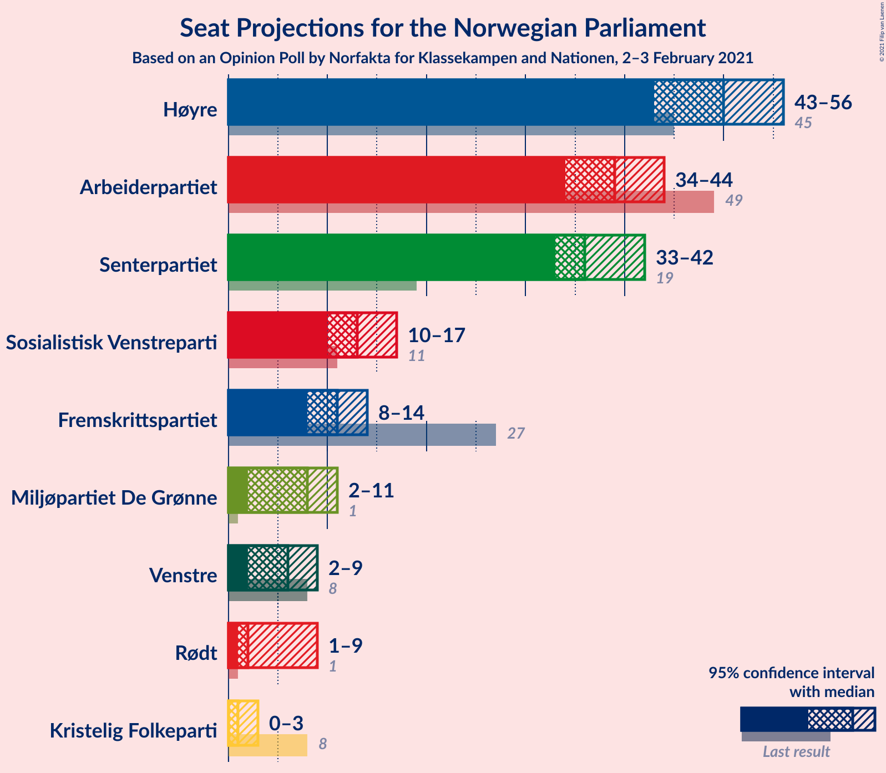
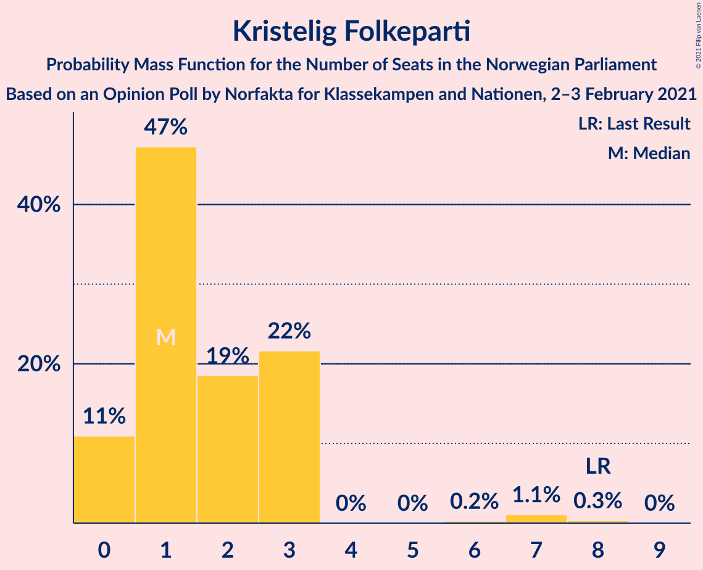
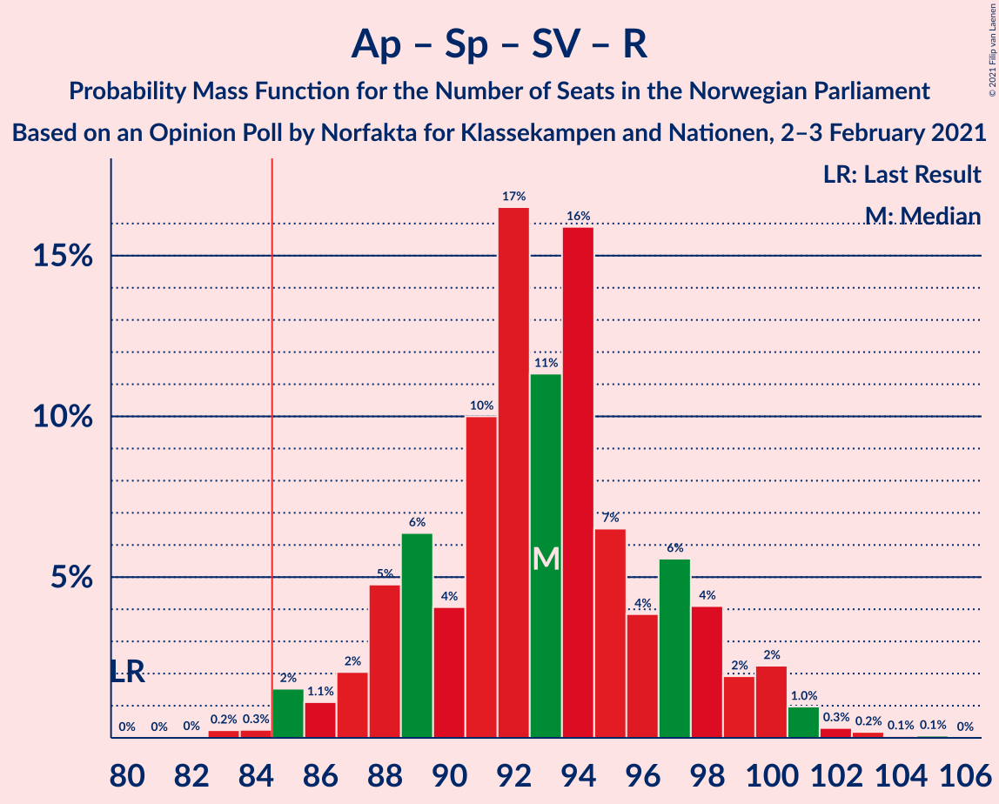
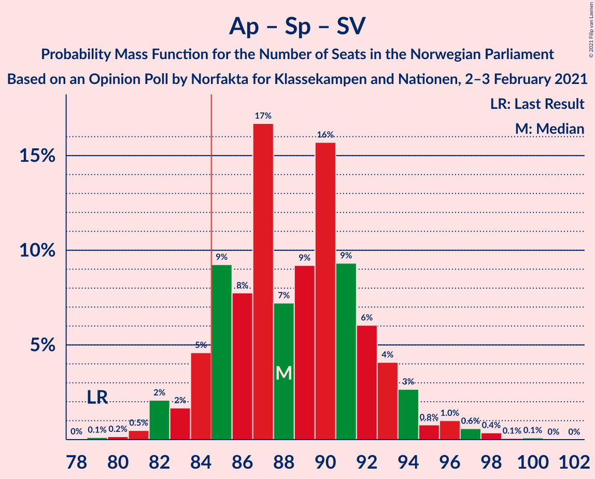
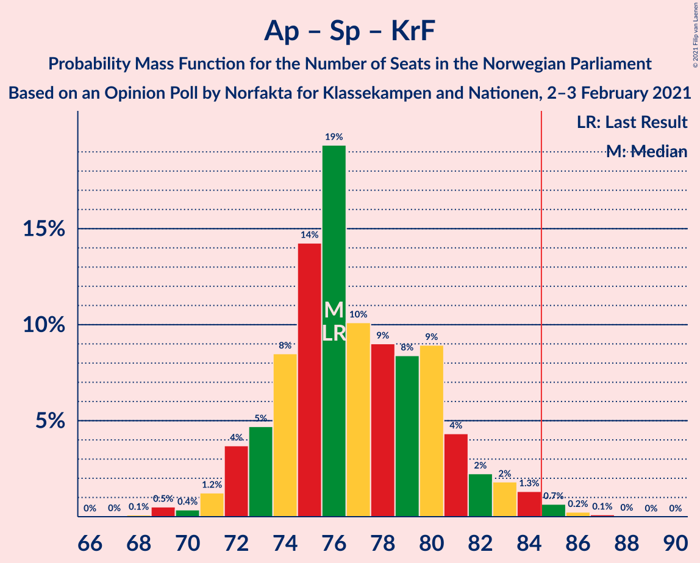
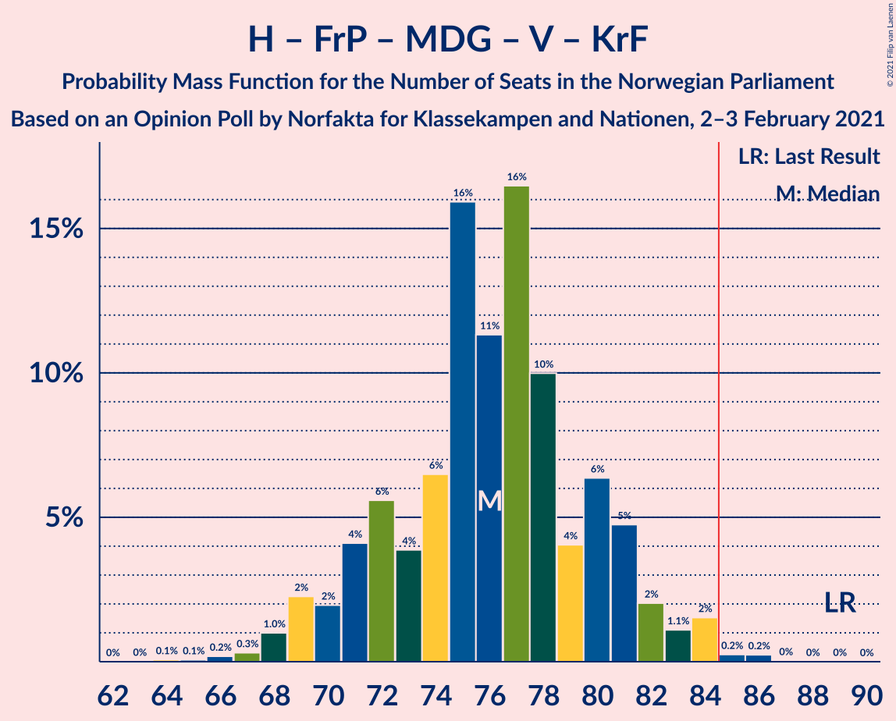
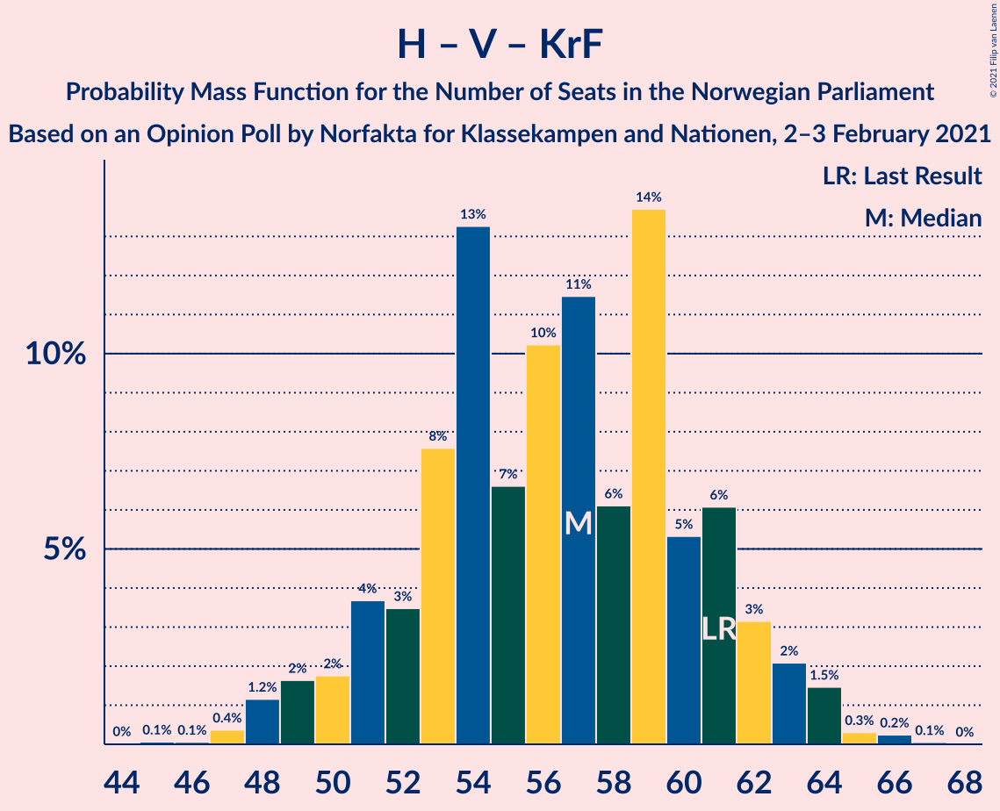

# Opinion Poll by Norfakta for Klassekampen and Nationen, 2–3 February 2021

<a href="#voting-intentions">Voting Intentions</a> | <a href="#seats">Seats</a> | <a href="#coalitions">Coalitions</a> | <a href="#technical-information">Technical Information</a>

## Voting Intentions

### Confidence Intervals

| Party | Last Result | Poll Result | 80% Confidence Interval | 90% Confidence Interval | 95% Confidence Interval | 99% Confidence Interval |
|:-----:|:-----------:|:-----------:|:-----------------------:|:-----------------------:|:-----------------------:|:-----------------------:|
| Høyre | 25.0% | 27.3% | 25.5–29.2% |25.0–29.7% |24.6–30.1% |23.8–31.1% |
| Arbeiderpartiet | 27.4% | 21.3% | 19.7–23.0% |19.3–23.5% |18.9–24.0% |18.1–24.8% |
| Senterpartiet | 10.3% | 19.7% | 18.2–21.4% |17.7–21.9% |17.3–22.3% |16.6–23.1% |
| Sosialistisk Venstreparti | 6.0% | 7.5% | 6.5–8.7% |6.2–9.0% |6.0–9.3% |5.6–9.9% |
| Fremskrittspartiet | 15.2% | 6.4% | 5.5–7.5% |5.3–7.8% |5.0–8.1% |4.6–8.7% |
| Miljøpartiet De Grønne | 3.2% | 5.0% | 4.2–6.0% |4.0–6.3% |3.8–6.5% |3.5–7.1% |
| Venstre | 4.4% | 4.0% | 3.3–4.9% |3.1–5.2% |2.9–5.4% |2.7–5.9% |
| Rødt | 2.4% | 3.8% | 3.1–4.7% |2.9–5.0% |2.8–5.2% |2.5–5.6% |
| Kristelig Folkeparti | 4.2% | 2.7% | 2.1–3.5% |2.0–3.7% |1.9–3.9% |1.6–4.3% |

*Note:* The poll result column reflects the actual value used in the calculations. Published results may vary slightly, and in addition be rounded to fewer digits.

## Seats

### Confidence Intervals

| Party | Last Result | Median | 80% Confidence Interval | 90% Confidence Interval | 95% Confidence Interval | 99% Confidence Interval |
|:-----:|:-----------:|:------:|:-----------------------:|:-----------------------:|:-----------------------:|:-----------------------:|
| <a href="#høyre">Høyre</a> | 45 | 50 | 46–54 |45–55 |43–56 |42–57 |
| <a href="#arbeiderpartiet">Arbeiderpartiet</a> | 49 | 39 | 36–41 |36–43 |34–44 |32–45 |
| <a href="#senterpartiet">Senterpartiet</a> | 19 | 36 | 34–40 |33–41 |33–42 |31–43 |
| <a href="#sosialistisk-venstreparti">Sosialistisk Venstreparti</a> | 11 | 13 | 11–15 |11–16 |10–17 |9–18 |
| <a href="#fremskrittspartiet">Fremskrittspartiet</a> | 27 | 11 | 9–13 |9–14 |8–14 |8–16 |
| <a href="#miljøpartiet-de-grønne">Miljøpartiet De Grønne</a> | 1 | 8 | 7–10 |3–11 |2–11 |2–13 |
| <a href="#venstre">Venstre</a> | 8 | 6 | 2–8 |2–9 |2–9 |2–10 |
| <a href="#rødt">Rødt</a> | 1 | 2 | 2–8 |1–8 |1–9 |1–10 |
| <a href="#kristelig-folkeparti">Kristelig Folkeparti</a> | 8 | 1 | 0–3 |0–3 |0–3 |0–7 |

### Høyre

*For a full overview of the results for this party, see the [Høyre](party-høyre.html) page.*

| Number of Seats | Probability | Accumulated | Special Marks |
|:---------------:|:-----------:|:-----------:|:-------------:|
| 40 | 0.1% | 100% |  |
| 41 | 0.4% | 99.9% |  |
| 42 | 0.6% | 99.5% |  |
| 43 | 2% | 99.0% |  |
| 44 | 1.4% | 97% |  |
| 45 | 5% | 95% | Last Result |
| 46 | 4% | 90% |  |
| 47 | 6% | 86% |  |
| 48 | 12% | 80% |  |
| 49 | 8% | 68% |  |
| 50 | 17% | 60% | Median |
| 51 | 12% | 43% |  |
| 52 | 12% | 31% |  |
| 53 | 7% | 19% |  |
| 54 | 5% | 12% |  |
| 55 | 2% | 7% |  |
| 56 | 4% | 5% |  |
| 57 | 0.6% | 1.0% |  |
| 58 | 0.3% | 0.4% |  |
| 59 | 0% | 0.1% |  |
| 60 | 0% | 0% |  |

### Arbeiderpartiet

*For a full overview of the results for this party, see the [Arbeiderpartiet](party-arbeiderpartiet.html) page.*

| Number of Seats | Probability | Accumulated | Special Marks |
|:---------------:|:-----------:|:-----------:|:-------------:|
| 30 | 0.1% | 100% |  |
| 31 | 0.2% | 99.9% |  |
| 32 | 0.3% | 99.7% |  |
| 33 | 0.8% | 99.4% |  |
| 34 | 2% | 98.6% |  |
| 35 | 2% | 97% |  |
| 36 | 7% | 95% |  |
| 37 | 11% | 88% |  |
| 38 | 24% | 77% |  |
| 39 | 18% | 53% | Median |
| 40 | 15% | 35% |  |
| 41 | 10% | 20% |  |
| 42 | 5% | 10% |  |
| 43 | 3% | 5% |  |
| 44 | 1.3% | 3% |  |
| 45 | 0.9% | 1.2% |  |
| 46 | 0.1% | 0.3% |  |
| 47 | 0.1% | 0.2% |  |
| 48 | 0% | 0.1% |  |
| 49 | 0% | 0% | Last Result |

### Senterpartiet

*For a full overview of the results for this party, see the [Senterpartiet](party-senterpartiet.html) page.*

| Number of Seats | Probability | Accumulated | Special Marks |
|:---------------:|:-----------:|:-----------:|:-------------:|
| 19 | 0% | 100% | Last Result |
| 20 | 0% | 100% |  |
| 21 | 0% | 100% |  |
| 22 | 0% | 100% |  |
| 23 | 0% | 100% |  |
| 24 | 0% | 100% |  |
| 25 | 0% | 100% |  |
| 26 | 0% | 100% |  |
| 27 | 0% | 100% |  |
| 28 | 0% | 100% |  |
| 29 | 0% | 100% |  |
| 30 | 0.3% | 99.9% |  |
| 31 | 0.3% | 99.7% |  |
| 32 | 2% | 99.4% |  |
| 33 | 4% | 98% |  |
| 34 | 8% | 93% |  |
| 35 | 13% | 86% |  |
| 36 | 39% | 73% | Median |
| 37 | 10% | 34% |  |
| 38 | 10% | 24% |  |
| 39 | 3% | 14% |  |
| 40 | 4% | 10% |  |
| 41 | 3% | 7% |  |
| 42 | 2% | 3% |  |
| 43 | 1.3% | 1.5% |  |
| 44 | 0.2% | 0.2% |  |
| 45 | 0% | 0.1% |  |
| 46 | 0% | 0% |  |

### Sosialistisk Venstreparti

*For a full overview of the results for this party, see the [Sosialistisk Venstreparti](party-sosialistiskvenstreparti.html) page.*

| Number of Seats | Probability | Accumulated | Special Marks |
|:---------------:|:-----------:|:-----------:|:-------------:|
| 8 | 0.1% | 100% |  |
| 9 | 1.2% | 99.9% |  |
| 10 | 3% | 98.8% |  |
| 11 | 15% | 96% | Last Result |
| 12 | 15% | 81% |  |
| 13 | 22% | 66% | Median |
| 14 | 17% | 43% |  |
| 15 | 18% | 27% |  |
| 16 | 4% | 8% |  |
| 17 | 3% | 4% |  |
| 18 | 0.8% | 1.0% |  |
| 19 | 0.1% | 0.2% |  |
| 20 | 0% | 0% |  |

### Fremskrittspartiet

*For a full overview of the results for this party, see the [Fremskrittspartiet](party-fremskrittspartiet.html) page.*

| Number of Seats | Probability | Accumulated | Special Marks |
|:---------------:|:-----------:|:-----------:|:-------------:|
| 7 | 0.2% | 100% |  |
| 8 | 3% | 99.8% |  |
| 9 | 7% | 97% |  |
| 10 | 18% | 90% |  |
| 11 | 31% | 72% | Median |
| 12 | 18% | 41% |  |
| 13 | 15% | 23% |  |
| 14 | 6% | 8% |  |
| 15 | 1.5% | 2% |  |
| 16 | 0.4% | 0.6% |  |
| 17 | 0.2% | 0.2% |  |
| 18 | 0% | 0% |  |
| 19 | 0% | 0% |  |
| 20 | 0% | 0% |  |
| 21 | 0% | 0% |  |
| 22 | 0% | 0% |  |
| 23 | 0% | 0% |  |
| 24 | 0% | 0% |  |
| 25 | 0% | 0% |  |
| 26 | 0% | 0% |  |
| 27 | 0% | 0% | Last Result |

### Miljøpartiet De Grønne

*For a full overview of the results for this party, see the [Miljøpartiet De Grønne](party-miljøpartietdegrønne.html) page.*

| Number of Seats | Probability | Accumulated | Special Marks |
|:---------------:|:-----------:|:-----------:|:-------------:|
| 1 | 0% | 100% | Last Result |
| 2 | 4% | 100% |  |
| 3 | 3% | 96% |  |
| 4 | 0% | 93% |  |
| 5 | 0% | 93% |  |
| 6 | 0.1% | 93% |  |
| 7 | 10% | 93% |  |
| 8 | 33% | 83% | Median |
| 9 | 28% | 50% |  |
| 10 | 14% | 22% |  |
| 11 | 6% | 8% |  |
| 12 | 2% | 2% |  |
| 13 | 0.5% | 0.5% |  |
| 14 | 0.1% | 0.1% |  |
| 15 | 0% | 0% |  |

### Venstre

*For a full overview of the results for this party, see the [Venstre](party-venstre.html) page.*

| Number of Seats | Probability | Accumulated | Special Marks |
|:---------------:|:-----------:|:-----------:|:-------------:|
| 1 | 0.1% | 100% |  |
| 2 | 47% | 99.9% |  |
| 3 | 2% | 53% |  |
| 4 | 0% | 51% |  |
| 5 | 0% | 51% |  |
| 6 | 2% | 51% | Median |
| 7 | 21% | 49% |  |
| 8 | 21% | 28% | Last Result |
| 9 | 6% | 7% |  |
| 10 | 1.3% | 2% |  |
| 11 | 0.2% | 0.2% |  |
| 12 | 0% | 0% |  |

### Rødt

*For a full overview of the results for this party, see the [Rødt](party-rødt.html) page.*

| Number of Seats | Probability | Accumulated | Special Marks |
|:---------------:|:-----------:|:-----------:|:-------------:|
| 1 | 5% | 100% | Last Result |
| 2 | 49% | 95% | Median |
| 3 | 0% | 45% |  |
| 4 | 0% | 45% |  |
| 5 | 0% | 45% |  |
| 6 | 2% | 45% |  |
| 7 | 28% | 44% |  |
| 8 | 11% | 15% |  |
| 9 | 3% | 4% |  |
| 10 | 1.0% | 1.0% |  |
| 11 | 0% | 0% |  |

### Kristelig Folkeparti

*For a full overview of the results for this party, see the [Kristelig Folkeparti](party-kristeligfolkeparti.html) page.*

| Number of Seats | Probability | Accumulated | Special Marks |
|:---------------:|:-----------:|:-----------:|:-------------:|
| 0 | 11% | 100% |  |
| 1 | 47% | 89% | Median |
| 2 | 19% | 42% |  |
| 3 | 22% | 23% |  |
| 4 | 0% | 2% |  |
| 5 | 0% | 2% |  |
| 6 | 0.2% | 2% |  |
| 7 | 1.1% | 1.4% |  |
| 8 | 0.3% | 0.3% | Last Result |
| 9 | 0% | 0% |  |

## Coalitions

### Confidence Intervals

| Coalition | Last Result | Median | Majority? | 80% Confidence Interval | 90% Confidence Interval | 95% Confidence Interval | 99% Confidence Interval |
|:---------:|:-----------:|:------:|:---------:|:-----------------------:|:-----------------------:|:-----------------------:|:-----------------------:|
| Høyre – Senterpartiet – Fremskrittspartiet – Venstre – Kristelig Folkeparti | 107 | 105 | 100% | 99–108 | 98–111 | 97–112 | 95–114 |
| Arbeiderpartiet – Senterpartiet – Sosialistisk Venstreparti – Miljøpartiet De Grønne – Rødt | 81 | 102 | 100% | 97–106 | 96–107 | 94–109 | 93–110 |
| Arbeiderpartiet – Senterpartiet – Sosialistisk Venstreparti – Miljøpartiet De Grønne – Kristelig Folkeparti | 88 | 98 | 100% | 93–103 | 92–105 | 91–105 | 90–108 |
| Arbeiderpartiet – Senterpartiet – Sosialistisk Venstreparti – Miljøpartiet De Grønne | 80 | 97 | 100% | 92–101 | 91–102 | 90–104 | 89–106 |
| Arbeiderpartiet – Senterpartiet – Sosialistisk Venstreparti – Rødt | 80 | 93 | 99.5% | 88–97 | 87–99 | 86–100 | 84–102 |
| Arbeiderpartiet – Senterpartiet – Sosialistisk Venstreparti | 79 | 88 | 91% | 85–92 | 84–94 | 82–95 | 81–98 |
| Arbeiderpartiet – Senterpartiet – Miljøpartiet De Grønne – Kristelig Folkeparti | 77 | 85 | 54% | 81–89 | 80–91 | 79–92 | 77–95 |
| Arbeiderpartiet – Senterpartiet – Kristelig Folkeparti | 76 | 76 | 1.1% | 73–81 | 72–82 | 72–83 | 69–85 |
| Høyre – Fremskrittspartiet – Miljøpartiet De Grønne – Venstre – Kristelig Folkeparti | 89 | 76 | 0.5% | 72–80 | 70–82 | 69–83 | 67–85 |
| Arbeiderpartiet – Senterpartiet | 68 | 75 | 0.2% | 72–79 | 71–80 | 70–81 | 68–83 |
| Høyre – Fremskrittspartiet – Venstre – Kristelig Folkeparti | 88 | 67 | 0% | 63–72 | 62–73 | 60–75 | 59–76 |
| Høyre – Fremskrittspartiet – Venstre | 80 | 66 | 0% | 62–70 | 60–72 | 58–74 | 57–75 |
| Høyre – Fremskrittspartiet | 72 | 62 | 0% | 57–66 | 55–66 | 54–67 | 53–69 |
| Høyre – Venstre – Kristelig Folkeparti | 61 | 57 | 0% | 52–61 | 50–62 | 49–63 | 47–65 |
| Arbeiderpartiet – Sosialistisk Venstreparti | 60 | 52 | 0% | 48–56 | 47–57 | 46–58 | 45–59 |
| Senterpartiet – Venstre – Kristelig Folkeparti | 35 | 43 | 0% | 38–47 | 37–49 | 36–50 | 35–53 |

### Høyre – Senterpartiet – Fremskrittspartiet – Venstre – Kristelig Folkeparti

| Number of Seats | Probability | Accumulated | Special Marks |
|:---------------:|:-----------:|:-----------:|:-------------:|
| 93 | 0.1% | 100% |  |
| 94 | 0.2% | 99.9% |  |
| 95 | 0.5% | 99.6% |  |
| 96 | 1.2% | 99.1% |  |
| 97 | 2% | 98% |  |
| 98 | 2% | 96% |  |
| 99 | 6% | 94% |  |
| 100 | 4% | 88% |  |
| 101 | 4% | 84% |  |
| 102 | 8% | 80% |  |
| 103 | 15% | 72% |  |
| 104 | 6% | 57% | Median |
| 105 | 15% | 51% |  |
| 106 | 14% | 36% |  |
| 107 | 7% | 22% | Last Result |
| 108 | 5% | 15% |  |
| 109 | 3% | 10% |  |
| 110 | 2% | 7% |  |
| 111 | 3% | 5% |  |
| 112 | 2% | 3% |  |
| 113 | 0.3% | 1.1% |  |
| 114 | 0.4% | 0.7% |  |
| 115 | 0.2% | 0.3% |  |
| 116 | 0.1% | 0.1% |  |
| 117 | 0% | 0% |  |

### Arbeiderpartiet – Senterpartiet – Sosialistisk Venstreparti – Miljøpartiet De Grønne – Rødt

| Number of Seats | Probability | Accumulated | Special Marks |
|:---------------:|:-----------:|:-----------:|:-------------:|
| 81 | 0% | 100% | Last Result |
| 82 | 0% | 100% |  |
| 83 | 0% | 100% |  |
| 84 | 0% | 100% |  |
| 85 | 0% | 100% | Majority |
| 86 | 0% | 100% |  |
| 87 | 0% | 100% |  |
| 88 | 0% | 100% |  |
| 89 | 0% | 100% |  |
| 90 | 0% | 100% |  |
| 91 | 0.1% | 100% |  |
| 92 | 0.4% | 99.9% |  |
| 93 | 2% | 99.5% |  |
| 94 | 1.1% | 98% |  |
| 95 | 2% | 97% |  |
| 96 | 2% | 95% |  |
| 97 | 7% | 93% |  |
| 98 | 3% | 86% | Median |
| 99 | 11% | 83% |  |
| 100 | 15% | 72% |  |
| 101 | 6% | 56% |  |
| 102 | 18% | 50% |  |
| 103 | 11% | 32% |  |
| 104 | 5% | 21% |  |
| 105 | 6% | 16% |  |
| 106 | 4% | 10% |  |
| 107 | 2% | 6% |  |
| 108 | 2% | 5% |  |
| 109 | 2% | 3% |  |
| 110 | 0.8% | 1.2% |  |
| 111 | 0.2% | 0.5% |  |
| 112 | 0.2% | 0.3% |  |
| 113 | 0% | 0.1% |  |
| 114 | 0% | 0% |  |

### Arbeiderpartiet – Senterpartiet – Sosialistisk Venstreparti – Miljøpartiet De Grønne – Kristelig Folkeparti

| Number of Seats | Probability | Accumulated | Special Marks |
|:---------------:|:-----------:|:-----------:|:-------------:|
| 88 | 0.1% | 100% | Last Result |
| 89 | 0.2% | 99.9% |  |
| 90 | 0.3% | 99.7% |  |
| 91 | 3% | 99.4% |  |
| 92 | 2% | 97% |  |
| 93 | 5% | 95% |  |
| 94 | 6% | 90% |  |
| 95 | 4% | 84% |  |
| 96 | 12% | 80% |  |
| 97 | 9% | 68% | Median |
| 98 | 10% | 59% |  |
| 99 | 9% | 49% |  |
| 100 | 8% | 40% |  |
| 101 | 11% | 32% |  |
| 102 | 9% | 21% |  |
| 103 | 5% | 12% |  |
| 104 | 2% | 7% |  |
| 105 | 3% | 5% |  |
| 106 | 0.8% | 2% |  |
| 107 | 0.7% | 2% |  |
| 108 | 0.6% | 0.9% |  |
| 109 | 0.2% | 0.3% |  |
| 110 | 0.1% | 0.1% |  |
| 111 | 0% | 0% |  |

### Arbeiderpartiet – Senterpartiet – Sosialistisk Venstreparti – Miljøpartiet De Grønne

| Number of Seats | Probability | Accumulated | Special Marks |
|:---------------:|:-----------:|:-----------:|:-------------:|
| 80 | 0% | 100% | Last Result |
| 81 | 0% | 100% |  |
| 82 | 0% | 100% |  |
| 83 | 0% | 100% |  |
| 84 | 0% | 100% |  |
| 85 | 0% | 100% | Majority |
| 86 | 0% | 100% |  |
| 87 | 0.1% | 99.9% |  |
| 88 | 0.2% | 99.8% |  |
| 89 | 0.8% | 99.6% |  |
| 90 | 2% | 98.8% |  |
| 91 | 2% | 97% |  |
| 92 | 7% | 94% |  |
| 93 | 6% | 88% |  |
| 94 | 5% | 82% |  |
| 95 | 14% | 76% |  |
| 96 | 8% | 62% | Median |
| 97 | 9% | 54% |  |
| 98 | 14% | 45% |  |
| 99 | 6% | 31% |  |
| 100 | 10% | 24% |  |
| 101 | 6% | 14% |  |
| 102 | 4% | 8% |  |
| 103 | 1.5% | 4% |  |
| 104 | 1.1% | 3% |  |
| 105 | 0.4% | 2% |  |
| 106 | 0.6% | 1.1% |  |
| 107 | 0.2% | 0.4% |  |
| 108 | 0.2% | 0.2% |  |
| 109 | 0.1% | 0.1% |  |
| 110 | 0% | 0% |  |

### Arbeiderpartiet – Senterpartiet – Sosialistisk Venstreparti – Rødt

| Number of Seats | Probability | Accumulated | Special Marks |
|:---------------:|:-----------:|:-----------:|:-------------:|
| 80 | 0% | 100% | Last Result |
| 81 | 0% | 100% |  |
| 82 | 0% | 100% |  |
| 83 | 0.2% | 99.9% |  |
| 84 | 0.3% | 99.7% |  |
| 85 | 2% | 99.5% | Majority |
| 86 | 1.1% | 98% |  |
| 87 | 2% | 97% |  |
| 88 | 5% | 95% |  |
| 89 | 6% | 90% |  |
| 90 | 4% | 84% | Median |
| 91 | 10% | 80% |  |
| 92 | 17% | 70% |  |
| 93 | 11% | 53% |  |
| 94 | 16% | 42% |  |
| 95 | 7% | 26% |  |
| 96 | 4% | 19% |  |
| 97 | 6% | 15% |  |
| 98 | 4% | 10% |  |
| 99 | 2% | 6% |  |
| 100 | 2% | 4% |  |
| 101 | 1.0% | 2% |  |
| 102 | 0.3% | 0.6% |  |
| 103 | 0.2% | 0.3% |  |
| 104 | 0.1% | 0.1% |  |
| 105 | 0.1% | 0.1% |  |
| 106 | 0% | 0% |  |

### Arbeiderpartiet – Senterpartiet – Sosialistisk Venstreparti

| Number of Seats | Probability | Accumulated | Special Marks |
|:---------------:|:-----------:|:-----------:|:-------------:|
| 79 | 0.1% | 100% | Last Result |
| 80 | 0.2% | 99.8% |  |
| 81 | 0.5% | 99.7% |  |
| 82 | 2% | 99.2% |  |
| 83 | 2% | 97% |  |
| 84 | 5% | 95% |  |
| 85 | 9% | 91% | Majority |
| 86 | 8% | 82% |  |
| 87 | 17% | 74% |  |
| 88 | 7% | 57% | Median |
| 89 | 9% | 50% |  |
| 90 | 16% | 41% |  |
| 91 | 9% | 25% |  |
| 92 | 6% | 16% |  |
| 93 | 4% | 10% |  |
| 94 | 3% | 6% |  |
| 95 | 0.8% | 3% |  |
| 96 | 1.0% | 2% |  |
| 97 | 0.6% | 1.1% |  |
| 98 | 0.4% | 0.5% |  |
| 99 | 0.1% | 0.2% |  |
| 100 | 0.1% | 0.1% |  |
| 101 | 0% | 0% |  |

### Arbeiderpartiet – Senterpartiet – Miljøpartiet De Grønne – Kristelig Folkeparti

| Number of Seats | Probability | Accumulated | Special Marks |
|:---------------:|:-----------:|:-----------:|:-------------:|
| 75 | 0% | 100% |  |
| 76 | 0.1% | 99.9% |  |
| 77 | 0.4% | 99.8% | Last Result |
| 78 | 0.9% | 99.4% |  |
| 79 | 1.3% | 98% |  |
| 80 | 4% | 97% |  |
| 81 | 5% | 94% |  |
| 82 | 8% | 89% |  |
| 83 | 15% | 81% |  |
| 84 | 12% | 66% | Median |
| 85 | 10% | 54% | Majority |
| 86 | 10% | 44% |  |
| 87 | 9% | 34% |  |
| 88 | 10% | 25% |  |
| 89 | 5% | 15% |  |
| 90 | 4% | 10% |  |
| 91 | 2% | 6% |  |
| 92 | 2% | 4% |  |
| 93 | 1.1% | 2% |  |
| 94 | 0.5% | 1.1% |  |
| 95 | 0.4% | 0.5% |  |
| 96 | 0.1% | 0.2% |  |
| 97 | 0.1% | 0.1% |  |
| 98 | 0% | 0% |  |

### Arbeiderpartiet – Senterpartiet – Kristelig Folkeparti

| Number of Seats | Probability | Accumulated | Special Marks |
|:---------------:|:-----------:|:-----------:|:-------------:|
| 68 | 0.1% | 100% |  |
| 69 | 0.5% | 99.9% |  |
| 70 | 0.4% | 99.3% |  |
| 71 | 1.2% | 99.0% |  |
| 72 | 4% | 98% |  |
| 73 | 5% | 94% |  |
| 74 | 8% | 89% |  |
| 75 | 14% | 81% |  |
| 76 | 19% | 67% | Last Result, Median |
| 77 | 10% | 47% |  |
| 78 | 9% | 37% |  |
| 79 | 8% | 28% |  |
| 80 | 9% | 20% |  |
| 81 | 4% | 11% |  |
| 82 | 2% | 6% |  |
| 83 | 2% | 4% |  |
| 84 | 1.3% | 2% |  |
| 85 | 0.7% | 1.1% | Majority |
| 86 | 0.2% | 0.4% |  |
| 87 | 0.1% | 0.2% |  |
| 88 | 0% | 0.1% |  |
| 89 | 0% | 0% |  |

### Høyre – Fremskrittspartiet – Miljøpartiet De Grønne – Venstre – Kristelig Folkeparti

| Number of Seats | Probability | Accumulated | Special Marks |
|:---------------:|:-----------:|:-----------:|:-------------:|
| 64 | 0.1% | 100% |  |
| 65 | 0.1% | 99.9% |  |
| 66 | 0.2% | 99.8% |  |
| 67 | 0.3% | 99.7% |  |
| 68 | 1.0% | 99.3% |  |
| 69 | 2% | 98% |  |
| 70 | 2% | 96% |  |
| 71 | 4% | 94% |  |
| 72 | 6% | 90% |  |
| 73 | 4% | 84% |  |
| 74 | 6% | 81% |  |
| 75 | 16% | 74% |  |
| 76 | 11% | 58% | Median |
| 77 | 16% | 47% |  |
| 78 | 10% | 30% |  |
| 79 | 4% | 20% |  |
| 80 | 6% | 16% |  |
| 81 | 5% | 10% |  |
| 82 | 2% | 5% |  |
| 83 | 1.1% | 3% |  |
| 84 | 2% | 2% |  |
| 85 | 0.2% | 0.5% | Majority |
| 86 | 0.2% | 0.3% |  |
| 87 | 0% | 0% |  |
| 88 | 0% | 0% |  |
| 89 | 0% | 0% | Last Result |

### Arbeiderpartiet – Senterpartiet

| Number of Seats | Probability | Accumulated | Special Marks |
|:---------------:|:-----------:|:-----------:|:-------------:|
| 66 | 0.1% | 100% |  |
| 67 | 0.1% | 99.9% |  |
| 68 | 0.5% | 99.9% | Last Result |
| 69 | 0.5% | 99.4% |  |
| 70 | 2% | 98.9% |  |
| 71 | 4% | 97% |  |
| 72 | 6% | 93% |  |
| 73 | 12% | 88% |  |
| 74 | 18% | 76% |  |
| 75 | 16% | 58% | Median |
| 76 | 14% | 42% |  |
| 77 | 11% | 28% |  |
| 78 | 7% | 18% |  |
| 79 | 5% | 11% |  |
| 80 | 2% | 6% |  |
| 81 | 2% | 4% |  |
| 82 | 0.9% | 2% |  |
| 83 | 0.6% | 1.0% |  |
| 84 | 0.2% | 0.4% |  |
| 85 | 0.1% | 0.2% | Majority |
| 86 | 0% | 0.1% |  |
| 87 | 0% | 0% |  |

### Høyre – Fremskrittspartiet – Venstre – Kristelig Folkeparti

| Number of Seats | Probability | Accumulated | Special Marks |
|:---------------:|:-----------:|:-----------:|:-------------:|
| 56 | 0% | 100% |  |
| 57 | 0.2% | 99.9% |  |
| 58 | 0.2% | 99.7% |  |
| 59 | 0.8% | 99.5% |  |
| 60 | 2% | 98.8% |  |
| 61 | 2% | 97% |  |
| 62 | 2% | 95% |  |
| 63 | 4% | 94% |  |
| 64 | 6% | 90% |  |
| 65 | 5% | 84% |  |
| 66 | 11% | 79% |  |
| 67 | 18% | 68% |  |
| 68 | 6% | 50% | Median |
| 69 | 15% | 44% |  |
| 70 | 11% | 28% |  |
| 71 | 3% | 17% |  |
| 72 | 7% | 14% |  |
| 73 | 2% | 7% |  |
| 74 | 2% | 5% |  |
| 75 | 1.1% | 3% |  |
| 76 | 2% | 2% |  |
| 77 | 0.4% | 0.5% |  |
| 78 | 0.1% | 0.1% |  |
| 79 | 0% | 0% |  |
| 80 | 0% | 0% |  |
| 81 | 0% | 0% |  |
| 82 | 0% | 0% |  |
| 83 | 0% | 0% |  |
| 84 | 0% | 0% |  |
| 85 | 0% | 0% | Majority |
| 86 | 0% | 0% |  |
| 87 | 0% | 0% |  |
| 88 | 0% | 0% | Last Result |

### Høyre – Fremskrittspartiet – Venstre

| Number of Seats | Probability | Accumulated | Special Marks |
|:---------------:|:-----------:|:-----------:|:-------------:|
| 55 | 0% | 100% |  |
| 56 | 0.4% | 99.9% |  |
| 57 | 1.1% | 99.5% |  |
| 58 | 0.9% | 98% |  |
| 59 | 1.5% | 97% |  |
| 60 | 2% | 96% |  |
| 61 | 3% | 94% |  |
| 62 | 5% | 91% |  |
| 63 | 5% | 86% |  |
| 64 | 8% | 82% |  |
| 65 | 14% | 74% |  |
| 66 | 18% | 60% |  |
| 67 | 7% | 42% | Median |
| 68 | 11% | 35% |  |
| 69 | 11% | 24% |  |
| 70 | 4% | 13% |  |
| 71 | 3% | 9% |  |
| 72 | 2% | 6% |  |
| 73 | 1.3% | 4% |  |
| 74 | 1.0% | 3% |  |
| 75 | 1.3% | 2% |  |
| 76 | 0.2% | 0.3% |  |
| 77 | 0.1% | 0.1% |  |
| 78 | 0% | 0% |  |
| 79 | 0% | 0% |  |
| 80 | 0% | 0% | Last Result |

### Høyre – Fremskrittspartiet

| Number of Seats | Probability | Accumulated | Special Marks |
|:---------------:|:-----------:|:-----------:|:-------------:|
| 51 | 0.1% | 100% |  |
| 52 | 0.3% | 99.9% |  |
| 53 | 0.7% | 99.6% |  |
| 54 | 2% | 98.9% |  |
| 55 | 2% | 97% |  |
| 56 | 3% | 95% |  |
| 57 | 7% | 92% |  |
| 58 | 5% | 85% |  |
| 59 | 12% | 81% |  |
| 60 | 10% | 68% |  |
| 61 | 8% | 58% | Median |
| 62 | 11% | 50% |  |
| 63 | 13% | 39% |  |
| 64 | 12% | 26% |  |
| 65 | 4% | 15% |  |
| 66 | 5% | 10% |  |
| 67 | 3% | 5% |  |
| 68 | 1.3% | 2% |  |
| 69 | 0.4% | 0.7% |  |
| 70 | 0.1% | 0.3% |  |
| 71 | 0.2% | 0.2% |  |
| 72 | 0% | 0.1% | Last Result |
| 73 | 0% | 0% |  |

### Høyre – Venstre – Kristelig Folkeparti

| Number of Seats | Probability | Accumulated | Special Marks |
|:---------------:|:-----------:|:-----------:|:-------------:|
| 45 | 0.1% | 100% |  |
| 46 | 0.1% | 99.9% |  |
| 47 | 0.4% | 99.8% |  |
| 48 | 1.2% | 99.5% |  |
| 49 | 2% | 98% |  |
| 50 | 2% | 97% |  |
| 51 | 4% | 95% |  |
| 52 | 3% | 91% |  |
| 53 | 8% | 88% |  |
| 54 | 13% | 80% |  |
| 55 | 7% | 67% |  |
| 56 | 10% | 60% |  |
| 57 | 11% | 50% | Median |
| 58 | 6% | 39% |  |
| 59 | 14% | 32% |  |
| 60 | 5% | 19% |  |
| 61 | 6% | 13% | Last Result |
| 62 | 3% | 7% |  |
| 63 | 2% | 4% |  |
| 64 | 1.5% | 2% |  |
| 65 | 0.3% | 0.6% |  |
| 66 | 0.2% | 0.3% |  |
| 67 | 0.1% | 0.1% |  |
| 68 | 0% | 0% |  |

### Arbeiderpartiet – Sosialistisk Venstreparti

| Number of Seats | Probability | Accumulated | Special Marks |
|:---------------:|:-----------:|:-----------:|:-------------:|
| 42 | 0.1% | 100% |  |
| 43 | 0.1% | 99.8% |  |
| 44 | 0.2% | 99.7% |  |
| 45 | 1.2% | 99.5% |  |
| 46 | 1.1% | 98% |  |
| 47 | 2% | 97% |  |
| 48 | 6% | 95% |  |
| 49 | 10% | 89% |  |
| 50 | 7% | 80% |  |
| 51 | 17% | 73% |  |
| 52 | 12% | 56% | Median |
| 53 | 11% | 44% |  |
| 54 | 13% | 33% |  |
| 55 | 9% | 20% |  |
| 56 | 6% | 11% |  |
| 57 | 3% | 5% |  |
| 58 | 2% | 3% |  |
| 59 | 0.8% | 1.2% |  |
| 60 | 0.2% | 0.4% | Last Result |
| 61 | 0.1% | 0.2% |  |
| 62 | 0% | 0.1% |  |
| 63 | 0% | 0% |  |

### Senterpartiet – Venstre – Kristelig Folkeparti

| Number of Seats | Probability | Accumulated | Special Marks |
|:---------------:|:-----------:|:-----------:|:-------------:|
| 33 | 0.1% | 100% |  |
| 34 | 0.1% | 99.8% |  |
| 35 | 0.4% | 99.7% | Last Result |
| 36 | 2% | 99.4% |  |
| 37 | 3% | 97% |  |
| 38 | 6% | 94% |  |
| 39 | 7% | 88% |  |
| 40 | 11% | 81% |  |
| 41 | 8% | 70% |  |
| 42 | 8% | 62% |  |
| 43 | 4% | 54% | Median |
| 44 | 13% | 50% |  |
| 45 | 12% | 36% |  |
| 46 | 8% | 24% |  |
| 47 | 7% | 16% |  |
| 48 | 3% | 9% |  |
| 49 | 3% | 6% |  |
| 50 | 1.4% | 3% |  |
| 51 | 0.6% | 2% |  |
| 52 | 0.5% | 1.5% |  |
| 53 | 0.8% | 1.0% |  |
| 54 | 0.1% | 0.1% |  |
| 55 | 0% | 0% |  |

## Technical Information

### Opinion Poll

+ **Polling firm:** Norfakta
+ **Commissioner(s):** Klassekampen and Nationen
+ **Fieldwork period:** 2–3 February 2021

### Calculations

+ **Sample size:** 1000
+ **Simulations done:** 1,048,576
+ **Error estimate:** 1.20%

