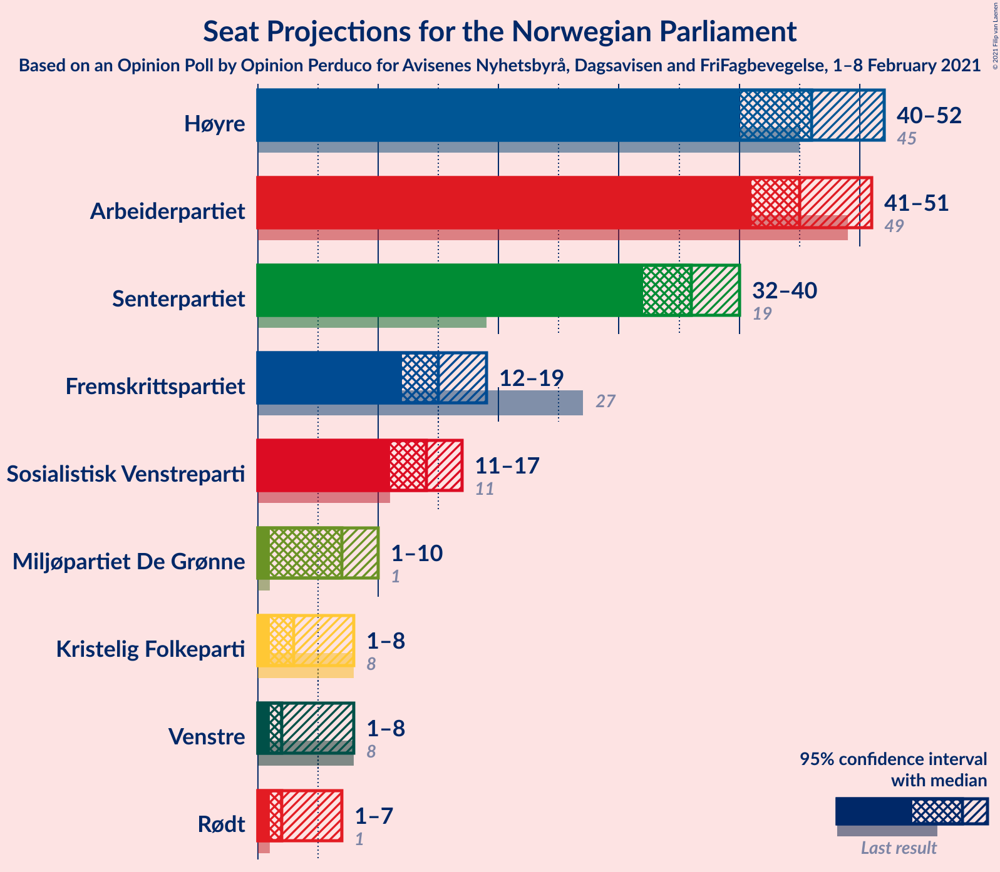
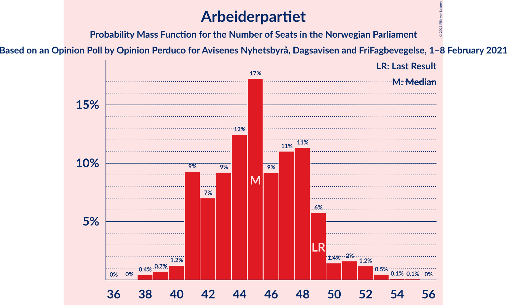
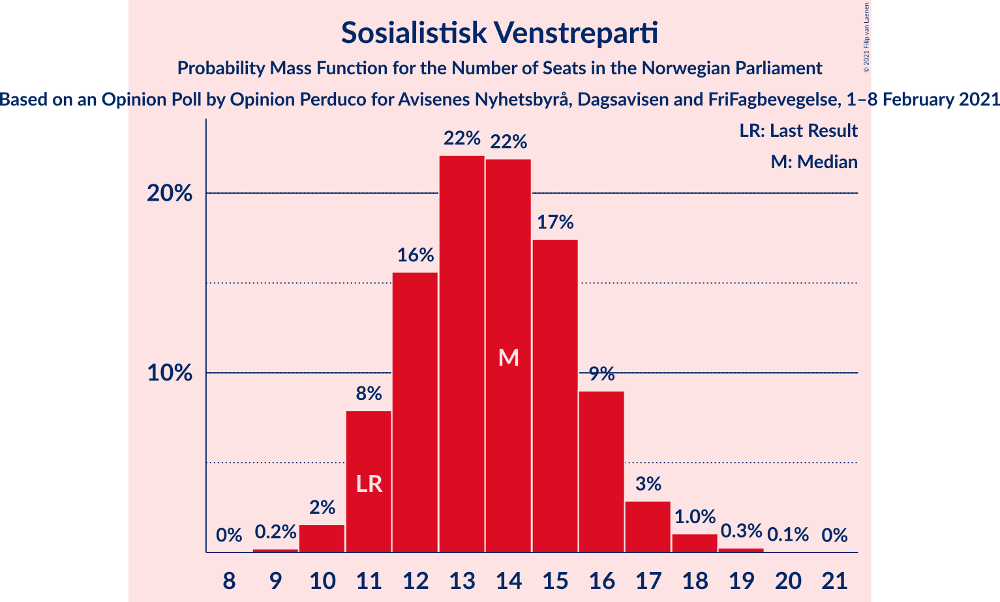
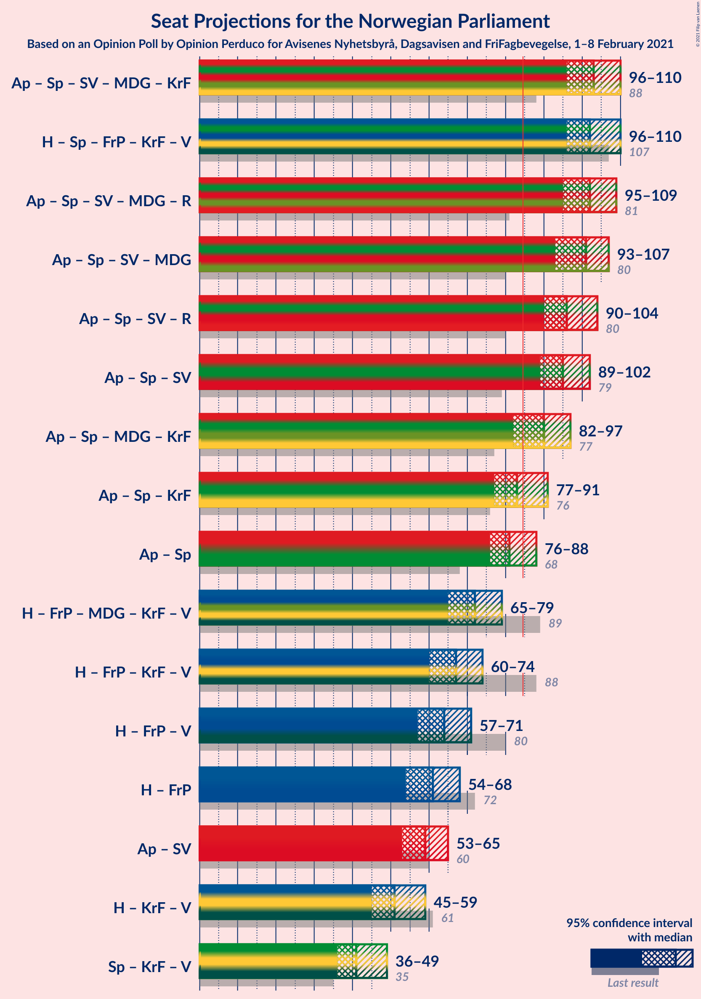
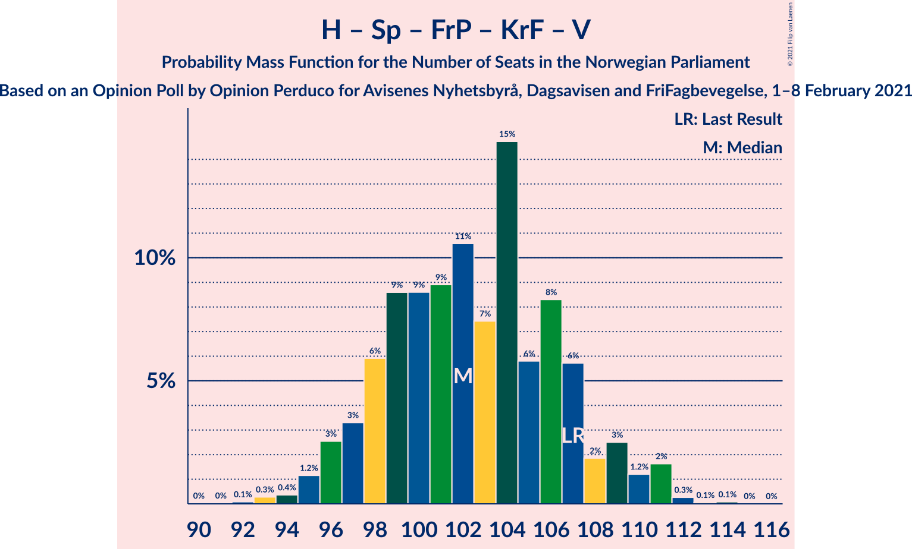
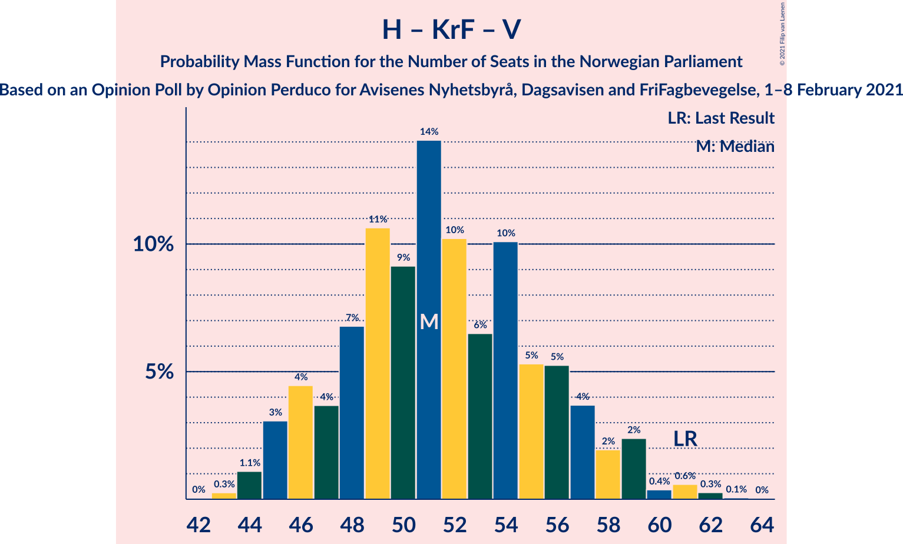
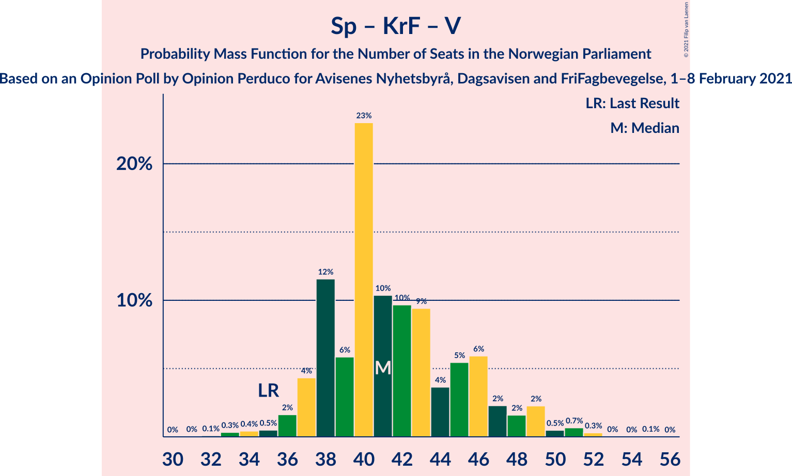

# Opinion Poll by Opinion Perduco for Avisenes Nyhetsbyrå, Dagsavisen and FriFagbevegelse, 1–8 February 2021

<a href="#voting-intentions">Voting Intentions</a> | <a href="#seats">Seats</a> | <a href="#coalitions">Coalitions</a> | <a href="#technical-information">Technical Information</a>

## Voting Intentions

### Confidence Intervals

| Party | Last Result | Poll Result | 80% Confidence Interval | 90% Confidence Interval | 95% Confidence Interval | 99% Confidence Interval |
|:-----:|:-----------:|:-----------:|:-----------------------:|:-----------------------:|:-----------------------:|:-----------------------:|
| Høyre | 25.0% | 25.1% | 23.4–27.0% |22.9–27.5% |22.5–27.9% |21.7–28.9% |
| Arbeiderpartiet | 27.4% | 24.6% | 22.9–26.4% |22.4–26.9% |22.0–27.4% |21.2–28.3% |
| Senterpartiet | 10.3% | 19.1% | 17.5–20.8% |17.1–21.3% |16.7–21.7% |16.0–22.5% |
| Fremskrittspartiet | 15.2% | 8.1% | 7.1–9.3% |6.8–9.7% |6.5–10.0% |6.1–10.6% |
| Sosialistisk Venstreparti | 6.0% | 7.4% | 6.4–8.6% |6.1–8.9% |5.9–9.2% |5.4–9.8% |
| Miljøpartiet De Grønne | 3.2% | 4.0% | 3.3–5.0% |3.1–5.3% |3.0–5.5% |2.7–6.0% |
| Venstre | 4.4% | 3.2% | 2.6–4.1% |2.4–4.3% |2.3–4.5% |2.0–5.0% |
| Kristelig Folkeparti | 4.2% | 3.2% | 2.6–4.1% |2.4–4.3% |2.3–4.5% |2.0–5.0% |
| Rødt | 2.4% | 2.9% | 2.3–3.7% |2.1–4.0% |2.0–4.2% |1.8–4.6% |

*Note:* The poll result column reflects the actual value used in the calculations. Published results may vary slightly, and in addition be rounded to fewer digits.

## Seats

### Confidence Intervals

| Party | Last Result | Median | 80% Confidence Interval | 90% Confidence Interval | 95% Confidence Interval | 99% Confidence Interval |
|:-----:|:-----------:|:------:|:-----------------------:|:-----------------------:|:-----------------------:|:-----------------------:|
| <a href="#høyre">Høyre</a> | 45 | 45 | 42–49 |42–51 |41–52 |39–54 |
| <a href="#arbeiderpartiet">Arbeiderpartiet</a> | 49 | 45 | 41–48 |41–49 |41–51 |39–53 |
| <a href="#senterpartiet">Senterpartiet</a> | 19 | 36 | 34–39 |33–40 |32–40 |30–42 |
| <a href="#fremskrittspartiet">Fremskrittspartiet</a> | 27 | 15 | 13–17 |12–18 |12–19 |11–19 |
| <a href="#sosialistisk-venstreparti">Sosialistisk Venstreparti</a> | 11 | 14 | 12–16 |11–16 |11–17 |10–18 |
| <a href="#miljøpartiet-de-grønne">Miljøpartiet De Grønne</a> | 1 | 7 | 2–9 |2–10 |1–10 |1–11 |
| <a href="#venstre">Venstre</a> | 8 | 2 | 2–7 |2–8 |2–8 |1–9 |
| <a href="#kristelig-folkeparti">Kristelig Folkeparti</a> | 8 | 3 | 1–3 |1–8 |1–8 |0–9 |
| <a href="#rødt">Rødt</a> | 1 | 2 | 1–2 |1–2 |1–8 |1–8 |

### Høyre

*For a full overview of the results for this party, see the [Høyre](party-høyre.html) page.*

| Number of Seats | Probability | Accumulated | Special Marks |
|:---------------:|:-----------:|:-----------:|:-------------:|
| 37 | 0% | 100% |  |
| 38 | 0.2% | 99.9% |  |
| 39 | 0.3% | 99.8% |  |
| 40 | 1.4% | 99.5% |  |
| 41 | 2% | 98% |  |
| 42 | 8% | 96% |  |
| 43 | 11% | 88% |  |
| 44 | 15% | 77% |  |
| 45 | 13% | 62% | Last Result, Median |
| 46 | 8% | 49% |  |
| 47 | 12% | 41% |  |
| 48 | 11% | 29% |  |
| 49 | 10% | 18% |  |
| 50 | 3% | 8% |  |
| 51 | 2% | 6% |  |
| 52 | 1.0% | 3% |  |
| 53 | 1.3% | 2% |  |
| 54 | 0.5% | 1.0% |  |
| 55 | 0.4% | 0.5% |  |
| 56 | 0% | 0% |  |

### Arbeiderpartiet

*For a full overview of the results for this party, see the [Arbeiderpartiet](party-arbeiderpartiet.html) page.*

| Number of Seats | Probability | Accumulated | Special Marks |
|:---------------:|:-----------:|:-----------:|:-------------:|
| 37 | 0% | 100% |  |
| 38 | 0.4% | 99.9% |  |
| 39 | 0.5% | 99.6% |  |
| 40 | 0.5% | 99.1% |  |
| 41 | 10% | 98.6% |  |
| 42 | 8% | 89% |  |
| 43 | 11% | 81% |  |
| 44 | 7% | 71% |  |
| 45 | 24% | 64% | Median |
| 46 | 11% | 41% |  |
| 47 | 7% | 30% |  |
| 48 | 13% | 22% |  |
| 49 | 5% | 10% | Last Result |
| 50 | 2% | 4% |  |
| 51 | 0.8% | 3% |  |
| 52 | 1.2% | 2% |  |
| 53 | 0.6% | 0.8% |  |
| 54 | 0.1% | 0.2% |  |
| 55 | 0.1% | 0.1% |  |
| 56 | 0% | 0% |  |

### Senterpartiet

*For a full overview of the results for this party, see the [Senterpartiet](party-senterpartiet.html) page.*

| Number of Seats | Probability | Accumulated | Special Marks |
|:---------------:|:-----------:|:-----------:|:-------------:|
| 19 | 0% | 100% | Last Result |
| 20 | 0% | 100% |  |
| 21 | 0% | 100% |  |
| 22 | 0% | 100% |  |
| 23 | 0% | 100% |  |
| 24 | 0% | 100% |  |
| 25 | 0% | 100% |  |
| 26 | 0% | 100% |  |
| 27 | 0% | 100% |  |
| 28 | 0.1% | 100% |  |
| 29 | 0.1% | 99.9% |  |
| 30 | 0.6% | 99.8% |  |
| 31 | 1.0% | 99.2% |  |
| 32 | 1.1% | 98% |  |
| 33 | 7% | 97% |  |
| 34 | 5% | 90% |  |
| 35 | 34% | 85% |  |
| 36 | 16% | 52% | Median |
| 37 | 18% | 35% |  |
| 38 | 7% | 17% |  |
| 39 | 5% | 11% |  |
| 40 | 4% | 6% |  |
| 41 | 2% | 2% |  |
| 42 | 0.4% | 0.6% |  |
| 43 | 0.1% | 0.2% |  |
| 44 | 0% | 0% |  |

### Fremskrittspartiet

*For a full overview of the results for this party, see the [Fremskrittspartiet](party-fremskrittspartiet.html) page.*

| Number of Seats | Probability | Accumulated | Special Marks |
|:---------------:|:-----------:|:-----------:|:-------------:|
| 10 | 0.3% | 100% |  |
| 11 | 0.7% | 99.7% |  |
| 12 | 6% | 99.0% |  |
| 13 | 9% | 93% |  |
| 14 | 19% | 84% |  |
| 15 | 26% | 65% | Median |
| 16 | 14% | 38% |  |
| 17 | 14% | 24% |  |
| 18 | 7% | 10% |  |
| 19 | 3% | 3% |  |
| 20 | 0.3% | 0.5% |  |
| 21 | 0.2% | 0.2% |  |
| 22 | 0% | 0% |  |
| 23 | 0% | 0% |  |
| 24 | 0% | 0% |  |
| 25 | 0% | 0% |  |
| 26 | 0% | 0% |  |
| 27 | 0% | 0% | Last Result |

### Sosialistisk Venstreparti

*For a full overview of the results for this party, see the [Sosialistisk Venstreparti](party-sosialistiskvenstreparti.html) page.*

| Number of Seats | Probability | Accumulated | Special Marks |
|:---------------:|:-----------:|:-----------:|:-------------:|
| 9 | 0.2% | 100% |  |
| 10 | 2% | 99.8% |  |
| 11 | 6% | 98% | Last Result |
| 12 | 10% | 92% |  |
| 13 | 19% | 82% |  |
| 14 | 24% | 63% | Median |
| 15 | 24% | 40% |  |
| 16 | 13% | 16% |  |
| 17 | 2% | 3% |  |
| 18 | 0.9% | 1.1% |  |
| 19 | 0.2% | 0.2% |  |
| 20 | 0% | 0.1% |  |
| 21 | 0% | 0% |  |

### Miljøpartiet De Grønne

*For a full overview of the results for this party, see the [Miljøpartiet De Grønne](party-miljøpartietdegrønne.html) page.*

| Number of Seats | Probability | Accumulated | Special Marks |
|:---------------:|:-----------:|:-----------:|:-------------:|
| 1 | 3% | 100% | Last Result |
| 2 | 31% | 97% |  |
| 3 | 7% | 67% |  |
| 4 | 1.3% | 60% |  |
| 5 | 0% | 58% |  |
| 6 | 0% | 58% |  |
| 7 | 11% | 58% | Median |
| 8 | 21% | 47% |  |
| 9 | 21% | 27% |  |
| 10 | 5% | 6% |  |
| 11 | 0.7% | 0.8% |  |
| 12 | 0.1% | 0.1% |  |
| 13 | 0% | 0% |  |

### Venstre

*For a full overview of the results for this party, see the [Venstre](party-venstre.html) page.*

| Number of Seats | Probability | Accumulated | Special Marks |
|:---------------:|:-----------:|:-----------:|:-------------:|
| 1 | 2% | 100% |  |
| 2 | 81% | 98% | Median |
| 3 | 4% | 17% |  |
| 4 | 2% | 13% |  |
| 5 | 0% | 11% |  |
| 6 | 0% | 11% |  |
| 7 | 5% | 11% |  |
| 8 | 5% | 6% | Last Result |
| 9 | 1.1% | 1.2% |  |
| 10 | 0.1% | 0.1% |  |
| 11 | 0% | 0% |  |

### Kristelig Folkeparti

*For a full overview of the results for this party, see the [Kristelig Folkeparti](party-kristeligfolkeparti.html) page.*

| Number of Seats | Probability | Accumulated | Special Marks |
|:---------------:|:-----------:|:-----------:|:-------------:|
| 0 | 1.0% | 100% |  |
| 1 | 32% | 99.0% |  |
| 2 | 12% | 67% |  |
| 3 | 46% | 55% | Median |
| 4 | 0% | 9% |  |
| 5 | 0% | 9% |  |
| 6 | 0% | 9% |  |
| 7 | 3% | 9% |  |
| 8 | 4% | 5% | Last Result |
| 9 | 1.2% | 1.2% |  |
| 10 | 0.1% | 0.1% |  |
| 11 | 0% | 0% |  |

### Rødt

*For a full overview of the results for this party, see the [Rødt](party-rødt.html) page.*

| Number of Seats | Probability | Accumulated | Special Marks |
|:---------------:|:-----------:|:-----------:|:-------------:|
| 1 | 40% | 100% | Last Result |
| 2 | 56% | 60% | Median |
| 3 | 0% | 4% |  |
| 4 | 0% | 4% |  |
| 5 | 0% | 4% |  |
| 6 | 0.1% | 4% |  |
| 7 | 0.8% | 4% |  |
| 8 | 3% | 3% |  |
| 9 | 0.3% | 0.3% |  |
| 10 | 0% | 0% |  |

## Coalitions

### Confidence Intervals

| Coalition | Last Result | Median | Majority? | 80% Confidence Interval | 90% Confidence Interval | 95% Confidence Interval | 99% Confidence Interval |
|:---------:|:-----------:|:------:|:---------:|:-----------------------:|:-----------------------:|:-----------------------:|:-----------------------:|
| Arbeiderpartiet – Senterpartiet – Sosialistisk Venstreparti – Miljøpartiet De Grønne – Kristelig Folkeparti | 88 | 104 | 100% | 99–107 | 98–108 | 97–109 | 94–111 |
| Høyre – Senterpartiet – Fremskrittspartiet – Kristelig Folkeparti – Venstre | 107 | 102 | 100% | 98–107 | 96–109 | 96–109 | 94–111 |
| Arbeiderpartiet – Senterpartiet – Sosialistisk Venstreparti – Miljøpartiet De Grønne – Rødt | 81 | 103 | 100% | 98–107 | 97–108 | 95–109 | 94–111 |
| Arbeiderpartiet – Senterpartiet – Sosialistisk Venstreparti – Miljøpartiet De Grønne | 80 | 101 | 100% | 96–105 | 95–106 | 94–107 | 91–109 |
| Arbeiderpartiet – Senterpartiet – Sosialistisk Venstreparti – Rødt | 80 | 97 | 100% | 93–101 | 91–102 | 91–104 | 88–105 |
| Arbeiderpartiet – Senterpartiet – Sosialistisk Venstreparti | 79 | 95 | 99.9% | 91–99 | 90–100 | 89–102 | 87–103 |
| Arbeiderpartiet – Senterpartiet – Miljøpartiet De Grønne – Kristelig Folkeparti | 77 | 90 | 93% | 85–93 | 84–96 | 83–96 | 80–98 |
| Arbeiderpartiet – Senterpartiet – Kristelig Folkeparti | 76 | 83 | 32% | 80–88 | 79–89 | 77–91 | 75–93 |
| Arbeiderpartiet – Senterpartiet | 68 | 81 | 11% | 78–85 | 76–87 | 76–87 | 74–90 |
| Høyre – Fremskrittspartiet – Miljøpartiet De Grønne – Kristelig Folkeparti – Venstre | 89 | 72 | 0% | 68–76 | 67–78 | 65–78 | 64–81 |
| Høyre – Fremskrittspartiet – Kristelig Folkeparti – Venstre | 88 | 66 | 0% | 62–71 | 61–72 | 60–74 | 58–75 |
| Høyre – Fremskrittspartiet – Venstre | 80 | 63 | 0% | 60–68 | 59–70 | 58–71 | 56–73 |
| Høyre – Fremskrittspartiet | 72 | 61 | 0% | 57–66 | 56–66 | 55–68 | 53–71 |
| Arbeiderpartiet – Sosialistisk Venstreparti | 60 | 59 | 0% | 55–63 | 55–64 | 54–65 | 52–67 |
| Høyre – Kristelig Folkeparti – Venstre | 61 | 51 | 0% | 46–56 | 45–58 | 45–59 | 44–61 |
| Senterpartiet – Kristelig Folkeparti – Venstre | 35 | 40 | 0% | 38–46 | 37–47 | 36–48 | 34–52 |

### Arbeiderpartiet – Senterpartiet – Sosialistisk Venstreparti – Miljøpartiet De Grønne – Kristelig Folkeparti

| Number of Seats | Probability | Accumulated | Special Marks |
|:---------------:|:-----------:|:-----------:|:-------------:|
| 88 | 0% | 100% | Last Result |
| 89 | 0% | 100% |  |
| 90 | 0% | 100% |  |
| 91 | 0.1% | 100% |  |
| 92 | 0.1% | 99.9% |  |
| 93 | 0.3% | 99.9% |  |
| 94 | 0.6% | 99.5% |  |
| 95 | 0.2% | 98.9% |  |
| 96 | 0.9% | 98.7% |  |
| 97 | 3% | 98% |  |
| 98 | 3% | 95% |  |
| 99 | 5% | 92% |  |
| 100 | 8% | 88% |  |
| 101 | 4% | 80% |  |
| 102 | 12% | 76% |  |
| 103 | 9% | 64% |  |
| 104 | 12% | 55% |  |
| 105 | 16% | 43% | Median |
| 106 | 13% | 28% |  |
| 107 | 5% | 14% |  |
| 108 | 5% | 9% |  |
| 109 | 2% | 4% |  |
| 110 | 1.4% | 2% |  |
| 111 | 0.4% | 0.7% |  |
| 112 | 0.1% | 0.3% |  |
| 113 | 0.1% | 0.1% |  |
| 114 | 0% | 0% |  |

### Høyre – Senterpartiet – Fremskrittspartiet – Kristelig Folkeparti – Venstre

| Number of Seats | Probability | Accumulated | Special Marks |
|:---------------:|:-----------:|:-----------:|:-------------:|
| 91 | 0% | 100% |  |
| 92 | 0.1% | 99.9% |  |
| 93 | 0.3% | 99.9% |  |
| 94 | 0.4% | 99.5% |  |
| 95 | 0.6% | 99.1% |  |
| 96 | 4% | 98.5% |  |
| 97 | 4% | 95% |  |
| 98 | 7% | 91% |  |
| 99 | 11% | 84% |  |
| 100 | 8% | 73% |  |
| 101 | 7% | 65% | Median |
| 102 | 10% | 58% |  |
| 103 | 9% | 47% |  |
| 104 | 15% | 39% |  |
| 105 | 4% | 23% |  |
| 106 | 7% | 20% |  |
| 107 | 4% | 12% | Last Result |
| 108 | 2% | 8% |  |
| 109 | 4% | 6% |  |
| 110 | 1.1% | 2% |  |
| 111 | 0.8% | 1.2% |  |
| 112 | 0.2% | 0.4% |  |
| 113 | 0% | 0.1% |  |
| 114 | 0.1% | 0.1% |  |
| 115 | 0% | 0% |  |

### Arbeiderpartiet – Senterpartiet – Sosialistisk Venstreparti – Miljøpartiet De Grønne – Rødt

| Number of Seats | Probability | Accumulated | Special Marks |
|:---------------:|:-----------:|:-----------:|:-------------:|
| 81 | 0% | 100% | Last Result |
| 82 | 0% | 100% |  |
| 83 | 0% | 100% |  |
| 84 | 0% | 100% |  |
| 85 | 0% | 100% | Majority |
| 86 | 0% | 100% |  |
| 87 | 0% | 100% |  |
| 88 | 0% | 100% |  |
| 89 | 0% | 100% |  |
| 90 | 0.1% | 100% |  |
| 91 | 0.1% | 99.9% |  |
| 92 | 0.2% | 99.9% |  |
| 93 | 0.2% | 99.7% |  |
| 94 | 0.5% | 99.5% |  |
| 95 | 2% | 99.0% |  |
| 96 | 1.3% | 97% |  |
| 97 | 2% | 96% |  |
| 98 | 6% | 93% |  |
| 99 | 5% | 87% |  |
| 100 | 9% | 82% |  |
| 101 | 9% | 73% |  |
| 102 | 11% | 64% |  |
| 103 | 10% | 53% |  |
| 104 | 7% | 43% | Median |
| 105 | 16% | 36% |  |
| 106 | 7% | 19% |  |
| 107 | 5% | 12% |  |
| 108 | 5% | 7% |  |
| 109 | 0.9% | 3% |  |
| 110 | 1.1% | 2% |  |
| 111 | 0.4% | 0.6% |  |
| 112 | 0.1% | 0.2% |  |
| 113 | 0% | 0% |  |

### Arbeiderpartiet – Senterpartiet – Sosialistisk Venstreparti – Miljøpartiet De Grønne

| Number of Seats | Probability | Accumulated | Special Marks |
|:---------------:|:-----------:|:-----------:|:-------------:|
| 80 | 0% | 100% | Last Result |
| 81 | 0% | 100% |  |
| 82 | 0% | 100% |  |
| 83 | 0% | 100% |  |
| 84 | 0% | 100% |  |
| 85 | 0% | 100% | Majority |
| 86 | 0% | 100% |  |
| 87 | 0% | 100% |  |
| 88 | 0% | 100% |  |
| 89 | 0.1% | 100% |  |
| 90 | 0.2% | 99.9% |  |
| 91 | 0.3% | 99.7% |  |
| 92 | 0.4% | 99.4% |  |
| 93 | 0.8% | 99.0% |  |
| 94 | 3% | 98% |  |
| 95 | 2% | 96% |  |
| 96 | 4% | 94% |  |
| 97 | 6% | 89% |  |
| 98 | 6% | 83% |  |
| 99 | 15% | 78% |  |
| 100 | 6% | 63% |  |
| 101 | 14% | 57% |  |
| 102 | 6% | 44% | Median |
| 103 | 16% | 37% |  |
| 104 | 8% | 21% |  |
| 105 | 5% | 13% |  |
| 106 | 5% | 8% |  |
| 107 | 1.1% | 3% |  |
| 108 | 0.7% | 2% |  |
| 109 | 0.9% | 1.1% |  |
| 110 | 0% | 0.2% |  |
| 111 | 0.1% | 0.1% |  |
| 112 | 0% | 0% |  |

### Arbeiderpartiet – Senterpartiet – Sosialistisk Venstreparti – Rødt

| Number of Seats | Probability | Accumulated | Special Marks |
|:---------------:|:-----------:|:-----------:|:-------------:|
| 80 | 0% | 100% | Last Result |
| 81 | 0% | 100% |  |
| 82 | 0% | 100% |  |
| 83 | 0% | 100% |  |
| 84 | 0% | 100% |  |
| 85 | 0% | 100% | Majority |
| 86 | 0% | 100% |  |
| 87 | 0.1% | 100% |  |
| 88 | 0.4% | 99.9% |  |
| 89 | 0.3% | 99.4% |  |
| 90 | 1.4% | 99.1% |  |
| 91 | 3% | 98% |  |
| 92 | 3% | 95% |  |
| 93 | 3% | 91% |  |
| 94 | 5% | 89% |  |
| 95 | 15% | 84% |  |
| 96 | 18% | 69% |  |
| 97 | 9% | 51% | Median |
| 98 | 12% | 41% |  |
| 99 | 13% | 29% |  |
| 100 | 4% | 16% |  |
| 101 | 6% | 12% |  |
| 102 | 2% | 6% |  |
| 103 | 2% | 4% |  |
| 104 | 1.4% | 3% |  |
| 105 | 0.9% | 1.2% |  |
| 106 | 0.1% | 0.3% |  |
| 107 | 0.1% | 0.2% |  |
| 108 | 0.1% | 0.1% |  |
| 109 | 0% | 0% |  |

### Arbeiderpartiet – Senterpartiet – Sosialistisk Venstreparti

| Number of Seats | Probability | Accumulated | Special Marks |
|:---------------:|:-----------:|:-----------:|:-------------:|
| 79 | 0% | 100% | Last Result |
| 80 | 0% | 100% |  |
| 81 | 0% | 100% |  |
| 82 | 0% | 100% |  |
| 83 | 0% | 100% |  |
| 84 | 0% | 100% |  |
| 85 | 0.1% | 99.9% | Majority |
| 86 | 0.3% | 99.9% |  |
| 87 | 0.4% | 99.6% |  |
| 88 | 0.6% | 99.1% |  |
| 89 | 2% | 98.5% |  |
| 90 | 3% | 97% |  |
| 91 | 4% | 93% |  |
| 92 | 5% | 89% |  |
| 93 | 11% | 84% |  |
| 94 | 21% | 73% |  |
| 95 | 10% | 53% | Median |
| 96 | 10% | 43% |  |
| 97 | 18% | 33% |  |
| 98 | 4% | 15% |  |
| 99 | 3% | 11% |  |
| 100 | 3% | 8% |  |
| 101 | 2% | 5% |  |
| 102 | 1.0% | 3% |  |
| 103 | 1.2% | 2% |  |
| 104 | 0.2% | 0.3% |  |
| 105 | 0% | 0.1% |  |
| 106 | 0.1% | 0.1% |  |
| 107 | 0% | 0% |  |

### Arbeiderpartiet – Senterpartiet – Miljøpartiet De Grønne – Kristelig Folkeparti

| Number of Seats | Probability | Accumulated | Special Marks |
|:---------------:|:-----------:|:-----------:|:-------------:|
| 77 | 0% | 100% | Last Result |
| 78 | 0.1% | 99.9% |  |
| 79 | 0.2% | 99.9% |  |
| 80 | 0.7% | 99.7% |  |
| 81 | 0.7% | 98.9% |  |
| 82 | 0.7% | 98% |  |
| 83 | 2% | 98% |  |
| 84 | 3% | 96% |  |
| 85 | 10% | 93% | Majority |
| 86 | 3% | 83% |  |
| 87 | 9% | 80% |  |
| 88 | 10% | 71% |  |
| 89 | 9% | 61% |  |
| 90 | 8% | 52% |  |
| 91 | 8% | 43% | Median |
| 92 | 19% | 36% |  |
| 93 | 7% | 17% |  |
| 94 | 2% | 9% |  |
| 95 | 2% | 8% |  |
| 96 | 4% | 6% |  |
| 97 | 1.4% | 2% |  |
| 98 | 0.3% | 0.6% |  |
| 99 | 0.1% | 0.3% |  |
| 100 | 0.1% | 0.2% |  |
| 101 | 0.1% | 0.1% |  |
| 102 | 0% | 0% |  |

### Arbeiderpartiet – Senterpartiet – Kristelig Folkeparti

| Number of Seats | Probability | Accumulated | Special Marks |
|:---------------:|:-----------:|:-----------:|:-------------:|
| 73 | 0% | 100% |  |
| 74 | 0.2% | 99.9% |  |
| 75 | 0.5% | 99.7% |  |
| 76 | 0.4% | 99.3% | Last Result |
| 77 | 2% | 98.8% |  |
| 78 | 2% | 97% |  |
| 79 | 2% | 95% |  |
| 80 | 4% | 93% |  |
| 81 | 9% | 89% |  |
| 82 | 5% | 80% |  |
| 83 | 30% | 75% |  |
| 84 | 13% | 45% | Median |
| 85 | 10% | 32% | Majority |
| 86 | 3% | 22% |  |
| 87 | 6% | 18% |  |
| 88 | 6% | 12% |  |
| 89 | 3% | 6% |  |
| 90 | 0.8% | 3% |  |
| 91 | 1.3% | 3% |  |
| 92 | 0.8% | 1.3% |  |
| 93 | 0.2% | 0.5% |  |
| 94 | 0.2% | 0.3% |  |
| 95 | 0.1% | 0.1% |  |
| 96 | 0% | 0% |  |

### Arbeiderpartiet – Senterpartiet

| Number of Seats | Probability | Accumulated | Special Marks |
|:---------------:|:-----------:|:-----------:|:-------------:|
| 68 | 0% | 100% | Last Result |
| 69 | 0% | 100% |  |
| 70 | 0% | 100% |  |
| 71 | 0.1% | 100% |  |
| 72 | 0.1% | 99.9% |  |
| 73 | 0.2% | 99.8% |  |
| 74 | 0.9% | 99.5% |  |
| 75 | 0.6% | 98.6% |  |
| 76 | 4% | 98% |  |
| 77 | 3% | 94% |  |
| 78 | 9% | 91% |  |
| 79 | 6% | 82% |  |
| 80 | 23% | 76% |  |
| 81 | 8% | 53% | Median |
| 82 | 17% | 45% |  |
| 83 | 11% | 28% |  |
| 84 | 6% | 16% |  |
| 85 | 4% | 11% | Majority |
| 86 | 1.2% | 7% |  |
| 87 | 3% | 6% |  |
| 88 | 1.3% | 2% |  |
| 89 | 0.5% | 1.2% |  |
| 90 | 0.5% | 0.7% |  |
| 91 | 0% | 0.1% |  |
| 92 | 0.1% | 0.1% |  |
| 93 | 0% | 0% |  |

### Høyre – Fremskrittspartiet – Miljøpartiet De Grønne – Kristelig Folkeparti – Venstre

| Number of Seats | Probability | Accumulated | Special Marks |
|:---------------:|:-----------:|:-----------:|:-------------:|
| 61 | 0.1% | 100% |  |
| 62 | 0.1% | 99.9% |  |
| 63 | 0.1% | 99.8% |  |
| 64 | 1.0% | 99.7% |  |
| 65 | 1.4% | 98.8% |  |
| 66 | 2% | 97% |  |
| 67 | 2% | 96% |  |
| 68 | 6% | 94% |  |
| 69 | 4% | 87% |  |
| 70 | 13% | 84% |  |
| 71 | 12% | 70% |  |
| 72 | 9% | 58% | Median |
| 73 | 18% | 49% |  |
| 74 | 15% | 31% |  |
| 75 | 5% | 16% |  |
| 76 | 3% | 11% |  |
| 77 | 3% | 8% |  |
| 78 | 3% | 5% |  |
| 79 | 1.4% | 2% |  |
| 80 | 0.3% | 0.9% |  |
| 81 | 0.4% | 0.6% |  |
| 82 | 0.1% | 0.1% |  |
| 83 | 0% | 0% |  |
| 84 | 0% | 0% |  |
| 85 | 0% | 0% | Majority |
| 86 | 0% | 0% |  |
| 87 | 0% | 0% |  |
| 88 | 0% | 0% |  |
| 89 | 0% | 0% | Last Result |

### Høyre – Fremskrittspartiet – Kristelig Folkeparti – Venstre

| Number of Seats | Probability | Accumulated | Special Marks |
|:---------------:|:-----------:|:-----------:|:-------------:|
| 57 | 0.2% | 100% |  |
| 58 | 0.4% | 99.8% |  |
| 59 | 1.2% | 99.4% |  |
| 60 | 0.9% | 98% |  |
| 61 | 5% | 97% |  |
| 62 | 5% | 92% |  |
| 63 | 7% | 87% |  |
| 64 | 16% | 80% |  |
| 65 | 7% | 64% | Median |
| 66 | 10% | 57% |  |
| 67 | 11% | 46% |  |
| 68 | 9% | 35% |  |
| 69 | 8% | 26% |  |
| 70 | 5% | 18% |  |
| 71 | 6% | 13% |  |
| 72 | 2% | 6% |  |
| 73 | 1.1% | 4% |  |
| 74 | 2% | 3% |  |
| 75 | 0.5% | 1.0% |  |
| 76 | 0.2% | 0.5% |  |
| 77 | 0.2% | 0.3% |  |
| 78 | 0% | 0.1% |  |
| 79 | 0.1% | 0.1% |  |
| 80 | 0% | 0% |  |
| 81 | 0% | 0% |  |
| 82 | 0% | 0% |  |
| 83 | 0% | 0% |  |
| 84 | 0% | 0% |  |
| 85 | 0% | 0% | Majority |
| 86 | 0% | 0% |  |
| 87 | 0% | 0% |  |
| 88 | 0% | 0% | Last Result |

### Høyre – Fremskrittspartiet – Venstre

| Number of Seats | Probability | Accumulated | Special Marks |
|:---------------:|:-----------:|:-----------:|:-------------:|
| 54 | 0.1% | 100% |  |
| 55 | 0.2% | 99.9% |  |
| 56 | 0.4% | 99.7% |  |
| 57 | 0.9% | 99.3% |  |
| 58 | 3% | 98% |  |
| 59 | 4% | 96% |  |
| 60 | 6% | 91% |  |
| 61 | 12% | 85% |  |
| 62 | 12% | 73% | Median |
| 63 | 13% | 62% |  |
| 64 | 14% | 48% |  |
| 65 | 11% | 34% |  |
| 66 | 5% | 24% |  |
| 67 | 2% | 19% |  |
| 68 | 8% | 17% |  |
| 69 | 4% | 9% |  |
| 70 | 2% | 5% |  |
| 71 | 1.5% | 3% |  |
| 72 | 0.3% | 1.3% |  |
| 73 | 0.5% | 1.0% |  |
| 74 | 0.3% | 0.4% |  |
| 75 | 0.1% | 0.2% |  |
| 76 | 0% | 0.1% |  |
| 77 | 0% | 0% |  |
| 78 | 0% | 0% |  |
| 79 | 0% | 0% |  |
| 80 | 0% | 0% | Last Result |

### Høyre – Fremskrittspartiet

| Number of Seats | Probability | Accumulated | Special Marks |
|:---------------:|:-----------:|:-----------:|:-------------:|
| 51 | 0.1% | 100% |  |
| 52 | 0.2% | 99.9% |  |
| 53 | 0.5% | 99.7% |  |
| 54 | 0.5% | 99.2% |  |
| 55 | 3% | 98.7% |  |
| 56 | 5% | 96% |  |
| 57 | 5% | 91% |  |
| 58 | 7% | 87% |  |
| 59 | 13% | 80% |  |
| 60 | 14% | 67% | Median |
| 61 | 11% | 53% |  |
| 62 | 15% | 42% |  |
| 63 | 8% | 27% |  |
| 64 | 5% | 19% |  |
| 65 | 2% | 14% |  |
| 66 | 8% | 13% |  |
| 67 | 1.5% | 5% |  |
| 68 | 2% | 3% |  |
| 69 | 0.5% | 1.2% |  |
| 70 | 0.1% | 0.8% |  |
| 71 | 0.4% | 0.6% |  |
| 72 | 0.2% | 0.2% | Last Result |
| 73 | 0% | 0% |  |

### Arbeiderpartiet – Sosialistisk Venstreparti

| Number of Seats | Probability | Accumulated | Special Marks |
|:---------------:|:-----------:|:-----------:|:-------------:|
| 50 | 0.1% | 100% |  |
| 51 | 0.4% | 99.9% |  |
| 52 | 0.4% | 99.5% |  |
| 53 | 2% | 99.1% |  |
| 54 | 2% | 98% |  |
| 55 | 7% | 96% |  |
| 56 | 5% | 89% |  |
| 57 | 16% | 84% |  |
| 58 | 13% | 68% |  |
| 59 | 13% | 56% | Median |
| 60 | 11% | 43% | Last Result |
| 61 | 11% | 32% |  |
| 62 | 9% | 22% |  |
| 63 | 6% | 12% |  |
| 64 | 3% | 6% |  |
| 65 | 1.0% | 3% |  |
| 66 | 1.1% | 2% |  |
| 67 | 0.5% | 0.9% |  |
| 68 | 0.2% | 0.4% |  |
| 69 | 0% | 0.2% |  |
| 70 | 0.1% | 0.1% |  |
| 71 | 0% | 0% |  |

### Høyre – Kristelig Folkeparti – Venstre

| Number of Seats | Probability | Accumulated | Special Marks |
|:---------------:|:-----------:|:-----------:|:-------------:|
| 42 | 0.1% | 100% |  |
| 43 | 0.1% | 99.9% |  |
| 44 | 0.3% | 99.8% |  |
| 45 | 5% | 99.5% |  |
| 46 | 6% | 95% |  |
| 47 | 3% | 89% |  |
| 48 | 7% | 86% |  |
| 49 | 16% | 79% |  |
| 50 | 8% | 63% | Median |
| 51 | 11% | 56% |  |
| 52 | 14% | 44% |  |
| 53 | 6% | 31% |  |
| 54 | 11% | 25% |  |
| 55 | 2% | 14% |  |
| 56 | 4% | 12% |  |
| 57 | 3% | 8% |  |
| 58 | 2% | 5% |  |
| 59 | 3% | 4% |  |
| 60 | 0.2% | 1.1% |  |
| 61 | 0.6% | 0.9% | Last Result |
| 62 | 0.1% | 0.2% |  |
| 63 | 0.1% | 0.1% |  |
| 64 | 0% | 0% |  |

### Senterpartiet – Kristelig Folkeparti – Venstre

| Number of Seats | Probability | Accumulated | Special Marks |
|:---------------:|:-----------:|:-----------:|:-------------:|
| 31 | 0% | 100% |  |
| 32 | 0.1% | 99.9% |  |
| 33 | 0.4% | 99.9% |  |
| 34 | 0.3% | 99.5% |  |
| 35 | 0.4% | 99.2% | Last Result |
| 36 | 2% | 98.9% |  |
| 37 | 3% | 97% |  |
| 38 | 14% | 95% |  |
| 39 | 4% | 81% |  |
| 40 | 27% | 76% |  |
| 41 | 8% | 50% | Median |
| 42 | 14% | 42% |  |
| 43 | 10% | 28% |  |
| 44 | 2% | 18% |  |
| 45 | 5% | 16% |  |
| 46 | 6% | 11% |  |
| 47 | 2% | 5% |  |
| 48 | 1.1% | 4% |  |
| 49 | 1.0% | 2% |  |
| 50 | 0.4% | 1.5% |  |
| 51 | 0.4% | 1.0% |  |
| 52 | 0.5% | 0.6% |  |
| 53 | 0% | 0.2% |  |
| 54 | 0% | 0.1% |  |
| 55 | 0.1% | 0.1% |  |
| 56 | 0% | 0% |  |

## Technical Information

### Opinion Poll

+ **Polling firm:** Opinion Perduco
+ **Commissioner(s):** Avisenes Nyhetsbyrå, Dagsavisen and FriFagbevegelse
+ **Fieldwork period:** 1–8 February 2021

### Calculations

+ **Sample size:** 964
+ **Simulations done:** 524,288
+ **Error estimate:** 2.83%

