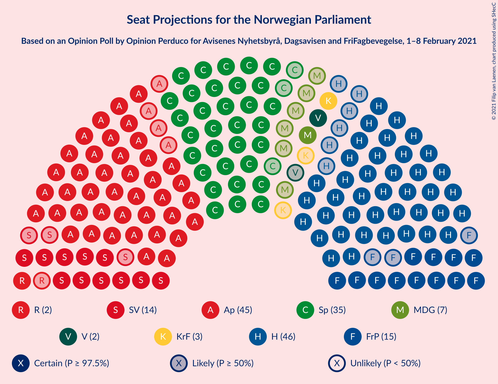
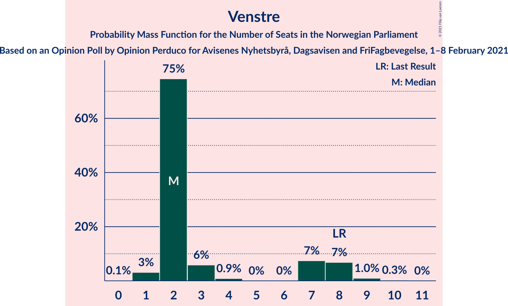
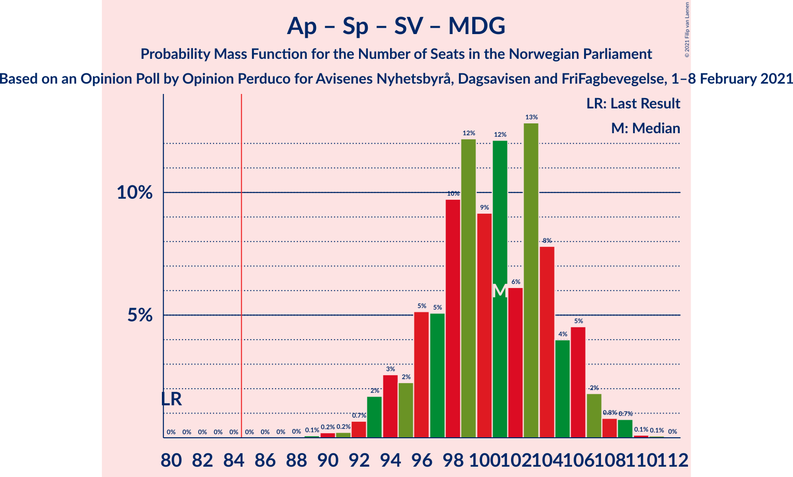
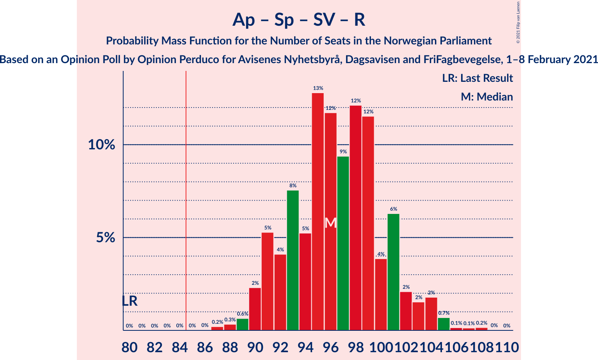
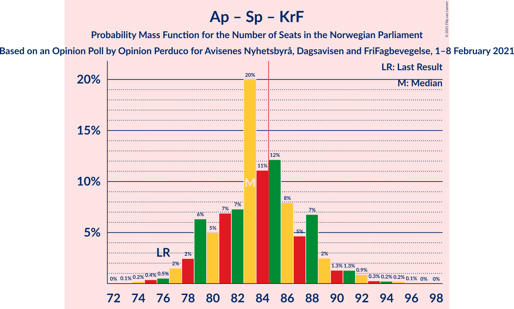
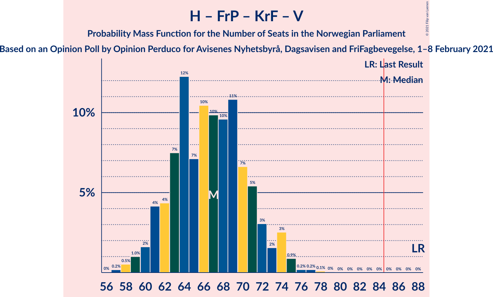

# Opinion Poll by Opinion Perduco for Avisenes Nyhetsbyrå, Dagsavisen and FriFagbevegelse, 1–8 February 2021

<a href="#voting-intentions">Voting Intentions</a> | <a href="#seats">Seats</a> | <a href="#coalitions">Coalitions</a> | <a href="#technical-information">Technical Information</a>

## Voting Intentions

### Confidence Intervals

| Party | Last Result | Poll Result | 80% Confidence Interval | 90% Confidence Interval | 95% Confidence Interval | 99% Confidence Interval |
|:-----:|:-----------:|:-----------:|:-----------------------:|:-----------------------:|:-----------------------:|:-----------------------:|
| Høyre | 25.0% | 25.1% | 23.4–27.0% |22.9–27.5% |22.5–27.9% |21.7–28.9% |
| Arbeiderpartiet | 27.4% | 24.6% | 22.9–26.4% |22.4–26.9% |22.0–27.4% |21.2–28.3% |
| Senterpartiet | 10.3% | 19.1% | 17.5–20.8% |17.1–21.3% |16.7–21.7% |16.0–22.5% |
| Fremskrittspartiet | 15.2% | 8.1% | 7.1–9.3% |6.8–9.7% |6.5–10.0% |6.1–10.6% |
| Sosialistisk Venstreparti | 6.0% | 7.4% | 6.4–8.6% |6.1–8.9% |5.9–9.2% |5.4–9.8% |
| Miljøpartiet De Grønne | 3.2% | 4.0% | 3.3–5.0% |3.1–5.3% |3.0–5.5% |2.7–6.0% |
| Venstre | 4.4% | 3.2% | 2.6–4.1% |2.4–4.3% |2.3–4.5% |2.0–5.0% |
| Kristelig Folkeparti | 4.2% | 3.2% | 2.6–4.1% |2.4–4.3% |2.3–4.5% |2.0–5.0% |
| Rødt | 2.4% | 2.9% | 2.3–3.7% |2.1–4.0% |2.0–4.2% |1.8–4.6% |

*Note:* The poll result column reflects the actual value used in the calculations. Published results may vary slightly, and in addition be rounded to fewer digits.

## Seats

### Confidence Intervals

| Party | Last Result | Median | 80% Confidence Interval | 90% Confidence Interval | 95% Confidence Interval | 99% Confidence Interval |
|:-----:|:-----------:|:------:|:-----------------------:|:-----------------------:|:-----------------------:|:-----------------------:|
| <a href="#høyre">Høyre</a> | 45 | 46 | 42–51 |42–53 |41–53 |40–54 |
| <a href="#arbeiderpartiet">Arbeiderpartiet</a> | 49 | 45 | 41–49 |41–50 |41–50 |38–52 |
| <a href="#senterpartiet">Senterpartiet</a> | 19 | 36 | 33–40 |32–41 |31–41 |30–42 |
| <a href="#fremskrittspartiet">Fremskrittspartiet</a> | 27 | 15 | 13–17 |12–18 |12–19 |11–19 |
| <a href="#sosialistisk-venstreparti">Sosialistisk Venstreparti</a> | 11 | 14 | 11–16 |11–17 |10–17 |10–19 |
| <a href="#miljøpartiet-de-grønne">Miljøpartiet De Grønne</a> | 1 | 7 | 2–9 |2–9 |1–10 |1–11 |
| <a href="#venstre">Venstre</a> | 8 | 2 | 2–8 |2–8 |1–8 |1–9 |
| <a href="#kristelig-folkeparti">Kristelig Folkeparti</a> | 8 | 2 | 1–7 |1–8 |1–8 |0–9 |
| <a href="#rødt">Rødt</a> | 1 | 2 | 1–2 |1–7 |1–8 |1–9 |

### Høyre

*For a full overview of the results for this party, see the [Høyre](party-høyre.html) page.*

| Number of Seats | Probability | Accumulated | Special Marks |
|:---------------:|:-----------:|:-----------:|:-------------:|
| 37 | 0% | 100% |  |
| 38 | 0.2% | 99.9% |  |
| 39 | 0.1% | 99.7% |  |
| 40 | 0.9% | 99.6% |  |
| 41 | 3% | 98.6% |  |
| 42 | 13% | 96% |  |
| 43 | 12% | 83% |  |
| 44 | 12% | 71% |  |
| 45 | 8% | 59% | Last Result |
| 46 | 8% | 51% | Median |
| 47 | 14% | 43% |  |
| 48 | 7% | 29% |  |
| 49 | 6% | 23% |  |
| 50 | 3% | 17% |  |
| 51 | 5% | 14% |  |
| 52 | 2% | 9% |  |
| 53 | 6% | 8% |  |
| 54 | 2% | 2% |  |
| 55 | 0.1% | 0.1% |  |
| 56 | 0% | 0% |  |

### Arbeiderpartiet

*For a full overview of the results for this party, see the [Arbeiderpartiet](party-arbeiderpartiet.html) page.*

| Number of Seats | Probability | Accumulated | Special Marks |
|:---------------:|:-----------:|:-----------:|:-------------:|
| 37 | 0.1% | 100% |  |
| 38 | 0.7% | 99.9% |  |
| 39 | 0.5% | 99.3% |  |
| 40 | 0.7% | 98.8% |  |
| 41 | 9% | 98% |  |
| 42 | 14% | 89% |  |
| 43 | 12% | 75% |  |
| 44 | 7% | 63% |  |
| 45 | 10% | 56% | Median |
| 46 | 5% | 46% |  |
| 47 | 13% | 42% |  |
| 48 | 16% | 29% |  |
| 49 | 7% | 13% | Last Result |
| 50 | 4% | 6% |  |
| 51 | 0.8% | 2% |  |
| 52 | 0.4% | 0.8% |  |
| 53 | 0.3% | 0.4% |  |
| 54 | 0.1% | 0.1% |  |
| 55 | 0% | 0% |  |

### Senterpartiet

*For a full overview of the results for this party, see the [Senterpartiet](party-senterpartiet.html) page.*

| Number of Seats | Probability | Accumulated | Special Marks |
|:---------------:|:-----------:|:-----------:|:-------------:|
| 19 | 0% | 100% | Last Result |
| 20 | 0% | 100% |  |
| 21 | 0% | 100% |  |
| 22 | 0% | 100% |  |
| 23 | 0% | 100% |  |
| 24 | 0% | 100% |  |
| 25 | 0% | 100% |  |
| 26 | 0% | 100% |  |
| 27 | 0% | 100% |  |
| 28 | 0.1% | 100% |  |
| 29 | 0.2% | 99.9% |  |
| 30 | 2% | 99.7% |  |
| 31 | 2% | 98% |  |
| 32 | 3% | 96% |  |
| 33 | 6% | 92% |  |
| 34 | 11% | 86% |  |
| 35 | 22% | 75% |  |
| 36 | 17% | 53% | Median |
| 37 | 9% | 36% |  |
| 38 | 3% | 28% |  |
| 39 | 10% | 24% |  |
| 40 | 9% | 15% |  |
| 41 | 5% | 6% |  |
| 42 | 0.6% | 0.6% |  |
| 43 | 0% | 0.1% |  |
| 44 | 0% | 0% |  |

### Fremskrittspartiet

*For a full overview of the results for this party, see the [Fremskrittspartiet](party-fremskrittspartiet.html) page.*

| Number of Seats | Probability | Accumulated | Special Marks |
|:---------------:|:-----------:|:-----------:|:-------------:|
| 10 | 0.1% | 100% |  |
| 11 | 1.5% | 99.9% |  |
| 12 | 5% | 98% |  |
| 13 | 16% | 94% |  |
| 14 | 24% | 78% |  |
| 15 | 25% | 54% | Median |
| 16 | 8% | 29% |  |
| 17 | 12% | 21% |  |
| 18 | 5% | 9% |  |
| 19 | 3% | 4% |  |
| 20 | 0.3% | 0.4% |  |
| 21 | 0.1% | 0.1% |  |
| 22 | 0% | 0% |  |
| 23 | 0% | 0% |  |
| 24 | 0% | 0% |  |
| 25 | 0% | 0% |  |
| 26 | 0% | 0% |  |
| 27 | 0% | 0% | Last Result |

### Sosialistisk Venstreparti

*For a full overview of the results for this party, see the [Sosialistisk Venstreparti](party-sosialistiskvenstreparti.html) page.*

| Number of Seats | Probability | Accumulated | Special Marks |
|:---------------:|:-----------:|:-----------:|:-------------:|
| 9 | 0.2% | 100% |  |
| 10 | 4% | 99.8% |  |
| 11 | 7% | 96% | Last Result |
| 12 | 11% | 88% |  |
| 13 | 19% | 77% |  |
| 14 | 32% | 58% | Median |
| 15 | 11% | 27% |  |
| 16 | 11% | 16% |  |
| 17 | 3% | 5% |  |
| 18 | 1.2% | 2% |  |
| 19 | 0.4% | 0.6% |  |
| 20 | 0.2% | 0.2% |  |
| 21 | 0% | 0% |  |

### Miljøpartiet De Grønne

*For a full overview of the results for this party, see the [Miljøpartiet De Grønne](party-miljøpartietdegrønne.html) page.*

| Number of Seats | Probability | Accumulated | Special Marks |
|:---------------:|:-----------:|:-----------:|:-------------:|
| 1 | 3% | 100% | Last Result |
| 2 | 30% | 97% |  |
| 3 | 13% | 67% |  |
| 4 | 2% | 53% |  |
| 5 | 0% | 51% |  |
| 6 | 0% | 51% |  |
| 7 | 11% | 51% | Median |
| 8 | 26% | 40% |  |
| 9 | 10% | 14% |  |
| 10 | 2% | 3% |  |
| 11 | 1.1% | 1.4% |  |
| 12 | 0.2% | 0.2% |  |
| 13 | 0% | 0% |  |

### Venstre

*For a full overview of the results for this party, see the [Venstre](party-venstre.html) page.*

| Number of Seats | Probability | Accumulated | Special Marks |
|:---------------:|:-----------:|:-----------:|:-------------:|
| 0 | 0.1% | 100% |  |
| 1 | 5% | 99.9% |  |
| 2 | 68% | 95% | Median |
| 3 | 3% | 27% |  |
| 4 | 0% | 24% |  |
| 5 | 0% | 24% |  |
| 6 | 0% | 24% |  |
| 7 | 13% | 24% |  |
| 8 | 9% | 11% | Last Result |
| 9 | 2% | 2% |  |
| 10 | 0.3% | 0.3% |  |
| 11 | 0% | 0% |  |

### Kristelig Folkeparti

*For a full overview of the results for this party, see the [Kristelig Folkeparti](party-kristeligfolkeparti.html) page.*

| Number of Seats | Probability | Accumulated | Special Marks |
|:---------------:|:-----------:|:-----------:|:-------------:|
| 0 | 1.1% | 100% |  |
| 1 | 39% | 98.9% |  |
| 2 | 17% | 59% | Median |
| 3 | 31% | 42% |  |
| 4 | 0% | 11% |  |
| 5 | 0% | 11% |  |
| 6 | 0% | 11% |  |
| 7 | 3% | 11% |  |
| 8 | 5% | 8% | Last Result |
| 9 | 2% | 2% |  |
| 10 | 0.2% | 0.2% |  |
| 11 | 0% | 0% |  |

### Rødt

*For a full overview of the results for this party, see the [Rødt](party-rødt.html) page.*

| Number of Seats | Probability | Accumulated | Special Marks |
|:---------------:|:-----------:|:-----------:|:-------------:|
| 1 | 45% | 100% | Last Result |
| 2 | 48% | 55% | Median |
| 3 | 0% | 7% |  |
| 4 | 0% | 7% |  |
| 5 | 0% | 7% |  |
| 6 | 0% | 7% |  |
| 7 | 4% | 7% |  |
| 8 | 3% | 3% |  |
| 9 | 0.8% | 0.8% |  |
| 10 | 0% | 0% |  |

## Coalitions

### Confidence Intervals

| Coalition | Last Result | Median | Majority? | 80% Confidence Interval | 90% Confidence Interval | 95% Confidence Interval | 99% Confidence Interval |
|:---------:|:-----------:|:------:|:---------:|:-----------------------:|:-----------------------:|:-----------------------:|:-----------------------:|
| Høyre – Senterpartiet – Fremskrittspartiet – Kristelig Folkeparti – Venstre | 107 | 103 | 100% | 98–107 | 96–110 | 96–111 | 93–111 |
| Arbeiderpartiet – Senterpartiet – Sosialistisk Venstreparti – Miljøpartiet De Grønne – Kristelig Folkeparti | 88 | 103 | 100% | 97–109 | 97–110 | 96–110 | 93–112 |
| Arbeiderpartiet – Senterpartiet – Sosialistisk Venstreparti – Miljøpartiet De Grønne – Rødt | 81 | 102 | 100% | 96–108 | 95–110 | 95–110 | 92–112 |
| Arbeiderpartiet – Senterpartiet – Sosialistisk Venstreparti – Miljøpartiet De Grønne | 80 | 100 | 100% | 94–106 | 94–109 | 94–109 | 90–109 |
| Arbeiderpartiet – Senterpartiet – Sosialistisk Venstreparti – Rødt | 80 | 97 | 100% | 92–102 | 91–104 | 90–104 | 88–106 |
| Arbeiderpartiet – Senterpartiet – Sosialistisk Venstreparti | 79 | 94 | 99.9% | 90–100 | 89–101 | 88–103 | 86–104 |
| Arbeiderpartiet – Senterpartiet – Miljøpartiet De Grønne – Kristelig Folkeparti | 77 | 88 | 81% | 84–96 | 83–96 | 82–97 | 79–98 |
| Arbeiderpartiet – Senterpartiet – Kristelig Folkeparti | 76 | 84 | 43% | 79–88 | 77–91 | 77–92 | 74–94 |
| Arbeiderpartiet – Senterpartiet | 68 | 81 | 16% | 77–87 | 76–87 | 74–90 | 71–90 |
| Høyre – Fremskrittspartiet – Miljøpartiet De Grønne – Kristelig Folkeparti – Venstre | 89 | 72 | 0% | 67–77 | 65–78 | 65–79 | 63–81 |
| Høyre – Fremskrittspartiet – Kristelig Folkeparti – Venstre | 88 | 67 | 0% | 61–73 | 59–74 | 59–74 | 57–77 |
| Høyre – Fremskrittspartiet – Venstre | 80 | 64 | 0% | 58–70 | 58–71 | 57–71 | 55–74 |
| Høyre – Fremskrittspartiet | 72 | 61 | 0% | 56–67 | 56–68 | 55–69 | 53–72 |
| Arbeiderpartiet – Sosialistisk Venstreparti | 60 | 58 | 0% | 55–64 | 54–64 | 53–65 | 52–68 |
| Høyre – Kristelig Folkeparti – Venstre | 61 | 52 | 0% | 46–58 | 45–59 | 45–61 | 44–61 |
| Senterpartiet – Kristelig Folkeparti – Venstre | 35 | 43 | 0% | 37–46 | 37–47 | 34–47 | 33–50 |

### Høyre – Senterpartiet – Fremskrittspartiet – Kristelig Folkeparti – Venstre

| Number of Seats | Probability | Accumulated | Special Marks |
|:---------------:|:-----------:|:-----------:|:-------------:|
| 90 | 0% | 100% |  |
| 91 | 0.1% | 99.9% |  |
| 92 | 0% | 99.8% |  |
| 93 | 0.4% | 99.8% |  |
| 94 | 1.0% | 99.3% |  |
| 95 | 0.7% | 98% |  |
| 96 | 3% | 98% |  |
| 97 | 1.2% | 95% |  |
| 98 | 7% | 93% |  |
| 99 | 4% | 86% |  |
| 100 | 9% | 83% |  |
| 101 | 3% | 73% | Median |
| 102 | 18% | 70% |  |
| 103 | 8% | 52% |  |
| 104 | 14% | 44% |  |
| 105 | 8% | 30% |  |
| 106 | 9% | 22% |  |
| 107 | 4% | 13% | Last Result |
| 108 | 1.3% | 9% |  |
| 109 | 0.7% | 8% |  |
| 110 | 4% | 7% |  |
| 111 | 3% | 4% |  |
| 112 | 0.1% | 0.3% |  |
| 113 | 0.1% | 0.1% |  |
| 114 | 0% | 0.1% |  |
| 115 | 0% | 0% |  |

### Arbeiderpartiet – Senterpartiet – Sosialistisk Venstreparti – Miljøpartiet De Grønne – Kristelig Folkeparti

| Number of Seats | Probability | Accumulated | Special Marks |
|:---------------:|:-----------:|:-----------:|:-------------:|
| 88 | 0% | 100% | Last Result |
| 89 | 0% | 100% |  |
| 90 | 0% | 100% |  |
| 91 | 0% | 100% |  |
| 92 | 0.1% | 99.9% |  |
| 93 | 0.9% | 99.9% |  |
| 94 | 0.1% | 99.0% |  |
| 95 | 0.2% | 98.9% |  |
| 96 | 2% | 98.6% |  |
| 97 | 9% | 97% |  |
| 98 | 6% | 88% |  |
| 99 | 13% | 81% |  |
| 100 | 2% | 68% |  |
| 101 | 5% | 66% |  |
| 102 | 7% | 61% |  |
| 103 | 9% | 54% |  |
| 104 | 12% | 45% | Median |
| 105 | 6% | 33% |  |
| 106 | 4% | 27% |  |
| 107 | 6% | 23% |  |
| 108 | 3% | 17% |  |
| 109 | 6% | 14% |  |
| 110 | 6% | 8% |  |
| 111 | 0.9% | 2% |  |
| 112 | 0.4% | 0.6% |  |
| 113 | 0.2% | 0.2% |  |
| 114 | 0% | 0% |  |

### Arbeiderpartiet – Senterpartiet – Sosialistisk Venstreparti – Miljøpartiet De Grønne – Rødt

| Number of Seats | Probability | Accumulated | Special Marks |
|:---------------:|:-----------:|:-----------:|:-------------:|
| 81 | 0% | 100% | Last Result |
| 82 | 0% | 100% |  |
| 83 | 0% | 100% |  |
| 84 | 0% | 100% |  |
| 85 | 0% | 100% | Majority |
| 86 | 0% | 100% |  |
| 87 | 0% | 100% |  |
| 88 | 0% | 100% |  |
| 89 | 0% | 100% |  |
| 90 | 0% | 100% |  |
| 91 | 0.1% | 99.9% |  |
| 92 | 0.7% | 99.8% |  |
| 93 | 0.2% | 99.1% |  |
| 94 | 0.8% | 98.9% |  |
| 95 | 6% | 98% |  |
| 96 | 2% | 92% |  |
| 97 | 6% | 90% |  |
| 98 | 6% | 84% |  |
| 99 | 11% | 78% |  |
| 100 | 3% | 68% |  |
| 101 | 6% | 65% |  |
| 102 | 11% | 58% |  |
| 103 | 6% | 47% |  |
| 104 | 13% | 41% | Median |
| 105 | 3% | 28% |  |
| 106 | 6% | 25% |  |
| 107 | 6% | 19% |  |
| 108 | 3% | 13% |  |
| 109 | 2% | 9% |  |
| 110 | 5% | 7% |  |
| 111 | 1.5% | 2% |  |
| 112 | 0.5% | 0.6% |  |
| 113 | 0.1% | 0.1% |  |
| 114 | 0% | 0% |  |

### Arbeiderpartiet – Senterpartiet – Sosialistisk Venstreparti – Miljøpartiet De Grønne

| Number of Seats | Probability | Accumulated | Special Marks |
|:---------------:|:-----------:|:-----------:|:-------------:|
| 80 | 0% | 100% | Last Result |
| 81 | 0% | 100% |  |
| 82 | 0% | 100% |  |
| 83 | 0% | 100% |  |
| 84 | 0% | 100% |  |
| 85 | 0% | 100% | Majority |
| 86 | 0% | 100% |  |
| 87 | 0% | 100% |  |
| 88 | 0% | 99.9% |  |
| 89 | 0.1% | 99.9% |  |
| 90 | 0.7% | 99.8% |  |
| 91 | 0.2% | 99.1% |  |
| 92 | 0.5% | 98.9% |  |
| 93 | 0.7% | 98% |  |
| 94 | 8% | 98% |  |
| 95 | 3% | 90% |  |
| 96 | 9% | 86% |  |
| 97 | 2% | 78% |  |
| 98 | 12% | 76% |  |
| 99 | 6% | 64% |  |
| 100 | 11% | 58% |  |
| 101 | 10% | 47% |  |
| 102 | 11% | 37% | Median |
| 103 | 5% | 26% |  |
| 104 | 5% | 21% |  |
| 105 | 2% | 15% |  |
| 106 | 5% | 13% |  |
| 107 | 1.2% | 8% |  |
| 108 | 2% | 7% |  |
| 109 | 5% | 5% |  |
| 110 | 0.1% | 0.4% |  |
| 111 | 0.4% | 0.4% |  |
| 112 | 0% | 0% |  |

### Arbeiderpartiet – Senterpartiet – Sosialistisk Venstreparti – Rødt

| Number of Seats | Probability | Accumulated | Special Marks |
|:---------------:|:-----------:|:-----------:|:-------------:|
| 80 | 0% | 100% | Last Result |
| 81 | 0% | 100% |  |
| 82 | 0% | 100% |  |
| 83 | 0% | 100% |  |
| 84 | 0% | 100% |  |
| 85 | 0% | 100% | Majority |
| 86 | 0.1% | 100% |  |
| 87 | 0.1% | 99.9% |  |
| 88 | 0.6% | 99.8% |  |
| 89 | 0.7% | 99.2% |  |
| 90 | 3% | 98.6% |  |
| 91 | 5% | 96% |  |
| 92 | 10% | 91% |  |
| 93 | 5% | 80% |  |
| 94 | 6% | 75% |  |
| 95 | 9% | 69% |  |
| 96 | 9% | 60% |  |
| 97 | 4% | 51% | Median |
| 98 | 7% | 48% |  |
| 99 | 8% | 41% |  |
| 100 | 10% | 33% |  |
| 101 | 11% | 24% |  |
| 102 | 6% | 13% |  |
| 103 | 2% | 7% |  |
| 104 | 4% | 5% |  |
| 105 | 0.9% | 1.5% |  |
| 106 | 0.1% | 0.5% |  |
| 107 | 0.3% | 0.4% |  |
| 108 | 0.1% | 0.2% |  |
| 109 | 0% | 0% |  |

### Arbeiderpartiet – Senterpartiet – Sosialistisk Venstreparti

| Number of Seats | Probability | Accumulated | Special Marks |
|:---------------:|:-----------:|:-----------:|:-------------:|
| 79 | 0% | 100% | Last Result |
| 80 | 0% | 100% |  |
| 81 | 0% | 100% |  |
| 82 | 0% | 100% |  |
| 83 | 0% | 100% |  |
| 84 | 0.1% | 100% |  |
| 85 | 0.2% | 99.9% | Majority |
| 86 | 0.6% | 99.7% |  |
| 87 | 0.7% | 99.2% |  |
| 88 | 1.3% | 98.5% |  |
| 89 | 3% | 97% |  |
| 90 | 6% | 94% |  |
| 91 | 11% | 88% |  |
| 92 | 7% | 78% |  |
| 93 | 7% | 70% |  |
| 94 | 14% | 63% |  |
| 95 | 5% | 50% | Median |
| 96 | 9% | 45% |  |
| 97 | 7% | 36% |  |
| 98 | 9% | 29% |  |
| 99 | 10% | 21% |  |
| 100 | 2% | 10% |  |
| 101 | 5% | 9% |  |
| 102 | 0.5% | 4% |  |
| 103 | 3% | 4% |  |
| 104 | 0.4% | 0.7% |  |
| 105 | 0.1% | 0.3% |  |
| 106 | 0.2% | 0.2% |  |
| 107 | 0% | 0% |  |

### Arbeiderpartiet – Senterpartiet – Miljøpartiet De Grønne – Kristelig Folkeparti

| Number of Seats | Probability | Accumulated | Special Marks |
|:---------------:|:-----------:|:-----------:|:-------------:|
| 77 | 0% | 100% | Last Result |
| 78 | 0.1% | 100% |  |
| 79 | 0.9% | 99.9% |  |
| 80 | 1.0% | 99.1% |  |
| 81 | 0.1% | 98% |  |
| 82 | 2% | 98% |  |
| 83 | 5% | 96% |  |
| 84 | 10% | 91% |  |
| 85 | 6% | 81% | Majority |
| 86 | 5% | 76% |  |
| 87 | 7% | 70% |  |
| 88 | 15% | 63% |  |
| 89 | 6% | 48% |  |
| 90 | 8% | 43% | Median |
| 91 | 6% | 34% |  |
| 92 | 4% | 29% |  |
| 93 | 2% | 25% |  |
| 94 | 6% | 23% |  |
| 95 | 2% | 17% |  |
| 96 | 12% | 15% |  |
| 97 | 3% | 3% |  |
| 98 | 0.2% | 0.5% |  |
| 99 | 0.2% | 0.4% |  |
| 100 | 0.1% | 0.2% |  |
| 101 | 0.1% | 0.1% |  |
| 102 | 0% | 0% |  |

### Arbeiderpartiet – Senterpartiet – Kristelig Folkeparti

| Number of Seats | Probability | Accumulated | Special Marks |
|:---------------:|:-----------:|:-----------:|:-------------:|
| 72 | 0% | 100% |  |
| 73 | 0% | 99.9% |  |
| 74 | 0.8% | 99.9% |  |
| 75 | 0.5% | 99.0% |  |
| 76 | 0.4% | 98.5% | Last Result |
| 77 | 3% | 98% |  |
| 78 | 5% | 95% |  |
| 79 | 6% | 90% |  |
| 80 | 5% | 84% |  |
| 81 | 4% | 79% |  |
| 82 | 14% | 75% |  |
| 83 | 9% | 61% | Median |
| 84 | 8% | 52% |  |
| 85 | 8% | 43% | Majority |
| 86 | 8% | 35% |  |
| 87 | 8% | 27% |  |
| 88 | 10% | 19% |  |
| 89 | 3% | 10% |  |
| 90 | 0.8% | 6% |  |
| 91 | 3% | 6% |  |
| 92 | 2% | 3% |  |
| 93 | 0.1% | 1.1% |  |
| 94 | 1.0% | 1.0% |  |
| 95 | 0% | 0% |  |

### Arbeiderpartiet – Senterpartiet

| Number of Seats | Probability | Accumulated | Special Marks |
|:---------------:|:-----------:|:-----------:|:-------------:|
| 68 | 0% | 100% | Last Result |
| 69 | 0% | 100% |  |
| 70 | 0% | 100% |  |
| 71 | 0.5% | 100% |  |
| 72 | 0.1% | 99.5% |  |
| 73 | 0.5% | 99.4% |  |
| 74 | 2% | 98.9% |  |
| 75 | 0.3% | 97% |  |
| 76 | 3% | 97% |  |
| 77 | 9% | 94% |  |
| 78 | 9% | 84% |  |
| 79 | 5% | 75% |  |
| 80 | 11% | 70% |  |
| 81 | 12% | 59% | Median |
| 82 | 8% | 46% |  |
| 83 | 18% | 39% |  |
| 84 | 5% | 21% |  |
| 85 | 4% | 16% | Majority |
| 86 | 2% | 12% |  |
| 87 | 7% | 10% |  |
| 88 | 0.2% | 4% |  |
| 89 | 0.4% | 3% |  |
| 90 | 3% | 3% |  |
| 91 | 0% | 0.1% |  |
| 92 | 0.1% | 0.1% |  |
| 93 | 0% | 0% |  |

### Høyre – Fremskrittspartiet – Miljøpartiet De Grønne – Kristelig Folkeparti – Venstre

| Number of Seats | Probability | Accumulated | Special Marks |
|:---------------:|:-----------:|:-----------:|:-------------:|
| 61 | 0.1% | 100% |  |
| 62 | 0.3% | 99.8% |  |
| 63 | 0.2% | 99.5% |  |
| 64 | 1.0% | 99.4% |  |
| 65 | 4% | 98% |  |
| 66 | 2% | 94% |  |
| 67 | 6% | 93% |  |
| 68 | 11% | 87% |  |
| 69 | 10% | 76% |  |
| 70 | 8% | 67% |  |
| 71 | 7% | 59% |  |
| 72 | 4% | 52% | Median |
| 73 | 9% | 49% |  |
| 74 | 9% | 39% |  |
| 75 | 6% | 31% |  |
| 76 | 5% | 25% |  |
| 77 | 10% | 20% |  |
| 78 | 5% | 9% |  |
| 79 | 3% | 4% |  |
| 80 | 0.6% | 1.4% |  |
| 81 | 0.6% | 0.7% |  |
| 82 | 0.1% | 0.2% |  |
| 83 | 0.1% | 0.1% |  |
| 84 | 0% | 0% |  |
| 85 | 0% | 0% | Majority |
| 86 | 0% | 0% |  |
| 87 | 0% | 0% |  |
| 88 | 0% | 0% |  |
| 89 | 0% | 0% | Last Result |

### Høyre – Fremskrittspartiet – Kristelig Folkeparti – Venstre

| Number of Seats | Probability | Accumulated | Special Marks |
|:---------------:|:-----------:|:-----------:|:-------------:|
| 56 | 0.1% | 100% |  |
| 57 | 0.5% | 99.9% |  |
| 58 | 1.5% | 99.4% |  |
| 59 | 5% | 98% |  |
| 60 | 2% | 93% |  |
| 61 | 3% | 90% |  |
| 62 | 6% | 87% |  |
| 63 | 6% | 81% |  |
| 64 | 3% | 75% |  |
| 65 | 13% | 72% | Median |
| 66 | 6% | 59% |  |
| 67 | 11% | 53% |  |
| 68 | 6% | 41% |  |
| 69 | 3% | 35% |  |
| 70 | 10% | 32% |  |
| 71 | 6% | 22% |  |
| 72 | 6% | 16% |  |
| 73 | 2% | 10% |  |
| 74 | 6% | 8% |  |
| 75 | 0.8% | 2% |  |
| 76 | 0.2% | 1.1% |  |
| 77 | 0.7% | 0.9% |  |
| 78 | 0.1% | 0.2% |  |
| 79 | 0% | 0.1% |  |
| 80 | 0% | 0% |  |
| 81 | 0% | 0% |  |
| 82 | 0% | 0% |  |
| 83 | 0% | 0% |  |
| 84 | 0% | 0% |  |
| 85 | 0% | 0% | Majority |
| 86 | 0% | 0% |  |
| 87 | 0% | 0% |  |
| 88 | 0% | 0% | Last Result |

### Høyre – Fremskrittspartiet – Venstre

| Number of Seats | Probability | Accumulated | Special Marks |
|:---------------:|:-----------:|:-----------:|:-------------:|
| 54 | 0.2% | 100% |  |
| 55 | 0.7% | 99.8% |  |
| 56 | 0.7% | 99.0% |  |
| 57 | 3% | 98% |  |
| 58 | 11% | 95% |  |
| 59 | 5% | 85% |  |
| 60 | 3% | 80% |  |
| 61 | 6% | 77% |  |
| 62 | 8% | 71% |  |
| 63 | 8% | 63% | Median |
| 64 | 10% | 54% |  |
| 65 | 7% | 44% |  |
| 66 | 4% | 37% |  |
| 67 | 3% | 34% |  |
| 68 | 2% | 31% |  |
| 69 | 17% | 29% |  |
| 70 | 4% | 12% |  |
| 71 | 7% | 9% |  |
| 72 | 0.5% | 2% |  |
| 73 | 0.1% | 1.1% |  |
| 74 | 0.9% | 1.0% |  |
| 75 | 0.1% | 0.1% |  |
| 76 | 0% | 0% |  |
| 77 | 0% | 0% |  |
| 78 | 0% | 0% |  |
| 79 | 0% | 0% |  |
| 80 | 0% | 0% | Last Result |

### Høyre – Fremskrittspartiet

| Number of Seats | Probability | Accumulated | Special Marks |
|:---------------:|:-----------:|:-----------:|:-------------:|
| 50 | 0% | 100% |  |
| 51 | 0% | 99.9% |  |
| 52 | 0.2% | 99.9% |  |
| 53 | 0.9% | 99.7% |  |
| 54 | 0.9% | 98.8% |  |
| 55 | 3% | 98% |  |
| 56 | 11% | 95% |  |
| 57 | 7% | 84% |  |
| 58 | 4% | 78% |  |
| 59 | 8% | 74% |  |
| 60 | 9% | 66% |  |
| 61 | 14% | 58% | Median |
| 62 | 18% | 44% |  |
| 63 | 4% | 26% |  |
| 64 | 9% | 22% |  |
| 65 | 1.0% | 13% |  |
| 66 | 1.3% | 12% |  |
| 67 | 4% | 10% |  |
| 68 | 3% | 6% |  |
| 69 | 1.4% | 3% |  |
| 70 | 0.3% | 1.2% |  |
| 71 | 0.1% | 1.0% |  |
| 72 | 0.8% | 0.9% | Last Result |
| 73 | 0.1% | 0.1% |  |
| 74 | 0% | 0% |  |

### Arbeiderpartiet – Sosialistisk Venstreparti

| Number of Seats | Probability | Accumulated | Special Marks |
|:---------------:|:-----------:|:-----------:|:-------------:|
| 49 | 0.1% | 100% |  |
| 50 | 0.1% | 99.9% |  |
| 51 | 0.2% | 99.8% |  |
| 52 | 0.3% | 99.6% |  |
| 53 | 3% | 99.3% |  |
| 54 | 2% | 96% |  |
| 55 | 18% | 94% |  |
| 56 | 9% | 76% |  |
| 57 | 11% | 68% |  |
| 58 | 8% | 57% |  |
| 59 | 5% | 49% | Median |
| 60 | 5% | 44% | Last Result |
| 61 | 11% | 40% |  |
| 62 | 11% | 29% |  |
| 63 | 8% | 18% |  |
| 64 | 8% | 11% |  |
| 65 | 2% | 3% |  |
| 66 | 0.1% | 1.0% |  |
| 67 | 0.2% | 0.9% |  |
| 68 | 0.5% | 0.7% |  |
| 69 | 0.1% | 0.2% |  |
| 70 | 0.1% | 0.1% |  |
| 71 | 0% | 0% |  |

### Høyre – Kristelig Folkeparti – Venstre

| Number of Seats | Probability | Accumulated | Special Marks |
|:---------------:|:-----------:|:-----------:|:-------------:|
| 42 | 0.1% | 100% |  |
| 43 | 0.1% | 99.9% |  |
| 44 | 1.1% | 99.8% |  |
| 45 | 8% | 98.7% |  |
| 46 | 7% | 91% |  |
| 47 | 5% | 84% |  |
| 48 | 6% | 79% |  |
| 49 | 7% | 73% |  |
| 50 | 2% | 66% | Median |
| 51 | 9% | 64% |  |
| 52 | 9% | 55% |  |
| 53 | 12% | 45% |  |
| 54 | 4% | 33% |  |
| 55 | 3% | 29% |  |
| 56 | 12% | 26% |  |
| 57 | 2% | 14% |  |
| 58 | 3% | 13% |  |
| 59 | 6% | 10% |  |
| 60 | 0.2% | 4% |  |
| 61 | 3% | 4% | Last Result |
| 62 | 0.1% | 0.2% |  |
| 63 | 0.1% | 0.1% |  |
| 64 | 0% | 0.1% |  |
| 65 | 0% | 0% |  |

### Senterpartiet – Kristelig Folkeparti – Venstre

| Number of Seats | Probability | Accumulated | Special Marks |
|:---------------:|:-----------:|:-----------:|:-------------:|
| 31 | 0% | 100% |  |
| 32 | 0.2% | 99.9% |  |
| 33 | 1.2% | 99.8% |  |
| 34 | 1.2% | 98.5% |  |
| 35 | 0.7% | 97% | Last Result |
| 36 | 1.4% | 97% |  |
| 37 | 6% | 95% |  |
| 38 | 3% | 90% |  |
| 39 | 10% | 86% |  |
| 40 | 10% | 77% | Median |
| 41 | 6% | 67% |  |
| 42 | 10% | 61% |  |
| 43 | 21% | 51% |  |
| 44 | 7% | 30% |  |
| 45 | 8% | 23% |  |
| 46 | 9% | 15% |  |
| 47 | 4% | 6% |  |
| 48 | 0.2% | 2% |  |
| 49 | 0.6% | 2% |  |
| 50 | 0.7% | 1.0% |  |
| 51 | 0.1% | 0.3% |  |
| 52 | 0.1% | 0.2% |  |
| 53 | 0% | 0.1% |  |
| 54 | 0% | 0.1% |  |
| 55 | 0% | 0% |  |

## Technical Information

### Opinion Poll

+ **Polling firm:** Opinion Perduco
+ **Commissioner(s):** Avisenes Nyhetsbyrå, Dagsavisen and FriFagbevegelse
+ **Fieldwork period:** 1–8 February 2021

### Calculations

+ **Sample size:** 964
+ **Simulations done:** 131,072
+ **Error estimate:** 3.05%

