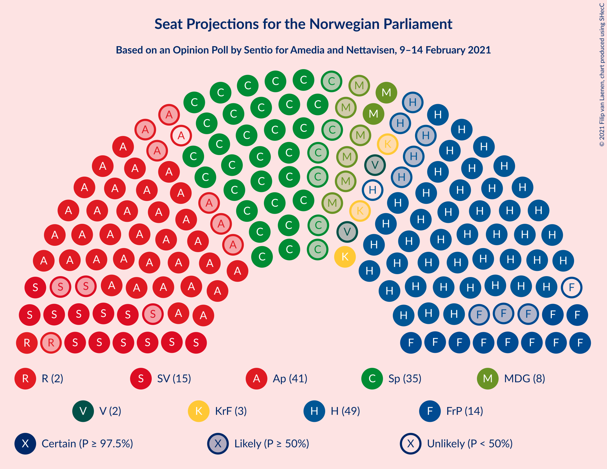
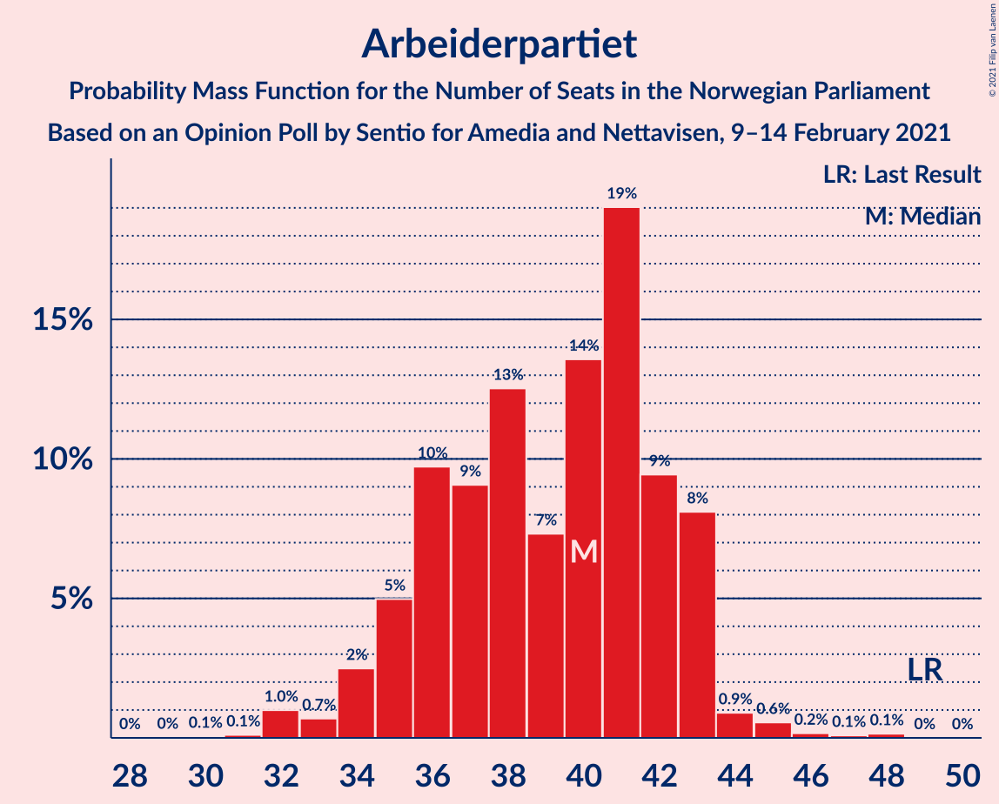
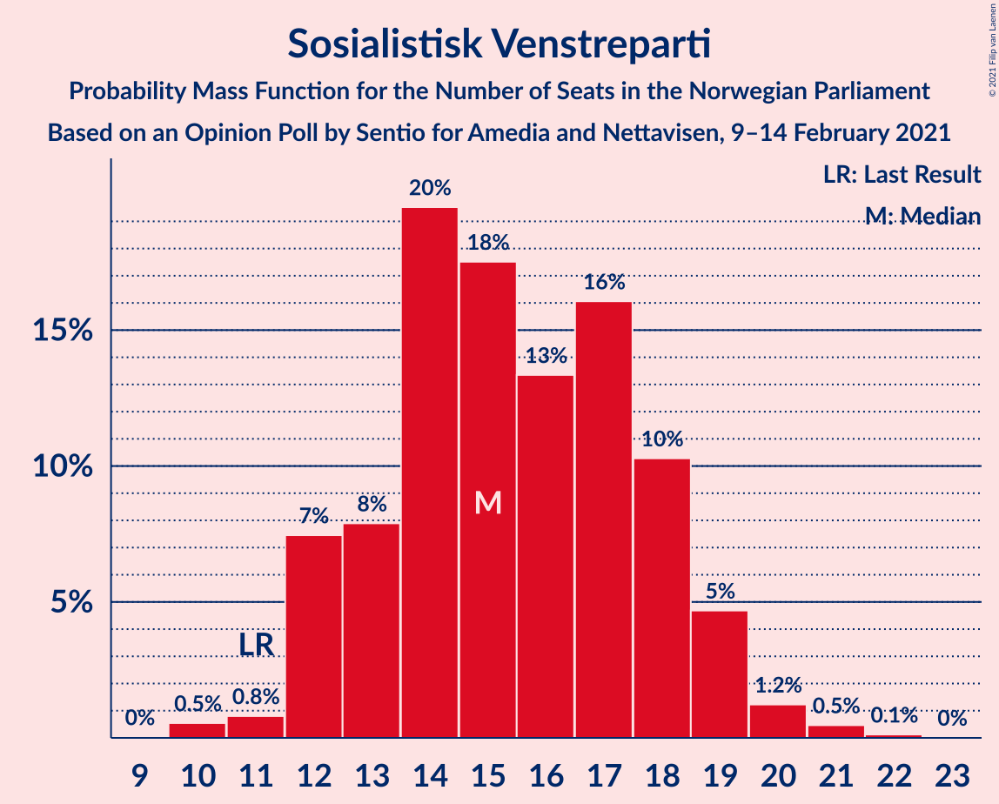
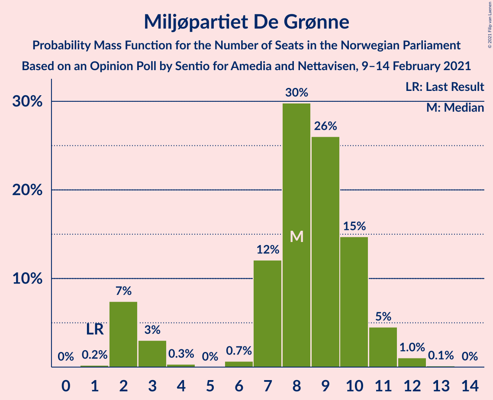
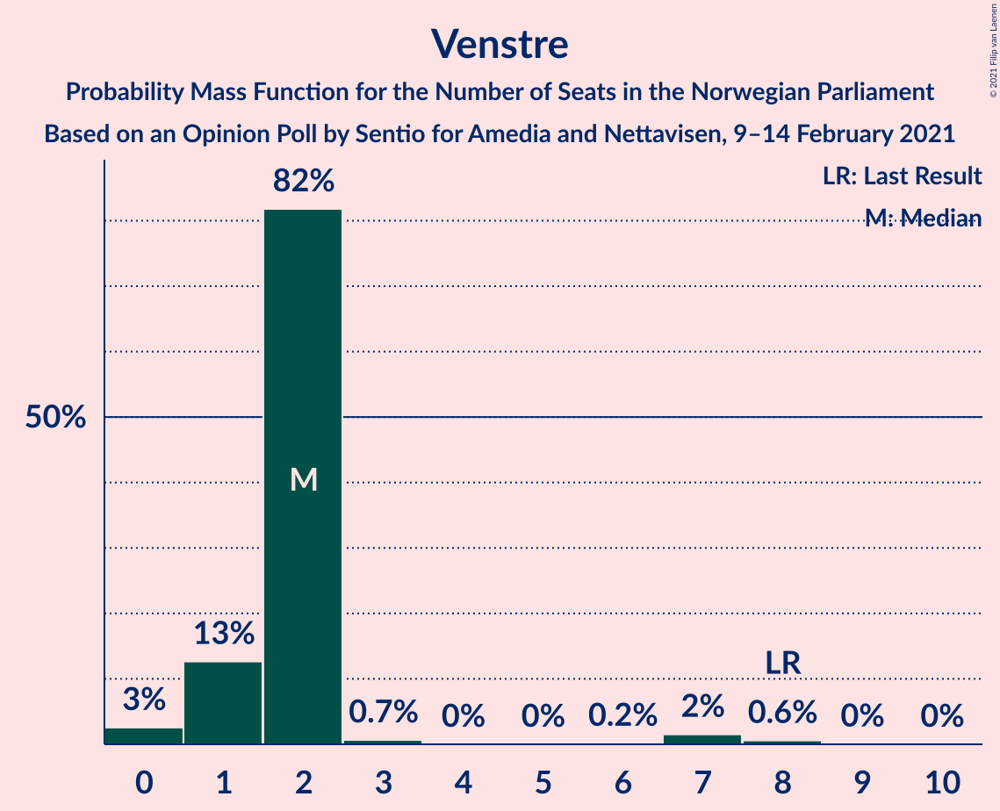
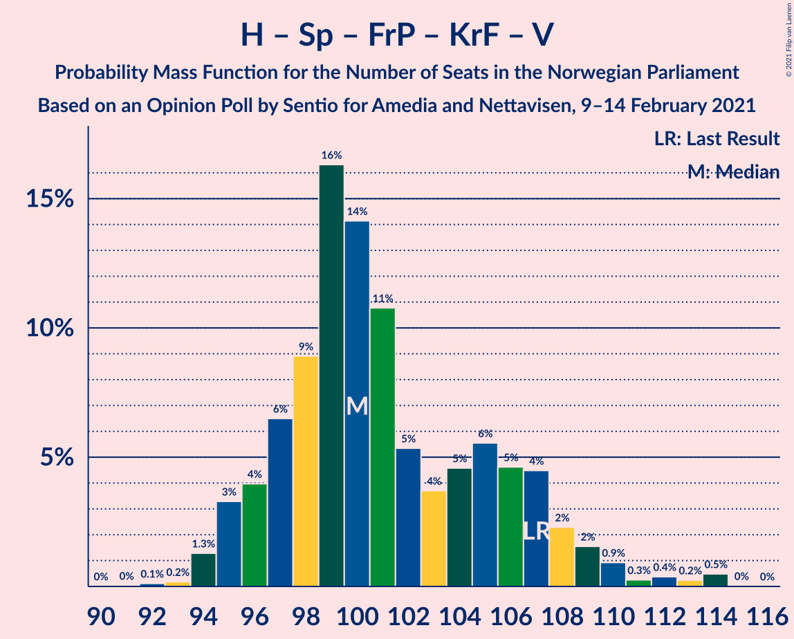
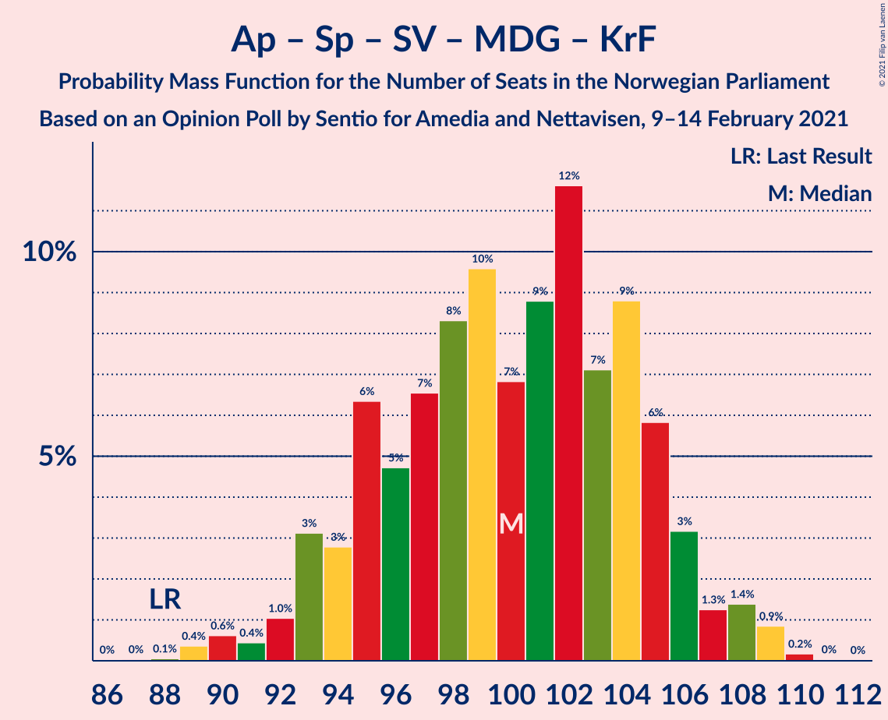
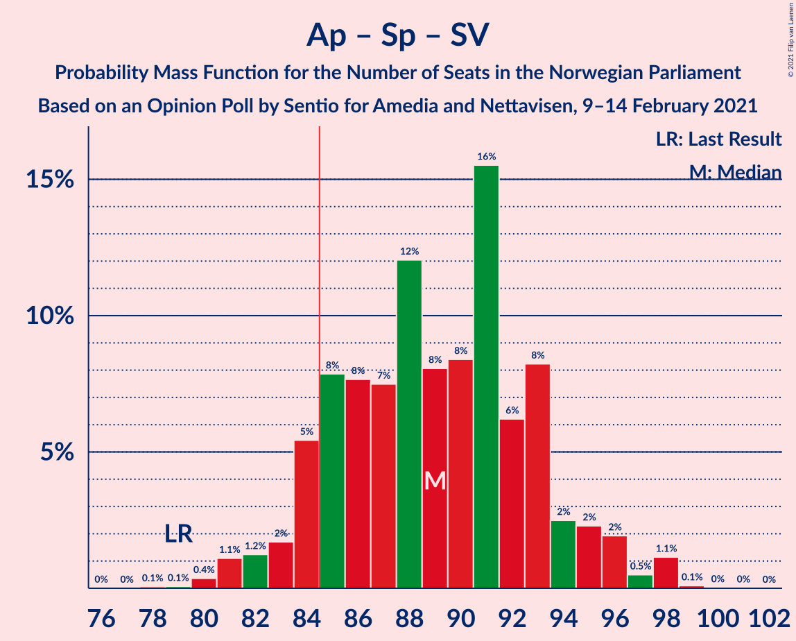
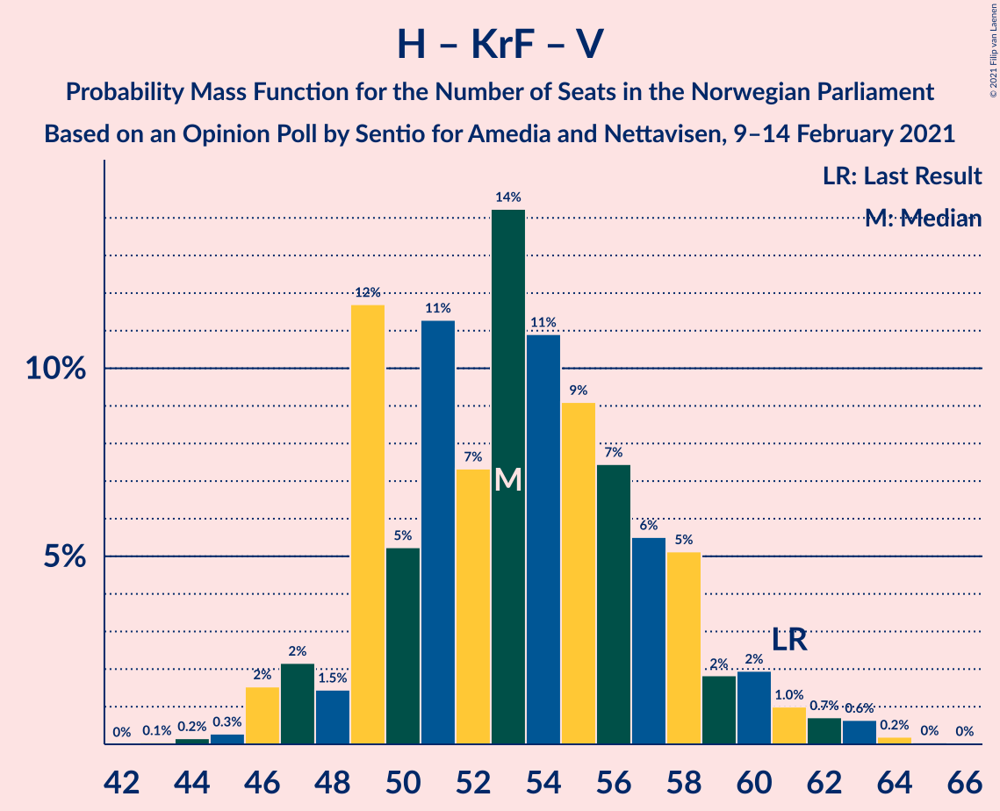
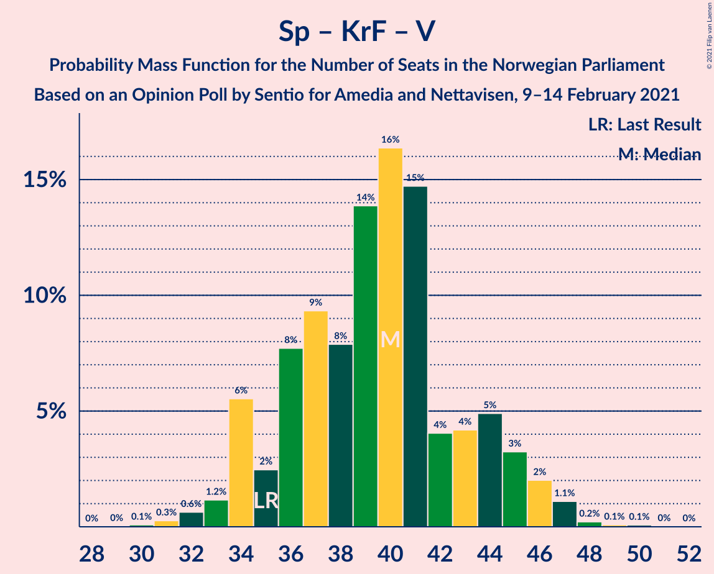

# Opinion Poll by Sentio for Amedia and Nettavisen, 9–14 February 2021

<a href="#voting-intentions">Voting Intentions</a> | <a href="#seats">Seats</a> | <a href="#coalitions">Coalitions</a> | <a href="#technical-information">Technical Information</a>

## Voting Intentions

### Confidence Intervals

| Party | Last Result | Poll Result | 80% Confidence Interval | 90% Confidence Interval | 95% Confidence Interval | 99% Confidence Interval |
|:-----:|:-----------:|:-----------:|:-----------------------:|:-----------------------:|:-----------------------:|:-----------------------:|
| Høyre | 25.0% | 26.9% | 25.1–28.8% |24.7–29.3% |24.2–29.7% |23.4–30.7% |
| Arbeiderpartiet | 27.4% | 21.0% | 19.4–22.7% |19.0–23.2% |18.6–23.6% |17.8–24.5% |
| Senterpartiet | 10.3% | 18.4% | 16.9–20.1% |16.5–20.5% |16.1–20.9% |15.4–21.7% |
| Sosialistisk Venstreparti | 6.0% | 8.6% | 7.6–9.8% |7.3–10.2% |7.0–10.5% |6.5–11.1% |
| Fremskrittspartiet | 15.2% | 7.5% | 6.5–8.7% |6.2–9.0% |6.0–9.3% |5.6–9.9% |
| Miljøpartiet De Grønne | 3.2% | 4.7% | 3.9–5.7% |3.7–6.0% |3.6–6.2% |3.2–6.7% |
| Rødt | 2.4% | 3.8% | 3.1–4.7% |2.9–5.0% |2.8–5.2% |2.5–5.6% |
| Kristelig Folkeparti | 4.2% | 3.3% | 2.7–4.1% |2.5–4.4% |2.4–4.6% |2.1–5.0% |
| Venstre | 4.4% | 2.7% | 2.1–3.5% |2.0–3.7% |1.9–3.9% |1.6–4.3% |

*Note:* The poll result column reflects the actual value used in the calculations. Published results may vary slightly, and in addition be rounded to fewer digits.

## Seats

### Confidence Intervals

| Party | Last Result | Median | 80% Confidence Interval | 90% Confidence Interval | 95% Confidence Interval | 99% Confidence Interval |
|:-----:|:-----------:|:------:|:-----------------------:|:-----------------------:|:-----------------------:|:-----------------------:|
| <a href="#høyre">Høyre</a> | 45 | 48 | 44–53 |43–54 |42–54 |41–57 |
| <a href="#arbeiderpartiet">Arbeiderpartiet</a> | 49 | 40 | 36–43 |33–43 |32–43 |32–45 |
| <a href="#senterpartiet">Senterpartiet</a> | 19 | 35 | 31–36 |30–37 |30–37 |28–40 |
| <a href="#sosialistisk-venstreparti">Sosialistisk Venstreparti</a> | 11 | 16 | 13–18 |12–18 |10–19 |10–21 |
| <a href="#fremskrittspartiet">Fremskrittspartiet</a> | 27 | 14 | 11–16 |10–16 |10–17 |9–18 |
| <a href="#miljøpartiet-de-grønne">Miljøpartiet De Grønne</a> | 1 | 8 | 2–10 |2–11 |2–11 |2–12 |
| <a href="#rødt">Rødt</a> | 1 | 7 | 2–8 |2–8 |2–9 |1–9 |
| <a href="#kristelig-folkeparti">Kristelig Folkeparti</a> | 8 | 3 | 1–7 |1–8 |1–8 |0–8 |
| <a href="#venstre">Venstre</a> | 8 | 2 | 1–2 |1–7 |1–7 |0–7 |

### Høyre

*For a full overview of the results for this party, see the [Høyre](party-høyre.html) page.*

| Number of Seats | Probability | Accumulated | Special Marks |
|:---------------:|:-----------:|:-----------:|:-------------:|
| 39 | 0% | 100% |  |
| 40 | 0.4% | 99.9% |  |
| 41 | 0.2% | 99.5% |  |
| 42 | 2% | 99.3% |  |
| 43 | 6% | 97% |  |
| 44 | 9% | 91% |  |
| 45 | 7% | 82% | Last Result |
| 46 | 11% | 75% |  |
| 47 | 5% | 64% |  |
| 48 | 9% | 58% | Median |
| 49 | 6% | 49% |  |
| 50 | 2% | 43% |  |
| 51 | 16% | 40% |  |
| 52 | 14% | 25% |  |
| 53 | 3% | 11% |  |
| 54 | 6% | 8% |  |
| 55 | 1.0% | 2% |  |
| 56 | 0.1% | 1.1% |  |
| 57 | 0.9% | 1.0% |  |
| 58 | 0.1% | 0.1% |  |
| 59 | 0% | 0.1% |  |
| 60 | 0% | 0% |  |

### Arbeiderpartiet

*For a full overview of the results for this party, see the [Arbeiderpartiet](party-arbeiderpartiet.html) page.*

| Number of Seats | Probability | Accumulated | Special Marks |
|:---------------:|:-----------:|:-----------:|:-------------:|
| 30 | 0% | 100% |  |
| 31 | 0.1% | 99.9% |  |
| 32 | 4% | 99.9% |  |
| 33 | 1.2% | 96% |  |
| 34 | 0.8% | 94% |  |
| 35 | 2% | 94% |  |
| 36 | 16% | 91% |  |
| 37 | 9% | 75% |  |
| 38 | 8% | 67% |  |
| 39 | 4% | 58% |  |
| 40 | 13% | 54% | Median |
| 41 | 23% | 42% |  |
| 42 | 2% | 18% |  |
| 43 | 14% | 17% |  |
| 44 | 1.2% | 2% |  |
| 45 | 0.7% | 1.0% |  |
| 46 | 0.2% | 0.2% |  |
| 47 | 0% | 0.1% |  |
| 48 | 0% | 0% |  |
| 49 | 0% | 0% | Last Result |

### Senterpartiet

*For a full overview of the results for this party, see the [Senterpartiet](party-senterpartiet.html) page.*

| Number of Seats | Probability | Accumulated | Special Marks |
|:---------------:|:-----------:|:-----------:|:-------------:|
| 19 | 0% | 100% | Last Result |
| 20 | 0% | 100% |  |
| 21 | 0% | 100% |  |
| 22 | 0% | 100% |  |
| 23 | 0% | 100% |  |
| 24 | 0% | 100% |  |
| 25 | 0% | 100% |  |
| 26 | 0% | 100% |  |
| 27 | 0.1% | 100% |  |
| 28 | 1.3% | 99.9% |  |
| 29 | 0.7% | 98.6% |  |
| 30 | 6% | 98% |  |
| 31 | 11% | 92% |  |
| 32 | 5% | 81% |  |
| 33 | 6% | 76% |  |
| 34 | 14% | 70% |  |
| 35 | 22% | 55% | Median |
| 36 | 25% | 34% |  |
| 37 | 6% | 8% |  |
| 38 | 2% | 2% |  |
| 39 | 0.4% | 0.9% |  |
| 40 | 0.2% | 0.5% |  |
| 41 | 0.1% | 0.3% |  |
| 42 | 0.2% | 0.2% |  |
| 43 | 0% | 0% |  |

### Sosialistisk Venstreparti

*For a full overview of the results for this party, see the [Sosialistisk Venstreparti](party-sosialistiskvenstreparti.html) page.*

| Number of Seats | Probability | Accumulated | Special Marks |
|:---------------:|:-----------:|:-----------:|:-------------:|
| 10 | 3% | 100% |  |
| 11 | 1.0% | 97% | Last Result |
| 12 | 6% | 96% |  |
| 13 | 15% | 90% |  |
| 14 | 12% | 75% |  |
| 15 | 11% | 63% |  |
| 16 | 12% | 53% | Median |
| 17 | 22% | 41% |  |
| 18 | 14% | 18% |  |
| 19 | 2% | 5% |  |
| 20 | 2% | 2% |  |
| 21 | 0.3% | 0.6% |  |
| 22 | 0.3% | 0.3% |  |
| 23 | 0% | 0% |  |

### Fremskrittspartiet

*For a full overview of the results for this party, see the [Fremskrittspartiet](party-fremskrittspartiet.html) page.*

| Number of Seats | Probability | Accumulated | Special Marks |
|:---------------:|:-----------:|:-----------:|:-------------:|
| 9 | 1.2% | 100% |  |
| 10 | 7% | 98.8% |  |
| 11 | 8% | 92% |  |
| 12 | 17% | 84% |  |
| 13 | 13% | 67% |  |
| 14 | 26% | 54% | Median |
| 15 | 17% | 28% |  |
| 16 | 8% | 11% |  |
| 17 | 2% | 3% |  |
| 18 | 0.4% | 0.6% |  |
| 19 | 0.1% | 0.2% |  |
| 20 | 0.1% | 0.1% |  |
| 21 | 0% | 0% |  |
| 22 | 0% | 0% |  |
| 23 | 0% | 0% |  |
| 24 | 0% | 0% |  |
| 25 | 0% | 0% |  |
| 26 | 0% | 0% |  |
| 27 | 0% | 0% | Last Result |

### Miljøpartiet De Grønne

*For a full overview of the results for this party, see the [Miljøpartiet De Grønne](party-miljøpartietdegrønne.html) page.*

| Number of Seats | Probability | Accumulated | Special Marks |
|:---------------:|:-----------:|:-----------:|:-------------:|
| 1 | 0.1% | 100% | Last Result |
| 2 | 14% | 99.9% |  |
| 3 | 8% | 86% |  |
| 4 | 0% | 78% |  |
| 5 | 0% | 78% |  |
| 6 | 4% | 78% |  |
| 7 | 13% | 75% |  |
| 8 | 29% | 62% | Median |
| 9 | 12% | 33% |  |
| 10 | 14% | 21% |  |
| 11 | 6% | 7% |  |
| 12 | 0.7% | 0.7% |  |
| 13 | 0% | 0% |  |

### Rødt

*For a full overview of the results for this party, see the [Rødt](party-rødt.html) page.*

| Number of Seats | Probability | Accumulated | Special Marks |
|:---------------:|:-----------:|:-----------:|:-------------:|
| 1 | 2% | 100% | Last Result |
| 2 | 37% | 98% |  |
| 3 | 0% | 61% |  |
| 4 | 0% | 61% |  |
| 5 | 0% | 61% |  |
| 6 | 4% | 61% |  |
| 7 | 25% | 57% | Median |
| 8 | 28% | 32% |  |
| 9 | 4% | 4% |  |
| 10 | 0.2% | 0.2% |  |
| 11 | 0.1% | 0.1% |  |
| 12 | 0% | 0% |  |

### Kristelig Folkeparti

*For a full overview of the results for this party, see the [Kristelig Folkeparti](party-kristeligfolkeparti.html) page.*

| Number of Seats | Probability | Accumulated | Special Marks |
|:---------------:|:-----------:|:-----------:|:-------------:|
| 0 | 1.2% | 100% |  |
| 1 | 30% | 98.8% |  |
| 2 | 12% | 69% |  |
| 3 | 33% | 57% | Median |
| 4 | 0% | 24% |  |
| 5 | 0% | 24% |  |
| 6 | 3% | 24% |  |
| 7 | 14% | 21% |  |
| 8 | 7% | 8% | Last Result |
| 9 | 0.1% | 0.3% |  |
| 10 | 0.2% | 0.2% |  |
| 11 | 0% | 0% |  |

### Venstre

*For a full overview of the results for this party, see the [Venstre](party-venstre.html) page.*

| Number of Seats | Probability | Accumulated | Special Marks |
|:---------------:|:-----------:|:-----------:|:-------------:|
| 0 | 2% | 100% |  |
| 1 | 14% | 98% |  |
| 2 | 77% | 84% | Median |
| 3 | 0.3% | 6% |  |
| 4 | 0% | 6% |  |
| 5 | 0% | 6% |  |
| 6 | 0.2% | 6% |  |
| 7 | 6% | 6% |  |
| 8 | 0.1% | 0.1% | Last Result |
| 9 | 0% | 0% |  |

## Coalitions

### Confidence Intervals

| Coalition | Last Result | Median | Majority? | 80% Confidence Interval | 90% Confidence Interval | 95% Confidence Interval | 99% Confidence Interval |
|:---------:|:-----------:|:------:|:---------:|:-----------------------:|:-----------------------:|:-----------------------:|:-----------------------:|
| Arbeiderpartiet – Senterpartiet – Sosialistisk Venstreparti – Miljøpartiet De Grønne – Rødt | 81 | 101 | 100% | 96–107 | 93–109 | 93–110 | 90–111 |
| Høyre – Senterpartiet – Fremskrittspartiet – Kristelig Folkeparti – Venstre | 107 | 101 | 100% | 96–107 | 95–107 | 94–108 | 93–113 |
| Arbeiderpartiet – Senterpartiet – Sosialistisk Venstreparti – Miljøpartiet De Grønne – Kristelig Folkeparti | 88 | 99 | 100% | 93–104 | 93–105 | 91–107 | 89–108 |
| Arbeiderpartiet – Senterpartiet – Sosialistisk Venstreparti – Miljøpartiet De Grønne | 80 | 96 | 100% | 92–102 | 88–103 | 87–104 | 87–105 |
| Arbeiderpartiet – Senterpartiet – Sosialistisk Venstreparti – Rødt | 80 | 93 | 99.5% | 88–100 | 87–100 | 87–102 | 84–102 |
| Arbeiderpartiet – Senterpartiet – Sosialistisk Venstreparti | 79 | 89 | 86% | 84–93 | 83–94 | 81–95 | 80–97 |
| Arbeiderpartiet – Senterpartiet – Miljøpartiet De Grønne – Kristelig Folkeparti | 77 | 84 | 45% | 77–90 | 76–91 | 76–91 | 74–93 |
| Arbeiderpartiet – Senterpartiet – Kristelig Folkeparti | 76 | 77 | 6% | 70–82 | 68–85 | 68–85 | 68–86 |
| Høyre – Fremskrittspartiet – Miljøpartiet De Grønne – Kristelig Folkeparti – Venstre | 89 | 75 | 0.2% | 69–78 | 68–81 | 67–81 | 67–84 |
| Arbeiderpartiet – Senterpartiet | 68 | 74 | 0% | 68–78 | 67–78 | 67–79 | 66–79 |
| Høyre – Fremskrittspartiet – Kristelig Folkeparti – Venstre | 88 | 68 | 0% | 61–72 | 60–73 | 59–73 | 58–77 |
| Høyre – Fremskrittspartiet – Venstre | 80 | 64 | 0% | 59–69 | 57–70 | 57–72 | 55–73 |
| Høyre – Fremskrittspartiet | 72 | 62 | 0% | 56–67 | 55–69 | 55–70 | 54–71 |
| Arbeiderpartiet – Sosialistisk Venstreparti | 60 | 55 | 0% | 49–59 | 48–59 | 48–61 | 47–63 |
| Høyre – Kristelig Folkeparti – Venstre | 61 | 55 | 0% | 48–58 | 46–60 | 46–60 | 46–62 |
| Senterpartiet – Kristelig Folkeparti – Venstre | 35 | 39 | 0% | 34–45 | 34–46 | 34–46 | 32–47 |

### Arbeiderpartiet – Senterpartiet – Sosialistisk Venstreparti – Miljøpartiet De Grønne – Rødt

| Number of Seats | Probability | Accumulated | Special Marks |
|:---------------:|:-----------:|:-----------:|:-------------:|
| 81 | 0% | 100% | Last Result |
| 82 | 0% | 100% |  |
| 83 | 0% | 100% |  |
| 84 | 0% | 100% |  |
| 85 | 0% | 100% | Majority |
| 86 | 0% | 100% |  |
| 87 | 0% | 100% |  |
| 88 | 0% | 100% |  |
| 89 | 0% | 100% |  |
| 90 | 0.5% | 99.9% |  |
| 91 | 0.1% | 99.4% |  |
| 92 | 0.7% | 99.3% |  |
| 93 | 4% | 98.6% |  |
| 94 | 2% | 95% |  |
| 95 | 2% | 93% |  |
| 96 | 4% | 91% |  |
| 97 | 6% | 87% |  |
| 98 | 4% | 81% |  |
| 99 | 9% | 77% |  |
| 100 | 17% | 67% |  |
| 101 | 7% | 50% |  |
| 102 | 4% | 43% |  |
| 103 | 13% | 39% |  |
| 104 | 5% | 26% |  |
| 105 | 5% | 21% |  |
| 106 | 1.3% | 16% | Median |
| 107 | 5% | 14% |  |
| 108 | 2% | 9% |  |
| 109 | 3% | 7% |  |
| 110 | 3% | 4% |  |
| 111 | 0.6% | 0.7% |  |
| 112 | 0.1% | 0.1% |  |
| 113 | 0% | 0% |  |

### Høyre – Senterpartiet – Fremskrittspartiet – Kristelig Folkeparti – Venstre

| Number of Seats | Probability | Accumulated | Special Marks |
|:---------------:|:-----------:|:-----------:|:-------------:|
| 92 | 0.4% | 100% |  |
| 93 | 0.4% | 99.5% |  |
| 94 | 3% | 99.2% |  |
| 95 | 6% | 96% |  |
| 96 | 2% | 90% |  |
| 97 | 2% | 88% |  |
| 98 | 7% | 86% |  |
| 99 | 2% | 79% |  |
| 100 | 22% | 77% |  |
| 101 | 12% | 55% |  |
| 102 | 5% | 43% | Median |
| 103 | 7% | 38% |  |
| 104 | 8% | 31% |  |
| 105 | 8% | 23% |  |
| 106 | 4% | 15% |  |
| 107 | 8% | 11% | Last Result |
| 108 | 1.3% | 3% |  |
| 109 | 0.6% | 2% |  |
| 110 | 0.3% | 1.3% |  |
| 111 | 0.3% | 1.0% |  |
| 112 | 0.1% | 0.7% |  |
| 113 | 0.5% | 0.6% |  |
| 114 | 0% | 0% |  |

### Arbeiderpartiet – Senterpartiet – Sosialistisk Venstreparti – Miljøpartiet De Grønne – Kristelig Folkeparti

| Number of Seats | Probability | Accumulated | Special Marks |
|:---------------:|:-----------:|:-----------:|:-------------:|
| 87 | 0% | 100% |  |
| 88 | 0.1% | 99.9% | Last Result |
| 89 | 2% | 99.9% |  |
| 90 | 0.3% | 98% |  |
| 91 | 0.6% | 98% |  |
| 92 | 0.2% | 97% |  |
| 93 | 12% | 97% |  |
| 94 | 2% | 85% |  |
| 95 | 4% | 82% |  |
| 96 | 4% | 78% |  |
| 97 | 10% | 74% |  |
| 98 | 8% | 65% |  |
| 99 | 8% | 56% |  |
| 100 | 9% | 48% |  |
| 101 | 9% | 39% |  |
| 102 | 2% | 30% | Median |
| 103 | 8% | 28% |  |
| 104 | 11% | 20% |  |
| 105 | 5% | 9% |  |
| 106 | 0.8% | 4% |  |
| 107 | 3% | 3% |  |
| 108 | 0.5% | 0.7% |  |
| 109 | 0.1% | 0.1% |  |
| 110 | 0% | 0.1% |  |
| 111 | 0% | 0% |  |

### Arbeiderpartiet – Senterpartiet – Sosialistisk Venstreparti – Miljøpartiet De Grønne

| Number of Seats | Probability | Accumulated | Special Marks |
|:---------------:|:-----------:|:-----------:|:-------------:|
| 80 | 0% | 100% | Last Result |
| 81 | 0% | 100% |  |
| 82 | 0% | 100% |  |
| 83 | 0% | 100% |  |
| 84 | 0% | 100% |  |
| 85 | 0% | 100% | Majority |
| 86 | 0% | 99.9% |  |
| 87 | 4% | 99.9% |  |
| 88 | 2% | 96% |  |
| 89 | 0.2% | 94% |  |
| 90 | 1.0% | 93% |  |
| 91 | 1.0% | 92% |  |
| 92 | 13% | 91% |  |
| 93 | 8% | 78% |  |
| 94 | 11% | 70% |  |
| 95 | 8% | 59% |  |
| 96 | 11% | 51% |  |
| 97 | 10% | 40% |  |
| 98 | 3% | 29% |  |
| 99 | 3% | 26% | Median |
| 100 | 3% | 23% |  |
| 101 | 9% | 20% |  |
| 102 | 4% | 10% |  |
| 103 | 3% | 6% |  |
| 104 | 0.4% | 3% |  |
| 105 | 2% | 2% |  |
| 106 | 0% | 0.1% |  |
| 107 | 0% | 0% |  |

### Arbeiderpartiet – Senterpartiet – Sosialistisk Venstreparti – Rødt

| Number of Seats | Probability | Accumulated | Special Marks |
|:---------------:|:-----------:|:-----------:|:-------------:|
| 80 | 0% | 100% | Last Result |
| 81 | 0% | 100% |  |
| 82 | 0.1% | 99.9% |  |
| 83 | 0.1% | 99.9% |  |
| 84 | 0.4% | 99.8% |  |
| 85 | 0.9% | 99.5% | Majority |
| 86 | 0.9% | 98.6% |  |
| 87 | 4% | 98% |  |
| 88 | 4% | 93% |  |
| 89 | 3% | 90% |  |
| 90 | 2% | 87% |  |
| 91 | 8% | 85% |  |
| 92 | 14% | 78% |  |
| 93 | 15% | 63% |  |
| 94 | 9% | 49% |  |
| 95 | 6% | 40% |  |
| 96 | 7% | 34% |  |
| 97 | 6% | 27% |  |
| 98 | 4% | 21% | Median |
| 99 | 4% | 17% |  |
| 100 | 8% | 13% |  |
| 101 | 2% | 5% |  |
| 102 | 3% | 3% |  |
| 103 | 0.2% | 0.2% |  |
| 104 | 0% | 0% |  |

### Arbeiderpartiet – Senterpartiet – Sosialistisk Venstreparti

| Number of Seats | Probability | Accumulated | Special Marks |
|:---------------:|:-----------:|:-----------:|:-------------:|
| 78 | 0.3% | 100% |  |
| 79 | 0.1% | 99.7% | Last Result |
| 80 | 0.4% | 99.6% |  |
| 81 | 3% | 99.2% |  |
| 82 | 0.8% | 96% |  |
| 83 | 0.9% | 95% |  |
| 84 | 9% | 94% |  |
| 85 | 15% | 86% | Majority |
| 86 | 6% | 71% |  |
| 87 | 8% | 65% |  |
| 88 | 4% | 57% |  |
| 89 | 9% | 53% |  |
| 90 | 5% | 44% |  |
| 91 | 8% | 39% | Median |
| 92 | 9% | 31% |  |
| 93 | 12% | 22% |  |
| 94 | 6% | 10% |  |
| 95 | 3% | 4% |  |
| 96 | 0.7% | 1.3% |  |
| 97 | 0.6% | 0.7% |  |
| 98 | 0% | 0.1% |  |
| 99 | 0% | 0% |  |

### Arbeiderpartiet – Senterpartiet – Miljøpartiet De Grønne – Kristelig Folkeparti

| Number of Seats | Probability | Accumulated | Special Marks |
|:---------------:|:-----------:|:-----------:|:-------------:|
| 72 | 0.1% | 100% |  |
| 73 | 0.2% | 99.9% |  |
| 74 | 2% | 99.7% |  |
| 75 | 0.1% | 98% |  |
| 76 | 6% | 98% |  |
| 77 | 2% | 92% | Last Result |
| 78 | 2% | 89% |  |
| 79 | 8% | 88% |  |
| 80 | 9% | 80% |  |
| 81 | 3% | 71% |  |
| 82 | 9% | 68% |  |
| 83 | 5% | 59% |  |
| 84 | 10% | 55% |  |
| 85 | 8% | 45% | Majority |
| 86 | 8% | 37% | Median |
| 87 | 7% | 29% |  |
| 88 | 5% | 22% |  |
| 89 | 5% | 18% |  |
| 90 | 4% | 13% |  |
| 91 | 8% | 9% |  |
| 92 | 0.2% | 1.2% |  |
| 93 | 0.6% | 1.0% |  |
| 94 | 0.3% | 0.4% |  |
| 95 | 0% | 0.1% |  |
| 96 | 0% | 0% |  |

### Arbeiderpartiet – Senterpartiet – Kristelig Folkeparti

| Number of Seats | Probability | Accumulated | Special Marks |
|:---------------:|:-----------:|:-----------:|:-------------:|
| 65 | 0.1% | 100% |  |
| 66 | 0.2% | 99.9% |  |
| 67 | 0.1% | 99.7% |  |
| 68 | 6% | 99.7% |  |
| 69 | 3% | 93% |  |
| 70 | 1.5% | 91% |  |
| 71 | 9% | 89% |  |
| 72 | 3% | 80% |  |
| 73 | 2% | 77% |  |
| 74 | 8% | 75% |  |
| 75 | 4% | 66% |  |
| 76 | 6% | 62% | Last Result |
| 77 | 13% | 56% |  |
| 78 | 9% | 42% | Median |
| 79 | 8% | 34% |  |
| 80 | 2% | 26% |  |
| 81 | 9% | 24% |  |
| 82 | 6% | 15% |  |
| 83 | 3% | 9% |  |
| 84 | 0.9% | 7% |  |
| 85 | 4% | 6% | Majority |
| 86 | 2% | 2% |  |
| 87 | 0% | 0.1% |  |
| 88 | 0% | 0% |  |

### Høyre – Fremskrittspartiet – Miljøpartiet De Grønne – Kristelig Folkeparti – Venstre

| Number of Seats | Probability | Accumulated | Special Marks |
|:---------------:|:-----------:|:-----------:|:-------------:|
| 64 | 0.1% | 100% |  |
| 65 | 0.1% | 99.9% |  |
| 66 | 0.2% | 99.8% |  |
| 67 | 3% | 99.6% |  |
| 68 | 2% | 97% |  |
| 69 | 8% | 94% |  |
| 70 | 6% | 86% |  |
| 71 | 4% | 80% |  |
| 72 | 6% | 76% |  |
| 73 | 7% | 69% |  |
| 74 | 6% | 62% |  |
| 75 | 9% | 56% | Median |
| 76 | 17% | 48% |  |
| 77 | 13% | 30% |  |
| 78 | 8% | 17% |  |
| 79 | 2% | 9% |  |
| 80 | 2% | 7% |  |
| 81 | 3% | 5% |  |
| 82 | 0.8% | 2% |  |
| 83 | 0.2% | 1.2% |  |
| 84 | 0.8% | 1.0% |  |
| 85 | 0.1% | 0.2% | Majority |
| 86 | 0% | 0.1% |  |
| 87 | 0% | 0.1% |  |
| 88 | 0% | 0% |  |
| 89 | 0% | 0% | Last Result |

### Arbeiderpartiet – Senterpartiet

| Number of Seats | Probability | Accumulated | Special Marks |
|:---------------:|:-----------:|:-----------:|:-------------:|
| 63 | 0.1% | 100% |  |
| 64 | 0.1% | 99.9% |  |
| 65 | 0.2% | 99.8% |  |
| 66 | 0.4% | 99.6% |  |
| 67 | 7% | 99.2% |  |
| 68 | 6% | 93% | Last Result |
| 69 | 5% | 86% |  |
| 70 | 7% | 81% |  |
| 71 | 14% | 75% |  |
| 72 | 6% | 60% |  |
| 73 | 2% | 54% |  |
| 74 | 7% | 52% |  |
| 75 | 12% | 45% | Median |
| 76 | 10% | 33% |  |
| 77 | 4% | 23% |  |
| 78 | 14% | 19% |  |
| 79 | 4% | 5% |  |
| 80 | 0.3% | 0.4% |  |
| 81 | 0.1% | 0.1% |  |
| 82 | 0% | 0.1% |  |
| 83 | 0% | 0% |  |

### Høyre – Fremskrittspartiet – Kristelig Folkeparti – Venstre

| Number of Seats | Probability | Accumulated | Special Marks |
|:---------------:|:-----------:|:-----------:|:-------------:|
| 57 | 0.1% | 100% |  |
| 58 | 0.6% | 99.8% |  |
| 59 | 3% | 99.2% |  |
| 60 | 4% | 96% |  |
| 61 | 3% | 93% |  |
| 62 | 5% | 90% |  |
| 63 | 1.4% | 85% |  |
| 64 | 5% | 83% |  |
| 65 | 6% | 78% |  |
| 66 | 13% | 72% |  |
| 67 | 6% | 59% | Median |
| 68 | 7% | 53% |  |
| 69 | 17% | 46% |  |
| 70 | 12% | 29% |  |
| 71 | 4% | 16% |  |
| 72 | 6% | 12% |  |
| 73 | 4% | 6% |  |
| 74 | 0.4% | 2% |  |
| 75 | 0.4% | 2% |  |
| 76 | 0.6% | 1.4% |  |
| 77 | 0.5% | 0.7% |  |
| 78 | 0.1% | 0.2% |  |
| 79 | 0.1% | 0.1% |  |
| 80 | 0% | 0% |  |
| 81 | 0% | 0% |  |
| 82 | 0% | 0% |  |
| 83 | 0% | 0% |  |
| 84 | 0% | 0% |  |
| 85 | 0% | 0% | Majority |
| 86 | 0% | 0% |  |
| 87 | 0% | 0% |  |
| 88 | 0% | 0% | Last Result |

### Høyre – Fremskrittspartiet – Venstre

| Number of Seats | Probability | Accumulated | Special Marks |
|:---------------:|:-----------:|:-----------:|:-------------:|
| 54 | 0.2% | 100% |  |
| 55 | 0.3% | 99.8% |  |
| 56 | 0.7% | 99.5% |  |
| 57 | 4% | 98.8% |  |
| 58 | 4% | 94% |  |
| 59 | 5% | 90% |  |
| 60 | 9% | 85% |  |
| 61 | 2% | 76% |  |
| 62 | 7% | 74% |  |
| 63 | 14% | 67% |  |
| 64 | 10% | 53% | Median |
| 65 | 6% | 43% |  |
| 66 | 6% | 36% |  |
| 67 | 7% | 30% |  |
| 68 | 12% | 23% |  |
| 69 | 6% | 11% |  |
| 70 | 0.4% | 5% |  |
| 71 | 1.0% | 5% |  |
| 72 | 3% | 4% |  |
| 73 | 0.6% | 0.8% |  |
| 74 | 0.1% | 0.2% |  |
| 75 | 0% | 0.1% |  |
| 76 | 0% | 0.1% |  |
| 77 | 0% | 0.1% |  |
| 78 | 0% | 0% |  |
| 79 | 0% | 0% |  |
| 80 | 0% | 0% | Last Result |

### Høyre – Fremskrittspartiet

| Number of Seats | Probability | Accumulated | Special Marks |
|:---------------:|:-----------:|:-----------:|:-------------:|
| 52 | 0.1% | 100% |  |
| 53 | 0.3% | 99.9% |  |
| 54 | 0.6% | 99.6% |  |
| 55 | 4% | 98.9% |  |
| 56 | 5% | 95% |  |
| 57 | 2% | 90% |  |
| 58 | 14% | 87% |  |
| 59 | 4% | 73% |  |
| 60 | 7% | 69% |  |
| 61 | 10% | 61% |  |
| 62 | 11% | 51% | Median |
| 63 | 4% | 40% |  |
| 64 | 6% | 37% |  |
| 65 | 8% | 31% |  |
| 66 | 12% | 23% |  |
| 67 | 6% | 11% |  |
| 68 | 0.2% | 5% |  |
| 69 | 1.1% | 5% |  |
| 70 | 3% | 4% |  |
| 71 | 0.6% | 0.9% |  |
| 72 | 0.1% | 0.2% | Last Result |
| 73 | 0.1% | 0.2% |  |
| 74 | 0% | 0.1% |  |
| 75 | 0% | 0% |  |

### Arbeiderpartiet – Sosialistisk Venstreparti

| Number of Seats | Probability | Accumulated | Special Marks |
|:---------------:|:-----------:|:-----------:|:-------------:|
| 43 | 0.1% | 100% |  |
| 44 | 0% | 99.9% |  |
| 45 | 0.1% | 99.9% |  |
| 46 | 0.1% | 99.9% |  |
| 47 | 0.6% | 99.7% |  |
| 48 | 6% | 99.1% |  |
| 49 | 9% | 94% |  |
| 50 | 3% | 85% |  |
| 51 | 1.3% | 82% |  |
| 52 | 8% | 80% |  |
| 53 | 13% | 72% |  |
| 54 | 9% | 59% |  |
| 55 | 5% | 50% |  |
| 56 | 12% | 45% | Median |
| 57 | 7% | 33% |  |
| 58 | 11% | 26% |  |
| 59 | 10% | 15% |  |
| 60 | 0.6% | 5% | Last Result |
| 61 | 3% | 4% |  |
| 62 | 0.2% | 1.0% |  |
| 63 | 0.5% | 0.8% |  |
| 64 | 0.3% | 0.3% |  |
| 65 | 0% | 0% |  |

### Høyre – Kristelig Folkeparti – Venstre

| Number of Seats | Probability | Accumulated | Special Marks |
|:---------------:|:-----------:|:-----------:|:-------------:|
| 43 | 0.1% | 100% |  |
| 44 | 0.1% | 99.8% |  |
| 45 | 0.1% | 99.8% |  |
| 46 | 6% | 99.7% |  |
| 47 | 3% | 94% |  |
| 48 | 0.8% | 90% |  |
| 49 | 2% | 89% |  |
| 50 | 4% | 87% |  |
| 51 | 15% | 83% |  |
| 52 | 3% | 68% |  |
| 53 | 6% | 65% | Median |
| 54 | 5% | 59% |  |
| 55 | 15% | 55% |  |
| 56 | 17% | 40% |  |
| 57 | 11% | 24% |  |
| 58 | 3% | 13% |  |
| 59 | 3% | 9% |  |
| 60 | 4% | 6% |  |
| 61 | 0.8% | 2% | Last Result |
| 62 | 0.9% | 1.2% |  |
| 63 | 0.2% | 0.3% |  |
| 64 | 0% | 0.1% |  |
| 65 | 0% | 0.1% |  |
| 66 | 0% | 0% |  |

### Senterpartiet – Kristelig Folkeparti – Venstre

| Number of Seats | Probability | Accumulated | Special Marks |
|:---------------:|:-----------:|:-----------:|:-------------:|
| 30 | 0.2% | 100% |  |
| 31 | 0.2% | 99.8% |  |
| 32 | 0.5% | 99.6% |  |
| 33 | 1.4% | 99.1% |  |
| 34 | 8% | 98% |  |
| 35 | 7% | 90% | Last Result |
| 36 | 4% | 83% |  |
| 37 | 12% | 79% |  |
| 38 | 4% | 67% |  |
| 39 | 14% | 63% |  |
| 40 | 12% | 48% | Median |
| 41 | 10% | 36% |  |
| 42 | 1.4% | 26% |  |
| 43 | 4% | 24% |  |
| 44 | 6% | 20% |  |
| 45 | 8% | 15% |  |
| 46 | 5% | 7% |  |
| 47 | 2% | 2% |  |
| 48 | 0.1% | 0.3% |  |
| 49 | 0.1% | 0.2% |  |
| 50 | 0.1% | 0.1% |  |
| 51 | 0% | 0% |  |

## Technical Information

### Opinion Poll

+ **Polling firm:** Sentio
+ **Commissioner(s):** Amedia and Nettavisen
+ **Fieldwork period:** 9–14 February 2021

### Calculations

+ **Sample size:** 1000
+ **Simulations done:** 131,072
+ **Error estimate:** 2.21%

