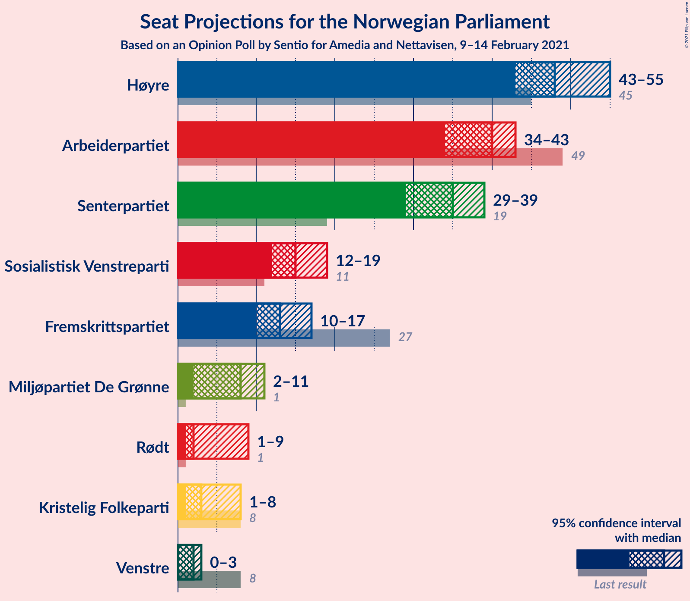
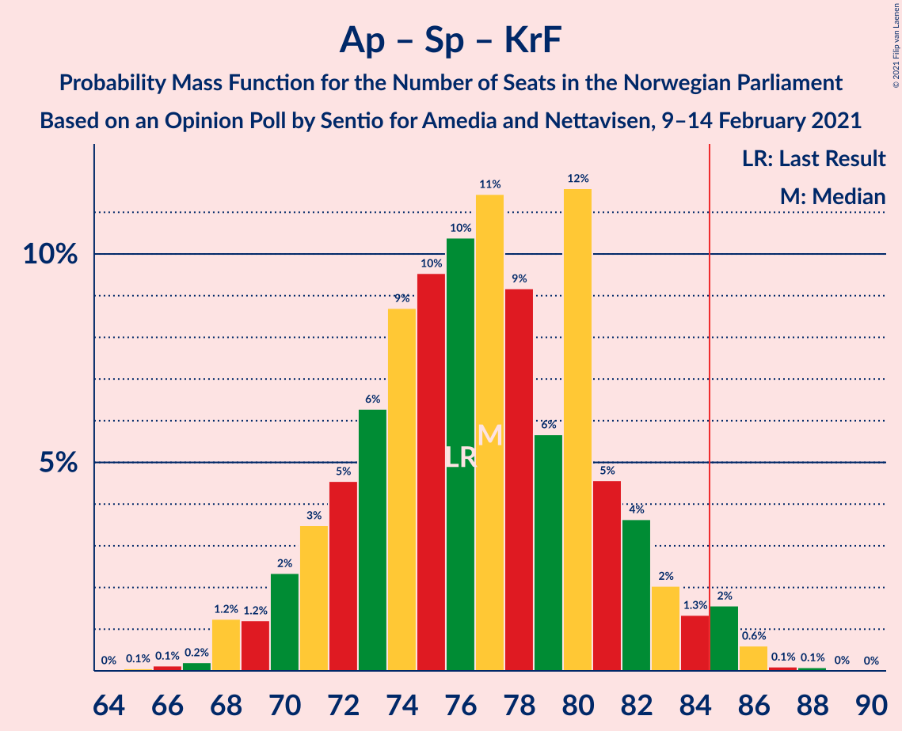
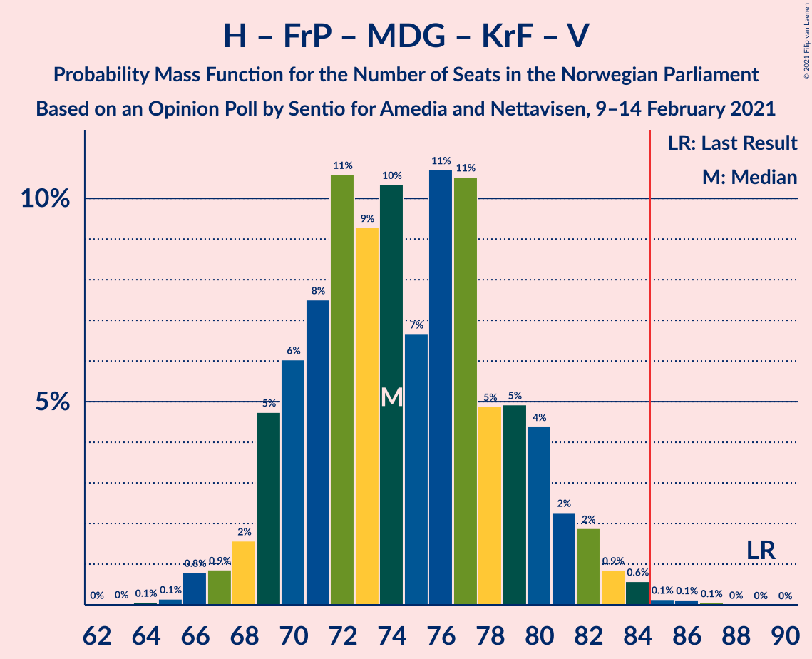
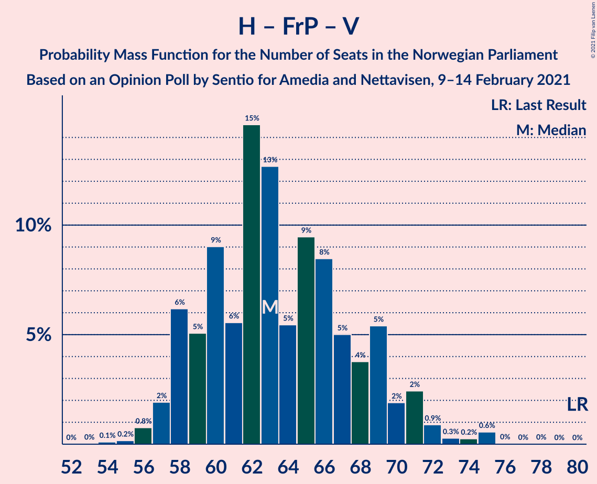

# Opinion Poll by Sentio for Amedia and Nettavisen, 9–14 February 2021

<a href="#voting-intentions">Voting Intentions</a> | <a href="#seats">Seats</a> | <a href="#coalitions">Coalitions</a> | <a href="#technical-information">Technical Information</a>

## Voting Intentions

### Confidence Intervals

| Party | Last Result | Poll Result | 80% Confidence Interval | 90% Confidence Interval | 95% Confidence Interval | 99% Confidence Interval |
|:-----:|:-----------:|:-----------:|:-----------------------:|:-----------------------:|:-----------------------:|:-----------------------:|
| Høyre | 25.0% | 26.9% | 25.1–28.8% |24.7–29.3% |24.2–29.7% |23.4–30.7% |
| Arbeiderpartiet | 27.4% | 21.0% | 19.4–22.7% |19.0–23.2% |18.6–23.6% |17.8–24.5% |
| Senterpartiet | 10.3% | 18.4% | 16.9–20.1% |16.5–20.5% |16.1–20.9% |15.4–21.7% |
| Sosialistisk Venstreparti | 6.0% | 8.6% | 7.6–9.8% |7.3–10.2% |7.0–10.5% |6.5–11.1% |
| Fremskrittspartiet | 15.2% | 7.5% | 6.5–8.7% |6.2–9.0% |6.0–9.3% |5.6–9.9% |
| Miljøpartiet De Grønne | 3.2% | 4.7% | 3.9–5.7% |3.7–6.0% |3.6–6.2% |3.2–6.7% |
| Rødt | 2.4% | 3.8% | 3.1–4.7% |2.9–5.0% |2.8–5.2% |2.5–5.6% |
| Kristelig Folkeparti | 4.2% | 3.3% | 2.7–4.1% |2.5–4.4% |2.4–4.6% |2.1–5.0% |
| Venstre | 4.4% | 2.7% | 2.1–3.5% |2.0–3.7% |1.9–3.9% |1.6–4.3% |

*Note:* The poll result column reflects the actual value used in the calculations. Published results may vary slightly, and in addition be rounded to fewer digits.

## Seats

### Confidence Intervals

| Party | Last Result | Median | 80% Confidence Interval | 90% Confidence Interval | 95% Confidence Interval | 99% Confidence Interval |
|:-----:|:-----------:|:------:|:-----------------------:|:-----------------------:|:-----------------------:|:-----------------------:|
| <a href="#høyre">Høyre</a> | 45 | 48 | 44–53 |43–54 |43–55 |41–58 |
| <a href="#arbeiderpartiet">Arbeiderpartiet</a> | 49 | 40 | 36–42 |35–43 |34–43 |32–45 |
| <a href="#senterpartiet">Senterpartiet</a> | 19 | 35 | 31–37 |30–38 |29–39 |28–41 |
| <a href="#sosialistisk-venstreparti">Sosialistisk Venstreparti</a> | 11 | 15 | 13–18 |12–19 |12–19 |10–21 |
| <a href="#fremskrittspartiet">Fremskrittspartiet</a> | 27 | 13 | 11–16 |11–16 |10–17 |9–18 |
| <a href="#miljøpartiet-de-grønne">Miljøpartiet De Grønne</a> | 1 | 8 | 3–10 |2–11 |2–11 |2–12 |
| <a href="#rødt">Rødt</a> | 1 | 2 | 2–8 |2–9 |1–9 |1–10 |
| <a href="#kristelig-folkeparti">Kristelig Folkeparti</a> | 8 | 3 | 1–7 |1–8 |1–8 |0–9 |
| <a href="#venstre">Venstre</a> | 8 | 2 | 1–2 |1–2 |0–3 |0–8 |

### Høyre

*For a full overview of the results for this party, see the [Høyre](party-høyre.html) page.*

| Number of Seats | Probability | Accumulated | Special Marks |
|:---------------:|:-----------:|:-----------:|:-------------:|
| 40 | 0.2% | 100% |  |
| 41 | 0.3% | 99.8% |  |
| 42 | 2% | 99.5% |  |
| 43 | 3% | 98% |  |
| 44 | 11% | 95% |  |
| 45 | 7% | 84% | Last Result |
| 46 | 12% | 77% |  |
| 47 | 5% | 65% |  |
| 48 | 13% | 60% | Median |
| 49 | 15% | 47% |  |
| 50 | 9% | 32% |  |
| 51 | 6% | 23% |  |
| 52 | 5% | 17% |  |
| 53 | 5% | 12% |  |
| 54 | 4% | 7% |  |
| 55 | 2% | 3% |  |
| 56 | 0.5% | 2% |  |
| 57 | 0.4% | 1.0% |  |
| 58 | 0.4% | 0.6% |  |
| 59 | 0.1% | 0.1% |  |
| 60 | 0% | 0.1% |  |
| 61 | 0% | 0% |  |

### Arbeiderpartiet

*For a full overview of the results for this party, see the [Arbeiderpartiet](party-arbeiderpartiet.html) page.*

| Number of Seats | Probability | Accumulated | Special Marks |
|:---------------:|:-----------:|:-----------:|:-------------:|
| 30 | 0.1% | 100% |  |
| 31 | 0.1% | 99.9% |  |
| 32 | 1.0% | 99.8% |  |
| 33 | 0.7% | 98.8% |  |
| 34 | 2% | 98% |  |
| 35 | 5% | 96% |  |
| 36 | 10% | 91% |  |
| 37 | 9% | 81% |  |
| 38 | 13% | 72% |  |
| 39 | 7% | 59% |  |
| 40 | 14% | 52% | Median |
| 41 | 19% | 38% |  |
| 42 | 9% | 19% |  |
| 43 | 8% | 10% |  |
| 44 | 0.9% | 2% |  |
| 45 | 0.6% | 1.0% |  |
| 46 | 0.2% | 0.4% |  |
| 47 | 0.1% | 0.2% |  |
| 48 | 0.1% | 0.2% |  |
| 49 | 0% | 0% | Last Result |

### Senterpartiet

*For a full overview of the results for this party, see the [Senterpartiet](party-senterpartiet.html) page.*

| Number of Seats | Probability | Accumulated | Special Marks |
|:---------------:|:-----------:|:-----------:|:-------------:|
| 19 | 0% | 100% | Last Result |
| 20 | 0% | 100% |  |
| 21 | 0% | 100% |  |
| 22 | 0% | 100% |  |
| 23 | 0% | 100% |  |
| 24 | 0% | 100% |  |
| 25 | 0% | 100% |  |
| 26 | 0% | 100% |  |
| 27 | 0.2% | 100% |  |
| 28 | 0.6% | 99.8% |  |
| 29 | 2% | 99.1% |  |
| 30 | 2% | 97% |  |
| 31 | 9% | 95% |  |
| 32 | 8% | 85% |  |
| 33 | 6% | 78% |  |
| 34 | 12% | 71% |  |
| 35 | 22% | 60% | Median |
| 36 | 25% | 38% |  |
| 37 | 7% | 13% |  |
| 38 | 2% | 5% |  |
| 39 | 2% | 3% |  |
| 40 | 0.8% | 1.4% |  |
| 41 | 0.3% | 0.5% |  |
| 42 | 0.1% | 0.2% |  |
| 43 | 0.1% | 0.1% |  |
| 44 | 0% | 0% |  |

### Sosialistisk Venstreparti

*For a full overview of the results for this party, see the [Sosialistisk Venstreparti](party-sosialistiskvenstreparti.html) page.*

| Number of Seats | Probability | Accumulated | Special Marks |
|:---------------:|:-----------:|:-----------:|:-------------:|
| 10 | 0.5% | 100% |  |
| 11 | 0.8% | 99.4% | Last Result |
| 12 | 7% | 98.6% |  |
| 13 | 8% | 91% |  |
| 14 | 20% | 83% |  |
| 15 | 18% | 64% | Median |
| 16 | 13% | 46% |  |
| 17 | 16% | 33% |  |
| 18 | 10% | 17% |  |
| 19 | 5% | 7% |  |
| 20 | 1.2% | 2% |  |
| 21 | 0.5% | 0.6% |  |
| 22 | 0.1% | 0.1% |  |
| 23 | 0% | 0% |  |

### Fremskrittspartiet

*For a full overview of the results for this party, see the [Fremskrittspartiet](party-fremskrittspartiet.html) page.*

| Number of Seats | Probability | Accumulated | Special Marks |
|:---------------:|:-----------:|:-----------:|:-------------:|
| 8 | 0.1% | 100% |  |
| 9 | 0.8% | 99.9% |  |
| 10 | 4% | 99.1% |  |
| 11 | 9% | 95% |  |
| 12 | 21% | 86% |  |
| 13 | 16% | 66% | Median |
| 14 | 26% | 49% |  |
| 15 | 12% | 23% |  |
| 16 | 7% | 11% |  |
| 17 | 3% | 4% |  |
| 18 | 0.6% | 0.8% |  |
| 19 | 0.1% | 0.2% |  |
| 20 | 0.1% | 0.1% |  |
| 21 | 0% | 0% |  |
| 22 | 0% | 0% |  |
| 23 | 0% | 0% |  |
| 24 | 0% | 0% |  |
| 25 | 0% | 0% |  |
| 26 | 0% | 0% |  |
| 27 | 0% | 0% | Last Result |

### Miljøpartiet De Grønne

*For a full overview of the results for this party, see the [Miljøpartiet De Grønne](party-miljøpartietdegrønne.html) page.*

| Number of Seats | Probability | Accumulated | Special Marks |
|:---------------:|:-----------:|:-----------:|:-------------:|
| 1 | 0.2% | 100% | Last Result |
| 2 | 7% | 99.8% |  |
| 3 | 3% | 92% |  |
| 4 | 0.3% | 89% |  |
| 5 | 0% | 89% |  |
| 6 | 0.7% | 89% |  |
| 7 | 12% | 88% |  |
| 8 | 30% | 76% | Median |
| 9 | 26% | 46% |  |
| 10 | 15% | 20% |  |
| 11 | 5% | 6% |  |
| 12 | 1.0% | 1.2% |  |
| 13 | 0.1% | 0.2% |  |
| 14 | 0% | 0% |  |

### Rødt

*For a full overview of the results for this party, see the [Rødt](party-rødt.html) page.*

| Number of Seats | Probability | Accumulated | Special Marks |
|:---------------:|:-----------:|:-----------:|:-------------:|
| 1 | 4% | 100% | Last Result |
| 2 | 51% | 96% | Median |
| 3 | 0% | 45% |  |
| 4 | 0% | 45% |  |
| 5 | 0% | 45% |  |
| 6 | 4% | 45% |  |
| 7 | 18% | 41% |  |
| 8 | 16% | 23% |  |
| 9 | 6% | 7% |  |
| 10 | 1.4% | 2% |  |
| 11 | 0.2% | 0.2% |  |
| 12 | 0% | 0% |  |

### Kristelig Folkeparti

*For a full overview of the results for this party, see the [Kristelig Folkeparti](party-kristeligfolkeparti.html) page.*

| Number of Seats | Probability | Accumulated | Special Marks |
|:---------------:|:-----------:|:-----------:|:-------------:|
| 0 | 1.2% | 100% |  |
| 1 | 22% | 98.8% |  |
| 2 | 11% | 77% |  |
| 3 | 52% | 66% | Median |
| 4 | 0% | 14% |  |
| 5 | 0% | 14% |  |
| 6 | 1.3% | 14% |  |
| 7 | 8% | 13% |  |
| 8 | 4% | 5% | Last Result |
| 9 | 0.8% | 1.0% |  |
| 10 | 0.2% | 0.2% |  |
| 11 | 0% | 0% |  |

### Venstre

*For a full overview of the results for this party, see the [Venstre](party-venstre.html) page.*

| Number of Seats | Probability | Accumulated | Special Marks |
|:---------------:|:-----------:|:-----------:|:-------------:|
| 0 | 3% | 100% |  |
| 1 | 13% | 97% |  |
| 2 | 82% | 85% | Median |
| 3 | 0.7% | 3% |  |
| 4 | 0% | 2% |  |
| 5 | 0% | 2% |  |
| 6 | 0.2% | 2% |  |
| 7 | 2% | 2% |  |
| 8 | 0.6% | 0.6% | Last Result |
| 9 | 0% | 0.1% |  |
| 10 | 0% | 0% |  |

## Coalitions

### Confidence Intervals

| Coalition | Last Result | Median | Majority? | 80% Confidence Interval | 90% Confidence Interval | 95% Confidence Interval | 99% Confidence Interval |
|:---------:|:-----------:|:------:|:---------:|:-----------------------:|:-----------------------:|:-----------------------:|:-----------------------:|
| Høyre – Senterpartiet – Fremskrittspartiet – Kristelig Folkeparti – Venstre | 107 | 100 | 100% | 97–107 | 96–108 | 95–109 | 94–114 |
| Arbeiderpartiet – Senterpartiet – Sosialistisk Venstreparti – Miljøpartiet De Grønne – Rødt | 81 | 101 | 100% | 97–106 | 95–108 | 93–109 | 91–110 |
| Arbeiderpartiet – Senterpartiet – Sosialistisk Venstreparti – Miljøpartiet De Grønne – Kristelig Folkeparti | 88 | 100 | 100% | 95–105 | 93–106 | 92–107 | 89–109 |
| Arbeiderpartiet – Senterpartiet – Sosialistisk Venstreparti – Miljøpartiet De Grønne | 80 | 97 | 99.9% | 92–102 | 91–103 | 89–104 | 87–105 |
| Arbeiderpartiet – Senterpartiet – Sosialistisk Venstreparti – Rødt | 80 | 93 | 99.2% | 89–99 | 87–100 | 86–101 | 84–103 |
| Arbeiderpartiet – Senterpartiet – Sosialistisk Venstreparti | 79 | 89 | 90% | 84–93 | 84–95 | 82–96 | 80–98 |
| Arbeiderpartiet – Senterpartiet – Miljøpartiet De Grønne – Kristelig Folkeparti | 77 | 85 | 52% | 80–89 | 78–91 | 76–92 | 74–95 |
| Arbeiderpartiet – Senterpartiet – Kristelig Folkeparti | 76 | 77 | 2% | 72–81 | 70–83 | 69–84 | 68–86 |
| Høyre – Fremskrittspartiet – Miljøpartiet De Grønne – Kristelig Folkeparti – Venstre | 89 | 74 | 0.3% | 70–80 | 69–81 | 68–82 | 66–84 |
| Arbeiderpartiet – Senterpartiet | 68 | 74 | 0% | 69–78 | 68–78 | 67–80 | 65–81 |
| Høyre – Fremskrittspartiet – Kristelig Folkeparti – Venstre | 88 | 66 | 0% | 62–72 | 61–73 | 60–74 | 58–78 |
| Høyre – Fremskrittspartiet – Venstre | 80 | 63 | 0% | 59–69 | 58–70 | 57–71 | 56–75 |
| Høyre – Fremskrittspartiet | 72 | 61 | 0% | 57–67 | 56–68 | 56–69 | 54–73 |
| Høyre – Kristelig Folkeparti – Venstre | 61 | 53 | 0% | 49–58 | 48–59 | 47–61 | 45–63 |
| Arbeiderpartiet – Sosialistisk Venstreparti | 60 | 55 | 0% | 50–59 | 49–60 | 48–60 | 46–63 |
| Senterpartiet – Kristelig Folkeparti – Venstre | 35 | 40 | 0% | 35–44 | 34–45 | 34–46 | 32–47 |

### Høyre – Senterpartiet – Fremskrittspartiet – Kristelig Folkeparti – Venstre

| Number of Seats | Probability | Accumulated | Special Marks |
|:---------------:|:-----------:|:-----------:|:-------------:|
| 91 | 0% | 100% |  |
| 92 | 0.1% | 99.9% |  |
| 93 | 0.2% | 99.8% |  |
| 94 | 1.3% | 99.6% |  |
| 95 | 3% | 98% |  |
| 96 | 4% | 95% |  |
| 97 | 6% | 91% |  |
| 98 | 9% | 85% |  |
| 99 | 16% | 76% |  |
| 100 | 14% | 59% |  |
| 101 | 11% | 45% | Median |
| 102 | 5% | 34% |  |
| 103 | 4% | 29% |  |
| 104 | 5% | 25% |  |
| 105 | 6% | 21% |  |
| 106 | 5% | 15% |  |
| 107 | 4% | 11% | Last Result |
| 108 | 2% | 6% |  |
| 109 | 2% | 4% |  |
| 110 | 0.9% | 2% |  |
| 111 | 0.3% | 1.4% |  |
| 112 | 0.4% | 1.1% |  |
| 113 | 0.2% | 0.8% |  |
| 114 | 0.5% | 0.5% |  |
| 115 | 0% | 0% |  |

### Arbeiderpartiet – Senterpartiet – Sosialistisk Venstreparti – Miljøpartiet De Grønne – Rødt

| Number of Seats | Probability | Accumulated | Special Marks |
|:---------------:|:-----------:|:-----------:|:-------------:|
| 81 | 0% | 100% | Last Result |
| 82 | 0% | 100% |  |
| 83 | 0% | 100% |  |
| 84 | 0% | 100% |  |
| 85 | 0% | 100% | Majority |
| 86 | 0% | 100% |  |
| 87 | 0% | 100% |  |
| 88 | 0% | 100% |  |
| 89 | 0.1% | 99.9% |  |
| 90 | 0.3% | 99.9% |  |
| 91 | 0.7% | 99.6% |  |
| 92 | 0.7% | 98.9% |  |
| 93 | 1.1% | 98% |  |
| 94 | 1.2% | 97% |  |
| 95 | 2% | 96% |  |
| 96 | 3% | 94% |  |
| 97 | 6% | 91% |  |
| 98 | 8% | 85% |  |
| 99 | 8% | 77% |  |
| 100 | 8% | 70% | Median |
| 101 | 11% | 61% |  |
| 102 | 7% | 50% |  |
| 103 | 8% | 42% |  |
| 104 | 11% | 34% |  |
| 105 | 7% | 23% |  |
| 106 | 7% | 16% |  |
| 107 | 3% | 9% |  |
| 108 | 4% | 7% |  |
| 109 | 1.4% | 3% |  |
| 110 | 0.9% | 1.3% |  |
| 111 | 0.3% | 0.4% |  |
| 112 | 0% | 0.1% |  |
| 113 | 0% | 0% |  |

### Arbeiderpartiet – Senterpartiet – Sosialistisk Venstreparti – Miljøpartiet De Grønne – Kristelig Folkeparti

| Number of Seats | Probability | Accumulated | Special Marks |
|:---------------:|:-----------:|:-----------:|:-------------:|
| 86 | 0% | 100% |  |
| 87 | 0% | 99.9% |  |
| 88 | 0.1% | 99.9% | Last Result |
| 89 | 0.4% | 99.8% |  |
| 90 | 0.6% | 99.5% |  |
| 91 | 0.4% | 98.8% |  |
| 92 | 1.0% | 98% |  |
| 93 | 3% | 97% |  |
| 94 | 3% | 94% |  |
| 95 | 6% | 91% |  |
| 96 | 5% | 85% |  |
| 97 | 7% | 80% |  |
| 98 | 8% | 74% |  |
| 99 | 10% | 65% |  |
| 100 | 7% | 56% |  |
| 101 | 9% | 49% | Median |
| 102 | 12% | 40% |  |
| 103 | 7% | 29% |  |
| 104 | 9% | 22% |  |
| 105 | 6% | 13% |  |
| 106 | 3% | 7% |  |
| 107 | 1.3% | 4% |  |
| 108 | 1.4% | 2% |  |
| 109 | 0.9% | 1.1% |  |
| 110 | 0.2% | 0.2% |  |
| 111 | 0% | 0.1% |  |
| 112 | 0% | 0% |  |

### Arbeiderpartiet – Senterpartiet – Sosialistisk Venstreparti – Miljøpartiet De Grønne

| Number of Seats | Probability | Accumulated | Special Marks |
|:---------------:|:-----------:|:-----------:|:-------------:|
| 80 | 0% | 100% | Last Result |
| 81 | 0% | 100% |  |
| 82 | 0% | 100% |  |
| 83 | 0% | 100% |  |
| 84 | 0.1% | 100% |  |
| 85 | 0.1% | 99.9% | Majority |
| 86 | 0.3% | 99.8% |  |
| 87 | 0.9% | 99.5% |  |
| 88 | 0.7% | 98.6% |  |
| 89 | 1.4% | 98% |  |
| 90 | 2% | 97% |  |
| 91 | 2% | 95% |  |
| 92 | 7% | 93% |  |
| 93 | 5% | 86% |  |
| 94 | 7% | 82% |  |
| 95 | 7% | 74% |  |
| 96 | 9% | 68% |  |
| 97 | 12% | 58% |  |
| 98 | 8% | 46% | Median |
| 99 | 11% | 39% |  |
| 100 | 8% | 28% |  |
| 101 | 8% | 19% |  |
| 102 | 5% | 11% |  |
| 103 | 3% | 6% |  |
| 104 | 1.3% | 3% |  |
| 105 | 1.1% | 1.5% |  |
| 106 | 0.3% | 0.4% |  |
| 107 | 0.1% | 0.1% |  |
| 108 | 0% | 0% |  |

### Arbeiderpartiet – Senterpartiet – Sosialistisk Venstreparti – Rødt

| Number of Seats | Probability | Accumulated | Special Marks |
|:---------------:|:-----------:|:-----------:|:-------------:|
| 80 | 0% | 100% | Last Result |
| 81 | 0% | 100% |  |
| 82 | 0.1% | 100% |  |
| 83 | 0.4% | 99.9% |  |
| 84 | 0.3% | 99.5% |  |
| 85 | 0.9% | 99.2% | Majority |
| 86 | 1.2% | 98% |  |
| 87 | 3% | 97% |  |
| 88 | 4% | 95% |  |
| 89 | 6% | 91% |  |
| 90 | 6% | 85% |  |
| 91 | 8% | 79% |  |
| 92 | 11% | 70% | Median |
| 93 | 12% | 59% |  |
| 94 | 7% | 47% |  |
| 95 | 9% | 40% |  |
| 96 | 8% | 31% |  |
| 97 | 6% | 24% |  |
| 98 | 6% | 17% |  |
| 99 | 4% | 11% |  |
| 100 | 4% | 7% |  |
| 101 | 1.2% | 3% |  |
| 102 | 0.8% | 1.4% |  |
| 103 | 0.6% | 0.7% |  |
| 104 | 0.1% | 0.1% |  |
| 105 | 0% | 0% |  |

### Arbeiderpartiet – Senterpartiet – Sosialistisk Venstreparti

| Number of Seats | Probability | Accumulated | Special Marks |
|:---------------:|:-----------:|:-----------:|:-------------:|
| 78 | 0.1% | 100% |  |
| 79 | 0.1% | 99.9% | Last Result |
| 80 | 0.4% | 99.8% |  |
| 81 | 1.1% | 99.5% |  |
| 82 | 1.2% | 98% |  |
| 83 | 2% | 97% |  |
| 84 | 5% | 95% |  |
| 85 | 8% | 90% | Majority |
| 86 | 8% | 82% |  |
| 87 | 7% | 74% |  |
| 88 | 12% | 67% |  |
| 89 | 8% | 55% |  |
| 90 | 8% | 47% | Median |
| 91 | 16% | 38% |  |
| 92 | 6% | 23% |  |
| 93 | 8% | 17% |  |
| 94 | 2% | 9% |  |
| 95 | 2% | 6% |  |
| 96 | 2% | 4% |  |
| 97 | 0.5% | 2% |  |
| 98 | 1.1% | 1.3% |  |
| 99 | 0.1% | 0.2% |  |
| 100 | 0% | 0.1% |  |
| 101 | 0% | 0% |  |

### Arbeiderpartiet – Senterpartiet – Miljøpartiet De Grønne – Kristelig Folkeparti

| Number of Seats | Probability | Accumulated | Special Marks |
|:---------------:|:-----------:|:-----------:|:-------------:|
| 71 | 0% | 100% |  |
| 72 | 0.1% | 99.9% |  |
| 73 | 0.2% | 99.8% |  |
| 74 | 0.5% | 99.6% |  |
| 75 | 0.6% | 99.2% |  |
| 76 | 1.3% | 98.6% |  |
| 77 | 1.4% | 97% | Last Result |
| 78 | 2% | 96% |  |
| 79 | 3% | 93% |  |
| 80 | 3% | 90% |  |
| 81 | 6% | 87% |  |
| 82 | 9% | 81% |  |
| 83 | 12% | 72% |  |
| 84 | 8% | 60% |  |
| 85 | 9% | 52% | Majority |
| 86 | 5% | 42% | Median |
| 87 | 13% | 37% |  |
| 88 | 8% | 24% |  |
| 89 | 7% | 16% |  |
| 90 | 3% | 9% |  |
| 91 | 3% | 6% |  |
| 92 | 0.9% | 3% |  |
| 93 | 0.6% | 2% |  |
| 94 | 0.5% | 1.3% |  |
| 95 | 0.7% | 0.8% |  |
| 96 | 0.1% | 0.1% |  |
| 97 | 0% | 0% |  |

### Arbeiderpartiet – Senterpartiet – Kristelig Folkeparti

| Number of Seats | Probability | Accumulated | Special Marks |
|:---------------:|:-----------:|:-----------:|:-------------:|
| 65 | 0.1% | 100% |  |
| 66 | 0.1% | 99.9% |  |
| 67 | 0.2% | 99.8% |  |
| 68 | 1.2% | 99.6% |  |
| 69 | 1.2% | 98% |  |
| 70 | 2% | 97% |  |
| 71 | 3% | 95% |  |
| 72 | 5% | 91% |  |
| 73 | 6% | 87% |  |
| 74 | 9% | 80% |  |
| 75 | 10% | 72% |  |
| 76 | 10% | 62% | Last Result |
| 77 | 11% | 52% |  |
| 78 | 9% | 40% | Median |
| 79 | 6% | 31% |  |
| 80 | 12% | 26% |  |
| 81 | 5% | 14% |  |
| 82 | 4% | 9% |  |
| 83 | 2% | 6% |  |
| 84 | 1.3% | 4% |  |
| 85 | 2% | 2% | Majority |
| 86 | 0.6% | 0.8% |  |
| 87 | 0.1% | 0.2% |  |
| 88 | 0.1% | 0.1% |  |
| 89 | 0% | 0% |  |

### Høyre – Fremskrittspartiet – Miljøpartiet De Grønne – Kristelig Folkeparti – Venstre

| Number of Seats | Probability | Accumulated | Special Marks |
|:---------------:|:-----------:|:-----------:|:-------------:|
| 64 | 0.1% | 100% |  |
| 65 | 0.1% | 99.9% |  |
| 66 | 0.8% | 99.7% |  |
| 67 | 0.9% | 98.9% |  |
| 68 | 2% | 98% |  |
| 69 | 5% | 97% |  |
| 70 | 6% | 92% |  |
| 71 | 8% | 86% |  |
| 72 | 11% | 78% |  |
| 73 | 9% | 68% |  |
| 74 | 10% | 58% | Median |
| 75 | 7% | 48% |  |
| 76 | 11% | 41% |  |
| 77 | 11% | 31% |  |
| 78 | 5% | 20% |  |
| 79 | 5% | 15% |  |
| 80 | 4% | 10% |  |
| 81 | 2% | 6% |  |
| 82 | 2% | 4% |  |
| 83 | 0.9% | 2% |  |
| 84 | 0.6% | 0.9% |  |
| 85 | 0.1% | 0.3% | Majority |
| 86 | 0.1% | 0.2% |  |
| 87 | 0.1% | 0.1% |  |
| 88 | 0% | 0% |  |
| 89 | 0% | 0% | Last Result |

### Arbeiderpartiet – Senterpartiet

| Number of Seats | Probability | Accumulated | Special Marks |
|:---------------:|:-----------:|:-----------:|:-------------:|
| 63 | 0.1% | 100% |  |
| 64 | 0.1% | 99.9% |  |
| 65 | 0.5% | 99.8% |  |
| 66 | 0.6% | 99.3% |  |
| 67 | 3% | 98.7% |  |
| 68 | 2% | 96% | Last Result |
| 69 | 4% | 94% |  |
| 70 | 5% | 90% |  |
| 71 | 8% | 84% |  |
| 72 | 11% | 76% |  |
| 73 | 14% | 65% |  |
| 74 | 10% | 51% |  |
| 75 | 12% | 40% | Median |
| 76 | 5% | 28% |  |
| 77 | 12% | 23% |  |
| 78 | 6% | 10% |  |
| 79 | 2% | 5% |  |
| 80 | 1.3% | 3% |  |
| 81 | 0.9% | 1.3% |  |
| 82 | 0.1% | 0.4% |  |
| 83 | 0.2% | 0.3% |  |
| 84 | 0% | 0% |  |

### Høyre – Fremskrittspartiet – Kristelig Folkeparti – Venstre

| Number of Seats | Probability | Accumulated | Special Marks |
|:---------------:|:-----------:|:-----------:|:-------------:|
| 56 | 0% | 100% |  |
| 57 | 0.1% | 99.9% |  |
| 58 | 0.4% | 99.9% |  |
| 59 | 1.0% | 99.5% |  |
| 60 | 2% | 98% |  |
| 61 | 4% | 97% |  |
| 62 | 4% | 92% |  |
| 63 | 9% | 88% |  |
| 64 | 8% | 79% |  |
| 65 | 15% | 71% |  |
| 66 | 9% | 56% | Median |
| 67 | 8% | 47% |  |
| 68 | 10% | 39% |  |
| 69 | 8% | 29% |  |
| 70 | 7% | 21% |  |
| 71 | 4% | 14% |  |
| 72 | 5% | 10% |  |
| 73 | 2% | 6% |  |
| 74 | 1.3% | 4% |  |
| 75 | 0.8% | 2% |  |
| 76 | 0.4% | 1.4% |  |
| 77 | 0.3% | 1.0% |  |
| 78 | 0.6% | 0.7% |  |
| 79 | 0.1% | 0.1% |  |
| 80 | 0% | 0.1% |  |
| 81 | 0% | 0% |  |
| 82 | 0% | 0% |  |
| 83 | 0% | 0% |  |
| 84 | 0% | 0% |  |
| 85 | 0% | 0% | Majority |
| 86 | 0% | 0% |  |
| 87 | 0% | 0% |  |
| 88 | 0% | 0% | Last Result |

### Høyre – Fremskrittspartiet – Venstre

| Number of Seats | Probability | Accumulated | Special Marks |
|:---------------:|:-----------:|:-----------:|:-------------:|
| 54 | 0.1% | 100% |  |
| 55 | 0.2% | 99.9% |  |
| 56 | 0.8% | 99.7% |  |
| 57 | 2% | 98.9% |  |
| 58 | 6% | 97% |  |
| 59 | 5% | 91% |  |
| 60 | 9% | 86% |  |
| 61 | 6% | 77% |  |
| 62 | 15% | 71% |  |
| 63 | 13% | 57% | Median |
| 64 | 5% | 44% |  |
| 65 | 9% | 38% |  |
| 66 | 8% | 29% |  |
| 67 | 5% | 21% |  |
| 68 | 4% | 16% |  |
| 69 | 5% | 12% |  |
| 70 | 2% | 6% |  |
| 71 | 2% | 4% |  |
| 72 | 0.9% | 2% |  |
| 73 | 0.3% | 1.2% |  |
| 74 | 0.2% | 0.9% |  |
| 75 | 0.6% | 0.6% |  |
| 76 | 0% | 0.1% |  |
| 77 | 0% | 0% |  |
| 78 | 0% | 0% |  |
| 79 | 0% | 0% |  |
| 80 | 0% | 0% | Last Result |

### Høyre – Fremskrittspartiet

| Number of Seats | Probability | Accumulated | Special Marks |
|:---------------:|:-----------:|:-----------:|:-------------:|
| 52 | 0.1% | 100% |  |
| 53 | 0.3% | 99.9% |  |
| 54 | 0.6% | 99.7% |  |
| 55 | 1.4% | 99.1% |  |
| 56 | 6% | 98% |  |
| 57 | 5% | 92% |  |
| 58 | 10% | 87% |  |
| 59 | 6% | 77% |  |
| 60 | 15% | 71% |  |
| 61 | 12% | 56% | Median |
| 62 | 7% | 44% |  |
| 63 | 8% | 37% |  |
| 64 | 8% | 29% |  |
| 65 | 6% | 22% |  |
| 66 | 4% | 16% |  |
| 67 | 5% | 12% |  |
| 68 | 2% | 7% |  |
| 69 | 3% | 5% |  |
| 70 | 0.8% | 2% |  |
| 71 | 0.3% | 1.2% |  |
| 72 | 0.2% | 0.8% | Last Result |
| 73 | 0.6% | 0.7% |  |
| 74 | 0% | 0.1% |  |
| 75 | 0% | 0% |  |

### Høyre – Kristelig Folkeparti – Venstre

| Number of Seats | Probability | Accumulated | Special Marks |
|:---------------:|:-----------:|:-----------:|:-------------:|
| 43 | 0.1% | 100% |  |
| 44 | 0.2% | 99.9% |  |
| 45 | 0.3% | 99.8% |  |
| 46 | 2% | 99.5% |  |
| 47 | 2% | 98% |  |
| 48 | 1.5% | 96% |  |
| 49 | 12% | 94% |  |
| 50 | 5% | 83% |  |
| 51 | 11% | 77% |  |
| 52 | 7% | 66% |  |
| 53 | 14% | 59% | Median |
| 54 | 11% | 45% |  |
| 55 | 9% | 34% |  |
| 56 | 7% | 25% |  |
| 57 | 6% | 17% |  |
| 58 | 5% | 12% |  |
| 59 | 2% | 6% |  |
| 60 | 2% | 5% |  |
| 61 | 1.0% | 3% | Last Result |
| 62 | 0.7% | 2% |  |
| 63 | 0.6% | 0.9% |  |
| 64 | 0.2% | 0.3% |  |
| 65 | 0% | 0.1% |  |
| 66 | 0% | 0% |  |

### Arbeiderpartiet – Sosialistisk Venstreparti

| Number of Seats | Probability | Accumulated | Special Marks |
|:---------------:|:-----------:|:-----------:|:-------------:|
| 44 | 0% | 100% |  |
| 45 | 0.1% | 99.9% |  |
| 46 | 0.4% | 99.8% |  |
| 47 | 0.6% | 99.4% |  |
| 48 | 3% | 98.8% |  |
| 49 | 4% | 96% |  |
| 50 | 8% | 92% |  |
| 51 | 5% | 84% |  |
| 52 | 8% | 79% |  |
| 53 | 9% | 71% |  |
| 54 | 9% | 63% |  |
| 55 | 9% | 54% | Median |
| 56 | 12% | 45% |  |
| 57 | 10% | 33% |  |
| 58 | 10% | 23% |  |
| 59 | 6% | 13% |  |
| 60 | 4% | 6% | Last Result |
| 61 | 2% | 2% |  |
| 62 | 0.1% | 0.7% |  |
| 63 | 0.4% | 0.5% |  |
| 64 | 0.1% | 0.2% |  |
| 65 | 0% | 0% |  |

### Senterpartiet – Kristelig Folkeparti – Venstre

| Number of Seats | Probability | Accumulated | Special Marks |
|:---------------:|:-----------:|:-----------:|:-------------:|
| 30 | 0.1% | 100% |  |
| 31 | 0.3% | 99.9% |  |
| 32 | 0.6% | 99.6% |  |
| 33 | 1.2% | 99.0% |  |
| 34 | 6% | 98% |  |
| 35 | 2% | 92% | Last Result |
| 36 | 8% | 90% |  |
| 37 | 9% | 82% |  |
| 38 | 8% | 73% |  |
| 39 | 14% | 65% |  |
| 40 | 16% | 51% | Median |
| 41 | 15% | 35% |  |
| 42 | 4% | 20% |  |
| 43 | 4% | 16% |  |
| 44 | 5% | 12% |  |
| 45 | 3% | 7% |  |
| 46 | 2% | 4% |  |
| 47 | 1.1% | 2% |  |
| 48 | 0.2% | 0.4% |  |
| 49 | 0.1% | 0.2% |  |
| 50 | 0.1% | 0.1% |  |
| 51 | 0% | 0% |  |

## Technical Information

### Opinion Poll

+ **Polling firm:** Sentio
+ **Commissioner(s):** Amedia and Nettavisen
+ **Fieldwork period:** 9–14 February 2021

### Calculations

+ **Sample size:** 1000
+ **Simulations done:** 1,048,576
+ **Error estimate:** 1.40%

