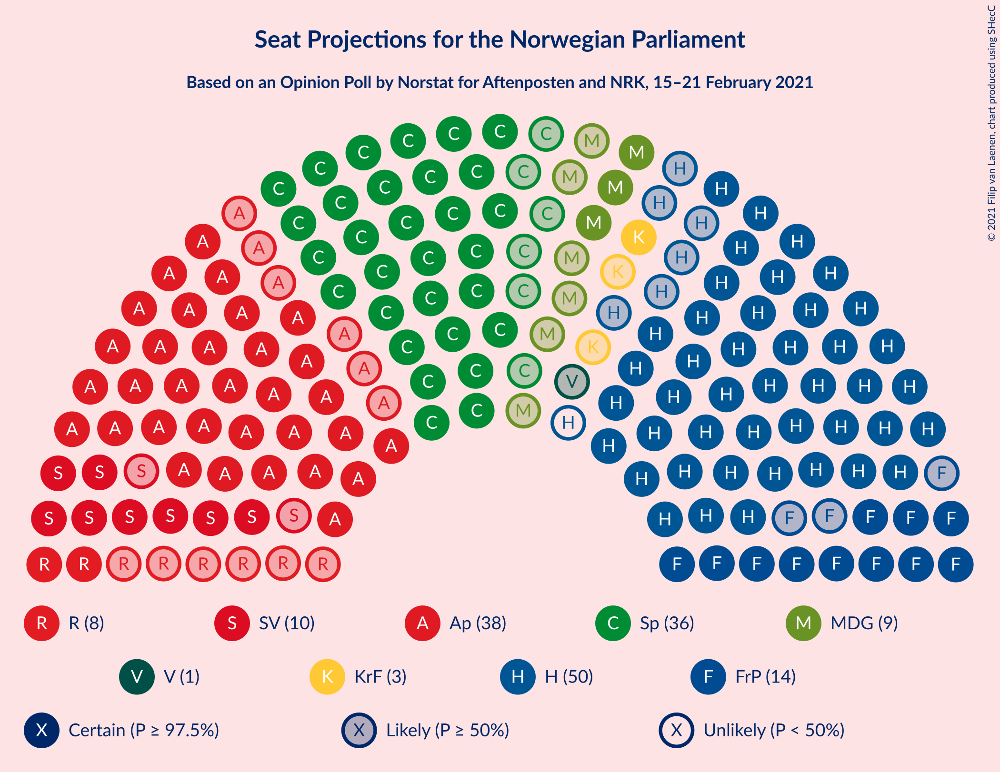
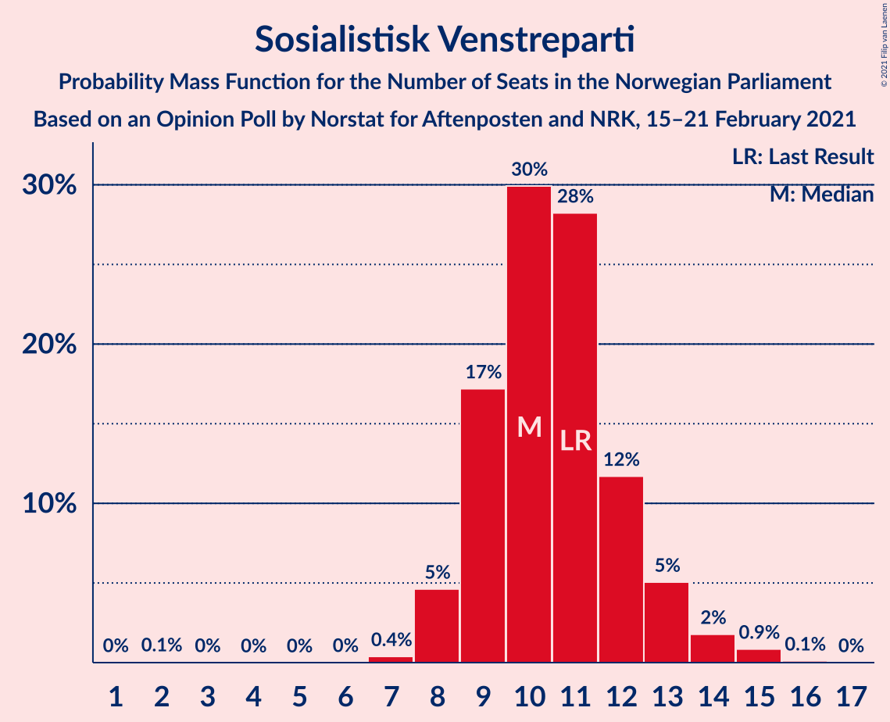
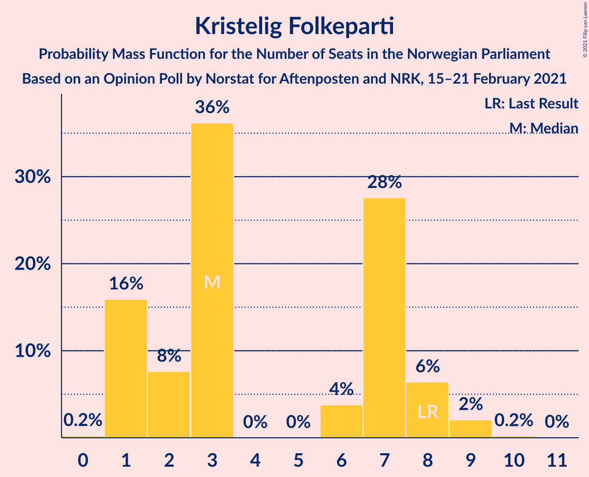
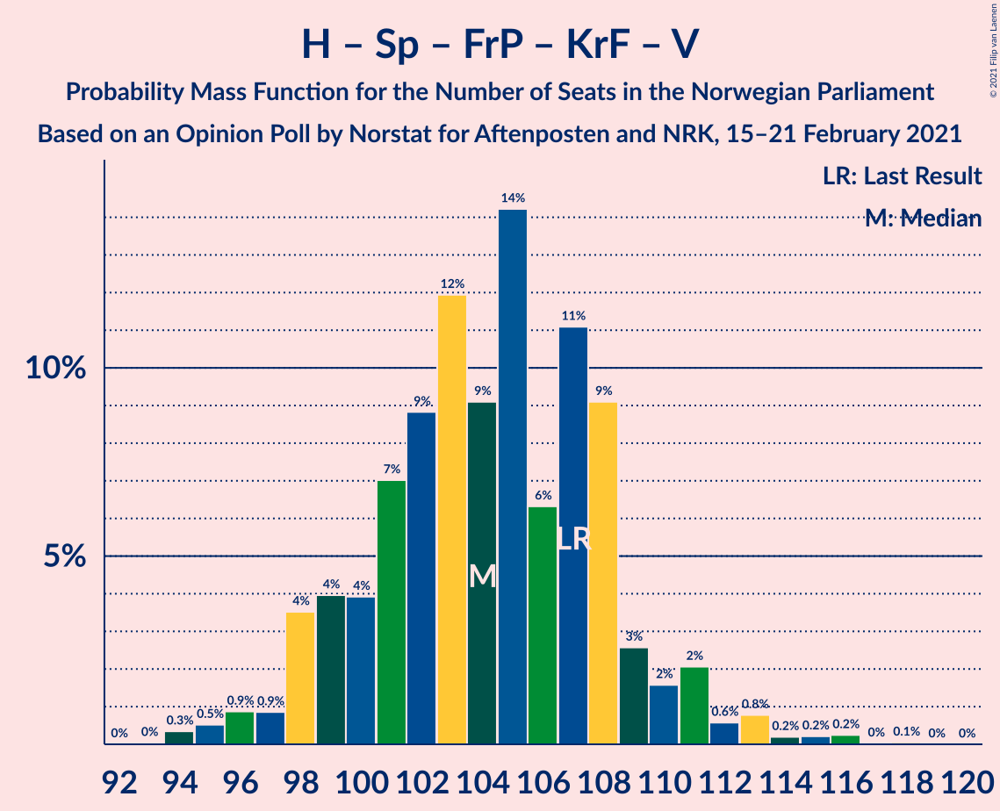
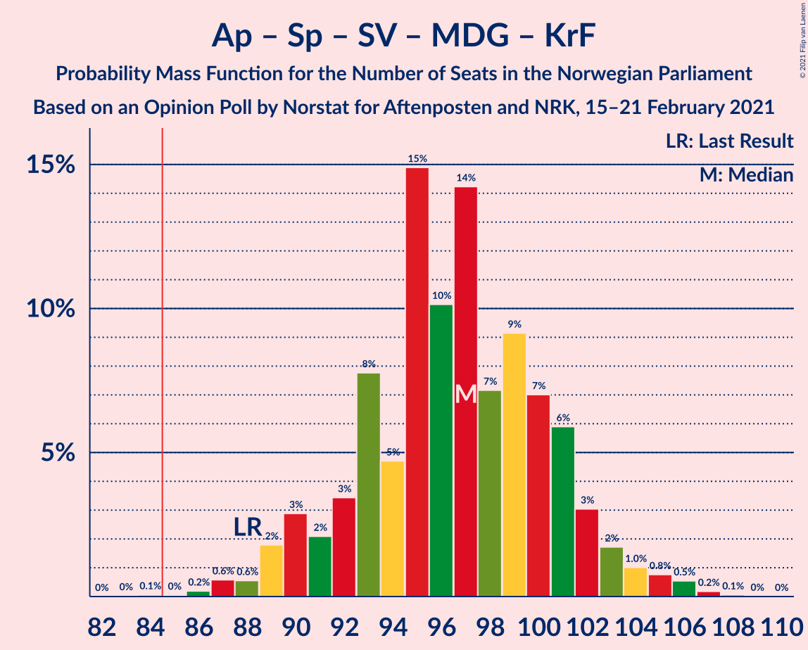
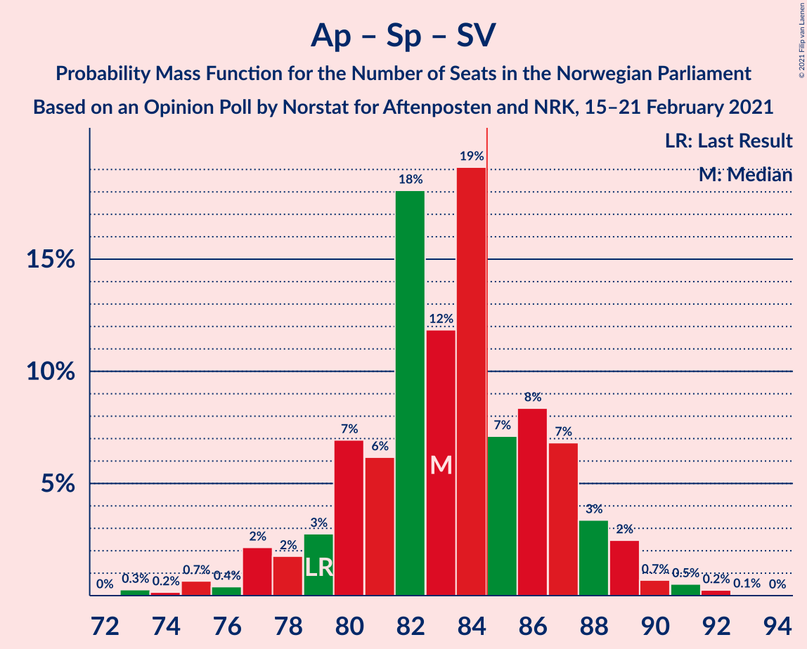
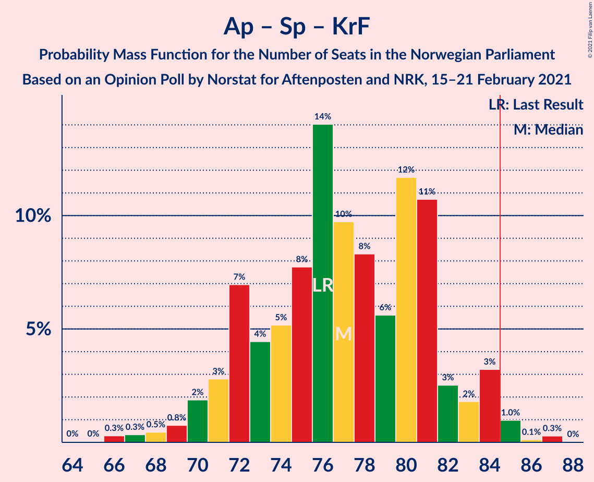
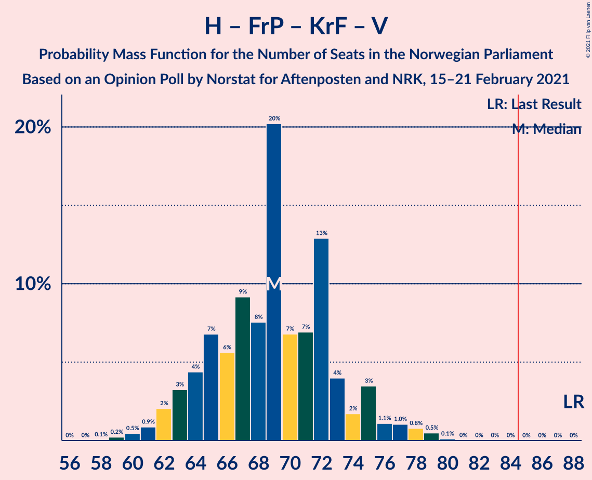

# Opinion Poll by Norstat for Aftenposten and NRK, 15–21 February 2021

<a href="#voting-intentions">Voting Intentions</a> | <a href="#seats">Seats</a> | <a href="#coalitions">Coalitions</a> | <a href="#technical-information">Technical Information</a>

## Voting Intentions

### Confidence Intervals

| Party | Last Result | Poll Result | 80% Confidence Interval | 90% Confidence Interval | 95% Confidence Interval | 99% Confidence Interval |
|:-----:|:-----------:|:-----------:|:-----------------------:|:-----------------------:|:-----------------------:|:-----------------------:|
| Høyre | 25.0% | 27.6% | 25.8–29.5% |25.3–30.0% |24.8–30.5% |24.0–31.4% |
| Arbeiderpartiet | 27.4% | 20.6% | 19.0–22.4% |18.5–22.8% |18.2–23.3% |17.4–24.1% |
| Senterpartiet | 10.3% | 18.6% | 17.1–20.3% |16.7–20.8% |16.3–21.2% |15.6–22.1% |
| Fremskrittspartiet | 15.2% | 8.3% | 7.3–9.6% |7.0–9.9% |6.7–10.3% |6.3–10.9% |
| Sosialistisk Venstreparti | 6.0% | 6.1% | 5.2–7.3% |5.0–7.6% |4.8–7.8% |4.4–8.4% |
| Miljøpartiet De Grønne | 3.2% | 5.2% | 4.4–6.2% |4.2–6.5% |4.0–6.8% |3.6–7.3% |
| Rødt | 2.4% | 4.8% | 4.0–5.8% |3.8–6.1% |3.6–6.3% |3.3–6.8% |
| Kristelig Folkeparti | 4.2% | 3.6% | 3.0–4.5% |2.8–4.8% |2.6–5.0% |2.3–5.5% |
| Venstre | 4.4% | 2.3% | 1.8–3.0% |1.6–3.3% |1.5–3.4% |1.3–3.8% |

*Note:* The poll result column reflects the actual value used in the calculations. Published results may vary slightly, and in addition be rounded to fewer digits.

## Seats

### Confidence Intervals

| Party | Last Result | Median | 80% Confidence Interval | 90% Confidence Interval | 95% Confidence Interval | 99% Confidence Interval |
|:-----:|:-----------:|:------:|:-----------------------:|:-----------------------:|:-----------------------:|:-----------------------:|
| <a href="#høyre">Høyre</a> | 45 | 50 | 45–52 |42–54 |42–55 |42–57 |
| <a href="#arbeiderpartiet">Arbeiderpartiet</a> | 49 | 38 | 35–41 |34–41 |32–41 |29–43 |
| <a href="#senterpartiet">Senterpartiet</a> | 19 | 36 | 31–36 |31–37 |31–39 |29–40 |
| <a href="#fremskrittspartiet">Fremskrittspartiet</a> | 27 | 14 | 13–16 |12–18 |11–18 |10–20 |
| <a href="#sosialistisk-venstreparti">Sosialistisk Venstreparti</a> | 11 | 11 | 9–12 |9–13 |8–14 |7–15 |
| <a href="#miljøpartiet-de-grønne">Miljøpartiet De Grønne</a> | 1 | 9 | 7–10 |7–11 |2–11 |2–13 |
| <a href="#rødt">Rødt</a> | 1 | 9 | 7–11 |2–11 |2–11 |2–12 |
| <a href="#kristelig-folkeparti">Kristelig Folkeparti</a> | 8 | 3 | 1–8 |1–8 |1–9 |0–9 |
| <a href="#venstre">Venstre</a> | 8 | 1 | 0–2 |0–2 |0–2 |0–2 |

### Høyre

*For a full overview of the results for this party, see the [Høyre](party-høyre.html) page.*

| Number of Seats | Probability | Accumulated | Special Marks |
|:---------------:|:-----------:|:-----------:|:-------------:|
| 40 | 0.1% | 100% |  |
| 41 | 0.2% | 99.9% |  |
| 42 | 5% | 99.7% |  |
| 43 | 1.3% | 95% |  |
| 44 | 0.5% | 94% |  |
| 45 | 10% | 93% | Last Result |
| 46 | 7% | 83% |  |
| 47 | 15% | 77% |  |
| 48 | 2% | 62% |  |
| 49 | 5% | 60% |  |
| 50 | 36% | 55% | Median |
| 51 | 6% | 19% |  |
| 52 | 7% | 13% |  |
| 53 | 0.9% | 6% |  |
| 54 | 3% | 5% |  |
| 55 | 0.5% | 3% |  |
| 56 | 1.3% | 2% |  |
| 57 | 0.3% | 0.8% |  |
| 58 | 0.1% | 0.5% |  |
| 59 | 0.3% | 0.3% |  |
| 60 | 0% | 0% |  |

### Arbeiderpartiet

*For a full overview of the results for this party, see the [Arbeiderpartiet](party-arbeiderpartiet.html) page.*

| Number of Seats | Probability | Accumulated | Special Marks |
|:---------------:|:-----------:|:-----------:|:-------------:|
| 28 | 0% | 100% |  |
| 29 | 0.7% | 99.9% |  |
| 30 | 0% | 99.2% |  |
| 31 | 2% | 99.2% |  |
| 32 | 0.5% | 98% |  |
| 33 | 1.3% | 97% |  |
| 34 | 2% | 96% |  |
| 35 | 26% | 93% |  |
| 36 | 3% | 67% |  |
| 37 | 11% | 64% |  |
| 38 | 23% | 52% | Median |
| 39 | 6% | 30% |  |
| 40 | 7% | 24% |  |
| 41 | 15% | 17% |  |
| 42 | 1.1% | 2% |  |
| 43 | 0.4% | 0.8% |  |
| 44 | 0.4% | 0.4% |  |
| 45 | 0.1% | 0.1% |  |
| 46 | 0% | 0% |  |
| 47 | 0% | 0% |  |
| 48 | 0% | 0% |  |
| 49 | 0% | 0% | Last Result |

### Senterpartiet

*For a full overview of the results for this party, see the [Senterpartiet](party-senterpartiet.html) page.*

| Number of Seats | Probability | Accumulated | Special Marks |
|:---------------:|:-----------:|:-----------:|:-------------:|
| 19 | 0% | 100% | Last Result |
| 20 | 0% | 100% |  |
| 21 | 0% | 100% |  |
| 22 | 0% | 100% |  |
| 23 | 0% | 100% |  |
| 24 | 0% | 100% |  |
| 25 | 0% | 100% |  |
| 26 | 0.1% | 100% |  |
| 27 | 0.2% | 99.9% |  |
| 28 | 0.2% | 99.8% |  |
| 29 | 0.6% | 99.5% |  |
| 30 | 1.0% | 98.9% |  |
| 31 | 9% | 98% |  |
| 32 | 2% | 89% |  |
| 33 | 6% | 87% |  |
| 34 | 4% | 81% |  |
| 35 | 3% | 77% |  |
| 36 | 66% | 74% | Median |
| 37 | 3% | 7% |  |
| 38 | 1.1% | 4% |  |
| 39 | 1.3% | 3% |  |
| 40 | 1.4% | 2% |  |
| 41 | 0.2% | 0.3% |  |
| 42 | 0.1% | 0.2% |  |
| 43 | 0.1% | 0.1% |  |
| 44 | 0% | 0% |  |

### Fremskrittspartiet

*For a full overview of the results for this party, see the [Fremskrittspartiet](party-fremskrittspartiet.html) page.*

| Number of Seats | Probability | Accumulated | Special Marks |
|:---------------:|:-----------:|:-----------:|:-------------:|
| 9 | 0.2% | 100% |  |
| 10 | 1.2% | 99.8% |  |
| 11 | 2% | 98.6% |  |
| 12 | 5% | 96% |  |
| 13 | 22% | 91% |  |
| 14 | 23% | 68% | Median |
| 15 | 4% | 45% |  |
| 16 | 32% | 41% |  |
| 17 | 3% | 9% |  |
| 18 | 5% | 6% |  |
| 19 | 0.5% | 1.4% |  |
| 20 | 0.8% | 0.9% |  |
| 21 | 0% | 0.1% |  |
| 22 | 0% | 0% |  |
| 23 | 0% | 0% |  |
| 24 | 0% | 0% |  |
| 25 | 0% | 0% |  |
| 26 | 0% | 0% |  |
| 27 | 0% | 0% | Last Result |

### Sosialistisk Venstreparti

*For a full overview of the results for this party, see the [Sosialistisk Venstreparti](party-sosialistiskvenstreparti.html) page.*

| Number of Seats | Probability | Accumulated | Special Marks |
|:---------------:|:-----------:|:-----------:|:-------------:|
| 2 | 0% | 100% |  |
| 3 | 0% | 99.9% |  |
| 4 | 0% | 99.9% |  |
| 5 | 0% | 99.9% |  |
| 6 | 0% | 99.9% |  |
| 7 | 0.8% | 99.9% |  |
| 8 | 3% | 99.1% |  |
| 9 | 10% | 96% |  |
| 10 | 24% | 86% |  |
| 11 | 49% | 62% | Last Result, Median |
| 12 | 6% | 13% |  |
| 13 | 3% | 7% |  |
| 14 | 2% | 4% |  |
| 15 | 1.1% | 1.2% |  |
| 16 | 0.1% | 0.1% |  |
| 17 | 0% | 0% |  |

### Miljøpartiet De Grønne

*For a full overview of the results for this party, see the [Miljøpartiet De Grønne](party-miljøpartietdegrønne.html) page.*

| Number of Seats | Probability | Accumulated | Special Marks |
|:---------------:|:-----------:|:-----------:|:-------------:|
| 1 | 0% | 100% | Last Result |
| 2 | 4% | 100% |  |
| 3 | 0.1% | 96% |  |
| 4 | 0.5% | 96% |  |
| 5 | 0% | 96% |  |
| 6 | 0.2% | 96% |  |
| 7 | 7% | 96% |  |
| 8 | 24% | 89% |  |
| 9 | 24% | 65% | Median |
| 10 | 36% | 41% |  |
| 11 | 3% | 5% |  |
| 12 | 1.2% | 2% |  |
| 13 | 0.8% | 0.9% |  |
| 14 | 0% | 0% |  |

### Rødt

*For a full overview of the results for this party, see the [Rødt](party-rødt.html) page.*

| Number of Seats | Probability | Accumulated | Special Marks |
|:---------------:|:-----------:|:-----------:|:-------------:|
| 1 | 0% | 100% | Last Result |
| 2 | 7% | 100% |  |
| 3 | 0% | 93% |  |
| 4 | 0% | 93% |  |
| 5 | 0% | 93% |  |
| 6 | 2% | 93% |  |
| 7 | 5% | 92% |  |
| 8 | 27% | 86% |  |
| 9 | 40% | 59% | Median |
| 10 | 6% | 19% |  |
| 11 | 13% | 14% |  |
| 12 | 0.5% | 0.8% |  |
| 13 | 0.3% | 0.3% |  |
| 14 | 0% | 0% |  |

### Kristelig Folkeparti

*For a full overview of the results for this party, see the [Kristelig Folkeparti](party-kristeligfolkeparti.html) page.*

| Number of Seats | Probability | Accumulated | Special Marks |
|:---------------:|:-----------:|:-----------:|:-------------:|
| 0 | 0.6% | 100% |  |
| 1 | 29% | 99.4% |  |
| 2 | 3% | 70% |  |
| 3 | 33% | 67% | Median |
| 4 | 0% | 34% |  |
| 5 | 0% | 34% |  |
| 6 | 1.1% | 34% |  |
| 7 | 22% | 33% |  |
| 8 | 8% | 11% | Last Result |
| 9 | 4% | 4% |  |
| 10 | 0.1% | 0.1% |  |
| 11 | 0% | 0% |  |

### Venstre

*For a full overview of the results for this party, see the [Venstre](party-venstre.html) page.*

| Number of Seats | Probability | Accumulated | Special Marks |
|:---------------:|:-----------:|:-----------:|:-------------:|
| 0 | 18% | 100% |  |
| 1 | 51% | 82% | Median |
| 2 | 30% | 31% |  |
| 3 | 0% | 0.4% |  |
| 4 | 0% | 0.4% |  |
| 5 | 0% | 0.4% |  |
| 6 | 0% | 0.4% |  |
| 7 | 0.3% | 0.3% |  |
| 8 | 0.1% | 0.1% | Last Result |
| 9 | 0% | 0% |  |

## Coalitions

### Confidence Intervals

| Coalition | Last Result | Median | Majority? | 80% Confidence Interval | 90% Confidence Interval | 95% Confidence Interval | 99% Confidence Interval |
|:---------:|:-----------:|:------:|:---------:|:-----------------------:|:-----------------------:|:-----------------------:|:-----------------------:|
| Høyre – Senterpartiet – Fremskrittspartiet – Kristelig Folkeparti – Venstre | 107 | 104 | 100% | 99–108 | 98–111 | 98–111 | 96–114 |
| Arbeiderpartiet – Senterpartiet – Sosialistisk Venstreparti – Miljøpartiet De Grønne – Rødt | 81 | 101 | 100% | 96–104 | 94–107 | 92–107 | 91–108 |
| Arbeiderpartiet – Senterpartiet – Sosialistisk Venstreparti – Miljøpartiet De Grønne – Kristelig Folkeparti | 88 | 96 | 99.9% | 92–101 | 91–102 | 90–104 | 87–105 |
| Arbeiderpartiet – Senterpartiet – Sosialistisk Venstreparti – Miljøpartiet De Grønne | 80 | 92 | 98% | 88–97 | 85–98 | 85–99 | 82–100 |
| Arbeiderpartiet – Senterpartiet – Sosialistisk Venstreparti – Rødt | 80 | 91 | 97% | 88–95 | 85–97 | 84–97 | 83–99 |
| Arbeiderpartiet – Senterpartiet – Miljøpartiet De Grønne – Kristelig Folkeparti | 77 | 86 | 56% | 82–90 | 80–91 | 79–93 | 77–95 |
| Arbeiderpartiet – Senterpartiet – Sosialistisk Venstreparti | 79 | 83 | 22% | 81–87 | 79–88 | 77–90 | 74–91 |
| Høyre – Fremskrittspartiet – Miljøpartiet De Grønne – Kristelig Folkeparti – Venstre | 89 | 78 | 3% | 74–80 | 72–83 | 71–85 | 70–86 |
| Arbeiderpartiet – Senterpartiet – Kristelig Folkeparti | 76 | 77 | 0.5% | 72–82 | 72–83 | 70–84 | 68–84 |
| Arbeiderpartiet – Senterpartiet | 68 | 73 | 0% | 70–76 | 68–77 | 66–77 | 64–80 |
| Høyre – Fremskrittspartiet – Kristelig Folkeparti – Venstre | 88 | 68 | 0% | 64–73 | 62–75 | 62–75 | 61–78 |
| Høyre – Fremskrittspartiet – Venstre | 80 | 65 | 0% | 60–68 | 59–69 | 57–71 | 57–75 |
| Høyre – Fremskrittspartiet | 72 | 63 | 0% | 58–66 | 58–68 | 55–69 | 55–73 |
| Høyre – Kristelig Folkeparti – Venstre | 61 | 52 | 0% | 50–59 | 49–61 | 48–61 | 46–64 |
| Arbeiderpartiet – Sosialistisk Venstreparti | 60 | 48 | 0% | 46–52 | 44–52 | 42–53 | 40–55 |
| Senterpartiet – Kristelig Folkeparti – Venstre | 35 | 40 | 0% | 38–46 | 36–46 | 35–47 | 32–48 |

### Høyre – Senterpartiet – Fremskrittspartiet – Kristelig Folkeparti – Venstre

| Number of Seats | Probability | Accumulated | Special Marks |
|:---------------:|:-----------:|:-----------:|:-------------:|
| 94 | 0% | 100% |  |
| 95 | 0.3% | 99.9% |  |
| 96 | 0.4% | 99.6% |  |
| 97 | 0.9% | 99.2% |  |
| 98 | 6% | 98% |  |
| 99 | 2% | 92% |  |
| 100 | 2% | 90% |  |
| 101 | 21% | 87% |  |
| 102 | 5% | 66% |  |
| 103 | 3% | 61% |  |
| 104 | 32% | 58% | Median |
| 105 | 10% | 26% |  |
| 106 | 3% | 16% |  |
| 107 | 2% | 13% | Last Result |
| 108 | 2% | 11% |  |
| 109 | 1.1% | 9% |  |
| 110 | 2% | 8% |  |
| 111 | 5% | 6% |  |
| 112 | 0.7% | 2% |  |
| 113 | 0.4% | 1.1% |  |
| 114 | 0.3% | 0.7% |  |
| 115 | 0.4% | 0.4% |  |
| 116 | 0% | 0% |  |

### Arbeiderpartiet – Senterpartiet – Sosialistisk Venstreparti – Miljøpartiet De Grønne – Rødt

| Number of Seats | Probability | Accumulated | Special Marks |
|:---------------:|:-----------:|:-----------:|:-------------:|
| 81 | 0% | 100% | Last Result |
| 82 | 0% | 100% |  |
| 83 | 0% | 100% |  |
| 84 | 0% | 100% |  |
| 85 | 0% | 100% | Majority |
| 86 | 0% | 100% |  |
| 87 | 0% | 100% |  |
| 88 | 0% | 99.9% |  |
| 89 | 0.1% | 99.9% |  |
| 90 | 0.1% | 99.9% |  |
| 91 | 0.5% | 99.8% |  |
| 92 | 2% | 99.3% |  |
| 93 | 0.6% | 97% |  |
| 94 | 5% | 96% |  |
| 95 | 1.1% | 92% |  |
| 96 | 3% | 90% |  |
| 97 | 4% | 87% |  |
| 98 | 3% | 83% |  |
| 99 | 14% | 81% |  |
| 100 | 8% | 67% |  |
| 101 | 28% | 59% |  |
| 102 | 3% | 31% |  |
| 103 | 6% | 27% | Median |
| 104 | 13% | 21% |  |
| 105 | 2% | 9% |  |
| 106 | 0.7% | 7% |  |
| 107 | 5% | 6% |  |
| 108 | 0.7% | 0.9% |  |
| 109 | 0.1% | 0.2% |  |
| 110 | 0% | 0.1% |  |
| 111 | 0% | 0% |  |

### Arbeiderpartiet – Senterpartiet – Sosialistisk Venstreparti – Miljøpartiet De Grønne – Kristelig Folkeparti

| Number of Seats | Probability | Accumulated | Special Marks |
|:---------------:|:-----------:|:-----------:|:-------------:|
| 84 | 0.1% | 100% |  |
| 85 | 0% | 99.9% | Majority |
| 86 | 0% | 99.9% |  |
| 87 | 0.4% | 99.8% |  |
| 88 | 0.8% | 99.4% | Last Result |
| 89 | 0.8% | 98.6% |  |
| 90 | 2% | 98% |  |
| 91 | 2% | 96% |  |
| 92 | 5% | 94% |  |
| 93 | 25% | 89% |  |
| 94 | 3% | 63% |  |
| 95 | 4% | 60% |  |
| 96 | 17% | 56% |  |
| 97 | 7% | 39% | Median |
| 98 | 9% | 32% |  |
| 99 | 2% | 23% |  |
| 100 | 9% | 22% |  |
| 101 | 7% | 12% |  |
| 102 | 2% | 5% |  |
| 103 | 0.7% | 4% |  |
| 104 | 3% | 3% |  |
| 105 | 0.1% | 0.6% |  |
| 106 | 0.1% | 0.4% |  |
| 107 | 0% | 0.3% |  |
| 108 | 0.3% | 0.3% |  |
| 109 | 0% | 0% |  |

### Arbeiderpartiet – Senterpartiet – Sosialistisk Venstreparti – Miljøpartiet De Grønne

| Number of Seats | Probability | Accumulated | Special Marks |
|:---------------:|:-----------:|:-----------:|:-------------:|
| 80 | 0% | 100% | Last Result |
| 81 | 0.1% | 100% |  |
| 82 | 0.4% | 99.9% |  |
| 83 | 0.6% | 99.4% |  |
| 84 | 0.6% | 98.9% |  |
| 85 | 4% | 98% | Majority |
| 86 | 2% | 95% |  |
| 87 | 1.0% | 93% |  |
| 88 | 4% | 92% |  |
| 89 | 4% | 88% |  |
| 90 | 5% | 84% |  |
| 91 | 9% | 79% |  |
| 92 | 31% | 70% |  |
| 93 | 15% | 39% |  |
| 94 | 8% | 24% | Median |
| 95 | 4% | 16% |  |
| 96 | 1.5% | 12% |  |
| 97 | 4% | 11% |  |
| 98 | 5% | 7% |  |
| 99 | 2% | 3% |  |
| 100 | 0.8% | 0.9% |  |
| 101 | 0.1% | 0.2% |  |
| 102 | 0.1% | 0.1% |  |
| 103 | 0% | 0% |  |

### Arbeiderpartiet – Senterpartiet – Sosialistisk Venstreparti – Rødt

| Number of Seats | Probability | Accumulated | Special Marks |
|:---------------:|:-----------:|:-----------:|:-------------:|
| 79 | 0% | 100% |  |
| 80 | 0% | 99.9% | Last Result |
| 81 | 0.1% | 99.9% |  |
| 82 | 0.2% | 99.8% |  |
| 83 | 1.3% | 99.6% |  |
| 84 | 1.0% | 98% |  |
| 85 | 2% | 97% | Majority |
| 86 | 2% | 95% |  |
| 87 | 1.1% | 93% |  |
| 88 | 3% | 92% |  |
| 89 | 5% | 89% |  |
| 90 | 5% | 84% |  |
| 91 | 36% | 79% |  |
| 92 | 12% | 43% |  |
| 93 | 2% | 31% |  |
| 94 | 5% | 29% | Median |
| 95 | 16% | 24% |  |
| 96 | 0.5% | 7% |  |
| 97 | 5% | 7% |  |
| 98 | 0.6% | 2% |  |
| 99 | 1.0% | 1.2% |  |
| 100 | 0.2% | 0.2% |  |
| 101 | 0% | 0% |  |

### Arbeiderpartiet – Senterpartiet – Miljøpartiet De Grønne – Kristelig Folkeparti

| Number of Seats | Probability | Accumulated | Special Marks |
|:---------------:|:-----------:|:-----------:|:-------------:|
| 73 | 0% | 100% |  |
| 74 | 0% | 99.9% |  |
| 75 | 0.2% | 99.9% |  |
| 76 | 0.2% | 99.7% |  |
| 77 | 0.1% | 99.6% | Last Result |
| 78 | 2% | 99.5% |  |
| 79 | 1.2% | 98% |  |
| 80 | 2% | 97% |  |
| 81 | 2% | 95% |  |
| 82 | 24% | 93% |  |
| 83 | 7% | 69% |  |
| 84 | 5% | 61% |  |
| 85 | 5% | 56% | Majority |
| 86 | 18% | 51% | Median |
| 87 | 9% | 33% |  |
| 88 | 5% | 24% |  |
| 89 | 1.5% | 19% |  |
| 90 | 9% | 17% |  |
| 91 | 3% | 8% |  |
| 92 | 2% | 5% |  |
| 93 | 2% | 3% |  |
| 94 | 0% | 0.7% |  |
| 95 | 0.2% | 0.6% |  |
| 96 | 0.2% | 0.4% |  |
| 97 | 0.3% | 0.3% |  |
| 98 | 0% | 0% |  |

### Arbeiderpartiet – Senterpartiet – Sosialistisk Venstreparti

| Number of Seats | Probability | Accumulated | Special Marks |
|:---------------:|:-----------:|:-----------:|:-------------:|
| 73 | 0.4% | 100% |  |
| 74 | 0.1% | 99.5% |  |
| 75 | 0.4% | 99.4% |  |
| 76 | 0.6% | 99.1% |  |
| 77 | 3% | 98% |  |
| 78 | 0.8% | 96% |  |
| 79 | 2% | 95% | Last Result |
| 80 | 3% | 93% |  |
| 81 | 8% | 90% |  |
| 82 | 24% | 83% |  |
| 83 | 15% | 58% |  |
| 84 | 22% | 44% |  |
| 85 | 4% | 22% | Median, Majority |
| 86 | 5% | 18% |  |
| 87 | 4% | 13% |  |
| 88 | 6% | 10% |  |
| 89 | 0.7% | 3% |  |
| 90 | 1.2% | 3% |  |
| 91 | 1.3% | 1.4% |  |
| 92 | 0% | 0.1% |  |
| 93 | 0% | 0.1% |  |
| 94 | 0% | 0% |  |

### Høyre – Fremskrittspartiet – Miljøpartiet De Grønne – Kristelig Folkeparti – Venstre

| Number of Seats | Probability | Accumulated | Special Marks |
|:---------------:|:-----------:|:-----------:|:-------------:|
| 66 | 0.1% | 100% |  |
| 67 | 0.1% | 99.9% |  |
| 68 | 0% | 99.8% |  |
| 69 | 0.2% | 99.8% |  |
| 70 | 2% | 99.6% |  |
| 71 | 0.7% | 98% |  |
| 72 | 5% | 97% |  |
| 73 | 0.7% | 92% |  |
| 74 | 16% | 91% |  |
| 75 | 5% | 75% |  |
| 76 | 2% | 69% |  |
| 77 | 12% | 67% | Median |
| 78 | 36% | 56% |  |
| 79 | 5% | 19% |  |
| 80 | 5% | 14% |  |
| 81 | 2% | 9% |  |
| 82 | 0.9% | 7% |  |
| 83 | 2% | 6% |  |
| 84 | 1.5% | 4% |  |
| 85 | 1.0% | 3% | Majority |
| 86 | 1.3% | 2% |  |
| 87 | 0.2% | 0.3% |  |
| 88 | 0.1% | 0.2% |  |
| 89 | 0% | 0.1% | Last Result |
| 90 | 0% | 0.1% |  |
| 91 | 0% | 0% |  |

### Arbeiderpartiet – Senterpartiet – Kristelig Folkeparti

| Number of Seats | Probability | Accumulated | Special Marks |
|:---------------:|:-----------:|:-----------:|:-------------:|
| 65 | 0% | 100% |  |
| 66 | 0% | 99.9% |  |
| 67 | 0.3% | 99.9% |  |
| 68 | 0.3% | 99.7% |  |
| 69 | 0.7% | 99.3% |  |
| 70 | 2% | 98.6% |  |
| 71 | 0.9% | 97% |  |
| 72 | 26% | 96% |  |
| 73 | 3% | 70% |  |
| 74 | 1.3% | 67% |  |
| 75 | 4% | 66% |  |
| 76 | 8% | 61% | Last Result |
| 77 | 17% | 54% | Median |
| 78 | 2% | 37% |  |
| 79 | 11% | 35% |  |
| 80 | 6% | 24% |  |
| 81 | 6% | 18% |  |
| 82 | 6% | 12% |  |
| 83 | 2% | 6% |  |
| 84 | 4% | 4% |  |
| 85 | 0.1% | 0.5% | Majority |
| 86 | 0.1% | 0.4% |  |
| 87 | 0.3% | 0.3% |  |
| 88 | 0% | 0% |  |

### Arbeiderpartiet – Senterpartiet

| Number of Seats | Probability | Accumulated | Special Marks |
|:---------------:|:-----------:|:-----------:|:-------------:|
| 61 | 0.1% | 100% |  |
| 62 | 0.1% | 99.9% |  |
| 63 | 0% | 99.8% |  |
| 64 | 0.6% | 99.8% |  |
| 65 | 0.7% | 99.2% |  |
| 66 | 1.2% | 98.6% |  |
| 67 | 2% | 97% |  |
| 68 | 0.9% | 95% | Last Result |
| 69 | 3% | 94% |  |
| 70 | 6% | 92% |  |
| 71 | 26% | 86% |  |
| 72 | 9% | 60% |  |
| 73 | 8% | 51% |  |
| 74 | 25% | 42% | Median |
| 75 | 4% | 17% |  |
| 76 | 4% | 13% |  |
| 77 | 7% | 9% |  |
| 78 | 0.6% | 2% |  |
| 79 | 0.6% | 1.4% |  |
| 80 | 0.7% | 0.7% |  |
| 81 | 0% | 0% |  |

### Høyre – Fremskrittspartiet – Kristelig Folkeparti – Venstre

| Number of Seats | Probability | Accumulated | Special Marks |
|:---------------:|:-----------:|:-----------:|:-------------:|
| 58 | 0.1% | 100% |  |
| 59 | 0.1% | 99.9% |  |
| 60 | 0.2% | 99.8% |  |
| 61 | 0.7% | 99.6% |  |
| 62 | 5% | 99.0% |  |
| 63 | 2% | 94% |  |
| 64 | 3% | 92% |  |
| 65 | 13% | 90% |  |
| 66 | 6% | 77% |  |
| 67 | 4% | 71% |  |
| 68 | 28% | 67% | Median |
| 69 | 8% | 39% |  |
| 70 | 13% | 32% |  |
| 71 | 3% | 18% |  |
| 72 | 4% | 15% |  |
| 73 | 3% | 12% |  |
| 74 | 1.0% | 8% |  |
| 75 | 5% | 7% |  |
| 76 | 0.5% | 2% |  |
| 77 | 1.4% | 2% |  |
| 78 | 0.4% | 0.6% |  |
| 79 | 0.1% | 0.2% |  |
| 80 | 0% | 0.1% |  |
| 81 | 0% | 0.1% |  |
| 82 | 0% | 0% |  |
| 83 | 0% | 0% |  |
| 84 | 0% | 0% |  |
| 85 | 0% | 0% | Majority |
| 86 | 0% | 0% |  |
| 87 | 0% | 0% |  |
| 88 | 0% | 0% | Last Result |

### Høyre – Fremskrittspartiet – Venstre

| Number of Seats | Probability | Accumulated | Special Marks |
|:---------------:|:-----------:|:-----------:|:-------------:|
| 55 | 0.1% | 100% |  |
| 56 | 0.3% | 99.9% |  |
| 57 | 3% | 99.6% |  |
| 58 | 0.6% | 97% |  |
| 59 | 6% | 97% |  |
| 60 | 3% | 90% |  |
| 61 | 7% | 87% |  |
| 62 | 13% | 80% |  |
| 63 | 12% | 67% |  |
| 64 | 2% | 55% |  |
| 65 | 10% | 54% | Median |
| 66 | 5% | 43% |  |
| 67 | 27% | 39% |  |
| 68 | 5% | 12% |  |
| 69 | 2% | 6% |  |
| 70 | 0.9% | 4% |  |
| 71 | 2% | 4% |  |
| 72 | 0.5% | 2% |  |
| 73 | 0.2% | 1.1% |  |
| 74 | 0.1% | 0.9% |  |
| 75 | 0.4% | 0.8% |  |
| 76 | 0.4% | 0.4% |  |
| 77 | 0% | 0% |  |
| 78 | 0% | 0% |  |
| 79 | 0% | 0% |  |
| 80 | 0% | 0% | Last Result |

### Høyre – Fremskrittspartiet

| Number of Seats | Probability | Accumulated | Special Marks |
|:---------------:|:-----------:|:-----------:|:-------------:|
| 54 | 0.1% | 100% |  |
| 55 | 2% | 99.9% |  |
| 56 | 0.6% | 97% |  |
| 57 | 0.8% | 97% |  |
| 58 | 8% | 96% |  |
| 59 | 8% | 89% |  |
| 60 | 1.3% | 81% |  |
| 61 | 13% | 79% |  |
| 62 | 2% | 66% |  |
| 63 | 15% | 65% |  |
| 64 | 5% | 49% | Median |
| 65 | 8% | 45% |  |
| 66 | 29% | 36% |  |
| 67 | 2% | 8% |  |
| 68 | 2% | 6% |  |
| 69 | 2% | 4% |  |
| 70 | 0.5% | 2% |  |
| 71 | 0.7% | 2% |  |
| 72 | 0% | 0.9% | Last Result |
| 73 | 0.5% | 0.9% |  |
| 74 | 0.3% | 0.4% |  |
| 75 | 0.1% | 0.1% |  |
| 76 | 0% | 0% |  |

### Høyre – Kristelig Folkeparti – Venstre

| Number of Seats | Probability | Accumulated | Special Marks |
|:---------------:|:-----------:|:-----------:|:-------------:|
| 44 | 0.1% | 100% |  |
| 45 | 0.2% | 99.9% |  |
| 46 | 0.4% | 99.7% |  |
| 47 | 1.3% | 99.4% |  |
| 48 | 2% | 98% |  |
| 49 | 5% | 97% |  |
| 50 | 3% | 92% |  |
| 51 | 17% | 89% |  |
| 52 | 24% | 73% |  |
| 53 | 4% | 48% |  |
| 54 | 7% | 44% | Median |
| 55 | 11% | 37% |  |
| 56 | 3% | 26% |  |
| 57 | 9% | 23% |  |
| 58 | 4% | 14% |  |
| 59 | 2% | 11% |  |
| 60 | 2% | 8% |  |
| 61 | 4% | 6% | Last Result |
| 62 | 1.2% | 2% |  |
| 63 | 0.6% | 1.2% |  |
| 64 | 0.5% | 0.6% |  |
| 65 | 0% | 0.1% |  |
| 66 | 0.1% | 0.1% |  |
| 67 | 0% | 0% |  |

### Arbeiderpartiet – Sosialistisk Venstreparti

| Number of Seats | Probability | Accumulated | Special Marks |
|:---------------:|:-----------:|:-----------:|:-------------:|
| 38 | 0.3% | 100% |  |
| 39 | 0% | 99.7% |  |
| 40 | 0.5% | 99.7% |  |
| 41 | 1.2% | 99.1% |  |
| 42 | 0.9% | 98% |  |
| 43 | 1.0% | 97% |  |
| 44 | 2% | 96% |  |
| 45 | 3% | 94% |  |
| 46 | 25% | 91% |  |
| 47 | 6% | 65% |  |
| 48 | 26% | 60% |  |
| 49 | 6% | 33% | Median |
| 50 | 5% | 27% |  |
| 51 | 5% | 22% |  |
| 52 | 14% | 17% |  |
| 53 | 0.7% | 3% |  |
| 54 | 0.5% | 2% |  |
| 55 | 1.1% | 1.4% |  |
| 56 | 0.3% | 0.3% |  |
| 57 | 0% | 0% |  |
| 58 | 0% | 0% |  |
| 59 | 0% | 0% |  |
| 60 | 0% | 0% | Last Result |

### Senterpartiet – Kristelig Folkeparti – Venstre

| Number of Seats | Probability | Accumulated | Special Marks |
|:---------------:|:-----------:|:-----------:|:-------------:|
| 31 | 0.4% | 100% |  |
| 32 | 0.4% | 99.6% |  |
| 33 | 0.5% | 99.1% |  |
| 34 | 0.5% | 98.6% |  |
| 35 | 1.0% | 98% | Last Result |
| 36 | 3% | 97% |  |
| 37 | 2% | 94% |  |
| 38 | 34% | 92% |  |
| 39 | 4% | 58% |  |
| 40 | 19% | 55% | Median |
| 41 | 15% | 36% |  |
| 42 | 2% | 21% |  |
| 43 | 1.5% | 19% |  |
| 44 | 0.6% | 18% |  |
| 45 | 6% | 17% |  |
| 46 | 7% | 11% |  |
| 47 | 3% | 4% |  |
| 48 | 1.1% | 1.4% |  |
| 49 | 0.1% | 0.2% |  |
| 50 | 0% | 0.1% |  |
| 51 | 0.1% | 0.1% |  |
| 52 | 0% | 0% |  |

## Technical Information

### Opinion Poll

+ **Polling firm:** Norstat
+ **Commissioner(s):** Aftenposten and NRK
+ **Fieldwork period:** 15–21 February 2021

### Calculations

+ **Sample size:** 961
+ **Simulations done:** 131,072
+ **Error estimate:** 1.13%

