# Opinion Poll by Kantar TNS for TV2, 22–26 February 2021

<a href="#voting-intentions">Voting Intentions</a> | <a href="#seats">Seats</a> | <a href="#coalitions">Coalitions</a> | <a href="#technical-information">Technical Information</a>

## Voting Intentions

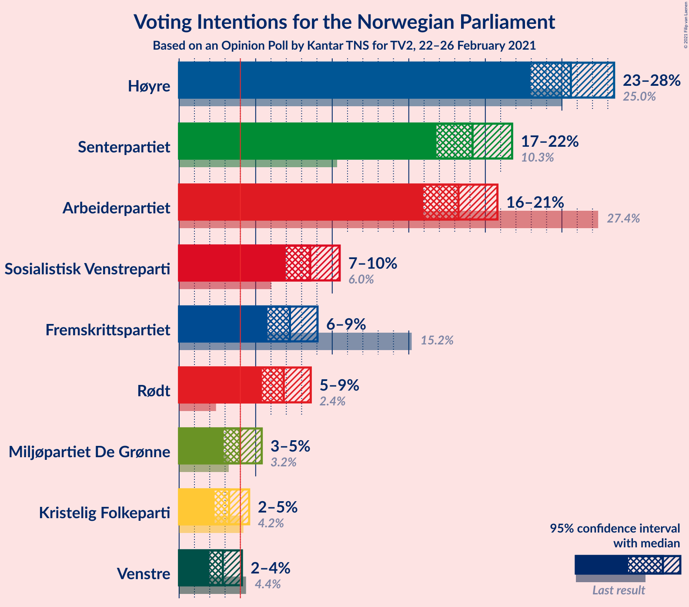

### Confidence Intervals

| Party | Last Result | Poll Result | 80% Confidence Interval | 90% Confidence Interval | 95% Confidence Interval | 99% Confidence Interval |
|:-----:|:-----------:|:-----------:|:-----------------------:|:-----------------------:|:-----------------------:|:-----------------------:|
| Høyre | 25.0% | 25.6% | 23.9–27.4% |23.4–28.0% |23.0–28.4% |22.1–29.3% |
| Senterpartiet | 10.3% | 19.2% | 17.6–20.9% |17.2–21.3% |16.8–21.7% |16.1–22.6% |
| Arbeiderpartiet | 27.4% | 18.2% | 16.7–19.9% |16.3–20.4% |15.9–20.8% |15.3–21.6% |
| Sosialistisk Venstreparti | 6.0% | 8.6% | 7.5–9.8% |7.2–10.2% |7.0–10.5% |6.5–11.1% |
| Fremskrittspartiet | 15.2% | 7.2% | 6.3–8.4% |6.0–8.7% |5.8–9.0% |5.3–9.6% |
| Rødt | 2.4% | 6.8% | 5.9–8.0% |5.6–8.3% |5.4–8.6% |5.0–9.2% |
| Miljøpartiet De Grønne | 3.2% | 4.0% | 3.3–4.9% |3.1–5.2% |2.9–5.4% |2.6–5.9% |
| Kristelig Folkeparti | 4.2% | 3.3% | 2.6–4.1% |2.5–4.4% |2.3–4.6% |2.0–5.0% |
| Venstre | 4.4% | 2.9% | 2.3–3.7% |2.1–3.9% |2.0–4.1% |1.7–4.5% |

*Note:* The poll result column reflects the actual value used in the calculations. Published results may vary slightly, and in addition be rounded to fewer digits.

## Seats

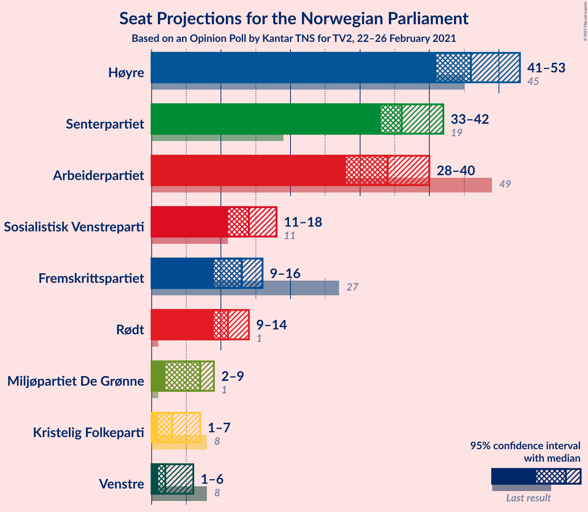

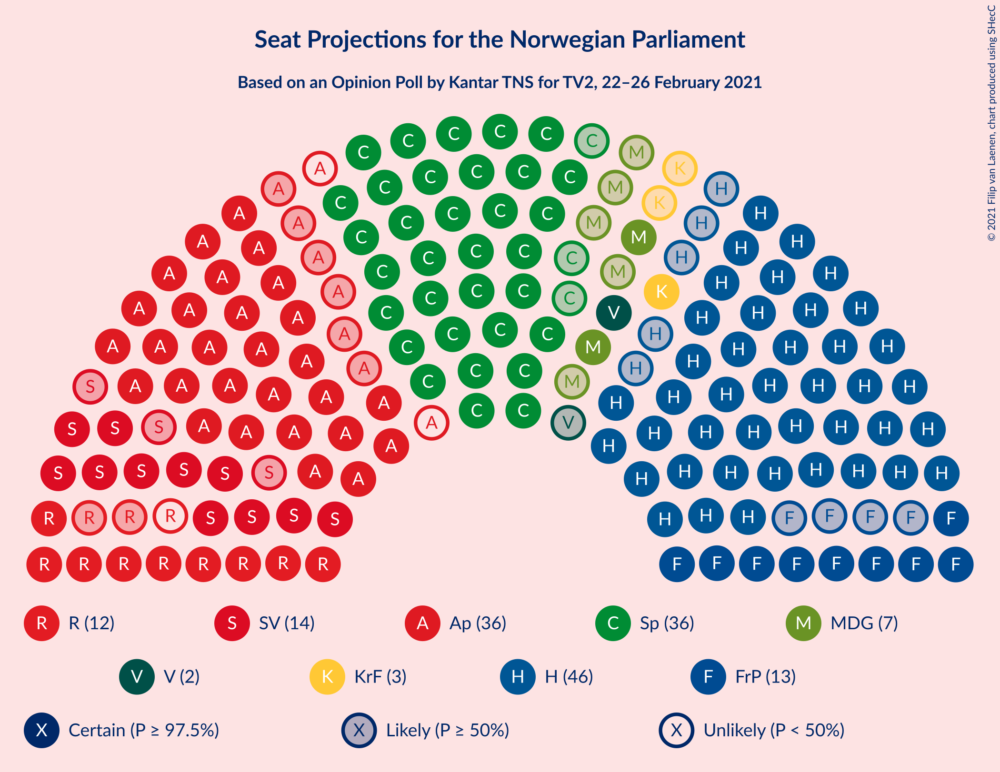

### Confidence Intervals

| Party | Last Result | Median | 80% Confidence Interval | 90% Confidence Interval | 95% Confidence Interval | 99% Confidence Interval |
|:-----:|:-----------:|:------:|:-----------------------:|:-----------------------:|:-----------------------:|:-----------------------:|
| <a href="#høyre">Høyre</a> | 45 | 46 | 43–50 |42–52 |41–53 |38–54 |
| <a href="#senterpartiet">Senterpartiet</a> | 19 | 36 | 34–39 |33–41 |33–42 |30–44 |
| <a href="#arbeiderpartiet">Arbeiderpartiet</a> | 49 | 34 | 30–38 |28–38 |28–40 |27–40 |
| <a href="#sosialistisk-venstreparti">Sosialistisk Venstreparti</a> | 11 | 14 | 12–17 |11–17 |11–18 |10–20 |
| <a href="#fremskrittspartiet">Fremskrittspartiet</a> | 27 | 13 | 10–14 |9–15 |9–16 |8–17 |
| <a href="#rødt">Rødt</a> | 1 | 11 | 10–14 |9–14 |9–14 |8–16 |
| <a href="#miljøpartiet-de-grønne">Miljøpartiet De Grønne</a> | 1 | 7 | 2–8 |2–8 |2–9 |1–10 |
| <a href="#kristelig-folkeparti">Kristelig Folkeparti</a> | 8 | 3 | 1–3 |1–7 |1–7 |0–8 |
| <a href="#venstre">Venstre</a> | 8 | 2 | 1–2 |1–2 |1–6 |0–7 |

### Høyre

*For a full overview of the results for this party, see the [Høyre](party-høyre.html) page.*

| Number of Seats | Probability | Accumulated | Special Marks |
|:---------------:|:-----------:|:-----------:|:-------------:|
| 36 | 0.1% | 100% |  |
| 37 | 0.3% | 99.9% |  |
| 38 | 0.3% | 99.6% |  |
| 39 | 0.8% | 99.4% |  |
| 40 | 0.7% | 98.6% |  |
| 41 | 2% | 98% |  |
| 42 | 2% | 95% |  |
| 43 | 7% | 93% |  |
| 44 | 14% | 86% |  |
| 45 | 14% | 73% | Last Result |
| 46 | 14% | 59% | Median |
| 47 | 6% | 44% |  |
| 48 | 11% | 38% |  |
| 49 | 4% | 27% |  |
| 50 | 14% | 23% |  |
| 51 | 4% | 9% |  |
| 52 | 3% | 6% |  |
| 53 | 2% | 3% |  |
| 54 | 0.4% | 0.8% |  |
| 55 | 0.4% | 0.5% |  |
| 56 | 0% | 0.1% |  |
| 57 | 0% | 0% |  |

### Senterpartiet

*For a full overview of the results for this party, see the [Senterpartiet](party-senterpartiet.html) page.*

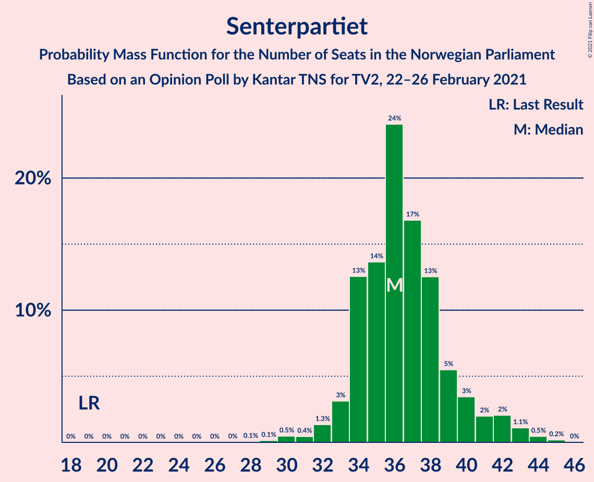

| Number of Seats | Probability | Accumulated | Special Marks |
|:---------------:|:-----------:|:-----------:|:-------------:|
| 19 | 0% | 100% | Last Result |
| 20 | 0% | 100% |  |
| 21 | 0% | 100% |  |
| 22 | 0% | 100% |  |
| 23 | 0% | 100% |  |
| 24 | 0% | 100% |  |
| 25 | 0% | 100% |  |
| 26 | 0% | 100% |  |
| 27 | 0% | 100% |  |
| 28 | 0.1% | 100% |  |
| 29 | 0.1% | 99.9% |  |
| 30 | 0.5% | 99.8% |  |
| 31 | 0.4% | 99.3% |  |
| 32 | 1.3% | 98.9% |  |
| 33 | 3% | 98% |  |
| 34 | 13% | 94% |  |
| 35 | 14% | 82% |  |
| 36 | 24% | 68% | Median |
| 37 | 17% | 44% |  |
| 38 | 13% | 27% |  |
| 39 | 5% | 15% |  |
| 40 | 3% | 9% |  |
| 41 | 2% | 6% |  |
| 42 | 2% | 4% |  |
| 43 | 1.1% | 2% |  |
| 44 | 0.5% | 0.7% |  |
| 45 | 0.2% | 0.2% |  |
| 46 | 0% | 0% |  |

### Arbeiderpartiet

*For a full overview of the results for this party, see the [Arbeiderpartiet](party-arbeiderpartiet.html) page.*

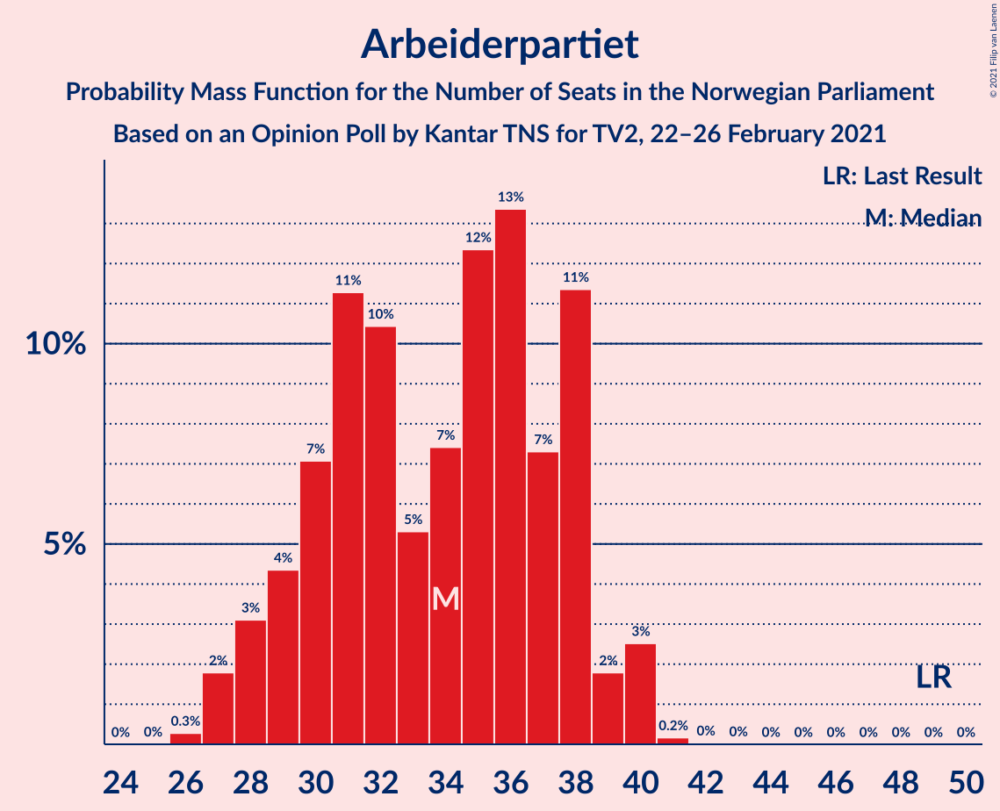

| Number of Seats | Probability | Accumulated | Special Marks |
|:---------------:|:-----------:|:-----------:|:-------------:|
| 26 | 0.3% | 100% |  |
| 27 | 2% | 99.7% |  |
| 28 | 3% | 98% |  |
| 29 | 4% | 95% |  |
| 30 | 7% | 90% |  |
| 31 | 11% | 83% |  |
| 32 | 10% | 72% |  |
| 33 | 5% | 62% |  |
| 34 | 7% | 56% | Median |
| 35 | 12% | 49% |  |
| 36 | 13% | 37% |  |
| 37 | 7% | 23% |  |
| 38 | 11% | 16% |  |
| 39 | 2% | 5% |  |
| 40 | 3% | 3% |  |
| 41 | 0.2% | 0.2% |  |
| 42 | 0% | 0.1% |  |
| 43 | 0% | 0% |  |
| 44 | 0% | 0% |  |
| 45 | 0% | 0% |  |
| 46 | 0% | 0% |  |
| 47 | 0% | 0% |  |
| 48 | 0% | 0% |  |
| 49 | 0% | 0% | Last Result |

### Sosialistisk Venstreparti

*For a full overview of the results for this party, see the [Sosialistisk Venstreparti](party-sosialistiskvenstreparti.html) page.*

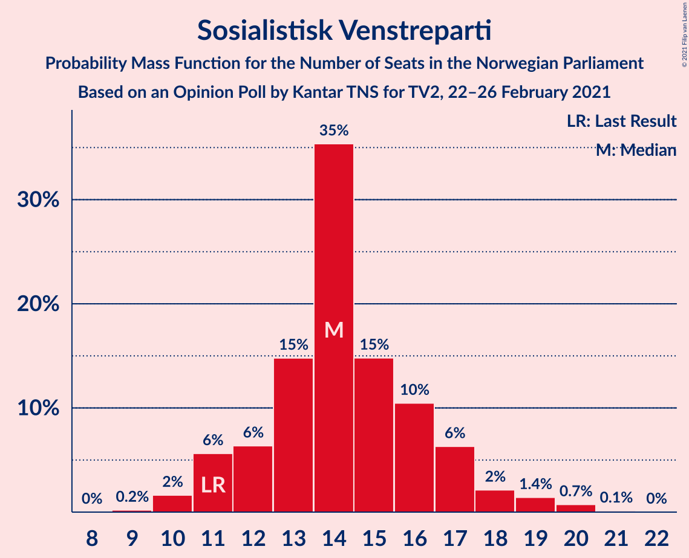

| Number of Seats | Probability | Accumulated | Special Marks |
|:---------------:|:-----------:|:-----------:|:-------------:|
| 9 | 0.2% | 100% |  |
| 10 | 2% | 99.8% |  |
| 11 | 6% | 98% | Last Result |
| 12 | 6% | 93% |  |
| 13 | 15% | 86% |  |
| 14 | 35% | 71% | Median |
| 15 | 15% | 36% |  |
| 16 | 10% | 21% |  |
| 17 | 6% | 11% |  |
| 18 | 2% | 4% |  |
| 19 | 1.4% | 2% |  |
| 20 | 0.7% | 0.9% |  |
| 21 | 0.1% | 0.1% |  |
| 22 | 0% | 0% |  |

### Fremskrittspartiet

*For a full overview of the results for this party, see the [Fremskrittspartiet](party-fremskrittspartiet.html) page.*

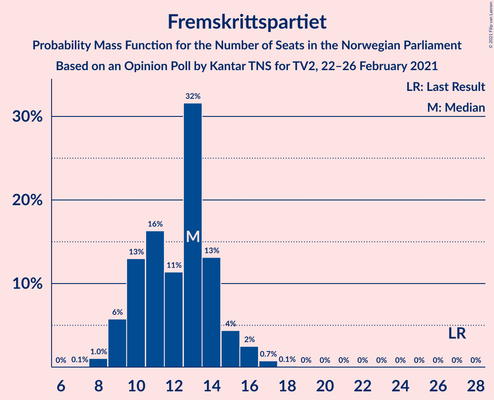

| Number of Seats | Probability | Accumulated | Special Marks |
|:---------------:|:-----------:|:-----------:|:-------------:|
| 7 | 0.1% | 100% |  |
| 8 | 1.0% | 99.9% |  |
| 9 | 6% | 98.9% |  |
| 10 | 13% | 93% |  |
| 11 | 16% | 80% |  |
| 12 | 11% | 64% |  |
| 13 | 32% | 52% | Median |
| 14 | 13% | 21% |  |
| 15 | 4% | 8% |  |
| 16 | 2% | 3% |  |
| 17 | 0.7% | 0.9% |  |
| 18 | 0.1% | 0.1% |  |
| 19 | 0% | 0% |  |
| 20 | 0% | 0% |  |
| 21 | 0% | 0% |  |
| 22 | 0% | 0% |  |
| 23 | 0% | 0% |  |
| 24 | 0% | 0% |  |
| 25 | 0% | 0% |  |
| 26 | 0% | 0% |  |
| 27 | 0% | 0% | Last Result |

### Rødt

*For a full overview of the results for this party, see the [Rødt](party-rødt.html) page.*

| Number of Seats | Probability | Accumulated | Special Marks |
|:---------------:|:-----------:|:-----------:|:-------------:|
| 1 | 0% | 100% | Last Result |
| 2 | 0% | 100% |  |
| 3 | 0% | 100% |  |
| 4 | 0% | 100% |  |
| 5 | 0% | 100% |  |
| 6 | 0% | 100% |  |
| 7 | 0.2% | 100% |  |
| 8 | 1.2% | 99.8% |  |
| 9 | 7% | 98.6% |  |
| 10 | 18% | 92% |  |
| 11 | 24% | 74% | Median |
| 12 | 24% | 49% |  |
| 13 | 14% | 25% |  |
| 14 | 9% | 11% |  |
| 15 | 2% | 2% |  |
| 16 | 0.4% | 0.6% |  |
| 17 | 0.2% | 0.2% |  |
| 18 | 0.1% | 0.1% |  |
| 19 | 0% | 0% |  |

### Miljøpartiet De Grønne

*For a full overview of the results for this party, see the [Miljøpartiet De Grønne](party-miljøpartietdegrønne.html) page.*

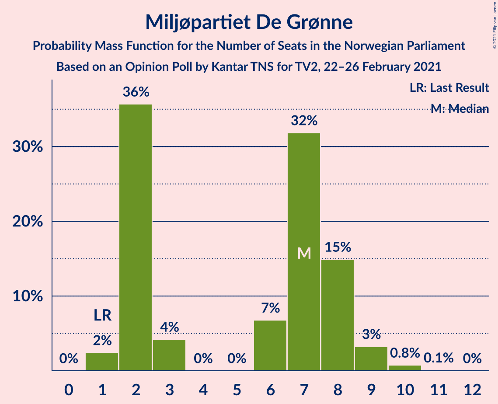

| Number of Seats | Probability | Accumulated | Special Marks |
|:---------------:|:-----------:|:-----------:|:-------------:|
| 1 | 2% | 100% | Last Result |
| 2 | 36% | 98% |  |
| 3 | 4% | 62% |  |
| 4 | 0% | 58% |  |
| 5 | 0% | 58% |  |
| 6 | 7% | 58% |  |
| 7 | 32% | 51% | Median |
| 8 | 15% | 19% |  |
| 9 | 3% | 4% |  |
| 10 | 0.8% | 0.9% |  |
| 11 | 0.1% | 0.1% |  |
| 12 | 0% | 0% |  |

### Kristelig Folkeparti

*For a full overview of the results for this party, see the [Kristelig Folkeparti](party-kristeligfolkeparti.html) page.*

| Number of Seats | Probability | Accumulated | Special Marks |
|:---------------:|:-----------:|:-----------:|:-------------:|
| 0 | 0.6% | 100% |  |
| 1 | 19% | 99.4% |  |
| 2 | 27% | 81% |  |
| 3 | 43% | 53% | Median |
| 4 | 0% | 10% |  |
| 5 | 0% | 10% |  |
| 6 | 3% | 10% |  |
| 7 | 5% | 7% |  |
| 8 | 2% | 2% | Last Result |
| 9 | 0.3% | 0.3% |  |
| 10 | 0% | 0% |  |

### Venstre

*For a full overview of the results for this party, see the [Venstre](party-venstre.html) page.*

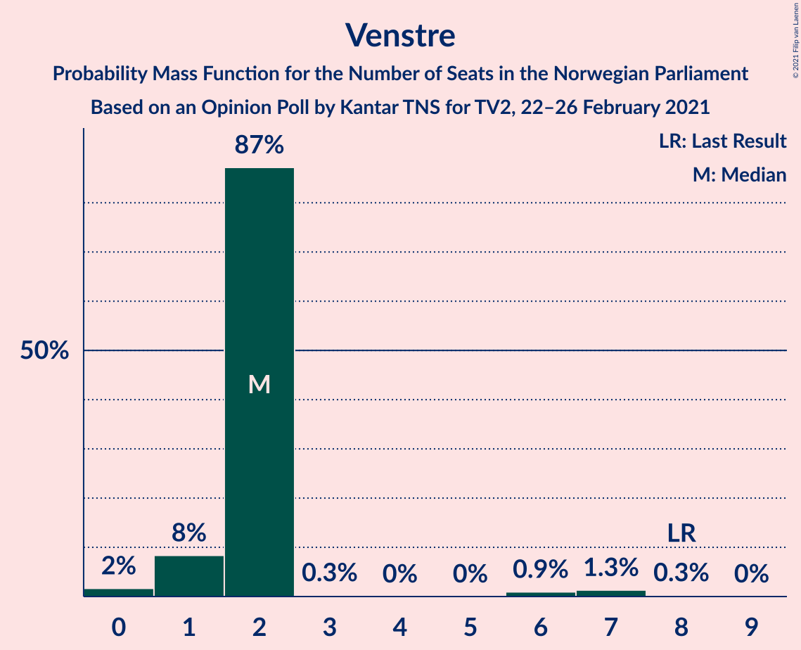

| Number of Seats | Probability | Accumulated | Special Marks |
|:---------------:|:-----------:|:-----------:|:-------------:|
| 0 | 2% | 100% |  |
| 1 | 8% | 98% |  |
| 2 | 87% | 90% | Median |
| 3 | 0.3% | 3% |  |
| 4 | 0% | 3% |  |
| 5 | 0% | 3% |  |
| 6 | 0.9% | 3% |  |
| 7 | 1.3% | 2% |  |
| 8 | 0.3% | 0.3% | Last Result |
| 9 | 0% | 0% |  |

## Coalitions

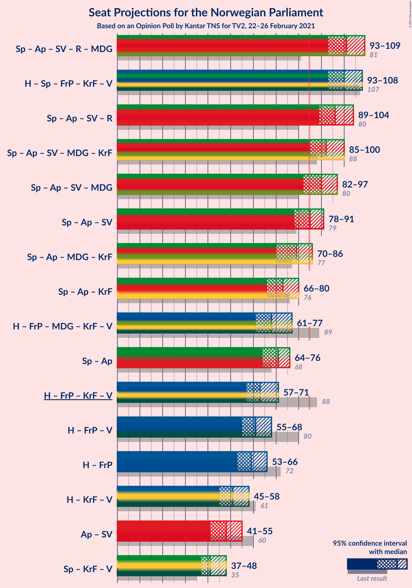

### Confidence Intervals

| Coalition | Last Result | Median | Majority? | 80% Confidence Interval | 90% Confidence Interval | 95% Confidence Interval | 99% Confidence Interval |
|:---------:|:-----------:|:------:|:---------:|:-----------------------:|:-----------------------:|:-----------------------:|:-----------------------:|
| Senterpartiet – Arbeiderpartiet – Sosialistisk Venstreparti – Rødt – Miljøpartiet De Grønne | 81 | 101 | 100% | 96–106 | 94–108 | 93–109 | 90–112 |
| Høyre – Senterpartiet – Fremskrittspartiet – Kristelig Folkeparti – Venstre | 107 | 100 | 100% | 95–105 | 93–107 | 93–108 | 91–110 |
| Senterpartiet – Arbeiderpartiet – Sosialistisk Venstreparti – Rødt | 80 | 96 | 99.9% | 91–101 | 90–102 | 89–104 | 86–106 |
| Senterpartiet – Arbeiderpartiet – Sosialistisk Venstreparti – Miljøpartiet De Grønne – Kristelig Folkeparti | 88 | 92 | 98.6% | 88–97 | 86–99 | 85–100 | 82–102 |
| Senterpartiet – Arbeiderpartiet – Sosialistisk Venstreparti – Miljøpartiet De Grønne | 80 | 90 | 90% | 84–95 | 83–96 | 82–97 | 80–99 |
| Senterpartiet – Arbeiderpartiet – Sosialistisk Venstreparti | 79 | 85 | 50% | 80–89 | 79–90 | 78–91 | 76–93 |
| Senterpartiet – Arbeiderpartiet – Miljøpartiet De Grønne – Kristelig Folkeparti | 77 | 79 | 5% | 72–83 | 71–84 | 70–86 | 68–87 |
| Senterpartiet – Arbeiderpartiet – Kristelig Folkeparti | 76 | 73 | 0.1% | 68–77 | 67–79 | 66–80 | 64–83 |
| Høyre – Fremskrittspartiet – Miljøpartiet De Grønne – Kristelig Folkeparti – Venstre | 89 | 68 | 0% | 63–75 | 62–75 | 61–77 | 59–79 |
| Senterpartiet – Arbeiderpartiet | 68 | 71 | 0% | 66–74 | 64–75 | 64–76 | 62–78 |
| Høyre – Fremskrittspartiet – Kristelig Folkeparti – Venstre | 88 | 63 | 0% | 59–68 | 58–70 | 57–71 | 55–73 |
| Høyre – Fremskrittspartiet – Venstre | 80 | 61 | 0% | 57–65 | 56–67 | 55–68 | 51–70 |
| Høyre – Fremskrittspartiet | 72 | 59 | 0% | 55–63 | 54–65 | 53–66 | 49–67 |
| Høyre – Kristelig Folkeparti – Venstre | 61 | 51 | 0% | 47–56 | 46–57 | 45–58 | 42–61 |
| Arbeiderpartiet – Sosialistisk Venstreparti | 60 | 48 | 0% | 43–53 | 42–54 | 41–55 | 39–56 |
| Senterpartiet – Kristelig Folkeparti – Venstre | 35 | 41 | 0% | 38–45 | 37–47 | 37–48 | 35–51 |

### Senterpartiet – Arbeiderpartiet – Sosialistisk Venstreparti – Rødt – Miljøpartiet De Grønne

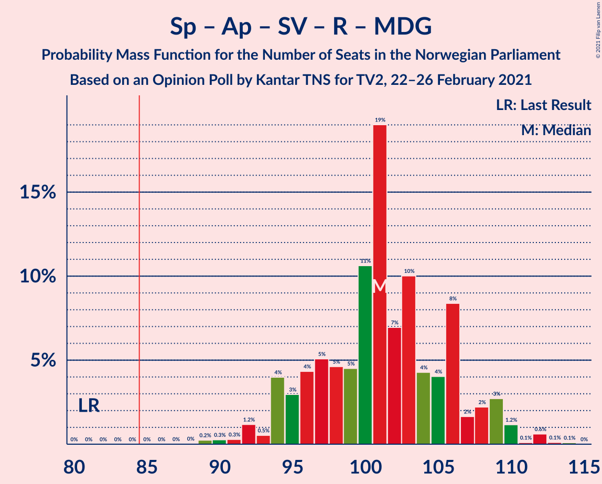

| Number of Seats | Probability | Accumulated | Special Marks |
|:---------------:|:-----------:|:-----------:|:-------------:|
| 81 | 0% | 100% | Last Result |
| 82 | 0% | 100% |  |
| 83 | 0% | 100% |  |
| 84 | 0% | 100% |  |
| 85 | 0% | 100% | Majority |
| 86 | 0% | 100% |  |
| 87 | 0% | 100% |  |
| 88 | 0% | 100% |  |
| 89 | 0.2% | 99.9% |  |
| 90 | 0.3% | 99.7% |  |
| 91 | 0.3% | 99.4% |  |
| 92 | 1.2% | 99.2% |  |
| 93 | 0.5% | 98% |  |
| 94 | 4% | 97% |  |
| 95 | 3% | 93% |  |
| 96 | 4% | 91% |  |
| 97 | 5% | 86% |  |
| 98 | 5% | 81% |  |
| 99 | 5% | 76% |  |
| 100 | 11% | 72% |  |
| 101 | 19% | 61% |  |
| 102 | 7% | 42% | Median |
| 103 | 10% | 35% |  |
| 104 | 4% | 25% |  |
| 105 | 4% | 21% |  |
| 106 | 8% | 17% |  |
| 107 | 2% | 9% |  |
| 108 | 2% | 7% |  |
| 109 | 3% | 5% |  |
| 110 | 1.2% | 2% |  |
| 111 | 0.1% | 0.9% |  |
| 112 | 0.6% | 0.8% |  |
| 113 | 0.1% | 0.2% |  |
| 114 | 0.1% | 0.1% |  |
| 115 | 0% | 0% |  |

### Høyre – Senterpartiet – Fremskrittspartiet – Kristelig Folkeparti – Venstre

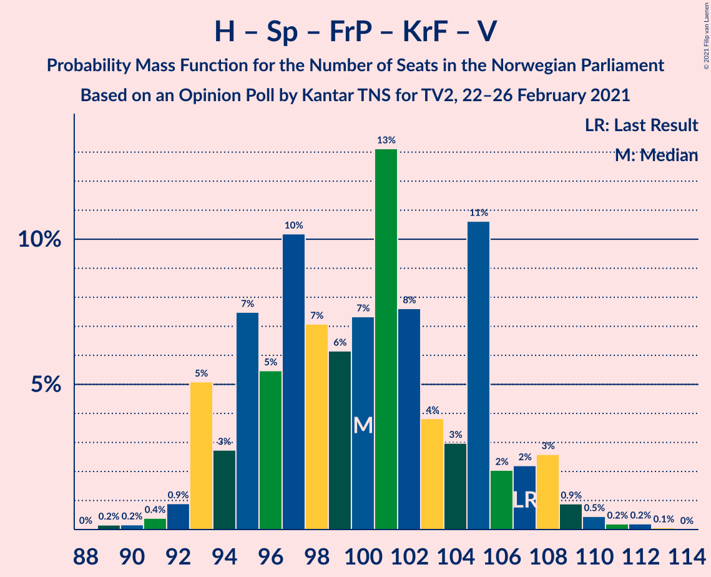

| Number of Seats | Probability | Accumulated | Special Marks |
|:---------------:|:-----------:|:-----------:|:-------------:|
| 89 | 0.2% | 100% |  |
| 90 | 0.2% | 99.8% |  |
| 91 | 0.4% | 99.6% |  |
| 92 | 0.9% | 99.2% |  |
| 93 | 5% | 98% |  |
| 94 | 3% | 93% |  |
| 95 | 7% | 91% |  |
| 96 | 5% | 83% |  |
| 97 | 10% | 78% |  |
| 98 | 7% | 67% |  |
| 99 | 6% | 60% |  |
| 100 | 7% | 54% | Median |
| 101 | 13% | 47% |  |
| 102 | 8% | 34% |  |
| 103 | 4% | 26% |  |
| 104 | 3% | 22% |  |
| 105 | 11% | 19% |  |
| 106 | 2% | 9% |  |
| 107 | 2% | 7% | Last Result |
| 108 | 3% | 4% |  |
| 109 | 0.9% | 2% |  |
| 110 | 0.5% | 0.9% |  |
| 111 | 0.2% | 0.5% |  |
| 112 | 0.2% | 0.3% |  |
| 113 | 0.1% | 0.1% |  |
| 114 | 0% | 0% |  |

### Senterpartiet – Arbeiderpartiet – Sosialistisk Venstreparti – Rødt

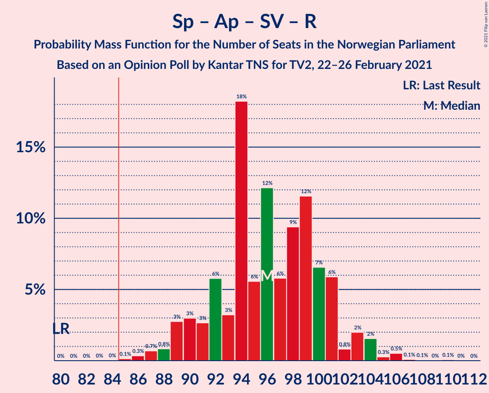

| Number of Seats | Probability | Accumulated | Special Marks |
|:---------------:|:-----------:|:-----------:|:-------------:|
| 80 | 0% | 100% | Last Result |
| 81 | 0% | 100% |  |
| 82 | 0% | 100% |  |
| 83 | 0% | 100% |  |
| 84 | 0% | 100% |  |
| 85 | 0.1% | 99.9% | Majority |
| 86 | 0.3% | 99.8% |  |
| 87 | 0.7% | 99.5% |  |
| 88 | 0.8% | 98.8% |  |
| 89 | 3% | 98% |  |
| 90 | 3% | 95% |  |
| 91 | 3% | 92% |  |
| 92 | 6% | 90% |  |
| 93 | 3% | 84% |  |
| 94 | 18% | 81% |  |
| 95 | 6% | 62% | Median |
| 96 | 12% | 57% |  |
| 97 | 6% | 45% |  |
| 98 | 9% | 39% |  |
| 99 | 12% | 29% |  |
| 100 | 7% | 18% |  |
| 101 | 6% | 11% |  |
| 102 | 0.8% | 5% |  |
| 103 | 2% | 5% |  |
| 104 | 2% | 3% |  |
| 105 | 0.3% | 1.0% |  |
| 106 | 0.5% | 0.8% |  |
| 107 | 0.1% | 0.2% |  |
| 108 | 0.1% | 0.2% |  |
| 109 | 0% | 0.1% |  |
| 110 | 0.1% | 0.1% |  |
| 111 | 0% | 0% |  |

### Senterpartiet – Arbeiderpartiet – Sosialistisk Venstreparti – Miljøpartiet De Grønne – Kristelig Folkeparti

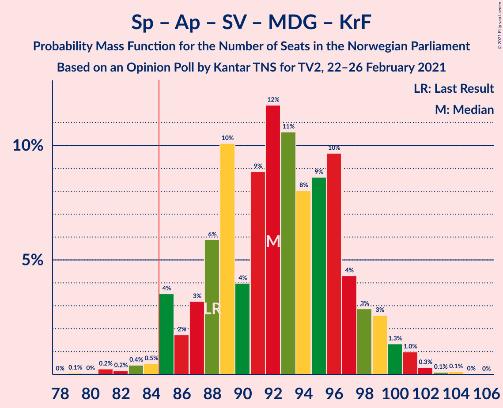

| Number of Seats | Probability | Accumulated | Special Marks |
|:---------------:|:-----------:|:-----------:|:-------------:|
| 79 | 0.1% | 100% |  |
| 80 | 0% | 99.9% |  |
| 81 | 0.2% | 99.9% |  |
| 82 | 0.2% | 99.6% |  |
| 83 | 0.4% | 99.4% |  |
| 84 | 0.5% | 99.0% |  |
| 85 | 4% | 98.6% | Majority |
| 86 | 2% | 95% |  |
| 87 | 3% | 93% |  |
| 88 | 6% | 90% | Last Result |
| 89 | 10% | 84% |  |
| 90 | 4% | 74% |  |
| 91 | 9% | 70% |  |
| 92 | 12% | 61% |  |
| 93 | 11% | 50% |  |
| 94 | 8% | 39% | Median |
| 95 | 9% | 31% |  |
| 96 | 10% | 22% |  |
| 97 | 4% | 13% |  |
| 98 | 3% | 8% |  |
| 99 | 3% | 5% |  |
| 100 | 1.3% | 3% |  |
| 101 | 1.0% | 2% |  |
| 102 | 0.3% | 0.6% |  |
| 103 | 0.1% | 0.3% |  |
| 104 | 0.1% | 0.2% |  |
| 105 | 0% | 0% |  |

### Senterpartiet – Arbeiderpartiet – Sosialistisk Venstreparti – Miljøpartiet De Grønne

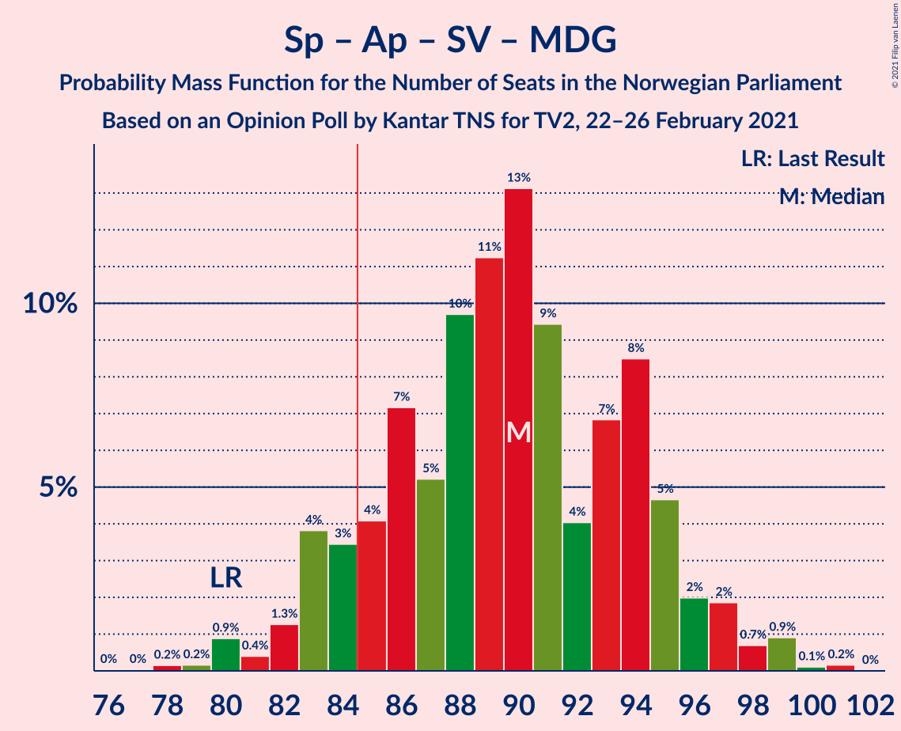

| Number of Seats | Probability | Accumulated | Special Marks |
|:---------------:|:-----------:|:-----------:|:-------------:|
| 77 | 0% | 100% |  |
| 78 | 0.2% | 99.9% |  |
| 79 | 0.2% | 99.8% |  |
| 80 | 0.9% | 99.6% | Last Result |
| 81 | 0.4% | 98.7% |  |
| 82 | 1.3% | 98% |  |
| 83 | 4% | 97% |  |
| 84 | 3% | 93% |  |
| 85 | 4% | 90% | Majority |
| 86 | 7% | 86% |  |
| 87 | 5% | 79% |  |
| 88 | 10% | 73% |  |
| 89 | 11% | 64% |  |
| 90 | 13% | 52% |  |
| 91 | 9% | 39% | Median |
| 92 | 4% | 30% |  |
| 93 | 7% | 26% |  |
| 94 | 8% | 19% |  |
| 95 | 5% | 10% |  |
| 96 | 2% | 6% |  |
| 97 | 2% | 4% |  |
| 98 | 0.7% | 2% |  |
| 99 | 0.9% | 1.2% |  |
| 100 | 0.1% | 0.3% |  |
| 101 | 0.2% | 0.2% |  |
| 102 | 0% | 0% |  |

### Senterpartiet – Arbeiderpartiet – Sosialistisk Venstreparti

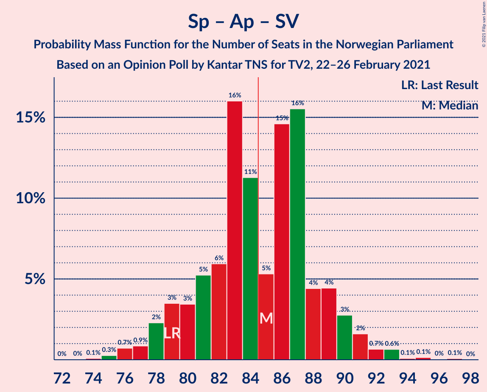

| Number of Seats | Probability | Accumulated | Special Marks |
|:---------------:|:-----------:|:-----------:|:-------------:|
| 73 | 0% | 100% |  |
| 74 | 0.1% | 99.9% |  |
| 75 | 0.3% | 99.9% |  |
| 76 | 0.7% | 99.6% |  |
| 77 | 0.9% | 98.9% |  |
| 78 | 2% | 98% |  |
| 79 | 3% | 96% | Last Result |
| 80 | 3% | 92% |  |
| 81 | 5% | 89% |  |
| 82 | 6% | 84% |  |
| 83 | 16% | 78% |  |
| 84 | 11% | 62% | Median |
| 85 | 5% | 50% | Majority |
| 86 | 15% | 45% |  |
| 87 | 16% | 30% |  |
| 88 | 4% | 15% |  |
| 89 | 4% | 10% |  |
| 90 | 3% | 6% |  |
| 91 | 2% | 3% |  |
| 92 | 0.7% | 2% |  |
| 93 | 0.6% | 1.0% |  |
| 94 | 0.1% | 0.4% |  |
| 95 | 0.1% | 0.3% |  |
| 96 | 0% | 0.1% |  |
| 97 | 0.1% | 0.1% |  |
| 98 | 0% | 0% |  |

### Senterpartiet – Arbeiderpartiet – Miljøpartiet De Grønne – Kristelig Folkeparti

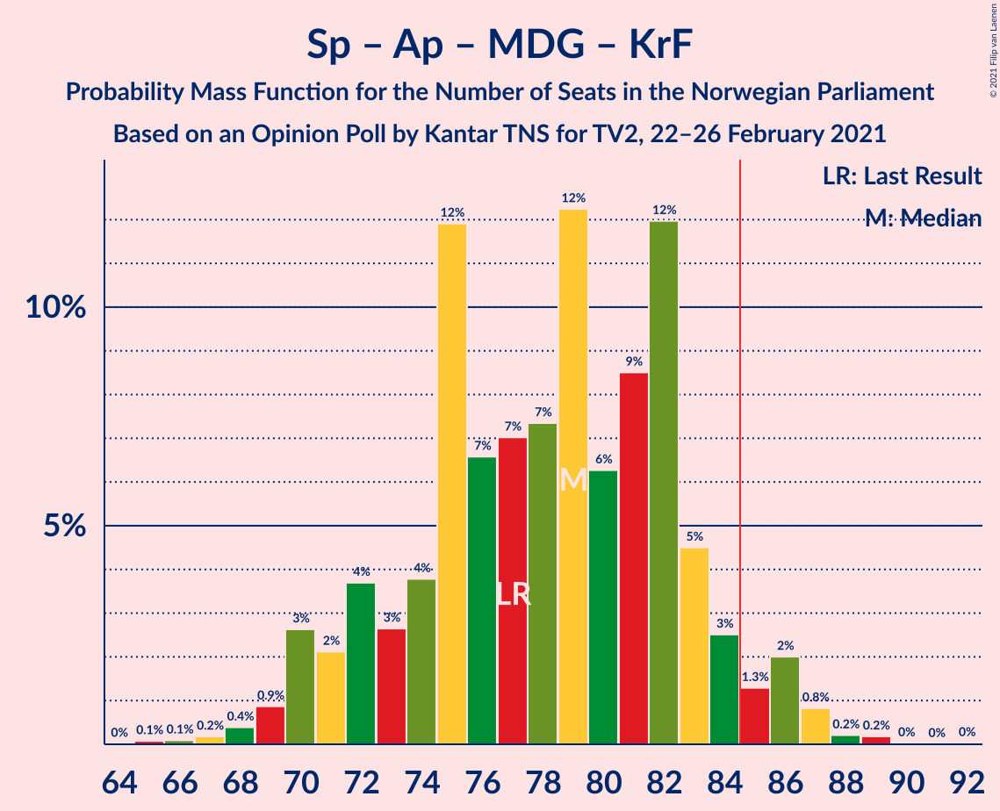

| Number of Seats | Probability | Accumulated | Special Marks |
|:---------------:|:-----------:|:-----------:|:-------------:|
| 65 | 0.1% | 100% |  |
| 66 | 0.1% | 99.9% |  |
| 67 | 0.2% | 99.8% |  |
| 68 | 0.4% | 99.6% |  |
| 69 | 0.9% | 99.2% |  |
| 70 | 3% | 98% |  |
| 71 | 2% | 96% |  |
| 72 | 4% | 94% |  |
| 73 | 3% | 90% |  |
| 74 | 4% | 87% |  |
| 75 | 12% | 83% |  |
| 76 | 7% | 72% |  |
| 77 | 7% | 65% | Last Result |
| 78 | 7% | 58% |  |
| 79 | 12% | 51% |  |
| 80 | 6% | 38% | Median |
| 81 | 9% | 32% |  |
| 82 | 12% | 24% |  |
| 83 | 5% | 12% |  |
| 84 | 3% | 7% |  |
| 85 | 1.3% | 5% | Majority |
| 86 | 2% | 3% |  |
| 87 | 0.8% | 1.3% |  |
| 88 | 0.2% | 0.5% |  |
| 89 | 0.2% | 0.3% |  |
| 90 | 0% | 0.1% |  |
| 91 | 0% | 0.1% |  |
| 92 | 0% | 0% |  |

### Senterpartiet – Arbeiderpartiet – Kristelig Folkeparti

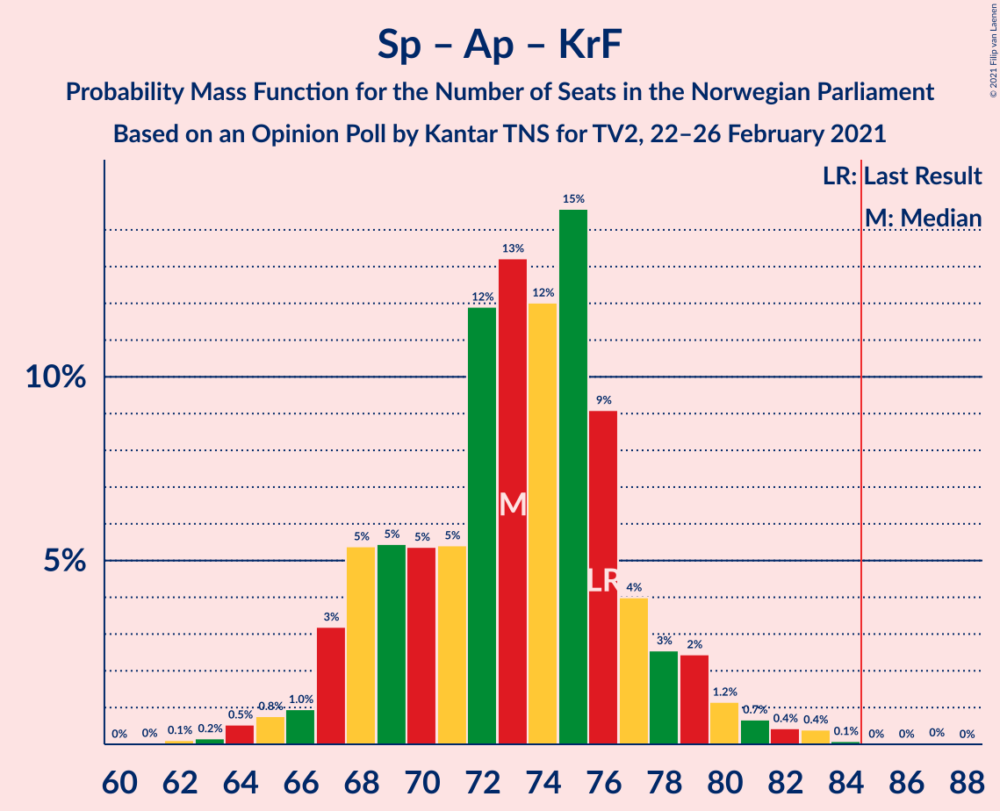

| Number of Seats | Probability | Accumulated | Special Marks |
|:---------------:|:-----------:|:-----------:|:-------------:|
| 62 | 0.1% | 100% |  |
| 63 | 0.2% | 99.8% |  |
| 64 | 0.5% | 99.7% |  |
| 65 | 0.8% | 99.1% |  |
| 66 | 1.0% | 98% |  |
| 67 | 3% | 97% |  |
| 68 | 5% | 94% |  |
| 69 | 5% | 89% |  |
| 70 | 5% | 83% |  |
| 71 | 5% | 78% |  |
| 72 | 12% | 73% |  |
| 73 | 13% | 61% | Median |
| 74 | 12% | 47% |  |
| 75 | 15% | 35% |  |
| 76 | 9% | 21% | Last Result |
| 77 | 4% | 12% |  |
| 78 | 3% | 8% |  |
| 79 | 2% | 5% |  |
| 80 | 1.2% | 3% |  |
| 81 | 0.7% | 2% |  |
| 82 | 0.4% | 1.0% |  |
| 83 | 0.4% | 0.6% |  |
| 84 | 0.1% | 0.2% |  |
| 85 | 0% | 0.1% | Majority |
| 86 | 0% | 0.1% |  |
| 87 | 0% | 0% |  |

### Høyre – Fremskrittspartiet – Miljøpartiet De Grønne – Kristelig Folkeparti – Venstre

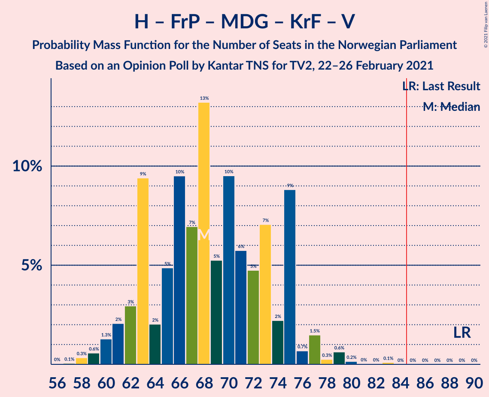

| Number of Seats | Probability | Accumulated | Special Marks |
|:---------------:|:-----------:|:-----------:|:-------------:|
| 56 | 0% | 100% |  |
| 57 | 0.1% | 99.9% |  |
| 58 | 0.3% | 99.9% |  |
| 59 | 0.6% | 99.5% |  |
| 60 | 1.3% | 98.9% |  |
| 61 | 2% | 98% |  |
| 62 | 3% | 96% |  |
| 63 | 9% | 93% |  |
| 64 | 2% | 83% |  |
| 65 | 5% | 81% |  |
| 66 | 10% | 76% |  |
| 67 | 7% | 67% |  |
| 68 | 13% | 60% |  |
| 69 | 5% | 47% |  |
| 70 | 10% | 41% |  |
| 71 | 6% | 32% | Median |
| 72 | 5% | 26% |  |
| 73 | 7% | 21% |  |
| 74 | 2% | 14% |  |
| 75 | 9% | 12% |  |
| 76 | 0.7% | 3% |  |
| 77 | 1.5% | 3% |  |
| 78 | 0.3% | 1.2% |  |
| 79 | 0.6% | 0.9% |  |
| 80 | 0.2% | 0.3% |  |
| 81 | 0% | 0.1% |  |
| 82 | 0% | 0.1% |  |
| 83 | 0.1% | 0.1% |  |
| 84 | 0% | 0% |  |
| 85 | 0% | 0% | Majority |
| 86 | 0% | 0% |  |
| 87 | 0% | 0% |  |
| 88 | 0% | 0% |  |
| 89 | 0% | 0% | Last Result |

### Senterpartiet – Arbeiderpartiet

| Number of Seats | Probability | Accumulated | Special Marks |
|:---------------:|:-----------:|:-----------:|:-------------:|
| 59 | 0% | 100% |  |
| 60 | 0.1% | 99.9% |  |
| 61 | 0.4% | 99.9% |  |
| 62 | 0.4% | 99.5% |  |
| 63 | 1.0% | 99.1% |  |
| 64 | 3% | 98% |  |
| 65 | 3% | 95% |  |
| 66 | 8% | 92% |  |
| 67 | 3% | 84% |  |
| 68 | 5% | 80% | Last Result |
| 69 | 14% | 75% |  |
| 70 | 11% | 61% | Median |
| 71 | 6% | 50% |  |
| 72 | 16% | 44% |  |
| 73 | 14% | 28% |  |
| 74 | 6% | 14% |  |
| 75 | 3% | 8% |  |
| 76 | 3% | 5% |  |
| 77 | 1.0% | 2% |  |
| 78 | 0.3% | 0.6% |  |
| 79 | 0.2% | 0.3% |  |
| 80 | 0.1% | 0.1% |  |
| 81 | 0% | 0% |  |

### Høyre – Fremskrittspartiet – Kristelig Folkeparti – Venstre

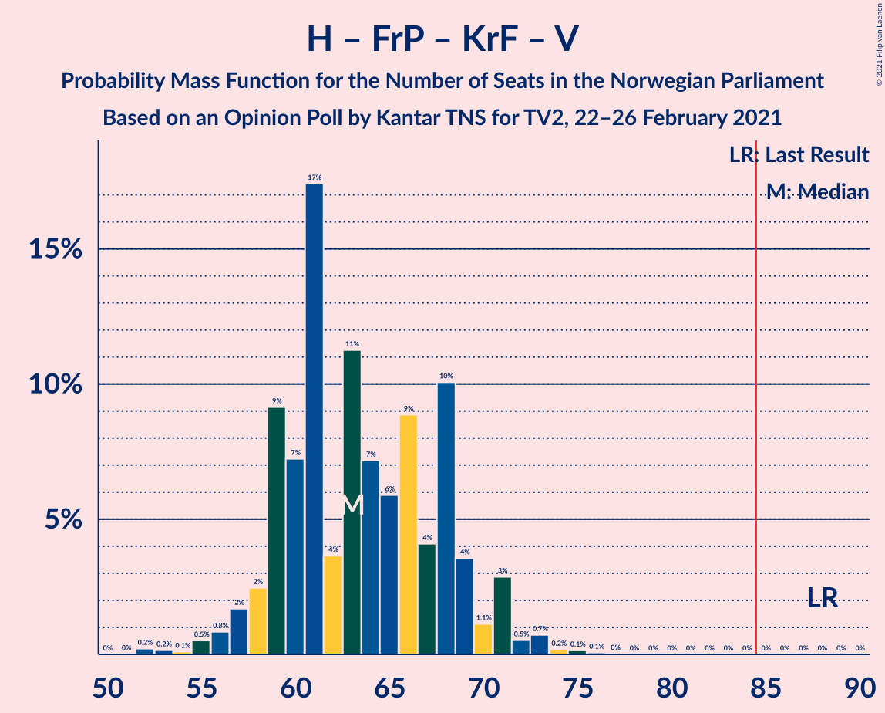

| Number of Seats | Probability | Accumulated | Special Marks |
|:---------------:|:-----------:|:-----------:|:-------------:|
| 52 | 0.2% | 100% |  |
| 53 | 0.2% | 99.8% |  |
| 54 | 0.1% | 99.6% |  |
| 55 | 0.5% | 99.5% |  |
| 56 | 0.8% | 99.0% |  |
| 57 | 2% | 98% |  |
| 58 | 2% | 96% |  |
| 59 | 9% | 94% |  |
| 60 | 7% | 85% |  |
| 61 | 17% | 78% |  |
| 62 | 4% | 60% |  |
| 63 | 11% | 57% |  |
| 64 | 7% | 45% | Median |
| 65 | 6% | 38% |  |
| 66 | 9% | 32% |  |
| 67 | 4% | 23% |  |
| 68 | 10% | 19% |  |
| 69 | 4% | 9% |  |
| 70 | 1.1% | 6% |  |
| 71 | 3% | 5% |  |
| 72 | 0.5% | 2% |  |
| 73 | 0.7% | 1.1% |  |
| 74 | 0.2% | 0.4% |  |
| 75 | 0.1% | 0.2% |  |
| 76 | 0.1% | 0.1% |  |
| 77 | 0% | 0% |  |
| 78 | 0% | 0% |  |
| 79 | 0% | 0% |  |
| 80 | 0% | 0% |  |
| 81 | 0% | 0% |  |
| 82 | 0% | 0% |  |
| 83 | 0% | 0% |  |
| 84 | 0% | 0% |  |
| 85 | 0% | 0% | Majority |
| 86 | 0% | 0% |  |
| 87 | 0% | 0% |  |
| 88 | 0% | 0% | Last Result |

### Høyre – Fremskrittspartiet – Venstre

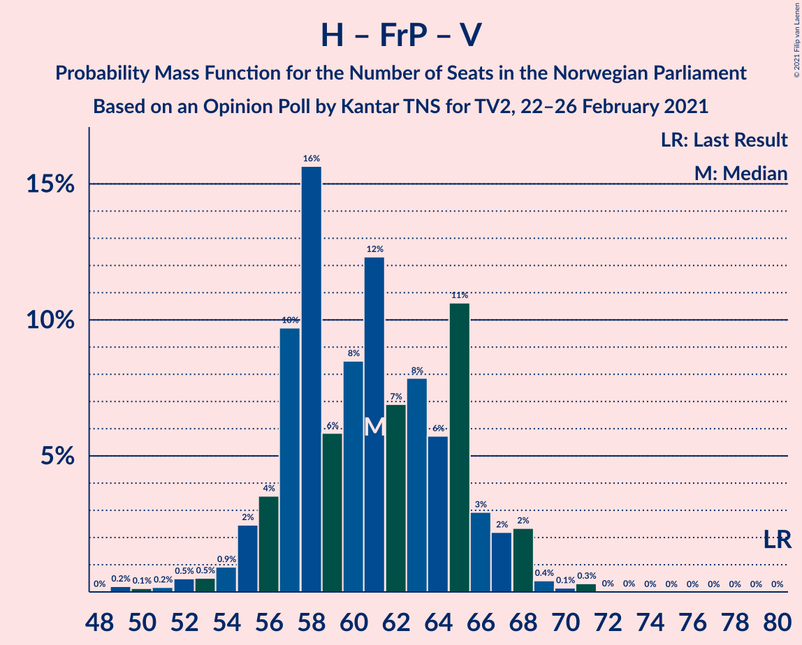

| Number of Seats | Probability | Accumulated | Special Marks |
|:---------------:|:-----------:|:-----------:|:-------------:|
| 49 | 0.2% | 100% |  |
| 50 | 0.1% | 99.8% |  |
| 51 | 0.2% | 99.6% |  |
| 52 | 0.5% | 99.5% |  |
| 53 | 0.5% | 99.0% |  |
| 54 | 0.9% | 98% |  |
| 55 | 2% | 98% |  |
| 56 | 4% | 95% |  |
| 57 | 10% | 92% |  |
| 58 | 16% | 82% |  |
| 59 | 6% | 66% |  |
| 60 | 8% | 60% |  |
| 61 | 12% | 52% | Median |
| 62 | 7% | 40% |  |
| 63 | 8% | 33% |  |
| 64 | 6% | 25% |  |
| 65 | 11% | 19% |  |
| 66 | 3% | 8% |  |
| 67 | 2% | 5% |  |
| 68 | 2% | 3% |  |
| 69 | 0.4% | 0.9% |  |
| 70 | 0.1% | 0.5% |  |
| 71 | 0.3% | 0.4% |  |
| 72 | 0% | 0.1% |  |
| 73 | 0% | 0% |  |
| 74 | 0% | 0% |  |
| 75 | 0% | 0% |  |
| 76 | 0% | 0% |  |
| 77 | 0% | 0% |  |
| 78 | 0% | 0% |  |
| 79 | 0% | 0% |  |
| 80 | 0% | 0% | Last Result |

### Høyre – Fremskrittspartiet

| Number of Seats | Probability | Accumulated | Special Marks |
|:---------------:|:-----------:|:-----------:|:-------------:|
| 47 | 0.2% | 100% |  |
| 48 | 0.1% | 99.8% |  |
| 49 | 0.2% | 99.6% |  |
| 50 | 0.5% | 99.4% |  |
| 51 | 0.4% | 98.9% |  |
| 52 | 0.8% | 98% |  |
| 53 | 2% | 98% |  |
| 54 | 3% | 95% |  |
| 55 | 9% | 92% |  |
| 56 | 16% | 83% |  |
| 57 | 6% | 67% |  |
| 58 | 10% | 61% |  |
| 59 | 11% | 51% | Median |
| 60 | 8% | 40% |  |
| 61 | 8% | 32% |  |
| 62 | 6% | 24% |  |
| 63 | 11% | 19% |  |
| 64 | 3% | 8% |  |
| 65 | 2% | 5% |  |
| 66 | 2% | 3% |  |
| 67 | 0.3% | 0.7% |  |
| 68 | 0.2% | 0.4% |  |
| 69 | 0.1% | 0.2% |  |
| 70 | 0% | 0.1% |  |
| 71 | 0% | 0% |  |
| 72 | 0% | 0% | Last Result |

### Høyre – Kristelig Folkeparti – Venstre

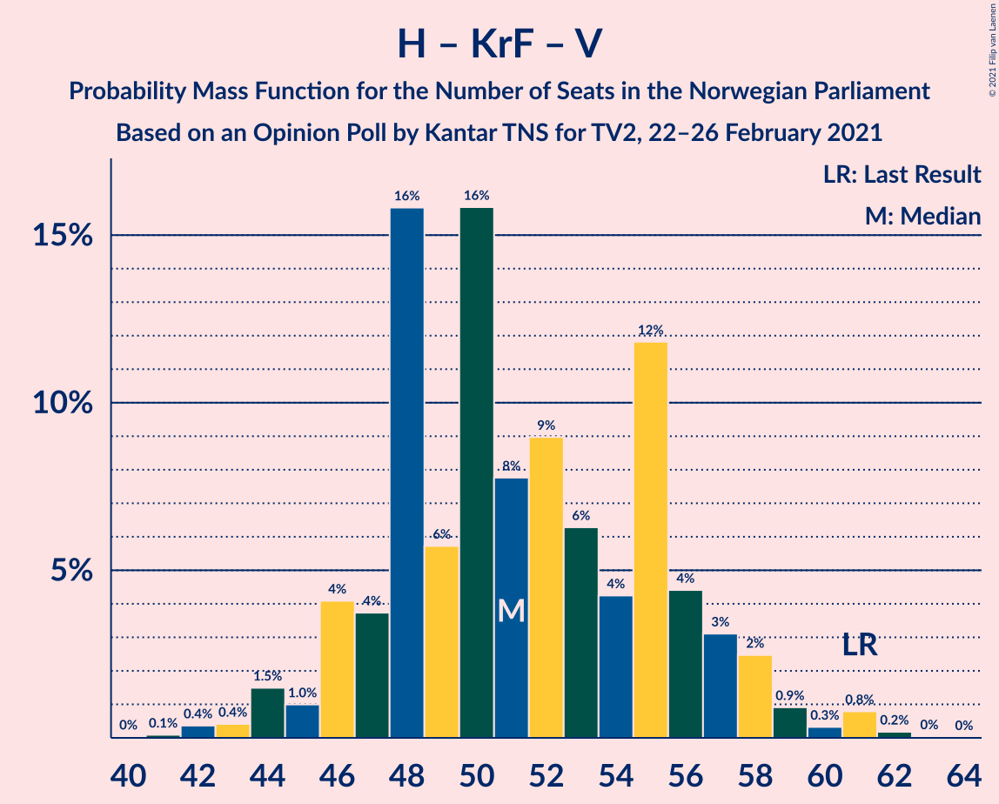

| Number of Seats | Probability | Accumulated | Special Marks |
|:---------------:|:-----------:|:-----------:|:-------------:|
| 40 | 0% | 100% |  |
| 41 | 0.1% | 99.9% |  |
| 42 | 0.4% | 99.9% |  |
| 43 | 0.4% | 99.5% |  |
| 44 | 1.5% | 99.1% |  |
| 45 | 1.0% | 98% |  |
| 46 | 4% | 97% |  |
| 47 | 4% | 92% |  |
| 48 | 16% | 89% |  |
| 49 | 6% | 73% |  |
| 50 | 16% | 67% |  |
| 51 | 8% | 51% | Median |
| 52 | 9% | 44% |  |
| 53 | 6% | 35% |  |
| 54 | 4% | 28% |  |
| 55 | 12% | 24% |  |
| 56 | 4% | 12% |  |
| 57 | 3% | 8% |  |
| 58 | 2% | 5% |  |
| 59 | 0.9% | 2% |  |
| 60 | 0.3% | 1.4% |  |
| 61 | 0.8% | 1.0% | Last Result |
| 62 | 0.2% | 0.2% |  |
| 63 | 0% | 0.1% |  |
| 64 | 0% | 0% |  |

### Arbeiderpartiet – Sosialistisk Venstreparti

| Number of Seats | Probability | Accumulated | Special Marks |
|:---------------:|:-----------:|:-----------:|:-------------:|
| 38 | 0.2% | 100% |  |
| 39 | 0.4% | 99.8% |  |
| 40 | 1.0% | 99.4% |  |
| 41 | 1.3% | 98% |  |
| 42 | 4% | 97% |  |
| 43 | 3% | 93% |  |
| 44 | 4% | 89% |  |
| 45 | 5% | 86% |  |
| 46 | 16% | 81% |  |
| 47 | 9% | 65% |  |
| 48 | 6% | 56% | Median |
| 49 | 13% | 50% |  |
| 50 | 14% | 37% |  |
| 51 | 6% | 23% |  |
| 52 | 7% | 17% |  |
| 53 | 5% | 10% |  |
| 54 | 3% | 5% |  |
| 55 | 2% | 3% |  |
| 56 | 0.5% | 0.9% |  |
| 57 | 0.2% | 0.4% |  |
| 58 | 0.1% | 0.1% |  |
| 59 | 0% | 0.1% |  |
| 60 | 0% | 0% | Last Result |

### Senterpartiet – Kristelig Folkeparti – Venstre

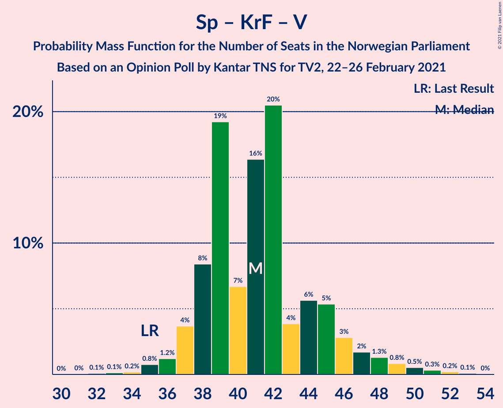

| Number of Seats | Probability | Accumulated | Special Marks |
|:---------------:|:-----------:|:-----------:|:-------------:|
| 32 | 0.1% | 100% |  |
| 33 | 0.1% | 99.9% |  |
| 34 | 0.2% | 99.7% |  |
| 35 | 0.8% | 99.6% | Last Result |
| 36 | 1.2% | 98.8% |  |
| 37 | 4% | 98% |  |
| 38 | 8% | 94% |  |
| 39 | 19% | 86% |  |
| 40 | 7% | 66% |  |
| 41 | 16% | 60% | Median |
| 42 | 20% | 43% |  |
| 43 | 4% | 23% |  |
| 44 | 6% | 19% |  |
| 45 | 5% | 13% |  |
| 46 | 3% | 8% |  |
| 47 | 2% | 5% |  |
| 48 | 1.3% | 3% |  |
| 49 | 0.8% | 2% |  |
| 50 | 0.5% | 1.2% |  |
| 51 | 0.3% | 0.7% |  |
| 52 | 0.2% | 0.3% |  |
| 53 | 0.1% | 0.1% |  |
| 54 | 0% | 0% |  |

## Technical Information

### Opinion Poll

+ **Polling firm:** Kantar TNS
+ **Commissioner(s):** TV2
+ **Fieldwork period:** 22–26 February 2021

### Calculations

+ **Sample size:** 981
+ **Simulations done:** 1,048,576
+ **Error estimate:** 2.13%

