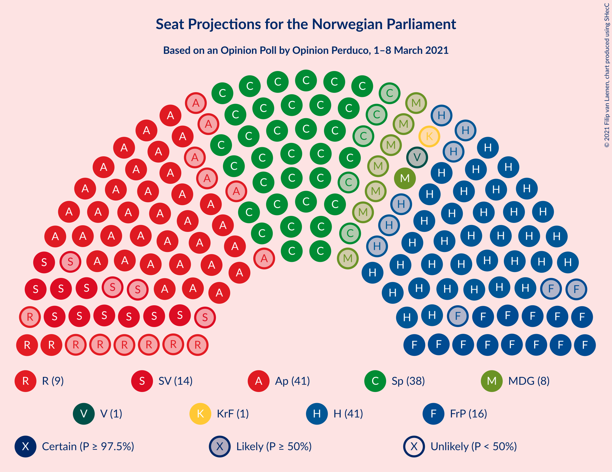

# Opinion Poll by Opinion Perduco, 1–8 March 2021

<a href="#voting-intentions">Voting Intentions</a> | <a href="#seats">Seats</a> | <a href="#coalitions">Coalitions</a> | <a href="#technical-information">Technical Information</a>

## Voting Intentions

### Confidence Intervals

| Party | Last Result | Poll Result | 80% Confidence Interval | 90% Confidence Interval | 95% Confidence Interval | 99% Confidence Interval |
|:-----:|:-----------:|:-----------:|:-----------------------:|:-----------------------:|:-----------------------:|:-----------------------:|
| Høyre | 25.0% | 22.8% | 20.9–25.0% |20.3–25.6% |19.9–26.1% |19.0–27.2% |
| Arbeiderpartiet | 27.4% | 22.7% | 20.8–24.8% |20.2–25.4% |19.7–26.0% |18.8–27.0% |
| Senterpartiet | 10.3% | 20.7% | 18.8–22.8% |18.3–23.4% |17.8–23.9% |17.0–24.9% |
| Fremskrittspartiet | 15.2% | 9.2% | 7.9–10.7% |7.6–11.2% |7.3–11.6% |6.7–12.4% |
| Sosialistisk Venstreparti | 6.0% | 7.8% | 6.6–9.2% |6.3–9.6% |6.0–10.0% |5.5–10.7% |
| Rødt | 2.4% | 4.9% | 4.0–6.1% |3.7–6.4% |3.5–6.8% |3.1–7.4% |
| Miljøpartiet De Grønne | 3.2% | 4.2% | 3.3–5.3% |3.1–5.6% |2.9–5.9% |2.6–6.5% |
| Kristelig Folkeparti | 4.2% | 2.9% | 2.2–3.9% |2.0–4.1% |1.9–4.4% |1.6–4.9% |
| Venstre | 4.4% | 2.2% | 1.6–3.0% |1.4–3.3% |1.3–3.5% |1.1–4.0% |

*Note:* The poll result column reflects the actual value used in the calculations. Published results may vary slightly, and in addition be rounded to fewer digits.

## Seats

### Confidence Intervals

| Party | Last Result | Median | 80% Confidence Interval | 90% Confidence Interval | 95% Confidence Interval | 99% Confidence Interval |
|:-----:|:-----------:|:------:|:-----------------------:|:-----------------------:|:-----------------------:|:-----------------------:|
| <a href="#høyre">Høyre</a> | 45 | 41 | 37–45 |36–47 |35–47 |34–50 |
| <a href="#arbeiderpartiet">Arbeiderpartiet</a> | 49 | 41 | 38–46 |36–47 |35–47 |34–50 |
| <a href="#senterpartiet">Senterpartiet</a> | 19 | 38 | 35–42 |34–43 |33–44 |32–45 |
| <a href="#fremskrittspartiet">Fremskrittspartiet</a> | 27 | 16 | 14–19 |13–20 |13–21 |12–23 |
| <a href="#sosialistisk-venstreparti">Sosialistisk Venstreparti</a> | 11 | 14 | 12–16 |11–17 |10–18 |9–19 |
| <a href="#rødt">Rødt</a> | 1 | 9 | 7–11 |2–11 |2–12 |2–13 |
| <a href="#miljøpartiet-de-grønne">Miljøpartiet De Grønne</a> | 1 | 8 | 2–10 |2–10 |1–10 |1–12 |
| <a href="#kristelig-folkeparti">Kristelig Folkeparti</a> | 8 | 1 | 0–3 |0–7 |0–8 |0–8 |
| <a href="#venstre">Venstre</a> | 8 | 1 | 0–2 |0–2 |0–2 |0–7 |

### Høyre

*For a full overview of the results for this party, see the [Høyre](party-høyre.html) page.*

| Number of Seats | Probability | Accumulated | Special Marks |
|:---------------:|:-----------:|:-----------:|:-------------:|
| 31 | 0.1% | 100% |  |
| 32 | 0% | 99.9% |  |
| 33 | 0.2% | 99.8% |  |
| 34 | 1.4% | 99.6% |  |
| 35 | 2% | 98% |  |
| 36 | 2% | 96% |  |
| 37 | 4% | 94% |  |
| 38 | 8% | 90% |  |
| 39 | 12% | 82% |  |
| 40 | 17% | 70% |  |
| 41 | 9% | 53% | Median |
| 42 | 13% | 44% |  |
| 43 | 13% | 31% |  |
| 44 | 5% | 18% |  |
| 45 | 3% | 12% | Last Result |
| 46 | 3% | 9% |  |
| 47 | 4% | 6% |  |
| 48 | 1.2% | 2% |  |
| 49 | 0.5% | 1.1% |  |
| 50 | 0.4% | 0.6% |  |
| 51 | 0.1% | 0.2% |  |
| 52 | 0.1% | 0.1% |  |
| 53 | 0% | 0% |  |

### Arbeiderpartiet

*For a full overview of the results for this party, see the [Arbeiderpartiet](party-arbeiderpartiet.html) page.*

| Number of Seats | Probability | Accumulated | Special Marks |
|:---------------:|:-----------:|:-----------:|:-------------:|
| 31 | 0.1% | 100% |  |
| 32 | 0.2% | 99.9% |  |
| 33 | 0.2% | 99.7% |  |
| 34 | 0.5% | 99.5% |  |
| 35 | 2% | 99.0% |  |
| 36 | 4% | 97% |  |
| 37 | 3% | 93% |  |
| 38 | 5% | 90% |  |
| 39 | 5% | 86% |  |
| 40 | 17% | 81% |  |
| 41 | 14% | 64% | Median |
| 42 | 15% | 50% |  |
| 43 | 11% | 34% |  |
| 44 | 10% | 24% |  |
| 45 | 3% | 14% |  |
| 46 | 6% | 11% |  |
| 47 | 3% | 6% |  |
| 48 | 0.9% | 2% |  |
| 49 | 0.8% | 1.3% | Last Result |
| 50 | 0.3% | 0.5% |  |
| 51 | 0.1% | 0.2% |  |
| 52 | 0% | 0.1% |  |
| 53 | 0% | 0% |  |

### Senterpartiet

*For a full overview of the results for this party, see the [Senterpartiet](party-senterpartiet.html) page.*

| Number of Seats | Probability | Accumulated | Special Marks |
|:---------------:|:-----------:|:-----------:|:-------------:|
| 19 | 0% | 100% | Last Result |
| 20 | 0% | 100% |  |
| 21 | 0% | 100% |  |
| 22 | 0% | 100% |  |
| 23 | 0% | 100% |  |
| 24 | 0% | 100% |  |
| 25 | 0% | 100% |  |
| 26 | 0% | 100% |  |
| 27 | 0% | 100% |  |
| 28 | 0% | 100% |  |
| 29 | 0% | 100% |  |
| 30 | 0.1% | 99.9% |  |
| 31 | 0.3% | 99.8% |  |
| 32 | 0.7% | 99.5% |  |
| 33 | 2% | 98.8% |  |
| 34 | 5% | 97% |  |
| 35 | 10% | 92% |  |
| 36 | 19% | 82% |  |
| 37 | 11% | 64% |  |
| 38 | 13% | 53% | Median |
| 39 | 10% | 40% |  |
| 40 | 13% | 30% |  |
| 41 | 5% | 17% |  |
| 42 | 6% | 12% |  |
| 43 | 3% | 6% |  |
| 44 | 2% | 3% |  |
| 45 | 0.8% | 1.2% |  |
| 46 | 0.3% | 0.4% |  |
| 47 | 0.1% | 0.1% |  |
| 48 | 0% | 0% |  |

### Fremskrittspartiet

*For a full overview of the results for this party, see the [Fremskrittspartiet](party-fremskrittspartiet.html) page.*

| Number of Seats | Probability | Accumulated | Special Marks |
|:---------------:|:-----------:|:-----------:|:-------------:|
| 10 | 0.1% | 100% |  |
| 11 | 0.3% | 99.9% |  |
| 12 | 2% | 99.6% |  |
| 13 | 5% | 98% |  |
| 14 | 10% | 93% |  |
| 15 | 16% | 83% |  |
| 16 | 23% | 68% | Median |
| 17 | 16% | 45% |  |
| 18 | 11% | 29% |  |
| 19 | 11% | 18% |  |
| 20 | 3% | 7% |  |
| 21 | 3% | 4% |  |
| 22 | 0.6% | 1.2% |  |
| 23 | 0.4% | 0.5% |  |
| 24 | 0.1% | 0.2% |  |
| 25 | 0% | 0% |  |
| 26 | 0% | 0% |  |
| 27 | 0% | 0% | Last Result |

### Sosialistisk Venstreparti

*For a full overview of the results for this party, see the [Sosialistisk Venstreparti](party-sosialistiskvenstreparti.html) page.*

| Number of Seats | Probability | Accumulated | Special Marks |
|:---------------:|:-----------:|:-----------:|:-------------:|
| 9 | 0.6% | 100% |  |
| 10 | 2% | 99.3% |  |
| 11 | 7% | 97% | Last Result |
| 12 | 14% | 90% |  |
| 13 | 22% | 77% |  |
| 14 | 20% | 55% | Median |
| 15 | 15% | 35% |  |
| 16 | 11% | 20% |  |
| 17 | 6% | 9% |  |
| 18 | 2% | 3% |  |
| 19 | 0.7% | 1.2% |  |
| 20 | 0.3% | 0.4% |  |
| 21 | 0.1% | 0.1% |  |
| 22 | 0% | 0% |  |

### Rødt

*For a full overview of the results for this party, see the [Rødt](party-rødt.html) page.*

| Number of Seats | Probability | Accumulated | Special Marks |
|:---------------:|:-----------:|:-----------:|:-------------:|
| 1 | 0.1% | 100% | Last Result |
| 2 | 10% | 99.9% |  |
| 3 | 0.1% | 90% |  |
| 4 | 0% | 90% |  |
| 5 | 0% | 90% |  |
| 6 | 0% | 90% |  |
| 7 | 7% | 90% |  |
| 8 | 26% | 83% |  |
| 9 | 22% | 57% | Median |
| 10 | 20% | 35% |  |
| 11 | 10% | 15% |  |
| 12 | 3% | 4% |  |
| 13 | 0.9% | 1.2% |  |
| 14 | 0.3% | 0.4% |  |
| 15 | 0.1% | 0.1% |  |
| 16 | 0% | 0% |  |

### Miljøpartiet De Grønne

*For a full overview of the results for this party, see the [Miljøpartiet De Grønne](party-miljøpartietdegrønne.html) page.*

| Number of Seats | Probability | Accumulated | Special Marks |
|:---------------:|:-----------:|:-----------:|:-------------:|
| 1 | 3% | 100% | Last Result |
| 2 | 24% | 97% |  |
| 3 | 6% | 73% |  |
| 4 | 2% | 67% |  |
| 5 | 0% | 65% |  |
| 6 | 0.1% | 65% |  |
| 7 | 11% | 64% |  |
| 8 | 20% | 54% | Median |
| 9 | 21% | 34% |  |
| 10 | 11% | 13% |  |
| 11 | 1.4% | 2% |  |
| 12 | 0.5% | 0.6% |  |
| 13 | 0.1% | 0.1% |  |
| 14 | 0% | 0% |  |

### Kristelig Folkeparti

*For a full overview of the results for this party, see the [Kristelig Folkeparti](party-kristeligfolkeparti.html) page.*

| Number of Seats | Probability | Accumulated | Special Marks |
|:---------------:|:-----------:|:-----------:|:-------------:|
| 0 | 10% | 100% |  |
| 1 | 54% | 90% | Median |
| 2 | 15% | 35% |  |
| 3 | 15% | 21% |  |
| 4 | 0% | 6% |  |
| 5 | 0% | 6% |  |
| 6 | 0.1% | 6% |  |
| 7 | 3% | 6% |  |
| 8 | 2% | 3% | Last Result |
| 9 | 0.3% | 0.4% |  |
| 10 | 0.1% | 0.1% |  |
| 11 | 0% | 0% |  |

### Venstre

*For a full overview of the results for this party, see the [Venstre](party-venstre.html) page.*

| Number of Seats | Probability | Accumulated | Special Marks |
|:---------------:|:-----------:|:-----------:|:-------------:|
| 0 | 23% | 100% |  |
| 1 | 37% | 77% | Median |
| 2 | 39% | 40% |  |
| 3 | 0.4% | 1.3% |  |
| 4 | 0% | 0.8% |  |
| 5 | 0% | 0.8% |  |
| 6 | 0% | 0.8% |  |
| 7 | 0.7% | 0.8% |  |
| 8 | 0.2% | 0.2% | Last Result |
| 9 | 0% | 0% |  |

## Coalitions

### Confidence Intervals

| Coalition | Last Result | Median | Majority? | 80% Confidence Interval | 90% Confidence Interval | 95% Confidence Interval | 99% Confidence Interval |
|:---------:|:-----------:|:------:|:---------:|:-----------------------:|:-----------------------:|:-----------------------:|:-----------------------:|
| Arbeiderpartiet – Senterpartiet – Sosialistisk Venstreparti – Rødt – Miljøpartiet De Grønne | 81 | 108 | 100% | 103–113 | 102–114 | 100–115 | 98–117 |
| Arbeiderpartiet – Senterpartiet – Sosialistisk Venstreparti – Rødt | 80 | 102 | 100% | 97–107 | 96–108 | 95–110 | 92–112 |
| Arbeiderpartiet – Senterpartiet – Sosialistisk Venstreparti – Miljøpartiet De Grønne – Kristelig Folkeparti | 88 | 102 | 100% | 96–106 | 95–108 | 94–109 | 91–111 |
| Høyre – Senterpartiet – Fremskrittspartiet – Kristelig Folkeparti – Venstre | 107 | 98 | 100% | 94–104 | 93–106 | 91–108 | 89–109 |
| Arbeiderpartiet – Senterpartiet – Sosialistisk Venstreparti – Miljøpartiet De Grønne | 80 | 100 | 100% | 95–104 | 93–106 | 92–107 | 89–109 |
| Arbeiderpartiet – Senterpartiet – Sosialistisk Venstreparti | 79 | 93 | 99.4% | 89–98 | 88–100 | 87–101 | 84–104 |
| Arbeiderpartiet – Senterpartiet – Miljøpartiet De Grønne – Kristelig Folkeparti | 77 | 87 | 80% | 83–93 | 81–94 | 79–95 | 77–98 |
| Arbeiderpartiet – Senterpartiet – Kristelig Folkeparti | 76 | 81 | 19% | 77–86 | 76–88 | 75–89 | 72–92 |
| Arbeiderpartiet – Senterpartiet | 68 | 79 | 6% | 76–84 | 74–85 | 73–86 | 71–89 |
| Høyre – Fremskrittspartiet – Miljøpartiet De Grønne – Kristelig Folkeparti – Venstre | 89 | 67 | 0% | 62–72 | 60–72 | 59–74 | 56–77 |
| Høyre – Fremskrittspartiet – Kristelig Folkeparti – Venstre | 88 | 60 | 0% | 56–65 | 55–67 | 54–68 | 52–71 |
| Høyre – Fremskrittspartiet – Venstre | 80 | 59 | 0% | 54–63 | 53–65 | 52–66 | 50–69 |
| Høyre – Fremskrittspartiet | 72 | 57 | 0% | 53–62 | 52–64 | 50–65 | 48–67 |
| Arbeiderpartiet – Sosialistisk Venstreparti | 60 | 55 | 0% | 51–60 | 49–62 | 49–62 | 46–65 |
| Høyre – Kristelig Folkeparti – Venstre | 61 | 44 | 0% | 40–48 | 39–50 | 38–51 | 36–53 |
| Senterpartiet – Kristelig Folkeparti – Venstre | 35 | 41 | 0% | 38–45 | 36–47 | 35–48 | 34–51 |

### Arbeiderpartiet – Senterpartiet – Sosialistisk Venstreparti – Rødt – Miljøpartiet De Grønne

| Number of Seats | Probability | Accumulated | Special Marks |
|:---------------:|:-----------:|:-----------:|:-------------:|
| 81 | 0% | 100% | Last Result |
| 82 | 0% | 100% |  |
| 83 | 0% | 100% |  |
| 84 | 0% | 100% |  |
| 85 | 0% | 100% | Majority |
| 86 | 0% | 100% |  |
| 87 | 0% | 100% |  |
| 88 | 0% | 100% |  |
| 89 | 0% | 100% |  |
| 90 | 0% | 100% |  |
| 91 | 0% | 100% |  |
| 92 | 0% | 100% |  |
| 93 | 0% | 100% |  |
| 94 | 0.1% | 100% |  |
| 95 | 0.1% | 99.9% |  |
| 96 | 0.1% | 99.8% |  |
| 97 | 0.2% | 99.8% |  |
| 98 | 0.3% | 99.5% |  |
| 99 | 0.7% | 99.2% |  |
| 100 | 2% | 98.5% |  |
| 101 | 1.4% | 97% |  |
| 102 | 4% | 95% |  |
| 103 | 3% | 92% |  |
| 104 | 5% | 89% |  |
| 105 | 6% | 84% |  |
| 106 | 8% | 78% |  |
| 107 | 7% | 70% |  |
| 108 | 16% | 63% |  |
| 109 | 11% | 48% |  |
| 110 | 10% | 36% | Median |
| 111 | 9% | 27% |  |
| 112 | 6% | 17% |  |
| 113 | 5% | 11% |  |
| 114 | 4% | 7% |  |
| 115 | 2% | 3% |  |
| 116 | 0.5% | 1.1% |  |
| 117 | 0.3% | 0.6% |  |
| 118 | 0.2% | 0.3% |  |
| 119 | 0.1% | 0.1% |  |
| 120 | 0% | 0% |  |

### Arbeiderpartiet – Senterpartiet – Sosialistisk Venstreparti – Rødt

| Number of Seats | Probability | Accumulated | Special Marks |
|:---------------:|:-----------:|:-----------:|:-------------:|
| 80 | 0% | 100% | Last Result |
| 81 | 0% | 100% |  |
| 82 | 0% | 100% |  |
| 83 | 0% | 100% |  |
| 84 | 0% | 100% |  |
| 85 | 0% | 100% | Majority |
| 86 | 0% | 100% |  |
| 87 | 0% | 100% |  |
| 88 | 0% | 100% |  |
| 89 | 0% | 100% |  |
| 90 | 0.3% | 99.9% |  |
| 91 | 0.2% | 99.7% |  |
| 92 | 0.3% | 99.5% |  |
| 93 | 0.8% | 99.2% |  |
| 94 | 0.7% | 98% |  |
| 95 | 2% | 98% |  |
| 96 | 2% | 96% |  |
| 97 | 6% | 94% |  |
| 98 | 5% | 88% |  |
| 99 | 12% | 83% |  |
| 100 | 8% | 71% |  |
| 101 | 8% | 63% |  |
| 102 | 13% | 54% | Median |
| 103 | 11% | 42% |  |
| 104 | 5% | 30% |  |
| 105 | 8% | 25% |  |
| 106 | 6% | 17% |  |
| 107 | 5% | 11% |  |
| 108 | 2% | 6% |  |
| 109 | 2% | 4% |  |
| 110 | 2% | 3% |  |
| 111 | 0.4% | 1.0% |  |
| 112 | 0.2% | 0.6% |  |
| 113 | 0.3% | 0.4% |  |
| 114 | 0% | 0.1% |  |
| 115 | 0% | 0% |  |

### Arbeiderpartiet – Senterpartiet – Sosialistisk Venstreparti – Miljøpartiet De Grønne – Kristelig Folkeparti

| Number of Seats | Probability | Accumulated | Special Marks |
|:---------------:|:-----------:|:-----------:|:-------------:|
| 88 | 0.1% | 100% | Last Result |
| 89 | 0.2% | 99.9% |  |
| 90 | 0.1% | 99.7% |  |
| 91 | 0.3% | 99.7% |  |
| 92 | 0.7% | 99.4% |  |
| 93 | 0.7% | 98.6% |  |
| 94 | 3% | 98% |  |
| 95 | 3% | 95% |  |
| 96 | 3% | 93% |  |
| 97 | 4% | 90% |  |
| 98 | 4% | 86% |  |
| 99 | 10% | 82% |  |
| 100 | 8% | 72% |  |
| 101 | 14% | 64% |  |
| 102 | 13% | 50% | Median |
| 103 | 10% | 37% |  |
| 104 | 8% | 26% |  |
| 105 | 6% | 19% |  |
| 106 | 4% | 13% |  |
| 107 | 2% | 9% |  |
| 108 | 3% | 6% |  |
| 109 | 1.0% | 3% |  |
| 110 | 1.2% | 2% |  |
| 111 | 0.5% | 0.9% |  |
| 112 | 0.2% | 0.4% |  |
| 113 | 0.1% | 0.2% |  |
| 114 | 0.1% | 0.1% |  |
| 115 | 0% | 0% |  |

### Høyre – Senterpartiet – Fremskrittspartiet – Kristelig Folkeparti – Venstre

| Number of Seats | Probability | Accumulated | Special Marks |
|:---------------:|:-----------:|:-----------:|:-------------:|
| 86 | 0.1% | 100% |  |
| 87 | 0.1% | 99.9% |  |
| 88 | 0.1% | 99.9% |  |
| 89 | 0.3% | 99.8% |  |
| 90 | 0.8% | 99.4% |  |
| 91 | 1.3% | 98.6% |  |
| 92 | 2% | 97% |  |
| 93 | 5% | 95% |  |
| 94 | 4% | 91% |  |
| 95 | 8% | 86% |  |
| 96 | 13% | 79% |  |
| 97 | 13% | 66% | Median |
| 98 | 7% | 53% |  |
| 99 | 12% | 47% |  |
| 100 | 7% | 35% |  |
| 101 | 7% | 28% |  |
| 102 | 4% | 21% |  |
| 103 | 6% | 17% |  |
| 104 | 3% | 11% |  |
| 105 | 3% | 8% |  |
| 106 | 2% | 5% |  |
| 107 | 1.1% | 4% | Last Result |
| 108 | 1.5% | 3% |  |
| 109 | 0.6% | 1.1% |  |
| 110 | 0.3% | 0.5% |  |
| 111 | 0.1% | 0.2% |  |
| 112 | 0.1% | 0.1% |  |
| 113 | 0% | 0% |  |

### Arbeiderpartiet – Senterpartiet – Sosialistisk Venstreparti – Miljøpartiet De Grønne

| Number of Seats | Probability | Accumulated | Special Marks |
|:---------------:|:-----------:|:-----------:|:-------------:|
| 80 | 0% | 100% | Last Result |
| 81 | 0% | 100% |  |
| 82 | 0% | 100% |  |
| 83 | 0% | 100% |  |
| 84 | 0% | 100% |  |
| 85 | 0% | 100% | Majority |
| 86 | 0.1% | 100% |  |
| 87 | 0.1% | 99.9% |  |
| 88 | 0.1% | 99.9% |  |
| 89 | 0.3% | 99.7% |  |
| 90 | 0.5% | 99.5% |  |
| 91 | 1.0% | 98.9% |  |
| 92 | 1.1% | 98% |  |
| 93 | 4% | 97% |  |
| 94 | 2% | 93% |  |
| 95 | 4% | 91% |  |
| 96 | 6% | 87% |  |
| 97 | 5% | 81% |  |
| 98 | 10% | 76% |  |
| 99 | 9% | 66% |  |
| 100 | 16% | 57% |  |
| 101 | 11% | 41% | Median |
| 102 | 8% | 29% |  |
| 103 | 7% | 22% |  |
| 104 | 6% | 15% |  |
| 105 | 4% | 9% |  |
| 106 | 2% | 5% |  |
| 107 | 2% | 4% |  |
| 108 | 0.5% | 1.3% |  |
| 109 | 0.4% | 0.8% |  |
| 110 | 0.3% | 0.5% |  |
| 111 | 0.1% | 0.2% |  |
| 112 | 0% | 0.1% |  |
| 113 | 0% | 0% |  |

### Arbeiderpartiet – Senterpartiet – Sosialistisk Venstreparti

| Number of Seats | Probability | Accumulated | Special Marks |
|:---------------:|:-----------:|:-----------:|:-------------:|
| 79 | 0% | 100% | Last Result |
| 80 | 0% | 100% |  |
| 81 | 0% | 100% |  |
| 82 | 0.1% | 100% |  |
| 83 | 0.2% | 99.9% |  |
| 84 | 0.3% | 99.7% |  |
| 85 | 0.4% | 99.4% | Majority |
| 86 | 1.0% | 99.0% |  |
| 87 | 1.4% | 98% |  |
| 88 | 4% | 97% |  |
| 89 | 6% | 93% |  |
| 90 | 6% | 87% |  |
| 91 | 16% | 81% |  |
| 92 | 6% | 65% |  |
| 93 | 16% | 59% | Median |
| 94 | 7% | 43% |  |
| 95 | 9% | 36% |  |
| 96 | 7% | 26% |  |
| 97 | 7% | 20% |  |
| 98 | 4% | 13% |  |
| 99 | 3% | 9% |  |
| 100 | 2% | 5% |  |
| 101 | 1.2% | 3% |  |
| 102 | 0.9% | 2% |  |
| 103 | 0.2% | 1.0% |  |
| 104 | 0.5% | 0.8% |  |
| 105 | 0.2% | 0.3% |  |
| 106 | 0.1% | 0.1% |  |
| 107 | 0% | 0% |  |

### Arbeiderpartiet – Senterpartiet – Miljøpartiet De Grønne – Kristelig Folkeparti

| Number of Seats | Probability | Accumulated | Special Marks |
|:---------------:|:-----------:|:-----------:|:-------------:|
| 74 | 0.1% | 100% |  |
| 75 | 0.1% | 99.9% |  |
| 76 | 0.3% | 99.8% |  |
| 77 | 0.4% | 99.5% | Last Result |
| 78 | 0.6% | 99.1% |  |
| 79 | 1.2% | 98.5% |  |
| 80 | 2% | 97% |  |
| 81 | 2% | 95% |  |
| 82 | 3% | 93% |  |
| 83 | 4% | 90% |  |
| 84 | 6% | 86% |  |
| 85 | 8% | 80% | Majority |
| 86 | 9% | 73% |  |
| 87 | 16% | 63% |  |
| 88 | 6% | 47% | Median |
| 89 | 11% | 41% |  |
| 90 | 7% | 30% |  |
| 91 | 9% | 23% |  |
| 92 | 4% | 15% |  |
| 93 | 5% | 11% |  |
| 94 | 2% | 6% |  |
| 95 | 2% | 4% |  |
| 96 | 1.2% | 2% |  |
| 97 | 0.4% | 0.9% |  |
| 98 | 0.3% | 0.5% |  |
| 99 | 0.1% | 0.2% |  |
| 100 | 0% | 0.1% |  |
| 101 | 0% | 0% |  |

### Arbeiderpartiet – Senterpartiet – Kristelig Folkeparti

| Number of Seats | Probability | Accumulated | Special Marks |
|:---------------:|:-----------:|:-----------:|:-------------:|
| 70 | 0.2% | 100% |  |
| 71 | 0.1% | 99.8% |  |
| 72 | 0.4% | 99.6% |  |
| 73 | 0.6% | 99.3% |  |
| 74 | 0.8% | 98.7% |  |
| 75 | 2% | 98% |  |
| 76 | 3% | 96% | Last Result |
| 77 | 8% | 93% |  |
| 78 | 6% | 85% |  |
| 79 | 13% | 79% |  |
| 80 | 12% | 66% | Median |
| 81 | 8% | 54% |  |
| 82 | 13% | 45% |  |
| 83 | 8% | 33% |  |
| 84 | 5% | 25% |  |
| 85 | 8% | 19% | Majority |
| 86 | 2% | 11% |  |
| 87 | 4% | 9% |  |
| 88 | 2% | 5% |  |
| 89 | 2% | 3% |  |
| 90 | 0.7% | 2% |  |
| 91 | 0.3% | 0.9% |  |
| 92 | 0.4% | 0.6% |  |
| 93 | 0.1% | 0.2% |  |
| 94 | 0% | 0.1% |  |
| 95 | 0% | 0% |  |

### Arbeiderpartiet – Senterpartiet

| Number of Seats | Probability | Accumulated | Special Marks |
|:---------------:|:-----------:|:-----------:|:-------------:|
| 68 | 0% | 100% | Last Result |
| 69 | 0.2% | 99.9% |  |
| 70 | 0.2% | 99.7% |  |
| 71 | 0.4% | 99.6% |  |
| 72 | 0.7% | 99.2% |  |
| 73 | 1.3% | 98% |  |
| 74 | 3% | 97% |  |
| 75 | 2% | 94% |  |
| 76 | 10% | 92% |  |
| 77 | 7% | 82% |  |
| 78 | 19% | 75% |  |
| 79 | 9% | 56% | Median |
| 80 | 10% | 48% |  |
| 81 | 14% | 38% |  |
| 82 | 7% | 24% |  |
| 83 | 5% | 18% |  |
| 84 | 6% | 12% |  |
| 85 | 2% | 6% | Majority |
| 86 | 1.4% | 4% |  |
| 87 | 1.1% | 2% |  |
| 88 | 0.4% | 1.3% |  |
| 89 | 0.5% | 0.8% |  |
| 90 | 0.1% | 0.4% |  |
| 91 | 0.1% | 0.2% |  |
| 92 | 0.1% | 0.1% |  |
| 93 | 0% | 0% |  |

### Høyre – Fremskrittspartiet – Miljøpartiet De Grønne – Kristelig Folkeparti – Venstre

| Number of Seats | Probability | Accumulated | Special Marks |
|:---------------:|:-----------:|:-----------:|:-------------:|
| 54 | 0% | 100% |  |
| 55 | 0.1% | 99.9% |  |
| 56 | 0.4% | 99.9% |  |
| 57 | 0.4% | 99.5% |  |
| 58 | 0.5% | 99.0% |  |
| 59 | 2% | 98.6% |  |
| 60 | 2% | 97% |  |
| 61 | 3% | 94% |  |
| 62 | 5% | 92% |  |
| 63 | 6% | 86% |  |
| 64 | 9% | 80% |  |
| 65 | 6% | 72% |  |
| 66 | 12% | 66% |  |
| 67 | 12% | 55% | Median |
| 68 | 8% | 43% |  |
| 69 | 8% | 35% |  |
| 70 | 12% | 27% |  |
| 71 | 4% | 15% |  |
| 72 | 6% | 11% |  |
| 73 | 1.4% | 5% |  |
| 74 | 1.5% | 3% |  |
| 75 | 0.6% | 2% |  |
| 76 | 0.7% | 1.3% |  |
| 77 | 0.3% | 0.7% |  |
| 78 | 0.1% | 0.4% |  |
| 79 | 0.2% | 0.3% |  |
| 80 | 0% | 0% |  |
| 81 | 0% | 0% |  |
| 82 | 0% | 0% |  |
| 83 | 0% | 0% |  |
| 84 | 0% | 0% |  |
| 85 | 0% | 0% | Majority |
| 86 | 0% | 0% |  |
| 87 | 0% | 0% |  |
| 88 | 0% | 0% |  |
| 89 | 0% | 0% | Last Result |

### Høyre – Fremskrittspartiet – Kristelig Folkeparti – Venstre

| Number of Seats | Probability | Accumulated | Special Marks |
|:---------------:|:-----------:|:-----------:|:-------------:|
| 49 | 0% | 100% |  |
| 50 | 0.1% | 99.9% |  |
| 51 | 0.3% | 99.8% |  |
| 52 | 0.5% | 99.6% |  |
| 53 | 1.0% | 99.1% |  |
| 54 | 2% | 98% |  |
| 55 | 4% | 96% |  |
| 56 | 5% | 92% |  |
| 57 | 6% | 87% |  |
| 58 | 10% | 80% |  |
| 59 | 10% | 70% | Median |
| 60 | 11% | 60% |  |
| 61 | 16% | 49% |  |
| 62 | 7% | 34% |  |
| 63 | 8% | 27% |  |
| 64 | 6% | 19% |  |
| 65 | 4% | 14% |  |
| 66 | 2% | 9% |  |
| 67 | 3% | 7% |  |
| 68 | 1.2% | 4% |  |
| 69 | 1.3% | 2% |  |
| 70 | 0.6% | 1.2% |  |
| 71 | 0.2% | 0.6% |  |
| 72 | 0.2% | 0.3% |  |
| 73 | 0% | 0.1% |  |
| 74 | 0% | 0.1% |  |
| 75 | 0% | 0.1% |  |
| 76 | 0% | 0% |  |
| 77 | 0% | 0% |  |
| 78 | 0% | 0% |  |
| 79 | 0% | 0% |  |
| 80 | 0% | 0% |  |
| 81 | 0% | 0% |  |
| 82 | 0% | 0% |  |
| 83 | 0% | 0% |  |
| 84 | 0% | 0% |  |
| 85 | 0% | 0% | Majority |
| 86 | 0% | 0% |  |
| 87 | 0% | 0% |  |
| 88 | 0% | 0% | Last Result |

### Høyre – Fremskrittspartiet – Venstre

| Number of Seats | Probability | Accumulated | Special Marks |
|:---------------:|:-----------:|:-----------:|:-------------:|
| 47 | 0% | 100% |  |
| 48 | 0.1% | 99.9% |  |
| 49 | 0.2% | 99.8% |  |
| 50 | 0.6% | 99.6% |  |
| 51 | 1.3% | 99.1% |  |
| 52 | 2% | 98% |  |
| 53 | 2% | 96% |  |
| 54 | 4% | 93% |  |
| 55 | 7% | 89% |  |
| 56 | 7% | 82% |  |
| 57 | 11% | 75% |  |
| 58 | 11% | 64% | Median |
| 59 | 16% | 53% |  |
| 60 | 8% | 37% |  |
| 61 | 8% | 29% |  |
| 62 | 8% | 21% |  |
| 63 | 3% | 13% |  |
| 64 | 3% | 10% |  |
| 65 | 3% | 7% |  |
| 66 | 2% | 4% |  |
| 67 | 0.9% | 2% |  |
| 68 | 0.9% | 1.4% |  |
| 69 | 0.3% | 0.5% |  |
| 70 | 0.1% | 0.2% |  |
| 71 | 0.1% | 0.1% |  |
| 72 | 0% | 0% |  |
| 73 | 0% | 0% |  |
| 74 | 0% | 0% |  |
| 75 | 0% | 0% |  |
| 76 | 0% | 0% |  |
| 77 | 0% | 0% |  |
| 78 | 0% | 0% |  |
| 79 | 0% | 0% |  |
| 80 | 0% | 0% | Last Result |

### Høyre – Fremskrittspartiet

| Number of Seats | Probability | Accumulated | Special Marks |
|:---------------:|:-----------:|:-----------:|:-------------:|
| 46 | 0% | 100% |  |
| 47 | 0.1% | 99.9% |  |
| 48 | 0.5% | 99.8% |  |
| 49 | 0.5% | 99.4% |  |
| 50 | 2% | 98.8% |  |
| 51 | 2% | 97% |  |
| 52 | 2% | 95% |  |
| 53 | 5% | 93% |  |
| 54 | 7% | 88% |  |
| 55 | 9% | 82% |  |
| 56 | 8% | 73% |  |
| 57 | 17% | 65% | Median |
| 58 | 15% | 48% |  |
| 59 | 7% | 33% |  |
| 60 | 7% | 26% |  |
| 61 | 6% | 19% |  |
| 62 | 4% | 13% |  |
| 63 | 4% | 9% |  |
| 64 | 2% | 5% |  |
| 65 | 1.5% | 4% |  |
| 66 | 1.1% | 2% |  |
| 67 | 0.6% | 1.0% |  |
| 68 | 0.2% | 0.4% |  |
| 69 | 0.1% | 0.2% |  |
| 70 | 0% | 0.1% |  |
| 71 | 0% | 0% |  |
| 72 | 0% | 0% | Last Result |

### Arbeiderpartiet – Sosialistisk Venstreparti

| Number of Seats | Probability | Accumulated | Special Marks |
|:---------------:|:-----------:|:-----------:|:-------------:|
| 44 | 0.1% | 100% |  |
| 45 | 0.1% | 99.9% |  |
| 46 | 0.5% | 99.8% |  |
| 47 | 0.4% | 99.3% |  |
| 48 | 0.7% | 98.9% |  |
| 49 | 3% | 98% |  |
| 50 | 3% | 95% |  |
| 51 | 6% | 92% |  |
| 52 | 6% | 86% |  |
| 53 | 9% | 80% |  |
| 54 | 9% | 71% |  |
| 55 | 17% | 62% | Median |
| 56 | 11% | 45% |  |
| 57 | 8% | 34% |  |
| 58 | 8% | 26% |  |
| 59 | 5% | 18% |  |
| 60 | 3% | 13% | Last Result |
| 61 | 3% | 9% |  |
| 62 | 4% | 7% |  |
| 63 | 0.7% | 2% |  |
| 64 | 0.7% | 2% |  |
| 65 | 0.6% | 1.0% |  |
| 66 | 0.3% | 0.4% |  |
| 67 | 0.1% | 0.2% |  |
| 68 | 0% | 0% |  |

### Høyre – Kristelig Folkeparti – Venstre

| Number of Seats | Probability | Accumulated | Special Marks |
|:---------------:|:-----------:|:-----------:|:-------------:|
| 34 | 0.1% | 100% |  |
| 35 | 0.1% | 99.9% |  |
| 36 | 0.4% | 99.8% |  |
| 37 | 0.9% | 99.4% |  |
| 38 | 1.4% | 98.5% |  |
| 39 | 3% | 97% |  |
| 40 | 7% | 94% |  |
| 41 | 12% | 87% |  |
| 42 | 11% | 75% |  |
| 43 | 9% | 64% | Median |
| 44 | 11% | 55% |  |
| 45 | 17% | 44% |  |
| 46 | 6% | 27% |  |
| 47 | 4% | 21% |  |
| 48 | 8% | 18% |  |
| 49 | 4% | 9% |  |
| 50 | 2% | 5% |  |
| 51 | 1.3% | 3% |  |
| 52 | 1.2% | 2% |  |
| 53 | 0.5% | 1.0% |  |
| 54 | 0.2% | 0.5% |  |
| 55 | 0.1% | 0.3% |  |
| 56 | 0.1% | 0.1% |  |
| 57 | 0% | 0% |  |
| 58 | 0% | 0% |  |
| 59 | 0% | 0% |  |
| 60 | 0% | 0% |  |
| 61 | 0% | 0% | Last Result |

### Senterpartiet – Kristelig Folkeparti – Venstre

| Number of Seats | Probability | Accumulated | Special Marks |
|:---------------:|:-----------:|:-----------:|:-------------:|
| 31 | 0.1% | 100% |  |
| 32 | 0.1% | 99.9% |  |
| 33 | 0.3% | 99.8% |  |
| 34 | 0.4% | 99.6% |  |
| 35 | 2% | 99.1% | Last Result |
| 36 | 3% | 97% |  |
| 37 | 4% | 94% |  |
| 38 | 10% | 90% |  |
| 39 | 18% | 80% |  |
| 40 | 10% | 62% | Median |
| 41 | 14% | 51% |  |
| 42 | 11% | 37% |  |
| 43 | 7% | 26% |  |
| 44 | 5% | 19% |  |
| 45 | 4% | 14% |  |
| 46 | 3% | 9% |  |
| 47 | 2% | 6% |  |
| 48 | 2% | 4% |  |
| 49 | 1.3% | 2% |  |
| 50 | 0.6% | 1.2% |  |
| 51 | 0.2% | 0.5% |  |
| 52 | 0.1% | 0.3% |  |
| 53 | 0.1% | 0.1% |  |
| 54 | 0% | 0% |  |

## Technical Information

### Opinion Poll

+ **Polling firm:** Opinion Perduco
+ **Commissioner(s):** —
+ **Fieldwork period:** 1–8 March 2021

### Calculations

+ **Sample size:** 696
+ **Simulations done:** 1,048,576
+ **Error estimate:** 1.31%

