# Opinion Poll by Respons Analyse for VG, 5–10 March 2021

<a href="#voting-intentions">Voting Intentions</a> | <a href="#seats">Seats</a> | <a href="#coalitions">Coalitions</a> | <a href="#technical-information">Technical Information</a>

## Voting Intentions

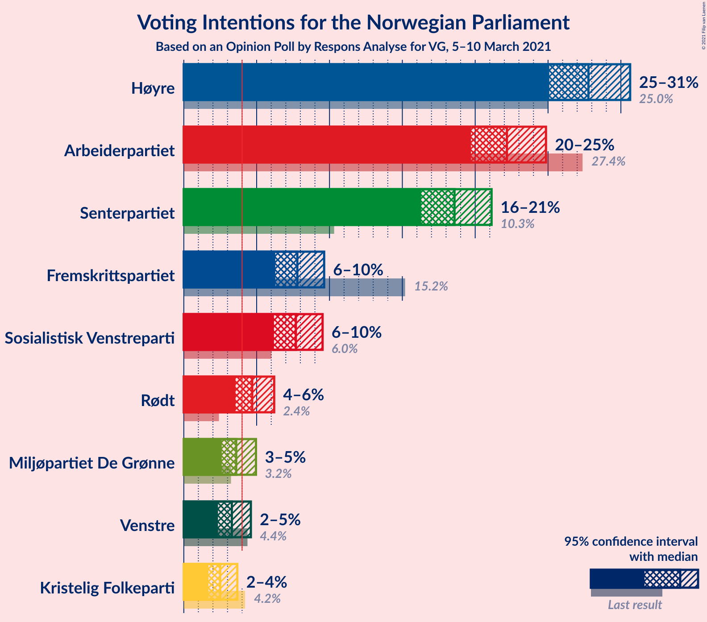

### Confidence Intervals

| Party | Last Result | Poll Result | 80% Confidence Interval | 90% Confidence Interval | 95% Confidence Interval | 99% Confidence Interval |
|:-----:|:-----------:|:-----------:|:-----------------------:|:-----------------------:|:-----------------------:|:-----------------------:|
| Høyre | 25.0% | 27.8% | 26.0–29.6% |25.5–30.2% |25.1–30.6% |24.2–31.6% |
| Arbeiderpartiet | 27.4% | 22.2% | 20.6–23.9% |20.1–24.4% |19.7–24.9% |19.0–25.7% |
| Senterpartiet | 10.3% | 18.6% | 17.1–20.2% |16.6–20.7% |16.3–21.1% |15.6–21.9% |
| Fremskrittspartiet | 15.2% | 7.8% | 6.8–9.0% |6.5–9.3% |6.3–9.6% |5.8–10.2% |
| Sosialistisk Venstreparti | 6.0% | 7.7% | 6.7–8.9% |6.4–9.2% |6.2–9.5% |5.7–10.1% |
| Rødt | 2.4% | 4.7% | 3.9–5.7% |3.7–5.9% |3.6–6.2% |3.2–6.7% |
| Miljøpartiet De Grønne | 3.2% | 3.6% | 2.9–4.5% |2.8–4.7% |2.6–5.0% |2.3–5.4% |
| Venstre | 4.4% | 3.3% | 2.7–4.1% |2.5–4.4% |2.3–4.6% |2.1–5.0% |
| Kristelig Folkeparti | 4.2% | 2.5% | 2.0–3.3% |1.8–3.5% |1.7–3.7% |1.5–4.1% |

*Note:* The poll result column reflects the actual value used in the calculations. Published results may vary slightly, and in addition be rounded to fewer digits.

## Seats

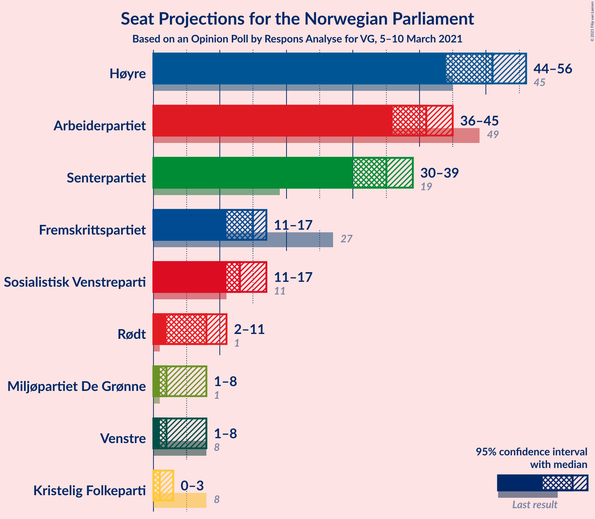

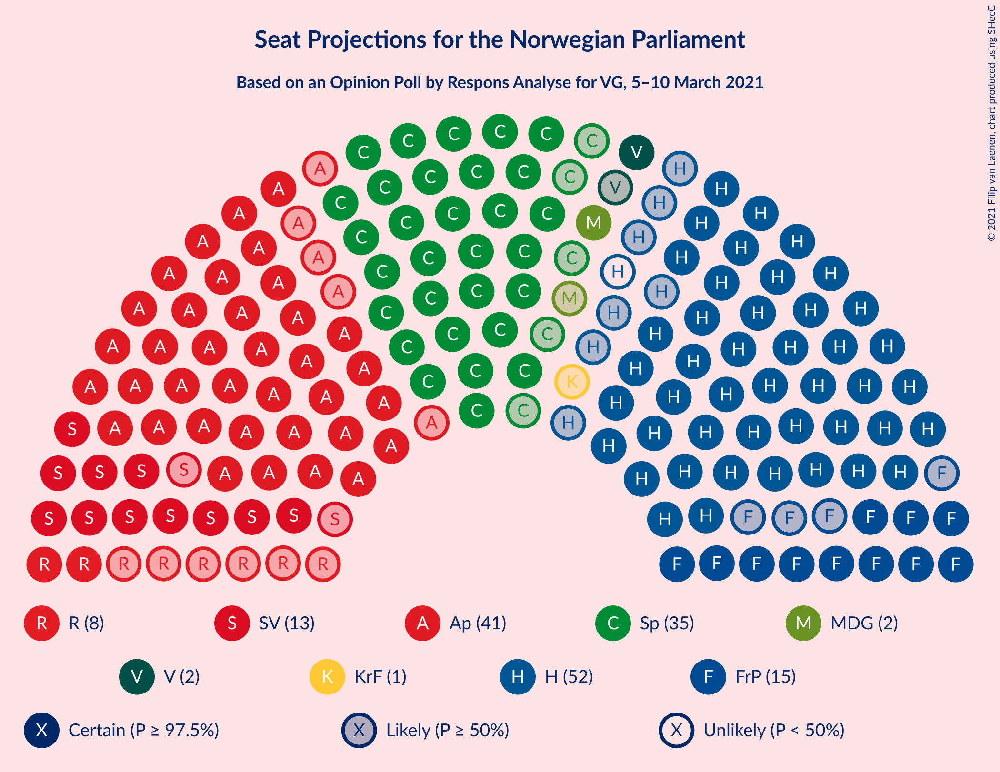

### Confidence Intervals

| Party | Last Result | Median | 80% Confidence Interval | 90% Confidence Interval | 95% Confidence Interval | 99% Confidence Interval |
|:-----:|:-----------:|:------:|:-----------------------:|:-----------------------:|:-----------------------:|:-----------------------:|
| <a href="#høyre">Høyre</a> | 45 | 51 | 46–54 |45–55 |44–56 |42–59 |
| <a href="#arbeiderpartiet">Arbeiderpartiet</a> | 49 | 41 | 38–44 |37–45 |36–45 |34–47 |
| <a href="#senterpartiet">Senterpartiet</a> | 19 | 35 | 31–37 |30–38 |30–39 |28–40 |
| <a href="#fremskrittspartiet">Fremskrittspartiet</a> | 27 | 15 | 12–16 |11–17 |11–17 |10–19 |
| <a href="#sosialistisk-venstreparti">Sosialistisk Venstreparti</a> | 11 | 13 | 12–16 |11–17 |11–17 |10–18 |
| <a href="#rødt">Rødt</a> | 1 | 8 | 7–10 |2–11 |2–11 |2–12 |
| <a href="#miljøpartiet-de-grønne">Miljøpartiet De Grønne</a> | 1 | 2 | 2–7 |1–8 |1–8 |1–10 |
| <a href="#venstre">Venstre</a> | 8 | 2 | 2–7 |2–8 |1–8 |1–9 |
| <a href="#kristelig-folkeparti">Kristelig Folkeparti</a> | 8 | 1 | 0–3 |0–3 |0–3 |0–3 |

### Høyre

*For a full overview of the results for this party, see the [Høyre](party-høyre.html) page.*

| Number of Seats | Probability | Accumulated | Special Marks |
|:---------------:|:-----------:|:-----------:|:-------------:|
| 41 | 0.2% | 100% |  |
| 42 | 0.4% | 99.8% |  |
| 43 | 0.6% | 99.5% |  |
| 44 | 2% | 98.9% |  |
| 45 | 2% | 97% | Last Result |
| 46 | 5% | 94% |  |
| 47 | 5% | 90% |  |
| 48 | 7% | 85% |  |
| 49 | 4% | 78% |  |
| 50 | 20% | 74% |  |
| 51 | 9% | 53% | Median |
| 52 | 25% | 44% |  |
| 53 | 8% | 19% |  |
| 54 | 6% | 11% |  |
| 55 | 2% | 5% |  |
| 56 | 0.8% | 3% |  |
| 57 | 0.5% | 2% |  |
| 58 | 1.5% | 2% |  |
| 59 | 0.3% | 0.5% |  |
| 60 | 0.1% | 0.2% |  |
| 61 | 0.1% | 0.1% |  |
| 62 | 0% | 0% |  |

### Arbeiderpartiet

*For a full overview of the results for this party, see the [Arbeiderpartiet](party-arbeiderpartiet.html) page.*

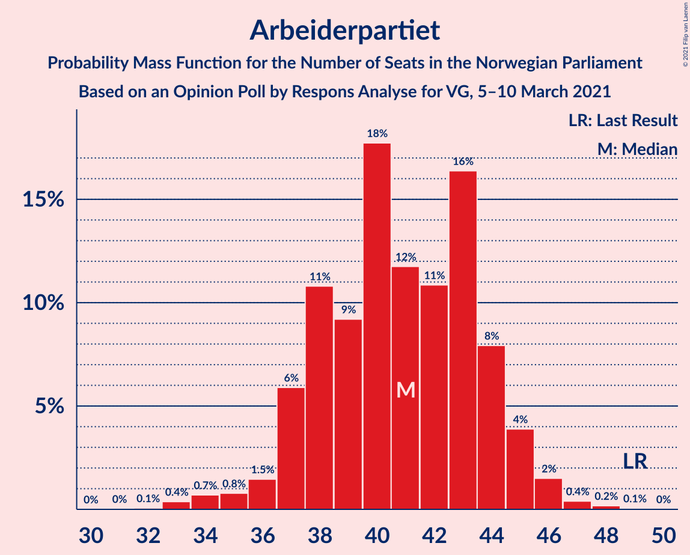

| Number of Seats | Probability | Accumulated | Special Marks |
|:---------------:|:-----------:|:-----------:|:-------------:|
| 32 | 0.1% | 100% |  |
| 33 | 0.4% | 99.9% |  |
| 34 | 0.7% | 99.5% |  |
| 35 | 0.8% | 98.8% |  |
| 36 | 1.5% | 98% |  |
| 37 | 6% | 97% |  |
| 38 | 11% | 91% |  |
| 39 | 9% | 80% |  |
| 40 | 18% | 71% |  |
| 41 | 12% | 53% | Median |
| 42 | 11% | 41% |  |
| 43 | 16% | 30% |  |
| 44 | 8% | 14% |  |
| 45 | 4% | 6% |  |
| 46 | 2% | 2% |  |
| 47 | 0.4% | 0.7% |  |
| 48 | 0.2% | 0.3% |  |
| 49 | 0.1% | 0.1% | Last Result |
| 50 | 0% | 0% |  |

### Senterpartiet

*For a full overview of the results for this party, see the [Senterpartiet](party-senterpartiet.html) page.*

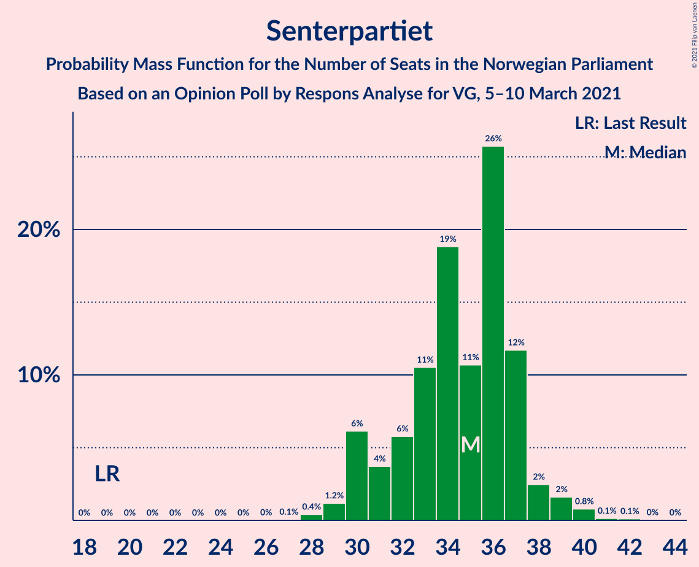

| Number of Seats | Probability | Accumulated | Special Marks |
|:---------------:|:-----------:|:-----------:|:-------------:|
| 19 | 0% | 100% | Last Result |
| 20 | 0% | 100% |  |
| 21 | 0% | 100% |  |
| 22 | 0% | 100% |  |
| 23 | 0% | 100% |  |
| 24 | 0% | 100% |  |
| 25 | 0% | 100% |  |
| 26 | 0% | 100% |  |
| 27 | 0.1% | 100% |  |
| 28 | 0.4% | 99.9% |  |
| 29 | 1.2% | 99.5% |  |
| 30 | 6% | 98% |  |
| 31 | 4% | 92% |  |
| 32 | 6% | 88% |  |
| 33 | 11% | 83% |  |
| 34 | 19% | 72% |  |
| 35 | 11% | 53% | Median |
| 36 | 26% | 43% |  |
| 37 | 12% | 17% |  |
| 38 | 2% | 5% |  |
| 39 | 2% | 3% |  |
| 40 | 0.8% | 1.1% |  |
| 41 | 0.1% | 0.3% |  |
| 42 | 0.1% | 0.2% |  |
| 43 | 0% | 0% |  |

### Fremskrittspartiet

*For a full overview of the results for this party, see the [Fremskrittspartiet](party-fremskrittspartiet.html) page.*

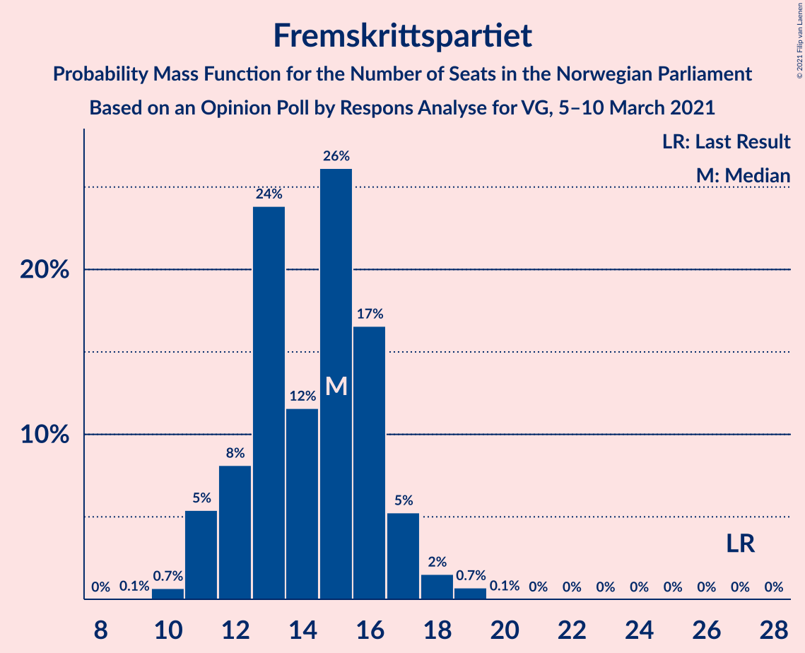

| Number of Seats | Probability | Accumulated | Special Marks |
|:---------------:|:-----------:|:-----------:|:-------------:|
| 9 | 0.1% | 100% |  |
| 10 | 0.7% | 99.9% |  |
| 11 | 5% | 99.3% |  |
| 12 | 8% | 94% |  |
| 13 | 24% | 86% |  |
| 14 | 12% | 62% |  |
| 15 | 26% | 50% | Median |
| 16 | 17% | 24% |  |
| 17 | 5% | 8% |  |
| 18 | 2% | 2% |  |
| 19 | 0.7% | 0.8% |  |
| 20 | 0.1% | 0.1% |  |
| 21 | 0% | 0% |  |
| 22 | 0% | 0% |  |
| 23 | 0% | 0% |  |
| 24 | 0% | 0% |  |
| 25 | 0% | 0% |  |
| 26 | 0% | 0% |  |
| 27 | 0% | 0% | Last Result |

### Sosialistisk Venstreparti

*For a full overview of the results for this party, see the [Sosialistisk Venstreparti](party-sosialistiskvenstreparti.html) page.*

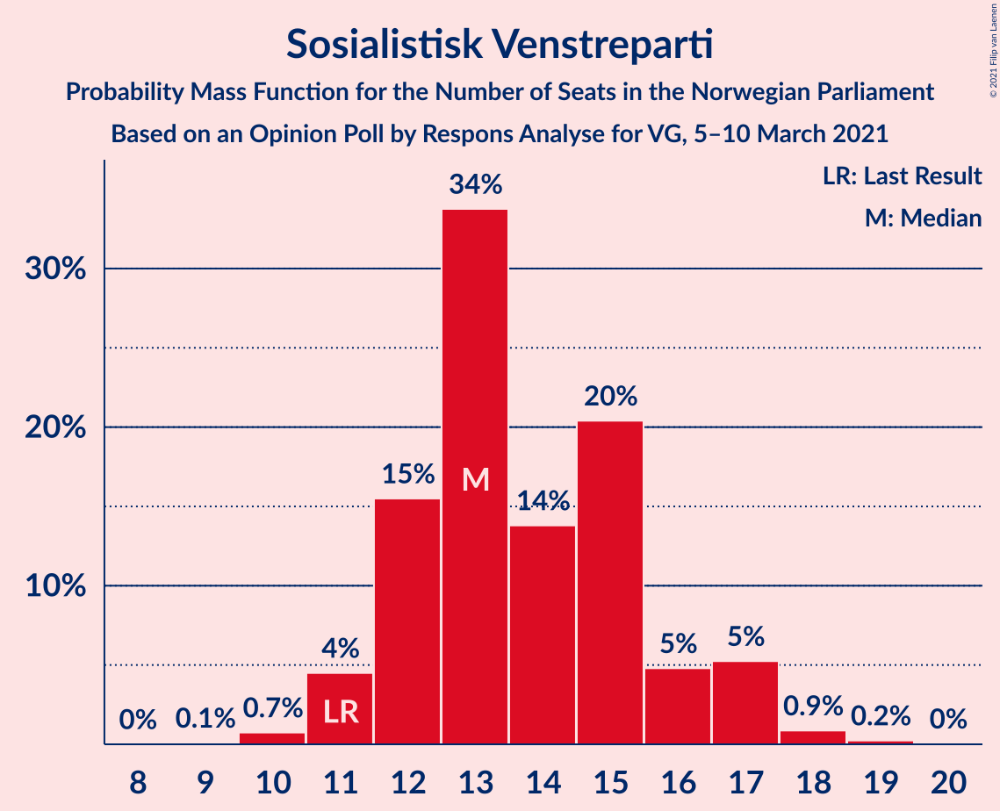

| Number of Seats | Probability | Accumulated | Special Marks |
|:---------------:|:-----------:|:-----------:|:-------------:|
| 9 | 0.1% | 100% |  |
| 10 | 0.7% | 99.9% |  |
| 11 | 4% | 99.2% | Last Result |
| 12 | 15% | 95% |  |
| 13 | 34% | 79% | Median |
| 14 | 14% | 45% |  |
| 15 | 20% | 32% |  |
| 16 | 5% | 11% |  |
| 17 | 5% | 6% |  |
| 18 | 0.9% | 1.2% |  |
| 19 | 0.2% | 0.3% |  |
| 20 | 0% | 0% |  |

### Rødt

*For a full overview of the results for this party, see the [Rødt](party-rødt.html) page.*

| Number of Seats | Probability | Accumulated | Special Marks |
|:---------------:|:-----------:|:-----------:|:-------------:|
| 1 | 0.1% | 100% | Last Result |
| 2 | 10% | 99.9% |  |
| 3 | 0% | 90% |  |
| 4 | 0% | 90% |  |
| 5 | 0% | 90% |  |
| 6 | 0% | 90% |  |
| 7 | 6% | 90% |  |
| 8 | 38% | 84% | Median |
| 9 | 31% | 45% |  |
| 10 | 10% | 15% |  |
| 11 | 4% | 5% |  |
| 12 | 0.7% | 0.8% |  |
| 13 | 0.1% | 0.1% |  |
| 14 | 0% | 0% |  |

### Miljøpartiet De Grønne

*For a full overview of the results for this party, see the [Miljøpartiet De Grønne](party-miljøpartietdegrønne.html) page.*

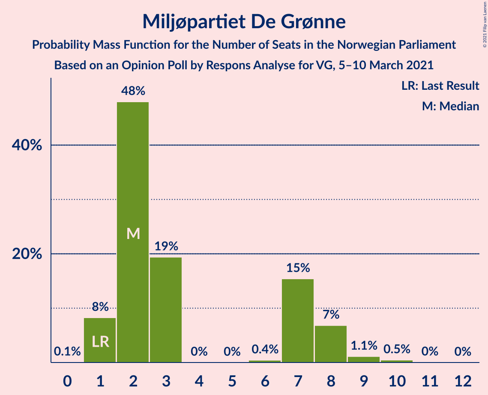

| Number of Seats | Probability | Accumulated | Special Marks |
|:---------------:|:-----------:|:-----------:|:-------------:|
| 0 | 0.1% | 100% |  |
| 1 | 8% | 99.9% | Last Result |
| 2 | 48% | 92% | Median |
| 3 | 19% | 44% |  |
| 4 | 0% | 24% |  |
| 5 | 0% | 24% |  |
| 6 | 0.4% | 24% |  |
| 7 | 15% | 24% |  |
| 8 | 7% | 8% |  |
| 9 | 1.1% | 2% |  |
| 10 | 0.5% | 0.5% |  |
| 11 | 0% | 0.1% |  |
| 12 | 0% | 0% |  |

### Venstre

*For a full overview of the results for this party, see the [Venstre](party-venstre.html) page.*

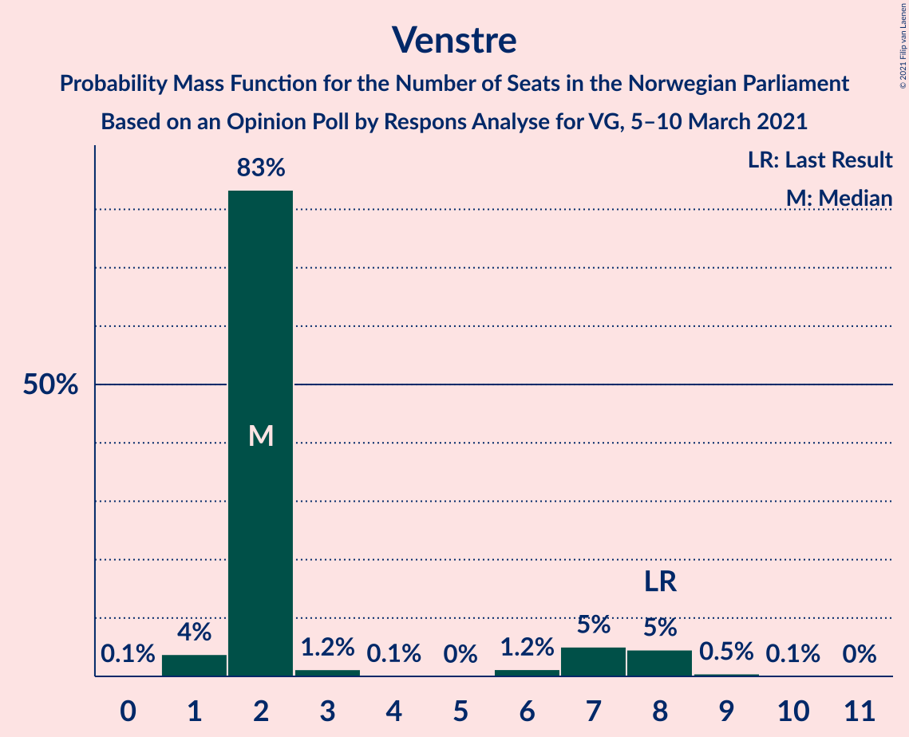

| Number of Seats | Probability | Accumulated | Special Marks |
|:---------------:|:-----------:|:-----------:|:-------------:|
| 0 | 0.1% | 100% |  |
| 1 | 4% | 99.9% |  |
| 2 | 83% | 96% | Median |
| 3 | 1.2% | 13% |  |
| 4 | 0.1% | 12% |  |
| 5 | 0% | 11% |  |
| 6 | 1.2% | 11% |  |
| 7 | 5% | 10% |  |
| 8 | 5% | 5% | Last Result |
| 9 | 0.5% | 0.6% |  |
| 10 | 0.1% | 0.1% |  |
| 11 | 0% | 0% |  |

### Kristelig Folkeparti

*For a full overview of the results for this party, see the [Kristelig Folkeparti](party-kristeligfolkeparti.html) page.*

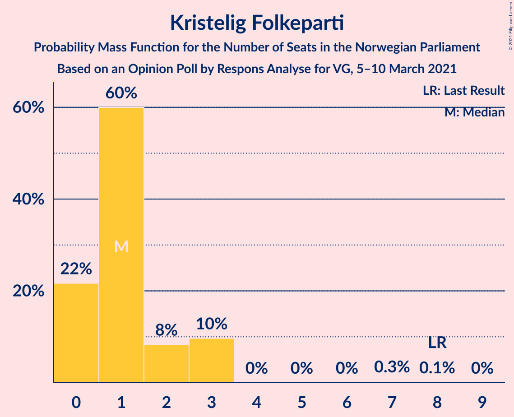

| Number of Seats | Probability | Accumulated | Special Marks |
|:---------------:|:-----------:|:-----------:|:-------------:|
| 0 | 22% | 100% |  |
| 1 | 60% | 78% | Median |
| 2 | 8% | 18% |  |
| 3 | 10% | 10% |  |
| 4 | 0% | 0.4% |  |
| 5 | 0% | 0.4% |  |
| 6 | 0% | 0.4% |  |
| 7 | 0.3% | 0.4% |  |
| 8 | 0.1% | 0.1% | Last Result |
| 9 | 0% | 0% |  |

## Coalitions

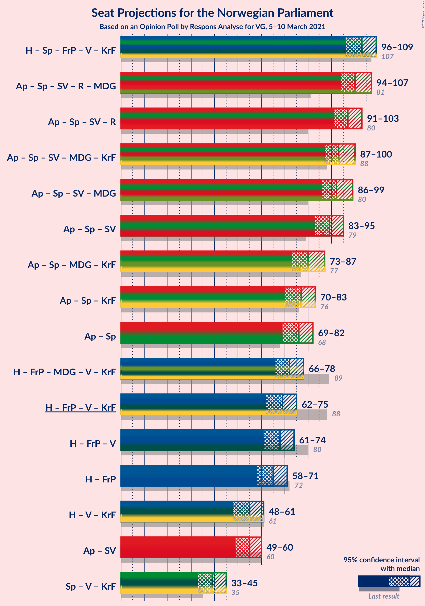

### Confidence Intervals

| Coalition | Last Result | Median | Majority? | 80% Confidence Interval | 90% Confidence Interval | 95% Confidence Interval | 99% Confidence Interval |
|:---------:|:-----------:|:------:|:---------:|:-----------------------:|:-----------------------:|:-----------------------:|:-----------------------:|
| Høyre – Senterpartiet – Fremskrittspartiet – Venstre – Kristelig Folkeparti | 107 | 103 | 100% | 99–107 | 98–108 | 96–109 | 95–112 |
| Arbeiderpartiet – Senterpartiet – Sosialistisk Venstreparti – Rødt – Miljøpartiet De Grønne | 81 | 100 | 100% | 97–105 | 95–106 | 94–107 | 92–109 |
| Arbeiderpartiet – Senterpartiet – Sosialistisk Venstreparti – Rødt | 80 | 97 | 100% | 93–101 | 92–102 | 91–103 | 88–105 |
| Arbeiderpartiet – Senterpartiet – Sosialistisk Venstreparti – Miljøpartiet De Grønne – Kristelig Folkeparti | 88 | 93 | 99.5% | 89–98 | 89–100 | 87–100 | 85–103 |
| Arbeiderpartiet – Senterpartiet – Sosialistisk Venstreparti – Miljøpartiet De Grønne | 80 | 92 | 99.3% | 88–97 | 88–98 | 86–99 | 84–101 |
| Arbeiderpartiet – Senterpartiet – Sosialistisk Venstreparti | 79 | 89 | 93% | 85–93 | 84–94 | 83–95 | 81–97 |
| Arbeiderpartiet – Senterpartiet – Miljøpartiet De Grønne – Kristelig Folkeparti | 77 | 80 | 9% | 76–84 | 74–86 | 73–87 | 71–88 |
| Arbeiderpartiet – Senterpartiet – Kristelig Folkeparti | 76 | 77 | 0.5% | 72–80 | 71–81 | 70–83 | 68–85 |
| Arbeiderpartiet – Senterpartiet | 68 | 76 | 0.1% | 71–79 | 71–80 | 69–82 | 67–83 |
| Høyre – Fremskrittspartiet – Miljøpartiet De Grønne – Venstre – Kristelig Folkeparti | 89 | 72 | 0% | 68–76 | 67–77 | 66–78 | 64–81 |
| Høyre – Fremskrittspartiet – Venstre – Kristelig Folkeparti | 88 | 69 | 0% | 64–72 | 63–74 | 62–75 | 60–77 |
| Høyre – Fremskrittspartiet – Venstre | 80 | 68 | 0% | 63–71 | 61–73 | 61–74 | 59–77 |
| Høyre – Fremskrittspartiet | 72 | 65 | 0% | 60–69 | 59–70 | 58–71 | 56–73 |
| Høyre – Venstre – Kristelig Folkeparti | 61 | 55 | 0% | 50–58 | 49–60 | 48–61 | 46–63 |
| Arbeiderpartiet – Sosialistisk Venstreparti | 60 | 55 | 0% | 51–58 | 50–59 | 49–60 | 47–62 |
| Senterpartiet – Venstre – Kristelig Folkeparti | 35 | 39 | 0% | 34–42 | 33–44 | 33–45 | 32–47 |

### Høyre – Senterpartiet – Fremskrittspartiet – Venstre – Kristelig Folkeparti

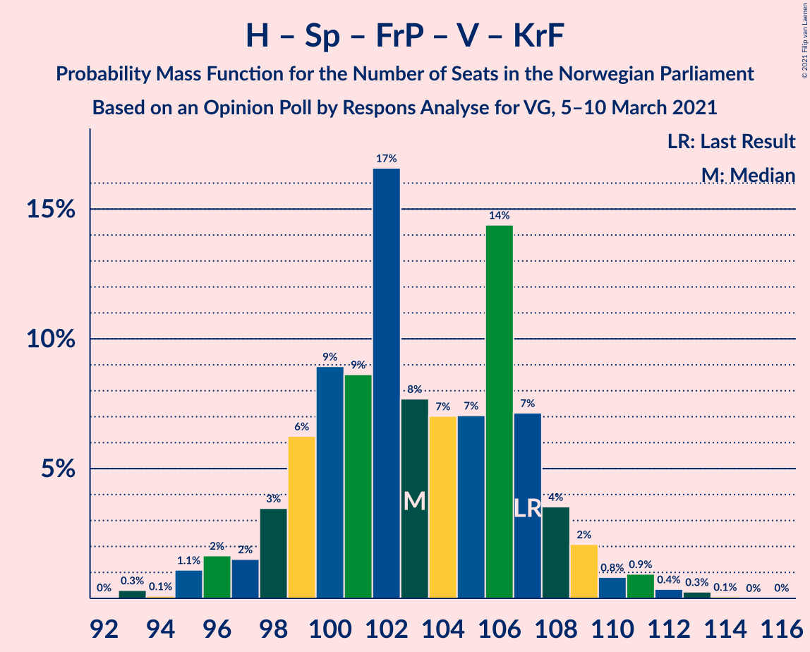

| Number of Seats | Probability | Accumulated | Special Marks |
|:---------------:|:-----------:|:-----------:|:-------------:|
| 92 | 0% | 100% |  |
| 93 | 0.3% | 99.9% |  |
| 94 | 0.1% | 99.6% |  |
| 95 | 1.1% | 99.5% |  |
| 96 | 2% | 98% |  |
| 97 | 2% | 97% |  |
| 98 | 3% | 95% |  |
| 99 | 6% | 92% |  |
| 100 | 9% | 86% |  |
| 101 | 9% | 77% |  |
| 102 | 17% | 68% |  |
| 103 | 8% | 51% |  |
| 104 | 7% | 44% | Median |
| 105 | 7% | 37% |  |
| 106 | 14% | 30% |  |
| 107 | 7% | 15% | Last Result |
| 108 | 4% | 8% |  |
| 109 | 2% | 5% |  |
| 110 | 0.8% | 2% |  |
| 111 | 0.9% | 2% |  |
| 112 | 0.4% | 0.7% |  |
| 113 | 0.3% | 0.4% |  |
| 114 | 0.1% | 0.1% |  |
| 115 | 0% | 0.1% |  |
| 116 | 0% | 0% |  |

### Arbeiderpartiet – Senterpartiet – Sosialistisk Venstreparti – Rødt – Miljøpartiet De Grønne

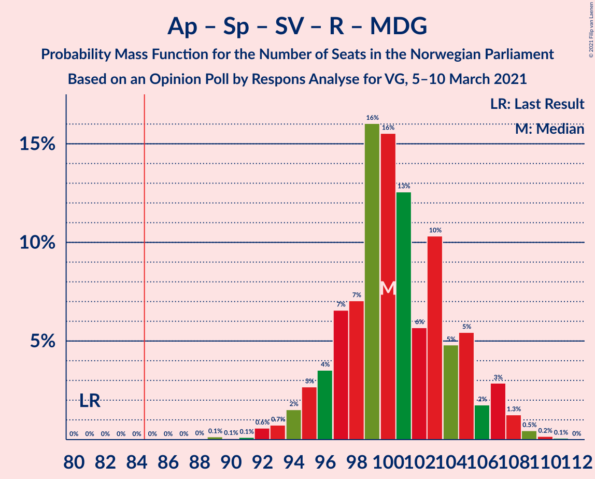

| Number of Seats | Probability | Accumulated | Special Marks |
|:---------------:|:-----------:|:-----------:|:-------------:|
| 81 | 0% | 100% | Last Result |
| 82 | 0% | 100% |  |
| 83 | 0% | 100% |  |
| 84 | 0% | 100% |  |
| 85 | 0% | 100% | Majority |
| 86 | 0% | 100% |  |
| 87 | 0% | 100% |  |
| 88 | 0% | 100% |  |
| 89 | 0.1% | 100% |  |
| 90 | 0.1% | 99.8% |  |
| 91 | 0.1% | 99.8% |  |
| 92 | 0.6% | 99.6% |  |
| 93 | 0.7% | 99.0% |  |
| 94 | 2% | 98% |  |
| 95 | 3% | 97% |  |
| 96 | 4% | 94% |  |
| 97 | 7% | 91% |  |
| 98 | 7% | 84% |  |
| 99 | 16% | 77% | Median |
| 100 | 16% | 61% |  |
| 101 | 13% | 45% |  |
| 102 | 6% | 33% |  |
| 103 | 10% | 27% |  |
| 104 | 5% | 17% |  |
| 105 | 5% | 12% |  |
| 106 | 2% | 7% |  |
| 107 | 3% | 5% |  |
| 108 | 1.3% | 2% |  |
| 109 | 0.5% | 0.7% |  |
| 110 | 0.2% | 0.3% |  |
| 111 | 0.1% | 0.1% |  |
| 112 | 0% | 0% |  |

### Arbeiderpartiet – Senterpartiet – Sosialistisk Venstreparti – Rødt

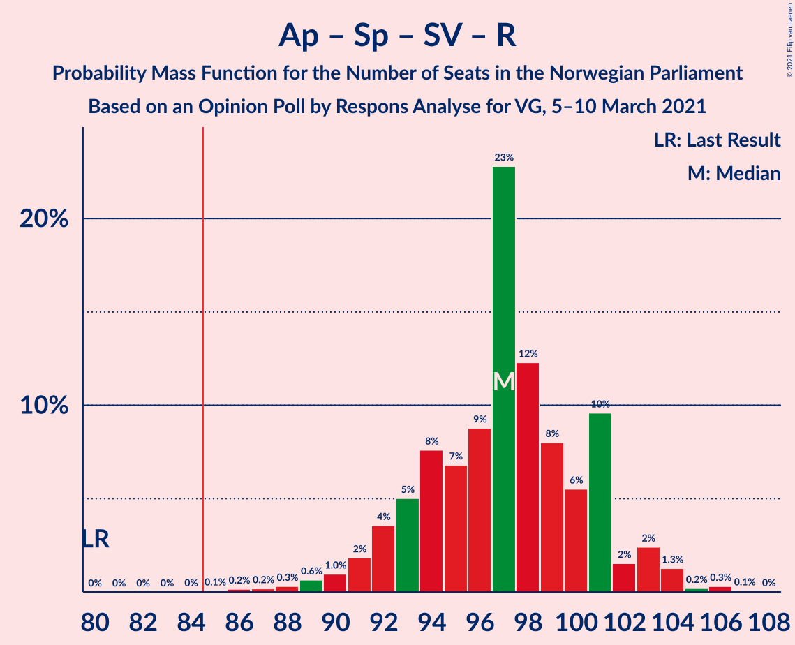

| Number of Seats | Probability | Accumulated | Special Marks |
|:---------------:|:-----------:|:-----------:|:-------------:|
| 80 | 0% | 100% | Last Result |
| 81 | 0% | 100% |  |
| 82 | 0% | 100% |  |
| 83 | 0% | 100% |  |
| 84 | 0% | 100% |  |
| 85 | 0.1% | 100% | Majority |
| 86 | 0.2% | 99.9% |  |
| 87 | 0.2% | 99.8% |  |
| 88 | 0.3% | 99.6% |  |
| 89 | 0.6% | 99.3% |  |
| 90 | 1.0% | 98.6% |  |
| 91 | 2% | 98% |  |
| 92 | 4% | 96% |  |
| 93 | 5% | 92% |  |
| 94 | 8% | 87% |  |
| 95 | 7% | 80% |  |
| 96 | 9% | 73% |  |
| 97 | 23% | 64% | Median |
| 98 | 12% | 41% |  |
| 99 | 8% | 29% |  |
| 100 | 6% | 21% |  |
| 101 | 10% | 15% |  |
| 102 | 2% | 6% |  |
| 103 | 2% | 4% |  |
| 104 | 1.3% | 2% |  |
| 105 | 0.2% | 0.6% |  |
| 106 | 0.3% | 0.4% |  |
| 107 | 0.1% | 0.1% |  |
| 108 | 0% | 0% |  |

### Arbeiderpartiet – Senterpartiet – Sosialistisk Venstreparti – Miljøpartiet De Grønne – Kristelig Folkeparti

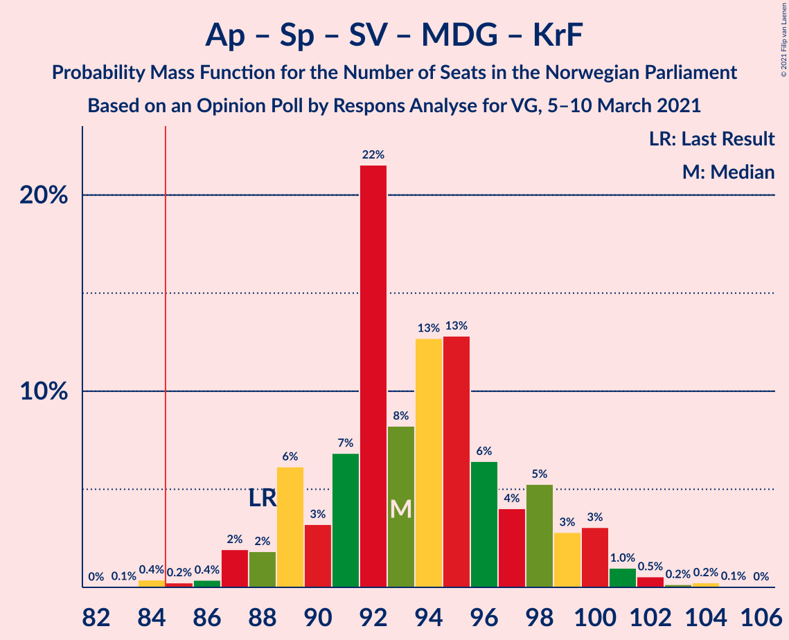

| Number of Seats | Probability | Accumulated | Special Marks |
|:---------------:|:-----------:|:-----------:|:-------------:|
| 83 | 0.1% | 100% |  |
| 84 | 0.4% | 99.9% |  |
| 85 | 0.2% | 99.5% | Majority |
| 86 | 0.4% | 99.3% |  |
| 87 | 2% | 98.9% |  |
| 88 | 2% | 97% | Last Result |
| 89 | 6% | 95% |  |
| 90 | 3% | 89% |  |
| 91 | 7% | 86% |  |
| 92 | 22% | 79% | Median |
| 93 | 8% | 57% |  |
| 94 | 13% | 49% |  |
| 95 | 13% | 36% |  |
| 96 | 6% | 24% |  |
| 97 | 4% | 17% |  |
| 98 | 5% | 13% |  |
| 99 | 3% | 8% |  |
| 100 | 3% | 5% |  |
| 101 | 1.0% | 2% |  |
| 102 | 0.5% | 1.1% |  |
| 103 | 0.2% | 0.5% |  |
| 104 | 0.2% | 0.4% |  |
| 105 | 0.1% | 0.1% |  |
| 106 | 0% | 0% |  |

### Arbeiderpartiet – Senterpartiet – Sosialistisk Venstreparti – Miljøpartiet De Grønne

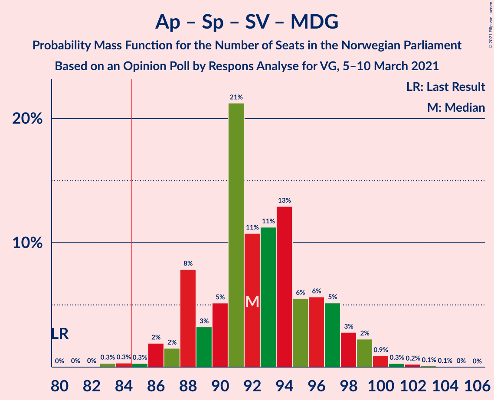

| Number of Seats | Probability | Accumulated | Special Marks |
|:---------------:|:-----------:|:-----------:|:-------------:|
| 80 | 0% | 100% | Last Result |
| 81 | 0% | 100% |  |
| 82 | 0% | 100% |  |
| 83 | 0.3% | 99.9% |  |
| 84 | 0.3% | 99.6% |  |
| 85 | 0.3% | 99.3% | Majority |
| 86 | 2% | 99.0% |  |
| 87 | 2% | 97% |  |
| 88 | 8% | 96% |  |
| 89 | 3% | 88% |  |
| 90 | 5% | 84% |  |
| 91 | 21% | 79% | Median |
| 92 | 11% | 58% |  |
| 93 | 11% | 47% |  |
| 94 | 13% | 36% |  |
| 95 | 6% | 23% |  |
| 96 | 6% | 18% |  |
| 97 | 5% | 12% |  |
| 98 | 3% | 7% |  |
| 99 | 2% | 4% |  |
| 100 | 0.9% | 2% |  |
| 101 | 0.3% | 0.7% |  |
| 102 | 0.2% | 0.4% |  |
| 103 | 0.1% | 0.2% |  |
| 104 | 0.1% | 0.1% |  |
| 105 | 0% | 0% |  |

### Arbeiderpartiet – Senterpartiet – Sosialistisk Venstreparti

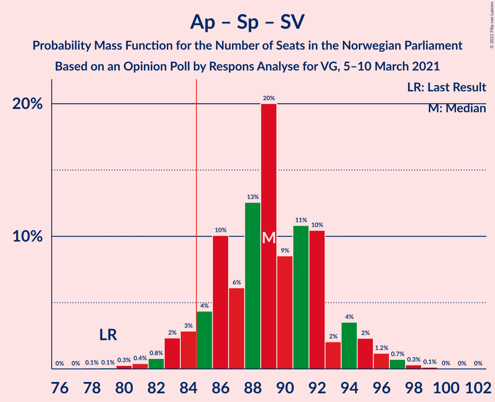

| Number of Seats | Probability | Accumulated | Special Marks |
|:---------------:|:-----------:|:-----------:|:-------------:|
| 78 | 0.1% | 100% |  |
| 79 | 0.1% | 99.9% | Last Result |
| 80 | 0.3% | 99.8% |  |
| 81 | 0.4% | 99.6% |  |
| 82 | 0.8% | 99.2% |  |
| 83 | 2% | 98% |  |
| 84 | 3% | 96% |  |
| 85 | 4% | 93% | Majority |
| 86 | 10% | 89% |  |
| 87 | 6% | 79% |  |
| 88 | 13% | 73% |  |
| 89 | 20% | 60% | Median |
| 90 | 9% | 40% |  |
| 91 | 11% | 32% |  |
| 92 | 10% | 21% |  |
| 93 | 2% | 10% |  |
| 94 | 4% | 8% |  |
| 95 | 2% | 5% |  |
| 96 | 1.2% | 2% |  |
| 97 | 0.7% | 1.2% |  |
| 98 | 0.3% | 0.5% |  |
| 99 | 0.1% | 0.2% |  |
| 100 | 0% | 0.1% |  |
| 101 | 0% | 0% |  |

### Arbeiderpartiet – Senterpartiet – Miljøpartiet De Grønne – Kristelig Folkeparti

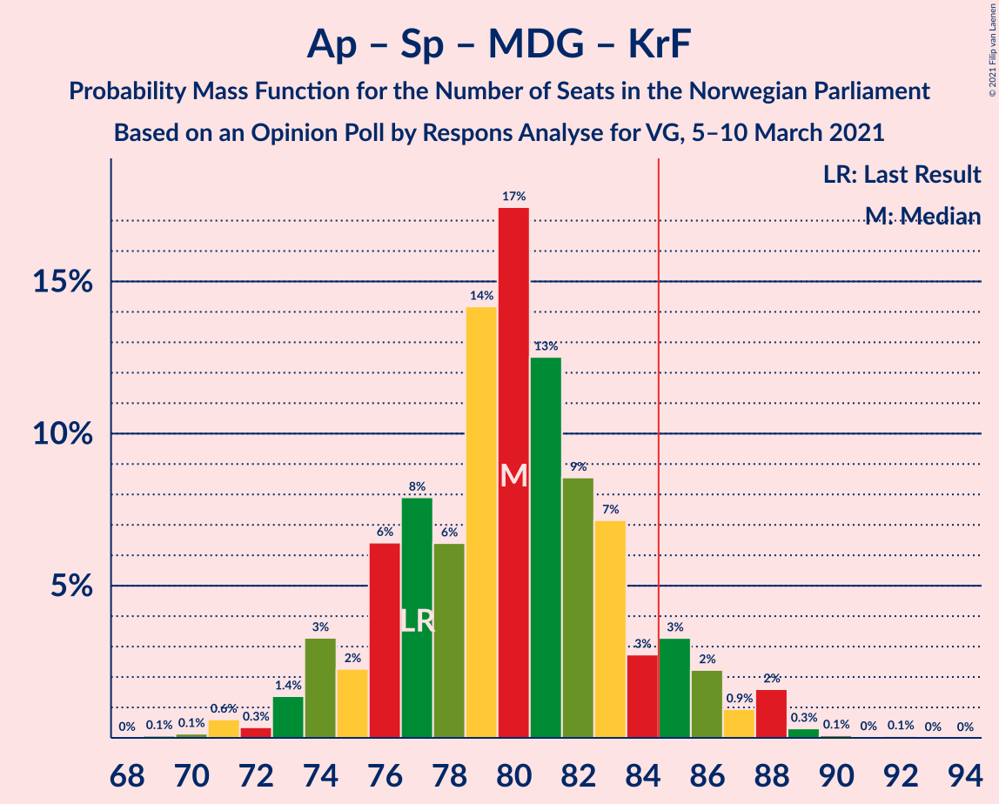

| Number of Seats | Probability | Accumulated | Special Marks |
|:---------------:|:-----------:|:-----------:|:-------------:|
| 69 | 0.1% | 100% |  |
| 70 | 0.1% | 99.9% |  |
| 71 | 0.6% | 99.8% |  |
| 72 | 0.3% | 99.2% |  |
| 73 | 1.4% | 98.8% |  |
| 74 | 3% | 97% |  |
| 75 | 2% | 94% |  |
| 76 | 6% | 92% |  |
| 77 | 8% | 85% | Last Result |
| 78 | 6% | 78% |  |
| 79 | 14% | 71% | Median |
| 80 | 17% | 57% |  |
| 81 | 13% | 40% |  |
| 82 | 9% | 27% |  |
| 83 | 7% | 18% |  |
| 84 | 3% | 11% |  |
| 85 | 3% | 9% | Majority |
| 86 | 2% | 5% |  |
| 87 | 0.9% | 3% |  |
| 88 | 2% | 2% |  |
| 89 | 0.3% | 0.5% |  |
| 90 | 0.1% | 0.2% |  |
| 91 | 0% | 0.1% |  |
| 92 | 0.1% | 0.1% |  |
| 93 | 0% | 0% |  |

### Arbeiderpartiet – Senterpartiet – Kristelig Folkeparti

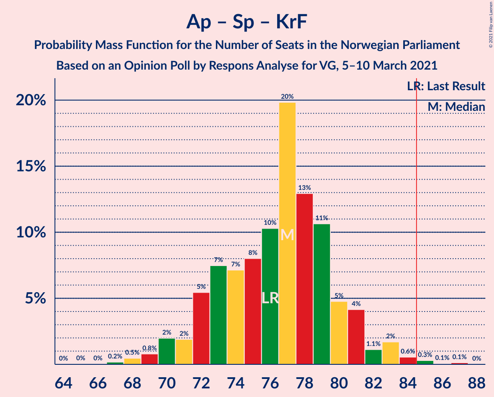

| Number of Seats | Probability | Accumulated | Special Marks |
|:---------------:|:-----------:|:-----------:|:-------------:|
| 65 | 0% | 100% |  |
| 66 | 0% | 99.9% |  |
| 67 | 0.2% | 99.9% |  |
| 68 | 0.5% | 99.7% |  |
| 69 | 0.8% | 99.3% |  |
| 70 | 2% | 98% |  |
| 71 | 2% | 96% |  |
| 72 | 5% | 95% |  |
| 73 | 7% | 89% |  |
| 74 | 7% | 82% |  |
| 75 | 8% | 75% |  |
| 76 | 10% | 67% | Last Result |
| 77 | 20% | 56% | Median |
| 78 | 13% | 36% |  |
| 79 | 11% | 23% |  |
| 80 | 5% | 13% |  |
| 81 | 4% | 8% |  |
| 82 | 1.1% | 4% |  |
| 83 | 2% | 3% |  |
| 84 | 0.6% | 1.1% |  |
| 85 | 0.3% | 0.5% | Majority |
| 86 | 0.1% | 0.2% |  |
| 87 | 0.1% | 0.1% |  |
| 88 | 0% | 0% |  |

### Arbeiderpartiet – Senterpartiet

| Number of Seats | Probability | Accumulated | Special Marks |
|:---------------:|:-----------:|:-----------:|:-------------:|
| 64 | 0.1% | 100% |  |
| 65 | 0% | 99.9% |  |
| 66 | 0.1% | 99.9% |  |
| 67 | 0.5% | 99.8% |  |
| 68 | 0.7% | 99.3% | Last Result |
| 69 | 2% | 98.6% |  |
| 70 | 2% | 97% |  |
| 71 | 6% | 95% |  |
| 72 | 5% | 89% |  |
| 73 | 10% | 84% |  |
| 74 | 9% | 74% |  |
| 75 | 10% | 65% |  |
| 76 | 20% | 55% | Median |
| 77 | 13% | 35% |  |
| 78 | 10% | 21% |  |
| 79 | 5% | 11% |  |
| 80 | 3% | 7% |  |
| 81 | 1.1% | 4% |  |
| 82 | 2% | 3% |  |
| 83 | 0.4% | 0.7% |  |
| 84 | 0.2% | 0.3% |  |
| 85 | 0.1% | 0.1% | Majority |
| 86 | 0% | 0% |  |

### Høyre – Fremskrittspartiet – Miljøpartiet De Grønne – Venstre – Kristelig Folkeparti

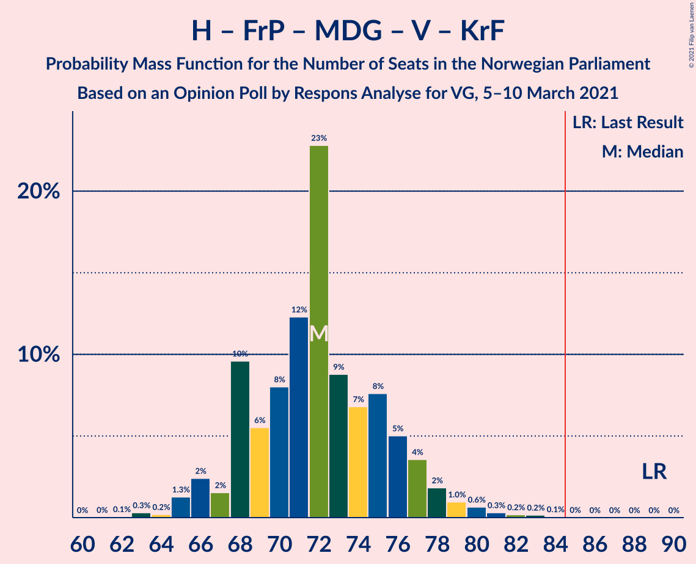

| Number of Seats | Probability | Accumulated | Special Marks |
|:---------------:|:-----------:|:-----------:|:-------------:|
| 62 | 0.1% | 100% |  |
| 63 | 0.3% | 99.9% |  |
| 64 | 0.2% | 99.6% |  |
| 65 | 1.3% | 99.4% |  |
| 66 | 2% | 98% |  |
| 67 | 2% | 96% |  |
| 68 | 10% | 94% |  |
| 69 | 6% | 85% |  |
| 70 | 8% | 79% |  |
| 71 | 12% | 71% | Median |
| 72 | 23% | 59% |  |
| 73 | 9% | 36% |  |
| 74 | 7% | 27% |  |
| 75 | 8% | 20% |  |
| 76 | 5% | 13% |  |
| 77 | 4% | 8% |  |
| 78 | 2% | 4% |  |
| 79 | 1.0% | 2% |  |
| 80 | 0.6% | 1.4% |  |
| 81 | 0.3% | 0.7% |  |
| 82 | 0.2% | 0.4% |  |
| 83 | 0.2% | 0.2% |  |
| 84 | 0.1% | 0.1% |  |
| 85 | 0% | 0% | Majority |
| 86 | 0% | 0% |  |
| 87 | 0% | 0% |  |
| 88 | 0% | 0% |  |
| 89 | 0% | 0% | Last Result |

### Høyre – Fremskrittspartiet – Venstre – Kristelig Folkeparti

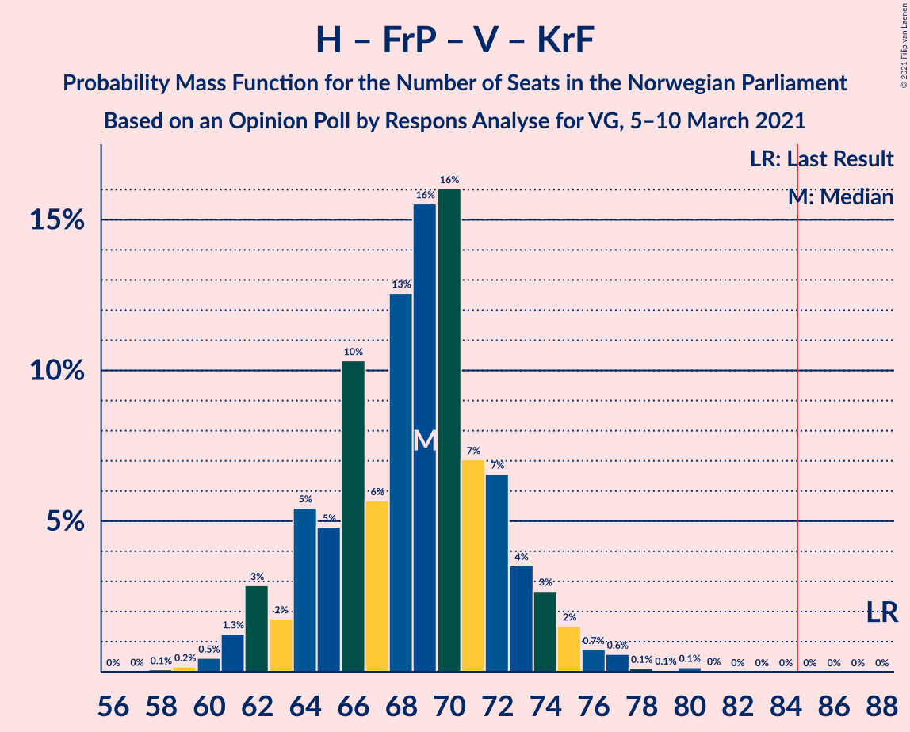

| Number of Seats | Probability | Accumulated | Special Marks |
|:---------------:|:-----------:|:-----------:|:-------------:|
| 58 | 0.1% | 100% |  |
| 59 | 0.2% | 99.9% |  |
| 60 | 0.5% | 99.7% |  |
| 61 | 1.3% | 99.3% |  |
| 62 | 3% | 98% |  |
| 63 | 2% | 95% |  |
| 64 | 5% | 93% |  |
| 65 | 5% | 88% |  |
| 66 | 10% | 83% |  |
| 67 | 6% | 73% |  |
| 68 | 13% | 67% |  |
| 69 | 16% | 55% | Median |
| 70 | 16% | 39% |  |
| 71 | 7% | 23% |  |
| 72 | 7% | 16% |  |
| 73 | 4% | 9% |  |
| 74 | 3% | 6% |  |
| 75 | 2% | 3% |  |
| 76 | 0.7% | 2% |  |
| 77 | 0.6% | 1.0% |  |
| 78 | 0.1% | 0.4% |  |
| 79 | 0.1% | 0.2% |  |
| 80 | 0.1% | 0.2% |  |
| 81 | 0% | 0% |  |
| 82 | 0% | 0% |  |
| 83 | 0% | 0% |  |
| 84 | 0% | 0% |  |
| 85 | 0% | 0% | Majority |
| 86 | 0% | 0% |  |
| 87 | 0% | 0% |  |
| 88 | 0% | 0% | Last Result |

### Høyre – Fremskrittspartiet – Venstre

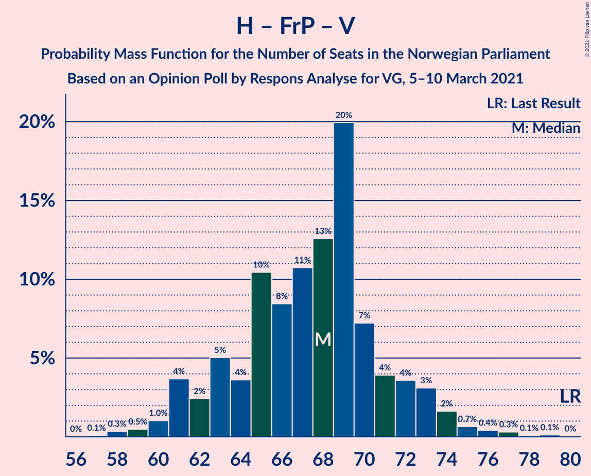

| Number of Seats | Probability | Accumulated | Special Marks |
|:---------------:|:-----------:|:-----------:|:-------------:|
| 57 | 0.1% | 100% |  |
| 58 | 0.3% | 99.9% |  |
| 59 | 0.5% | 99.5% |  |
| 60 | 1.0% | 99.0% |  |
| 61 | 4% | 98% |  |
| 62 | 2% | 94% |  |
| 63 | 5% | 92% |  |
| 64 | 4% | 87% |  |
| 65 | 10% | 83% |  |
| 66 | 8% | 73% |  |
| 67 | 11% | 64% |  |
| 68 | 13% | 54% | Median |
| 69 | 20% | 41% |  |
| 70 | 7% | 21% |  |
| 71 | 4% | 14% |  |
| 72 | 4% | 10% |  |
| 73 | 3% | 6% |  |
| 74 | 2% | 3% |  |
| 75 | 0.7% | 2% |  |
| 76 | 0.4% | 1.0% |  |
| 77 | 0.3% | 0.6% |  |
| 78 | 0.1% | 0.3% |  |
| 79 | 0.1% | 0.2% |  |
| 80 | 0% | 0% | Last Result |

### Høyre – Fremskrittspartiet

| Number of Seats | Probability | Accumulated | Special Marks |
|:---------------:|:-----------:|:-----------:|:-------------:|
| 54 | 0.1% | 100% |  |
| 55 | 0.2% | 99.9% |  |
| 56 | 0.4% | 99.7% |  |
| 57 | 1.0% | 99.3% |  |
| 58 | 2% | 98% |  |
| 59 | 5% | 96% |  |
| 60 | 3% | 91% |  |
| 61 | 8% | 88% |  |
| 62 | 4% | 81% |  |
| 63 | 11% | 77% |  |
| 64 | 7% | 66% |  |
| 65 | 10% | 59% |  |
| 66 | 12% | 49% | Median |
| 67 | 20% | 37% |  |
| 68 | 6% | 17% |  |
| 69 | 4% | 11% |  |
| 70 | 2% | 7% |  |
| 71 | 3% | 4% |  |
| 72 | 1.3% | 2% | Last Result |
| 73 | 0.3% | 0.6% |  |
| 74 | 0.2% | 0.3% |  |
| 75 | 0% | 0.1% |  |
| 76 | 0% | 0.1% |  |
| 77 | 0% | 0% |  |

### Høyre – Venstre – Kristelig Folkeparti

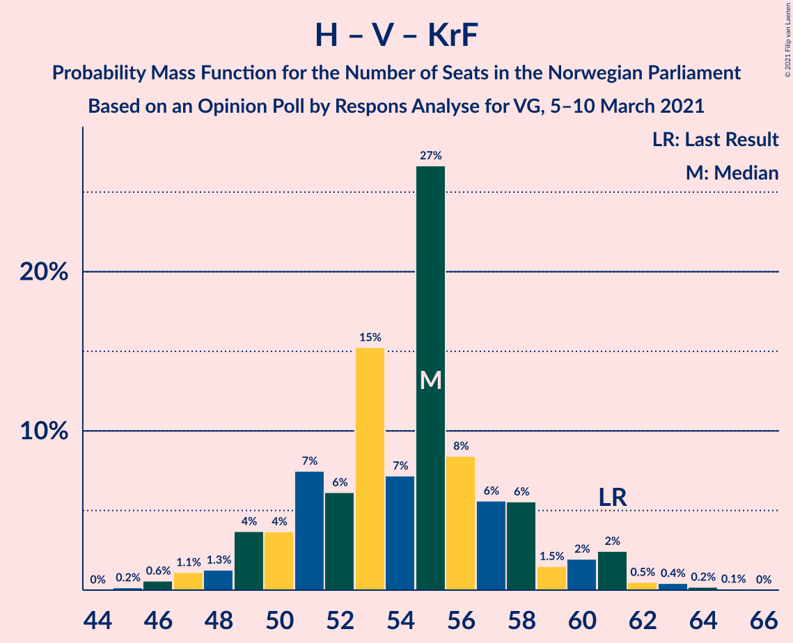

| Number of Seats | Probability | Accumulated | Special Marks |
|:---------------:|:-----------:|:-----------:|:-------------:|
| 45 | 0.2% | 100% |  |
| 46 | 0.6% | 99.8% |  |
| 47 | 1.1% | 99.2% |  |
| 48 | 1.3% | 98% |  |
| 49 | 4% | 97% |  |
| 50 | 4% | 93% |  |
| 51 | 7% | 89% |  |
| 52 | 6% | 82% |  |
| 53 | 15% | 76% |  |
| 54 | 7% | 61% | Median |
| 55 | 27% | 53% |  |
| 56 | 8% | 27% |  |
| 57 | 6% | 18% |  |
| 58 | 6% | 13% |  |
| 59 | 1.5% | 7% |  |
| 60 | 2% | 6% |  |
| 61 | 2% | 4% | Last Result |
| 62 | 0.5% | 1.3% |  |
| 63 | 0.4% | 0.7% |  |
| 64 | 0.2% | 0.3% |  |
| 65 | 0.1% | 0.1% |  |
| 66 | 0% | 0% |  |

### Arbeiderpartiet – Sosialistisk Venstreparti

| Number of Seats | Probability | Accumulated | Special Marks |
|:---------------:|:-----------:|:-----------:|:-------------:|
| 45 | 0.1% | 100% |  |
| 46 | 0.2% | 99.9% |  |
| 47 | 0.6% | 99.7% |  |
| 48 | 0.7% | 99.1% |  |
| 49 | 1.4% | 98% |  |
| 50 | 5% | 97% |  |
| 51 | 5% | 92% |  |
| 52 | 11% | 87% |  |
| 53 | 17% | 76% |  |
| 54 | 8% | 59% | Median |
| 55 | 16% | 50% |  |
| 56 | 8% | 35% |  |
| 57 | 10% | 27% |  |
| 58 | 10% | 17% |  |
| 59 | 2% | 7% |  |
| 60 | 2% | 4% | Last Result |
| 61 | 1.4% | 2% |  |
| 62 | 0.4% | 0.7% |  |
| 63 | 0.1% | 0.3% |  |
| 64 | 0.1% | 0.2% |  |
| 65 | 0.1% | 0.1% |  |
| 66 | 0% | 0% |  |

### Senterpartiet – Venstre – Kristelig Folkeparti

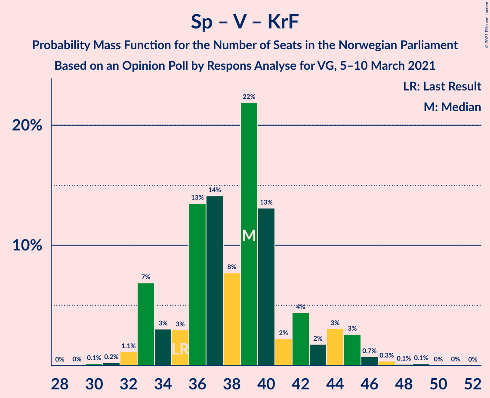

| Number of Seats | Probability | Accumulated | Special Marks |
|:---------------:|:-----------:|:-----------:|:-------------:|
| 30 | 0.1% | 100% |  |
| 31 | 0.2% | 99.8% |  |
| 32 | 1.1% | 99.6% |  |
| 33 | 7% | 98% |  |
| 34 | 3% | 92% |  |
| 35 | 3% | 89% | Last Result |
| 36 | 13% | 86% |  |
| 37 | 14% | 72% |  |
| 38 | 8% | 58% | Median |
| 39 | 22% | 50% |  |
| 40 | 13% | 28% |  |
| 41 | 2% | 15% |  |
| 42 | 4% | 13% |  |
| 43 | 2% | 9% |  |
| 44 | 3% | 7% |  |
| 45 | 3% | 4% |  |
| 46 | 0.7% | 1.3% |  |
| 47 | 0.3% | 0.6% |  |
| 48 | 0.1% | 0.3% |  |
| 49 | 0.1% | 0.2% |  |
| 50 | 0% | 0.1% |  |
| 51 | 0% | 0% |  |

## Technical Information

### Opinion Poll

+ **Polling firm:** Respons Analyse
+ **Commissioner(s):** VG
+ **Fieldwork period:** 5–10 March 2021

### Calculations

+ **Sample size:** 1001
+ **Simulations done:** 1,048,576
+ **Error estimate:** 1.37%

