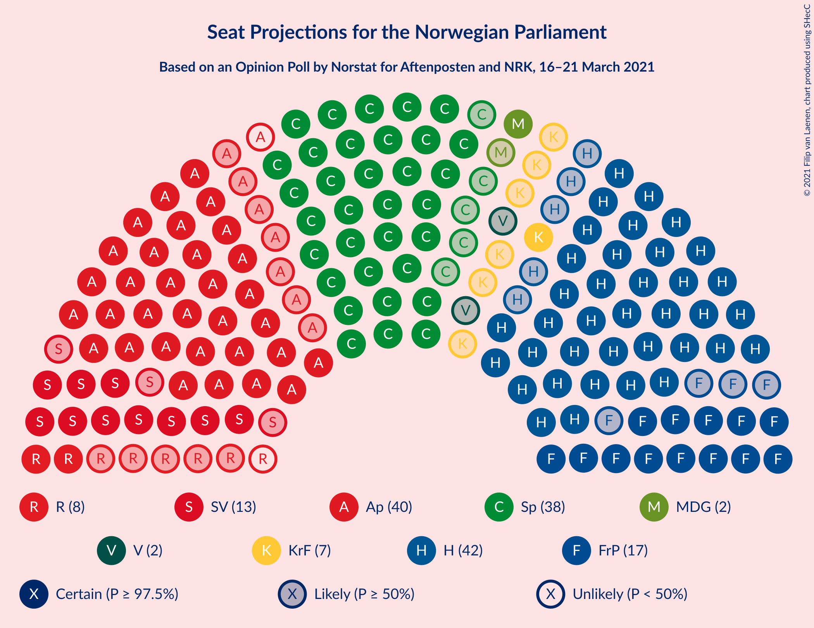

# Opinion Poll by Norstat for Aftenposten and NRK, 16–21 March 2021

<a href="#voting-intentions">Voting Intentions</a> | <a href="#seats">Seats</a> | <a href="#coalitions">Coalitions</a> | <a href="#technical-information">Technical Information</a>

## Voting Intentions

### Confidence Intervals

| Party | Last Result | Poll Result | 80% Confidence Interval | 90% Confidence Interval | 95% Confidence Interval | 99% Confidence Interval |
|:-----:|:-----------:|:-----------:|:-----------------------:|:-----------------------:|:-----------------------:|:-----------------------:|
| Høyre | 25.0% | 23.7% | 22.0–25.6% |21.6–26.1% |21.1–26.5% |20.3–27.4% |
| Arbeiderpartiet | 27.4% | 20.5% | 18.9–22.3% |18.4–22.7% |18.1–23.2% |17.3–24.0% |
| Senterpartiet | 10.3% | 20.5% | 18.9–22.3% |18.4–22.7% |18.1–23.2% |17.3–24.0% |
| Fremskrittspartiet | 15.2% | 9.9% | 8.7–11.2% |8.4–11.6% |8.2–11.9% |7.6–12.6% |
| Sosialistisk Venstreparti | 6.0% | 7.5% | 6.5–8.7% |6.2–9.0% |6.0–9.3% |5.5–10.0% |
| Rødt | 2.4% | 4.1% | 3.3–5.0% |3.1–5.3% |3.0–5.5% |2.7–6.0% |
| Kristelig Folkeparti | 4.2% | 4.1% | 3.3–5.0% |3.1–5.3% |3.0–5.5% |2.7–6.0% |
| Miljøpartiet De Grønne | 3.2% | 3.3% | 2.7–4.2% |2.5–4.5% |2.4–4.7% |2.1–5.1% |
| Venstre | 4.4% | 2.4% | 1.9–3.2% |1.7–3.4% |1.6–3.6% |1.4–4.0% |

*Note:* The poll result column reflects the actual value used in the calculations. Published results may vary slightly, and in addition be rounded to fewer digits.

## Seats

### Confidence Intervals

| Party | Last Result | Median | 80% Confidence Interval | 90% Confidence Interval | 95% Confidence Interval | 99% Confidence Interval |
|:-----:|:-----------:|:------:|:-----------------------:|:-----------------------:|:-----------------------:|:-----------------------:|
| <a href="#høyre">Høyre</a> | 45 | 42 | 39–46 |38–48 |37–49 |35–51 |
| <a href="#arbeiderpartiet">Arbeiderpartiet</a> | 49 | 39 | 35–42 |34–43 |32–43 |30–45 |
| <a href="#senterpartiet">Senterpartiet</a> | 19 | 38 | 35–42 |34–43 |33–44 |32–45 |
| <a href="#fremskrittspartiet">Fremskrittspartiet</a> | 27 | 17 | 14–20 |14–21 |13–21 |12–23 |
| <a href="#sosialistisk-venstreparti">Sosialistisk Venstreparti</a> | 11 | 13 | 11–16 |10–16 |10–17 |9–18 |
| <a href="#rødt">Rødt</a> | 1 | 7 | 2–9 |2–9 |2–10 |2–11 |
| <a href="#kristelig-folkeparti">Kristelig Folkeparti</a> | 8 | 7 | 2–9 |1–9 |1–9 |1–11 |
| <a href="#miljøpartiet-de-grønne">Miljøpartiet De Grønne</a> | 1 | 2 | 1–7 |1–8 |1–8 |1–9 |
| <a href="#venstre">Venstre</a> | 8 | 2 | 1–2 |1–2 |0–2 |0–3 |

### Høyre

*For a full overview of the results for this party, see the [Høyre](party-høyre.html) page.*

| Number of Seats | Probability | Accumulated | Special Marks |
|:---------------:|:-----------:|:-----------:|:-------------:|
| 34 | 0.1% | 100% |  |
| 35 | 0.6% | 99.8% |  |
| 36 | 1.4% | 99.2% |  |
| 37 | 3% | 98% |  |
| 38 | 4% | 95% |  |
| 39 | 6% | 91% |  |
| 40 | 12% | 84% |  |
| 41 | 13% | 73% |  |
| 42 | 13% | 59% | Median |
| 43 | 12% | 47% |  |
| 44 | 10% | 35% |  |
| 45 | 10% | 24% | Last Result |
| 46 | 7% | 15% |  |
| 47 | 2% | 8% |  |
| 48 | 3% | 6% |  |
| 49 | 2% | 3% |  |
| 50 | 0.8% | 1.4% |  |
| 51 | 0.4% | 0.7% |  |
| 52 | 0.1% | 0.3% |  |
| 53 | 0.1% | 0.1% |  |
| 54 | 0% | 0% |  |

### Arbeiderpartiet

*For a full overview of the results for this party, see the [Arbeiderpartiet](party-arbeiderpartiet.html) page.*

| Number of Seats | Probability | Accumulated | Special Marks |
|:---------------:|:-----------:|:-----------:|:-------------:|
| 29 | 0.1% | 100% |  |
| 30 | 0.8% | 99.8% |  |
| 31 | 1.0% | 99.1% |  |
| 32 | 0.9% | 98% |  |
| 33 | 2% | 97% |  |
| 34 | 3% | 95% |  |
| 35 | 5% | 92% |  |
| 36 | 8% | 87% |  |
| 37 | 14% | 79% |  |
| 38 | 9% | 65% |  |
| 39 | 11% | 57% | Median |
| 40 | 14% | 45% |  |
| 41 | 16% | 31% |  |
| 42 | 10% | 16% |  |
| 43 | 4% | 5% |  |
| 44 | 0.7% | 1.4% |  |
| 45 | 0.4% | 0.6% |  |
| 46 | 0.2% | 0.2% |  |
| 47 | 0% | 0.1% |  |
| 48 | 0% | 0% |  |
| 49 | 0% | 0% | Last Result |

### Senterpartiet

*For a full overview of the results for this party, see the [Senterpartiet](party-senterpartiet.html) page.*

| Number of Seats | Probability | Accumulated | Special Marks |
|:---------------:|:-----------:|:-----------:|:-------------:|
| 19 | 0% | 100% | Last Result |
| 20 | 0% | 100% |  |
| 21 | 0% | 100% |  |
| 22 | 0% | 100% |  |
| 23 | 0% | 100% |  |
| 24 | 0% | 100% |  |
| 25 | 0% | 100% |  |
| 26 | 0% | 100% |  |
| 27 | 0% | 100% |  |
| 28 | 0% | 100% |  |
| 29 | 0% | 100% |  |
| 30 | 0.1% | 100% |  |
| 31 | 0.3% | 99.9% |  |
| 32 | 0.4% | 99.6% |  |
| 33 | 2% | 99.2% |  |
| 34 | 6% | 97% |  |
| 35 | 5% | 91% |  |
| 36 | 18% | 86% |  |
| 37 | 12% | 69% |  |
| 38 | 13% | 57% | Median |
| 39 | 9% | 44% |  |
| 40 | 13% | 36% |  |
| 41 | 12% | 22% |  |
| 42 | 5% | 10% |  |
| 43 | 2% | 5% |  |
| 44 | 2% | 3% |  |
| 45 | 0.9% | 1.0% |  |
| 46 | 0.1% | 0.1% |  |
| 47 | 0% | 0.1% |  |
| 48 | 0% | 0% |  |

### Fremskrittspartiet

*For a full overview of the results for this party, see the [Fremskrittspartiet](party-fremskrittspartiet.html) page.*

| Number of Seats | Probability | Accumulated | Special Marks |
|:---------------:|:-----------:|:-----------:|:-------------:|
| 11 | 0.1% | 100% |  |
| 12 | 1.2% | 99.9% |  |
| 13 | 2% | 98.7% |  |
| 14 | 7% | 97% |  |
| 15 | 14% | 90% |  |
| 16 | 20% | 76% |  |
| 17 | 16% | 56% | Median |
| 18 | 16% | 40% |  |
| 19 | 11% | 24% |  |
| 20 | 5% | 13% |  |
| 21 | 6% | 8% |  |
| 22 | 0.8% | 2% |  |
| 23 | 1.0% | 1.3% |  |
| 24 | 0.2% | 0.3% |  |
| 25 | 0.1% | 0.2% |  |
| 26 | 0% | 0% |  |
| 27 | 0% | 0% | Last Result |

### Sosialistisk Venstreparti

*For a full overview of the results for this party, see the [Sosialistisk Venstreparti](party-sosialistiskvenstreparti.html) page.*

| Number of Seats | Probability | Accumulated | Special Marks |
|:---------------:|:-----------:|:-----------:|:-------------:|
| 8 | 0.1% | 100% |  |
| 9 | 0.7% | 99.9% |  |
| 10 | 5% | 99.2% |  |
| 11 | 16% | 94% | Last Result |
| 12 | 19% | 78% |  |
| 13 | 18% | 59% | Median |
| 14 | 16% | 42% |  |
| 15 | 15% | 26% |  |
| 16 | 8% | 11% |  |
| 17 | 2% | 3% |  |
| 18 | 0.6% | 0.8% |  |
| 19 | 0.1% | 0.2% |  |
| 20 | 0.1% | 0.1% |  |
| 21 | 0% | 0% |  |

### Rødt

*For a full overview of the results for this party, see the [Rødt](party-rødt.html) page.*

| Number of Seats | Probability | Accumulated | Special Marks |
|:---------------:|:-----------:|:-----------:|:-------------:|
| 1 | 0.3% | 100% | Last Result |
| 2 | 44% | 99.7% |  |
| 3 | 0.3% | 55% |  |
| 4 | 0% | 55% |  |
| 5 | 0% | 55% |  |
| 6 | 4% | 55% |  |
| 7 | 17% | 51% | Median |
| 8 | 23% | 34% |  |
| 9 | 9% | 11% |  |
| 10 | 2% | 3% |  |
| 11 | 0.6% | 0.6% |  |
| 12 | 0.1% | 0.1% |  |
| 13 | 0% | 0% |  |

### Kristelig Folkeparti

*For a full overview of the results for this party, see the [Kristelig Folkeparti](party-kristeligfolkeparti.html) page.*

| Number of Seats | Probability | Accumulated | Special Marks |
|:---------------:|:-----------:|:-----------:|:-------------:|
| 1 | 5% | 100% |  |
| 2 | 16% | 95% |  |
| 3 | 24% | 78% |  |
| 4 | 0% | 55% |  |
| 5 | 0% | 55% |  |
| 6 | 2% | 55% |  |
| 7 | 20% | 53% | Median |
| 8 | 21% | 32% | Last Result |
| 9 | 9% | 11% |  |
| 10 | 2% | 2% |  |
| 11 | 0.5% | 0.5% |  |
| 12 | 0% | 0.1% |  |
| 13 | 0% | 0% |  |

### Miljøpartiet De Grønne

*For a full overview of the results for this party, see the [Miljøpartiet De Grønne](party-miljøpartietdegrønne.html) page.*

| Number of Seats | Probability | Accumulated | Special Marks |
|:---------------:|:-----------:|:-----------:|:-------------:|
| 1 | 20% | 100% | Last Result |
| 2 | 52% | 80% | Median |
| 3 | 7% | 28% |  |
| 4 | 3% | 21% |  |
| 5 | 0% | 18% |  |
| 6 | 2% | 18% |  |
| 7 | 10% | 16% |  |
| 8 | 5% | 6% |  |
| 9 | 0.6% | 0.7% |  |
| 10 | 0.1% | 0.1% |  |
| 11 | 0% | 0% |  |

### Venstre

*For a full overview of the results for this party, see the [Venstre](party-venstre.html) page.*

| Number of Seats | Probability | Accumulated | Special Marks |
|:---------------:|:-----------:|:-----------:|:-------------:|
| 0 | 4% | 100% |  |
| 1 | 37% | 96% |  |
| 2 | 57% | 59% | Median |
| 3 | 1.3% | 2% |  |
| 4 | 0% | 0.3% |  |
| 5 | 0% | 0.3% |  |
| 6 | 0% | 0.3% |  |
| 7 | 0.1% | 0.2% |  |
| 8 | 0.1% | 0.1% | Last Result |
| 9 | 0% | 0% |  |

## Coalitions

### Confidence Intervals

| Coalition | Last Result | Median | Majority? | 80% Confidence Interval | 90% Confidence Interval | 95% Confidence Interval | 99% Confidence Interval |
|:---------:|:-----------:|:------:|:---------:|:-----------------------:|:-----------------------:|:-----------------------:|:-----------------------:|
| Høyre – Senterpartiet – Fremskrittspartiet – Kristelig Folkeparti – Venstre | 107 | 105 | 100% | 99–110 | 97–112 | 96–114 | 95–117 |
| Arbeiderpartiet – Senterpartiet – Sosialistisk Venstreparti – Kristelig Folkeparti – Miljøpartiet De Grønne | 88 | 98 | 99.9% | 92–103 | 91–105 | 89–106 | 88–108 |
| Arbeiderpartiet – Senterpartiet – Sosialistisk Venstreparti – Rødt – Miljøpartiet De Grønne | 81 | 98 | 99.9% | 92–103 | 91–105 | 89–106 | 88–108 |
| Arbeiderpartiet – Senterpartiet – Sosialistisk Venstreparti – Rødt | 80 | 95 | 99.6% | 90–100 | 88–102 | 87–102 | 85–105 |
| Arbeiderpartiet – Senterpartiet – Sosialistisk Venstreparti – Miljøpartiet De Grønne | 80 | 93 | 98.7% | 88–97 | 86–99 | 86–100 | 83–104 |
| Arbeiderpartiet – Senterpartiet – Sosialistisk Venstreparti | 79 | 90 | 94% | 86–94 | 84–95 | 83–96 | 80–99 |
| Arbeiderpartiet – Senterpartiet – Kristelig Folkeparti – Miljøpartiet De Grønne | 77 | 85 | 58% | 80–91 | 77–91 | 77–93 | 74–95 |
| Arbeiderpartiet – Senterpartiet – Kristelig Folkeparti | 76 | 83 | 29% | 77–87 | 75–88 | 74–89 | 71–91 |
| Arbeiderpartiet – Senterpartiet | 68 | 77 | 0.3% | 73–81 | 72–81 | 70–82 | 67–84 |
| Høyre – Fremskrittspartiet – Kristelig Folkeparti – Miljøpartiet De Grønne – Venstre | 89 | 69 | 0.1% | 63–75 | 62–77 | 62–79 | 59–82 |
| Høyre – Fremskrittspartiet – Kristelig Folkeparti – Venstre | 88 | 66 | 0% | 61–72 | 60–74 | 59–76 | 57–79 |
| Høyre – Fremskrittspartiet – Venstre | 80 | 61 | 0% | 56–66 | 55–68 | 54–70 | 52–72 |
| Høyre – Fremskrittspartiet | 72 | 60 | 0% | 55–65 | 53–66 | 52–68 | 51–71 |
| Arbeiderpartiet – Sosialistisk Venstreparti | 60 | 52 | 0% | 48–56 | 46–57 | 45–58 | 43–61 |
| Høyre – Kristelig Folkeparti – Venstre | 61 | 49 | 0% | 45–54 | 44–56 | 43–57 | 41–59 |
| Senterpartiet – Kristelig Folkeparti – Venstre | 35 | 45 | 0% | 41–50 | 39–51 | 38–53 | 37–55 |

### Høyre – Senterpartiet – Fremskrittspartiet – Kristelig Folkeparti – Venstre

| Number of Seats | Probability | Accumulated | Special Marks |
|:---------------:|:-----------:|:-----------:|:-------------:|
| 92 | 0% | 100% |  |
| 93 | 0.2% | 99.9% |  |
| 94 | 0.2% | 99.8% |  |
| 95 | 2% | 99.6% |  |
| 96 | 1.5% | 98% |  |
| 97 | 2% | 96% |  |
| 98 | 4% | 94% |  |
| 99 | 4% | 91% |  |
| 100 | 4% | 86% |  |
| 101 | 7% | 83% |  |
| 102 | 11% | 76% |  |
| 103 | 6% | 65% |  |
| 104 | 9% | 59% |  |
| 105 | 14% | 50% |  |
| 106 | 4% | 36% | Median |
| 107 | 6% | 32% | Last Result |
| 108 | 7% | 27% |  |
| 109 | 3% | 20% |  |
| 110 | 8% | 17% |  |
| 111 | 2% | 9% |  |
| 112 | 2% | 7% |  |
| 113 | 2% | 5% |  |
| 114 | 0.8% | 3% |  |
| 115 | 1.4% | 2% |  |
| 116 | 0.4% | 1.0% |  |
| 117 | 0.3% | 0.6% |  |
| 118 | 0.2% | 0.4% |  |
| 119 | 0.1% | 0.1% |  |
| 120 | 0% | 0% |  |

### Arbeiderpartiet – Senterpartiet – Sosialistisk Venstreparti – Kristelig Folkeparti – Miljøpartiet De Grønne

| Number of Seats | Probability | Accumulated | Special Marks |
|:---------------:|:-----------:|:-----------:|:-------------:|
| 84 | 0.1% | 100% |  |
| 85 | 0.2% | 99.9% | Majority |
| 86 | 0.1% | 99.7% |  |
| 87 | 0.1% | 99.6% |  |
| 88 | 1.1% | 99.5% | Last Result |
| 89 | 1.0% | 98% |  |
| 90 | 0.9% | 97% |  |
| 91 | 2% | 96% |  |
| 92 | 5% | 94% |  |
| 93 | 2% | 90% |  |
| 94 | 7% | 88% |  |
| 95 | 5% | 80% |  |
| 96 | 6% | 75% |  |
| 97 | 8% | 69% |  |
| 98 | 12% | 61% |  |
| 99 | 11% | 49% | Median |
| 100 | 8% | 37% |  |
| 101 | 3% | 29% |  |
| 102 | 12% | 26% |  |
| 103 | 5% | 14% |  |
| 104 | 3% | 9% |  |
| 105 | 3% | 6% |  |
| 106 | 1.4% | 3% |  |
| 107 | 0.7% | 2% |  |
| 108 | 0.6% | 1.0% |  |
| 109 | 0.3% | 0.4% |  |
| 110 | 0% | 0.1% |  |
| 111 | 0% | 0% |  |

### Arbeiderpartiet – Senterpartiet – Sosialistisk Venstreparti – Rødt – Miljøpartiet De Grønne

| Number of Seats | Probability | Accumulated | Special Marks |
|:---------------:|:-----------:|:-----------:|:-------------:|
| 81 | 0% | 100% | Last Result |
| 82 | 0% | 100% |  |
| 83 | 0% | 100% |  |
| 84 | 0.1% | 100% |  |
| 85 | 0% | 99.9% | Majority |
| 86 | 0.1% | 99.9% |  |
| 87 | 0.1% | 99.8% |  |
| 88 | 1.3% | 99.7% |  |
| 89 | 0.9% | 98% |  |
| 90 | 1.0% | 97% |  |
| 91 | 2% | 96% |  |
| 92 | 4% | 94% |  |
| 93 | 4% | 90% |  |
| 94 | 5% | 85% |  |
| 95 | 3% | 80% |  |
| 96 | 8% | 77% |  |
| 97 | 17% | 69% |  |
| 98 | 7% | 52% |  |
| 99 | 8% | 45% | Median |
| 100 | 7% | 36% |  |
| 101 | 6% | 29% |  |
| 102 | 8% | 23% |  |
| 103 | 5% | 14% |  |
| 104 | 3% | 9% |  |
| 105 | 3% | 7% |  |
| 106 | 1.2% | 3% |  |
| 107 | 2% | 2% |  |
| 108 | 0.4% | 0.8% |  |
| 109 | 0.3% | 0.4% |  |
| 110 | 0.1% | 0.1% |  |
| 111 | 0% | 0% |  |

### Arbeiderpartiet – Senterpartiet – Sosialistisk Venstreparti – Rødt

| Number of Seats | Probability | Accumulated | Special Marks |
|:---------------:|:-----------:|:-----------:|:-------------:|
| 80 | 0% | 100% | Last Result |
| 81 | 0% | 100% |  |
| 82 | 0% | 100% |  |
| 83 | 0.1% | 99.9% |  |
| 84 | 0.2% | 99.8% |  |
| 85 | 0.2% | 99.6% | Majority |
| 86 | 1.1% | 99.5% |  |
| 87 | 1.3% | 98% |  |
| 88 | 2% | 97% |  |
| 89 | 3% | 95% |  |
| 90 | 7% | 92% |  |
| 91 | 3% | 84% |  |
| 92 | 5% | 81% |  |
| 93 | 5% | 76% |  |
| 94 | 8% | 71% |  |
| 95 | 19% | 63% |  |
| 96 | 9% | 44% |  |
| 97 | 6% | 36% | Median |
| 98 | 7% | 29% |  |
| 99 | 9% | 23% |  |
| 100 | 5% | 14% |  |
| 101 | 3% | 9% |  |
| 102 | 4% | 6% |  |
| 103 | 1.3% | 2% |  |
| 104 | 0.4% | 1.1% |  |
| 105 | 0.3% | 0.7% |  |
| 106 | 0.2% | 0.4% |  |
| 107 | 0.1% | 0.2% |  |
| 108 | 0.1% | 0.1% |  |
| 109 | 0% | 0% |  |

### Arbeiderpartiet – Senterpartiet – Sosialistisk Venstreparti – Miljøpartiet De Grønne

| Number of Seats | Probability | Accumulated | Special Marks |
|:---------------:|:-----------:|:-----------:|:-------------:|
| 80 | 0% | 100% | Last Result |
| 81 | 0.1% | 100% |  |
| 82 | 0.3% | 99.9% |  |
| 83 | 0.4% | 99.6% |  |
| 84 | 0.5% | 99.2% |  |
| 85 | 0.4% | 98.7% | Majority |
| 86 | 4% | 98% |  |
| 87 | 2% | 94% |  |
| 88 | 3% | 92% |  |
| 89 | 5% | 89% |  |
| 90 | 10% | 84% |  |
| 91 | 11% | 74% |  |
| 92 | 9% | 63% | Median |
| 93 | 6% | 55% |  |
| 94 | 11% | 48% |  |
| 95 | 19% | 38% |  |
| 96 | 3% | 19% |  |
| 97 | 7% | 16% |  |
| 98 | 3% | 9% |  |
| 99 | 2% | 6% |  |
| 100 | 2% | 4% |  |
| 101 | 0.8% | 2% |  |
| 102 | 0.4% | 1.1% |  |
| 103 | 0.1% | 0.6% |  |
| 104 | 0.4% | 0.5% |  |
| 105 | 0.1% | 0.1% |  |
| 106 | 0% | 0% |  |

### Arbeiderpartiet – Senterpartiet – Sosialistisk Venstreparti

| Number of Seats | Probability | Accumulated | Special Marks |
|:---------------:|:-----------:|:-----------:|:-------------:|
| 78 | 0% | 100% |  |
| 79 | 0.1% | 99.9% | Last Result |
| 80 | 0.5% | 99.9% |  |
| 81 | 0.6% | 99.4% |  |
| 82 | 0.5% | 98.8% |  |
| 83 | 1.5% | 98% |  |
| 84 | 3% | 97% |  |
| 85 | 4% | 94% | Majority |
| 86 | 5% | 90% |  |
| 87 | 5% | 86% |  |
| 88 | 16% | 80% |  |
| 89 | 8% | 65% |  |
| 90 | 12% | 56% | Median |
| 91 | 8% | 44% |  |
| 92 | 10% | 37% |  |
| 93 | 14% | 27% |  |
| 94 | 5% | 12% |  |
| 95 | 3% | 7% |  |
| 96 | 2% | 4% |  |
| 97 | 1.2% | 2% |  |
| 98 | 0.6% | 1.3% |  |
| 99 | 0.2% | 0.7% |  |
| 100 | 0.1% | 0.5% |  |
| 101 | 0.4% | 0.4% |  |
| 102 | 0% | 0% |  |

### Arbeiderpartiet – Senterpartiet – Kristelig Folkeparti – Miljøpartiet De Grønne

| Number of Seats | Probability | Accumulated | Special Marks |
|:---------------:|:-----------:|:-----------:|:-------------:|
| 71 | 0.1% | 100% |  |
| 72 | 0.1% | 99.8% |  |
| 73 | 0.1% | 99.7% |  |
| 74 | 0.3% | 99.6% |  |
| 75 | 0.6% | 99.3% |  |
| 76 | 1.1% | 98.7% |  |
| 77 | 3% | 98% | Last Result |
| 78 | 1.4% | 95% |  |
| 79 | 3% | 93% |  |
| 80 | 3% | 91% |  |
| 81 | 6% | 87% |  |
| 82 | 10% | 82% |  |
| 83 | 4% | 71% |  |
| 84 | 9% | 67% |  |
| 85 | 10% | 58% | Majority |
| 86 | 11% | 48% | Median |
| 87 | 7% | 37% |  |
| 88 | 7% | 30% |  |
| 89 | 6% | 23% |  |
| 90 | 5% | 17% |  |
| 91 | 7% | 11% |  |
| 92 | 2% | 4% |  |
| 93 | 1.2% | 3% |  |
| 94 | 0.9% | 2% |  |
| 95 | 0.3% | 0.6% |  |
| 96 | 0.2% | 0.3% |  |
| 97 | 0.1% | 0.1% |  |
| 98 | 0% | 0% |  |

### Arbeiderpartiet – Senterpartiet – Kristelig Folkeparti

| Number of Seats | Probability | Accumulated | Special Marks |
|:---------------:|:-----------:|:-----------:|:-------------:|
| 68 | 0% | 100% |  |
| 69 | 0.1% | 99.9% |  |
| 70 | 0.2% | 99.8% |  |
| 71 | 0.2% | 99.6% |  |
| 72 | 0.4% | 99.4% |  |
| 73 | 0.6% | 99.1% |  |
| 74 | 2% | 98% |  |
| 75 | 2% | 97% |  |
| 76 | 2% | 94% | Last Result |
| 77 | 3% | 92% |  |
| 78 | 3% | 89% |  |
| 79 | 7% | 86% |  |
| 80 | 10% | 78% |  |
| 81 | 9% | 68% |  |
| 82 | 7% | 59% |  |
| 83 | 15% | 52% |  |
| 84 | 9% | 38% | Median |
| 85 | 9% | 29% | Majority |
| 86 | 7% | 20% |  |
| 87 | 4% | 13% |  |
| 88 | 4% | 8% |  |
| 89 | 2% | 4% |  |
| 90 | 1.2% | 2% |  |
| 91 | 0.3% | 0.6% |  |
| 92 | 0.2% | 0.3% |  |
| 93 | 0.1% | 0.1% |  |
| 94 | 0% | 0% |  |

### Arbeiderpartiet – Senterpartiet

| Number of Seats | Probability | Accumulated | Special Marks |
|:---------------:|:-----------:|:-----------:|:-------------:|
| 65 | 0% | 100% |  |
| 66 | 0.2% | 99.9% |  |
| 67 | 0.4% | 99.8% |  |
| 68 | 0.6% | 99.4% | Last Result |
| 69 | 0.6% | 98.8% |  |
| 70 | 1.0% | 98% |  |
| 71 | 2% | 97% |  |
| 72 | 4% | 96% |  |
| 73 | 6% | 92% |  |
| 74 | 6% | 86% |  |
| 75 | 10% | 80% |  |
| 76 | 13% | 70% |  |
| 77 | 12% | 57% | Median |
| 78 | 14% | 45% |  |
| 79 | 9% | 31% |  |
| 80 | 12% | 22% |  |
| 81 | 6% | 10% |  |
| 82 | 2% | 4% |  |
| 83 | 0.4% | 2% |  |
| 84 | 0.9% | 1.1% |  |
| 85 | 0.1% | 0.3% | Majority |
| 86 | 0.1% | 0.1% |  |
| 87 | 0% | 0.1% |  |
| 88 | 0% | 0% |  |

### Høyre – Fremskrittspartiet – Kristelig Folkeparti – Miljøpartiet De Grønne – Venstre

| Number of Seats | Probability | Accumulated | Special Marks |
|:---------------:|:-----------:|:-----------:|:-------------:|
| 58 | 0.1% | 100% |  |
| 59 | 0.6% | 99.9% |  |
| 60 | 0.4% | 99.3% |  |
| 61 | 0.9% | 98.9% |  |
| 62 | 3% | 98% |  |
| 63 | 5% | 95% |  |
| 64 | 2% | 89% |  |
| 65 | 6% | 87% |  |
| 66 | 13% | 82% |  |
| 67 | 10% | 69% |  |
| 68 | 8% | 59% |  |
| 69 | 6% | 51% |  |
| 70 | 6% | 45% | Median |
| 71 | 9% | 39% |  |
| 72 | 6% | 30% |  |
| 73 | 6% | 24% |  |
| 74 | 6% | 18% |  |
| 75 | 3% | 13% |  |
| 76 | 3% | 10% |  |
| 77 | 2% | 7% |  |
| 78 | 0.4% | 5% |  |
| 79 | 2% | 4% |  |
| 80 | 2% | 2% |  |
| 81 | 0.2% | 0.7% |  |
| 82 | 0.2% | 0.5% |  |
| 83 | 0.2% | 0.3% |  |
| 84 | 0% | 0.1% |  |
| 85 | 0% | 0.1% | Majority |
| 86 | 0% | 0% |  |
| 87 | 0% | 0% |  |
| 88 | 0% | 0% |  |
| 89 | 0% | 0% | Last Result |

### Høyre – Fremskrittspartiet – Kristelig Folkeparti – Venstre

| Number of Seats | Probability | Accumulated | Special Marks |
|:---------------:|:-----------:|:-----------:|:-------------:|
| 55 | 0.2% | 100% |  |
| 56 | 0.1% | 99.8% |  |
| 57 | 0.7% | 99.6% |  |
| 58 | 1.0% | 98.9% |  |
| 59 | 1.1% | 98% |  |
| 60 | 4% | 97% |  |
| 61 | 5% | 93% |  |
| 62 | 5% | 88% |  |
| 63 | 6% | 83% |  |
| 64 | 15% | 77% |  |
| 65 | 9% | 62% |  |
| 66 | 8% | 53% |  |
| 67 | 10% | 45% |  |
| 68 | 6% | 35% | Median |
| 69 | 6% | 29% |  |
| 70 | 7% | 23% |  |
| 71 | 3% | 16% |  |
| 72 | 3% | 13% |  |
| 73 | 4% | 10% |  |
| 74 | 2% | 6% |  |
| 75 | 1.5% | 4% |  |
| 76 | 1.0% | 3% |  |
| 77 | 1.3% | 2% |  |
| 78 | 0.2% | 0.7% |  |
| 79 | 0.1% | 0.5% |  |
| 80 | 0.2% | 0.4% |  |
| 81 | 0.2% | 0.2% |  |
| 82 | 0% | 0% |  |
| 83 | 0% | 0% |  |
| 84 | 0% | 0% |  |
| 85 | 0% | 0% | Majority |
| 86 | 0% | 0% |  |
| 87 | 0% | 0% |  |
| 88 | 0% | 0% | Last Result |

### Høyre – Fremskrittspartiet – Venstre

| Number of Seats | Probability | Accumulated | Special Marks |
|:---------------:|:-----------:|:-----------:|:-------------:|
| 50 | 0.1% | 100% |  |
| 51 | 0.1% | 99.9% |  |
| 52 | 0.5% | 99.9% |  |
| 53 | 0.8% | 99.4% |  |
| 54 | 2% | 98.6% |  |
| 55 | 4% | 96% |  |
| 56 | 6% | 93% |  |
| 57 | 8% | 87% |  |
| 58 | 9% | 79% |  |
| 59 | 9% | 70% |  |
| 60 | 5% | 61% |  |
| 61 | 14% | 57% | Median |
| 62 | 12% | 43% |  |
| 63 | 4% | 31% |  |
| 64 | 7% | 27% |  |
| 65 | 6% | 20% |  |
| 66 | 4% | 14% |  |
| 67 | 3% | 10% |  |
| 68 | 3% | 7% |  |
| 69 | 1.3% | 4% |  |
| 70 | 1.4% | 3% |  |
| 71 | 0.6% | 1.3% |  |
| 72 | 0.3% | 0.8% |  |
| 73 | 0.3% | 0.5% |  |
| 74 | 0.1% | 0.2% |  |
| 75 | 0.1% | 0.1% |  |
| 76 | 0% | 0% |  |
| 77 | 0% | 0% |  |
| 78 | 0% | 0% |  |
| 79 | 0% | 0% |  |
| 80 | 0% | 0% | Last Result |

### Høyre – Fremskrittspartiet

| Number of Seats | Probability | Accumulated | Special Marks |
|:---------------:|:-----------:|:-----------:|:-------------:|
| 49 | 0% | 100% |  |
| 50 | 0.3% | 99.9% |  |
| 51 | 0.5% | 99.6% |  |
| 52 | 2% | 99.2% |  |
| 53 | 2% | 97% |  |
| 54 | 4% | 95% |  |
| 55 | 7% | 90% |  |
| 56 | 8% | 83% |  |
| 57 | 12% | 75% |  |
| 58 | 4% | 64% |  |
| 59 | 9% | 59% | Median |
| 60 | 17% | 50% |  |
| 61 | 5% | 33% |  |
| 62 | 7% | 29% |  |
| 63 | 6% | 22% |  |
| 64 | 5% | 16% |  |
| 65 | 4% | 11% |  |
| 66 | 3% | 8% |  |
| 67 | 2% | 5% |  |
| 68 | 2% | 3% |  |
| 69 | 0.9% | 2% |  |
| 70 | 0.4% | 0.9% |  |
| 71 | 0.3% | 0.5% |  |
| 72 | 0.1% | 0.2% | Last Result |
| 73 | 0.1% | 0.1% |  |
| 74 | 0% | 0% |  |

### Arbeiderpartiet – Sosialistisk Venstreparti

| Number of Seats | Probability | Accumulated | Special Marks |
|:---------------:|:-----------:|:-----------:|:-------------:|
| 40 | 0.1% | 100% |  |
| 41 | 0.1% | 99.9% |  |
| 42 | 0.2% | 99.8% |  |
| 43 | 0.7% | 99.5% |  |
| 44 | 1.0% | 98.8% |  |
| 45 | 2% | 98% |  |
| 46 | 2% | 96% |  |
| 47 | 2% | 94% |  |
| 48 | 7% | 92% |  |
| 49 | 10% | 85% |  |
| 50 | 9% | 75% |  |
| 51 | 7% | 66% |  |
| 52 | 20% | 59% | Median |
| 53 | 7% | 39% |  |
| 54 | 11% | 31% |  |
| 55 | 6% | 21% |  |
| 56 | 10% | 15% |  |
| 57 | 1.0% | 5% |  |
| 58 | 3% | 4% |  |
| 59 | 0.5% | 2% |  |
| 60 | 0.5% | 1.0% | Last Result |
| 61 | 0.5% | 0.6% |  |
| 62 | 0% | 0.1% |  |
| 63 | 0% | 0% |  |

### Høyre – Kristelig Folkeparti – Venstre

| Number of Seats | Probability | Accumulated | Special Marks |
|:---------------:|:-----------:|:-----------:|:-------------:|
| 39 | 0.1% | 100% |  |
| 40 | 0.3% | 99.9% |  |
| 41 | 0.5% | 99.6% |  |
| 42 | 1.3% | 99.1% |  |
| 43 | 3% | 98% |  |
| 44 | 4% | 95% |  |
| 45 | 7% | 91% |  |
| 46 | 6% | 84% |  |
| 47 | 11% | 78% |  |
| 48 | 11% | 67% |  |
| 49 | 10% | 56% |  |
| 50 | 11% | 46% |  |
| 51 | 9% | 35% | Median |
| 52 | 6% | 26% |  |
| 53 | 5% | 21% |  |
| 54 | 6% | 16% |  |
| 55 | 4% | 10% |  |
| 56 | 2% | 5% |  |
| 57 | 1.0% | 3% |  |
| 58 | 0.9% | 2% |  |
| 59 | 0.8% | 1.1% |  |
| 60 | 0.1% | 0.3% |  |
| 61 | 0% | 0.2% | Last Result |
| 62 | 0.1% | 0.2% |  |
| 63 | 0% | 0% |  |

### Senterpartiet – Kristelig Folkeparti – Venstre

| Number of Seats | Probability | Accumulated | Special Marks |
|:---------------:|:-----------:|:-----------:|:-------------:|
| 34 | 0.1% | 100% |  |
| 35 | 0.1% | 99.9% | Last Result |
| 36 | 0.2% | 99.8% |  |
| 37 | 2% | 99.6% |  |
| 38 | 2% | 98% |  |
| 39 | 2% | 96% |  |
| 40 | 4% | 94% |  |
| 41 | 8% | 90% |  |
| 42 | 5% | 82% |  |
| 43 | 7% | 76% |  |
| 44 | 8% | 69% |  |
| 45 | 18% | 62% |  |
| 46 | 10% | 43% |  |
| 47 | 9% | 34% | Median |
| 48 | 7% | 25% |  |
| 49 | 7% | 18% |  |
| 50 | 4% | 12% |  |
| 51 | 3% | 8% |  |
| 52 | 2% | 5% |  |
| 53 | 1.2% | 3% |  |
| 54 | 0.7% | 1.3% |  |
| 55 | 0.4% | 0.6% |  |
| 56 | 0.1% | 0.2% |  |
| 57 | 0% | 0% |  |

## Technical Information

### Opinion Poll

+ **Polling firm:** Norstat
+ **Commissioner(s):** Aftenposten and NRK
+ **Fieldwork period:** 16–21 March 2021

### Calculations

+ **Sample size:** 961
+ **Simulations done:** 1,048,576
+ **Error estimate:** 1.87%

