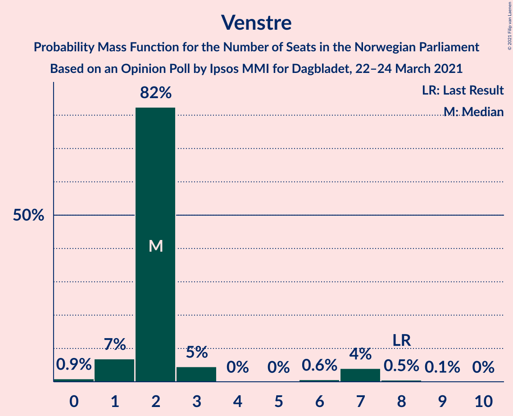
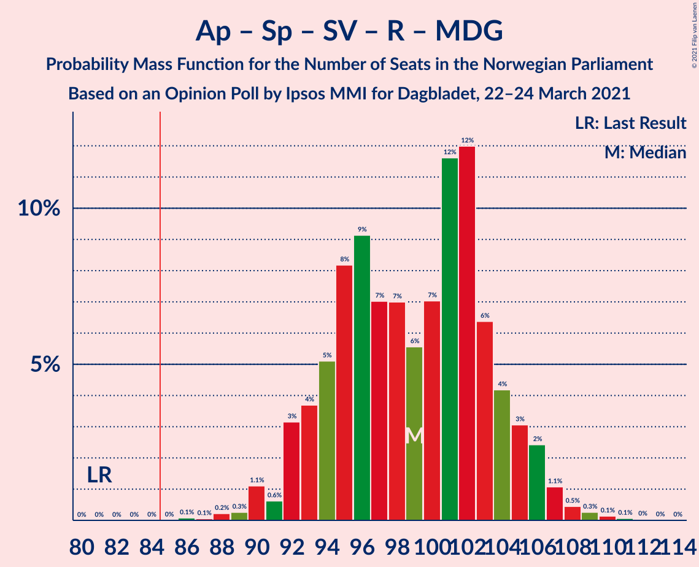
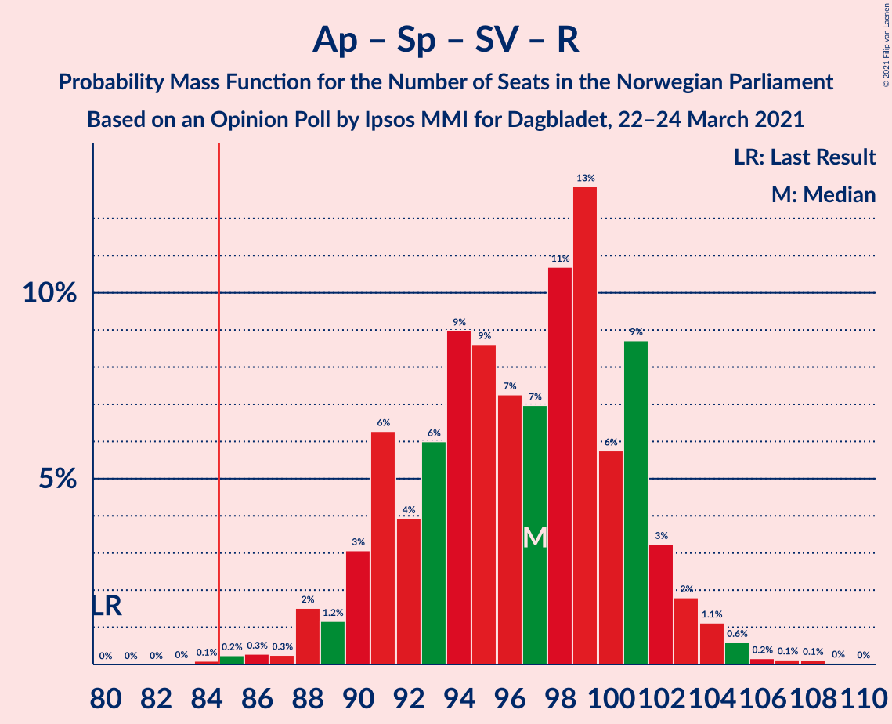
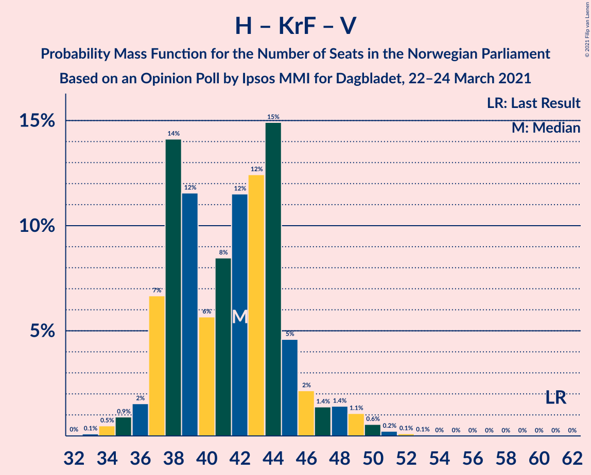
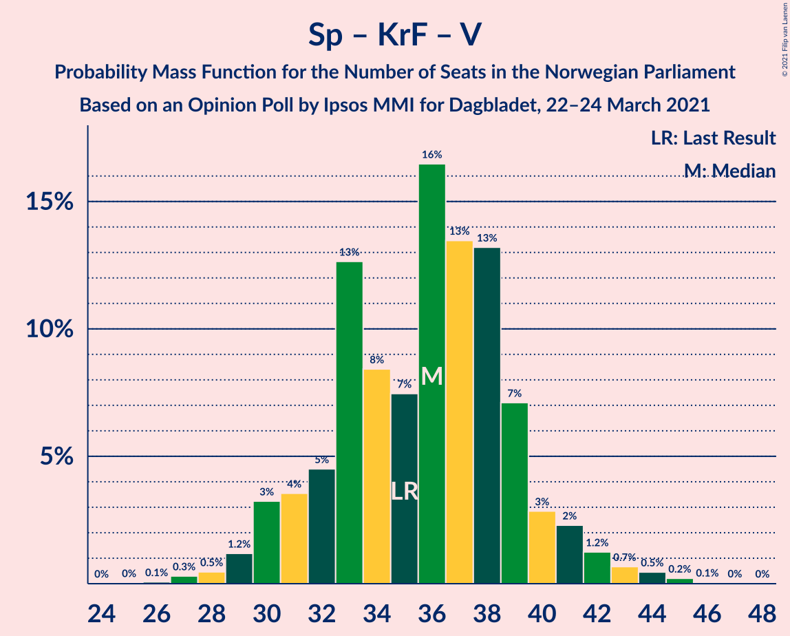

# Opinion Poll by Ipsos MMI for Dagbladet, 22–24 March 2021

<a href="#voting-intentions">Voting Intentions</a> | <a href="#seats">Seats</a> | <a href="#coalitions">Coalitions</a> | <a href="#technical-information">Technical Information</a>

## Voting Intentions

### Confidence Intervals

| Party | Last Result | Poll Result | 80% Confidence Interval | 90% Confidence Interval | 95% Confidence Interval | 99% Confidence Interval |
|:-----:|:-----------:|:-----------:|:-----------------------:|:-----------------------:|:-----------------------:|:-----------------------:|
| Arbeiderpartiet | 27.4% | 24.3% | 22.4–26.4% |21.8–26.9% |21.4–27.5% |20.5–28.5% |
| Høyre | 25.0% | 20.9% | 19.1–22.9% |18.6–23.4% |18.2–23.9% |17.3–24.9% |
| Senterpartiet | 10.3% | 16.8% | 15.1–18.6% |14.7–19.1% |14.3–19.6% |13.5–20.5% |
| Fremskrittspartiet | 15.2% | 11.6% | 10.2–13.2% |9.8–13.6% |9.5–14.0% |8.9–14.8% |
| Sosialistisk Venstreparti | 6.0% | 7.4% | 6.3–8.8% |6.0–9.1% |5.8–9.5% |5.3–10.2% |
| Rødt | 2.4% | 4.9% | 4.1–6.1% |3.8–6.4% |3.6–6.7% |3.2–7.3% |
| Miljøpartiet De Grønne | 3.2% | 3.4% | 2.7–4.4% |2.5–4.6% |2.3–4.9% |2.0–5.4% |
| Venstre | 4.4% | 2.9% | 2.2–3.8% |2.0–4.1% |1.9–4.3% |1.6–4.8% |
| Kristelig Folkeparti | 4.2% | 2.9% | 2.2–3.8% |2.0–4.1% |1.9–4.3% |1.6–4.8% |

*Note:* The poll result column reflects the actual value used in the calculations. Published results may vary slightly, and in addition be rounded to fewer digits.

## Seats

### Confidence Intervals

| Party | Last Result | Median | 80% Confidence Interval | 90% Confidence Interval | 95% Confidence Interval | 99% Confidence Interval |
|:-----:|:-----------:|:------:|:-----------------------:|:-----------------------:|:-----------------------:|:-----------------------:|
| <a href="#arbeiderpartiet">Arbeiderpartiet</a> | 49 | 44 | 41–47 |40–49 |39–50 |38–52 |
| <a href="#høyre">Høyre</a> | 45 | 37 | 34–41 |33–41 |32–42 |31–45 |
| <a href="#senterpartiet">Senterpartiet</a> | 19 | 32 | 28–35 |27–36 |26–36 |25–38 |
| <a href="#fremskrittspartiet">Fremskrittspartiet</a> | 27 | 20 | 17–24 |17–25 |16–25 |15–27 |
| <a href="#sosialistisk-venstreparti">Sosialistisk Venstreparti</a> | 11 | 13 | 10–15 |10–16 |9–16 |9–18 |
| <a href="#rødt">Rødt</a> | 1 | 9 | 6–10 |2–11 |2–11 |2–12 |
| <a href="#miljøpartiet-de-grønne">Miljøpartiet De Grønne</a> | 1 | 2 | 1–7 |1–7 |1–8 |1–9 |
| <a href="#venstre">Venstre</a> | 8 | 2 | 2 |1–6 |1–7 |0–8 |
| <a href="#kristelig-folkeparti">Kristelig Folkeparti</a> | 8 | 1 | 1–3 |1–7 |0–7 |0–8 |

### Arbeiderpartiet

*For a full overview of the results for this party, see the [Arbeiderpartiet](party-arbeiderpartiet.html) page.*

| Number of Seats | Probability | Accumulated | Special Marks |
|:---------------:|:-----------:|:-----------:|:-------------:|
| 36 | 0.1% | 100% |  |
| 37 | 0.1% | 99.9% |  |
| 38 | 0.8% | 99.8% |  |
| 39 | 2% | 99.0% |  |
| 40 | 4% | 97% |  |
| 41 | 7% | 93% |  |
| 42 | 8% | 86% |  |
| 43 | 7% | 78% |  |
| 44 | 23% | 71% | Median |
| 45 | 27% | 49% |  |
| 46 | 10% | 22% |  |
| 47 | 4% | 12% |  |
| 48 | 2% | 8% |  |
| 49 | 2% | 6% | Last Result |
| 50 | 1.4% | 3% |  |
| 51 | 0.7% | 2% |  |
| 52 | 0.9% | 1.3% |  |
| 53 | 0.2% | 0.4% |  |
| 54 | 0.1% | 0.1% |  |
| 55 | 0.1% | 0.1% |  |
| 56 | 0% | 0% |  |

### Høyre

*For a full overview of the results for this party, see the [Høyre](party-høyre.html) page.*

| Number of Seats | Probability | Accumulated | Special Marks |
|:---------------:|:-----------:|:-----------:|:-------------:|
| 29 | 0.1% | 100% |  |
| 30 | 0.2% | 99.8% |  |
| 31 | 0.8% | 99.7% |  |
| 32 | 2% | 98.9% |  |
| 33 | 2% | 97% |  |
| 34 | 8% | 95% |  |
| 35 | 25% | 87% |  |
| 36 | 10% | 62% |  |
| 37 | 8% | 52% | Median |
| 38 | 10% | 44% |  |
| 39 | 9% | 34% |  |
| 40 | 12% | 25% |  |
| 41 | 10% | 13% |  |
| 42 | 2% | 3% |  |
| 43 | 0.9% | 2% |  |
| 44 | 0.3% | 0.9% |  |
| 45 | 0.3% | 0.6% | Last Result |
| 46 | 0.2% | 0.3% |  |
| 47 | 0% | 0.1% |  |
| 48 | 0% | 0% |  |

### Senterpartiet

*For a full overview of the results for this party, see the [Senterpartiet](party-senterpartiet.html) page.*

| Number of Seats | Probability | Accumulated | Special Marks |
|:---------------:|:-----------:|:-----------:|:-------------:|
| 19 | 0% | 100% | Last Result |
| 20 | 0% | 100% |  |
| 21 | 0% | 100% |  |
| 22 | 0% | 100% |  |
| 23 | 0.1% | 100% |  |
| 24 | 0.2% | 99.8% |  |
| 25 | 0.9% | 99.7% |  |
| 26 | 3% | 98.7% |  |
| 27 | 5% | 96% |  |
| 28 | 9% | 91% |  |
| 29 | 8% | 82% |  |
| 30 | 11% | 74% |  |
| 31 | 9% | 64% |  |
| 32 | 9% | 55% | Median |
| 33 | 20% | 46% |  |
| 34 | 14% | 26% |  |
| 35 | 5% | 12% |  |
| 36 | 4% | 6% |  |
| 37 | 1.4% | 2% |  |
| 38 | 0.3% | 0.6% |  |
| 39 | 0.2% | 0.3% |  |
| 40 | 0.1% | 0.1% |  |
| 41 | 0% | 0% |  |

### Fremskrittspartiet

*For a full overview of the results for this party, see the [Fremskrittspartiet](party-fremskrittspartiet.html) page.*

| Number of Seats | Probability | Accumulated | Special Marks |
|:---------------:|:-----------:|:-----------:|:-------------:|
| 13 | 0.1% | 100% |  |
| 14 | 0.3% | 99.9% |  |
| 15 | 1.1% | 99.5% |  |
| 16 | 3% | 98% |  |
| 17 | 8% | 95% |  |
| 18 | 12% | 87% |  |
| 19 | 12% | 75% |  |
| 20 | 17% | 63% | Median |
| 21 | 12% | 45% |  |
| 22 | 10% | 33% |  |
| 23 | 8% | 23% |  |
| 24 | 10% | 15% |  |
| 25 | 3% | 5% |  |
| 26 | 1.4% | 2% |  |
| 27 | 0.3% | 0.5% | Last Result |
| 28 | 0.1% | 0.2% |  |
| 29 | 0% | 0% |  |

### Sosialistisk Venstreparti

*For a full overview of the results for this party, see the [Sosialistisk Venstreparti](party-sosialistiskvenstreparti.html) page.*

| Number of Seats | Probability | Accumulated | Special Marks |
|:---------------:|:-----------:|:-----------:|:-------------:|
| 8 | 0.4% | 100% |  |
| 9 | 3% | 99.6% |  |
| 10 | 7% | 97% |  |
| 11 | 22% | 89% | Last Result |
| 12 | 16% | 68% |  |
| 13 | 24% | 52% | Median |
| 14 | 13% | 27% |  |
| 15 | 9% | 14% |  |
| 16 | 3% | 5% |  |
| 17 | 1.2% | 2% |  |
| 18 | 0.4% | 0.5% |  |
| 19 | 0.1% | 0.1% |  |
| 20 | 0% | 0.1% |  |
| 21 | 0% | 0% |  |

### Rødt

*For a full overview of the results for this party, see the [Rødt](party-rødt.html) page.*

| Number of Seats | Probability | Accumulated | Special Marks |
|:---------------:|:-----------:|:-----------:|:-------------:|
| 1 | 0% | 100% | Last Result |
| 2 | 9% | 100% |  |
| 3 | 0.1% | 91% |  |
| 4 | 0% | 91% |  |
| 5 | 0% | 91% |  |
| 6 | 0.7% | 91% |  |
| 7 | 12% | 90% |  |
| 8 | 26% | 77% |  |
| 9 | 30% | 51% | Median |
| 10 | 15% | 21% |  |
| 11 | 4% | 7% |  |
| 12 | 2% | 2% |  |
| 13 | 0.4% | 0.5% |  |
| 14 | 0.1% | 0.1% |  |
| 15 | 0% | 0% |  |

### Miljøpartiet De Grønne

*For a full overview of the results for this party, see the [Miljøpartiet De Grønne](party-miljøpartietdegrønne.html) page.*

| Number of Seats | Probability | Accumulated | Special Marks |
|:---------------:|:-----------:|:-----------:|:-------------:|
| 0 | 0.1% | 100% |  |
| 1 | 30% | 99.9% | Last Result |
| 2 | 43% | 70% | Median |
| 3 | 14% | 27% |  |
| 4 | 1.2% | 13% |  |
| 5 | 0% | 11% |  |
| 6 | 1.4% | 11% |  |
| 7 | 5% | 10% |  |
| 8 | 4% | 5% |  |
| 9 | 0.8% | 1.0% |  |
| 10 | 0.1% | 0.1% |  |
| 11 | 0% | 0% |  |

### Venstre

*For a full overview of the results for this party, see the [Venstre](party-venstre.html) page.*

| Number of Seats | Probability | Accumulated | Special Marks |
|:---------------:|:-----------:|:-----------:|:-------------:|
| 0 | 0.9% | 100% |  |
| 1 | 7% | 99.1% |  |
| 2 | 82% | 92% | Median |
| 3 | 5% | 10% |  |
| 4 | 0% | 5% |  |
| 5 | 0% | 5% |  |
| 6 | 0.6% | 5% |  |
| 7 | 4% | 5% |  |
| 8 | 0.5% | 0.6% | Last Result |
| 9 | 0.1% | 0.1% |  |
| 10 | 0% | 0% |  |

### Kristelig Folkeparti

*For a full overview of the results for this party, see the [Kristelig Folkeparti](party-kristeligfolkeparti.html) page.*

| Number of Seats | Probability | Accumulated | Special Marks |
|:---------------:|:-----------:|:-----------:|:-------------:|
| 0 | 5% | 100% |  |
| 1 | 47% | 95% | Median |
| 2 | 23% | 48% |  |
| 3 | 19% | 26% |  |
| 4 | 0% | 6% |  |
| 5 | 0% | 6% |  |
| 6 | 1.2% | 6% |  |
| 7 | 4% | 5% |  |
| 8 | 0.9% | 1.0% | Last Result |
| 9 | 0.1% | 0.1% |  |
| 10 | 0% | 0% |  |

## Coalitions

### Confidence Intervals

| Coalition | Last Result | Median | Majority? | 80% Confidence Interval | 90% Confidence Interval | 95% Confidence Interval | 99% Confidence Interval |
|:---------:|:-----------:|:------:|:---------:|:-----------------------:|:-----------------------:|:-----------------------:|:-----------------------:|
| Arbeiderpartiet – Senterpartiet – Sosialistisk Venstreparti – Rødt – Miljøpartiet De Grønne | 81 | 99 | 100% | 94–104 | 92–105 | 92–106 | 89–109 |
| Arbeiderpartiet – Senterpartiet – Sosialistisk Venstreparti – Rødt | 80 | 97 | 99.9% | 91–101 | 90–102 | 89–103 | 86–105 |
| Høyre – Senterpartiet – Fremskrittspartiet – Kristelig Folkeparti – Venstre | 107 | 93 | 99.0% | 89–98 | 87–99 | 86–100 | 84–102 |
| Arbeiderpartiet – Senterpartiet – Sosialistisk Venstreparti – Miljøpartiet De Grønne – Kristelig Folkeparti | 88 | 93 | 99.0% | 88–97 | 86–99 | 85–100 | 84–103 |
| Arbeiderpartiet – Senterpartiet – Sosialistisk Venstreparti – Miljøpartiet De Grønne | 80 | 91 | 96% | 86–96 | 85–97 | 84–98 | 82–100 |
| Arbeiderpartiet – Senterpartiet – Sosialistisk Venstreparti | 79 | 89 | 83% | 83–93 | 83–94 | 82–95 | 79–97 |
| Arbeiderpartiet – Senterpartiet – Miljøpartiet De Grønne – Kristelig Folkeparti | 77 | 80 | 12% | 75–85 | 73–87 | 72–88 | 70–91 |
| Arbeiderpartiet – Senterpartiet – Kristelig Folkeparti | 76 | 78 | 2% | 73–82 | 72–83 | 71–84 | 68–87 |
| Arbeiderpartiet – Senterpartiet | 68 | 76 | 0.3% | 71–80 | 70–81 | 69–82 | 67–84 |
| Høyre – Fremskrittspartiet – Miljøpartiet De Grønne – Kristelig Folkeparti – Venstre | 89 | 64 | 0% | 59–69 | 59–70 | 57–72 | 56–75 |
| Høyre – Fremskrittspartiet – Kristelig Folkeparti – Venstre | 88 | 61 | 0% | 57–67 | 56–68 | 55–69 | 53–72 |
| Høyre – Fremskrittspartiet – Venstre | 80 | 59 | 0% | 55–64 | 54–66 | 53–67 | 52–70 |
| Høyre – Fremskrittspartiet | 72 | 57 | 0% | 53–62 | 52–64 | 51–65 | 50–67 |
| Arbeiderpartiet – Sosialistisk Venstreparti | 60 | 57 | 0% | 53–60 | 52–62 | 51–63 | 49–65 |
| Høyre – Kristelig Folkeparti – Venstre | 61 | 42 | 0% | 38–45 | 37–46 | 36–48 | 34–50 |
| Senterpartiet – Kristelig Folkeparti – Venstre | 35 | 36 | 0% | 32–39 | 30–40 | 30–42 | 28–44 |

### Arbeiderpartiet – Senterpartiet – Sosialistisk Venstreparti – Rødt – Miljøpartiet De Grønne

| Number of Seats | Probability | Accumulated | Special Marks |
|:---------------:|:-----------:|:-----------:|:-------------:|
| 81 | 0% | 100% | Last Result |
| 82 | 0% | 100% |  |
| 83 | 0% | 100% |  |
| 84 | 0% | 100% |  |
| 85 | 0% | 100% | Majority |
| 86 | 0.1% | 100% |  |
| 87 | 0.1% | 99.9% |  |
| 88 | 0.2% | 99.8% |  |
| 89 | 0.3% | 99.6% |  |
| 90 | 1.1% | 99.4% |  |
| 91 | 0.6% | 98% |  |
| 92 | 3% | 98% |  |
| 93 | 4% | 94% |  |
| 94 | 5% | 91% |  |
| 95 | 8% | 86% |  |
| 96 | 9% | 77% |  |
| 97 | 7% | 68% |  |
| 98 | 7% | 61% |  |
| 99 | 6% | 54% |  |
| 100 | 7% | 49% | Median |
| 101 | 12% | 42% |  |
| 102 | 12% | 30% |  |
| 103 | 6% | 18% |  |
| 104 | 4% | 12% |  |
| 105 | 3% | 8% |  |
| 106 | 2% | 4% |  |
| 107 | 1.1% | 2% |  |
| 108 | 0.5% | 1.0% |  |
| 109 | 0.3% | 0.5% |  |
| 110 | 0.1% | 0.3% |  |
| 111 | 0.1% | 0.1% |  |
| 112 | 0% | 0.1% |  |
| 113 | 0% | 0% |  |

### Arbeiderpartiet – Senterpartiet – Sosialistisk Venstreparti – Rødt

| Number of Seats | Probability | Accumulated | Special Marks |
|:---------------:|:-----------:|:-----------:|:-------------:|
| 80 | 0% | 100% | Last Result |
| 81 | 0% | 100% |  |
| 82 | 0% | 100% |  |
| 83 | 0% | 100% |  |
| 84 | 0.1% | 100% |  |
| 85 | 0.2% | 99.9% | Majority |
| 86 | 0.3% | 99.6% |  |
| 87 | 0.3% | 99.3% |  |
| 88 | 2% | 99.1% |  |
| 89 | 1.2% | 98% |  |
| 90 | 3% | 96% |  |
| 91 | 6% | 93% |  |
| 92 | 4% | 87% |  |
| 93 | 6% | 83% |  |
| 94 | 9% | 77% |  |
| 95 | 9% | 68% |  |
| 96 | 7% | 60% |  |
| 97 | 7% | 52% |  |
| 98 | 11% | 45% | Median |
| 99 | 13% | 35% |  |
| 100 | 6% | 22% |  |
| 101 | 9% | 16% |  |
| 102 | 3% | 7% |  |
| 103 | 2% | 4% |  |
| 104 | 1.1% | 2% |  |
| 105 | 0.6% | 1.1% |  |
| 106 | 0.2% | 0.5% |  |
| 107 | 0.1% | 0.3% |  |
| 108 | 0.1% | 0.2% |  |
| 109 | 0% | 0.1% |  |
| 110 | 0% | 0% |  |

### Høyre – Senterpartiet – Fremskrittspartiet – Kristelig Folkeparti – Venstre

| Number of Seats | Probability | Accumulated | Special Marks |
|:---------------:|:-----------:|:-----------:|:-------------:|
| 80 | 0% | 100% |  |
| 81 | 0.1% | 99.9% |  |
| 82 | 0.1% | 99.9% |  |
| 83 | 0.2% | 99.7% |  |
| 84 | 0.5% | 99.6% |  |
| 85 | 0.7% | 99.0% | Majority |
| 86 | 2% | 98% |  |
| 87 | 2% | 96% |  |
| 88 | 3% | 95% |  |
| 89 | 4% | 91% |  |
| 90 | 7% | 87% |  |
| 91 | 9% | 80% |  |
| 92 | 14% | 70% | Median |
| 93 | 7% | 57% |  |
| 94 | 13% | 49% |  |
| 95 | 13% | 37% |  |
| 96 | 6% | 24% |  |
| 97 | 8% | 18% |  |
| 98 | 5% | 10% |  |
| 99 | 2% | 6% |  |
| 100 | 2% | 4% |  |
| 101 | 1.0% | 2% |  |
| 102 | 0.5% | 1.0% |  |
| 103 | 0.1% | 0.5% |  |
| 104 | 0.2% | 0.4% |  |
| 105 | 0.1% | 0.2% |  |
| 106 | 0.1% | 0.1% |  |
| 107 | 0% | 0% | Last Result |

### Arbeiderpartiet – Senterpartiet – Sosialistisk Venstreparti – Miljøpartiet De Grønne – Kristelig Folkeparti

| Number of Seats | Probability | Accumulated | Special Marks |
|:---------------:|:-----------:|:-----------:|:-------------:|
| 81 | 0.1% | 100% |  |
| 82 | 0.1% | 99.9% |  |
| 83 | 0.2% | 99.8% |  |
| 84 | 0.6% | 99.6% |  |
| 85 | 2% | 99.0% | Majority |
| 86 | 2% | 97% |  |
| 87 | 2% | 95% |  |
| 88 | 9% | 93% | Last Result |
| 89 | 9% | 84% |  |
| 90 | 6% | 75% |  |
| 91 | 6% | 69% |  |
| 92 | 8% | 63% | Median |
| 93 | 6% | 55% |  |
| 94 | 14% | 49% |  |
| 95 | 9% | 35% |  |
| 96 | 13% | 26% |  |
| 97 | 3% | 13% |  |
| 98 | 3% | 10% |  |
| 99 | 3% | 6% |  |
| 100 | 1.2% | 4% |  |
| 101 | 1.2% | 2% |  |
| 102 | 0.6% | 1.2% |  |
| 103 | 0.2% | 0.6% |  |
| 104 | 0.2% | 0.4% |  |
| 105 | 0.1% | 0.2% |  |
| 106 | 0% | 0.1% |  |
| 107 | 0% | 0% |  |

### Arbeiderpartiet – Senterpartiet – Sosialistisk Venstreparti – Miljøpartiet De Grønne

| Number of Seats | Probability | Accumulated | Special Marks |
|:---------------:|:-----------:|:-----------:|:-------------:|
| 78 | 0% | 100% |  |
| 79 | 0% | 99.9% |  |
| 80 | 0.1% | 99.9% | Last Result |
| 81 | 0.1% | 99.8% |  |
| 82 | 0.6% | 99.7% |  |
| 83 | 0.4% | 99.1% |  |
| 84 | 3% | 98.6% |  |
| 85 | 3% | 96% | Majority |
| 86 | 10% | 93% |  |
| 87 | 8% | 84% |  |
| 88 | 8% | 75% |  |
| 89 | 6% | 67% |  |
| 90 | 7% | 61% |  |
| 91 | 7% | 54% | Median |
| 92 | 7% | 47% |  |
| 93 | 14% | 41% |  |
| 94 | 11% | 27% |  |
| 95 | 6% | 16% |  |
| 96 | 3% | 10% |  |
| 97 | 3% | 7% |  |
| 98 | 2% | 4% |  |
| 99 | 0.9% | 2% |  |
| 100 | 0.5% | 0.9% |  |
| 101 | 0.2% | 0.4% |  |
| 102 | 0.1% | 0.2% |  |
| 103 | 0% | 0.1% |  |
| 104 | 0% | 0.1% |  |
| 105 | 0% | 0% |  |

### Arbeiderpartiet – Senterpartiet – Sosialistisk Venstreparti

| Number of Seats | Probability | Accumulated | Special Marks |
|:---------------:|:-----------:|:-----------:|:-------------:|
| 76 | 0.1% | 100% |  |
| 77 | 0.1% | 99.9% |  |
| 78 | 0.2% | 99.9% |  |
| 79 | 0.2% | 99.7% | Last Result |
| 80 | 0.8% | 99.5% |  |
| 81 | 1.0% | 98.7% |  |
| 82 | 1.1% | 98% |  |
| 83 | 8% | 97% |  |
| 84 | 6% | 89% |  |
| 85 | 5% | 83% | Majority |
| 86 | 11% | 78% |  |
| 87 | 8% | 67% |  |
| 88 | 7% | 58% |  |
| 89 | 9% | 51% | Median |
| 90 | 14% | 42% |  |
| 91 | 7% | 29% |  |
| 92 | 10% | 21% |  |
| 93 | 6% | 11% |  |
| 94 | 3% | 5% |  |
| 95 | 1.2% | 3% |  |
| 96 | 0.9% | 2% |  |
| 97 | 0.4% | 0.8% |  |
| 98 | 0.3% | 0.4% |  |
| 99 | 0.1% | 0.2% |  |
| 100 | 0% | 0.1% |  |
| 101 | 0% | 0% |  |

### Arbeiderpartiet – Senterpartiet – Miljøpartiet De Grønne – Kristelig Folkeparti

| Number of Seats | Probability | Accumulated | Special Marks |
|:---------------:|:-----------:|:-----------:|:-------------:|
| 68 | 0.1% | 100% |  |
| 69 | 0.1% | 99.9% |  |
| 70 | 0.4% | 99.8% |  |
| 71 | 0.6% | 99.4% |  |
| 72 | 2% | 98.8% |  |
| 73 | 2% | 97% |  |
| 74 | 2% | 95% |  |
| 75 | 3% | 92% |  |
| 76 | 6% | 90% |  |
| 77 | 10% | 83% | Last Result |
| 78 | 6% | 73% |  |
| 79 | 6% | 67% | Median |
| 80 | 13% | 62% |  |
| 81 | 12% | 49% |  |
| 82 | 6% | 37% |  |
| 83 | 14% | 31% |  |
| 84 | 5% | 16% |  |
| 85 | 4% | 12% | Majority |
| 86 | 2% | 8% |  |
| 87 | 3% | 6% |  |
| 88 | 1.0% | 3% |  |
| 89 | 0.9% | 2% |  |
| 90 | 0.6% | 1.2% |  |
| 91 | 0.2% | 0.5% |  |
| 92 | 0.2% | 0.3% |  |
| 93 | 0% | 0.1% |  |
| 94 | 0% | 0.1% |  |
| 95 | 0% | 0% |  |

### Arbeiderpartiet – Senterpartiet – Kristelig Folkeparti

| Number of Seats | Probability | Accumulated | Special Marks |
|:---------------:|:-----------:|:-----------:|:-------------:|
| 66 | 0% | 100% |  |
| 67 | 0.2% | 99.9% |  |
| 68 | 0.5% | 99.8% |  |
| 69 | 0.7% | 99.3% |  |
| 70 | 0.5% | 98.6% |  |
| 71 | 3% | 98% |  |
| 72 | 2% | 95% |  |
| 73 | 6% | 93% |  |
| 74 | 5% | 87% |  |
| 75 | 7% | 82% |  |
| 76 | 11% | 75% | Last Result |
| 77 | 8% | 64% | Median |
| 78 | 7% | 56% |  |
| 79 | 17% | 49% |  |
| 80 | 11% | 31% |  |
| 81 | 9% | 20% |  |
| 82 | 4% | 11% |  |
| 83 | 3% | 7% |  |
| 84 | 1.4% | 4% |  |
| 85 | 0.9% | 2% | Majority |
| 86 | 0.6% | 1.4% |  |
| 87 | 0.5% | 0.8% |  |
| 88 | 0.2% | 0.3% |  |
| 89 | 0.1% | 0.1% |  |
| 90 | 0.1% | 0.1% |  |
| 91 | 0% | 0% |  |

### Arbeiderpartiet – Senterpartiet

| Number of Seats | Probability | Accumulated | Special Marks |
|:---------------:|:-----------:|:-----------:|:-------------:|
| 65 | 0.1% | 100% |  |
| 66 | 0.2% | 99.9% |  |
| 67 | 0.7% | 99.6% |  |
| 68 | 0.8% | 98.9% | Last Result |
| 69 | 1.4% | 98% |  |
| 70 | 5% | 97% |  |
| 71 | 4% | 91% |  |
| 72 | 5% | 87% |  |
| 73 | 8% | 82% |  |
| 74 | 6% | 73% |  |
| 75 | 13% | 68% |  |
| 76 | 6% | 54% | Median |
| 77 | 10% | 48% |  |
| 78 | 16% | 38% |  |
| 79 | 11% | 21% |  |
| 80 | 4% | 11% |  |
| 81 | 4% | 7% |  |
| 82 | 1.3% | 3% |  |
| 83 | 1.1% | 2% |  |
| 84 | 0.5% | 0.8% |  |
| 85 | 0.2% | 0.3% | Majority |
| 86 | 0.1% | 0.2% |  |
| 87 | 0% | 0% |  |

### Høyre – Fremskrittspartiet – Miljøpartiet De Grønne – Kristelig Folkeparti – Venstre

| Number of Seats | Probability | Accumulated | Special Marks |
|:---------------:|:-----------:|:-----------:|:-------------:|
| 54 | 0% | 100% |  |
| 55 | 0.2% | 99.9% |  |
| 56 | 0.8% | 99.8% |  |
| 57 | 2% | 99.0% |  |
| 58 | 1.1% | 97% |  |
| 59 | 7% | 96% |  |
| 60 | 4% | 90% |  |
| 61 | 11% | 85% |  |
| 62 | 12% | 74% | Median |
| 63 | 10% | 63% |  |
| 64 | 7% | 53% |  |
| 65 | 11% | 46% |  |
| 66 | 7% | 35% |  |
| 67 | 8% | 28% |  |
| 68 | 6% | 20% |  |
| 69 | 7% | 14% |  |
| 70 | 2% | 7% |  |
| 71 | 2% | 5% |  |
| 72 | 1.4% | 3% |  |
| 73 | 0.6% | 2% |  |
| 74 | 0.6% | 1.4% |  |
| 75 | 0.2% | 0.7% |  |
| 76 | 0.2% | 0.5% |  |
| 77 | 0.1% | 0.2% |  |
| 78 | 0.1% | 0.1% |  |
| 79 | 0% | 0.1% |  |
| 80 | 0% | 0% |  |
| 81 | 0% | 0% |  |
| 82 | 0% | 0% |  |
| 83 | 0% | 0% |  |
| 84 | 0% | 0% |  |
| 85 | 0% | 0% | Majority |
| 86 | 0% | 0% |  |
| 87 | 0% | 0% |  |
| 88 | 0% | 0% |  |
| 89 | 0% | 0% | Last Result |

### Høyre – Fremskrittspartiet – Kristelig Folkeparti – Venstre

| Number of Seats | Probability | Accumulated | Special Marks |
|:---------------:|:-----------:|:-----------:|:-------------:|
| 51 | 0% | 100% |  |
| 52 | 0.2% | 99.9% |  |
| 53 | 0.3% | 99.7% |  |
| 54 | 1.0% | 99.4% |  |
| 55 | 3% | 98% |  |
| 56 | 3% | 95% |  |
| 57 | 7% | 93% |  |
| 58 | 5% | 85% |  |
| 59 | 13% | 80% |  |
| 60 | 8% | 67% | Median |
| 61 | 10% | 59% |  |
| 62 | 6% | 49% |  |
| 63 | 7% | 43% |  |
| 64 | 9% | 36% |  |
| 65 | 11% | 27% |  |
| 66 | 6% | 16% |  |
| 67 | 3% | 10% |  |
| 68 | 4% | 7% |  |
| 69 | 1.1% | 3% |  |
| 70 | 1.1% | 2% |  |
| 71 | 0.4% | 1.2% |  |
| 72 | 0.4% | 0.8% |  |
| 73 | 0.2% | 0.3% |  |
| 74 | 0.1% | 0.2% |  |
| 75 | 0% | 0.1% |  |
| 76 | 0% | 0% |  |
| 77 | 0% | 0% |  |
| 78 | 0% | 0% |  |
| 79 | 0% | 0% |  |
| 80 | 0% | 0% |  |
| 81 | 0% | 0% |  |
| 82 | 0% | 0% |  |
| 83 | 0% | 0% |  |
| 84 | 0% | 0% |  |
| 85 | 0% | 0% | Majority |
| 86 | 0% | 0% |  |
| 87 | 0% | 0% |  |
| 88 | 0% | 0% | Last Result |

### Høyre – Fremskrittspartiet – Venstre

| Number of Seats | Probability | Accumulated | Special Marks |
|:---------------:|:-----------:|:-----------:|:-------------:|
| 49 | 0% | 100% |  |
| 50 | 0.1% | 99.9% |  |
| 51 | 0.3% | 99.8% |  |
| 52 | 0.9% | 99.5% |  |
| 53 | 2% | 98.7% |  |
| 54 | 4% | 97% |  |
| 55 | 3% | 93% |  |
| 56 | 8% | 90% |  |
| 57 | 11% | 82% |  |
| 58 | 16% | 71% |  |
| 59 | 7% | 55% | Median |
| 60 | 8% | 48% |  |
| 61 | 6% | 40% |  |
| 62 | 3% | 34% |  |
| 63 | 15% | 31% |  |
| 64 | 6% | 15% |  |
| 65 | 2% | 9% |  |
| 66 | 3% | 7% |  |
| 67 | 2% | 4% |  |
| 68 | 0.5% | 2% |  |
| 69 | 0.8% | 1.3% |  |
| 70 | 0.3% | 0.5% |  |
| 71 | 0.2% | 0.3% |  |
| 72 | 0% | 0.1% |  |
| 73 | 0% | 0.1% |  |
| 74 | 0% | 0% |  |
| 75 | 0% | 0% |  |
| 76 | 0% | 0% |  |
| 77 | 0% | 0% |  |
| 78 | 0% | 0% |  |
| 79 | 0% | 0% |  |
| 80 | 0% | 0% | Last Result |

### Høyre – Fremskrittspartiet

| Number of Seats | Probability | Accumulated | Special Marks |
|:---------------:|:-----------:|:-----------:|:-------------:|
| 47 | 0% | 100% |  |
| 48 | 0.1% | 99.9% |  |
| 49 | 0.2% | 99.8% |  |
| 50 | 1.0% | 99.6% |  |
| 51 | 1.5% | 98.5% |  |
| 52 | 4% | 97% |  |
| 53 | 4% | 93% |  |
| 54 | 9% | 89% |  |
| 55 | 11% | 80% |  |
| 56 | 17% | 69% |  |
| 57 | 7% | 52% | Median |
| 58 | 9% | 45% |  |
| 59 | 5% | 36% |  |
| 60 | 3% | 32% |  |
| 61 | 14% | 29% |  |
| 62 | 6% | 15% |  |
| 63 | 2% | 9% |  |
| 64 | 3% | 7% |  |
| 65 | 3% | 4% |  |
| 66 | 0.4% | 2% |  |
| 67 | 0.8% | 1.1% |  |
| 68 | 0.2% | 0.4% |  |
| 69 | 0.1% | 0.1% |  |
| 70 | 0% | 0.1% |  |
| 71 | 0% | 0% |  |
| 72 | 0% | 0% | Last Result |

### Arbeiderpartiet – Sosialistisk Venstreparti

| Number of Seats | Probability | Accumulated | Special Marks |
|:---------------:|:-----------:|:-----------:|:-------------:|
| 48 | 0.2% | 100% |  |
| 49 | 0.6% | 99.7% |  |
| 50 | 0.6% | 99.1% |  |
| 51 | 1.2% | 98.6% |  |
| 52 | 6% | 97% |  |
| 53 | 5% | 92% |  |
| 54 | 7% | 86% |  |
| 55 | 10% | 80% |  |
| 56 | 14% | 70% |  |
| 57 | 16% | 56% | Median |
| 58 | 12% | 39% |  |
| 59 | 12% | 27% |  |
| 60 | 6% | 15% | Last Result |
| 61 | 4% | 9% |  |
| 62 | 3% | 6% |  |
| 63 | 2% | 3% |  |
| 64 | 0.7% | 1.4% |  |
| 65 | 0.2% | 0.7% |  |
| 66 | 0.2% | 0.4% |  |
| 67 | 0.1% | 0.3% |  |
| 68 | 0.1% | 0.1% |  |
| 69 | 0% | 0% |  |

### Høyre – Kristelig Folkeparti – Venstre

| Number of Seats | Probability | Accumulated | Special Marks |
|:---------------:|:-----------:|:-----------:|:-------------:|
| 32 | 0% | 100% |  |
| 33 | 0.1% | 99.9% |  |
| 34 | 0.5% | 99.8% |  |
| 35 | 0.9% | 99.3% |  |
| 36 | 2% | 98% |  |
| 37 | 7% | 97% |  |
| 38 | 14% | 90% |  |
| 39 | 12% | 76% |  |
| 40 | 6% | 65% | Median |
| 41 | 8% | 59% |  |
| 42 | 12% | 50% |  |
| 43 | 12% | 39% |  |
| 44 | 15% | 26% |  |
| 45 | 5% | 12% |  |
| 46 | 2% | 7% |  |
| 47 | 1.4% | 5% |  |
| 48 | 1.4% | 3% |  |
| 49 | 1.1% | 2% |  |
| 50 | 0.6% | 1.0% |  |
| 51 | 0.2% | 0.4% |  |
| 52 | 0.1% | 0.2% |  |
| 53 | 0.1% | 0.1% |  |
| 54 | 0% | 0% |  |
| 55 | 0% | 0% |  |
| 56 | 0% | 0% |  |
| 57 | 0% | 0% |  |
| 58 | 0% | 0% |  |
| 59 | 0% | 0% |  |
| 60 | 0% | 0% |  |
| 61 | 0% | 0% | Last Result |

### Senterpartiet – Kristelig Folkeparti – Venstre

| Number of Seats | Probability | Accumulated | Special Marks |
|:---------------:|:-----------:|:-----------:|:-------------:|
| 25 | 0% | 100% |  |
| 26 | 0.1% | 99.9% |  |
| 27 | 0.3% | 99.9% |  |
| 28 | 0.5% | 99.6% |  |
| 29 | 1.2% | 99.1% |  |
| 30 | 3% | 98% |  |
| 31 | 4% | 95% |  |
| 32 | 5% | 91% |  |
| 33 | 13% | 87% |  |
| 34 | 8% | 74% |  |
| 35 | 7% | 66% | Last Result, Median |
| 36 | 16% | 58% |  |
| 37 | 13% | 42% |  |
| 38 | 13% | 28% |  |
| 39 | 7% | 15% |  |
| 40 | 3% | 8% |  |
| 41 | 2% | 5% |  |
| 42 | 1.2% | 3% |  |
| 43 | 0.7% | 1.4% |  |
| 44 | 0.5% | 0.8% |  |
| 45 | 0.2% | 0.3% |  |
| 46 | 0.1% | 0.1% |  |
| 47 | 0% | 0% |  |

## Technical Information

### Opinion Poll

+ **Polling firm:** Ipsos MMI
+ **Commissioner(s):** Dagbladet
+ **Fieldwork period:** 22–24 March 2021

### Calculations

+ **Sample size:** 770
+ **Simulations done:** 1,048,576
+ **Error estimate:** 1.25%

