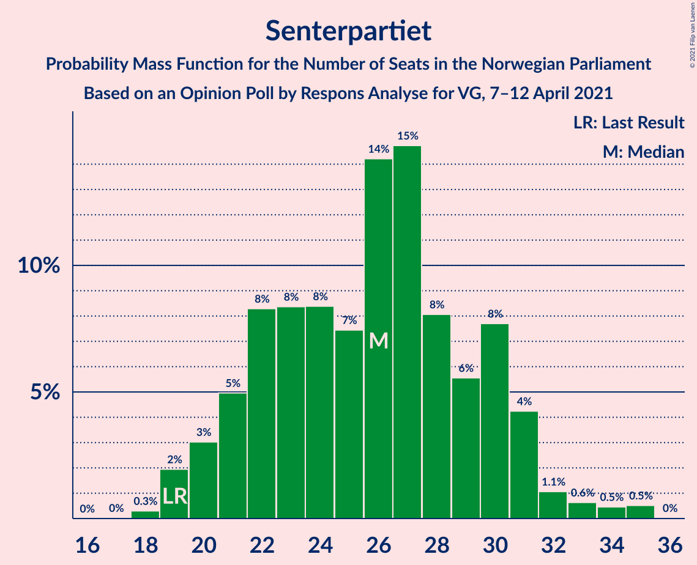
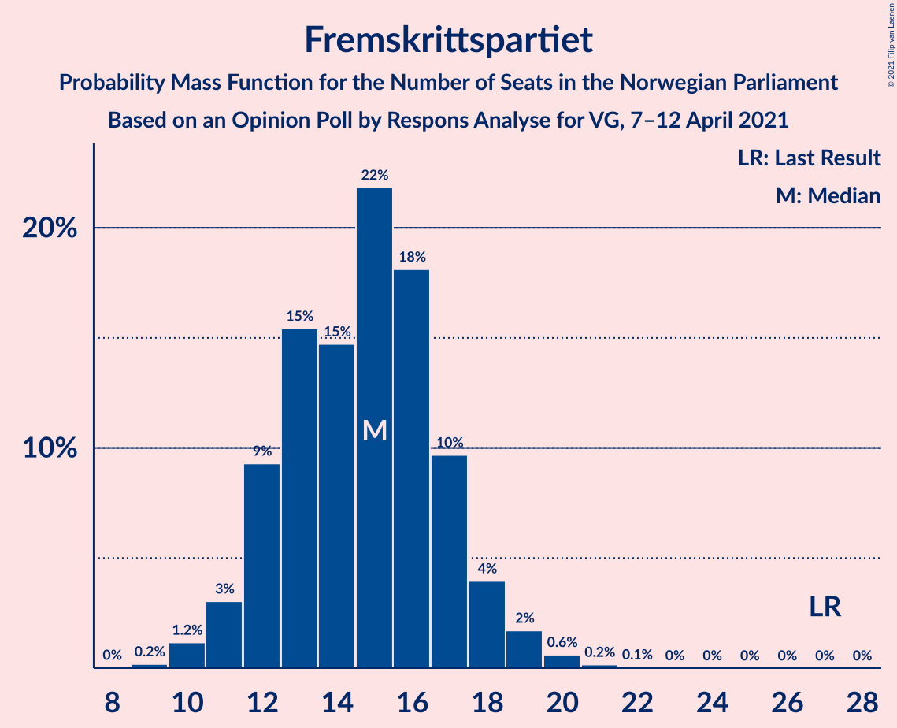
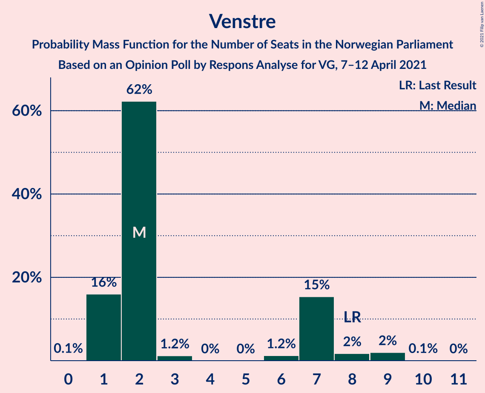
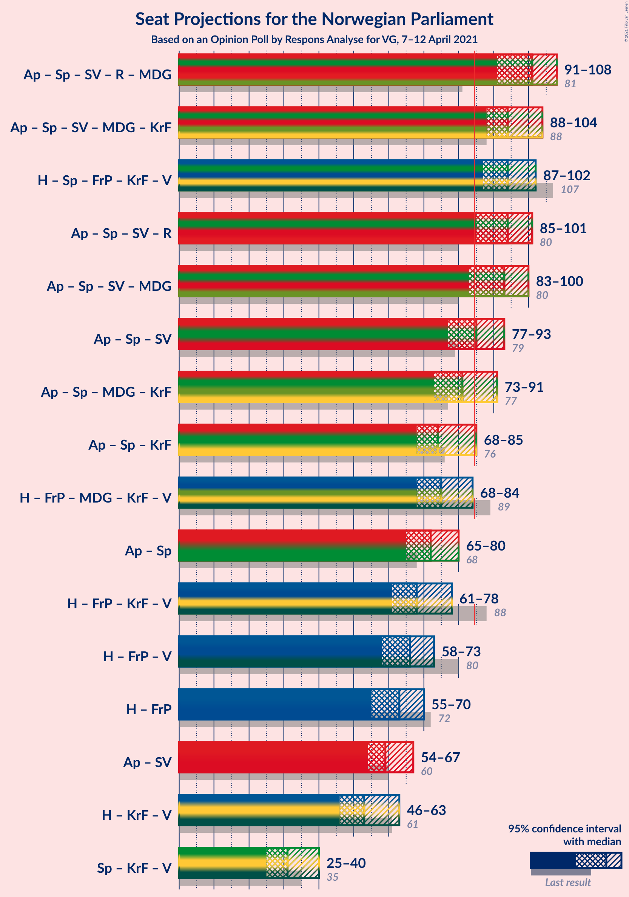
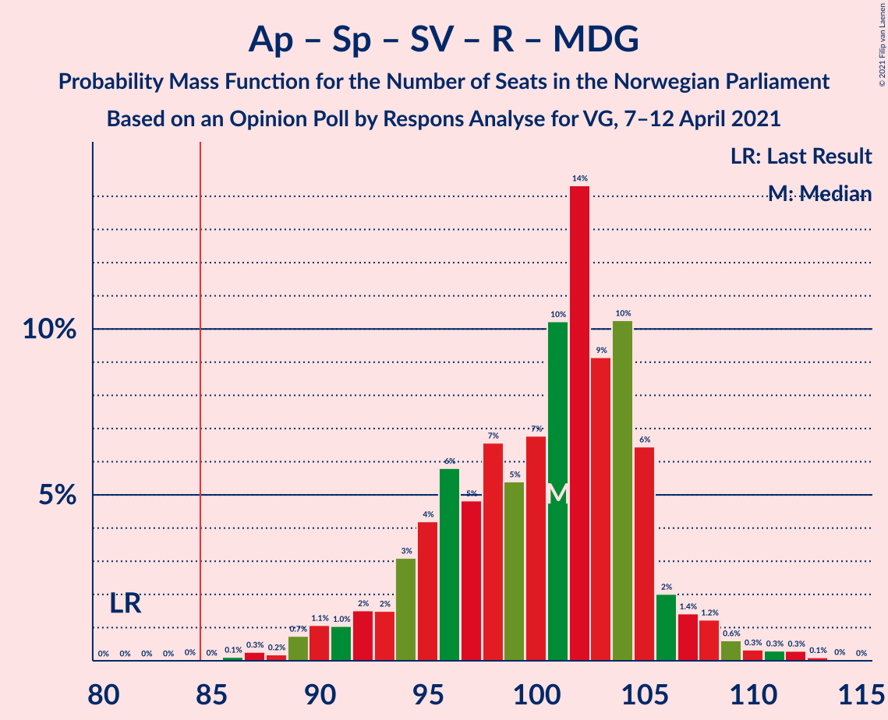
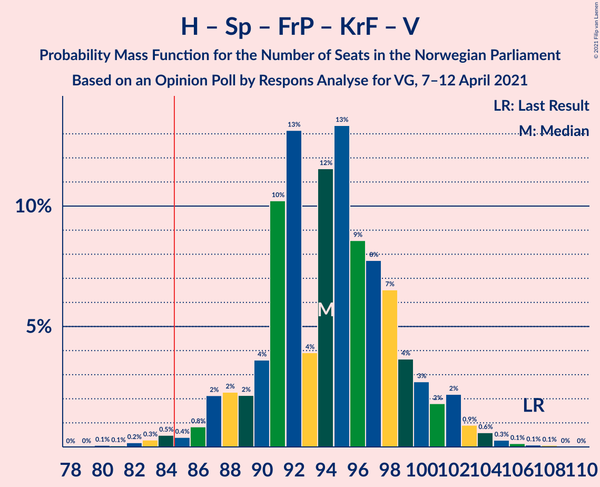
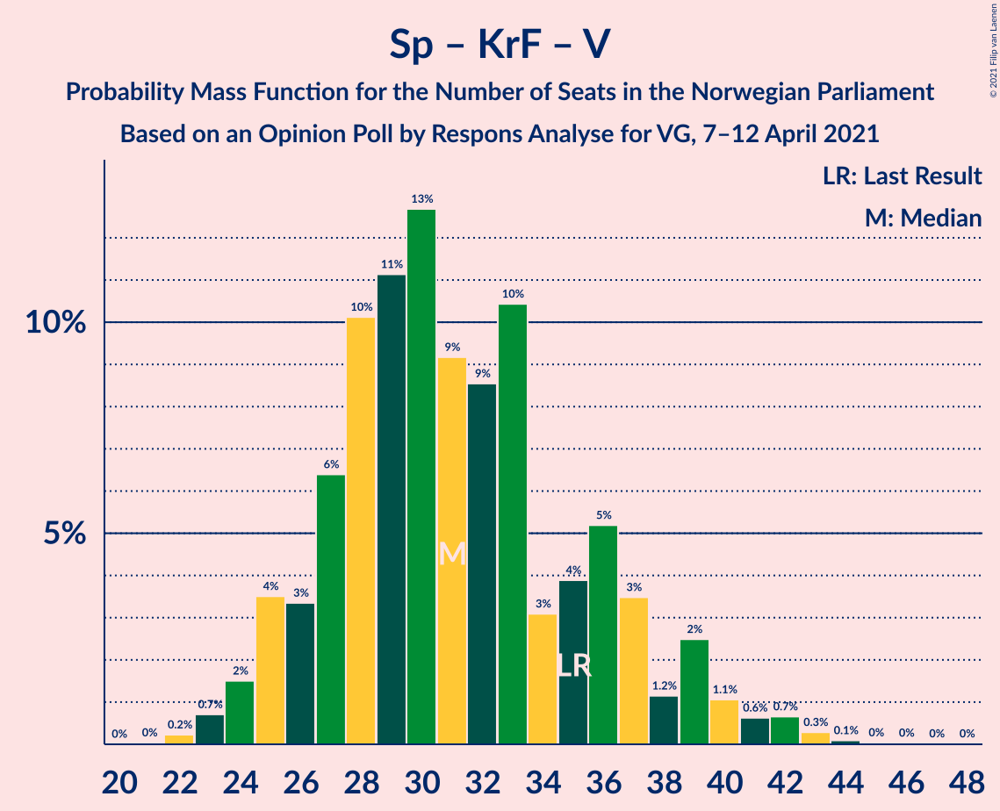

# Opinion Poll by Respons Analyse for VG, 7–12 April 2021

<a href="#voting-intentions">Voting Intentions</a> | <a href="#seats">Seats</a> | <a href="#coalitions">Coalitions</a> | <a href="#technical-information">Technical Information</a>

## Voting Intentions

### Confidence Intervals

| Party | Last Result | Poll Result | 80% Confidence Interval | 90% Confidence Interval | 95% Confidence Interval | 99% Confidence Interval |
|:-----:|:-----------:|:-----------:|:-----------------------:|:-----------------------:|:-----------------------:|:-----------------------:|
| Høyre | 25.0% | 26.5% | 24.5–28.7% |24.0–29.3% |23.5–29.8% |22.6–30.9% |
| Arbeiderpartiet | 27.4% | 25.3% | 23.4–27.5% |22.8–28.1% |22.3–28.6% |21.4–29.6% |
| Senterpartiet | 10.3% | 14.0% | 12.5–15.7% |12.1–16.2% |11.7–16.7% |11.0–17.5% |
| Fremskrittspartiet | 15.2% | 8.3% | 7.1–9.7% |6.8–10.1% |6.5–10.5% |6.0–11.2% |
| Sosialistisk Venstreparti | 6.0% | 7.7% | 6.6–9.1% |6.3–9.5% |6.0–9.9% |5.5–10.6% |
| Rødt | 2.4% | 4.8% | 3.9–6.0% |3.7–6.3% |3.5–6.6% |3.1–7.2% |
| Miljøpartiet De Grønne | 3.2% | 4.4% | 3.6–5.5% |3.3–5.8% |3.2–6.1% |2.8–6.7% |
| Venstre | 4.4% | 3.2% | 2.5–4.2% |2.3–4.5% |2.2–4.7% |1.9–5.2% |
| Kristelig Folkeparti | 4.2% | 3.2% | 2.5–4.2% |2.3–4.5% |2.2–4.7% |1.9–5.2% |

*Note:* The poll result column reflects the actual value used in the calculations. Published results may vary slightly, and in addition be rounded to fewer digits.

## Seats

### Confidence Intervals

| Party | Last Result | Median | 80% Confidence Interval | 90% Confidence Interval | 95% Confidence Interval | 99% Confidence Interval |
|:-----:|:-----------:|:------:|:-----------------------:|:-----------------------:|:-----------------------:|:-----------------------:|
| <a href="#høyre">Høyre</a> | 45 | 49 | 44–53 |42–54 |41–55 |39–57 |
| <a href="#arbeiderpartiet">Arbeiderpartiet</a> | 49 | 45 | 42–50 |42–51 |41–53 |39–56 |
| <a href="#senterpartiet">Senterpartiet</a> | 19 | 26 | 21–30 |20–31 |20–32 |19–35 |
| <a href="#fremskrittspartiet">Fremskrittspartiet</a> | 27 | 15 | 12–17 |12–18 |11–19 |10–20 |
| <a href="#sosialistisk-venstreparti">Sosialistisk Venstreparti</a> | 11 | 13 | 11–17 |11–18 |10–18 |10–20 |
| <a href="#rødt">Rødt</a> | 1 | 9 | 2–11 |2–11 |2–12 |2–13 |
| <a href="#miljøpartiet-de-grønne">Miljøpartiet De Grønne</a> | 1 | 8 | 2–10 |2–10 |1–11 |1–12 |
| <a href="#venstre">Venstre</a> | 8 | 2 | 1–7 |1–7 |1–8 |1–9 |
| <a href="#kristelig-folkeparti">Kristelig Folkeparti</a> | 8 | 1 | 1–7 |0–8 |0–8 |0–9 |

### Høyre

*For a full overview of the results for this party, see the [Høyre](party-høyre.html) page.*

| Number of Seats | Probability | Accumulated | Special Marks |
|:---------------:|:-----------:|:-----------:|:-------------:|
| 37 | 0.1% | 100% |  |
| 38 | 0.1% | 99.9% |  |
| 39 | 0.6% | 99.7% |  |
| 40 | 0.9% | 99.1% |  |
| 41 | 2% | 98% |  |
| 42 | 1.3% | 96% |  |
| 43 | 3% | 95% |  |
| 44 | 3% | 92% |  |
| 45 | 4% | 89% | Last Result |
| 46 | 12% | 84% |  |
| 47 | 11% | 72% |  |
| 48 | 9% | 61% |  |
| 49 | 10% | 52% | Median |
| 50 | 16% | 42% |  |
| 51 | 7% | 26% |  |
| 52 | 7% | 19% |  |
| 53 | 4% | 12% |  |
| 54 | 6% | 9% |  |
| 55 | 1.2% | 3% |  |
| 56 | 0.9% | 1.4% |  |
| 57 | 0.3% | 0.5% |  |
| 58 | 0.2% | 0.3% |  |
| 59 | 0.1% | 0.1% |  |
| 60 | 0% | 0% |  |

### Arbeiderpartiet

*For a full overview of the results for this party, see the [Arbeiderpartiet](party-arbeiderpartiet.html) page.*

| Number of Seats | Probability | Accumulated | Special Marks |
|:---------------:|:-----------:|:-----------:|:-------------:|
| 37 | 0.1% | 100% |  |
| 38 | 0.1% | 99.9% |  |
| 39 | 0.3% | 99.8% |  |
| 40 | 2% | 99.5% |  |
| 41 | 3% | 98% |  |
| 42 | 8% | 95% |  |
| 43 | 13% | 87% |  |
| 44 | 13% | 74% |  |
| 45 | 13% | 62% | Median |
| 46 | 10% | 48% |  |
| 47 | 12% | 38% |  |
| 48 | 8% | 26% |  |
| 49 | 8% | 19% | Last Result |
| 50 | 3% | 10% |  |
| 51 | 3% | 7% |  |
| 52 | 1.3% | 4% |  |
| 53 | 0.9% | 3% |  |
| 54 | 0.7% | 2% |  |
| 55 | 0.6% | 1.3% |  |
| 56 | 0.2% | 0.6% |  |
| 57 | 0.2% | 0.4% |  |
| 58 | 0.2% | 0.2% |  |
| 59 | 0% | 0% |  |

### Senterpartiet

*For a full overview of the results for this party, see the [Senterpartiet](party-senterpartiet.html) page.*

| Number of Seats | Probability | Accumulated | Special Marks |
|:---------------:|:-----------:|:-----------:|:-------------:|
| 18 | 0.3% | 100% |  |
| 19 | 2% | 99.7% | Last Result |
| 20 | 3% | 98% |  |
| 21 | 5% | 95% |  |
| 22 | 8% | 90% |  |
| 23 | 8% | 81% |  |
| 24 | 8% | 73% |  |
| 25 | 7% | 65% |  |
| 26 | 14% | 57% | Median |
| 27 | 15% | 43% |  |
| 28 | 8% | 28% |  |
| 29 | 6% | 20% |  |
| 30 | 8% | 15% |  |
| 31 | 4% | 7% |  |
| 32 | 1.1% | 3% |  |
| 33 | 0.6% | 2% |  |
| 34 | 0.5% | 1.0% |  |
| 35 | 0.5% | 0.5% |  |
| 36 | 0% | 0% |  |

### Fremskrittspartiet

*For a full overview of the results for this party, see the [Fremskrittspartiet](party-fremskrittspartiet.html) page.*

| Number of Seats | Probability | Accumulated | Special Marks |
|:---------------:|:-----------:|:-----------:|:-------------:|
| 9 | 0.2% | 100% |  |
| 10 | 1.2% | 99.8% |  |
| 11 | 3% | 98.6% |  |
| 12 | 9% | 96% |  |
| 13 | 15% | 86% |  |
| 14 | 15% | 71% |  |
| 15 | 22% | 56% | Median |
| 16 | 18% | 34% |  |
| 17 | 10% | 16% |  |
| 18 | 4% | 7% |  |
| 19 | 2% | 3% |  |
| 20 | 0.6% | 0.8% |  |
| 21 | 0.2% | 0.2% |  |
| 22 | 0.1% | 0.1% |  |
| 23 | 0% | 0% |  |
| 24 | 0% | 0% |  |
| 25 | 0% | 0% |  |
| 26 | 0% | 0% |  |
| 27 | 0% | 0% | Last Result |

### Sosialistisk Venstreparti

*For a full overview of the results for this party, see the [Sosialistisk Venstreparti](party-sosialistiskvenstreparti.html) page.*

| Number of Seats | Probability | Accumulated | Special Marks |
|:---------------:|:-----------:|:-----------:|:-------------:|
| 9 | 0.4% | 100% |  |
| 10 | 3% | 99.6% |  |
| 11 | 11% | 97% | Last Result |
| 12 | 19% | 86% |  |
| 13 | 27% | 67% | Median |
| 14 | 15% | 40% |  |
| 15 | 9% | 26% |  |
| 16 | 5% | 17% |  |
| 17 | 7% | 12% |  |
| 18 | 3% | 5% |  |
| 19 | 2% | 2% |  |
| 20 | 0.4% | 0.5% |  |
| 21 | 0.1% | 0.1% |  |
| 22 | 0% | 0% |  |

### Rødt

*For a full overview of the results for this party, see the [Rødt](party-rødt.html) page.*

| Number of Seats | Probability | Accumulated | Special Marks |
|:---------------:|:-----------:|:-----------:|:-------------:|
| 1 | 0.2% | 100% | Last Result |
| 2 | 11% | 99.8% |  |
| 3 | 0% | 89% |  |
| 4 | 0% | 89% |  |
| 5 | 0% | 89% |  |
| 6 | 1.4% | 89% |  |
| 7 | 14% | 88% |  |
| 8 | 22% | 74% |  |
| 9 | 25% | 52% | Median |
| 10 | 17% | 27% |  |
| 11 | 8% | 11% |  |
| 12 | 2% | 3% |  |
| 13 | 0.7% | 0.9% |  |
| 14 | 0.2% | 0.2% |  |
| 15 | 0% | 0% |  |

### Miljøpartiet De Grønne

*For a full overview of the results for this party, see the [Miljøpartiet De Grønne](party-miljøpartietdegrønne.html) page.*

| Number of Seats | Probability | Accumulated | Special Marks |
|:---------------:|:-----------:|:-----------:|:-------------:|
| 1 | 3% | 100% | Last Result |
| 2 | 15% | 97% |  |
| 3 | 3% | 82% |  |
| 4 | 1.1% | 79% |  |
| 5 | 0% | 78% |  |
| 6 | 1.1% | 78% |  |
| 7 | 10% | 77% |  |
| 8 | 27% | 67% | Median |
| 9 | 28% | 41% |  |
| 10 | 10% | 13% |  |
| 11 | 2% | 3% |  |
| 12 | 0.8% | 0.9% |  |
| 13 | 0.1% | 0.1% |  |
| 14 | 0% | 0% |  |

### Venstre

*For a full overview of the results for this party, see the [Venstre](party-venstre.html) page.*

| Number of Seats | Probability | Accumulated | Special Marks |
|:---------------:|:-----------:|:-----------:|:-------------:|
| 0 | 0.1% | 100% |  |
| 1 | 16% | 99.9% |  |
| 2 | 62% | 84% | Median |
| 3 | 1.2% | 22% |  |
| 4 | 0% | 20% |  |
| 5 | 0% | 20% |  |
| 6 | 1.2% | 20% |  |
| 7 | 15% | 19% |  |
| 8 | 2% | 4% | Last Result |
| 9 | 2% | 2% |  |
| 10 | 0.1% | 0.1% |  |
| 11 | 0% | 0% |  |

### Kristelig Folkeparti

*For a full overview of the results for this party, see the [Kristelig Folkeparti](party-kristeligfolkeparti.html) page.*

| Number of Seats | Probability | Accumulated | Special Marks |
|:---------------:|:-----------:|:-----------:|:-------------:|
| 0 | 10% | 100% |  |
| 1 | 41% | 90% | Median |
| 2 | 11% | 50% |  |
| 3 | 24% | 39% |  |
| 4 | 0% | 14% |  |
| 5 | 0% | 14% |  |
| 6 | 2% | 14% |  |
| 7 | 5% | 12% |  |
| 8 | 5% | 7% | Last Result |
| 9 | 1.4% | 2% |  |
| 10 | 0.2% | 0.2% |  |
| 11 | 0% | 0% |  |

## Coalitions

### Confidence Intervals

| Coalition | Last Result | Median | Majority? | 80% Confidence Interval | 90% Confidence Interval | 95% Confidence Interval | 99% Confidence Interval |
|:---------:|:-----------:|:------:|:---------:|:-----------------------:|:-----------------------:|:-----------------------:|:-----------------------:|
| Arbeiderpartiet – Senterpartiet – Sosialistisk Venstreparti – Rødt – Miljøpartiet De Grønne | 81 | 101 | 100% | 95–105 | 92–106 | 91–108 | 88–111 |
| Arbeiderpartiet – Senterpartiet – Sosialistisk Venstreparti – Miljøpartiet De Grønne – Kristelig Folkeparti | 88 | 94 | 99.3% | 90–99 | 89–102 | 88–104 | 84–107 |
| Høyre – Senterpartiet – Fremskrittspartiet – Kristelig Folkeparti – Venstre | 107 | 94 | 98.9% | 90–99 | 88–101 | 87–102 | 83–105 |
| Arbeiderpartiet – Senterpartiet – Sosialistisk Venstreparti – Rødt | 80 | 94 | 98% | 87–99 | 86–100 | 85–101 | 82–105 |
| Arbeiderpartiet – Senterpartiet – Sosialistisk Venstreparti – Miljøpartiet De Grønne | 80 | 93 | 96% | 87–96 | 85–98 | 83–100 | 80–104 |
| Arbeiderpartiet – Senterpartiet – Sosialistisk Venstreparti | 79 | 85 | 58% | 80–90 | 79–91 | 77–93 | 75–96 |
| Arbeiderpartiet – Senterpartiet – Miljøpartiet De Grønne – Kristelig Folkeparti | 77 | 81 | 16% | 76–86 | 74–89 | 73–91 | 71–95 |
| Arbeiderpartiet – Senterpartiet – Kristelig Folkeparti | 76 | 74 | 3% | 70–78 | 69–83 | 68–85 | 65–88 |
| Høyre – Fremskrittspartiet – Miljøpartiet De Grønne – Kristelig Folkeparti – Venstre | 89 | 75 | 2% | 70–82 | 69–83 | 68–84 | 64–86 |
| Arbeiderpartiet – Senterpartiet | 68 | 72 | 0.1% | 67–76 | 66–77 | 65–80 | 63–83 |
| Høyre – Fremskrittspartiet – Kristelig Folkeparti – Venstre | 88 | 68 | 0% | 64–74 | 63–76 | 61–78 | 57–80 |
| Høyre – Fremskrittspartiet – Venstre | 80 | 66 | 0% | 61–71 | 59–72 | 58–73 | 55–77 |
| Høyre – Fremskrittspartiet | 72 | 63 | 0% | 59–68 | 56–69 | 55–70 | 53–72 |
| Arbeiderpartiet – Sosialistisk Venstreparti | 60 | 59 | 0% | 55–64 | 55–66 | 54–67 | 52–70 |
| Høyre – Kristelig Folkeparti – Venstre | 61 | 53 | 0% | 49–60 | 47–62 | 46–63 | 44–66 |
| Senterpartiet – Kristelig Folkeparti – Venstre | 35 | 31 | 0% | 27–36 | 25–39 | 25–40 | 23–43 |

### Arbeiderpartiet – Senterpartiet – Sosialistisk Venstreparti – Rødt – Miljøpartiet De Grønne

| Number of Seats | Probability | Accumulated | Special Marks |
|:---------------:|:-----------:|:-----------:|:-------------:|
| 81 | 0% | 100% | Last Result |
| 82 | 0% | 100% |  |
| 83 | 0% | 100% |  |
| 84 | 0% | 100% |  |
| 85 | 0% | 100% | Majority |
| 86 | 0.1% | 99.9% |  |
| 87 | 0.3% | 99.8% |  |
| 88 | 0.2% | 99.5% |  |
| 89 | 0.7% | 99.4% |  |
| 90 | 1.1% | 98.6% |  |
| 91 | 1.0% | 98% |  |
| 92 | 2% | 96% |  |
| 93 | 2% | 95% |  |
| 94 | 3% | 93% |  |
| 95 | 4% | 90% |  |
| 96 | 6% | 86% |  |
| 97 | 5% | 80% |  |
| 98 | 7% | 76% |  |
| 99 | 5% | 69% |  |
| 100 | 7% | 64% |  |
| 101 | 10% | 57% | Median |
| 102 | 14% | 47% |  |
| 103 | 9% | 32% |  |
| 104 | 10% | 23% |  |
| 105 | 6% | 13% |  |
| 106 | 2% | 6% |  |
| 107 | 1.4% | 4% |  |
| 108 | 1.2% | 3% |  |
| 109 | 0.6% | 2% |  |
| 110 | 0.3% | 1.1% |  |
| 111 | 0.3% | 0.8% |  |
| 112 | 0.3% | 0.5% |  |
| 113 | 0.1% | 0.2% |  |
| 114 | 0% | 0.1% |  |
| 115 | 0% | 0% |  |

### Arbeiderpartiet – Senterpartiet – Sosialistisk Venstreparti – Miljøpartiet De Grønne – Kristelig Folkeparti

| Number of Seats | Probability | Accumulated | Special Marks |
|:---------------:|:-----------:|:-----------:|:-------------:|
| 81 | 0.1% | 100% |  |
| 82 | 0.1% | 99.8% |  |
| 83 | 0.1% | 99.7% |  |
| 84 | 0.4% | 99.6% |  |
| 85 | 0.3% | 99.3% | Majority |
| 86 | 0.4% | 99.0% |  |
| 87 | 0.8% | 98.5% |  |
| 88 | 2% | 98% | Last Result |
| 89 | 3% | 96% |  |
| 90 | 5% | 93% |  |
| 91 | 9% | 88% |  |
| 92 | 5% | 79% |  |
| 93 | 6% | 74% | Median |
| 94 | 19% | 68% |  |
| 95 | 10% | 49% |  |
| 96 | 18% | 39% |  |
| 97 | 4% | 21% |  |
| 98 | 3% | 17% |  |
| 99 | 4% | 14% |  |
| 100 | 2% | 9% |  |
| 101 | 2% | 7% |  |
| 102 | 0.8% | 6% |  |
| 103 | 2% | 5% |  |
| 104 | 0.9% | 3% |  |
| 105 | 0.6% | 2% |  |
| 106 | 0.4% | 1.1% |  |
| 107 | 0.5% | 0.8% |  |
| 108 | 0.2% | 0.3% |  |
| 109 | 0.1% | 0.1% |  |
| 110 | 0% | 0% |  |

### Høyre – Senterpartiet – Fremskrittspartiet – Kristelig Folkeparti – Venstre

| Number of Seats | Probability | Accumulated | Special Marks |
|:---------------:|:-----------:|:-----------:|:-------------:|
| 80 | 0.1% | 100% |  |
| 81 | 0.1% | 99.9% |  |
| 82 | 0.2% | 99.9% |  |
| 83 | 0.3% | 99.7% |  |
| 84 | 0.5% | 99.4% |  |
| 85 | 0.4% | 98.9% | Majority |
| 86 | 0.8% | 98% |  |
| 87 | 2% | 98% |  |
| 88 | 2% | 96% |  |
| 89 | 2% | 93% |  |
| 90 | 4% | 91% |  |
| 91 | 10% | 87% |  |
| 92 | 13% | 77% |  |
| 93 | 4% | 64% | Median |
| 94 | 12% | 60% |  |
| 95 | 13% | 49% |  |
| 96 | 9% | 35% |  |
| 97 | 8% | 27% |  |
| 98 | 7% | 19% |  |
| 99 | 4% | 12% |  |
| 100 | 3% | 9% |  |
| 101 | 2% | 6% |  |
| 102 | 2% | 4% |  |
| 103 | 0.9% | 2% |  |
| 104 | 0.6% | 1.2% |  |
| 105 | 0.3% | 0.6% |  |
| 106 | 0.1% | 0.3% |  |
| 107 | 0.1% | 0.2% | Last Result |
| 108 | 0.1% | 0.1% |  |
| 109 | 0% | 0% |  |

### Arbeiderpartiet – Senterpartiet – Sosialistisk Venstreparti – Rødt

| Number of Seats | Probability | Accumulated | Special Marks |
|:---------------:|:-----------:|:-----------:|:-------------:|
| 80 | 0.1% | 100% | Last Result |
| 81 | 0.1% | 99.9% |  |
| 82 | 0.4% | 99.7% |  |
| 83 | 0.5% | 99.3% |  |
| 84 | 1.2% | 98.8% |  |
| 85 | 2% | 98% | Majority |
| 86 | 2% | 96% |  |
| 87 | 6% | 94% |  |
| 88 | 4% | 88% |  |
| 89 | 4% | 84% |  |
| 90 | 4% | 80% |  |
| 91 | 5% | 75% |  |
| 92 | 8% | 70% |  |
| 93 | 9% | 62% | Median |
| 94 | 14% | 53% |  |
| 95 | 14% | 38% |  |
| 96 | 6% | 24% |  |
| 97 | 5% | 19% |  |
| 98 | 4% | 14% |  |
| 99 | 4% | 10% |  |
| 100 | 2% | 6% |  |
| 101 | 2% | 4% |  |
| 102 | 0.7% | 2% |  |
| 103 | 0.5% | 1.3% |  |
| 104 | 0.3% | 0.8% |  |
| 105 | 0.2% | 0.6% |  |
| 106 | 0.2% | 0.4% |  |
| 107 | 0% | 0.1% |  |
| 108 | 0.1% | 0.1% |  |
| 109 | 0% | 0% |  |

### Arbeiderpartiet – Senterpartiet – Sosialistisk Venstreparti – Miljøpartiet De Grønne

| Number of Seats | Probability | Accumulated | Special Marks |
|:---------------:|:-----------:|:-----------:|:-------------:|
| 78 | 0% | 100% |  |
| 79 | 0.2% | 99.9% |  |
| 80 | 0.5% | 99.8% | Last Result |
| 81 | 0.6% | 99.2% |  |
| 82 | 0.9% | 98.7% |  |
| 83 | 0.7% | 98% |  |
| 84 | 1.1% | 97% |  |
| 85 | 2% | 96% | Majority |
| 86 | 2% | 94% |  |
| 87 | 4% | 93% |  |
| 88 | 8% | 89% |  |
| 89 | 4% | 81% |  |
| 90 | 6% | 77% |  |
| 91 | 7% | 71% |  |
| 92 | 9% | 63% | Median |
| 93 | 13% | 54% |  |
| 94 | 12% | 40% |  |
| 95 | 14% | 29% |  |
| 96 | 5% | 15% |  |
| 97 | 3% | 9% |  |
| 98 | 2% | 7% |  |
| 99 | 2% | 4% |  |
| 100 | 0.7% | 3% |  |
| 101 | 0.4% | 2% |  |
| 102 | 0.7% | 2% |  |
| 103 | 0.3% | 0.9% |  |
| 104 | 0.3% | 0.6% |  |
| 105 | 0.2% | 0.3% |  |
| 106 | 0.1% | 0.1% |  |
| 107 | 0% | 0% |  |

### Arbeiderpartiet – Senterpartiet – Sosialistisk Venstreparti

| Number of Seats | Probability | Accumulated | Special Marks |
|:---------------:|:-----------:|:-----------:|:-------------:|
| 73 | 0% | 100% |  |
| 74 | 0.2% | 99.9% |  |
| 75 | 0.6% | 99.8% |  |
| 76 | 0.6% | 99.2% |  |
| 77 | 1.1% | 98.6% |  |
| 78 | 2% | 97% |  |
| 79 | 3% | 96% | Last Result |
| 80 | 6% | 93% |  |
| 81 | 3% | 86% |  |
| 82 | 5% | 84% |  |
| 83 | 7% | 79% |  |
| 84 | 14% | 72% | Median |
| 85 | 17% | 58% | Majority |
| 86 | 10% | 41% |  |
| 87 | 8% | 32% |  |
| 88 | 4% | 23% |  |
| 89 | 8% | 19% |  |
| 90 | 4% | 11% |  |
| 91 | 2% | 6% |  |
| 92 | 1.1% | 4% |  |
| 93 | 0.6% | 3% |  |
| 94 | 0.7% | 2% |  |
| 95 | 0.4% | 1.4% |  |
| 96 | 0.5% | 0.9% |  |
| 97 | 0.2% | 0.5% |  |
| 98 | 0.1% | 0.3% |  |
| 99 | 0.1% | 0.2% |  |
| 100 | 0.1% | 0.1% |  |
| 101 | 0% | 0% |  |

### Arbeiderpartiet – Senterpartiet – Miljøpartiet De Grønne – Kristelig Folkeparti

| Number of Seats | Probability | Accumulated | Special Marks |
|:---------------:|:-----------:|:-----------:|:-------------:|
| 67 | 0% | 100% |  |
| 68 | 0% | 99.9% |  |
| 69 | 0.1% | 99.9% |  |
| 70 | 0.2% | 99.8% |  |
| 71 | 0.4% | 99.6% |  |
| 72 | 0.6% | 99.2% |  |
| 73 | 2% | 98.6% |  |
| 74 | 1.5% | 96% |  |
| 75 | 4% | 95% |  |
| 76 | 4% | 91% |  |
| 77 | 7% | 87% | Last Result |
| 78 | 7% | 81% |  |
| 79 | 7% | 73% |  |
| 80 | 9% | 67% | Median |
| 81 | 8% | 57% |  |
| 82 | 12% | 49% |  |
| 83 | 17% | 37% |  |
| 84 | 4% | 20% |  |
| 85 | 6% | 16% | Majority |
| 86 | 3% | 11% |  |
| 87 | 1.3% | 8% |  |
| 88 | 1.0% | 7% |  |
| 89 | 1.3% | 6% |  |
| 90 | 2% | 5% |  |
| 91 | 0.8% | 3% |  |
| 92 | 0.6% | 2% |  |
| 93 | 0.3% | 1.1% |  |
| 94 | 0.3% | 0.8% |  |
| 95 | 0.1% | 0.5% |  |
| 96 | 0.3% | 0.4% |  |
| 97 | 0% | 0.1% |  |
| 98 | 0% | 0% |  |

### Arbeiderpartiet – Senterpartiet – Kristelig Folkeparti

| Number of Seats | Probability | Accumulated | Special Marks |
|:---------------:|:-----------:|:-----------:|:-------------:|
| 62 | 0.1% | 100% |  |
| 63 | 0.1% | 99.9% |  |
| 64 | 0.2% | 99.8% |  |
| 65 | 0.4% | 99.6% |  |
| 66 | 0.5% | 99.2% |  |
| 67 | 0.6% | 98.7% |  |
| 68 | 3% | 98% |  |
| 69 | 5% | 95% |  |
| 70 | 5% | 91% |  |
| 71 | 7% | 86% |  |
| 72 | 14% | 78% | Median |
| 73 | 13% | 65% |  |
| 74 | 19% | 52% |  |
| 75 | 8% | 33% |  |
| 76 | 8% | 25% | Last Result |
| 77 | 4% | 17% |  |
| 78 | 3% | 12% |  |
| 79 | 1.0% | 9% |  |
| 80 | 1.1% | 9% |  |
| 81 | 0.9% | 7% |  |
| 82 | 1.2% | 6% |  |
| 83 | 2% | 5% |  |
| 84 | 0.7% | 3% |  |
| 85 | 1.4% | 3% | Majority |
| 86 | 0.2% | 1.3% |  |
| 87 | 0.5% | 1.0% |  |
| 88 | 0.2% | 0.5% |  |
| 89 | 0.3% | 0.3% |  |
| 90 | 0% | 0.1% |  |
| 91 | 0% | 0% |  |

### Høyre – Fremskrittspartiet – Miljøpartiet De Grønne – Kristelig Folkeparti – Venstre

| Number of Seats | Probability | Accumulated | Special Marks |
|:---------------:|:-----------:|:-----------:|:-------------:|
| 61 | 0.1% | 100% |  |
| 62 | 0% | 99.9% |  |
| 63 | 0.2% | 99.8% |  |
| 64 | 0.3% | 99.6% |  |
| 65 | 0.3% | 99.3% |  |
| 66 | 0.6% | 99.0% |  |
| 67 | 0.8% | 98% |  |
| 68 | 2% | 98% |  |
| 69 | 2% | 95% |  |
| 70 | 4% | 93% |  |
| 71 | 4% | 89% |  |
| 72 | 5% | 85% |  |
| 73 | 6% | 80% |  |
| 74 | 14% | 75% |  |
| 75 | 14% | 61% | Median |
| 76 | 9% | 46% |  |
| 77 | 8% | 37% |  |
| 78 | 5% | 29% |  |
| 79 | 4% | 24% |  |
| 80 | 4% | 20% |  |
| 81 | 4% | 15% |  |
| 82 | 6% | 11% |  |
| 83 | 2% | 5% |  |
| 84 | 2% | 4% |  |
| 85 | 1.1% | 2% | Majority |
| 86 | 0.3% | 0.8% |  |
| 87 | 0.3% | 0.5% |  |
| 88 | 0.1% | 0.2% |  |
| 89 | 0% | 0.1% | Last Result |
| 90 | 0% | 0% |  |

### Arbeiderpartiet – Senterpartiet

| Number of Seats | Probability | Accumulated | Special Marks |
|:---------------:|:-----------:|:-----------:|:-------------:|
| 60 | 0% | 100% |  |
| 61 | 0.1% | 99.9% |  |
| 62 | 0.1% | 99.8% |  |
| 63 | 0.4% | 99.7% |  |
| 64 | 0.9% | 99.3% |  |
| 65 | 3% | 98% |  |
| 66 | 5% | 96% |  |
| 67 | 7% | 90% |  |
| 68 | 4% | 83% | Last Result |
| 69 | 8% | 80% |  |
| 70 | 5% | 72% |  |
| 71 | 16% | 67% | Median |
| 72 | 10% | 51% |  |
| 73 | 19% | 41% |  |
| 74 | 4% | 22% |  |
| 75 | 6% | 18% |  |
| 76 | 4% | 12% |  |
| 77 | 3% | 8% |  |
| 78 | 1.0% | 5% |  |
| 79 | 1.2% | 4% |  |
| 80 | 0.6% | 3% |  |
| 81 | 1.0% | 2% |  |
| 82 | 0.4% | 0.9% |  |
| 83 | 0.3% | 0.5% |  |
| 84 | 0.1% | 0.2% |  |
| 85 | 0.1% | 0.1% | Majority |
| 86 | 0% | 0% |  |

### Høyre – Fremskrittspartiet – Kristelig Folkeparti – Venstre

| Number of Seats | Probability | Accumulated | Special Marks |
|:---------------:|:-----------:|:-----------:|:-------------:|
| 55 | 0% | 100% |  |
| 56 | 0.1% | 99.9% |  |
| 57 | 0.3% | 99.8% |  |
| 58 | 0.4% | 99.5% |  |
| 59 | 0.4% | 99.1% |  |
| 60 | 0.8% | 98.7% |  |
| 61 | 1.3% | 98% |  |
| 62 | 2% | 97% |  |
| 63 | 2% | 95% |  |
| 64 | 6% | 93% |  |
| 65 | 10% | 86% |  |
| 66 | 9% | 76% |  |
| 67 | 14% | 67% | Median |
| 68 | 10% | 53% |  |
| 69 | 7% | 42% |  |
| 70 | 5% | 36% |  |
| 71 | 7% | 30% |  |
| 72 | 5% | 24% |  |
| 73 | 6% | 19% |  |
| 74 | 4% | 13% |  |
| 75 | 3% | 9% |  |
| 76 | 1.4% | 6% |  |
| 77 | 1.3% | 4% |  |
| 78 | 0.9% | 3% |  |
| 79 | 1.0% | 2% |  |
| 80 | 0.5% | 1.0% |  |
| 81 | 0.2% | 0.5% |  |
| 82 | 0.2% | 0.3% |  |
| 83 | 0.1% | 0.1% |  |
| 84 | 0% | 0.1% |  |
| 85 | 0% | 0% | Majority |
| 86 | 0% | 0% |  |
| 87 | 0% | 0% |  |
| 88 | 0% | 0% | Last Result |

### Høyre – Fremskrittspartiet – Venstre

| Number of Seats | Probability | Accumulated | Special Marks |
|:---------------:|:-----------:|:-----------:|:-------------:|
| 52 | 0% | 100% |  |
| 53 | 0.1% | 99.9% |  |
| 54 | 0.1% | 99.9% |  |
| 55 | 0.5% | 99.8% |  |
| 56 | 0.7% | 99.3% |  |
| 57 | 0.8% | 98.6% |  |
| 58 | 2% | 98% |  |
| 59 | 1.3% | 96% |  |
| 60 | 2% | 95% |  |
| 61 | 3% | 93% |  |
| 62 | 4% | 90% |  |
| 63 | 7% | 85% |  |
| 64 | 12% | 78% |  |
| 65 | 11% | 67% |  |
| 66 | 12% | 56% | Median |
| 67 | 9% | 44% |  |
| 68 | 8% | 36% |  |
| 69 | 8% | 27% |  |
| 70 | 8% | 20% |  |
| 71 | 4% | 11% |  |
| 72 | 4% | 7% |  |
| 73 | 2% | 4% |  |
| 74 | 0.8% | 2% |  |
| 75 | 0.3% | 1.4% |  |
| 76 | 0.4% | 1.1% |  |
| 77 | 0.4% | 0.7% |  |
| 78 | 0.1% | 0.2% |  |
| 79 | 0.1% | 0.1% |  |
| 80 | 0% | 0% | Last Result |

### Høyre – Fremskrittspartiet

| Number of Seats | Probability | Accumulated | Special Marks |
|:---------------:|:-----------:|:-----------:|:-------------:|
| 50 | 0.1% | 100% |  |
| 51 | 0.1% | 99.9% |  |
| 52 | 0.2% | 99.7% |  |
| 53 | 0.7% | 99.5% |  |
| 54 | 0.9% | 98.9% |  |
| 55 | 1.2% | 98% |  |
| 56 | 2% | 97% |  |
| 57 | 2% | 94% |  |
| 58 | 2% | 93% |  |
| 59 | 3% | 90% |  |
| 60 | 6% | 87% |  |
| 61 | 8% | 81% |  |
| 62 | 13% | 73% |  |
| 63 | 13% | 60% |  |
| 64 | 15% | 47% | Median |
| 65 | 7% | 32% |  |
| 66 | 8% | 25% |  |
| 67 | 5% | 17% |  |
| 68 | 6% | 12% |  |
| 69 | 2% | 6% |  |
| 70 | 2% | 4% |  |
| 71 | 1.2% | 2% |  |
| 72 | 0.3% | 0.7% | Last Result |
| 73 | 0.1% | 0.4% |  |
| 74 | 0.1% | 0.3% |  |
| 75 | 0.1% | 0.1% |  |
| 76 | 0% | 0.1% |  |
| 77 | 0% | 0% |  |

### Arbeiderpartiet – Sosialistisk Venstreparti

| Number of Seats | Probability | Accumulated | Special Marks |
|:---------------:|:-----------:|:-----------:|:-------------:|
| 50 | 0.1% | 100% |  |
| 51 | 0.3% | 99.9% |  |
| 52 | 0.5% | 99.6% |  |
| 53 | 2% | 99.1% |  |
| 54 | 2% | 98% |  |
| 55 | 8% | 96% |  |
| 56 | 14% | 88% |  |
| 57 | 7% | 74% |  |
| 58 | 11% | 67% | Median |
| 59 | 14% | 56% |  |
| 60 | 7% | 42% | Last Result |
| 61 | 9% | 35% |  |
| 62 | 9% | 26% |  |
| 63 | 5% | 17% |  |
| 64 | 3% | 11% |  |
| 65 | 3% | 9% |  |
| 66 | 2% | 5% |  |
| 67 | 0.9% | 3% |  |
| 68 | 1.1% | 2% |  |
| 69 | 0.5% | 1.0% |  |
| 70 | 0.2% | 0.6% |  |
| 71 | 0.2% | 0.4% |  |
| 72 | 0.1% | 0.2% |  |
| 73 | 0.1% | 0.1% |  |
| 74 | 0% | 0% |  |

### Høyre – Kristelig Folkeparti – Venstre

| Number of Seats | Probability | Accumulated | Special Marks |
|:---------------:|:-----------:|:-----------:|:-------------:|
| 42 | 0.1% | 100% |  |
| 43 | 0.2% | 99.9% |  |
| 44 | 0.4% | 99.7% |  |
| 45 | 0.6% | 99.2% |  |
| 46 | 1.4% | 98.7% |  |
| 47 | 3% | 97% |  |
| 48 | 2% | 95% |  |
| 49 | 11% | 93% |  |
| 50 | 7% | 82% |  |
| 51 | 6% | 76% |  |
| 52 | 13% | 70% | Median |
| 53 | 10% | 57% |  |
| 54 | 7% | 47% |  |
| 55 | 6% | 40% |  |
| 56 | 8% | 34% |  |
| 57 | 8% | 26% |  |
| 58 | 4% | 18% |  |
| 59 | 2% | 14% |  |
| 60 | 4% | 12% |  |
| 61 | 2% | 8% | Last Result |
| 62 | 2% | 7% |  |
| 63 | 2% | 5% |  |
| 64 | 0.7% | 2% |  |
| 65 | 0.8% | 1.5% |  |
| 66 | 0.4% | 0.7% |  |
| 67 | 0.1% | 0.3% |  |
| 68 | 0.2% | 0.3% |  |
| 69 | 0.1% | 0.1% |  |
| 70 | 0% | 0% |  |

### Senterpartiet – Kristelig Folkeparti – Venstre

| Number of Seats | Probability | Accumulated | Special Marks |
|:---------------:|:-----------:|:-----------:|:-------------:|
| 21 | 0% | 100% |  |
| 22 | 0.2% | 99.9% |  |
| 23 | 0.7% | 99.7% |  |
| 24 | 2% | 99.0% |  |
| 25 | 4% | 98% |  |
| 26 | 3% | 94% |  |
| 27 | 6% | 91% |  |
| 28 | 10% | 84% |  |
| 29 | 11% | 74% | Median |
| 30 | 13% | 63% |  |
| 31 | 9% | 50% |  |
| 32 | 9% | 41% |  |
| 33 | 10% | 33% |  |
| 34 | 3% | 22% |  |
| 35 | 4% | 19% | Last Result |
| 36 | 5% | 15% |  |
| 37 | 3% | 10% |  |
| 38 | 1.2% | 6% |  |
| 39 | 2% | 5% |  |
| 40 | 1.1% | 3% |  |
| 41 | 0.6% | 2% |  |
| 42 | 0.7% | 1.2% |  |
| 43 | 0.3% | 0.5% |  |
| 44 | 0.1% | 0.2% |  |
| 45 | 0% | 0.1% |  |
| 46 | 0% | 0.1% |  |
| 47 | 0% | 0% |  |

## Technical Information

### Opinion Poll

+ **Polling firm:** Respons Analyse
+ **Commissioner(s):** VG
+ **Fieldwork period:** 7–12 April 2021

### Calculations

+ **Sample size:** 750
+ **Simulations done:** 1,048,576
+ **Error estimate:** 1.22%

